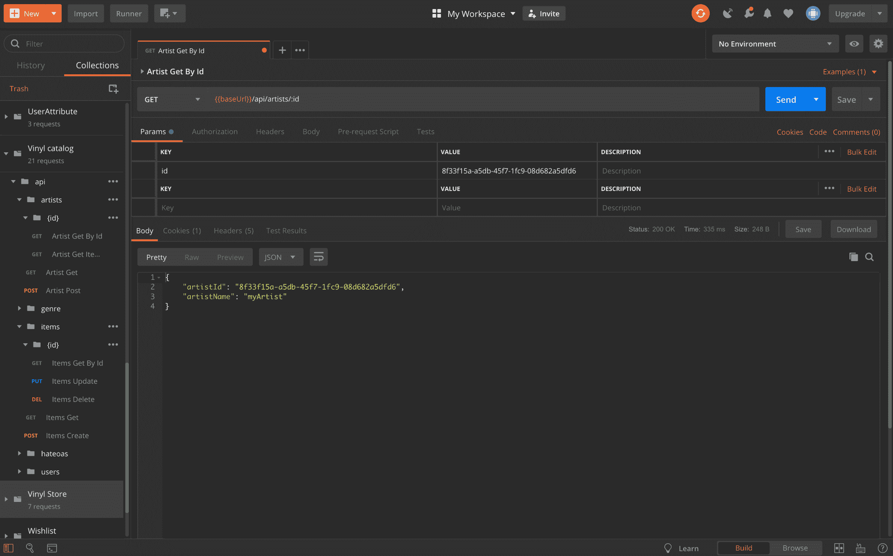
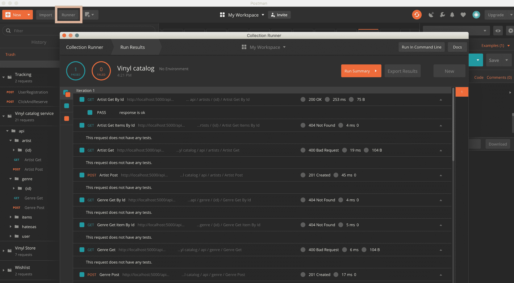
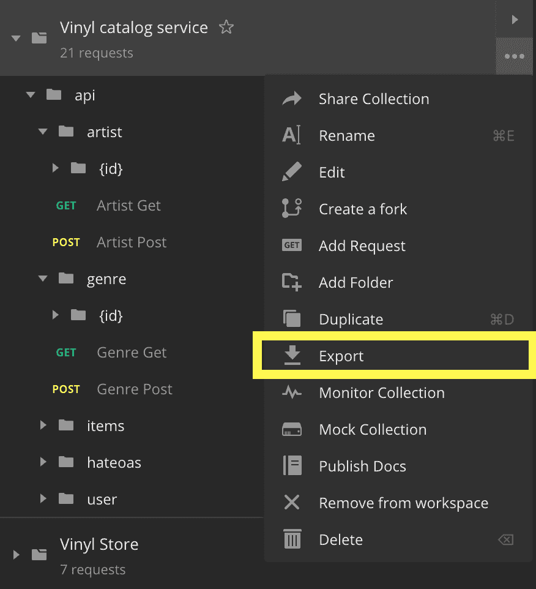
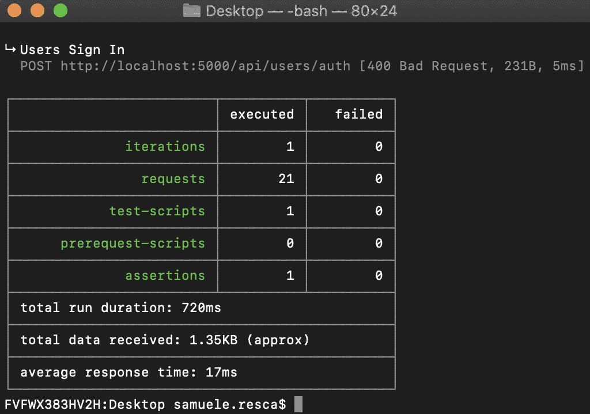

# 第二十章：使用 Postman 测试服务

Postman 是我们可用于查询 API 的最强大的工具之一，主要面向开发者和企业团队。在本章中，我们将介绍 Postman 并展示如何使用此工具测试和监控 Web 服务。Postman 被描述为以 API 为首的解决方案，拥有行业唯一的完整 API 开发环境。接下来，我们将学习如何使用 Postman 调用通用 HTTP API。然后，我们将学习如何将上一章中生成的 OpenAPI 规范导入 Postman，以自动生成在目录服务中实现的 API 调用。

在本章中，我们将涵盖以下主题：

+   Postman 概述

+   使用 OpenAPI 导入集合

在本章结束时，你将学会如何使用 Postman 通过 Postman UI 和自动化测试工具来测试和验证 API 响应。

# Postman 概述

Postman 可以在公司内部使用，用于共享内部 API，并应用集合的概念，以便它可以对相关服务或服务集合进行分组、索引和查询。集合是一组与同一服务或服务集合相关的 HTTP 调用。

以下截图显示了 Postman 的传统 UI。在左侧，你可以看到 Postman 账户中可用的 *集合* 列表，而在右侧，你可以看到 UI 的核心部分：



UI 的前半部分代表我们打算发起的 HTTP 请求。界面上方的每个标签页代表一个 API 调用；可以在左侧输入 URL 并指定 HTTP 动词。对于每个请求，还可以指定查询参数、授权规范、头部、正文以及在我们每次请求前后要执行的脚本。

在这里，请求使用 `{{baseUrl}}/api/artists/:id` URL 并传递 `id:<guid_value>`。需要注意的是，在 Postman 中，可以指定环境变量，这些变量可以用于参数化我们的 API 查询。在这种情况下，`{{baseUrl}}` 占位符被替换为集合中指定的值。可以通过单击集合名称旁边的三个点、选择编辑并导航到变量选项卡来查看集合变量：


Postman 界面的第二部分专注于请求的响应。主要部分包含 API 的 JSON 响应：


在右侧，我们有响应的状态、响应时间和响应大小。此外，还可以切换响应的格式，使其为 JSON、HTML 或纯文本。响应部分还提供了有关头部、Cookies 和测试结果的详细信息。

在下一节中，我们将学习如何使用 Postman 的工具自动测试我们的 API。

# 使用 Postman 测试 API

Postman 还为我们提供了一个有用的工具/框架，我们可以用它来自动测试我们的 API。测试运行时基于 Node.js；因此，我们应该使用 JavaScript 编写测试断言。Postman 的测试框架使用以下工作流程来测试我们的代码：


对于集合中的每个请求，脚本将按以下方式执行：

+   在集合中的每个请求之前都会运行一个预请求脚本。这被认为是测试用例的设置部分。

+   在集合中的每个请求之后都会运行一个测试脚本；这是我们的测试的核心部分。此外，它还提供了我们测试的核心断言。

让我们使用这个程序来实现我们 API 的简单测试：

```cs
pm.test("response is ok", function () {
    pm.response.to.have.status(200);
});
```

如您所见，测试使用 `pm` 全局对象来描述一个测试，并添加一个回调函数来进行一些断言。在这种情况下，它检查 API 是否具有 `200` OK 状态。以下实现可以通过在请求的测试标签页中输入前面的代码来添加到请求中，如下面的屏幕截图所示：


之后，我们将在 Postman 的响应部分检查结果：


前一个屏幕截图中所显示的测试结果部分包含四个不同的子标签页，所有这些标签页都将测试按结果分组。如果发生错误，UI 将提供错误详情。

# 使用运行器测试 API

Postman 团队构建了一个运行器工具，可以自动测试和运行您的 API，这样您就可以——字面意义上——坐下来观看您的 API 进行测试。此外，您可以使用脚本构建集成测试套件，在 API 请求之间传递数据，并构建反映您实际 API 用例的工作流程。

运行器功能要求至少有一个测试与请求相关联，以便它可以断言结果。可以通过点击屏幕左上角的运行器按钮（如下一个屏幕截图中的黄色矩形所示），并选择要运行的集合来访问 Postman 的运行器界面：



Postman 还允许我们使用 CLI 集成这些功能。开发团队发布了一个 `npm` 包，用于在本地主机环境中执行运行器。您可以使用以下命令在您的本地计算机上安装此包：

```cs
npm install -g newman

```

之后，可以通过传递表示集合的 JSON 文件并执行前面的命令来在特定的集合上执行运行器。可以通过点击集合旁边的三个点并点击导出选项来导出集合：



然后，我们可以通过在文件上执行以下命令来继续：

```cs
newman run examples/sample-collection.json
```

结果执行将类似于以下内容：



此实现提供了每个测试请求的单一详细响应以及显示所有与测试相关的信息的最终报告。当我们将 Postman 的测试功能集成到持续集成管道中时，这种方法非常有用。我们只需要在我们的服务器上安装 `newman` 工具并添加收集的路径。

在下一节中，我们将学习如何使用 OpenAPI 规范（在上一章中描述）来自动生成 Postman 收集。

# 使用 OpenAPI 导入收集

在本节中，您将学习如何使用 OpenAPI 规范导入收集。Postman 使用一些常见的 API 描述标准，例如 OpenAPI v3、Swagger v2 和 v1（如前一章所述），以导入 Web 服务的路由。让我们开始吧：

1.  首先，点击屏幕左上角的导入（显示在黄色矩形中）按钮，然后点击“从链接导入”标签：


1.  现在，我们可以复制并粘贴正在运行的 localhost 服务的文档 API 的 URL，如下所示：

```cs
http://localhost:5000/swagger/v3/swagger.json
```

通过这样做，收集将以我们给 Swagger 文档相同的名称导入。这将包含 Swagger 描述的所有路由的选择。

# 摘要

在本章中，我们学习了如何使用 Postman 查询、测试和监控 Web 服务。Postman 的功能远不止于此；然而，我们还可以与其他团队和我们的消费者共享 API 收集。如果 API 消费者希望检查所消费服务提供的成果和信息，它是一个必不可少的工具。

您现在拥有了使用 Postman 套件测试和验证 Web 服务的必要知识。
