# 功能性需求和非功能性需求

一旦您收集了系统需求，就需要考虑它们对架构设计的影响。可伸缩性、性能、多线程、互操作性以及其他主题都需要进行分析，以便我们能够满足用户需求。

本章将涵盖以下主题：

+   什么是可伸缩性以及它与 Azure 和.NET Core 如何交互？

+   在性能改进方面，以下是一些编写更好代码的好建议

+   创建一个安全且有用的多线程软件

+   软件可用性，即如何设计有效的用户界面

+   .NET Core 和互操作性

# 技术要求

本章提供的示例将需要 Visual Studio 2019 Community Edition 或 Visual Studio Code。

您可以在此处找到本章的示例代码：[`github.com/PacktPublishing/Hands-On-Software-Architecture-with-CSharp-8/tree/master/ch02`](https://github.com/PacktPublishing/Hands-On-Software-Architecture-with-CSharp-8/tree/master/ch02)。

# 可伸缩性如何与 Azure 和.NET Core 交互？

对可伸缩性进行简短搜索会返回如下定义：*系统在需求增加时仍能良好工作的能力*。一旦开发者阅读了这一点，许多人会错误地得出结论，*可伸缩性仅仅意味着添加更多硬件以保持事物运行而不停止应用程序*。

可伸缩性依赖于涉及硬件解决方案的技术。然而，作为一名软件架构师，您必须意识到，优秀的软件将保持可伸缩性在一个可持续的模式中，这意味着一个良好架构的软件可以节省很多钱。因此，这不仅仅是硬件的问题，也是整体软件设计的问题。

在第一章“理解软件架构的重要性”中，当我们讨论软件性能时，我们提出了一些克服不良性能问题的好建议。同样的建议也会帮助您处理可伸缩性。我们投入每个过程中的资源越少，应用程序可以处理的用户就越多。

值得注意的是，Azure 和.NET Core Web 应用可以被配置为处理可伸缩性。让我们在以下小节中查看。

# 在 Azure 中创建可伸缩的 Web 应用

在 Azure 中创建一个可伸缩的 Web 应用非常简单，为扩展做好准备。您之所以必须这样做，是为了能够在不同季节维护不同数量的用户。用户越多，您需要的硬件就越多。以下步骤将向您展示如何在 Azure 中创建一个可伸缩的 Web 应用程序：

1.  一旦您登录到您的 Azure 账户，您就可以创建新的资源（Web 应用、数据库、虚拟机等），如下面的截图所示：

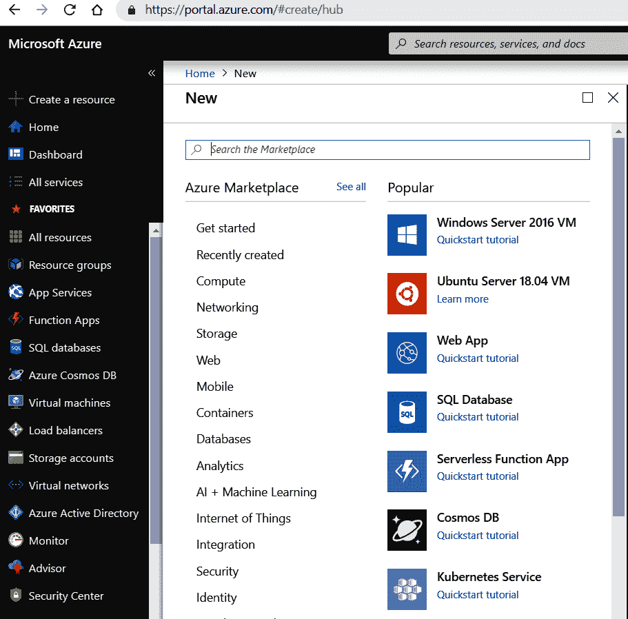

1.  然后，您可以选择 Web 应用。本教程将带您进入以下屏幕：

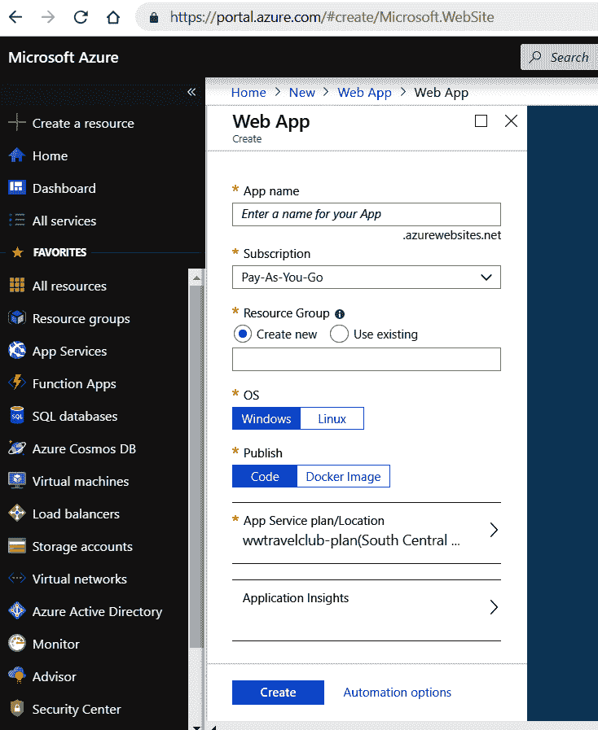

所需的详细信息如下：

+   应用名称：如您所见，这是您的网络应用创建后所假设的 URL。该名称经过检查以确保其可用性。

+   订阅：这是将收取所有应用费用的账户。

+   资源组：这是您可以定义以组织策略和权限的资源集合。您可以指定新的资源组名称或将网络应用添加到在定义其他资源时指定的组中。

+   操作系统：这是将托管网络应用的操作系统的名称。对于 ASP.NET Core 项目，可以使用 Windows 和 Linux。

+   发布：此参数指示网络应用是直接交付还是将使用 Docker 技术发布内容。Docker 将在第五章，*将微服务架构应用于您的企业应用*中更详细地讨论。

+   应用服务计划/位置：这是您定义用于处理网络应用和服务器位置的硬件计划的地方。此选择定义了应用程序的可扩展性、性能和成本。

+   应用洞察：这是用于监控和故障排除网络应用的 Azure 实用工具集。

应用可以从两种概念上不同的方式扩展：

+   纵向（扩展）

+   横向（扩展）

两者都可在网络应用设置中找到，如下截图所示：


让我们检查两种扩展类型。

# 垂直扩展（扩展）

扩展意味着更改将支持您的应用程序的硬件类型。在 Azure 中，您有机会从免费共享硬件开始，并在几个点击中切换到隔离的机器。

选择此选项，您有机会选择更强大的硬件（具有更多 CPU、存储和 RAM 的机器）。以下截图显示了扩展网络应用的用户界面：

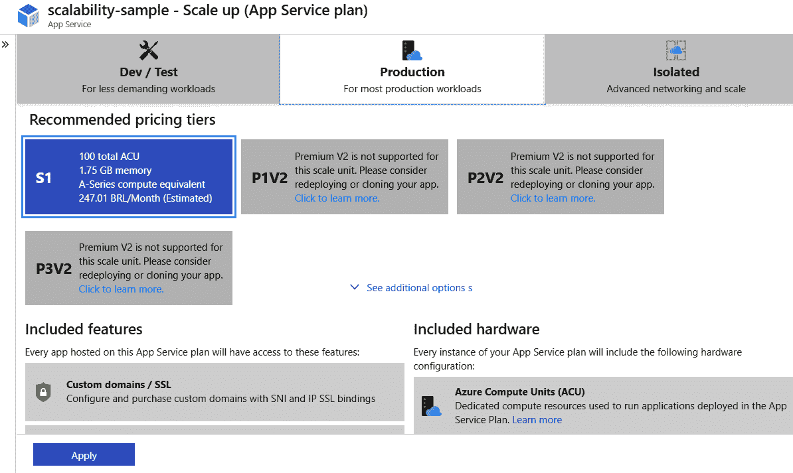

# 横向扩展（扩展）

扩展意味着将所有请求分配给具有相同容量的更多服务器，而不是使用更强大的机器。所有服务器的负载将由 Azure 基础设施自动平衡。以下截图显示了一个由两个简单规则定义的自动扩展策略，该策略由 CPU 使用情况触发：

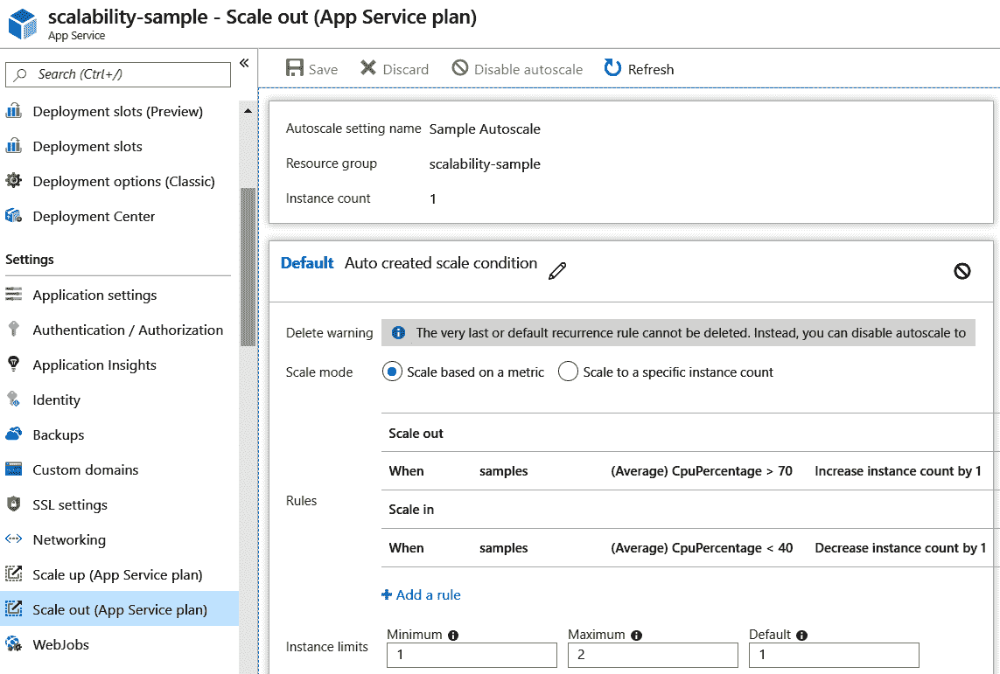

对所有可用自动扩展规则的完整描述超出了本书的范围。然而，它们相当直观，*进一步阅读*部分包含指向完整文档的链接。

扩展功能仅在付费服务计划中可用。

# 使用.NET Core 创建可扩展的网络应用

在所有可用于实现 Web 应用的框架中，ASP.NET Core 确保了良好的性能，同时生产和维护成本较低。ASP.NET Core 的性能与 Node.js 的性能相当，但由于使用了 C#（这是一种强类型和高级纯对象语言）而不是 JavaScript，因此生产和维护成本较低。

以下步骤将指导您通过创建基于 ASP.NET Core 的 Web 应用。所有步骤都非常简单，但一些细节需要特别注意。

首先，在创建 Web 应用时，您可以在 .NET Core 框架和 .NET 框架之间进行选择。请注意，只有 .NET Core 可以在 Windows 和更便宜的 Linux 服务器上运行，而经典 .NET 只能在 Windows 服务器上运行。另一方面，使用经典 .NET，您将能够访问更大的代码库，包括 Microsoft 和第三方包的遗留库。

现在，Microsoft 推荐使用经典 .NET，以防所需的特性在 .NET Core 中不可用，或者当您在不支持 .NET Core 的环境中部署 Web 应用时。在其他任何情况下，您都应该优先选择 .NET Core 框架，因为它允许您做以下事情：

+   在 Windows、Linux 或 Docker 容器中运行您的 Web 应用

+   使用微服务设计您的解决方案

+   拥有高性能和可扩展的系统

容器和微服务将在第五章应用微服务架构到您的企业应用中介绍。在那里，您将更好地了解这些技术的优势。目前，只需说 .NET Core 和微服务是为了性能和可扩展性而设计的，这就是为什么您应该在所有新项目中优先选择 .NET Core。

以下步骤将向您展示如何在 Visual Studio 2019 中使用 .NET Core 3.0 创建 ASP.NET Core Web 应用：

1.  一旦您选择了 ASP.NET Core Web 应用，您将被引导到一个屏幕，您将需要设置项目名称、位置和解决方案名称：

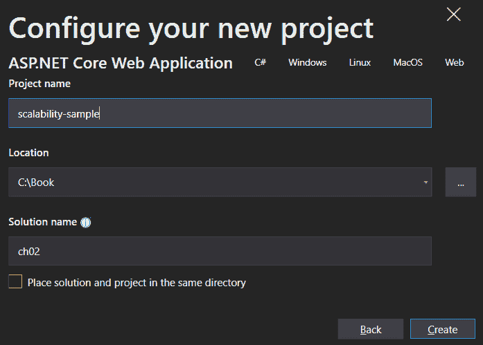

1.  之后，您将能够选择要使用的 .NET Core 版本。在撰写本文时，.NET Core 3.0 仍处于 Preview 1 版本。

1.  现在我们已经添加了基本详情，您可以将您的 Web 应用项目连接到您的 Azure 账户，并发布它。

1.  在解决方案资源管理器中，如果您在任意位置右键单击，您将有一个“发布...”的选项：

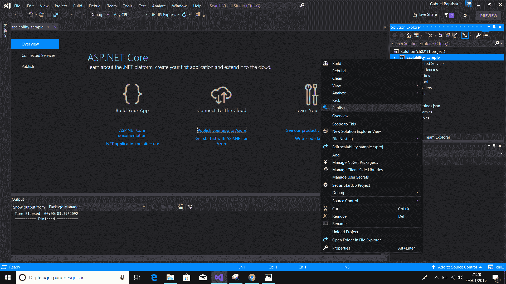

1.  在您选择“发布...”菜单项后，您将能够连接到您的 Azure 账户，然后选择您希望部署的 Web 应用：


1.  Visual Studio 与 Azure 完全集成。这使您有机会在开发环境中查看在 Azure Portal 中创建的所有资源：

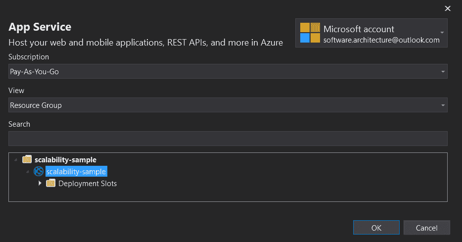

1.  一旦您确定了发布设置，即您的发布配置文件，当您点击“确定”时，Web 应用将自动发布。

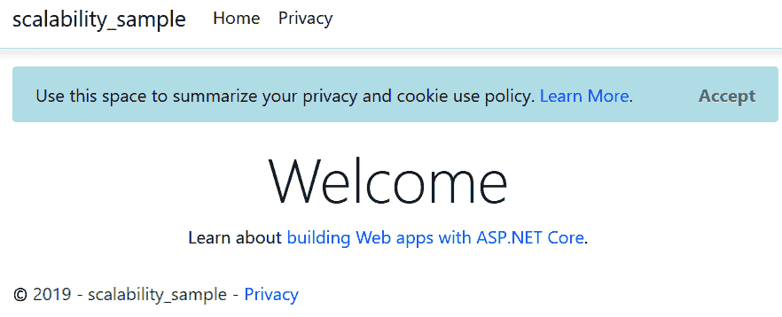

对于发布.NET Core 预览版本，您必须在 Azure 门户的 Web 应用设置面板中添加一个扩展，如图所示：

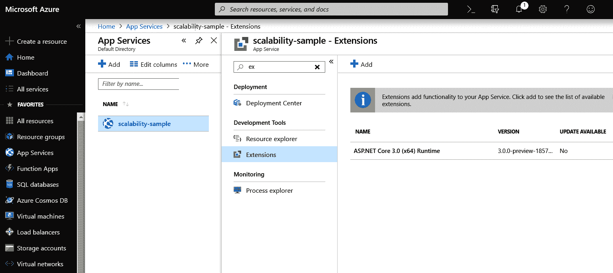

关于将 ASP.NET Core 3.0 部署到 Azure App Service 的更多信息，请参阅此链接：[`docs.microsoft.com/en-us/aspnet/core/host-and-deploy/azure-apps/?view=aspnetcore-2.2#deploy-aspnet-core-preview-release-to-azure-app-service`](https://docs.microsoft.com/en-us/aspnet/core/host-and-deploy/azure-apps/?view=aspnetcore-2.2#deploy-aspnet-core-preview-release-to-azure-app-service)。

在这里，我们描述了部署 Web 应用的最简单方法。第十七章，*使用 Azure DevOps 部署您的应用程序*，将向您介绍 Azure DevOps **持续集成/持续交付**（**CI/CD**）管道。这个管道是 Azure 工具集的进一步扩展，它自动化了将应用程序部署到生产环境所需的所有步骤，即构建、测试、预部署和部署到生产。

# 在用 C#编程时需要考虑的性能问题

现在，C#是全球最广泛使用的编程语言之一，因此关于 C#编程的好建议对于设计满足最常见非功能性要求的好架构是基本的。

以下几节提到了一些简单但有效的技巧——相关的代码示例可在本书的 GitHub 仓库中找到。

# 字符串连接

这是一个经典案例！使用`+`字符串运算符进行字符串的简单连接可能会导致严重的性能问题，因为每次连接两个字符串时，它们的内容都会被复制到一个新的字符串中。

因此，如果我们连接，比如说，平均长度为 100 的 10 个字符串，第一次操作的成本为 200，第二次操作的成本为*200+100=300*，第三次操作的成本为 300+100=400，以此类推。不难说服自己，总成本的增长类似于*m*n²*，其中*n*是字符串的数量，*m*是它们的平均长度。对于小的*n*（比如说，*n* < 10），*n²*并不太大，但当*n*达到 100-1,000 的数量级时，它就变得相当大了，实际上对于 10,000-100,000 的数量级是不可接受的。

让我们通过一些测试代码来看看这个问题，这些代码比较了简单的字符串连接与使用`StringBuilder`类执行相同操作的情况（代码可在本书的 GitHub 仓库中找到）：

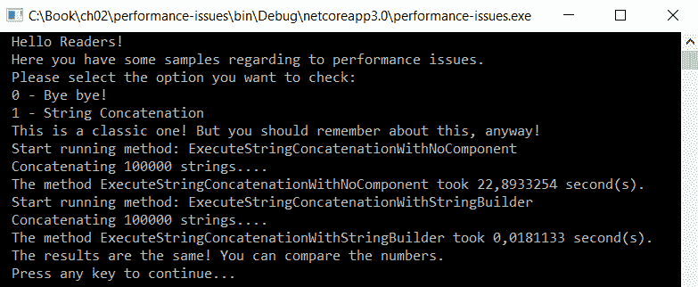

如果你创建一个`StringBuilder`类，例如`var sb = new System.Text.StringBuilder()`，然后使用`sb.Append(currString)`将每个字符串添加到其中，字符串不会被复制；相反，它们的指针被排队到一个列表中。它们只在调用`sb.ToString()`以获取最终结果时复制一次。因此，基于`StringBuilder`的连接成本简单地增长为*m*n*。

当然，你可能永远不会找到一个像前面那样的函数，它将 10 万个字符串连接起来。然而，你需要认识到类似的代码片段，其中一些 20-100 个字符串的连接，比如在一个同时处理多个请求的 Web 服务器中，可能会造成瓶颈，损害你的性能非功能需求。

# 异常

总是记住——异常处理需要太多时间！因此，`try-catch`的使用需要简洁且必要；否则，你将创建大的性能问题。

以下两个示例比较了使用`try-catch`和`Int32.TryParse`来检查字符串是否可以转换为整数的方法，如下所示：

```cs
private static string ParseIntWithTryParse()
{
    string result = String.Empty;
    int value;
    if (Int32.TryParse(result, out value))
        result = value.ToString();
    else
        result = "There is no int value";
    return $"Final result: {result}";
}

private static string ParseIntWithException()
{
    string result = String.Empty;
    try
    {
        result = Convert.ToInt32(result).ToString();
    }
    catch (Exception)
    {
        result = "There is no int value";
    }
    return $"Final result: {result}";
}
```

第二个函数看起来并不危险，但它比第一个慢数千倍：


总结一下，异常必须用于处理打破正常控制流程的异常情况，例如，当操作由于某些意外原因必须被中止时，并且必须将控制返回到调用堆栈的几个级别。

# 多线程环境以获得更好的结果——应该做什么和不应该做什么

如果你想充分利用你正在构建的系统提供的所有硬件，你必须使用多线程。这样，当一个线程正在等待一个操作完成时，它可以离开 CPU 和其他资源，让其他线程使用，而不是浪费 CPU 时间。

另一方面，无论微软如何努力帮助解决这个问题，并行代码并不像吃蛋糕那么简单：它容易出错，难以测试和调试。当你开始考虑使用线程时，作为软件架构师，最重要的要记住的是：*你的系统需要它们吗？* 非功能性和一些功能性需求肯定会为你回答这个问题。

一旦你确定你需要一个多线程系统，你应该决定哪种技术更合适。这里有几个选项，如下所示：

+   **创建一个`System.Threading.Thread`的实例**：这是在 C#中创建线程的经典方式。线程的生命周期将完全由你控制。当你确定你要做什么时，这是好的，但你需要担心实现中的每一个细节。生成的代码难以构思、调试/测试/维护。因此，为了保持开发成本可接受，这种方法应该仅限于几个基本性能批判性模块。

+   **使用 System.Threading.Tasks.Parallel 和 System.Threading.Tasks.Task 类进行编程**：在 .NET Framework 4.0 版本中，你可以使用并行类以更简单的方式启用线程。这很好，因为你不需要担心你创建的线程的生命周期，但它会给你更少的控制权来了解每个线程中发生的事情。

+   **使用异步编程进行开发**：这无疑是开发多线程应用程序最容易的方式，因为你不需要关心线程协调，死锁也不可能发生。当一个异步方法调用另一个异步方法时，它会进入休眠模式，以避免在调用任务返回之前浪费资源。这样，异步代码模仿了经典同步代码的行为，同时保持了通用并行编程的大部分性能优势。

总体行为是确定性的，并且不依赖于每个任务完成所需的时间，因此不可能出现不可重现的 bug，生成的代码易于测试/调试/维护。将一个方法定义为异步任务或不是，这是程序员唯一的选择；其他所有事情都由运行时自动处理。你唯一需要关心的是哪些方法应该具有异步行为。

在本书的后续部分，我们将提供一些异步编程的简单示例。有关异步编程及其相关模式的信息，请参阅微软文档中的 *基于任务的异步模式* ([`docs.microsoft.com/en-us/dotnet/standard/asynchronous-programming-patterns/task-based-asynchronous-pattern-tap`](https://docs.microsoft.com/en-us/dotnet/standard/asynchronous-programming-patterns/task-based-asynchronous-pattern-tap))。

无论你选择哪种选项，作为软件架构师，你都必须注意一些“应该做”和“不应该做”的事情。以下是一些注意事项：

+   **使用并发集合** (`System.Collections.Concurrent`)：一旦开始一个多线程应用程序，就必须使用这些集合。原因是你的程序可能会从不同的线程管理相同的列表、字典等。使用并发集合是开发线程安全程序的唯一选择。

+   **关注静态变量**：不能说在多线程开发中禁止使用静态变量，但你应该注意它们。再次强调，多个线程处理相同的变量可能会引起很多麻烦。如果你用 `[ThreadStatic]` 属性装饰静态变量，每个线程都会看到该变量的不同副本，从而解决了多个线程竞争同一值的问题。然而，`ThreadStatic` 变量不能用于跨线程通信，因为一个线程写入的值不能被其他线程读取。

+   **在多线程实现后测试系统性能**：线程使你能够充分利用你的硬件，但在某些情况下，编写不良的线程可能会浪费 CPU 时间而什么也不做！类似的情况可能会导致几乎 100%的 CPU 使用率和不可接受的系统减速。在某些情况下，通过在某个线程的主循环中添加简单的`Thread.Sleep(1)`调用可以减轻或解决问题，但你需要测试这一点。

+   **不要认为多线程很简单**：在某些语法实现中，多线程并不像看起来那么简单。在编写多线程应用程序时，你应该考虑诸如用户界面的同步、线程终止和协调等问题。在许多情况下，程序只是因为多线程实现不当而停止正常工作。

+   **不要忘记计划你的系统应该拥有的线程数量**：这对于 32 位程序来说非常重要。在 32 位环境中，你可以拥有的线程数量有一个限制。在设计你的系统时，你应该考虑这一点。

+   **不要忘记结束你的线程**：如果你没有为每个线程提供正确的终止程序，你可能会遇到内存和处理句柄泄漏的问题。

# 可用性 - 为什么插入数据需要花费太多时间

可扩展性、性能技巧和多线程是我们可以用来调整机器性能的主要工具。然而，你设计的系统的有效性取决于整个处理管道的整体性能，这包括人类和机器。

作为软件架构师，你无法提高人类的表现，但你可以通过设计一个有效的**用户界面**（**UI**），即确保与人类快速交互的用户界面来提高人机交互的性能，这反过来意味着以下内容：

+   UI 必须易于学习，以减少学习时间和目标用户学会快速操作之前的时间浪费。如果 UI 更改频繁，以及需要吸引尽可能多用户的公共网站，这个限制是基本的。

+   UI 不得在数据插入时造成任何类型的减速；数据插入速度必须仅限于用户的打字能力，而不是由系统延迟或可以避免的额外手势。

在设计*易于学习*的用户界面时，以下是一些简单的技巧：

+   每个输入屏幕必须清楚地说明其目的。

+   使用用户的语言，而不是开发者的语言。

+   避免复杂化。设计 UI 时考虑平均情况；更复杂的情况可以通过仅在需要时出现的额外输入来处理。将复杂的屏幕拆分为更多输入步骤。

+   使用过去的输入来理解用户意图，并通过消息和自动 UI 更改将用户引导到正确的路径；例如，级联下拉菜单。

+   错误消息不是系统给用户的坏笔记，但它们必须解释如何插入正确的输入。

快速用户界面源于对以下三个要求的有效解决方案：

+   输入字段必须按照通常填充的顺序放置，并且应该可以使用 *Tab* 或 *Enter* 键移动到下一个输入。此外，经常保持空白的字段应放置在表单底部。简单来说，填写表单时使用鼠标的操作应尽可能减少。这样，用户手势的数量保持在最低。在 Web 应用程序中，一旦决定了输入字段的最佳放置，就足够使用 `tabindex` 属性来定义用户使用 *Tab* 键从输入字段移动到下一个输入字段的正确方式。

+   系统对用户输入的反应必须尽可能快。特别是，错误（或信息）消息必须在用户离开输入字段时立即出现。实现这一点的最简单方法是将大部分帮助和输入验证逻辑移动到客户端，这样系统反应就不需要通过通信线路和服务器进行。

+   有效的选择逻辑。选择现有项目应该尽可能简单；例如，在优惠中从数千种产品中选择一个，应该可以通过几个手势完成，而且无需记住确切的产品名称或其条形码。下一小节将分析我们可以使用的提高复杂度以实现快速选择的技术。

# 设计快速选择逻辑

当所有可能的选择的数量级在 1-50 之间时，通常的下拉菜单就足够了。例如，检查货币选择下拉菜单：


当数量级较高但不到几千时，显示所有以用户输入的字符开头的项目名称的自动完成通常是一个好选择：

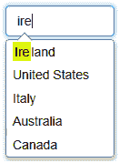

类似解决方案可以以低计算成本实现，因为所有主要数据库都可以有效地选择以给定子串开头的字符串。

当名称相当复杂时，在搜索用户输入的字符时，它们应在每个项目字符串内部扩展。这种操作不能使用常规数据库有效地执行，需要专门的数据结构。

最后，当我们搜索由多个单词组成的描述时，需要更复杂的搜索模式。例如，产品描述就是这样。如果所选数据库支持全文搜索，系统可以有效地搜索用户在所有描述中输入的多个单词的出现。

然而，当描述由名称而不是常见单词组成时，用户可能很难记住目标描述中包含的几个确切名称。这种情况在多国公司名称中很常见。在这些情况下，我们需要找到用户输入的字符最佳匹配的算法。必须在每个描述的不同位置搜索用户输入的字符串的子串。一般来说，无法有效地使用基于索引的数据库实现类似算法，但需要将所有描述加载到内存中，并以某种方式与用户输入的字符串进行排名。

这类算法中最著名的算法可能是**Levenshtein**算法，该算法被大多数拼写检查器用于找到与用户输入的错误拼写最匹配的单词。此算法最小化描述与用户输入的字符串之间的 Levenshtein 距离，即从一个字符串转换到另一个字符串所需的字符删除和添加的最小数量。

Levenshtein 算法效果很好，但计算成本非常高。现在，我们给出一个更快的算法，该算法在搜索描述中的字符发生时效果良好。用户输入的字符不需要在描述中连续出现，但必须按相同的顺序出现。某些字符可能缺失。每个描述都根据缺失的字符以及用户输入的字符发生的相对位置给予一个惩罚。更具体地说，算法使用两个数字对每个描述进行排名：

+   用户输入的字符在描述中出现的次数：描述中包含的字符越多，其排名越高。

+   每个描述都根据用户在描述中输入的字符发生之间的总距离给予一个惩罚。

以下截图显示了单词**爱尔兰**与用户输入的字符串**ilad**的排名情况：


发生次数为四个，而字符发生之间的总距离为三个。

一旦所有描述都被评分，它们将根据发生次数进行排序。发生次数相同的描述将根据最低的惩罚进行排序。以下是一个实现上述算法的自动完成示例：


以下是对用户输入的字符串进行排名的 C#代码：

```cs
public class SmartDictionary<T>
{
    ...
    private Func<T, string> keyAccessor;
    protected class Rater
    {
        public T Item;
        public double Penalty=0;
        public int FoundChars=0;
    }
    ...
    protected Rater RateItem(string search, Rater x)
    {
        var toSearch = search.ToLower();
        var destination = keyAccessor(x.Item).ToLower();
        bool firstMatch = true;
        for (var j = 0; j < toSearch.Length; j++)
        {
            if (destination == string.Empty) return x;
            var currChar = toSearch[j];
            var index = destination.IndexOf(currChar);
            if (index == -1) continue;
            x.FoundChars++;
            if (firstMatch)
            {
                x.Penalty += index;
                firstMatch = false;

            }
            else x.Penalty += index*1000;
            if (index + 1 < destination.Length)
                destination = destination.Substring(index + 1);
            else
                destination = string.Empty;
        }
        return x;
    }
    ...
}
```

要排名的项目被插入到`Rater`实例中。然后，通过`keyAccessor`函数提取其字符串描述。之后，代码计算字符发生和总距离中的发生次数。

完整的类代码，以及一个测试控制台项目，都可以在本书的 GitHub 仓库中找到。

# 从大量项目中选择

在这里，“巨大”并不是指存储数据所需的空间量，而是指用户记住每个项目功能的困难程度。当必须从 10,000-100,000 个项目中选择一个时，通过在描述中搜索字符出现来找到它的希望就消失了。在这里，用户必须通过一系列类别来引导到正确的项目。

在这种情况下，执行单个选择需要多个用户手势。换句话说，每个选择都需要与多个输入字段进行交互。一旦确定选择不能通过单个输入字段完成，最简单的选项就是级联下拉菜单，即一系列下拉菜单，其选择列表取决于之前下拉菜单中选择的值。

例如，如果用户需要选择世界上任何地方的城镇，我们可能使用第一个下拉菜单来选择国家，一旦选择了国家，我们可能使用这个选择来填充第二个下拉菜单，其中包含所选国家中的所有城镇。一个简单的例子如下：

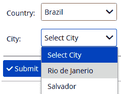

显然，当需要时，每个下拉菜单都可以用自动完成来替换，因为选项数量很多。

如果通过交叉多个不同的层次结构来做出正确的选择变得不高效，那么级联下拉菜单也会变得低效，我们需要一个过滤器表单，如下所示：

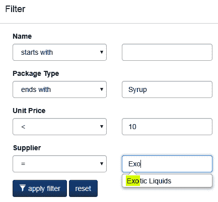

现在，让我们了解 .NET Core 的互操作性。

# .NET Core 与 .NET Core 的互操作性奇妙世界

.NET Core 为 Windows 开发者带来了将他们的软件部署到各种平台的能力。作为软件架构师，您需要特别注意这一点。对于 C# 爱好者来说，Linux 和 macOS 已不再是问题——这比那更好——它们确实是向新客户交付的真正好机会。因此，我们需要确保性能和多平台支持，这是几个系统中的两个常见非功能性需求。

在 Windows 中使用 .NET Core 设计的控制台应用程序和 Web 应用程序几乎也与 Linux 和 macOS 完全兼容。这意味着您不需要在这些平台上重新构建应用程序即可运行它。此外，现在许多特定于平台的行为都支持多平台，例如，从 .NET Core 3.0 开始的 `System.IO.Ports.SerialPort` 类，它在 Linux 上运行。

微软提供了脚本帮助您在 Linux 和 macOS 上安装 .NET Core。您可以在 [`docs.microsoft.com/en-us/dotnet/core/tools/dotnet-install-script`](https://docs.microsoft.com/en-us/dotnet/core/tools/dotnet-install-script) 找到它们。一旦安装了 SDK，您只需像在 Windows 上一样调用 **dotnet** 即可。

然而，您必须意识到一些与 Linux 和 macOS 系统不完全兼容的功能。例如，在这些操作系统中没有与 Windows 注册表等效的东西，您必须自己开发替代方案。如果需要，加密的 JSON 配置文件是一个不错的选择。

另一个重要点是，Linux 区分大小写，而 Windows 不区分。当您处理文件时，请记住这一点。另一个重要的事情是，Linux 的路径分隔符与 Windows 的分隔符不同。您可以使用 `Path.PathSeparator` 属性以及所有其他 `Path` 类方法来确保您的代码实际上是跨平台的。

此外，您还可以通过使用 .NET Core 提供的运行时检查来将您的代码适配到底层操作系统，如下所示：

```cs
using System;
using System.Runtime.InteropServices;

namespace CheckOS
{
    class Program
    {
        static void Main()
        {
            if (RuntimeInformation.IsOSPlatform(OSPlatform.Windows))
                Console.WriteLine("Here you have Windows World!");
            else if (RuntimeInformation.IsOSPlatform(OSPlatform.Linux))
                Console.WriteLine("Here you have Linux World!");
            else if (RuntimeInformation.IsOSPlatform(OSPlatform.OSX))
                Console.WriteLine("Here you have macOS World!");
        }
    }
}
```

# 在 Linux 中创建服务

以下脚本可以用于在 Linux 中封装命令行 .NET Core 应用程序。这个想法是，这个服务就像一个 Windows 服务一样工作。考虑到大多数 Linux 安装仅提供命令行界面，并且在没有用户登录的情况下运行，这可能会非常有用：

1.  第一步是创建一个将运行命令行应用程序的文件。应用程序的名称是 `app.dll`，它安装在 `appfolder` 中。该应用程序将被每 5,000 毫秒检查一次。此服务是在 CentOS 7 系统上创建的。使用 Linux 终端，您可以输入以下内容：

```cs
cat > sample.service <<EOF
[Unit]
Description=Your Linux Service
After=network.target
[Service]
ExecStart=/usr/bin/dotnet $(pwd)/appfolder/app.dll 5000
Restart=on-failure
[Install]
WantedBy=multi-user.target
EOF
```

1.  一旦文件创建完成，您必须将服务文件复制到系统位置。之后，您需要重新加载 `systemd` 并启用服务，以便在重启时自动启动：

```cs
sudo cp sample.service /lib/systemd/system
sudo systemctl daemon-reload 
sudo systemctl enable *sample*
```

1.  完成！现在，您可以使用以下命令启动、停止和检查服务。您在命令行应用程序中需要提供的整个输入如下：

```cs
# Start the service
sudo systemctl start sample

# View service status
sudo systemctl status sample

# Stop the service
sudo systemctl stop sample 
```

现在我们已经了解了一些概念，让我们学习如何在我们的用例中实现它们。

# 书籍用例 - 理解 .NET Core 项目的类型

本书用例的开发将基于各种类型的 .NET Core Visual Studio 项目。本节描述了所有这些项目。让我们在 Visual Studio 文件菜单中选择“新建项目”。在打开的窗口中，所有 .NET Core 项目都将位于左侧菜单的 .NET Core、.NET Standard 和 Cloud 项下：

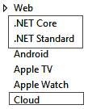

大多数项目都在 .NET Core 下可用：

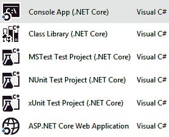

在这里，我们有一个控制台项目、一个类库项目以及各种类型的测试项目，每个项目都基于不同的测试框架：xUnit、nUnit 和 MSTest。选择各种测试框架只是个人偏好的问题，因为它们都提供了类似的功能。将测试添加到构成解决方案的每个软件组件中是一种常见做法，允许软件频繁修改而不会危及其可靠性。

测试将在第十五章，*使用单元测试用例和 TDD 测试您的代码*和第二十章，*软件测试自动化*中详细讨论。最后，我们已经有了一个在*使用.NET Core 创建可扩展的 Web 应用程序*子节中描述的 ASP.NET Core 应用程序。在那里，我们定义了一个 ASP.NET MVC 应用程序，但 Visual Studio 还包含基于 RESTful API 和最重要的单页应用程序框架（如 Angular、React、Vue.js 以及基于 WebAssembly 的新 Blazor 框架）的项目模板。其中一些在标准的 Visual Studio 安装中可用；其他则需要安装 SPA 包。

对于每种项目类型，我们可以选择我们想要使用的.NET Core 版本。在.NET Standard 菜单项下，我们只有一个类库项目。.NET Standard 类库基于.NET 标准而不是特定的.NET Core 版本，因此它们与多个.NET Core 版本兼容。例如，基于 2.0 标准的库与所有大于或等于 2.0 的.NET Core 版本以及所有大于 4.6 的.NET Framework 版本兼容。

这种兼容性优势是以牺牲更少可用功能为代价的。然而，不属于标准的特性可以作为对附加库包的引用添加。

最后，在云菜单下，我们还有更多项目类型，但与.NET Core 相关的新项目只有 Service Fabric 应用程序：


这使我们能够定义微服务。基于微服务的架构允许将应用程序拆分为几个独立的微服务。可以创建多个相同的微服务实例，并将它们分布到多台机器上以微调每个应用程序部分的表现。微服务将在第五章，*将微服务架构应用于您的企业应用程序*中描述。

# 摘要

描述系统行为的职能需求必须与非职能需求相结合，这些非职能需求限制了系统的性能、可伸缩性、互操作性和可用性。性能需求来自响应时间和系统负载需求。作为软件架构师，您应该确保以最低的成本构建高效的算法，充分利用可用的硬件资源，并通过多线程实现所需的性能。

可伸缩性是指系统适应增加负载的能力。系统可以通过提供更强大的硬件进行垂直扩展，或者通过复制和负载均衡相同的硬件进行水平扩展。通常来说，云（尤其是 Azure）可以帮助我们动态地实施策略，而无需停止您的应用程序。

在多个平台上运行的工具，如 .NET Core，可以确保互操作性，即你的软件能够在不同的目标机器和不同的操作系统（Windows、Linux、macOS、Android 等）上运行。

通过关注输入字段的顺序、项目选择逻辑的有效性以及系统学习的便捷性来确保可用性。

在下一章中，你将学习 Azure DevOps 工具如何帮助我们收集、定义和记录我们的需求。

# 问题

1.  系统扩展的两种概念方式是什么？

1.  你能否从 Visual Studio 自动部署你的 Web 应用到 Azure？

1.  多线程有什么用途？

1.  异步模式相较于其他多线程技术的主要优势是什么？

1.  为什么输入字段的顺序如此重要？

1.  为什么 .NET Core 的 `Path` 类对于互操作性如此重要？

1.  .NET 标准类库相较于 .NET Core 类库有什么优势？

1.  列出各种 .NET Core Visual Studio 项目的类型。

# 进一步阅读

以下是一些你可能考虑阅读的书籍和链接，以获取更多关于本章的信息：

+   [`www.packtpub.com/virtualization-and-cloud/hands-azure-developers`](https://www.packtpub.com/virtualization-and-cloud/hands-azure-developers)

+   [`docs.microsoft.com/en-us/azure/architecture/best-practices/auto-scaling`](https://docs.microsoft.com/en-us/azure/architecture/best-practices/auto-scaling)

+   [`docs.microsoft.com/en-us/aspnet/core/host-and-deploy/azure-apps/?view=aspnetcore-2.2#deploy-aspnet-core-preview-release-to-azure-app-service`](https://docs.microsoft.com/en-us/aspnet/core/host-and-deploy/azure-apps/?view=aspnetcore-2.2#deploy-aspnet-core-preview-release-to-azure-app-service)

+   [`docs.microsoft.com/en-us/dotnet/standard/parallel-processing-and-concurrency`](https://docs.microsoft.com/en-us/dotnet/standard/parallel-processing-and-concurrency)
