# 使用 Azure DevOps 记录需求

Azure DevOps 是 Visual Studio Team Services 的进化版本，它提供了许多新功能，可以帮助开发者记录和组织他们的软件。本章的目的是介绍由微软提供的这个工具的概述。

本章将涵盖以下主题：

+   使用您的 Azure 账户创建 Azure DevOps 项目

+   理解 Azure DevOps 提供的功能

+   使用 Azure DevOps 组织和管理需求

+   在 Azure DevOps 中展示用例

# 技术需求

本章要求您创建一个新的免费 Azure 账户或使用现有的一个。第一章中*理解软件架构的重要性*的*创建 Azure 账户*部分解释了如何创建一个。

# 介绍 Azure DevOps

Azure DevOps 是一个微软 **软件即服务** (**SaaS**) 平台，它使您能够向客户持续交付价值。通过在那里创建账户，您将能够轻松地规划项目、安全地存储代码、测试它、将解决方案发布到预发布环境，然后将其发布到实际的生产基础设施。

当然，Azure DevOps 是一个完整的框架，它提供的生态系统为

软件开发目前是可用的。所有涉及软件生产的步骤的自动化确保了现有解决方案的持续增强和改进，以便适应市场需求。

您可以从 Azure 门户开始此过程。如果您不知道如何创建 Azure 门户账户，请参阅第一章，*理解软件架构的重要性*。创建 Azure DevOps 账户的步骤相当简单：

1.  选择“创建资源”然后选择“DevOps 项目”：

1.  一旦开始创建项目的向导，您就可以从几个不同的平台中选择您想要交付的系统。这是 Azure DevOps 的一个巨大优势，因为您不仅限于使用微软的工具和产品，而且可以从市场上所有常见的平台、工具和产品中进行选择：

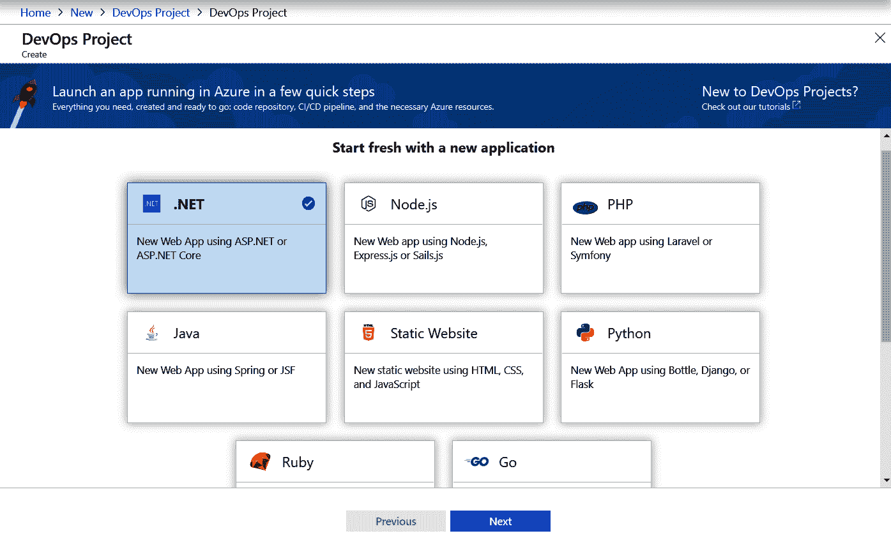

1.  可用的选项将取决于第一步中选择的平台。在某些情况下，您可以从以下截图中的几个部署选项中进行选择，该截图在您选择 .NET 平台时出现：

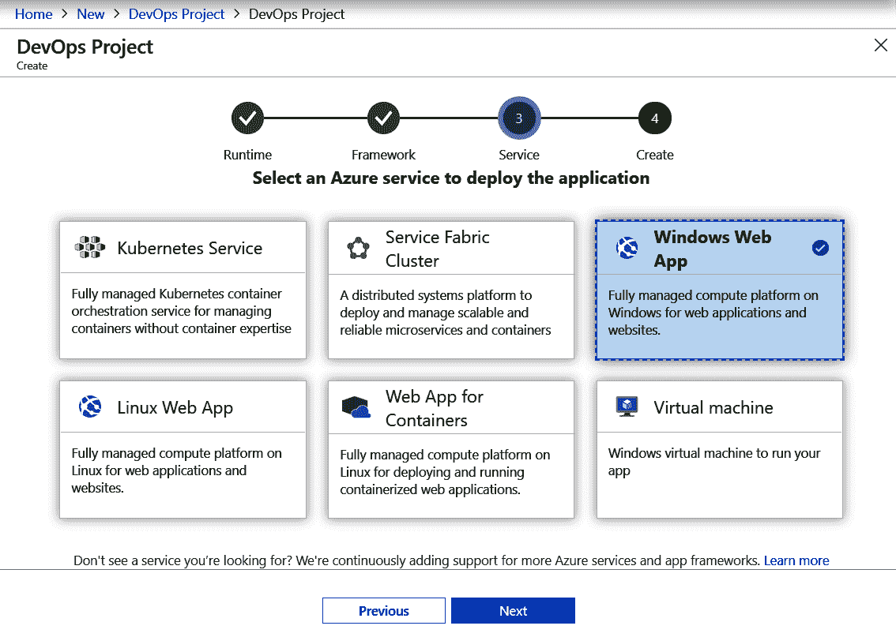

1.  一旦设置完成，您将能够根据您提供的信息使用项目门户来管理项目。值得一提的是，如果您没有 Azure DevOps 服务，此向导将为您创建一个。Azure DevOps 组织是您可以组织所有您的

    Azure DevOps 项目。整个过程不到 20 分钟：

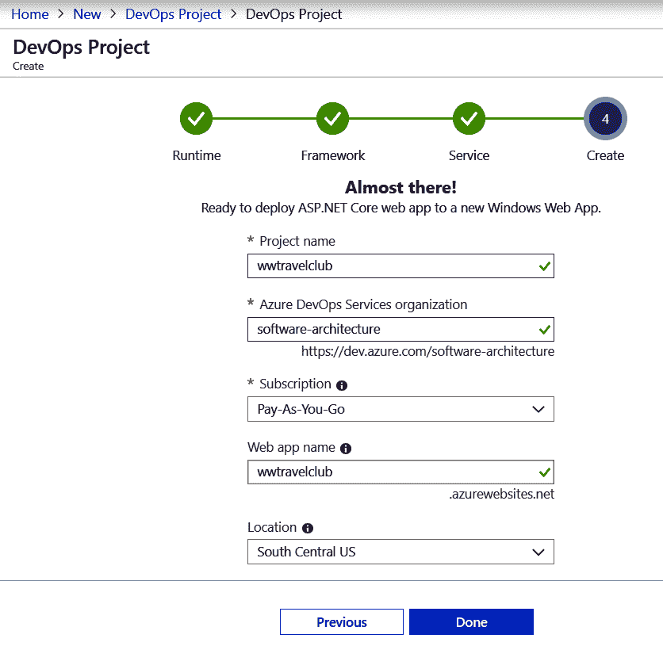

1.  之后，您将能够开始规划您的项目。以下截图显示了 Azure DevOps 项目创建完成后出现的页面。在本书的剩余部分，我们将多次回到这个页面，介绍和描述各种确保更快、更有效部署的有用功能：

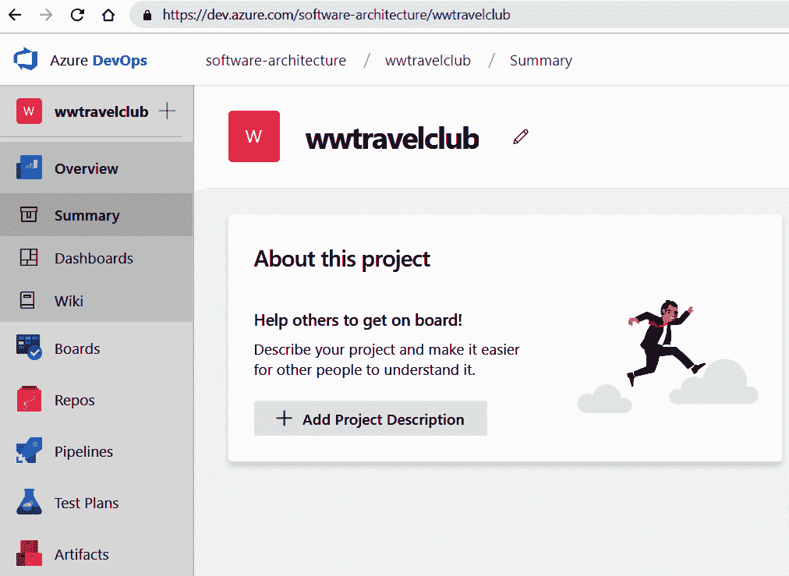

如前一个截图所示，创建 Azure DevOps 账户并开始开发一流的 DevOps 工具的过程非常简单。值得一提的是，如果您团队中有最多五名开发者，以及任何数量的利益相关者，您可以使用这款出色的工具而不需付费。

# 使用 Azure DevOps 组织您的工作

DevOps 是一种 **持续集成/持续部署** (**CI/CD**) 方法论，即一套关于如何将持续改进应用于软件应用以及如何将其交付到生产环境中的最佳实践。Azure DevOps 是一款功能强大的工具，其应用范围涵盖了应用初始开发以及随后的 CI/CD 流程中的所有步骤。

Azure DevOps 包含收集需求和组织整个开发流程的工具。您可以通过点击 Azure DevOps 页面中的“看板”菜单来访问它们，将在下一两个小节中更详细地描述：

Azure DevOps 中其他所有功能将在以下小节中简要介绍。它们将在第十五章 使用单元测试用例和 TDD 测试您的代码到第二十章 软件测试自动化中详细讨论。

# Azure DevOps 仓库

“仓库”菜单项为您提供访问 Git 仓库的权限，以便放置项目代码：

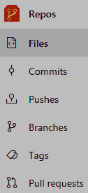

您可以通过非常简单的方式从 Visual Studio 内部连接到这个仓库：

1.  启动 Visual Studio 并确保您使用用于定义您的 DevOps 项目（或用于将您添加为团队成员）的相同 Microsoft 账户登录到 Visual Studio。

1.  如果您的 DevOps 项目仓库为空，请准备一个包含您应用程序中需要的 Visual Studio 项目（开发过程中可以添加更多项目）的 Visual Studio 解决方案。

1.  选择“团队资源管理器”选项卡，然后点击连接按钮：

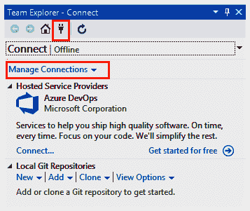

1.  点击 Azure DevOps 的“连接...”链接，您将被引导连接到您的其中一个 Azure DevOps 项目。

1.  点击“团队资源管理器主页”按钮。现在，您将看到执行 Git 操作以及与其他 Azure DevOps 区域交互的命令：

1.  如果 Azure DevOps 仓库为空，请通过点击“更改”按钮提交您刚刚创建的解决方案，然后按照后续的指示操作。

1.  点击“同步”按钮以同步您的本地仓库与远程 Azure DevOps 仓库。如果远程仓库为空且您刚刚创建了一个解决方案，此操作将使用此解决方案初始化远程 Azure DevOps 仓库；否则，此操作将在您的本地机器上下载远程仓库。

1.  一旦所有团队成员都通过前面的步骤初始化了他们的本地机器仓库和 Azure DevOps 仓库，打开 Visual Studio 就足够了。您在本地仓库中创建的解决方案将出现在 Team Explorer 窗口的底部区域。

1.  点击窗口以在您的本地机器上打开解决方案。然后，与远程仓库同步以确保您正在修改的代码是最新的。

Team Explorer 菜单允许您执行大多数 Git 命令，启动远程构建（构建按钮）以及与其他 Azure DevOps 区域交互（例如，查看工作项按钮）。

# 包源

“工件”菜单处理项目使用的软件包。在那里，您可以定义基本上所有类型的包的源，如 NuGet、Node.js 和 Python。一旦进入工件区域，您可以通过点击“+新建源”链接创建多个源，其中每个源可以处理多种类型的包： 

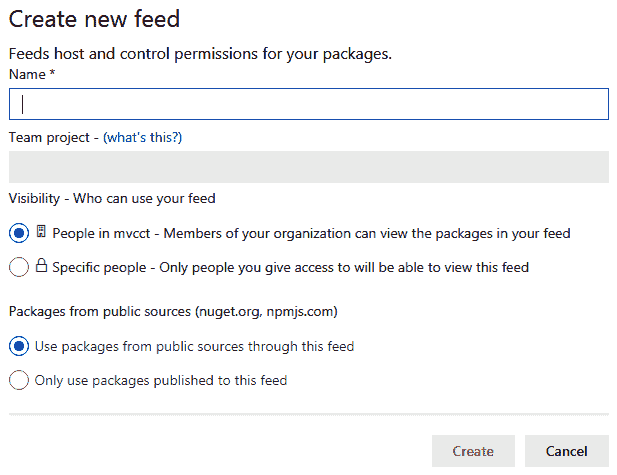

如果您选择从公共源连接到包的选项，默认情况下，源会连接到 `npmjs`、`nuget.org` 和 `pypi.org`。然而，您可以通过右上角的菜单进入“源设置”部分的“上游源”标签页来删除/添加包源：

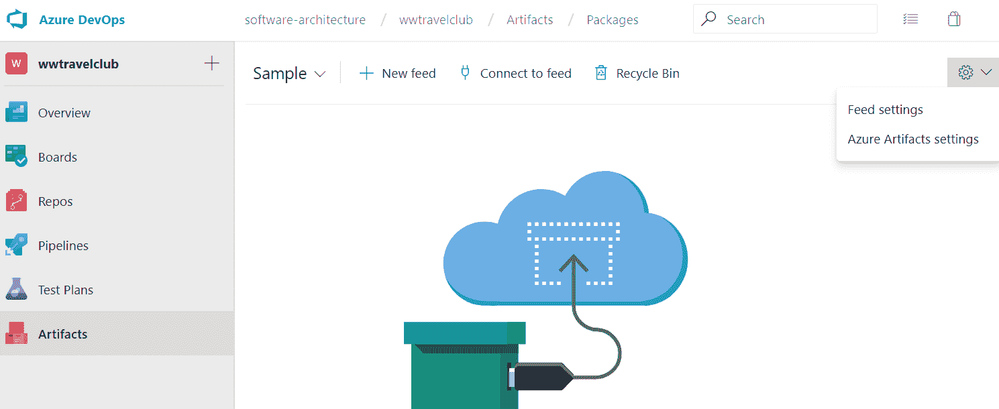

每个源的“连接到源”链接会显示一个窗口，该窗口为每种包类型解释如何执行以下操作：

1.  将私有包上传到源。这样，每个团队都可以使用其私有包的代码库。

1.  通过连接到源来使用 Visual Studio 中的其包。您应该将所有项目源添加到您的 Visual Studio 源中，以便也能使用源中上传的私有团队包；否则，您的本地构建将失败。

1.  管理访问源的凭据：

# 测试计划

测试计划部分允许您定义您想要使用的测试计划和它们的设置。您可以通过测试计划菜单项访问它：

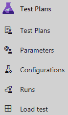

在这里，您可以定义、执行和跟踪由以下内容组成的测试计划：

+   手动验收测试

+   自动单元测试

+   负载测试

必须在 Visual Studio 解决方案中包含的测试项目中定义自动单元测试，并基于如 NUnit、xUnit 和 MSTest（Visual Studio 为它们都提供了项目模板）等框架。测试计划为您提供在 Azure 上执行这些测试的机会，并定义以下内容：

+   一系列配置设置

+   何时执行它们

+   如何跟踪它们以及在哪里在整体项目文档中报告结果

对于手动测试，您可以定义操作员的完整说明、执行它们的执行环境（例如，操作系统），以及在哪里在项目文档中报告结果。您还可以定义如何执行负载测试、如何衡量结果以及在哪里报告它们。

# 管道

管道是自动行动计划，它指定了从代码构建到软件部署到生产中的所有步骤。它们可以在管道区域中定义，该区域可通过“管道”菜单项访问：

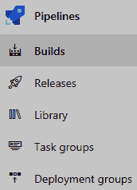

在那里，您可以定义一个完整的任务管道，包括它们的触发事件，这包括代码构建、启动测试计划以及在测试通过后要执行的操作。

通常，在测试通过后，应用程序会自动部署到一个预发布区域，在那里可以进行 beta 测试。您还可以定义生产中自动部署的准则。这些准则包括但不限于以下内容：

+   应用程序进行 beta 测试的天数

+   在 beta 测试期间发现的错误数量以及/或最后代码更改中删除的错误数量

+   一位或多位经理/团队成员的手动批准

准则决策将取决于公司希望如何管理正在开发的产品。作为软件架构师，您必须理解，当涉及到将代码移至生产时，越安全越好。

# 在 Azure DevOps 中管理系统需求

Azure DevOps 允许您使用 *工作项* 来记录系统需求。工作项作为信息存储在您的项目中，可以分配给个人。它们被分类为各种类型，可能包含所需开发工作的度量、状态以及它们所属的开发阶段（迭代）。

实际上，DevOps 方法论作为一种敏捷方法论，由多个迭代组成，整个开发过程被组织为一组冲刺。可用的工作项取决于在创建 Azure DevOps 项目时选择的 *工作项流程*。以下小节包含了对最常见工作项类型的描述。

# Epic 工作项

想象你正在开发一个由各种子系统组成的系统。可能你不会在一个迭代中完成整个系统。因此，我们需要一个跨越几个迭代的总括来封装每个子系统的所有功能。每个史诗工作项代表这些总括中的一个，它可以包含在各个开发迭代中要实现的好几个功能。

在史诗工作项中，你可以定义状态和验收标准，以及开始日期和目标日期。此外，你还可以提供优先级和努力估计。所有这些详细信息都有助于利益相关者跟踪开发过程。这作为一个项目的宏观视图是非常有用的。

史诗不是默认可用的。必须在项目的团队设置页面中启用它们，该页面可以通过点击项目页面左下角的“项目设置”链接并选择“团队设置”来访问：

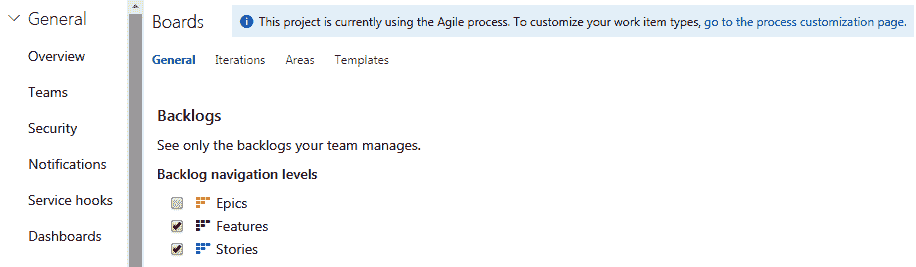

# 功能工作项

你在史诗工作项中提供的所有信息也可以放置在功能工作项中。因此，这两种类型工作项之间的区别并不在于它们包含的信息类型，而在于它们的角色和焦点；你的团队将得出结论。史诗可能跨越几个迭代，并且在功能之上，也就是说，每个史诗工作项都与几个子功能工作项相关联，而每个功能工作项必须在单个迭代中实现，并且是单个史诗工作项的一部分。

值得注意的是，所有工作项都有团队讨论的部分。在那里，你可以通过输入`@`字符（就像在许多论坛/社交应用中一样）在讨论区域找到团队成员。在每个工作项内部，你可以链接和附加各种信息。你还可以在特定部分检查当前工作项的历史记录。

功能工作项是开始记录用户需求的地方。例如，你可以写一个名为**访问控制**的功能工作项来定义实现系统访问控制所需的所有功能。

# 产品待办事项/用户故事工作项

在选择*工作项流程*之后，你将知道这两种工作项中哪一种可用。它们之间有一些细微的差别，但它们的目的基本上是相同的。它们包含详细的需求，这些需求由它们连接的功能工作项描述。更具体地说，每个产品待办事项/用户故事工作项指定了单个功能的需求，该功能是其父功能工作项中描述的行为的一部分。例如，在系统访问控制的功能中，用户维护和登录界面应该是两个不同的用户故事/产品待办事项。这些需求将指导创建其他子工作项：

+   **任务**：它们是重要的工作项，描述了为了满足父产品待办事项/用户故事工作项中声明的需求而需要完成的任务。任务工作项可以包含时间估计，这有助于团队容量管理和整体调度。

+   **测试用例**：这些项目描述了如何测试需求中描述的功能。

你将为每个产品待办事项/用户故事工作项创建的任务和测试用例的数量将根据你使用的开发和测试场景而有所不同。

# 书籍用例 – 在 Azure DevOps 中展示用例

本节通过 wwtravelclub 的实际案例来阐明上一节中提出的概念。考虑到第一章中描述的场景，即“理解软件架构的重要性”，我们决定定义三个史诗级工作项，如下所示：

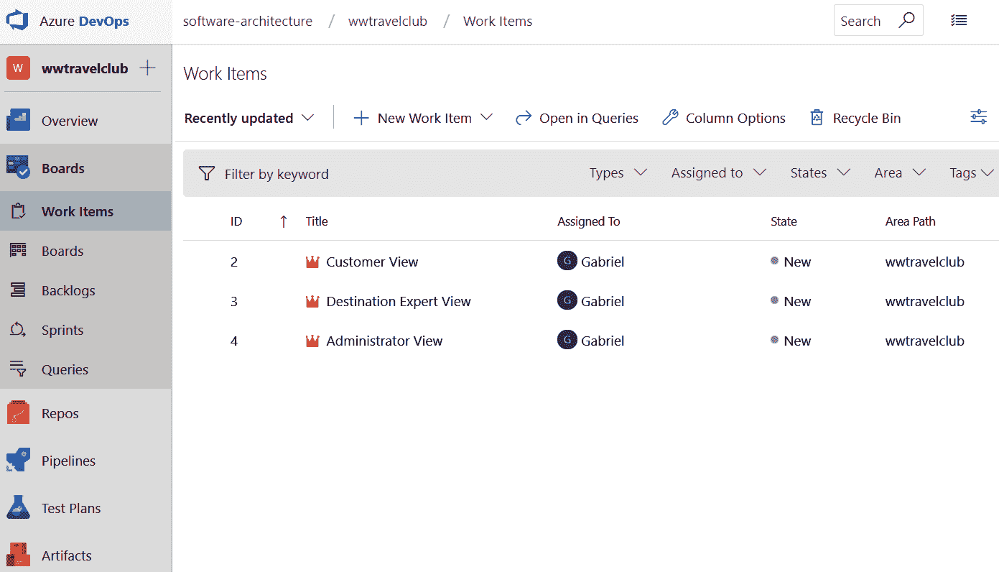

创建这些工作项非常简单：

1.  在每个工作项内部，链接不同类型的工作项，如下面的截图所示。

1.  知道工作项之间的连接在软件开发中非常有用是非常重要的。因此，作为一名软件架构师，你必须向你的团队提供这方面的知识，而且更重要的是，你必须激励他们建立这些连接：

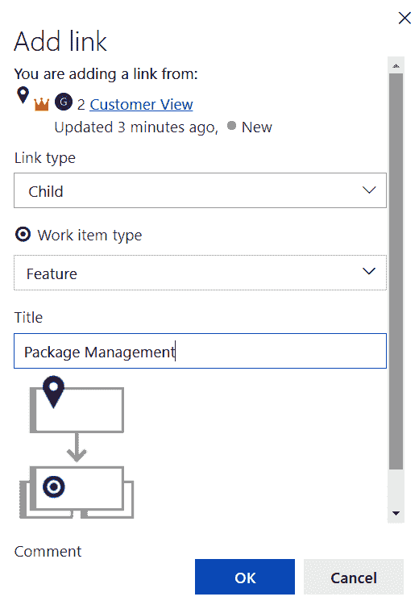

1.  一旦你创建了功能工作项，你将能够将其连接到几个详细说明其规格的产品待办事项工作项。以下截图显示了产品待办事项工作项的详细信息：

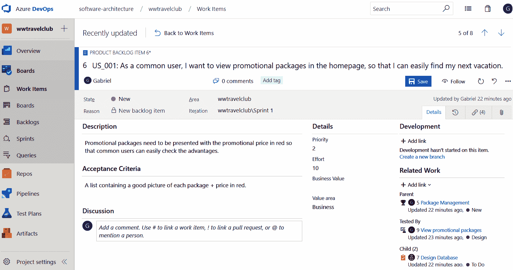

1.  之后，可以为每个产品待办事项工作项创建任务和测试用例工作项。Azure DevOps 提供的用户界面非常有效，因为它允许你跟踪功能链及其之间的关系：

1.  一旦你完成了产品待办事项和任务工作项的输入，你将能够与你的团队一起规划项目冲刺。计划视图允许你将产品待办事项工作项拖放到每个计划冲刺中：

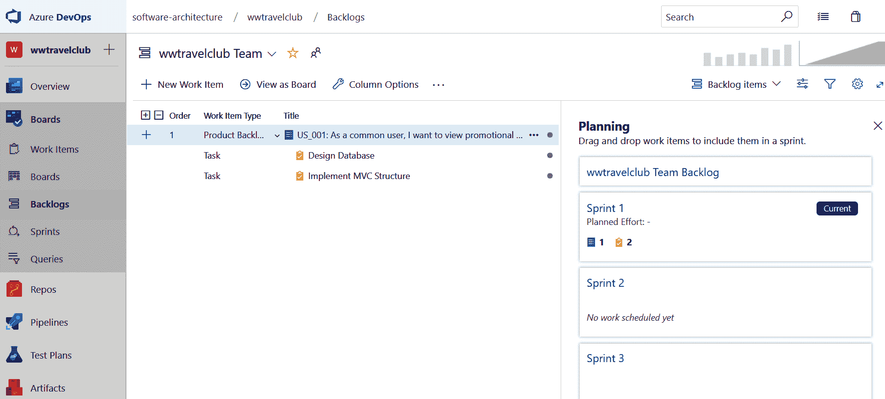

这些工作项就是这样创建的。一旦你理解了这个机制，你将能够创建和规划任何软件项目。值得一提的是，工具本身并不能解决与团队管理相关的问题。然而，这个工具是激励团队更新项目状态的一个很好的方式，这样你可以清楚地了解项目是如何发展的。

# 摘要

本章介绍了如何为软件开发项目创建 Azure DevOps 账户，以及如何使用 Azure DevOps 开始管理您的项目。它还简要回顾了所有 Azure DevOps 功能，解释了如何通过 Azure DevOps 主菜单访问它们。本章更详细地描述了如何管理系统需求，以及如何使用各种类型的工作项组织工作，以及如何规划和组织旨在交付具有许多功能的 Epic 解决方案的迭代。

下一章将讨论软件架构的不同模型。我们还将了解在开发基础设施时，如何从复杂的云平台（如 Azure）提供的选项中选择基本提示和标准。

# 问题

1.  Azure DevOps 仅适用于.NET Core 项目吗？

1.  Azure DevOps 能在特定分支提交后触发自动构建吗？Azure DevOps 能自动触发生产环境的部署吗？

1.  Azure DevOps 中可用的测试计划有哪些？

1.  DevOps 项目可以使用私有 NuGet 包吗？

1.  我们为什么使用工作项？

1.  Epic 和功能工作项之间的区别是什么？

1.  任务与产品待办事项/用户故事工作项之间存在什么样的关系？

# 进一步阅读

这里有一些书籍和链接，您可以考虑阅读，以收集更多关于本章信息：

+   [`go.microsoft.com/fwlink/?LinkID=825688`](https://go.microsoft.com/fwlink/?LinkID=825688)

+   [`www.packtpub.com/virtualization-and-cloud/hands-devops-azure-video`](https://www.packtpub.com/virtualization-and-cloud/hands-devops-azure-video)

+   [`www.packtpub.com/application-development/mastering-non-functional-requirements`](https://www.packtpub.com/application-development/mastering-non-functional-requirements)
