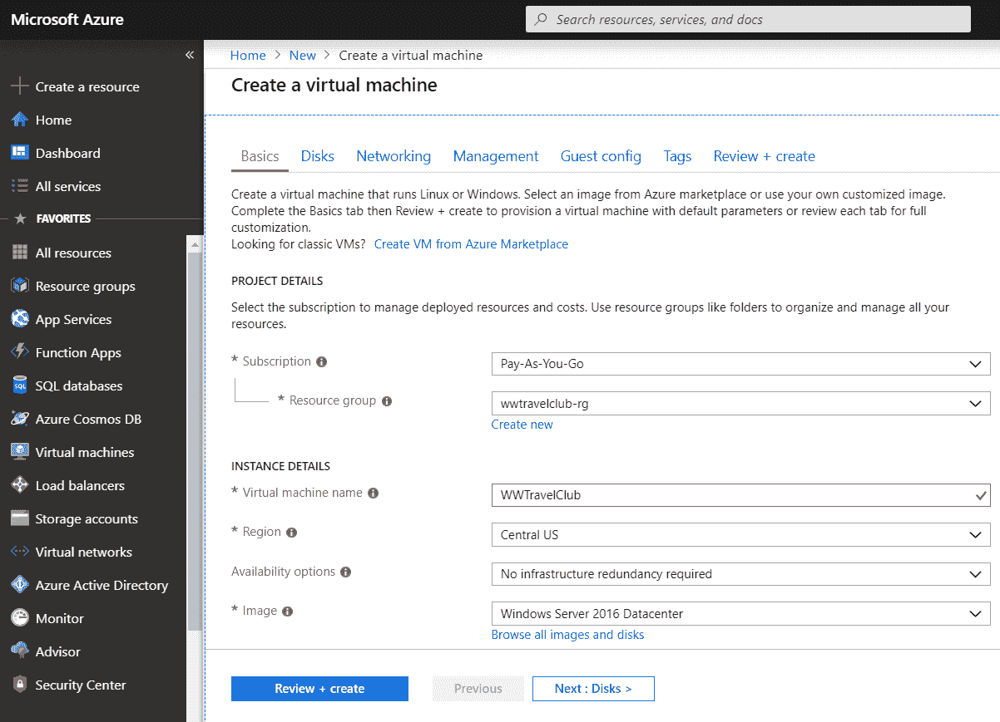
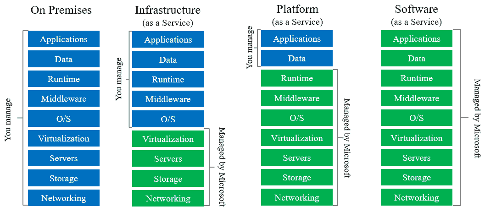
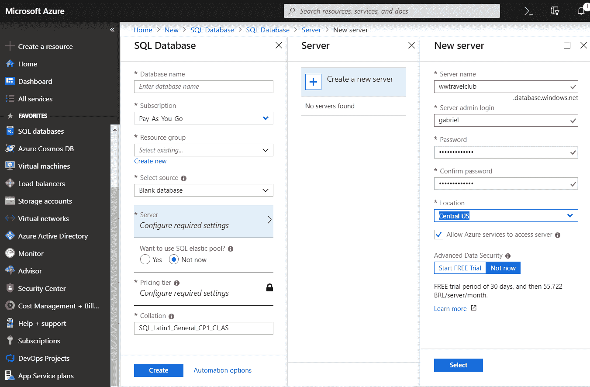
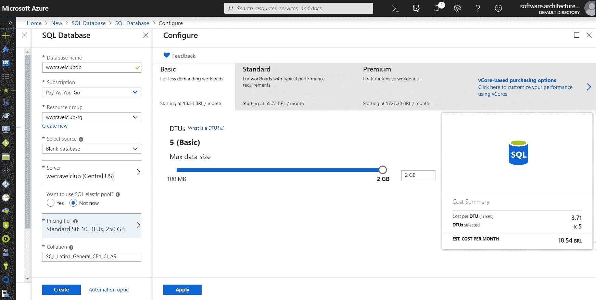
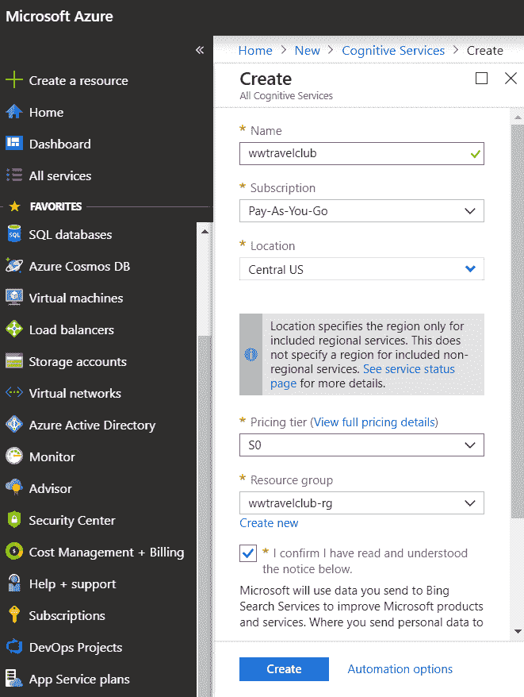
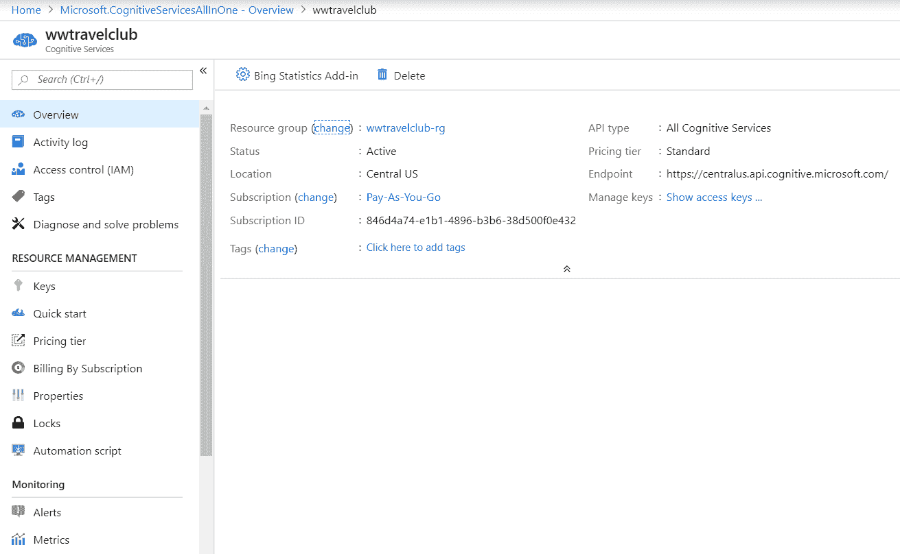

# 决定最佳云解决方案

为了设计你的应用程序使其基于云，你必须了解不同的架构设计——从最简单的到最复杂的。本章讨论了不同的软件架构模型，并教你如何利用云在解决方案中提供的机会。本章还将讨论我们在开发基础设施时可以考虑的不同类型的云服务，理想的场景是什么，以及我们可以在哪里使用它们。

本章将涵盖以下主题：

+   基础设施即服务解决方案

+   平台即服务解决方案

+   软件即服务解决方案

+   无服务器解决方案

+   如何使用混合解决方案以及为什么它们如此有用

# 技术要求

对于本章的实践内容，你必须创建或使用一个 Azure 账户。我在第一章，*理解软件架构的重要性*，的*创建 Azure 账户*部分解释了账户创建过程。

# 不同的软件部署模型

云解决方案可以采用不同的模型进行部署。你选择如何部署应用程序取决于你合作的团队类型。在拥有基础设施工程师的公司，你可能会发现更多的人在使用**基础设施即服务**（**IaaS**）。另一方面，在 IT 不是核心业务的公司，你会看到许多**软件即服务**（**SaaS**）系统。开发者决定使用**平台即服务**（**PaaS**）选项，或者无服务器部署，因为在这样的场景下他们不需要提供基础设施，这是非常常见的。

作为一名软件架构师，你必须应对这个环境，并确保你在解决方案的初始开发阶段以及维护阶段都在优化成本和工作因素。此外，作为架构师，你必须了解你系统的需求，并努力将这些需求与一流的周边解决方案相连接，以加快交付速度，并使解决方案尽可能接近客户的需求。

# 基础设施即服务与 Azure 机会

IaaS 是许多不同云服务提供商提供的云服务的第一代。它的定义在许多地方都可以找到，但我们可以将其总结为“你的计算基础设施通过互联网提供”。就像我们在本地数据中心中有服务的虚拟化一样，IaaS 也会为你提供虚拟化组件，如云中的服务器、存储和防火墙。

在 Azure 中，提供了多种以 IaaS 模型提供的服务。其中大部分是付费的，当进行测试时您应该注意这一点。值得一提的是，本书并不旨在详细描述 Azure 提供的所有 IaaS 服务。然而，作为一名软件架构师，您只需了解您将找到以下这样的服务：

+   **虚拟机**：Windows Server、Linux、Oracle 和数据分析 - 机器学习

+   **网络**：虚拟网络、负载均衡器和 DNS 区域。

+   **存储**：文件、表、数据库和 Redis。

执行以下步骤以在 Azure 中创建任何服务：

1.  您必须找到最适合您需求的服务，然后创建一个资源。以下截图显示了一个 Windows Server 虚拟机的配置过程：



1.  按照 Azure 提供的向导设置您的虚拟机，然后使用**远程桌面协议**（**RDP**）连接到它。这种订阅的一个大好奇点是您在几分钟内可以拥有的硬件容量。以下截图展示了这一点：


如果您将本地交付硬件的速度与云速度进行比较，您将意识到在上市时间方面，没有比云更好的选择。例如，截图底部展示的 D64s_v3 机器，拥有 64 个 CPU、256 GB 的 RAM 和 512 GB 的临时存储，这可能是您在本地数据中心中找不到的东西。此外，在某些用例中，这台机器在整个月份中可能只会使用几个小时，因此在本地场景中购买它的理由将是不成立的。这就是为什么云计算如此神奇！

# IaaS 中的安全责任

安全责任是了解 IaaS 平台时需要知道的另一件重要事情。许多人认为一旦决定上云，所有的安全都是由提供商完成的。然而，正如以下截图所示，这并不正确：



IaaS 将迫使您从操作系统到应用程序的每个层面都关注安全性。在某些情况下，这是不可避免的，但您必须理解这将增加您的系统成本。

如果您只想将现有的本地结构迁移到云端，IaaS 可以是一个不错的选择。这得益于 Azure 提供的工具以及所有其他服务，从而实现了可扩展性。然而，如果您计划从头开发应用程序，您也应该考虑 Azure 上可用的其他选项。

让我们在下一节检查其中一个最快的系统，那就是 PaaS。

# PaaS – 为开发者提供无限机会

如果您正在学习或已经学习过软件架构，您可能会完美理解下一句话的含义：世界在软件开发方面需要高速！如果您同意这一点，您会喜欢 PaaS。

正如您在前面的屏幕截图中看到的，PaaS 允许您仅在接近您业务的角度考虑安全问题：您的数据和应用程序。作为一名开发者，这意味着您不必实施大量配置，以确保您的解决方案安全运行。

此外，安全性处理并不是 PaaS 的唯一优势。作为一名软件架构师，您可以将这些服务作为快速提供更丰富解决方案的机会。上市时间可以肯定地证明许多基于 PaaS 的应用程序的成本是合理的。

现在，Azure 中提供了许多作为 PaaS 提供的服务，而且，这本书的目的并不是列出所有这些服务。然而，其中一些确实需要提及。这个列表还在不断增长，这里的建议是：尽可能多地使用和测试服务！确保您会考虑到这一点，提供更好的设计解决方案。

另一方面，值得一提的是，使用 PaaS 解决方案，您将无法完全控制操作系统。实际上，在许多情况下，您甚至没有连接到它的方法。这大多数时候是好的，但在某些调试情况下，您可能会错过这个功能。好消息是，PaaS 组件每天都在发展，微软最大的担忧之一是使它们广为人知。

以下部分介绍了 Microsoft 为 .NET Core Web 应用程序提供的最常见 PaaS 组件，例如 Azure Web 应用程序和 Azure SQL Server。我们还描述了 Azure 认知服务，这是一个非常强大的 PaaS 平台，展示了在 PaaS 世界中开发是多么美妙。我们将在本书的剩余部分更深入地探讨其中的一些。

# Web 应用程序

Web 应用程序是一个 PaaS 选项，您可以使用它来部署您的 Web 应用程序。您可以部署不同类型的应用程序，例如 .NET、.NET Core、Java、PHP、Node JS 和 Python。这种类型的示例在第一章中有所介绍，*理解软件架构的重要性*。

好处在于创建 Web 应用程序不需要任何结构，也不需要 IIS Web 服务器设置。在某些情况下，如果您使用 Linux 来托管您的 .NET Core 应用程序，您甚至根本就没有 IIS。

此外，Web 应用程序有一个计划选项，您无需为使用付费。当然，有一些限制，例如只能运行 32 位应用程序，并且无法启用可伸缩性，但这对原型设计来说可以是一个美好的场景。

# Azure SQL Server

想象一下，如果你不需要为部署这个数据库支付大服务器的费用，就能利用 SQL Server 的全部功能来快速部署解决方案会是什么样子。这适用于 Azure SQL Server。使用 Azure SQL Server，你有机会使用 Microsoft SQL Server 来完成你最需要的事情——存储和数据处理。在这种情况下，Azure 负责备份数据库。

Azure SQL Server 甚至提供了自动管理性能的选项。这被称为自动调优。同样，使用 PaaS 组件，你将能够专注于对你业务真正重要的事情：非常快的上市时间。

创建 Azure SQL Server 数据库的步骤相当简单，就像我们之前检查的其他组件一样。然而，有两件事你需要注意：服务器的创建以及你将如何被收费。

当你在 Azure SQL Server 中搜索创建数据库时，你会找到这个向导来帮助你：



正如你所见，你必须创建（至少对于第一个数据库）一个 `database.windows.net` 服务器，你的数据库将托管在这里。这个服务器将提供你使用当前工具（如 Visual Studio 或 SQL Server Management Studio）访问 SQL Server 数据库所需的所有参数。值得一提的是，你有一系列关于安全性的功能，例如透明加密和 IP 防火墙。

一旦你决定了你的数据库服务器的名称，你将能够选择你的系统将被收取费用的定价层。特别是在 Azure SQL Server 数据库中，有几种不同的定价选项，如以下截图所示。你应该仔细研究每一个，因为根据你的场景，通过优化定价层你可能能节省一些钱：



关于 SQL 配置的更多信息，你可以查看这个链接：[`azure.microsoft.com/en-us/services/sql-database/`](https://azure.microsoft.com/en-us/services/sql-database/).

一旦完成配置，你将能够以与你的 SQL Server 安装在本地时相同的方式连接到这个服务器数据库。你唯一需要关注的是 Azure SQL Server 防火墙的配置，但这设置起来相当简单，也是 PaaS 服务安全性的良好证明。

# Azure 认知服务

**人工智能**（**AI**）是软件架构中最常讨论的话题之一。我们离一个真正伟大的世界只有一步之遥，在那里人工智能将无处不在。为了使这句话成为现实，作为一名软件架构师，你不能把人工智能看作是每次都需要从头开始重新发明的软件。

Azure 认知服务可以帮助您实现这一点。在这个 API 集合中，您将找到开发视觉、知识、语音、搜索和语言解决方案的各种方法。其中一些需要训练才能使事物发生，但这些服务也提供了相应的 API。

从这个场景中可以看出 PaaS 的好处。在本地或 IaaS 环境中准备应用程序时，您需要执行的工作数量是巨大的。在 PaaS 中，您根本无需担心这一点。您完全专注于作为软件架构师真正关心的事情：解决您的业务问题。

在您的 Azure 账户中设置 Azure 认知服务也非常简单：

1.  首先，您需要像添加任何其他 Azure 组件一样添加认知服务，如下面的截图所示：



1.  一旦完成这些，您将能够使用服务器提供的 API。您将在您创建的服务中找到两个重要功能：端点和访问密钥。它们将在您的代码中用于访问 API：



以下代码示例展示了如何使用认知服务来翻译句子。这个翻译服务背后的主要概念是您可以按照服务设置的键和区域发布您想要翻译的句子。以下代码使您能够向服务 API 发送请求：

```cs
private static async Task<string> PostAPI(string api, string key, string region,
    string textToTranslate)
{
    string result = String.Empty;
    using (var client = new HttpClient())
    {
      using (var request = new HttpRequestMessage(HttpMethod.Post, api))
      {
        request.Headers.Add("Ocp-Apim-Subscription-Key", key);
        request.Headers.Add("Ocp-Apim-Subscription-Region", region);

        // five seconds for timeout
        client.Timeout = new TimeSpan(0, 0, 5);
        var body = new object[] { new { Text = textToTranslate } };
        var requestBody = JsonConvert.SerializeObject(body); 

        request.Content = new StringContent(requestBody, Encoding.UTF8,
          "application/json");

        var response = await client.SendAsync(request);

        if (response.IsSuccessStatusCode)
          result = await response.Content.ReadAsStringAsync();
      }
    }
    return result;
}
```

值得注意的是，前面的代码将允许您根据在参数中定义的键和区域将任何文本翻译成任何语言。以下是一个调用前面方法的程序示例：

```cs
/// <summary>
/// Check this content at: https://docs.microsoft.com/en-us/azure/cognitive
/// services/translator/reference/v3-0-reference
/// </summary>
static void Main()
{
    var host = "https://api.cognitive.microsofttranslator.com";
    var route = "/translate?api-version=3.0&to=es";
    var subscriptionKey = "[YOUR KEY HERE]";
    var region = "[YOUR REGION HERE]";

    var translatedSentence = PostAPI(host + route, subscriptionKey, region, 
      "Hello World!").Result;
    Console.WriteLine(translatedSentence);
}
```

这是一个如何轻松快速地使用此类服务来构建项目的完美示例。此外，这种开发方法非常好，因为您正在使用其他解决方案已经测试并使用过的代码片段。

# SaaS – 只需登录即可开始！

软件即服务可能是使用基于云的服务最简单的方式。云服务提供商为他们的最终用户提供了许多解决公司常见问题的良好选项。

这种类型服务的良好例子是 Office 365。这些平台的关键点在于您无需担心应用程序的维护。在您的团队完全专注于开发应用程序的核心业务场景中，这一点尤其方便。例如，如果您的解决方案需要提供良好的报告，您可能可以使用包含在 Office 365 中的 Power BI 来设计它们。

另一个很好的 SaaS 平台例子是 Azure DevOps。作为软件架构师，在 Azure DevOps 或 **Visual Studio Team Services** (**VSTS**) 之前，您需要安装和配置 Team Foundation Server（甚至更老的类似工具）以使您的团队能够使用一个共同的仓库和应用生命周期管理工具。

我们过去花费大量时间要么在准备服务器以安装**团队基础服务器**（**TFS**），要么在升级和维护已安装的 TFS。由于 SaaS Azure DevOps 的简单性，这不再需要。

# 理解无服务器意味着什么

这个词本身就说明了问题：无服务器解决方案意味着没有服务器的解决方案。但在云架构中这怎么可能呢？这很简单。在这种解决方案中，您不需要担心与服务器相关的任何问题。

您现在可能正在想无服务器只是另一个选项——当然，这是真的，因为这个架构并没有提供一个完整的解决方案。但关键点在于，在无服务器解决方案中，您拥有一个非常快速、简单和敏捷的应用生命周期，因为所有无服务器代码都是无状态的，并且与系统其余部分松散耦合。一些作者将其称为**函数即服务**（**FaaS**）。

当然，服务器在某处运行。关键点在于您不需要担心这一点，甚至不需要担心可扩展性。这将使您能够完全专注于您的应用程序业务逻辑。再次强调，世界需要快速发展和良好的客户体验。您越关注客户需求，效果就越好！

在第八章“使用 Azure Functions”，您将探索微软在 Azure 中提供的最佳无服务器实现之一——Azure Functions。在那里，我们将关注您如何开发无服务器解决方案，并了解它们的优缺点。

# 为什么混合应用在很多情况下如此有用？

混合解决方案是那些部分不共享统一架构选择的解决方案；每个部分都做出不同的架构选择。在云中，混合一词主要指将云子系统与本地子系统混合的解决方案。然而，它也可以指将 Web 子系统与特定设备子系统混合。

由于 Azure 可以提供的服务数量以及可以实施的设计架构数量，混合应用可能是本章解决的主要问题的最佳答案，即如何利用云在您的项目中提供的机会。如今，许多当前的项目正从本地解决方案迁移到云架构，并且根据您将交付这些项目的位置，您仍会发现许多关于迁移到云的负面观念。其中大部分与成本、安全和服务的可用性有关。

您需要理解这些先入为主的观念中确实有一些是真实的，但并非人们所想的那样。当然，作为软件架构师，您不能忽视它们。尤其是在开发关键系统时，您必须决定是否所有内容都可以放在云端，或者是否最好将系统的一部分部署在边缘。

移动解决方案可以被视为混合应用程序的典型例子，因为它们将基于 Web 的架构与基于设备的架构相结合，以提供更好的用户体验。有许多场景可以将移动应用程序替换为响应式网站。然而，当涉及到界面质量和性能时，可能响应式网站并不能满足最终用户真正的需求。

在下一节中，我们将讨论本书用例的实际示例。

# 用例 - 混合应用程序

如果您回到第一章，*理解软件架构的重要性*，您将找到一个系统需求，描述了我们的 WWTravelClub 示例应用程序应该运行的系统环境：

SR_003：系统应在 Windows、Linux、iOS 和 Android 平台上运行。

初看之下，任何开发者都会回答说：Web 应用程序。然而，iOS 和 Android 平台也需要作为软件架构师引起您的注意。在这种情况下，就像在许多情况下一样，用户体验是项目成功的关键。决策不仅需要由开发速度驱动，而且还需要由提供卓越用户体验所获得的收益驱动。

在这个项目中，软件架构师必须做出的另一个决定与移动应用程序的技术有关，如果他们决定开发一个。同样，这将是混合应用程序和本地应用程序之间的选择，因为在这种情况下，可以使用像 Xamarin 这样的混合解决方案。因此，在移动应用程序方面，您也有选择继续用 C#编写代码的选项。

以下截图展示了我们对 WWTravelClub 架构的第一选择。选择依赖 Azure 组件的决定与成本和维护考虑有关。以下各项将在本书的后续章节中讨论，包括第六章，*在 C#中与数据交互 - Entity Framework Core*，第七章，*如何在云中选择您的数据存储*，以及第八章，*与 Azure Functions 一起工作*，以及选择的原因。目前，只需知道 WWTravelClub 是一个混合应用程序，在移动设备上运行 Xamarin Apps，在服务器端运行.NET Core Web 应用程序即可：


将会有一个 Azure SQL Server 数据库通过 Entity Framework Core 连接到 Web 应用程序，这将在第六章，“在 C# 中与数据交互 - Entity Framework Core”中进行讨论。稍后，在第七章 7，“如何在云中选择您的数据存储”，我们将出于性能和成本考虑添加 NoSQL 数据库。对于图片存储，选择了文件存储。最后，Xamarin 应用程序将通过 Azure Functions 从系统中获取信息。

# 书籍用例 - 对于这个用例来说，哪个云平台是最好的？

正如你在最后一节的屏幕截图中可以验证的那样，WWTravelClub 架构主要是使用 Azure 提供的 Platform as a Service 和无服务器组件设计的。所有开发工作都将在 Azure DevOps SaaS Microsoft 平台上进行。

在我们 WWTravelClub 的假设场景中，赞助商指出 WWTravelClub 团队中没有人在基础设施方面有专长。这就是为什么软件架构使用了 PaaS 服务。考虑到这个场景和所需的发展速度，这些组件肯定会表现良好。

当我们飞越这本书中讨论的章节和技术时，这个架构将不断变化和演变，而不会受到任何早期选择的限制。这是 Azure 和现代架构设计提供的一个绝佳机会。你可以轻松地根据解决方案的发展更改组件和结构。

# 摘要

在本章中，你学习了如何在你的解决方案中利用云提供的服务，以及你可以选择的多种选项。

本章介绍了在云结构中交付相同应用程序的不同方式。我们还注意到微软是如何迅速将这些选项提供给其客户的，因为你可以将这些选项在实际应用程序中体验，并选择最适合你需求的选项，因为没有一种在所有情况下都适用的“银弹”。作为软件架构师，你需要分析你的环境和你的团队，然后决定在你的解决方案中实施的最佳云架构。

下一章将专门介绍如何构建由称为微服务的可扩展软件模块组成的灵活架构。

# 问题

1.  为什么你应该在你的解决方案中使用 IaaS？

1.  为什么你应该在你的解决方案中使用 PaaS？

1.  为什么你应该在你的解决方案中使用 SaaS？

1.  为什么你应该在你的解决方案中使用无服务器？

1.  使用 Azure SQL Server 数据库的优势是什么？

1.  你如何使用 Azure 加速应用程序中的 AI？

1.  混合架构如何帮助你设计更好的解决方案？

# 进一步阅读

你可以查看这些网络链接，以决定本章中哪些主题你应该深入研究：

+   [`visualstudio.microsoft.com/xamarin/`](https://visualstudio.microsoft.com/xamarin/)

+   [`www.packtpub.com/application-development/xamarin-cross-platform-application-development`](https://www.packtpub.com/application-development/xamarin-cross-platform-application-development)

+   [`www.packtpub.com/virtualization-and-cloud/learning-azure-functions`](https://www.packtpub.com/virtualization-and-cloud/learning-azure-functions)

+   [`azure.microsoft.com/overview/what-is-iaas/`](https://azure.microsoft.com/overview/what-is-iaas/)

+   [`docs.microsoft.com/en-us/azure/security/azure-security-iaas`](https://docs.microsoft.com/en-us/azure/security/azure-security-iaas)

+   [`azure.microsoft.com/services/app-service/web/`](https://azure.microsoft.com/services/app-service/web/)

+   [`azure.microsoft.com/services/sql-database/`](https://azure.microsoft.com/services/sql-database/)

+   [`azure.microsoft.com/en-us/services/virtual-machines/data-science-virtual-machines/`](https://azure.microsoft.com/en-us/services/virtual-machines/data-science-virtual-machines/)

+   [`docs.microsoft.com/azure/sql-database/sql-database-automatic-tuning`](https://docs.microsoft.com/azure/sql-database/sql-database-automatic-tuning)

+   [`azure.microsoft.com/en-us/services/cognitive-services/`](https://azure.microsoft.com/en-us/services/cognitive-services/)

+   [`docs.microsoft.com/en-us/azure/architecture/`](https://docs.microsoft.com/en-us/azure/architecture/)

+   [`powerbi.microsoft.com/`](https://powerbi.microsoft.com/)

+   [`office.com`](https://office.com)

+   [`azure.microsoft.com/en-us/overview/what-is-serverless-computing/`](https://azure.microsoft.com/en-us/overview/what-is-serverless-computing/)

+   [`azure.microsoft.com/en-us/pricing/details/sql-database/`](https://azure.microsoft.com/en-us/pricing/details/sql-database/)

+   [`www.packtpub.com/virtualization-and-cloud/professional-azure-sql-database-administration`](https://www.packtpub.com/virtualization-and-cloud/professional-azure-sql-database-administration)
