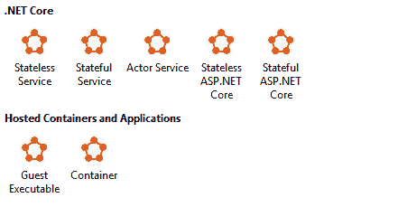
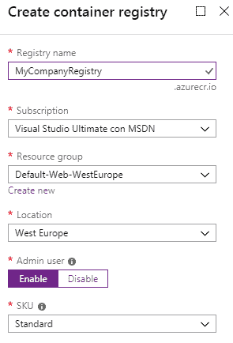
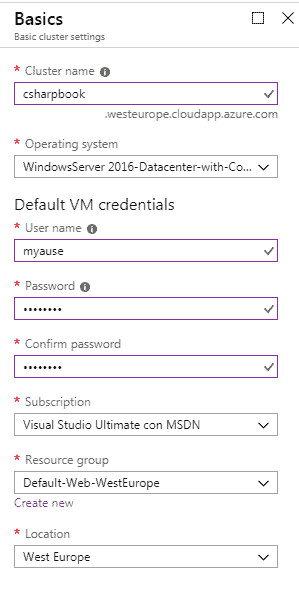
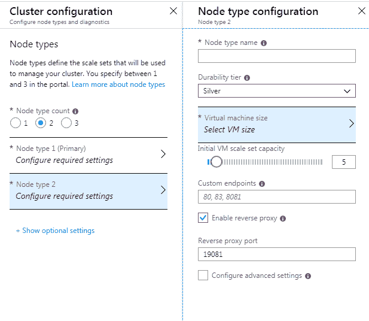
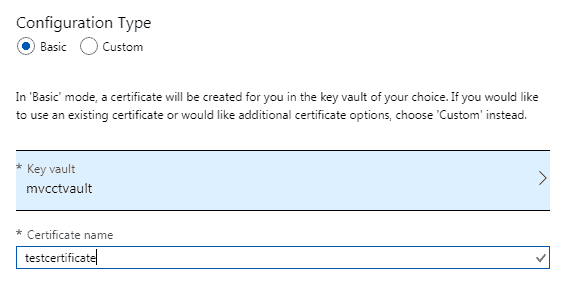

# 第五章：将微服务架构应用于您的企业应用程序

本章致力于描述基于称为微服务的小模块的高度可扩展架构。微服务架构允许进行细粒度的扩展操作，其中每个单独的模块都可以按需扩展，而不会影响系统的其余部分。此外，它们通过允许每个系统子部分独立于其他部分进行演变和部署，从而允许更好的**持续集成/持续部署**（**CI/CD**）。

在本章中，我们将涵盖以下主题：

+   什么是微服务？

+   微服务何时有帮助？

+   .NET Core 如何处理微服务？

+   管理微服务需要哪些工具？

+   用例 - 记录微服务

到本章结束时，你将学会如何根据本章的使用案例在 .NET Core 中实现一个微服务。

# 技术要求

在本章中，你需要以下内容：

+   Visual Studio 2017 或 2019 的免费社区版或更高版本，并安装了所有数据库工具。

+   一个免费的 Azure 账户。在第一章的“*创建 Azure 账户*”部分，*理解软件架构的重要性*，解释了如何创建一个账户。

+   用于在 Visual Studio 中调试微服务的 Azure Service Fabric 本地模拟器。它是免费的，可以从[`www.microsoft.com/web/handlers/webpi.ashx?command=getinstallerredirect&appid=MicrosoftAzure-ServiceFabric-CoreSDK`](https://www.microsoft.com/web/handlers/webpi.ashx?command=getinstallerredirect&appid=MicrosoftAzure-ServiceFabric-CoreSDK)下载。为了避免安装问题，请确保您的 Windows 版本是最新的。此外，模拟器使用 PowerShell 高权限级别命令，默认情况下，这些命令被 PowerShell 块。要启用它们，您需要在 Visual Studio 包管理器控制台或任何 PowerShell 控制台中执行以下命令。Visual Studio 或外部 PowerShell 控制台必须以 *管理员* 身份启动，以下命令才能成功：

```cs
Set-ExecutionPolicy -ExecutionPolicy Unrestricted -Force -Scope CurrentUser
```

+   如果您想在 Visual Studio 中调试 Docker 容器化的微服务，请使用 Docker CE for Windows ([`store.docker.com/editions/community/docker-ce-desktop-windows?tab=description`](https://store.docker.com/editions/community/docker-ce-desktop-windows?tab=description))。

# 什么是微服务？

微服务架构允许每个构成解决方案的模块独立于其他模块进行扩展，以实现最大吞吐量并最小化成本。实际上，扩展整个系统而不是其当前的瓶颈不可避免地会导致资源的巨大浪费，因此对子系统扩展的精细控制对系统的整体成本有重大影响。

然而，微服务不仅仅是可扩展的组件——它们是可以在彼此独立开发、维护和部署的软件构建块。将开发和维护分散到可以独立开发、维护和部署的模块中，可以改善整个系统的 CI/CD 循环（*CI/CD* 概念在第三章的*使用 Azure DevOps 组织工作*部分中进行了更详细的解释，*使用 Azure DevOps 记录需求*）。

CI/CD 的改进归功于微服务的**独立性**，因为它使得以下成为可能：

+   在不同类型的硬件上扩展和分发微服务。

+   由于每个微服务都是独立于其他微服务部署的，因此不存在二进制兼容性或数据库结构兼容性约束。因此，没有必要对组成系统的不同微服务的版本进行对齐。这意味着它们中的每一个都可以根据需要独立演进，而不会受到其他微服务的限制。

+   将其开发分配给完全独立的较小团队，从而简化工作组织并减少处理大型团队时产生的所有不可避免的协调低效率。

+   使用更合适的技术和更合适的环境来实现每个微服务，因为每个微服务都是一个独立的部署单元。这意味着选择最适合您需求的工具和最小化开发努力/最大化性能的环境。

+   由于每个微服务可以使用不同的技术、编程语言、工具和操作系统来实现，企业可以通过将环境与开发者的技能相匹配来利用所有可用的人力资源。例如，未充分利用的 Java 开发者也可以参与 .NET 项目，如果他们使用 Java 实现具有相同所需行为的微服务。

+   历史子系统可以被嵌入到独立的微服务中，从而使得它们能够与较新的子系统进行协作。这样，公司可以缩短新系统版本的上市时间。此外，通过这种方式，历史系统可以缓慢地向更现代的系统演进，同时对成本和组织的影响是可接受的。

下一个子节将解释微服务概念是如何产生的。然后，我们将继续本介绍性章节，探讨基本微服务设计原则，并分析为什么微服务通常被设计为 Docker 容器。

# 微服务与模块概念的演进

为了更好地理解微服务的优势以及它们的设计技术，我们必须牢记软件模块化和软件模块的双重特性：

+   代码模块化指的是一种代码组织方式，它使得我们能够轻松地修改代码块，而不会影响到应用程序的其他部分。这通常通过面向对象设计来实现，其中*模块*可以通过类来识别。

+   部署模块化取决于你的部署单元及其属性。最简单的部署单元是可执行文件和库。因此，例如，**动态链接库**（**DLL**）肯定比静态库更模块化，因为它们在部署之前不需要与主可执行文件链接。

虽然代码模块化的基本概念已经达到稳定状态，但部署模块化的概念仍在不断发展，微服务目前是这一发展路径上的尖端技术。

作为对导致微服务的主要里程碑的简要回顾，我们可以这样说，首先，单体可执行文件被分解为静态库。后来，动态链接库取代了静态库。

当.NET（以及其他类似框架，如 Java）改进了可执行文件和库的模块化时，发生了巨大的变化。实际上，由于.NET 在库首次执行时编译为中间语言，因此它们可以在不同的硬件和不同的操作系统上部署。此外，它们克服了先前 DLL 的一些版本问题，因为任何可执行文件都附带一个与操作系统中安装的相同 DLL 版本不同的 DLL。

然而，.NET 无法接受使用不同版本的共同依赖项的两个引用 DLL——比如说，A 和 B。例如，假设有一个 A 的新版本，它包含许多我们希望使用的新功能，而这些功能反过来又依赖于 B 不支持的新版本的 C。在类似的情况下，我们应该放弃 A 的新版本，因为 C 与 B 的不兼容性。这种困难导致了两个重要的变化：

+   开发世界从 DLL 和/或单个文件转向了包管理系统，如 NuGet 和 npm，这些系统通过*语义版本化*自动检查版本兼容性。

+   **面向服务的架构**（**SOA**）。部署单元开始以 XML 的形式实现，然后是 RESTful Web 服务。这解决了版本兼容性问题，因为每个 Web 服务都在不同的进程中运行，并且可以使用每个库的最合适版本，而不会与其他 Web 服务造成不兼容的风险。此外，每个 Web 服务暴露的接口是平台无关的，也就是说，Web 服务可以使用任何框架与应用程序连接，并在任何操作系统上运行，因为 Web 服务协议基于普遍接受的标准。SOA 和协议将在第十二章中更详细地讨论，*使用.NET Core 应用面向服务的架构*。

微服务是 SOA 的演进，增加了更多特性和约束，这些特性和约束提高了服务的可扩展性和模块化，从而改善了整体的 CI/CD 周期。有时人们会说，*微服务是做得好的 SOA*。

# 微服务设计原则

总结一下，微服务架构是一种 SOA，它最大化了独立性和细粒度扩展。既然我们已经阐明了微服务独立性和细粒度扩展的所有优势，以及独立的本质，我们现在可以看看微服务设计原则。

让我们从独立约束产生的原则开始：

+   **设计选择的独立性**：每个微服务的架构设计不能依赖于其他微服务实现中做出的设计选择。这个原则使得每个微服务的 CI/CD 周期完全独立，并给我们提供了更多关于如何实现每个微服务的科技选择。这样，我们可以选择最佳的技术来实现每个微服务。

    这个原则的另一个后果是，不同的微服务不能连接到同一个共享存储（数据库或文件系统），因为共享相同的存储也意味着共享所有决定了存储子系统结构（数据库表设计、数据库引擎等）的设计选择。因此，要么微服务有自己的数据存储，要么它根本不存储任何数据，并与负责处理存储的其他微服务进行通信。

    在这里，拥有专用数据存储并不意味着物理数据库分布在微服务自身的进程边界内，而是微服务可以独占访问由外部数据库引擎处理的数据库或数据库表集。实际上，出于性能原因，数据库引擎必须在专用硬件上运行，并使用针对其存储功能进行优化的操作系统和硬件功能。通常，*设计选择的独立性*通过区分逻辑微服务和物理微服务来以更轻的形式解释。更具体地说，逻辑微服务通过使用相同数据存储但独立负载均衡的多个物理微服务来实现。也就是说，逻辑微服务被设计为一个逻辑统一体，然后拆分为更多的物理微服务以实现更好的负载均衡。

+   **独立于部署环境**：微服务可以在不同的硬件节点上扩展，并且不同的微服务可以托管在同一节点上。因此，微服务对操作系统提供的服务的依赖性越小，对其他已安装软件的依赖性越小，它可以在更多的硬件节点上部署。还可以进行更多的节点优化。

    这是微服务通常被容器化并使用 Docker 的原因。容器将在本章的“容器和 Docker”小节中更详细地讨论，但基本上，容器化是一种技术，它允许每个微服务携带其依赖项，以便它可以在任何地方运行。

+   **松散耦合**：每个微服务必须与其他所有微服务松散耦合。这个原则有两个方面。一方面，这意味着根据面向对象编程原则，每个微服务暴露的接口不应过于具体，而应尽可能通用。然而，这也意味着微服务之间的通信必须最小化，以减少通信成本，因为微服务不共享相同的地址空间，并且在不同的硬件节点上运行。

+   **无链式请求/响应**：当一个请求到达微服务时，它必须不会导致对其他微服务的嵌套请求/响应的递归链，因为类似的链会导致不可接受的响应时间。如果所有微服务的私有数据模型在每次更改时都通过推送通知同步，则可以避免链式请求/响应。换句话说，一旦微服务处理的数据发生变化，这些更改就会发送到所有可能需要它们的微服务，以便它们可以处理请求。这样，每个微服务都可以在其私有数据存储中拥有所有它需要的数据，以处理所有传入的请求，无需请求其他微服务提供它所缺少的数据。

    总之，每个微服务都必须包含它为服务传入请求和确保快速响应所需的所有数据。为了保持其数据模型最新并准备好接收传入请求，微服务必须在数据变化发生时立即通知其数据变化。这些数据变化应通过异步消息进行通信，因为同步嵌套消息会导致不可接受的性能，因为它们会阻塞调用树中所有涉及的线程，直到返回结果。

值得指出的是，我们提到的第一个约束实质上是领域驱动设计的边界上下文原则，我们将在第十章“理解软件解决方案中的不同领域”中详细讨论。在本章中，我们将看到，通常，完整的领域驱动设计方法对每个微服务的*更新*子系统是有用的。

反过来也成立，即根据边界上下文原则开发出的系统，用微服务架构实现会更好。事实上，一旦一个系统被分解为几个完全独立且松散耦合的部分，由于不同的流量和不同的资源需求，这些不同的部分很可能需要独立扩展。

前述约束是构建可重用 SOA 的一些最佳实践。关于这些最佳实践的更多细节将在第十二章“使用.NET Core 应用服务架构”中给出，但如今，大多数 SOA 最佳实践都由用于实现 Web 服务的工具和框架自动执行。

精细粒度扩展要求微服务足够小，以便隔离定义良好的功能，但这同时也需要一个复杂的基础设施，该基础设施负责自动实例化微服务、在节点上分配实例以及按需扩展它们。这类结构将在本章的“需要哪些工具来管理微服务？”部分进行讨论。

此外，通过异步通信进行通信的分布式微服务的精细粒度扩展需要每个微服务都具有弹性。实际上，指向特定微服务实例的通信可能会因为硬件故障或简单的理由（例如，在负载均衡操作期间目标实例被杀死或移动到另一个节点）而失败。

可以通过指数重试来克服暂时性故障。这就是在每个故障后，我们都会以指数级增加的延迟重试相同的操作，直到达到最大尝试次数。例如，首先，我们会在 10 毫秒后重试，如果这次重试操作导致失败，则会在 20 毫秒后进行新的尝试，然后是 40 毫秒，以此类推。

另一方面，长期故障通常会导致重试操作的爆炸性增长，这可能会以类似于拒绝服务攻击的方式耗尽所有系统资源。因此，通常，指数退避与**断路器策略**一起使用：在给定数量的失败之后，假设发生长期故障，并通过返回一个立即失败而不尝试通信操作来防止在给定时间内访问资源。

此外，某些子系统由于故障或请求峰值而导致的拥塞不应传播到其他系统部分，以防止整体系统拥塞。**隔离舱隔离**通过以下方式避免拥塞传播：

+   只允许最大数量的类似同时出站请求，比如说，10 个。这类似于对线程创建设置上限。

+   超过之前限制的请求将被排队。

+   如果达到最大队列长度，任何进一步的请求将导致抛出异常以终止它们。

重试策略可能会使得相同的消息被接收和处理多次，因为发送者没有收到消息已被接收的确认，或者简单地因为超时了操作，而接收者实际上已经接收了消息。解决这个问题的唯一可能方法是设计所有消息，使它们是幂等的，也就是说，以这种方式设计消息，即多次处理相同的消息具有与处理一次相同的效果。

例如，将数据库表字段更新为某个值是一个幂等操作，因为重复一次或两次具有完全相同的效果。然而，增加一个十进制字段不是幂等操作。微服务设计者应努力设计尽可能多的幂等消息的整体应用程序。剩余的非幂等消息必须以下列方式或使用其他类似技术转换为幂等消息：

+   附加一个时间和一些唯一标识符，以唯一标识每条消息。

+   将所有已接收的消息存储在一个字典中，该字典按前一点提到的消息附加的唯一标识符进行索引。

+   拒绝旧消息。

+   当接收到可能重复的消息时，验证它是否包含在字典中。如果是，那么它已经被处理，因此拒绝它。

+   由于拒绝旧消息，它们可以定期从字典中删除，以避免其指数增长。

我们将在本章末尾的示例中使用这项技术。

在下一小节中，我们将讨论基于 Docker 的微服务容器化。

# 容器和 Docker

我们已经讨论了拥有不依赖于运行环境的微服务的优势：更好的硬件使用率，能够混合旧软件与较新的模块，能够混合多个开发堆栈以使用每个模块实现的最佳堆栈，等等。通过在每个微服务上部署所有依赖项到私有虚拟机，可以轻松实现对托管环境的独立性。

然而，启动带有其私有操作系统副本的虚拟机需要很长时间，而微服务必须快速启动和停止以减少负载均衡和故障恢复成本。实际上，新的微服务可能被启动是为了替换有故障的微服务，或者是因为它们从一个硬件节点移动到另一个节点以执行负载均衡。此外，将整个操作系统的副本添加到每个微服务实例中将会造成过度的开销。

幸运的是，微服务可以依赖一种更轻量级的技术：容器。容器是一种轻量级的虚拟机。它们不虚拟化整个机器——它们只是虚拟化了位于操作系统内核之上的操作系统（**OS**）文件系统级别。它们使用宿主机的操作系统（内核、DLL 和驱动程序）并依赖于操作系统的原生功能来隔离进程和资源，以确保为运行的镜像提供一个隔离的环境。

因此，容器与特定的操作系统相关联，但它们不会遭受在每个容器实例中复制和启动整个操作系统的开销。

在每台主机机器上，容器由一个运行时处理，该运行时负责从 *镜像* 中创建它们并为每个容器创建一个隔离的环境。最著名的容器运行时是 Docker，它是容器化的**事实标准**。

镜像是文件，指定了每个容器中包含的内容以及哪些容器资源，例如通信端口，要暴露在容器外部。没有任何镜像需要明确指定其全部内容，但它们可以引用其他镜像。这样，通过在现有镜像之上添加新的软件和配置信息来构建镜像。

例如，如果您想将 .NET Core 应用程序作为 Docker 镜像部署，只需将您的软件和文件添加到您的 Docker 镜像中，然后引用一个已经存在的 .NET Core Docker 镜像即可。

为了便于图像引用，图像被分组到注册表中，这些注册表可以是公共的或私有的。它们类似于 NuGet 或 npm 注册表。Docker 提供了一个公共注册表（[`hub.docker.com/_/registry`](https://github.com/Particular/Workshop/tree/master/demos/asp-net-core)），在那里您可以找到您可能需要在自己的图像中引用的大多数公共图像。然而，每个公司都可以定义私有注册表。例如，Azure 提供了一个私有容器注册表服务：`https://azure.microsoft.com/en-us/services/container-registry/`。

在实例化每个容器之前，Docker 运行时必须解决所有递归引用。这个繁琐的工作不是每次创建新容器时都执行，因为 Docker 运行时有一个缓存，其中存储了与每个输入镜像相对应的完全组装的镜像，并且这些镜像已经被处理。

由于每个应用程序通常由多个模块组成，这些模块需要在不同的容器中运行，因此 Docker 还允许`.yml`文件，也称为组合文件，这些文件指定以下信息：

+   部署哪些镜像。

+   每个镜像暴露的内部资源必须映射到宿主机的物理资源。例如，Docker 镜像暴露的通信端口必须映射到物理机的端口。

我们将在本章的*.NET Core 如何处理微服务？*部分分析 Docker 镜像和`.yml`文件。

Docker 运行时在单台机器上处理镜像和容器，但通常，容器化的微服务是在由多台机器组成的集群上部署和负载均衡的。集群由称为**编排器**的软件组件处理。编排器将在本章的*需要哪些工具来管理微服务？*部分进行讨论。

现在我们已经了解了微服务是什么，它们可以解决哪些问题，以及它们的基本设计原则，我们准备分析在系统架构中何时以及如何使用它们。下一节将分析何时应该使用它们。

# 微服务何时有帮助？

这个问题的答案需要我们理解微服务在现代软件架构中扮演的角色。我们将在接下来的小节中探讨这一点。

# 分层架构和微服务

企业系统通常以逻辑独立的层组织。第一层是与用户交互的层，称为表示层，而最后一层负责存储/检索数据，称为数据层。请求从表示层发起，穿过所有层直到达到数据层，然后返回，反向穿越所有层直到达到表示层，该层负责将结果展示给用户/客户端。层之间不能*跳过*。

每一层从前一层数据，处理它，并将其传递到下一层。然后，它从下一层接收结果，并将其发送回前一层。此外，抛出的异常不能跨越层——每一层都必须负责拦截所有异常，或者以某种方式*解决*它们，或者将它们转换为其前一层的语言表达的其他异常。层架构确保了每一层的功能完全独立于其他层的功能。

例如，我们可以更改数据库引擎，而不会影响数据层之上的所有层。同样，我们可以完全更改用户界面，即表示层，而不会影响系统的其余部分。

此外，每一层实现不同类型的系统规范。数据层负责系统*必须记住*的内容，表示层负责系统-用户交互协议，而中间的所有层实现领域规则，这些规则指定数据必须如何处理（例如，如何计算雇员的工资单）。通常，数据和表示层之间仅由一个领域规则层隔开，称为业务层或应用层。

每一层都*说*着不同的语言：数据层*说*着所选存储引擎的语言，业务层*说*着领域专家的语言，而表示层*说*着用户的语言。因此，当数据和异常从一个层传递到另一个层时，它们必须被翻译成目标层的语言。

如何构建分层架构的详细示例将在第十章的*用例 - 日志微服务*部分给出，该部分专门介绍软件解决方案中的不同领域，其链接为 Chapter 10。

话虽如此，微服务如何适应分层架构？它们是否足够满足所有层的功能，或者只是某些层的功能？单个微服务能否跨越几个层？

最后一个问题最容易回答：是的！实际上，我们早已指出，微服务应该在其逻辑边界内存储它们所需的数据。因此，存在跨越业务和数据层的微服务。还有一些其他微服务负责封装共享数据，并保持在数据层内。因此，我们可能有业务层微服务、数据层微服务和跨越两个层的微服务。那么，表示层呢？

如果表示层在服务器端实现，它也可以适应微服务架构。单页应用和移动应用在客户端机器上运行表示层，因此它们要么直接连接到业务微服务层，要么更常见的是连接到一个*API 网关*，该网关公开接口并负责将请求路由到正确的微服务。

在微服务架构中，当表示层是一个网站时，它可以由一组微服务实现。然而，如果它需要重型 Web 服务器和/或重型框架，容器化它们可能不方便。这个决定还必须考虑容器化 Web 服务器时可能发生的性能损失，以及可能需要在 Web 服务器和系统其余部分之间设置硬件防火墙的需求。

ASP.NET Core 是一个轻量级框架，它在轻量级的 Kestrel 网络服务器上运行，因此它可以有效地容器化并用于内部应用程序的微服务。然而，公共高流量网站需要专门的硬件/软件组件，这阻止了它们与其他微服务一起部署。实际上，虽然 Kestrel 对于内部网站是一个可接受的解决方案，但公共网站需要一个更完整的网络服务器，如 IIS。在这种情况下，安全要求更加紧迫，需要专门的硬件/软件组件。

单体网站可以很容易地被拆分成负载均衡的较小子站，而不需要特定的微服务技术，但微服务架构可以将微服务的所有优势带入单个 HTML 页面的构建中。更具体地说，不同的微服务可能负责每个 HTML 页面的不同区域。不幸的是，在撰写本文时，使用现有的.NET 和.NET Core 技术实现这样的类似场景并不容易。

一个实现基于 ASP.NET Core 的微服务的概念证明，这些微服务协同构建每个 HTML 页面，可以在以下位置找到：[`github.com/Particular/Workshop/tree/master/demos/asp-net-core`](https://github.com/Particular/Workshop/tree/master/demos/asp-net-core)。这种方法的主要限制是微服务仅合作生成生成 HTML 页面所需的数据，而不是生成实际的 HTML 页面。相反，这由单体网关处理。实际上，在撰写本文时，如 ASP.NET Core MVC 之类的框架不提供任何用于 HTML 生成的分发功能。我们将在第十三章，*展示 ASP.NET Core MVC*中回到这个例子。

现在我们已经明确了系统哪些部分可以从采用微服务中受益，我们准备好陈述在决定如何采用它们时的规则。

# 在什么情况下值得考虑微服务架构？

微服务可以提高业务和数据层的实现，但它们的采用有一些成本：

+   将实例分配到节点并对其进行扩展在云费用或内部基础设施和许可证方面都有成本。

+   将一个独特的过程拆分成更小的通信过程会增加通信成本和硬件需求，尤其是在微服务被容器化的情况下。

+   为微服务设计和测试软件需要更多时间，并增加了人力资源成本。特别是，使微服务具有弹性并确保它们能够充分处理所有可能的故障，以及通过集成测试验证这些功能，可能会将开发时间增加一个数量级以上。

那么，微服务何时值得使用它们的成本？是否有必须作为微服务实现的函数？

对于第一个问题的粗略答案是：是的，当应用在流量和/或软件复杂度方面足够大时。实际上，随着应用在复杂性和流量方面的增长，我们建议我们承担与扩展相关的成本，因为这允许进行更多的扩展优化，并且在开发团队方面有更好的处理能力。我们为此付出的成本很快就会超过采用微服务的成本。

因此，如果细粒度扩展对我们应用有意义，并且我们能够估计细粒度扩展和开发带来的节省，我们就可以轻松计算出整体应用吞吐量限制，这使得采用微服务变得方便。

微服务成本也可以通过我们产品/服务的市场价值增加来证明。由于微服务架构允许我们使用针对其使用进行优化的技术来实现每个微服务，因此我们软件中增加的质量可能证明所有或部分微服务成本是合理的。

然而，扩展和技术优化并不是唯一需要考虑的参数。有时，我们被迫采用微服务架构，而无法进行详细的成本分析。

如果负责整个系统 CI/CD 的团队规模过大，这个大团队的组织和协调会带来困难和低效。在这种情况下，转向一个将整个 CI/CD 周期分解为独立部分，这些部分可以由较小的团队负责的架构是可取的。

此外，由于这些开发成本只有通过高请求量才能证明是合理的，我们可能处理着由不同团队开发的独立模块的高流量。因此，扩展优化和减少开发团队之间交互的需要使得采用微服务架构非常方便。

从这个结论中，我们可能得出，如果系统和开发团队增长得太大，有必要将开发团队分成更小的团队，每个团队负责一个高效的边界上下文子系统。在类似的情况下，微服务架构可能是唯一可行的选择。

另一种迫使采用微服务架构的情况是将基于不同技术的较新子部分与旧子系统集成，因为容器化微服务是唯一能够实现旧系统与新子部分之间有效交互以逐步用较新的子部分替换旧子部分的方式。同样，如果我们的团队由具有不同开发栈经验的开发者组成，基于容器化微服务的架构可能成为*必需的*。

在下一节中，我们将分析可用的构建块和工具，以便我们可以实现基于.NET Core 的微服务。

# .NET Core 如何处理微服务？

.NET Core 被构想为一个轻量级且快速的跨平台框架，足以实现高效的微服务。特别是，ASP.NET Core 是实现 REST API 的理想工具，用于与微服务通信，因为它可以与轻量级网络服务器如 Kestrel 高效运行，并且自身也是轻量级和模块化的。

整个.NET Core 框架都是基于微服务作为战略部署平台而演化的，它提供了构建高效且轻量级 HTTP 通信的设施和包，以确保服务弹性并处理长时间运行的任务。以下小节将描述我们可以使用的一些不同工具或解决方案来实现基于.NET Core 的微服务架构。

# .NET Core 通信设施

微服务需要两种类型的通信渠道：

+   接收外部请求的通信渠道，可以是直接或通过 API 网关。由于可用的网络服务标准和工具，HTTP 是外部通信的常用协议。.NET Core 的主要 HTTP 通信设施是 ASP.NET Core，因为它是一个轻量级的 HTTP 框架，这使得它非常适合在小型微服务中实现 Web API。我们将在第十二章中详细描述 ASP.NET Core 应用程序，*使用.NET Core 应用服务导向架构*，该章节专门介绍 HTTP 服务。.NET Core 还提供了一个高效且模块化的 HTTP 客户端解决方案，能够池化和重用重量级的连接对象。此外，`HttpClient`类将在第十二章中更详细地描述，*使用.NET Core 应用服务导向架构*。

+   一种不同的通信通道类型，用于向其他微服务推送更新。实际上，我们已提到，由于复杂的阻塞调用树会提高请求延迟到不可接受的水平，因此微服务之间的内部通信不能由一个正在进行的请求触发。因此，在它们被使用之前不应立即请求更新，并且应在状态发生变化时推送。理想情况下，这种通信应该是异步的，以实现可接受的性能。实际上，同步调用会在等待结果时阻塞发送者，从而增加每个微服务的空闲时间。然而，如果通信足够快（低通信延迟和高带宽），仅将请求放入处理队列并返回成功通信确认而不是最终结果的同步通信是可以接受的。发布/订阅通信会更可取，因为在这种情况下，发送者和接收者不需要相互了解，从而增加了微服务的独立性。实际上，所有对某种类型的通信感兴趣的接收者只需注册以接收特定的 *事件*，而发送者只需发布这些事件。所有连接都是由一个负责排队事件并将它们分发给所有订阅者的服务来完成的。发布/订阅模式将在第九章设计模式和 .NET Core 实现中更详细地描述，以及其他有用的模式。

虽然 .NET Core 没有直接提供帮助异步通信的工具，也没有实现发布/订阅通信的客户端/服务器工具，但 Azure 提供了类似的服务，即 *Azure Service Bus*。Azure Service Bus 通过 Azure Service Bus *队列*处理排队异步通信，并通过 Azure Service Bus *主题*处理发布/订阅通信。

一旦你在 Azure 门户上配置了 Azure Service Bus，你就可以通过包含在 `Microsoft.Azure.ServiceBus` NuGet 包中的客户端连接到它，以发送消息/事件并通过接收消息/事件。

Azure Service Bus 有两种通信类型：基于队列和基于主题。在基于队列的通信中，每个发送者放入队列的消息将由第一个从队列中拉取它的接收者移除。另一方面，基于主题的通信是发布/订阅模式的实现。每个主题都有多个订阅，并且每个发送到主题的消息的不同副本都可以从每个主题订阅中拉取。

设计流程如下：

1.  定义一个 Azure Service Bus 私有命名空间。

1.  获取由 Azure 门户创建的根连接字符串，或定义具有较少权限的新连接字符串。

1.  定义发送者将发送其消息的二进制格式的队列和/或主题。

1.  对于每个主题，为所有必需的订阅定义名称。

1.  在基于队列的通信情况下，发送者向队列发送消息，接收者从同一个队列中拉取消息。每条消息只被发送给一个接收者。也就是说，一旦接收者获得对队列的访问权限，它就会读取并移除一条或多条消息。

1.  在基于主题的通信情况下，每个发送者向一个主题发送消息，而每个接收者从与该主题关联的私有订阅中拉取消息。

还有其他商业替代方案，如 NServiceBus、MassTransit、Brighter 和 ActiveMQ。还有一个免费的开源选项：RabbitMQ。RabbitMQ 可以安装在本地、虚拟机或 Docker 容器中。然后，你可以通过包含在`RabbitMQ.Client` NuGet 包中的客户端与之连接。

RabbitMQ 的功能与 Azure Service Bus 提供的功能类似，但你必须注意所有实现细节、执行操作的确认等，而 Azure Service Bus 则负责所有底层任务并提供一个更简单的接口。Azure Service Bus 和 RabbitMQ 将与基于发布/订阅的通信一起在第九章，“设计模式和.NET Core 实现”中描述。

如果微服务发布到将在下一节中描述的 Azure Service Fabric，我们可以使用内置的可靠二进制通信。由于通信原语自动使用重试策略，因此通信是弹性的。这种通信是同步的，但这不是一个大限制，因为 Azure Service Fabric 中的微服务具有内置队列；因此，一旦接收者收到消息，它们只需将其放入队列并立即返回，而不会阻塞发送者。

队列中的消息随后由一个单独的线程进行处理。这种内置通信的主要局限性在于它不是基于发布/订阅模式；发送者和接收者必须相互了解。当这不可接受时，你应该使用 Azure Service Bus。我们将在本章的“用例 - 日志微服务”部分学习如何使用 Service Fabric 的内置通信。

# 弹性任务执行

使用由.NET Foundation 维护的名为 Polly 的.NET Core 库，可以轻松实现弹性通信和一般性的弹性任务执行。Polly 可以通过 Polly NuGet 包获取。

在 Polly 中，你定义策略，然后在该策略的上下文中执行任务，如下所示：

```cs
var myPolicy = Policy
  .Handle<HttpRequestException>()
  .Or<OperationCanceledException>()
  .Retry(3);
....
....
myPolicy.Execute(()=>{
    //your code here
});
```

每个策略的第一部分指定必须处理的异常。然后，您指定在捕获到这些异常之一时执行的操作。在前面的代码中，如果报告失败是由 `HttpRequestException` 异常或 `OperationCanceledException` 异常引起的，则 `Execute` 方法将重试最多三次。

以下是一个指数重试策略的实现：

```cs
var erPolicy= Policy
    ...
    //Exceptions to handle here
    .WaitAndRetry(6, 
        retryAttempt => TimeSpan.FromSeconds(Math.Pow(2,
            retryAttempt)));
```

`WaitAndRetry` 的第一个参数指定在失败的情况下最多执行六次重试。作为第二个参数传递的 lambda 函数指定在下次尝试之前等待的时间。在具体示例中，这个时间随着尝试次数的指数增长，以 2 的幂次（第一次重试为 2 秒，第二次重试为 4 秒，依此类推）。

以下是一个简单的断路器策略：

```cs
var cbPolicy=Policy
    .Handle<SomeExceptionType>()
    .CircuitBreaker(6, TimeSpan.FromMinutes(1));
```

在连续失败六次后，由于返回异常，任务将无法执行 1 分钟。

以下是 Bulkhead 隔离策略的实现（有关更多信息，请参阅 *微服务设计原则* 部分）：

```cs
Policy
  .Bulkhead(10, 15)
```

在 `Execute` 方法中允许最多 10 个并行执行。进一步的任务将被插入到执行队列中。这个队列的容量限制为 15 个任务。如果队列限制被超过，将抛出异常。

为了使 Bulkhead 策略正常工作，以及通常为了使每个策略正常工作，任务执行必须通过相同的策略实例触发；否则，Polly 无法计算特定任务的活跃执行次数。

可以将策略与 `Wrap` 方法结合使用：

```cs
var combinedPolicy = Policy
  .Wrap(erPolicy, cbPolicy);
```

Polly 提供了更多选项，例如针对返回特定类型的任务的泛型方法、超时策略、任务结果缓存、定义自定义策略的能力等。官方 Polly 文档的链接在 *进一步阅读* 部分中。

# 使用泛型托管器

每个微服务可能需要运行几个独立的线程，每个线程对收到的请求执行不同的操作。这些线程需要几个资源，例如数据库连接、通信通道、执行复杂操作的专业模块等。此外，所有处理线程必须在微服务启动时得到适当的初始化，并在微服务由于负载均衡或错误而停止时优雅地停止。

所有这些需求促使 .NET Core 团队构思并实现了 *托管服务* 和 *托管器*。托管器为运行多个任务（称为 **托管服务**）提供了一个适当的环境，并为它们提供资源、通用设置和优雅的启动/停止。

网站托管的概念最初主要是为了实现 ASP.NET Core 网络框架，但从 .NET Core 2.1 开始，托管概念被扩展到所有 .NET 应用程序。与“托管”概念相关的所有功能都包含在 `Microsoft.Extensions.Hosting` NuGet 包中。

首先，你需要使用流畅接口配置主机，从 `HostBuilder` 实例开始。此配置的最终步骤是调用 `Build` 方法，该方法将所有提供的配置信息组装成实际的主机：

```cs
var myHost=new HostBuilder()
    //Several chained calls
    //defining Host configuration
    .Build();
```

主机配置包括定义常用资源，定义文件默认文件夹，从多个来源（JSON 文件、环境变量以及传递给应用程序的任何参数）加载配置参数，并声明所有托管服务。

然后，可以启动主机，这将导致所有托管服务启动：

```cs
host.Start();
```

程序在上一条指令上保持阻塞，直到主机关闭。主机可以通过托管服务之一或通过调用 `await host.StopAsync(timeout)` 外部关闭。在这里，`timeout` 是一个时间跨度，定义了等待托管服务优雅停止的最大时间。在此时间之后，如果托管服务尚未终止，则所有托管服务都将被终止。

通常，微服务正在关闭的事实是通过在协调器启动微服务时传递 `CancelationToken` 来表示的。这发生在微服务托管在 Azure Service Fabric 中时。

在这种情况下，我们不必使用 `host.Start()`，而是可以使用 `RunAsync` 方法，并传递我们从协调器那里接收到的 `CancelationToken`：

```cs
await host.RunAsync(cancelationToken)
```

这种关闭方式在 `cancelationToken` 进入已取消状态时立即触发。默认情况下，主机关闭超时为 5 秒；也就是说，一旦请求关闭，它将等待 5 秒后才退出。这个时间可以在 `ConfigureServices` 方法中更改，该方法用于声明 *托管服务* 和其他资源：

```cs
var myHost = new HostBuilder()
    .ConfigureServices((hostContext, services) =>
    {
        services.Configure<HostOptions>(option =>
        {
            option.ShutdownTimeout = System.TimeSpan.FromSeconds(10);
        });
        ....
        ....
        //further configuration
    })
    .Build();
```

然而，增加主机超时并不会增加协调器超时，所以如果主机等待时间过长，整个微服务将被协调器杀死。

托管服务是实现 `IHostedService` 接口的实现，其唯一的方法是 `StartAsync(CancellationToken)` 和 `StopAsync(CancellationToken)`。这两个方法都传递了一个 `CancelationToken`。在 `StartAsync` 方法中，`CancelationToken` 表示请求关闭。`StartAsync` 方法在执行启动主机所需的所有操作时，会定期检查这个 `CancelationToken`，如果它被触发，则主机启动过程将被终止。另一方面，在 `StopAsync` 方法中，`CancelationToken` 表示关闭超时已过期。

托管服务必须在用于定义主机选项的相同 `ConfigureServices` 方法中声明，如下所示：

```cs
services.AddHostedService<MyHostedService>();
```

`ConfigureServices` 中的大多数声明都需要添加以下命名空间：

```cs
using Microsoft.Extensions.DependencyInjection;
```

通常，`IHostedService` 接口不是直接实现的，而是可以继承自 `BackgroundService` 抽象类，该类公开了更容易实现的 `ExecuteAsync(CancellationToken)` 方法，我们可以在其中放置整个服务的逻辑。通过传递 `CancellationToken` 作为参数来表示关闭信号，这更容易处理。我们将在本章末尾的示例中查看 `IHostedService` 的实现。

为了允许托管服务关闭宿主，我们需要将其构造函数参数声明为 `IApplicationLifetime` 接口：

```cs
public class MyHostedService: BackgroundService 
{
    private applicationLifetime;
    public MyHostedService(IApplicationLifetime applicationLifetime)
    {
        this.applicationLifetime=applicationLifetime;
    }
    protected Task ExecuteAsync(CancellationToken token) 
    {
        ...
        applicationLifetime.StopApplication();
        ...
    }
}
```

当托管服务被创建时，它将自动传递一个 `IApplicationLifetime` 的实现，其 `StopApplication` 方法将触发宿主关闭。这种实现是自动处理的，但我们可以声明自定义资源，其实例将被自动传递到所有声明它们为参数的宿主服务构造函数。定义这些资源有几种方式：

```cs
services.AddTransient<MyResource>();
services.AddTransient<IResourceInterface, MyResource>();
services.AddSingleton<MyResource>();
services.AddSingleton<IResourceInterface, MyResource>();
```

当我们使用 `AddTransient` 时，将创建一个不同的实例并将其传递给所有需要该类型实例的构造函数。另一方面，使用 `AddSingleton` 时，将创建一个唯一的实例并将其传递给所有需要声明类型的构造函数。具有两个泛型类型的重载允许你传递一个接口及其实现该接口的类型。这样，构造函数需要接口，并且与该接口的具体实现解耦。

如果资源构造函数包含参数，它们将以递归方式自动使用在 `ConfigureServices` 中声明的类型进行实例化。这种与资源交互的模式称为 **依赖注入**（**DI**），将在第九章 *设计模式和 .NET Core 实现* 中详细讨论。

`HostBuilder` 还有一个我们可以用来定义默认文件夹的方法：

```cs
.UseContentRoot("c:\\<deault path>")
```

它还提供了我们可以用来添加日志目标的方法：

```cs
.ConfigureLogging((hostContext, configLogging) =>
    {
        configLogging.AddConsole();
        configLogging.AddDebug();
    })
```

上述示例展示了基于控制台的日志源，但我们可以使用适当的提供程序将日志记录到 Azure 目标。*进一步阅读* 部分包含了一些可以与在 Azure Service Fabric 中部署的微服务一起工作的 Azure 日志提供程序的链接。一旦配置了日志，你就可以通过在它们的构造函数中添加 `ILoggerFactory` 参数来启用你的托管服务并记录自定义消息。

最后，`HostBuilder` 有我们可以用来从各种来源读取配置参数的方法：

```cs
.ConfigureHostConfiguration(configHost =>
    {
        configHost.AddJsonFile("settings.json", optional: true);
        configHost.AddEnvironmentVariables(prefix: "PREFIX_");
        configHost.AddCommandLine(args);
    })
```

在第十三章 *展示 ASP.NET Core MVC* 中，我们将更详细地解释如何在应用程序内部使用参数，该章节专门介绍 ASP.NET Core。

# Visual Studio 对 Docker 的支持

Visual Studio 提供了创建、调试和部署 Docker 镜像的支持。Docker 部署需要我们在开发机器上安装*Windows Docker CE*，这样我们才能运行 Docker 镜像。下载链接可以在本章开头的*技术要求*部分找到。在我们开始任何开发活动之前，我们必须确保它已安装并正在运行（当 Docker 运行时，你应该在窗口通知栏中看到 Docker 图标）。

Docker 支持将通过一个简单的 ASP.NET Core MVC 项目进行描述。让我们创建一个。为此，请按照以下步骤操作：

1.  将项目命名为`MvcDockerTest`。

1.  为了简单起见，禁用身份验证。

1.  当你创建项目时，你可以选择添加 Docker 支持，但请不要勾选 Docker 支持复选框。你可以在项目创建后测试如何将 Docker 支持添加到任何项目中。

一旦你的 ASP.NET Core MVC 应用程序已经搭建并运行，在解决方案资源管理器中右键单击其项目图标，选择容器编排器支持 | Docker Compose。这将不仅启用 Docker 镜像的创建，还会创建一个 Docker Compose 项目，这有助于你配置 Docker Compose 文件，以便它们可以同时运行和部署多个 Docker 镜像。实际上，如果你将另一个 MVC 项目添加到解决方案中并为它启用容器编排器支持，新的 Docker 镜像将被添加到同一个 Docker Compose 文件中。

启用 Docker Compose 而不是仅仅`docker`的优势在于，你可以通过编辑添加到解决方案中的 Docker Compose 文件来手动配置镜像在开发机器上的运行方式，以及 Docker 镜像端口如何映射到外部端口。

如果你的 Docker 运行时已正确安装并正在运行，你应该能够从 Visual Studio 运行 Docker 镜像。

让我们分析由 Visual Studio 创建的 Docker 文件。它是一系列创建镜像的步骤。每个步骤都通过`From`指令（它是对已存在镜像的引用）帮助丰富现有的镜像。以下是最初的步骤：

```cs
FROM microsoft/dotnet:x.x-aspnetcore-runtime AS base
WORKDIR /app
EXPOSE 80
EXPOSE 443
```

第一步使用了由 Microsoft 在 Docker 公共仓库中发布的`microsoft/dotnet:x.x-aspnetcore-runtime` ASP.NET Core 运行时（其中`x.x`是你在项目中选择的 ASP.NET Core 版本）。

`WORKDIR`命令在将要创建的镜像中创建当前目录下的目录。如果目录尚不存在，它将在镜像中创建。两个`EXPOSE`命令声明了哪些镜像端口将暴露在镜像外部并映射到实际托管机器。映射的端口在部署阶段决定，可以是 Docker 命令的命令行参数，也可以是在 Docker Compose 文件中。在我们的例子中，有两个端口：一个用于 HTTP（80），另一个用于 HTTPS（443）。

这个中间图像被 Docker 缓存，因为它不依赖于我们在选定的 ASP.NET Core 运行时版本上编写的代码，所以不需要重新计算它。

第二步生成一个不同的镜像，它将不会用于部署。相反，它将用于创建特定于应用程序的文件，这些文件将被部署：

```cs
FROM microsoft/dotnet:x.x-sdk AS build
WORKDIR /src
COPY MvcDockerTest/MvcDockerTest.csproj MvcDockerTest/
RUN dotnet restore MvcDockerTest/MvcDockerTest.csproj
COPY . .
WORKDIR /src/MvcDockerTest
RUN dotnet build MvcDockerTest.csproj -c Release -o /app

FROM build AS publish
RUN dotnet publish MvcDockerTest.csproj -c Release -o /app
```

此步骤从 ASP.NET SDK 镜像开始，该镜像包含我们不需添加到部署中的部分；这些部分是处理项目代码所需的。在`build`镜像中创建新的`src`目录，并将其设置为当前镜像目录。然后，项目文件被复制到`/src/MvcDockerTest`。

`RUN`命令在镜像上执行操作系统命令。在这种情况下，它调用`dotnet`运行时，请求它恢复之前复制的项目文件中引用的 NuGet 包。

然后，`COPY..`命令将整个项目文件树复制到`src`镜像目录。最后，将项目目录设置为当前目录，并请求`dotnet`运行时以发布模式构建项目，并将所有输出文件复制到新的`/app`目录。最后，一个新的名为**publish**的镜像在输出文件上执行`publish`命令。

最后一步从我们在第一步中创建的镜像开始，该镜像包含 ASP.NET Core 运行时，并添加了之前步骤中发布的所有文件：

```cs
FROM base AS final
WORKDIR /app
COPY --from=publish /app .
ENTRYPOINT ["dotnet", "MvcDockerTest.dll"]
```

`ENTRYPOINT`命令指定执行镜像所需的操作系统命令。它接受一个字符串数组。在我们的情况下，它接受`dotnet`命令及其第一个命令行参数，即我们需要执行的 DLL。

如果我们右键单击我们的项目并单击发布，我们会看到几个选项：

+   将镜像发布到现有的或新的 Web 应用（由 Visual Studio 自动创建）

+   发布到多个 Docker 注册表中，包括一个私有的 Azure 容器注册表，如果它还不存在，可以从 Visual Studio 内部创建。

+   发布到 Azure 虚拟机

Docker Compose 支持允许您运行和发布多容器应用程序，并添加更多镜像，例如可在任何地方使用的容器化数据库。

以下 Docker Compose 文件将两个 ASP.NET Core 应用程序添加到同一个 Docker 镜像中：

```cs
version: '3.4'

services:
  mvcdockertest:
    image: ${DOCKER_REGISTRY-}mvcdockertest
    build:
      context: .
      dockerfile: MvcDockerTest/Dockerfile

  mvcdockertest1:
    image: ${DOCKER_REGISTRY-}mvcdockertest1
    build:
      context: .
      dockerfile: MvcDockerTest1/Dockerfile
```

上述代码引用现有的 Docker 文件。任何依赖于环境的信息都放置在`docker-compose.override.yml`文件中，当应用程序从 Visual Studio 启动时，该文件与`docker-compose.yml`文件合并：

```cs
version: '3.4'

services:
  mvcdockertest:
    environment:
      - ASPNETCORE_ENVIRONMENT=Development
      - ASPNETCORE_URLS=https://+:443;http://+:80
      - ASPNETCORE_HTTPS_PORT=44355
    ports:
      - "3150:80"
      - "44355:443"
    volumes:
      - ${APPDATA}/Asp.NET/Https:/root/.aspnet/https:ro
      - ${APPDATA}/Microsoft/UserSecrets:/root/.microsoft/usersecrets:ro
  mvcdockertest1:
    environment:
      - ASPNETCORE_ENVIRONMENT=Development
      - ASPNETCORE_URLS=https://+:443;http://+:80
      - ASPNETCORE_HTTPS_PORT=44317
    ports:
      - "3172:80"
      - "44317:443"
    volumes:
      - ${APPDATA}/Asp.NET/Https:/root/.aspnet/https:ro
      - ${APPDATA}/Microsoft/UserSecrets:/root/.microsoft/usersecrets:ro
```

对于每个镜像，文件定义了一些环境变量，这些变量将在应用程序启动时在镜像中定义，端口映射和一些主机文件。

主机上的文件直接映射到镜像中，所以如果镜像没有映射到包含这些文件的宿主机，镜像将无法正常运行。每个声明包含宿主机中的路径，路径在镜像中的映射方式，以及期望的访问权限。在我们的例子中，使用 `volumes` 映射了 Visual Studio 和 ASP.NET Core 所使用的自签名 https 证书以及用户密钥（加密设置）。

现在，假设我们想要添加一个容器化的 SQL Server 实例。我们需要像以下指令一样在 `docker-compose.yml` 和 `docker-compose.override.yml` 之间分割：

```cs
sql.data:
  image: mssql-server-linux:latest
environment:
- SA_PASSWORD=Pass@word
- ACCEPT_EULA=Y
ports:
- "5433:1433"
```

在这里，前面的代码指定了 SQL Server 容器的属性，以及 SQL 服务器配置和安装参数。更具体地说，前面的代码包含以下信息：

+   `sql.data` 是分配给容器的名称。

+   `image` 指定了从哪里获取镜像。在我们的例子中，镜像包含在公共 Docker 仓库中。

+   `environment` 指定了 SQL Server 需要的环境变量，即管理员密码和接受 SQL Server 许可证的协议。

+   如同往常，`ports` 指定了端口映射。

`docker-compose.override.yml` 用于在 Visual Studio 内运行镜像。如果你需要为生产环境或测试环境指定参数，可以添加额外的 `docker-compose-xxx.override.yml` 文件，例如 `docker-compose-staging.override.yml` 和 `docker-compose-production.override.yml`，然后在目标环境中手动启动它们，如下面的代码所示：

```cs
docker-compose -f docker-compose.yml -f docker-compose-staging.override.yml
```

然后，你可以使用以下代码销毁所有容器：

```cs
docker-compose -f docker-compose.yml -f docker-compose.test.staging.yml down
```

虽然 `docker-compose` 在处理节点集群方面能力有限，但它主要用于测试和开发环境。对于生产环境，需要更复杂的工具，我们将在 *需要哪些工具来管理微服务？* 这一部分中看到。

# Azure 和 Visual Studio 对微服务编排的支持

Visual Studio 为基于 Service Fabric 平台的微服务应用程序提供了一个特定的项目模板，你可以定义各种微服务，配置它们，并将它们部署到 Azure Service Fabric，这是一个微服务编排器。Azure Service Fabric 将在下一节中更详细地描述。

在本节中，我们将描述你可以在 Service Fabric 应用程序中定义的微服务类型。最后一节将提供一个完整的代码示例。如果你想在开发机器上调试微服务，需要安装本章技术要求中列出的 Service Fabric 模拟器。

通过在 Visual Studio 项目类型下拉筛选器中选择 *云* 可以找到 Service Fabric 应用程序。一旦选择了项目，你可以从各种服务中进行选择：



所有.NET Core 项目都使用特定于 Azure Service Fabric 的微服务模型。访客可执行文件在现有 Windows 应用程序周围添加一个包装器，将其转换为可以在 Azure Service Fabric 中运行的微服务。容器应用程序允许在 Service Fabric 应用程序中添加任何 Docker 镜像。所有其他选项都构建了一个模板，允许您使用 Service Fabric 特定的模式编写微服务。

一旦您在先前的屏幕截图中选择任何选项并填写所有请求信息，Visual Studio 将创建两个项目：一个包含整体应用程序配置信息的应用程序项目，以及一个包含所选特定服务代码和服务特定配置的项目。如果您想向应用程序添加更多微服务，请右键单击应用程序项目并选择“添加”|“新 Service Fabric 服务”。

如果您在解决方案上右键单击并选择“添加”|“新项目”，将创建一个新的 Service Fabric 应用程序，而不是将新服务添加到已存在的应用程序中。

如果您选择访客可执行文件，您需要提供以下信息：

+   包含主要可执行文件及其所有必要文件的文件夹。如果您想在项目中创建此文件夹的副本或简单地链接到现有文件夹，则需要此文件夹。

+   主要可执行文件。

+   要传递给该可执行文件的命令行参数。

+   在 Azure 上使用哪个文件夹作为工作文件夹。您希望使用包含主要可执行文件（`CodeBase`）的文件夹，Azure Service Fabric 将整个微服务打包到的文件夹（`CodePackage`），或者一个名为`Work`的新子文件夹。

如果您选择容器，您需要提供以下信息：

+   您私有 Azure 容器注册表中 Docker 镜像的完整名称。

+   将用于连接到 Azure 容器注册表的用户名。密码将在为该用户名自动创建的应用程序配置文件中的相同`RepositoryCredentials` XML 元素中手动指定。

+   您可以访问服务（主机端口）的端口以及主机端口必须映射到的容器内部端口（容器端口）。容器端口必须是 Docker 文件中公开的相同端口，并用于定义 Docker 镜像。

之后，您可能需要添加进一步的手动配置以确保您的 Docker 应用程序能够正常工作。*进一步阅读*部分包含指向官方文档的链接，您可以在那里找到更多详细信息。

有五种类型的.NET Core 原生 Service Fabric 服务。Actor 服务模式是一种由 Carl Hewitt 几年前构思的具有偏见的模式。我们在此不讨论它，但*进一步阅读*部分包含一些链接，提供了更多关于此模式的信息。

剩下的四种模式涉及 ASP.NET Core 作为主要交互协议的使用（或未使用），以及服务是否有内部状态。实际上，Service Fabric 允许微服务使用分布式队列和字典，这些队列和字典对所有声明它们的微服务的实例都是全局可访问的，无论它们运行在哪个硬件节点上（当需要时，它们会被序列化和分布到所有可用的实例中）。

有状态和无状态模板主要在配置方面有所不同。所有原生服务都是指定仅两个方法的类：

```cs
protected override IEnumerable<ServiceReplicaListener> CreateServiceReplicaListeners()

protected override async Task RunAsync(CancellationToken cancellationToken)
```

`CreateServiceReplicaListeners`方法指定了一个由微服务用来接收消息及其处理这些消息的代码的监听器列表。监听器可以使用任何协议，但它们必须指定相对套接字的实现。

`RunAsync`包含后台线程的代码，这些线程异步运行由接收到的消息触发的任务。在这里，你可以构建运行多个托管服务的宿主。

ASP.NET Core 模板遵循相同的模式；然而，它们使用基于 ASP.NET Core 的独特监听器和没有`RunAsync`实现，因为后台任务可以从 ASP.NET Core 内部启动。但是，你可以向由 Visual Studio 创建的`CreateServiceReplicaListeners`实现返回的监听器数组中添加更多的监听器，还可以添加自定义的`RunAsync`重写。

在“哪些工具需要用来管理微服务？”这一节中，将提供有关 Service Fabric 原生服务模式的更多详细信息，而在本章的“测试应用程序”部分将提供一个完整的代码示例，该部分专门用于本书的使用案例。

虽然本节介绍了我们可以用来为我们的微服务构建代码的工具，但下一节将描述我们可以用来定义和管理微服务部署的集群的工具。

# 哪些工具需要用来管理微服务？

在 CI/CD 周期中有效地处理微服务需要私有 Docker 镜像注册库和最先进的微服务编排器，该编排器能够执行以下操作：

+   在可用的硬件节点上分配和负载均衡微服务

+   监控服务的健康状态，并在硬件/软件故障发生时替换故障服务

+   记录和展示分析

+   允许设计者动态更改需求，例如分配给集群的硬件节点、服务实例数量等

以下小节描述了我们可以用来存储 Docker 镜像和编排微服务的 Azure 设施。

# 在 Azure 中定义你的私有 Docker 注册库

在 Azure 中定义你的私有 Docker 注册库很容易。只需在 Azure 搜索栏中输入“容器注册库”并选择容器注册库。在出现的页面上，点击添加按钮。

将出现以下形式：



您选择的名称用于组成整体注册表 URI：`<name>.azurecr.io`。像往常一样，您可以指定订阅、资源组和位置。SKU 下拉菜单允许您从具有不同性能、可用内存和其他一些辅助功能的各个级别中选择。

如果您启用管理员用户，将创建一个管理员用户，其用户名为 `<name>`，密码由门户自动创建；否则，用户将使用您的 Azure 门户凭据登录。一旦选择了管理员用户，其登录信息将在资源 *访问密钥* 菜单项下可用。

在 Docker 命令或 Visual Studio 发布表单中提及镜像名称时，必须在名称前加上注册表 URI：`<name>.azurecr.io/<my imagename>`。

如果使用 Visual Studio 创建镜像，则可以按照发布项目后出现的说明进行发布。否则，您必须使用 `docker` 命令将它们推送到您的注册表。

假设您在其他注册表中拥有该镜像。第一步是将镜像拉到您的本地计算机上：

```cs
docker pull other.registry.io/samples/myimage 
```

如果前一个镜像有多个版本，由于没有指定版本，将拉取最新版本。可以按照以下方式指定镜像版本：

```cs
docker pull other.registry.io/samples/myimage:version1.0 
```

使用以下命令，您应该在本地镜像列表中看到 `myimage`：

```cs
docker images
```

现在，通过输入以下命令并输入您的凭据来登录 Azure：

```cs
docker login myregistry.azurecr.io
```

然后，使用您想要分配的路径在 Azure 注册表中标记镜像：

```cs
docker tag myimage myregistry.azurecr.io/testpath/myimage
```

名称和目标标签都可以有版本 (`:<版本名称>`）。

最后，推送它：

```cs
docker push myregistry.azurecr.io/testpath/myimage
```

在这种情况下，您可以指定版本；否则，将推送最新版本。

通过执行以下命令，您应该可以在本地镜像列表中看到 `myimage`：

```cs
docker rmi myregistry.azurecr.io/testpath/myimage
```

# Azure 服务 Fabric

Azure 服务 Fabric 是主要的 Microsoft 调度器，可以托管 Docker 容器、原生 .NET 应用程序以及称为 **可靠服务** 的分布式计算模型。我们已经在 *Azure 和 Visual Studio 对微服务调度的支持* 子部分中解释了如何创建和发布包含这三种类型服务的应用程序。在本节中，我们将解释如何在 Azure 门户中创建 Azure 服务 Fabric 集群，并提供有关 **可靠服务** 的更多详细信息。有关 *可靠服务* 的更多实际细节将在 *用例 - 记录微服务* 部分的示例中提供。

您可以通过在 Azure 搜索栏中输入 `Service Fabric` 并选择 Service Fabric Cluster 来进入 Azure 的 Service Fabric 部分。将出现一个多步骤向导。以下子部分描述了可用的步骤。

# 第 1 步：基本信息

以下截图显示了 Azure 服务 Fabric 的创建：



在这里，您可以选择要用于连接远程桌面到所有集群节点的操作系统、资源组、订阅、位置、用户名和密码。您必须选择一个集群名称，该名称将用于组成集群 URI，即 `<cluster name>.<location>.cloudapp.azure.com`，其中 `location` 是与您选择的数据中心位置相关联的名称。

# 第 2 步：集群配置

在第二步中，您可以配置节点数量及其功能：



您可以指定最多三种节点类型。不同节点类型的节点可以独立扩展，节点类型 1，称为**主节点**类型，是 Azure Service Fabric 运行时服务托管的地方。对于每种节点类型，您可以指定机器类型（耐久性层）、机器尺寸（CPU 和 RAM）以及初始节点数量。

您还可以指定所有将从集群外部可见的端口（自定义端点）。

集群不同节点上托管的服务可以通过任何端口进行通信，因为它们是同一本地网络的一部分。因此，*自定义端点*必须声明需要接受来自集群外部的流量的端口。在*自定义端点*中公开的端口是集群的公共接口，可以通过集群 URI 访问，即 `<cluster name>.<location>.cloudapp.azure.com`。它们的流量会自动重定向到所有由集群负载均衡器打开相同端口的微服务。

要理解*启用反向代理*选项，我们必须解释如何将通信发送到在它们的生命周期中物理地址发生变化的服务的多个实例。在集群内部，服务通过 URI（如 `fabric://<application name>/<service name>`）进行标识。也就是说，此名称允许我们访问 `<service name>` 的几个负载均衡实例之一。然而，这些 URI 不能直接由通信协议使用。相反，它们用于从 Service Fabric 命名服务获取所需资源的物理 URI，以及所有可用的端口和协议。

之后，我们将学习如何使用*可靠服务*执行此操作。然而，此模型不适用于未设计在 Azure Service Fabric 上运行的 Docker 化服务，因为它们不了解 Service Fabric 特定的命名服务和 API。

因此，Service Fabric 提供了两个额外的选项，我们可以使用它们来标准化 URL，而不是直接与其命名服务交互：

+   **DNS**：每个服务都可以指定其`hostname`（也称为其**DNS 名称**）。DNS 服务负责将其转换为实际的服务 URL。例如，如果一个服务指定了`order.processing` DNS 名称，并且它在端口`80`上有一个 HTTP 端点以及`/purchase`路径，我们可以通过`http://order.processing:80/purchase`访问此端点。

+   **反向代理**：Service Fabric 的反向代理拦截所有被定向到集群地址的调用，并使用命名服务将它们发送到该应用程序内的正确应用程序和服务。由反向代理服务解析的地址具有以下结构：`<cluster name>.<location>.cloudapp.azure.com: <port>//<app name>/<service name>/<endpoint path>?PartitionKey=<value> & PartitionKind=value`。在这里，分区键用于优化状态、完全可靠的服务，将在本小节的末尾进行解释。这意味着无状态服务缺少先前地址的查询字符串部分。因此，由反向代理解决的典型地址可能类似于`myCluster.eastus.cloudapp.azure.com: 80//myapp/myservice/<endpoint path>?PartitionKey=A & PartitionKind=Named`。如果从同一集群托管的服务调用前面的端点，我们可以指定`localhost`而不是完整的集群名称（即，来自同一集群，而不是来自同一节点）：`localhost: 80//myapp/myservice/<endpoint path>?PartitionKey=A & PartitionKind=Named`。

默认情况下，DNS 服务已激活，但反向代理未激活。因此，我们必须通过在 Service Fabric 配置的第二步中勾选“*启用反向代理*”复选框来启用它。

# 第 3 步：安全配置

提交第二步后，我们将进入一个安全页面：



如果我们选择基本选项，向导将创建一个 X509 证书来保护我们与集群的通信。否则，我们可以从 Azure Key Vault 中选择一个现有的证书。如果您没有密钥保管库，向导将要求您创建一个，以便您可以存储新创建的证书。在证书选项中，找到证书用途选项并选择发布/部署。如果不这样做，您将收到一个错误消息，以及一些指示您如何修复问题的说明。

一旦证书准备就绪，请按照向导的说明将其下载到您的计算机上（双击安装），并在本地计算机上安装它。该证书将用于从您的计算机部署应用程序。具体来说，您需要将以下信息插入 Visual Studio Service Fabric 应用程序的云发布配置文件中（有关更多详细信息，请参阅本章的“用例 - 记录微服务”部分）：

```cs
<ClusterConnectionParameters 
    ConnectionEndpoint="<cluster name>.<location 
    code>.cloudapp.azure.com:19000"
    X509Credential="true"
    ServerCertThumbprint="<server certificate thumbprint>"
    FindType="FindByThumbprint"
    FindValue="<client certificate thumbprint>"
    StoreLocation="CurrentUser"
    StoreName="My" />
```

由于客户端（Visual Studio）和服务器使用相同的证书进行身份验证，因此服务器和客户端的指纹相同。证书指纹可以从您的 Azure Key Vault 复制。值得一提的是，您还可以通过在**步骤 3**中选择自定义选项，添加与主服务器证书一起使用的客户端特定证书。

一旦您提交您的证书，您将看到您的配置摘要。提交您的批准将创建集群。请注意：集群可能在短时间内消耗您的 Azure 免费信用额度，因此当您在测试时，请保持集群开启。之后，您应该将其删除。

正如我们在**Azure 和 Visual Studio 对微服务编排的支持**子节中提到的，Azure Service Fabric 支持两种类型的**可靠服务**：无状态和有状态。无状态服务要么不存储永久数据，要么将其存储在外部支持中，例如 Redis 缓存或数据库（有关 Azure 提供的主要存储选项，请参阅第七章，*如何在云中选择您的数据存储*）。

与此相反，有状态服务使用 Service Fabric 特定的分布式字典和队列。每个分布式数据结构都可以从服务的所有**相同**副本中访问，但只有一个副本，称为主副本，被允许在其上写入，以避免对这些分布式资源的同步访问，这可能会导致瓶颈。所有其他副本，称为辅助副本，只能从这些分布式数据结构中读取。

您可以通过查看代码从 Azure Service Fabric 运行时接收到的上下文对象来检查副本是否为主副本，但通常您不需要这样做。实际上，当您声明服务端点时，您需要声明那些只读的端点。只读端点应该接收请求，以便它可以从共享数据结构中读取数据。因此，由于只有只读端点被激活在辅助副本上，如果您正确实现它们，则无需进行进一步检查，写入/更新操作应该自动在有状态辅助副本上被阻止。

在有状态服务中，辅助副本在读取操作上启用并行性，因此为了在写入/更新操作上获得并行性，有状态服务被分配不同的数据分区。更具体地说，对于每个有状态服务，Service Fabric 为每个分区创建一个主实例。然后，每个分区可能有几个辅助副本。

分布式数据结构在分区的每个主实例及其辅助副本之间共享。有状态服务可以存储的数据总量根据要存储的数据上生成的分区键的数量来分割。

通常，分区键是整数，属于分配给所有可用分区的给定区间。例如，可以通过在.NET 的`GetHashCode()`方法上对一个或多个字符串字段进行调用来生成分区键，从而得到整数，然后对这些整数进行处理以获得一个唯一的整数（例如，通过在整数位上执行异或操作）。然后，可以通过取整数除法的余数（例如，除以 1,000 的余数将是一个在 0-999 区间的整数）来将这个整数约束到为分区键选择的整数区间。

假设我们想要四个分区，这些分区将通过 0-999 区间的整数键进行选择。在这里，Service Fabric 将自动创建我们状态化服务的四个主实例，并将以下四个分区键子区间分配给它们：0-249，250-499，500-749，750-999。

在您的代码内部，您需要计算发送到状态化服务的数据的分区键。然后，Service Fabric 的运行时将为您选择正确的首选实例。本章末尾的“用例 - 日志微服务”部分提供了更多关于此以及如何在实践中使用可靠服务的实际细节。

# Azure Kubernetes Service (AKS)

Kubernetes 是一个高级开源编排器，您可以在本地安装到您的私有机器集群上。在撰写本文时，它是应用最广泛的编排器，因此 Microsoft 将其作为 Azure Service Fabric 的替代品提供。此外，如果您更喜欢 Azure Service Fabric，您可能被迫使用**Azure Kubernetes Service**（**AKS**），因为一些高级解决方案（例如，一些大数据解决方案）是建立在 Kubernetes 之上的。本节提供了一个关于 AKS 的简要介绍，但更多详细信息可以在官方文档中找到，该文档在“进一步阅读”部分有引用。

要创建 AKS 集群，请在 Azure 搜索中输入`AKS`，选择 Kubernetes 服务，然后点击“添加”按钮。以下表单将出现：


如同往常，您需要指定订阅、资源组和位置。然后，您可以选择一个唯一的名称（Kubernetes 集群名称）、集群 URI 的前缀（DNS 名称前缀）以及您想要使用的 Kubernetes 版本。为了计算能力，您需要为每个节点选择一个机器模板（节点大小）和节点数量。如果您点击“下一步”，您可以提供安全信息，即一个*服务主体*，并指定您是否希望启用基于角色的访问控制。在 Azure 中，服务主体是与您可能使用的服务关联的账户，您可以使用它来定义资源访问策略。如果您没有这方面的经验，或者您没有现有的服务主体，可以让向导为您创建一个。

您还可以更改其他设置，但默认值效果良好。

一旦创建了 Kubernetes 集群，您就可以通过 `kubectl` 命令行工具与之交互。`kubectl` 集成到 Azure 控制台中，因此您只需激活您的集群凭据。在页面门户的顶部选择 Azure 控制台，然后输入以下命令：

```cs
az aks get-credentials --resource-group <resource group> --name <cluster name>
```

前面的命令下载了自动创建的凭据，以启用您与集群的交互，并配置 Kubernetes CLI 以使用它们。

然后，如果您编写 `kubectl get nodes`，您应该会得到一个可用的 Kubernetes 节点列表。

可以通过编写一个 `.yaml` 配置文件（例如 `myClusterConfiguration.yaml`）并将以下命令输入到集群中来将 Docker 镜像加载到集群中并进行配置：

```cs
kubectl apply -f myClusterConfiguration.yaml
```

您可以通过在 Azure 控制台中输入 `nano` 来创建和编辑此文件，以启动 nano 编辑器。一旦进入编辑器，您可以从本地文件粘贴内容，然后保存它。

前面的命令部署了应用程序并运行它。可以使用以下命令监控部署状态：

```cs
kubectl get service MyDeployment --watch
```

在这里，`MyDeployment` 是在 `.yaml` 文件中分配给部署的名称。

当集群不再需要时，您可以使用以下命令将其删除：

```cs
az aks delete --resource-group <resource group> --name <cluster name> --no-wait
```

您可以通过从资源 Azure 菜单中选择洞察来监控应用程序状态。在这里，您可以应用过滤器并选择您所需的信息。

`.yaml` 文件的结构与 JSON 文件相同，但它们的语法不同。您有对象和列表，但对象的属性不需要用 `{}` 包围，列表也不需要用 `[]` 包围。相反，通过简单地使用空格缩进来声明嵌套对象的内容。空格的数量可以自由选择，但一旦选择，就必须连贯地使用。

列表项可以通过在它们前面加上破折号（`-`）来与对象属性区分开来。`.yaml` 文件可以包含多个由包含 `---` 字符串的行分隔的章节。通常，您定义一个 `Deployment` 来描述要部署哪些镜像以及它们必须有多少个副本。每个部署将一组要一起部署到同一节点上的镜像分组在一起，这意味着在任意节点上部署的每个副本都必须安装所有这些镜像。要一起部署的镜像集称为 **pod**。

例如，以下配置部署了一个包含单个镜像的 pod 的两个副本：

```cs
apiVersion: apps/v1
kind: Deployment
metadata:
  name: MyDeployment
spec:
  replicas: 2
  selector:
    matchLabels:
      app: MyApplication
  template:
    ...
    ...
```

初始头声明了要使用的 Kubernetes API 版本和我们将要定义的对象类型（一个部署），并为对象分配一个名称。部署名称可以在以后使用部署编辑命令来修改集群。

```cs
template:
    metadata:
      labels:
        app: MyApplication
    spec:
      containers:
      - name: MyContainerName
        image: myregistry.azurecr.io/testpath/myimage
        resources:
          requests:
            cpu: 100m
            memory: 128Mi
          limits:
            cpu: 250m
            memory: 256Mi
        ports:
        - containerPort: 80
        - name: http
        env:
        - name: MyEnvironmetVariable
          value: "MyEnvironmetVariable"
```

另一方面，模板下的 `spec` 属性列出了将组成每个 pod 副本的所有容器。

然后，每个容器都有一个名称，并指定用于实例化的 Docker 镜像。接着，它指定所需的平均计算资源及其最大限制。最后，它指定外部暴露的端口。这些端口不会转发到不同的端口，而是直接暴露。此端口设置覆盖了 Docker 文件中的 EXPOSE 设置。

最后，我们可以指定一些要在每个容器内部设置的环境变量。

由于同一服务在不同节点上有多个副本，并且分配服务到节点可能会动态变化，因此在 Pod 之间的内部通信以及内部到外部的通信中存在一个问题。这个问题通过定义提供所有 Pod 实例唯一入口点的服务来解决。可以在同一个`.yaml`文件中添加服务定义，并用`---`分隔：

```cs
---
apiVersion: v1
kind: Service
metadata:
  name: MyApplication-service
spec:
  ports:
  - port: 8080
    targetPort: 80
    protocol: TCP
    name: http
  selector:
    app: MyApplication
```

上述定义创建了一个在端口`8080`上暴露的服务，该服务将所有请求重定向到`MyApplication`副本的端口`80`。由该服务提供服务的 Pod 是通过`selector`属性选择的。服务 IP 在内部可见，但客户端 Pod 不需要知道服务 IP，因为可以通过名称访问服务，就像经典网络中的主机一样。因此，在这种情况下，`MyApplication-service:8080`就完成了这项工作。

如果我们需要一个公开可访问的 IP，我们需要在`spec`下的`ports`之前添加`type: LoadBalancer`。AKS 将为您选择一个公共 IP。我们可以通过使用`kubectl get service MyDeployment --watch`监视部署过程来获取所选的公共 IP，直到 IP 被选中。如果我们已经在与 AKS 相同的资源组中购买了 IP 地址，我们可以在服务`spec`下通过添加`clusterIP: <your IP>`来指定此 IP 地址。

如果我们在`.yaml`文件中创建命名空间，Pod 可以被组织到命名空间中：

```cs
apiVersion: v1
kind: Namespace  
metadata:   
    name: my-namespace   
    labels:     
        name: my-namespace
```

然后，您可以通过在其定义元数据中的名称后添加`namespace: <your namespace>`来在命名空间中定位对象（服务或部署）。同样，您可以通过添加`--namespace=<your namespace>`选项来在特定命名空间中定位`kubectl`命令。

下一个用例将提供更多关于定义 Service Fabric 应用程序的详细信息。有关 Kubernetes 集群的更多详细信息，可以在*进一步阅读*部分找到的参考资料中找到。

# 用例 - 日志微服务

在本节中，我们将探讨一个基于微服务的系统，该系统记录了我们 WWTravelClub 用例中与各种目的地相关的购买数据。特别是，我们将设计负责计算每个位置每日收入的微服务。在这里，我们假设这些微服务从同一 Azure Service Fabric 应用程序中托管的其他子系统接收数据。更具体地说，每个购买日志消息由位置名称、整体套餐成本以及购买日期和时间组成。

作为第一步，让我们确保我们在本章 *技术要求* 部分中提到的 Service Fabric 模拟器已经安装并正在您的开发机器上运行。现在，我们需要将其切换，以便它运行 **5 个节点**。

现在，我们可以按照我们在 *Azure 和 Visual Studio 对微服务编排的支持* 部分中解释的步骤来创建一个名为 `PurchaseLogging` 的 Service Fabric 项目。选择一个 .NET Core 有状态可靠服务，并将其命名为 `LogStore`。

由 Visual Studio 创建的解决方案由一个 `PurchaseLogging` 项目组成，它代表整个应用程序，以及一个 `LogStore` 项目，该项目将包含 `PurchaseLogging` 应用程序中包含的第一个微服务的实现。

在 `PackageRoot` 文件夹下，`LogStore` 服务和每个可靠服务都包含一个 `ServiceManifest.xml` 配置文件和一个 `Settings.xml` 文件夹（位于 `Config` 子文件夹下）。`Settings.xml` 文件夹包含一些可以从服务代码中读取的设置。初始文件包含 Service Fabric 运行时所需的预定义设置。让我们添加一个新的设置部分，如下面的代码所示：

```cs
<?xml version="1.0" encoding="utf-8" ?>
<Settings  

          > 
  <!-- This is used by the StateManager's replicator. -->
  <Section Name="ReplicatorConfig">
    <Parameter Name="ReplicatorEndpoint" Value="ReplicatorEndpoint" />
  </Section>
  <!-- This is used for securing StateManager's replication traffic. -->
  <Section Name="ReplicatorSecurityConfig" />

  <!-- Below the new Section to add -->

  <Section Name="Timing">
    <Parameter Name="MessageMaxDelaySeconds" Value="" />
  </Section>
</Settings>
```

我们将使用 `MessageMaxDelaySeconds` 的值来配置系统组件并确保消息幂等性。设置值是空的，因为大多数设置都被包含在 `PurchaseLogging` 项目中的整体应用程序设置覆盖了。

`ServiceManifest.xml` 文件包含一些由 Visual Studio 自动处理的配置标签以及端点列表。由于它们由 Service Fabric 运行时使用，因此已预配置了两个端点。在这里，我们必须添加我们的微服务将监听的端点的配置细节。每个端点定义具有以下格式：

```cs
<Endpoint Name="<endpoint name>" PathSuffix="<the path of the endpoint URI>" Protocol="<a protcolo like Tcp, http, https, etc.>" Port="the exposed port" Type="<Internal or Input>"/>
```

如果 `Type` 是 `Internal`，则端口将在集群的本地网络内部打开；否则，端口也将对外部集群可用。在前一种情况下，我们必须在 Azure Service Fabric 集群的配置中声明该端口，否则集群负载均衡器/防火墙不会将消息转发到它。

公共端口可以直接从集群 URI (`<cluster name>.<location code>.cloudapp.azure.com`) 访达，因为接口每个集群的负载均衡器将接收到的输入流量转发到它们。

在这个例子中，我们不会定义端点，因为我们打算使用基于远程通信的通信，这已经定义好了，用于所有内部交互，但我们将向您展示如何使用它们。

`PurchaseLogging` 项目在 *services* 解决方案资源管理器节点下包含对 `LogStore` 项目的引用，并包含各种文件夹，其中包含各种 XML 配置文件。更具体地说，我们有以下文件夹：

+   `ApplicationPackageRoot`，其中包含名为 `ApplicationManifest.xml` 的整体应用程序清单。此文件包含一些初始参数定义，然后是进一步的配置。参数具有以下格式：

```cs
<Parameter Name="<parameter name>" DefaultValue="<parameter definition>" />
```

+   一旦定义，参数就可以替换文件其余部分中的任何值。参数值通过在方括号中包围参数名称来引用，如下面的代码所示：

```cs
<UniformInt64Partition PartitionCount="[LogStore_PartitionCount]" LowKey="0" HighKey="1000" />
```

一些参数定义了每个服务的副本和分区数量，并由 Visual Studio 自动创建：

```cs
<Parameter Name="LogStore_MinReplicaSetSize" DefaultValue="1" />
<Parameter Name="LogStore_PartitionCount" DefaultValue="2" />
<Parameter Name="LogStore_TargetReplicaSetSize" DefaultValue="1" />
```

让我们用前面代码中的值替换 Visual Studio 建议的初始值。我们将使用两个分区来向您展示分区是如何工作的，但您可以将此值增加以提高写/更新并行性。`LogStore` 服务的每个分区不需要多个副本，因为副本可以提高读取操作的性能，而这个服务不是设计来提供读取服务的。因此，您可以选择仅使用一个副本，或者最多两个副本，以使系统冗余并提高对失败的鲁棒性。

上述参数用于定义 `LogStore` 服务在整体应用程序中的角色。此定义由 Visual Studio 自动生成，在同一文件中，在 Visual Studio 创建的初始定义下方，只是将分区间隔更改为 0-1,000：

```cs
<Service Name=LogStore ServicePackageActivationMode="ExclusiveProcess">
    <StatefulService ServiceTypeName="LogStoreType" 
    TargetReplicaSetSize=
    "[LogStore_TargetReplicaSetSize]" 
    MinReplicaSetSize="[LogStore_MinReplicaSetSize]">
        <UniformInt64Partition PartitionCount="
        [LogStore_PartitionCount]" 
        LowKey="0" HighKey="1000" />
    </StatefulService>
</Service>
```

+   `ApplicationParameters` 包含对 `ApplicationManifest.xml` 中定义的参数的可能的覆盖，适用于各种部署环境：云（即实际的 Azure Service Fabric 集群）和具有一个或五个节点的本地仿真器。

+   `PublishProfiles` 包含发布应用程序所需的设置，这些设置由 `ApplicationParameters` 文件夹处理的环境所处理。您只需自定义云发布配置文件，使用您在 Azure 集群配置过程中下载的实际 Azure Service Fabric URI 名称，以及您在 Azure 集群配置过程中下载的认证证书：

```cs
<ClusterConnectionParameters 
    ConnectionEndpoint="<cluster name>.<location 
    code>.cloudapp.azure.com:19000"
    X509Credential="true"
    ServerCertThumbprint="<server certificate thumbprint>"
    FindType="FindByThumbprint"
    FindValue="<client certificate thumbprint>"
    StoreLocation="CurrentUser"
    StoreName="My" />
```

为了完成应用程序，需要遵循的剩余步骤已被组织成几个子节。让我们首先看看如何确保消息幂等性。

# 确保消息幂等性

消息可能会因为故障或由负载均衡引起的小超时而丢失。在这里，我们将使用基于远程通信的预定义通信，在发生故障的情况下自动重试消息。然而，正如我们在 *微服务设计原则* 子节中解释的那样，这可能会导致相同的消息被接收两次。由于我们正在汇总采购订单的收入，我们必须防止多次汇总相同的采购订单。

为了做到这一点，我们将实现一个包含确保消息副本被丢弃所需工具的库。

让我们在解决方案中添加一个新的.NET Standard 2.0 库项目，命名为**IdempotencyTools**。现在，我们可以移除 Visual Studio 生成的初始类框架。这个库需要引用与`LogStore`相同的版本的`Microsoft.ServiceFabric.Services` NuGet 包，所以让我们验证版本号并将相同的 NuGet 包引用添加到`IdempotencyTools`项目中。

确保消息幂等的主体工具是`IdempotentMessage`类：

```cs
using System;
using System.Runtime.Serialization;

namespace IdempotencyTools
{
    [DataContract]
    public class IdempotentMessage<T>
    {
        [DataMember]
        public T Value { get; protected set; }
        [DataMember]
        public DateTimeOffset Time { get; protected set; }
        [DataMember]
        public Guid Id { get; protected set; }

        public IdempotentMessage(T originalMessage)
        {
            Value = originalMessage;
            Time = DateTimeOffset.Now;
            Id = Guid.NewGuid();
        }
    }
}
```

我们添加了`DataContract`和`DataMember`属性，因为它们是我们将要用于所有内部消息的远程通信序列化器所需的。基本上，退行类是一个包装器，它向传递给其构造函数的消息类实例添加一个`Guid`和时间标记。

`IdempotencyFilter`类使用分布式字典来跟踪它已经接收到的消息。为了避免这个字典无限增长，定期删除较旧的条目。太旧以至于在字典中找不到的消息将自动丢弃。

时间间隔条目被保存在字典中，并通过`IdempotencyFilter`静态工厂方法传递，该方法创建新的过滤器实例，以及创建分布式字典所需的字典名称和`IReliableStateManager`实例：

```cs
public class IdempotencyFilter
{
    protected IReliableDictionary<Guid, DateTimeOffset> dictionary;
    protected int maxDelaySeconds;
    protected DateTimeOffset lastClear;
    protected IReliableStateManager sm;
    protected IdempotencyFilter() { }
    public static async Task<IdempotencyFilter> NewIdempotencyFilter(
        string name, 
        int maxDelaySeconds, 
        IReliableStateManager sm)
    {
        var result = new IdempotencyFilter();
        result.dictionary = await 
            sm.GetOrAddAsync<IReliableDictionary<Guid, DateTimeOffset>> 
            (name);
        result.maxDelaySeconds = maxDelaySeconds;
        result.lastClear = DateTimeOffset.Now;
        result.sm = sm;
        return result;
    }
...
...
```

字典包含每个消息时间标记，按消息`Guid`索引，通过调用`IReliableStateManager`实例的`GetOrAddAsync`方法创建，该方法带有字典类型和名称。`lastClear`包含所有旧消息移除的时间。

当收到新消息时，`NewMessage`方法检查是否必须丢弃该消息。如果必须丢弃该消息，则返回`null`；否则，将新消息添加到字典中，并返回不带`IdempotentMessage`包装器的新消息：

```cs
public async Task<T> NewMessage<T>(IdempotentMessage<T> message)
{
    DateTimeOffset now = DateTimeOffset.Now;
    if ((now - lastClear).TotalSeconds > 1.5 * maxDelaySeconds)
    {
        await Clear();
    }
    if ((now - message.Time).TotalSeconds > maxDelaySeconds)
        return default(T);
    using (ITransaction tx = this.sm.CreateTransaction())
    {
        ...
        ...
    }
 }
```

作为第一步，该方法验证是否是清除字典的时候，以及消息是否过于陈旧。然后，它开始一个事务来访问字典。所有分布式字典操作都必须在事务中封装，如下面的代码所示：

```cs
using (ITransaction tx = this.sm.CreateTransaction())
{
    var result = await dictionary.TryGetValueAsync(tx, 
    message.Id);
    if (result.HasValue)
    {
        tx.Abort();
        return default(T);
    }
    else
    {
        await dictionary.TryAddAsync(tx, message.Id, message.Time);
        await tx.CommitAsync();
        return message.Value;
    }
}
```

如果在字典中找到消息`Guid`，则由于字典不需要更新，方法返回`default(T)`，实际上为`null`，因为消息不得被处理。否则，将消息条目添加到字典中，并返回未包装的消息。

`Clear`方法的代码可以在与本书相关的 GitHub 仓库中找到。

# 交互库

有一些类型必须在所有微服务之间共享。如果内部通信是通过远程或 WCF 实现的，每个微服务都必须公开一个接口，包含其他微服务调用的所有方法。这些接口必须在所有微服务之间共享。此外，对于所有通信接口，实现消息的类也必须在所有微服务（或它们的一些子集）之间共享。因此，所有这些结构都声明在外部库中，这些库被微服务引用。

现在，让我们向我们的解决方案中添加一个新的.NET Standard 2.0 库项目，命名为`Interactions`。由于这个库必须使用`IdempotentMessage`泛型类，我们必须将其作为引用添加到`IdempotencyTools`项目中。我们还需要添加对包含在`Microsoft.ServiceFabric.Services.Remoting` NuGet 包中的远程通信库的引用，因为所有用于公开微服务远程方法的接口都必须继承自该包中定义的`IService`接口。

`IService`是一个空接口，它声明了继承接口的通信角色。`Microsoft.ServiceFabric.Services.Remoting` NuGet 包的版本必须与在其他项目中声明的`Microsoft.ServiceFabric.Services`包的版本相匹配。

以下代码显示了需要由`LogStore`类实现的接口的声明：

```cs
using System;
using System.Collections.Generic;
using System.Text;
using System.Threading.Tasks;
using IdempotencyTools;
using Microsoft.ServiceFabric.Services.Remoting;

namespace Interactions
{
    public interface ILogStore: IService
    {
        Task<bool> LogPurchase(IdempotentMessage<PurchaseInfo> 
        idempotentMessage);
    }
}
```

以下为`PurchaseInfo`消息类的代码，该代码在`ILogStore`接口中被引用：

```cs
using System;
using System.Collections.Generic;
using System.Runtime.Serialization;
using System.Text;

namespace Interactions
{
    [DataContract]
    public class PurchaseInfo
    {
        [DataMember]
        public string Location { get; set; }
        [DataMember]
        public decimal Cost { get; set; }
        [DataMember]
        public DateTimeOffset Time { get; set; }
    }
}
```

现在，我们已经准备好实现我们的主要`LogStore`微服务。

# 实现通信的接收端

要实现`LogStore`微服务，我们必须添加对`Interaction`库的引用，这将自动创建对远程库和对`IdempotencyTools`项目的引用。然后，`LogStore`类必须实现`ILogStore`接口：

```cs
internal sealed class LogStore : StatefulService, ILogStore
...
... private IReliableQueue<IdempotentMessage<PurchaseInfo>> LogQueue = null;
public async Task<bool> 
    LogPurchase(IdempotentMessage<PurchaseInfo> idempotentMessage)
{
    if (LogQueue == null) return false;
    using (ITransaction tx = this.StateManager.CreateTransaction())
    {
        await LogQueue.EnqueueAsync(tx, idempotentMessage);
        await tx.CommitAsync();
        return true;
    }
}
```

一旦服务从远程运行时接收到`LogPurchase`调用，它将消息放入`LogQueue`以避免调用者保持阻塞，等待消息处理完成。这样，我们既实现了同步消息传递协议的可靠性（调用者知道消息已被接收），又实现了异步通信典型的异步消息处理的性能优势。

根据`LoqQueue`作为所有分布式集合的最佳实践，它在`RunAsync`方法中被创建，因此如果第一个调用在 Azure Service Fabric 运行时调用`RunAsync`之前到达，`LogQueue`可能为 null。在这种情况下，该方法返回`false`以表示服务尚未准备好。否则，将创建一个事务以入队新消息。

然而，如果我们不提供一个返回服务希望激活的所有听众的`CreateServiceReplicaListeners()`实现，我们的服务将不会收到任何通信。在远程通信的情况下，有一个预定义的方法执行整个任务，所以我们只需调用它：

```cs
protected override IEnumerable<ServiceReplicaListener> 
    CreateServiceReplicaListeners()
{
    return this.CreateServiceRemotingReplicaListeners<LogStore>();
}
```

在这里，`CreateServiceRemotingReplicaListeners`是在远程通信库中定义的一个扩展方法。它为主副本和辅助副本（用于只读操作）创建监听器。在创建客户端时，我们可以指定其通信是否仅针对主副本，还是也针对辅助副本。

如果您想使用不同的听众，您必须创建一个`IEnumerable`的`ServiceReplicaListener`实例。对于每个听众，您必须使用三个参数调用`ServiceReplicaListener`构造函数：

+   一个函数，它接收可靠的服务上下文对象作为输入，并返回`ICommunicationListener`接口的实现。

+   听众的名称。当服务拥有多个听众时，这个第二个参数变为必需。

+   一个布尔值，如果听众必须在辅助副本上激活则为真。

例如，如果我们想添加自定义和 HTTP 监听器，代码可能如下所示：

```cs
return new ServiceReplicaListener[]
{
    new ServiceReplicaListener(context => 
    new MyCustomHttpListener(context, "<endpoint name>"),             
    "CustomWriteUpdateListener", true),

    new ServiceReplicaListener(serviceContext =>
    new KestrelCommunicationListener(serviceContext, "<endpoint name>" 
    (url, listener) =>
        {
           ...
        })
        "HttpReadOnlyListener",
    true)
};
```

`MyCustomHttpListener`是`ICommunicationListener`的自定义实现，而`KestrelCommunicationListener`是基于 Kestrel 和 ASP.NET Core 的预定义 HTTP 监听器。以下是完全定义`KestrelCommunicationListener`监听器的代码：

```cs
new ServiceReplicaListener(serviceContext =>
new KestrelCommunicationListener(serviceContext, "<endpoint name>" (url, listener) =>
{
    return new WebHostBuilder()
    .UseKestrel()
    .ConfigureServices(
        services => services
        .AddSingleton<StatefulServiceContext>(serviceContext)
        .AddSingleton<IReliableStateManager>(this.StateManager))

    .UseContentRoot(Directory.GetCurrentDirectory())
    .UseStartup<Startup>()
    .UseServiceFabricIntegration(listener, 

    ServiceFabricIntegrationOptions.UseUniqueServiceUrl)
    .UseUrls(url)
    .Build();
})
"HttpReadOnlyListener",
true)
```

通常，`ICommunicationListener`实现在其构造函数中接受节点上下文和一个端点名称，并负责读取`ServiceManifest.xml`服务中定义的端点数据，以及创建满足其中包含的规范的监听端点。它们在其`CommunicationListener.OpenAsync`方法中这样做：

```cs
public async Task<string> OpenAsync(CancellationToken cancellationToken)
{
    EndpointResourceDescription serviceEndpoint = serviceContext
    .CodePackageActivationContext.GetEndpoint("ServiceEndpoint");
    //create service URI that depend on current Ip 
    (FabricRuntime.GetNodeContext().IPAddressOrFQDN)
    //partition id (serviceContext.PartitionId)
    //and replica id (serviceContext.ReplicaOrInstanceId)
    //open the listener
    return <computedURISchema>;
}
```

`<computedURISchema>`是将 IP 地址替换为"+"的 URI。一旦通过`OpenAsync`返回，它将在服务 Fabric 命名服务中发布，并用于从已部署在其上的集群节点 IP 地址计算实际服务地址。

`ICommunicationListener`实现还必须有一个`Close`方法，它必须关闭打开的通信通道，以及一个`Abort`方法，它必须**立即**关闭通信通道（即不通知连接的客户端等）。

现在我们已经开启了通信，我们可以实现服务逻辑。

# 实现服务逻辑

服务逻辑由在 Service Fabric 运行时调用`RunAsync`时启动的独立线程的任务执行。当只需要实现一个任务时，创建一个`IHost`并将所有任务设计为`IHostedService`实现是良好的实践。实际上，`IHostedService`实现是独立的软件块，更容易进行单元测试。"IHost"和"IHostedService"在*使用通用宿主*小节中进行了详细讨论。

在本节中，我们将实现将每日收入计算逻辑实现为名为`ComputeStatistics`的`IHostedservice`，它使用一个分布式字典，其键是位置名称，值是名为`RunningTotal`的类的实例。这个类存储当前的运行总计数和正在计算的天：

```cs
namespace LogStore
{
    public class RunningTotal
    {
        public DateTime Day { get; set; }
        public decimal Count { get; set; }

        public RunningTotal 
                Update(DateTimeOffset time, decimal value)
        {
            ...
        }
    }
}
```

这个类有一个`Update`方法，当接收到新的购买消息时更新实例。首先，将传入的消息时间标准化为通用时间。然后，从这个时间中提取出天部分，并将其与运行总计的当前`Day`进行比较，如下面的代码所示：

```cs
public RunningTotal Update(DateTimeOffset time, decimal value)
        {
            var normalizedTime = time.ToUniversalTime();
            var newDay = new DateTime(normalizedTime.Year, 
                    normalizedTime.Month, normalizedTime.Day);
           ... 
           ...
        }
```

如果是新的日子，我们假设前一天的总计算已经完成，因此`Update`方法返回一个新的`RunningTotal`实例，并重置`Day`和`Count`以便它可以计算新的一天的总计数。否则，新值将添加到当前的`Count`中，并且方法返回`null`，表示这一天的总计数尚未准备好。这种实现可以在以下代码中看到：

```cs
public RunningTotal Update(DateTimeOffset time, decimal value)
{
    ...
    ...
    var result = newDay > Day && Day != DateTime.MinValue ? 
    new RunningTotal
    {
        Day=Day,
        Count=Count
    } 
    : null;
    if(newDay > Day) Day = newDay;
    if (result != null) Count = value;
    else Count += value;
    return result;
}
```

`IHostedService`的`ComputeStatistics`实现需要一些参数才能正常工作，如下所示：

+   包含所有传入消息的队列

+   `IReliableStateManager`服务，以便它可以创建存储数据的分布式字典

+   `ConfigurationPackage`服务，以便它可以读取在`Settings.xml`服务文件中定义的设置，以及可能在应用程序清单中覆盖的设置

在创建`ComputeStatistics`实例时，必须通过`IHost`通过依赖注入将前面的参数传递给`ComputeStatistics`构造函数。我们将在下一小节回到`IHost`的定义。现在，让我们集中讨论`ComputeStatistics`构造函数及其字段：

```cs
namespace LogStore
{
    public class ComputeStatistics : BackgroundService
    {
        IReliableQueue<IdempotentMessage<PurchaseInfo>> queue;
        IReliableStateManager stateManager;
        ConfigurationPackage configurationPackage;
        public ComputeStatistics(
            IReliableQueue<IdempotentMessage<PurchaseInfo>> queue,
            IReliableStateManager stateManager,
            ConfigurationPackage configurationPackage)
        {
            this.queue = queue;
            this.stateManager = stateManager;
            this.configurationPackage = configurationPackage;
        }
```

所有构造函数参数都存储在私有字段中，以便在调用`ExecuteAsync`时使用：

```cs
protected async override Task ExecuteAsync(CancellationToken stoppingToken)
{
    bool queueEmpty = false;
    var delayString=configurationPackage.Settings.Sections["Timing"]
        .Parameters["MessageMaxDelaySeconds"].Value;
    var delay = int.Parse(delayString);
    var filter = await IdempotencyFilter.NewIdempotencyFilter(
        "logMessages", delay, stateManager);
    var store = await
        stateManager.GetOrAddAsync<IReliableDictionary<string, RunningTotal>>("partialCount");
....
...
```

在进入循环之前，`ComputeStatistics`服务准备了一些结构和参数。它声明队列不为空，以便它可以开始出队消息。然后，它从服务设置中提取`MessageMaxDelaySeconds`并将其转换为整数。这个参数在`Settings.xml`文件中留空。现在，是时候在`ApplicationManifest.xml`中覆盖它并定义其实际值了：

```cs
<ServiceManifestImport>
    <ServiceManifestRef ServiceManifestName="LogStorePkg" ServiceManifestVersion="1.0.0" />
    <!--code to add start -->
    <ConfigOverrides>
      <ConfigOverride Name="Config">
        <Settings>
          <Section Name="Timing">
            <Parameter Name="MessageMaxDelaySeconds" Value="[MessageMaxDelaySeconds]" />
          </Section>
        </Settings>
      </ConfigOverride>
    </ConfigOverrides>
    <!--code to add end-->
</ServiceManifestImport>
```

`ServiceManifestImport`导入服务清单到应用程序中，并覆盖一些配置。每次其内容以及/或服务定义更改，并且应用程序在 Azure 中重新部署时，其版本号都必须更改，因为版本号的变化告诉服务 Fabric 运行时在集群中要更改什么。版本号也出现在其他配置设置中。它们必须在它们引用的实体更改时更改。

`MessageMaxDelaySeconds`被传递给幂等性过滤器实例，以及已接收消息字典的名称，以及`IReliableStateManager`服务实例。最后，用于存储运行总量的主要分布式字典被创建。

之后，服务进入其循环，并在`stoppingToken`被触发时结束，即当服务 Fabric 运行时指示服务即将停止时：

```cs
while (!stoppingToken.IsCancellationRequested)
    {
        while (!queueEmpty && !stoppingToken.IsCancellationRequested)
        {
            RunningTotal total = null;
            using (ITransaction tx = stateManager.CreateTransaction())
            {
                ...
                ... 
                ...
            }
        }
        await Task.Delay(100, stoppingToken);
        queueEmpty = false;
    }
} 
```

内层循环会一直运行，直到队列不为空，然后退出并等待 100 毫秒，以验证是否有新消息入队：

```cs
await Task.Delay(100, stoppingToken);
queueEmpty = false;
```

以下是为内层循环编写的代码，该循环被包含在一个事务中：

```cs
RunningTotal total = null;
using (ITransaction tx = stateManager.CreateTransaction())
{
    var result = await queue.TryDequeueAsync(tx);
    if (!result.HasValue) queueEmpty = true;
    else
    {
        var item = await filter.NewMessage<PurchaseInfo>(result.Value);
        if(item != null)
        {
            var counter = await store.TryGetValueAsync(tx, 
            item.Location);
            //counter update
            ...
        }
        ...
        ...
    }
}
```

在这里，服务正在尝试出队一个消息。如果队列为空，它将`queueEmpty`设置为`true`以退出循环；否则，它将消息通过幂等性过滤器。如果消息通过了这一步，它将使用它来更新消息中引用的位置的运行总数。然而，为了正确操作分布式字典，每次更新条目时都必须用新计数器替换旧计数器。因此，旧计数器被复制到一个新的`RunningTotal`对象中。如果我们调用`Update`方法，这个新对象可以更新为新数据：

```cs
    //counter update    
    var newCounter = counter.HasValue ? 
    new RunningTotal
    {
        Count=counter.Value.Count,
        Day= counter.Value.Day
    }
    : new RunningTotal();
    total = newCounter.Update(item.Time, item.Cost);
    if (counter.HasValue)
        await store.TryUpdateAsync(tx, item.Location, 
        newCounter, counter.Value);
    else
        await store.TryAddAsync(tx, item.Location, newCounter);
```

然后，事务被提交，如下面的代码所示：

```cs
if(item != null)
{
  ...
  ...
}
await tx.CommitAsync();
if(total != null)
{
    await SendTotal(total, item.Location);
}
```

当`Update`方法返回完整的计算结果时，即调用`total != null`方法时：

```cs
protected async Task SendTotal(RunningTotal total, string location)
{
   //Empty, actual application would send data to a service 
   //that exposes daily statistics through a public Http endpoint         
}
```

`SendTotal`方法将总数发送到公开通过 HTTP 端点暴露所有统计信息的服务。在阅读了第十二章 Applying Service-Oriented Architectures with .NET Core 之后，该章节专门介绍了 Web API，你可能希望实现一个类似的服务，该服务是一个无状态的 ASP.NET Core 微服务，连接到一个数据库。无状态的 ASP.NET Core 服务模板会自动为你创建一个基于 ASP.NET Core 的 HTTP 端点。

然而，由于此服务必须从`SendTotal`方法接收数据，它还需要基于远程的端点。因此，我们必须创建它们，就像我们为`LogStore`微服务所做的那样，并将基于远程的端点数组与包含 HTTP 端点的现有数组连接起来。

# 定义微服务的宿主

现在，我们已经准备好定义微服务的`RunAsync`方法：

```cs
protected override async Task RunAsync(CancellationToken cancellationToken)
{
    // TODO: Replace the following sample code with your own logic 
    // or remove this RunAsync override if it's not needed in your service.
    cancellationToken.ThrowIfCancellationRequested();
    LogQueue = await 
        this.StateManager
        .GetOrAddAsync<IReliableQueue
        <IdempotentMessage<PurchaseInfo>>>("logQueue");
    var configurationPackage = Context
        .CodePackageActivationContext
        .GetConfigurationPackageObject("Config");
    ...
    ...
```

在这里，该方法验证取消令牌是否被信号，如果是，则抛出异常以终止方法。然后，创建服务队列，并将服务设置保存在`configurationPackage`中。

之后，我们可以创建`IHost`服务，正如我们在*使用通用宿主*子节中解释的那样：

```cs
var host = new HostBuilder()
    .ConfigureServices((hostContext, services) =>
    {
        services.AddSingleton(this.StateManager);
        services.AddSingleton(this.LogQueue);
        services.AddSingleton(configurationPackage);
        services.AddHostedService<ComputeStatistics>();
    })
    .Build();
await host.RunAsync(cancellationToken);
```

`ConfigureServices`定义了所有可能由`IHostedService`实现需要的单例实例，因此它们被注入到所有引用其类型的实现构造函数中。然后，`AddHostedService`声明微服务的唯一`IHostedService`。一旦构建了`IHost`，我们就运行它，直到`RunAsync`取消令牌被信号。当取消令牌被信号时，关闭请求传递给所有`IHostedService`实现。

# 与服务通信

由于我们尚未实现整个购买逻辑，我们将实现一个无状态微服务，该服务向`LogStore`服务发送随机数据。在解决方案资源管理器中右键单击`PurchaseLogging`项目，并选择添加 | Service Fabric 服务。然后，选择.NET Core 无状态模板，并将新的微服务项目命名为`FakeSource`。

现在，让我们添加对`Interaction`项目的引用。在继续到服务代码之前，我们需要更新`ApplicationManifest.xml`中以及所有其他环境特定参数覆盖（云、一个本地集群节点、五个本地集群节点）中新建服务的副本计数。

```cs
<Parameter Name="FakeSource_InstanceCount" DefaultValue="2" />
```

这个模拟服务不需要监听器，其`RunAsync`方法很简单：

```cs
string[] locations = new string[] { "Florence", "London", "New York", "Paris" };

protected override async Task RunAsync(CancellationToken cancellationToken)
{
    Random random = new Random();
    while (true)
    {
        cancellationToken.ThrowIfCancellationRequested();

        PurchaseInfo message = new PurchaseInfo
        {
            Time = DateTimeOffset.Now,
            Location= locations[random.Next(0, locations.Length)],
            Cost= 200m*random.Next(1, 4)
        };
        //Send message to counting microservices 
        ...
        ...

        await Task.Delay(TimeSpan.FromSeconds(1), cancellationToken);
    }
}
```

在每个循环中，创建一个随机消息并发送到计数微服务。然后，线程休眠一秒钟并开始新的循环。发送创建的消息的代码如下：

```cs
//Send message to counting microservices 
var partition = new ServicePartitionKey(Math.Abs(message.Location.GetHashCode()) % 1000);
var client = ServiceProxy.Create<ILogStore>(
    new Uri("fabric:/PurchaseLogging/LogStore"), partition);
try
{
    while (!await client.LogPurchase(new  
    IdempotentMessage<PurchaseInfo>(message)))
    {
        await Task.Delay(TimeSpan.FromMilliseconds(100),   
        cancellationToken);
    }
}
catch
{

}
```

在这里，从位置字符串计算出一个 0-9,999 区间的键。这个整数传递给`ServicePartitionKey`构造函数。然后，创建一个服务代理，并将要调用的服务的 URI 和分区键传递。代理使用这些数据向命名服务请求给定分区值的物理 URI。

`ServiceProxy.Create`还接受一个第三个可选参数，指定代理发送的消息是否也可以路由到二级副本。默认情况下，消息仅路由到主实例。如果消息目标返回`false`，表示它尚未准备好（记住，当`LogStore`消息队列尚未创建时，`LogPurchase`返回`false`），则在 100 毫秒后尝试相同的传输。

向远程目标发送消息非常简单。然而，其他通信监听器要求发送者手动与命名服务交互以获取物理服务 URI。这可以通过以下代码完成：

```cs
ServicePartitionResolver resolver = ServicePartitionResolver.GetDefault();

ResolvedServicePartition partition =     
await resolver.ResolveAsync(new Uri("fabric:/MyApp/MyService"), 
    new ServicePartitionKey(.....), cancellationToken);
//look for a primary service only endpoint
var finalURI= partition.Endpoints.First(p => 
    p.Role == ServiceEndpointRole.StatefulPrimary).Addreess;

```

此外，在通用通信协议的情况下，我们必须手动使用库（如 Polly）处理失败和重试（有关更多信息，请参阅*弹性任务执行*子节）。

# 测试应用程序

为了测试应用程序实际上是否计算了累计购买总额，让我们在`ComputeStatistics.cs`文件中放置一个断点：

```cs
total = newCounter.Update(item.Time, item.Cost);
if (counter.HasValue)...//put breakpoint on this line
```

每当断点被触发时，查看`newCounter`的内容以验证所有位置的累计总和是如何变化的。

# 摘要

在本章中，我们描述了微服务是什么以及它们是如何从模块的概念演变而来的。然后，我们讨论了微服务的优势以及何时值得使用它们，以及它们设计的一般标准。我们还解释了 Docker 容器是什么，并分析了容器与微服务架构之间的紧密联系。

然后，我们通过描述.NET Core 中所有可用的工具来实施更实际的实现，这样我们就可以实现基于微服务的架构。我们还描述了微服务所需的基础设施以及 Azure 集群如何提供 Azure Kubernetes 服务和 Azure Service Fabric。

最后，我们通过实现 Service Fabric 应用程序将这些概念付诸实践。在这里，我们探讨了 Service Fabric 应用程序可以实现的多种方式。

下一章将重点介绍如何使用 ORM 和 Entity Framework Core 与各种类型的数据库交互，同时保持我们的代码与所选数据库引擎的独立性。

# 问题

1.  模块概念的双重性质是什么？

1.  微服务的优势仅仅是扩展优化吗？如果不是，请列出一些其他优势。

1.  Polly 是什么？

1.  `ConfigureServices`是什么？

1.  Visual Studio 提供了哪些 Docker 支持？

1.  那么，哪种 Docker 应用程序方法更强大：基于`.yml`文件的方法还是基于`.yaml`文件的方法？

1.  在定义 Azure Service Fabric 集群时必须声明哪些类型的端口？

1.  为什么需要可靠状态服务的分区？

1.  我们如何声明远程通信必须由辅助副本处理？对于其他类型的通信呢？

# 进一步阅读

以下链接是 Azure Service Bus 和 RabbitMQ 这两个事件总线技术的官方文档：

+   **Azure Service Bus**：[`docs.microsoft.com/en-us/azure/service-bus-messaging/`](https://docs.microsoft.com/en-us/azure/service-bus-messaging/)

+   **RabbitMQ**：[`www.rabbitmq.com/getstarted.html`](https://www.rabbitmq.com/getstarted.html)

可靠通信/任务的工具 Polly 的文档可以在这里找到：[`github.com/App-vNext/Polly`](https://github.com/App-vNext/Polly).

更多关于 Docker 的信息可以在 Docker 的官方网站上找到：[`docs.docker.com/`](https://docs.docker.com/).

Kubernetes 和`.yaml`文件的官方文档可以在这里找到：[`kubernetes.io/docs/home/`](https://kubernetes.io/docs/home/).

Azure Kubernetes 的官方文档可以在这里找到：[`docs.microsoft.com/en-US/azure/aks/`](https://docs.microsoft.com/en-US/azure/aks/).

Azure Service Fabric 的官方文档可以在这里找到：[`docs.microsoft.com/en-US/azure/service-fabric/`](https://docs.microsoft.com/en-US/azure/service-fabric/).

Azure Service Fabric 的可靠服务的官方文档可以在这里找到：[`docs.microsoft.com/en-us/azure/service-fabric/service-fabric-reliable-services-introduction`](https://docs.microsoft.com/en-us/azure/service-fabric/service-fabric-reliable-services-introduction).

更多关于 Actor 模型的信息可以在这里找到：[`www.researchgate.NET/publication/234816174_Actors_A_conceptual_foundation_for_concurrent_object-oriented_programming`](https://www.researchgate.net/publication/234816174_Actors_A_conceptual_foundation_for_concurrent_object-oriented_programming).

可以在 Azure Service Fabric 中实现的 Actor 模型的官方文档可以在这里找到：[`docs.microsoft.com/en-US/azure/service-fabric/service-fabric-reliable-actors-introduction`](https://docs.microsoft.com/en-US/azure/service-fabric/service-fabric-reliable-actors-introduction).

微软还实现了一个独立于 Service Fabric 的高级 actor 模型，这被称为 Orleans 框架。更多关于 Orleans 的信息可以在以下链接中找到：

+   **Orleans – 虚拟 Actor**：[`www.microsoft.com/en-us/research/project/orleans-virtual-actors/?from=https%3A%2F%2Fresearch.microsoft.com%2Fen-us%2Fprojects%2Forleans%2F`](https://www.microsoft.com/en-us/research/project/orleans-virtual-actors/?from=https%3A%2F%2Fresearch.microsoft.com%2Fen-us%2Fprojects%2Forleans%2F)

+   **Orleans** **文档**：[`dotnet.github.io/orleans/Documentation/`](http://dotnet.github.io/orleans/Documentation/)
