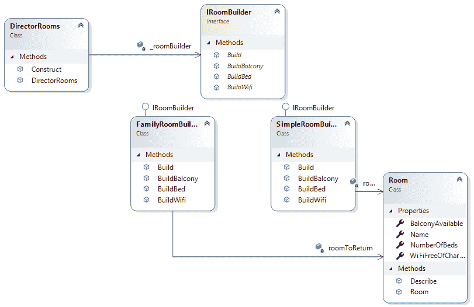
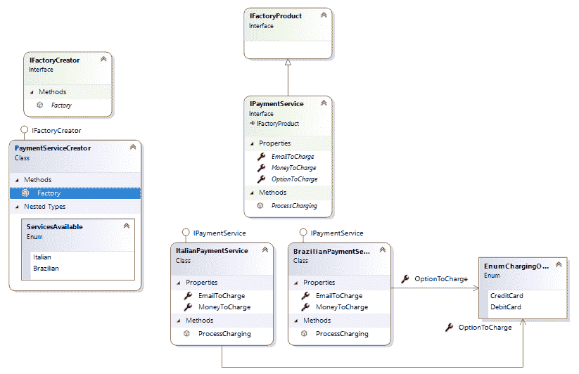
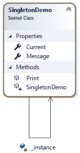
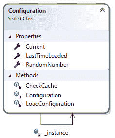
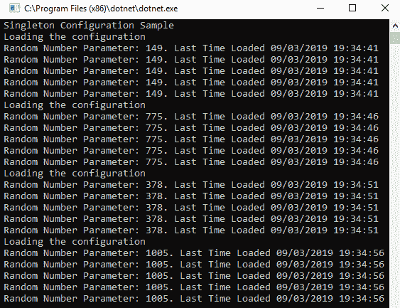
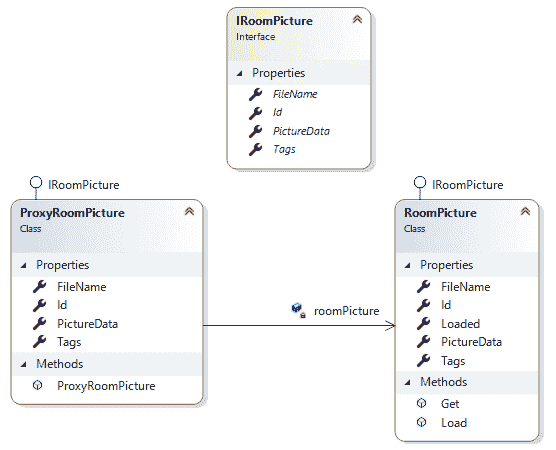
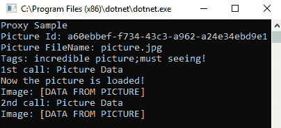
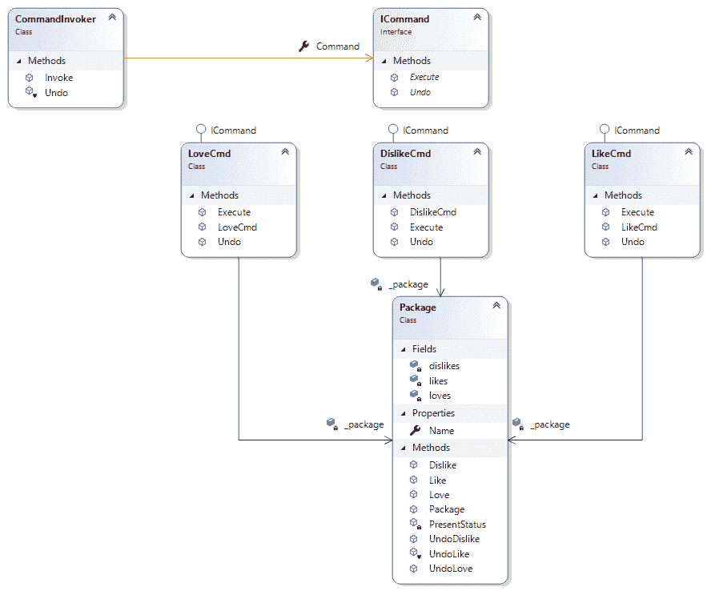
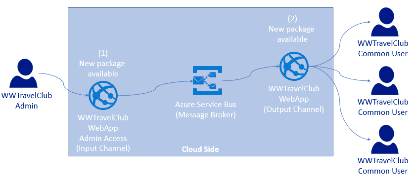
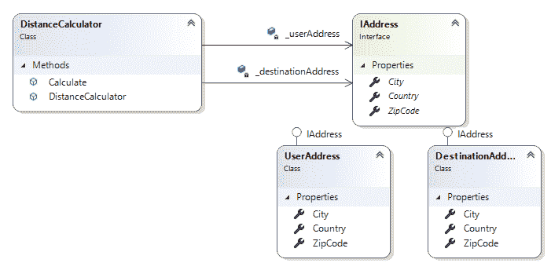

# 第九章：设计模式与.NET Core 实现

设计模式可以被定义为针对你在软件开发过程中遇到的常见问题的现成架构解决方案。它们对于理解.NET Core 架构至关重要，并且在解决我们在设计任何软件时面临的普通问题非常有用。在本章中，我们将探讨一些设计模式的实现。值得一提的是，这本书并没有解释我们可以使用的所有已知模式。这里的重点是解释研究和应用它们的重要性。

在本章中，我们将涵盖以下主题：

+   理解设计模式及其目的

+   理解.NET Core 中可用的设计模式

在本章结束时，你将了解一些来自 WWTravelClub 的使用案例，你可以使用设计模式来实现。

# 技术要求

你需要以下内容来完成本章：

+   Visual Studio 2017 或 2019 免费社区版或更高版本，并安装了所有数据库工具。

+   一个免费的 Azure 账户。第一章的*创建 Azure 账户*小节，*理解软件架构的重要性*，解释了如何创建一个。

你可以在[`github.com/PacktPublishing/Hands-On-Software-Architecture-with-CSharp-8/tree/master/ch09`](https://github.com/PacktPublishing/Hands-On-Software-Architecture-with-CSharp-8/tree/master/ch09)找到本章的示例代码。

# 理解设计模式及其目的

能够决定系统的设计是一项挑战，与此任务相关的责任是巨大的。作为软件架构师，我们必须始终牢记，诸如高度可重用性、良好性能和良好可维护性等特性是关键。这就是设计模式帮助并加速设计过程的地方。

正如我们之前提到的，设计模式是已经被讨论和定义的解决方案，以便它们可以解决常见的软件架构问题。这种做法在《设计模式 – 可重用面向对象软件的元素》一书发布后变得流行起来，其中**四人帮**（**GoF**）将这些模式分为三类：

+   创建

+   结构

+   行为

一段时间后，Uncle Bob 向开发者社区介绍了 SOLID 原则，这给了我们有效地将每个系统的函数和数据结构组织到类中的机会。SOLID 原则指出了这些类应该如何连接。值得一提的是，与 GoF 提出的设计模式相比，SOLID 原则并不提供代码配方。相反，它们为你提供了在设计解决方案时应该遵循的基本原则。

随着技术和软件问题的变化，更多的模式被构思出来。云计算的进步带来了一大堆模式，所有这些都可以在[`docs.microsoft.com/azure/architecture/patterns/`](https://docs.microsoft.com/azure/architecture/patterns/)找到。

您应该始终考虑它们的原因很简单——作为一个软件架构师，您不能花时间重新发明轮子。然而，使用它们的另一个很好的原因是：您会发现许多模式在.NET Core 中得到了实现。

在接下来的几个小节中，我们将介绍一些最著名的模式。然而，本章的目的是让您知道它们的存在并需要对其进行研究，以便您能够加速并简化您的项目。此外，每个模式都将通过一个 C#代码片段进行展示，这样您就可以轻松地将它们应用到您的项目中。

# 构建者模式

有时候，您会拥有一个具有不同行为的复杂对象，这是由于其配置造成的。在您使用它的时候设置这个对象，您可能希望将其配置与其使用解耦，使用已经构建的定制配置。这样，您就有您正在构建的实例的不同表示。这就是您应该使用构建者模式的地方。

以下类图显示了本书用例场景中实现的模式。这个设计选择背后的想法是简化 WWTravelClub 中房间描述的方式：



如以下代码所示，这个实现是以一种方式进行的，其中实例的配置不是在主程序中设置的。相反，您只需使用`Construct()`方法构建对象。这个例子是在模拟 WWTravelClub 中不同房间风格（单个房间和家庭房间）的创建：

```cs
using DesignPatternsSample.BuilderSample;
using System;

namespace DesignPatternsSample
{
    class Program
    {
        static void Main()
        {
            #region Builder Sample
            Console.WriteLine("Builder Sample");

            var directorRoom = new DirectorRooms(new SimpleRoomBuilder());
            var simpleRoom = directorRoom.Construct();
            simpleRoom.Describe();

            directorRoom = new DirectorRooms(new FamilyRoomBuilder());
            var familyRoom = directorRoom.Construct();
            familyRoom.Describe();
            #endregion

            Console.ReadKey();
        }
    }
}
```

这种实现的成果相当简单，但阐明了为什么您需要实现模式的原因：


一旦您有了实现，代码的演进就变得简单和容易。例如，如果您需要构建不同风格的房间，您只需创建相应的具体构建者，然后您就可以使用它。幸运的是，如果您需要增加产品的配置设置，您之前使用的所有具体类都将定义在 Builder 接口中并存储在那里，这样您就可以轻松地更新它们。

# 工厂模式

工厂模式在您有多个来自同一抽象的对象，并且您在开始编码时不知道哪个需要被创建的情况下非常有用。这意味着您将不得不根据某种配置或根据软件当前所在的位置来创建实例。

例如，让我们看看 WWTravelClub 示例。在这里，有一个用户故事描述了该应用程序将拥有来自世界各地的客户支付他们的旅行费用。然而，在现实世界中，每个国家都有不同的支付服务。支付过程在每个国家都是相似的，但这个系统将提供多个支付服务。简化这种支付实现的一个好方法是使用工厂模式。以下图表显示了其架构实现的初步概念：



注意，由于你有一个描述应用程序支付服务的接口，你可以使用工厂根据可用的服务来更改具体的类：

```cs
static void Main()
{
    #region Factory Sample
    var psCreator = new PaymentServiceCreator();
    var brazilianPaymentService = (IPaymentService)psCreator.Factory
        (PaymentServiceCreator.ServicesAvailable.Brazilian);
    brazilianPaymentService.EmailToCharge = "gabriel@sample.com";
    brazilianPaymentService.MoneyToCharge = 178.90f;
    brazilianPaymentService.OptionToCharge =
        FactorySample.Enums.EnumChargingOptions.CreditCard;
    brazilianPaymentService.ProcessCharging();

    var italianPaymentService = (IPaymentService)psCreator.Factory
        (PaymentServiceCreator.ServicesAvailable.Italian);
    italianPaymentService.EmailToCharge = "francesco@sample.com";
    italianPaymentService.MoneyToCharge = 188.70f;
    italianPaymentService.OptionToCharge =
        FactorySample.Enums.EnumChargingOptions.DebitCard;
    italianPaymentService.ProcessCharging();
    #endregion
    Console.ReadKey();
}
```

再次强调，由于实现了模式，服务的使用已经简化。如果你要在实际应用中使用此代码，你将通过在工厂中定义所需的服务的实例来改变实例的行为。

# 单例模式

当你在应用程序中实现单例时，你将在整个解决方案中实现该对象的单个实例。这可以被认为是每个应用程序中最常用的模式之一。原因很简单——有许多用例需要某些类只有一个实例。单例通过提供比全局变量更好的解决方案来解决这个问题。

在单例模式中，类负责创建和提供单个对象，该对象将被应用程序使用。换句话说，单例类创建一个单例实例：



要做到这一点，创建的对象是`static`的，并通过静态属性或方法提供。以下代码实现了单例模式，它有一个`Message`属性和一个`Print()`方法：

```cs
public sealed class SingletonDemo
{
    #region This is the Singleton definition
    private static SingletonDemo _instance;
    public static SingletonDemo Current
    {
        get
        {
            if (_instance == null)
                _instance = new SingletonDemo();
            return _instance;
        }
    }
    #endregion

    public string Message { get; set; }

    public void Print()
    {
        Console.WriteLine(Message);
    }
}
```

其用法非常简单——你只需在需要使用单例对象时调用静态属性：

```cs
SingletonDemo.Current.Message = "This text will be printed by the singleton.";
SingletonDemo.Current.Print();
```

你可能使用此模式的一个地方是当你需要以易于从解决方案的任何地方访问的方式提供应用程序配置时。例如，假设你有一些配置参数存储在一个你的应用程序需要在几个决策点查询的表中。而不是直接查询配置表，你可以创建一个单例类来帮助你：



此外，你还需要在这个单例中实现一个缓存，从而提高系统的性能，因为你可以决定系统是否每次需要配置时都检查数据库中的每个配置，或者是否使用缓存。以下截图显示了配置每 5 秒加载的缓存实现。在这种情况下正在读取的参数只是一个随机数：



这对于应用程序的性能来说非常好。此外，在代码的几个地方使用参数更简单，因为你不需要在代码的每个地方都创建配置实例。

# 代理模式

当你需要提供一个控制对另一个对象访问的对象时，会使用代理模式。你应该这样做的一个最大的原因与被控制对象的创建成本有关。例如，如果被控制的对象创建时间过长或消耗过多内存，可以使用代理来确保对象的大部分只有在需要时才会被创建。

下面的类图显示了从 Room 加载图片的代理模式实现类图，但仅在请求时：



这个代理的客户将请求其创建。在这里，代理将只从真实对象收集基本信息（`Id`、`FileName`和`Tags`），而不会查询`PictureData`。当请求`PictureData`时，代理将加载它：

```cs
static void Main()
{
    Console.WriteLine("Proxy Sample");
    var roomPicture = new ProxyRoomPicture();
    Console.WriteLine($"Picture Id: {roomPicture.Id}");
    Console.WriteLine($"Picture FileName: {roomPicture.FileName}");
    Console.WriteLine($"Tags: {string.Join(";", roomPicture.Tags)}");
    Console.WriteLine($"1st call: Picture Data");
    Console.WriteLine($"Image: {roomPicture.PictureData}");
    Console.WriteLine($"2nd call: Picture Data");
    Console.WriteLine($"Image: {roomPicture.PictureData}");
}
```

如果再次请求`PictureData`，由于图像数据已经就绪，代理将确保不会重复加载图像。以下截图显示了运行前面代码的结果：



这种技术可以被称为另一个众所周知的模式：**延迟加载**。实际上，代理模式是实现延迟加载的一种方式。例如，在 Entity Framework Core 2.1 中，如第六章“使用 C#与数据交互 - Entity Framework Core”中讨论的那样，你可以使用代理来开启延迟加载。你可以在[`docs.microsoft.com/en-us/ef/core/querying/related-data#lazy-loading`](https://docs.microsoft.com/en-us/ef/core/querying/related-data#lazy-loading)了解更多信息。

# 命令模式

在许多情况下，你需要执行一个将影响对象行为的*命令*。命令模式可以通过封装这种请求在对象中来帮助你处理这个问题。该模式还描述了如何处理请求的撤销/重做支持。

例如，让我们想象在 WWTravelClub 网站上，用户有权限通过指定他们是否喜欢、不喜欢甚至热爱来评估套餐。下面的类图是使用命令模式创建此评分系统的示例：



注意这种模式的工作方式——如果你需要不同的命令，比如 Hate，你不需要更改使用该命令的代码和类。可以通过类似的方式添加 Undo 方法到 Redo 方法。这个完整的代码示例可以在本书的 GitHub 仓库中找到。

# 发布者/订阅者模式

在所有应用程序中，从对象提供信息到一组其他对象是很常见的。当有大量组件（订阅者）将接收包含由对象（发布者）发送的信息的消息时，发布/订阅模式几乎是强制性的。

这里的概念非常简单易懂，如下面的图示所示：



当你有不定数量的不同可能的订阅者时，将广播信息的组件与消费它的组件解耦是至关重要的。发布/订阅模式为我们做到了这一点。

实现这个模式是复杂的，因为分布式环境不是一项简单任务。因此，建议您考虑现有的技术来实现连接输入通道到输出通道的消息代理，而不是从头开始构建。Azure Service Bus 是这个模式的可靠实现，所以你只需要连接到它。

我们在第五章中提到的 RabbitMQ，*将微服务架构应用于您的企业应用*，是另一个可以用来实现消息代理的服务，但它是对该模式的低级实现，需要执行几个相关任务，例如重试，以防需要手动编码错误。

# 依赖注入模式

依赖注入模式被认为是实现依赖倒置原则的好方法。此外，它强制所有其他 SOLID 原则在实现中遵循。正如我们在本章开头讨论的，保持软件结构强大和可靠的一种方法是遵循 Uncle Bob 提出的 SOLID 设计原则。这些可以定义为如下：

+   **单一职责**：模块或函数应该只负责单一目的。

+   **开闭原则**：软件工件应该对扩展开放，但对修改封闭。

+   **里氏替换**：当你用初级对象的上类型定义的另一个组件替换程序中的一个组件时，程序的行为需要保持不变。

+   **接口隔离**：创建巨大的接口会在构建具体对象时产生依赖，但这些对系统架构是有害的。

+   **依赖倒置**：最灵活的系统是那些对象依赖仅指向抽象的系统。

这个概念很简单。你不需要创建组件所依赖的对象的实例，只需定义它们的依赖关系，声明它们的接口，并通过*注入*使对象接收功能。

有三种方法来实现依赖注入：

+   使用类的构造函数来接收对象。

+   标记一些类属性以接收对象。

+   定义一个带有注入所有必要组件的方法的接口。

下图展示了依赖注入模式的实现：



除了这个之外，依赖注入还可以与**控制反转（Inversion of Control，IoC**）容器一起使用。这个容器可以在需要时自动注入依赖。市场上有多款 IoC 容器框架可供选择，但在 .NET Core 中，由于它包含了 `Microsoft.Extensions.DependencyInjection` 命名空间中解决此问题的库，因此无需使用第三方软件。

这个 IoC 容器负责创建和销毁请求的对象。依赖注入的实现基于构造函数类型。注入组件的生命周期有三种选项：

+   **瞬态（Transient）**：每次请求对象时都会创建对象。

+   **作用域（Scoped）**：为应用程序中定义的每个作用域创建对象。在一个 Web 应用中，*作用域* 与一个 Web 请求相关联。

+   **单例（Singleton）**：每个对象具有相同的应用程序生命周期，因此单个对象被重用来服务给定类型的所有请求。

你将如何使用这些选项取决于你正在开发的项目中的业务规则。在决定正确的选项时，你需要小心，因为应用程序的行为将根据你注入的对象类型而改变。

# 理解 .NET Core 中可用的设计模式

正如我们在前面的章节中所发现的，C# 允许我们实现上述任何一种模式。.NET Core 在其 SDK 中提供了许多遵循我们讨论的所有模式的实现，例如 Entity Framework Core 代理懒加载。另一个自 .NET Core 2.1 以来可用的好例子是 .NET Generic Host。

在 第十三章，*展示 ASP.NET Core MVC* 中，我们将详细介绍 .NET Core 中为 Web 应用提供的托管服务。这个 Web 托管程序有助于我们，因为应用程序的启动和生命周期管理是与它一起设置的。.NET Generic Host 的想法是使这种模式适用于不需要 HTTP 实现的应用程序。使用这个通用宿主，任何 .NET Core 程序都可以有一个 Startup 类，在其中我们可以配置依赖注入引擎。这对于创建多服务应用程序非常有用。

您可以在.NET 通用宿主[`docs.microsoft.com/en-us/aspnet/core/fundamentals/host/generic-host`](https://docs.microsoft.com/en-us/aspnet/core/fundamentals/host/generic-host)中找到更多信息，其中包含一些示例代码。本书 GitHub 仓库中提供的代码更简单，但它专注于创建一个可以运行监控服务的控制台应用程序。关于这一点，控制台应用程序的设置方式很出色，其中建造者配置应用程序将提供的服务，以及日志管理的方式。以下代码展示了这一点：

```cs
public static void Main()
{
    var host = new HostBuilder()
        .ConfigureServices((hostContext, services) =>
        {
            services.AddHostedService<HostedService>();
            services.AddHostedService<MonitoringService>();
        })
        .ConfigureLogging((hostContext, configLogging) =>
        {
            configLogging.AddConsole();
        })
        .Build();
    host.Run();

    Console.WriteLine("Host has terminated. Press any key to finish the 
    App.");
    Console.ReadKey();
 }
```

上述代码让我们了解了.NET Core 如何使用设计模式。使用建造者模式，.NET 通用宿主允许您设置将被注入为服务的类。除此之外，建造者模式还帮助您配置一些其他功能，例如日志的显示/存储方式。这种配置允许服务将`ILogger<out TCategoryName>`对象注入到任何实例中。

# 摘要

在本章中，我们了解了为什么设计模式有助于提高您所构建的系统部分的维护性和可重用性。我们还探讨了您可以在项目中使用的典型用例和代码片段。最后，我们介绍了.NET 通用宿主，这是.NET 如何使用设计模式来实现代码重用和强制最佳实践的良例。所有这些内容都将帮助您在架构新的软件或维护现有软件时，因为设计模式是针对软件开发中一些现实生活问题的已知解决方案。

在下一章中，我们将介绍领域驱动设计方法。我们还将学习如何使用 SOLID 设计原则，以便我们可以将不同的领域映射到我们的软件解决方案中。

# 问题

1.  什么是设计模式？

1.  设计模式和设计原则之间的区别是什么？

1.  在什么情况下实现建造者模式是一个好主意？

1.  在什么情况下实现工厂模式是一个好主意？

1.  在什么情况下实现单例模式是一个好主意？

1.  在什么情况下实现代理模式是一个好主意？

1.  在什么情况下实现命令模式是一个好主意？

1.  在什么情况下实现发布/订阅模式是一个好主意？

1.  在什么情况下实现依赖注入模式是一个好主意？

# 进一步阅读

以下是一些书籍和网站，您可以在其中找到更多关于本章所涵盖内容的信息：

+   《整洁架构：软件结构和设计的工匠指南》，Martin, Robert C. Pearson Education，2018。

+   《设计模式：可复用面向对象软件元素》，Erica Gamma 等。Addison-Wesley，1994。

+   《设计原则与设计模式》，Robert C. Martin，2000。

如果您需要获取有关设计模式和架构原则的更多信息，请查看以下链接：

+   [`www.packtpub.com/application-development/design-patterns-using-c-and-net-core-video`](https://www.packtpub.com/application-development/design-patterns-using-c-and-net-core-video)

+   [`docs.microsoft.com/en-us/dotnet/standard/modern-web-apps-azure-architecture/architectural-principles`](https://docs.microsoft.com/en-us/dotnet/standard/modern-web-apps-azure-architecture/architectural-principles)

如果你想更好地理解通用宿主的概念，请点击此链接：

+   [`docs.microsoft.com/en-us/aspnet/core/fundamentals/host/generic-host`](https://docs.microsoft.com/en-us/aspnet/core/fundamentals/host/generic-host)

在此链接中有一个关于服务总线消息的非常好的解释：

+   [`docs.microsoft.com/en-us/azure/service-bus-messaging/service-bus-dotnet-how-to-use-topics-subscriptions`](https://docs.microsoft.com/en-us/azure/service-bus-messaging/service-bus-dotnet-how-to-use-topics-subscriptions)

你可以通过以下链接了解更多关于依赖注入的信息：

+   [`docs.microsoft.com/en-us/aspnet/core/fundamentals/dependency-injection`](https://docs.microsoft.com/en-us/aspnet/core/fundamentals/dependency-injection)

+   [`www.martinfowler.com/articles/injection.html`](https://www.martinfowler.com/articles/injection.html)
