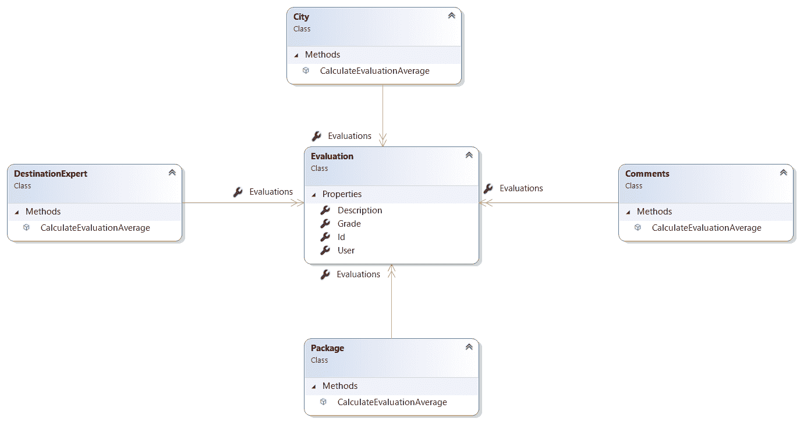
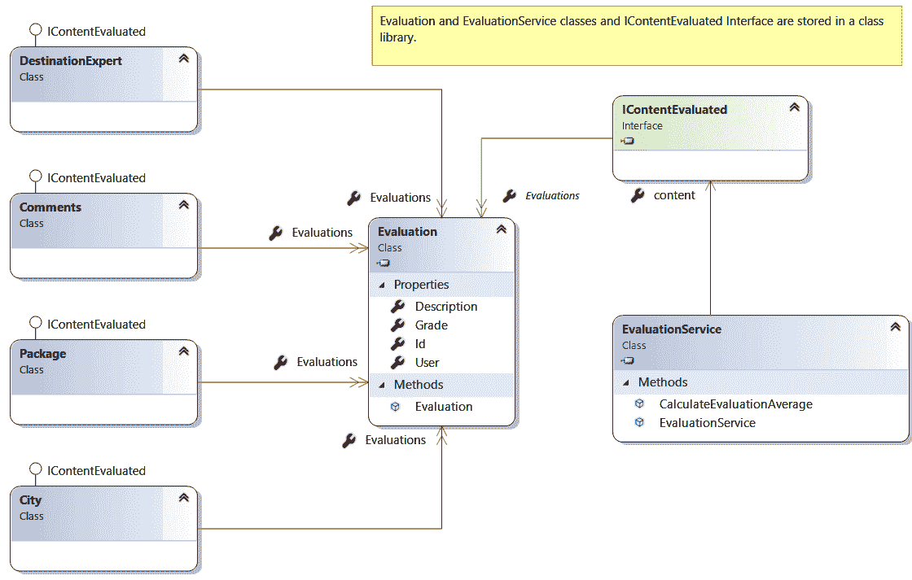
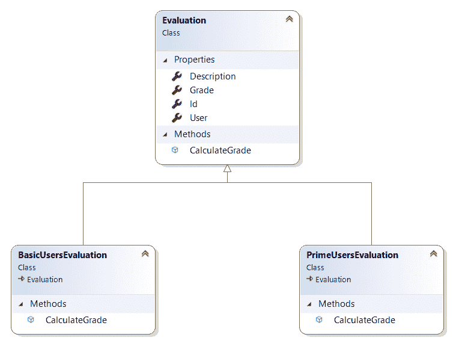
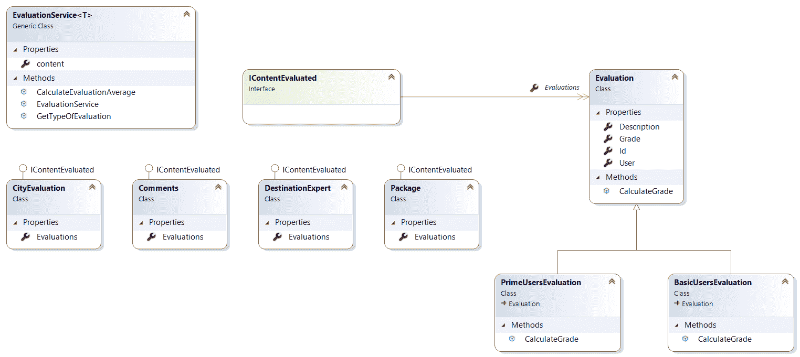

# 在 C# 8 中实现代码重用

代码重用性是软件架构中最重要的主题之一。本章旨在讨论启用代码重用的方法，并了解 .NET Standard 如何朝这个方向努力以解决管理和维护可重用库的问题。

本章将涵盖以下主题：

+   理解代码重用的原则

+   与 .NET Standard 合作的优势

+   创建可重用库

# 技术要求

本章需要以下内容：

+   你需要安装所有数据库工具的 Visual Studio 2017 或 2019 免费社区版或更高版本。

+   免费 Azure 账户：第一章中的“*理解软件架构的重要性*”部分，*创建 Azure 账户*，解释了如何创建一个。

+   Azure DevOps 账户：第三章中的“*什么是 Azure DevOps*”部分，*使用 Azure DevOps 记录需求*，解释了如何创建一个。

你可以在[`github.com/PacktPublishing/Hands-On-Software-Architecture-with-CSharp-8/tree/master/ch11`](https://github.com/PacktPublishing/Hands-On-Software-Architecture-with-CSharp-8/tree/master/ch11)找到本章的示例代码。

# 理解代码重用性原则

你可以始终使用单一的理由来证明代码重用——如果你在其他场景中已经运行良好，你不能浪费宝贵的时间重新造轮子。这就是为什么大多数工程领域都基于可重用性原则。想想你家里的灯开关。

你能想象出使用相同的界面组件可以制作多少个应用程序吗？代码重用的基本原则是相同的。再次强调，这是一个规划良好解决方案的问题，其中一部分可以在以后重用。

在软件工程中，代码重用是能够为软件项目带来一系列优势的技术之一，例如以下内容：

+   考虑到重用的代码部分已在另一个应用程序中经过测试，因此对软件有信心

+   由于软件架构师可以专注于解决这类问题，因此他们有更好的使用方式

+   有可能将市场上已经接受的模式引入项目

+   由于已经实现了组件，开发速度提高了

+   维护更容易

这些方面表明，只要可能，就应该进行代码重用。作为软件架构师，确保上述优势并激励你的团队在创建的软件中启用重用是你的责任。

# 什么是非代码重用？

你必须首先理解的是，代码复用并不意味着从一类复制粘贴代码到另一类。即使这段代码是由另一个团队或项目编写的，这也不表明你正确地运用了复用原则。让我们想象一个场景，我们将在本书的使用案例中找到这个场景，即 WWTravelClub 评估。

在项目场景中，你可能想评估不同类型的主题，例如包、目的地专家、城市、评论等。无论你指的是哪个主题，获取评估平均值的流程都是相同的。因此，你可能希望通过复制粘贴每个评估的代码来*启用*复用。(不好的)结果可能如下所示：



在前面的图中，计算评估平均值的流程是分散的，这意味着相同的代码将在不同的类中重复。这将造成很多麻烦，尤其是如果相同的做法开始在其他应用程序中发生。例如，如果有一个关于如何计算平均值的新规范，或者如果你只是计算公式中出现了错误，你将不得不在所有代码实例中修复它。

# 什么是代码复用？

上节中提到的问题的解决方案相当简单。你必须分析你的代码，并选择那些从你的应用程序中解耦的部分。你应该解耦的最大原因与你如何确保这段代码可以在应用程序的其他部分或另一个应用程序中复用有关：



代码的集中化给你，作为一个软件架构师，带来了不同的责任。你必须记住，这段代码的任何错误或不兼容都可能对应用程序的许多部分或不同的应用程序造成损害。另一方面，一旦你测试并运行了这段代码，你将能够无忧无虑地传播其使用。此外，如果你需要进化平均计算过程，你将不得不在一个类中更改代码。

值得注意的是，你使用相同代码的次数越多，这种开发方式就越便宜。需要提到成本，因为通常情况下，可复用软件的概念在开始时成本更高。

# 将复用引入你的开发周期

如果你理解了复用将带你进入代码实现的另一个层次，你就应该开始思考如何在你的开发周期中实现这种技术。实际上，创建和维护组件库并不容易，因为你将承担的责任以及缺乏支持现有组件搜索的良好工具。

另一方面，有一些事情你可能在每次开始新的开发时都应考虑在软件开发过程中实施：

+   **使用**用户库中已实现的组件，选择软件需求规范中需要它们的特性。

+   **识别**软件需求规范中作为库组件设计候选者的功能。

+   **修改**规范，考虑到这些功能将使用可重用组件来开发。

+   **设计**可重用组件，并确保它们具有适当的接口，以便在多个项目中使用。

+   **构建**使用新组件库版本的项目架构。

+   **记录**组件库版本，以便每个开发者和团队都知道它。

*使用-识别-修改-设计-构建* 过程是一种技术，你可能每次需要启用软件重用时都应考虑实施。一旦你有了为这个库编写所需的组件，你将需要决定将提供这些组件的技术。

在软件开发的历史中，有许多实现这一目标的方法；其中一些在第五章，“将微服务架构应用于您的企业应用程序”的*微服务作为模块概念的演变*部分中进行了讨论。

# 使用 .NET Standard 进行代码重用

.NET 自从第一个版本发布以来已经发展了很多。这种发展不仅与命令数量和性能问题相关，还与支持的平台相关。正如在第一章，“理解软件架构的重要性”中讨论的那样，你可以在数十亿台设备上运行 C# .NET，即使它们运行的是 Linux、Android、macOS 或 iOS。因此，.NET Standard 首次与 .NET Core 1.0 一起宣布，但破坏性变化发生在 .NET Standard 2.0，当时 .NET Framework 4.6、.NET Core 和 Xamarin 都与之兼容。

关键点在于 .NET Standard 不仅是一种 Visual Studio 项目。更重要的是，它是一种对所有 .NET 实现都适用的正式规范。正如你在下表中所见，它涵盖了从 .NET Framework 到 Unity ([`github.com/dotnet/standard/tree/master/docs/versions`](https://github.com/dotnet/standard/tree/master/docs/versions)) 的所有内容：

| .NET Standard | 1.0 | 1.1 | 1.2 | 1.3 | 1.4 | 1.5 | 1.6 | 2.0 | 2.1 |
| --- | --- | --- | --- | --- | --- | --- | --- | --- | --- |
| .NET Core | 1.0 | 1.0 | 1.0 | 1.0 | 1.0 | 1.0 | 1.0 | 2.0 | 3.0 |
| .NET Framework | 4.5 | 4.5 | 4.5.1 | 4.6 | 4.6.1 | 4.6.1¹ | 4.6.1¹ | 4.6.1¹ | N/A² |
| 单元 | 4.6 | 4.6 | 4.6 | 4.6 | 4.6 | 4.6 | 4.6 | 5.4 | 6.2 |
| Xamarin.iOS | 10.0 | 10.0 | 10.0 | 10.0 | 10.0 | 10.0 | 10.0 | 10.14 | 12.12 |
| Xamarin.Mac | 3.0 | 3.0 | 3.0 | 3.0 | 3.0 | 3.0 | 3.0 | 3.8 | 5.12 |
| Xamarin.Android | 7.0 | 7.0 | 7.0 | 7.0 | 7.0 | 7.0 | 7.0 | 8.0 | 9.3 |
| Unity | 2018.1 | 2018.1 | 2018.1 | 2018.1 | 2018.1 | 2018.1 | 2018.1 | 2018.1 | TBD |
| 通用 Windows 平台 | 8.0 | 8.0 | 8.1 | 10.0 | 10.0 | 10.0.16299 | 10.0.16299 | 10.0.16299 | TBD |

前面的表格表明，如果你构建一个与该标准兼容的类库，你将能够在所展示的任何平台上重用它。想想看，如果你计划在所有项目中这样做，你的开发过程会变得多快。

显然，一些组件不包括在 .NET Standard 中，但其发展是持续的。值得一提的是，微软的官方文档指出，*版本越高，可用的 API 越多*。

# 创建 .NET Standard 库

创建一个与 .NET Standard 兼容的类库相当简单。基本上，你需要在创建库时选择以下项目：


一旦你完成了这部分，你会注意到，一个普通类库和你创建的类库之间的唯一区别是项目文件中定义的目标框架：

```cs
<Project Sdk="Microsoft.NET.Sdk">
  <PropertyGroup>
    <TargetFramework>netstandard2.0</TargetFramework>
  </PropertyGroup>
</Project>
```

一旦你的项目加载完毕，你就可以开始编写你打算重用的类。使用这种方法构建可重用类的优点是，你将能够在之前检查的所有项目类型中重用所编写的代码。另一方面，你会发现一些在 .NET Framework 中可用的 API 在这类项目中不存在。你可以通过[`github.com/dotnet/standard/tree/master/docs/planning/netstandard-2.1`](https://github.com/dotnet/standard/tree/master/docs/planning/netstandard-2.1)来关注标准的未来。

# C# 如何处理代码重用？

C# 有许多方法帮助我们处理代码重用。我们之前检查的构建库的能力是其中之一。最重要的是，这种语言是面向对象的。此外，还值得一提的是泛型为 C# 语言带来的便利。本主题将讨论最后两个提到的内容。

# 面向对象分析

面向对象分析的方法使我们能够以不同的方式重用代码，从继承的便利性到多态的可变性。完全采用面向对象编程将让你也能够实现抽象和封装。

以下截图展示了使用面向对象的方法来简化重用。正如您所看到的，有不同方式来计算评估的等级，考虑到您可以是系统的基本用户或高级用户：



在这个设计中，代码重用有两个方面需要分析。第一个方面是，由于继承为你做了这件事，所以没有必要在每个子类中声明属性。

第二个机会是我们使用多态，为相同的方法启用不同的行为：

```cs
public class PrimeUsersEvaluation : Evaluation
{
    /// <summary>
    /// The business rule implemented here indicates that grades that 
    /// came from prime users have 20% of increase
    /// </summary>
    /// <returns>the final grade from a prime user</returns>
    public override double CalculateGrade()
    {
         return Grade * 1.2;
    }
}
```

你可以在前面的代码中检查多态原则的使用，其中对初级用户的评估计算将增加 20%。现在，看看调用同一类继承的不同对象是多么容易。由于集合内容实现了相同的接口 `IContentEvaluated`，它也可以有基本用户和初级用户：

```cs
public class EvaluationService
{
    public IContentEvaluated content { get; set; }
    /// <summary>
    /// No matter the Evaluation, the calculation will always get     
    /// values from the method CalculateGrade
    /// </summary>
    /// <returns>The average of the grade from Evaluations</returns>
    public double CalculateEvaluationAverage()
    {
        var count = 0;
        double evaluationGrade = 0;
        foreach (var evaluation in content.Evaluations)
        {
            evaluationGrade += evaluation.CalculateGrade();
            count++;
        }
        return evaluationGrade/count;
    }
}
```

在使用 C# 时，面向对象的采用可以被认为是强制性的。然而，更具体的用法需要学习和实践。作为软件架构师，你应该始终鼓励你的团队学习面向对象的分析。他们的抽象能力越强，代码复用就越容易。

# 泛型

泛型是在 C# 2.0 版本中引入的，它被认为是一种提高代码复用的方法。它还最大限度地提高了类型安全和性能。

泛型的基本原理是，你可以在接口、类、方法、属性、事件、委托或甚至一个占位符中定义，这个占位符将在稍后某个实体被使用时，用特定的类型替换。这个特性为你提供了不可思议的机会，因为你可以使用相同的代码来运行不同版本的类型，实现泛型。

以下代码是对上一节中介绍的 `EvaluationService` 的修改。这里的想法是使服务泛化，从其创建时就定义评估的目标：

```cs
public class EvaluationService<T> where T: IContentEvaluated
```

这个声明表明，任何实现了 `IContentEvaluaded` 接口的类都可以用于这个服务。此外，服务将负责创建评估内容。

以下代码实现了自服务构建以来创建的评估内容。这段代码使用了 `System.Reflection` 和来自类的泛型定义：

```cs
public EvaluationService()
{
    var name = GetTypeOfEvaluation();
    content = (T)Assembly.GetExecutingAssembly().CreateInstance(name);
}
```

值得注意的是，这段代码将能够工作，因为所有类都在同一个程序集中。这个修改的结果可以在服务的实例创建中进行检查：

```cs
var service = new EvaluationService<CityEvaluation>();
```

好消息是，现在你有一个泛型服务，它将自动实例化所需内容的评估列表对象。值得一提的是，泛型显然需要更多时间用于第一个项目的构建。然而，一旦设计完成，你将拥有一个良好、快速且易于维护的代码。这就是我们所说的复用！

# 用例 - 代码复用作为快速交付优质和安全的软件的途径

评估 WWTravelClub 内容的解决方案的最终设计可以按以下方式检查。这种方法包括使用本章讨论的许多主题。首先，所有代码都放置在一个 .NET Standard 类库中。这意味着您可以将此代码添加到不同类型的解决方案中，例如 .NET Core 网络应用程序和 Android 和 iOS 平台的 Xamarin 应用程序：



此设计利用了面向对象原则，如继承，因此您不需要在多个类中多次编写可被使用的属性和方法；以及多态，这样您可以在不更改方法名称的情况下更改代码的行为。

最后，该设计通过引入泛型作为可以促进类似类（如我们在 WWTravelClub 中用于评估城市、评论、目的地专家和旅游套餐的类）操作的工具，抽象了内容的概念。

在鼓励代码复用的团队和不鼓励代码复用的团队之间，最大的区别在于向最终用户提供优质软件的速度。当然，开始这种做法并不容易，但请放心，经过一段时间的工作，你将获得良好的结果。

# 摘要

本章旨在帮助您了解代码复用的优势。它还让您对什么是未正确复用的代码有了概念。本章还介绍了代码复用的方法。

考虑到没有流程的技术无法带您走得更远，本章提出了一种流程来启用代码复用。此流程与使用库中已经完成的组件相关；在软件需求规格说明书中识别可以作为库组件设计的候选功能；根据这些功能修改规格说明；设计可复用的组件；以及使用新的组件库版本构建项目架构。

最后，本章将 .NET Standard 库作为在不同 C# 平台上复用代码的方法，强调了面向对象编程作为复用代码的方式，并介绍了泛型作为简化具有相同特性的对象处理的复杂实现。在下一章中，我们将看到如何使用 .NET Core 应用 **服务导向架构**（**SOA**）。

值得注意的是，SOA 被认为是复杂环境中实现代码复用的一种方式。

# 问题

1.  复制和粘贴可以被认为是代码复用吗？这种方法的有哪些影响？

1.  如何在不复制和粘贴代码的情况下利用代码复用？

1.  有没有可以帮助代码复用的流程？

1.  .NET Standard 和 .NET Core 之间的区别是什么？

1.  创建 .NET Standard 库有哪些优势？

1.  面向对象分析如何帮助代码复用？

1.  泛型如何帮助代码复用？

# 进一步阅读

这些是一些书籍和网站，您可以在其中找到更多关于本章的信息：

+   《*整洁架构：软件结构与设计的工匠指南*》由 Martin, Robert C. 著，Pearson Education，2018 年。

+   《*设计模式：可复用面向对象软件元素*》由 Erica Gamma [等] 著，Addison-Wesley，1994 年。

+   《*设计原则与设计模式*》由 Robert C. Martin 著，2000 年。

+   [`devblogs.microsoft.com/dotnet/introducing-net-standard/`](https://devblogs.microsoft.com/dotnet/introducing-net-standard/)

+   [`www.packtpub.com/application-development/net-standard-20-cookbook`](https://www.packtpub.com/application-development/net-standard-20-cookbook)

+   [`github.com/dotnet/standard/blob/master/docs/versions.md`](https://github.com/dotnet/standard/blob/master/docs/versions.md)

+   [`docs.microsoft.com/pt-br/dotnet/csharp/programming-guide/generics/`](https://docs.microsoft.com/pt-br/dotnet/csharp/programming-guide/generics/)
