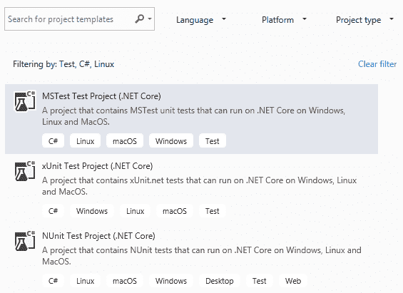
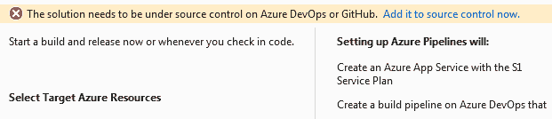
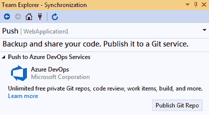
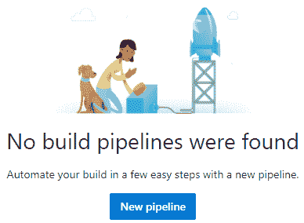
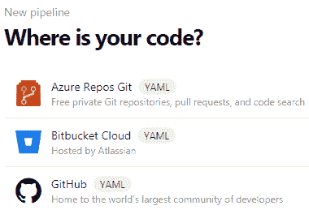
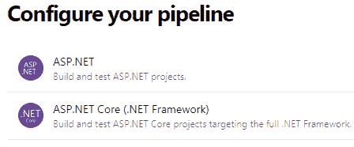
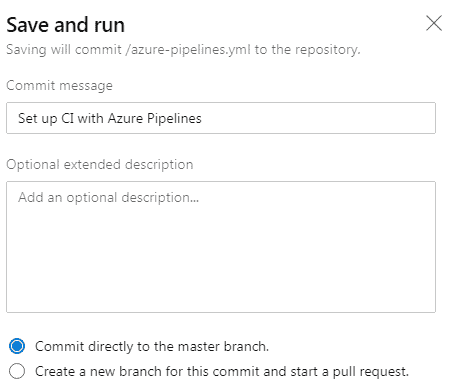
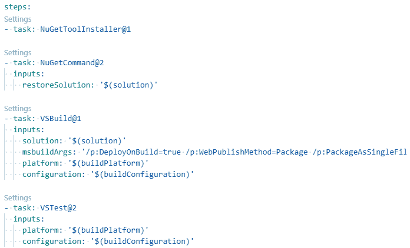
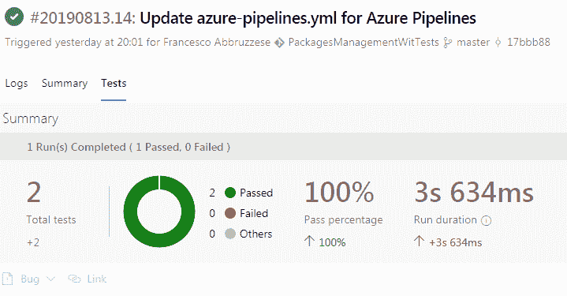
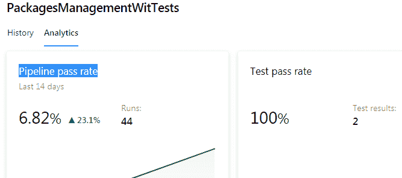

# 使用单元测试用例和 TDD 测试您的代码

在开发软件时，确保应用程序无错误并满足所有规范至关重要。这可以通过在开发过程中测试所有模块或在整体应用程序完全或部分实现后进行测试来实现。

由于大多数测试必须在每次修改应用程序时执行，手动执行所有测试不是一个可行的选项。正如本书中解释的那样，现代软件正在不断修改，以适应快速变化的市场需求。本章讨论了交付可靠软件所需的所有测试类型，以及如何组织和自动化它们。

更具体地说，本章涵盖了以下主题：

+   理解自动化测试及其用法

+   理解**测试驱动开发**（**TDD**）的基本原理

+   使用 TDD 优化软件投资

+   在 Visual Studio 中定义 C#测试项目

在本章中，我们将了解哪些类型的测试值得实施，以及单元测试是什么。我们将了解可用的不同类型的项目以及如何在其中编写单元测试。到本章结束时，书籍用例将帮助我们自动在 Azure DevOps 中执行应用程序的**持续集成/持续交付**（**CI/CD**）周期中的测试。

# 技术要求

本章需要安装所有数据库工具的 2019 免费社区版。它还需要一个免费的 Azure 账户；如果您尚未创建，请参阅第一章，*理解软件架构的重要性*中的*创建 Azure 账户*部分。

本章中的所有概念都通过基于 WWTravelClub 书籍用例的实用示例进行了阐明。本章的代码可在以下网址找到：[`github.com/PacktPublishing/Hands-On-Software-Architecture-with-CSharp-8`](https://github.com/PacktPublishing/Hands-On-Software-Architecture-with-CSharp-8)。

# 理解自动化测试

必须避免在大多数功能完全实现后立即进行应用程序测试，原因如下：

+   如果一个类或模块设计或实现不当，它可能已经影响了其他模块的实现方式。因此，在此阶段，修复问题可能代价高昂。

+   需要测试所有可能执行路径的输入组合的数量随着一起测试的模块或类的数量呈指数增长。例如，如果一个类方法`A`的执行可以采取三条不同的路径，而另一个方法`B`的执行可以采取四条路径，那么测试`A`和`B`一起就需要 3 x 4 种不同的输入。一般来说，如果我们一起测试几个模块，需要测试的总路径数是每个模块测试路径数的乘积。相反，如果单独测试模块，所需的输入数量只是测试每个模块所需路径的总和。

+   如果由 N 个模块组成的聚合测试失败，那么在 N 个模块中定位错误源通常是一个非常耗时的活动。

+   当测试 N 个模块时，我们必须重新定义涉及 N 个模块的所有测试，即使只是在应用程序的 CI/CD 周期中有一个 N 个模块发生变化。

前面的考虑表明，单独测试每个模块的方法更为方便。不幸的是，一组独立于其上下文验证所有方法的测试是不完整的，因为一些错误可能是由模块之间不正确的交互引起的。

因此，测试被组织成两个阶段：

+   **单元测试**：这些测试验证每个模块的所有执行路径都表现正常。它们相当完整，通常覆盖所有可能的路径。这是可行的，因为与整个应用程序的可能执行路径相比，每个方法或模块的可能执行路径并不多。

+   **集成测试**：这些测试在软件通过所有单元测试后执行。集成测试验证所有模块是否正确交互以获得预期结果。由于单元测试已经验证了每个模块的所有执行路径都正常工作，因此集成测试不需要完全覆盖。它们需要验证所有交互模式，即各种模块可能合作的所有可能方式。

通常，每个交互模式都与多个测试相关联：一个典型的模式激活，以及一些激活的极端情况。例如，如果一个完整的交互模式接收一个数组作为输入，我们将为典型的数组大小编写一个测试，一个`null`数组的测试，一个空数组的测试，以及一个非常大的数组的测试。这样我们就可以验证单个模块的设计方式是否与整个交互模式的需求兼容。

在实施上述策略的情况下，如果我们修改单个模块而不改变其公共接口，我们需要更改该模块的单元测试。

如果，相反，更改涉及某些模块的交互方式，那么我们也必须添加新的集成测试或修改现有的测试。然而，通常这并不是一个大问题，因为大多数测试都是单元测试，所以重写大部分集成测试不需要太大的努力。此外，如果应用程序是根据**单一职责、开闭原则、里氏替换原则、接口隔离原则、依赖倒置原则**（**SOLID**）设计的，那么在单次代码修改后必须更改的集成测试数量应该很小，因为修改应该只影响与修改的方法或类直接交互的几个类。

到目前为止，应该很清楚，单元测试和集成测试在整个软件生命周期中都必须被重用。这就是为什么自动化它们是值得的。单元和集成测试的自动化避免了手动测试执行中可能出现的错误，并节省了时间。几千个自动化测试的整个系列可以在几分钟内验证软件的完整性，在每次对软件进行的小修改之后，从而使得现代软件的 CI/CD 周期中所需的频繁更改成为可能。

随着新错误的发现，会添加新的测试来发现它们，以确保它们不会在未来版本的软件中再次出现。这样，自动化测试总是变得更加可靠，并更好地保护软件免受新更改引入的错误的影响。因此，添加新错误（不是立即被发现）的概率大大降低。

下一节将为我们提供组织和设计自动化单元和集成测试的基础，以及如何在“C# 测试项目”部分中用 C#编写测试的实用细节。

# 编写自动化（单元和集成）测试

测试不是从头开始编写的；所有软件开发平台都有工具帮助我们编写和运行测试（或其中一些）。一旦选定的测试被执行，所有工具都会显示报告，并提供调试所有失败测试代码的可能性。

更具体地说，所有单元和集成测试框架都由三个重要部分组成：

+   **定义所有测试的设施**：它们验证实际结果是否与预期结果相符。通常，一个测试被组织成测试类，其中每个测试调用一个单独的应用程序类或一个单独的类方法。每个测试分为三个阶段：

    1.  **测试准备**：测试所需的一般环境已经准备就绪。这一阶段并不准备为每种方法单独输入的单个输入，而是仅准备全局环境，例如在类构造函数中注入的对象或数据库表的模拟。通常，相同的准备程序会在多个测试中使用，因此测试准备被提取到专门的模块中。

    1.  **测试执行**：使用适当的输入调用要测试的方法，并将它们的执行结果与预期结果进行比较，使用如`Assert.Equal(x, y)`、`Assert.NotNull(x)`等构造。

    1.  **清理**：整个环境被清理，以避免测试的执行影响其他测试。这一步骤是步骤 1 的逆操作。

+   **模拟设施**：虽然集成测试使用所有（或几乎所有）参与对象合作模式的类，但在单元测试中禁止使用其他应用程序类。因此，如果一个正在测试的类，比如`A`，在其方法`M`中使用了另一个应用程序类`B`的方法，该方法是将其构造函数中注入的，那么为了测试`M`，我们必须注入`B`的模拟实现。值得注意的是，只有执行某些处理的类在单元测试期间不允许使用另一个类，而纯数据类可以。模拟框架包含定义接口和接口方法的模拟实现的功能，这些方法可以在测试中定义数据。通常，这些模拟实现也能报告所有模拟方法调用的信息。这种模拟实现不需要实际类文件的定义，而是在测试代码中通过调用如`new Mock<IMyInterface>()`这样的方法在线完成。

+   **执行和报告工具**：这是一个基于可视配置的工具，开发者可以使用它来决定要启动哪些测试以及何时启动它们。此外，它还以包含所有成功测试、所有失败测试、每个测试的执行时间以及其他依赖于特定工具及其配置的信息的报告形式显示测试的最终结果。通常，在开发 IDE（如 Visual Studio）中执行的执行和报告工具还提供了在每个失败的测试上启动调试会话的可能性。

由于模拟框架只能创建接口的模拟实现，而不能创建类的模拟实现，因此我们应该在类构造函数和方法中注入接口或纯数据类（不需要模拟），否则类无法进行单元测试。因此，对于每个我们想要注入到另一个类中的合作类，我们必须定义一个相应的接口。

此外，类应该使用在其构造函数或方法中注入的实例，而不是其他类公共静态字段中可用的类实例；否则，在编写测试时可能会忘记隐藏的交互，这可能会使测试的*准备*步骤复杂化。

下一个部分将描述在软件开发中使用的其他类型的测试。

# 编写验收和性能测试

接受测试定义了项目利益相关者与开发团队之间的合同。它们被用来验证开发的软件是否确实按照与他们的约定行事。接受测试不仅验证功能规范，还验证软件可用性和用户界面的约束。由于它们的目的还包括展示软件在实际计算机显示器和显示设备上的外观和行为，因此它们永远不会完全自动化，主要由必须由操作员遵循的食谱和验证列表组成。

有时，自动测试的开发是为了验证仅功能规范，但此类测试通常绕过用户界面，直接将测试输入注入到用户界面后面的逻辑中。例如，在 ASP.NET Core MVC 应用程序的情况下，整个网站在一个完整的环境中运行，包括所有需要的存储空间，并填充了测试数据；输入不提供给 HTML 页面，而是直接注入到 ASP.NET Core 控制器中。绕过用户界面的测试被称为皮下测试。ASP.NET Core 提供了各种工具来执行皮下测试，以及自动化与 HTML 页面交互的工具。

在自动测试的情况下，通常更倾向于使用皮下测试，而完整测试则手动执行，以下是一些原因：

+   没有自动测试可以验证用户界面的外观和可用性。

+   自动化与用户界面的实际交互是一个非常耗时的工作。

+   用户界面经常更改以提高其可用性并添加新功能，而且单个应用程序屏幕的微小更改也可能迫使对该屏幕上运行的全部测试进行完全重写。

简而言之，用户界面测试非常昂贵且可重用性低，因此很少值得自动化它们。然而，ASP.NET Core 提供了`Microsoft.AspNetCore.Mvc.Testing` NuGet 包，用于在测试环境中运行整个网站。使用它与`AngleSharp` NuGet 包一起，该包将 HTML 页面解析成 DOM 树，您可以用可接受的编程工作量编写自动化全面测试。将在第二十章中详细描述 ASP.NET Core 接受测试，*软件测试自动化*。

性能测试向应用程序施加模拟负载，以查看其是否能够处理典型的生产负载，以发现其负载限制，并定位瓶颈。应用程序部署在一个预演环境中，该环境在硬件资源方面是实际生产环境的副本。然后，创建并应用模拟请求到系统中，并收集响应时间和其他指标。模拟请求批次应与实际生产批次具有相同的组成。如果可用，它们可以从实际生产请求日志中生成。

如果响应时间不满意，将收集其他指标以发现可能的瓶颈（低内存、慢速存储或慢速软件模块）。一旦定位到负责问题的软件组件，就可以在调试器中分析它，以测量典型请求中涉及的各个方法调用的执行时间。

性能测试中的失败可能导致对应用程序所需硬件的重定义，或者对某些软件模块、类或方法的优化。

Azure 和 Visual Studio 都提供了创建模拟负载和报告执行指标的工具。然而，它们已被宣布过时，并将很快停止使用（从写这本书起大约一年），因此我们不会描述它们。作为替代方案，有开源和第三方工具可以使用。其中一些在*进一步阅读*部分列出。

下一个部分将描述一种将测试置于核心位置的软件开发方法。

# 理解测试驱动开发（TDD）

**测试驱动开发**（**TDD**）是一种软件开发方法，它将单元测试置于核心和中心位置。根据这种方法，单元测试是每个类规范的正式化，因此必须在类的代码之前编写。实际上，一个覆盖所有代码路径的完整测试明确定义了代码行为，因此它可以被视为代码的规范。这不是通过某种正式语言定义代码行为的正式规范，而是一种基于行为示例的规范。

测试软件的理想方式是编写整个软件行为的正式规范，并使用一些完全自动化的工具来验证实际产生的软件是否符合这些规范。在过去，一些研究工作被用于定义用于描述代码规范的正式语言，但使用类似语言表达开发者心中的行为是一个非常困难且容易出错的任务。因此，这些尝试很快就被放弃了，转而采用基于示例的方法。当时，主要目的是自动生成代码。如今，自动代码生成已被大量放弃，仅在小应用领域幸存，如设备驱动程序的开发。在这些领域，将行为在正式语言中形式化的努力值得在尝试测试难以重现的并行线程行为时节省的时间。

单元测试最初被构想为以完全独立的方式编码基于示例的规范，作为名为**极限编程**（**Extreme Programming**）的特定敏捷开发方法的一部分。然而，如今，TDD 可以独立于极限编程使用，并被纳入其他敏捷方法中的强制规定。

虽然毫无疑问，在发现数百个错误后经过优化的单元测试可以作为可靠的代码规范，但开发者是否能够轻松设计出可以直接用作编写代码的可靠规范的单元测试并不明显。实际上，通常情况下，如果随机选择示例，你需要无限或至少是大量的示例来唯一地定义代码的行为。

只有在你理解了所有可能的执行路径之后，才能用可接受数量的示例定义行为。实际上，在这个时候，选择每个执行路径的典型示例就足够了。因此，在完全编写完方法之后编写该方法的单元测试是很容易的：它只需要为现有代码的每个执行路径选择一个典型实例。然而，以这种方式编写单元测试并不能防止执行路径设计本身的错误。例如，它不能防止忘记在调用成员之前测试变量的`null`值的典型错误。这就是为什么 TDD 建议在编写应用程序代码之前编写单元测试。

我们可以得出结论，在编写单元测试时，开发者必须通过寻找极端情况以及可能添加比严格需要的更多示例来预测所有可能的执行路径。然而，开发者可能在编写应用程序代码时犯错误，他们也可能在设计单元测试时预测所有可能的执行路径时犯错误。

我们发现了 TDD 的主要缺点：单元测试本身可能是错误的。也就是说，不仅应用程序代码，与其相关的 TDD 单元测试也可能与开发者心中的行为不一致。因此，在开始时，单元测试不能被视为软件规范，而更可能是一个可能的错误和不完整的软件行为描述。因此，我们有两个关于我们心中所想行为的描述，即应用程序代码及其在应用程序代码之前编写的 TDD 单元测试。

TDD 之所以有效，是因为在编写测试和编写代码时犯完全相同错误的概率非常低。因此，每当测试失败时，要么是测试中存在错误，要么是应用程序代码中存在错误，反之亦然，如果应用程序代码或测试中存在错误，那么有很高的概率测试会失败。也就是说，TDD 的使用确保了大多数错误都能立即被发现！

使用 TDD 编写类方法或代码块是一个由三个阶段组成的循环：

+   红色阶段：在这个阶段，开发者设计新的单元测试，这些测试必然会失败，因为此时还没有代码实现他们所描述的行为。

+   绿色阶段：在这个阶段，开发者编写最少的代码或对现有代码进行必要的最小修改，以通过所有单元测试。

+   重构阶段：一旦测试通过，代码将被重构以确保良好的代码质量并应用最佳实践和模式。特别是，在这个阶段，某些代码可以被提取到其他方法或其他类中。在这个阶段，我们可能还会发现需要其他单元测试，因为发现了新的执行路径或新的极端情况。

循环会在所有测试通过且没有编写新代码或修改现有代码的情况下立即停止。

有时候，设计初始单元测试非常困难，因为很难想象代码可能的工作方式和它可能采取的执行路径。在这种情况下，你可以通过编写应用程序代码的初始草图来更好地理解要使用的特定算法。在这个初始阶段，我们只需要关注主要执行路径，完全忽略极端情况和输入验证。一旦我们清楚地了解了应该工作的算法背后的主要思想，我们就可以进入标准的三个阶段的 TDD 循环。

在下一节中，我们将列出 Visual Studio 中所有可用的测试项目，并详细描述 xUnit。

# 定义 C# 测试项目

Visual Studio 包含三种单元测试框架的项目模板，分别是 MSTest、xUnit 和 NUnit。一旦你启动新项目向导，为了可视化所有这些框架的版本，适合 .NET Core C# 应用程序，请将项目类型设置为测试，语言设置为 C#，平台设置为 Linux，因为 .NET Core 项目是唯一可以在 Linux 上部署的项目。

以下截图显示了应出现的选项：



所有的前述项目都自动包含在 Visual Studio 测试用户界面（Visual Studio 测试运行器）中运行所有测试的 NuGet 包。然而，它们不包含任何用于模拟接口的功能，因此你需要添加包含流行模拟框架的 `Moq` NuGet 包。

所有测试项目都必须包含对要测试的项目引用。

在下一节中，我们将描述 xUnit，因为它可能是三个框架中最受欢迎的一个。然而，所有三个框架都非常相似，主要区别在于方法名称和用于装饰各种测试内容的属性名称。

# 使用 xUnit 测试框架

在 xUnit 中，测试是通过 `[Fact]` 或 `[Theory]` 属性装饰的方法。测试由测试运行器自动发现，并在用户界面中列出所有测试，以便用户可以运行所有测试或仅运行部分测试。

在运行每个测试之前，都会创建测试类的新的实例，因此类构造函数中包含的*测试准备*代码会在每个测试之前执行。如果您还需要*清理*代码，则测试类必须实现`IDisposable`接口，以便将清理代码包含在`IDisposable.Dispose`方法中。

测试代码调用要测试的方法，然后使用`Assert`静态类的方法测试结果，例如`Assert.NotNull(x)`、`Assert.Equal(x, y)`和`Assert.NotEmpty(IEnumerable x)`。还有验证是否调用抛出特定类型异常的方法，例如：

```cs
 Assert.Throws<MyException>(() => {/* test code */ ...}).
```

当一个断言失败时，会抛出一个异常。如果测试代码或断言抛出了未被捕获的异常，则测试失败。

以下是一个定义单个测试的方法的示例：

```cs
[Fact]
public void Test1()
{
    var myInstanceToTest = new ClassToTest();
    Assert.Equal(5,     myInstanceToTest.MethodToTest(1));
}
```

当一个方法仅定义一个测试时，使用`[Fact]`属性，而当同一个方法定义多个测试，每个测试在不同的数据元组上时，使用`[Theory]`属性。数据元组可以以多种方式指定，并作为方法参数注入测试中。

以下代码可以修改为测试`MethodToTest`的多个输入，如下所示：

```cs
[Theory]
[InlineData(1, 5)]
[InlineData(3, 10)]
[InlineData(5, 20)]
public void Test1(int testInput, int testOutput)
{
    var myInstanceToTest = new ClassToTest();
    Assert.Equal(testOutput, 
        myInstanceToTest.MethodToTest(testInput);
}
```

每个`InlineData`属性指定一个要注入方法参数的元组。由于可以将简单的常量数据作为属性参数包含在内，xUnit 还为您提供从实现`IEnumerable`的类中获取所有数据元组的能力，如下面的示例所示：

```cs
public class Test1Data: IEnumerable<object[]>
{
    public IEnumerator<object[]> GetEnumerator()
    {
        yield return new object[] { 1, 5};
        yield return new object[] { 3, 10 };
        yield return new object[] { 5, 20 };

    }

    IEnumerator IEnumerable.GetEnumerator()
    {
        return GetEnumerator();
    }
}
...
...
[Theory]
[ClassData(typeof(Test1Data))]
public void Test1(int testInput, int testOutput)
{
    var myInstanceToTest = new ClassToTest();
    Assert.Equal(testOutput, 
        myInstanceToTest.MethodToTest(testInput);
}
```

使用`ClassData`属性指定提供测试数据的类的类型。

还可以从类的静态方法中获取数据，该静态方法返回一个`IEnumerable`，并使用`MemberData`属性，如下面的示例所示：

```cs
[Theory]
[MemberData(nameof(MyStaticClass.Data), 
    MemberType= typeof(MyStaticClass))]
public void Test1(int testInput, int testOutput)
{
    ...
```

`MemberData`属性将方法名称作为第一个参数传递，并将类类型作为`MemberType`命名参数。如果静态方法是同一测试类的一部分，则可以省略`MemberType`参数。

下一个部分将展示如何处理一些高级准备和清理场景。

# 高级测试准备和清理场景

有时准备代码包含非常耗时的操作，例如与数据库建立连接，这些操作不需要在每次测试之前重复，但可以在同一类中包含的所有测试之前执行一次。在 xUnit 中，这种测试准备代码不能包含在测试类构造函数中；由于在每次单个测试之前都会创建测试类的不同实例，因此必须将其分解到单独的类中，称为固定类。

如果我们还需要相应的清理代码，固定类必须实现 `IDisposable`。在其他测试框架中，如 NUnit，测试类实例仅创建一次，因此不需要将固定代码分解到其他类中。然而，像 NUnit 这样的测试框架，在每次测试之前不创建新实例，可能会因为测试方法之间不希望有的交互而产生错误。

以下是一个示例，展示了如何使用 xUnit 固定类打开和关闭数据库连接：

```cs
public class DatabaseFixture : IDisposable
{
    public DatabaseFixture()
    {
        Db = new SqlConnection("MyConnectionString");
    }

    public void Dispose()
    {
        Db.Close()
    }
    public SqlConnection Db { get; private set; }
}
```

由于固定类实例仅在所有与固定类关联的测试执行之前创建一次，并且在测试完成后立即销毁，因此数据库连接仅在创建固定类时创建一次，并在销毁固定对象后立即销毁。

固定类通过让测试类实现空的 `IClassFixture<T>` 接口与每个测试类相关联，如下所示：

```cs
public class MyTestsClass : IClassFixture<DatabaseFixture>
{
    DatabaseFixture fixture;

    public MyDatabaseTests(DatabaseFixture fixture)
    {
        this.fixture = fixture;
    }
    ...
    ...
}
```

固定类实例会自动注入到测试类构造函数中，以便使在固定类测试准备中计算的所有数据对测试可用。这样，例如，在我们的上一个例子中，我们可以获取数据库连接实例，以便类中的所有测试方法都可以使用它。

如果我们想在包含在测试类集合中的所有测试上执行一些测试准备代码，而不是单个测试类，我们必须将固定类关联到一个表示测试类集合的空类，如下所示：

```cs
[CollectionDefinition("My Database collection")]
public class DatabaseCollection : ICollectionFixture<DatabaseFixture>
{
    // this class is empty, since it is just a placeholder
}
```

`CollectionDefinition` 属性声明了集合的名称，而 `IClassFixture<T>` 接口已被 `ICollectionFixture<T>` 接口所取代。

然后，我们通过将集合名称应用于 `Collection` 属性来声明测试类属于先前定义的集合，如下所示：

```cs
[Collection("My Database collection")]
public class MyTestsClass 
{
    DatabaseFixture fixture;

    public MyDatabaseTests(DatabaseFixture fixture)
    {
        this.fixture = fixture;
    }
    ...
    ...
}
```

`Collection` 属性声明了要使用哪个集合，而测试类构造函数中的 `DataBaseFixture` 参数提供了一个实际的固定类实例，因此它可以用于所有类测试。

下一节将展示如何使用 Moq 框架模拟接口。

# 使用 Moq 模拟接口

模拟功能不包括在本节中列出的任何测试框架中，因为它们不包括在 xUnit 中。因此，它们必须通过安装特定的 NuGet 包来提供。`Moq` NuGet 包中可用的 Moq 框架是 .NET 和 .NET Core 中最流行的模拟框架。它相当容易使用，本节将简要介绍。

一旦我们安装了 NuGet 包，我们需要在测试文件中添加一个 `using Moq` 语句。模拟实现很容易定义，如下所示：

```cs
  var myMockDependency = new Mock<IMyInterface>();
```

可以通过 `Setup/Return` 方法对来定义模拟依赖对特定方法特定输入的行为，如下所示：

```cs
myMockDependency.Setup(x=>x.MyMethod(5)).Returns(10);
```

在`Return`之后，我们可以放置另一个`Setup/Return`对，该对定义了同一方法的相同输入的不同行为或不同方法的行为。这样，我们可以指定无限数量的输入/输出行为。

而不是使用特定的输入值，我们也可以使用通配符来匹配特定类型，如下所示：

```cs
myMockDependency.Setup(x => x.MyMethod(It.IsAny<int>))
                  .Returns(10);
```

一旦配置了模拟依赖项，我们可以从其`Object`属性中提取模拟实例，并像使用实际实现一样使用它，如下所示：

```cs
var myMockedInstance=myMockDependency.Object;
...
myMockedInstance.MyMethod(10);
```

然而，模拟方法通常由被测试的代码调用，所以我们只需要提取模拟实例并将其用作测试中的输入。

我们还可以按照以下方式模拟属性和异步方法：

```cs
myMockDependency.Setup(x => x.MyProperty)
                  .Returns(42);
...
myMockDependency.Setup(p => p.MyMethodAsync(1))
                    .ReturnsAsync("aasas");
var res=await myMockDependency.Object
    .MyMethodAsync(1);
```

对于异步方法，`Returns`必须替换为`ReturnsAsync`。

每个模拟实例都会记录对其方法和属性的调用，因此我们可以在测试中使用这些信息。以下代码展示了示例：

```cs
myMockDependency.Verify(x => x.MyMethod(1), Times.AtLeast(2))
```

前面的语句断言`MyMethod`方法至少被调用过两次，并带有给定的参数。还有`Times.Never`、`Times.Once`（断言方法只被调用了一次）等更多选项。

到目前为止的 Moq 文档应该涵盖了您测试中可能出现的 99%的需求，但 Moq 还提供了更复杂的选择。*进一步阅读*部分包含了完整文档的链接。

下一节将展示如何在实践中定义单元测试以及如何在 Visual Studio 和 Azure DevOps 中运行它们，这得益于本书中的用例。

# 用例 - 在 DevOps Azure 中自动化单元测试

在本节中，我们将向我们在第十三章中构建的示例应用程序中添加一些单元测试项目，即*展示 ASP.NET Core MVC*。如果您没有，您可以从 GitHub 仓库中与本书相关的第十三章的*展示 ASP.NET Core MVC*部分下载它。GitHub 仓库中第四章的*决定最佳云解决方案*部分包含了本节将添加的代码以及所有添加这些代码的说明。

作为第一步，让我们复制解决方案文件夹并命名为`PackagesManagementWithTests`。然后打开解决方案并将其添加到名为`PackagesManagementTest`的 xUnit .NET Core C#测试项目中。最后，添加对 ASP.NET Core 项目（`PackagesManagement`）的引用，因为我们将要对其进行测试，并添加对`Moq` NuGet 包最新版本的引用，因为我们需要模拟功能。到这一点，我们就准备好编写测试了。

例如，我们将为`ManagePackagesController`控制器中带有`[HttpPost]`属性的`Edit`方法编写单元测试，如下所示：

```cs
[HttpPost]
public async Task<IActionResult> Edit(
    PackageFullEditViewModel vm,
    [FromServices] ICommandHandler<UpdatePackageCommand> command)
{
    if (ModelState.IsValid)
    {
        await command.HandleAsync(new UpdatePackageCommand(vm));
        return RedirectToAction(
            nameof(ManagePackagesController.Index));
    }
    else
        return View(vm);
}
```

在编写测试方法之前，让我们将测试项目中自动包含的测试类重命名为`ManagePackagesControllerTests`。

第一次测试验证，如果`ModelState`中存在错误，动作方法会渲染一个与作为参数接收的相同模型视图，以便用户可以纠正所有错误。让我们删除现有的测试方法，并编写一个空的`DeletePostValidationFailedTest`方法，如下所示：

```cs
[Fact]
public async Task DeletePostValidationFailedTest()
{
}
```

该方法必须是`async`，因为我们必须测试的`Edit`方法是`async`。在这个测试中，我们不需要模拟对象，因为不会使用注入的对象。因此，作为测试的准备，我们只需要创建一个控制器实例，并且我们必须向`ModelState`添加一个错误，如下所示：

```cs
var controller = new ManagePackagesController();
controller.ModelState
    .AddModelError("Name", "fake error");
```

然后我们调用该方法，注入`ViewModel`和一个`null`命令处理程序作为其参数，因为命令处理程序将不会使用：

```cs
var vm = new PackageFullEditViewModel();
var result = await controller.Edit(vm, null);
```

在验证阶段，我们验证结果是否为`ViewResult`，并且它包含在控制器中注入的相同模型：

```cs
Assert.IsType<ViewResult>(result);
Assert.Equal(vm, (result as ViewResult).Model);
```

现在，我们还需要一个测试来验证如果没有错误，命令处理程序会被调用，然后浏览器会被重定向到`Index`控制器动作方法。我们调用`DeletePostSuccessTest`方法：

```cs
[Fact]
public async Task DeletePostSuccessTest()
{
}
```

这次准备代码必须包括命令处理程序模拟的准备，如下所示：

```cs
var controller = new ManagePackagesController();
var commandDependency =
    new Mock<ICommandHandler<UpdatePackageCommand>>();
commandDependency
    .Setup(m => m.HandleAsync(It.IsAny<UpdatePackageCommand>()))
    .Returns(Task.CompletedTask);
var vm = new PackageFullEditViewModel();
```

由于处理程序`HandleAsync`方法不返回任何`async`值，我们不能使用`ReturnsAsync`，但我们必须使用`Returns`方法只返回一个完成的`Task`（`Task.Complete`）。要测试的方法使用`ViewModel`和模拟的处理程序调用：

```cs
var result = await controller.Edit(vm, 
    commandDependency.Object);
```

在这种情况下，验证代码如下：

```cs
commandDependency.Verify(m => m.HandleAsync(
    It.IsAny<UpdatePackageCommand>()), 
    Times.Once);
Assert.IsType<RedirectToActionResult>(result);
var redirectResult = result as RedirectToActionResult;
Assert.Equal(nameof(ManagePackagesController.Index), 
    redirectResult.ActionName);
Assert.Null(redirectResult.ControllerName);
```

作为第一步，我们验证命令处理程序确实被调用了一次。更好的验证还应包括检查它是否使用传递给动作方法的`ViewModel`调用命令。这可以通过从`commandDependency.Invocations`中提取此信息来完成。我们将将其作为练习。

然后我们验证动作方法返回带有正确动作方法名称的`RedirectToActionResult`，并且没有指定控制器名称。

一旦所有测试都准备好了，如果测试窗口没有出现在 Visual Studio 的左侧栏中，我们只需从 Visual Studio Test 菜单中选择运行所有测试项。一旦测试窗口出现，进一步的调用可以从该窗口内启动。

如果测试失败，我们可以在其代码中添加一个断点，这样我们就可以通过在测试窗口中右键单击它并选择调试选定的测试来启动一个调试会话。

以下步骤显示了如何将我们的解决方案与 Azure DevOps 存储库连接起来，我们将定义一个 Azure DevOps 管道，该管道构建项目并启动其测试。这样，从那天起，每天开发人员推送更改后，我们都可以启动管道来验证存储库代码是否编译并通过所有测试：

1.  作为第一步，我们需要一个免费的 DevOps 订阅。如果你还没有，请通过点击此页面的“开始免费”按钮来创建一个：[`azure.microsoft.com/en-us/services/devops/`](https://azure.microsoft.com/en-us/services/devops/)。在这里，让我们定义一个组织，但在创建项目之前停止，因为我们将在 Visual Studio 内部创建项目。

1.  确保你已使用 Azure 账户（与创建 DevOps 账户时使用的相同）登录到 Visual Studio。在此阶段，你可以通过右键单击解决方案并选择“配置持续交付到 Azure...”来为你的解决方案创建一个 DevOps 仓库。在出现的窗口中，一个错误消息会告知你你的代码尚未配置任何仓库：



1.  点击“现在添加到源控制”链接。之后，DevOps 屏幕将出现在 Visual Studio Team Explorer 标签中：



1.  点击“发布 Git 仓库”按钮后，系统会提示你选择你的 DevOps 组织和仓库名称。成功将代码发布到 DevOps 仓库后，DevOps 屏幕应如下所示：


DevOps 屏幕显示了你的在线 DevOps 项目的链接。未来当你打开你的解决方案时，如果链接没有出现，请点击 DevOps 屏幕上的“连接”按钮或“管理连接”链接（ whichever appears）来选择并连接你的项目。

1.  点击此链接访问在线项目。一旦到达那里，如果你点击左侧菜单中的“Repos”项，你会看到你刚刚发布的仓库。

1.  现在，点击“管道”菜单项以创建一个用于构建和测试你的项目的 DevOps 管道。在出现的窗口中，点击按钮以创建一个新的管道：



1.  你将被提示选择你的仓库位置：



1.  选择“Azure Repos Git”然后选择你的仓库。然后你将被提示关于项目类型的问题：



1.  选择 ASP.NET Core。将为你自动创建一个用于构建和测试项目的管道。通过将新创建的 `.yaml` 文件提交到你的仓库来保存它：



1.  可以通过选择“排队”按钮来运行管道，但由于 DevOps 标准管道是在仓库的 master 分支上触发的，因此每次提交此分支的更改或修改管道时，它都会自动启动。可以通过点击“编辑”按钮来修改管道：



1.  一旦进入编辑模式，可以通过点击每个步骤上出现的“设置”链接来编辑所有管道步骤。可以按照以下方式添加新的管道步骤：

    1.  在新步骤必须添加的位置写上`task:`，然后在你输入任务名称时接受出现的建议之一。

    1.  在你编写了一个有效的任务名称后，一个设置链接会出现在新步骤上方，点击它。

    1.  在出现的窗口中插入所需的任务参数并保存。

1.  为了让我们的测试工作，我们需要指定定位包含测试的所有程序集的标准。在我们的案例中，因为我们有一个包含测试的唯一`.dll`文件，所以指定其名称就足够了。点击`VSTest@2`测试任务的设置链接，并将自动建议的测试文件字段的内容替换为以下内容：

```cs
**\PackagesManagementTest.dll
!**\*TestAdapter.dll
!**\obj\**
```

1.  然后点击“添加”以修改实际的管道内容。一旦你在“保存并运行”对话框中确认了你的更改，管道就会被启动，如果没有错误，测试结果将被计算。在特定构建期间启动的测试结果可以通过在管道历史记录标签页中选择特定的构建，并点击出现的页面上的“测试”标签来分析。在我们的案例中，我们应该看到以下截图类似的内容：



1.  如果你点击管道页面的分析标签，你会看到关于所有构建的分析，包括关于测试结果的分析：



1.  点击分析页面的测试区域，我们可以获得所有管道测试结果的详细报告。

# 摘要

在本章中，我们解释了为什么自动化软件测试是值得的，然后我们关注了单元测试的重要性。我们还列出了所有测试类型及其主要特性，主要关注单元测试。我们分析了 TDD 的优势以及如何在实践中使用它。有了这些知识，你应该能够生产出既可靠又易于修改的软件。

最后，我们分析了适用于.NET Core 项目的所有测试工具，重点关注 xUnit 和 Moq 的描述，并展示了如何在 Visual Studio 和 Azure DevOps 中通过本书用例的实际应用中使用它们。

下一章将探讨如何测试和衡量代码的质量。

# 问题

1.  为什么自动化单元测试是值得的？

1.  TDD 能够立即发现大多数错误的主要原因是什么？

1.  `[Theory]`和`[Fact]`属性在 xUnit 中的区别是什么？

1.  在测试断言中使用了哪个 xUnit 静态类？

1.  哪些方法允许定义 Moq 模拟的依赖项？

1.  是否可以使用 Moq 模拟异步方法？如果是，如何？

# 进一步阅读

尽管章节中包含的 xUnit 文档相当完整，但它并没有包括 xUnit 提供的少数配置选项。完整的 xUnit 文档可在[`xunit.net/`](https://xunit.net/)找到。MSTest 和 NUnit 的文档分别可在[`github.com/microsoft/testfx`](https://github.com/microsoft/testfx)和[`github.com/nunit/docs/wiki/NUnit-Documentation`](https://github.com/nunit/docs/wiki/NUnit-Documentation)找到。

Moq 的完整文档可在[`github.com/moq/moq4/wiki/Quickstart`](https://github.com/moq/moq4/wiki/Quickstart)找到。

这里有一些针对 Web 应用程序的性能测试框架的链接：

+   [`jmeter.apache.org/`](https://jmeter.apache.org/) (免费和开源)

+   [`www.neotys.com/neoload/overview`](https://www.neotys.com/neoload/overview)

+   [`www.microfocus.com/en-us/products/loadrunner-load-testing/overview`](https://www.microfocus.com/en-us/products/loadrunner-load-testing/overview)

+   [`www.microfocus.com/en-us/products/silk-performer/overview`](https://www.microfocus.com/en-us/products/silk-performer/overview)
