# 使用工具编写更好的代码

正如我们在第十四章中看到的，*C# 8 编码的最佳实践*，编码可以被认为是一门艺术，但编写可理解的代码更像是哲学。在前述章节中，我们讨论了作为软件架构师，你需要为你的开发者提供的实践。在本章中，我们将描述代码分析的技术和工具，以便你为你的项目编写高质量的代码。

本章将涵盖以下主题：

+   识别写得好的代码

+   理解在过程中可以使用哪些工具来使事情变得更简单

+   一本书的使用案例——在发布应用程序之前实施代码审查

到本章结束时，你将能够定义你打算将哪些工具纳入你的软件开发生命周期以实现代码分析。

# 技术要求

本章需要 Visual Studio 2017 或 2019 免费社区版或更高版本。您可以在[`github.com/PacktPublishing/Hands-On-Software-Architecture-with-CSharp-8/tree/master/ch16`](https://github.com/PacktPublishing/Hands-On-Software-Architecture-with-CSharp-8/tree/master/ch16)找到本章的示例代码。

# 识别写得好的代码

定义代码是否写得好的标准并不容易。在第十四章中描述的最佳实践，*C# 8 编码的最佳实践*，当然可以指导你作为软件架构师为你的团队定义一个标准。但是，即使有了标准，错误仍然会发生，你可能会在生产代码中才发现它们。仅仅因为代码没有遵循你定义的所有标准就决定在生产中重构代码，这是一个不容易做出的决定，尤其是如果这段代码运行正常的话。有些人认为，写得好的代码是那些在生产中运行良好的代码。然而，这无疑会损害软件的生命周期，因为开发者可能会受到那些非标准代码的启发。

因此，作为软件架构师的你，需要找到方法来预测你定义的编码标准可能不会被应用的情况。幸运的是，如今我们有许多工具选项可以帮助我们完成这项任务。它们被认为是静态代码分析的自动化；这项技术被视为提高开发的软件和帮助开发者的一个巨大机会。

你的开发者将通过代码分析而不断进步的原因是，你在代码审查过程中开始在他们之间传播知识。我们现在拥有的工具具有相同的目的。而且，有了 Roslyn，它们在你编写代码的同时完成这项任务。Roslyn 是.NET 的编译器平台，它使你能够开发一些用于分析代码的工具。这些分析器可以检查样式、质量、设计和其他问题。

例如，看看以下代码。它没有任何意义，但你可以看到有一些错误：

```cs
using System;
namespace SampleCodeChapter16
{
    class Program
    {
        static void Main(string[] args)
        {
            try
            {
                int variableUnused = 10;
                int variable = 10;
                if (variable == 10)
                {
                    Console.WriteLine("variable equals 10");
                }
                else
                {
                    switch (variable)
                    {
                        case 0:
                            Console.WriteLine("variable equals 0");
                            break;
                    }
                }
            }
            catch
            {
            }
        }
    }
}
```

这段代码的目的是展示一些工具的强大功能，以改善您交付的代码。让我们在下一个主题中逐一检查它们，包括如何设置它们。

# 理解和应用可以评估 C# 代码的工具

Visual Studio 中代码分析的发展是持续的。这意味着 Visual Studio 2019 确实比 Visual Studio 2017 等提供了更多此类目的的工具。

作为软件架构师，您需要处理的一个问题是团队的**编码风格**。这当然有助于更好地理解代码。例如，如果您转到 *Visual Studio 菜单 | 工具 | 选项*，您将找到设置不同代码风格模式的方法，并且它甚至将不良编码风格作为“代码风格”选项中的错误指示，如下所示：

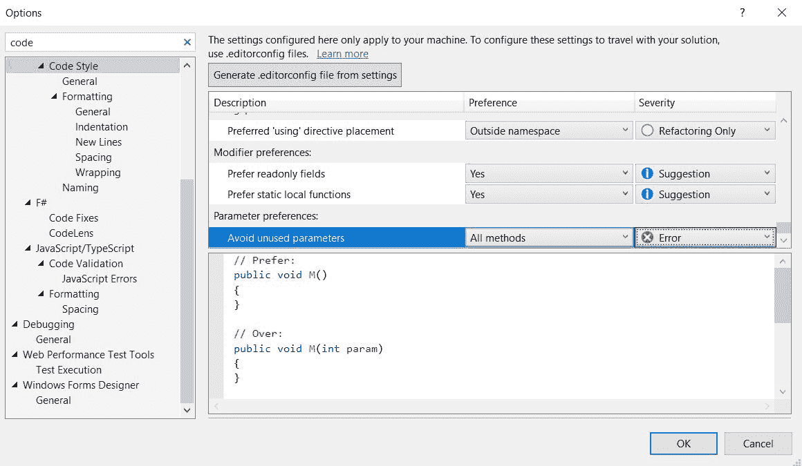

例如，前面的屏幕截图表明“避免未使用参数”被视为错误。在此更改之后，本章开头展示的相同代码的编译结果不同，如以下屏幕截图所示：

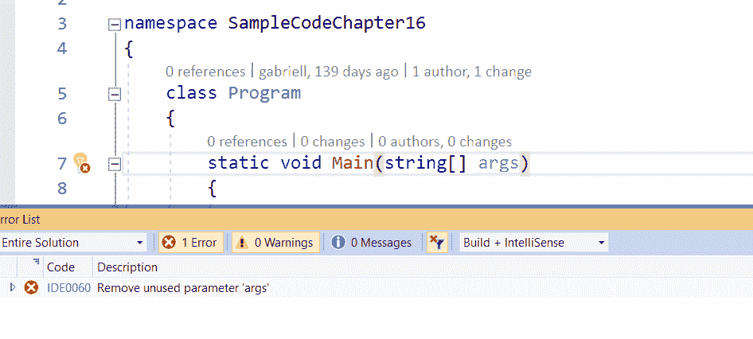

您可以将您的编码风格配置导出并附加到项目中，这样它就会遵循您定义的规则。

Visual Studio 2019 提供的另一个好工具是**分析和代码清理**。在这个工具中，您可以设置一些可以从代码中清理出来的代码标准。例如，在以下屏幕截图中，它被设置为删除不必要的代码：

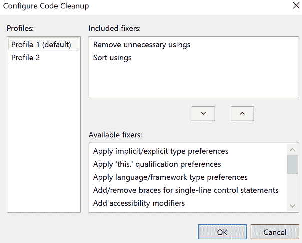

在解决方案资源管理器区域中选择代码清理的方式，正如您在下面的屏幕截图中所见。这个过程将在您所有的代码文件中运行：

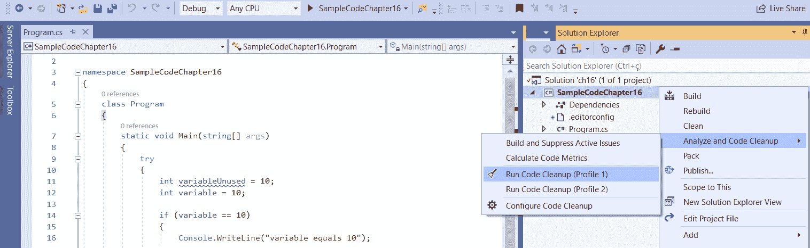

解决了代码风格和代码清理工具指示的错误后，我们正在处理的示例代码有一些最小化简化，如下所示：

```cs
using System;
namespace SampleCodeChapter16
{
    class Program
    {
        static void Main()
        {
            try
            {
                int variable = 10;
                if (variable == 10)
                {
                    Console.WriteLine("variable equals 10");
                }
                else
                {
                    switch (variable)
                    {
                        case 0:
                            Console.WriteLine("variable equals 0");
                            break;
                    }
                }
            }
            catch
            {
            }
        }
    }
}
```

值得注意的是，前面的代码有许多需要改进的地方。除此之外，Visual Studio 通过安装扩展到 IDE 中来启用额外的工具。这些工具可以帮助您提高代码质量，因为其中一些工具是专门用于代码分析的。本节将列出一些免费选项，以便您可以选择最适合您需求的选项。当然，还有其他选项，甚至付费选项。这里的想法不是指出一个特定的工具，而是给您一个它们能力的大致了解。

要安装这些扩展，您需要在 Visual Studio 中找到菜单。这里有一个扩展管理器的屏幕截图：

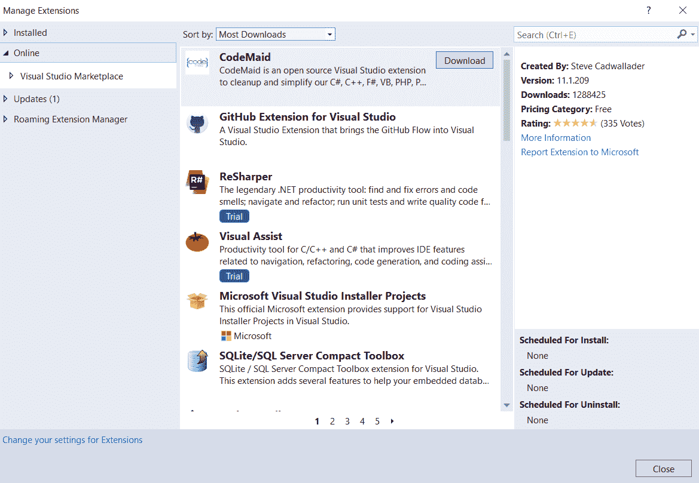

有许多其他酷炫的扩展可以提高您代码和解决方案的生产力和质量。您可以在该管理器中搜索它们。

在你选择要安装的扩展之后，你需要重新启动 Visual Studio。大多数扩展在安装后都很容易识别，因为它们会修改 IDE 的行为。

# 应用扩展工具分析代码

尽管在代码样式和代码清理工具之后提供的示例代码比我们在本章开头展示的要好，但它显然远未达到第十四章中讨论的最佳实践，即*C# 8 编码最佳实践*。在接下来的几节中，你将能够检查三个可以帮助你改进代码的扩展的行为：Microsoft Code Analysis 2019、SonarLint for Visual Studio 2019 和 Code Cracker for Visual Studio 2017。

# 使用 Microsoft Code Analysis 2019

这个扩展由 Microsoft DevLabs 提供，是对我们过去用来自动化的 FxCop 规则的升级。基本上，它有超过 100 条规则用于在编写代码时检测问题。

例如，只需启用扩展并重新构建我们在本章中使用的这个小示例，代码分析就找到了一个新的问题需要解决，如下面的截图所示：

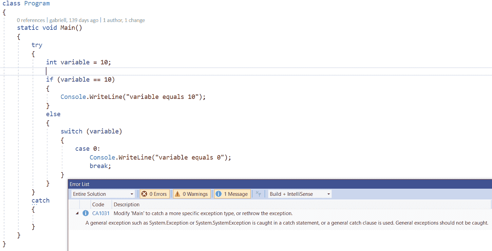

值得注意的是，我们在第十四章中讨论了空`try-catch`语句作为反模式的使用。因此，如果能够像这样暴露这类问题，对代码的健康状况将大有裨益。

# 在 Visual Studio 2019 中应用 SonarLint

SonarLint 是 Sonar Source 社区发起的一个开源项目，旨在你在编码时检测错误和质量问题。它支持 C#、VB .NET、C、C++ 和 JavaScript。这个扩展的伟大之处在于它附带了解决检测到的问题的解释，这就是为什么我们说开发者在使用这些工具的同时学会了如何编写良好的代码。查看以下截图，其中展示了在示例代码中进行的分析：

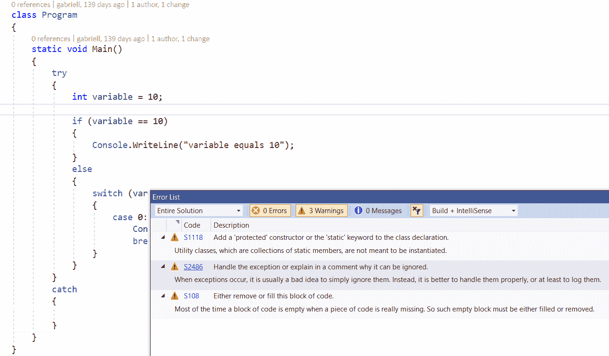

我们可以验证这个扩展能够指出其他错误，并且正如它们承诺的那样，每个警告都有解释。这不仅仅对于检测问题很有用，而且对于培养开发者的良好编码实践也很有帮助。

# 将 Code Cracker 用于 Visual Studio 2017，作为编写更好代码的辅助工具

Code Cracker 是另一个使用 Roslyn 分析代码的工具，它是由一些 Microsoft MVP 发起的，也是开源的。根据 Visual Studio Marketplace，使用这个工具的人比使用其他任何工具的人都要多：

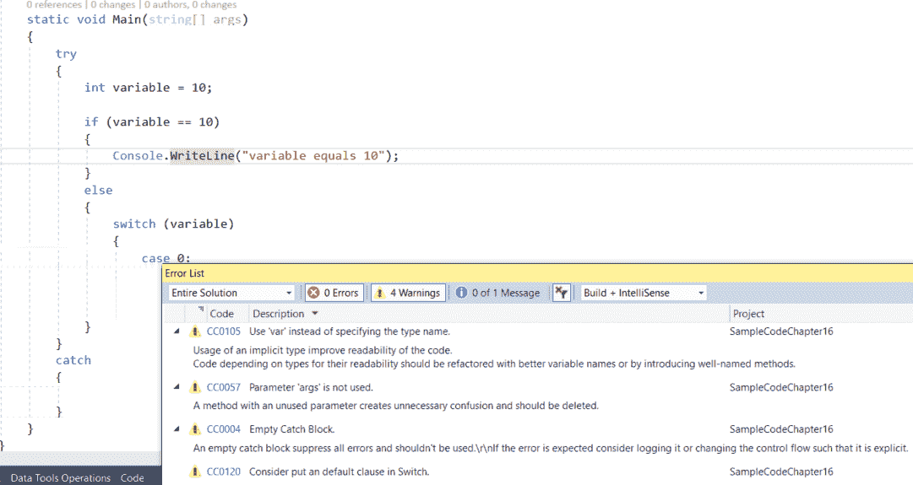

值得注意的是，这个工具中检测到了其他工具中没有发现的新规则。一个扩展到另一个扩展之间的代码分析差异的原因可能是编程的规则并不相同。

# 在分析后检查最终代码

在分析三个扩展之后，我们最终解决了所有提出的问题。我们可以检查最终的代码，如下所示：

```cs
using System;
namespace SampleCodeChapter16
{
    static class Program
    {
        static void Main()
        {
            try
            {
                int variable = 10;
                if (variable == 10)
                {
                    Console.WriteLine("variable equals 10");
                }
                else
                {
                    switch (variable)
                    {
                        case 0:
                            Console.WriteLine("variable equals 0");
                            break;
                        default:
                            Console.WriteLine("Unknown behavior");
                            break;
                    }
                }
            }
            catch (Exception err)
            {
                Console.WriteLine(err);
            }
        }
    }
}
```

如您所见，前面的代码不仅更容易理解，而且更安全，并且能够考虑编程的不同路径，因为`switch-case`的默认值已经编程。这种模式在第十四章编码 C# 8 的最佳实践中也进行了讨论，该章节总结说，最佳实践可以很容易地通过使用本章中提到的（或所有）扩展之一（或全部）来遵循。

# 用例 - 在发布应用程序之前评估 C#代码

在第三章，“使用 Azure DevOps 记录需求”，我们在平台上创建了 WWTravelClub 仓库。正如我们看到的，Azure DevOps 支持持续集成，这非常有用。在本节中，我们将讨论更多关于 DevOps 概念和 Azure DevOps 平台为何如此有用的原因。

目前，我们想要介绍的唯一事情是分析开发者在提交代码后但尚未发布之前代码的可能性。在当今的 SaaS 应用程序生命周期工具领域，这仅得益于我们拥有的一些 SaaS 代码分析平台。用例将使用 Sonar Cloud。

Sonar Cloud 对开源代码是免费的，并且可以分析存储在 GitHub、Bitbucket 和 Azure DevOps 中的代码。注册需要这些平台的一个用户。一旦您登录，您就可以按照以下文章中描述的步骤创建 Azure DevOps 和 Sonar Cloud 之间的连接：[`sonarcloud.io/documentation/analysis/scan/sonarscanner-for-azure-devops/`](https://sonarcloud.io/documentation/analysis/scan/sonarscanner-for-azure-devops/)。

通过在 Azure DevOps 项目和 Sonar Cloud 之间建立连接，您将拥有以下所示的构建管道：

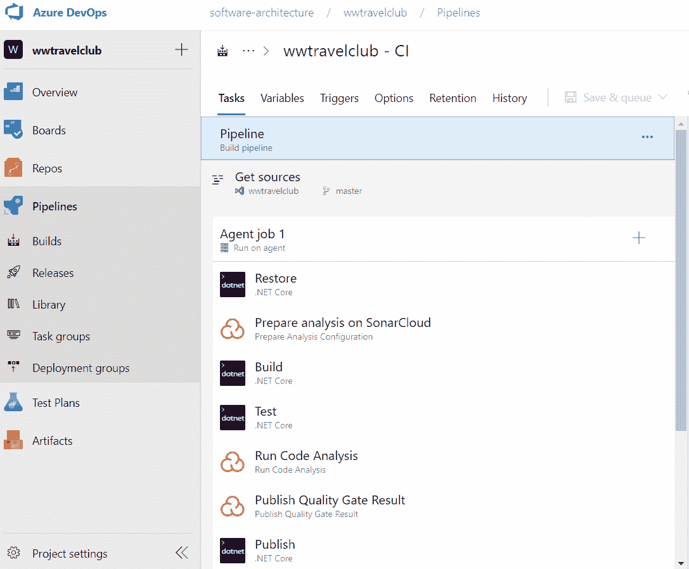

值得注意的是，C#项目没有 GUID 编号，而 Sonar Cloud 需要这个编号。您可以使用此链接（[`www.guidgenerator.com/`](https://www.guidgenerator.com/)）轻松生成一个，并将其放置如下截图所示：

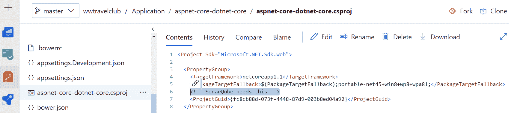

一旦您完成构建，代码分析的结果将在 Sonar Cloud 中展示，如下一截图所示。如果您想导航到该项目，可以访问：[`sonarcloud.io/dashboard?id=WWWTravelClub`](https://sonarcloud.io/dashboard?id=WWWTravelClub)：

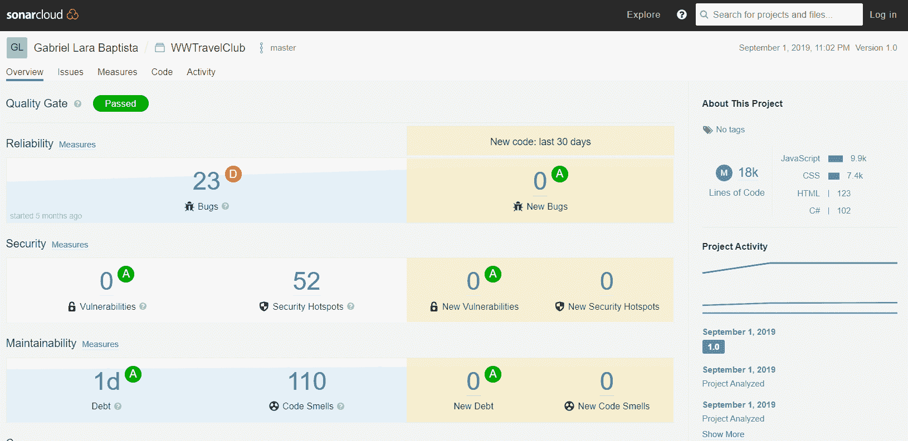

此外，到这个时候，已经分析的代码还没有发布。因此，这可以在发布系统之前获得下一步的质量提升非常有用。您可以将这种方法作为在提交代码时自动进行代码分析的参考。

# 摘要

本章介绍了可以用来应用第十四章中描述的编码最佳实践的工具体现，即《C# 8 编码最佳实践》。我们探讨了 Roslyn 编译器，它允许在开发者编码的同时进行代码分析，并探讨了用例——在发布应用程序之前评估 C#代码，这在使用 Sonar Cloud 的 Azure DevOps 构建过程中实现了代码分析。

一旦将本章所学的一切应用到你的项目中，代码分析将为你提供改进交付给客户代码质量的机会。这是软件架构师的一个非常重要的角色。

在下一章中，我们将使用 Azure DevOps 部署你的应用程序。

# 问题

1.  如何描述软件为编写良好的代码？

1.  Roslyn 是什么？

1.  代码分析是什么？

1.  代码分析的重要性是什么？

1.  Roslyn 如何帮助进行代码分析？

1.  什么是 Visual Studio 扩展？

1.  展示的代码分析扩展工具是什么？

# 进一步阅读

这些是一些你可以找到本章主题更多信息的网站：

+   [Microsoft Code Analysis 2019](https://marketplace.visualstudio.com/items?itemName=VisualStudioPlatformTeam.MicrosoftCodeAnalysis2019)

+   [SonarLint for Visual Studio 2019](https://marketplace.visualstudio.com/items?itemName=SonarSource.SonarLintforVisualStudio2019)

+   [CodeCracker for C](https://marketplace.visualstudio.com/items?itemName=GiovanniBassi-MVP.CodeCrackerforC)

+   [Roslyn 分析器](https://github.com/dotnet/roslyn-analyzers)

+   [Visual Studio 代码样式和代码清理](https://docs.microsoft.com/en-us/visualstudio/ide/code-styles-and-code-cleanup)

+   [Sonar Scanner for Azure DevOps](https://sonarcloud.io/documentation/analysis/scan/sonarscanner-for-azure-devops/)

+   [GUID 生成器](https://www.guidgenerator.com/)
