# 使用 Azure DevOps 部署你的应用程序

本章重点介绍所谓的**服务设计思维**，即牢记你正在设计的软件作为提供给组织/组织部分的服务。这种方法的主要收获是，最高优先级是软件为目标组织带来的价值。此外，你提供的不仅仅是可工作的代码和修复错误的协议，而是一套满足软件所设想的所有需求的解决方案。换句话说，你的工作包括满足这些需求所需的一切，例如监控用户满意度，并在用户需求发生变化时调整软件。

最后，监控软件以揭示问题和新的需求，并快速修改以适应不断变化的需求要容易得多。

服务设计思维严格与**软件即服务**（**SaaS**）模型相关联，我们在第四章中讨论了该模型，*决定最佳基于云的解决方案*。事实上，提供基于 Web 服务的解决方案最简单的方法是提供作为服务的 Web 服务使用，而不是销售实现它们的软件。

更具体地说，本章涵盖了以下主题：

+   理解 SaaS

+   为服务场景准备解决方案

+   用例 - 使用 Azure Pipelines 部署我们的包管理应用程序

到本章结束时，你将能够根据服务设计思维原则设计软件，并使用 Azure Pipelines 部署你的应用程序。

# 技术要求

本章需要 Visual Studio 2017 或 2019 免费社区版或更高版本，并安装所有数据库工具。它需要一个免费的 Azure 账户。如果你还没有创建一个，第一章中“理解软件架构的重要性”的*创建 Azure 账户*小节解释了如何创建。本章使用与第十五章相同的代码，*使用单元测试用例和 TDD 测试你的代码*，可在以下链接找到：[`github.com/PacktPublishing/Hands-On-Software-Architecture-with-CSharp-8`](https://github.com/PacktPublishing/Hands-On-Software-Architecture-with-CSharp-8)。

# 理解 SaaS

将软件作为服务销售/使用与一套更广泛的服务设计思维原则相关联。服务设计思维不仅仅是一种软件开发技术/或软件部署方法，它还影响几个业务领域，即组织与人力资源、软件开发流程，最后是硬件基础设施和软件架构。

在接下来的小节中，我们将简要讨论我们列出的每个业务领域的含义，在最后一个小节中，我们将专注于 SaaS 部署模型。

# 使你的组织适应服务场景

第一个组织影响来自优化软件对目标组织价值的需要。这需要一个人力资源或团队——负责计划和监控软件在目标组织中的影响——以最大化软件带来的增值。这个战略角色不仅在初始设计阶段需要，在整个应用程序的生命周期中都需要。实际上，这个角色负责保持软件与目标组织不断变化的需求精确匹配。

另一个重要的影响领域是**人力资源管理**。事实上，由于主要优先考虑的是软件带来的增值，而不是利用现有资源和能力，因此人力资源必须适应项目需求。这意味着一旦需要就获取新资源，并通过新的人力资源和/或对现有资源的适当培训来发展所需的能力。

下一个子节将讨论所有涉及软件开发过程的含义。

# 在服务场景中开发软件

影响软件开发流程的主要约束是保持软件与组织需求精确匹配的需求。这一需求可以通过基于 CI/CD 方法的任何敏捷方法来满足。对于 CI/CD 的简要回顾，请参阅第三章“使用 Azure DevOps 组织工作”部分，[文档化需求](https://wiki.example.org/bc26065f-b001-4123-9524-3bbfa87bfadd.xhtml)，而对于 CI/CD 的详细讨论，请参阅第十七章“使用 Azure DevOps 部署您的应用程序”，该章节完全致力于 CI/CD。值得注意的是，任何设计良好的 CI/CD 周期都应该包括处理用户反馈和用户满意度报告。

此外，为了优化软件带来的增值，组织开发团队（或其一部分）与系统用户紧密接触的阶段是一个好的做法，这样开发者可以更好地理解软件对目标组织的影响。

最后，在编写功能性和非功能性需求时，必须始终牢记软件带来的增值。因此，用考虑*为什么*和*如何*它们对增值做出贡献的原因来注释*用户故事*是有用的。收集需求的过程在第二章“功能性和非功能性需求”中讨论。

下一个子节将讨论更多技术影响。

# 服务场景的技术影响

在服务场景中，硬件基础设施和软件架构都受到以下三个主要原则的限制，这些原则是保持软件与组织需求精确匹配的必然结果，具体如下：

+   需要监控软件以发现可能由系统故障或软件使用和/或用户需求变化引起的任何问题。这意味着从所有硬件/软件组件中提取健康检查和负载统计信息。用户执行的操作统计信息也能提供有关组织需求变化的良好线索——更具体地说，用户和应用程序在每个操作实例上花费的平均时间以及每单位时间内（日、周或月）执行的操作实例数量。

+   还需要监控用户满意度。可以通过在每个应用程序屏幕上添加一个链接到易于填写的用户满意度报告页面来获取用户满意度的反馈。

+   最后，需要快速适应硬件和软件，既要适应每个应用程序模块接收到的流量，也要适应组织需求的变更。这意味着以下内容：

    +   极端关注软件模块化

    +   保持对数据库引擎变化的开放态度，并优先考虑基于 SOA 或微服务架构的解决方案，而不是单体软件

    +   保持对新技术的开放态度

使硬件易于适应意味着允许硬件扩展，这反过来又意味着采用云基础设施、硬件集群或两者兼而有之。同时，保持对云服务供应商变化的开放态度也很重要，这反过来意味着将依赖云平台封装在少数几个软件模块中。

通过选择每个模块实现的最佳技术，可以最大化软件增加的价值，这反过来意味着能够混合不同的技术。这正是基于容器的技术，如 Docker，发挥作用的地方。Docker 和相关技术已在第五章中描述，即*将微服务架构应用于您的企业应用*。

总结来说，我们所列出的所有要求都汇聚于本书中描述的大多数先进技术，例如云服务、可扩展的 Web 应用、分布式/可扩展数据库、Docker、SOA 和微服务架构。

关于如何为服务环境准备软件的更多细节将在下一节中给出，而下一小节将专门讨论 SaaS 应用的优缺点。

# 采用 SaaS 解决方案

SaaS 解决方案的主要吸引力在于其灵活的支付模式，它提供了以下优势：

+   您可以避免为了更实惠的月度支付而放弃大额投资。

+   您可以从一个便宜的系统开始，然后在业务增长时再转向更昂贵的解决方案。

然而，SaaS 解决方案还提供了其他优势，具体如下：

+   在所有云解决方案中，您可以轻松扩展您的解决方案。

+   应用程序会自动更新。

+   由于 SaaS 解决方案是通过公共互联网提供的，因此可以从任何位置访问。

不幸的是，SaaS 的优势是有代价的，因为 SaaS 也存在不可忽视的劣势，具体如下：

+   您的业务与 SaaS 提供商紧密相连，这可能导致服务被终止或以您不再接受的方式修改。

+   通常，您无法实施任何类型的定制，只能限制于 SaaS 供应商提供的少数标准选项。然而，有时 SaaS 供应商也提供添加自定义模块的可能性，这些模块可以由他们或您编写。

总结来说，SaaS 解决方案提供了有趣的优势，但也存在一些劣势，因此作为软件架构师，您必须进行详细分析以决定如何采用它们。

下一个部分将解释如何将软件适应用于服务场景。

# 准备服务场景的解决方案

首先，*为服务场景准备解决方案*意味着专门为云和/或分布式环境设计它。反过来，这意味着在设计时考虑到可扩展性、容错性和自动故障恢复。

前三点的主要影响是关于如何处理*状态*。无状态模块实例易于扩展和替换，因此您应仔细规划哪些模块是无状态的，哪些有状态。此外，如第七章“如何在云中选择您的数据存储”中所述，您必须记住写入和读取操作以完全不同的方式扩展。特别是，读取操作可以通过复制更容易扩展，而写入操作在关系型数据库中扩展不佳，通常需要 NoSQL 解决方案。

在分布式环境中，高可扩展性防止了分布式事务和同步操作的使用。因此，数据一致性和容错性只能通过基于异步消息的更复杂技术来实现，如下所示：

+   一种技术是将所有要发送的消息存储在队列中，以便在发生错误或超时的情况下可以重试异步传输。消息可以在收到确认接收或模块决定终止产生消息的操作时从队列中删除。

+   另一个问题是处理同一消息被多次接收的可能性，因为超时导致同一消息被多次发送。

+   如果需要，使用乐观并发和事件溯源等技术来最小化数据库中的并发问题。乐观并发在第十三章的“数据层”子部分中进行了解释，该部分位于“展示 ASP.NET Core MVC”用例的末尾，而事件溯源则在第十章的“使用 SOLID 原则映射您的领域”部分中与其他数据层内容一起进行了描述。

前面的列表中的前两点与第五章的“如何.NET Core 处理微服务？”部分中讨论的其他分布式处理技术一起进行了详细讨论，该部分标题为“将微服务架构应用于您的企业应用程序”。

容错和自动故障恢复要求软件模块实现健康检查接口，云框架可能会调用这些接口以验证模块是否正常工作，或者是否需要将其终止并由另一个实例替换。ASP.NET Core 和所有 Azure 微服务解决方案都提供现成的基本健康检查，因此开发者不需要关心这些。然而，可以通过实现一个简单的接口添加更详细的自定义健康检查。

如果你的目标是可能更改某些应用程序模块的云提供商，那么难度会增加。在这种情况下，必须将云平台依赖封装在仅几个模块中，并且必须丢弃过于严格绑定到特定云平台解决方案。因此，例如，你应该避免使用有状态的/无状态的本地 Service Fabric 服务，因为它们的架构是特定于 Azure Service Fabric 的，所以它们不能移植到不同的云平台。

如果你的应用程序是为服务场景设计的，那么一切都必须自动化：新版本的测试和验证、创建应用程序所需的整个云基础设施，以及在该基础设施上部署应用程序。

所有云平台都提供语言和工具来自动化整个软件 CI/CD 周期，即构建代码、测试代码、触发手动版本批准、创建硬件基础设施以及部署应用程序。

Azure Pipelines 允许自动化所有列出的步骤。在第十五章的“使用单元测试用例和 TDD 测试您的代码”用例中展示了如何使用 Azure Pipelines 自动化包括软件测试在内的所有步骤。下一节的用例将展示如何自动化在 Azure Web 应用平台上的应用程序部署。

自动化在 SaaS 应用程序中扮演着更基本的角色，因为每个新客户的整个新租户的创建必须由客户订阅自动触发。更具体地说，多租户 SaaS 应用程序可以通过三种基本技术实现：

+   所有客户共享相同的基础设施和数据存储。这个解决方案最容易实施，因为它只需要实现一个标准 Web 应用程序。然而，它仅适用于非常简单的 SaaS 服务，因为对于更复杂的应用程序，始终更难确保存储空间和计算时间在用户之间平均分配。此外，随着数据库变得越来越复杂，始终更难确保不同用户的数据安全隔离。

+   所有客户共享相同的基础设施，但每个客户都有自己的数据存储。这个选项解决了之前解决方案中所有的数据库问题，并且由于创建一个新的租户只需要创建一个新的数据库，因此它很容易自动化。此解决方案提供了一种简单的方式来定义定价策略，通过将其与存储消耗相关联。

+   每个客户都有自己的私有基础设施和数据存储。这是最灵活的策略。从用户的角度来看，它的唯一缺点是价格更高。因此，它仅适用于每个用户所需的计算能力达到最低阈值以上。由于必须为每个新客户创建整个基础设施，并在其上部署应用程序的新实例，因此自动化更困难。

无论选择哪三种策略中的哪一种，你都需要有随着消费者增加而扩展你的云资源的能力。

如果你还需要确保你的基础设施创建脚本可以在多个云提供商之间工作，那么一方面，你不能使用过于特定于单个云平台的特性，另一方面，你需要一种独特的、可以翻译成更常见云平台本地语言的、用于创建基础设施的语言。Terraform 和 Ansible 是描述硬件基础设施的两个非常常见的选择。

# 用例 - 使用 Azure Pipelines 部署我们的包管理应用程序

在本节中，我们将配置一个自动部署到 Azure App Service 平台，用于我们已经在第十五章的用例中定义的 DevOps 项目，即“使用单元测试用例和 TDD 测试你的代码”。Azure DevOps 还可以自动创建一个新的 Web 应用程序，但为了避免配置错误（这可能会消耗掉你所有的免费额度），我们将手动创建它，并让 Azure DevOps 仅部署应用程序。所有必需的步骤都组织成以下各个子节。

# 创建 Azure Web 应用程序和 Azure 数据库

可以通过以下简单步骤定义 Azure Web App：

1.  前往 Azure 门户，选择 App Services，然后点击“添加”按钮创建一个新的 Web App。按照以下方式填写所有数据：

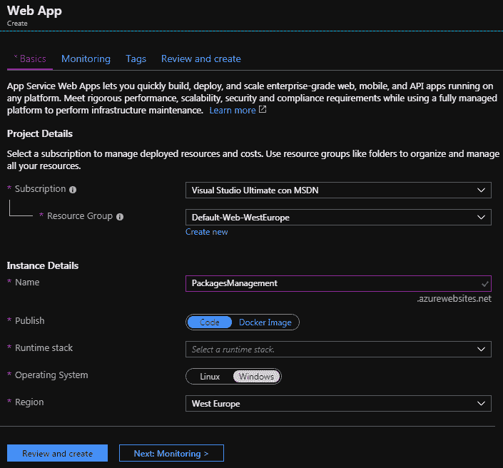

1.  显然，你可以使用你已有的资源组，以及对你来说最方便的区域。对于运行时堆栈，请选择你在 Visual Studio 解决方案中使用的相同的 .NET Core 版本。

1.  现在，如果你有足够的信用额度，让我们为应用程序创建一个 SQL Server 数据库，并将其命名为 `PackagesManagementDatabase`。如果你没有足够的信用额度，不用担心——你仍然可以测试应用程序部署，但应用程序在尝试访问数据库时会返回错误。请参考第七章 7.7 的 *关系数据库* 子节，*如何在云中选择你的数据存储*，了解如何创建 SQL Server 数据库。

# 配置你的 Visual Studio 解决方案

一旦你定义了 Azure Web App，你需要按照以下简单步骤配置应用程序以在 Azure 中运行：

1.  如果你定义了 Azure 数据库，你需要在 Visual Studio 解决方案中使用两个不同的连接字符串，一个用于本地数据库的开发，另一个用于 Web 应用的 Azure 数据库。

1.  现在，在 Visual Studio 解决方案中打开 `appsettings.Development.json` 和 `appsettings.json`，如下所示：


1.  然后，将 `appsettings.json` 中的整个 `ConnectionStrings` 节复制到 `appsettings.Development.json` 中，如下所示：

```cs
"ConnectionStrings": {
        "DefaultConnection": "Server=(localdb)....."
},
```

现在你已经有了开发设置中的本地连接字符串，因此你可以将 `appsettings.json` 中的 `DefaultConnection` 改为 Azure 数据库中的一个。

1.  前往 Azure 门户中的数据库，复制连接字符串，并用你在定义数据库服务器时获得的用户名和密码填充它。

1.  最后，在本地提交你的更改，然后与远程仓库同步。现在，你的更改已经在 DevOps 管道中，它正在处理这些更改以获取新的构建。

# 配置 Azure 管道

最后，你可以按照以下步骤配置 Azure 管道，以自动将你的应用程序部署到 Azure：

1.  通过点击 Visual Studio Team Server 窗口的“连接”选项卡中的“管理连接”链接，将 Visual Studio 与你的 DevOps 项目连接起来。然后，点击 DevOps 链接进入你的在线项目。

1.  通过在单元测试步骤之后添加一个额外的步骤来修改 `PackagesManagementWitTests` 构建管道。实际上，我们需要一个步骤来准备所有要部署的文件，并将它们打包成一个 ZIP 文件。

1.  点击 `PackagesManagementWitTests` 管道的“编辑”按钮，然后前往文件末尾并写下以下内容：

```cs
- task: PublishBuildArtifacts@1
```

1.  当新任务上方出现“设置”链接时，点击它以配置新任务：

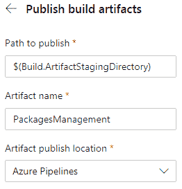

1.  接受默认的发布路径，因为它已经与将要部署应用程序的任务路径同步，只需插入工件名称，然后选择“Azure Pipeline”作为位置。一旦保存，管道将开始，新添加的任务应该会成功。

1.  部署和其他发布工件被添加到不同的管道中，称为发布管道，以将它们与构建相关工件解耦。使用发布管道，您无法编辑`.yaml`文件，但您将使用图形界面进行操作。

1.  点击“发布”左侧菜单标签以创建新的发布管道。一旦您点击添加新管道，系统将提示您添加第一个管道阶段的第一项任务。实际上，整个发布管道由不同的阶段组成，每个阶段都包含一系列任务。虽然每个阶段只是一系列任务，但阶段图可以分支，我们可以在每个阶段之后添加几个分支。这样，我们可以部署到不同的平台，每个平台都需要不同的任务。在我们的简单示例中，我们将使用单个阶段。

1.  选择“部署 Azure 应用服务”任务。一旦添加此任务，系统将提示您填写缺失信息：


1.  点击错误链接并填写缺失的参数：


1.  选择您的订阅，然后，如果出现授权按钮，请点击它以授权 Azure Pipelines 访问您的订阅。然后，选择“Windows”作为部署平台，最后，从“应用服务名称”下拉列表中选择您创建的应用服务。任务设置在您编写时自动保存，因此您只需点击“保存”按钮即可保存整个管道。

1.  现在，我们需要将此管道连接到源工件。点击“添加工件”按钮，然后选择“构建”作为源类型，因为我们需要将新的发布管道与构建管道创建的 ZIP 文件连接。一个设置窗口将出现：

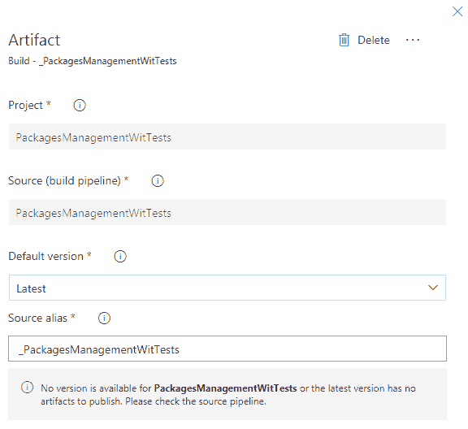:

1.  从下拉列表中选择我们之前的构建管道，并保持“最新”作为版本。最后，接受在“源别名”中建议的名称。

我们的发布管道已准备就绪，可以直接使用。您刚刚添加的源工件图像在其右上角包含一个触发图标，如下所示：

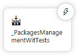

如果您点击触发图标，您可以选择在新构建可用时自动触发发布管道：

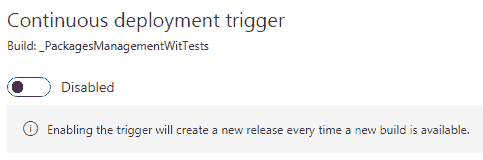

保持其禁用状态；我们可以在完成并手动测试发布管道后启用它。为了准备自动触发，我们需要在应用程序部署之前添加一个人工批准任务。

# 添加发布的人工批准

由于任务通常由软件代理执行，我们需要在手动工作中嵌入人工批准。让我们按照以下步骤添加：

1.  点击阶段 1 标题右侧的三个点：

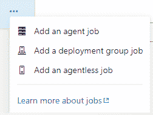

1.  然后，选择添加一个无代理作业。一旦添加了无代理作业，点击其添加按钮并添加一个“人工干预”任务。以下截图显示了“人工干预”设置：

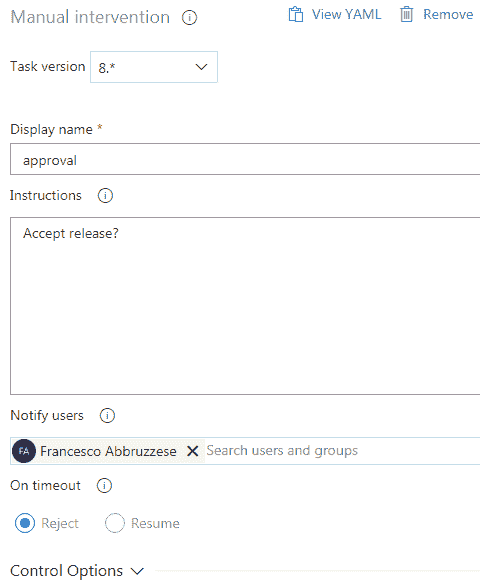

1.  在“通知用户”字段中添加操作员的说明并选择你的账户。

1.  现在，用鼠标拖动整个“无代理作业”，将其放置在应用程序部署任务之前。最终的截图应该是这样的：

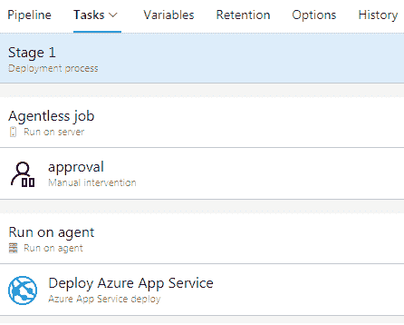

1.  完成！点击左上角的保存按钮保存管道。

现在，一切准备就绪，我们可以创建我们的第一个自动发布。

# 创建发布

一旦一切准备就绪，可以按照以下步骤准备和部署新版本：

1.  让我们点击“创建发布”按钮开始创建新版本：

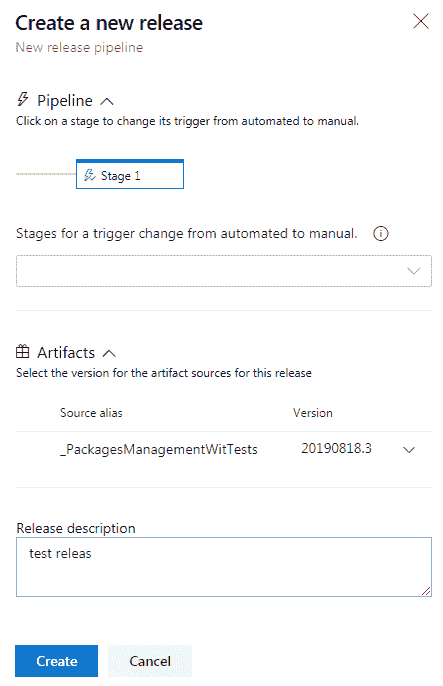

1.  确认“源别名”是最后一个可用的，添加发布描述，然后点击创建。在短时间内，你应该会收到发布批准的电子邮件。点击其中的链接，进入批准页面：

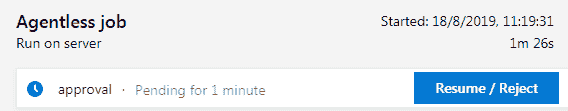

1.  点击“恢复/拒绝”按钮然后批准发布。等待部署完成。你应该看到所有任务都成功完成，如下面的截图所示：

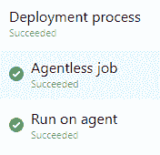

你已经运行了第一个成功的发布管道！

在实际项目生活中，发布管道将包含更多任务。事实上，应用程序（在部署到实际生产环境之前）是在预发布环境中部署的，在那里它们进行 beta 测试。因此，在这次首次部署之后，可能会有一些手动测试，手动授权在生产中的部署，以及最终的在生产环境中的部署。

# 摘要

我们描述了*服务设计思维*原则和 SaaS 软件部署模型。现在，你应该能够分析这些方法对一个组织的影响，并且应该能够调整现有的软件开发流程和软硬件架构，以利用它们提供的机会。

我们还解释了软件周期自动化、云硬件基础设施配置和应用程序部署的必要性和涉及的技术。

一旦你在最后的使用案例部分实现了示例，你应该能够使用 Azure Pipelines 来自动化基础设施配置和应用程序部署。

下一章将更深入地探讨 DevOps，它与详细讨论在第十九章中的 CI/CD，即*在 DevOps 中应用 CI 场景的挑战*，在服务场景中起着基本的作用，尤其是在 SaaS 应用程序的维护方面。

# 问题

1.  服务设计思维的主要目标是什么？

1.  服务设计思维是否真的需要充分利用公司现有的所有能力？

1.  为什么在 SaaS 应用程序的生命周期中，完全自动化是基本的？

1.  是否可以使用平台无关的语言定义硬件云基础设施？

1.  在整个应用程序生命周期自动化中，Azure 优先使用的工具是什么？

1.  如果两个 SaaS 供应商提供相同的软件产品，你应该选择最可靠的还是最便宜的？

1.  可扩展性是否是服务场景中唯一重要的要求？

# 进一步阅读

本章的主要参考文献是本书其他章节/部分的引用，并在本章中已给出。在此，我们仅提供 Azure Pipelines 文档的链接：[`docs.microsoft.com/en-us/azure/devops/pipelines/?view=azure-devops`](https://docs.microsoft.com/en-us/azure/devops/pipelines/?view=azure-devops)，以及本章中提到的两种基础设施描述语言，Terraform ([`www.terraform.io/`](https://www.terraform.io/)) 和 Ansible ([`www.ansible.com/`](https://www.ansible.com/))。
