# 第十八章：理解 DevOps 原则

DevOps 是当今每个人都正在学习和实践的过程。但作为一名软件架构师，你需要理解并推广 DevOps，不仅作为一个过程，而且作为一个哲学。本章将涵盖你需要用 DevOps 开发和交付软件的主要概念、原则和工具。

本章将涵盖以下主题：

+   描述 DevOps 是什么，并查看在 WWTravelClub 项目中如何应用的示例

+   理解 DevOps 原则和部署阶段以利用部署过程

+   学习可以与 Azure DevOps 一起使用以改进测试和反馈的 DevOps 工具

与其他章节不同，WWTravelClub 项目将在本章节的主题中介绍，我们将在章节末尾提供一个结论，给你机会了解这一哲学如何得到实施。所有展示 DevOps 原则的截图都来自本书的主要样本，因此你将能够轻松理解 DevOps 原则。

# 技术要求

本章需要 Visual Studio 2019 社区版或更高版本。你可能还需要一个 Azure DevOps 账户，如第三章中所述，*使用 Azure DevOps 记录需求*。

# 描述 DevOps

DevOps 一词来源于**开发**和**运维**的合并，因此这个过程简单地将这些领域的行动统一起来。然而，当你开始更深入地了解它时，你会意识到仅仅连接这两个领域还不足以实现这一哲学的真正目标。

我们也可以说，DevOps 是回答人类当前关于软件交付需求的流程。

**唐纳·布朗**（Donovan Brown），微软首席 DevOps 经理，对 DevOps 有一个精彩的定义：[`donovanbrown.com/post/what-is-devops`](http://donovanbrown.com/post/what-is-devops)。

使用流程、人员和产品持续地向我们的最终用户提供价值——这是 DevOps 哲学的最佳描述。我们需要开发和交付以客户为导向的软件。一旦公司的所有领域都明白关键点是最终用户，作为软件架构师的你，任务就是展示将促进交付过程的技术。

值得注意的是，本书的所有内容都与这一方法相关联。这从来不是知道一堆工具和技术的问题。作为一名软件架构师，你必须理解，这始终是一种将更快地满足最终用户需求的方式，与他们的实际需求相联系。因此，你需要学习 DevOps 原则，这些原则将在本章中讨论。

# 理解 DevOps 原则

将 DevOps 视为一个哲学，值得提到的是，有一些原则可以确保你的团队能够良好地工作。这些原则是持续集成、持续交付和持续反馈。

更多信息，请访问：[`azure.microsoft.com/en-us/overview/what-is-devops/`](https://azure.microsoft.com/en-us/overview/what-is-devops/)。

在许多书籍和技术文章中，DevOps 概念用无穷大的符号表示。这个符号代表在软件开发生命周期中必须有一个持续的方法。在这个过程中，你需要规划、构建、持续集成、部署、运营、获取反馈，然后从头开始。这个过程必须是协作的，因为每个人的焦点都是相同的——向最终用户提供价值。与这些原则一起，作为软件架构师，你需要决定最适合这种方法的最佳软件开发流程。我们在第一章中讨论了这些流程，《理解软件架构的重要性》。

# 定义持续集成

当你开始构建企业级解决方案时，协作是更快完成任务和满足用户需求的关键。正如我们在第十四章中讨论的，《C# 8 最佳实践》中的版本控制系统对于这个过程至关重要，但工具本身并不能完成这项工作，尤其是如果工具配置不当的话。

作为一名软件架构师，**持续集成**（**CI**）将帮助你有一个具体的软件开发协作方法。当你实施它时，一旦开发者提交代码，主代码就会自动构建和测试。

当你应用它时，好处是可以激励开发者尽可能快地合并他们的更改，以最小化合并冲突。此外，他们可以共享单元测试，这将提高软件的质量。

在 Azure DevOps 中设置 CI 非常简单。在构建管道中，你可以通过编辑配置来找到它的选项，如下面的截图所示：

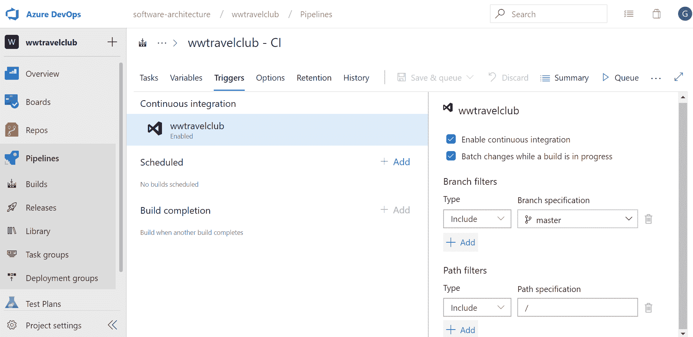

值得注意的是，如果你有一个包含单元测试和功能测试的解决方案集，一旦你提交代码，它就会自动编译和测试。这将使你的主分支在每次团队提交时都保持稳定和安全。

CI 的关键点是能够更快地识别问题。当你允许代码被他人测试和分析时，你将有机会这样做。DevOps 方法唯一能帮助的是确保这一切尽可能快地发生。

# 理解 Azure DevOps 中的持续交付和多阶段环境

一旦您的应用程序的每个提交都构建完成，并且这段代码经过单元和功能测试，您可能还希望进行持续部署。这样做不仅仅是配置工具的问题。作为一名软件架构师，您需要确保团队和流程已经准备好进入这一步骤。

与**持续交付**（**CD**）相关的方法需要保证每次新部署时生产环境的安全。为此，需要采用多阶段管道。以下截图显示了为此目的而采用的一些常见阶段的示例：

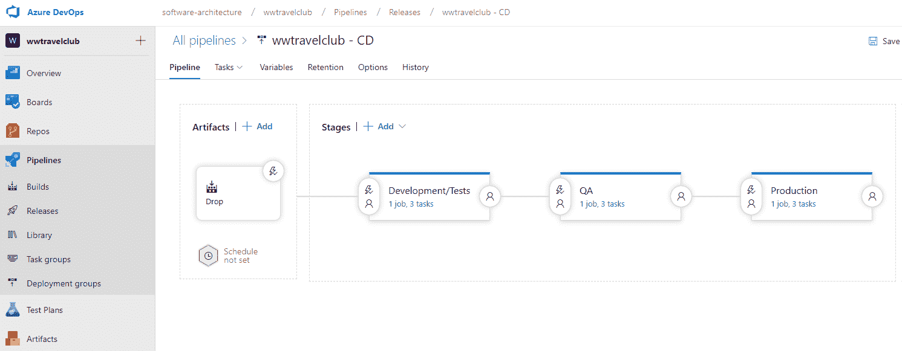

使用 Azure DevOps 的发布阶段

如您所见，这些阶段是通过 Azure DevOps 发布管道配置的。每个阶段都有自己的目的，这将最终提高交付产品的质量。让我们看看这些阶段：

+   **开发/测试**：这个阶段由开发人员和测试人员用来构建新的功能。这个环境肯定会是最容易暴露出 bug 和不完整功能的。

+   **质量保证**：这个环境向与开发和测试无关的团队区域提供新功能的简要版本。项目经理、市场营销、供应商和其他人可以使用它作为研究、验证甚至预生产的区域。此外，开发和质量团队可以保证新版本正确部署，考虑到功能和基础设施。

+   **生产**：这是客户运行其解决方案的阶段。根据 CD，良好生产环境的目标是尽可能快地更新。频率将根据团队规模而变化，但有一些方法，这个过程每天发生不止一次。

部署您的应用程序采用三个阶段将对解决方案的质量产生影响。此外，它将使团队能够有一个更安全的部署过程，风险更少，产品稳定性更好。这种做法一开始可能看起来有点昂贵，但如果没有它，不良部署的结果通常会比这种投资更昂贵。

除了所有的安全性之外，您还必须考虑多阶段场景。您可以设置管道，只有通过定义的授权才能从一个阶段过渡到另一个阶段：

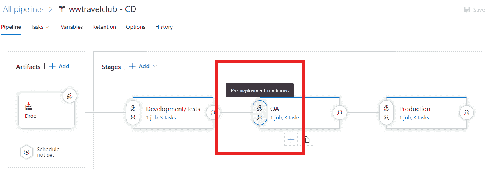

如前一个截图所示，设置预部署条件相当简单，您可以在下面的截图看到，有多个选项可以自定义授权方法。这为您提供了细化 CD 方法的可能性，以满足您正在处理的项目需求。

以下截图显示了 Azure DevOps 为预部署批准提供的选项。你可以定义可以批准阶段的人员并为他们设置策略，即在进行过程之前重新验证审批者身份。作为软件架构师，你需要确定适合你使用这种方法创建的项目配置：

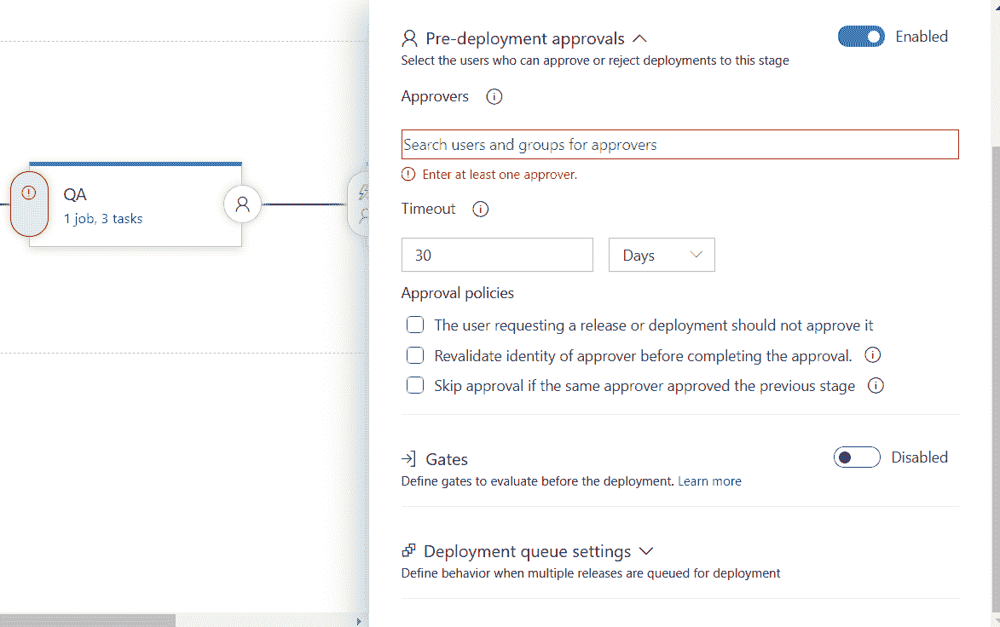

值得注意的是，尽管这种方法远优于单阶段部署，但 DevOps 管道会指导你，作为软件架构师，进入另一个监控阶段。持续反馈将是一个不可思议的工具，我们将在下一节中讨论这种方法。

# 定义持续反馈和相关 DevOps 工具

一旦你在上一节描述的部署场景中运行完美的解决方案，反馈对于你的团队理解发布的结果以及版本如何为顾客工作至关重要。为了获取这些反馈，一些工具可以帮助开发者和顾客，将这些人聚集在一起以加速反馈过程。让我们来看看这些工具。

# 使用 Application Insights 监控你的软件

Application Insights 确实是软件架构师进行持续反馈所需的工具。一旦你将应用程序连接到它，你就开始接收对软件每个请求的反馈。这使得你不仅可以监控请求，还可以监控数据库性能、应用程序可能遭受的错误以及处理时间最长的调用。

显然，你将会有与将此工具集成到你的环境相关的成本，但该工具提供的功能绝对物有所值。此外，你需要了解，由于所有存储数据到 Application Insights 的请求都在一个单独的线程中运行，因此性能成本非常小。以下截图显示了你在环境中创建工具的简易性：

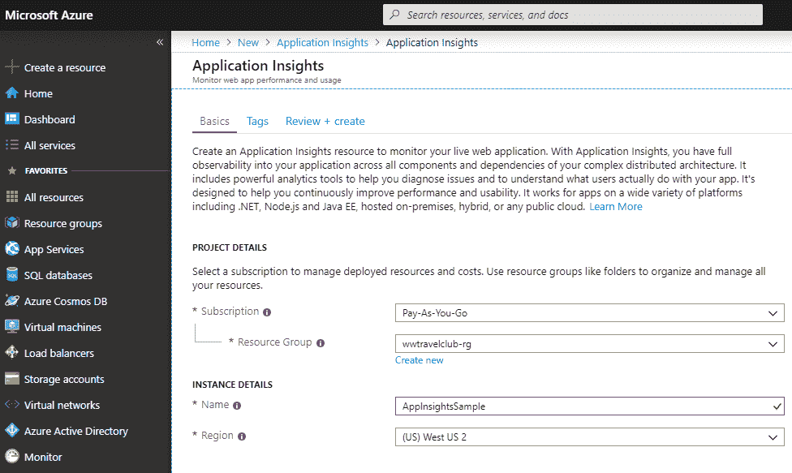

例如，假设你需要分析你应用程序中耗时较长的请求。将 Application Insights 附接到你的 Web 应用程序的过程相当简单，考虑到它可以在你设置 Web 应用程序时立即完成。如果你不确定 Application Insights 是否是你的 Web 应用程序，你可以使用 Azure 门户来查找。导航到 App Services 并查看 Application Insights 设置，如下面的截图所示：

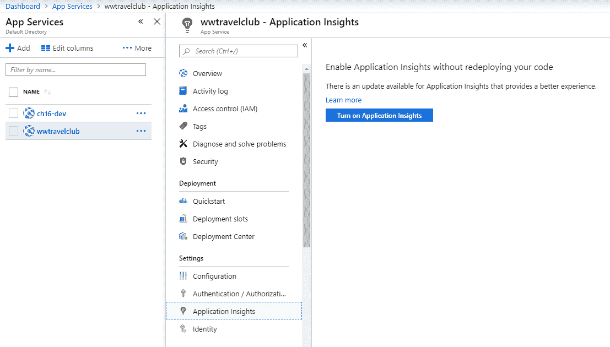

界面将为你提供创建或附加已创建的监控服务到你的 Web 应用程序的机会。值得注意的是，你可以将多个 Web 应用程序连接到同一个 Application Insights 组件。以下截图显示了如何将 Web 应用程序添加到已创建的 Application Insights 资源中：

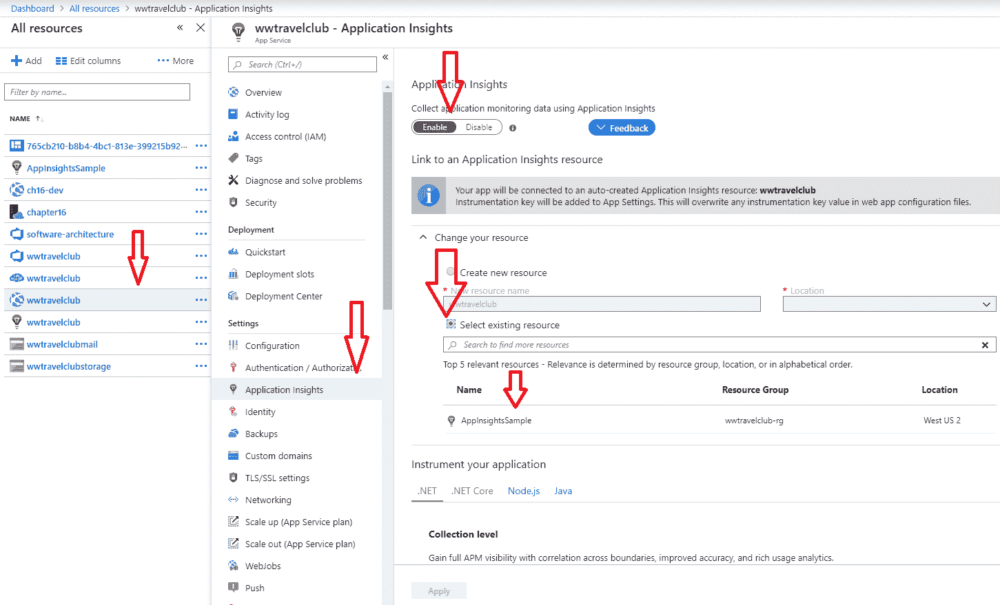

一旦为您的 Web 应用程序配置了 Application Insights，您将在 App Services 中找到以下屏幕：

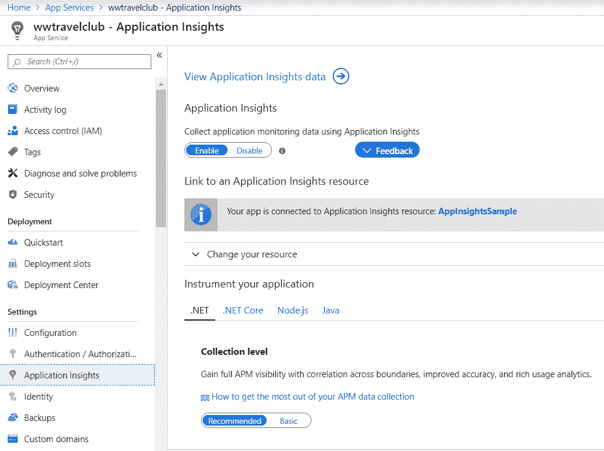

一旦连接到您的解决方案，数据收集将持续进行，您将在组件提供的仪表板中看到结果。您可以在配置 Application Insights 的同一位置找到此屏幕，在 Web 应用程序配置中，或者在 Azure 门户中，通过 Application Insights 资源进行导航：

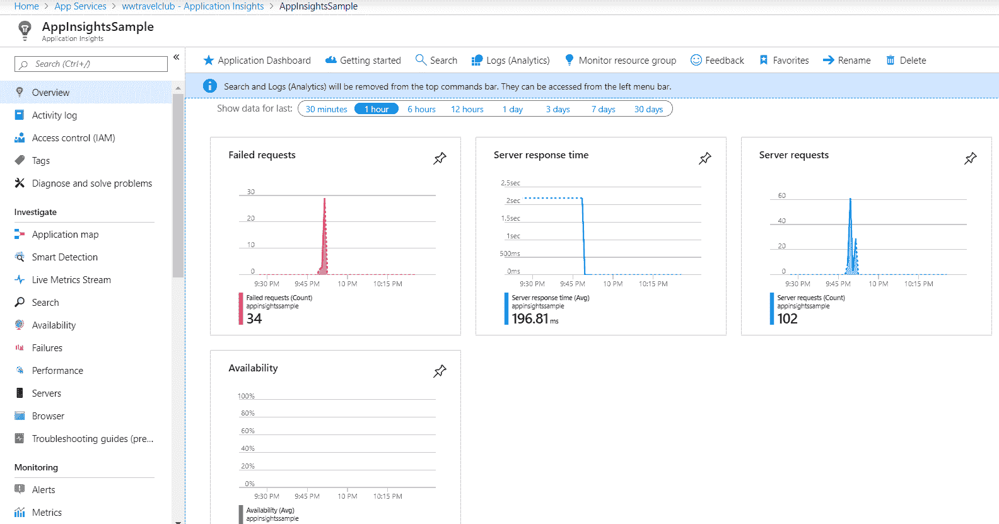

此仪表板为您提供了关于失败请求、服务器响应时间和服务器请求的概览。您还可以开启可用性检查，这将从 Azure 数据中心中的任何一个向您选择的 URL 发送请求。

但 Application Insights 的美丽之处在于它如何深入分析您的系统。例如，在下面的截图中，它正在向您反馈网站上完成的请求数量。您可以通过对处理时间较长或被调用频率较高的请求进行排名来分析它：

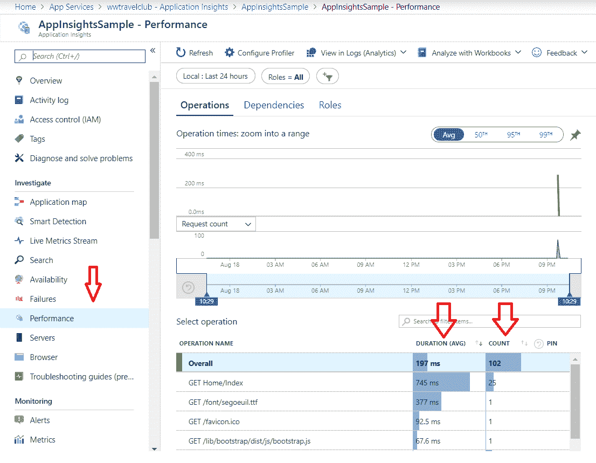

考虑到这个视图可以以不同的方式过滤，并且您在 Web 应用程序中接收到的信息是事件发生后立即的，这确实是一个定义持续反馈的工具。这是您可以使用 DevOps 原则实现客户确切需求的最佳方式之一。

Application Insights 是一个技术工具，它完全符合您作为软件架构师在真实分析模型中监控现代应用程序的需求。它是一种基于您正在开发的系统用户行为的持续反馈方法。

# 使用测试和反馈工具来启用反馈

在持续反馈的过程中，另一个非常有用的工具是微软设计的测试和反馈工具，旨在帮助产品所有者和质量保证用户在分析新功能的过程中。

使用 Azure DevOps，您可以通过在每个工作项内部选择一个选项来向您的团队请求反馈，正如您在以下截图中可以看到的：

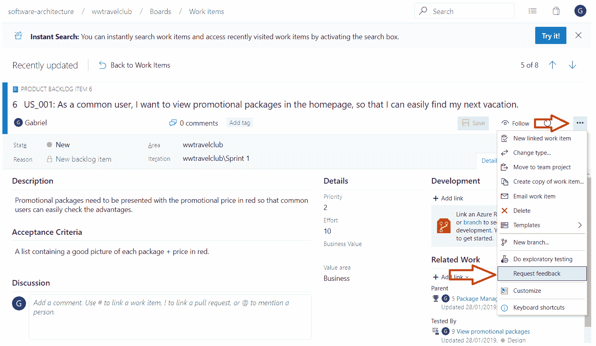

一旦收到反馈请求，您可以使用测试和反馈工具来分析和给出正确的反馈给团队。您可以将此工具连接到您的 Azure DevOps 项目，在分析反馈请求时获得更多功能。以下截图显示了如何为测试和反馈工具设置 Azure DevOps 项目 URL。您可以从[`marketplace.visualstudio.com/items?itemName=ms.vss-exploratorytesting-web`](https://marketplace.visualstudio.com/items?itemName=ms.vss-exploratorytesting-web)下载此工具。

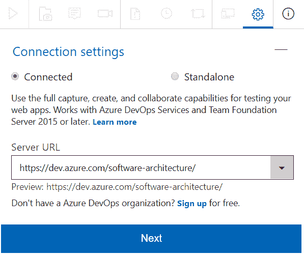

工具相当简单。您可以截图、记录一个过程，甚至做笔记。以下图片显示了您如何在截图内轻松地写消息：

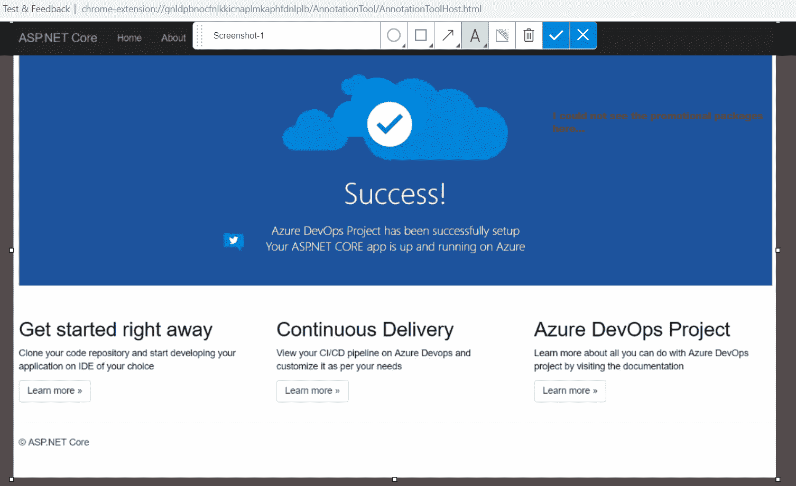

好处在于你可以在会话时间线上记录所有这些分析。正如您可以在下一张截图中所见，您可以在同一个会话中获得更多反馈，这对分析过程是有益的：

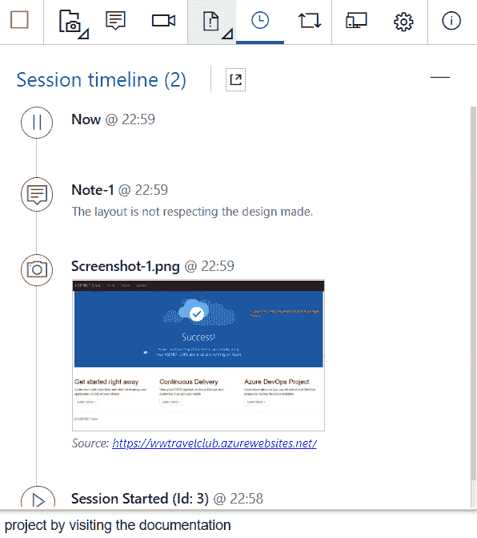

一旦您完成了分析并且连接到 Azure DevOps，您将能够报告 bug、创建任务，甚至开始一个新的测试用例：

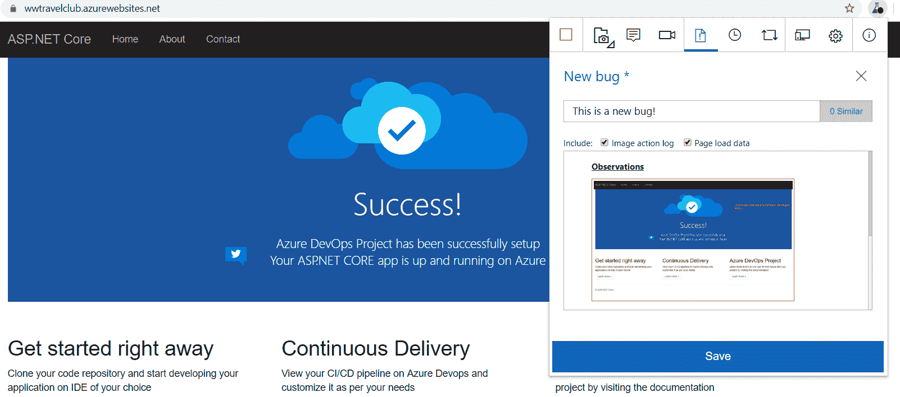

创建的 bug 的结果可以在 Azure DevOps 的工作项板上进行检查。值得一提的是，您不需要 Azure DevOps 的开发者许可证就可以访问这个环境区域。这使得您，作为一个软件架构师，可以将这个基本且非常有用的工具推广到您正在构建的解决方案的许多关键用户。

以下截图显示了您将工具连接到您的 Azure DevOps 项目后创建的 bug：

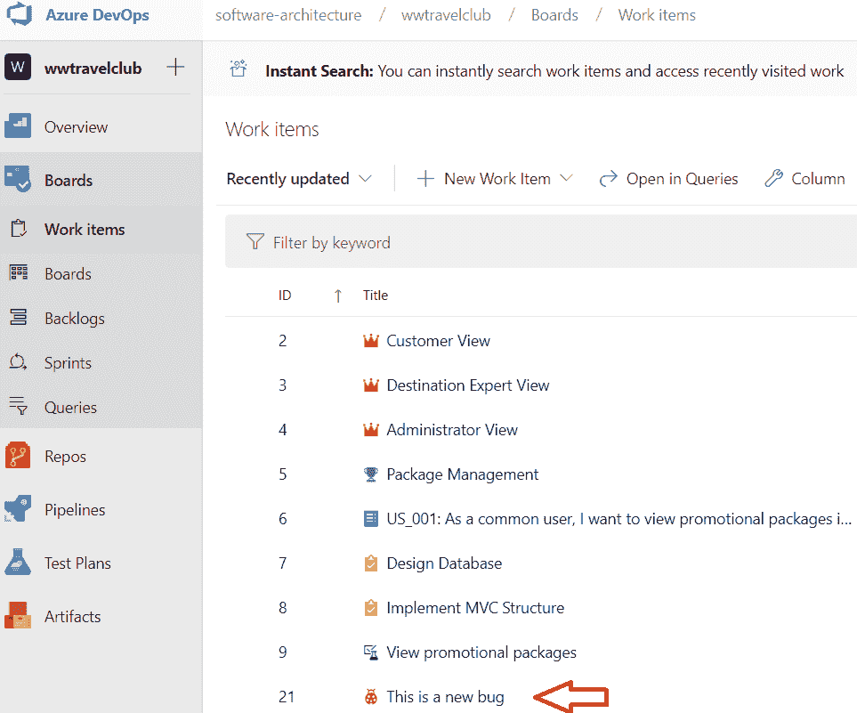

拥有这样一个工具以获得项目的好反馈无疑是重要的。但作为一个软件架构师，您可能需要找到最佳解决方案来加速这一过程。书中探讨的工具是这样做的好方法。您可能每次在开发过程中需要实施更多步骤时都会考虑这种方法。

# WWTravelClub 项目方法

在本章中，WWTravelClub 项目的截图展示了实现良好的 DevOps 周期所需的步骤。WWTravelClub 团队决定使用 Azure DevOps，因为他们明白这个工具对于整个周期的最佳 DevOps 体验是必不可少的。

需求是用用户故事编写的，这些可以在 Azure DevOps 的工作项部分找到。代码放在 Azure DevOps 项目的仓库中。这两个概念在第三章，*使用 Azure DevOps 记录需求*中进行了解释。

用于完成任务的管理生命周期是 Scrum，在第一章第一章，*理解软件架构的重要性*中介绍。这种方法将实现分为 Sprint，这迫使每个周期结束时交付价值。使用我们在本章中学到的持续集成设施，每次团队将开发成果提交到仓库的 master 分支时，代码都会被编译。

一旦代码编译并测试，部署的第一阶段就完成了。第一阶段通常被称为开发/测试，因为您为内部测试启用了它。Application Insights 和测试与反馈都可以用来获取新版本的第一反馈。

如果新版本的测试和反馈通过，那么就是时候进入第二阶段——质量保证。Application Insights 和测试与反馈可以再次使用，但现在是在一个更稳定的环境中。

循环以在生产阶段部署授权结束。这当然是一个艰难的决定，但 DevOps 表明您必须持续这样做，以便从客户那里获得更好的反馈。Application Insights 仍然是一个非常有用的工具，因为您能够监控新版本在生产中的演变，甚至将其与过去版本进行比较。

这里描述的 WWTravelClub 项目方法可以用于许多其他现代应用程序开发生命周期。作为软件架构师，您负责使这一切发生。工具已经准备就绪，这取决于您来确保一切顺利进行！

# 摘要

在本章中，我们学习了 DevOps 不仅是一系列技术和工具的组合，用于持续交付软件，而且是一种哲学，旨在使您正在开发的项目最终用户能够持续获得价值。

考虑到这种方法，我们看到了持续集成、持续交付和持续反馈对于 DevOps 目的的重要性。我们还看到了 Azure、Azure DevOps 和 Microsoft 工具如何帮助您实现目标。

本章通过使用 WWTravelClub 作为示例，向您介绍了这种方法，在 Azure DevOps 内部实现 CI/CD，并使用 Application Insights 和测试与反馈工具进行技术和功能反馈。在现实生活中，这些工具将使您能够更快地了解您正在开发的系统的当前行为，因为您将对其有持续的反馈。

在下一章中，我们将详细了解持续集成。

# 问题

1.  什么是 DevOps？

1.  什么是持续集成？

1.  什么是持续交付？

1.  什么是持续反馈？

1.  构建和发布管道之间的区别是什么？

1.  在 DevOps 方法中，Application Insights 的主要目的是什么？

1.  测试与反馈工具如何帮助 DevOps 的过程？

# 进一步阅读

这些是一些您可以找到本章涵盖主题更多信息的网站：

+   [`donovanbrown.com/`](http://donovanbrown.com/)

+   [`www.packtpub.com/networking-and-servers/devops-fundamentals-video`](https://www.packtpub.com/networking-and-servers/devops-fundamentals-video)

+   [`docs.microsoft.com/en-us/azure/devops/learn/what-is-devops`](https://docs.microsoft.com/en-us/azure/devops/learn/what-is-devops)

+   [`azuredevopslabs.com/labs/devopsserver/exploratorytesting/`](https://azuredevopslabs.com/labs/devopsserver/exploratorytesting/)

+   [`docs.microsoft.com/en-us/azure/azure-monitor/app/app-insights-overview`](https://docs.microsoft.com/en-us/azure/azure-monitor/app/app-insights-overview)

+   [Visual Studio Marketplace 上的 Exploratory Testing 扩展](https://marketplace.visualstudio.com/items?itemName=ms.vss-exploratorytesting-web)

+   [请求利益相关者反馈](https://docs.microsoft.com/en-us/azure/devops/test/request-stakeholder-feedback)
