# 第一章：创建 Unity 项目

在本章中，我们将学习如何使用 Unity Hub 安装 Unity 并创建一个项目，Unity Hub 是一个管理不同 Unity 安装和项目的工具，还能执行其他任务。Unity Hub 提供了对社区博客、论坛、资源和学习门户的便捷访问；它还管理您的许可证，并在管理不同安装和项目的同时，允许您在打开项目之前更改构建平台。

具体来说，在本章中，我们将探讨以下概念：

+   安装 Unity

+   创建项目

让我们先谈谈如何让 Unity 运行起来。

# 安装 Unity

我们将从简单但必要的第一步开始：安装 Unity。这似乎是一个直接的第一步，但我们可以讨论正确的安装方法。在本节中，我们将探讨以下概念：

+   Unity 的技术要求

+   Unity 版本控制

+   使用 Unity Hub 安装 Unity

首先，我们将讨论在计算机上运行 Unity 所必需的条件。

## Unity 的技术要求

要运行 Unity 2022，您的计算机需要满足以下操作系统要求：

+   如果您使用 Windows，则需要 Windows 7 Service Pack 1 或更高版本、Windows 10 或 Windows 11。Unity 只能在这些系统的 64 位版本上运行；除非您愿意使用 2017.x 之前的 Unity 版本，否则没有 32 位支持，但这超出了本书的范围。

+   对于 Mac，您需要 Big Sur 11.0 来运行编辑器的 Apple Silicon 版本。在其他任何情况下，您都可以从 High Sierra 10.13 或更高版本运行编辑器的 Intel 版本。

+   对于 Linux，您需要确切的 Ubuntu 20.04、18.04 或 CentOS 7。

关于 CPU，以下是要求：

+   您的 CPU 需要支持 64 位

+   您的 CPU 需要支持 SSE2（大多数 CPU 都支持）

+   对于搭载 Apple Silicon 的 Mac，需要 M1 或更高版本

最后，关于显卡，以下是受支持的型号：

+   在 Windows 上，我们需要一款支持 DirectX 10、11 或 12 的显卡（大多数现代 GPU 都支持）

+   在 Mac 上，任何支持 Metal 的 Intel 或 AMD GPU 都足够了

+   在 Linux 上，支持 OpenGL 3.2 或任何更高版本，或来自 Nvidia 和 AMD 的兼容 Vulkan 的显卡

现在我们知道了要求，让我们讨论 Unity 安装管理系统。

## Unity 版本控制

Unity 每年发布一个新的主要版本——在撰写本文时，为 2022.1，并在该年度会收到一个带有新功能的更新，在撰写本书时，计划为 2022.2。在年底或下一年初，会发布一个 **LTS**（**长期支持**）版本，对于本书的这一版，将是 2022.3，标志着当年版本引擎新功能的结束。之后，下一年的引擎版本将发布，周期重复。

LTS 版本的好处是它们计划每两周更新一次，持续两年，以修复新主要版本的 Unity 中的错误。这就是为什么大多数公司坚持使用引擎的 LTS 版本：因为其稳定性和长期支持。在这本书中，我们将使用 2022.1 来探索引擎的新功能，但在开发商业游戏标题时，请考虑坚持使用 LTS 版本。

考虑到这一点，你可能需要安装几个版本的 Unity，以防你使用不同版本的项目进行工作。你可能想知道为什么你不能为每个项目都使用 Unity 的最新版本，但这样做存在一些问题。

在 Unity 的新版本中，通常会有很多关于引擎工作方式的更改，因此你可能需要重新工作许多游戏的部分来升级它，包括第三方插件。升级整个项目可能需要很多时间，这可能会推迟发布日期。也许你需要更新中包含的特定功能来帮助你。在这种情况下，升级的成本可能是值得的。对于维护和更新多年的项目，开发者习惯于仅更新到编辑器的最新 LTS 版本，尽管这项政策可能因情况而异。

管理使用不同 Unity 版本制作的不同项目，以及安装和更新新的 Unity 版本，过去一直是一件非常麻烦的事情。因此，**Unity Hub** 被创建出来帮助我们解决这个问题，并且已经成为安装 Unity 的默认方式。尽管如此，安装 Unity 并非必须使用它，但为了简化操作，我们现在将使用它。让我们更深入地了解一下。

## 使用 Unity Hub 安装 Unity

Unity Hub 是我们在安装 Unity 之前安装的一个小软件。它集中管理你所有的 Unity 项目和安装。你可以从官方 Unity 网站获取它。下载步骤经常变化，但在撰写本书时，你需要执行以下操作：

1.  前往 [unity.com](http://unity.com)。

1.  点击如图所示的 **开始** 按钮：

图 1.1：Unity 网站上的“开始”按钮

1.  点击 **学生和爱好者** 选项卡；然后，在 **个人** 部分，点击如图所示的下方的 **开始** 按钮：

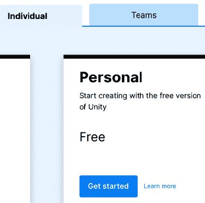

图 1.2：选择个人/免费许可证

1.  滚动到说 **1. 下载 Unity Hub** 的部分，并根据你的操作系统点击 **下载** 按钮。对于 Windows，点击 **为 Windows 下载**，对于 Mac，点击 **为 Mac 下载**。对于 Linux，有一个 **Linux 安装说明** 按钮，其中包含有关在该平台上安装的更多信息，但本书不会涵盖 Linux 上的 Unity：

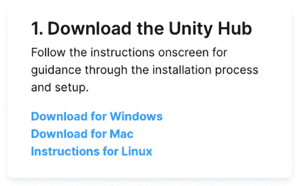

图 1.3：开始下载

1.  执行下载的安装程序。

1.  按照安装程序的指示操作，这通常意味着一路点击**下一步**直到结束。

现在我们已经安装了 Unity Hub，必须使用它来安装特定的 Unity 版本。你可以按照以下步骤操作：

1.  启动**Unity Hub**。

1.  如果提示安装 Unity 版本和/或创建许可证，请使用相应的**跳过**按钮（这可能会根据 Unity Hub 版本而有所不同）跳过这些步骤。这种方式安装 Unity 和许可证只适用于第一次运行 Unity Hub，但我们将学习第一次之后如何操作。

1.  通过点击窗口左上角的“人”图标并选择**登录**来登录您的账户：

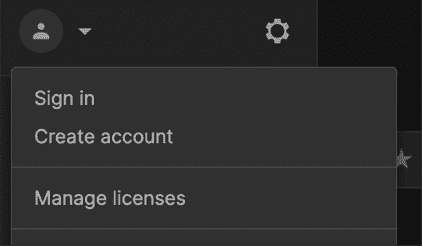

图 1.4：登录 Unity Hub

1.  在这里，如果你还没有创建 Unity 账户，也可以选择创建一个，如以下截图所示，点击登录提示中标记为**创建一个**的链接：

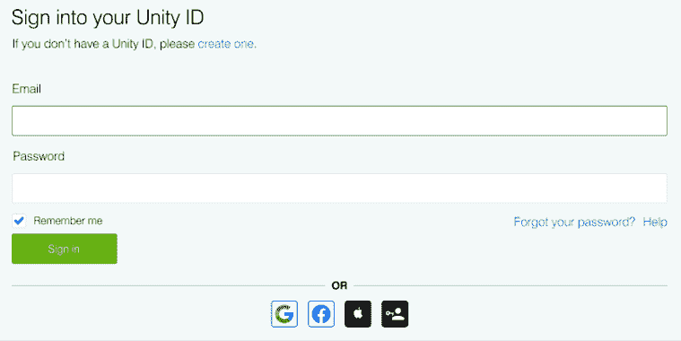

图 1.5：登录 Unity Hub

1.  按照安装程序的步骤操作，然后你应该会看到一个类似于下一张图片的屏幕。如果它不是相同的，请尝试点击屏幕左上角的**学习**按钮：

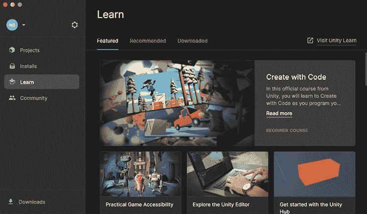

图 1.6：Unity Hub 窗口

1.  点击**安装**按钮，检查是否列出了**Unity 2022**。

1.  如果没有，请点击右上角的**安装编辑器**按钮。这将显示可以从这里安装的 Unity 版本列表：

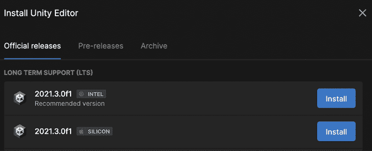

图 1.7：可安装的 Unity 版本

1.  你会看到这里有三个标签页。**官方发布版**包含已发布的每个主要版本的最新版本。**预发布版**包含 Unity 的 alpha 和 beta 版本，因此你可以参与这些项目并在它们正式发布之前测试新功能。**存档**包含指向**Unity 下载存档**的链接，其中包含发布的每个 Unity 版本。例如，撰写本书时的官方版本是 2022.1.20，但项目正在开发 2022.1.14，因此你可以从存档中安装正确的版本。

1.  在**官方发布版**标签页中找到 Unity 2022.1。

1.  点击 Unity 2022.1.XXf1 右侧的**安装**按钮，其中 XX 将根据最新可用版本而变化。在撰写本书时，我们使用的是 2022.1.14f1。你可能需要向下滚动以找到这个版本。如果不存在，请安装可用的最新 2022 版本（例如，2022.2.XX 或 2022.3.XX）。如果发现书中图像与书中内容差异太大，请考虑在存档中查找 Unity 2022.1.14。

1.  将会弹出一个模块选择窗口。请确保勾选了**Visual Studio**功能。虽然这个程序在 Unity 中工作不是必需的，但本书后面我们会用到它。如果你已经安装了 C# IDE，可以自由跳过这一步。

1.  现在，点击**继续**按钮：

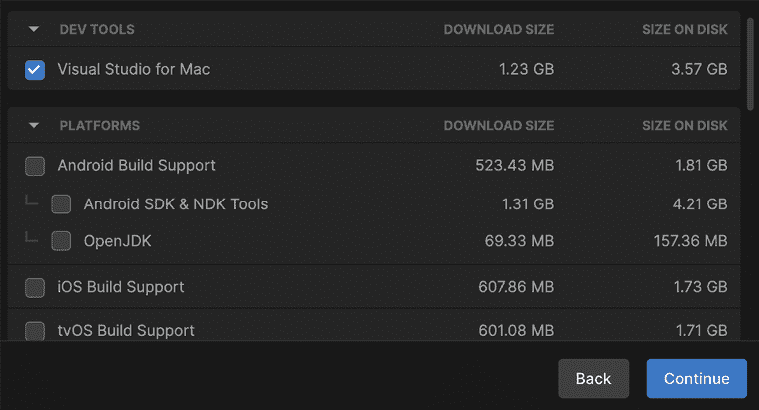

图 1.8：选择 Visual Studio

1.  接受 Visual Studio 的条款和条件，然后点击**安装**：

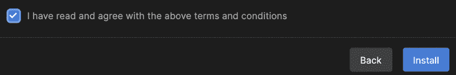

图 1.9：接受 Visual Studio 的条款和条件

需要注意的是，Visual Studio 是我们将在**第五章**，“使用 C#和可视化脚本介绍脚本”，中使用的程序来创建我们的代码。目前我们不需要其他 Unity 功能，但如果你需要，稍后可以回来安装它们。

1.  你将看到所选的 Unity 版本正在下载和安装。等待这个过程完成。如果你看不到它，点击**下载**按钮重新打开它：

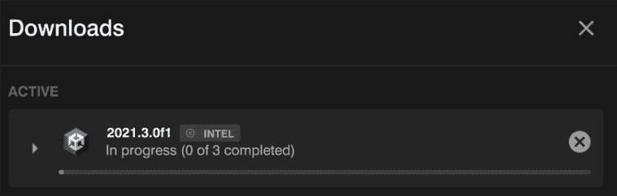

图 1.10：当前活跃的 Unity Hub 下载

1.  如果你决定安装 Visual Studio，Unity 安装完成后，Visual Studio 安装程序将自动执行。它将下载一个安装程序，该安装程序将下载并安装 Visual Studio Community：

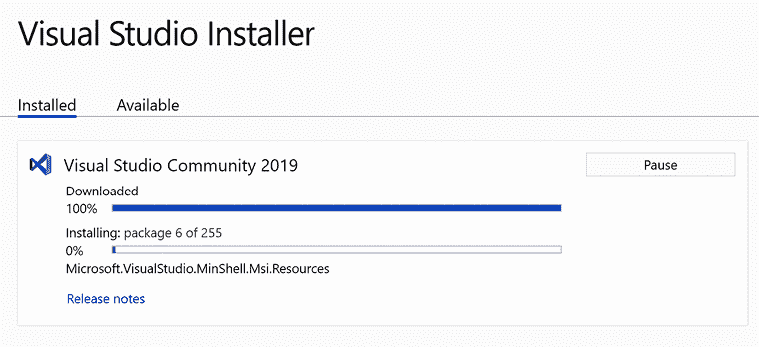

图 1.11：安装 Visual Studio

1.  为了确认一切正常，你必须看到所选的 Unity 版本在 Unity Hub 的**安装**列表中：

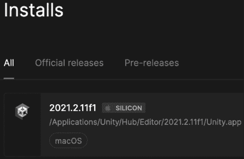

图 1.12：可用的 Unity 版本

现在，在使用 Unity 之前，我们需要通过以下步骤获取和安装免费许可证，使其工作：

1.  在 Unity Hub 右上角点击**管理许可证**按钮。如果你看不到它，点击左上角的账户图标，然后在那里点击**管理许可证**：

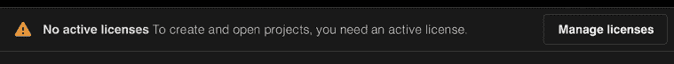

图 1.13：获取免费许可证需要按下的**管理许可证**按钮

1.  在**许可证**列表窗口中点击**添加**按钮：

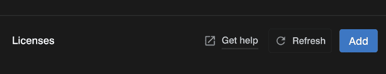

图 1.14：许可证列表窗口的**添加**按钮

1.  点击**获取免费个人许可证**按钮：

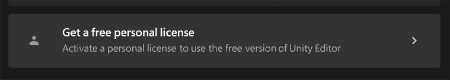

图 1.15：获取免费个人许可证的选项

1.  如果你同意，请点击**同意并获取个人版许可证**按钮阅读并接受条款和条件：

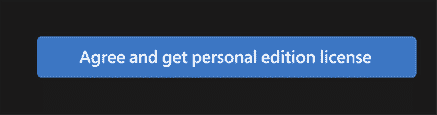

图 1.16：接受条款和条件的按钮

记住，前面的步骤在新版本的 Unity Hub 中可能会有所不同，所以只需尽量遵循 Unity 设计的流程——大多数情况下，它是直观的。

现在是时候使用 Unity 创建一个项目了。

# 创建项目

现在我们已经安装了 Unity，我们可以开始创建我们的游戏。为此，我们首先需要创建一个项目，这基本上是一个包含你的游戏将包含的所有文件的文件夹。这些文件被称为**资产**，它们有不同的类型，例如图像、音频、3D 模型、脚本文件等等。在本节中，我们将了解如何管理项目，讨论以下概念：

+   创建项目

+   项目结构

让我们先学习如何创建一个空白项目以开始开发我们的项目。

## 创建项目

与 Unity 安装一样，我们将使用 Unity Hub 来管理项目。我们需要遵循以下步骤来创建一个：

1.  打开 Unity Hub 并点击**项目**按钮，然后点击**新建项目**：

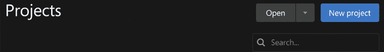

图 1.17：在 Unity Hub 中创建新项目

1.  选择**3D (URP)**模板，因为我们将会创建一个使用简单图形的 3D 游戏，并准备在 Unity 能够运行的任何设备上运行，所以**通用渲染管线**（或**URP**）是更好的选择。在*第十章*，*使用 URP 和 Shader Graph 的材质和效果*，我们将详细讨论为什么。

1.  如果你看到一个**下载模板**按钮，请点击它；如果没有，这意味着你已经有这个模板了：

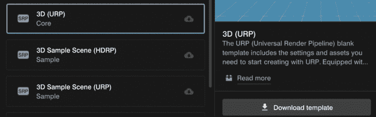

图 1.18：下载 3D URP 模板

1.  选择一个**项目名称**和一个**位置**，然后点击**创建项目**：

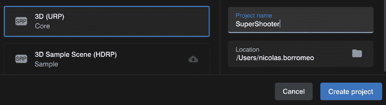

图 1.19：选择通用渲染管线模板

1.  Unity 将创建并自动打开项目。这可能需要一些时间，但之后你将看到一个类似于以下图像的窗口。你可能看到的是深色主题的编辑器，但为了更好的清晰度，我们将全书使用浅色主题。你可以自由地保持深色主题：

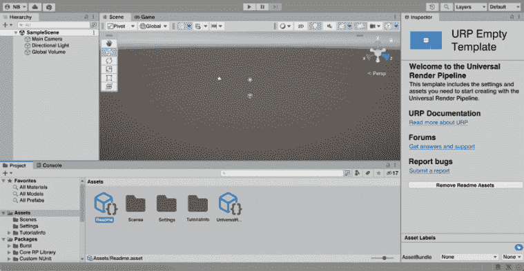

图 1.20：Unity 编辑器窗口

1.  关闭窗口，然后返回 Unity Hub 并从列表中选择项目以再次打开它：

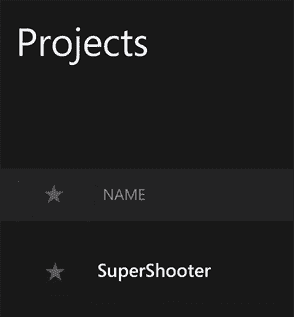

图 1.21：重新打开项目

现在我们已经创建了项目，让我们来探索它的结构。

## 项目结构

我们刚刚打开了 Unity，但直到下一章我们才不会开始使用它。现在，是时候看看项目文件夹结构是如何组成的了。为了做到这一点，我们需要打开我们创建项目的文件夹。如果你不记得在哪里，你可以这样做：

1.  右键点击位于编辑器底部**项目**面板中的**Assets**文件夹。

1.  点击**在资源管理器中显示**选项（如果你使用的是 Mac，该选项称为**在 Finder 中显示**）。以下截图说明了这一点：

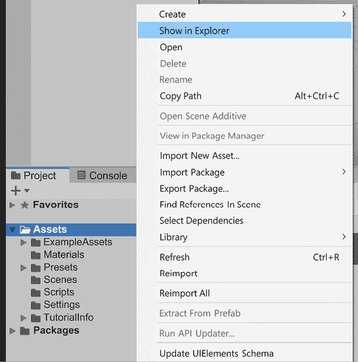

图 1.22：在资源管理器中打开项目文件夹

1.  然后，你将看到一个类似于以下文件夹结构（某些文件或文件夹可能有所不同）：

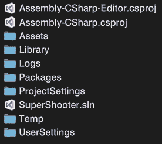

图 1.23：Unity 项目文件夹结构

如果你想要将这个项目移动到另一台 PC 或者发送给同事，你只需将这些文件压缩成一个 ZIP 文件并发送给他们，但并不是所有文件夹在所有时候都是必要的。重要的文件夹是**Assets**、**Packages**和**ProjectSettings**。**Assets**将保存我们为游戏创建和使用的所有文件，所以这是必须的。我们还将配置不同的 Unity 系统以调整引擎以适应我们的游戏；所有与此相关的设置都在**ProjectSettings**和**UserSettings**文件夹中。最后，我们将安装不同的 Unity 模块或包以扩展其功能，所以**Packages**文件夹将保存我们正在使用的那些。

如果你需要将项目移动到其他地方或添加到任何版本控制系统，没有必要复制其余的文件夹，但至少让我们讨论一下**Library**文件夹是什么，特别是考虑到它通常非常大。Unity 需要将我们将要使用的文件转换为它自己的格式以便操作，例如音频和图形。Unity 支持**MPEG Audio Layer 3**（**MP3**）、**Waveform Audio File Format**（**WAV**）、**Portable Network Graphics**（**PNG**）和**Joint Photographic Experts Group**（**JPG**）文件（等等），但在使用它们之前，它们需要被转换为 Unity 的内部格式，这个过程称为**导入资源**。那些转换后的文件将位于**Library**文件夹中。如果你没有复制那个文件夹，Unity 将简单地从**Assets**文件夹中取原始文件并完全重新创建**Library**文件夹。这个过程可能需要时间，项目越大，所需时间越长。

请记住，当你正在处理项目时，你希望保留 Unity 创建的所有文件夹，所以在处理项目时不要删除任何文件夹，但如果需要移动整个项目，你现在知道你需要带哪些东西了。

# 摘要

在本章中，我们回顾了 Unity 版本控制系统的工作方式。我们还看到了如何使用 Unity Hub 安装和管理不同的 Unity 版本。最后，我们使用相同的工具创建了多个项目。我们将大量使用 Unity Hub，所以了解如何最初使用它很重要。现在，我们已经准备好深入 Unity 编辑器了。

在下一章中，我们将开始学习基本的 Unity 工具来创建我们的第一个级别原型。

# 加入我们的 Discord 频道！

与其他用户、Unity 游戏开发专家和作者本人一起阅读这本书。

提出问题，为其他读者提供解决方案，通过“问我任何问题”的环节与作者聊天，等等。

扫描二维码或访问链接加入社区。

`packt.link/handsonunity22`
