# 第二章：编辑场景和游戏对象

在本章中，我们将学习一些 Unity 的基础知识，以便编辑项目，并学习如何使用几个 Unity 编辑器窗口来操作我们的第一个场景及其对象。我们还将了解一个对象，或称为 GameObject，是如何创建和组成的，以及如何使用层级和预制件来管理包含多个对象的复杂场景。最后，我们将回顾如何正确保存所有工作以便稍后继续工作。

具体来说，在本章中，我们将探讨以下概念：

+   操作场景

+   GameObjects 和组件

+   对象层级

+   预制件

+   保存场景和项目

# 操作场景

**场景**是我们项目中几种类型的文件（也称为**资产**）之一。根据项目的类型，“场景”可以用于不同的目的，但最常见的情况是将游戏分成整个部分，最常见的是以下几种：

+   主菜单

+   第 1 级，第 2 级，第 3 级等。

+   胜利画面和失败画面

+   启动画面和加载画面

在本节中，我们将介绍与场景相关的以下概念：

+   场景的目的

+   场景视图

+   将我们的第一个 GameObject 添加到场景中

+   导航场景视图

+   操作游戏对象

那么，让我们逐一看看这些概念。

## 场景的目的

将游戏分成场景的想法是为了让 Unity 只处理和加载场景所需的数据。假设你处于主菜单；在这种情况下，你将只有主菜单需要的纹理、音乐和对象被加载到**随机存取存储器**（**RAM**），即设备的主要内存。在这种情况下，如果你的游戏不需要加载第 10 关的 Boss，就没有必要加载它。这就是为什么存在加载画面，只是为了填补在卸载一个场景所需的资产和加载另一个场景所需的资产之间的时间。也许你认为像*侠盗猎车手*这样的开放世界游戏在你四处游荡时没有加载画面，但实际上，当你移动时，它们在后台加载和卸载世界的一部分，这些部分是设计成可以相互连接的不同场景。

主菜单和普通关卡场景之间的区别在于它们所拥有的对象（在 Unity 术语中也称为**GameObject**）。在菜单中，你会找到背景、音乐、按钮和标志等对象，而在关卡中，你将拥有玩家、敌人、平台、生命值箱等等。因此，场景的意义取决于其中放置了哪些 GameObject。但我们如何创建一个场景呢？让我们从场景视图开始。

## 场景视图

当你打开 Unity 项目时，你会看到 Unity 编辑器。它将由几个窗口或**面板**组成，每个面板都帮助你改变游戏的不同方面。在本章中，我们将查看帮助你创建场景的窗口。以下截图展示了 Unity 编辑器：

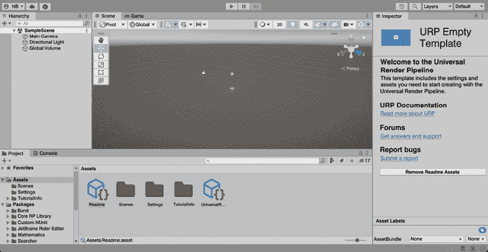

图 2.1：Unity 编辑器

如果你之前编程过任何类型的应用程序，你可能已经习惯了有一个起始函数，比如**Main**，在那里你开始编写代码来创建应用程序所需的几个对象。如果我们谈论游戏，你可能在那里创建场景中的所有对象。这种方法的缺点是，为了确保所有对象都正确创建，你需要运行程序来查看结果，如果某个对象放置不当，你需要手动更改对象的坐标，这是一个缓慢且痛苦的过程。幸运的是，在 Unity 中，我们有场景视图，以下截图展示了其示例：

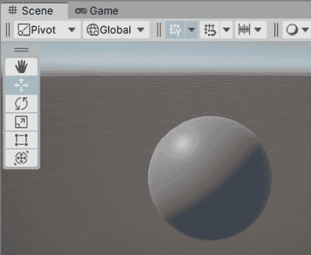

图 2.2：场景视图

这个窗口是经典**所见即所得 (WYSIWYG)**概念的实现。在这里，你可以创建对象并将它们放置在场景的各个位置，所有这些操作都通过场景预览来完成，你可以看到当你点击**播放**时场景将如何呈现。但在学习如何使用这个场景之前，我们需要在场景中有一个对象，所以让我们创建我们的第一个对象。

## 将我们的第一个 GameObject 添加到场景中

在创建项目时我们选择的模板项目附带了一个空白场景，可以开始工作，但让我们创建一个自己的空场景来看看如何自己完成。为此，你可以简单地使用**文件** | **新建场景**菜单来创建一个空的新场景，如下截图所示：

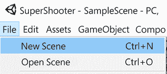

图 2.3：创建新场景

点击**新建场景**后，你会看到一个窗口来选择场景模板；在这里，选择**基本（URP）**模板。模板定义了新场景将包含哪些对象，在这种情况下，我们的模板将附带一个基本光源和一个相机，这对我们想要创建的场景将很有用。一旦选择，只需点击**创建**按钮：

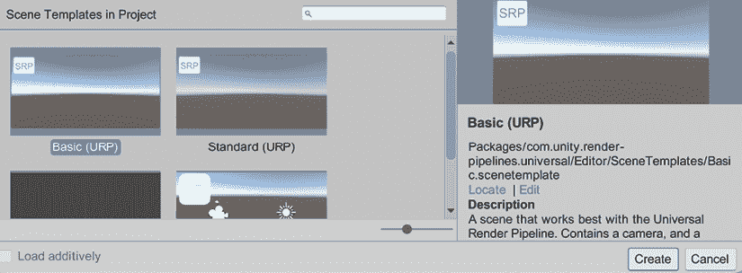

图 2.4：选择场景模板

现在我们有了空场景，让我们向其中添加 GameObject。我们将在整本书中学习创建 GameObject 的几种方法，但就现在而言，让我们开始使用 Unity 为我们提供的几个基本模板。为了创建它们，我们需要打开 Unity 窗口顶部的**GameObject**菜单，它将显示几个模板类别，如**3D 对象**、**2D 对象**、**效果**等，如下截图所示：

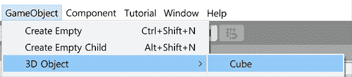

图 2.5：创建一个立方体

在**3D 对象**类别下，我们将看到几个 3D 基本形状，如**立方体**、**球体**、**圆柱体**等，虽然使用它们不如使用漂亮的下载 3D 模型那么令人兴奋，但请记住，我们目前只是在原型化我们的关卡。这被称为**灰盒测试**，意味着我们将使用大量的原型基本形状来建模我们的关卡，以便我们可以快速测试它，看看我们的想法是否足够好，可以开始将其转换为最终版本的工作。

我建议您选择**立方体**对象开始，因为它是一个多功能的形状，可以代表许多对象。所以，现在我们有一个可以编辑的场景对象，我们需要学习使用场景视图在场景中导航的第一件事。

## 在场景视图中导航

为了操作场景，我们需要学习如何在其中移动以从不同角度查看结果。有几种导航场景的方法，所以让我们从最常见的一种开始，即第一人称视角。这种视角允许您使用类似第一人称射击游戏的导航方式在场景中移动，使用鼠标和*WASD*键。要这样导航，您需要按下并保持鼠标右键，在此过程中，您可以：

+   将鼠标移动到当前相机位置周围旋转相机

+   按下*WASD*键来移动相机位置，始终保持右键点击

+   您也可以按*Shift*键来加快移动速度

+   按下*Q*和*E*键来上下移动

另一种常见的移动方式是点击一个对象来选择它（选中的对象将有一个橙色的轮廓），然后按下*F*键来聚焦于它，使场景视图相机立即移动到一个可以更仔细观察该对象的位置。之后，我们可以在 Windows 上按下并保持左*Alt*键，或在 Mac 上按下*Option*键，同时与左鼠标点击一起，最终开始移动鼠标并“环绕”对象。这将允许您从不同的角度查看聚焦的对象，以检查它的每个部分是否都正确放置，如下面的截图所示：

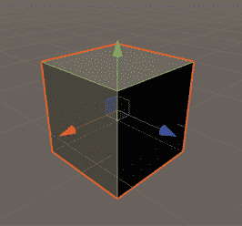

图 2.6：选择对象

现在我们可以在场景中自由移动，我们可以开始使用场景视图来操作游戏对象。

## 操作游戏对象

**场景**视图的另一个用途是操纵对象的位置。为了做到这一点，我们首先需要选择一个对象，然后按下场景视图左上角的**变换**工具。一旦选择了对象，您也可以按键盘上的*Y*键来完成同样的操作：

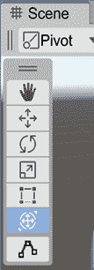

图 2.7：变换工具

这将显示所选对象上所谓的**变换**辅助工具。**辅助工具**是叠加在所选对象之上的视觉工具，用于修改其不同方面。在**变换辅助工具**的情况下，它允许我们改变对象的位置、旋转和缩放，如图 2.8 所示。如果你没有看到球体外的立方形箭头，不要担心——我们很快就会启用它们：

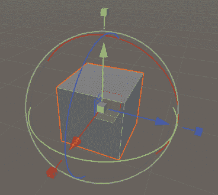

图 2.8：变换辅助工具

让我们开始翻译对象，这是通过在辅助工具的球体内拖动红色、绿色和蓝色箭头来完成的。当你这样做的时候，对象将沿着所选轴移动。这里一个值得探索的有趣概念是这些箭头颜色的含义。如果你注意观察场景视图右上角，你会看到一个轴辅助工具，它作为这些颜色含义的提醒，如下面的截图所示：

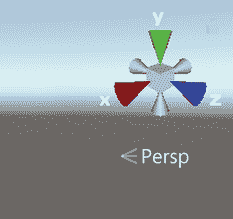

图 2.9：轴辅助工具

计算机图形学使用经典的 3D**笛卡尔坐标系**来表示对象的定位。红色与对象的*x*轴相关联，绿色与*y*轴相关联，蓝色与*z*轴相关联。

但每个轴代表什么意思呢？如果你习惯了另一个 3D 创作程序，这可能会不同，但在 Unity 中，*z*轴代表**前向向量**，这意味着箭头指向对象的正面；*x*轴是**右向量**，而*y*轴代表**向上向量**。

这些方向被称为**局部**坐标，这是因为每个对象都可以以不同的方式旋转，这意味着每个对象可以根据其方向将其前向、向上和向右的向量指向其他地方。当在章节的“对象层次结构”部分后面使用时，局部坐标将更有意义，所以请耐心等待，但现在讨论**全局**坐标是值得的。想法是有一个单一的起点（零点）和一组共同的向前、向右和向上轴，这些轴在场景中是通用的。这样，当我们说对象的全局位置为`5`,`0`,`0`时，我们知道我们指的是从全局零位置沿全局*x*轴延伸 5 米的坐标。全局轴就是你在前面提到的右上角轴辅助工具中看到的那一组。

为了确保我们正在使用局部坐标，即我们将沿着对象的局部轴移动对象，请确保在场景视图中激活了**局部**模式，如下面的截图所示：

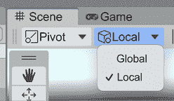

图 2.10：切换轴心点和局部坐标

如果正确的按钮显示的是**全局**而不是**本地**，只需点击它，然后从下拉选项中选择**本地**。顺便说一句，尽量保持左侧按钮为**枢轴**。如果它显示为**中心**，点击并选择**枢轴**。物体的枢轴不一定是它的中心，这完全取决于我们使用的 3D 模型，其作者将指定物体旋转中心的位置。例如，一辆车可能其枢轴位于后轮中间，因此当我们旋转时，它将尊重真实汽车的旋转中心。基于物体的枢轴进行编辑将简化我们理解如何在*第六章*，*实现移动和生成*中通过 C#脚本旋转的方式。现在，既然我们已经启用了**本地**坐标，你应该能看到*图 2.8*中看到的立方形箭头；我们稍后将会使用它们来缩放立方体。

我知道——我们正在编辑一个立方体，所以没有明显的正面或右侧，但当你与真实的 3D 模型如汽车和角色一起工作时，它们肯定会有那些面，并且它们必须与那些轴正确对齐。如果将来你将一辆汽车导入 Unity，并且汽车的前端指向*x*轴，你需要将模型沿*z*轴对齐，因为我们将要创建的用于移动对象的代码将依赖于这个约定（但让我们稍后再说）。

现在，让我们使用这个**变换**辅助工具来通过围绕它的三个彩色圆圈旋转物体。例如，如果你点击并拖动红色圆圈，你将沿着*x*轴旋转物体。如果你想水平旋转物体，根据我们之前讨论的颜色编码，你可能会选择*x*轴——用于水平移动的那个轴——但遗憾的是，这是错误的。看待旋转的一个好方法是像摩托车油门一样：你需要拿起它并转动它。如果你这样旋转*x*轴，你将使物体上下旋转。所以，为了水平旋转，你需要使用绿色圆圈或*y*轴。这个过程在下图中得到了说明：

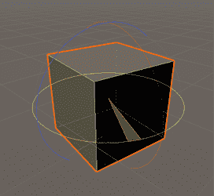

图 2.11：旋转物体

最后，我们有缩放，我们有两种方法可以实现这一点，其中一种是通过*图 2.8*中显示的**变换**辅助工具中心的灰色立方体。这允许我们通过点击并拖动该立方体来改变物体的大小。现在，由于我们想要原型化一个简单的关卡，有时我们想要拉伸立方体来创建，例如，一列柱子或一个平坦的地板，这就是第二种方法发挥作用的地方。

如果你点击并拖动位于平移箭头前面的彩色立方体，而不是中心的那灰色立方体，你会看到我们的立方体是如何沿着这些轴拉伸的，这允许你改变物体的形状。如果你没有看到那些立方形箭头，请记住按照本节前面所述启用**本地**坐标。

拉伸的过程在下一张屏幕截图中进行说明：

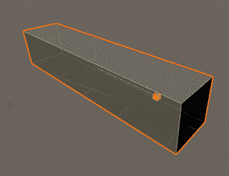

图 2.12：缩放对象

记住，如果你想要，你也可以使用中间的灰色立方体同时缩放所有轴，这被称为**均匀缩放**，与我们在**变换**gizmo 中遇到的相同的灰色立方体。

最后，在这里需要考虑的是，由于它们最初的设计方式，几个对象可以有相同的缩放值，但大小不同。**缩放**是我们可以应用于对象原始大小的乘数，因此一个建筑和一个汽车都具有缩放 1 是完全有意义的；一个相对于另一个的相对大小看起来是正确的。这里的主要启示是，缩放不是大小，而是一种乘以它的方式。

考虑到在许多情况下缩放对象通常是一种不良做法。在你的场景最终版本中，你将使用适当大小和比例的模型，并且它们将以模块化的方式设计，以便你可以将它们一个接一个地插入。如果你对它们进行缩放，可能会发生一些不好的事情，比如纹理被拉伸并变得像素化，以及不再能够正确插入的模块。这个规则有一些例外，比如在森林中放置大量相同树木的实例，并稍微改变其比例以模拟变化。此外，在灰色盒子的案例中，将立方体进行缩放以创建地板、墙壁、天花板、柱子等是完全可行的，因为最终，那些立方体将被真实的 3D 模型所取代。

这里有一个挑战！创建一个由地板、三面普通墙壁和一面有门洞的第四面墙壁（三个立方体）组成的房间，不需要屋顶。在下一张图片中，你可以看到它应该看起来是什么样子：

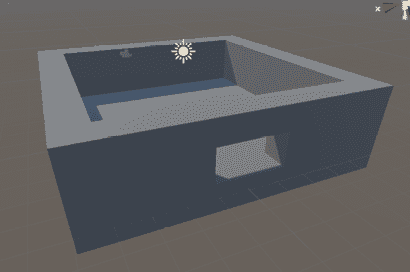

图 2.13：房间任务完成

现在我们能够编辑对象的位置了，让我们看看我们如何编辑它的其他所有方面。

# GameObjects 和 components

我们讨论了我们的项目由**资产**（项目的文件）组成，以及一个场景（它是一种特定的资产）由 GameObject 组成；那么，我们如何创建一个对象呢？通过**组件**的组合。

在本节中，我们将介绍与组件相关的以下概念：

+   理解组件

+   操作组件

让我们先来讨论一下什么是组件。

## 理解组件

**组件**是构成 GameObject 的几个部分之一；每个组件负责对象的不同功能。Unity 已经包含了一些解决不同任务的组件，例如播放声音、渲染网格、应用物理等；然而，尽管 Unity 有大量的组件，我们最终迟早需要创建自定义组件。

在下一张图片中，你可以看到当我们选择 GameObject 时 Unity 向我们展示的内容：

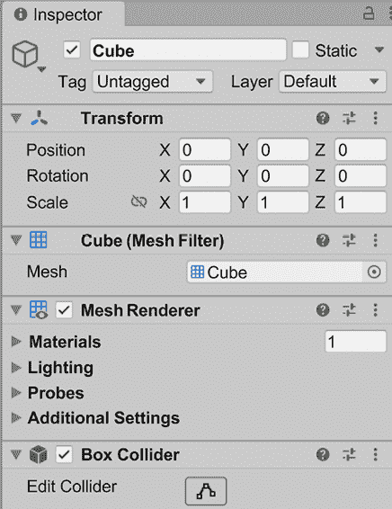

图 2.14：检查器面板

在前面的屏幕截图中，我们可以看到**检查器**面板。如果我们现在需要猜测它做什么，我们可以说它显示了通过层次结构或场景视图选择的对象的所有属性，并允许我们配置这些选项以更改对象的行为（例如，位置和旋转，是否投射阴影等）。这是真的，但我们遗漏了一个关键元素：这些属性不属于对象；它们属于对象的组件。我们可以在一组属性之前看到一些加粗的标题，例如**变换**和**盒子碰撞器**等。这些都是对象的组件。

在这种情况下，我们的对象有一个**变换**、一个**网格过滤器**、一个**网格渲染器**和一个**盒子碰撞器**组件，因此让我们回顾一下这些组件。

**变换**仅包含对象的位置、旋转和缩放，它本身并不做任何事情——它只是游戏中的一个点——但当我们向对象添加组件时，这个位置开始具有更多的意义。这是因为一些组件将与**变换**和其他组件交互，每个组件都会影响另一个组件。

这方面的一个例子是**网格过滤器**和**网格渲染器**，这两个组件都负责渲染 3D 模型。**网格渲染器**将渲染由**网格过滤器**指定的 3D 模型，也称为网格，在**变换**组件指定的位置进行渲染，因此**网格渲染器**需要从其他组件获取数据，没有它们无法工作。

另一个例子是**盒子碰撞器**。这表示对象的物理形状，因此当物理计算对象之间的碰撞时，它会检查该形状是否根据**变换**组件指定的位置与其他形状发生碰撞。

我们将在本书的后面部分探讨渲染和物理，但本节的要点是 GameObject 是一个组件的集合，每个组件都为我们的对象添加特定的行为，并且每个组件都与其他组件交互以完成所需的任务。为了进一步强化这一点，让我们看看如何将一个立方体转换为在物理作用下会下落的球体。

## 操作组件

编辑对象组件的工具是**检查器**。它不仅允许我们更改组件的属性，还让我们可以添加和删除组件。在这种情况下，我们想要将一个立方体转换为球体，因此我们需要更改这些组件的几个方面。

我们可以先从更改对象的视觉形状开始，因此我们需要更改渲染的模型或**网格**。指定要渲染的网格的组件是**网格过滤器**组件。如果我们查看它，我们可以看到一个名为**网格**的属性，它说**立方体**，在其右侧有一个小圆圈和一个小点：

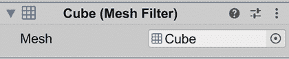

图 2.15：网格过滤器组件

如果你没有看到特定的属性，例如我们刚才提到的**网格**，尝试点击组件名称左侧的三角形。这样做将会展开和折叠所有组件的属性。

如果我们点击带有圆圈和点的按钮，即**网格**属性右侧的按钮，将弹出**选择网格**窗口，允许我们选择几个**网格**选项。在这种情况下，选择**球体**网格。将来，我们将向我们的项目添加更多 3D 模型，这样窗口将会有更多选项。

网格选择器在以下屏幕截图中显示：

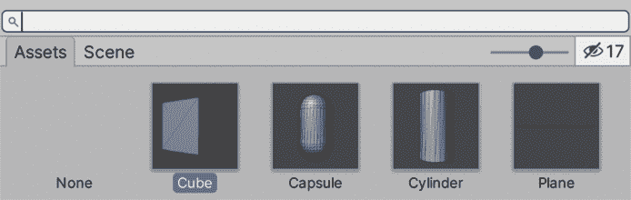

图 2.16：网格选择器

好的——现在对象看起来像一个球体，但它会像球体一样表现吗？让我们来找出答案。为了做到这一点，我们可以在我们的球体上添加一个名为**刚体**的组件，这将给它添加物理属性。我们将在第七章*物理碰撞和健康系统*中更详细地讨论刚体和物理，但现在让我们专注于基础知识。

为了做到这一点，我们需要点击检查器底部的**添加组件**按钮。它将显示一个**组件选择器**窗口，其中包含许多类别；在这种情况下，我们需要点击**物理**类别。窗口将显示所有**物理**组件，在那里我们可以找到**刚体**。另一个选项是在窗口顶部的搜索框中输入`刚体`。以下屏幕截图说明了如何添加组件：

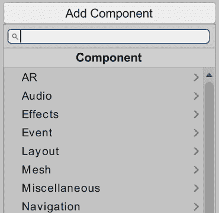

图 2.17：添加组件

如果你点击编辑器顶部中间的**播放**按钮，你可以使用**游戏**面板测试你的球体物理。当你点击**播放**时，该面板将自动聚焦，并显示玩家将如何看到游戏。回放控制如图所示：

图 2.18：回放控制

在这里，你可以只用**变换**工具来旋转和定位你的相机，使其朝向我们的球体。这很重要，因为可能会出现的一个问题是，在**播放**模式下可能什么也看不到，这可能是因为游戏相机没有指向我们的球体所在的位置。当你移动时，你可以检查场景窗口右下角的小预览来查看新的相机视角。另一个选择是选择**层次结构**中的相机，并使用快捷键*Ctrl* + *Shift* + *F*（或在 Mac 上为*Command* + *Shift* + *F*）。相机预览在以下屏幕截图中显示：

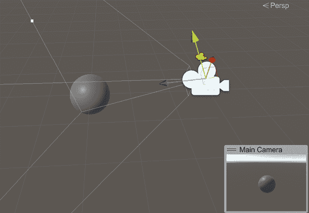

图 2.19：相机预览

现在，为了测试物理碰撞是否执行正确，让我们创建一个立方体，将其缩放成斜坡的形状，并将这个斜坡放在我们的球体下方，如图所示：

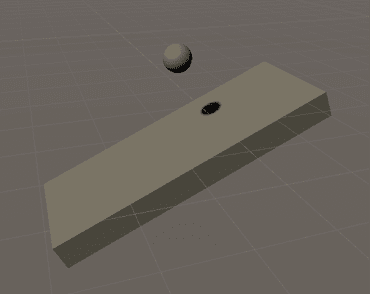

图 2.20：球体和斜坡对象

如果你现在点击**播放**，你会看到球体与我们的斜坡发生碰撞，但方式很奇怪。它看起来像是在弹跳，但实际上并不是这样。如果你展开球体的**盒子碰撞器**组件，你会看到即使我们的对象看起来像一个球体，绿色的盒子辅助工具显示我们的球体在物理世界中实际上是一个盒子，如下面的截图所示：

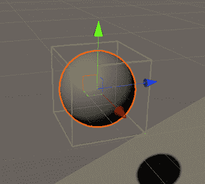

图 2.21：具有球体图形和盒子碰撞器的对象

现在，显卡（GPU）可以处理渲染高度详细的三维模型（具有高多边形计数的模型），但物理系统是在**中央处理器**（**CPU**）中执行的，并且它需要进行复杂的计算以检测碰撞。为了在我们的游戏中获得良好的性能，它至少需要以每秒 30**帧**（**FPS**）的速度运行，这是行业接受的最低标准，以提供流畅的体验。物理系统考虑到了这一点，因此它使用简化的碰撞形状，这些形状可能与玩家在屏幕上看到的实际形状不同。

正因如此，我们才将**网格过滤器**和不同类型的**碰撞器**组件分开——一个处理视觉形状，另一个处理物理形状。

再次，本节的想法不是深入研究那些 Unity 系统，所以我们现在就继续前进。我们如何解决我们的球体实际上是一个盒子的问题？简单：通过修改我们的组件！在这种情况下，已经存在于我们的立方体 GameObject 中的**盒子碰撞器**组件可以仅表示一个物理形状，与**网格过滤器**不同，它支持任何渲染形状。因此，首先，我们需要通过右键单击组件的标题并选择**移除组件**选项来将其移除，如下面的截图所示：

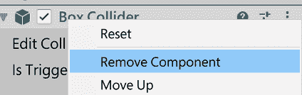

图 2.22：移除组件

现在，我们再次使用**添加组件**菜单来选择一个**物理**组件，这次选择**球体碰撞**组件。如果你查看**物理**组件，你会看到其他可以用来表示其他形状的碰撞器类型，但我们将在第七章*物理碰撞和健康系统*中稍后讨论它们。以下截图显示了**球体碰撞**组件：

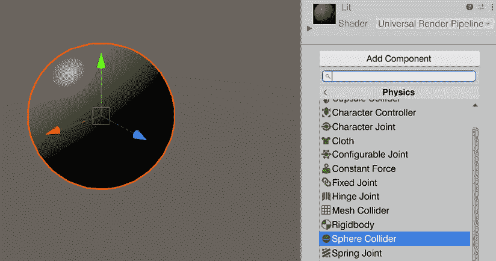

图 2.23：添加球体碰撞组件

因此，如果你现在点击**播放**，你会看到我们的球体不仅看起来像一个球体，而且表现得像一个球体。记住：本书这一部分的主要思想是理解在 Unity 中，你可以通过添加、删除和修改组件来创建任何你想要的对象，而且我们将在整本书中做很多这样的事情。

现在，创建对象所需的不仅仅是组件。复杂对象可能由几个子对象组成，所以让我们看看这是如何工作的。

# 对象层次结构

一些复杂对象可能需要分解成子对象，每个子对象都有自己的组件。这些子对象需要以某种方式附着到主对象上，并协同工作以创建必要的对象行为。

在本节中，我们将介绍与对象相关的以下概念：

+   对象的关联

+   可能的用途

让我们先来了解如何创建对象之间的父子关系。

## 对象的关联

**关联**是指将一个对象作为另一个对象的子对象，这意味着这些对象将相互关联。发生的一种关系是**变换关系**，意味着子对象将受到父对象变换的影响。简单来说，子对象将跟随父对象，就像它被附着在上面一样。例如，想象一个头上戴着帽子的玩家。帽子可以是玩家头部的子对象，使帽子在它们附着时跟随头部。

为了尝试这个功能，让我们创建一个代表敌人的胶囊和一个代表敌人武器的立方体。记住，为了做到这一点，你可以使用**GameObject** | **3D Object** | **Capsule**和**Cube**选项，然后使用**Transform**工具来修改它们。以下截图显示了胶囊和立方体的示例：

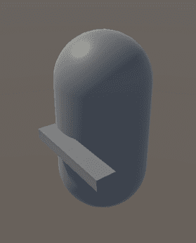

图 2.24：代表敌人和武器的胶囊和立方体

如果你移动敌人对象（胶囊），武器（立方体）将保持其位置，不会跟随我们的敌人。因此，为了防止这种情况，我们可以在**Hierarchy**窗口中简单地拖动武器到敌人对象，如下面的截图所示：

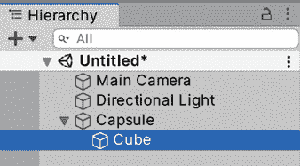

图 2.25：将立方体武器与胶囊角色关联

现在，如果你移动敌人，你会看到枪随着移动、旋转和缩放。所以，基本上，枪的变换也具有敌人变换组件的效果。

现在我们已经进行了一些基本的育儿工作，让我们来探索其他可能的用途。

## 可能的用途

除了创建复杂对象之外，关联还有一些其他用途。它的另一个常见用途是组织项目层次结构。目前，我们的场景很简单，但随着时间的推移，它将增长，因此跟踪所有对象将变得困难。为了避免这种情况，我们可以创建空的 GameObject（在**GameObject** | **Create Empty**），它们只包含变换组件，作为容器使用，将对象放入其中以组织场景。请谨慎使用，因为过度使用会有性能成本。通常，在组织场景时，有一到两个层次的关联是合适的，但超过这个层次可能会影响性能。考虑到你可以——并且将会——为创建复杂对象进行更深层次的关联；所提出的限制只是针对场景组织。

为了继续改进我们之前的例子，在场景周围复制敌人几次，创建一个空的 GameObject 并将其命名为`Enemies`，然后将所有敌人拖入其中，使其充当容器。这在上面的屏幕截图中有说明。

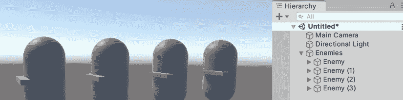

图 2.26：将敌人分组到父对象中

父对象的一个常见用法是改变对象的**旋转中心**（或中心）。目前，如果我们尝试使用**变换**工具旋转我们的枪，它将围绕其中心旋转，因为那个立方体的创建者决定将中心放在那里。通常情况下，这是可以的，但让我们考虑这样一个情况，我们需要让武器瞄准敌人正在看的点。在这种情况下，我们需要围绕武器手柄旋转武器；因此，对于这个立方体武器来说，它将是离敌人最近的一端。这里的问题是，我们无法改变对象的中心，所以一个解决方案是创建另一个具有不同中心的“武器”3D 模型或网格，如果我们考虑其他可能的游戏玩法要求，如旋转武器拾取，这将导致大量武器的重复版本。我们可以通过使用父对象关系轻松解决这个问题。

策略是创建一个空的 GameObject 并将其放置在我们想要对象新旋转中心的位置。之后，我们可以简单地拖动我们的武器到这个空的 GameObject 中，从现在起，将这个空对象视为实际的武器。

如果你旋转或缩放这个武器容器，你会看到武器网格将应用这些变换到这个容器上，所以我们可以说武器的旋转中心已经改变（实际上并没有，但我们的容器模拟了这种变化）。这个过程在下面的屏幕截图中有说明：

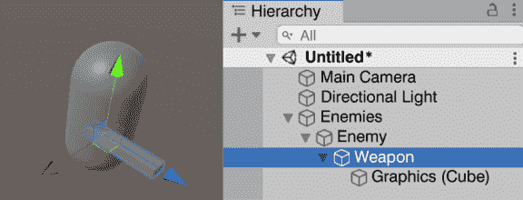

图 2.27：改变武器旋转中心

现在，让我们继续探讨使用预制件管理 GameObject 的不同方法。

# 预制件

在之前的例子中，我们在场景周围创建了敌人的许多副本，但在这样做的同时，我们创建了一个新的问题。让我们想象我们需要更改我们的敌人并为其添加一个**刚体**组件，但由于我们有相同对象的多个副本，我们需要逐个添加相同的组件到所有副本上。也许以后，我们需要更改每个敌人的质量，所以同样，我们需要逐一检查每个敌人并做出更改，从这里我们可以开始看到一种模式。一个解决方案可能是使用*Ctrl*键（在 Mac 上为*Command*）选择所有敌人并一次性修改它们，但如果我们在其他场景中有敌人的副本，这个解决方案将没有任何用处。所以，这就是预制件发挥作用的地方。

在本节中，我们将介绍与预制件相关的以下概念：

+   创建预制件

+   预制件实例关系

+   预制件变体

让我们从讨论如何创建和使用预制件开始。

## 创建预制件

**预制件**是 Unity 的一个工具，它允许我们将自定义对象，如我们的敌人，转换为一个定义它们如何创建的资产。我们可以使用它们轻松地创建自定义对象的副本，而无需再次创建其组件和子对象。

为了创建预制件，我们可以简单地从层次窗口将我们的自定义对象拖动到项目窗口中，完成之后你将在项目文件中看到一个新资产。项目窗口是你可以导航和探索所有项目文件的地方；因此，在这种情况下，我们的预制件是我们创建的第一个资产。现在，你可以简单地从项目窗口中将预制件拖动到场景中，以便轻松创建新的预制件副本，如以下截图所示：

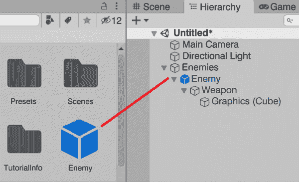

图 2.28：创建预制件

现在，我们这里有一个小问题。如果你注意查看层次窗口，你会看到原始的预制件对象以及所有带有蓝色名称的新副本，而之前创建的敌人将会有黑色名称。名称中的蓝色表示该对象是预制件的**实例**，意味着该对象是基于预制件创建的。我们可以选择那些带有蓝色名称的对象，然后点击**检查器**中的**选择**按钮来选择创建该对象的原始预制件。这在上面的截图中有说明：

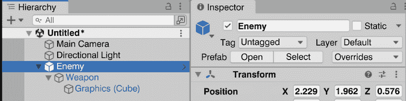

图 2.29：在层次窗口中检测预制件

因此，这里的问题是之前的预制件副本不是我们刚刚创建的预制件的实例，而且很遗憾没有方法将它们连接到它。所以，为了实现这一点，我们需要简单地销毁旧副本，并用带有预制件的副本替换它们。起初，不是所有副本都是实例似乎没有问题，但在本章的下一节中，我们将探讨预制件与其实例之间的关系时，这将会成为一个问题。

## 预制件-实例关系

当将预制件拖动到场景中创建 GameObject 时，预制件的实例将有一个与之绑定的引用，这有助于在预制件和实例之间轻松地回滚和应用更改。如果你对预制件进行一些修改，这些更改将自动应用到项目中的所有场景中的所有实例上，因此我们可以轻松地创建预制件的第一版，在整个项目中使用它，然后进行实验。

为了练习这个，假设我们想要给敌人添加一个**刚体**组件，以便它们可以下落。为了做到这一点，我们可以在**项目**面板中双击预制件文件，我们将进入**预制件编辑模式**，在那里我们可以独立于场景的其余部分编辑预制件。

在这里，我们可以简单地取预制件根对象（在我们的例子中是**敌人**）并为其添加**刚体**组件。之后，我们只需点击场景窗口左上角的**场景**按钮，就可以回到我们正在编辑的场景，现在我们可以看到所有敌人的预制实例都有一个**刚体**组件，如以下屏幕截图所示：

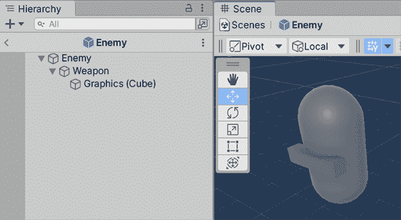

图 2.30：预制件编辑模式

现在，如果我们改变一个预制实例（场景中的那个）会发生什么呢？假设我们想让一个特定的敌人飞起来，这样它们就不会受到重力的影响。我们可以通过简单地选择特定的预制实例，并在**刚体**组件中取消勾选**使用重力**复选框来实现这一点。完成之后，如果我们玩游戏，我们会看到只有那个特定的实例会漂浮。这是因为预制实例的变化会成为一个**覆盖**，即实例与原始预制件相比的差异集合。我们可以在检查器中看到**使用重力**属性被加粗，并且在其左侧显示一个蓝色条，这意味着它是原始预制件值的覆盖。让我们再取另一个对象，将其**缩放**属性更改为使其变大。同样，我们会看到**缩放**属性变为加粗，其左侧的蓝色条也会出现。**使用重力**复选框可以在以下屏幕截图中看到：

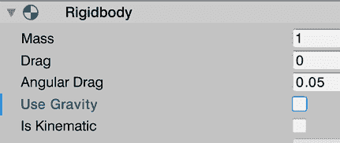

图 2.31：使用重力作为覆盖被突出显示

覆盖优先于预制件，所以如果我们更改原始预制件的缩放比例，具有缩放覆盖的那个实例不会改变，保持其自己的缩放版本，如以下屏幕截图所示：

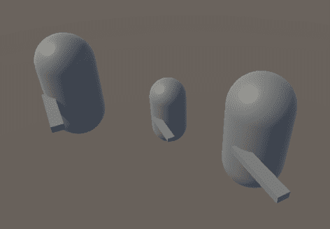

图 2.32：具有缩放覆盖的单个预制实例

我们可以通过在层次结构中选择预制实例（场景中的，在**预制件编辑模式**外）后，在检查器中使用**覆盖**下拉菜单轻松地定位实例的所有覆盖，找到我们的对象所做的所有更改。它不仅允许我们查看所有覆盖，还可以撤销我们不需要的覆盖，并应用我们想要的覆盖。比如说我们后悔了那个特定预制件缺少重力的设置——没问题！我们只需定位覆盖，并在点击具有覆盖的组件后使用**撤销**按钮来撤销它。这个过程在以下屏幕截图中得到了说明：

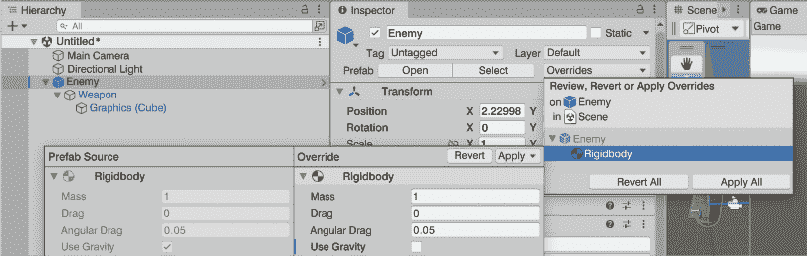

图 2.33：撤销单个覆盖

此外，让我们想象我们真的很喜欢那个实例的新缩放比例，所以想让所有实例都具有那个缩放比例——太好了！我们可以简单地选择特定的覆盖，点击**应用**按钮，然后选择**应用到预制件**选项；现在，所有实例都将具有那个缩放比例（除了具有覆盖的实例），如以下屏幕截图所示：

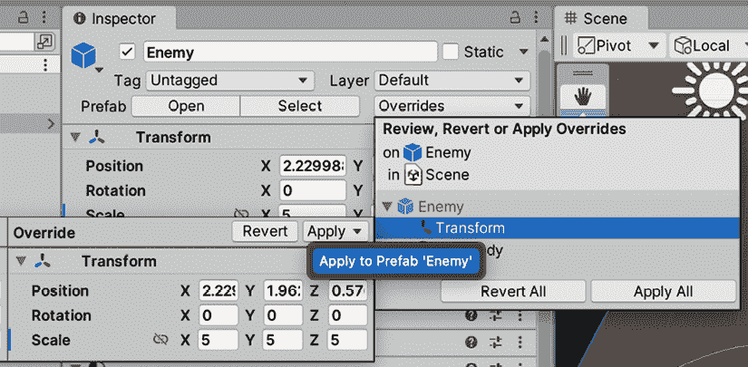

图 2.34：应用按钮

此外，我们还有**全部还原**和**全部应用**按钮，但使用时要小心，因为你可以很容易地还原和应用你未意识到的更改。

因此，正如你所看到的，预制体是 Unity 中一个非常有用的工具，可以跟踪所有类似的对象，并将更改应用到所有对象上，同时还可以有少量变体的特定实例。谈到变体，还有其他情况下你将想要有具有相同变体集的多个预制体实例——例如，飞行敌人和地面敌人——但如果你考虑一下，我们会遇到我们之前没有使用预制体时遇到的问题，所以我们需要逐个手动更新这些变体版本。

在这里，我们有两种选择：一种是为拥有另一个带有该变体的版本而创建一个全新的预制体。这会导致一个问题，即如果我们想让所有类型的敌人都经历变化，我们需要手动将更改应用到每个可能的预制体上。第二种选择是创建一个预制体变体。让我们回顾一下后者。

## 预制体变体

**预制体变体**是基于现有预制体创建的新预制体，因此新预制体**继承**了基础预制体的特性。这意味着我们的新预制体可以与基础预制体有所不同，但它们共有的特性仍然相连。

为了说明这一点，让我们创建一个可以飞行的敌人预制体的变体：飞行敌人预制体。为了做到这一点，我们可以在层次窗口中选择一个现有的敌人预制体实例，将其命名为`飞行敌人`，并将其再次拖动到项目窗口中，这次我们会看到一个提示，询问我们想要创建哪种类型的预制体。这次，我们需要选择**预制体变体**，如下面的截图所示：

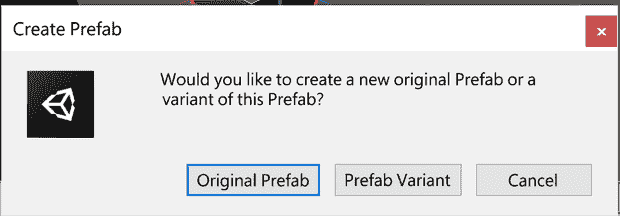

图 2.35：创建预制体变体

现在，我们可以通过双击项目面板中创建的新预制体文件进入变体的预制体编辑模式，然后添加一个立方体作为敌人的喷气背包，并取消选中敌人的**使用重力**属性。如果我们回到场景，我们会看到变体实例被更改，而基础敌人没有改变。你可以在下面的截图中看到这一点：

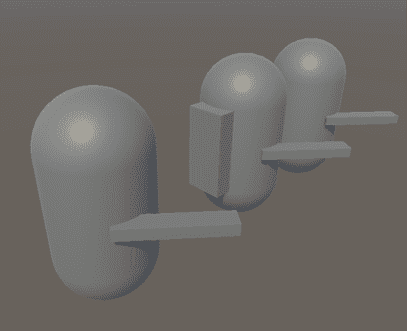

图 2.36：预制体变体实例

现在，假设你想要给所有类型的敌人都加上一顶帽子。我们可以简单地通过双击基础敌人预制体进入**预制体编辑模式**，并添加一个立方体作为帽子。现在，我们将看到这个更改应用到所有敌人身上，因为记住：**飞行敌人**预制体是基础敌人预制体的一个变体，这意味着它将继承所有这些更改。

到目前为止，我们已经创建了大量的内容，但如果我们的电脑因为某种原因关闭，我们肯定会丢失所有内容，所以让我们看看我们如何可以保存我们的进度。

# 保存场景和项目

就像任何其他程序一样，我们需要保存我们的进度。这里的区别在于，我们不仅仅有一个包含所有项目资源的巨大文件，而是每个资源都有几个文件。

让我们通过保存场景来开始保存我们的进度，这相当直接。我们可以简单地转到**文件** | **保存**或按*Ctrl* + *S*（在 Mac 上为*Command* + *S*）。我们第一次保存场景时，会弹出一个窗口询问我们想要将文件保存到何处，你可以在我们项目的`Assets`文件夹内部保存它，但永远不要在文件夹外部保存；否则，Unity 将无法将其作为项目中的资源找到。这将在项目窗口中生成一个新的资源：场景文件。在下面的屏幕截图中，你可以看到我如何保存场景，将其命名为`test`，现在它显示在**项目**面板中：

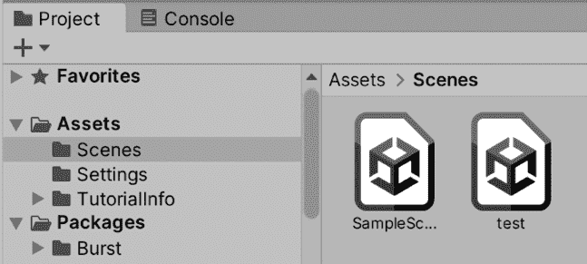

图 2.37：场景文件

我们可以在保存对话框中创建一个文件夹来保存我们的场景，或者，如果你已经保存了场景，你可以使用项目窗口中的**加号 (+)** 图标创建一个文件夹，然后点击**文件夹**选项。最后，将创建的场景拖到该文件夹中。现在，如果你通过**文件** | **新建场景**菜单选项创建另一个场景，只需双击项目窗口中的场景资源即可回到上一个场景。试试看！

这只保存了场景，但 Prefab 和其他类型资源的任何更改都不会与该选项一起保存。相反，如果你想保存除了场景之外的所有资源更改，你可以使用**文件** | **保存项目**选项。这可能有点令人困惑，但如果你想保存所有更改，你需要同时保存场景和项目，因为只保存项目不会保存场景的更改。有时，确保一切已保存的最佳方式就是关闭 Unity，当你尝试在不同计算机或文件夹之间移动项目时，这是推荐的。这将显示一个提示，要求保存场景的更改，并将自动保存对其他资源（如 Prefab）所做的任何更改。

# 摘要

在本章中，我们快速介绍了 Unity 的基本概念。我们回顾了基本 Unity 窗口以及我们如何使用它们来编辑一个完整的场景，从导航它，然后创建预制对象（Prefab），到使用 GameObject 和组件操纵它们以创建我们自己的对象类型。我们还讨论了如何使用层次结构窗口将 GameObject 设置为父级以创建复杂对象层次结构，以及创建 Prefab 以重复利用和操作大量相同类型的对象。最后，我们讨论了如何保存我们的进度。

在下一章中，我们将学习不同的工具，如地形系统和 ProBuilder，来创建我们游戏级别的第一个原型。这个原型将作为我们场景将走向的预览，在全面生产之前测试一些想法。
