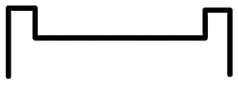

# 使用地形和 ProBuilder 进行灰盒设计

现在我们已经掌握了使用 Unity 所需的所有必要概念，让我们开始设计我们的第一个关卡。本章的目的是学习如何使用地形工具来创建游戏的地形，然后使用 ProBuilder 以比使用立方体更详细的方式创建基础 3D 网格。在本章结束时，你将能够创建任何类型的场景原型，并在实际使用最终图形实现之前尝试你的想法。

具体来说，在本章中我们将探讨以下概念：

+   定义我们的游戏概念

+   使用地形创建景观

+   使用 ProBuilder 创建形状

让我们先从讨论我们的游戏概念开始，这将帮助我们草拟第一个关卡环境。

# 定义我们的游戏概念

在将第一个立方体添加到场景之前，有一个想法是我们将要创建的内容是很好的，因为我们需要有一个基本的游戏概念来开始设计第一个关卡。在本书中，我们将创建一个射击游戏，玩家将对抗试图摧毁玩家基地的敌人波次。

这个基地将位于一个（并非那么）秘密的位置，周围环绕着山脉：

图 3.1：我们的成品游戏

我们将在本书的进展过程中定义我们游戏的游戏机制，但有了这个基本的游戏高级概念，我们可以开始思考如何创建一个山丘景观和一个占位符玩家基地来开始。

在此基础上，在本章的下一节中，我们将学习如何使用 Unity 的地形工具来创建场景的景观。

# 使用地形创建景观

到目前为止，我们使用立方体来生成我们的关卡原型，但我们还了解到，这些形状有时无法代表我们可能需要的所有可能的对象。想象一下不规则的东西，比如一个完整的带有山丘、峡谷和河流的地形。使用立方体创建这样的不规则形状将是一场噩梦。另一个选择是使用 3D 建模软件，但问题是生成的模型会非常大且非常详细，以至于即使在高端 PC 上表现也不会很好。在这种情况下，我们需要学习如何使用 Unity 的地形系统，我们将在本章的第一节中这样做。

在本节中，我们将介绍与地形相关的以下概念：

+   讨论高度图

+   创建和配置高度图

+   创建和配置高度图

+   添加高度图细节

让我们先从讨论高度图开始，其纹理帮助我们定义地形的起伏。

## 讨论高度图

如果我们使用常规 3D 建模工具创建一个包含山丘、峡谷、陨石坑、山谷和河流的大型游戏区域，我们将遇到一个问题，那就是我们将为所有可能距离的对象使用完全详细的模型，从而浪费了渲染我们看不到的细节的资源。我们将从很远的距离看到地形的很多部分，所以这是一个严重的问题。

Unity 地形工具使用一种称为高度图的技术，以高效和动态的方式生成地形。它不是为整个地形生成大型 3D 模型，而是使用一个称为**高度图**的图像，它看起来像是从上往下拍摄的地形黑白照片。

在以下图像中，你可以看到苏格兰一个区域的黑白俯视图，白色代表较高，黑色代表较低：

图 3.2：苏格兰的高度图

在前面的图像中，你可以通过寻找图像中最白的区域来轻松地找到山脉的顶峰。海平面以下的一切都变成黑色，而中间的一切都使用灰度的渐变，代表最小和最大高度之间的不同高度。想法是图像中的每个像素都决定了该特定地形区域的高度。

Unity 地形工具可以从该图像自动生成一个 3D 网格，节省我们存储该地形完整 3D 模型所需的硬盘空间。此外，Unity 将随着我们的移动创建地形，为附近的区域生成高细节模型，为远处的区域生成低细节模型，使其成为一个高效的解决方案。

在以下图像中，你可以看到为地形生成的网格。你可以欣赏到地形较近的部分比较远的部分有更多的多边形：

图 3.3：生成的高度图网格

请注意，这项技术有其缺点，例如 Unity 在游戏过程中生成那些 3D 模型所需的时间，以及无法创建洞穴，但就目前而言，这对我们来说不是问题。

既然我们已经知道了高度图是什么，让我们看看如何使用 Unity 地形工具来创建我们自己的高度图。

## 创建和配置高度图

如果你点击**GameObject | 3D Object | Terrain**，你将看到一个巨大的平面出现在你的场景中，并在你的层次窗口中出现一个**Terrain**对象。那就是我们的地形，它很平坦，因为其高度图一开始是全黑的，所以其初始状态没有任何高度。

在以下图像中，你可以看到全新的**Terrain**对象的外观：

图 3.4：尚未绘制高度的地形

在开始编辑此地形之前，你必须配置不同的设置，例如地形高度图的尺寸和分辨率，这取决于你打算如何使用它。这不同于生成整个世界。我们的游戏将包括玩家的基地，他们将进行防御，因此地形将是小的。在这种情况下，一个 200 x 200 米大小的区域，周围环绕着山脉，将足够使用。

为了根据这些要求配置我们的地形，我们需要执行以下操作：

1.  从**层次**或**场景**窗口中选择**地形**。

1.  查看**地形**组件的**检查器**并展开它，如果它已经折叠的话。

1.  点击山和齿轮图标（最右侧的选项）以切换到配置模式。在以下屏幕截图中，你可以看到该按钮的位置：

图 3.5：地形设置按钮

1.  查找**网格分辨率**（**在地形数据中**）部分。

1.  在两个设置中将**地形宽度**和**地形长度**更改为`200`。这将表示我们的地形大小将是 200 x 200 米。

1.  **地形高度**决定了可能的最大高度。我们 Height Map 的白色区域将是这个大小。我们可以将其减少到`500`，以限制我们山脉的最大峰值：

图 3.6：地形分辨率设置

1.  查找**纹理分辨率**（**在地形数据中**）部分。

1.  将**高度图分辨率**更改为**257 x 257**：

图 3.7：高度图分辨率设置

**高度图分辨率**是包含地形不同部分高度的 Height Map 图像的大小。在我们的 200 x 200 米地形中使用 257 x 257 的分辨率意味着地形中的每平方米将被 Height Map 的略多于 1 个像素覆盖。每平方米的分辨率越高，你可以在该区域大小中绘制越多的细节。通常，地形特征很大，所以每平方米超过 1 个像素通常是资源浪费。找到你可以使用的最小分辨率，以便创建所需的细节。

你还希望设置的一个初始设置是初始地形高度。默认情况下，这是 0，因此你可以从底部开始绘制高度，但这种方式你无法在地形中挖洞，因为地形已经处于最低点。设置一点初始高度可以让你在需要时绘制河流路径和坑洞。

为了做到这一点，请执行以下操作：

1.  在**层次**面板中选择我们的**地形**。

1.  点击**绘制地形**按钮（第二个按钮）。

1.  如果下拉菜单不是设置为**设置高度**，请将其设置为**设置高度**。

1.  将**高度**属性设置为`50`。这将表示我们希望所有地形从`50`米的高度开始，允许我们挖出最大深度为`50`米的洞：

图 3.8：设置高度地形工具位置

1.  点击**全部展平**按钮。你会看到所有地形都已经提升到我们指定的`50`米。这让我们剩下 450 米可以上升，基于我们之前指定的最大 500 米。

现在我们已经正确配置了高度图，让我们开始编辑它。

## 创建高度图

记住，高度图只是高度的一个图像，因此为了编辑它，我们需要在该图像中绘制高度。幸运的是，Unity 有工具允许我们在编辑器中直接编辑地形，并直接看到修改后高度的结果。为了做到这一点，我们必须遵循以下步骤：

1.  在**层次结构**面板中选择我们的**地形**。

1.  点击**绘制地形**按钮（第二个按钮，与上一节相同）。

1.  将下拉菜单设置为**提升或降低地形**：

图 3.9：提升或降低地形工具位置

1.  在笔刷选择器中选择第二个笔刷。这个笔刷有模糊的边缘，允许我们创建更柔和的高度。

1.  将**笔刷大小**设置为**30**，这样我们就可以创建跨越 30 米区域的地面高度。如果你想创建更细腻的细节，可以减少这个数值。

1.  将**不透明度**设置为**10**以减少每秒或每次点击绘制的地面高度：

图 3.10：平滑边缘笔刷

1.  现在，如果你在**场景**视图中移动鼠标，你会看到如果你点击该区域，将会绘制的高度的小预览。可能你需要靠近地形来查看细节：

图 3.11：提升地形的预览区域

你可以看到的勾选图案允许你看到你正在编辑的物体的实际大小。每个单元格代表一个平方米。记住，有一个参考来查看你正在编辑的物体的实际大小，有助于防止你创建过大或过小的地形特征。也许你可以放入其他类型的参考，比如一个具有准确尺寸的大立方体，代表一个建筑，以获得你正在创建的山脉或湖泊的大小概念。记住，立方体默认大小为 1 x 1 x 1 米，所以缩放为 10,10,10 将给你一个 10 x 10 x 10 米的立方体。

1.  按住，左键点击，并将光标拖动到地面上以开始绘制地形高度。记住，你可以按*Ctrl* + *Z* (*Command*+ *Z* 在 Mac 上)撤销任何不希望的改变。

1.  尝试在我们的区域边界周围绘制山脉，这将代表我们基地的背景山丘：

图 3.12：绘制在地形边缘的山脉

我们现在在未来的基地周围有了不错的起始山丘。我们还可以在未来的基地周围画一条护城河。要做到这一点，请按照以下步骤操作：

1.  在地形中间放置一个`50,10,50`比例的立方体。这将作为我们要创建的基地的占位符：

图 3.13：基地区域的占位符立方体

1.  再次选择**地形**和**刷子**按钮。

1.  将**刷子大小**减少到`10`。

1.  按住*Shift*键，左键点击并拖动鼠标在地面上来绘制围绕我们的基础占位符的盆地。这样做会降低地形而不是升高它：

图 3.14：我们占位符基地周围的护城河

现在，我们有一个简单但很好的起始地形，它给我们一个基本的概念，了解我们的基地及其周围将看起来如何。在继续之前，我们将应用一些更精细的细节，使我们的地形看起来更好一些。在下一节中，我们将讨论如何使用不同的工具模拟地形侵蚀。

## 添加高度图细节

在前一节中，我们创建了一个地形的大致轮廓。如果你想让它看起来更逼真一些，那么你需要开始在这里和那里画很多小细节。通常，这会在关卡设计过程的后期进行，但既然我们现在正在探索地形工具，让我们现在看看。现在，我们的山看起来非常平滑。在现实生活中，它们通常更尖锐，所以让我们改进一下：

1.  选择**地形**并点击**刷子**按钮，如前几节所述。

1.  如果下拉菜单尚未设置，请将其设置为**提升或降低地形**。

1.  选择第五个刷子，如图 3.15 所示。这个刷子形状不规则，因此我们可以在这里和那里画一些噪声。

1.  将**刷子大小**设置为`50`，这样我们就可以覆盖更大的区域：

图 3.15：用于随机性的云图案刷子

1.  按住*Shift*键，在不拖动鼠标的情况下，在地面的小山上进行小点击。记得放大到你正在应用更精细细节的区域，因为它们在远处是看不见的：

图 3.16：使用上述刷子生成的侵蚀

这给我们的山增加了一些不规则性。现在，让我们想象我们想在山上有一个平坦的区域来放置装饰性的天文台或天线。按照以下步骤操作：

1.  从下拉菜单中选择**地形**、**刷子工具**和**设置高度**。

1.  将**高度**设置为`60`。

1.  选择全圆刷（第一个）。

1.  在小山上画一个区域。你会看到，如果地形低于 60 米，它将上升；如果高于 60 米，它将下降：

图 3.17：平整的小山

1.  你可以看到边界有一些需要平滑的粗糙角落：

图 3.18：未平滑的地形边缘

1.  将下拉菜单更改为**平滑高度**。

1.  选择第二个刷子，如图 3.19 所示，大小为`5`，不透明度为`10`：

图 3.19：选中的平滑高度刷子

1.  点击并拖动我们平坦区域的边缘，使它们更平滑：

图 3.20：平滑的地形边缘

我们可以继续添加细节，但我们可以先这样。下一步是创建玩家的基础，但首先，让我们探索 ProBuilder 以生成我们的几何形状。

# 使用 ProBuilder 创建形状

到目前为止，我们已经使用立方体和原始形状创建了简单的场景，这对您将要创建的大多数原型来说已经足够了，但有时，游戏中可能会有一些难以用常规立方体建模的复杂区域，或者您可能想在游戏中的某些部分添加一些更深的细节，以了解玩家将如何体验该区域。

在这种情况下，我们可以使用任何 3D 建模工具来完成这项工作，例如 3D Studio Max、Maya 或 Blender，但它们可能难以学习，而且在这个开发阶段您可能不需要它们的所有功能。幸运的是，Unity 有一个简单的 3D 模型创建工具叫做 ProBuilder，让我们来探索它。

在本节中，我们将介绍与 ProBuilder 相关的以下概念：

+   安装 ProBuilder

+   创建形状

+   网格操作

+   添加细节

ProBuilder 默认不包含在我们的 Unity 项目中，所以让我们先学习如何安装它。

## 安装 ProBuilder

Unity 是一个功能强大的引擎，但如果我们不使用所有这些工具，将它们添加到我们的项目中可能会使引擎运行得更慢，因此我们需要手动指定我们正在使用的 Unity 工具。为此，我们将使用 **包管理器**，这是一个我们可以用来选择将要需要的 Unity 包的工具。如您所回忆的，我们之前谈到了 `Packages` 文件夹。这基本上就是包管理器正在修改的内容。

为了使用此工具在我们的项目中安装 ProBuilder，我们需要执行以下操作：

1.  点击 **窗口 | 包管理器** 选项：

图 3.21：包管理器选项

1.  在刚刚打开的窗口中，确保 **包** 模式处于 **Unity 注册表** 模式，通过点击窗口左上角的 **包** 按钮并选择 **Unity 注册表**。与只显示项目已拥有的包的 **项目内** 选项不同，**Unity 注册表** 将显示您可以安装的所有官方 Unity 包：

图 3.22：显示所有包

1.  等待左侧的包列表填充。确保您已连接到互联网以下载和安装包。

1.  在该列表中查看 **ProBuilder** 包，并选择它。您也可以使用 **包管理器** 窗口右上角的搜索框：

图 3.23：包列表中的 ProBuilder

我使用的是 ProBuilder 版本 5.0.6，这是撰写本书时的最新版本。虽然您可以使用更新的版本，但使用它的过程可能会有所不同。您可以通过标题左侧的箭头查看旧版本。

1.  点击 **包管理器** 右下角的 **安装** 按钮：

图 3.24：安装按钮

1.  等待包安装；这可能需要一段时间。当**导入**弹出窗口完成后，**安装**按钮被**移除**标签替换时，您就可以知道过程已经结束。如果由于某种原因 Unity 冻结或超过 10 分钟，您可以随时重新启动它。

1.  在 Windows 上转到**编辑** | **首选项**（在 Mac 上为**Unity** | **首选项**）。

1.  从左侧列表中选择**ProBuilder**选项。

1.  将**顶点大小**设置为`2`和**线大小**设置为`1`。这将在编辑其不同部分时帮助我们更好地可视化即将创建的 3D 模型：

图 3.25：配置 ProBuilder

**顶点大小**和**线大小**值很大（分别为`2`米和`1`米），因为我们不会编辑模型的细节，而是编辑像墙壁这样的大特征。考虑您可能想要根据您正在编辑的内容稍后对其进行修改。

虽然这已经是我们安装 ProBuilder 所需了解的关于**包管理器**的所有内容，但如果您想了解更多，可以在此处查看其文档：[`docs.unity3d.com/Manual/upm-ui.html`](https://docs.unity3d.com/Manual/upm-ui.html)。现在我们已经在我们的项目中安装了 ProBuilder，让我们来使用它吧！

## 创建形状

我们将通过创建一个用于地板的平面来开始玩家的基础。我们将通过以下步骤来完成此操作：

1.  删除我们放置的作为基础占位符的立方体。您可以通过在层次结构中右键单击立方体然后按**删除**键来完成此操作。

1.  打开 ProBuilder 并转到**工具 | ProBuilder | ProBuilder 窗口**：

图 3.26：ProBuilder 窗口选项

1.  在打开的窗口中，点击**新建形状**按钮：

图 3.27：新建形状选项

1.  在场景视图右下角出现的**创建形状**面板中，选择**平面**图标（第二行的第一个图标）。

1.  展开**形状属性**和**平面设置**。

1.  将**宽度切割**和**高度切割**设置为`2`。我们稍后会需要这些细分。

1.  点击并拖动地形以绘制平面。在您这样做的时候，检查**创建形状**面板中的**大小**值如何变化，并尝试使其具有大约`50`的*x*和*z*值。

1.  释放鼠标按钮，查看生成的平面：

图 3.28：创建的新形状

1.  在层次结构中选择新创建的**平面**对象，并使用**变换**工具向上拖动一点。

我们需要将平面向上移动，因为它是在与地形完全相同的高度创建的。这导致了称为**Z 冲突**的效果，其中位于相同位置的像素在争夺确定哪个将被渲染以及哪个不会被渲染。

现在我们已经创建了地板，让我们学习如何通过操纵其顶点来改变其形状。

## 网格操纵

如果你选择了平面，你会看到它被细分为 3 x 3 的网格，因为我们设置了宽度和高度切割为`2`。我们这样做是因为我们将使用外部单元格来创建墙体，从而将其抬起。想法是修改这些单元格的大小，以在创建墙体之前勾勒出墙体的长度和宽度。为了做到这一点，我们将执行以下操作：

1.  在层次结构中选择平面。

1.  如果 ProBuilder 尚未打开，请打开它，并转到 **工具 | ProBuilder | ProBuilder 窗口** 选项。

1.  从场景视图中出现的四个新按钮中选择第二个按钮（顶点）：

图 3.29：选择顶点工具

1.  点击**选择隐藏**选项，直到它显示为**开启**，如图所示。这将使选择顶点更容易：

图 3.30：启用选择隐藏

1.  点击并拖动鼠标创建一个选择框，选择第二行顶点上的四个顶点：

图 3.31：顶点选择

1.  点击 Unity 编辑器按钮组左上角的第二个按钮以启用**移动工具**，这将允许我们移动顶点。像**变换工具**一样，这可以用来移动任何对象，但为了移动顶点，这是我们的唯一选项。记住，一旦选择了顶点，就要这样做。你也可以按*W*键来启用**移动工具**。

图 3.32：移动工具

1.  移动顶点行以使平面的细分更薄。你可以使用地形上的棋盘图案来获得墙体大小的概念（记住，每个方格是一平方米）：

图 3.33：移动顶点

1.  对每一行的顶点重复 *步骤 3* 到 *5*，直到得到大小相似的墙面轮廓：

图 3.34：移动顶点以减少边缘单元格宽度

现在我们已经为墙体创建了轮廓，让我们添加新的面到网格中，以创建它们。为了使用我们创建的细分，或**面**，来制作墙体；我们必须选择并拉伸它们。按照以下步骤进行操作：

1.  选择平面。

1.  在场景视图中选择**ProBuilder**按钮的第四个按钮：

图 3.35：选择面工具

1.  按住 *Ctrl* (*Mac 上的 Command*)，点击墙面轮廓的每个面：

图 3.36：选择边缘面

1.  在**ProBuilder**窗口中，寻找**Extrude Faces**按钮右侧的**加号 (+**) 图标。它位于窗口的红色部分：

图 3.37：拉伸面选项

1.  在点击加号按钮后出现的窗口中，将**距离**设置为`5`。

1.  在该窗口中点击**Extrude Faces**按钮：

图 3.38：拉伸距离选项

1.  现在，你应该看到墙体的轮廓已经从地面升起：

图 3.39：拉伸网格边缘

现在，如果你注意基础地板和墙壁与地形的接触，会发现有一点间隙。我们可以尝试将基础向下移动，但地板可能会消失，因为它会被地形埋藏。这里我们可以使用的一个小技巧是向下推墙壁，而不移动地板，这样墙壁就会埋入地形，而我们的地板会保持一定的距离。你可以在以下图片中看到它将如何看起来：

图 3.40：预期结果的切片

为了做到这一点，我们需要执行以下操作：

1.  在场景视图中选择第三个**ProBuilder**按钮以启用边缘选择：

图 3.41：选择边缘工具

1.  在按住*Ctrl*（Mac 上的*Command*）的同时，选择所有墙壁的底部边缘。

1.  如果你选择了不想要的边缘，只需在按住*Ctrl*（Mac 上的*Command*）的同时再次点击它们以取消选择，同时保持当前选择：

图 3.42：选择地板边缘

如果你想在**球体**图标中使用**线框**模式，请转到场景视图右上角的 2D 按钮左侧，并从下拉菜单中选择**线框**选项，如图所示。选择**着色**可以返回正常视图。

图 3.43：启用线框模式

1.  通过按**场景**面板左上角的第二个按钮（或键盘上的*W*键）启用**移动**工具：

图 3.44：对象移动工具

1.  将边缘向下移动，直到它们完全埋入地形中：

图 3.45：重叠的面

现在我们有了基础网格，我们可以开始使用几个其他 ProBuilder 工具向其添加细节。

## 添加细节

让我们从给基础应用一点斜边开始，在角落处进行一点切割，使其不那么尖锐。为此，请按照以下步骤操作：

1.  使用边缘选择工具（**ProBuilder**按钮中的第三个），选择我们模型的顶部边缘：

图 3.46：正在选择顶部墙壁边缘

1.  在**ProBuilder**窗口中，按住**斜边**按钮右侧的加号（+）图标。

1.  设置距离为`0.5`：

图 3.47：要生成的斜边距离

1.  点击**斜边边缘**。现在你可以看到我们墙壁的顶部部分有轻微的斜边：

图 3.48：斜边处理的结果

1.  可选地，你也可以对内部墙壁的底部部分做同样的操作：

图 3.49：应用于地板-墙壁边缘的斜边

可以添加的另一个细节是在地面中间挖一个坑，作为我们需要避免掉入的陷阱，并让敌人通过 AI 避免它。为了做到这一点，请按照以下步骤操作：

1.  通过点击第四个 ProBuilder 场景视图按钮启用**面**选择模式。

1.  选择地板。

1.  在 **ProBuilder** 窗口中点击 **细分面** 选项。您将得到一个分成四部分的地面。

1.  再次点击该按钮，以获得 4 x 4 的网格：

图 3.50：细分地板

1.  按住 *Ctrl* (*Mac 上的 *Command*) 使用 **选择面** 工具（场景视图顶部部分的 ProBuilder 按钮中的第三个）选择四个内部地板瓷砖。

1.  通过点击场景视图左上角的第四个按钮或按键盘上的 *R* 键启用 **缩放** 工具。与 **移动** 工具一样，这可以用于缩放任何对象，而不仅仅是顶点：

图 3.51：缩放工具

1.  使用位于 Gizmo 中心灰色立方体，缩小中心瓷砖：

图 3.52：内部单元格缩小

1.  在 **ProBuilder** 窗口中点击 **拉伸面** 按钮。

1.  使用 **移动工具** 将拉伸的面向下推。

1.  右键点击 **ProBuilder** 窗口标签并选择 **关闭标签**。我们需要回到地形编辑，并且打开 **ProBuilder** 不会让我们舒适地进行操作：

图 3.53：关闭标签选项

1.  选择地形并将其降低，以便我们可以看到坑洞：

图 3.54：降低地形以便可见坑洞

# 摘要

在本章中，我们学习了如何使用高度图和 Unity 地形工具，如 **绘制高度** 和 **设置高度** 来创建山丘和河流，从而创建大型地形网格。我们还看到了如何使用 ProBuilder 创建自己的 3D 网格，以及如何操纵模型的顶点、边和面来创建游戏的原型基础模型。我们没有讨论可以应用于我们的网格或高级 3D 建模概念的任何性能优化，因为这需要整个章节，并且超出了本书的范围。目前，我们的主要重点是原型设计，所以我们对我们当前级别的状态感到满意。

在下一章中，我们将学习如何通过集成我们使用外部工具创建的资产（文件）来下载和替换这些原型模型，以最终艺术作品。这是提高我们游戏图形质量的第一步，我们将在第三部分，*改进图形* 的结尾完成。

# 加入 Discord 与我们同行！

与其他用户、Unity 游戏开发专家以及作者本人一起阅读这本书。

提出问题，为其他读者提供解决方案，通过 Ask Me Anything 会话与作者聊天，等等。

扫描二维码或访问链接以加入社区。

`packt.link/handsonunity22`
