# 4

# 导入和整合资源

在上一章中，我们创建了我们的关卡原型。现在，让我们假设我们已经编写了游戏并进行了测试，确认游戏想法很有趣。有了这个，现在是时候用真正的完成艺术来替换原型艺术了。我们将在下一章*第五章*，*C#和视觉脚本简介*中实际编写游戏，但现在为了学习目的，让我们先跳过这部分。为了使用最终资源，我们需要学习如何获取它们（图像、3D 模型等），如何将它们导入 Unity，以及如何将它们整合到我们的场景中。

在本章中，我们将探讨以下主题：

+   导入资源

+   整合资源

+   配置资源

让我们先学习如何在 Unity 中获取资源，例如 3D 模型和纹理。

# 导入资源

我们可以使用的项目资源来源有很多。我们可以简单地从我们的艺术家那里接收文件，从不同的免费和付费资源网站上下载它们，或者我们可以使用**Asset Store**，Unity 的官方虚拟资源商店，在那里我们可以获取免费和付费的资源，这些资源可以与 Unity 一起使用。我们将使用从互联网和 Asset Store 下载资源的混合方式，以便使用所有可能资源。

在本节中，我们将介绍与导入资源相关的以下概念：

+   从互联网导入资源

+   从 Asset Store 导入资源

+   从 Unity 包导入资源

+   让我们先探索第一个资源来源，互联网。

## 从互联网导入资源

在获取项目中的艺术资源方面，让我们从我们的地形纹理开始。请记住，我们的地形已经被涂上了网格图案，所以想法是用草地、泥土、岩石和其他类型的纹理来替换它。为了做到这一点，我们需要图像。在这种情况下，这类图像通常是不同地形图案的俯视图，并且它们有“可平铺”的要求，这意味着您可以在它们的连接处重复它们而不会出现明显的图案。您可以在以下图像中看到这个例子：

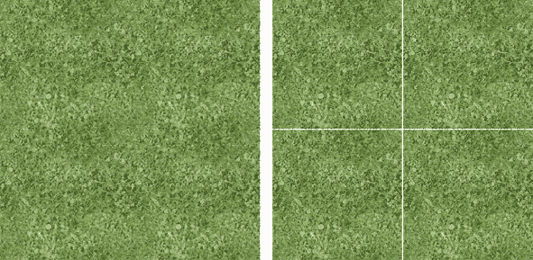

图 4.1：左 - 草地块；右 - 将同一草地块分开以突出纹理平铺

左侧的草地看起来像是一张巨大的单一图像，但如果您仔细观察，应该能够看到一些重复出现的图案。在这种情况下，这片草地实际上只是单个图像在网格中重复了四次，就像右侧的图像一样。这样，您可以通过重复单个小图像来覆盖大面积，从而在用户的计算机上节省大量 RAM。

策略是获取这类图像来绘制我们的地形。您可以从几个地方获取它们，但最简单的方法是使用*Google Images*或任何图像搜索引擎。在使用这些来源的内容之前，请始终检查版权许可。为此，请按照以下步骤操作：

1.  打开您的浏览器（Chrome、Safari、Edge 等）。

1.  前往您偏好的搜索引擎。在这种情况下，我将使用 Google。

1.  使用关键词`PATTERN tileable texture`，将`PATTERN`替换为你正在寻找的地形类型，例如`grass tileable texture`或`mud tileable texture`。在这种情况下，我将输入`grass tileable texture`，然后按*Enter*键进行搜索。

1.  切换到图片搜索模式：

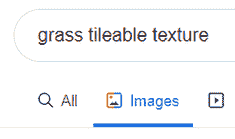

图 4.2：Google 搜索图片

1.  选择任何你认为适合所需草地的纹理，然后点击它。请记住，纹理必须是草地的俯视图，并且必须重复。

在选择之前尝试检查图片的分辨率。目前尝试选择分辨率小于 1024 x 1024 的方形图片。

1.  右键单击打开的图片，并选择**另存为…**：

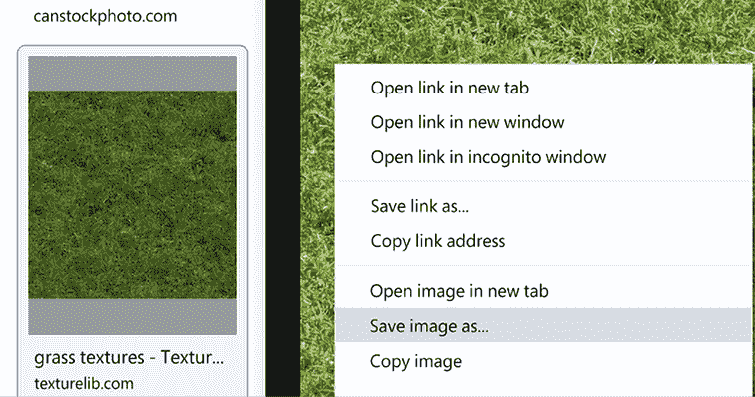

图 4.3 另存为…选项

1.  将图片保存到任何你记得的文件夹中。

现在你已经下载了图片，你可以通过几种方式将其添加到你的项目中。最简单的一种方法如下：

1.  使用**文件资源管理器**（Mac 上的**Finder**）定位你的图片。

1.  在 Unity 的项目窗口中定位或创建`Textures`文件夹。

1.  将**文件资源管理器**和**Unity 项目窗口**并排放置。

1.  将文件从**文件资源管理器**拖动到**Unity 项目窗口**中的`Textures`文件夹：

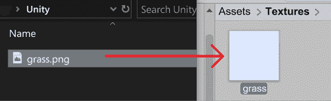

图 4.4：从 Windows 文件资源管理器拖动纹理到 Unity 的项目视图

对于这些简单的纹理，任何搜索引擎都可以有所帮助，但如果你想要用详细的墙壁和门替换玩家的基础几何形状，或者在你的场景中放置敌人，你需要获取 3D 模型。如果你在搜索引擎中使用诸如“免费僵尸 3D 模型”等关键词搜索，你会找到无数免费和付费的 3D 模型网站，如 TurboSquid 和 Mixamo，但那些网站可能会有问题，因为那些网格通常没有为在 Unity 中使用或甚至用于游戏而准备。你会发现具有非常高的多边形计数、不正确的尺寸或方向、未优化的纹理等问题。为了避免这些问题，我们希望使用更好的来源，在这种情况下，我们将使用 Unity 的 Asset Store，让我们来探索它。

## 从 Asset Store 导入资源

Asset Store 是 Unity 的官方资源市场，你可以在这里找到许多模型、纹理、声音，甚至完整的 Unity 插件来扩展引擎的功能。在这种情况下，我们将限制自己下载 3D 模型来替换玩家的基础原型。你将想要获取具有模块化设计的 3D 模型，这意味着你将得到几个部件，如墙壁、地板、角落等。你可以将它们连接起来创建任何类型的场景。

为了做到这一点，你必须遵循以下步骤：

1.  在 Unity 中点击**窗口 | 资产商店**，这将打开一个新窗口，显示资产商店已迁移。在 Unity 的早期版本中，你可以在编辑器中直接看到资产商店，但现在，建议在常规网页浏览器中打开它，所以点击**在线搜索**按钮，这将在你首选的浏览器中打开网站[`assetstore.unity.com/`](https://assetstore.unity.com/)。此外，你可以勾选**从菜单始终在浏览器中打开**，以便在点击**窗口 | 资产商店**时直接打开页面：

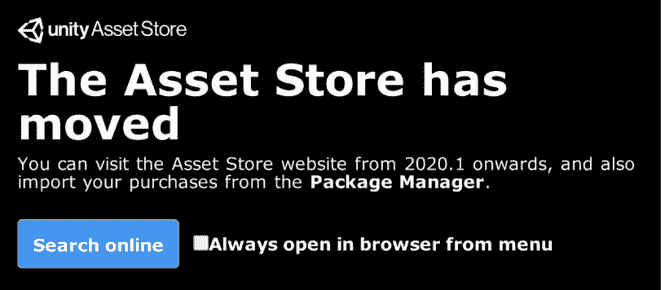

图 4.5：资产商店迁移消息

1.  在顶部菜单中，点击**3D**类别来浏览 3D 资产：

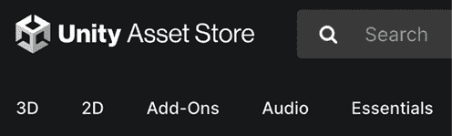

图 4.6：3D 资产菜单

1.  在最近打开的页面中，点击右侧**所有类别**面板中**3D**类别的右侧箭头，然后打开**环境**并勾选**科幻**标记，因为我们将会制作一个未来主题的游戏：

图 4.7：3D 资产菜单

如你所见，有几个类别可以用来查找不同类型的资产，如果你想的话，可以挑选另一个。在**环境**类别中，你可以找到可用于为你的游戏生成场景的 3D 模型。

1.  如果你需要，你可以为资产付费，但现在让我们先隐藏付费的资产。你可以通过点击左上角的**按价格排序**选项，并选择**免费资产**选项来实现：

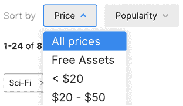

图 4.8：免费资产选项

1.  在搜索区域，找到任何看起来符合你审美需求的资产并点击它。记得要留意户外资产，因为大多数环境包通常只包含室内场景。在我的例子中，我选择了一个名为**科幻风格模块包**的资产，它适用于室内和室外。请注意，当你阅读这篇文档时，这个包可能已经不存在了，所以你可能需要选择另一个。如果你找不到合适的包，你可以从 GitHub 仓库下载并选择我们使用的资产文件：

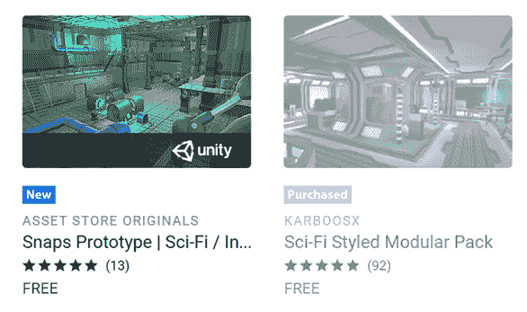

图 4.9：资产商店搜索包预览

1.  现在，你将在**资产商店**窗口中看到包的详细信息。在这里，你可以找到关于包的描述、视频/图片、包的内容，以及最重要的部分，即评论，你可以看到这个包是否值得获取：

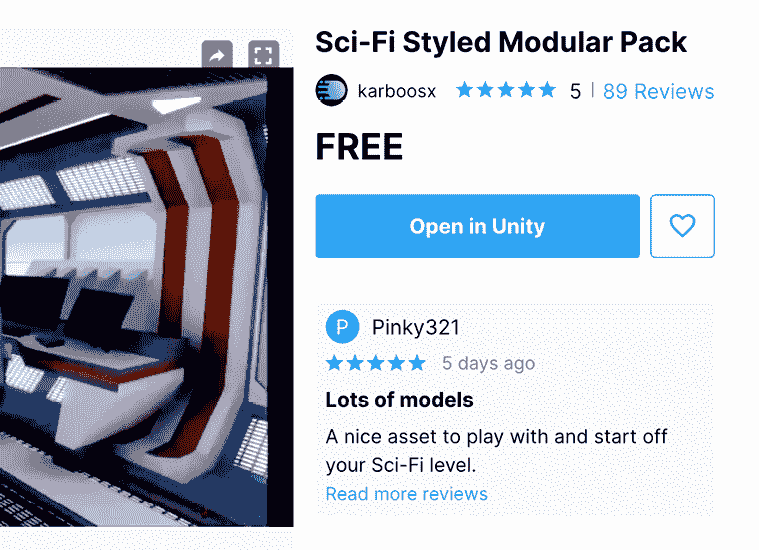

图 4.10：资产商店包详细信息

1.  如果你对这个包没有异议，点击**添加到我的资产**按钮，如果需要，登录 Unity，然后点击**在 Unity 中打开**按钮。你可能需要接受浏览器打开 Unity 的提示；如果是这样，只需接受即可：

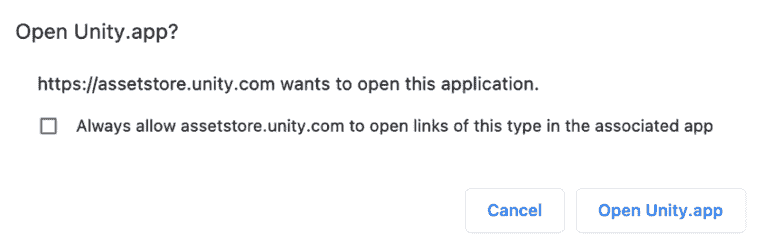图 4.11：切换应用

1.  这将再次打开**包管理器**，但这次是在**我的资产**模式下，显示你从资产商店下载的所有资产的列表，你刚刚选择的资产在列表中突出显示：

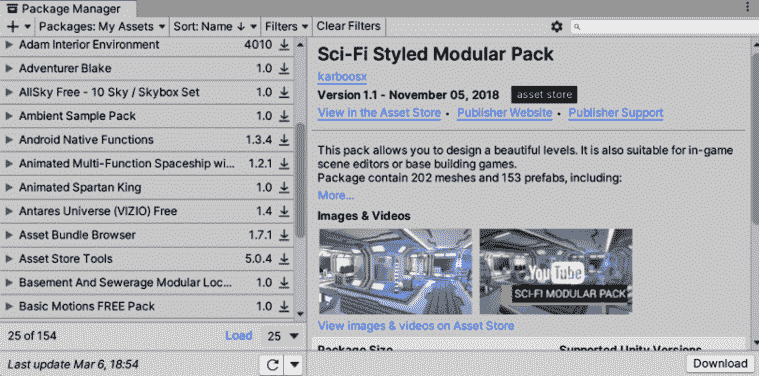

图 4.12：资源管理器显示资源

1.  在窗口的右下角点击**下载**，等待完成。然后点击**导入**。

1.  一段时间后，**包内容窗口**将出现，允许你选择你想要在项目中使用的包中的确切资源。现在，保持原样并点击**导入**：

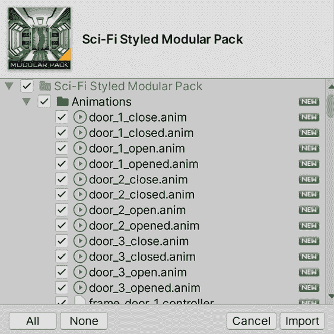

图 4.13：导入资源选择

1.  经过一段时间导入后，你将在你的**项目窗口**中看到所有包文件。

请注意，导入大量完整包会增加你的项目大小，并且之后你可能想要删除未使用的资源。此外，如果你导入的资源产生了错误，阻止你播放场景，只需删除包中附带的所有`.cs`文件。它们通常在名为`Scripts`的文件夹中。这些是可能与你的 Unity 版本不兼容的代码文件：

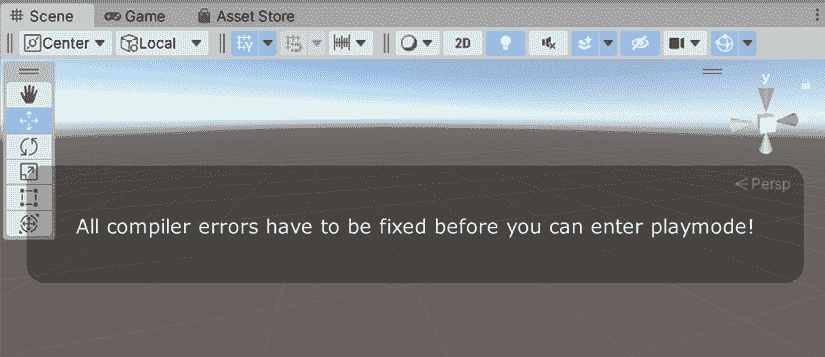

图 4.14：在播放时触发的代码错误警告

在继续本章内容之前，尝试使用资源商店，按照之前的步骤下载一个角色 3D 模型。为了做到这一点，你必须完成与我们为关卡环境包所做相同的步骤，但在资源商店的**3D | 角色 | 人形**类别中查找。在我的情况下，我选择了**机器人英雄：PBR HP Polyart**包：

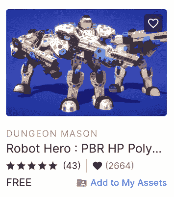

图 4.15：游戏中使用的角色包

现在，让我们探索 Unity 资源的另一个来源：**Unity 包**。

## 从 Unity 包导入资源

资源商店不是资产包的唯一来源；你可以从互联网上获取.unitypackage 文件，或者可能从想要与你分享资源的同事那里获取。

为了导入`.unitypackage`文件，你需要执行以下操作：

1.  前往**资产 | 导入包 | 自定义包**选项：

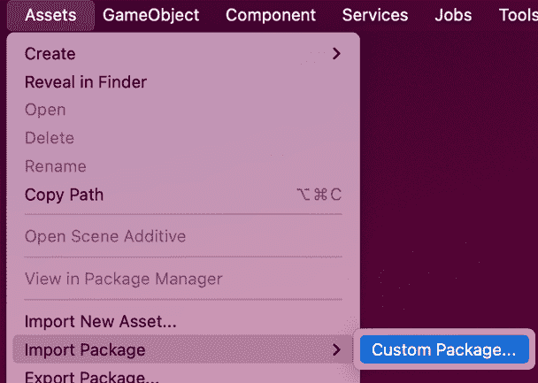

图 4.16：导入自定义包

1.  在显示的对话框中搜索`.unitypackage`文件。

1.  在出现的**导入 Unity 包**窗口中点击**导入**选项，与我们在资源商店部分看到的相同。

现在我们已经导入了很多艺术资源，让我们学习如何在场景中使用它们。

# 集成资源

我们刚刚导入了很多可以以多种方式使用的文件，所以本节的想法是看看 Unity 如何将这些资源与需要它们的 GameObject 和组件集成。

在本节中，我们将介绍与导入资源相关的以下概念：

+   集成地形纹理

+   网格集成

+   集成材质

让我们先使用可重复纹理来覆盖地形。

## 集成地形纹理

为了将纹理应用到我们的地形上，请按照以下步骤操作：

1.  选择**地形**对象。

1.  在**检查器**中，点击**地形**组件的刷子图标（第二个按钮）。

1.  从下拉菜单中选择**绘制纹理**：

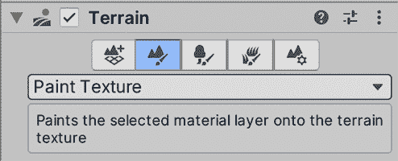

图 4.17：地形绘制纹理选项

1.  点击**编辑地形层… | 创建层**选项。

1.  在出现的**纹理选择器**窗口中找到并双击之前下载的地形纹理：

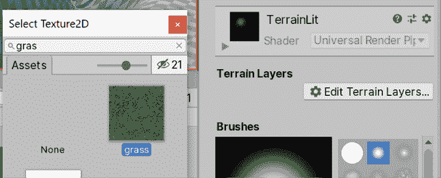

图 4.18：纹理绘制选择器

1.  你将看到纹理将立即应用到整个地形上。

1.  重复**步骤 4**和**步骤 5**以添加其他纹理。这次，你会发现该纹理不会立即应用。

1.  在**地形层**部分，选择你创建的新纹理以开始使用该纹理进行绘制。在我的例子中，我使用了泥地纹理。

1.  当你编辑地形时，在**画笔**部分，你可以选择并配置一个画笔来绘制地形。

1.  在**场景视图**中，绘制你想应用该纹理的区域。

1.  如果你的纹理图案过于明显，打开**新层 N**部分，该部分位于**画笔**部分之上，其中*N*是一个取决于你创建的层的数字。

每次你将纹理添加到地形上，你都会看到在**项目**视图中创建了一个名为**新层 N**的新资产。它包含你创建的地形层的数据，如果你需要，可以使用该资产在其他地形上。你还可以重命名该资产以赋予它一个有意义的名称。此外，你可以根据自己的需要将这些资产重新组织到自己的文件夹中。

1.  使用左侧的三角形打开该部分，并在**平铺设置**部分中增加**大小**属性，直到你找到一个图案不那么明显的合适大小：

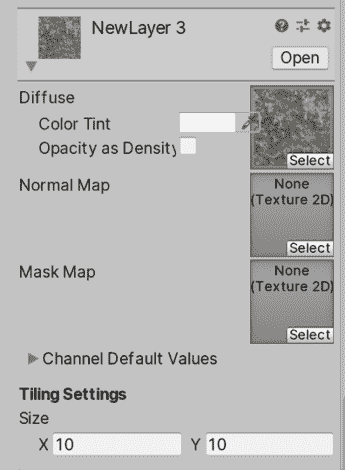

图 4.19：绘制纹理选项

1.  重复**步骤 4**到**12**，直到你将所有想要添加到地形中的纹理都应用完毕。在我的例子中，我将泥地纹理应用到河盆地，并为山丘使用了岩石纹理。对于岩石纹理，我将画笔的不透明度属性降低，以便更好地与山中的草地混合。你可以尝试在顶部添加一层雪，只为增添乐趣：

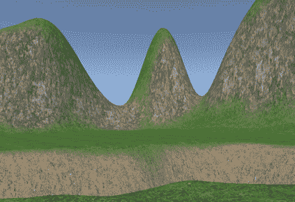

图 4.20：使用三种不同纹理绘制我们的地形的成果

当然，我们可以使用系统的大量高级工具来大幅改进这一点，但现在让我们保持简单。现在，让我们看看我们如何将 3D 模型集成到我们的游戏中。

## 集成网格

如果你选择我们之前下载的 3D 资产并点击其右侧的箭头，**项目窗口**中会出现一个或多个子资产。这意味着我们从资产商店（FBX 文件）下载的 3D 模型文件是定义 3D 模型的资产的容器：

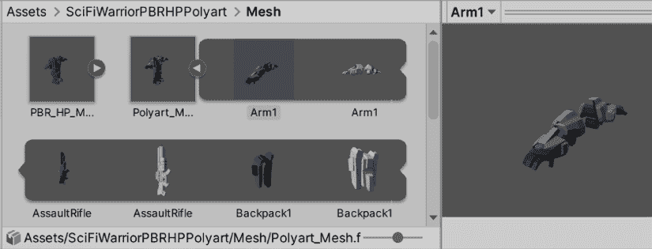

图 4.21：网格选择器

其中一些子资产是网格，它们是一系列定义模型几何形状的三角形集合。你可以在文件中至少找到一个这样的网格子资产，但你也可以找到几个，这可能会发生在你的模型由很多部分组成的情况下。例如，一辆车可以是一个单一的刚性网格，但这不会让你旋转它的轮子或打开它的车门；它将只是一个静态的车，如果车只是场景中的一个道具，这可能就足够了，但如果玩家将能够控制它，你可能需要对其进行修改。想法是，你的汽车的所有部件都是不同的 GameObject，彼此之间以某种方式相互关联，这样如果你移动其中一个，所有这些都会移动，但你仍然可以独立旋转它的部件。

当你将 3D 模型文件拖动到场景中（不是子资产）时，Unity 将根据艺术家创建的方式自动为每个部分创建所有对象及其适当的父级。你可以在层次结构中选择对象并探索其所有子对象以查看这一点：

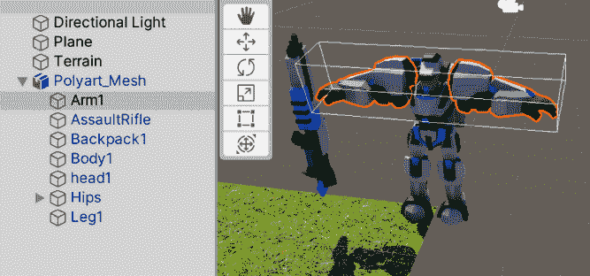

图 4.22：子对象选择

此外，你会发现每个对象可能都有自己的`Mesh Filter`和`Mesh Renderer`组件，每个组件仅渲染模型的那一部分。记住，`Mesh Filter`是一个具有渲染网格资产的引用的组件，因此`Mesh Filter`是使用我们之前讨论过的那些网格子资产的组件。在动画角色的案例中，你将找到`Skinned Mesh Renderer`组件，但我们将稍后在*第三部分，改进图形*中讨论该组件。

现在，当你将 3D 模型文件拖动到场景中时，你将得到一个类似于模型是一个 Prefab 并且你正在实例化的结果。但是 3D 模型文件比 Prefab 更有限，因为你不能对模型应用更改。如果你已经将对象拖动到场景中并编辑它以具有你想要的行为，我建议你创建一个 Prefab 以获得我们在*第二章*中讨论的所有好处，例如将更改应用于 Prefab 的所有实例等。永远不要从模型文件创建大量模型的实例——始终从基于该文件创建的 Prefab 创建它们，以便你可以向它添加额外的行为。

这就是 3D 网格的基本用法。现在，让我们探索纹理集成过程，这将使我们的 3D 模型更加详细。

## 集成纹理

可能你的模型已经应用了纹理，但整个模型都被应用了洋红色。如果是这种情况，这意味着资产没有准备好与你在创建项目时选择的**通用渲染管道（URP**）模板一起工作。

Asset Store 中的一些资产是由第三方编辑器创建的，可能旨在用于 Unity 的旧版本：

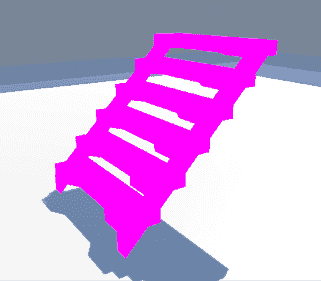

图 4.23：渲染带有错误材料或根本没有材料的网格

修复洋红色资产的一个选项是使用**渲染管线转换器**，这是一个工具，可以找到它们并将它们（如果可能）重新配置为与 URP 一起工作。为此，每次导入看起来像洋红色的资产时，都要执行以下步骤：

1.  前往**窗口 | 渲染 | 渲染管线转换器**。

1.  从下拉菜单中选择**内置到 URP**选项：

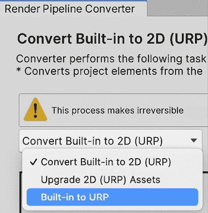

图 4.24：将旧资产升级到 URP

1.  滚动直到你看到**材料升级**复选框并勾选它。

1.  点击左下角的**初始化转换器**按钮。这将显示所有需要升级的材料列表。我们将在稍后讨论材料：

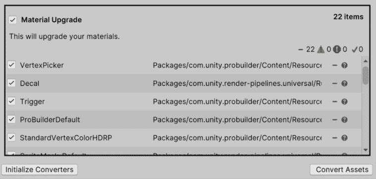

图 4.25：修复材料以与 URP 一起工作

1.  点击**转换资产**按钮，查看模型是否已修复。

你需要关闭窗口以便它检测到之前打开时不存在的新洋红色资产。这种方法的不利之处在于，有时它不会正确升级材料。幸运的是，我们可以通过手动重新应用对象的纹理来修复这个问题。即使你的资产工作得很好，我也建议你无论如何都重新应用你的纹理，这样你就可以更多地了解材料的概念。

纹理不是直接应用到对象上的。这是因为纹理只是控制模型外观的所有配置中的一个。为了改变模型的外观，你必须创建一个**材料**。材料是一个独立的资产，其中包含大量关于 Unity 如何渲染你的对象的设置。你可以将该资产应用到具有相同图形设置的多个对象上，如果你更改材料的设置，它将影响所有使用它的对象。它就像一个图形配置文件。

为了创建一个应用你对象纹理的材料，你需要遵循以下步骤：

1.  在**项目窗口**中，点击窗口左上角的加号（**+**）按钮。

1.  在该菜单中点击**材料**选项。

1.  为你的材料命名。这通常是我们要应用材料的资产名称（例如，`Car`，`Ship`，`Character`等等）。

1.  将创建的材料拖动到场景中的模型实例上。如果你用拖动的资产在对象上移动鼠标，你将能够看到该材料将如何预览，如果是新材料，它将是白色的。我们将在以下步骤中更改这一点。

1.  释放鼠标以应用材料。

1.  如果你的对象有多个部分，你需要将材料拖动到每个部分。

拖动材料将改变你拖动的对象的`MeshRenderer`组件的材料属性。

1.  选择材料并点击**基础贴图**属性左侧的圆圈（见*图 4.23*）。

1.  在**纹理选择器**中，点击您模型的纹理。仅通过观察可能很难找到纹理。通常，纹理的名称将与模型名称匹配。如果不匹配，您需要尝试不同的纹理，直到找到适合您物体的纹理。此外，您可能会发现几个与您的模型名称相同的纹理。只需选择看起来颜色合适的纹理，而不是那些看起来是黑白或浅蓝色的纹理；我们稍后会使用那些：

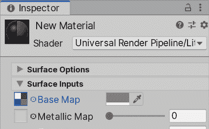

图 4.26：URP 材质的基础地图属性

通过这种方式，您已经成功通过材质将纹理应用到物体上。对于使用相同纹理的每个对象，只需拖动相同的材质。现在我们已经对如何应用模型纹理有了基本的了解，让我们学习如何在将模型散布到场景之前正确配置导入设置。

# 配置资产

正如我们之前提到的，艺术家习惯于在 Unity 之外创建艺术资产，这可能会导致该工具中看到的资产与 Unity 导入的资产之间的差异。例如，3D Studio Max 可以在厘米、英寸等中工作，而 Unity 则使用米。我们刚刚下载并使用了大量资产，但跳过了配置步骤来解决这些差异，所以现在让我们来看看。

在本节中，我们将介绍与导入资产相关的以下概念：

+   配置网格

+   配置纹理

让我们先讨论如何配置 3D 网格。

## 配置网格

为了更改模型的导入设置，您需要找到您下载的模型文件。包含 3D 模型的文件扩展名有多种，最常见的是`.fbx`文件，但您可能会遇到其他文件，如`.obj`、`.3ds`、`.blender`、`.mb`等。您可以通过扩展名来识别文件是否为 3D 网格：

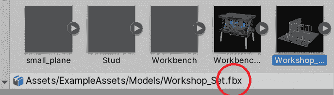

图 4.27：所选资产路径扩展

此外，您可以点击**资产**，在**检查器**中查看您可以在以下屏幕截图中看到的选项卡：

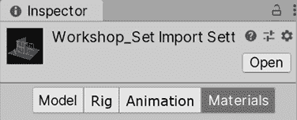

图 4.28：网格材质设置

现在您已经找到了 3D 网格文件，您可以正确地配置它们。目前，我们唯一需要考虑的是模型的正确比例。艺术家习惯于使用不同软件和不同设置进行工作；也许一位艺术家使用米作为其度量单位创建了模型，而其他艺术家则使用英寸、英尺等。当导入以不同单位创建的资产时，它们可能会不成比例，这意味着我们会得到人类比建筑物更大的结果等。

最佳解决方案是直接要求艺术家进行修复。如果所有资产都是在您的公司创作的，或者如果您使用了外部资产，您可以要求艺术家按照您公司的标准进行修复，但就目前而言，您可能是一位自学 Unity 的单个开发者。幸运的是，Unity 有一个设置，允许您在使用 Unity 之前重新缩放原始资产。为了更改对象的“**缩放因子**”，您必须执行以下操作：

1.  在您的**项目窗口**中定位 3D 网格。

1.  将其拖动到场景中。您会看到场景中会出现一个对象。

1.  使用**GameObject | 3D Object | Capsule**选项创建一个胶囊。

1.  将胶囊放在您拖入编辑器的模型旁边。看看缩放是否合理。想法是胶囊代表一个人类（2 米高），这样您就有了一个缩放的参考：

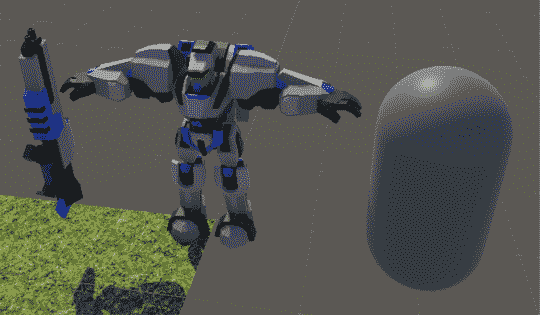

图 4.29：使用胶囊作为缩放参考

1.  如果模型比预期的大或小，请在项目窗口中再次选择网格（不是您拖到编辑器中的 GameObject 实例）并您将在检查器中看到一些导入设置。在图片中，我们可以认为模型具有良好的相对尺寸，但为了学习目的，请执行以下步骤。

1.  查找**缩放因子**属性并修改它，如果您的模型比预期小，则增加它；如果相反，则减少它：

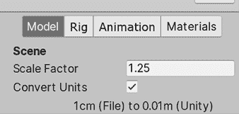

图 4.30：模型网格选项

1.  点击检查器底部的**应用**按钮。

1.  重复*步骤 6*和*步骤 7*，直到您得到期望的结果。

有许多其他选项可以配置，但现在我们先到此为止。现在，让我们讨论如何正确配置我们模型的纹理。

## 配置纹理

再次，这里有许多设置可以配置，但现在我们只关注**纹理大小**。想法是使用最适合该纹理使用的尺寸，这取决于许多因素。

首先要考虑的因素是对象将被看到的距离。如果您正在创建第一人称游戏，您可能会看到很多足够近的对象，这可以证明大纹理的合理性，但也许您有很多远处的对象，比如建筑物顶部的广告牌，您永远不会足够接近去看到细节，所以您可以使用较小的纹理。

另一个要考虑的因素是对象的重要性。如果您正在创建赛车游戏，您可能会在屏幕上有许多 3D 模型，它们将在屏幕上显示几秒钟，玩家永远不会关注它们；他们将会关注道路和其他车辆。在这种情况下，例如街道上的垃圾桶可以有一个小的纹理和低多边形模型，用户永远不会注意到这一点（除非他们停下来欣赏风景，但这是可以接受的）。

最后，你可以有一个俯视视角的游戏，它永远不会放大场景，所以在这个地方，第一人称游戏中具有大纹理的对象将具有更少的细节纹理。在以下图像中，你可以看到较小的飞船可以使用较小的纹理：

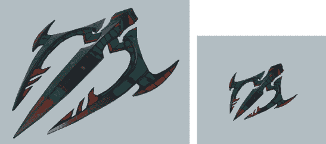

图 4.31：从不同距离看到的相同模型

纹理的理想大小是相对的。通常找到它的方法是改变其大小，直到你找到在游戏中最接近的位置可以看到对象时，最小的可能尺寸且质量尚可。这是一个试错法。为了做到这一点，你可以执行以下操作：

1.  定位 3D 模型并将其放入场景中。

1.  将场景视图相机放置在一个可以显示对象在游戏中可能最大尺寸的位置。例如，在一个**第一人称射击**（**FPS**）游戏中，相机可以几乎紧挨着对象，而在一个俯视游戏中，它会在对象上方几米处。同样，这取决于你的游戏。记住，我们的游戏是第三人称射击游戏。

1.  在与包一起导入的文件夹中或从之前创建的材料中找到并选择对象使用的纹理。它们通常具有`.png`、`.jpg`或`.tif`扩展名。

1.  在检查器中，查看**最大尺寸**属性并减小它，尝试下一个更小的值。例如，如果纹理是**2048**，尝试**1024**。

1.  点击**应用**并检查场景视图，看看质量是否大幅下降，或者变化是否不明显。你会感到惊讶的。

1.  重复*步骤 4*到*5*，直到你得到一个质量差的成果。在这种情况下，只需提高之前的分辨率以获得可接受的质量。当然，如果你针对 PC 游戏，你可以期望比移动游戏更高的分辨率。

现在你已经导入、集成和配置了你的对象，让我们用这些资产创建玩家的基础。

## 组装场景

让我们开始用我们下载的环境包替换我们的原型基础。为此，你必须执行以下操作：

1.  在我们之前导入的**环境**包中，找到包含场景不同部分所有模型的文件夹，并尝试找到一个角落。你可以在**项目窗口**中的搜索栏中搜索`corner`关键字：

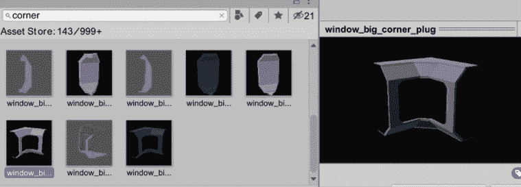

图 4.32：网格选择器

1.  在我具体的情况下，角落的外侧和内侧是分开的模型，所以我需要将它们放在一起。

1.  将其放置在原型基础的任何角落相同的位置：

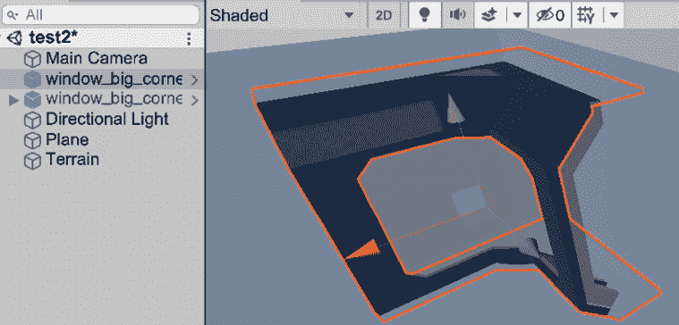

图 4.33：将网格定位在占位符上进行替换

1.  找到与那个角落相连以创建墙壁的正确模型。再次，你可以在**项目窗口**中尝试搜索`wall`关键字。

1.  实例化它并定位，使其与角落相连。如果它不能完美地适应，不要担心；你将在必要时稍后检查场景。

你可以选择一个对象并按*V*键来选择所选对象的顶点。然后你可以拖动它，点击变换 Gizmo 中间的矩形，并将其直接指向另一个对象的顶点。这被称为**顶点吸附**。它允许你精确地连接场景中的两个部件。

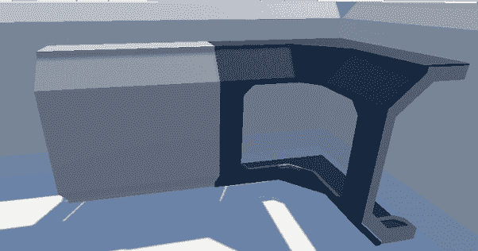

图 4.34：连接两个模块

1.  重复放置墙壁，直到达到玩家基地的另一端并放置另一个角落。你可能得到的墙壁比原始原型略大或略小，但这没关系：

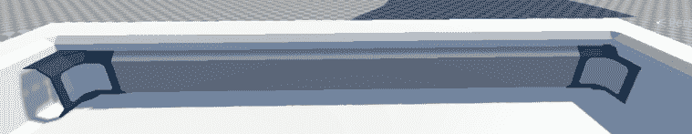

图 4.35：连接的模块链

在按住*Ctrl*键（Mac 上的*Command*键）的同时移动对象，可以固定对象的位置，以便墙的克隆可以轻松地定位在旁边。另一个选项是在检查器中手动设置`Transform`组件的`Position`属性。

1.  完成剩余的墙壁，并销毁我们在 ProBuilder 中制作的原始立方体。请记住，这个过程很慢，你需要有耐心。

1.  通过寻找地板砖并在整个表面上重复它们来添加地板：

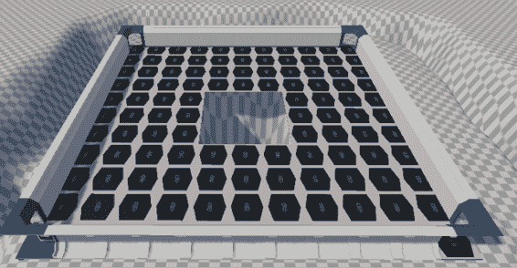

图 4.36：带有坑洞的地板模块

1.  使用包中的其他模块化部件添加你想要的任何细节。

1.  将所有这些部件放入一个名为`Base`的容器对象中。请记住创建一个空对象并将基础部件拖入其中：

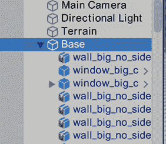

图 4.37：网格子资产

经过大量练习后，你将逐渐积累关于模块化场景设计常见陷阱和良好实践的丰富经验。所有包都有不同的模块化设计理念，因此你需要适应它们。

# 摘要

在本章中，我们学习了如何导入模型和纹理并将它们集成到场景中。我们讨论了如何将纹理应用到地形上，如何用模块化模型替换我们的原型网格，如何将这些纹理应用到它们上，以及如何根据对象的用途适当配置资产，同时考虑到几个标准。

通过这些，我们已经完成了这本书的*第一部分*，并讨论了我们在整本书中会使用的几个基本 Unity 概念。在*第二部分*中，我们将开始编写游戏的游戏玩法，比如玩家的移动和健康系统。我们将开始学习如何创建自己的组件来为我们的对象添加行为以及脚本的基本结构。
