# 6

# 实现运动和生成

在上一章中，我们学习了脚本的基础知识，所以现在让我们为我们的游戏创建第一个脚本。我们将看到如何使用`Transform`组件通过脚本移动对象的基础知识，这将应用于我们的玩家通过键盘按键的运动、子弹的恒定运动以及其他对象的运动。此外，我们还将看到如何在游戏中创建和销毁对象，例如玩家和敌人射击的子弹以及敌人波生成器。这些操作可以在多个场景中使用，所以我们将探索几个以加强这个概念。

在本章中，我们将探讨以下脚本概念：

+   实现运动

+   实现生成

+   使用新的输入系统

我们将首先通过脚本组件来控制我们的角色通过键盘移动，然后我们将让我们的玩家射击子弹。需要考虑的是，我们将首先看到每个部分的 C#版本，然后展示视觉脚本等效版本。

# 实现运动

几乎游戏中的每个对象都以某种方式移动：玩家角色通过键盘；敌人通过 AI；简单的向前移动的子弹等等。在 Unity 中有几种移动对象的方法，所以我们将从最简单的一种开始，即通过`Transform`组件。

在本节中，我们将探讨以下运动概念：

+   通过`Transform`移动对象

+   使用输入

+   理解 Delta Time

首先，我们将探讨如何在脚本中访问`Transform`组件以驱动玩家运动，以便稍后根据玩家的键盘输入应用运动。最后，我们将探索 Delta Time 的概念以确保在每台计算机上运动速度的一致性。我们将开始学习`Transform` API 以创建一个简单的运动脚本。

## 通过 Transform 移动对象

`Transform`是包含对象的平移、旋转和缩放的组件，因此每个运动系统，如物理或路径查找，都会影响此组件。有时，我们想要通过创建自己的脚本来根据我们的游戏以特定方式移动对象，该脚本将处理我们需要的运动计算并修改`Transform`以应用它们。

这里隐含的一个概念是组件会改变其他组件。在 Unity 中编码的主要方式是创建与其他组件交互的组件。在这里，想法是创建一个可以访问另一个并告诉它做某事：在这种情况下，移动。要创建一个告诉`Transform`移动的脚本，请执行以下操作：

1.  创建并添加一个名为`PlayerMovement`的脚本到我们的角色中，就像我们在上一章中所做的那样。在这种情况下，它将是之前下载的动画 3D 模型（从**项目**视图拖动 3D 资产到场景中）。记住在创建后，将脚本移动到**脚本**文件夹中：

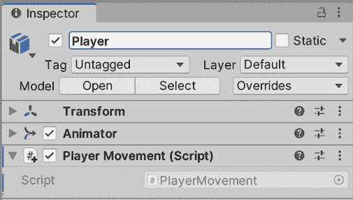

图 6.1：在角色中创建玩家移动脚本

1.  双击创建的脚本资产以打开 IDE 进行代码编辑。

1.  我们正在移动，这种移动应用于每个帧。因此，这个脚本将只使用`Update`函数或方法，我们可以移除`Start`（移除未使用的函数是一种良好的实践）：

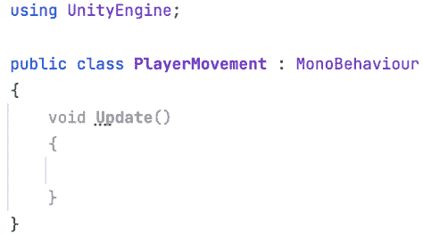

图 6.2：仅包含 Update 事件函数的组件

1.  要使我们的对象沿着其局部前进轴（*z 轴*）移动，请将`transform.Translate(0,0,1);`行添加到`Update`函数中，如图*图 6.3*所示：

每个组件都继承了一个`Transform`字段（具体来说，是一个**获取器**），它是对放置该组件的 GameObject 的`Transform`的引用；它代表我们组件的兄弟`Transform`。通过这个字段，我们可以访问`Transform`的`Translate`函数，该函数将接收应用于 x、y 和 z 局部坐标的偏移量。

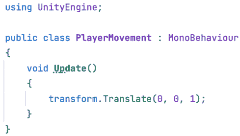

图 6.3：一个简单的向前移动脚本

1.  保存文件并玩游戏以查看移动。确保相机指向角色，以便正确查看脚本的效果。

您会注意到玩家移动得太快。这是因为我们正在使用固定的 1 米速度，并且因为`Update`在所有帧上执行，所以我们每帧移动 1 米。在一个标准的 30 FPS 游戏中，玩家每秒将移动 30 米，这太多了，但可能我们的计算机以远高于这个 FPS 的速度运行游戏。我们可以通过添加`speed`字段并使用编辑器中设置的值而不是固定的 1 米值来控制玩家的速度。您可以在*图 6.4*中看到一种实现方式，但请记住我们在*第五章*，*C#和视觉脚本简介*中讨论的其他选项：

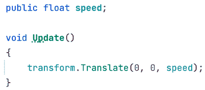

图 6.4：创建速度场并将其用作移动脚本的 z 速度

现在，如果您保存脚本以应用更改并在编辑器中设置玩家的**速度**，您就可以玩游戏并查看结果。在我的情况下，我使用了`0.1`，但您可能需要另一个值（关于这一点，请参阅*理解 Delta 时间*部分）：

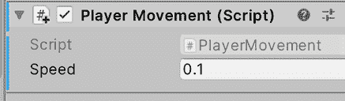

图 6.5：设置每帧 0.1 米的速度

现在，对于视觉脚本版本，首先请记住不要混合我们的脚本的 C#和视觉脚本版本，不是因为不可能，而是因为我们现在想保持事情简单。因此，您可以从玩家对象中删除脚本并添加视觉脚本版本，或者您可以创建两个玩家对象并启用和禁用它们以尝试两种版本。我建议为脚本的 C#版本创建一个项目，然后创建第二个项目以实验视觉脚本版本。

此脚本的视觉脚本图将如下所示：

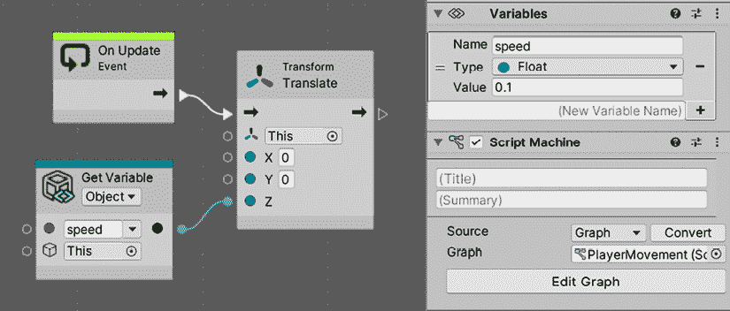

图 6.6：设置每帧 0.1 米的速度

如您所见，我们在`Player`GameObject 中添加了一个**脚本机**组件。然后，我们在**脚本机**组件中按下**新建**按钮，创建了一个名为`PlayerMovement`的新**图**。我们还创建了一个名为`speed`的**浮点**变量，其值为`0.1`。在**图**中，我们添加了**更新**事件节点并将其连接到**Transform**的**平移（X,Y,Z）**节点，这与 C#版本类似，将沿着对象的局部轴移动。最后，我们将**平移**的**Z**参数引脚连接到表示我们在 GameObject 中创建的速度的`GetVariable`节点。如果您将这个**图**与我们在 C#版本中使用的代码进行比较，它们基本上是相同的**更新**方法和`Translate`函数。如果您不记得如何创建这个**图**，您可以回到*第五章*，*C#和视觉脚本简介*，回顾这个过程。

您会注意到玩家会自动移动。现在让我们看看如何根据**玩家输入**（如键盘和鼠标）来执行移动。

## 使用输入

与 NPC 不同，我们希望玩家的移动由玩家的输入驱动，基于他们按下的键、鼠标移动等。为了知道是否按下了某个键，例如*向上*箭头，我们可以使用`Input.GetKey(KeyCode.W)`这一行，它将返回一个布尔值，指示`KeyCode`枚举中指定的键是否被按下，在这种情况下是*W*。我们可以将`GetKey`函数与`If`语句结合使用，以便在按键时执行翻译。

让我们按照以下步骤实现键盘移动：

1.  使用下面的代码，使向前移动仅在按下*W*键时执行，如下一个截图所示：

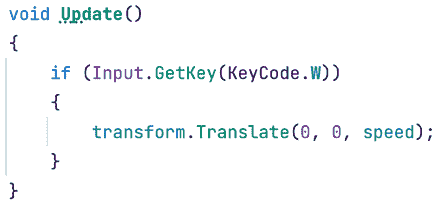

图 6.7：在按下 W 键之前条件化移动

1.  我们可以通过添加更多的`If`语句来添加其他移动方向，例如向后移动使用*A*和*D*来移动左右，如下一个截图所示。注意我们如何使用负号在需要沿相反轴方向移动时反转速度：

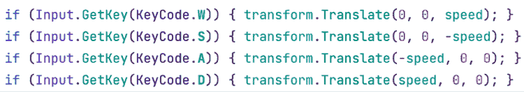

图 6.8：检查 W、A、S 和 D 键的按下状态

1.  如果您也想考虑箭头键，您可以在`if`语句中使用`OR`，如下面的截图所示：

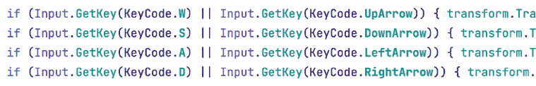

图 6.9：检查 W、A、S、D 和箭头键的按下状态

1.  保存更改，并在**播放**模式下测试移动。

需要注意的是，首先，我们还有另一种方法通过配置输入管理器将多个键映射到单个动作——这是一个可以创建动作映射的地方。其次，在撰写本文时，Unity 发布了一个比这个更可扩展的新输入系统。

目前，我们将使用这个，因为它足够简单，可以使我们的 Unity 脚本入门更容易，但在具有复杂输入的游戏中，建议寻找更高级的工具。

现在，对于可视化脚本版本，图表将看起来像这样：

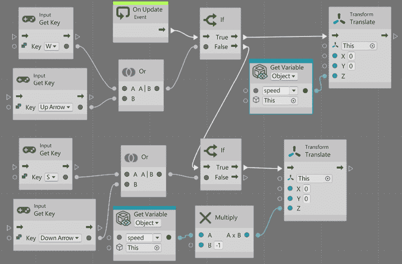

图 6.10：可视化脚本中的输入移动

如你所见，与 C#版本相比，图表的大小显著增加，这可以作为开发者为什么更喜欢编码而不是使用可视化工具的例子。当然，我们有几种方法可以将这个图表拆分成更小的块，使其更易于阅读，并且还需要考虑我需要将节点挤压到同一张图片中。此外，在图表中，我们只看到了用于前进和后退的示例图表，但你可以很容易地根据这个图表推断出横向移动所需的步骤。像往常一样，你还可以检查项目的 GitHub 仓库以查看完成的文件。

观察图表，你可以快速观察到它与 C#版本的相似之处；我们将`If`节点链接到**更新事件**节点，如果第一个`If`节点条件为真，它将在玩家的前方方向执行**平移**。如果该条件为假，我们将**False**输出节点链接到另一个检查其他按键压力的**If**节点，在这种情况下，我们使用**乘法（标量）**节点来反转速度。

你可以注意到像`If`这样的节点，它们有多个**流程输出**引脚来分支代码的执行。

你还可以注意到**获取键（Key）**节点的使用，这是之前使用的相同**获取键**函数的可视化脚本版本。当你在**搜索**框中查看这个节点时，你会看到该函数的所有版本，在这种情况下，我们选择了**GetKey(Key)**版本；接收名称（字符串）的那个版本工作方式不同，我们不会介绍那个版本：

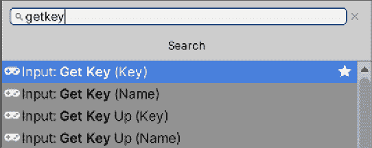

图 6.11：所有版本的输入获取键

我们还使用了`Or`节点将两个**获取键（Key）**函数组合成一个条件，提供给`If`。这些条件运算符可以在**搜索**框的**逻辑**类别中找到：

图 6.12：布尔逻辑运算符

需要强调的一点是使用**乘法**节点将速度变量的值乘以-1。我们需要创建一个**浮点字面值**节点来表示-1 这个值。接下来，当然所有程序员都会注意到我们如何使用`If`节点的`True`和`False`输出引脚存在一些限制，但我们会稍后解决这个问题。最后，考虑到这种实现方式在第一个输入成功读取时可能会阻塞第二个输入读取；当我们在本节稍后添加旋转时，我们将讨论一种修复这个问题的方法。

现在，让我们实现鼠标控制。在本节中，我们只涵盖鼠标移动引起的旋转；在下一节中我们将实现发射子弹：*实现生成*。在鼠标移动的情况下，我们可以得到一个值，表示鼠标在水平和垂直方向上移动了多少。这个值不是一个布尔值，而是一个数字：通常被称为**轴**的输入类型。轴的值将指示移动的强度，而该数字的符号将指示方向。例如，如果 Unity 的`"Mouse X"`轴显示`0.5`，这意味着鼠标以适中的速度向右移动，但如果显示`-1`，则快速向左移动，如果没有移动，则显示`0`。游戏手柄的摇杆也是如此；名为**水平**的轴表示常见摇杆中左摇杆的水平移动，因此如果玩家将摇杆完全向左拉，它将显示`-1`。

我们可以创建自己的轴来映射其他基于游戏手柄压力的常见控制，但对我们游戏来说，默认的轴就足够了。要检测鼠标移动，请按照以下步骤操作：

1.  在`Update`函数内部，紧挨着移动的`if`语句，使用`Input.GetAxis`函数，如以下截图所示，将这一帧鼠标移动的值存储到一个变量中：

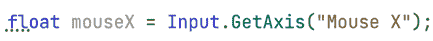

图 6.13：获取鼠标的水平移动

1.  使用`transform.Rotate`函数来旋转角色。这个函数接收 x、y 和 z 轴上要旋转的度数。在这种情况下，我们需要水平旋转，所以我们将使用鼠标移动值作为 y 轴旋转，如下一个截图所示：

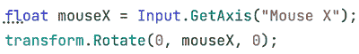

图 6.14：根据鼠标移动水平旋转对象

1.  如果你保存并测试这段代码，你会注意到角色会旋转，但速度非常快或非常慢，这取决于你的电脑。记住，这类值需要可配置，所以让我们在编辑器中创建一个`rotationSpeed`字段来配置玩家的速度：

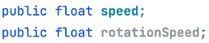

图 6.15：速度和旋转速度字段

1.  现在，我们需要将鼠标移动值乘以速度，因此，根据`rotationSpeed`的值，我们可以增加或减少旋转量。例如，如果我们设置旋转速度为`0.5`，将这个值乘以鼠标移动将使对象以之前速度的一半旋转，如下面的截图所示：

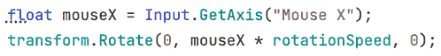

图 6.16：将鼠标移动乘以旋转速度

1.  保存代码并返回编辑器设置旋转速度值。如果你不这样做，对象将不会旋转，因为浮点类型字段的默认值是`0`：

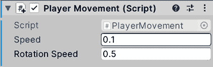

图 6.17：设置旋转速度

实现旋转的视觉脚本添加将看起来像这样：

图 6.18：在视觉脚本中旋转

这里要注意的第一件事是**Sequence**节点的使用。一个输出引脚只能连接到另一个节点，但在这个情况下，**On Update**需要执行两件不同的事情，旋转和移动，每件都是独立的。**Sequence**是一个节点，它将依次执行所有输出引脚，而不考虑每个节点的结果。你可以在**Steps**输入框中指定输出引脚的数量；在这个例子中，两个就足够了。

在输出引脚`0`，第一个引脚，我们添加了旋转代码，鉴于它基本上与移动代码相同，只是节点略有不同（**Rotate (X, Y, Z)**和**GetAxis**）。然后，我们将`If`节点连接到输出引脚 1，这是我们在本节开头所做的。这将导致旋转先执行，然后是移动。

关于我们之前提到的限制，基本上是因为我们无法同时执行**前进**和**后退**旋转，因为如果按下前进移动键，第一个`If`语句将为真。由于后退键旋转是在假输出引脚上检查的，所以在这种情况下它们不会被检查。当然，作为我们的第一个移动脚本，可能已经足够了，但考虑横向移动。如果我们继续使用`True`和`False`输出引脚来链接`If`语句，我们将面临只能在一个方向上移动的情况。因此，我们不能组合例如`Forward`和`Right`来斜向移动。

解决这个问题的简单方法是将`If`节点放在序列中而不是链接它们，这样所有的`If`节点都会被检查，就像原始的 C#一样。你可以在下一张图片中看到一个例子：

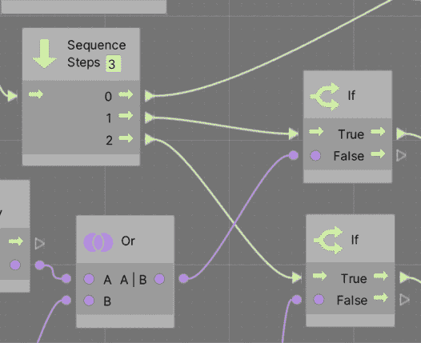

图 6.19：序列化 If 语句

在这里需要考虑的是，可以通过右键单击连接它们的线条两端圆形引脚来移除`If`语句和任何类型的节点的链接。现在我们已经完成了我们的移动脚本，我们需要通过探索 Delta 时间概念来对其进行细化，以便在每台机器上都能正常工作。

## 理解 Delta 时间

Unity 的**Update**循环以计算机能够达到的速度执行。你可以在 Unity 中指定所需的帧率，但能否实现这完全取决于你的电脑能否达到这个速度，这又取决于许多因素，而不仅仅是硬件，所以你不能期望总是有稳定的 FPS。你必须编写代码来处理所有可能的情况。我们当前的脚本是以每帧一定的速度移动的，这里的**每帧**部分很重要。

我们已经将移动速度设置为 0.1，所以如果我的电脑以 120 FPS 运行游戏，玩家将每秒移动 12 米。那么，在游戏以 60 FPS 运行的电脑上会发生什么呢？正如你可能猜到的，它将只以每秒 6 米的速度移动，使得我们的游戏在不同电脑上具有不一致的行为。这就是 Delta 时间发挥作用的地方。

**时间差**是一个告诉我们自上一帧以来过去了多少时间的值。这个时间很大程度上取决于我们的游戏图形、实体数量、物理体、音频以及无数将决定你的电脑处理帧速度的方面。例如，如果你的游戏以 10 FPS 运行，这意味着在一秒钟内，你的电脑可以处理`Update`循环 10 次，这意味着每个循环大约需要`0.1`秒；在帧中，时间差将提供这个值。在下一张图中，你可以看到一个例子，4 个帧处理不同时间，这在现实生活中可能会发生：

图 6.20：游戏不同帧中的时间差值变化

在这里，我们需要编写代码以将移动的**每帧**部分改为**每秒**；我们需要在不同电脑上保持每秒一致的移动。实现这一点的办法是按比例移动到时间差：时间差值越高，帧越长，移动应该越远，以匹配自上次更新以来经过的真实时间。我们可以用`0.1`米每秒来考虑我们的`speed`字段当前值；我们的时间差说`0.5`意味着半秒已经过去，所以我们应该移动一半的速度，`0.05`。

经过两帧一秒后，帧移动的总和（2 x 0.05）与目标速度`0.1`相匹配。时间差可以解释为已经过去的一秒的百分比。

要让时间差影响我们的移动，我们只需在每一帧将速度乘以时间差即可，因为时间差可能每帧都不同，所以让我们这样做：

1.  我们使用 Time.deltaTime 来访问时间差。我们可以通过在每次 Translate 中乘以时间差来开始影响移动：

图 6.21：将速度乘以时间差

1.  我们可以通过链式连接鼠标和速度乘法来对旋转速度做同样的事情：

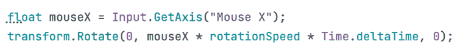

图 6.22：将时间差应用于旋转代码

1.  如果你保存并播放游戏，你会注意到移动会比之前慢。这是因为现在`0.1`是每秒的移动量，意味着每秒 10 厘米，这相当慢；尝试增加这些值。在我的情况下，速度为`10`，旋转速度为`180`就足够了，但旋转速度取决于玩家的偏好灵敏度，这可以配置，但让我们留到以后再说。

旋转的可视化脚本更改将看起来像这样：

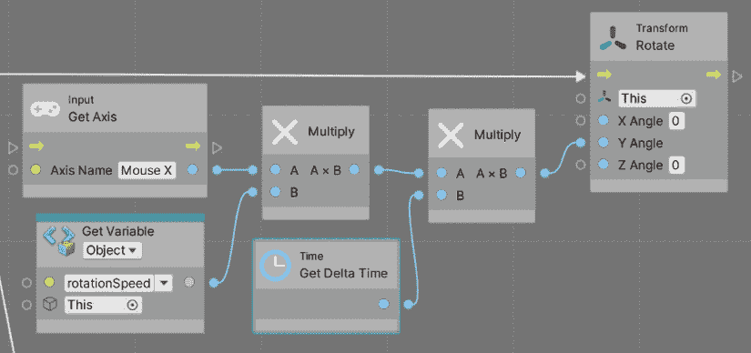

图 6.23：将时间差应用于旋转可视化脚本

对于移动，你可以轻松地从这个例子中推断出来，或者记得检查 GitHub 上的项目。我们只是简单地连接了另一个**乘法**节点和**获取时间差**。

我们刚刚学习了如何混合 Unity 的输入系统，它告诉我们关于键盘、鼠标和其他输入设备的状态，以及基本的`Transform`移动函数。这样，我们可以开始使我们的游戏感觉更加动态。

现在我们已经完成了玩家的移动，让我们讨论如何使用`Instantiate`函数让玩家射击子弹。

# 实现生成

我们已经在编辑器中创建了大量的对象来定义我们的关卡，但一旦游戏开始，根据玩家的操作，必须创建新的对象以更好地适应玩家交互生成的场景。敌人可能过一段时间后出现，或者必须根据玩家的输入创建子弹；即使敌人死亡，也有可能生成一个道具。这意味着我们无法事先创建所有必要的对象，而应该动态地创建它们，这通过脚本完成。

在本节中，我们将检查以下生成概念：

+   生成对象

+   定时动作

+   销毁对象

我们将开始看到 Unity 的`Instantiate`函数，它允许我们在运行时创建 Prefab 的实例，例如在按下一个键时，或者以基于时间的模式，例如让我们的敌人每隔一定时间发射一次子弹。此外，我们还将学习如何销毁这些对象，以防止场景因为处理过多的对象而开始表现不佳。

让我们从根据玩家输入如何射击子弹开始。

## 生成对象

要在运行时或**播放**模式下生成一个对象，我们需要描述该对象，它具有哪些组件，以及其设置和可能的子对象。你可能在这里想到了 Prefab，你是对的；我们将使用一个指令来告诉 Unity 通过脚本创建 Prefab 的实例。记住，Prefab 的实例是基于 Prefab 创建的对象——基本上是原始对象的克隆。

我们将从射击玩家的子弹开始，所以首先让我们按照以下步骤创建子弹 Prefab：

1.  在 GameObject | 3D Object | 球体中创建一个球体。如果你想，可以用另一个子弹模型替换球体网格，但在这个例子中我们将保持球体。

1.  将球体重命名为`Bullet`。

1.  通过点击项目窗口的**+**按钮，选择**材质**选项，并将其命名为`Bullet`来创建一个材质。请记住将其放置在`Materials`文件夹内。

1.  在材质中勾选**发射**复选框，并将**发射贴图**和**基础贴图**颜色设置为红色。记住，发射颜色会使子弹发光，尤其是在我们的后期处理体积中带有光晕效果：

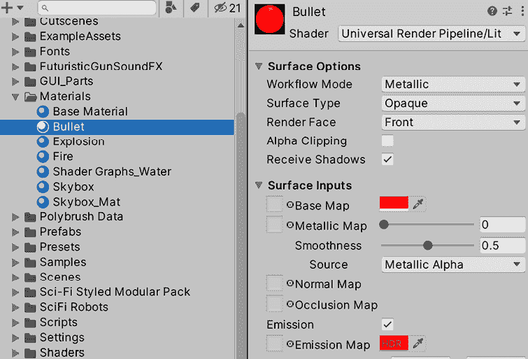

图 6.24：创建带有发射颜色的红色子弹材质

1.  通过将材质拖动到球体上来应用**材质**。

1.  将缩放设置为更小的值——`0.3, 0.3, 0.3`在我的情况下是有效的。

1.  创建一个名为`ForwardMovement`的脚本，使子弹以固定的速度不断向前移动。你可以用 C#和视觉脚本创建它，但为了简单起见，我们在这个例子中只使用 C#。

    我建议你先自己尝试解决这个问题，然后在下一步查看带有解决方案的截图，作为一个小挑战来回顾我们之前看到的运动概念。如果你不记得如何创建脚本，请查看*第五章*，*C#和视觉脚本简介*，并查看前面的部分以了解如何移动对象。

1.  下一个截图显示了脚本应该是什么样子：

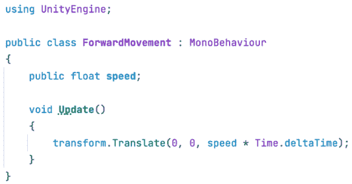

图 6.25：一个简单的 ForwardMovement 脚本

1.  将脚本（如果尚未添加）添加到子弹中，并将速度设置为合适的值。通常，子弹比玩家移动得快，但这取决于你想要获得的游戏体验。在我的情况下，`20`就足够了。通过将子弹放置在玩家附近并玩游戏来测试它：

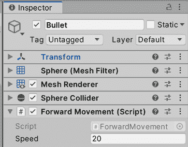

图 6.26：子弹中的 ForwardMovement 脚本

1.  将子弹`GameObject`实例拖到`Prefab`文件夹中创建一个**子弹**预制件。记住，预制件是一个资产，它描述了创建的子弹，就像创建子弹的蓝图：

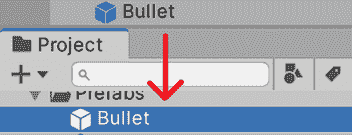

图 6.27：创建预制件

1.  从场景中移除原始子弹；当玩家按下键时（如果有的话），我们将使用预制件来创建子弹。

现在我们已经有了子弹预制件，是时候在玩家按下键时实例化它（克隆它）了。为此，请按照以下步骤操作：

1.  创建并添加一个名为`PlayerShooting`的脚本到玩家的`GameObject`中，并打开它。

1.  我们需要一种方法让脚本能够访问预制件，以便知道从我们可能在我们项目中拥有的几十个预制件中选择哪一个。我们脚本所需的所有数据，这些数据取决于期望的游戏体验，都是以字段的形式存在的，例如迄今为止使用的速度字段。因此，在这种情况下，我们需要一个`GameObject`类型的字段——一个可以引用或指向特定预制件的字段，这可以通过编辑器来设置。

1.  添加字段代码看起来像这样：

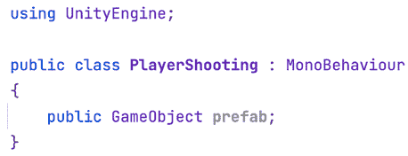

图 6.28：预制件参考字段

如你所猜，我们可以使用`GameObject`类型来不仅引用预制件，还可以引用其他对象。想象一下，一个敌人 AI 需要引用玩家对象来获取其位置，使用`GameObject`来连接这两个对象。这里的技巧是考虑到预制件只是存在于场景外的普通`GameObject`；你无法看到它们，但它们在内存中，准备被复制或实例化。你只能通过在场景中放置的副本或实例来看到它们，就像我们迄今为止所做的那样，通过脚本或编辑器。

1.  在编辑器中，点击属性右侧的圆圈并选择 `Bullet` Prefab。另一种选择是将 `Bullet` Prefab 直接拖到属性上。这样，我们告诉我们的脚本要射击的子弹将是那个。记住，要拖动 Prefab 而不是场景中的子弹（那个现在应该已经被删除了）：

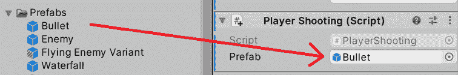图 6.29：设置 Prefab 引用以指向子弹

1.  当玩家按下左鼠标按钮时，我们将射击子弹，所以请在 Update 事件函数中放置适当的 if 语句来处理它，就像下一个截图所示：

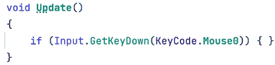

图 6.30：检测左鼠标按钮的压力

1.  你会注意到这次，我们使用了 GetKeyDown 而不是 GetKey，前者是一种检测键压力开始的确切帧的方法；这个 if 语句只会在那个帧执行其代码，直到键被释放并重新按下，它才不会再次进入。这是防止子弹在每一帧生成的一种方法，但为了好玩，你可以尝试使用 GetKey 来检查它会如何表现。此外，KeyCode.Mouse0 是属于左键点击的鼠标按钮编号，KeyCode.Mouse1 是右键点击，KeyCode.Mouse2 是中键点击。

1.  使用 Instantiate 函数来克隆 Prefab，将对其的引用作为第一个参数传递。这将创建一个之前提到的 Prefab 的副本，并将其放置在场景中：

    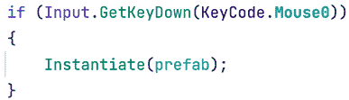

    图 6.31：实例化 Prefab

如果你保存脚本并播放游戏，你会注意到当你按下鼠标时，会生成子弹，但可能不是你期望的位置。如果你看不到它，试着检查 Hierarchy 中的新对象；它会在那里的。这里的问题是我们没有指定期望的生成位置，我们有两种方法可以设置它，我们将在接下来的步骤中看到：

1.  第一种方法是使用从 `MonoBehaviour` 继承的 `transform.position` 和 `transform.rotation` 继承字段，这将告诉我们我们的当前位置和旋转。我们可以将它们作为 `Instantiate` 函数的第二个和第三个参数传递，这样它就会明白这是我们希望子弹出现的位置。记住，设置旋转很重要，这样子弹就会面向与玩家相同的方向，以便它能够那样移动：

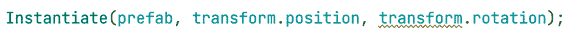

图 6.32：在我们的位置和旋转中实例化 Prefab

1.  第二种方法是通过使用 `Instantiate` 的前一个版本，但保存函数返回的引用，这将指向 Prefab 的克隆。这允许我们从中更改任何我们想要的内容。在这种情况下，我们需要以下三行；第一行将实例化和捕获克隆引用，第二行将设置位置，第三行设置旋转。我们还将使用克隆的 `transform.position` 字段，但这次使用 `=`（赋值）运算符来更改其值：

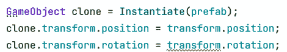

图 6.33：在特定位置实例化 Prefab 的较长版本

记住，您可以在 *前言* 中链接的项目 GitHub 仓库查看完整的脚本。现在您可以使用其中一个版本保存文件并尝试射击。

如果您尝试到目前为止的脚本，您应该会看到子弹在玩家的位置生成，但在我们的情况下，它可能是在地板上。这里的问题是玩家的角色枢轴就在那里，通常，每个类人角色都有枢轴在他们的脚上。我们有几种方法可以解决这个问题。最灵活的一种是创建一个 **射击点**，它是玩家的一个空 GameObject 子对象，放置在我们想要子弹生成的位置。我们可以使用该对象的位置而不是玩家的位置，通过以下步骤：

1.  在 **GameObject | 创建空对象** 中创建一个空 `GameObject`。将其重命名为 `ShootPoint`。

1.  将它作为玩家的 GameObject 的子对象，放置在您想要子弹出现的位置，可能稍微高一点和更向前一些：

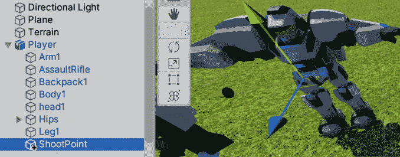

图 6.34：放置在角色内部的空 ShootPoint 对象

1.  如往常一样，要访问另一个对象的数据，我们需要一个对该对象的引用，例如 Prefab 引用，但这次它需要指向我们的射击点。我们可以创建另一个 `GameObject` 类型字段，但这次拖动 `ShootPoint` 而不是 Prefab。脚本和对象集将如下所示：

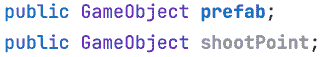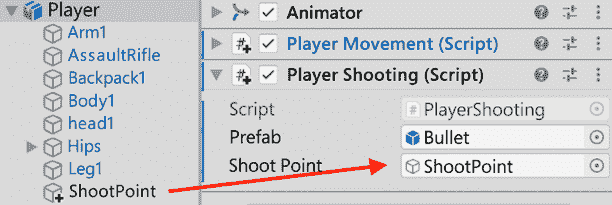

图 6.35：Prefab 和 ShootPoint 字段以及它们在编辑器中的设置

1.  我们可以通过使用 `ShootPoint` 的 `transform.position` 字段再次访问其位置，如下面的截图所示：

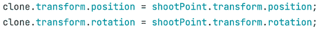

图 6.36：Prefab 和 ShootPoint 字段以及它们在编辑器中的设置

**ForwardMovement** 的视觉脚本版本将看起来像这样：

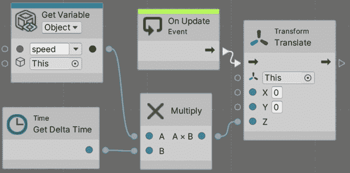

图 6.37：使用视觉脚本的前进运动

`PlayerShooting` 将看起来像这样：

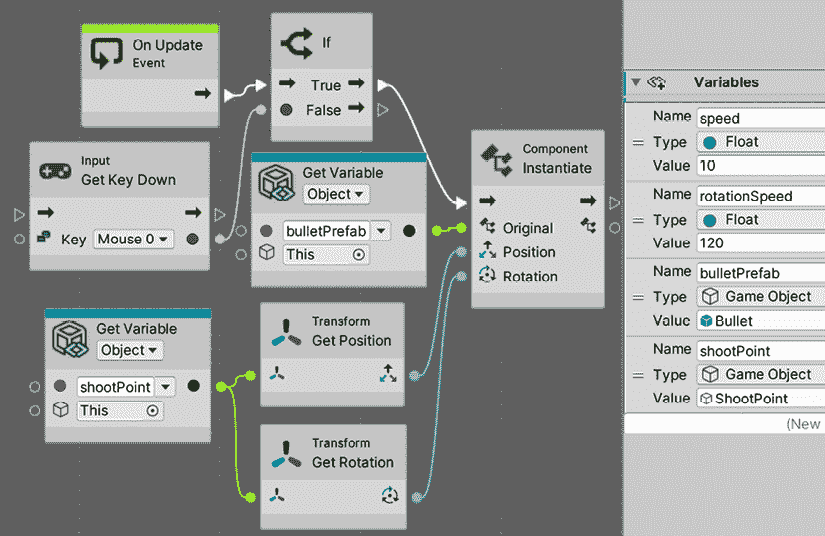

图 6.38：PlayerShooting 视觉脚本中的实例化

如您所见，我们添加了一个名为**Player Shooting**的新图的第二个**脚本机器**组件。我们还添加了一个新的变量，`bulletPrefab`，类型为`GameObject`，并将**Bullet**预制体拖动到其中，以及一个名为`shootPoint`的第二个`GameObject`类型变量，以便引用子弹的生成位置。脚本的其他部分基本上是 C#版本的对应物，没有太大差异。这里要强调的是，我们如何将`Transform GetPosition`和`Transform GetRotation`节点连接到`shootPoint`所属的`GetVariable`节点；这样，我们就可以访问射击点的位置和旋转。如果您没有指定，它将使用玩家的位置和旋转，在我们的模型中，这位于玩家角色的脚下。

您会注意到现在使用鼠标射击和旋转存在问题；当移动鼠标进行旋转时，指针将超出**游戏视图**，当点击时，您会意外地点击编辑器，失去对**游戏视图**的焦点，因此您需要再次点击**游戏视图**以恢复焦点并再次使用输入。防止这种情况的一种方法是游戏时禁用光标。为此，请按照以下步骤操作：

1.  将一个`Start`事件函数添加到我们的`Player Movement Script`脚本中。

1.  将以下截图中的两行代码添加到您的脚本中。第一行将使光标可见，第二行将锁定光标在屏幕中间，这样它就不会离开**游戏视图**。考虑后者；当您切换回主菜单或暂停菜单时，您需要重新启用光标，以便鼠标可以点击 UI 按钮：

图 6.39：禁用鼠标光标

1.  保存并测试此脚本。如果您想停止游戏，可以按*Ctrl* + *Shift* + *P*（在 Mac 上为*Command* + *Shift* + *P*）或按*Esc*键重新启用鼠标。这两个选项仅在编辑器中有效；在真实游戏中，您需要将`Cursor.visible`重置为`true`，将`Cursor.lockState`重置为`CursorLockMode.None`。

1.  视觉脚本等效的代码如下所示：

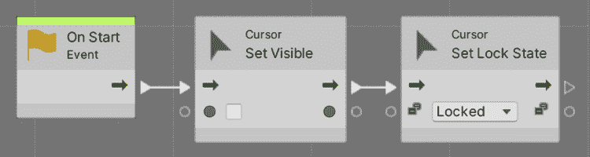

图 6.40：在视觉脚本中禁用鼠标光标

现在我们已经介绍了对象生成的基础知识，让我们通过结合定时器来查看一个高级示例。

## 定时动作

虽然与生成不完全相关，但通常一起使用，定时动作是视频游戏中的常见任务。想法是安排稍后发生某事；也许我们希望子弹过一段时间后销毁以防止内存溢出，或者我们想要控制敌人的生成速率或它们应该何时生成。这正是本节将要做的，从第二个开始，即**敌军波次**。

策略是希望在游戏的各个时刻以一定的速率生成敌人；也许我们希望在 1 到 5 秒之间以每秒 2 个的速率生成敌人，总共生成 10 个敌人，并给玩家最多 20 秒的时间来完成它们，然后在 25 秒时编程下一波。当然，这很大程度上取决于你想要的精确游戏，你可以从一个像这样的想法开始，并在测试后对其进行修改以找到你想要的波系统工作的确切方式。在我们的案例中，我们将通过实现一个简单的波系统来应用计时。

首先，我们需要一个敌人，目前我们将简单地使用与玩家相同的 3D 模型，但添加一个 Forward Movement 脚本以使其向前移动；在本书的稍后部分，我们将为敌人添加 AI 行为。我建议你自己尝试创建这个 Prefab，并在尝试后查看以下步骤，以检查正确答案：

将下载的 Character FBX 模型拖到场景中以创建它的另一个实例，但这次将其重命名为 `Enemy`：

1.  将为子弹创建的 `ForwardMovement` 脚本添加到 `Enemy` 中，并暂时将其速度设置为 `10`。

1.  将 `Enemy` GameObject 拖到项目中以创建基于该 GameObject 的 Prefab；我们稍后需要生成它。请记住选择 **Prefab Variant**，这将使 Prefab 与原始模型保持链接，以便对模型所做的更改自动应用到 Prefab 上。

1.  还要记得从场景中销毁原始的 `Enemy`。

现在，为了安排动作，我们将使用 `Invoke` 函数来创建计时器。它们很简单，但对于我们的需求来说足够了。让我们按照以下步骤使用它们：

1.  在基地的一端创建一个空 GameObject 并将其命名为 `Wave1a`。

1.  为其创建并添加一个名为 `WaveSpawner` 的脚本。

1.  我们的生成器需要四个字段：要生成的 `Enemy` Prefab、波的 `startTime`、`endTime` 和敌人的生成速率（每个生成之间应该有多少时间）。脚本和设置将类似于以下截图：

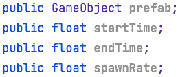

图 6.41：波生成器脚本的字段

我们将使用 `InvokeRepeating` 函数来安排一个周期性重复的自定义函数。你需要只安排一次重复；Unity 会记住这一点，所以不要在每一帧都做。这是使用 `Start` 事件函数的好理由。函数的第一个参数是一个字符串（引号之间的文本），包含要周期性执行的另一个函数的名称，与 `Start` 或 `Update` 不同，你可以随意命名该函数。第二个参数是开始重复的时间，即我们的 `startTime` 字段。最后，第三个参数是函数的重复速率——每次重复之间需要多少时间——这是 `spawnRate` 字段。你可以在下一个截图中找到如何调用该函数，以及自定义的 `Spawn` 函数：

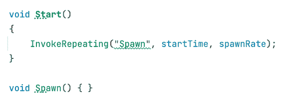

图 6.42：调度一个重复的 Spawn 函数

1.  在`Spawn`函数内部，我们可以像我们知道的，使用`Instantiate`函数来放置生成代码。想法是以一定的速率调用这个函数来生成每个调用一个敌人。这次，生成位置将与生成器相同，所以请小心放置：

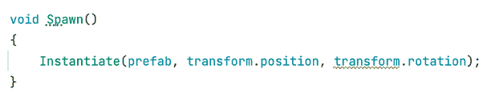

图 6.43：在 Spawn 函数中实例化

如果你通过将 Prefab 的`startTime`和`spawnRate`字段设置为大于 0 的值来测试这个脚本，你会注意到敌人会开始生成但永远不会停止，你可以看到我们到目前为止还没有使用`endTime`字段。想法是调用`CancelInvoke`函数，这是我们用来取消所有`InvokeRepeating`调用的一个函数，但过一段时间后。我们将使用`Invoke`函数延迟执行`CancelInvoke`，它的工作方式与`InvokeRepeating`类似，但这个函数只执行一次。在下一张截图，你可以看到我们如何在`Start`中添加一个`Invoke`调用到`CancelInvoke`函数，使用`endTime`字段作为执行`CancelInvoke`的时间。这将延迟执行`CancelInvoke`，取消第一个生成 Prefab 的`InvokeRepeating`调用：

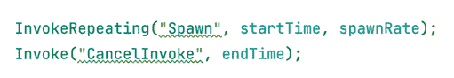

图 6.44：使用 CancelInvoke 取消 Spawn 重复调度

这次，我们使用了`Invoke`来延迟调用`CancelInvoke`。我们没有创建一个自定义函数，因为`CancelInvoke`不接受参数。如果你需要安排一个带有参数的函数，你需要创建一个没有参数的包装函数，该函数调用所需的函数并安排它，就像我们在`Spawn`中所做的那样，那里的唯一目的是用特定的参数调用`Instantiate`。

1.  现在你可以保存并设置一些真实值到我们的生成器。在我的例子中，我使用了以下截图所示的内容：

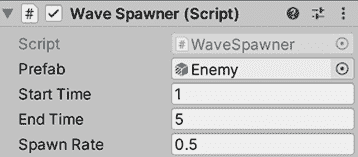

图 6.45：在游戏第 1 秒到第 5 秒内，每 0.5 秒生成 2 个敌人

你应该看到敌人一个接一个地生成，并且由于它们向前移动，它们将形成一排敌人。这种行为将在 AI 之后改变。现在，视觉脚本版本将看起来像这样：

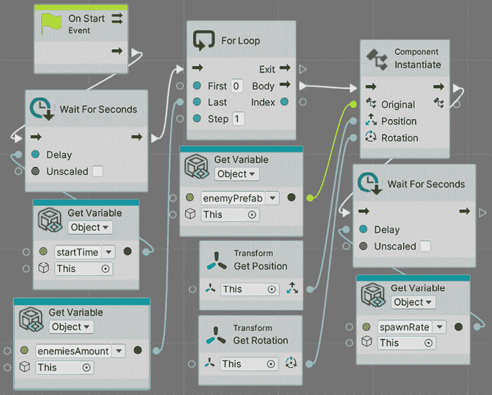

图 6.46：在视觉脚本中生成敌人

虽然我们可以在视觉脚本中使用`InvokeRepeating`方法，但在这里我们可以看到视觉方法的一些好处，因为它有时比编码更具灵活性。在这种情况下，我们在`Start`的开始处使用了`Wait For Seconds`节点，这个节点基本上会暂停流程的执行几秒钟。这将创建原始脚本中的初始延迟；这就是为什么我们使用了`startTime`作为`Delay`的量。

现在，在等待之后，我们使用了一个`For`循环；在这个例子中，我们改变了脚本的概念，因为我们想要生成特定数量的敌人，而不是在一段时间内生成。`For`循环本质上是一个经典的`For`循环，它将重复连接到`Body`输出引脚的内容，重复次数由`Last`输入引脚指定的次数。

我们将那个引脚连接到一个变量，以控制我们想要生成的敌人数量。然后，我们将一个`Instantiate`连接到`For`循环的`Body`输出引脚，以实例化我们的敌人，然后是一个`Wait For Seconds`，在循环可以继续生成敌人之前停止流动一段时间。

有趣的是，如果你现在玩游戏，你将在控制台收到一个错误，看起来像这样：

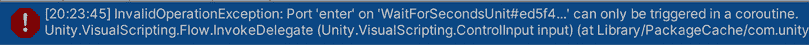

图 6.47：使用等待节点时的错误

你甚至可以回到图编辑器，看到冲突的节点将以红色突出显示：

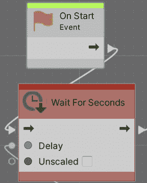

图 6.48：导致错误的节点

这里的问题是，为了让“等待秒数”节点正常工作，你需要将“开始”事件标记为**协程**。这基本上允许事件暂停一段时间，然后稍后继续。这个概念在 C#中同样存在，但由于在视觉脚本中实现起来比在 C#中简单，我们决定在这里采用这种方法。

要解决这个问题，只需选择“开始”事件节点，并在“脚本图”编辑器左侧的**图检视器**面板中勾选**协程**复选框。如果你看不到它，请考虑在编辑器的左上角点击**信息**按钮（带*i*的圆圈）。

协程是一个可以被暂停并在稍后继续执行的功能，这正是“等待”节点所做的事情。协程也存在于`MonoBehaviours`中，但现在让我们保持简单。

图 6.49：将开始标记为协程

现在我们已经讨论了时间和生成，让我们讨论时间和`Destroy`，以防止我们的子弹在内存中永远存在。

## 销毁对象

我们可以使用`Destroy`函数来销毁对象实例。想法是让子弹有一个脚本，在一段时间后安排自己的自动销毁，以防止它们永远存在于内存中。我们将通过以下步骤创建脚本：

1.  选择“子弹”的预制件，并添加一个名为`Autodestroy`的脚本，就像你使用**添加组件 > 新脚本**选项对其他对象所做的那样。这次，脚本将被添加到预制件中，你生成的每个预制件实例都将拥有它。

1.  你可以使用如图所示的`Destroy`函数，在`Start`中一次性销毁对象：

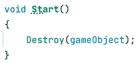

图 6.50：在开始时销毁对象

`Destroy`函数期望将要销毁的对象作为第一个参数，在这里，我们使用`gameObject`引用；这是一种指向我们的脚本放置的 GameObject 并销毁它的方法。如果你使用`this`指针而不是`GameObject`，我们只会销毁我们创建的`Autodestroy`组件。

当然，我们不想子弹一出现就被销毁，因此我们需要延迟销毁。你可能正在考虑使用`Invoke`，但与 Unity 中的大多数函数不同，`Destroy`可以接收第二个参数，即等待销毁的时间。

1.  创建一个延迟字段，用作`Destroy`的第二个参数，如下一张截图所示：

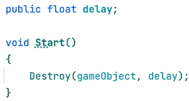

图 6.51：使用字段配置销毁对象的延迟

1.  将`delay`字段设置为适当的值；在我的情况下，5 就足够了。现在检查子弹过一段时间后如何从 Hierarchy 中移除，以查看其消失。

1.  视觉脚本中的等效操作将如下所示：

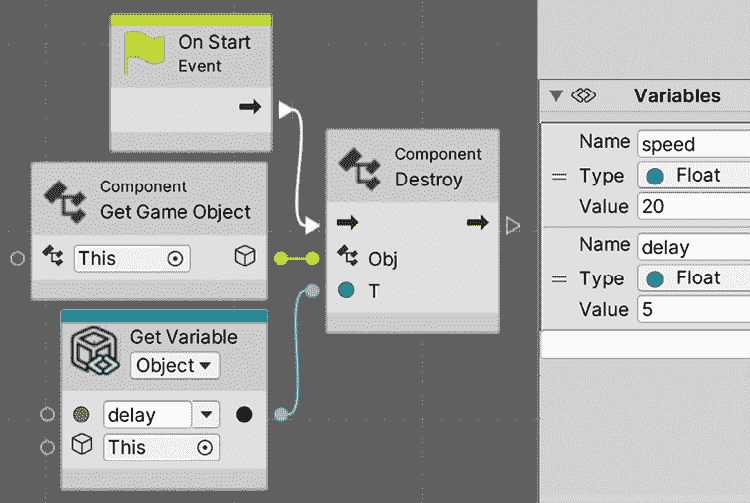

图 6.52：在视觉脚本中销毁

关于这个版本，注意我们如何使用**组件销毁（Obj, T）**版本的`Destroy`节点，它包括延迟时间。

寻找`Object Pool`概念，这是一种回收对象而不是不断创建对象的方法；你会了解到有时创建和销毁对象并不那么高效。

现在，我们可以随意创建和销毁对象，这在 Unity 脚本中是非常常见的。在下一节中，我们将讨论如何修改我们迄今为止所编写的脚本以支持新的 Unity 输入系统。

# 使用新的输入系统

我们一直在使用**Input**类来检测被按下的按钮和轴，对于我们的简单使用来说，这已经足够了。但是，默认的 Unity 输入系统在扩展性方面有其局限性，无法支持新的输入硬件和映射。

在本节中，我们将探讨以下概念：

+   安装新的输入系统

+   创建输入映射

+   在脚本中使用映射

让我们开始探索如何安装新的输入系统。

## 安装新的输入系统

要开始使用新的输入系统，它需要像我们迄今为止安装的任何其他包一样安装，使用**包管理器**。这个包只是叫做**Input System**，所以继续像往常一样安装。在这种情况下我们使用的是版本 1.4.2，但当你阅读这一章时可能有一个更新的版本可用。

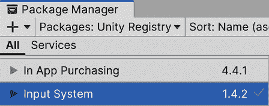

图 6.53：安装新的输入系统包

默认情况下，当你安装输入系统时，它将弹出一个窗口，如以下图像所示，提示你启用新的输入系统。如果出现这种情况，只需点击**是**并等待 Unity 重新启动：

图 6.54：切换活动输入系统

如果由于某种原因没有出现，另一种选择是**编辑 | 项目设置**，然后转到**玩家 | 其他设置 | 配置**，将**活动输入处理**属性设置为**输入系统包（新**）。

有一个名为**Both**的选项可以同时启用两者，但让我们坚持只使用一个。

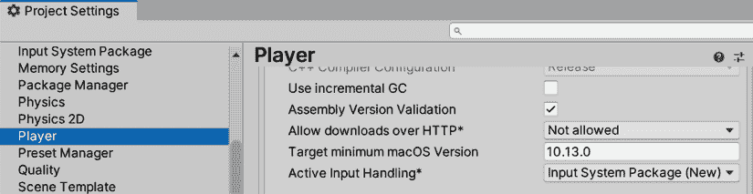

图 6.55：切换活动输入系统

现在我们已经安装并设置了系统，让我们来探索如何创建所需的输入映射。

## 创建输入映射

新系统有一种直接请求按钮或摇杆当前状态的方法，无论是游戏手柄、鼠标、键盘还是我们拥有的其他设备，就像我们之前在旧输入系统中所做的那样。但这样做会阻止我们使用系统最好的功能之一，即输入映射。

输入映射的概念是将输入动作从物理输入中抽象出来。不是考虑空格键、游戏手柄的左摇杆或鼠标的右键点击，而是用动作来思考，比如移动、射击或跳跃。在代码中，你会询问是否按下了“射击”按钮，或者“移动”轴的当前值，就像我们处理鼠标轴旋转一样。虽然之前的系统支持一定程度的输入映射，但新输入系统的输入映射功能更强大，配置也更简单。

| **动作** | **映射** |
| --- | --- |
| 射击 | 左鼠标按钮、左控制键、游戏手柄的 X 按钮 |
| 跳跃 | 空格键、游戏手柄的 Y 按钮 |
| 水平移动 | A 和 D 键、左右箭头、游戏手柄的左摇杆 |

图 6.56：输入映射表的示例

这个想法的强大之处在于，实际触发这些动作的键或按钮可以在 Unity 编辑器中配置，允许任何游戏设计者更改控制整个游戏的精确键，而不需要更改代码。

我们甚至可以将多个按钮映射到同一个动作，甚至来自不同的设备，这样我们就可以让鼠标、键盘和游戏手柄触发同一个动作，极大地简化了我们的代码。另一个好处是，用户还可以使用我们添加到游戏中的某些自定义 UI 重新绑定键，这在 PC 游戏中非常常见。

开始创建输入映射最简单的方法是通过**玩家输入**组件。这个组件，正如其名所示，代表特定玩家的输入，允许我们在游戏中的每个玩家都有一个，以支持分屏多人游戏，但让我们专注于单人游戏。将此脚本添加到我们的玩家中，将允许我们使用**创建动作...**按钮创建默认的输入映射资产。这个资产，作为一个材料，可以被多个玩家使用，因此我们修改它，它将影响所有玩家（例如，添加“跳跃”输入映射）：

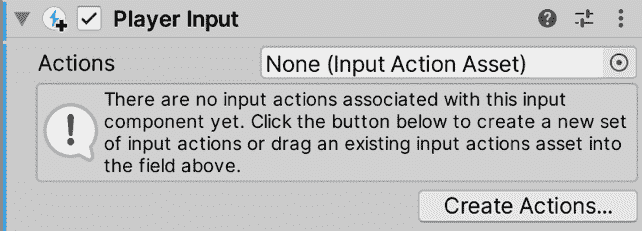

图 6.57：使用玩家输入组件创建输入动作资产

点击该按钮并保存资产位置在保存提示中后，你会看到以下屏幕：

图 6.58：默认输入映射文件

从这个资源中首先需要理解的部分是**动作映射**部分（左侧面板）。这允许我们为不同的情况创建单独的动作映射，例如，在像 GTA 这样的游戏中，为驾驶和步行控制创建动作映射。默认情况下，创建了**玩家**和**用户界面**映射，以区分玩家控制和通过用户界面导航的映射。如果你再次检查**玩家输入**组件，你会看到**默认映射**属性设置为**玩家**，这意味着我们只会关注在这个 GameObject 中控制输入映射的玩家；任何按下的 UI 动作都不会被考虑。我们可以在运行时随意切换活动映射，例如，在暂停菜单中禁用角色控制器输入，或者在车内切换到驾驶映射，使用相同的按钮但用于其他目的。

如果你选择左侧面板中的动作映射，你将在中部面板的**动作**列表中看到它包含的所有动作。在**玩家**的情况下，我们有**移动**、**观察**和**射击**映射，这正是我们将在游戏中使用的输入。记住，如果你需要使用**+**按钮添加更多，但现在让我们坚持使用默认的映射。当你从列表中选择任何动作时，你将在**动作属性**面板中看到它们的配置，即右侧的面板：

图 6.59：移动（左侧）和射击（右侧）动作配置

如你所见，有一个名为**动作类型**的属性，它将决定我们正在讨论哪种类型的输入。如果你在中部面板中选择**移动**，你可以看到它是一个**值**动作类型，**控制类型**为`Vector2`，这意味着它将返回 x 轴和 y 轴的值，水平和垂直的值——这是我们期望从任何游戏手柄的摇杆中得到的。在之前的系统中，我们从分离的 1D 轴（如**鼠标 X**和**鼠标 Y**轴）中获取这些值，但在这里它们被合并成一个变量以方便使用。另一方面，**射击**动作类型为**按钮**，它不仅能够检查其当前状态（按下或释放），还能进行检查，如检查它是否刚刚被按下或刚刚被释放，这是之前系统中`GetKey`、`GetKeyDown`和`GetKeyUp`的等价物。

现在我们已经了解了我们有哪些动作以及每个动作的类型，让我们讨论物理输入如何触发它们。你可以点击中部面板中每个动作左侧的箭头以查看其物理映射。让我们开始探索**移动**动作映射。

在这个例子中，我们有 4 个映射：

+   **左侧摇杆 [游戏手柄]**：游戏手柄的左侧摇杆

+   **主要 2D 轴 [XR 控制器]**：VR 控制器的摇杆

+   **摇杆[操纵杆]**：用于街机式操纵杆或甚至飞行操纵杆的主要摇杆

+   **WASD**：通过 W、A、S 和 D 键模拟摇杆的复合输入

如果你选择了其中任何一个，你可以检查它们的配置；让我们以左摇杆和 WASD 为例：

图 6.60：左摇杆映射（左）和 WASD 键映射（右）

在**左摇杆**的情况下，你可以看到允许你选择所有可能提供`Vector2`值（x 轴和 y 轴）的硬件物理控制的**路径**属性。在**WASD**键映射的情况下，你可以看到它是一个类型为**2D 向量**的复合绑定，正如之前所述，这允许我们使用其他输入（在这种情况下是键）来模拟 2D 轴。如果你展开中间面板中的**WASD**输入映射，你可以看到所有正在组合到这个 2D 轴的输入，并通过选择它们来查看它们的配置：

图 6.61：考虑的 WASD 复合 2D 轴的输入

在这种情况下，它不仅映射了 W、A、S 和 D 按钮，还包括了 4 个键盘箭头。每个映射都有一个路径来选择物理按钮，还有一个**复合部分**设置，允许我们指定这个输入将拉动模拟摇杆的方向。

就这样，我们只是刚刚触及了这个系统所能做到的表面，但现在让我们保持简单，并使用这些设置。记住，在项目的根目录中创建了一个与我们的游戏同名的新资产（在我们的例子中是*SuperShooter*）。你可以通过双击它来随时重新打开这个动作映射窗口。现在让我们看看我们如何在代码中使用这些输入。

## 在我们的脚本中使用映射

这个系统提供了几种检测输入状态的方法。**玩家输入**组件有一个**行为**属性，可以在一些可用模式之间切换。最简单的一个是称为**发送消息**的模式，我们将使用它，当按键被按下时，它将在我们的代码中执行方法。在这个模式下，映射中的每个动作都将有自己的事件，你可以在组件底部的工具提示中看到所有这些。随着你添加映射，将出现更多。

图 6.62：默认映射的所有输入事件

从列表中，我们需要三个，`OnMove`、`OnLook`和`OnFire`。我们可以像以下截图那样修改我们的`PlayerMovement`脚本以使用它们：

图 6.63：使用新输入系统的玩家移动

你首先会注意到的一个不同点是，我们不再像以前那样在`Update`方法中请求输入状态。相反，我们监听`OnMove`和`OnLook`事件，这些事件为我们提供了一个包含那些轴当前状态的`InputValue`参数。想法是每次这些轴的值发生变化时，这些事件都会执行，如果值没有变化，比如当玩家一直将摇杆推到最右边时，它们将不会执行。这就是为什么我们需要在`movementValue`和`lookValue`变量中存储当前值，以便在`Update`方法中稍后使用轴的最新值，并在每一帧应用移动。请记住，这些是私有的，意味着它们不会出现在编辑器中，但对我们来说这没问题。此外，注意我们在文件顶部添加了`using UnityEngine.InputSystem`行，以启用脚本中新的输入系统的使用。

在这个版本的`PlayerMovement`脚本中，我们使用了与鼠标相同的轴输入类型，但这次也用于移动，而之前的版本使用的是按钮。这通常是首选选项，所以我们将坚持使用这个版本。观察我们如何使用单个`transform.Translate`来移动；我们需要使用`movementValue`的 x 轴来移动玩家的 x 轴，但使用`movementValue`的 y 轴来移动玩家的 z 轴。我们不希望玩家垂直移动，这就是为什么我们需要以这种方式拆分轴。

`InputValue`参数有`Get<Vector2>()`方法，它将给出两个轴的当前值，假设`Vector2`是一个包含 x 和 y 属性的变量。然后，我们根据情况将向量乘以移动或旋转速度。你会注意到我们在轴事件中不乘以`Time.deltaTime`，但在`Update`中这样做。这是因为`Time.deltaTime`可以在帧之间变化，所以考虑到我们上次移动摇杆时的`Time.deltaTime`来存储移动值对我们来说将没有用。此外，注意`movementValue`是一个`Vector2`，只是 x 和 y 轴的组合，而`lookValue`是一个简单的浮点数。我们这样做是因为我们将只根据鼠标的水平移动来旋转角色；我们不希望它上下旋转。检查我们是否做了`value.Get<Vector2>().x`，重点在于`.x`部分，其中我们只提取轴的横向部分用于计算。

关于`PlayerShooting`组件，我们需要将其更改为如下：

图 6.64：使用新输入系统的 PlayerShooting 脚本

在这种情况下，情况更简单，因为我们不需要在每一帧执行射击行为，我们只需要在输入被按下的那一刻执行某些操作，这正是`OnFire`事件将被执行的时刻。如果你需要检测键被释放的情况，你可以添加`InputValue`参数，就像我们在`OnMove`和`OnLook`中做的那样，并咨询`isPressed`属性：

图 6.65：获取按钮的状态

关于我们脚本的 Visual Script Machine 版本，首先，你需要通过转到**Edit | Project Settings | Visual Scripting**并点击**Regenerate Nodes**按钮来刷新**Visual Script Node Library**。如果你不这样做，你将看不到新的 Input System 节点：

图 6.66：重新生成支持新 Input System 的可视脚本节点

现在，`PlayerShooting`可视脚本将看起来像这样：

****

图 6.67：使用新输入系统实例化子弹

新的**On Input System Event Button**节点允许我们检测当动作按钮被按下时，并相应地做出反应。你可以在**Input Action**参数中选择特定的动作，甚至可以通过节点标题下方的选项使节点对按钮的压力、释放或保持状态做出反应。存在一个 bug，即**Input Action**属性可能不会显示任何选项；在这种情况下，尝试在图中删除并重新添加节点，并确保你已将`ScriptMachine`组件添加到具有`PlayerInput`组件的同一 GameObject 中。还要检查你是否已选择了玩家 GameObject。

关于移动，可以这样实现：

图 6.68：使用新 Input System 移动

在这个情况下，我们使用了**On Input System Event Vector2**节点。这次，我们使用了`OnHold`模式，这意味着，与 C#版本不同，它不会仅在轴变化时执行，而是在轴被按下的所有帧都会像`Update`一样执行；然而，这只会当用户按下摇杆时执行。节点的输出引脚是`Vector2`值，所以我们将其乘以`speed`变量（在玩家`Variables`组件中声明）和`DeltaTime`。最后，我们使用`Vector2 GetX`和`Vector2 GetY`节点在 x 和 z 轴上平移。当重新连接**Multiply**节点到新的**Input System**节点时，可能会遇到麻烦，因为返回类型与之前使用的节点不同（从单个`float`变为`Vector2`）。我建议直接删除此图中的所有节点，并重新构建以确保一切正常。

# 摘要

我们创建了我们的第一个真正的脚本，它提供了有用的行为。我们讨论了如何根据输入移动 GameObject，并通过脚本实例化预制体以根据游戏情况随意创建对象。此外，我们还看到了如何安排动作，在这种情况下是生成，但这可以用来安排任何事物。我们看到了如何销毁创建的对象，以防止对象数量增加到无法管理的水平。最后，我们探索了新的输入系统，以提供最大的灵活性来自定义我们游戏的输入。我们将在本书的后面部分使用这些动作来创建其他类型的对象，例如声音和效果。

现在您能够创建任何类型的移动或生成逻辑，确保所需的对象在必要时被销毁。您可能会认为所有游戏都以相同的方式移动和创建射击系统，尽管它们相似，但能够创建自己的移动和射击脚本允许您自定义游戏中的这些方面，使其按预期行为并创建您所寻找的精确体验。

在下一章中，我们将讨论如何检测碰撞以防止玩家和子弹穿过墙壁以及更多内容。
