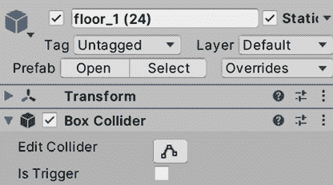

# 物理碰撞和健康系统

随着游戏试图模拟现实世界的表现，一个重要的模拟方面是物理，它决定了物体如何移动以及它们如何相互碰撞，例如玩家与墙壁的碰撞，或者子弹与敌人的碰撞。由于碰撞后可能发生的无数反应，物理可能难以控制，因此我们将学习如何正确配置我们的游戏，以尽可能精确地创建物理效果。这将产生期望的街机移动感觉，并使真实的碰撞效果工作——毕竟，有时候，现实生活并不像电子游戏那样有趣！

在本章中，我们将探讨以下碰撞概念：

+   配置物理

+   检测碰撞

+   使用物理移动

首先，我们将学习如何正确配置物理设置，这是为了让我们的脚本能够检测到物体之间的碰撞，我们将学习使用新的 Unity 事件。所有这些都需要，以便检测我们的子弹何时触碰到敌人并对其造成伤害。然后，我们将讨论使用`Transform`移动（这是我们迄今为止所做的那样）和使用 Rigidbody 移动之间的区别，以及每个版本的优缺点。这将用于尝试不同的移动玩家方式，并让你决定你想要使用哪一种。让我们从讨论物理设置开始。

# 配置物理

Unity 的物理系统已经准备好覆盖广泛的可能的游戏应用，因此正确配置它对于获得期望的结果非常重要。

在本节中，我们将探讨以下物理设置概念：

+   设置形状

+   物理对象类型

+   碰撞过滤

我们将首先学习 Unity 提供的不同类型的碰撞体，然后学习不同的配置方法以检测不同类型的物理反应（**碰撞**和**触发器**）。最后，我们将讨论如何忽略特定物体之间的碰撞，以防止玩家子弹损坏玩家的情况。

## 设置形状

在本书的开头，我们了解到物体通常有两种形状，一种是视觉形状——基本上是 3D 网格——另一种是物理形状，即碰撞体——物理系统将使用它来计算碰撞。请记住，这个想法是让你拥有高度详细的可视模型，同时拥有简化的物理形状以提高性能。

Unity 有几种类型的碰撞体，所以在这里我们将回顾常见的几种，从原始类型开始，即**盒子**、**球体**和**胶囊体**。这些形状由于它们之间的碰撞是通过数学公式完成的，因此在性能上是最便宜的（与其他碰撞体如**网格碰撞体**不同，网格碰撞体允许你使用任何网格作为物体的物理体，但性能成本更高，并且有一些限制）。想法是，你应该使用原始类型来表示你的对象或它们的组合，例如，一架飞机可以用两个盒子碰撞体来完成，一个用于机身，另一个用于机翼。你可以在下面的屏幕截图中看到这个例子，其中你可以看到由原始形状制成的武器碰撞体：

图 7.1：复合碰撞体

无论如何，这并不总是必要的；如果我们想让武器直接掉到地上，可能一个覆盖整个武器的盒子碰撞体就足够了，考虑到这类碰撞不需要非常精确，从而提高性能。此外，有些形状即使通过原始形状的组合也无法表示，例如斜坡或金字塔，这时你唯一的解决方案是使用网格碰撞体，它需要一个 3D 网格用于碰撞，但鉴于其高性能的影响，我们在这本书中不会使用它们；我们将使用原始形状来解决所有的物理碰撞体。

现在，让我们向场景中添加必要的碰撞体，以便正确地计算碰撞。考虑到如果你使用了除了我的以外的 Asset Store 环境包，你可能已经拥有了带有碰撞体的场景模块；我将展示我在我的情况中需要做的工作，但尽量将这里的主要思想应用到你的场景中。要添加碰撞体，请按照以下步骤操作：

1.  在基础中选择一个墙壁并检查对象及其可能的子对象是否有碰撞体组件；在我的情况下，我没有碰撞体。如果你检测到任何网格碰撞体，你可以保留它，如果你想要的话，但我建议你在下一步中将其移除并替换为另一个选项。想法是添加碰撞体，但我在这里发现的问题是，由于我的墙壁不是 Prefab 的实例，我需要为场景中的每个墙壁添加碰撞体。

1.  一个选择是创建一个 Prefab 并将所有墙壁替换为 Prefab 的实例（推荐解决方案）或者只是选择层次结构中的所有墙壁（在 Mac 上按住*Ctrl*或*Cmd*点击它们），然后选择它们，使用**添加组件**按钮为它们添加碰撞体。在我的情况下，我将使用`Box Collider`组件，它将调整碰撞体的尺寸以适应网格。如果它没有适应，你只需更改**盒子碰撞体**的**大小**和**中心**属性，以覆盖整个墙壁：

图 7.2：添加到墙上的盒子碰撞体

1.  对角落、地板砖和任何其他会阻挡玩家和敌人移动的障碍物重复*步骤 1*和*步骤 2*。

现在我们已经为墙壁和地板添加了所需的碰撞器，我们可以继续处理玩家和敌人。我们将为他们添加**胶囊碰撞器**，这是在可移动角色中通常使用的碰撞器，因为其圆形底部将允许物体平滑地爬坡。水平圆形允许物体在角落中轻松旋转而不会卡住，以及其他该形状的便利性。您可能想要基于我们之前下载的角色之一创建一个敌人 Prefab，这样您就可以将碰撞器添加到该 Prefab 中。我们的玩家是场景中的一个简单 GameObject，所以您需要将碰撞器添加到那个 GameObject 上，但考虑也创建一个玩家 Prefab 以方便使用。

您可能会想给角色的骨骼添加几个盒子碰撞器以创建物体的逼真形状，虽然我们可以这样做以根据敌人被射击的身体部位施加不同的伤害，但我们只是在创建运动碰撞器；胶囊就足够了。在高级伤害系统中，胶囊和骨骼碰撞器将共存，一个用于运动，另一个用于伤害检测；但我们在游戏中将简化这一点。

此外，有时碰撞器无法很好地适应物体的视觉形状，在我的情况下，胶囊碰撞器与角色并不非常匹配。我需要通过设置以下截图中的值来调整其形状以匹配角色：**中心**设置为`0,1,0,` **半径**设置为`0.5`，**高度**设置为`2`：

图 7.3：角色碰撞器

我们用球体创建的子弹已经有一个球体碰撞器，但如果您用另一个网格替换子弹的网格，您可能想要更改碰撞器。目前，我们游戏中不需要其他对象，所以现在所有对象都已经有了合适的碰撞器，让我们看看如何为每个对象设置不同的物理设置以启用适当的碰撞检测。

如果您检查地形组件，您会看到它有自己的碰撞器类型，即**地形碰撞器**。对于地形，这是唯一要使用的碰撞器。

## 物理对象类型

现在我们已经通过使对象在物理模拟中具有存在感为每个对象添加了碰撞器，是时候配置它们以获得我们想要的精确物理行为。我们有无数可能的设置组合，但我们将讨论一组常见的配置文件，这些配置文件涵盖了大多数情况。记住，除了碰撞器之外，我们在本书的开头看到了 Rigidbody 组件，它是将物理应用于对象的那一个。以下配置文件是通过结合碰撞器和 Rigidbody 设置完成的：

+   **静态碰撞体**：正如其名所示，这种碰撞体不应该移动，除了某些特定例外。大多数环境对象都属于这一类别，例如墙壁、地板、障碍物和地形。这类碰撞体只是没有`Rigidbody`组件的碰撞体，因此它们存在于物理模拟中，但没有任何物理作用；它们不能被其他对象的碰撞移动，它们不会有物理作用，并且无论发生什么情况，它们的位置都会固定。请注意，这与编辑器右上角的**静态**复选框无关；那些是我们在后续章节中将要探索的系统（例如第十二章，使用通用渲染管道进行照明），因此如果需要，您可以将静态碰撞体与该复选框未选中。

+   **物理碰撞体**：这些是具有`Rigidbody`组件的碰撞体，就像我们在本书第一部分所做的下落球体的例子。这些是完全由物理驱动的对象，具有重力并且可以通过力移动；其他对象可以推动它们，并且它们会执行您所期望的任何其他物理反应。您可以使用此功能用于玩家、手榴弹移动、下落箱子，或在像*The Incredible Machine*这样的高度基于物理的游戏中的所有对象。

+   **运动学碰撞体**：这些是具有`Rigidbody`组件但已勾选**是运动学**复选框的碰撞体。它们不像**静态碰撞体**那样对碰撞和力有物理反应，但它们预期会移动，允许**物理碰撞体**在移动时正确处理与它们的碰撞。这些可以用于需要使用动画或自定义脚本移动的对象，例如移动平台。

+   **触发静态碰撞体**：这是一个常规静态碰撞体，但已勾选碰撞体的**是触发**复选框。区别在于运动学和物理对象会穿过它，但通过生成一个`触发`事件，一个可以通过脚本捕获的事件，它告诉我们有东西在碰撞体内部。

这可以用来创建按钮或触发对象，在玩家穿过游戏中的某些事件区域时，例如生成一波敌人、开门或在该区域是玩家的目标时赢得游戏。请注意，常规静态碰撞体在穿过此类类型时不会生成触发事件，因为它们不应该移动。

+   **触发运动学碰撞体**：运动学碰撞体不会生成碰撞，因此它们会穿过任何其他对象，但它们会生成`触发`事件，因此我们可以通过脚本进行响应。这可以用来创建可移动的奖励物品，当被触摸时，它们会消失并给我们加分，或者子弹会通过自定义脚本移动，没有物理作用，就像我们的子弹一样，但它们接触其他对象时会造成伤害。

当然，除了指定的配置外，还可以存在其他配置，用于满足某些游戏的具体游戏玩法要求，但具体还是要靠你自己去尝试所有可能的物理设置组合，看看它们是否适用于你的情况；所描述的配置将涵盖 99%的情况。

为了回顾之前的场景，我给你留下以下表格，显示所有类型碰撞器之间的接触反应。每个可以移动的配置都有一个行；请记住，静态配置不应该移动。每一列代表它们与其他类型碰撞时的反应，`无`表示对象将无效果地穿过，`触发器`表示对象将穿过但会引发`触发器`事件，而`碰撞`表示对象将无法穿过另一个对象：

|  | **与静态碰撞** | **与动态碰撞** | **与运动学碰撞** | **与触发静态碰撞** | **与触发运动学碰撞** |
| --- | --- | --- | --- | --- | --- |
| 动态 | 碰撞 | 碰撞 | 碰撞 | 触发器 | 触发器 |
| 运动学 | 无 | 碰撞 | 无 | 触发器 | 触发器 |
| 触发运动学 | 触发器 | 触发器 | 触发器 | 触发器 | 触发器 |

图 7.4：碰撞反应矩阵

考虑到这一点，让我们开始配置场景对象的物理属性。

墙壁、角落、地板砖和障碍物应使用静态碰撞器配置，因此它们上没有`Rigidbody`组件，并且它们的碰撞器将不会勾选**是触发器**复选框：

图 7.5：地板砖的配置；请记住，静态复选框仅用于照明

玩家应移动并生成与对象的碰撞，因此我们需要它具有**动态**配置。此配置将与我们当前的运动脚本（我鼓励你测试）产生有趣的行为，尤其是在与墙壁碰撞时，所以它不会像你预期的那样表现。我们将在本章后面处理这个问题：

图 7.6：玩家上的动态设置

我们之前建议你创建的`Enemy`预制体将使用运动学配置，因为我们将在稍后使用 Unity 的 AI 系统移动此对象，所以这里不需要物理效果，并且由于我们希望玩家与之碰撞，我们需要在那里有一个碰撞反应，所以这里没有`触发器`：

图 7.7：敌人的运动学设置

对于`Bullet`预制体，它通过脚本进行简单的移动（只是向前移动），而不是通过物理。我们不需要碰撞；我们将编写代码，使子弹在接触任何东西时立即销毁，并（如果可能）损坏碰撞的对象，所以运动学触发器配置就足够了。我们将使用`触发器`事件来编写接触反应的脚本：

图 7.8：子弹的运动学触发设置；勾选了**是触发器**和**是运动学**

现在我们已经正确配置了对象，让我们来看看如何过滤某些对象类型之间不希望发生的碰撞。

## 过滤碰撞

有时候我们希望某些对象相互忽略，比如玩家射出的子弹，它们不应该与玩家本身发生碰撞。我们总可以在 C#脚本中使用`if`语句来过滤这些情况，检查被击中的对象是否来自敌方或任何你想要的过滤逻辑，但那时已经太晚了；物理系统已经浪费了资源去检查本不应该发生碰撞的对象之间的碰撞。这就是层碰撞矩阵能帮到我们的地方。

**层碰撞矩阵**听起来很吓人，但它只是物理系统的一个简单设置，允许我们指定哪些对象组应该与其他组发生碰撞。例如，玩家的子弹应该与敌人碰撞，敌人的子弹应该与玩家碰撞。在这种情况下，敌人的子弹会穿过敌人，但这是我们想要的。我们的想法是创建这些组，并将我们的对象放入其中，在 Unity 中，这些组被称为**层**。我们可以创建层，并将 GameObject（检查器顶部部分）的层属性设置为将对象分配到该组或层。请注意，你的层数量有限，所以尽量明智地使用它们。

我们可以通过以下方式实现：

1.  前往**编辑 | 项目设置**，在其中，从左侧面板查找**标签和层**选项：

图 7.9：标签和层设置

1.  在**层**部分，填写空白区域以创建层。我们将使用这个来处理子弹场景，所以我们需要四个层：`Player`、`Enemy`、`PlayerBullet`和`EnemyBullet`：

图 7.10：创建层

1.  在层次结构中选择`Player`GameObject，从检查器的顶部部分更改**层**属性为`Player`。同时，将`Enemy`预制件更改为`Enemy`层。将显示一个窗口，询问你是否想同时更改子对象；选择**是**：

图 7.11：更改玩家和敌人预制件的层

1.  在子弹的情况下，我们有一个问题；我们有一个预制件但有两个层，而预制件只能有一个层。我们有两个选择：通过脚本根据射击者更改层，或者有两个具有不同层的子弹预制件。为了简单起见，我将选择后者，并借此机会将另一种材质应用到敌人子弹上，使其看起来不同。

1.  我们将创建玩家子弹的预制件**变体**。记住，变体是基于原始预制件的一个预制件，就像类继承一样。当原始预制件发生变化时，变体也会变化，但变体可以有不同的地方，这将使其变得独特。

1.  将子弹预制件拖放到场景中以创建实例。

1.  再次将实例拖动到`预制件`文件夹中，这次在出现的窗口中选择**预制件** **变体**选项。

1.  将其重命名为`Enemy Bullet`。

1.  销毁场景中的预制实例。

1.  创建一个与玩家子弹类似但颜色不同的第二个材质，并将其放置在敌人子弹预制件变体上。

1.  选择敌人子弹预制件，将其层级设置为`EnemyBullet`，并对原始预制件（`PlayerBullet`）执行相同的操作。即使你更改了原始预制件的层级，由于变体对其进行了修改，修改后的版本（或覆盖）将占优，允许每个预制件拥有自己的层级。

现在我们已经配置了层级，让我们配置物理系统以使用它们：

1.  转到**编辑 | 项目设置**并查找**物理**设置（不是**物理 2D**）。

1.  滚动直到你看到**层级碰撞矩阵**，一个半网格的复选框。你会注意到每一列和行都标注了层级的名称，所以每一行和列交叉处的复选框将允许我们指定这两个层级是否应该碰撞。在我们的例子中，我们将其配置如下，以便玩家子弹不会击中玩家或其他玩家子弹，敌人子弹不会击中敌人或其他敌人子弹：

图 7.12：使玩家子弹与敌人碰撞，敌人子弹与玩家碰撞

值得注意的是，有时过滤逻辑可能不会那么固定或可预测，例如，仅击中具有一定生命值的对象，没有隐形时间增益的对象，或者可以在游戏过程中改变且难以为所有可能的层级和组生成条件的对象。因此，在这些情况下，我们应该在**触发**或**碰撞**事件之后依赖手动过滤。

现在我们已经过滤了碰撞，接下来让我们通过下一节中的碰撞反应来检查我们的设置是否正常工作。

# 检测碰撞

如你所见，适当的物理设置可能很复杂且非常重要，但现在我们已经解决了这个问题，让我们通过以不同的方式反应接触并在这个过程中创建一个**健康系统**来使用这些设置吧。

在本节中，我们将探讨以下碰撞概念：

+   检测触发事件

+   修改其他对象

首先，我们将探讨 Unity 提供的不同碰撞和触发事件，以便通过 Unity 碰撞事件来反应两个对象之间的接触。这允许我们执行我们想要放置的任何反应代码，但我们将探讨如何使用`GetComponent`函数修改接触对象组件。

## 检测触发事件

如果对象配置得当，如前所述，我们可以得到两种反应：碰撞或触发。**碰撞**反应有一个默认效果，即阻止对象的移动，但我们可以通过脚本添加自定义行为；但**触发**器，除非我们添加自定义行为，否则不会产生任何明显的效果。无论如何，我们可以为两种可能的场景编写脚本，例如添加分数、减少生命值和输掉游戏。为此，我们可以使用**物理事件**套件。

这些事件分为两组，**碰撞事件**和**触发事件**，因此根据你的对象设置，你需要选择正确的组。两组都有三个主要事件，**进入**、**持续**和**退出**，告诉我们碰撞或触发何时开始（*进入*），它们是否仍在发生或仍在接触（*持续*），以及何时停止接触（*退出*）。例如，我们可以在`进入`事件中编写一个行为，比如在两个物体首次接触时播放声音，例如摩擦声，并在`退出`事件中停止播放。

让我们通过创建我们的第一个接触行为来测试这个功能：子弹在接触任何物体时被销毁。记住，子弹被配置为触发器，因此它们在接触任何物体时都会生成`触发`事件。你可以按照以下步骤操作：

1.  在**玩家子弹**预制件上创建并添加一个名为`ContactDestroyer`的脚本；由于**敌人子弹**预制件是其变体，它也将具有相同的脚本。

1.  要检测触发器何时发生，例如使用**开始**和**更新**，创建一个名为`OnTriggerEnter`的事件函数。

1.  在事件内部，使用`Destroy(gameObject);`行来使子弹在接触物体时销毁自身：

图 7.13：与物体接触时自动销毁

1.  保存脚本，并将子弹射向墙壁以查看它们如何消失而不是穿过它们。在这里，我们没有碰撞，而是一个在接触时销毁子弹的触发器。因此，这样我们就可以确保子弹永远不会穿过任何东西，但我们仍然没有使用物理运动。

目前，我们不需要其他碰撞事件，但如果你需要，它们的工作方式类似；只需创建一个名为`OnCollisionEnter`的函数即可。

现在，让我们探索同一功能的另一个版本。它不仅告诉我们我们击中了某个物体，还告诉我们我们接触到了什么。我们将使用这个功能来使我们的**接触销毁器**也能销毁其他对象。为此，请按照以下步骤操作：

1.  将`OnTriggerEnter`方法签名替换为以下截图中的签名。这个签名接收一个`Collider`类型的参数，表示击中我们的确切碰撞器：

图 7.14：告诉我们我们与哪个对象发生碰撞的触发事件版本

1.  我们可以使用`gameObject`属性访问那个碰撞器的 GameObject。我们可以使用这个来销毁另一个对象，如下面的截图所示。如果我们只是使用`Destroy`函数并通过传递`other`变量，它将只销毁`Collider`组件：

图 7.15：销毁两个对象

1.  保存并测试脚本。您会注意到子弹将销毁它接触到的所有东西。请记住验证您的敌人是否有胶囊碰撞器，以便子弹能够检测到与之的碰撞。

在视觉脚本中的等效版本如下所示：

图 7.16：使用视觉脚本销毁两个对象

如您所见，我们创建了一个**On Trigger Enter**节点并将其连接到两个**Destroy**节点。为了指定每个**Destroy**节点将销毁哪个对象，我们使用了两次**Component: Get GameObject**节点。右侧的一个没有连接到其左侧输入引脚的节点，这意味着它将返回当前执行此脚本的 GameObject（因此，节点左侧的**This**标签），在这种情况下，是子弹。对于第二个，我们需要将**OnTriggerEnter**节点右侧的**Collider**输出引脚连接到**Get GameObject**节点；这样我们指定我们想要获取子弹碰撞到的包含碰撞器的 GameObject。

现在，在我们的游戏中，我们不想让子弹在接触时销毁一切；相反，我们将让敌人和玩家拥有生命值；子弹将减少生命值，直到它达到 0，所以让我们看看如何做到这一点。

## 修改其他对象

为了让子弹损坏碰撞的对象，我们需要访问一个`Life`组件来更改其数量，因此我们需要创建这个`Life`组件来保存一个包含生命值的浮点字段。具有此组件的每个对象都将被视为可损坏的对象。要从我们的子弹脚本中访问`Life`组件，我们需要`GetComponent`函数来帮助我们。

如果您有一个 GameObject 或组件的引用，您可以使用`GetComponent`来访问对象中包含的特定组件（如果没有，它将返回`null`）。让我们看看如何使用该函数使子弹降低其他对象的生命值：

1.  在玩家和敌人预制体中创建并添加一个名为`amount`的`public float`字段的生命组件。记住在检查器中为两者设置值`100`（或您想要给予他们的任何生命值）：

图 7.17：生命组件

1.  从玩家子弹中移除`ContactDestroyer`组件，这也会将其从**Enemy Bullet Variant**中移除。

1.  将名为`ContactDamager`的新脚本添加到敌人和玩家上。

1.  添加一个 `OnTriggerEnter` 事件，它接收一个参数 `other` 碰撞器，并仅添加一个 `Destroy` 函数调用来自动摧毁自身，而不是摧毁其他对象；我们的脚本不负责摧毁它，只是减少其生命值。

1.  添加一个名为 `damage` 的浮点字段，这样我们就可以配置对其他对象施加的伤害量。记得保存文件并设置一个值后再继续。

1.  在对其他碰撞器的引用上使用 `GetComponent` 来获取其 `Life` 组件的引用，并将其保存到一个变量中：

图 7.18：访问碰撞对象的 `Life` 组件

1.  在减少对象的生命值之前，我们必须检查 `Life` 引用不是 `null`，这可能会发生在其他对象没有 `Life` 组件的情况下，例如墙壁和障碍物。想法是子弹在遇到任何东西时都会摧毁自己，如果它是一个包含 `Life` 组件的可伤害对象，则会减少其他对象的生命值。

在下面的屏幕截图中，你可以找到完整的脚本：

图 7.19：减少碰撞对象的寿命

1.  在场景中放置一个敌人，并将其速度设置为 `0` 以防止其移动。

1.  在按 **Play** 键之前在层次结构中选择它，并开始射击它。

你可以在检查器中看到生命值的减少。你还可以按 *Esc* 键恢复鼠标控制，并在 **Play** 模式下选择对象，以在编辑器中查看运行时生命字段的更改。

现在，你会注意到生命值正在减少，但它会变成负数；我们希望当生命值低于 0 时对象能够自我摧毁。我们可以有两种方式实现这一点：一种是在 `Life` 组件中添加一个 `Update` 方法，它会检查每一帧的生命值是否低于 0，如果是，则摧毁自己。第二种方式是通过封装生命字段并在设置器中检查它来防止检查所有帧。我更倾向于第二种方式，但我们将实现第一种方式，以使脚本尽可能简单，便于初学者理解。

要这样做，请按照以下步骤操作：

1.  向 `Life` 组件添加 `Update` 方法。

1.  添加 `If` 条件来检查数量字段是否小于或等于 `0`。

1.  在 `if` 条件为 `true` 的情况下添加 `Destroy`。

1.  完整的 `Life` 脚本将如下所示：

图 7.20：`Life` 组件

1.  保存并查看当 `Life` 变为 `0` 时对象是如何被摧毁的。

`Life` 组件的视觉脚本版本看起来是这样的：

图 7.21：视觉脚本中的 `Life` 组件

脚本相当直接——我们检查我们的 `Life` 变量是否小于 0，然后像之前一样摧毁自己。现在，让我们检查一下 **Damager** 脚本：

图 7.22：视觉脚本中的 `Damager` 组件

这个版本与我们的 C#版本略有不同。乍一看，它看起来相同：我们像以前一样使用**获取变量**来读取生命值，然后我们使用**减去**节点从**生命**中减去**伤害**，计算结果成为新的**生命**值，使用**设置变量**节点来改变该变量的当前值。

我们在这里可以看到的第一个不同之处是缺少任何`GetComponent`节点。在 C#中，我们使用这个指令来获取碰撞对象的`Life`组件，以便读取和修改其**数量**变量，减少剩余的生命值。但在视觉脚本中，我们的节点图没有变量，所以我们不需要访问组件来读取它们。相反，我们知道敌人其**变量**组件中有一个名为`Life`的变量，我们使用**获取变量**节点，将其连接到我们撞击的碰撞器（**On Trigger Enter**的**Collider**输出引脚），因此本质上我们正在读取被撞击对象的`Life`变量值。

对于更改其值也是一样：我们使用**设置值**节点，将其连接到碰撞器，指定我们想要改变碰撞器对象的`Life`变量值，而不是我们自己的（因为我们甚至没有`Life`变量）。请注意，如果碰撞对象没有`Life`变量，这可能会引发错误，这就是为什么我们添加了**对象有变量**节点，它检查对象是否有一个名为`Life`的变量。如果没有，我们就什么也不做，这在与墙壁或其他不可破坏的对象碰撞时很有用。最后，我们让**伤害者**（在这个例子中是子弹）自动销毁自己。

可选地，当发生这种情况时，你可以实例化一个对象，例如声音、粒子或可能是一个增强道具。我将把这个留给你作为挑战。通过使用类似的脚本，你可以制作一个增加生命值的生命增强道具，或者一个通过访问`PlayerMovement`脚本并增加**速度**字段的加速增强道具；从现在开始，发挥你的想象力，使用这个来创建令人兴奋的行为。

现在我们已经探讨了如何检测碰撞并对其做出反应，让我们来探讨如何修复玩家在撞击墙壁时掉落的问题。

# 使用物理移动

到目前为止，玩家是唯一一个使用**动态碰撞器配置文件**移动的对象，并且它将使用物理引擎移动，实际上是通过自定义脚本使用 Transform API 来移动的。每个动态对象都应该使用 Rigidbody API 函数以物理系统更易理解的方式移动。因此，在这里我们将探讨如何移动对象，这次是通过 Rigidbody 组件。

在本节中，我们将检查以下物理移动概念：

+   应用力

+   调整物理

我们将首先看看如何通过力以正确的方式移动物体，并将这个概念应用到玩家的运动中。然后，我们将探讨为什么现实中的物理并不总是有趣的，以及我们如何调整物体的物理属性以获得更灵敏和吸引人的行为。

## 应用力

移动物体的物理准确方式是通过力，这会影响物体的速度。要应用力，我们需要访问`Rigidbody`而不是`Transform`，并使用`AddForce`和`AddTorque`函数分别移动和旋转。这些函数允许你指定要施加到位置和旋转每个轴上的力的大小。这种运动方式将具有完整的物理反应；力将累积在速度上以开始移动，并将受到阻力效应的影响，使速度逐渐减小，而且这里最重要的方面是它们将碰撞到墙壁，阻挡物体的路径。

要获得这种运动方式，我们可以做以下操作：

1.  在`PlayerMovement`脚本中创建一个`Rigidbody`字段，但这次将其设置为`private`，这意味着不要在字段中写入`public`关键字，这样它就会在编辑器中消失；我们将以另一种方式获取引用：

图 7.23：私有 Rigidbody 引用字段

1.  注意，我们之所以将这个变量命名为`rb`，是为了防止我们的脚本过于宽泛，使得书中代码的截图太小。建议你在脚本中正确地调用变量——在这种情况下，它应该命名为`rigidbody`。

1.  在`Start`事件函数中使用`GetComponent`，获取我们的 Rigidbody 并将其保存在字段中。我们将使用这个字段来缓存`GetComponent`函数的结果；每帧调用该函数来访问 Rigidbody 不是性能良好的做法。此外，你还可以注意到，`GetComponent`函数不仅可以用来检索其他对象的组件（如碰撞示例），也可以用来检索你自己的组件：

图 7.24：缓存 Rigidbody 引用以供将来使用

1.  将`transform.Translate`调用替换为`rb.AddRelativeForce`。这将调用 Rigidbody 的加力函数，特别是相对的加力函数，这将考虑物体的当前旋转。例如，如果你在*z*-轴（第三个参数）上指定一个力，物体将沿着其前进向量应用其力。

1.  将`transform.Rotate`调用替换为`rb.AddRelativeTorque`，这将应用旋转力：

图 7.25：使用 Rigidbody 力 API

1.  检查玩家 GameObject 胶囊碰撞体是否没有与地板相交，而是略微超出它。如果玩家相交，运动将无法正常工作。如果是这种情况，请将其向上移动。

在视觉脚本版本中，变化是相同的；将**变换**和**旋转**节点替换为**添加相对力**和**添加相对扭矩**节点。**添加相对力**的一个例子如下：

图 7.26：使用 Rigidbody 力 API

并且对于这样的旋转：

图 7.27：使用 Rigidbody 扭矩 API

你可以看到，我们在这里也不需要使用**GetComponent**节点，因为仅仅使用**添加相对力**或**扭矩**节点就足以让视觉脚本理解我们想要在自己的 Rigidbody 组件上应用这些动作（再次解释**This**标签）。如果在任何其他情况下我们需要在除了我们自己的 Rigidbody 之外的其他 Rigidbody 上调用这些函数，我们则需要在那里使用**GetComponent**节点，但让我们稍后再探讨这一点。

现在，如果你保存并测试结果，你可能会发现玩家掉落，这是因为现在我们正在使用真实的物理，它包含地板摩擦，并且由于力作用于重心，这会使物体掉落。记住，从物理学的角度来看，你是一个胶囊；你没有腿可以移动，这就是标准物理不适合我们的游戏的地方。解决方案是调整物理以模拟我们需要的这种行为。

## 调整物理

为了让我们的玩家像在普通平台游戏一样移动，我们需要冻结某些轴以防止物体掉落。移除地面的摩擦力，并增加空气摩擦（阻力），使玩家在释放按键时自动减速。

要这样做，请按照以下步骤操作：

1.  在`Rigidbody`组件中，查看底部的**约束**部分，并检查**冻结旋转**属性的**X**和**Z**轴：

图 7.28：冻结旋转轴

1.  这将防止物体向侧面掉落，但允许物体水平旋转。如果你不希望玩家跳跃，也可以冻结**冻结位置**属性的*y*轴，以防止碰撞时出现一些不希望的垂直移动。

1.  你可能需要更改速度值，因为你从每秒米值更改为每秒牛顿值，这是**添加力**和**添加扭矩**函数的预期值。对我来说，速度设置为 1,000，旋转速度设置为 160 就足够了。

1.  现在，你可能会注意到速度会随着时间的推移而大幅增加，旋转也是如此。记住，你正在使用力，这会影响你的速度。当你停止施加力时，速度会被保留，这就是为什么即使你不移动鼠标，玩家也会继续旋转。解决这个问题的方法是增加**阻力**和**角阻力**，这模拟了空气摩擦，并在没有施加力时分别减少移动和旋转。尝试一些你认为合适的值；在我的情况下，我使用了`2`作为**阻力**和`10`作为**角阻力**，需要将**旋转速度**增加到`150`以补偿阻力的增加：

图 7.29：设置旋转和移动的空气摩擦

1.  现在，如果你在触摸墙壁时移动，而不是像大多数游戏那样滑动，你的玩家会因为接触摩擦而粘附在障碍物上。我们可以通过创建一个`Physics Material`（物理材质），一个可以分配给碰撞体以控制它们在这些场景中如何反应的资产来移除这种效果。

1.  通过点击**项目**窗口中的**+**按钮并选择**物理材质**（不是 2D 版本）来开始创建一个。将其命名为`Player`，并记得将其放入一个用于这些资产的文件夹中。

1.  选择它，并将**静态摩擦**和**动态摩擦**设置为`0`，将**摩擦组合**设置为`最小`，这将使**物理**系统选择两个碰撞物体之间的最小摩擦，这总是最小的——在我们的例子中，是零：

图 7.30：创建物理材质

1.  选择玩家并将此资产拖动到**胶囊碰撞体**的**材质**属性：

图 7.31：设置玩家的物理材质

1.  如果你现在玩游戏，你可能会注意到玩家移动的速度比以前快，因为现在地板上没有任何摩擦力，所以你可能需要减少移动力。

如你所见，我们需要弯曲物理规则以允许响应的玩家移动。你可以通过增加阻力和力来获得更多的响应性，这样速度就会更快地应用和减少，但这取决于你希望游戏拥有的体验。

一些游戏希望有即时的响应，没有速度插值，从一个帧到另一个帧从 0 到全速，反之亦然，在这些情况下，你可以直接根据你的意愿覆盖玩家的速度和旋转向量，或者甚至使用其他系统而不是物理，例如`Character Controller`组件，它为平台游戏角色有特殊的物理设置；但现在让我们保持简单。

# 摘要

每个游戏都以某种方式包含物理元素，无论是用于移动、碰撞检测，还是两者兼具。在本章中，我们学习了如何使用物理系统来实现这两者，注意适当的设置以确保系统正常工作，对碰撞做出反应以生成游戏玩法系统，以及以某种方式移动玩家，使其与障碍物发生碰撞，保持其物理上不准确的移动。我们利用这些概念来创建玩家的移动和子弹移动，并使子弹能够伤害敌人，但我们也可以重用这些知识来创建无数其他可能的游戏玩法需求，因此我建议你在这里尝试一下物理概念；你可以发现很多有趣的用例。

在下一章中，我们将讨论如何编程游戏的视觉方面，例如效果，并使用户界面对输入做出反应。
