# 9

# 实现为建筑敌人而设计的游戏人工智能

游戏如果不是对玩家的一项巨大挑战，那它又是什么呢？玩家需要使用他们的角色能力来应对不同的场景。每个游戏都会对玩家施加不同类型的障碍，而我们游戏中的主要障碍是敌人。创建具有挑战性和可信度的敌人可能很复杂；它们需要表现得像真实人物，并且足够聪明，以便不会被轻易杀死，但同时也足够简单，以至于它们不是不可能被杀死的。我们将使用基本但足够的 AI 技术来制作一个能够感知其周围环境的人工智能，并根据这些信息做出决策，决定做什么，使用**FSMs**（有限状态机）或其他技术。这些决策将通过**智能路径查找**来执行。

在本章中，我们将探讨以下人工智能概念：

+   使用传感器收集信息

+   使用 FSMs 做出决策

+   执行 FSM 动作

到本章结束时，你将拥有一个能够检测玩家并攻击他们的完全功能性的敌人，所以让我们首先看看如何制作传感器系统。

# 使用传感器收集信息

人工智能通过首先获取其周围环境的信息来工作。然后，这些数据被分析以选择一个动作，最后执行所选动作。正如你所看到的，没有信息我们无法做任何事情，所以让我们从这部分开始。

我们的人工智能可以使用多个信息来源，例如关于自身的数据（生命和子弹）或可能是某些游戏状态（胜利条件或剩余敌人），这些都可以通过我们迄今为止看到的代码轻松找到。然而，一个重要的信息来源也是人工智能的感知。根据我们游戏的需要，我们可能需要不同的感知，如视觉和听觉，但在这个案例中，视觉就足够了，所以让我们学习如何编写这部分代码。

在本节中，我们将探讨以下传感器概念：

+   使用 C#创建三过滤传感器

+   使用视觉脚本创建三过滤传感器

+   使用小工具进行调试

让我们先看看如何使用三过滤法创建一个传感器。

## 使用 C#创建三过滤传感器

编写感知代码的常见方式是通过三过滤法来排除视线之外的敌人。第一个过滤器是距离过滤器，它会排除太远而看不见的敌人，然后第二个过滤器将是角度检查，它会检查我们视野锥体内的敌人，最后，第三个过滤器是射线投射检查，它会排除被墙壁等障碍物遮挡的敌人。

在开始之前，有一句话要提醒：在这里我们将使用矢量数学，而深入探讨这些主题超出了本书的范围。如果你不理解某些内容，请随时在网上搜索截图中的代码。

让我们以下面的方式编写传感器代码：

1.  创建一个空的`GameObject`，命名为`AI`，作为**敌人**预设的子对象。您需要首先打开预设以修改其子对象（双击预设）。请记住将此`GameObject`的变换设置为**位置** **0,1.75,0**，**旋转** **0,0,0**，和**缩放** **1,1,1**，以便它与敌人的眼睛对齐。这样做是为了未来我们将做的视线传感器。请考虑您的敌人预设的眼睛可能具有不同的高度。虽然我们当然可以直接将所有 AI 脚本直接放入**敌人**预设根`GameObject`中，但我们这样做只是为了分离和组织：

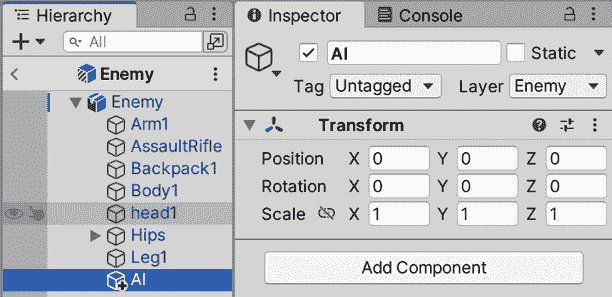

图 9.1：AI 脚本容器

1.  创建一个名为`Sight`的脚本并将其添加到`AI`子对象中。

1.  创建两个名为`distance`和`angle`的`float`类型字段，以及另外两个名为`obstaclesLayers`和`objectsLayers`的`LayerMask`类型字段。`distance`将用作视野距离，`angle`将确定视锥体的幅度，`obstacleLayers`将用于我们的障碍物检查以确定哪些对象被认为是障碍物，而`objectsLayers`将用于确定我们想要`Sight`组件检测的对象类型。

    我们只想让视线看到敌人；我们对墙壁或增益物品等对象不感兴趣。`LayerMask`是一种属性类型，允许我们在代码中选择一个或多个层来使用，因此我们将通过层过滤对象。稍后您将看到我们如何使用它：

    

    图 9.2：用于参数化我们的视线检查的字段

1.  在`Update`中，如*图 9.3*所示调用`Physics.OverlapSphere`。

此函数在由第一个参数指定的地方（在我们的情况下，是我们的位置）创建一个想象中的球体，半径由第二个参数（距离属性）指定，以检测具有第三个参数指定的层（`ObjectsLayers`）的对象。它将返回一个包含在球体内所有找到的碰撞器的数组；这些函数使用物理来执行检查，因此对象必须至少有一个碰撞器。

这是我们将用于找到我们视野距离内的所有敌人的方法，我们将在下一步进一步过滤它们。请注意，我们将位置传递给第一个参数，这实际上不是敌人的位置，而是`AI`子对象的位置，因为我们的脚本位于那里。这突出了 AI 对象位置的重要性。

完成第一次检查的另一种方法是检查我们想要看到的对象与玩家之间的距离，或者如果我们正在寻找其他类型的对象，则检查包含这些对象列表的`Manager`组件。然而，我们选择的方法更加灵活，可以用于任何类型的对象。

此外，您可能还想检查`Physics.OverlapSphereNonAlloc`此函数的版本，它执行相同的操作，但通过不分配返回结果的数组而更高效。

1.  使用`for`循环遍历函数返回的对象数组：

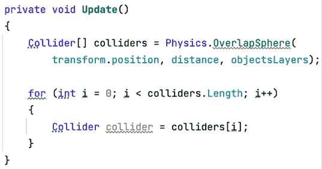

图 9.3：获取一定距离内的所有 GameObject

1.  为了检测物体是否落在视野锥内，我们需要计算我们的观察方向与从我们自身指向物体本身的方位之间的角度。如果这两个方向之间的角度小于我们的锥形角度，我们认为物体在我们的视野内。我们将在以下步骤中这样做：

    开始计算指向物体的方向，这可以通过将物体位置与我们的位置之间的差异进行归一化来实现，就像在*图 9.4*中所示。你可能注意到我们使用了`bounds.center`而不是`transform.position`；这样，我们检查的是指向物体中心的方位，而不是它的旋转点。记住，玩家的旋转点在地面，射线检查可能会在玩家之前与它碰撞：

    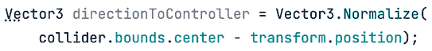

    图 9.4：从我们的位置计算指向碰撞体的方向

1.  我们可以使用`Vector3.Angle`函数来计算两个方向之间的角度。在我们的情况下，我们可以计算指向敌人的方向和我们的前进向量之间的角度来查看角度：

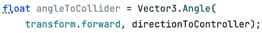

图 9.5：计算两个方向之间的角度

如果你愿意，你可以使用`Vector3.Dot`，这将执行点积，这是一种数学函数，用于计算向量投影到另一个向量上的长度（在网上搜索更多信息）。`Vector3.Angle`实际上使用的是这个函数，但它将点积的结果转换为角度，这需要使用三角函数，并且可能计算起来很耗时。但我们的`Vector3.Angle`方法更简单，编码更快，而且鉴于我们不需要很多传感器，因为我们不会有太多敌人，使用点积优化传感器现在不是必要的，但考虑一下对于更大规模的游戏。

1.  现在检查计算出的角度是否小于在`angle`字段中指定的角度。注意，如果我们设置角度为`90`，实际上将是`180`，因为如果`Vector3.Angle`函数返回，例如，`30`，它可能是向左或向右的`30`。如果我们的角度是`90`，它可能是向左和向右的`90`，所以它将检测到 180 度弧内的物体。

1.  使用`Physics.Linecast`函数在第一个和第二个参数（我们的位置和碰撞体位置）之间创建一个假想线，以检测在第三个参数（障碍物层）中指定的层上的对象，并返回一个`boolean`值，指示该射线是否击中了某个物体。

    理念是使用线来检测我们和检测到的碰撞体之间是否存在任何障碍物，如果没有障碍物，这意味着我们有一个直接视线通向该对象。观察我们如何在*图 9.6*中使用`!`或`not`运算符来检查`Physics.Linecast`是否检测到任何对象。再次注意，这个函数依赖于具有碰撞体的障碍物对象，在我们的例子中，我们有（墙壁、地板等）：

    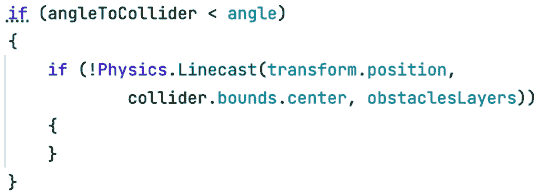

    图 9.6：使用 Linecast 检查传感器和目标对象之间的障碍物

1.  如果对象通过了三个检查，这意味着这是我们当前看到的对象，因此我们可以将其保存到名为`detectedObject`的`Collider`类型字段中，以便其他`AI`脚本稍后使用该信息。

    考虑使用`break`来停止迭代碰撞体的`for`循环，以防止通过检查其他对象而浪费资源，并在`for`之前将`detectedObject`设置为`null`以清除前一帧的结果。所以如果在这一帧中没有检测到任何东西，它将保持`null`值，这样我们就能注意到传感器中没有东西：

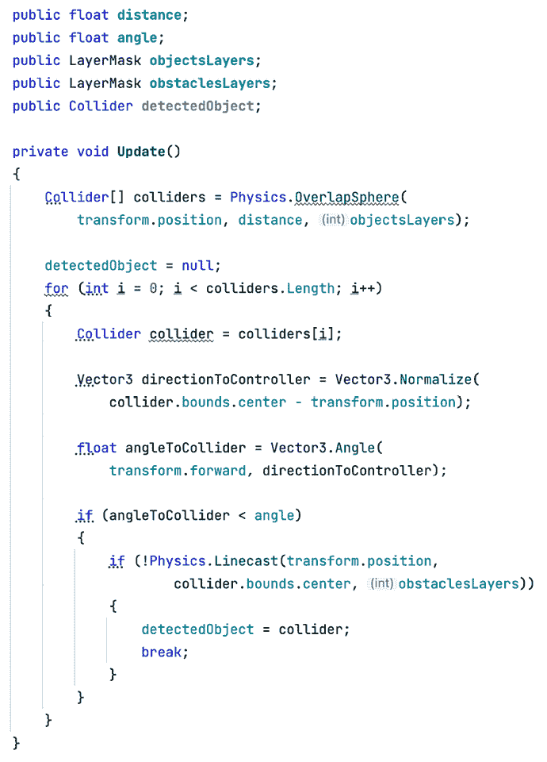

图 9.7：完整的传感器脚本

在我们的例子中，我们只是使用传感器来寻找玩家，这是传感器负责寻找的唯一对象，但如果你想让传感器更高级，你只需保留一个检测到的对象列表，将每个通过三个测试的对象放入其中，而不是只放入第一个。在我们的例子中，这并不必要，因为我们游戏中只有一个玩家。

1.  在编辑器中，根据您的意愿配置传感器。在这种情况下，我们将`ObjectsLayer`设置为`Player`，以便我们的传感器将搜索焦点放在具有该层的对象上，并将`obstaclesLayer`设置为`Default`，这是我们用于墙壁和地板的层。记住，`Sight`脚本位于`AI`GameObject 中，它是`Enemy`预制件的子对象：

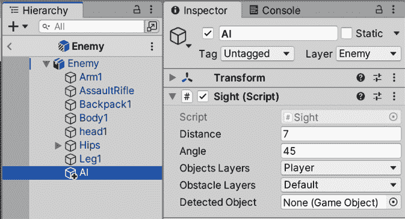

图 9.8：传感器设置

1.  要测试这一点，只需在玩家前方放置一个移动速度为 0 的敌人，选择其`AI`子对象，然后玩游戏以查看属性在检查器中的设置情况。也可以尝试在两者之间放置一个障碍物，并检查属性是否显示**None**（`null`）。如果您没有得到预期的结果，请仔细检查您的脚本、其配置以及玩家是否具有`Player`层，障碍物是否具有`Default`层。此外，您可能需要将`AI`对象稍微抬高一点，以防止射线从地面开始并击中它。

考虑到脚本的大小，我们为视觉脚本版本分配一个整个章节，因为它还引入了一些在这里需要的新视觉脚本概念。

## 使用视觉脚本创建三过滤传感器

关于视觉脚本版本，让我们逐部分检查，从**重叠球体**开始：

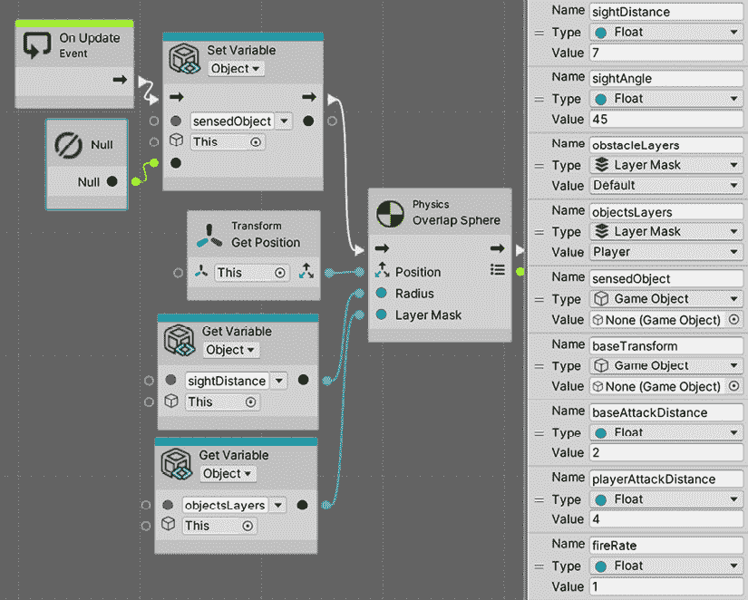

图 9.9：视觉脚本中的重叠球体

到目前为止，我们只是在将`sensedObject`变量设置为`null`后调用了**重叠球体**。需要考虑的是，检查器中**变量**组件中的`sensedObject`变量没有类型（在视觉脚本中，**Null**类型实际上没有类型）。这在 C#中是不可能的——所有变量都必须有类型——虽然我们可以将`sensedObject`变量设置为正确的类型（**Collider**），但我们将会通过脚本稍后设置变量类型。即使我们现在设置类型，如果未设置值，视觉脚本往往会忘记类型，并且我们无法设置它，直到我们检测到某个东西。

目前不必担心这个问题；当我们通过脚本设置变量时，它将获得正确的类型。实际上，在视觉脚本中，所有变量都可以在运行时根据我们设置的值切换类型，这取决于**变量**组件的工作方式。不过，我不建议这样做：尽量坚持使用预期的变量类型。

我们刚才说过，C#中的所有变量都必须有类型，但这并不完全正确。有方法可以创建动态类型的变量，但这不是一种我推荐使用的良好实践，除非没有其他选择。

另一个需要注意的事情是我们如何使用**Null**节点在开始时将`sensedObject`变量设置为`null`，这实际上代表了`null`值。

现在，让我们探索`Foreach`部分：

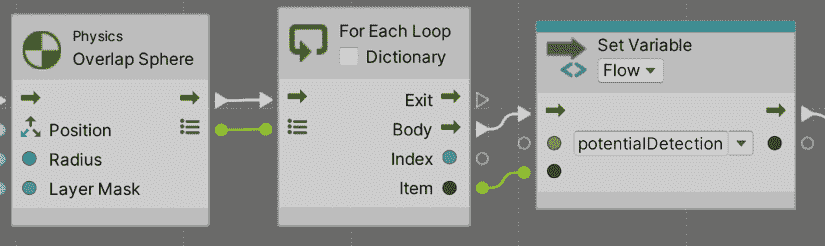

图 9.10：视觉脚本中的集合迭代

我们可以看到**重叠球体**的一个输出引脚是一个小列表，它本质上代表了由**重叠球体**返回的碰撞器数组。我们将该引脚连接到**For Each Loop**节点，正如你可能想象的那样，它遍历提供的集合（数组、列表、字典等）。**Body**引脚代表循环中要执行的节点，**Item**输出引脚代表当前正在迭代的项——在我们的案例中，是**重叠球体**检测到的碰撞器之一。最后，我们将该项保存在一个**Flow** `potentialDetection`变量中，**Flow**变量在 C#函数中相当于局部变量。

这里的想法是，考虑到图的大小和我们查询当前迭代项的次数，我们不想让连接输出**Item**引脚到其他节点的线穿过整个图。相反，我们将该项保存在**Flow**变量中以供以后引用，本质上是在图中命名该值以供以后引用，你将在下一部分中看到这一点。

现在我们来探索**角度**检查：

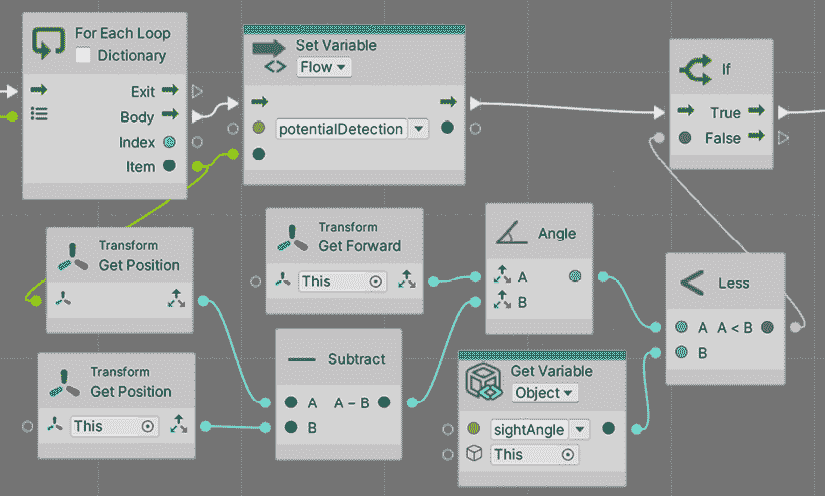

图 9.11：视觉脚本中的角度检查

在这里，你可以看到我们将 C#中检测角度的直接翻译，所以应该很容易理解。这里唯一需要注意的是，由于**Item**输出引脚与**Get Position**节点（我们查询其位置的节点）的邻近性，我们直接连接了该节点，但稍后我们将使用`potentialDetection`流变量。

现在，让我们探索**Linecast**部分：

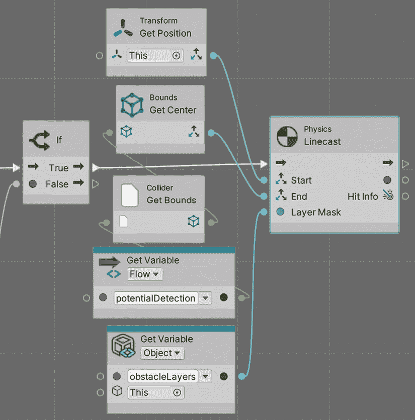

图 9.12：在视觉脚本中的 Linecast 检查

再次强调，这与我们在 C#中之前所做的是基本相同的。这里要强调的唯一一点是我们使用了**Flow**变量`potentialDetection`来再次获取当前迭代的项的位置，而不是将**Get Position**节点一直连接到**Foreach** **Item**输出引脚。

现在，让我们探索最后一部分：

图 9.13：设置 sensedObject

再次，相当直观；如果**Linecast**返回`false`，我们将`potentialDetection`变量（当前迭代的项）设置为`sensedObject`变量（稍后其他脚本将访问它以查询我们的 AI 现在可以看到哪个对象）。这里需要考虑的是**Break Loop**节点的使用，它是 C#中`break`关键字的等效物；本质上，我们正在停止我们当前所在的**Foreach**循环。

现在，即使我们的传感器正在工作，有时检查它是否正常工作或正确配置也需要一些我们可以使用 Gizmos 创建的视觉辅助工具。

## 使用 Gizmos 进行调试

当我们创建我们的 AI 时，我们将开始检测边缘情况中的某些错误，通常与配置错误有关。你可能认为玩家在敌人的视距范围内，但你可能看不到视线被一个物体遮挡，尤其是在敌人不断移动的情况下。调试这些场景的一个好方法是使用仅编辑器可见的视觉辅助工具`Gizmos`，它允许你可视化不可见的数据，如视距或用于检测障碍物的`Linecasts`。

让我们通过以下步骤来了解如何通过绘制表示视距的球体来创建`Gizmos`：

1.  在`Sight`脚本中，创建一个名为`OnDrawGizmos`的事件函数。这个事件仅在编辑器中执行（不在构建中），并且是 Unity 要求我们绘制`Gizmos`的地方。

1.  使用`Gizmos.DrawWireSphere`函数，将我们的位置作为第一个参数，将距离作为第二个参数来绘制一个球体，其半径等于我们的距离。你可以检查当你改变距离字段时`Gizmo`的大小如何变化：

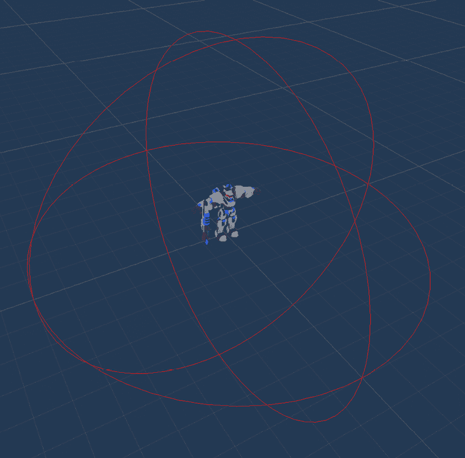

图 9.14：球体 Gizmo

1.  可选地，你可以在调用绘图函数之前更改 gizmo 的颜色，设置`Gizmos.color`：

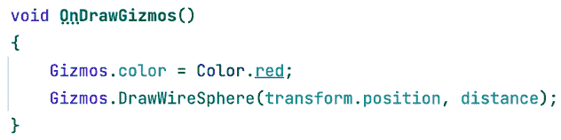

图 9.15：Gizmos 绘制代码

现在你正在不断地绘制`Gizmos`，如果你有很多敌人，它们可能会因为过多的`Gizmos`而污染场景视图。在这种情况下，尝试使用`OnDrawGizmosSelected`事件函数，它只在对象被选中时绘制`Gizmos`。

1.  我们可以使用`Gizmos.DrawRay`来绘制代表锥形的线条，它接收要绘制的线条的起点和方向，可以通过乘以一个特定的值来指定线条的长度，如下面的截图所示：

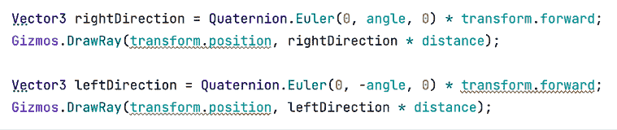

图 9.16：绘制旋转的线条

1.  在截图中，我们使用了`Quaternion.Euler`根据我们想要旋转的角度生成四元数。四元数是一种数学结构，用于表示旋转；请搜索此术语以获取更多关于它的信息。如果我们用这个四元数乘以一个方向，我们将得到旋转后的方向。我们正在根据角度字段旋转我们的前向向量，以生成我们的锥形视野线。

此外，我们将这个方向乘以视线距离来绘制线条，直到我们的视线所能看到的地方；你会看到线条如何与球体的末端匹配：

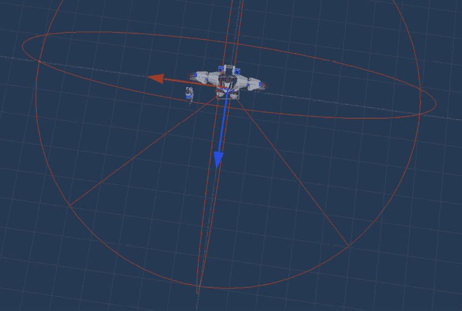

图 9.17：视野角度线

我们还可以绘制`Linecasts`，它们检查障碍物，但鉴于这些取决于游戏的当前情况，例如通过前两个检查的对象及其位置，我们可以使用`Debug.DrawLine`代替，它可以在`Update`方法中执行。这个版本的`DrawLine`是为运行时设计的。我们看到的`Gizmos`也在编辑器中执行。让我们以下面的方式尝试它们：

1.  首先，让我们调试`Linecast`没有检测到任何障碍物的情况，因此我们需要在传感器和物体之间绘制一条线。我们可以在调用`Linecast`的`if`语句中调用`Debug.DrawLine`，如下面的截图所示：

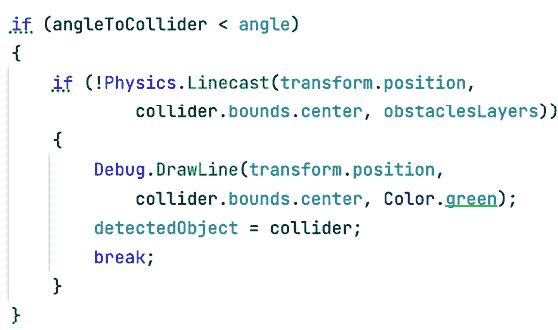

图 9.18：在 Update 中绘制线条

1.  在下一个截图中，你可以看到`DrawLine`的实际应用：

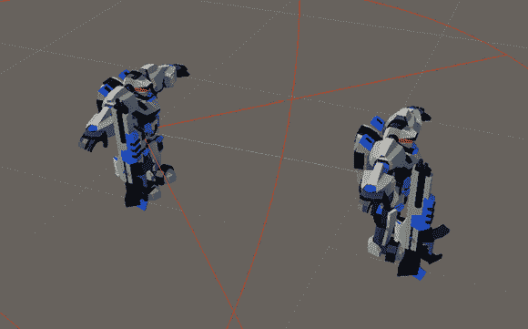

图 9.19：指向检测到的物体的线条

1.  当视线被物体遮挡时，我们也想用红色绘制一条线。在这种情况下，我们需要知道`Linecast`碰撞的位置，因此我们可以使用函数的重载，它提供了一个`out`参数，可以给我们更多关于线条碰撞的信息，例如碰撞位置、法线和碰撞物体，如下面的截图所示：

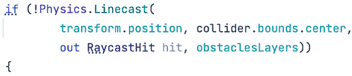

图 9.20：获取 Linecast 的信息

注意，`Linecast`并不总是与最近的障碍物碰撞，而是与它在直线上检测到的第一个对象碰撞，这可能会变化。如果你需要检测最近的障碍物，请查找`Physics.Raycast`函数的版本。

1.  我们可以利用这些信息在`else`分支中，当线条与物体碰撞时，从我们的位置绘制到碰撞点：

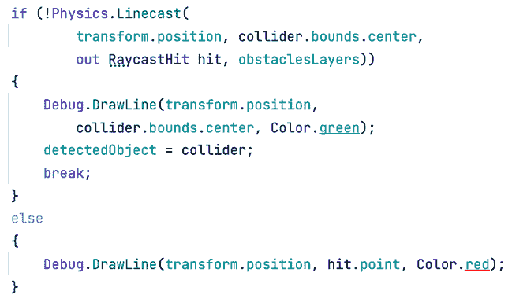

图 9.21：如果有障碍物则绘制线条

1.  在下一张屏幕截图中，你可以看到结果：

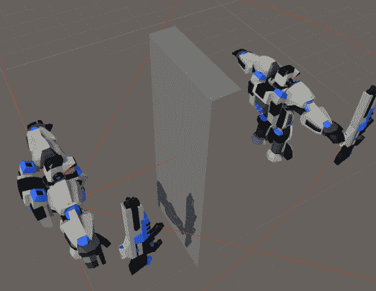

图 9.22：当障碍物遮挡视线时的线条

关于视觉脚本版本，第一部分将看起来像这样：

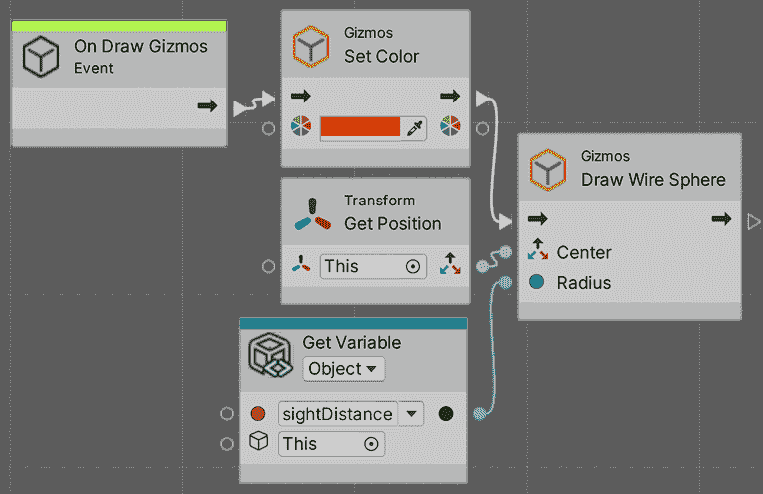

图 9.23：在视觉脚本中绘制 Gizmos

然后，角度线将看起来像这样：

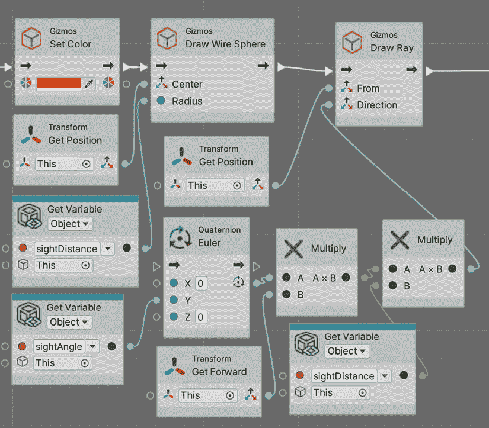

图 9.24：在视觉脚本中绘制视线角度线

注意，这里我们只展示了一个，但另一个本质上相同，只是将角度乘以-1。最后，指向检测到的对象和障碍物的红色线条将看起来像这样：

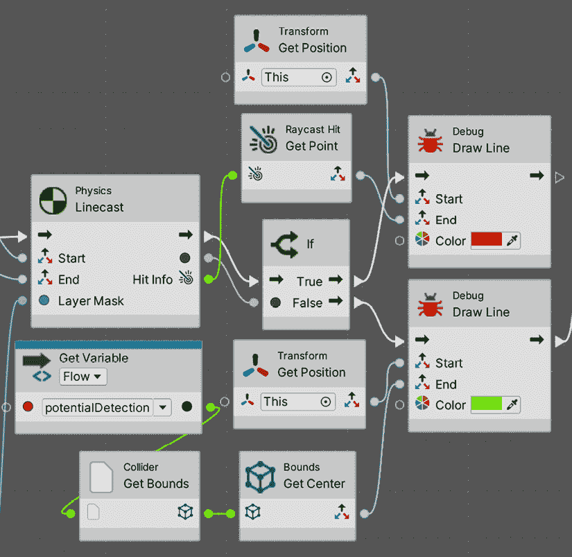

图 9.25：在视觉脚本中绘制指向障碍物或检测到的对象的线条

注意，为了完成最后一点，我们需要将之前的**Linecast**节点更改为返回**Raycast Hit**信息的版本。

在所有这些的基础上，在本节中，我们创建了传感器系统，它将为我们的 AI 提供视力，并大量关于下一步要做什么的信息。现在我们的传感器已经完成，让我们利用它们提供的信息使用有限状态机（FSMs）来做出决策。

# 使用 FSMs 做出决策

我们在之前使用`Animator`组件时探讨了**有限状态机（FSMs**）的概念。我们了解到，FSM 是一组状态，每个状态代表一个对象在某一时刻可以执行的动作，以及一组转换，这些转换规定了状态如何切换。这个概念不仅用于动画，而且在无数的编程场景中都有应用，其中之一就是 AI。我们只需在状态中用 AI 代码替换动画，我们就有了一个 AI FSM。

在本节中，我们将探讨以下 AI FSM 概念：

+   在 C#中创建 FSM

+   创建转换

+   在视觉脚本中创建 FSM

让我们先创建我们的 FSM 框架。

## 在 C#中创建 FSM

要创建我们自己的 FSM，我们需要回顾一些基本概念。记住，FSM 可以为每个可能执行的动作有一个状态，并且一次只能执行一个。

在 AI 方面，例如，我们可以巡逻、攻击、逃跑等。还要记住，状态之间存在转换，这些转换决定了从一种状态转换到另一种状态所需满足的条件，在 AI 方面，这可能是用户靠近敌人开始攻击或生命值低开始逃跑。在下图中，你可以找到一个简单的门两种可能状态的提醒示例：

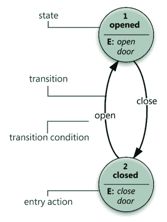

图 9.26：FSM 示例

1.  有几种方法可以实现 AI 的 FSMs；如果你愿意，甚至可以使用`Animator`组件，或者从资源商店下载一些 FSM 系统。在我们的情况下，我们将采取最简单的方法，即一个包含一系列`If`语句的单个脚本，这虽然简单，但仍然是理解概念的好开始。让我们通过以下步骤来实现它：

1.  在敌人的`AI`子对象中创建一个名为`EnemyFSM`的脚本。

1.  创建一个名为`EnemyState`的`enum`，包含`GoToBase`、`AttackBase`、`ChasePlayer`和`AttackPlayer`值。我们将在我们的 AI 中拥有这些状态。

1.  创建一个名为`currentState`的`EnemyState`类型字段，它将保存我们敌人的当前状态：

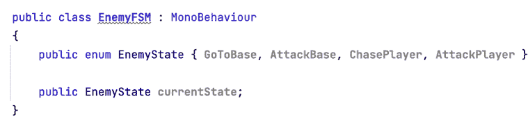

图 9.27：EnemyFSM 状态定义

1.  创建三个以我们定义的状态命名的函数。

1.  根据当前状态在`Update`中调用这些函数：

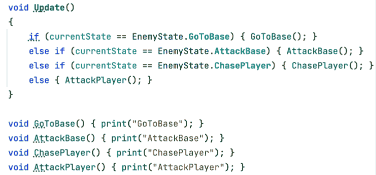

图 9.28：基于 If 的有限状态机

是的，您完全可以在这里使用 switch，但我只是更喜欢这个示例中的常规`if`语法。

1.  在编辑器中测试如何更改`currentState`字段将更改哪个状态是活动的，查看控制台中的打印消息：

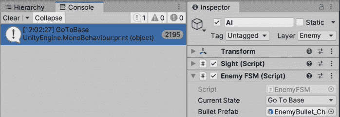

图 9.29：状态测试

如您所见，这是一个相当简单但完全功能的方法。在未来，您可能会面临需要编写具有更多状态敌人的情况，这种方法将开始变得不适用。在这种情况下，您可以使用您喜欢的任何资产商店的有限状态机插件，以获得更强大和可扩展的工具，或者甚至考虑更高级的技术，如行为树，但这超出了本书的范围。现在让我们继续使用有限状态机，创建其转换。

## 创建转换

如果您还记得在`Animator Controller`中创建的转换，那些基本上是一组条件，如果转换所属的状态是活动的，则会检查这些条件。在我们的有限状态机方法中，这简单地转化为检测状态内条件的`If`语句。让我们按照以下方式创建我们建议状态之间的转换：

1.  在我们的有限状态机脚本中添加一个名为`sightSensor`的`Sight`类型字段，并将 AI `GameObject`拖动到该字段以连接到那里的`Sight`组件。由于有限状态机组件与`Sight`组件位于同一对象中，我们也可以使用`GetComponent`，但在高级 AI 中，你可能有不同的传感器来检测不同的对象，所以我更喜欢为那种情况准备我的脚本。你应该选择你最喜欢的方法。

1.  在`GoToBase`函数中，检查`Sight`组件检测到的对象是否不为`null`，这意味着在我们的视线中有东西。如果我们的 AI 正在向基地移动但检测到障碍物中的对象，我们必须切换到`Chase`状态以追击玩家，因此我们改变状态，如下面的截图所示：

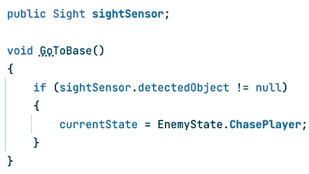

图 9.30：创建转换

1.  此外，如果我们离必须损坏以减少基础生命值的目标足够近，我们必须切换到`AttackBase`。我们可以创建一个名为`baseTransform`的`Transform`类型字段，并将之前创建的玩家基础生命值对象拖动到那里，以便我们可以检查距离。记得添加一个名为`baseAttackDistance`的浮点字段，以便可以配置该距离：

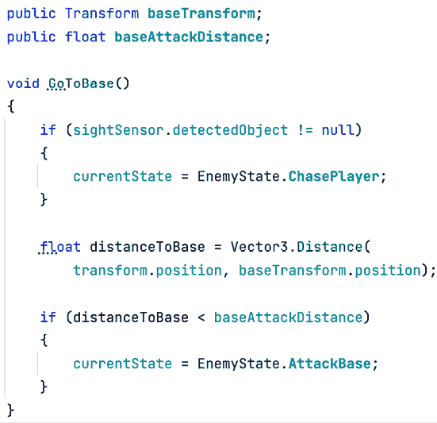

图 9.31：GoToBase 转换

1.  在`ChasePlayer`的情况下，我们需要检查玩家是否在视线之外，以便切换回`GoToBase`状态，或者我们是否足够接近玩家以开始攻击它。我们需要另一个名为`PlayerAttackDistance`的距离字段，它决定了攻击玩家的距离，我们可能希望为这两个目标设置不同的攻击距离。考虑在转换中提前返回，以防止在没有任何传感器检测到的对象时尝试访问其位置时出现`null`引用异常：

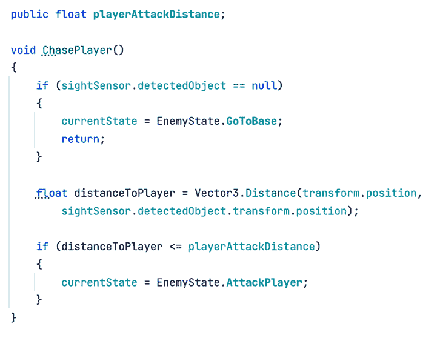

图 9.32：ChasePlayer 状态转换

1.  对于`AttackPlayer`，我们需要检查玩家是否在视线之外以返回`GoToBase`，或者它是否足够远以返回追逐它。你会注意到我们是如何将`playerAttackDistance`相乘，使停止攻击的距离略大于开始攻击的距离；这将防止当玩家接近那个距离时在攻击和追逐之间快速切换。

你可以将其设置为可配置的，而不是硬编码`1.1`：

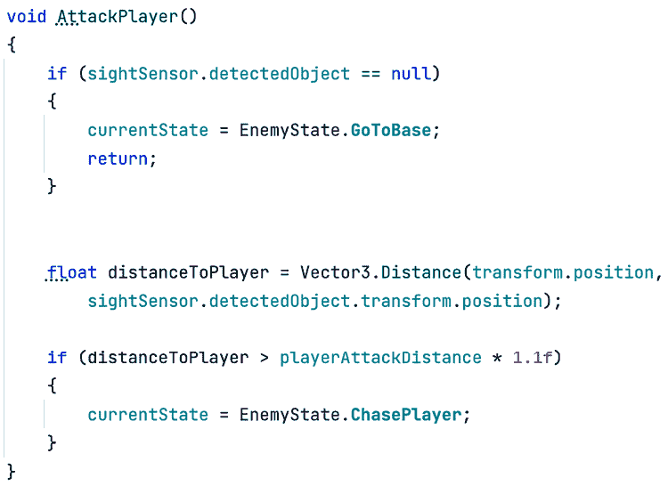

图 9.33：AttackPlayer 状态转换

1.  在我们的案例中，`AttackBase`将不会有任何转换。一旦敌人足够接近基地以攻击它，它就会保持这种状态，即使玩家开始射击它。一旦到达那里，它的唯一目标就是摧毁基地。

1.  记住你可以使用`Gizmos`来绘制距离：

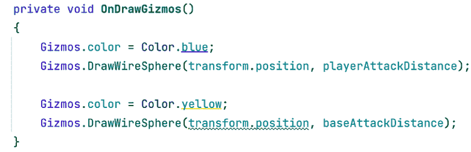

图 9.34：FSM Gizmos

1.  在点击播放之前选择 AI 对象并移动玩家，以测试脚本，检查检查器中的状态如何变化。你还可以保留每个状态中的原始`print`消息，以在控制台中查看它们的变化。记住要设置攻击距离和对象的引用。在截图中，你可以看到我们使用的设置：

图 9.35：敌人 FSM 设置

我们现在会遇到的一个小问题是，生成的敌人将不会有进行到玩家基地转换的距离计算所需的引用。你会注意到，如果你尝试将场景中敌人的更改应用到 Prefab（**覆盖 -> 应用全部**），则**基地转换**变量将显示为`None`。记住，Prefab 不能包含对场景中对象的引用，这使我们的工作变得更加复杂。一个替代方案是创建`BaseManager`，一个单例，它持有对损坏位置的引用，这样我们的`EnemyFSM`就可以访问它。另一个方案可能是使用`GameObject.Find`等函数来查找我们的对象。

在这种情况下，我们将看到后者。尽管它可能比`Manager`版本性能略低，但我想要向你展示如何使用它来扩展你的 Unity 工具集。在这种情况下，只需在`Awake`中将`baseTransform`字段设置为`GameObject`.`Find`的返回值，使用`BaseDamagePoint`作为第一个参数，这将查找具有相同名称的对象，如下面的截图所示。

你会看到现在我们的波生成的敌人将改变状态：

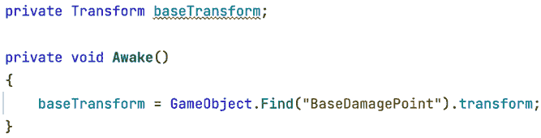

图 9.36：通过名称在场景中搜索对象

现在我们已经将 FSM 状态编码并正确执行了转换，让我们看看如何在视觉脚本中做到同样的事情。如果你只对 C#版本感兴趣，可以自由跳过以下部分。

## 在视觉脚本中创建 FSM

到目前为止，在视觉脚本中的大多数脚本几乎与 C#版本相同，只是在一些节点上有所不同。在考虑状态机时，我们可以做同样的事情，但相反，我们将使用视觉脚本的**状态机**系统。概念是相同的，你有状态并且可以切换它们，但状态的组织方式和转换何时触发是通过视觉管理的，这与 Animator 系统的方式相似。所以，让我们通过创建我们的第一个`状态机图`和一些`状态`来看看我们如何使用这个系统。按照以下步骤操作：

1.  将**状态机**组件添加到我们的敌人上。请记住，它被称为**状态机**而不是**脚本机**，后者是常规视觉脚本的组件。

1.  在组件中点击**新**按钮，并选择一个位置保存`fixed`资产，方式与我们迄今为止为常规视觉脚本所做的方式相似。在我的情况下，我将其命名为`EnemyFSM`。

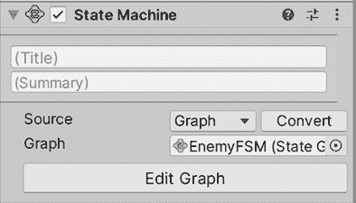

图 9.37：创建视觉状态机

1.  双击**状态机图**以通常方式编辑它。

1.  在**图**编辑器的任何空白区域右键单击，然后选择**创建脚本状态**以创建一个新状态：

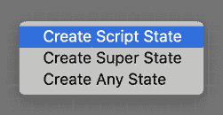

图 9.38：创建我们的第一个视觉状态机状态

1.  重复*步骤 4*，直到你拥有 4 个状态：

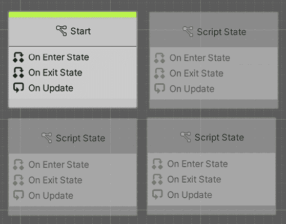

图 9.39：视觉状态

1.  选择任何一个，然后在左侧的**信息**面板中，将**标题**字段（第一个）填写为我们之前创建的任何状态的名字（`GoToBase`、`AttackBase`、`ChasePlayer`和`AttackPlayer`）。如果你看不到**信息**面板，点击中间带有**i**的按钮以显示它：

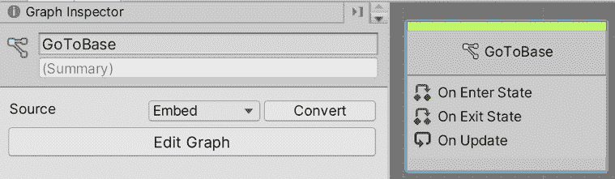

图 9.40：重命名视觉状态

1.  重复上述步骤，直到你为每个状态节点命名，每个节点都对应于本章“在 C#中创建 FSM”部分中创建的状态：

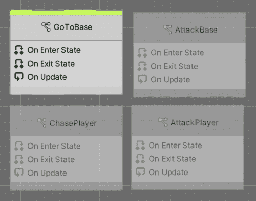

图 9.41：所有需要的状态

1.  你可以看到其中一个状态顶部有一个绿色条，这代表哪个节点应该是第一个。我将那个初始状态重命名为`GoToBase`，因为这是我更喜欢作为第一个的状态。如果你没有将其作为起始状态，右键单击当前具有绿色条的状态机中的节点，选择**切换起始**以从它那里移除绿色条，然后对你想作为第一个的节点（在我们的场景中是`GoToBase`）重复此操作，将绿色条添加到该节点上。

需要考虑的是，在视觉脚本中可以有一个以上的起始状态，这意味着您可以同时运行多个状态并转换。如果可能，我建议避免同时只有一个状态处于活动状态，以使事情变得简单。

1.  双击`GoToBase`以进入这些状态的编辑模式。将一个**String**节点连接到**OnUpdate**事件节点中的**print** **Message**输入引脚，以打印一条消息说`GoToBase`：

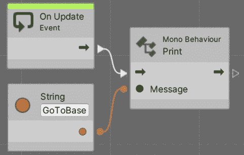

图 9.42：我们的第一个状态机逻辑

1.  在顶部栏中，单击**GoToBase**左侧的**EnemyFSM**标签以返回到整个状态机视图。如果您看不到它，请单击第三个按钮（看起来像 *<x>*）右侧的任何文本标签：

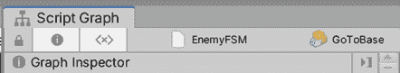

图 9.43：返回到状态机编辑模式

1.  如果您不打算使用其他事件节点，可以随意删除它们。

1.  对每个状态重复*步骤 9-11*，直到它们都打印出它们的名称。

通过这种方式，我们已经创建了表示我们 AI 可能状态的节点。在下一节中，我们将为它们添加逻辑，使其变得有意义，但在那之前，我们需要通过以下方式创建状态之间的转换和触发它们的条件：

1.  在敌人的**变量**组件中创建变量`baseTransform`、`baseAttackDistance`和`playerAttackDistance`，因为我们将在执行转换时需要它们。

1.  不要为`baseTransform`设置任何类型，因为我们将在稍后通过代码填充它，但关于`baseAttackDistance`，使用**Float**类型并设置值为`2`，最后对于`playerAttackDistance`，也使用**Float**并设置值为`3`。如果您愿意，可以更改这些值：

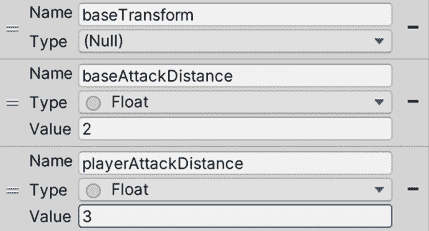

图 9.44：我们转换所需的变量

1.  右键单击`GoToBase`节点，选择**创建转换**选项，然后单击`ChasePlayer`节点。这将在这两个状态之间创建一个转换：

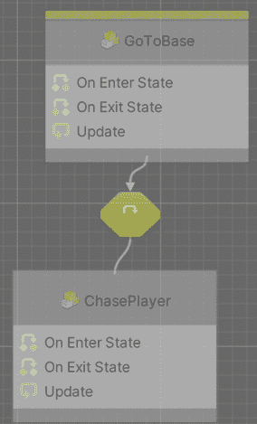

图 9.45：两个状态之间的转换

1.  对 C#版本中创建的每个转换重复*步骤 3*。`状态机图形`需要看起来像以下截图：

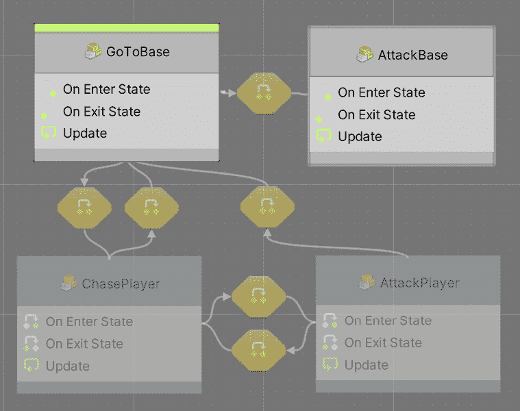

图 9.46：所有需要的转换

1.  双击**GoToBase**和**ChasePlayer**之间的转换中间的黄色形状以进入**转换**模式。在这里，您将能够指定将触发该转换的条件（而不是在状态逻辑中使用`If`节点）。请记住，您有两个黄色形状，每个方向一个，所以请确保您双击的是基于连接它们的白色箭头的正确形状。

1.  修改图形以检查`sensedObject`变量是否不是`null`。它应该看起来像这样：

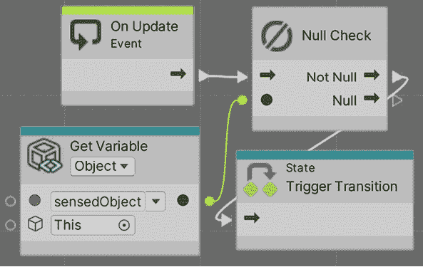

图 9.47：添加转换条件

1.  **GoToBase** 和 **AttackBase** 之间的转换应该看起来像这样：

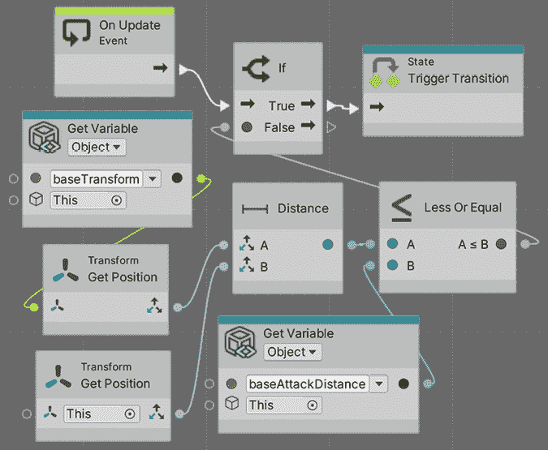

图 9.48：从 **GoToBase** 到 **AttackBase** 的转换条件

1.  现在，**ChasePlayer** 到 **GoToBase** 应该如下所示：

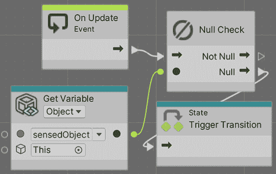

图 9.49：从 **ChasePlayer** 到 **GoToBase** 的转换条件

1.  对于从 **ChasePlayer** 到 **AttackPlayer** 的转换，按照 *图 9.50* 所示操作。这本质上与 **GoToBase** 和 **AttackBase** 相同，都是距离检查，但目标不同：

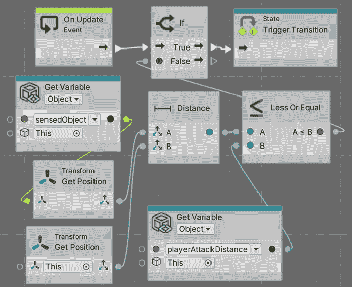

图 9.50：从 **ChasePlayer** 到 **AttackPlayer** 的转换条件

1.  对于从 **AttackPlayer** 到 **ChasePlayer** 的转换，按照 *图 9.51* 所示操作。这又是一个距离检查，但现在检查距离是否更大，并将距离乘以 `1.1`（以防止像我们在 C# 版本中解释的那样转换抖动）：

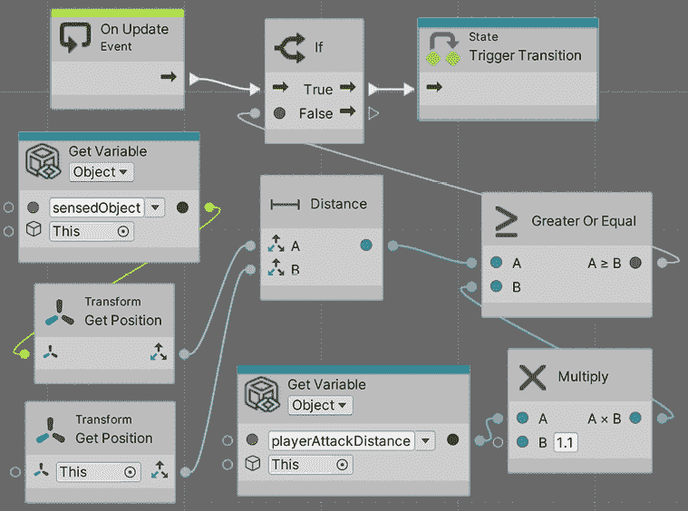

图 9.51：从 **AttackPlayer** 到 **ChasePlayer** 的转换条件

1.  最后，对于从 **AttackPlayer** 到 **GoToBase** 的转换，这是预期的图形：

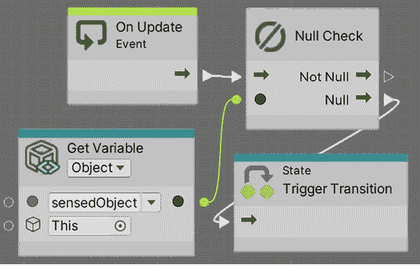

图 9.52：从 **AttackPlayer** 到 **GoToBase** 的转换条件

在继续之前，我们需要解决的一个小细节是我们仍然没有在 `baseTransform` 变量中设置任何值。想法是通过代码来填充它，就像我们在 C# 版本中所做的那样。但在这里需要考虑的是，我们无法将 `Awake` 事件节点添加到整个状态机中，而只能添加到状态中。

在这种情况下，我们可以使用 **OnEnterState** 事件，这是一个状态机的专用事件节点。它将在状态变为活动状态时立即执行，这对于状态初始化很有用。我们可以在 **GoToBase** 状态的 **OnEnterState** 事件节点中添加初始化 `baseTransform` 变量的逻辑，因为这是我们首先执行的状态。

这样，**GoToBase** 逻辑将看起来像 *图 9.53* 所示。记得双击状态节点来编辑它：

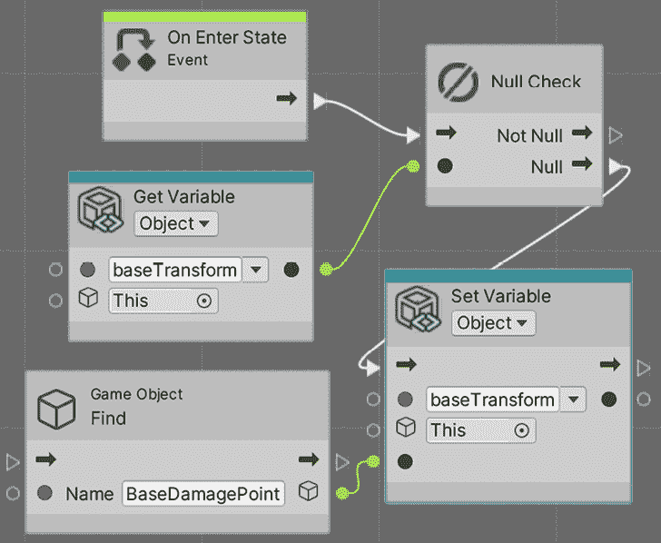

图 9.53：**GoToBase** 初始化逻辑

注意，在这里，我们仅在 **Null Check** 的 **Null** 插针上将 **Find** 节点的结果设置到变量中。**Null Check** 的作用是检查我们的 **baseTransform** 变量是否已设置，如果是，则通过 `Not Null` 插针，如果不是，则通过 `Null` 插针。这样我们就可以避免每次进入 **GoToBase** 状态时都执行 **GameObject.Find**，而只需第一次。此外，请注意，在这种情况下，我们不仅会在对象初始化时执行 **Set Variable** 节点，而且每次 **GoToBase** 成为当前状态时也会执行。如果这导致意外的行为，其他选项可以是创建一个新的初始状态，初始化所有内容，然后转换到其他状态，或者也许可以创建一个经典的 Visual Script 图形，在 **On Start** 事件节点中初始化这些变量。

通过这一切，我们学习了如何通过有限状态机（FSM）为我们的 AI 创建决策系统。它将根据通过传感器和其他系统收集的信息做出决策。现在我们的 FSM 状态已经编码并且过渡正确，让我们让它们做一些事情。

# 执行有限状态机（FSM）动作

现在我们需要完成最后一步——让 FSM 做一些有趣的事情。在这里，我们可以做很多事情，比如射击基地或玩家，并将敌人移动到其目标（基地或玩家）处。我们将使用 Unity 的寻路系统`NavMesh`来处理移动，这是一个允许我们的 AI 在两点之间计算和遍历路径，同时避开障碍的工具，这需要一些准备才能正常工作。

在本节中，我们将探讨以下有限状态机（FSM）动作概念：

+   计算场景的`NavMesh`

+   使用寻路功能

+   添加最终细节

让我们首先使用寻路功能来为移动场景做准备。

## 计算场景的`NavMesh`

寻路算法依赖于场景的简化版本。分析复杂场景的完整几何形状在实时中几乎是不可能的。有几种方式可以表示从场景中提取的寻路信息，例如图和`NavMesh`几何形状。Unity 使用后者——一个简化的网格，类似于 3D 模型，覆盖了 Unity 确定的所有可通行区域。在下一张截图，你可以找到一个场景中生成的`NavMesh`示例，即浅蓝色几何形状：

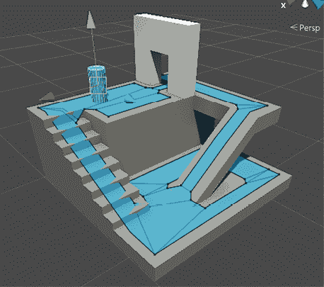

图 9.54：场景中可通行区域的 NavMesh

生成`NavMesh`可能需要从几秒到几分钟，这取决于场景的大小。这就是为什么 Unity 的寻路系统在编辑器中只计算一次`NavMesh`，这样当我们分发我们的游戏时，用户将使用预先生成的`NavMesh`。就像光照贴图一样，`NavMesh`被烘焙到一个文件中供以后使用。就像光照贴图一样，这里的主要缺点是`NavMesh`对象在运行时不能改变。如果你销毁或移动一个地板砖，AI 仍然会走过那个区域。`NavMesh`本身没有注意到地板已经不在了，所以你无法以任何方式移动或修改这些对象。幸运的是，在我们的情况下，我们不会在运行时遭受场景的任何修改，但请注意，有一些组件，如`NavMeshObstacle`，可以帮助我们在那些场景中。

要为场景生成`NavMesh`，请执行以下操作：

1.  选择任何可通行物体及其上面的障碍物，例如地板、墙壁和其他障碍物，并将它们标记为**静态**。你可能记得**静态**复选框也会影响光照贴图，所以如果你想使一个物体不参与光照贴图但要对`NavMesh`生成做出贡献，你可以点击静态检查框左侧的箭头，并仅选择**导航静态**。尽量将`Navigation Static` GameObjects 限制在敌人实际会穿越的物体上，以增加`NavMesh`生成速度。在我们的案例中，使地形可通行会增加生成时间很多，而且我们永远不会在那个区域玩游戏。

1.  在**窗口 | AI | 导航**中打开`NavMesh`面板。

1.  选择**烘焙**选项卡，点击窗口底部的**烘焙**按钮，并检查生成的`NavMesh`：

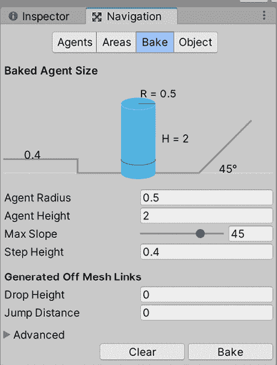

图 9.55：生成 NavMesh

这基本上就是你需要做的所有事情。当然，还有很多设置你可以调整，例如**最大坡度**，它表示 AI 能够爬升的最大坡度角度，或者**步高**，它将决定 AI 是否能够爬楼梯，连接`NavMesh`中楼梯之间的楼层，但鉴于我们的场景简单，默认设置就足够了。

现在，让我们让我们的 AI 在`NavMesh`周围移动。

## 使用路径查找

为了制作一个使用`NavMesh`移动的 AI 对象，Unity 提供了`NavMeshAgent`组件，这将使我们的 AI 粘附在`NavMesh`上，防止物体超出其范围。它不仅会自动计算到指定目的地的路径，还会使用模拟人类移动路径的方式，通过转向行为算法移动物体，在角落减速并使用插值转向，而不是瞬间转向。此外，此组件还能够避开场景中运行的其它`NavMeshAgent GameObjects`，防止所有敌人同时聚集在同一位置。

让我们通过以下步骤使用这个强大的组件：

1.  选择**敌人**预设件，并将其`NavMeshAgent`组件添加到其中。将其添加到根对象，即名为`Enemy`的对象，而不是 AI 子对象——我们希望整个对象都能移动。你将看到围绕对象的一个圆柱体，表示该对象在`NavMesh`中将占用的区域。请注意，这并不是一个碰撞器，因此它不会被用于物理碰撞：

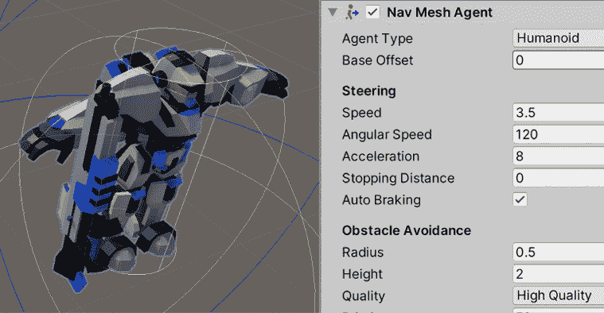

图 9.56：NavMeshAgent 组件

1.  移除`ForwardMovement`组件；从现在起，我们将使用`NavMeshAgent`来驱动敌人的移动。

1.  在`EnemyFSM`脚本的`Awake`事件函数中，使用`GetComponentInParent`函数来缓存`NavMeshAgent`的引用。这将与`GetComponent`类似工作——它将在我们的`GameObject`中查找组件，但如果组件不存在，这个版本将尝试在所有父组件中查找该组件。请记住添加`using UnityEngine.AI`行以在脚本中使用`NavMeshAgent`类：

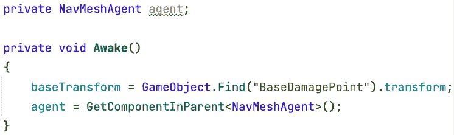

图 9.57：缓存父组件引用

如您所想象，也存在`GetComponentInChildren`方法，它首先在`GameObject`中搜索组件，如果需要，然后在所有子组件中搜索。

1.  在`GoToBase`状态函数中，调用`NavMeshAgent`引用的`SetDestination`函数，传入基地对象的当前位置作为目标：

图 9.58：为我们的 AI 设置目标

1.  保存脚本，并在场景中的几个敌人或由波浪生成的敌人上测试此脚本。您将看到问题，即敌人永远不会停止向目标位置移动，如果需要，甚至当他们足够接近时，也会进入对象内部。这是因为我们从未告诉`NavMeshAgent`停止，我们可以通过将代理的`isStopped`字段设置为`true`来实现这一点。

    您可能想要调整基础攻击距离，使敌人停止得更近或更远：

    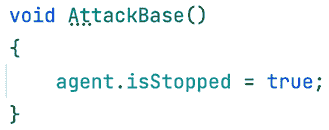

    图 9.59：停止代理移动

1.  我们可以对`ChasePlayer`和`AttackPlayer`做同样的操作。在`ChasePlayer`中，我们可以将代理的目标设置为玩家的位置，而在`AttackPlayer`中，我们可以停止移动。在这种情况下，攻击玩家可以再次回到`GoToBase`或`ChasePlayer`，因此您需要在这些状态中将`isStopped`代理字段设置为`false`或在进行转换之前。我们将选择前者，因为这个版本将涵盖其他不需要额外代码就停止代理的状态。我们将从`GoToBase`状态开始：

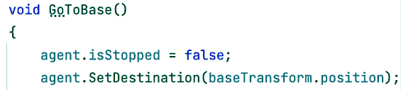

图 9.60：重新激活代理

1.  然后，继续使用`ChasePlayer`：

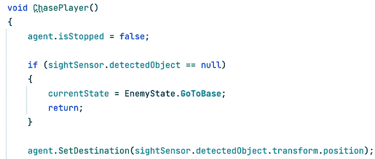

图 9.61：重新激活代理并追逐玩家

1.  最后，继续使用`AttackPlayer`：

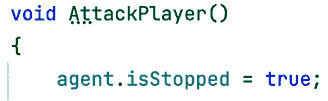

图 9.62：停止移动

1.  您可以调整`NavMeshAgent`的**加速度**、**速度**和**角速度**属性来控制敌人移动的速度。同时，请记住将更改应用到生成的敌人的 Prefab 上，以便受到影响。

1.  关于视觉脚本版本，`GoToBase`将看起来如下截图所示：

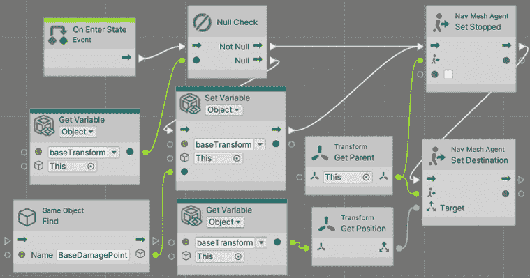图 9.63：使我们的代理移动

1.  我们删除了打印消息的 **OnUpdate** 事件节点，因为我们不再需要它了。此外，我们在设置变量 `if` 为 `null` 后以及变量不是 `null`（**Null** 检查的 **Not Null** 插针）时调用了 **Set Destination** 节点。请注意，所有这些都在 **On Enter State** 事件中发生，所以我们只需要做一次。在 C# 版本中，为了简单起见，我们每帧都这样做，但实际上这是不必要的，所以我们将利用 **OnEnterState** 事件。如果我们想，我们可以在改变状态的时刻（在检查转换条件的 `If` 语句中）执行这些操作，而不是使用 **Update** 函数。最后，注意我们为什么需要使用 **GetParent** 节点来访问敌人根对象中的 `NavMeshAgent` 组件？这是因为我们目前处于 **AI** 子对象中。

1.  现在，**AttackBase** 状态将如下所示：

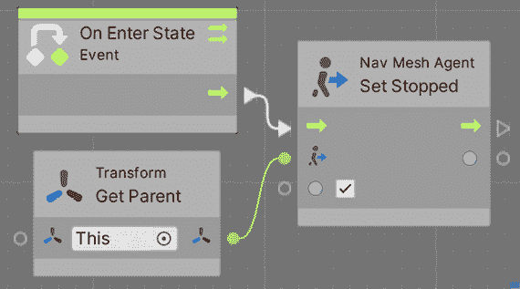

图 9.64：使我们的代理停止

1.  **ChasePlayer** 状态将如下所示：

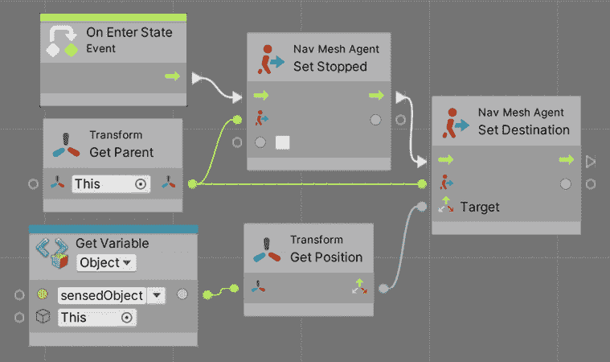

图 9.65：ChasePlayer 逻辑

1.  最后，**AttackPlayer** 如此：

图 9.66：AttackPlayer 逻辑

现在我们已经在我们的敌人中实现了移动，让我们完成我们 AI 的最终细节。

# 添加最终细节

这里我们缺少两件事：敌人没有射击任何子弹，并且它没有动画。让我们从修复射击开始，按照以下步骤操作：

1.  在我们的 `EnemyFSM` 脚本中添加一个 `GameObject` 类型的 `bulletPrefab` 字段和一个名为 `fireRate` 的 `float` 字段。

1.  创建一个名为 `Shoot` 的函数，并在 `AttackBase` 和 `AttackPlayer` 中调用它：

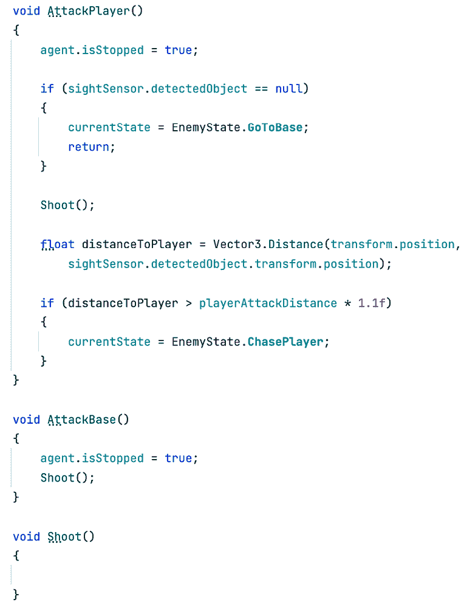

图 9.67：射击函数调用

1.  在 `Shoot` 函数中，放入与 `PlayerShooting` 脚本中用于以特定射击速率射击子弹的类似代码，如 *图 9.68* 所示。记住，如果你的 **Enemy** 预制件中还没有设置，请设置 **Enemy** 层，以防止子弹伤害到敌人本身。你可能还想稍微提高 AI GameObject 的位置，以便从地面或其他位置射击子弹，更好的方法是添加一个 `shootPoint` 变换字段，并在敌人中创建一个空对象作为生成位置。如果你这样做，考虑使空对象不旋转，这样敌人的旋转就能正确地影响子弹的方向：

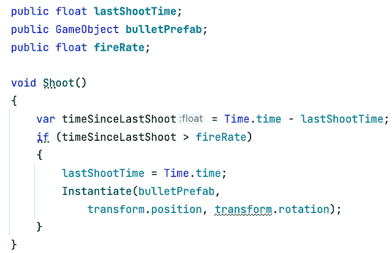

图 9.68：Shoot 函数代码

在这里，你会在 `PlayerShooting` 和 `EnemyFSM` 之间找到一些重复的射击行为。你可以通过创建一个名为 `Shoot` 的函数的 **Weapon** 行为来修复它，该函数实例化子弹并考虑射击速率，并在两个组件内部调用它以重新利用它。

1.  当代理停止时，不仅移动停止，旋转也会停止。如果玩家在敌人被攻击时移动，我们仍然需要敌人面对玩家以射击子弹。我们可以创建一个`LookTo`函数，该函数接收要看的靶位并调用它，在`AttackPlayer`和`AttackBase`中调用它，并将射击的目标传递给它：

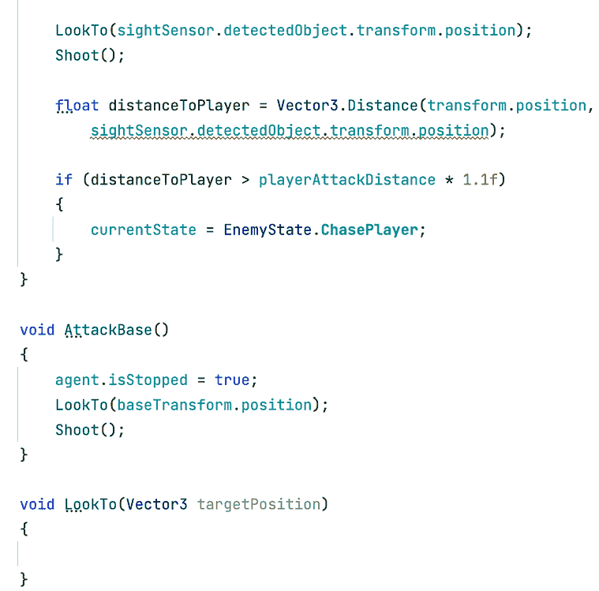

图 9.69：LookTo 函数调用

1.  通过计算从父对象到靶位的方向来完成`LookTo`函数。我们通过`transform.parent`访问我们的父对象，因为，记得，我们是子 AI 对象——将要移动的是我们的父对象。然后，我们将方向的`Y`分量设置为`0`以防止方向向上或向下指——我们不希望我们的敌人垂直旋转。最后，我们将父对象的向前向量设置为该方向，这样它就会立即面对靶位。如果你想有一个更平滑的旋转，你可以用四元数插值来替换它，但现在让我们尽量保持简单：

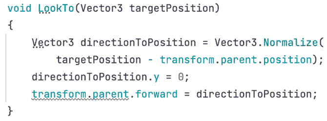

图 9.70：朝向目标看去

1.  关于视觉脚本版本，**AttackBase**动作看起来是这样的：

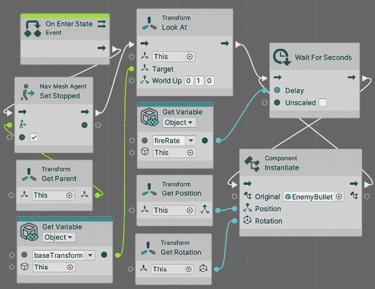

图 9.71：AttackBase 状态

在这个状态下，有一些要点需要强调。首先，我们在**SetStopped**节点之后使用**OnEnterState**事件节点中的**LookAt**节点。正如你可能想象的那样，这与我们在 C#中使用的数学方法做的是一样的。我们指定一个要看的靶位（我们的基地变换）然后我们指定**World Up**参数是一个向上指的向量`0`,`1`,`0`。这将使我们的对象看向基地，但保持其向上向量指向天空，这意味着如果目标低于我们，我们的对象不会看向地面。如果我们想在 C#中使用这个函数（`transform.LookAt`），这个想法只是想展示所有选项。此外，请注意，我们只在状态变为活动状态时执行`LookAt`——因为基地不会移动，我们不需要不断更新我们的方向。

第二个需要强调的是，我们使用了协程来射击，这与我们在`Enemy Spawner`中不断生成敌人的相同思路。本质上，我们在**Wait For Seconds**和**Instantiate**之间创建了一个无限循环。我们采取这种方法是因为在视觉脚本中它更方便，因为它需要的节点更少。

记得选择**OnEnterState**节点并检查**Coroutine**复选框，就像我们之前做的那样。此外，我们还需要在敌人的 AI 子对象中添加一个新的 Float 类型变量，名为`fireRate`：

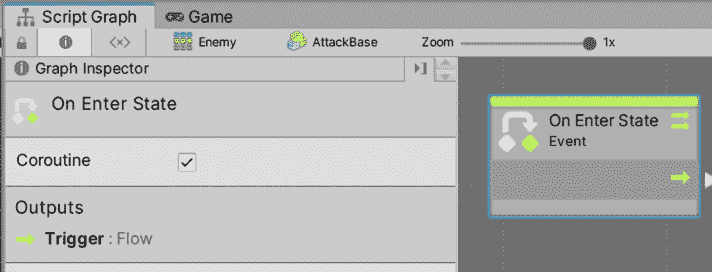

图 9.72：协程

然后，**AttackPlayer**将看起来像这样：

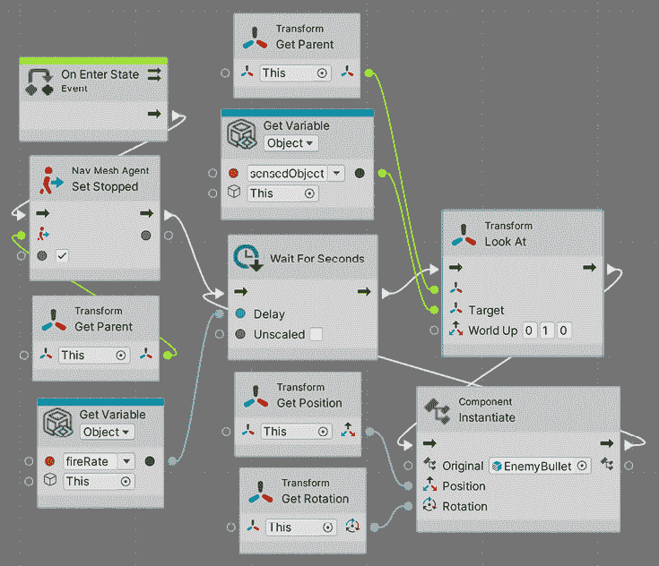

图 9.73：AttackPlayer 状态

实质上它与**AttackBase**相同，但它关注的是`sensedObject`而不是玩家的基地，我们还把**LookAt**节点作为无限循环的一部分，以便在射击前纠正敌人的航向，以便瞄准玩家。

这样，我们就完成了所有的 AI 行为。当然，这些脚本/图足够大，值得未来进行一些重构和拆分，但有了这个，我们已经原型化了我们的 AI，我们可以测试它，直到我们对它满意，然后我们可以改进这段代码。

# 摘要

我很确定 AI 不是你想象中的样子；你在这里不是在创建 Skynet，但我们已经实现了一个简单但有趣的 AI 来挑战我们的玩家，我们可以迭代和调整它以适应我们游戏预期的行为。我们看到了如何通过传感器收集周围信息来做出决策，决定执行什么动作，我们使用了不同的 Unity 系统，如寻路系统，使 AI 执行这些动作。我们使用这些系统来绘制一个能够检测玩家、向他们跑去并攻击他们的状态机，如果玩家不在那里，就只需前往基地完成其任务，摧毁它。

在下一章中，我们将开始本书的**第三部分**，我们将学习不同的 Unity 系统来提升我们游戏中的图形和音频效果，首先我们会看到如何创建材质来修改我们物体的外观，以及如何使用 Shader Graph 创建着色器。
