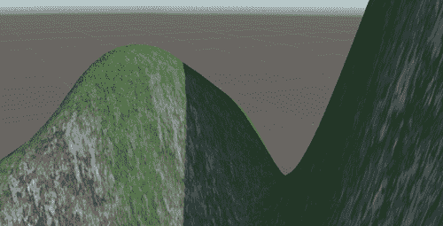

# 使用通用渲染管线进行照明

**照明**是一个复杂的话题，处理它有几种可能的方法，每种方法都有其优缺点。为了获得最佳的质量和性能，你需要确切地知道你的渲染器如何处理照明，这正是我们将在本章中要做的。我们将讨论在 Unity 的**通用渲染管线**（**URP**）中如何处理照明，以及如何正确配置它以适应场景的氛围，并使用适当的照明效果。

在本章中，我们将检查以下照明概念：

+   应用照明

+   应用阴影

+   优化照明

在本章结束时，我们将正确使用不同的 Unity 照明系统，如直接光照和光照贴图，以反映多云和雨夜的景象。

# 应用照明

当讨论在游戏中处理照明的方法时，有两种主要的方法，称为**前向渲染**和**延迟渲染**。它们以不同的顺序、不同的技术、不同的要求、优点和缺点来处理照明。前向渲染通常推荐用于性能，而延迟渲染通常推荐用于质量。后者是 Unity 的**高清渲染管线**（**HDRP**）所使用的，用于高端设备中的高质量图形。

在撰写本书时，Unity 正在为 URP 开发一个性能版本。此外，在 Unity 中，前向渲染器有两种模式：**多遍历前向**，用于内置渲染器（旧的 Unity 渲染器），以及**单遍历前向**，用于 URP。同样，两者都有其优缺点。

选择哪种方法取决于你正在创建的游戏类型以及你需要将游戏运行在哪个平台上。你选择的选项将因你如何将照明应用于场景而大量变化，因此了解你正在处理哪个系统至关重要。

在下一节中，我们将讨论以下实时照明概念：

+   讨论照明方法

+   使用天空盒配置环境照明

+   在 URP 中配置照明

让我们从比较之前提到的照明方法开始。

## 讨论照明方法

回顾一下，我们在本章开头提到了三种处理照明的最主要方式：

+   前向渲染（单次遍历）

+   前向渲染（多遍历）

+   延迟渲染

在我们查看每种方法之间的差异之前，让我们谈谈它们共有的特点。这三个渲染器开始绘制场景，通过确定哪些物体可以被相机看到——即那些落在相机视锥体内的物体，并提供一个当你选择相机时可以看到的巨大金字塔：

图 12.1：显示仅由相机看到的物体的相机视锥体

之后，Unity 将按照从相机最近到最远的顺序排列它们（透明对象的处理方式略有不同，但在此我们先忽略这一点）。这样做的原因是因为靠近相机的对象更有可能覆盖大部分相机视野，因此它们会遮挡其他对象（会阻止其他对象被看到），从而防止我们浪费资源计算被遮挡对象的像素。

最后，Unity 将按照这个顺序尝试渲染这些对象。这就是不同光照方法开始出现差异的地方，因此让我们开始比较两种前向渲染变体。对于每个对象，单次遍历前向渲染将在一次操作中计算对象的外观，包括所有影响该对象的光源，或者我们称之为绘制调用。

**绘制调用**是 Unity 要求显卡实际渲染指定对象的精确时刻。所有之前的工作都是为了这一刻做准备。在多遍历前向渲染器的情况下，通过稍微简化实际逻辑，Unity 将针对影响该对象的光源渲染该对象一次；因此，如果对象被三个光源照亮，Unity 将渲染该对象三次，这意味着将发出三个绘制调用，并且将向 GPU 发出三个调用以执行渲染过程：

图 12.2：左图，多遍历中受两个光源影响球体的第一次绘制调用；中图，球体的第二次绘制调用；右图，两次绘制调用的组合

现在你可能正在想，“为什么我要使用多遍历？单遍历性能更好！”是的，你是对的！单遍历比多遍历性能更好，这意味着我们的游戏将以更高的帧率运行，但是有一个大问题。GPU 中的绘制调用有一个可以执行的操作数量限制，因此绘制调用的复杂度有限。计算对象的外观以及所有影响它的光源非常复杂，为了使其适应仅一次绘制调用，单遍历执行了光照计算的简化版本，这意味着光照质量较低，功能较少。它们还对一次可以处理的光源数量有限制，截至本书编写时，每个对象为八个，尽管你可以根据需要配置更少，但默认值对我们来说已经足够好了。这听起来像是一个小数字，但通常已经足够了。

另一方面，多遍历可以应用你想要的任意数量的灯光，并且可以为每个灯光执行不同的逻辑。假设我们的对象有四个影响它的灯光，但有两个灯光影响它非常严重，因为它们更近或强度更高，而其余的只是足够明显地影响对象。在这种情况下，我们可以用高质量渲染前两个灯光，而用低价计算渲染剩余的灯光——没有人会注意到差异。

在这种情况下，多遍历可以使用**像素光照**计算前两个灯光，其余的则使用**顶点光照**。区别在于它们的名称；像素是按对象像素计算光照，而顶点是按对象顶点计算光照，并填充这些顶点之间的像素，从而在顶点之间插值信息。你可以在以下图像中清楚地看到差异：

图 12.3：左图，使用顶点光照渲染的球体；右图，使用像素光照渲染的球体

在单次遍历中，在一个绘制调用中计算所有内容迫使你必须使用顶点光照或像素光照；你不能将它们结合起来。

因此，为了总结单次遍历和多遍历之间的区别，在单次遍历中，由于每个对象只绘制一次，所以性能更好，但你受到可应用灯光数量的限制，而在多遍历中，你需要渲染对象多次，但灯光数量没有限制，你可以为每个灯光指定你想要的确切质量。还有其他一些事情需要考虑，比如绘制调用的实际成本（一个绘制调用可能比两个简单的调用更昂贵），以及像卡通着色这样的特殊光照效果，但让我们保持简单。

最后，让我们简要讨论一下延迟渲染。即使我们不会使用它，了解为什么我们不这样做也是很有趣的。在确定哪些对象位于视锥体内并对它们进行排序后，延迟渲染将不进行任何光照渲染对象，生成所谓的**G-Buffer**。G-Buffer 是一组包含有关场景中对象不同信息的图像，例如像素的颜色（无光照）、每个像素的方向（称为**法线**）以及像素与摄像机的距离。

你可以在以下图像中看到 G-Buffer 的典型示例：

图 12.4：左图，对象的单调颜色；中图，每个像素的深度；右图，像素的法线

法线是方向，方向的*x*、*y*和*z*分量编码在颜色的 RGB 分量中。

在渲染场景中的所有对象之后，Unity 将遍历相机中可以看到的所有光源，从而在 G-Buffer 上应用一层光照，并从中获取信息来计算特定的光照。处理完所有光源后，你会得到以下结果：

图 12.5：前一张图片中应用于 G-Buffer 的三个光源的组合

正如你所见，这种方法中的“延迟”部分来源于将光照计算作为渲染过程的最后阶段的想法。这样做更好，因为你不会浪费资源去计算那些可能被遮挡的对象的光照。如果在**前向**模式下首先渲染图像的地面，那么其他对象将要遮挡的像素就会被无用地计算。此外，延迟渲染只计算光线能够到达的确切像素的光照。例如，如果你使用手电筒，Unity 只会计算手电筒锥形范围内的像素的光照。这里的缺点是延迟渲染不支持一些相对较旧的显卡，并且你不能使用顶点光照质量进行光照计算，因此你需要付出像素光照的代价，这在低端设备上（甚至在简单的图形游戏中）是不推荐的。

那么，我们为什么使用单次遍历前向渲染（URP）呢？因为它在性能、质量和简单性之间提供了最佳平衡。在这个游戏中，我们不会使用太多光源，所以不会担心单次遍历的光源数量限制。如果你需要更多光源，可以使用延迟渲染，但请考虑额外的硬件要求以及没有顶点光照选项的性能成本。现在我们已经对 URP 如何处理光照有了非常基本的了解，让我们开始使用它吧！

## 使用天空盒配置环境光照

有不同的光源可以影响场景，例如太阳、手电筒、灯泡等等。这些被称为**直接光源**——即发出光线的对象。然后，我们有**间接光源**，它表示直接光源如何在其他对象上反射，比如墙壁。然而，计算所有光源发出的所有光线的所有反射是非常昂贵的，从性能角度来看，并且需要支持光线追踪的特殊硬件。问题是，如果没有间接光源，将会产生不真实的结果，你可以观察到阳光无法到达的地方会变得完全黑暗，因为没有来自光线击中其他地方的光线反射。

在下一张图片中，你可以看到一个错误配置的场景中可能的样子：

图 12.6：没有环境光照的山上投射的阴影

如果您遇到这个问题，解决它的有效方法是使用那些反弹的近似值。这些就是我们所说的**环境光**。这代表了一层基础光照，通常根据天空的颜色应用一点光，但您可以选择任何您想要的颜色。例如，在晴朗的夜晚，我们可以选择深蓝色来代表月光带来的色调。

如果您在 Unity 2022 中创建新场景，通常这是自动完成的，但在没有自动完成或场景是通过其他方法创建的情况下，了解如何通过以下方式手动触发此过程是有用的：

1.  点击**窗口** | **渲染** | **光照**。这将打开**场景光照设置**窗口：

图 12.7：光照设置位置

1.  点击窗口底部的**生成光照**按钮。如果您到目前为止还没有保存场景，将弹出一个提示要求您保存它，这是必要的：

图 12.8：生成光照按钮

1.  查看 Unity 窗口的右下角，检查进度计算条，以查看何时完成进程：

图 12.9：光照生成进度条

1.  现在，您可以看到完全黑暗的区域现在被天空发出的光照亮：

图 12.10：带有环境光照的阴影

现在，通过这样做，我们有了更好的光照，但它仍然看起来像晴天。记住，我们想要的是雨天。为了做到这一点，我们需要更改默认的天空，使其多云。您可以通过下载**天空盒**来实现这一点。您现在在场景周围看到的当前天空只是一个包含每个面的纹理的大立方体，这些纹理具有特殊的投影，以防止我们检测到立方体的边缘。我们可以为立方体的每个面下载六张图片，并将它们应用到您想要的任何天空，所以让我们这样做：

1.  您可以从任何地方下载天空盒纹理，但在这里，我将选择资产商店。通过前往**窗口 | 资产商店**并访问资产商店网站来打开它。

1.  在右侧的分类列表中查找**分类 | 2D | 纹理与材质 | 天空**。记住，如果您看不到分类列表，需要将窗口变宽：

图 12.11：纹理与材质

1.  记得在**价格**选项中勾选**免费资源**复选框。

1.  选择您喜欢的雨天天空盒。请注意，天空盒有不同的格式。我们使用的是六图像格式，所以在下载之前请检查这一点。还有一种格式叫做**立方体贴图**，它与六图像格式基本相同，但我们将继续使用六图像格式，因为它是最简单且易于使用和修改的。在我的情况下，我选择了*图 12.12*中显示的天空盒包。下载并导入它，就像我们在*第五章，C#和视觉脚本简介*中做的那样：

图 12.12：为此书选择的选定的天空盒

1.  通过在**项目**窗口中使用**+**图标并选择**材质**来创建一个新的材质。

1.  将该材质的**着色器**选项设置为**天空盒/6 面**。记住，天空盒只是一个立方体，因此我们可以应用材质来改变其外观。天空盒着色器已准备好应用六个纹理。

1.  将六个纹理拖动到材质的**前**、**后**、**左**、**右**、**上**和**下**属性。六个下载的纹理将具有描述性的名称，以便您知道哪些纹理放在哪里：

图 12.13：天空盒材质设置

1.  将材质直接拖动到场景视图中的天空。确保您不要将材质拖动到对象上，因为材质将被应用到它上面。

1.  重复环境光计算步骤的 1 到 4 步（**光照设置** | **生成光照**）以根据新的天空盒重新计算它。在以下图像中，您可以看到我到目前为止的项目结果：

图 12.14：应用的天空盒

现在我们有了良好的基础光照层，我们可以开始添加灯光对象。

## 在 URP 中配置光照

我们可以在场景中添加三种主要的直接灯光类型：

+   **方向性灯光**：这是一种代表太阳的灯光。该对象以它面对的方向发射光线，而不管它的位置如何；太阳向右移动 100 米不会产生太大影响。例如，如果您慢慢旋转这个对象，您可以生成昼夜循环：

图 12.15：方向性灯光结果

+   **点光源**：这种灯光代表一个灯泡，以全向方式发射光线。与方向性灯光相比，它的位置很重要，因为它更接近我们的物体。此外，由于它是一种较弱的灯光，其强度会根据距离变化，因此其效果有一个范围——物体离灯光越远，接收到的强度越弱：

图 12.16：点光源结果

+   **聚光灯**：这种灯光代表一个光锥，例如手电筒发出的光。它在位置很重要且光强度随距离衰减方面与点光源类似。但在这里，它指向的方向（因此其旋转）也很重要，因为它将指定光线投射的位置：

    

    图 12.17：聚光灯结果

到目前为止，我们已经有了很好的雨天环境光照，但场景中唯一的直接灯光——方向性灯光，看起来不会是这样，所以让我们改变一下：

1.  在**层次**窗口中选择**方向性灯光**对象，然后查看**检查器**窗口。

1.  点击**发射**部分的**颜色**属性以打开颜色选择器。

1.  选择深灰色以实现部分被云层遮挡的太阳光线。

1.  将**阴影类型**设置为**无阴影**。现在我们有了多云的一天，太阳不会投射出清晰的阴影，但我们稍后会更多地讨论阴影：

图 12.18：无阴影的柔和方向光

现在场景变暗了，我们可以添加一些灯光来照亮场景，如下所示：

1.  通过**GameObject | Light | Spotlight**创建一个聚光灯。

1.  选择它。然后，在检查器窗口中，将**形状**部分的**内/输出聚光灯角度**设置为 90 和 120，这将增加锥体的角度。

1.  在**发射**部分将**范围**设置为`50`，这意味着灯光可以延伸到 50 米，并在途中衰减。

1.  在**发射**部分将**强度**设置为`1000`：

图 12.19：聚光灯设置

1.  将灯光放置在游戏基地的一个角落，指向中心：

图 12.20：聚光灯位置

1.  通过选择它并按*Ctrl+D*（在 Mac 上为*Command+D*）来复制该灯光。

1.  将其放置在底座的对面角落：

图 12.21：两个聚光灯结果

你可以继续向场景中添加灯光，但要注意不要走得太远——记住灯光的限制。此外，你可以在灯光所在的位置下载一些灯光柱来从视觉上证明灯光的来源。现在我们已经实现了适当的照明，我们可以谈谈阴影了。

# 应用阴影

你可能认为场景中已经有了阴影，但实际上并没有。物体的较暗区域，即不面向灯光的区域，没有阴影——它们没有被照亮，这与阴影有很大的不同。在这种情况下，我们指的是从一个物体投射到另一个物体的阴影——例如，玩家投射到地板上的阴影，或者从山脉投射到其他物体上。阴影可以增加场景的质量，但它们在计算上也很昂贵，因此我们有两种选择：不使用阴影（推荐用于低端设备，如手机）或根据我们的游戏和目标设备在性能和质量之间找到平衡。

在本节中，我们将讨论以下关于阴影的主题：

+   理解阴影计算

+   配置高性能阴影

让我们先讨论 Unity 如何计算阴影。

## 理解阴影计算

在游戏开发中，众所周知，阴影在性能方面是昂贵的，但为什么呢？当一个光束在到达目标物体之前击中另一个物体时，就会产生一个阴影。在这种情况下，该像素点不会从该光源获得任何光照。这里的问题与我们在环境光照模拟中所遇到的问题相同——计算所有可能的光束及其碰撞将过于昂贵。因此，我们再次需要近似，这就是阴影贴图发挥作用的地方。

**阴影图**是从光源视角渲染的图像，但它不会绘制带有所有颜色和光照计算的完整场景，而是将所有对象以灰度形式渲染，其中黑色表示像素非常远离相机，而更白则表示像素更靠近相机。如果你这么想，每个像素都包含了关于光线**射线**击中位置的信息。通过知道光源的位置和方向，你可以使用阴影图计算出每个“射线”击中的位置。

在以下图像中，你可以看到我们方向光的阴影图：

图 12.22：由场景中的方向光生成的阴影图

不同的光照类型计算阴影图的方式略有不同，尤其是点光源。由于它是全方向的，它需要从所有方向（前、后、左、右、上、下）渲染场景多次，以便收集所有射出的光线信息。不过，我们在这里不会详细讨论这个问题，因为我们可以整天都在讨论它。

现在，这里需要强调的一个重要问题是，阴影图是纹理，因此它们具有分辨率。分辨率越高，我们的阴影图计算的“射线”就越多。你可能想知道低分辨率阴影图在只有少数射线时看起来是什么样子。请看以下图像以查看一个例子：

图 12.23：使用低分辨率阴影图渲染的硬阴影

这里的问题是，射线越少，阴影像素就越大，导致阴影出现像素化。在这里，我们首先需要考虑的配置是：阴影的理想分辨率是多少？你可能会想直接增加分辨率，直到阴影看起来平滑，但当然，这会增加计算所需的时间，因此会显著影响性能，除非你的目标平台能够处理它（移动设备肯定不能）。在这里，我们可以使用**软阴影**技巧，即在阴影上应用模糊效果以隐藏像素化的边缘，如图下所示：

图 12.24：使用低分辨率阴影图渲染的软阴影

当然，模糊效果不是免费的，但如果你接受其模糊的结果，将其与低分辨率阴影图结合，可以在质量和性能之间产生良好的平衡。

现在，低分辨率阴影图还有一个问题，称为**阴影痤疮**。这是你在以下图像中可以看到的光照错误：

图 12.25：由低分辨率阴影图产生的阴影痤疮

低分辨率的阴影图产生误报，因为它计算的“射线”较少。需要在射线之间着色的像素需要从最近的像素中插值信息。阴影图的分辨率越低，射线之间的间隙就越大，这意味着精度更低，误报更多。一个解决方案是提高分辨率，但同样，也会有性能问题（就像总是那样）。我们有一些巧妙的解决方案，比如使用**深度偏差**。以下图像就是一个例子：

图 12.26：两个远“射线”之间的误报。高亮区域认为射线在到达之前已经击中了物体。

**深度偏差**的概念很简单——简单到似乎是一种很大的作弊，实际上也是，但游戏开发充满了这样的东西！为了防止误报，我们“推动”射线稍微远一点，刚好足够使插值射线达到被照亮的表面：

图 12.27：具有深度偏差的射线以消除误报

当然，正如你可能预料的那样，他们没有轻易解决这个问题，而是有一个警告。推动深度会在其他区域产生误报，如下面的图像所示。看起来立方体在空中漂浮，但实际上，它是在接触地面——误报产生了它漂浮的错觉：

图 12.28：由于高深度偏差产生的误报

当然，我们有一种对抗这种情况的技巧，称为**法线偏差**。它将物体的网格沿着它们面对的方向推动，而不是射线。这个有点棘手，所以我们不会在这里详细介绍，但想法是结合一点深度偏差和一点法线偏差可以减少误报，但不会完全消除它们。因此，我们需要学会如何与之共存，并通过巧妙地定位物体来隐藏这些阴影差异：

图 12.29：减少了误报，这是结合深度和法线偏差的结果

影响阴影图工作方式的其他几个方面中，有一个是光程。光程越小，阴影覆盖的区域就越小。相同的阴影图分辨率可以增加该区域的更多细节，所以尽量减少光程，就像我们将在下一节中做的那样。

我现在能想象你的表情，是的，光照很复杂，我们只是刚刚触及表面！但保持你的士气！经过一点试验和错误的设置调整后，你会更好地理解它。我们将在下一节中这样做。

如果你真的对了解阴影系统的内部结构感兴趣，我建议你看看**阴影级联**的概念，这是一个关于方向光和阴影图生成的先进主题。

## 配置高性能阴影

由于我们针对的是中端设备，我们将尝试在质量和性能之间取得良好的平衡，所以让我们开始只为聚光灯启用阴影。方向光的阴影不会那么明显，实际上，雨天不会生成清晰的阴影，所以我们将以此为借口不计算这些阴影。为了做到这一点，请执行以下操作：

1.  在层次结构中按住*Ctrl*（Mac 上的*Command*）的同时点击两个聚光灯。这将确保在检查器窗口中进行的任何更改都将应用于两者：

图 12.30：选择多个对象

1.  在检查器窗口中，在**阴影**部分将**阴影类型**设置为**软阴影**。在这里我们将使用低分辨率阴影贴图，软模式可以帮助隐藏像素化的分辨率：

图 12.31：软阴影设置

1.  选择**方向光**，并将**阴影类型**设置为**无阴影**以防止其投射阴影：

图 12.32：无阴影设置

1.  创建一个立方体（**GameObject** | **3D Object** | **Cube**），并将其放置在灯光附近，以便在测试时有一个可以投射阴影的对象。

现在我们已经有一个基本的测试场景，让我们调整阴影贴图的分辨率设置，以防止阴影噪点：

1.  前往**编辑** | **项目设置**。

1.  在左侧列表中，查找**图形**并点击它：

图 12.33：图形设置

1.  在选择此选项后出现的属性中，点击**可脚本渲染管线设置**下面的框——包含一个名称的那个。在我的情况下，这是**URP-HighFidelity**，但如果你有不同版本的 Unity，它可能不同：

图 12.34：当前渲染管线设置

1.  这样做将在项目窗口中突出显示一个资产，所以在选择它之前请确保窗口是可见的。选择突出显示的资产：

图 12.35：当前管线高亮显示

1.  此资产有几个与 URP 如何处理其渲染相关的图形设置，包括照明和阴影。展开**照明**部分以显示其设置：

图 12.36：管线照明设置

1.  在**附加灯光**子部分下的**阴影分辨率**设置表示所有非方向光的阴影贴图分辨率（因为它是主光）。如果它还没有设置为`1024`，请将其设置为`1024`。

1.  在**阴影**部分下，你可以看到**深度**和**法线偏差**设置，但那些将影响所有灯光。即使现在我们的方向光没有阴影，我们只想影响额外的灯光偏差值，因为它们的图集分辨率与主图（方向光）不同，所以，选择聚光灯并将**偏差**设置为**自定义**，将**深度**和**法线偏差**设置为`0.25`，以便在我们移除阴影痤疮之前尽可能减少它们：

图 12.37：偏差设置

1.  这并不完全与阴影相关，但在通用 RP 设置资产中，你可以更改**每个对象的灯光**限制来增加或减少可以影响对象的光的数量（不超过八个）。目前，默认设置就很好。

1.  如果你之前遵循了前面提到的阴影级联提示，你可以稍微调整一下**级联**值，以启用方向光阴影并观察效果。记住，那些阴影设置仅适用于方向光。

1.  在方向光中没有阴影，但在任何其他情况下，考虑在**阴影**部分中减少**最大距离**值，这将影响方向光阴影的范围。

1.  在层次结构中选择两个灯光，并将它们的**范围**设置为 40 米。看看在这次更改前后阴影的质量如何改善。

记住，那些值只适用于我的情况，所以试着调整一下值，看看它如何改变结果——你可能会为你的场景找到一个更好的设置，如果它与我的设计不同的话。此外，记住没有阴影始终是一个选项，所以如果你的游戏每秒帧数较低，也就是 FPS（且没有其他性能问题），也请考虑这一点。

你可能认为这就是我们在光照方面能做的所有关于性能的事情了，但幸运的是，情况并非如此！我们还有另一个资源可以利用来进一步改进它，这就是静态光照。

# 优化光照

我们之前提到不计算光照对性能有好处，但如果不计算灯光，却仍然有灯光呢？是的，听起来好得令人难以置信，但实际上是可能的（当然，也很棘手）。我们可以使用一种称为静态光照或烘焙的技术，它允许我们一次性计算光照并使用缓存的成果。

在本节中，我们将介绍与静态光照相关的以下概念：

+   理解静态光照

+   烘焙光照贴图

+   将静态光照应用于动态对象

## 理解静态光照

这个想法很简单：只需进行一次光照计算，保存结果，然后使用这些结果而不是一直计算光照。

你可能想知道为什么这不是默认的技术。这是因为它有一些限制，其中最大的限制是动态对象。**预先计算阴影**意味着一旦计算完成，它们就无法改变，但如果一个投射阴影的对象被移动，阴影仍然会存在，所以这里需要考虑的主要问题是你不能使用这种技术来处理移动对象。相反，你需要为静态对象混合**静态**或**烘焙光照**，为动态（移动）对象使用**实时光照**。此外，考虑到这种技术仅适用于静态对象，它也仅适用于静态光源。再次强调，如果光源移动，预先计算的数据就变得无效了。

另一个你需要考虑的限制是预先计算的数据可能会对内存产生巨大影响。这些数据占据了 RAM 中的空间，可能达到数百 MB，因此你需要考虑你的目标平台是否有足够的空间。当然，你可以降低预先计算的照明质量以减小该数据的大小，但你需要考虑这种质量损失是否过多地影响了你游戏的外观和感觉。与所有关于优化的选项一样，你需要平衡两个因素：性能和质量。

在我们的流程中，我们有几种预先计算的数据，但最重要的一个是被称为**光照贴图**的数据。光照贴图是一种包含场景中所有对象的所有阴影和光照的纹理，因此当 Unity 应用预先计算或烘焙的数据时，它会查看这个纹理以确定静态对象的哪些部分被照亮，哪些没有被照亮。

你可以在以下图像中看到一个光照贴图的例子：

图 12.38：左，没有光照的场景；中，包含该场景预先计算数据的光照贴图；右，光照贴图应用于场景

拥有光照贴图有其自身的优势。烘焙过程在 Unity 中进行，在游戏发布给用户之前，这样你可以花费大量时间计算在运行时无法完成的事情，比如提高精度、光线反弹、角落的光线遮挡以及发射物体的光线。然而，这也可能成为一个问题。记住，动态对象仍然需要依赖于实时光照，而且与静态光照相比，这种光照看起来会非常不同，因此我们需要对其进行大量调整，以便用户不会注意到差异。

既然我们已经对静态光照有了基本的概念，让我们深入了解如何使用它。

## 烘焙光照贴图

要使用光照贴图，我们需要对 3D 模型做一些准备工作。记住，网格有**UV**，它包含有关纹理的哪些部分需要应用到模型各部分的信息。有时，为了节省纹理内存，您可以将同一块纹理应用到不同的部分。例如，在汽车的纹理中，您不会看到四个轮子；只有一个轮子，您可以将相同的纹理块应用到所有轮子上。这里的问题是，静态光照以相同的方式使用纹理，但在这里，它将应用光照贴图来照亮对象。在轮子的情况下，问题会是一个轮子接收到阴影，所有轮子都会有，因为所有轮子都在共享相同的纹理空间。通常的解决方案是在模型中有一组没有共享纹理空间的 UV，专门用于光照贴图。

有时，下载的模型已经为光照贴图做好了准备，有时则没有，但幸运的是，Unity 在这些情况下为我们提供了支持。为了确保模型能够正确计算光照贴图，让我们通过以下步骤让 Unity 自动生成**光照贴图 UV**：

1.  在**项目**窗口中选择网格资产（FBX）。

1.  在**模型**选项卡中，找到底部的**生成光照贴图 UV**复选框并勾选它。

1.  在底部点击**应用**按钮：

图 12.39：生成光照贴图设置

1.  对每个模型重复此过程。技术上，您只能在烘焙光照贴图后出现伪影和奇怪结果的模型中这样做，但为了以防万一，我们现在就在所有模型中这样做。

在为光照贴图准备模型之后，下一步是告诉 Unity 哪些对象不会移动。为此，请执行以下操作：

1.  选择不会移动的对象。

1.  在检查器窗口的右上角勾选**静态**复选框：

图 12.40：静态复选框

1.  对每个静态对象重复此操作（对于灯光来说这不是必要的；我们稍后会处理这些）。 

1.  您还可以选择多个对象的容器，勾选**静态**复选框，并在提示中点击**是，所有子对象**按钮，将复选框应用到所有子对象。

考虑到你可能不希望每个对象，即使它是静态的，都进行光照贴图，因为光照贴图的对象越多，你需要的纹理大小就越大。例如，地形可能太大，会消耗大部分光照贴图的大小。通常，这是必要的，但在这个案例中，聚光灯几乎不接触地形。在这里，我们有两个选择：将地形保留为动态，或者更好的是，直接告诉聚光灯不要影响地形，因为其中一个只受到环境光照和方向光（不会产生阴影）的照射。记住，我们之所以能这样做，是因为我们的场景类型；然而，在其他场景中，你可能需要使用其他设置。你可以通过以下方式从实时和静态光照计算中排除一个对象：

1.  选择要排除的对象。

1.  在检查器窗口中，点击**图层**下拉菜单，然后点击**添加图层…**：

图 12.41：创建图层按钮

1.  在这里，你可以创建一个图层，这是一个用于识别哪些对象不会受到光照影响的对象组。在**图层**列表中，寻找一个空白区域，为这类对象输入任何名称。以我的情况为例，我只将地形排除在外，所以我将其命名为**地形**：

图 12.42：图层列表

1.  再次选择地形，转到**图层**下拉菜单，并选择上一步创建的图层。这样，你可以指定这个对象属于那个对象组：

图 12.43：更改 GameObject 的图层

1.  选择所有聚光灯，在检查器窗口的**渲染**部分查找**剔除遮罩**，点击它，取消勾选之前创建的图层。这样，你可以指定这些灯光不会影响那个对象组：

图 12.44：光照剔除遮罩

1.  现在，你可以看到那些选定的灯光没有照亮或向地形应用阴影。

现在，是时候处理灯光了，因为**静态**复选框对它们不起作用。对于它们，我们有以下三种模式：

+   **实时**：在实时模式下，灯光将影响所有对象，无论是静态的还是动态的，使用实时光照，这意味着没有预先计算。这对于不静止的灯光很有用，例如玩家的手电筒、因风而移动的灯等。

+   **烘焙**：与实时相反，这种灯光只会影响具有光照贴图的静态对象。这意味着如果玩家（动态）在街道上的烘焙灯光（静态）下移动，街道看起来会被照亮，但玩家仍然保持黑暗，不会在街道上产生任何阴影。这种想法是用于不会影响任何动态对象的灯光，或者用于几乎不影响它们的灯光，这样我们就可以通过不计算它们来提高性能。

+   **混合**：如果你不确定使用哪个模式，这是首选模式。这种光照将计算静态对象的光照贴图，但也会影响动态对象，结合其实时光照和烘焙光照（就像实时灯光一样）。

在我们的情况下，我们的方向光只会影响地形，而且由于我们没有阴影，在 URP 中应用光照相对便宜，因此我们可以将方向光保持在实时模式，这样就不会占用任何光照贴图纹理区域。

我们聚光灯正在影响基础，但实际上，它们只是在应用光照到它们上——我们没有阴影，因为我们的基础是空的。在这种情况下，最好根本不计算光照贴图，但为了学习目的，我将在基础周围添加一些障碍物以投射一些阴影，从而证明使用光照贴图的合理性，如下面的图片所示：

图 12.45：添加对象以投射光照

在这里，你可以看到我们关卡的原设计在游戏开发过程中不断变化，这是你无法避免的——游戏的大部分内容会随着时间的推移而改变。现在，我们准备设置光照模式并执行烘焙过程，如下所示：

1.  在**层次**中选择**方向光**。

1.  将检查器窗口中**通用**部分的**模式**属性设置为**实时**（如果它还没有在这个模式下）。

1.  选择两个聚光灯。

1.  将它们的**渲染模式**设置为**混合**：

图 12.46：聚光灯的混合光照设置，方向光将处于实时模式

1.  打开**光照设置**窗口（**窗口** | **渲染** | **光照**）。

1.  我们想更改烘焙过程的某些设置。为了启用这些控制，点击**新建光照设置**按钮。这将创建一个具有光照贴图设置的资产，可以在我们想要多次使用相同设置的情况下应用于多个场景：

图 12.47：创建光照设置

1.  降低光照贴图的质量，只是为了使过程更快。只需迭代，就可以通过使用如**光照贴图分辨率**、**直接采样**、**间接采样**和**环境采样**等设置轻松降低光照，所有这些设置都位于**光照贴图设置**类别下。在我的情况下，我已经应用了这些设置，如下面的图片所示。请注意，即使降低这些设置也需要时间；由于模块化关卡设计，场景中物体太多：

图 12.48：场景光照设置

1.  点击**生成光照**，这是我们之前用来生成环境光照的同一个按钮。

1.  等待过程完成。你可以通过检查 Unity 编辑器右下角的进度条来完成此操作。请注意，这个过程在大场景中可能需要数小时，所以请耐心等待：

图 12.49：烘焙进度条

1.  在过程完成后，你可以检查**光照设置**窗口的底部部分，在那里你可以看到需要生成多少光照贴图。我们有最大光照贴图分辨率，所以我们可能需要几个来覆盖整个场景。此外，它还告诉我们它们的大小，以便我们可以考虑它们对内存的影响。最后，你可以查看**烘焙光照贴图**部分来查看它们：

图 12.50：生成的光照贴图

1.  现在，基于结果，你可以移动对象，修改光照强度，或者进行任何必要的校正，以使场景看起来符合你的要求，并在每次需要时重新计算光照。在我的情况下，这些设置给了我足够好的结果，如图所示：

图 12.51：光照贴图结果

我们还有很多小的设置可以探讨，但我将留给你通过试错或阅读 Unity 关于光照贴图的文档来发现这些设置：[`docs.unity3d.com/Manual/Lightmappers.html`](https://docs.unity3d.com/Manual/Lightmappers.html)。阅读 Unity 手册是获取知识的好来源，我建议你开始使用它——任何优秀的开发者，无论经验如何丰富，都应该阅读手册。

## 将静态光照应用于静态对象

当你在场景中将对象标记为静态时，你可能已经想到场景中的所有对象都不会移动，所以你可能为每个人检查了静态复选框。这是可以的，但你应该始终在场景中放入一个动态对象，以确保一切正常工作——没有任何游戏有完全静态的场景。尝试添加一个胶囊并将其移动，如图所示，以模拟我们的玩家。如果你注意观察，你会注意到一些奇怪的地方——由光照贴图过程生成的阴影没有被应用到我们的动态对象上：

图 12.52：光照贴图预计算阴影下的动态对象

你可能认为混合光照模式应该影响动态和静态对象，这正是它所做的事情。问题在于与静态对象相关的一切，包括它们投射的阴影，都被预先计算到那些光照贴图纹理中，而我们的胶囊是动态的，在预计算过程中它并不在那里。所以，在这种情况下，因为投射阴影的对象是静态的，它的阴影不会影响任何动态对象。

这里，我们有几种解决方案。第一种是将静态和实时混合算法更改为使靠近摄像机的所有内容使用实时照明并防止这个问题（至少在玩家的注意力焦点附近），这将大大影响性能。另一种选择是使用 **光探针**。当我们烘焙信息时，我们只在光照贴图上这样做，这意味着我们只在表面上有关光照的信息，而不是在空旷的空间中。因为我们的玩家正在穿越这些表面之间的空旷空间，我们不知道这些空间中的光照会是什么样子，比如走廊的中间。光探针是一组位于这些空旷空间中的点，Unity 也预先计算了这些信息，所以当一些动态对象通过光探针时，它将从它们那里采样信息。在下面的图像中，你可以看到一些已经应用于我们场景的光探针。你会注意到，那些处于阴影中的将会变暗，而那些暴露在光线下将会具有更大的强度。

此效果将应用于我们的动态对象：

图 12.53：代表光探针的球体

如果你现在将你的对象通过场景移动，它将对阴影做出反应，如下两个图像所示，你可以看到动态对象在烘焙阴影外被照亮，而在阴影内则是暗的：

图 12.54：从光探针接收烘焙照明的动态对象

为了创建光探针，请执行以下操作：

1.  通过访问 **GameObject | 光 | 光探针组** 创建一个 **光探针** 组。

1.  幸运的是，我们有一些关于如何定位它们的指导方针。建议将它们放置在光照变化的地方，比如在阴影内外。然而，这很复杂。最简单且推荐的方法是将光探针网格整个覆盖在你的可玩区域。为此，你可以简单地多次复制粘贴光网格组来覆盖整个基础：

图 12.55：光探针网格

1.  另一种方法就是选择一个组，点击 **编辑光探针** 按钮进入光探针编辑模式：

图 12.56：光探针组编辑按钮

1.  点击 **全选** 按钮然后 **复制所选** 以复制所有之前存在的探针。

1.  使用翻译工具，将它们移动到前一个旁边，在这个过程中扩展网格。考虑一下，探针越靠近，你需要覆盖的地形就越多，这将生成更多的数据。然而，从性能角度来看，Light Probes 数据相对便宜，所以你可以有很多，如图 *图 12.55* 所示。

1.  重复 *步骤 4* 和 *步骤 5*，直到你覆盖了整个区域。

1.  使用 **光照设置** 中的 **生成光照** 按钮重新生成光照。

这样，你就已经预先计算了光照探针对动态物体的影响，将两个世界结合起来以获得一致的光照。

# 摘要

在本章中，我们讨论了几个光照主题，例如 Unity 如何计算光照和阴影，如何处理不同的光源，如直射光和间接光，如何配置阴影，如何烘焙光照以优化性能，以及如何结合动态光照和静态光照，以确保光照不会与它们影响的世界脱节。这是一个内容丰富的章节，但光照确实值得这样的关注。它是一个复杂的主题，可以极大地改善场景的外观和感觉，同时也能显著降低性能。这需要大量的实践，在这里，我们尝试总结所有你需要开始实验的重要知识。对这个主题要有耐心；很容易得到错误的结果，但你可能只需勾选一个复选框就能解决问题。

现在我们已经尽可能优化了场景设置，在下一章中，我们将使用 Unity 后处理堆栈应用最终的一层图形效果，这将应用全屏图像效果——那些能给我们带来如今所有游戏都有的电影般外观和感觉的效果。

# 加入我们的 Discord 社群！

与其他用户、Unity 游戏开发专家以及作者本人一起阅读这本书。

提出问题，为其他读者提供解决方案，通过 Ask Me Anything 会话与作者聊天，等等。

扫描二维码或访问链接加入社群。

`packt.link/handsonunity22`
