# 带后处理的全屏效果

到目前为止，我们已经创建了不同的对象来改变场景的视觉效果，例如网格、粒子或灯光。我们可以调整这些对象的设置来提高场景质量，但当你将其与现代游戏场景进行比较时，你总会觉得缺少了什么，那就是后处理效果。在本章中，你将学习如何将效果应用于最终渲染帧，这将改变整个场景的外观。

在本章中，我们将检查以下图像效果概念：

+   使用后处理

+   使用高级效果

让我们先看看我们如何将后处理应用于我们的场景。

# 使用后处理

**后处理** 是一个 Unity 功能，允许我们将一系列效果（多个效果）一层层地叠加，这将改变图像的最终外观。每一个都会影响最终帧，根据不同的标准改变其中的颜色。在 *图 13.1* 中，你可以看到应用图像效果前后的场景。你会注意到一个巨大的差异，但那个场景中的对象没有任何变化，包括灯光、粒子或网格。

应用的是基于像素级别的效果。在这里看看这两个场景：

图 13.1：没有图像效果的场景（左）和添加了效果的相同场景（右）

需要注意的是，之前的后处理解决方案，**后处理堆栈版本 2**（**PPv2**）在 **通用渲染管线**（**URP**）上不会工作；它有自己的后处理实现，所以我们将在本章中看到这一点。它们非常相似，所以即使你正在使用 PPv2，你仍然可以从本章中学到一些东西。

在本节中，我们将讨论以下 URP 后处理概念：

+   设置配置文件

+   使用基本效果

让我们开始准备场景以应用效果。

## 设置配置文件

要开始应用效果，我们需要创建一个 **配置文件**，这是一个包含我们想要应用的所有效果和设置的资产。这是因为与材质相同的原因：因为我们可以在不同的场景和场景的部分之间共享相同的后处理配置文件。当我们提到场景的部分时，我们指的是应用了某些效果的游戏中的区域或体积。我们可以定义一个全局区域，无论玩家的位置如何都应用效果，或者我们可以应用不同的效果——例如，当我们处于户外或室内时。

在这个情况下，我们将使用一个全局体积，我们将用它来应用我们的第一个效果，方法如下：

1.  创建一个新的空 GameObject（**GameObject | 创建空对象**）命名为 `PP Volume`（后处理体积）。

1.  向其中添加 **体积** 组件，并确保 **模式** 设置为 **全局**。

1.  点击**配置文件**设置右侧的**新建**按钮，这将生成一个与在点击按钮时选择的 GameObject 同名的新的**配置文件**资产（**PPVolume** **配置文件**）。将该资产移动到其自己的文件夹中，这有助于资产组织。过程如图所示：

图 13.2：体积组件

1.  为了测试体积是否工作，让我们添加一个效果。点击**添加覆盖**按钮，并选择**后期处理 | 色差**选项。

1.  在**色差**效果的**强度**选项卡中勾选**强度**复选框，并将强度设置为`0.25`，如图所示：

图 13.3：色差效果

1.  现在，你将看到图像的角落应用了畸变效果。请记住在**场景**面板中查看这一点；我们将在下一步中将效果应用于游戏视图。这如图所示：

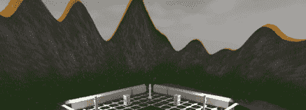

图 13.4：场景中应用了色差

1.  现在，如果你按下**播放**并从主相机的视角观看游戏，你会发现效果没有被应用，这是因为我们需要检查主相机**渲染**部分的**后期处理**复选框，如图所示：

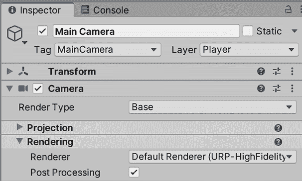

图 13.5：启用后期处理

因此，我们创建了一个全局体积，无论玩家的位置如何，都会将指定的覆盖效果应用于整个场景。

现在我们已经为使用后期处理准备好了场景，我们可以开始尝试不同的效果。让我们从下一节中最简单的效果开始。

## 使用基本效果

现在我们已经在场景中应用了后期处理，唯一需要做的就是开始添加效果并设置它们，直到我们得到期望的外观和感觉。为了做到这一点，让我们探索系统包含的几个简单效果。

让我们从**色差**开始，这是我们刚刚使用的，就像大多数图像效果一样，它试图复制特定的现实生活效果。所有游戏引擎渲染系统都使用一个简单的数学近似来描述眼睛视觉的实际工作方式，正因为如此，我们无法看到在人类眼睛或相机镜头中发生的一些效果。真实的相机镜头通过弯曲光线使其指向相机传感器，但这种弯曲在某些镜头中并不完美（有时是故意的），因此你可以看到如以下截图所示的扭曲：

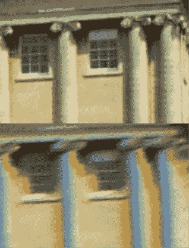

图 13.6：无色差图像（左侧）和带有色差的同图像（右侧）

这个效果将是我们将添加的几个效果之一，以在我们的游戏中营造出电影感，模拟现实生活中的相机使用。当然，这种效果并不适合所有类型的游戏；也许简单的卡通风格不会从这种效果中受益，但你永远不知道：艺术是主观的，所以这是一个试错的过程。

此外，我们在之前的例子中稍微夸张了强度，以便使效果更明显，但我建议在这个场景中使用`0.25`的强度。通常建议对效果的强度要温和；虽然强烈的视觉效果很有吸引力，但因为你将添加很多效果，所以过一段时间后，图像会显得膨胀，扭曲过多。所以，尝试添加几个微妙的效果，而不是几个强烈的效果。但，再次强调，这取决于你寻找的目标风格；这里没有绝对真理（但常识仍然适用）。

最后，在讨论其他效果之前，如果你习惯于使用其他类型的后处理效果框架，你会注意到这个版本的**色差**设置较少，这是因为 URP 版本追求性能，所以它会尽可能简单。

我们接下来要讨论的效果是**晕影**。这是另一种相机镜头的缺陷，其中图像强度在镜头边缘丢失。这不仅可以用来自定义旧相机，还可以将用户的注意力引向相机的中心——例如，在电影场景中。

此外，如果你正在开发**虚拟现实**（**VR**）应用程序，这可以用来通过减少玩家的周边视野来减少运动病。在以下截图中，你可以看到一个旧相机上的晕影示例：

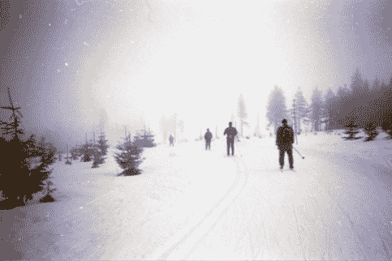

图 13.7：使用旧相机拍摄的照片，边缘有晕影

只是为了尝试一下，让我们通过以下步骤对我们的场景应用一些晕影效果：

1.  选择`PP Volume`游戏对象。

1.  通过点击**添加覆盖**按钮添加**后处理 | 晕影**效果。

1.  打开**强度**复选框，并将其设置为`0.3`，以增强效果。

1.  打开**平滑度**复选框，并将其设置为`0.5`；这将增加效果的扩散。你可以在以下图中看到结果：

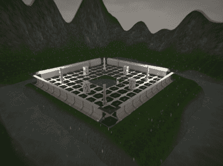

图 13.8：晕影效果

如果你想，可以通过勾选**颜色**复选框并设置另一个值来更改颜色；在我们的例子中，黑色可以很好地强化雨天环境。在这里，我邀请你检查其他属性，例如**中心**和**圆角**。你只需调整数值就能创造出很好的效果。

我们接下来要看到的效果是**运动模糊**，同样地，它模拟了相机的工作方式。真实的相机有一个曝光时间：它需要的时间来捕捉光子到图像中。当一个物体移动得足够快时，在短暂的曝光时间内，同一个物体会放置在不同的位置，因此它看起来会模糊。在下面的屏幕截图中，您可以看到应用在我们场景中的效果。在这种情况下，我们正在快速上下旋转相机，以下结果是：

图 13.9：运动模糊应用到我们的场景

有一个需要考虑的事情是，这种模糊只会应用于相机移动，而不是物体的移动（静止相机，移动物体），因为目前这个 URP 还不支持运动矢量。

为了使用这个效果，请按照以下步骤操作：

1.  使用**添加覆盖**按钮添加**后处理 | 运动模糊**覆盖。

1.  检查**强度**复选框并将其设置为`0.25`。

1.  在查看游戏视图（而不是场景视图）时旋转相机。您可以通过点击并拖动相机的**变换**的**X**属性（不是值——**X**标签），如图下所示：

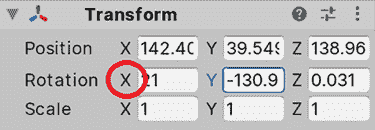

图 13.10：改变旋转

如您所见，这种效果在场景视图中是不可见的，以及其他一些效果，所以在得出效果不起作用之前请考虑这一点。Unity 这样做是因为在场景中工作时有这种效果会非常烦人。

最后，我们将简要讨论两个最终简单的效果，**胶片颗粒**和**白平衡**。第一个很简单：添加它，将强度设置为`1`，您将得到老电影中著名的颗粒效果。您可以通过不同的数字设置**类型**来使其更微妙或更粗糙。**白平衡**允许您更改颜色温度，根据您的配置使颜色更暖或更冷。在我们的案例中，我们正在一个寒冷、昏暗的场景中工作，因此您可以添加它并将温度设置为`-20`来稍微调整外观并改善这种场景的外观和感觉。

现在我们已经看到了一些简单效果，让我们来看看受一些高级渲染功能影响的剩余效果。

# 使用高级效果

本节中我们将看到的效果与之前的效果没有太大区别；它们只是稍微复杂一些，需要一些背景知识才能正确使用。所以，让我们深入探讨它们吧！

在本节中，我们将看到以下高级效果概念：

+   高动态范围（HDR）和深度图

+   应用高级效果

让我们先讨论一些效果正常工作的要求。

### 高动态范围（HDR）和深度图

一些效果不仅与渲染图像一起工作，还需要额外的数据。我们首先讨论**深度图**，这是一个我们在上一章讨论过的概念。

总结一下，深度图是从摄像机的视角渲染的图像，但它不是生成场景的最终图像，而是渲染场景对象的深度，以灰度渲染对象。颜色越深，像素离摄像机越远，反之亦然。在以下屏幕截图中，您可以看到一个深度图的示例：

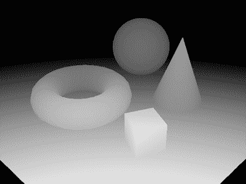

图 13.11：几个原始形状的深度图

我们将看到一些效果，例如**景深**，它将根据摄像机的距离模糊图像的某些部分，但可以在自定义效果中用于多种目的（不在基础 URP 包中）。

在这里讨论的另一个概念是**高动态范围 (HDR**)，它将改变颜色的处理方式，从而影响某些效果的工作方式。在旧硬件中，颜色通道（红色、绿色和蓝色）被编码在 0 到 1 的范围内，0 表示没有强度，1 表示全强度（每个通道），因此所有光照和颜色计算都在这个范围内进行。这看起来似乎没问题，但并不反映光的实际工作方式。您可以在一张被阳光照亮的纸张上看到全白（所有通道设置为 1），您可以直接看到灯泡的全白，但即使光和纸张颜色相同，后者在一段时间后首先会刺激眼睛，其次，由于过多的光线，会有一些溢光。这里的问题是最大值（1）不足以表示最强烈的颜色，所以如果您有一个高强度的光源和另一个强度更高的光源，两者都会生成相同的颜色（每个通道的 1），因为计算不能超过 1。这就是为什么创建了**HDR 渲染**。

HDR 是一种让颜色超出 0 到 1 范围的方法，因此基于颜色强度工作的光照和效果在此模式下具有更好的准确性。这与新型电视机的 HDR 功能类似，尽管在这种情况下，Unity 将在 HDR 下进行计算，但最终图像仍然使用之前颜色空间（0 到 1，或**低动态范围 (LDR**)）进行工作，所以不要混淆 Unity 的**HDR 渲染**与**显示器的 HDR**。

要将 HDR 计算转换回 LDR，Unity（以及电视）使用了一个称为**色调映射**的概念。您可以在以下屏幕截图中看到 LDR 渲染场景和色调映射在 HDR 场景中的应用示例：

图 13.12：使用色调映射校正过亮度的 LDR 渲染场景（左）和 HDR 场景（右）

色调映射是一种将超出 0-1 范围的颜色带回到该范围的方法。它基本上使用曲线来确定每个颜色通道应该如何映射回去。

你可以在典型的暗到亮的场景转换中清楚地看到这一点，例如当你从一个没有窗户的建筑中出来进入明亮的一天时。一段时间内，你会看到一切变亮，直到一切恢复正常。这里的想法是，当你身处室内或室外时，计算并没有不同；建筑内的白色墙壁将具有接近 1 的强度，而同一白色墙壁在室外将具有更高的值（由于阳光）。区别在于，当你身处室外时，色调映射会将高于 1 的颜色调整回 1，如果整个场景较暗，它可能会根据你的设置增加墙壁的照明。这个功能被称为**自动曝光**。

即使 HDR 默认启用，让我们看看如何检查它，通过以下操作：

1.  前往**编辑** | **项目设置**。

1.  点击左侧面板中的**图形**部分。

1.  点击**可脚本渲染管线设置**属性下引用的资产。

1.  点击**项目**面板中突出显示的资产。确保在点击**图形**设置中的属性之前，此面板是可见的。或者，你可以在**图形**设置中双击资产引用来选择它。

1.  在**质量**部分，确保已勾选**HDR**，如图下截图所示：

图 13.13：启用 HDR

1.  确保**主相机**游戏对象中**相机**组件的**HDR**属性设置为**使用渲染管线设置**，以确保上一步骤中的更改得到尊重。

当然，HDR 可切换的事实意味着存在一些你不想使用 HDR 的场景。正如你所猜想的，并非所有硬件都支持 HDR，使用 HDR 会带来性能开销，因此请考虑这一点。幸运的是，大多数效果都支持 HDR 和 LDR 色彩范围，所以如果你启用了 HDR 但用户设备不支持，你不会收到任何错误，只是效果根据不同的效果会有不同的结果，例如图像更亮或更暗，或者效果被夸大，正如我们将在下一节*应用高级效果*中看到的。

现在我们确信我们已启用 HDR，让我们探索一些使用此功能和深度映射的高级效果。

## 应用高级效果

让我们看看使用之前描述的技术的一些特定效果，从常用的**辉光**开始。此效果模拟了相机镜头或甚至人眼周围被强烈光照的物体上的溢光。在*图 13.14*中，你可以看到我们场景的默认版本和夸张的辉光版本的差异。

你可以观察到效果仅应用于场景中最亮的部分。看看这里两种效果：

图 13.14：默认场景（左）和具有高亮度辉光的同一场景（右）

这个效果实际上非常常见且简单，但我认为它是高级的，因为结果会受到 HDR 的极大影响。这个效果依赖于计算每个像素颜色的强度来检测可以应用溢光的位置。在 LDR 中，我们可以有一个不是过亮的白色物体，但由于这个颜色范围的限制，模糊效果可能会在其上产生溢光。在 HDR 中，由于其增加的颜色范围，我们可以检测一个物体是否是白色，或者物体可能是浅蓝色但只是过亮，从而产生它是白色的错觉（例如靠近高亮度灯的物体）。在*图 13.15*的屏幕截图中，你可以看到带有 HDR 和无 HDR 的我们场景之间的差异。你会注意到 LDR 版本将在不一定过亮的区域产生溢光。差异可能非常微妙，但请注意细节以注意差异。并且记住，我在这里夸大了效果。请看看这两个场景：

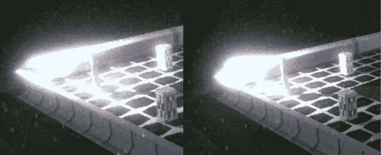

图 13.15：LDR 场景中的模糊效果（左）和 HDR 场景中的模糊效果（右）。注意，模糊设置被更改以尽可能接近它们

现在，让我们继续使用场景的 HDR 版本。为了启用模糊效果，请按照以下步骤操作：

1.  按照惯例，将**模糊**覆盖添加到配置文件中。

1.  通过勾选**强度**复选框来启用它，并将值设置为`0.2`。这控制了将应用多少溢光。

1.  启用**阈值**并将其设置为`0.7`。这个值表示颜色需要达到的最小强度，才能被认为是溢光。在我们的例子中，我们的场景有些昏暗，因此我们需要在模糊效果设置中降低这个值，以便包含更多的像素。像往常一样，这些值需要根据你的具体情况进行调整。

1.  你会注意到差异非常微妙，但再次提醒，你将拥有几个效果，所以所有这些细微的差异都会累积起来。你可以在下面的屏幕截图中看到这两个效果：

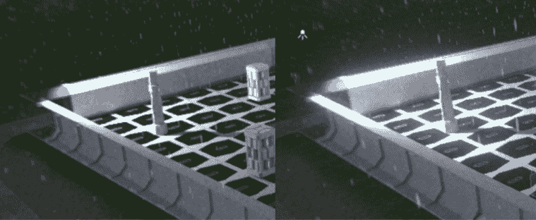

图 13.16：模糊效果

按照惯例，建议你调整其他值。我推荐你测试的一些有趣的设置是**污渍纹理**和**污渍强度**值，这些值将模拟在溢光区域中的脏镜头。

现在，让我们转向另一个常见的效果，**景深**。这个效果依赖于我们之前讨论过的深度图。这对肉眼来说并不明显，但当你专注于视线内的一个物体时，周围的物体因为不在焦点上而变得模糊。我们可以使用这个效果来在游戏的关键时刻吸引玩家的注意力。这个效果将采样深度图以查看物体是否在焦点范围内；如果是，则不应用模糊，反之亦然。

为了使用它，请按照以下步骤操作：

1.  这种效果取决于你游戏中摄像机的位置。为了测试它，在这种情况下，我们将摄像机放置在柱子附近，试图聚焦于该特定对象，如下面的截图所示：

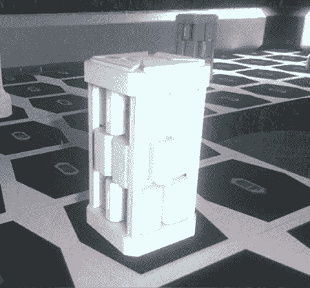

图 13.17：摄像机位置

1.  添加**景深**覆盖。

1.  启用并设置**模式**设置为**高斯**：在性能方面最经济的选项。

1.  在我的情况下，我将**开始**设置为`10`，将**结束**设置为`20`，这将使效果在目标物体后方一定距离处开始。**结束**设置将控制模糊强度如何增加，在`20`米处达到最大。请记住根据你的情况调整这些值。

1.  如果你想要稍微夸张一下效果，将**最大半径**设置为`1.5`。结果如下面的截图所示：

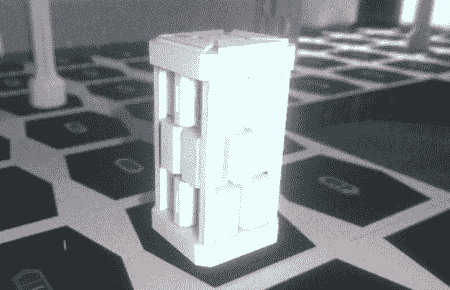

图 13.18：夸张效果

这里需要考虑的是，我们的游戏将采用俯视视角，与可以看见远处物体的第一人称摄像机不同，在这里，我们将有足够近的物体，以至于不会注意到效果，因此我们可以限制在场景中仅用于过场动画的效果使用。

现在，大多数剩余的效果都是改变场景实际颜色的不同方式。想法是，真实的颜色有时并不能给你你寻求的确切的外观和感觉。也许你需要将暗区调得更暗，以增强恐怖氛围的感觉，或者也许你想要相反：增加暗区以表示一个开阔的场景。也许你想要给高光稍微着色以获得霓虹效果，如果你正在制作未来派游戏，或者也许你想要暂时使用棕褐色效果来进行闪回。我们有无数种方法来做这件事，在这种情况下，我将使用一个简单但强大的效果，称为**阴影，中间调，高光**。

此效果将对阴影、中间调和高光应用不同的颜色校正，这意味着我们可以分别修改较暗、较亮和中等区域。让我们通过以下步骤尝试一下：

1.  添加**阴影** **中间调** **高光**覆盖。

1.  让我们开始进行一些测试。检查三个**阴影**、**中间调**和**高光**复选框。

1.  将**阴影**和**中间调**滑块全部移到最左边，将**高光**滑块移到最右边。这将减少阴影和中间调的强度，并增加高光的强度。我们这样做是为了让你可以看到高光将根据其强度改变的区域。你可以用其余的滑块以同样的方式检查其他两个区域。你可以在下面的截图中看到结果：

图 13.19：隔离高光

1.  此外，你也可以测试移动彩色圆圈中心的白色圆圈，为这些区域应用一点色调。通过将滑块稍微向左移动来减少高光的强度，使色调更加明显。你可以在下面的屏幕截图中看到结果：

图 13.20：色调高光

1.  通过这样做，你可以探索这些控制如何工作，但当然，这些极端值对于某些边缘情况是有用的。在我们的场景中，以下屏幕截图中你可以看到的设置对我来说效果最好。一如既往，使用更微妙的值来不过度扭曲原始结果会更好，正如这里所示：

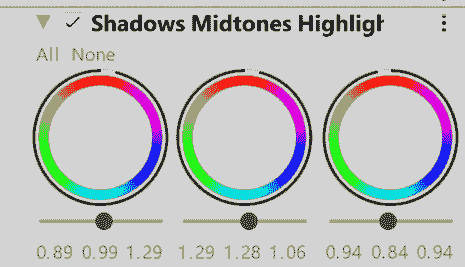

图 13.21：细微的变化

1.  你可以在以下屏幕截图中看到前后效果：

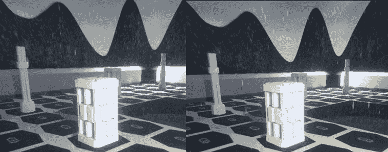图 13.22：前后效果

你还有其他更简单的选项，例如**分割色调**，它做的是类似的事情，但只是针对**阴影**和**高光**，或者**颜色曲线**，它让你可以更高级地控制场景中每个颜色通道的映射方式，但理念是相同的——也就是说，改变最终场景的实际颜色，为你的场景应用特定的色彩氛围。如果你记得电影系列《黑客帝国》，当角色处于矩阵中时，一切都有细微的绿色色调，而在外面时，色调是蓝色。

记住，使用 HDR 和不使用 HDR 对这些效果的结果很重要，因此最好是尽早而不是事后决定是否使用 HDR，排除某些目标平台（这些可能对你的目标受众并不重要），或者不使用 HDR（使用 LDR）并减少对场景照明级别的控制。

此外，考虑到你可能需要调整一些对象的设置，例如光照强度和材质属性，因为有时我们使用后期处理来修复由设置错误的对象引起的图形错误，这是不合适的。例如，增加场景中的`环境光照`将极大地改变效果输出，我们可以利用这一点来提高整体亮度，而不是使用效果，如果我们发现场景太暗的话。

这已经涵盖了要使用的主要图像效果。记住，理念不是使用每一个，而是使用你认为有助于你场景的效果；它们在性能方面并不是免费的（尽管不是那么资源密集），所以要明智地使用。此外，你可以检查已经创建的配置文件，将它们应用到你的游戏中，看看微小的变化可以带来巨大的差异。

# 摘要

在本章中，我们讨论了在场景中应用的基本和高级全屏效果，使其在相机镜头效果方面看起来更加逼真，在色彩扭曲方面更加时尚。我们还讨论了 HDR 和深度图的内幕以及它们在使用这些效果时的重要性，这些效果可以以最小的努力立即提高你游戏的图形质量。

既然我们已经涵盖了 Unity 系统中大部分常见的图形，让我们开始探讨如何通过使用声音来增加场景的沉浸感。
