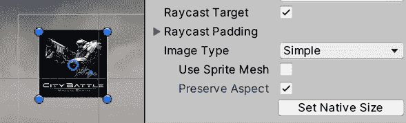

# 用户界面设计

屏幕上显示并通过计算机扬声器传输的每一件事，都是一种沟通方式。在之前的章节中，我们使用了 3D 模型来让用户知道他们身处山中的基地，并通过适当的声音和音乐强化了这个想法。但对我们游戏来说，我们需要传达其他信息，例如玩家剩余的生命值和当前得分，有时，使用游戏内的图形来表达这些事情是有困难的（有一些成功的案例能够做到这一点，例如*死亡空间*，但让我们保持简单）。

为了传输此类信息，我们需要在我们的场景之上添加另一层图形，这通常被称为**用户界面**（**UI**）。这将包含不同的视觉元素，例如文本字段、条形图和按钮，以便用户能够根据生命值低时逃往安全地点等情况做出明智的决定。

在本章中，我们将探讨以下主题：

+   理解 Canvas 和 RectTransform

+   Canvas 对象类型

+   创建响应式 UI

到本章结束时，你将能够使用 Unity UI 系统创建能够通知用户游戏状态并允许他们通过按按钮采取行动的界面。让我们首先讨论 Unity UI 系统的基本概念——Canvas 和 RectTransform。

# 理解 Canvas 和 RectTransform

我们将只关注游戏内的 UI，使用 Unity GUI 系统（或 uGUI）向玩家传达不同的信息。在撰写本书时，一个新的 GUI 系统名为 UI Toolkit 已经发布，但 uGUI 仍将存在一段时间，因为 UI Toolkit 将主要用于新项目，并且仍然能够处理所有类型的 UI。我们将在下一章探讨 UI Toolkit。

如果你打算使用 Unity UI，你首先需要理解其两个主要概念——**Canvas**和**RectTransform**。**Canvas**是包含并渲染我们的 UI 的主对象，而**RectTransform**是负责在屏幕上定位和调整每个 UI 元素的特性。

在本节中，我们将讨论以下内容：

+   使用 Canvas 创建 UI

+   使用 RectTransform 定位元素

让我们从使用 Canvas 组件来创建我们的 UI 开始。

## 使用 Canvas 创建 UI

在 Unity UI 中，UI 中看到的每个图像、文本和元素都是一个具有一组适当组件的 GameObject，但为了使它们能够工作，它们必须是一个具有 Canvas 组件的主 GameObject 的子对象。这个组件负责触发 UI 生成并在每个子对象上绘制迭代。我们可以配置这个组件来指定该过程的确切工作方式，并适应不同的可能需求。

首先，你可以简单地通过选择**GameObject** | **UI** | **Canvas**选项来创建一个画布。完成此操作后，你将在场景中看到一个矩形，它代表用户屏幕，因此你可以将其内部放入元素并预览它们相对于用户监视器的位置。

你可能在这里有两个疑问。首先，“*为什么场景中间有一个矩形？我希望它始终显示在屏幕上!*”不用担心，情况确实如此。当你编辑 UI 时，你会看到它作为关卡的一部分，作为其中的一个对象，但当你玩游戏时，它将始终投影在屏幕上，覆盖在所有对象之上。此外，你可能想知道为什么矩形这么大，这是因为在使用默认的**画布****渲染模式**，即称为**屏幕空间 - 覆盖**时，屏幕映射中的一个像素对应场景中的一米。还有其他模式，但讨论它们超出了本章的范围。

再次强调，不要担心这个问题；当你从**游戏**视图中查看游戏时，你将看到所有 UI 元素在用户屏幕上的正确大小和位置。考虑到**场景**视图将遵循**游戏**视图的尺寸，建议在**场景**视图中编辑之前先设置**游戏**视图的大小。你可以通过点击**游戏**面板顶部说**自由纵横比**的下拉菜单，并选择所需的分辨率或纵横比来完成此操作，**16:9 纵横比**是最常用的选项：

图 15.1：默认图像 UI 元素——一个白色框

在向我们的 UI 添加元素之前，值得注意的是，当你创建 UI 时，与 Canvas 一起创建了一个名为**EventSystem**的第二个对象。这个对象对于渲染 UI 不是必需的，但如果你想让 UI 可交互，即包括点击按钮、在字段中输入文本或使用摇杆导航 UI 等动作，则是必需的。**EventSystem**组件负责采样用户输入，如键盘、鼠标或摇杆，并将这些数据发送到 UI 以做出相应反应。我们可以更改与 UI 交互的确切按钮，但默认设置现在是可以接受的，所以只需知道，如果你想与 UI 交互，你需要这个对象。如果由于某种原因你删除了这个对象，你可以在**GameObject** | **UI** | **Event System**中重新创建它。

现在我们有了创建 UI 的基础对象，让我们向其中添加元素。

## 使用 RectTransform 定位元素

在 Unity UI 中，你看到的每个图像、文本和 UI 元素都是一个具有根据其使用情况设置的组件的 GameObject，但你将看到它们大多数都有一个共同的组件——**RectTransform**。UI 的每一部分本质上都是一个填充有文本或图像的矩形，并且具有不同的行为，因此理解**RectTransform**组件的工作原理以及如何编辑它非常重要。

为了实验这个组件，让我们创建并编辑 UI 的一个简单白色框元素的定位，如下所示：

1.  进入**GameObject | UI | Image**。之后，你将看到在**Canvas**元素内创建了一个新的 GameObject。Unity 将负责将任何新的 UI 元素设置为 Canvas 的子元素；在其外部，该元素将不可见：

图 15.2：默认图像 UI 元素——一个白色框

1.  点击**Scene**视图顶部的 2D 按钮。这将仅更改 Scene 视图的视角，使其更适合编辑 UI（以及 2D 游戏）：

图 15.3：2D 按钮位置

1.  在**Hierarchy**窗口中双击 Canvas，使 UI 完全适合 Scene 视图。这将允许我们清楚地编辑 UI。你还可以使用鼠标滚轮导航 UI 进行缩放，点击并拖动滚轮来平移相机。

1.  启用**RectTransform**工具，这是 Unity 编辑器左上角第五个按钮（或按*T*键）。这将启用矩形辅助工具，允许你移动、旋转和缩放 2D 元素，而不会像常规 3D 变换辅助工具那样引起问题：

图 15.4：矩形辅助工具按钮

1.  使用矩形辅助工具，拖动对象以移动它，使用蓝色点来更改其大小，或将鼠标定位在蓝色点附近，直到光标变成曲线箭头以旋转它。请注意，使用此辅助工具调整对象大小与缩放对象不同，稍后我们将详细介绍这一点：

图 15.5：编辑 2D 元素的矩形辅助工具

1.  在**Inspector**窗口中，注意在更改 UI 元素的大小后，**Rect Transform**设置的**Scale**属性仍然为`1`，`1`，`1`，但你可以看到**Width**和**Height**属性已发生变化。**RectTransform**本质上是一个经典的变换，但增加了**Width**和**Height**（以及其他稍后要探索的属性）。你可以在这里设置你想要的精确值，以像素为单位：

图 15.6：Rect Transform 属性

现在我们已经了解了如何定位任何 UI 对象的基础知识，让我们探索可以添加到 Canvas 的不同类型的元素。

# Canvas 对象类型

到目前为止，我们使用的是最简单的 Canvas 对象类型——一个白色框，但我们可以使用许多其他对象类型，例如图像、按钮和文本。所有这些都使用**RectTransform**来定义它们的显示区域，但每个都有其自己的概念和配置需要理解。

在本节中，我们将探索以下 Canvas 对象概念：

+   集成 UI 资产

+   创建 UI 控件

让我们先探索如何将图像和字体集成到 Canvas 中，以便我们可以使用**Images**和**Text**UI 对象类型将它们集成到 UI 中。

## 集成 UI 资产

在我们的 UI 使用漂亮的图形资产之前，我们需要将它们正确集成到 Unity 中。在下面的屏幕截图中，您将找到我们为游戏提出的 UI 设计：

图 15.7：UI 设计

此外，我们还将添加一个**暂停**菜单，当用户按下*Esc*键时将被激活。它看起来如下截图所示：

图 15.8：暂停菜单设计

根据这些设计，我们可以确定我们需要以下资产：

+   英雄的头像图片

+   一个健康条图片

+   一个**暂停**菜单背景图片

+   一个**暂停**菜单按钮图片

+   文本字体

和往常一样，我们可以在互联网或 Asset Store 上找到所需的资产。在我的情况下，我将使用两者的混合。让我们从最简单的一个开始——头像。按照以下步骤操作：

1.  从互联网上下载您想要的头像，比如一个角色的面部图像。

1.  将其添加到您的项目中，可以通过将其拖动到项目窗口或使用**资产 | 导入新资产**选项来实现。将其添加到`精灵`文件夹。

1.  选择纹理，并在检查器窗口中，将**纹理类型**设置为**精灵（2D 和 UI）**。所有纹理默认都准备用于 3D。此选项将我们的纹理准备用于 2D 环境，如 UI 和 2D 游戏。

对于条形、按钮和窗口背景，我将使用 Asset Store 来寻找一个 UI 包。在我的情况下，我在下面的屏幕截图中找到了一个很好的包来开始我的 UI。像往常一样，请记住，这个确切的包可能现在不可用。在这种情况下，请记住寻找另一个类似的包，或者从 GitHub 仓库中选择精灵：

图 15.9：选定的 UI 包

首先，这个包包含许多以相同方式配置的图像，作为精灵，但我们可以进一步修改导入设置以实现高级行为，这对于按钮是必需的。按钮资产有一个固定的大小，但如果你需要一个更大的按钮怎么办？一个选项是使用不同大小的其他按钮资产，但这会导致按钮和其他资产（如不同大小的窗口背景）的大量重复，这会不必要地消耗 RAM。

另一个选项是使用**九宫格**方法，它包括将图像分割成四个角落与其他部分分离。这允许 Unity 拉伸图像的中间部分以适应不同的大小，同时保持角落的原有大小。当与为九宫格技术准备的图像结合使用时，可以用来创建几乎任何你需要的尺寸。

在*图 15.10*中，您可以在左下角看到一个有九个切片的形状，在相同图表的右下角，您可以看到形状被拉伸但保持了原始大小的角落。右上角显示了没有切片的形状拉伸。您可以看到非切片版本是如何变形的：

**图 15.10**：切片与非切片图像拉伸对比

在这种情况下，我们可以将九个切片应用于按钮和面板背景图像，以便在游戏的各个部分使用它们。为了做到这一点，请按照以下步骤操作：

1.  使用**窗口 | 包管理器**选项打开**包管理器**。

1.  通过将窗口左上角**+**按钮右侧的下拉菜单设置为**Unity Registry**来验证**包管理器**是否显示所有包。

1.  安装**2D Sprite**包以启用精灵编辑工具（如果尚未安装）。

1.  在**项目**窗口中选择按钮精灵，然后在**检查器**窗口中点击**精灵编辑器**按钮：

**图 15.11**：检查器窗口中的精灵编辑器按钮

1.  在**精灵编辑器**窗口中，找到并拖动图像边缘的绿色点以移动切片标尺。尽量确保切片不在按钮边缘的中间。要注意的一件事是，在我们的情况下，我们将使用三个切片而不是九个，因为我们的按钮不会垂直拉伸。如果您看不到点，请尝试点击图像使它们出现。

1.  注意，在拖动绿色点之后，窗口右下角的**边框**属性（**L**、**T**、**R**和**B**，分别代表左、上、右和下）发生了变化。这些就是您通过移动绿色点设置的精确值。您可以随意将它们更改为更圆的数字，以便 9 个切片均匀工作。在我们的例子中，左右变成了 60 的整数，上下变成了 50。

1.  点击窗口右上角的**应用**按钮并关闭它：

**图 15.12**：精灵编辑器窗口中的九个切片

1.  重复**步骤 4**到**6**以处理**背景**面板图像。在我的情况下，您可以在**图 15.13**中看到，这个背景并不是完全按照九个切片来准备的，因为图像的所有中间区域都可以缩小以节省内存。

当以较小的宽度显示此图像时，9 切片方法会拉伸中间部分，看起来相同，所以本质上浪费了内存：

**图 15.13**：精灵编辑器窗口中的九个切片

现在我们已经准备好了我们的精灵，我们可以找到一个字体来自定义 UI 的文本。在讨论如何导入字体之前，值得提一下，我们将使用**TextMesh Pro**，这是一个 Unity 包（已包含在项目中），它提供了一个比旧文本组件更好的文本渲染解决方案。如果您之前从未使用过该组件，您不必担心这个细节。

你必须获取`.ttf`或`.otf`格式的字体并将它们导入到 Unity 中。互联网上有许多优秀的免费字体网站。我习惯于使用经典的[DaFont.com](https://DaFont.com)网站，但还有很多其他你可以使用的网站。在我的情况下，我将使用`Militech`字体：

图 15.14：我在 DaFont.com 上选择的用于项目的字体

如果字体下载包含多个文件，你只需将它们全部拖入 Unity，然后使用你最喜欢的一个。同样，通常情况下，尝试将字体放在名为`Fonts`的文件夹中。现在，这些文件的格式与我们的文本渲染解决方案 TextMesh Pro 不兼容，因此我们必须使用**字体资产创建器**窗口进行转换，如下面的步骤所示：

1.  前往**窗口 | Text Mesh Pro | 字体资产创建器**。

1.  如果这是你第一次在项目中使用 Text Mesh Pro，会出现一个窗口。你必须点击**导入 TMP 基础组件**选项并等待导入过程完成：

图 15.15：TextMesh Pro 首次运行初始化

1.  关闭**TMP 导入器**窗口。

1.  在**字体资产创建器**中，将你的字体从**项目**视图拖动到**源字体文件**，或者通过点击右侧的**目标**按钮（中心带点的圆形）来选择它。

1.  点击**生成字体图集**按钮并稍等片刻：

图 15.16：将字体资产转换为 TextMesh Pro

1.  点击**保存**按钮，并将转换后的字体保存到**TextMesh Pro | 资源 | 字体与材质**文件夹。在这里保存很重要，所以不要忘记选择正确的文件夹：

图 15.17：在正确的文件夹中保存转换后的字体（Mac）

现在我们已经拥有了创建 UI 所需的所有资产，让我们探索不同类型的组件以创建所有必要的 UI 元素。

## 创建 UI 控件

几乎 UI 的每一个部分都将是由图像和文本巧妙配置的组合。在本节中，我们将探索如何创建图像、文本和按钮，从图像开始。我们 UI 中已经有一个图像——我们之前创建的白色矩形。如果你选择它并查看**检查器**窗口，你会注意到它有一个**Image**组件，如下面的截图所示：

图 15.18：Image 组件的检查器窗口

让我们从探索这个组件的设置开始，首先是我们的英雄头像：

1.  使用矩形工具，将白色矩形移动到 UI 的左上角：

图 15.19：位于 UI 左上角的白色矩形

1.  在**检查器**窗口中，点击**源图像**属性右侧的圆形，并选择下载的英雄头像精灵：

图 15.20：设置我们的 Image 组件的精灵

1.  我们需要纠正图像的宽高比以防止扭曲。一种方法是在**图像**组件底部的**设置原生尺寸**按钮上单击，使图像使用与原始精灵相同的大小。然而，这样做，图像可能会变得太大，因此您可以按*Shift*键修改**宽度**和**高度**值以减小图像大小。另一种选项是勾选**保留宽高比**复选框以确保图像适合矩形而不会拉伸。在我的情况下，我将使用两者：

图 15.21：保留宽高比和设置原生尺寸的图像选项

现在，让我们通过以下步骤创建生命条：

1.  使用**GameObject** | **UI** | **Image**选项创建另一个**图像**组件。

1.  将**源图像**属性设置为下载的生命条图像：

图 15.22：头像和生命条

1.  将**图像类型**属性设置为**填充**。

1.  将**填充方法**属性设置为**水平**。

1.  拖动**填充量**滑块以查看根据滑块值如何切割条形。我们将在第十八章*使用 Profiler、帧调试器和内存 Profiler 进行优化*中通过脚本更改该值：

    

    图 15.23：填充量滑块，切割图像宽度为原始大小的 73%

1.  在我的情况下，条形图像还附带了一个条形框架，创建另一个图像，设置精灵，并将其定位在生命条上方以形成框架。请注意，**层次结构**窗口中对象的显示顺序决定了它们将被绘制的顺序。因此，在我的情况下，我需要确保框架 GameObject 位于健康条图像下方。此外，考虑到条形框架图像未切片，因此在这种情况下不需要使用**切片** **图像** **类型**。您可以自由尝试切片并查看结果：

图 15.24：将一个图像放在另一个图像上方以创建框架效果

1.  重复*步骤 1*到*6*以创建底部的基线条，或者只需复制并粘贴条和框架，并将其定位在屏幕底部：

图 15.25：玩家和玩家基地的健康条

1.  在**项目**窗口中点击**+**按钮，并选择**精灵** | **正方形**选项。这将创建一个具有 4x4 分辨率的简单方形精灵。

1.  将精灵设置为玩家基地生命条的基线条，而不是下载的条形精灵。这次，我们将使用纯白色图像作为条形，因为在我的情况下，原始的是红色，将红色图像的颜色调整为绿色是不可能的。然而，白色图像可以很容易地着色。考虑到原始条形的细节——例如，我原始条形中的小阴影在这里将不会出现。

1.  选择基础生命条，并将**颜色**属性设置为绿色：

图 15.26：具有方形精灵和绿色着色的条

1.  一个可选的步骤是将条形框架图像转换为九分割图像，以便我们可以调整原始宽度以适应屏幕。

现在，让我们通过以下方式添加**得分**、**子弹**、**剩余波浪**和**剩余敌人**标签的文本字段：

1.  使用**GameObject** | **UI** | **Text - Text Mesh Pro**选项（避免只说**Text**的那个选项）创建一个文本标签。这将作为**得分**标签。

1.  将标签放置在屏幕的右上角。

1.  在**检查器**窗口中，将**文本输入**属性设置为`得分: 0`。

1.  将**字体大小**属性设置为`20`。

1.  通过单击**字体资产**属性右侧的圆圈并选择所需的字体来应用转换后的字体。

1.  在**对齐**属性中，选择第一行的第三个按钮**水平右对齐**图标和第二行的第二个按钮**垂直居中对齐**图标：

图 15.27：文本标签的设置

1.  重复*步骤 1*到*6*以创建其他三个标签（或者只需复制粘贴得分三次）。对于**剩余波浪**标签，您可以使用左对齐选项以更好地匹配原始设计：

图 15.28：我们 UI 的所有标签

1.  将所有标签的颜色设置为白色，因为我们的场景将主要是暗色调。

现在我们已经完成了原始 UI 设计，我们可以创建**暂停**菜单：

1.  为菜单的背景创建一个**图像**组件（**GameObject** | **UI** | **Image**）。

1.  使用我们之前制作的九分割精灵设置**背景**面板。

1.  如果尚未设置，将**图像类型**属性设置为**分割**。此模式将应用 9 分割缩放方法，以防止角落拉伸。

1.  有可能图像仍然会拉伸角落，这是因为有时角落相对于您使用的**RectTransform**设置的**大小**属性相当大，所以 Unity 没有其他选择，只能这样做。在这种情况下，正确的解决方案是让一位艺术家创建适合您游戏的资产，但有时我们没有这个选择。这次，我们只需增加精灵文件的**每单位像素**值，这将减小原始图像的缩放，同时保留其分辨率。在下面的两个屏幕截图中，您可以看到具有**每单位像素**值为`100`的背景图像，以及再次设置为`700`的图像。请记住，只为九分割或平铺图像类型这样做，或者如果您没有艺术家来调整它：

图 15.29：顶部是一个大九分割图像，位于一个足够小的 RectTransform 组件上，足以缩小角落，底部是设置每单位像素为 700 的相同图像

1.  创建一个**TextMesh Pro**文本字段，将其放置在你想要在图中显示**暂停**标签的位置，设置为显示**暂停**文本，并设置字体。记住，你可以使用**颜色**属性更改文本颜色。

1.  将文本字段拖动到背景图像上。**画布**中的父子系统工作方式相同——如果你移动父对象，子对象也会随之移动。我们的想法是，如果我们禁用面板，它也会禁用按钮及其所有内容：

图 15.30：暂停标签

1.  通过访问**游戏对象** | **UI** | **按钮 - 文本网格 Pro**（避免使用只说**按钮**的那个）创建两个按钮。将它们放置在背景图像上的你想要的位置。

1.  通过在**层次结构**窗口中拖动它们，将它们设置为**暂停**背景图像的子对象。

1.  选择按钮，并将它们**图像**组件的**源图像**属性设置为使用我们之前下载的按钮精灵。如果你遇到与之前相同的问题，请记住我们的**每单位像素**修复，即本列表中的*步骤 4*。

1.  你会注意到按钮本质上是一个带有子**TextMesh Pro**文本对象的图像。更改每个按钮的字体以及每个按钮中的文本为`Resume`和`Quit`：

图 15.31：暂停菜单实现

1.  记住，你可以通过取消勾选**检查器**窗口顶部对象名称右侧的复选框来隐藏面板：

图 15.32：禁用 GameObject

在本节中，我们讨论了如何通过**图像**、**文本**和**按钮**组件导入图像和字体，以创建丰富且信息丰富的 UI。完成这些后，让我们讨论如何使它们适应不同的设备。

# 创建响应式 UI

现在，几乎不可能在单个分辨率下设计 UI，我们的目标受众显示设备可能差异很大。PC 有多种不同类型的显示器，具有不同的分辨率（如 1080p 和 4k）和纵横比（如 16:9、16:10 和超宽），移动设备也是如此。我们需要准备我们的 UI 以适应最常见的显示，而 Unity UI 拥有完成这一任务的工具。

在本节中，我们将探讨以下 UI 响应性概念：

+   适应对象位置

+   适应对象大小

我们将探讨如何使用**画布**和**RectTransform**组件的高级功能，如**锚点**和**缩放器**，使 UI 元素能够适应不同的屏幕尺寸。

## 适应对象位置

目前，如果我们运行我们的游戏，我们将看到 UI 如何很好地适应我们的屏幕。但如果出于某种原因我们更改**游戏**视图大小，我们将看到对象如何开始从屏幕上消失。在以下屏幕截图中，你可以看到不同大小的游戏窗口以及 UI 在一个中看起来很好，而在其他中则不好：

图 15.33：相同的 UI 但在不同屏幕尺寸下

问题在于我们使用编辑器中拥有的任何分辨率创建了 UI，但一旦我们稍微改变它，UI 就会保留之前分辨率的布局。此外，如果你仔细观察，你会注意到 UI 总是居中的，例如在第二张图片中，UI 在其边缘被裁剪，或在第三张图片中，屏幕边缘可以看到额外的空间。这是因为 UI 中的每个元素都有自己的 **Anchor**，当你选择一个对象时可以看到一个小十字形，如下面的截图所示：

图 15.34：屏幕右下角属于屏幕左上角英雄头像的锚点十字形

物体的 *x* 和 *y* 位置是以到该锚点的距离来测量的，而锚点相对于屏幕的位置是已知的，其默认位置位于屏幕中心。这意味着在一个 *800 x 600* 的屏幕上，锚点将被放置在 *400 x 300* 的位置，而在一个 *1920 x 1080* 的屏幕上，锚点将位于 *960 x 540* 的位置。如果元素的 *x* 和 *y* 位置（在 **RectTransform** 中）为 **0**，则对象将始终与中心保持 0 距离。在前三个示例的中间截图，英雄头像落在了屏幕外，因为其与中心的距离大于屏幕的一半，而当前距离是根据之前更大的屏幕尺寸计算的。那么我们能做什么呢？移动锚点！

通过设置相对位置，我们可以将锚点放置在屏幕的不同部分，并使该部分成为我们的参考位置。在我们的英雄头像的情况下，我们可以将锚点放置在屏幕的左上角，以确保我们的头像与该角落保持固定距离。

我们可以通过以下步骤来实现这一点：

1.  选择你的玩家头像。

1.  如果尚未展开，请在 **Inspector** 中展开 **RectTranform** 组件，以便可以看到其属性。这将揭示 **Scene** 视图中的 **Anchors**。

1.  使用鼠标将锚点十字形拖动到屏幕的左上角。如果由于某种原因在拖动锚点时它被分成了几块，撤销更改（按 *Ctrl* + *Z*，或在 Mac 上按 *Command* + *Z*）然后尝试通过点击中心来拖动它。我们稍后会打破锚点。检查头像图像的 **RectTransform** 组件，以验证 **Anchors** 属性的 **Min** 和 **Max** 子属性与 *图 15.35* 中的值相同，这意味着对象已正确配置锚点以位于屏幕的左上角：

图 15.35：屏幕左上角带有锚点的图像

1.  将**生命条**对象及其框架的锚点放置在同一位置。我们希望条始终与该角落保持相同的距离，这样如果屏幕大小改变，它就会随着英雄头像移动。

1.  将锚点放置在屏幕的底部中心，以便**Boss Bar**对象始终居中。稍后，我们将处理调整其大小的问题。

1.  将**剩余波浪**标签放置在左下角，**剩余敌人**放置在右下角：

图 15.36：生命条和标签的锚点

1.  将**得分**和**子弹**锚点放置在右上角：

图 15.37：得分和子弹标签的锚点

1.  选择任何元素，并用鼠标拖动画布矩形的边缘来预览元素如何适应其位置。请注意，您必须选择任何 Canvas 的直接子对象；按钮内的文本不会有这个选项：

图 15.38：预览画布大小调整

现在我们已经将 UI 元素调整到它们的位置，让我们考虑需要调整对象大小的场景。

## 调整对象大小

在处理不同的宽高比时，首先要考虑的是，我们的屏幕元素不仅可能从它们原始的设计位置（我们在上一节中固定了它）移动，而且可能无法适应原始设计。在我们的 UI 中，我们有生命条的情况，当我们在更宽的屏幕上预览它时，条显然不会适应屏幕宽度。我们可以通过打破我们的锚点来解决这个问题。

当我们打破锚点时，我们的对象的位置和大小是相对于不同锚点部分的距离来计算的。如果我们水平分割锚点，我们将不会有一个**X**和**宽度**属性，而将有一个**左**和**右**属性，代表到左右锚点的距离。我们可以用以下方式使用它：

1.  选择生命条，并将锚点全部拖动到屏幕的左侧，并将右侧拖动到屏幕的右侧。

1.  对生命条框架执行相同的操作：

图 15.39：生命条中的分割锚点

1.  在**检查器**窗口中检查**矩形变换**设置的**左**和**右**属性，它们代表各自锚点的当前距离。如果您想，您可以添加一个特定的值，尤其是如果您的生命条显示在屏幕之外：

图 15.40：分割锚点的左和右属性

这样，对象将始终位于屏幕相对位置的一个固定距离——在这种情况下，屏幕的边缘。如果你正在处理一个子对象，例如按钮的**文本**和**图像**组件，锚点相对于父对象。如果你注意文本的锚点，它们不仅水平分割，还垂直分割。这允许文本根据按钮的大小调整其位置，因此你不需要手动更改它：

图 15.41：按钮文本的分割锚点

现在，这个解决方案并不适用于所有场景。让我们考虑一个英雄头像显示的分辨率高于其设计分辨率的案例。即使头像放置正确，由于屏幕每英寸像素数比低分辨率屏幕多，所以它将显示得更小。你考虑使用分割锚点，但宽度和高度锚点在不同宽高比屏幕上可能以不同的方式缩放，因此原始图像会变形。相反，我们可以使用**画布缩放器**组件。

**画布缩放器**组件定义了在我们的场景中一个像素代表什么。如果我们的 UI 设计分辨率为 1080p，但我们在一个 4k 显示器上看到它（这是 1080p 分辨率的两倍），我们可以缩放 UI，使一个像素变为 2，以适应其大小，保持与原始设计相同的比例大小。基本上，这个想法是，如果屏幕更大，我们的元素也应该更大。

我们可以通过以下步骤使用此组件：

1.  选择**画布**对象，并在**检查器**窗口中定位**画布缩放器**组件。

1.  将**UI 缩放模式**属性设置为**按屏幕大小缩放**。

1.  如果与艺术家合作，将参考分辨率设置为艺术家创建 UI 的分辨率，同时记住它必须是最高目标设备分辨率（对我们来说不是这种情况）。在我们的案例中，我们不确定下载的资产艺术家心中所想的分辨率是什么，因此我们可以设置为*1920 x 1080*，这是全高清分辨率大小，并且现在非常常见。

1.  将**匹配**属性设置为**高度**。这个属性的想法是，它设置在执行缩放计算时将考虑哪个分辨率的一侧。在我们的例子中，如果我们以 1080p 分辨率玩游戏，1 个 UI 像素等于 1 个真实屏幕像素。然而，如果我们以 720p 分辨率玩游戏，1 个 UI 像素将是 0.6 个真实像素，因此元素在较小分辨率的屏幕上会变小，保持正确的尺寸。我们没有选择**宽度**值，因为我们可以在屏幕上有极端的宽度，例如超宽屏幕，如果我们选择了那个选项，那些屏幕会不必要地缩放 UI。另一个选项是将此值设置为`0.5`以考虑这两个值，但在 PC 上这没有太多意义。在移动设备上，你应该根据游戏的朝向来选择这个值，为横屏模式设置高度，为竖屏模式设置宽度。

1.  尝试预览更宽更高的屏幕，看看这个设置是如何工作的：

图 15.42：适用于标准 PC 游戏的正确设置的画布缩放器

你会发现你的 UI 比原始设计要小，这是因为我们应该在之前设置这些属性。目前，唯一的解决办法是再次调整大小。下次尝试这个练习时请考虑这一点；我们只遵循这个顺序是为了学习目的。

带着这些知识，你现在可以开始编写脚本，以反映游戏中的情况。

# 编写 UI 脚本

我们之前创建了一个包含条、文本和按钮等元素的 UI 布局，但到目前为止，它们是静态的。我们需要让它们适应游戏的实际状态。在本节中，我们将讨论以下 UI 脚本概念：

+   在 UI 中显示信息

+   编程暂停菜单

我们将首先看看如何使用脚本在 UI 上显示信息，这些脚本通过修改 Canvas 元素显示的文本和图像来实现。之后，我们将创建**暂停**功能，该功能将在整个 UI 中使用。

## 在 UI 中显示信息

如前所述，我们将使用 UI 向用户显示信息，以便他们可以做出明智的决定，所以让我们先看看我们如何使玩家在`Life`脚本中创建的生命条对剩余的生命量做出反应：

1.  将名为**生命条**的新脚本添加到**HealthBar**画布子对象中，这是我们之前创建的 UI `Image`组件，用于表示生命条：

图 15.43：玩家健康条画布中的生命条组件

1.  在`LifeBar`中，脚本添加了一个`Life`类型字段。这样，我们的脚本将询问编辑器我们将监控哪个`Life`组件。保存脚本：

图 15.44：编辑器可配置的生命组件引用

1.  在编辑器中，从**层次结构**窗口拖动`Player`GameObject 到`targetLife`属性，使生命条引用玩家的生命，并记得在拖动**Player**之前选择`HealthBar`对象。这样，我们就告诉了**LifeBar**脚本要检查哪个生命组件以查看玩家剩余的生命。这里有趣的是，敌人也有相同的生命组件，因此我们可以轻松地使用这个组件为游戏中每个有生命的其他对象创建生命条：

图 15.45：拖动玩家以引用其生命组件

1.  在脚本的前几行`using`语句之后添加`using UnityEngine.UI;`行。这将告诉 C#我们将与 UI 脚本进行交互：

    

    图 15.46：我们脚本中的所有`using`语句。我们不会使用它们全部，但现在让我们保留它们

1.  创建一个`private`类型的`Image`字段。我们将在稍后在这里保存组件的引用：

图 15.47：对图像的私有引用

1.  在`Awake`中使用`GetComponent`获取我们 GameObject（`HealthBar`）中`Image`组件的引用，并将其保存在`image`字段中。通常的想法是只获取这个引用一次，并在`Update`函数中稍后使用它。当然，当你把这个组件放在一个带有`Image`组件的对象中时，这总是可行的。如果不是这样，另一个选择是创建一个`Image`类型的公共字段，并将图像组件拖放到它里面：

图 15.48：在这个对象中保存 Image 组件的引用

1.  在`LifeBar`脚本中创建一个`Update`事件函数。我们将使用它来根据玩家的生命不断更新生命条。

1.  在`Update`事件中，将生命值除以`100`，以便以`0`到`1`的范围（假设最大生命值为`100`）表示当前生命百分比，并将结果设置在`Image`组件的`fillAmount`字段中，如以下截图所示。记住，`fillAmount`期望一个介于`0`和`1`之间的值，其中`0`表示条形是空的，`1`表示条形已满：

图 15.49：根据生命组件更新 LifeBar 脚本 Image 组件的填充量

记住，在代码中将`100`放入其中被认为是硬编码（它也被称为**魔法数字**），这意味着对该值的后续更改将需要我们查找代码中的该值，这在大型项目中是一项复杂的任务。这就是为什么被认为是不良做法。更好的做法是在**生命**组件中有一个**最大生命**字段，或者至少有一个具有该值的常量。

1.  保存脚本，并在编辑器中选择玩家并开始游戏。在**播放**模式下，按*Esc*键以恢复鼠标访问权限，并在检查器窗口中将玩家的健康值更改以查看生命条如何相应更新。您也可以通过让玩家以某种方式受到伤害来测试此功能，例如，通过让敌人发射子弹（关于敌人的更多内容将在后面介绍）：

图 15.50：完整生命条脚本

在上一章中，我们探讨了事件的概念，用于检测其他对象状态的变化。生命条是使用事件作为另一个例子，因为我们可以在生命实际变化时更改图像的填充量。我挑战你尝试在生命变化时创建一个事件，并使用我们在上一章中查看的脚本实现此脚本。

你可能认为这种 UI 行为可以直接在`Life`组件中编码，这是完全可能的，但这里的想法是创建简单的脚本，压力小，以保持我们的代码分离。每个脚本应该只有一个修改的理由，将 UI 行为和游戏玩法行为混合在单个脚本中会给脚本增加两个责任，从而导致两个可能改变我们脚本的原因。采用这种方法，我们还可以通过将相同的脚本添加到生命条中，但这次将我们在上一章中创建的**基础伤害**对象作为目标生命，来在底部设置玩家的基础生命条。

关于视觉脚本版本，以下是你需要添加到你的健康条图像游戏对象中的内容：

图 15.51：完整生命条视觉图形

首先，我们在生命条图像的**变量**组件中添加了一个类型为`GameObject`的`targetLife`变量。然后，我们将我们的**Player**游戏对象（到目前为止称为**Robot**）拖动到这个变量上，这样生命条现在就有了我们想要显示其生命的对象的引用。然后我们添加了一个**LifeBar**视觉图形；在**更新**节点中，它调用**设置填充量**节点以更新**图像**的填充量。记住，在这种情况下，仅调用**设置填充量**节点就会理解我们指的是位于此视觉图形中的图像组件，因此在这里不需要使用**GetComponent**。为了计算填充量，我们获取**targetLife**游戏对象引用，并使用第二个**获取变量**节点提取该对象的生命变量。最后，我们将该值除以 100（我们需要创建一个**浮点字面量**节点来表示值**100**）并将其传递给**设置填充量**节点。像往常一样，您可以在 GitHub 仓库中查看完整版本。

我们刚才提到的单一对象职责原则是被称为 **SOLID** 的五个面向对象编程原则之一。如果您不知道 SOLID 是什么，我强烈建议您在网上搜索 `SOLID 编程原则` 以提高您的编程最佳实践。

现在我们已经整理好了玩家的生命条，让我们让 `Bullets` 标签根据玩家的剩余子弹更新。这里需要考虑的是，我们当前的 `PlayerShooting` 脚本具有无限子弹，所以让我们通过以下步骤来改变这一点：

1.  在 `PlayerShooting` 脚本中添加一个名为 `bulletsAmount` 的 `public` `int` 类型字段。

1.  在检查左鼠标按钮压力的 `if` 语句中，添加一个条件来检查子弹数量是否大于 `0`。

1.  在 `if` 语句中，子弹数量减少 `1`：

图 15.52：限制射击的子弹数量

在视觉脚本版本中，**PlayerShooting** 视觉图的修改后的射击条件将如下所示：

图 15.53：只有在有子弹可用时射击，并在射击后减少子弹数量

如您所见，我们只需检查我们添加的新 **bullets** 变量是否大于零，然后使用 **If** 节点条件来执行 **Instantiate** 节点。至于子弹的减少，它将如下所示：

图 15.54：在视觉图形中减少子弹计数

我们只需从子弹变量中减去一个值，然后使用这个值重新设置子弹。

现在我们有一个表示剩余子弹数量的字段，我们可以通过以下方式创建一个脚本，在 UI 中显示这个数字：

1.  将 `PlayerBulletsUI` 脚本添加到子弹的 `Text` 游戏对象中。在我的例子中，我将其命名为 `Bullets Label`。

1.  在文件开头添加 `using TMPro;` 语句，因为我们将会修改标签的 `Text Mesh Pro` 组件。

1.  在 `Awake` 中添加一个 `private` 字段，类型为 `TMP_Text`，保存我们自己的 `Text` 组件的引用：

图 15.55：缓存我们自己的 Text 组件的引用

1.  在编辑器中将 `PlayerShooting` 类型的 `public` 字段 `targetShooting` 创建出来，并将 `Player` 拖动到这个属性上。与 `LifeBar` 组件的情况一样，我们的想法是 UI 脚本将访问拥有剩余子弹的脚本以更新文本，将两个脚本（`Text` 和 `PlayerShooting`）连接起来以保持它们职责的分离。

1.  创建一个`Update`语句，并在其中设置文本引用的`text`字段（我知道，有点令人困惑），使用`"Bullets: "`和`targetShooting`引用的`bulletsAmount`字段的连接。这样，我们将根据当前子弹数量替换标签的文本：

图 15.56：更新子弹的文本标签

记住，字符串连接会分配内存，所以再次建议您只在必要时使用事件来执行此操作。同时考虑使用两个分开的标签，一个用于`"Bullets: "`部分，另一个仅用于子弹数量，这样您就可以只更改数字标签，避免连接和 UI 文本重生的成本。

关于视觉脚本，在实际设置文本之前，我们需要在视觉脚本中添加对 TextMeshPro 的支持。视觉脚本需要手动指定我们将要使用的 Unity 系统和包，由于 TextMeshPro 不是严格意义上的 Unity 核心功能，因此它可能默认不包含。我们可以通过以下方式在视觉脚本中添加对 TextMeshPro 的支持：

1.  前往**编辑 | 项目设置**并选择**视觉脚本**类别。

1.  使用左边的箭头展开**节点库**选项。

1.  检查列表中是否有**Unity.TextMeshPro**。如果有，您可以自由跳过这些步骤。

1.  使用列表底部的**+**按钮添加一个新的库。

1.  点击显示**（无程序集）**的地方，搜索**Unity.TextMeshPro**。

1.  点击**重新生成节点**按钮，等待生成过程完成：

图 15.57：向视觉脚本添加 TextMeshPro 支持

设置完成后，添加到**子弹**文本 GameObject 的视觉图形将如下所示：

图 15.58：在视觉脚本中更新子弹的文本标签

如同往常，我们需要一个**玩家**的引用来检查其子弹，因此我们创建了一个类型为**GameObject**的`targetBullets`变量，并将其拖到那里。然后我们使用**获取变量**节点从该引用中提取子弹数量，并使用**字符串字面量**节点和**连接**节点将字符串`"Bullets: "`与子弹数量连接起来。该节点将执行与我们在 C#中使用**+**运算符连接两个字符串相同的功能。最后，我们使用**设置文本（源文本，同步文本输入框）**节点来更新文本字段的文本。

如果您查看这两个脚本，您会发现一个模式。您可以访问`UI`和`Gameplay`组件，并相应地更新**UI**组件，大多数 UI 脚本的行为方式相同。记住这一点，我挑战您创建必要的脚本，使**Score**、**Enemies**和**Waves**计数器工作。请记住添加`using TMPro;`以使用`TMP_Text`组件。完成此操作后，您可以比较以下截图中的解决方案，从`ScoreUI`开始：

图 15.59：ScoreUI 脚本

此外，我们还需要`WavesUI`组件：

图 15.60：WavesUI 脚本

最后，我们需要`EnemiesUI`：

图 15.61：EnemiesUI 脚本

注意我们如何利用**WavesManager**和**EnemyManager**脚本中存在的**onChanged**事件，仅在需要时更新文本字段。观察我们如何不需要拖动引用来获取要显示的值，因为这些脚本都使用管理器来获取这些信息。

关于视觉脚本，我们有**ScoreUI**脚本：

图 15.62：ScoreUI 视觉脚本

然后是**WavesUI**脚本：

图 15.63：Waves UI 视觉脚本

最后，是**EnemiesUI**脚本：

图 15.64：Enemies UI 视觉脚本

如您所见，我们已使用管理器中已编写的事件，仅在必要时更改 UI。此外，注意我们如何使用**Scene**变量来获取要显示的信息。现在我们已经编写了 UI 标签和条，让我们编写`Pause`菜单。

## 编程暂停菜单

回想一下我们如何在之前的章节中创建了一个**暂停**菜单。它目前是禁用的，所以让我们让它工作。首先，我们需要编写**暂停**功能，这可能相当复杂。所以，我们再次将使用一个简单的方法来暂停大多数行为，即停止时间！记住，我们的大多数移动脚本都使用时间功能，如**Delta Time**（我们在*第二章*，*编辑场景和游戏对象*中讨论过的），作为计算要应用的运动量的方式。还有一种方法可以模拟时间变慢或变快，即通过设置`timeScale`。这个字段将影响 Unity 的时间系统速度，我们可以将其设置为`0`来模拟时间已停止，这将暂停动画，停止粒子，并将**Delta Time**减少到`0`，使我们的运动停止。所以，让我们这样做：

1.  创建一个名为`Pause`的脚本并将其添加到一个名为`Pause`的新 GameObject 中。

1.  在脚本文件开头添加`using UnityEngine.InputSystem;`语句，以便能够读取输入。

1.  在`Update`中检测是否按下了*Esc*键。我们可以将映射添加到我们的**玩家输入**资产文件中，并像在*第二章*，*编辑场景和游戏对象*中做的那样读取输入，但为了学习使用输入系统的新方法，我们将使用`Keyboard.current`变量直接在**Update**方法中读取键的状态，而不是使用映射。请注意，始终推荐使用输入映射，但为了学习目的，我们这样做。当按下*Esc*键时，可以将`Time.timeScale`变量设置为`0`，如下图中所示：

图 15.65：停止时间以模拟暂停

1.  通过玩游戏并按下*Esc*键来保存并测试此脚本。你会注意到几乎一切都会停止，但你仍然可以看到射击功能仍然在正常工作。这是因为`PlayerShooting`脚本不依赖于时间。这里的一个解决方案是简单地检查`Time.timeScale`是否大于`0`以防止这种情况：

图 15.66：检查玩家射击脚本中的暂停

1.  在我们的`EnemyFSM`射击方法中也需要做同样的操作，将其改为以下内容：

如往常一样，我们在这里追求最简单的方法，但有一个更好的方法。我挑战你尝试创建一个带有布尔值的`PauseManager`，该布尔值指示游戏是否已暂停，并在过程中更改`timeScale`。

现在我们已经有一个简单但有效的方法来暂停游戏，让我们通过以下步骤使**暂停**菜单可见以恢复游戏：

1.  在`Pause`脚本中添加一个名为`pauseMenu`的`GameObject`类型的字段。想法是将**暂停**菜单拖到这里，以便我们有一个引用来启用和禁用它

1.  在`Awake`状态下，添加`pauseMenu.SetActive(false);`以在游戏开始时禁用**Pause**菜单。即使我们在编辑器中禁用了**Pause**菜单，我们也添加这个代码以防我们不小心重新启用它。它必须始终处于禁用状态。

1.  使用相同的函数，但将`true`作为第一个参数传递，在*Esc*键压力检查中启用**Pause**菜单：

图 15.67：按下 Esc 键时启用暂停菜单

现在，我们需要使**Pause**菜单按钮正常工作。如果您还记得，我们探讨了事件的概念，通过在不同的`Managers`中使用`UnityEvents`来实现。我们的**Pause**菜单按钮使用相同的类来实现`onClick`事件，这是一个通知我们特定按钮已被按下的事件。让我们通过按下这些按钮来恢复游戏，操作如下：

1.  在我们的**Pause**脚本中创建一个名为`resumeButton`的`Button`类型字段，并将`resumeButton`拖放到其中；这样，我们的**Pause**脚本就有一个对按钮的引用。

1.  在`Awake`状态下，将名为`OnResumePressed`的监听函数添加到`resumeButton`的`onClick`事件中。

1.  使`OnResumePressed`函数将`timeScale`设置为`1`并禁用**Pause**菜单，就像我们在`Awake`中做的那样：

图 15.68：取消暂停游戏

如果你保存并测试这段代码，你会注意到你不能点击**Resume**按钮，因为我们已经在游戏开始时禁用了光标，所以请确保你在`Pause`状态下重新启用它，并在恢复时禁用它：

图 15.69：在暂停时显示和隐藏光标

最后要考虑的一点是我们希望在**OnDestroy**方法中将时间比例重新设置为`1`。当**Pause**对象被销毁时，这个方法会被执行，这通常发生在我们通过脚本手动销毁对象时，或者在这个案例中，最重要的是当我们更改场景时。我们的想法是确保在**Pause**菜单中更改场景时恢复时间系统，这样下一个场景可以正确地播放游戏：

图 15.70：离开场景时重置时间比例

关于**Pause**脚本的 Visual Scripting 版本，请注意我们没有`Keyboard.current`的等价物，所以我们需要使用输入映射来实现。为了为*Esc*键添加输入映射，请执行以下操作：

1.  双击**Player Input**资产进行编辑。您可以通过选择**Player**GameObject，然后点击检查器中`PlayerInput`组件的**Actions**属性右侧的框来找到它。

1.  使用**动作**列表（中间列表）右上角的**+**按钮创建一个新的**动作**，命名为`暂停`：

图 15.71：创建新的输入映射

1.  点击我们刚刚创建的**暂停**动作中的**<无绑定>**项（在其下方）。

1.  在**绑定属性**部分的**路径**属性（屏幕右侧），点击其左侧的空矩形，并搜索并选择**Escape [键盘]**按钮：

图 15.72：将键添加到映射

1.  点击屏幕顶部中间的**保存资产**按钮。

现在，你可以添加以下图，这次是添加到**玩家**GameObject 中，因为我们需要从它读取输入：

![img/B18585_15_73.png]

图 15.73：按下 Esc 键时暂停

到目前为止没有什么新东西；我们检测到按下了*Esc*键，在这样的时刻，我们调用**设置时间缩放**并指定`0`值。然后我们激活**暂停**菜单（通过**变量**组件中的变量`pauseMenu`引用），并启用光标。最后，当对象被销毁时，我们将时间缩放设置为`1`。

关于**继续**的行为，需要添加到相同**暂停**图中的节点将看起来像这样：

图 15.74：按下继续按钮时取消暂停

图中的唯一新元素是**On Button Click**节点的使用。正如你所期望的，该节点是一个事件，任何连接到它的内容都会在按钮按下时执行。指定我们指的是哪个按钮的方法是通过将**Button**引用变量连接到**On Button Click**的输入引脚。你可以在**变量**组件中看到我们如何创建了一个名为`resumeButton`的**Button**类型的变量来完成这个操作。

现在你已经知道了如何编写按钮的代码，我挑战你编写`退出`按钮的行为。再次提醒，记得添加`using UnityEngine.UI`。此外，你需要调用`Application.Quit();`来退出游戏，但请注意，在编辑器中这不会起作用；我们不想在创建游戏时关闭编辑器。这个函数只有在构建游戏时才会生效。

因此，现在只需调用它即可，如果你想打印一条消息以确保按钮正常工作，你可以这样做；以下截图提供了一个解决方案：

图 15.75：退出按钮脚本

本解决方案建议您将此脚本直接添加到**退出**按钮的 GameObject 本身，以便脚本监听其`Button`兄弟组件上的`onClick`事件，并在那种情况下执行`Quit`函数。您也可以将此行为添加到`Pause`脚本中，虽然这样也可以工作，但请记住，如果一个脚本可以分成两个，因为它执行两个不相关的任务，那么最好将其拆分，以便分离的行为不相关。在这里，**暂停**行为与**退出**行为不相关。

关于视觉脚本版本，要添加到**退出**按钮的图看起来像这样：

图 15.76：退出按钮的视觉脚本

简单，对吧？因为我们将其放入`Button`本身，所以我们甚至不需要指定哪个按钮，因为它会自动检测我们是在指自己。

现在我们已经使用 UI 和按钮设置了**暂停**系统，让我们继续探讨其他视觉和听觉方式，让玩家意识到发生了什么。

# 摘要

在本章中，我们介绍了 UI 的基础知识，理解**Canvas**和**RectTransform**组件以在屏幕上定位对象并创建 UI 布局。我们还介绍了不同类型的 UI 元素，主要是**图像**和**文本**，以使我们的 UI 布局生动，并吸引用户。最后，我们讨论了如何调整 UI 对象以适应不同的分辨率和宽高比，使我们的 UI 能够适应不同的屏幕尺寸，尽管我们无法预测用户将使用的确切显示器。所有这些使我们能够使用 Canvas 创建我们游戏中需要的任何 UI。

在下一章中，我们将探讨如何使用 UI Toolkit 来创建 UI，这是 Unity 系统中另一种创建 UI 的方法，并将 Canvas 和 UI Toolkit 进行比较，以确定在何处使用哪种。

# 加入我们的 Discord 社区！

与其他用户、Unity 游戏开发专家和作者本人一起阅读此书。

提出问题，为其他读者提供解决方案，通过 Ask Me Anything（问我任何问题）环节与作者聊天，等等。

扫描二维码或访问链接以加入社区。

`packt.link/handsonunity22`
