# 使用 UI Toolkit 创建 UI

在上一章中，我们讨论了如何使用 **uGUI**（也称为 **Canvas**），这是最常用的 Unity UI 系统之一，但正如我们已经提到的，这并不是唯一的选择。虽然到目前为止，uGUI 是最受欢迎的选项，但 Unity 正在开发一个名为 **UI Toolkit** 的替代品，即使它还没有与 uGUI 具有相同的功能，我们认为在本书中介绍它仍然是有价值的。

本章的目的是创建之前创建的相同 UI，但使用 UI Toolkit，这样你可以了解在 Unity 中创建 UI 将会是什么样子。

在本章中，我们将探讨以下 UI 概念：

+   为什么学习 UI Toolkit？

+   使用 UI Toolkit 创建 UI

+   使用 UI Toolkit 制作响应式 UI

到本章结束时，你将知道如何使用 UI Toolkit 创建基本的 UI，作为参考重新做上一章的 UI。所以，让我们首先讨论以下问题：为什么我们要使用 UI Toolkit？

# 为什么学习 UI Toolkit？

我知道本章的主题可能听起来有些令人困惑；我们刚刚学习了如何使用整个 Unity 系统来创建我们的 UI，而现在我们又在学习另一个！为什么我们不直接学习这个新的呢？

好吧，答案的第一部分是 UI Toolkit 还没有与 uGUI 具有相同的功能，这意味着它还没有所有在真实生产环境中使用所需的特性。另一个需要考虑的事情是，即使 UI Toolkit 已经足够稳定，它仍然是一个相对较新的系统，还有很多游戏正在开发中，这些游戏是在旧的 Unity 版本上创建的，不支持它。这意味着为了在这个行业中找到工作，我们需要对 uGUI 有足够的了解，因为大多数游戏都是使用这项技术创建的。这是因为用新技术更新已经测试并正常工作的游戏是不安全或不切实际的；这些更改可能导致游戏需要进行重大修改以兼容新版本。此外，这可能会引入大量的错误，可能会延迟新版本的发布——更不用说用新系统重做一个完整应用程序所需的时间了。

话虽如此，我们认为学习 UI Toolkit 的基本概念仍然值得，以便为在新版 Unity 中使用它做好准备，所以现在让我们深入探讨。

# 使用 UI Toolkit 创建 UI

在本节中，我们将学习如何创建 UI 文档，这是一个将定义我们的 UI 元素的资产。为此，我们将讨论以下概念：

+   创建 UI 文档

+   编辑 UI 文档

+   创建 UI 样式表

让我们先看看我们如何创建我们的第一个 UI 文档。

## 创建 UI 文档

当使用 uGUI 创建 UI 时，我们需要创建 GameObject 并附加**按钮**、**图像**或**文本**等组件，但使用 UI Toolkit 时，我们需要创建一个**UI 文档**。UI 文档是一种特殊的资产，它将包含我们的 UI 将具有的定义及其层次结构。我们将有一个带有**UI 文档**组件的 GameObject（是的，它叫法相同，所以请注意这里），它将引用这个 UI 文档资产并渲染其内容。它就像一个包含有关 Mesh 信息的资产，以及将渲染它的`MeshRenderer`组件。在这种情况下，要渲染的元素包含在一个资产中，我们有一个读取资产并渲染其内容（在这种情况下是 UI）的组件。

UI 文档实际上是纯文本文件。你可以用文本编辑器打开它，并轻松查看其内容。如果你这样做，并且熟悉 HTML，你会认出用于定义我们的 UI 将包含的元素的 XML-like 格式；Unity 称这种格式为**UXML**。使用 UI Toolkit，Unity 试图让网页开发者更容易地进入 Unity 并创建 UI。在下面的代码中，你可以看到 UXML 文档文件内容的典型外观：

```cs
<ui:UXML 
   xmlns:ui="UnityEngine.UIElements" 
   xsi="http://www.w3.org/2001/XMLSchema-instance" 
   engine="UnityEngine.UIElements" 
   editor="UnityEditor.UIElements" 
   noNamespaceSchemaLocation="../../UIElementsSchema/UIElements.xsd" 
   editor-extension-mode="False">
    <ui:Button tabindex="-1" text="Button" 
              display-tooltip-when-elided="true" />
    <ui:Scroller high-value="100" 
                direction="Horizontal"
                 value="42" />
    <ui:VisualElement>
        <ui:Label tabindex="-1" 
                 text="Label" 
                 display-tooltip-when-elided="true" />
        <ui:Label tabindex="-1" 
                 text="Label" 
                 display-tooltip-when-elided="true" />
    </ui:VisualElement>
</ui:UXML> 
```

如果你不熟悉 XML，我们将在本章中解释核心概念。同时，不要担心 UXML 格式；在本章的后面部分，我们将使用一个名为**UI 构建器**的可视编辑器来编辑我们的 UI，而无需编写任何 UXML，但了解它是如何实际工作的还是有价值的。

为了创建 UI 文档并将其添加到场景中，我们需要执行以下操作：

1.  在**项目**视图中点击**+** | **UI 工具包** | **UI 文档**选项来创建一个 UI 文档资产，并将其命名为`GameHUD`：

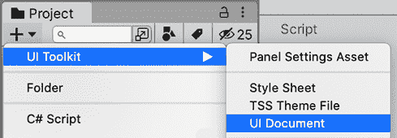

图 16.1：创建 UI 文档资产

1.  点击**游戏对象** | **UI 工具包** | **UI 文档**选项，在场景中创建一个带有 UI 文档组件的 GameObject，该组件能够渲染 UI 文档。

1.  选择它，并将**GameHUD** UI 文档资产（在*步骤 1*中创建的）拖放到 UI 文档 GameObject 的**源资产**属性中（在*步骤 2*中创建的）：

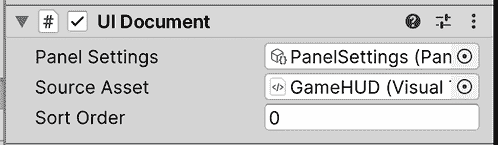

图 16.2：使 UI 文档组件渲染我们的 UI 文档资产

就这样！当然，由于 UI 文档是空的，我们屏幕上目前什么也看不到，所以让我们开始向其中添加元素。

## 编辑 UI 文档

由于我们的目标是重新创建上一章中创建的相同 UI，让我们从最简单的一部分开始：将玩家头像添加到左上角。一个选择是使用任何文本编辑器打开 UI 文档资产并开始编写 UXML 代码，但幸运的是，我们有一个更简单的方法，那就是使用**UI 构建器**编辑器。这个编辑器允许我们通过拖放元素来可视化地生成 UXML 代码。

为了做到这一点，让我们首先看看**UI 构建器**窗口是如何工作的：

1.  双击项目视图中的**GameHUD**资产以打开**UI Builder**：

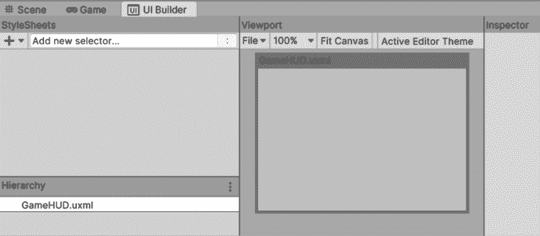

图 16.3：UI Builder 编辑器

1.  在 UI Builder 内部的**层次结构**面板中（*不是*我们在前几章中使用的**层次结构**面板），选择`GameHUD.uxml`，这是 UI 的容器元素。

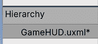

图 16.4：在层次结构中选择资产名称以编辑通用 UI 设置

1.  查看 UI Builder 窗口右侧的**检查器**面板（*不是*我们之前用来修改 GameObject 的**检查器**）。将**大小**属性设置为**宽度**为`1920`和**高度**为`1080`。这将允许我们查看我们的 UI 在这个分辨率下的外观。您稍后可以更改此值以查看它如何适应不同的大小，但关于这一点我们稍后再说：

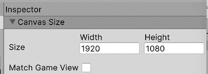

图 16.5：设置预览 UI 分辨率

1.  您可以通过按*鼠标滚轮按钮*（也称为*中间按钮*）并移动鼠标来平移视口以导航 UI。在 Mac 上，您还可以按*Option + Command*并点击并拖动视口的任何自由区域（没有我们的 UI 的地方）来完成相同的操作。

1.  您还可以使用*鼠标滚轮*来放大和缩小。最后，您可以使用**视口**左上角的缩放百分比选择和**适应画布**按钮自动将整个 UI 适应到您的**视口**中：

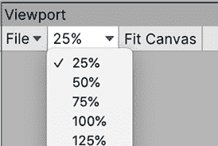

图 16.6：设置预览缩放

现在我们已经了解了 UI Builder 的基础知识，让我们将我们的图片添加到 UI 中：

1.  从左下角的**库**中将**VisualElement**图标拖到左边的**层次结构**部分。这将创建一个基本的 UI 元素，可以渲染图像以及更多内容：

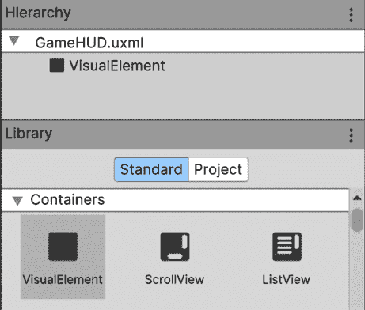

图 16.7：创建视觉元素

1.  在**层次结构**（在`GameHUD.uxml`下）中选择**VisualElement**，并查看 UI Builder 窗口右侧的**检查器**（*不是*我们之前用来修改 GameObject 的常规 Unity 检查器面板）中的**位置**部分。如果尚未展开，请展开它（使用左侧的箭头）。

1.  将**位置**设置为**绝对**，以便我们可以自由地在 UI 中移动我们的元素。在本章的后续部分，在*使用相对位置*部分，我们将解释**相对**模式是如何工作的：

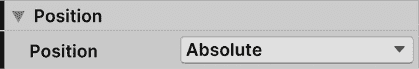

图 16.8：设置我们的 UI 元素可以自由移动

1.  打开**大小**部分，将**宽度**和**高度**设置为`100`，使我们的 UI 元素具有非零大小。这样，我们就可以在**视口**中看到其区域：

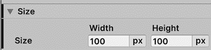

图 16.9：设置我们的 UI 元素大小

1.  在**视口**面板中，您可以拖动您的元素并使用角落的蓝色矩形来更改其大小。将您的元素放置在 UI 的左上角。如果您在**视口**中看不到您的元素，请在**层次结构**（UI Builder 的那个）中选择它：

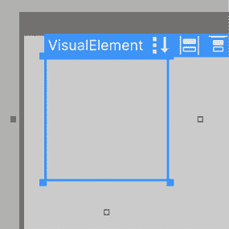

图 16.10：移动 VisualElements

1.  为了设置精确的位置，您可以在**检查器**的**位置**部分的**左**和**上**值中设置，以分别指定精确的*x*和*y*坐标，以像素为单位：

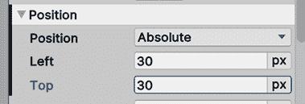

图 16.11：设置位置

1.  在**检查器**的**背景**部分，使用**图像**属性右侧的组合框将**图像**模式设置为**精灵**。这允许我们将精灵作为元素的背景应用。

1.  将我们在第十五章“用户界面设计”中导入的玩家头像的精灵资产（图片）从**项目**面板拖动到**图像**属性，以设置它。此外，您还可以使用目标按钮（中间带点的圆形按钮）从选择窗口中选择精灵资产：

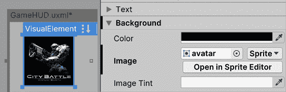

图 16.12：设置元素的背景图片

1.  返回常规的**游戏**面板查看结果。如果您没有看到变化，您可以关闭并重新打开渲染我们的 UI（使用 UI 文档创建的那个）的 GameObject。

现在我们已经创建了玩家头像，我们可以通过以下步骤创建玩家生命条：

1.  重复之前的*步骤*1 到*6*，创建一个新的元素，该元素将作为玩家生命条容器。它将没有任何图像，它只是其他将组成生命条的元素容器。

1.  将其放置在玩家头像的旁边，并设置宽度和高度以类似于经典的生命条。记住，您可以通过拖动图像和角落的方块，或者通过**大小**和**位置**属性来完成此操作，就像我们之前所做的那样。

1.  按照第 1 步，将一个新的**视觉元素**拖动到**层次结构**中，但这次将其拖动到第 1 步中创建的元素上。这将使这个新元素成为其子元素，这将使该元素的位置和大小取决于其父元素，就像我们在第十五章“用户界面设计”中父化 Canvas 对象时发生的那样。

1.  选择父级视觉元素，并在**检查器**中设置**名称**属性为`PlayerHealth`，以便轻松识别。对子元素也执行相同的操作，将其命名为`Filling`：

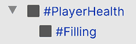

图 16.13：父化和命名视觉元素

1.  在**层次结构**中选择**Filling**元素，并查看**检查器**。

1.  在**背景**部分，将**颜色**属性设置为红色，点击颜色框并使用**颜色选择器**。这将用纯红色填充我们的 UI 元素背景，而不是使用图像：

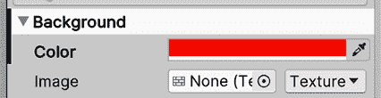

图 16.14：为我们的元素设置纯红色背景

1.  如往常一样，将**位置**设置为**绝对**，并将**左**和**顶**属性设置为`0`。由于这是一个元素的子元素，其位置将相对于其父元素的位置，因此通过指定**左**和**顶**值为`0`，我们表示我们将位于父元素的左侧和顶部 0 像素处。这意味着如果父元素移动，这个子元素将随之一同移动。

1.  将**大小**的**宽度**和**高度**设置为`100`，并通过单击**px**按钮并选择**%**来更改度量单位从`px`（像素）到`%`（百分比）。这将使**填充**元素的大小与其父元素相同（100%的父元素大小）：

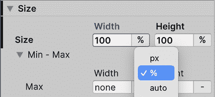

图 16.15：将我们的大小设置为与父元素相同

1.  将一个新的**VisualElement**作为**PlayerHealth**（**填充**的兄弟元素）的子元素添加，并命名为`Border`。

1.  将**位置**和**大小**设置为我们在步骤*7*和*8*中为**填充**元素所做的设置，但不要设置背景颜色。

1.  将**背景**部分的**图像**属性设置为我们在上一章中使用的相同边框图像。请记住将**图像**模式设置为**精灵**而不是**纹理**。

1.  在**背景**部分设置**切片**属性为`15`。这应用了我们在第十五章，**用户界面设计**中使用的九宫格技术，以在不拉伸对象的情况下扩展对象：

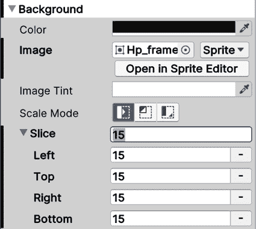

图 16.16：在元素中直接设置九宫格大小

1.  在**层次结构**中选择**填充**视觉元素，并设置其**大小**部分的**宽度**属性以模拟我们在第十一章，**用户界面设计**中使用的图像的**填充量**属性。稍后，我们将通过代码将此**大小**直接与玩家的健康数值成比例：

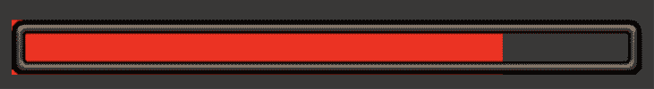

图 16.17：健康条结果

1.  重复步骤*1*到*12*以创建**基础健康**条的底部。记住这次填充必须是绿色。或者，您也可以直接复制并粘贴**PlayerHealth**容器，但我建议您为了学习目的重复这些步骤。

在前面的步骤中，我们基本上看到了如何组合几个 UI 元素来创建一个复杂对象。我们需要一个父容器元素来驱动子元素的大小，以便内部元素适应它，特别是填充，它需要一个百分比值来表示当前玩家的健康。

现在我们有了我们的生命条！嗯，还不完全是这样；填充的红色角落，我们的边框没有覆盖，看起来相当粗糙！我们将在本章后面讨论如何使我们的 UI 响应时改进这一点，所以现在让我们保持原样。

最后，让我们通过以下步骤将文本元素添加到 UI 中，但首先，我们需要考虑字体。如果你下载了 TTF 字体，你需要创建一个字体资产，就像我们在*第十五章*，*用户界面设计*中做的那样，以便在 UI 工具包中使用。但是，根据当前 UI 工具包的版本，我们在上一章中创建的字体资产不兼容。我们需要使用 UI 工具包字体资产创建器来创建字体资产，而不是使用 Text Mesh Pro。存在重复工具的原因是 Unity 正在将 Text Mesh Pro 包集成到一个新的、改进的包中，称为 Text Core，其中一项改进是与 UI 工具包和其他 Unity 系统的兼容性。

考虑到这一点，为了将 TTF 转换为与 UI 工具包兼容的字体资产，你只需在**项目**面板中右键单击 TTF 资产，然后选择**创建** | **文本** | **字体资产**。这将创建一个新的资产，我们将使用它来定义 UI 工具包文本的字体。

解决了这个问题后，让我们创建一个用于文本的 UI 元素，即**标签**：

1.  将 UI 建造窗口的**库**面板中的**标签**图标拖动到其**层次结构**面板。这将添加一个 UI 元素，它不仅能够在其背景中渲染图像，还可以渲染文本（是的，如果你想的话，你可以给文本添加背景）。

1.  如同往常，设置其**位置**和**大小**，这次将其放置在屏幕的右上角。记住你可以简单地拖动元素；你不需要手动设置特定的坐标（尽管如果你想的话也可以）。

1.  将**检查器**中**标签**部分的**文本**属性更改为所需的文本；在我们的例子中，这将是一个`得分：0`：

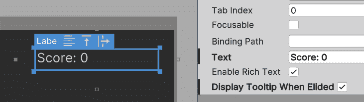

图 16.18：设置要显示的文本

1.  将这些步骤之前创建的**字体**资产拖动到**检查器**中**文本**部分的**字体资产**属性。不要将其与**字体**属性（位于**字体资产**之上）混淆。那个属性允许你直接拖动 TTF 资产，但这个功能很快就会过时，所以让我们坚持使用 Unity 推荐的方法。

1.  如果你注意到你的**字体**资产不起作用，尝试将其放入**项目**面板中的**UI Toolkit** | **资源** | **字体和材质**文件夹。虽然这不应该在最新的 Unity 版本中是必要的，但我注意到过去这解决了这类问题。此外，有一个错误有时会导致字体不被识别，可以通过删除并重新创建**标签**来修复。

1.  将**文本**部分的**大小**属性设置为任何合适的大小：

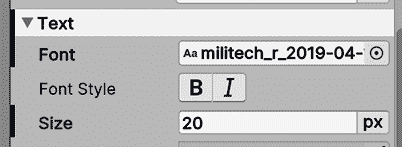

图 16.19：设置标签的文本字体和大小

1.  重复*步骤 1*到*6*，将所有剩余的**标签**添加到 UI 中。

1.  我们需要做的最后一件事是保存，这可以通过按*Ctrl + S*（在 Mac 上为*Command + S*）或使用**UI Builder**窗口顶部的**视图**部分左上角的**文件** | **保存**菜单来完成。请注意，UI Toolkit 的早期版本中存在一个错误，这可能会导致视图损坏。如果发生这种情况，请关闭它并重新打开 UI Builder。

现在我们已经创建了 UI，你可能已经注意到需要重复设置以使多个对象看起来相同，比如我们的生命条和标签。虽然这是完全可行的，但通过重用样式，我们可以极大地提高我们的工作流程，而**样式表**正是我们完成这一目标所需的确切功能，所以让我们来看看它们。

## 创建 UI 样式表

在创建 UI 时，你可能会遇到整个游戏中多个元素共享相同样式的场景，例如具有相同背景、字体、大小、边框等的按钮。当使用 uGUI 创建 UI 时，避免为每个元素重复配置的一种方法是为按钮创建一个 Prefab 并创建实例（以及必要时创建 Prefab 变体）。问题是这里我们没有 GameObject，因此没有 Prefab，但幸运的是，我们有**样式表**。

**样式表**是包含一系列针对我们 UI 元素样式预设的独立资产。我们可以定义一组样式（例如，背景、边框、字体、大小等）并将这些样式应用到不同 UI 元素中的多个元素上。这样，如果我们更改样式表资产中的样式，使用该样式的所有 UI 元素都会相应改变，这与材质的工作方式类似。

在样式表中创建样式有几种方法。一个例子是选择器系统。这个系统允许你应用一系列规则来选择哪些元素应该应用样式（如果你认为这类似于 CSS，那么你是正确的），但让我们现在先从基础开始，创建**样式表类**。**类**基本上是一种可以通过其名称应用到任何元素上的样式。例如，我们可以创建一个名为`Button`的类，并将该类添加到 UI 中我们希望应用该样式的每个按钮上。请考虑，这里的类概念与编程中的类概念完全不同。

因此，在这种情况下，让我们为 UI 中的所有标签创建一个类，这样只需更改样式就可以修改它们的外观：

1.  在**UI Builder**的**样式表**面板中，点击添加（**+**）按钮，然后点击**创建新 USS**（Unity StyleSheet）。如果不起作用，请尝试重新启动 Unity；当前版本的 UI Toolkit 中存在一个错误，可能会导致此问题：

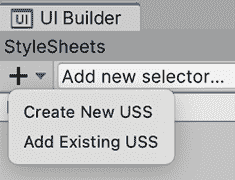

图 16.20：创建 Unity StyleSheet

1.  将 USS 命名为你喜欢的名称（例如，我的情况是`GameUSS`）并保存文件。

1.  在我们的 UI 文档中选择一个标签元素，并查看**检查器**。

1.  在**检查器**的**样式表**面板中，在**样式类列表**输入字段中键入`HUDText`，但不要按*Enter*。

1.  点击**将内联样式提取到新类**按钮。这将把我们为标签（位置、大小、字体等）所做的所有样式修改保存到一个名为`HUDText`的新样式类中。你可以观察到它被添加到元素应用的类列表中（那些在**检查器**中**样式表**部分底部的标签）：

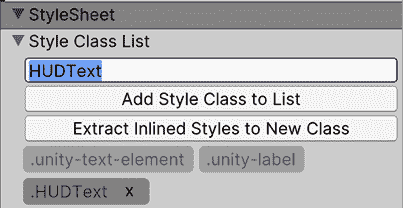

图 16.21：将设置提取到样式类

通过这些步骤，我们已经将具有我们需要应用到其他元素上的样式的标签提取到一个名为**HUDText**的类中。这样，我们只需将**HUDText**类添加到我们的 UI 中的其他元素，甚至可以将相同的 USS 资产添加到其他 UI 文档中（在**样式表**面板上点击**+**按钮 | **添加现有 USS**）以将此类添加到其中的元素。

此外，如果你再次选择标签，你可以注意到之前加粗的属性现在又变回了正常；这是因为加粗的属性表示已更改的属性，我们已经提取了它们，因此默认值变成了样式类定义的任何值。幸运的是，并不是所有内容都被提取到新的 USS 类中；例如，**文本**字段仍然有我们特定的所需文本，因为你不太可能希望在其他对象中放入相同的文本。

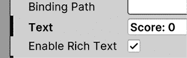

图 16.22：文本属性加粗，表示它与默认值不同。另一方面，启用富文本没有加粗，这意味着它遵循默认值和类值

如果你在提取类时忘记了某些样式更改，你可以在**UI Builder**的右上部分选择**样式表**部分，然后选择列表中的**HUDText**类。如果你看不到它，尝试展开**GameUSS.uss**部分。

一旦选择，你可以在检查器面板中更改它，类似于我们更改 UI 元素的属性：

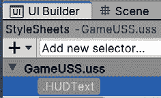

图 16.23：选择样式类进行修改

这样，我们就编辑了我们的`HUDText`类。如果其他元素应用了此类，它们也会应用这些更改。考虑另一种选项是首先创建类，在**样式表**输入字段中键入名称并按*Enter*，然后将其应用到 UI 元素上。这样，你将避免需要撤销不希望的变化，但如果首先创建了元素，则方便有撤销选项：

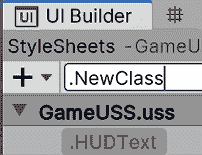

图 16.24：从头创建样式类

现在我们有了我们的样式类，让我们通过以下步骤将其应用到其他元素上：

1.  选择我们的 UI 中的另一个标签。

1.  将**HUDText**样式从 UI 构建器窗口左上角的**样式表**面板拖动到视口上的元素。你也可以选择将其拖动到**层次结构**元素：

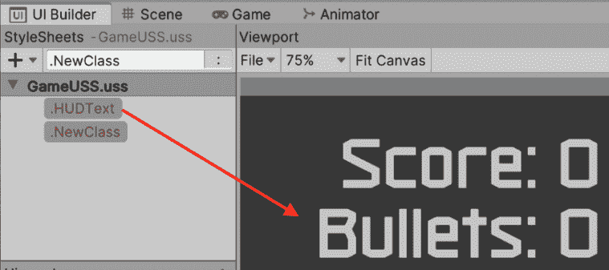

图 16.25：将类应用到元素

1.  选择**标签**并检查**HUDText**类是否已添加到**检查器**上的**样式表**部分。

现在，考虑即使元素现在应用了类，元素本身对我们在之前步骤中做的文本更改也有影响，覆盖了我们类中的样式。你可以通过再次选择类（在**UI 构建器**窗口左上角的**样式表**部分）并更改任何设置，如大小，来轻松检查这一点，看看不是所有元素都发生了变化。这显示了覆盖系统是如何工作的；元素上的更改优先于它所应用的类中的更改。

如果你想移除这些覆盖，你可以简单地选择元素（不是类），在覆盖的属性上右键点击，然后通过右键点击并选择**取消设置**来撤销更改。在我们的**标签**例子中，我们可以取消整个**文本**部分以及可能的全局**绝对**位置（因为期望的值已经包含在类中）。

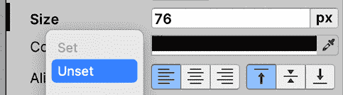

图 16.26：撤销覆盖以使用应用于元素的类的默认值

因此，通过这些步骤，我们创建了一个新的**样式表**资产，并将其添加到 UI 文档中以便使用。我们在其中创建了一个新的样式类，将现有 UI 元素的更改提取到其中，然后调整我们想要保留的更改。最后，我们将这种样式应用到另一个元素上。通过这种方式，我们只是触及了样式表的真正力量。我们可以开始做一些事情，比如从不同的样式表中组合不同的类，或者使用选择器动态设置样式，但这超出了本章的范围。

有趣的是，尽管 UI 工具包的文档目前相当基础，但所有这些高级概念都可以通过阅读 CSS 来学习，这是 Unity 基于样式表系统的基础技术。它不会完全相同，但基本思想和最佳实践仍然适用。

现在，UI 看起来几乎与第十五章“用户界面设计”中的样子完全一样，但它不会以相同的方式表现。如果你尝试更改视口的大小（在层次结构中选择**GameHUD.uxml**并更改**宽度**和**高度**，就像我们在本章开头做的那样），你会看到 UI 不会正确适应，所以让我们来修复这个问题。

# 制作响应式 UI

在本节中，我们将学习如何使之前创建的 UI 适应不同的屏幕尺寸。我们将讨论以下概念：

+   动态定位和尺寸

+   动态缩放

+   使用相对位置

让我们先讨论一下我们如何使我们的对象的**位置**和**大小**适应屏幕大小。

## 动态定位和大小

到目前为止，我们已经使用了**左**和**顶**位置属性来指定我们的元素相对于屏幕左上角的位置，然后使用**宽度**和**高度**来定义**大小**。虽然本质上这就是定义一个对象位置和大小的全部所需，但在所有情况下它并不非常实用，尤其是在我们需要适应不同屏幕尺寸时。

例如，如果您需要将一个对象放置在屏幕的右上角，其大小为`100x100`像素，屏幕大小为`1920x1080`像素，我们可以将**左**和**右**位置属性设置为`1820x980`像素，这将有效，但仅适用于该特定分辨率。

那么，如果用户以`1280x720`像素运行游戏会发生什么？对象将超出屏幕！在 uGUI 中，我们使用了**锚点**来解决这个问题，但这里没有。幸运的是，我们有**右**和**底**来帮助。

与**左**和**顶**属性一样，**右**和**底**定义了从父元素边界的距离（如果没有父元素，则直接从整个屏幕开始）。目前，这两个都设置为**auto**，这意味着位置将由**左**和**右**独立驱动，但通过改变这些值可以发生有趣的事情，所以让我们使用它们来使我们的**得分**和**子弹**标签粘附到屏幕的右上角，具体操作如下：

1.  将光标放在**视口**中 UI 的底部，直到出现一个白色条。

1.  拖动该条来调整屏幕大小并查看我们的元素是如何适应（或没有适应）不同大小的。

1.  在侧边栏也做同样的操作，以查看它如何适应不同的屏幕宽度：

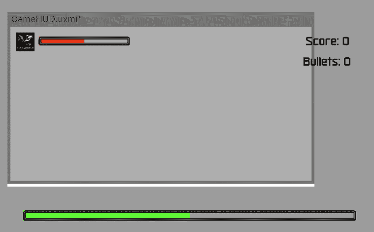

图 16.27：UI 没有适应不同的屏幕大小

1.  在**视口**中选择得分标签并查看**检查器**。

1.  在**位置**部分将**顶**和**右**的值设置为`30`。

1.  通过点击每个属性右侧的**px**按钮并选择**auto**来将**左**和**底**的值设置为`auto`：

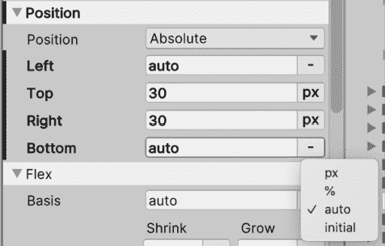

图 16.28：将位置属性的单位类型更改为自适应模式

1.  注意标签两侧的金色方块变成了实心，而左侧和底部是空心的。这意味着左侧和底部处于**auto**模式。如果需要，您也可以通过点击这些方块来切换**auto**模式：

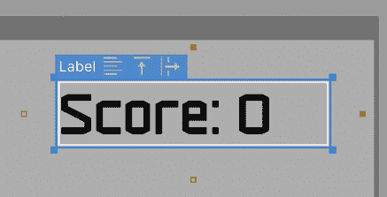

图 16.29：切换元素位置属性的自适应模式

1.  再次尝试改变 UI 容器的尺寸，就像我们在步骤*1*和*2*中所做的那样，以查看我们的**得分**标签是如何始终对齐到右上角的。

1.  对于**子弹**标签，重复步骤*4*到*6*，这次将**顶**属性设置为`140`。

我们通过这些步骤所做的实际上是使对象的位置以像素为单位相对于 UI 的**Top**和**Right**边或屏幕的右上角来表示。我们需要将其他边设置为`auto`模式，这样它们就不会参与位置计算。

现在，我们也可以以其他方式使用**Position**属性。如您现在可能想象的那样，如果我们愿意，我们可以开始组合**Left**和**Right**以及**Top**和**Bottom**。在这种情况下，**Left**和**Top**将优先定义位置，但然后，**Right**和**Bottom**做什么呢？它们定义元素的大小。

例如，如果我们有一个元素，其**Left**和**Right**属性分别设置为`100px`，并且我们在一个宽度为`1920`像素的屏幕上查看我们的 UI，那么我们元素的最终宽度将是`1720`（`1920`减去**Left**的`100`减去**Right**的`100`）。这样，**Position**属性表示我们元素边框与屏幕边框（或父元素）的距离。

让我们通过以下方式来观察其效果：使底部生命条适应屏幕宽度，同时通过以下方式保持其相对于屏幕底部的位置：

1.  在**Hierarchy**中选择底部生命条父元素。不要在**Viewport**中选择它，因为您只会选择其填充或边框。

1.  将**Left**、**Right**和**Bottom**设置为`50px`。

1.  将**Top**设置为自动（点击右侧的**px**按钮并选择**auto**）。

1.  在**Size**部分，也将**Width**设置为**auto**。

1.  将**Height**设置为`35px`：

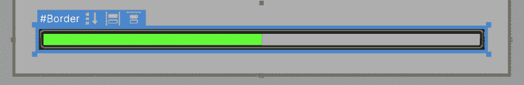

图 16.30：使玩家的基础生命条适应屏幕宽度

1.  改变 UI 的大小，看看它是如何适应的。

通过这些步骤，我们将屏幕边缘的条形距离定义为`50`像素，以便适应任何屏幕宽度，同时保持边框和高度固定。我们基本上实现了与 uGUI 中分割锚点相同的行为！请注意，我们需要将**Size**的**Width**属性设置为**auto**，以便让**Left**和**Right**属性驱动位置；如果不这样做，**Width**属性将具有优先级，并且**Right**将没有任何效果。我邀请您尝试其他**px**/**auto**的组合。

我们在这里可以做的最后一个技巧是，在健康条边框的**Left**、**Top**、**Right**和**Bottom****Position**属性中使用负值，使边框略大于容器并覆盖填充边框。在这种情况下，将**Left**、**Top**、**Right**和**Bottom**设置为`-15px`，并记住将**Size** **Width**和**Height**属性都设置为**auto**。您可能想要稍微减小条容器的高度（不是边框），因为现在它将因为这种变化而看起来更厚：

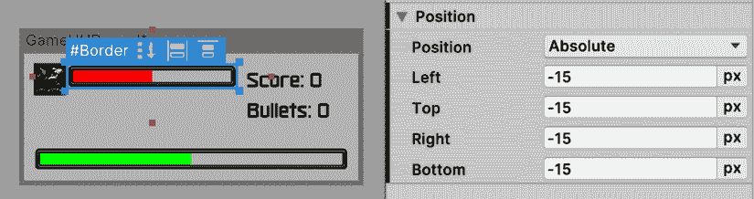

图 16.31：使用负 Position 属性覆盖填充

除了**px**（像素）或**自动**模式之外，还有一种百分比（`%`）模式，它允许我们以相对于屏幕（或如果有，父元素）大小的百分比来表示值。例如，如果我们将**顶部**和**底部**设置为`25%`，这意味着我们的元素将在垂直居中，其大小为屏幕高度的 50%（请记住在此处将**高度**模式设置为`自动`）。如果我们将**顶部**设置为`25%`，**底部**设置为**自动**，**高度**设置为`50%`，我们也可以达到相同的结果；如您所见，我们可以巧妙地组合这些值。

在我们的案例中，我们将使用百分比值在我们的生命条填充中，这样我们就可以用百分比来表示其大小。我们需要这一点，因为稍后我们可以在代码中将条宽指定为玩家生命值的百分比（例如，一个有`25`生命值和最大`100`点的玩家有`25%`的生命）。

现在，虽然我们通过使用**左**、**顶**、**右**和**底**属性解决了屏幕大小的定位适应问题，但我们还没有解决元素的动态大小问题。这次，我们指的是具有不同**DPI**（每英寸点数）的屏幕，因此让我们讨论如何通过**面板设置**资产来实现这一点。

## 动态缩放

我们使用`1920x1080`作为 UI 基本分辨率来定位和调整元素的大小，以便在该分辨率下看起来很漂亮。我们还更改了 UI 大小，以查看元素如何适应不同的屏幕尺寸；虽然这效果很好，但您会注意到在这样做时元素看起来更大或更小。

虽然有一个基本参考分辨率对于设计我们的 UI 是好的，但我们应考虑不同分辨率下元素的大小，尤其是在高 DPI 的屏幕上。有时，您可能会有更高分辨率的屏幕，但物理尺寸相同（以厘米为单位）。这意味着高分辨率中的像素更小，因此它们具有更高的 DPI，所以如果未正确缩放，元素看起来可能会更小。

在过去，我们使用**画布缩放器**组件的**画布**来使 UI 根据屏幕分辨率调整其元素的大小。我们在这里的设置与 UI 文档组件中引用的**面板设置**资产中的设置完全相同，因此让我们通过以下方式来配置它：

1.  在**项目**面板中查找**面板设置**资产并选择它。另一种选择是在主编辑器层次结构中选择`UI 文档`GameObject，并点击**面板设置**属性中引用的资产：

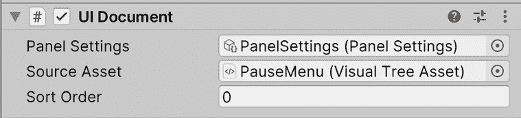

图 16.32：UI 文档组件中引用的面板设置

1.  将**缩放模式**设置为**与屏幕大小缩放**。

1.  将**屏幕匹配模式**设置为**匹配宽度或高度**。

1.  将**参考分辨率**的**X**值设置为`1920`，**Y**值设置为`1080`。

1.  将**匹配**滑块完全向右移动，直到标记为**高度**的末端：

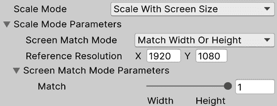

图 16.33：设置我们的 UI 缩放

1.  观察如何改变 Unity 编辑器中**游戏**面板的高度，将使 UI 相应地调整元素大小（改变整个 Unity 编辑器窗口的高度）。

我们通过这些更改首先将**参考分辨率**设置为我们的 UI 设计的任何分辨率，在我们的例子中，是`1920x1080`。然后，我们将**屏幕匹配模式**设置为允许我们根据一边、**宽度**、**高度**或两者的组合来缩放我们的元素，如果我们更喜欢的话。在我们的例子中，我们选择了**高度**，主要是因为我们的游戏针对 PC，那里的屏幕更宽而不是更高。这意味着在不同的屏幕宽度上，元素看起来大小相同，但在不同的高度上，元素会更大或更小。

使用这些设置，我们可以做一些数学计算来理解这些值。如果我们的屏幕分辨率与参考分辨率（`1920x1080`）相同，那么元素的大小将与我们在像素大小中指定的元素大小相同，所以对于我们的玩家角色来说，它将是`150x150`像素。记住，物理大小以厘米为单位取决于屏幕的 DPI。

现在，想象一下我们有一个 4k 屏幕，这意味着分辨率为`3840x2160`。因为我们指定了我们的 UI 通过**高度**匹配，所以我们可以确定我们的元素大小将加倍，因为我们的屏幕高度是参考分辨率的两倍（`2160`除以`1080`）。我们的玩家角色将是`300x300`，使得元素在 4k 屏幕上具有相同的物理大小，双倍大小但双倍像素密度实现了这一点。最后，考虑一个超宽标准分辨率`2560×1080`（是的，非常宽的屏幕），在这种情况下，元素的大小将与宽度唯一的变化相同；唯一的区别是，由于屏幕大小，元素将会有更多的水平间隔。我知道这些计算可能会让人困惑，但请继续实验**面板设置**和**游戏视图**大小，以更好地理解它们。

太好了，现在我们真的有了相同的 HUD。我们可以开始将到目前为止看到的概念应用到**选项**菜单中，但让我们抓住机会以不同的方式来做，使用**相对**位置，这是一种创建元素流动的方法，其中元素的位置相互依赖。

## 使用相对位置

在我们游戏的 HUD（抬头显示）中，每个元素都需要其自己的**位置**和**大小**，并且不同元素的位位置可以调整大小和重新定位，而不会影响其他元素。我们可以观察到玩家生命条和角色的例子，但在这个情况下变化是微不足道的。还有其他情况，这种情况并不那么简单，比如一个**列表**元素（例如，在多人游戏中要加入的匹配列表）需要垂直或水平调整，这就是相对位置帮我们解决问题的地方。

相对位置允许我们使元素的位置相互关联；从某种意义上说，一个元素的位置将取决于前一个元素的位置，前一个元素的位置又取决于其前一个元素，依此类推，形成一个链或**流**。这就像在 uGUI 上的**垂直**和**水平布局**一样工作。在我们的情况下，我们将使用这些来使我们的选项菜单中的**暂停**标签以及**选项**和**退出**按钮垂直对齐并沿其父元素居中。

让我们开始创建菜单，按照以下步骤操作：

1.  创建一个新的 UI 文档（在**项目视图** | **UI Tookit** | **UI Document**后点击**+**按钮）并命名为`OptionsMenu`。我们可以继续在之前的 UI 文档上工作，但让我们将这些 UI 部分分开，以便于激活和停用，以及一般资产组织。

1.  双击资产将其设置为当前由**UI Builder**编辑的 UI。

1.  选择根对象（**OptionsMenu.uxml**在**Hierarchy**中）并将**宽度**和**高度**的**检查器**属性设置为`1920x1080`像素。

1.  创建一个新的具有 UI 文档组件（**GameObject** | **UI Toolkit** | **UI Document**）的 GameObject，并将此对象的资产拖动以渲染它（就像我们在本章早期创建的 HUD 所做的那样）。

1.  双击 UI 文档资产以打开**UI Builder**窗口进行编辑，并在该窗口中，将一个新的**视觉元素**拖动到**Hierarchy**或**视口**并命名为`Container`（在**UI Builder**的**检查器**中的**名称**属性）。

1.  将**左**、**右**、**上**和**右**的**位置**属性设置为`0px`。

1.  将**位置**设置为**绝对**。

1.  在**大小**部分将**宽度**和**高度**设置为**自动**。这将使容器适应整个屏幕。

1.  将一个新的**视觉元素**拖动到**容器**下作为子元素并命名为`Background`。

1.  这次将**位置**保留为**相对**。

1.  将**大小**的**宽度**和**高度**设置为`500px`。

1.  将**背景图像**的**背景**对象设置为使用上一章中使用的相同背景精灵。

1.  选择**容器**父对象（不是**背景**）。

1.  在**检查器**中，将**对齐项**属性设置为**居中**，这是第三个按钮。如果将鼠标悬停在图标上，它们将在工具提示中显示其名称。

1.  将**Justify Content**设置为**居中**（第二个按钮）：

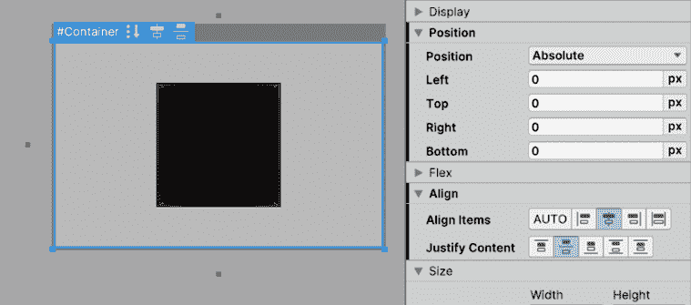

图 16.34：准备 UI 背景以容纳内部元素

1.  使用侧面的白色条调整 UI 的大小，以查看背景始终居中。

即使只有一个元素，我们也可以开始看到相对位置是如何工作的。首先，我们创建了一个始终适应屏幕大小的空对象，使我们能够使子元素依赖于整个屏幕大小。然后，我们创建了一个具有固定大小的图像元素，但具有相对位置，这意味着其位置将由父容器计算。最后，我们告诉**容器**使其子对象与它的水平和垂直中心对齐，因此背景立即居中，无论屏幕大小如何。当使用绝对位置时，对齐属性不起作用，因此这是**相对**定位的第一个好处之一。

但**相对**定位在多个元素中变得更加强大，因此让我们将**标签**和**按钮**添加到我们的**背景**元素中，通过以下方式进一步探索这一概念：

1.  从**UI Builder**左下角的**库**面板中，拖动一个**标签**和两个**按钮**元素到**层次结构**中的**背景**内。注意，有时即使你将新元素拖放到目标对象内，它也不会成为其子元素。这次请只拖动在层次结构中创建的元素：

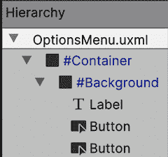

图 16.35：在菜单背景内添加元素

1.  观察默认情况下，由于相对位置的默认设置，元素如何垂直对齐，一个叠在另一个上面：

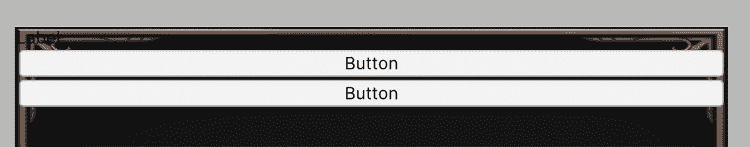

图 16.36：自动相对垂直定位

1.  选择**背景**元素，并将**内容对齐**设置为`space-around`（第五个按钮）。这将使元素沿背景分布。

1.  将**对齐元素**设置为**居中**（第三个选项）以水平居中元素：

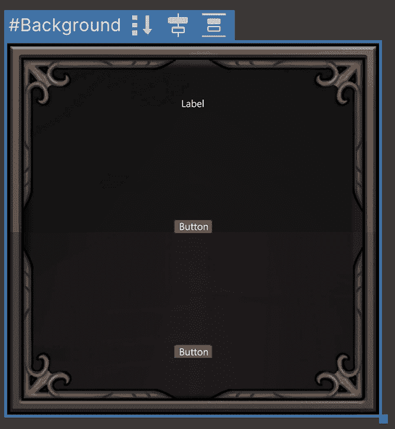

图 16.37：自动相对垂直定位

对于**内容对齐**有一个类似的模式，称为“space-between”（在内容对齐中的第四个按钮），它也会沿着垂直轴分布元素，但不会在第一个元素的顶部或最后一个元素的底部留下空间。此外，**对齐元素**有一个名为**拉伸**（第五个选项）的选项，与**居中**类似，它将在水平方向上居中元素，但也会拉伸它们而不是尊重每个元素的宽度。我建议尝试不同的对齐模式，以发现所有机会。

1.  将**标签**的**文本**的**字体**和**大小**属性设置为适合的任何值。在我的情况下，我使用了导入的字体和`60px`的大小。记得也要将**文本**设置为`暂停`。

1.  将**按钮**的**背景图片**设置为与上一章中使用的按钮相同的图片。

1.  将**Background**部分的**Color**属性设置为没有 alpha 的颜色。你可以通过点击颜色矩形并减少颜色选择器中的**A**通道到`0`来实现这一点。这种颜色的想法是作为我们图像的背景，但我们不需要它，所以我们使其完全透明。

1.  将按钮的**Text**的**Font**、**Size**和**Color**设置为对你来说合适的内容。在我的情况下，我使用`50`和灰色。

1.  在**Margin and Padding**部分，将**Padding**设置为在文本和按钮边框之间留出一些空间。在我的情况下，`30px`就做到了这一点：

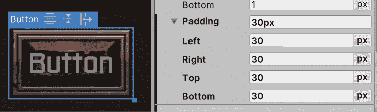

图 16.38：为按钮内容添加内部填充（在这个例子中是文本）

1.  还要设置**Background**的**Top**和**Bottom****Padding**，以便在窗口边框和其元素之间留出一些空间。在我的情况下，每个都是`40px`。

如你所见，我们更改了不同的设置来动态设置元素的大小，如字体大小和填充，以及相对系统以及对齐设置自动确定元素的位置。我们可以通过在层次结构中拖动元素来重新排列元素的顺序，它们将自动适应。我们也可以使用**Size**属性设置元素的大小，并且我们可以使用**Position**属性应用一些偏移量，如果需要的话，但我鼓励你自己看看这些属性在相对模式下的行为。

最后一个我想让你探索的设置是**Flex**部分的**Direction**属性，正如你可以想象的那样，这将决定元素将遵循的朝向，垂直方向从上到下或从下到上，以及水平方向从左到右或从右到左。例如，你可以将**Direction**设置为使用**row**模式（第三个按钮）从左到右分配元素，如果你希望的话，可以使背景更宽以拥有一个水平选项菜单。

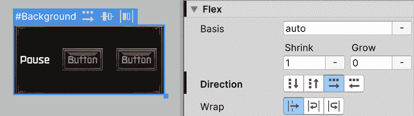

图 16.39：将元素更改为垂直方向

作为旁注，你可能注意到背景和按钮的图像看起来比上一章中完成的选项菜单要大。这是因为我们在**Texture**资产上更改的**Pixels per Unit**设置，用于控制纹理的缩放，在 UI Toolkit 中不会生效；你需要手动在任何图像编辑器中更改纹理文件大小以给出适当的大小。这里的最佳实践是始终创建大小适合我们最大支持的分辨率的图像。通常，在 PC 上是`1920x1080`，但请注意，4k 分辨率每天都在变得越来越流行。

# 摘要

在本章中，我们介绍了 UI 工具包的关键概念以及如何创建 UI 文档和样式表。关于 UI 文档，我们学习了如何创建不同的元素，如图片、文本和按钮，以及如何使用不同的方法（如绝对和相对定位，以及像素或百分比单位）来定位和调整它们的大小。此外，我们还看到了如何通过不同的**位置**属性组合来使 UI 适应不同的尺寸。最后，我们学习了如何使用 USS 样式表在不同元素之间共享样式，以便轻松管理整个 UI 皮肤。

实质上，我们再次学习了如何使用不同的系统来制作 UI 界面。再次提醒，这个系统仍然处于实验阶段，不建议用于实际的生产项目。我们使用所有这些概念来重新创建在*第十五章*，*用户界面设计*中创建的相同 UI 界面。

在下一章中，我们将看到如何为我们的游戏添加动画，使我们的角色移动。我们还将了解如何创建剪辑场景和动态摄像机。
