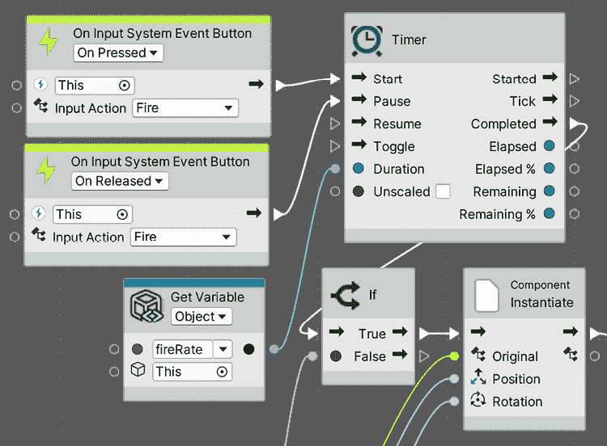

# 使用 Animator、Cinemachine 和 Timeline 创建动画

有时，我们需要以预定的方式移动对象，例如在场景中，或者特定的角色动画，如跳跃、奔跑等。在本章中，我们将介绍几个 Unity 动画系统，以创建我们可以通过脚本获得的所有可能的物体运动。

在本章中，我们将检查以下动画概念：

+   使用 Animator 进行皮肤动画

+   脚本动画

+   使用 Cinemachine 创建动态相机

+   使用 Timeline 创建场景

到本章结束时，你将能够创建场景来讲述你游戏的历史或突出你关卡中的特定区域，以及创建能够根据情况提供准确外观的动态相机。

# 使用 Animator 进行皮肤动画

到目前为止，我们使用的是所谓的静态网格，它们是固体三维模型，不应该以任何方式弯曲或动画化（除了像汽车门那样单独移动）。

我们还有一种另一种网格，称为皮肤网格，它具有根据骨骼弯曲的能力，因此可以模拟人体肌肉运动。我们将探讨如何将动画化的类人角色集成到我们的项目中，以创建敌人和玩家的动作。

在本节中，我们将检查以下骨骼网格概念：

+   理解皮肤

+   导入皮肤网格

+   使用 Animator 控制器进行集成

+   使用 Avatar 面具

我们将探讨皮肤的概念以及它如何让你对角色进行动画化。然后，我们将把动画网格带入我们的项目，最终对它们应用动画。让我们先讨论如何将骨骼动画带入我们的项目。

## 理解皮肤

为了获得一个动画网格，我们需要四个部分，首先是将要动画化的网格，其创建方式与其他网格相同。然后，我们需要骨骼，它是一组骨头，将匹配所需的网格拓扑结构，例如手臂、手指、脚等。在*图 17.1*中，你可以看到一个与我们的目标网格对齐的骨头集合示例：

图 17.1：一个与默认姿势匹配的骨骼忍者网格

一旦艺术家创建了模型及其骨骼，下一步就是进行皮肤绑定，这是将模型每个顶点关联到一个或多个骨骼的行为。这样，当你移动一个骨骼时，相关的顶点会随着它移动。在*图 17.2*中，你可以看到网格的三角形根据影响它的骨骼颜色进行绘制，作为可视化骨骼影响的一种方式。你会注意到颜色之间的混合，这意味着那些顶点受到不同骨骼的影响，以便使接近关节的顶点能够弯曲得很好。此外，*图 17.2*还展示了用于二维游戏的二维网格的示例，但概念是相同的：

图 17.2：网格皮肤权重以颜色形式直观表示

最后，你需要的是实际的动画，它将简单地由网格骨骼的不同姿势的混合组成。艺术家将在动画中创建关键帧，确定模型在不同时刻需要具有的姿势，然后动画系统将简单地在这之间进行插值。基本上，艺术家将动画化骨骼，而皮肤系统将应用此动画到整个网格上。

为了获得这四个部分，我们需要获取包含它们的适当资产。在这种情况下，通常的格式是**Filmbox**（**FBX**），我们之前用它来导入 3D 模型。此格式可以包含我们需要的每一部分——模型、带有皮肤骨骼和动画——但通常这些部分将分成几个文件以供重新利用。

想象一个城市模拟器游戏，其中我们拥有几个具有不同特征的市民网格，并且所有这些网格都必须是动态的。如果我们为每个市民创建一个包含网格、皮肤和动画的单个 FBX 文件，那么每个模型都将拥有自己的动画，或者至少是相同动画的克隆，重复播放。当我们需要更改该动画时，我们需要更新所有网格市民，这是一个耗时的工作。相反，我们可以为每个市民创建一个包含网格和基于该网格适当皮肤骨骼的 FBX 文件，以及每个动画一个单独的 FBX 文件，包含所有市民都有的相同骨骼和适当的动画，但不包含网格。这将使我们能够混合和匹配市民 FBX 文件和动画 FBX 文件。你可能想知道为什么模型 FBX 和动画 FBX 都必须包含网格。这是因为它们需要匹配，以便使两个文件兼容。在*图 17.3*中，你可以看到文件应该如何看起来：

图 17.3：我们将用于项目的动画和模型 FBX 文件包

此外，值得一提的是一个称为重定位的概念。正如我们之前所说，为了混合模型和动画文件，我们需要它们具有相同的骨骼结构，这意味着相同的骨骼数量、层次结构和名称。

有时候，这是不可能的，尤其是在我们将我们艺术家创建的定制模型与使用动作捕捉技术从演员那里记录的外部动画文件混合时，或者只是通过购买一个动作捕捉（动作捕捉）库，一组使用特定动作捕捉硬件在真实人类上捕捉的动画。在这种情况下，你很可能会在动作捕捉库和你的角色模型之间遇到不同的骨骼结构，这就是重定向发挥作用的地方。这项技术允许 Unity 在两个不同的人形骨骼结构之间创建一个通用的映射，使它们兼容。在下一节*导入骨骼动画*中，我们将看到如何启用此功能。

现在我们已经了解了着色网格背后的基础知识，让我们看看我们如何获取带有骨骼和动画的模型资产。

## 导入骨骼动画

你可以通过在资产商店的**3D** | **角色** | **人类**部分搜索来下载一个角色模型。你也可以使用外部网站，例如名为 Mixamo 的网站来下载它们。请注意，有时你可能需要下载几个包，因为有时包只包含着色模型，而其他包只包含动画。幸运的是，我们下载的这个已经包含了着色网格和动画。

在我的包内容中，我可以在`Animations`文件夹中找到动画的 FBX 文件，以及我在`Mesh`文件夹中的模型`Polyart_Mesh`的 FBX 文件。记住，有时它们不会像这样分开，如果存在任何动画，动画可能位于与模型相同的 FBX 文件中。现在我们已经有了所需的文件，让我们讨论如何正确配置它们。

让我们从选择**模型**文件并检查**绑定**标签开始。在这个标签中，你会找到一个名为**动画类型**的设置，如图*图 17.4*所示：

图 17.4：绑定属性

此属性包含以下选项：

+   **无**：用于非动画模型的模式；你的游戏中的每个静态网格都将使用此模式。

+   **旧版**：用于旧 Unity 项目和模型的模式；不要在新项目中使用。

+   **通用**：一种可用于所有类型模型的全新动画系统，但通常用于非人类模型，如马、章鱼等。如果你使用此模式，模型和动画 FBX 文件必须具有完全相同的骨骼名称和结构，从而减少了从外部来源组合动画的可能性。

+   **人类**：为人类模型设计的新动画系统。它启用了诸如重定位和**逆运动学**（**IK**）等功能。这允许你将具有不同骨骼的模型与动画结合，因为 Unity 将创建这些结构与通用结构之间的映射，称为化身。请注意，有时自动映射可能会失败，你需要手动进行更正；因此，如果你的通用模型包含你需要的一切，我建议如果你是 FBX 的默认配置，就坚持使用**通用**。

在我的情况中，我的包中的 FBX 文件模式设置为**人类**，这是好的，但请记住，只有当绝对必要时才切换到其他模式（例如，如果您需要组合不同的模型和动画）。现在我们已经讨论了**绑定**设置，让我们谈谈**动画**设置。

为了做到这一点，选择任何动画 FBX 文件，并在检查器窗口中查找**动画**选项卡。你将找到几个设置，例如，如果文件包含动画（不是模型文件），则必须勾选**导入动画**复选框，以及**片段**列表，其中包含文件中的所有动画。在下面的屏幕截图中，你可以看到我们的动画文件之一的**片段**列表：

图 17.5：动画设置中的片段列表

带有动画的 FBX 文件通常包含一个单独的大动画轨道，该轨道可以包含一个或多个动画。无论如何，默认情况下，Unity 将根据该轨道创建一个动画，但如果该轨道包含多个动画，你需要手动拆分它们。在我们的案例中，我们的 FBX 包含一个单独的动画，但为了了解如何在其他情况下拆分它，请按照以下步骤操作：

1.  从**片段**列表中选择任何你想要重新创建的动画；以我的情况为例，我将选择`Run_guard_AR`。

1.  查看动画时间线下的**开始**和**结束**值，并记住它们；我们将使用它们来重新创建这个片段：

图 17.6：片段设置

1.  使用**+**按钮创建一个新的片段并选择它。

1.  使用输入框当前显示的类似`Take 001`的内容将其重命名为与原始名称相似的内容。以我的情况为例，我将命名为`Run`。

1.  使用步骤 2 中记住的值设置**结束**和**开始**属性。以我的情况为例，我将**结束**设置为`20`，**开始**设置为`0`。这些信息通常来自制作动画的艺术家，但你可以尝试最适合的数字，或者简单地拖动时间线上的蓝色标记到这些属性上。

1.  如果动画需要循环播放，请勾选**循环时间**复选框以确保这一点。这将使动画不断重复，这在大多数动画如**行走**或**跑步**中是必需的。如果不勾选，动画将只播放一次，不会重复：

图 17.7：循环动画

1.  通过点击检查器窗口底部为你的动画命名的栏（在我的例子中是**运行**）并点击**播放**按钮来预览剪辑。在某些情况下，你可以看到默认的 Unity 模型，但你可以通过将模型文件拖到预览窗口中看到自己的模型，因为检查我们的模型是否正确配置非常重要。如果动画没有播放，你需要检查**动画类型**设置是否与动画文件匹配：

图 17.8：动画预览

1.  通过点击其左侧的箭头打开动画资产（FBX），并检查子资产。你会看到有一个与你的动画同名资产：

图 17.9：生成的动画剪辑

1.  记住，除了**初始化**帧、**结束**帧和**循环时间**之外，还有很多其他设置。我下载的角色需要其他设置，如**根变换旋转**、**根变换位置**和**遮罩**才能正常工作，不同角色包之间的差异可能很大。如果你正在重新创建现有的动画，考虑复制所有设置，或者只使用默认设置。这些提到的设置超出了本书的范围，但你可以在 Unity 文档中查阅它们，网址为[`docs.unity3d.com/Manual/class-AnimationClip.html`](https://docs.unity3d.com/Manual/class-AnimationClip.html)。

现在我们已经介绍了基本配置，让我们学习如何集成动画。

## 使用动画控制器进行集成

当向我们的角色添加动画时，我们需要考虑动画的流程，这意味着思考哪些动画必须播放，每个动画何时必须处于活动状态，以及动画之间的转换应该如何发生。在之前的 Unity 版本中，你需要手动编写代码，生成复杂的 C#脚本以处理复杂场景；但现在，我们有**动画控制器**。

动画控制器是一种基于状态机的资产，我们可以使用名为**Animator**的可视化编辑器来绘制动画之间的转换逻辑。其理念是每个动画都是一个状态，我们的模型将包含多个状态。一次只能有一个状态处于活动状态，因此我们需要创建转换来改变它们，这些转换将具有必须满足的条件才能触发转换过程。条件是对要动画化的角色数据的比较，例如其速度、是否在射击或蹲下等。

因此，基本上，动画控制器或状态机是一组具有转换规则的动画，它将决定哪个动画应该处于活动状态。让我们通过以下步骤开始创建一个简单的动画控制器：

1.  在**项目**视图下点击**+**按钮，点击**动画控制器**，并将其命名为`Player`。请记住，将您的资产定位在文件夹中以进行适当的组织；我将我的命名为`Animations`。

1.  双击资产以打开**动画器**窗口。不要将此窗口与**动画**窗口混淆；**动画**窗口用于创建新的动画，但到目前为止，我们将坚持使用下载的动画。

1.  在你角色的动画包的**动画**文件夹中搜索你角色的**空闲**动画片段，并将其拖入**动画器**窗口。在我的例子中，它被命名为**Idle_guard_ar**。请记住，拖动子资产，而不是整个文件。这将在控制器中创建一个代表动画的框，该框将连接到控制器的入口点，表示该动画将是默认的，因为它是我们首先拖动的。如果你没有**空闲**动画，我鼓励你从资产商店下载一个，也许可以在其他角色的包中搜索。我们需要至少一个**空闲**和一个**行走**/**跑步**动画片段：

图 17.10：将动画片段从 FBX 资产拖动到动画控制器

1.  以相同的方式拖动跑步动画，在我的例子中是**Run_guard_AR**。

1.  右键点击**动画器**窗口中的**空闲**动画框，选择**创建过渡**，然后左键点击**跑**动画。这将创建**空闲**和**跑**之间的过渡。

1.  以相同的方式从**跑**到**空闲**创建另一个过渡：

图 17.11：两个动画之间的过渡

过渡必须具有条件，以防止动画不断交换，但为了创建条件，我们需要用于比较的数据。我们将向我们的控制器添加属性，这些属性将代表过渡使用的数据。稍后，在本章的*脚本动画*部分，我们将设置这些数据以匹配我们对象当前的状态。但到目前为止，让我们创建数据并测试控制器对不同值的反应。为了根据属性创建条件，请执行以下操作：

1.  在**动画器**窗口的左上角点击**参数**选项卡。如果您看不到它，请点击看起来像被一条线交叉的眼睛的按钮以显示选项卡。图标将变为未交叉的眼睛。

1.  点击**+**按钮并选择**浮点数**来创建一个代表我们角色速度的数字，命名为`Velocity`。如果您错过了重命名部分，只需左键点击变量并重命名它：

图 17.12：带有浮点速度属性的参数选项卡

1.  点击**空闲到跑**过渡（中间有箭头的白色线条）并查看检查器窗口中的条件属性。

1.  点击列表底部的**+**按钮，这将创建一个将控制转换的条件。默认设置将取我们动画器的第一个参数（在这种情况下，它是**速度**），并将默认比较器设置为**大于**，值为`0`。这告诉我们，如果**空闲**是当前动画且玩家的速度大于`0`，则转换将从**空闲**到**跑动**执行。我建议您设置一个稍高一点的值，例如`0.01`，以防止任何浮点舍入错误（一个常见的 CPU 问题）。此外，请记住，**速度**的实际值需要通过脚本手动设置，我们将在本章的*脚本动画*部分进行操作：

图 17.13：检查速度是否大于 0.01 的条件

1.  对**跑动**到**空闲**的转换也做同样的操作，但这次将**大于**改为**小于**，并将值设置为`0.01`：

图 17.14：检查值是否小于 0.01 的条件

现在我们已经设置了第一个动画控制器，是时候将其应用到对象上了。为了做到这一点，我们需要一系列组件。首先，当我们有一个动画角色时，而不是常规的网格渲染器，我们使用**皮肤网格渲染器**。如果您选择您的玩家或敌人角色并查看它们的子对象，GameObject，您将看到皮肤网格渲染器在它们中的一个或多个中：

图 17.15：皮肤网格渲染器组件

此组件将负责将骨骼的运动应用到网格上。如果您搜索模型的子对象，您将找到一些骨骼；您可以尝试旋转、移动和缩放它们以查看效果，如下面的截图所示。请注意，如果从资产商店下载了另一个包，您的骨骼层次结构可能与我不同：

图 17.16：旋转颈骨

我们需要的另一个组件是**动画器**，它将自动添加到根 GameObject 的皮肤网格中。如果动画 FBX 文件配置正确，该组件将负责应用我们在动画控制器中创建的状态机，正如我们之前提到的。为了应用动画控制器，请执行以下操作：

1.  在**层次结构**中选择玩家，并在根 GameObject 中定位**动画器**组件。

1.  点击**控制器**属性右侧的圆圈，并选择我们之前创建的**玩家**控制器。您也可以直接从**项目**窗口拖动它。

1.  确保将 **Avatar** 属性设置为角色 FBX 模型内部的头像（在我们的示例项目中，`Polyart_Mesh` 是 FBX 模型）；这将告诉动画师我们将使用该骨架。您可以通过以下截图所示的人形图标识别头像资产。通常，当您将 FBX 模型拖动到场景中时，此属性会自动正确设置：

图 17.17：使用 Player 控制器和机器人角色头像的动画师

1.  在不停止游戏的情况下，通过双击它并选择 **Hierarchy** 窗格中的角色来再次打开 Animator 控制器资产。通过这样做，您应该看到该角色正在播放的当前动画状态，使用条形图表示动画的当前部分：

图 17.18：在 Play 模式下选择对象时，Animator 控制器显示当前动画及其进度

1.  使用 **Animator** 窗口，将 **Velocity** 的值更改为 `1.0` 并观察过渡如何执行。如果您想测试，可以禁用 **WaveSpawners**，因为它们可能会在我们安全执行之前杀死玩家：

图 17.19：设置控制器的速度以触发过渡

1.  根据如何设置 **Run** 动画，您的角色可能会开始移动而不是在原地执行动画。这是由根运动引起的，这是一个基于动画运动移动角色的功能。有时这很有用，但由于我们将完全使用脚本移动我们的角色，我们希望关闭此功能。您可以通过在 **Character** 对象的 **Animator** 组件中取消选中 **Apply Root Motion** 复选框来实现这一点，如图 *17.17* 所示。

1.  您还会注意到在更改 Velocity 值和动画过渡开始之间有一个延迟。这是因为默认情况下，Unity 将等待原始动画结束后再执行过渡，但在这个场景中，我们不想这样。我们需要过渡立即开始。为了做到这一点，选择控制器的每个过渡，并在检查器窗口中取消选中 **Has Exit Time** 复选框。当此属性被选中时，过渡执行的隐藏条件是等待动画结束。但取消选中后，过渡可以在动画的任何时刻执行，这正是我们想要的，因为我们不希望在玩家空闲和跑步之间有任何延迟：

图 17.20：取消选中“具有退出时间”复选框以立即执行过渡

你可以将其他动画拖入控制器，并创建复杂的动画逻辑，例如添加跳跃、跌倒或蹲下动画。我邀请你尝试其他参数类型，例如布尔值，它使用复选框而不是数字。此外，随着你游戏的进一步开发，你的控制器中的动画数量将会增加。为了管理这一点，有一些其他值得研究的功能，例如**混合树**和子状态机，但这超出了本书的范围。

在本节中，我们学习了如何通过 Animator Controllers 将动画剪辑集成到我们的角色中。我们添加了所有需要的动画，并创建了它们之间的必要过渡，以应对游戏情况，如角色速度变化。

现在我们已经集成了空闲和跑步动画，让我们集成射击动画，这需要我们使用**Avatar Masks**。

## 使用 Avatar Masks

起初，这个案例看起来就像拖动一个射击动画并创建使用`Shooting`布尔参数作为条件的过渡那么简单。然而，考虑到我们可以在行走和跑步时射击，这导致有两个射击动画，**行走射击**和**空闲射击**。如果你遵循这个逻辑，你可以想到在跌倒、跳跃等情况下射击，这会导致更多的动画组合。想象一下为不同的武器拥有不同的射击动画！幸运的是，我们有一个更好的解决方案：使用 Avatar Masks 结合多个动画的方法。

我们在 Animator Controller 中创建的动画状态机被称为**层**，一个 Animator Controller 可以有多个层。这意味着我们可以在 Animator Controller 中拥有多个状态机。使用这种方法有几个原因，但常见的一个是将层与 Avatar Masks 结合，这是一个允许我们使特定的 Animator Controller 层或状态机影响某些骨骼的资产，因此我们可以为身体的不同部分设置不同的状态机。

我们可以用这个方法来解决之前讨论过的射击场景，将我们的玩家动画逻辑分成两部分，上半身和下半身。想法是下半身将在空闲和跑步动画之间切换，而上半身可以在空闲、跑步和射击之间切换。这允许我们拥有下半身跑步而上半身射击的场景，或者下半身空闲而上半身也空闲，或者任何我们可以想象到的组合。

让我们从创建第二个层开始，按照以下步骤操作：

1.  如果你还没有射击动画，可以从互联网或 Asset Store 下载一个。在我们的例子中，我们已经有了一些射击动画，我们将选择一个叫做`Idle_Shoot_ar`的动画。

1.  在动画控制器中，在**基本层**上单击一次，并将其重命名为**下半身**。如果您看不到层列表，请点击**动画**窗口左上角的**层**按钮：

图 17.21：重命名基本层

1.  使用**+**按钮在控制器中添加第二个层，并将其重命名为`UpperBody`。

1.  选择层，并添加**空闲**、**奔跑**和**射击**动画到它，通过转换连接状态。记得在每个转换中取消勾选**有退出时间**：

图 17.22：上半身状态机

1.  使用之前相同的转换逻辑在**空闲**和**奔跑**之间添加，使用**速度**作为条件参数，如之前所述。

1.  对于射击转换，创建一个名为**射击**的布尔参数：

图 17.23：射击布尔值

1.  当**射击**布尔值为**真**时，使两个射击转换（**空闲**到**射击**和**奔跑**到**射击**）执行。

1.  当**射击**布尔值为假且**速度**小于`0.01`时，从**射击**状态过渡到**空闲**状态，当**射击**为真且**速度**大于`0.01`时，从**射击**状态过渡到**奔跑**状态：

图 17.24：顶部的射击到空闲转换，中间的射击到奔跑转换，以及底部的空闲到射击和奔跑到射击转换

现在我们已经创建了层，让我们将这些 Avatar Masks 应用到它们上：

1.  使用**项目视图**中的**+**按钮创建一个 Avatar Mask，并将其命名为`UpperBodyMask`。

1.  在**检查器**中选择`UpperBodyMask`资产，并点击左侧显示**人类到扩展此部分**的箭头。

1.  点击显示在**检查器**中的身体下部的部分，直到它们变成红色：

图 17.25：UpperBodyMask 资产配置

1.  在动画控制器中，选择**上半身**层，并点击其右侧的轮子以显示一些选项。

1.  点击**遮罩**属性的右侧圆圈，并在出现的窗口中选择**UpperBodyMask**资产。

1.  再次点击**上半身**层的轮子，并将其**权重**设置为`1`。由于两个层影响身体的不同的部分，它们都有相同的优先级。在两个层影响相同骨骼的情况下，权重用于计算哪个层有更大的影响：

图 17.26：设置层的权重和遮罩

1.  再次点击轮子，并观察**混合**参数是否设置为**覆盖**，这意味着此层影响的骨骼（由 Avatar Mask 驱动）将覆盖基本层（在这种情况下为**下半身**）的任何动画。这就是这个层如何接管身体的上半部分。

1.  在**播放**模式下更改参数的值，再次进行测试。例如，尝试勾选**射击**，然后将**速度**设置为`1`，然后设置为`0`，最后取消勾选**射击**，看看过渡是如何执行的。

1.  你可能会注意到，当射击时，我们的角色可能不会指向正确的方向。这是因为与**空闲**和**跑**相比，角色的方向被修改了，但**基础层**仍然拥有这个权限。我们可以通过点击**人类**部分中人物底部的圆圈来使**UpperBodyMask**控制方向，直到它变成绿色：

图 17.27：赋予面具对玩家方向的权限

这里的问题是，你现在会看到角色在跑步和射击时将脚向侧面移动。除了修改原始动画之外，这里没有简单的解决方案。在这种情况下，这个角色有 Idle、Idle Shooting、Run 和 Run Shooting 动画，所以很明显，它是在没有考虑到 Avatar Masks 的情况下创建的，而是只考虑了所有可能的动画组合。一个替代方案是找到另一个与 Avatar Masks 配合得更好的包。为了学习目的，我们将坚持使用这个，但请注意，Avatar Masks 不是必需的；你可能只需要使用单个动画控制器状态机中的所有可能的动画排列，并包含所有需要的过渡，就可以很好地进行。

当射击动画正在播放时，你可能注意到的一个问题是，枪口效果会停留在武器的原始位置。由于武器网格受到皮肤动画的影响，但不受其变换位置的影响，因此枪口无法跟随它。为了解决这个问题，你可以将枪口效果重新父级化到武器的一个骨骼上——在这个例子中，是名为 Trigger_Right 的 GameObject，它是 Hips GameObject 的一个子对象。并非所有动画都会有武器的骨骼，所以这是你可能遇到的可能场景之一：

图 17.28：将枪口效果重新父级化到武器的一个骨骼

1.  记得将我们对玩家所做的相同更改应用到敌人身上，这意味着将玩家动画控制器添加并设置到其**动画器**组件中，并更改`枪口效果`父级。

现在我们已经有一个完全功能的动画控制器，让我们通过脚本让它反映玩家的移动。

# 脚本化动画

我们的玩家动画器准备好了，现在是时候进行一些脚本编写，让这些参数受到玩家实际行为的影响，并与玩家的行为相匹配。在本节中，我们将执行以下操作以实现这一点：

+   脚本化射击动画

+   脚本化移动动画

让我们开始制作我们的角色在必要时执行**射击**动画。

## 脚本化玩家射击动画

到目前为止，我们已经创建了一个在每次按下键时射击的行为，但动画是为持续射击准备的。我们可以使我们的`PlayerShooting`脚本在保持**Fire**键按下的同时，每 X 秒发射一颗子弹，以匹配动画，而不是需要重复按键。

让我们看看如何做这件事：

1.  在**PlayerShooting**脚本中，添加一个名为**fireRate**的公共 float 字段，该字段将测量子弹生成的秒数。请记住在玩家的**Inspector**中设置此值。

1.  将**OnFire**方法更改为如图 17.29 所示的代码。我们的想法是在按下键时启动重复动作，并在释放键时停止它。我们正在使用**InvokeRepeating**来重复执行名为**Shoot**的函数，我们将在下一步创建它。执行速率将由我们在*步骤 1*中创建的**fireRate**字段控制：

图 17.29：持续射击所需的 OnFire 更改

1.  将如图 17.30 所示的**Shoot**方法添加到我们的**PlayerShooting**脚本中。这基本上与我们在**OnFire**方法中之前拥有的代码相同，但已分离成一个函数，因此我们可以使用**InvokeRepeating**函数多次执行它：

图 17.30：持续射击所需的 OnFire 更改

如果你现在尝试这些更改，你会注意到一旦我们点击**Fire**按钮，子弹就不会停止射击。更糟糕的是，随着我们反复按下，发射的子弹会越来越多。通过一些调试或合理的猜测，你可能会发现**CancelInvoke**方法没有被执行。背后的原因是**Fire**输入映射默认没有配置来通知我们键的释放，只是在它们被按下时。幸运的是，解决方案相当简单：

1.  双击**SuperShooter**输入资产，这是我们创建在*第六章*，*实现移动和生成*中，包含我们游戏支持的所有输入的那个。

1.  在**Actions**列表（中间列）中选择**Fire**动作。

1.  点击**Interactions**部分右侧的**+**按钮，然后点击**Press**。

1.  将**Press**部分的**Trigger Behavior**设置为**Press And Release**：

图 17.31：持续射击所需的 OnFire 更改

1.  通过这种方式，我们已经配置了输入，不仅告诉我们键何时被按下，还告诉我们何时被释放，使我们的**CancelInvoke**方法现在执行。

现在我们有了恒定的射击行为，我们可以做以下操作来使动画反映这一点：

1.  在**Awake**中使用**GetComponent**添加 Animator 的引用，并在字段中缓存，如图 17.32 所示：

图 17.32：缓存 Animator 引用

1.  在**OnFire**方法的开头添加`animator.SetBool("Shooting", value.isPressed);`这一行。

图 17.33：设置射击动画参数以反映输入

1.  这个变更背后的想法是确保**射击**动画参数反映了开火键的状态，这意味着只要按下**开火**按钮，**射击**动画就会播放，当我们释放它时就会停止。

您会注意到的一个问题是子弹仍然是从玩家的胸部发射出来的，因为我们的**ShootPoint**游戏对象，即定义射击位置的物体，并没有位于武器的前方。只需将**ShootPoint**重新设置为武器的骨骼（在我们的例子中是**Trigger_Right**）并将其定位在武器前方。记住要使前向向量（**场景**视图中的蓝色箭头）沿着武器方向：

图 17.34：使射击点跟随动画

对于视觉脚本版本，为了使子弹持续发射，你应该像图 17.35 中那样更改**PlayerShooting**的**Input**节点：

图 17.35：创建射击循环

如您所见，我们使用了一个名为**计时器**的新节点。**计时器**的想法与之前使用的**等待几秒**节点类似，因为它允许我们延迟执行一个动作。主要区别在于它允许我们在再次执行之前取消计时器，这意味着我们可以在按下**开火**键时启动计时器，并在释放它时停止。我们通过将具有**OnPressed**模式的**InputSystemEventButton**节点连接到**计时器**的**Start**引脚，将具有**OnReleased**模式的节点连接到**Pause**引脚来实现这一点。此外，我们创建了一个名为**fireRate**的新变量，并将其连接到**计时器**的**Duration**引脚，因此我们需要指定**计时器**在实例化子弹之前将等待多长时间。看看我们是如何将**计时器**的**Completed**引脚连接到检查我们是否有足够子弹实例化的**If**节点的；我们之前在这里连接到输入节点。

这里有一点小细节遗漏，那就是当我们按下键时，时间会流逝（**fireRate**），然后实例化一颗子弹，但之后就没有其他动作了。我们需要再次将节点序列的末尾（在这种情况下是**AudioSource: Play**节点）连接到**计时器**的**Start**引脚，以创建一个生成循环。当释放键时，这个循环将被中断，以防止它无限执行：

图 17.36：完成射击循环

最后，我们需要在输入节点中添加适当的`Animator: SetBool(Name, Value)`节点来开启和关闭布尔值并触发动画：

图 17.37：执行射击动画

现在我们已经处理了玩家的**射击**动画，接下来我们通过以下步骤来处理敌人的动画：

1.  在**EnemyFSM**脚本中使用**GetComponentInParent**方法缓存父级动画器的引用，就像我们之前对**NavMeshAgent**所做的那样：

图 17.38：访问父级的 Animator 引用

1.  在**Shoot**函数中打开**Shooting**动画参数，以确保每次射击时该参数都设置为**true**（选中）：

图 17.39：打开射击动画

1.  在所有非射击状态（如**GoToBase**和**ChasePlayer**）中关闭`Shooting`参数：

图 17.40：关闭射击动画

1.  关于视觉脚本版本，**EnemyFSM**中的**GoToBase**状态将如下所示：

图 17.41：GoToBase 状态

1.  注意，我们再次需要**GetParent**节点来访问敌人的父**Transform**（即**根**），我们将它与**Animator: SetBool**节点连接起来，以便访问敌人根部的动画器。然后，**ChasePlayer**状态的动作将如下所示：

图 17.42：追逐玩家状态

1.  然后，**AttackBase**和**AttackPlayer**的初始动作将如下所示：

图 17.43：攻击基础状态

通过这种方式，我们的玩家和敌人都有了恒定的射击行为和**射击**动画来反映这一点。现在让我们处理两者的移动动画。

## 编写移动动画脚本

对于动画控制器中的**速度**参数，我们可以检测**刚体**的速度向量的幅度，即每秒米数，并将其设置为当前值。这可以完美地与**PlayerMovement**脚本分离，因此如果需要，我们可以在其他场景中重用这个脚本。因此，我们需要创建一个如图所示的脚本，它只是将**刚体**组件的速度与动画器的**速度**参数连接起来，并将其添加到**Player**游戏对象中：

图 17.44：设置 VelocityAnimator 变量

关于视觉脚本版本，它看起来是这样的：

图 17.45：在视觉脚本中设置 Velocity Animator 变量

您可能需要增加到目前为止在动画控制器转换条件中使用的`0.01`转换阈值，因为**刚体**在释放按键后仍然在移动。对我来说，使用`1`效果很好。另一种选择是增加阻力和玩家的速度，使角色更快地停止。选择最适合您的方法。记住两层（**UpperBody**和**LowerBody**）的转换。

现在，我们可以将移动动画添加到敌人身上。为敌人预制件创建并添加一个名为**NavMeshAnimator**的脚本，它将获取其**NavMeshAgent**的当前速度并将其设置为动画控制器。这将与**VelocityAnimator**脚本类似，但这次检查的是**NavMeshAgent**的速度。我们没有使用**VelocityAnimator**，因为我们的 AI 不使用**刚体**来移动，所以它不起作用：

图 17.46：将 NavMeshAgent 连接到我们的 Animator Controller

可视脚本版本将如下所示：

图 17.47：将动画器速度参数设置为与我们的 NavMeshAgent 相同

注意，由于此图位于敌人的根对象旁边，与**Animator**和**NavMeshAgent**一起，所以我们不需要**GetParent**节点。有了这个，我们就已经编写了玩家和敌人的动画脚本。我们现在可以继续学习使用 Cinemachine 创建过场相机和其他更多内容。

# 使用 Cinemachine 创建动态相机

在视频游戏中，相机是一个非常重要的主题。它们允许玩家看到他们的周围环境，并根据他们所看到的内容做出决策。游戏设计师通常定义其行为以获得他们想要的精确游戏体验，这并不容易。必须分层很多行为才能获得精确的感觉。此外，对于过场动画，控制相机在动画期间将要穿越的路径以及相机在那些不断移动的场景中聚焦的动作也很重要。

在本章中，我们将使用`Cinemachine`包来创建两种相机：一种将跟随玩家动作的动态相机，我们将在第三部分中编写代码；另一种将在过场动画中使用的相机。

在本节中，我们将检查以下 Cinemachine 概念：

+   创建相机行为

+   创建轨道推车

让我们先讨论如何创建由 Cinemachine 控制的相机并配置其中的行为。

## 创建相机行为

Cinemachine 是一个技术库，包含了一系列可用于相机的不同行为，当正确组合时，可以生成视频游戏中所有常见的相机类型，包括从背后跟随玩家、第一人称相机、俯视相机等等。为了使用这些行为，我们需要理解大脑和虚拟相机的概念。

在 Cinemachine 中，我们只会保留一个主相机，就像我们迄今为止所做的那样，而这个相机将由虚拟相机控制，这些虚拟相机是具有上述行为的独立 GameObject。我们可以有多个虚拟相机，并且可以随意在它们之间切换，但活动的虚拟相机将是唯一一个将控制我们的主相机。这在游戏的不同点切换相机很有用，例如在玩家的第三人称相机和过场相机之间切换。为了使用虚拟相机控制主相机，它必须有一个**Brain**组件，该组件将监控所有活动的虚拟相机并选择适当的位姿来使用它们。

要开始使用 Cinemachine，首先，我们需要检查它是否已安装在包管理器中，就像我们之前在其他包中做的那样。如果你不记得如何做，只需按照以下步骤操作：

1.  前往**窗口 | 包管理器**。

1.  确保窗口左上角的**Packages**选项设置为**Unity Registry**：

图 17.48：包过滤器模式

1.  等待左侧面板从服务器（需要互联网）填充所有包。

1.  在列表中查找**Cinemachine**包并选择它。在撰写本书时，最新可用的版本是 2.8.6，但如果你愿意，可以使用更新的版本，始终确保以下步骤按预期工作；如果不按预期工作，你始终可以安装与我们最接近的版本。

1.  如果你看到屏幕右下角的**安装**按钮，这意味着它尚未安装。只需点击该按钮即可。

现在我们已经安装了它，我们可以开始创建一个虚拟摄像机来跟随玩家。到目前为止，我们只是简单地将摄像机设置为玩家的子对象以便跟随，但现在我们将取消父化摄像机，让 Cinemachine 处理它，以学习如何使用此工具：

1.  在玩家内部选择**MainCamera**并取消父化它（将其拖出玩家），使其成为场景的根对象，没有任何父对象。

1.  点击**GameObject | Cinemachine | Virtual Camera**。这将创建一个名为 `CM vcam1` 的新对象：

图 17.49：虚拟摄像机创建

1.  如果你从**Hierarchy**面板中选择主摄像机，你也会注意到一个`CinemachineBrain`组件已自动添加到它上，使我们的主摄像机跟随虚拟摄像机。尝试移动创建的虚拟摄像机，你会看到主摄像机是如何跟随它的：

图 17.50：CinemachineBrain 组件

1.  选择虚拟摄像机（`CM vcam1`）并将角色拖到**CinemachineVirtualCamera**组件的**Follow**和**Look At**属性。这将使移动和查看行为使用该对象来完成它们的工作：

图 17.51：设置摄像机的目标

1.  你可以看到虚拟摄像机的**Body**属性设置为**Transposer**，这将使摄像机相对于在**Follow**属性中设置的目标移动——在我们的例子中，是角色。你可以打开**Body**选项（其左侧的箭头），更改**Follow Offset**属性，并将其设置为摄像机与目标之间的所需距离。在我的情况下，我使用了`0`、`3`和`-3`的值：

图 17.52：从背后跟随角色的摄像机

1.  *图 17.50* 显示了**Game**视图；你可以看到一个表示要观察的角色目标位置的小黄色矩形，它目前指向角色的基点——其脚部。如果你看不到它，请通过点击其左侧的箭头打开虚拟摄像机的**Aim**部分。

1.  我们可以在虚拟摄像机的 **Aim** 部分的 **Tracked Object Offset** 属性中应用偏移。在我的案例中，`0`、`1.8` 和 `0` 的值工作得很好，使摄像机看向头部：

图 17.53：更改目标偏移量

如您所见，使用 Cinemachine 非常简单，在我们的案例中，默认设置大多数情况下已经足够满足我们需要的行为了。然而，如果您探索其他 **Body** 和 **Aim** 模式，您会发现您可以为任何类型的游戏创建任何类型的摄像机。本书中不会涵盖其他模式，但我强烈建议您查看 Cinemachine 的文档以了解其他模式的功能。要打开文档，请按照以下步骤操作：

1.  通过转到 **Window | Package Manager** 打开 **包管理器**。

1.  在左侧列表中找到 **Cinemachine**。如果它没有显示出来，请稍等片刻。请记住，你需要一个互联网连接才能使其工作。

1.  一旦选择 **Cinemachine**，在右侧面板中向下滚动，直到您看到蓝色的 **查看文档** 链接。点击它：

图 17.54：Cinemachine 文档链接

1.  您可以使用左侧的导航菜单探索文档：

图 17.55：Cinemachine 文档

与 Cinemachine 一样，您可以用相同的方式找到其他包的文档。现在我们已经实现了我们需要的相机基本行为，让我们探索如何使用 Cinemachine 为我们的开场剪辑创建一个相机。

## 创建摇臂轨道

当玩家开始关卡时，我们想要一个简短的场景，在进入战斗之前，摄像机在场景和基地上移动。这将需要摄像机跟随一个固定路径，这正是 Cinemachine 的摇臂摄像机所做的事情。它创建了一个路径，我们可以将其虚拟摄像机附加到它，使其跟随。我们可以设置 Cinemachine 自动通过轨道移动或跟随目标到轨道最近的点；在我们的案例中，我们将使用第一个选项。

为了创建摇臂摄像机，请按照以下步骤操作：

1.  让我们从一个带有摇臂的轨道开始创建，这是一个沿着轨道移动的小对象，它将是跟随摄像机的目标。为此，点击 **GameObject | Cinemachine | 带有摇臂的轨道**：

图 17.56：一个默认直线路径的摇臂摄像机

1.  如果您选择 `DollyTrack1` 对象，您可以在 **场景** 视图中看到两个带有数字 `0` 和 `1` 的圆圈。这些是轨道的控制点。选择其中一个，并使用变换工具的箭头移动它，就像您移动其他对象一样。如果您看不到它们，请按 *W* 键以启用 **变换** 工具。

1.  您可以通过点击 `DollyTrack1` 对象的 `CinemachineSmoothPath` 组件的 **Waypoints** 列表底部的 **+** 按钮来创建更多的控制点：

图 17.57：添加路径控制点

1.  创建您需要的航点数量，以创建一个路径，该路径将遍历您希望在开场剪辑场景中摄像机监督的区域。记住，您可以通过单击它们并使用平移辅助工具来移动航点：

图 17.58：我们场景的轨道车轨道。它正好在角色后面结束

1.  创建一个新的虚拟摄像机。在创建后，如果您转到 **游戏** 视图，您会注意到角色摄像机将是激活的。为了测试新摄像机的效果，选择之前的摄像机（**CM vcam1**），并通过在检查器中单击 GameObject 名称左侧的复选框暂时禁用它。

1.  这次将 **跟随** 目标设置为之前创建的带有轨道的 `DollyCart1` 对象。

1.  将 **身体** 部分的 **跟随偏移** 设置为 `0`，`0`，和 `0` 以保持摄像机与车的同一位置。

1.  将 **目标** 设置为 **与跟随目标相同**，使摄像机朝与车相同的方向看，这将跟随轨道曲线：

图 17.59：配置使虚拟摄像机跟随轨道车的设置

1.  选择 **DollyCart1** 对象，并更改 **位置** 值以查看车如何在轨道上移动。在游戏窗口聚焦且 **CM vcam2** 处于独奏模式时进行此操作，以查看摄像机的效果：

图 17.60：轨道车组件

1.  重新启用 `CM vcam1`。

在正确设置轨道车后，我们可以使用 **Timeline** 来创建我们的剪辑场景，并对其进行排序。

# 使用 Timeline 创建剪辑场景

我们有我们的开场摄像机，但这不足以创建一个剪辑场景。一个合适的剪辑场景是一系列在它们应该发生的确切时刻发生的动作，协调多个对象以实现预期行为。我们可以有诸如启用和禁用对象、切换摄像机、播放声音、移动对象等动作。为此，Unity 提供了 **Timeline**，这是一个动作序列器，用于协调这类剪辑场景。我们将使用 **Timeline** 为我们的场景创建一个开场剪辑场景，展示游戏开始前的关卡。

在本节中，我们将检查以下 Timeline 概念：

+   创建动画剪辑

+   排序我们的开场剪辑场景

我们将了解如何在 Unity 中创建自己的动画剪辑来动画化我们的 GameObject，然后将它们放置在剪辑场景中，以使用 Timeline 序列器工具协调它们的激活。让我们先创建一个摄像机动画，稍后将在 Timeline 中使用。

## 创建动画剪辑

这实际上不是一个 Timeline 特定的功能，而是一个 Unity 功能，它与 Timeline 配合得很好。当我们下载角色时，它附带了一些使用外部软件创建的动画剪辑，但你也可以使用 Unity 的**Animation**窗口创建自定义动画剪辑。不要将其与允许我们创建对游戏情况做出反应的动画转换的**Animator**窗口混淆。这有助于创建小对象特定的动画，你将在 Timeline 中稍后与其他对象的动画进行协调。

这些动画可以控制对象组件属性的任何值，例如位置、颜色等。在我们的例子中，我们想要动画化娃娃轨道的**Position**属性，使其在给定时间内从起点到终点移动。为了做到这一点，请执行以下操作：

1.  选择`DollyCart1`对象。

1.  通过**Window | Animation | Animation**进入**Animation**（不是**Animator**）窗口。

1.  点击**Animation**窗口中央的**Create**按钮。记住，在选中娃娃车（而不是轨道）时进行此操作：

图 17.61：创建自定义动画剪辑

1.  完成这个操作后，你会被提示将动画剪辑保存到某个地方。我建议你在项目（在`Assets`文件夹内）中创建一个`Animations`文件夹，并将其命名为`IntroDollyTrack`。

如果你注意的话，现在的娃娃车现在有一个**Animator**组件，并且创建了一个 Animator Controller，其中包含了我们刚刚创建的动画。就像任何动画剪辑一样，你需要使用 Animator Controller 将其应用到你的对象上；自定义动画也不例外。所以，**Animation**窗口为您创建了它们。

在此窗口中动画制作包括指定其属性在给定时刻的值。在我们的例子中，我们希望动画开始时在时间轴上的 0 秒，Position 的值为 0，在动画结束时在 5 秒，值为 254。我选择 254 是因为那是我的车上的最后一个可能的位置，但这取决于你的娃娃轨道的长度。只需测试一下你的最后一个可能的位置。此外，我选择`5`秒，因为这是我认为动画的正确长度，但你可以随意更改它。现在，动画的 0 到 5 秒之间发生的事情是 0 和 254 值之间的插值，这意味着在 2.5 秒时，Position 的值将是 127。动画总是由不同时刻我们对象的不同状态之间的插值组成。

为了做到这一点，请按照以下步骤操作：

1.  在**Animation**窗口中，点击记录按钮（左上角的部分中的红色圆圈）。这将使 Unity 检测我们对象中的任何变化并将它们保存到动画中。记住，在选中娃娃车时进行此操作。

1.  将轨道车的**位置**设置更改为`1`然后`0`。将此值更改为任何值然后再次更改为`0`将创建一个关键帧，这是一个动画中的点，表示在`0`秒时，我们希望**位置**值为`0`。如果值已经为`0`，我们需要首先将其设置为任何其他值。

你会注意到**位置**属性已经被添加到动画中：

图 17.62：将位置值更改为 0 后的记录模式动画

1.  使用鼠标滚轮，将**动画**窗口右侧的时间轴放大，直到你在顶部栏中看到**5:00**秒：

图 17.63：动画窗口的时间轴显示 5 秒

1.  点击时间轴顶部栏的**5:00**秒标签，将播放头定位在那个时刻。这将定位我们接下来在那个时刻所做的更改。

1.  将轨道的**位置**值设置为你可以得到的最高值；在我的情况下，这是`240`。请记住，将**动画**窗口置于**记录**模式：

图 17.64：在动画 5 秒处创建具有 240 值的帧

1.  点击**动画**窗口左上角的播放按钮以查看动画播放。请记住，在`CM vcam1`禁用的情况下，在**游戏**视图中查看。

现在，如果我们点击**播放**，动画将开始播放，但这不是我们想要的。在这种情况下，我们的想法是将场景的控制权交给场景系统，即时间轴，因为我们的场景中需要排序的不仅仅是这个动画。防止**动画器**组件自动播放我们创建的动画的一种方法是在控制器中创建一个空动画状态，并按照以下步骤将其设置为默认状态：

1.  搜索我们创建动画时同时创建的动画控制器，并打开它。如果你找不到，只需选择轨道车，并在我们的 GameObject 上的**动画器**组件的**控制器**属性上双击以打开资产。

1.  在控制器中右键单击一个空状态，然后选择**创建状态** | **空**。这将像创建一个新动画一样在状态机中创建一个新的状态，但这次它是空的：

图 17.65：在动画控制器中创建空状态

1.  右键单击**新状态**，然后点击**设置为层默认状态**。状态应该变为橙色：

图 17.66：将控制器的默认动画更改为空状态

1.  现在，如果你点击**播放**，由于我们的轨道车默认状态为空，将不会播放任何动画。在这种情况下不需要过渡。

现在我们已经创建了我们的摄像机动画，让我们开始创建一个场景切换，从开场场景摄像机切换到玩家摄像机，通过使用时间轴来实现。

## 排序我们的开场场景

时间轴已安装到您的项目中，但如果您进入时间轴的包管理器，您可能会看到一个**更新**按钮，如果您需要一些新功能，可以获取最新版本。在我们的例子中，我们将保持项目中包含的默认版本（1.5.2，本书编写时）。

我们首先要做的是创建一个场景资产和一个负责播放它的场景对象。为此，请按照以下步骤操作：

1.  使用**GameObject | 创建空对象**选项创建一个空 GameObject。

1.  选择空对象并将其命名为`Director`。

1.  打开**窗口 | 序列 | 时间轴**以打开**时间轴**编辑器。

1.  当**导演**对象被选中时，点击**时间轴**窗口中间的**创建**按钮，将那个对象转换为场景播放器（或导演）。

1.  完成此操作后，将弹出一个窗口，要求您保存文件。此文件将是场景或时间轴；每个场景都将保存在自己的文件中。将其保存在您项目中的`Cutscenes`文件夹（`Assets`文件夹）中。

1.  现在，您可以看到**导演**对象具有一个**可播放导演**组件，其中包含在上一步骤中保存的**Intro**场景资产设置为**可播放**属性，这意味着此场景将由导演播放：

图 17.67：准备播放 Intro 时间轴资产的可播放导演

现在我们有了准备工作的时间轴资产，让我们制作序列动作。首先，我们需要序列化两件事——首先，我们在上一步中完成的摇臂车位置动画，然后是摇臂轨道相机（`CM vcam2`）和玩家相机（`CM vcam1`）之间的相机交换。正如我们之前所说的，场景是一系列在给定时刻执行的动作，为了安排动作，您将需要轨道。在时间轴中，我们有不同类型的轨道，每种轨道都允许您在特定对象上执行某些动作。我们将从动画轨道开始。

动画轨道将控制特定对象将播放哪个动画；我们需要为每个对象创建一个轨道来动画化。在我们的例子中，我们希望摇臂轨道播放我们创建的**Intro**动画，所以让我们按照以下步骤操作：

1.  通过点击**加号按钮 (+)**然后选择**动画轨道**来添加一个动画轨道：

图 17.68：创建动画轨道

1.  选择**导演**对象，并在**检查器**窗口中检查**可播放导演**组件的**绑定**列表。

1.  将**Cart**对象拖动以指定我们想要动画轨道控制其动画：

图 17.69：使动画轨道控制本导演中的摇臂车动画

时间轴是一个通用的资产，可以应用于任何场景，但由于轨道控制特定的对象，您需要手动在每个场景中绑定它们。在我们的例子中，我们有一个动画轨道，它期望控制单个动画师，因此在每个场景中，如果我们想应用这个场景，我们需要将特定的动画师拖动到**绑定**列表中控制它。

1.  将我们创建的**Intro**动画资产拖动到**时间轴**窗口中的动画轨道。这将在轨道中创建一个剪辑，显示动画何时以及播放多长时间。您可以将尽可能多的动画拖动到轨道中，以便在不同的时刻播放不同的动画，但现在我们只想播放一个：

图 17.70：使动画师轨道播放 intro 剪辑

1.  您可以将动画拖动以更改它播放的确切时刻。将其拖动到轨道的开始位置。

1.  在**时间轴**窗口的右上角点击**播放**按钮以查看其效果。您还可以手动在**时间轴**窗口中拖动白色箭头，以在不同的时刻查看场景。如果不起作用，请尝试玩游戏然后停止：

图 17.71：播放时间轴并拖动播放头

1.  现在，我们将使我们的**Intro**时间轴资产告诉`CinemachineBrain`组件（主摄像头）在场景的每个部分中哪个摄像头将是活动的，摄像头动画结束后切换到玩家摄像头。我们将创建第二个轨道——一个 Cinemachine 轨道，它专门用于在特定的`CinemachineBrain`组件之间切换不同的虚拟摄像头。为此，请按照以下步骤操作：

1.  再次点击**+**按钮，然后点击**Cinemachine 轨道**。请注意，您可以在不安装**Cinemachine**的情况下安装时间轴，但那种情况下此类轨道将不会显示：

图 17.72：创建新的 Cinemachine 轨道

1.  在**可播放导演**组件的**绑定**列表中，将主摄像头拖动到**Cinemachine 轨道**，以便该轨道控制在不同时刻的场景中哪个虚拟摄像头将控制主摄像头：

图 17.73：将主摄像头绑定到 Cinemachine 轨道

1.  下一步指示在时间轴的特定时刻哪个虚拟摄像头将是活动的。为此，我们的 Cinemachine 轨道允许我们将虚拟摄像头拖动到它上面，这将创建虚拟摄像头剪辑。按照顺序，将**CM vcam2**和**CM vcam1**拖动到 Cinemachine 轨道：

图 17.74：将虚拟摄像头拖动到 Cinemachine 轨道

1.  如果您点击**播放**按钮或只是拖动**时间轴播放**头，您可以看到当播放头到达第二个虚拟摄像头剪辑时，活动虚拟摄像头如何变化。请记住在**游戏**视图中查看。

1.  如果您将鼠标放在剪辑的末端附近，会出现一个调整大小光标。如果您拖动它们，可以调整剪辑的大小以指定它们的持续时间。在我们的例子中，我们需要将`CM vcam2`剪辑的长度与**Cart**动画剪辑匹配，然后通过拖动将其放在末尾，这样当推车动画结束时，摄像机就会处于活动状态。在我的情况下，它们的长度已经相同，但还是要尝试改变它以练习。此外，您还可以使`CM vcam1`剪辑更短；我们只需要播放几秒钟来执行摄像机切换。

1.  您也可以稍微重叠一下剪辑，以便在两个摄像机之间实现平滑过渡，而不是生硬切换，这样看起来会比较奇怪：

图 17.75：调整大小和重叠剪辑以进行插值

1.  将**WaveSpawners**的**开始时间**属性增加，以防止在剪辑场景开始之前生成敌人。

如果您等待整个剪辑场景结束，您会注意到在最后，`CM vcam2`再次变得活跃。您可以配置 Timeline 如何处理剪辑场景的结束，默认情况下，它什么都不做。这可能会导致根据轨道类型的不同而出现不同的行为——在我们的例子中，再次将选择虚拟摄像机的控制权交给`CinemachineBrain`组件，该组件将选择具有最高**优先级**值的虚拟摄像机。我们可以更改虚拟摄像机的**优先级**属性，以确保**CM vcam1**（玩家摄像机）始终是更重要的一方，或者将**可播放导演**组件的**包裹模式**设置为**保持**，这将保持一切如时间轴的最后一帧所指定。在我们的例子中，我们将使用后者选项来测试 Timeline 特定的功能：

图 17.76：包裹模式设置为保持模式

大多数不同类型的轨道都遵循相同的逻辑；每个轨道都会使用在特定时间内执行的剪辑来控制特定对象的特定方面。我鼓励您测试不同的轨道，看看它们的作用，例如**激活**，它可以在剪辑场景中启用和禁用对象。记住，您可以在包管理器中查看 Timeline 包的文档。

# 摘要

在本章中，我们介绍了 Unity 为不同需求提供的不同动画系统。我们讨论了导入角色动画以及使用动画控制器来控制它们。我们还看到了如何制作能够对游戏当前情况进行反应的摄像机，例如玩家的位置，或者可以在剪辑场景中使用。最后，我们探讨了 Timeline 和动画系统，为我们的游戏创建了一个开场剪辑场景。这些工具对于让我们的团队动画师直接在 Unity 中工作非常有用，无需整合外部资产（除了角色动画）的麻烦，同时也防止程序员创建重复的脚本来创建动画，从而节省时间。

现在，你可以在 Unity 中导入和创建动画片段，并将它们应用到 GameObject 上，使它们根据片段移动。此外，你还可以将它们放置在 Timeline 序列编辑器中，以协调它们并为你的游戏创建场景。最后，你可以创建动态相机，用于游戏或场景中。

有了这些，我们就结束了**第二部分**，在这一部分中，我们学习了不同的 Unity 系统，以提升我们游戏的艺术表现力。在下一章，即**第三部分**的第一章中，我们将总结我们游戏的发展，了解如何构建和优化我们的游戏，并提供增强现实应用的快速介绍。
