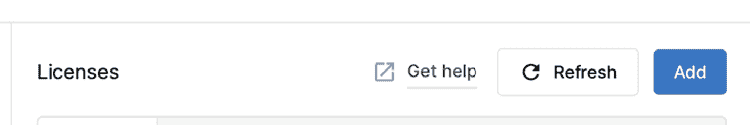

# 1

# 开始你的 Unity 之旅

在本章中，我们将学习如何使用 Unity Hub 安装 Unity 并创建项目，Unity Hub 是一个管理不同 Unity 版本和项目（以及其他任务）的工具。Unity Hub 提供了访问社区博客、论坛、资源和学习门户的便捷途径；它还管理你的许可证，并允许管理不同的安装和项目。

具体来说，在本章中，我们将探讨以下主题：

+   安装 Unity

+   创建项目

首先，让我们来谈谈如何让 Unity 启动运行。如果你已经知道如何安装 Unity，请随意跳到*第二章*，*制作场景和游戏元素*。如果你已经熟悉 Unity 的编辑器，你可以跳到*第三章*，*从蓝图到现实：使用地形和 ProBuilder 构建*，我们将开始创建本书的项目。

# 安装 Unity

我们将从简单但必要的第一步开始：安装 Unity。这似乎是一个简单的第一步，但我们可以讨论正确的安装方式。在本节中，我们将探讨以下概念：

+   Unity 的技术要求

+   Unity 版本

+   使用 Unity Hub 安装 Unity

首先，我们将讨论在电脑上运行 Unity 所需的条件。

## Unity 的技术要求

要运行 Unity 2023 编辑器，你的电脑需要满足这里指定的要求：[`docs.unity3d.com/2023.2/Documentation/Manual/system-requirements.html`](https://docs.unity3d.com/2023.2/Documentation/Manual/system-requirements.html)

这里是对链接中指定内容的总结：

+   如果你使用 Windows，你需要 Windows 10.7 版本 21H1（19043）或更高版本。Unity 只能在 64 位版本的这些系统上运行；除非你愿意使用 2017.x 之前的 Unity 版本，否则没有 32 位支持，但这超出了本书的范围。

+   对于 Mac，你需要 Big Sur 11.0。

+   对于 Linux，你需要确切的 Ubuntu 20.04 或 22.04 版本。

关于 CPU 的要求：

+   你的 CPU 需要支持 64 位

+   你的 CPU 需要支持 SSE2（大多数 CPU 都支持）

+   对于搭载 Apple 硅的 Macs，需要 M1 或更高版本。对于 Intel Macs，任何支持 x64 和 SSE2 的型号都将工作。

最后，关于显卡，以下是受支持的型号：

+   在 Windows 上，我们需要一款支持 DirectX 10、11 或 12 的显卡（大多数现代显卡都支持）

+   在 Mac 上，任何支持 Metal 的 Intel 或 AMD GPU 都足够了

+   在 Linux 上，支持 OpenGL 3.2 或任何更高版本，或者来自 Nvidia 和 AMD 的 Vulkan 兼容卡

注意，这些不是用户玩你的游戏所需的要求，而是你使用编辑器所需的要求。有关用户玩你的游戏所需的要求，请参阅以下文档：[`docs.unity.cn/ru/2021.1/Manual/system-requirements.html#player`](https://docs.unity.cn/ru/2021.1/Manual/system-requirements.html#player)

既然我们已经知道了要求，让我们来讨论 Unity 的安装管理系统。

## Unity 版本

在这本书撰写的时候，Unity 宣布了他们版本系统的转变。当前的版本，Unity 2023.2，将是 2023 系列的最终迭代。下一个版本，原本应该是 2023.3 LTS，将改为以 Unity 6 的形式发布。这次过渡标志着**LTS**（**长期支持**）发布周期的结束，这迫使 Unity 每年发布几个版本。展望未来，我们预计将按顺序推出 Unity 6.1、6.2、6.3 等版本，每个版本都提供了一个稳定且功能丰富的平台。

LTS 版本的好处是它们计划在两年内每两周更新一次，以修复 Unity 新主要版本的错误。这就是为什么大多数公司坚持使用 LTS 版本的引擎：因为其稳定性和长期支持。在这本书中，我们将使用 2023.1 来探索引擎的新功能，但在开发商业游戏标题时，请考虑坚持使用 LTS 版本。

考虑到这一点，你可能需要安装几个版本的 Unity，以防你使用不同版本的项目。你可能想知道为什么你不能为每个项目都使用 Unity 的最新版本，但那有一些问题。

在 Unity 的新版本中，通常会有很多关于引擎工作方式的改变，因此你可能需要重新制作很多游戏的部分来升级它，包括第三方插件。升级整个项目可能需要很多时间，这可能会推迟发布日期。也许你需要更新中包含的特定功能。在这种情况下，升级的成本可能是值得的。在需要多年维护和更新的项目中，开发者通常会坚持使用现有版本，只有在新的更新包含必要功能时才会升级。

使用不同版本的 Unity 制作的不同项目，以及安装和更新新的 Unity 版本，过去一直是个大麻烦。因此，**Unity Hub**被创建出来帮助我们解决这个问题，并且它已经成为安装 Unity 的默认方式。尽管如此，安装 Unity 并不需要它，但现在我们会保持简单并使用它。让我们更深入地了解一下。

## 使用 Unity Hub 安装 Unity

Unity Hub 是我们安装 Unity 之前将安装的一个小软件。它集中管理你所有的 Unity 项目和安装。你可以从官方 Unity 网站获取它。下载步骤会频繁变化，但在撰写本书时，你需要执行以下步骤：

1.  前往[unity.com](http://unity.com)。

1.  点击以下截图所示的**计划和定价**按钮：

图 1.1：Unity 网站上**计划和定价**按钮

1.  点击**学生和爱好者**标签页；然后，在**个人**部分下，点击以下截图所示的**开始**按钮：

图 1.2：选择个人/免费许可证

1.  滚动到标有**1. 下载 Unity Hub**的部分，并根据您的操作系统点击**下载**按钮。对于 Windows，点击**Windows 下载**，对于 Mac，点击**Mac 下载**。对于 Linux，有一个**Linux 说明**按钮，其中包含有关在该平台上安装的更多信息，但本书不会涵盖 Linux 上的 Unity：

图 1.3：开始下载

1.  执行下载的安装程序。

1.  按照安装程序的说明操作，这主要涉及一路点击**下一步**直到结束。

现在我们已经安装了 Unity Hub，我们必须使用它来安装特定的 Unity 版本。你可以按照以下步骤操作：

1.  启动 Unity Hub。

1.  如果被提示安装 Unity 版本和/或创建许可证，请使用相应的**跳过**按钮（这可能会根据 Unity Hub 版本而有所不同）跳过这些步骤。这种方式安装 Unity 和许可证仅在第一次运行 Unity Hub 时可用，但我们将学习一种在初始设置之后也有效的方法。

1.  **登录**到您的账户，点击**登录**按钮：

图 1.4：登录 Unity Hub

1.  在这里，您还可以选择创建一个 Unity 账户，如果您还没有的话，如图所示，在以下截图中的 Unity 登录提示中出现的**创建一个**链接中：

图 1.5：登录 Unity Hub

1.  按照安装程序的步骤操作，然后你应该会看到一个类似于下一张截图的屏幕。如果它不是相同的，请尝试点击屏幕左上角的**学习**按钮：

图 1.6：Unity Hub 窗口

1.  点击**安装**按钮，检查是否列出了**Unity 2023**。

1.  如果没有，请点击右上角的**安装编辑器**按钮。这将显示可以在此安装的 Unity 版本列表：

图 1.7：可安装的 Unity 版本

1.  在这里，你会看到三个标签页。**官方发布版**包含已发布的每个主要版本的最新版本。**预发布版**包含 Unity 的 alpha 和 beta 版本，因此你可以参与这些项目并在它们正式发布之前测试新功能。**存档**包含指向**Unity 下载存档**的链接，其中包含发布的每个 Unity 版本。例如，撰写本文时的官方发布版本是 2023.2.4f1，但如果看到更高版本，你可以从存档中安装正确的版本。

1.  在**官方发布版**标签页中找到 Unity 2023.2（或者，如果您找不到，在**存档**标签页中）。

1.  点击**Unity 2023.2.XXf1**右侧的**安装**按钮，其中 XX 将根据最新可用版本而变化。存档包含一个链接到 Unity 下载存档，其中包含 Unity 发布的每个版本。截至本文撰写时，官方版本是 2023.2.4f1，但如果你遇到更新的版本，你可以从存档中安装正确的版本。

1.  将会弹出一个模块选择窗口。请确保**Visual Studio**功能被勾选。虽然这个程序在 Unity 中工作不是必需的，但本书后面我们会用到它。如果你已经安装了 C# IDE，可以自由跳过这一步。

1.  现在，点击**继续**按钮：

图 1.8：选择 Visual Studio

1.  接受 Visual Studio 的条款和条件，然后点击**安装**：

    图 1.9：接受 Visual Studio 的条款和条件

    重要的是要注意，Visual Studio 是我们将在**第五章**，**释放 C#和视觉脚本的力量**中使用的程序，来创建我们的代码。我们现在不需要其他 Unity 功能，但如果你需要，稍后可以回来安装它们。

1.  你将看到所选的 Unity 版本正在下载和安装。等待这个过程完成。如果你看不到，点击**下载**按钮重新打开它：

图 1.10：当前活跃的 Unity Hub 下载

1.  如果你决定安装 Visual Studio，Unity 安装完成后，Visual Studio 安装程序将自动执行。它将下载一个安装程序，该安装程序将下载并安装 Visual Studio Community：

图 1.11：安装 Visual Studio

1.  为了确认一切正常，你必须看到所选的 Unity 版本在 Unity Hub 的**安装**列表中：

图 1.12：可用的 Unity 版本

现在我们已经通过 Unity Hub 在我们的计算机上安装了 Unity 和 Visual Studio，在使用 Unity 之前，我们需要通过以下步骤获取并安装免费许可证，使其工作：

1.  在 Unity Hub 右上角点击**管理许可证**按钮。如果看不到，点击左上角的账户图标，然后在那里点击**添加许可证**：

图 1.13：点击以获取免费许可证的添加许可证按钮

1.  在**许可**列表窗口中点击**添加**按钮：

图 1.14：许可列表窗口的添加按钮

1.  点击**获取免费个人许可证**按钮：

图 1.15：获取免费个人许可的选项

1.  如果你同意条款和条件，请点击**同意并获取个人版许可证**按钮进行阅读和接受：

图 1.16：接受条款和条件的按钮

有了这个，我们现在在我们的账户中有了使用 Unity 的有效许可证。记住，前面的步骤在新版本的 Unity Hub 中可能会有所不同，所以只需尽量遵循 Unity 设计的流程——大多数情况下，它是直观的。

现在是时候使用 Unity 创建一个项目了。

# 创建项目

现在我们已经安装了 Unity，我们可以开始创建我们的游戏了。要做到这一点，我们首先需要创建一个项目，它基本上是一个包含你的游戏将包含的所有文件的文件夹。这些文件被称为**资产**，它们有不同的类型，例如图像、音频、3D 模型、脚本文件等等。在本节中，我们将了解如何管理项目，并解决以下概念：

+   创建项目

+   项目结构

让我们首先学习如何创建一个空白项目，以便在本书中开始开发我们的第一个项目。

## 创建项目

与 Unity 安装一样，我们将使用 Unity Hub 来管理项目。我们需要遵循以下步骤来创建一个：

1.  打开 Unity Hub，点击**项目**按钮，然后点击**新建项目**：

图 1.17：在 Unity Hub 中创建新项目

1.  注意，如果你通过 Unity Hub 安装了多个 Unity 版本，你可能需要从 UI 顶部的下拉菜单中选择适当的版本，以确保使用你之前安装的 2023.1 版本。

图 1.18：选择合适的 Unity 版本

1.  选择**3D (URP)**模板，因为我们将会创建一个使用简单图形的 3D 游戏，并准备在 Unity 能够运行的任何设备上运行，所以**URP**（或**通用渲染管线**）是更好的选择。在*第十章*，*材料炼金术：使用 URP 和 Shader Graph 实现震撼视觉效果*中，我们将详细讨论为什么。

1.  如果你看到一个**下载模板**按钮，点击它；如果没有，这意味着你已经有模板了：

    图 1.19：下载 3D URP 模板

    我仍然记得 2009 年在 Unity 2.6 中看到的第一个模板项目，当时 Unity 版本号还没有与发布年份匹配。它是一个岛屿，展示了地形和水系统。当靠近你时，火烈鸟会避开你，四处走动非常有趣。遗憾的是，我们选择的模板项目不会像那个一样令人难忘，但仍然是一个很好的开始。

1.  选择项目名称和位置，然后点击**创建项目**：

图 1.20：选择通用渲染管线模板

1.  Unity 将创建并自动打开项目。这可能需要一些时间，但之后你将看到一个类似于以下截图的窗口。你可能看到的是深色主题编辑器，但为了更好的清晰度，我们将全书使用浅色主题。你可以自由地保持深色主题：

图 1.21：Unity 编辑器窗口

1.  关闭窗口，然后返回 Unity Hub 并从列表中选择项目以再次打开：

图 1.22：重新打开项目

现在我们已经创建了项目，让我们来探索其结构。

## 项目结构

我们刚刚打开了 Unity，但我们将不会在下一章开始使用它。现在，是时候看看项目文件夹结构是如何组成的了。为了做到这一点，我们需要打开我们创建项目的文件夹。如果你不记得在哪里，你可以这样做：

1.  右键单击位于编辑器底部部分的**项目**面板中的**Assets**文件夹。

1.  在编辑器的底部部分，点击**项目**面板中的**Assets**文件夹的**显示在资源管理器中**选项（如果你使用的是 Mac，该选项称为**在 Finder 中显示**）。以下截图说明了这一点：

图 1.23：在资源管理器中打开项目文件夹

1.  然后，你会看到一个类似于这样的文件夹结构（某些文件或文件夹可能会有所不同）：

图 1.24：Unity 项目文件夹结构

现在我们已经使用 Unity Hub 创建了并打开了第一个 URP 项目，我们可以在 Unity Hub 的**项目**选项卡中再次找到它。从那里，我们可以在任何时候再次打开它。

如果你想将这个项目移动到另一台 PC 或发送给同事，你只需将这些文件压缩成 ZIP 文件发送即可，但并非所有文件夹在所有时候都是必要的。重要的文件夹是`Assets`、`Packages`和`ProjectSettings`。`Assets`将保存我们为游戏创建和使用的所有文件，因此这是必须的。我们还将配置不同的 Unity 系统，以适应我们的游戏；与此相关的所有设置都在`ProjectSettings`和`UserSettings`文件夹中。最后，我们将安装不同的 Unity 模块或包以扩展其功能，因此`Packages`文件夹将保存我们正在使用的那些。

如果你需要将项目移动到其他地方或添加到版本控制系统，不需要复制其余的文件夹，但至少让我们讨论一下`Library`文件夹是什么，特别是考虑到它通常非常大。Unity 需要将我们将要使用的文件转换为它自己的格式才能操作；一个例子是音频和图形。Unity 支持**MPEG 音频层 3**（**MP3**）、**波形音频文件格式**（**WAV**）、**可移植网络图形**（**PNG**）和**联合图像专家小组**（**JPG**）文件（以及更多），但在使用它们之前，它们需要被转换为 Unity 的内部格式，这个过程称为**导入资源**。那些转换后的文件将位于`Library`文件夹中。如果你没有复制那个文件夹，Unity 将简单地从`Assets`文件夹中取原始文件并完全重新创建`Library`文件夹。这个过程可能需要时间，项目越大，所需时间越长。

请记住，当你正在处理项目时，你希望保留 Unity 创建的所有文件夹，所以在你处理项目时不要删除任何文件夹，但如果你需要移动整个项目，你现在确切地知道你需要带什么。

# 摘要

在本章中，我们回顾了 Unity 版本控制系统的工作方式。我们还看到了如何使用 Unity Hub 安装和管理不同的 Unity 版本。最后，我们使用相同的工具创建了并管理了多个项目。我们将大量使用 Unity Hub，因此了解如何最初使用它非常重要。现在，我们已经准备好深入 Unity 编辑器了。

在下一章中，我们将开始探索基本的 Unity 工具，为编写我们的第一个关卡原型打下基础。

# 在 Discord 上了解更多

与其他用户、Unity 游戏开发专家以及作者本人一起阅读这本书。提出问题，为其他读者提供解决方案，通过 Ask Me Anything 会话与作者聊天，等等。扫描二维码或访问链接加入社区：

[`packt.link/unitydev`](https://packt.link/unitydev)

