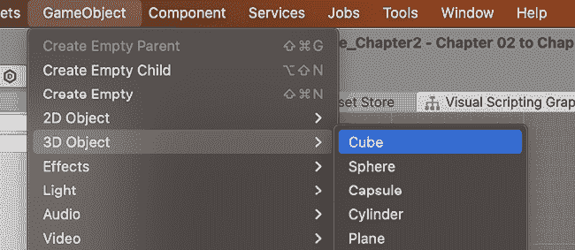
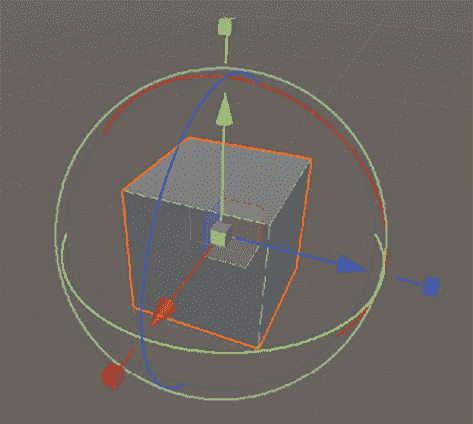
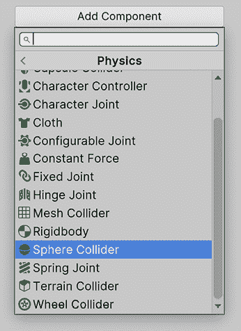
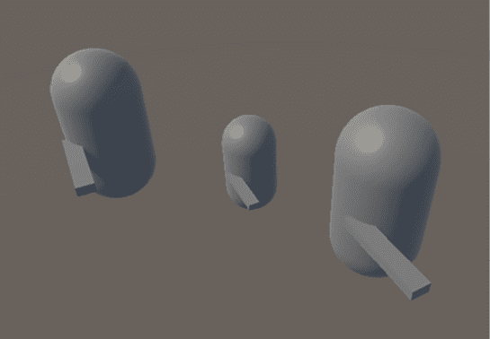

# 第二章：制作场景和游戏元素

在本章中，我们将开发一些 Unity 的基础知识，以便编辑项目，我们将学习如何使用几个 Unity 编辑器窗口来操作我们的第一个场景及其对象。我们还将学习如何创建和组成对象或 GameObject，以及如何使用层次结构和预制件来管理复杂场景。最后，我们将回顾如何正确保存所有工作以便稍后继续工作。

具体来说，在本章中，我们将考察以下概念：

+   操作场景

+   GameObjects 和组件

+   理解对象层次结构

+   使用预制件管理 GameObject

+   保存场景和项目

# 操作场景

**场景**是我们项目中几种类型的文件之一（也称为**资产**）。其他类型的文件包括代码脚本、音频文件、3D 模型和纹理等。根据项目类型，“场景”可以用于不同的事情，但最常见的用例是将你的游戏分成整个部分，最常见的包括以下内容：

+   主菜单

+   第 1 关，第 2 关，第 3 关等等。

+   胜利屏幕和失败屏幕

+   启动屏幕和加载屏幕

在本节中，我们将涵盖与场景相关的以下概念：

+   场景的目的

+   **场景**视图

+   将我们的第一个 GameObject 添加到场景中

+   导航场景视图

+   操作 GameObject

因此，让我们看看这些概念中的每一个。

## 场景的目的

将你的游戏分成场景的想法是让 Unity 只处理和加载场景所需的数据。比如说你在主菜单；在这种情况下，你将只有主菜单需要的纹理、音乐和对象被加载到**随机存取存储器**（**RAM**），即设备的主要内存。在这种情况下，如果你的游戏不需要加载第 10 关的 Boss，就没有必要加载它。这就是为什么有加载屏幕，只是为了填补在卸载一个场景所需的资产和加载另一个场景所需的资产之间的时间。也许你正在想，像*侠盗猎车手*这样的开放世界游戏在你四处游荡时没有加载屏幕，但实际上它们在移动时会在后台加载和卸载世界的一部分，这些部分是设计成可以相互连接的不同场景。

主菜单和常规关卡场景之间的区别在于它们拥有的对象（在 Unity 术语中也称为**GameObject**）。在菜单中，你会找到背景、音乐、按钮和标志等对象，而在关卡中，你将拥有玩家、敌人、平台、生命值盒子等等。因此，你的场景意义取决于放入其中的 GameObject。但我们是怎样创建场景的呢？让我们从场景视图开始。

## 场景视图

当你打开 Unity 项目时，你会看到 Unity 编辑器。它将由几个**窗口**或**面板**组成，每个面板都帮助你改变游戏的不同方面。在本章中，我们将查看帮助你创建场景的窗口。以下截图展示了 Unity 编辑器：

图 2.1：Unity 编辑器

如果你之前曾经编程过任何类型的应用程序，你可能已经习惯了有一个起始函数，比如`Main`，在那里你开始编写代码来创建应用程序所需的几个对象。如果你在开发一个游戏，你可能会在那里创建场景中所有的对象。这种方法的缺点是，为了确保所有对象都正确创建，你需要运行程序来查看结果，如果某个地方放错了，你需要手动更改对象的坐标，这是一个缓慢且痛苦的过程。幸运的是，在 Unity 中，我们有场景视图，以下截图展示了其一个示例：

图 2.2：场景视图

这个窗口是经典**WYSIWYG**（**所见即所得**）概念的实现。在这里，你可以创建对象并将它们放置在场景的任何地方，所有这些都是在场景预览中完成的，你可以看到玩家玩游戏时场景将如何看起来。然而，在我们学习如何使用这个场景之前，我们需要场景中有一个对象，所以让我们创建我们的第一个对象。

## 将我们的第一个 GameObject 添加到场景中

在创建项目时选择的模板项目包含一个空白场景，可以开始工作，但让我们创建我们自己的空场景来看看如何自己完成。为此，你可以简单地使用**文件 | 新场景**菜单来创建一个空的新场景，以下截图展示了这一点：

图 2.3：创建新场景

点击**新场景**后，你会看到一个选择场景模板的窗口；在这里，选择**基本（URP）**模板。模板定义了新场景将包含哪些对象，在这种情况下，我们的模板将包含一个基本光源和一个摄像机，这对我们想要创建的场景将很有用。一旦选择，只需点击**创建**按钮：

图 2.4：选择场景模板

现在我们已经有一个空场景了，让我们向其中添加 GameObject。我们将在整本书中学习创建 GameObject 的几种方法，但就现在，让我们先使用 Unity 为我们提供的几个基本模板。为了创建它们，我们需要打开 Unity 窗口顶部的**GameObject**菜单，它将显示几个模板类别，如**3D Object**、**2D Object**、**Effects**等，以下截图展示了这一点：

图 2.5：创建一个立方体

在**3D 对象**类别下，我们将看到几个 3D 基本形状，如**立方体**、**球体**、**圆柱体**等，虽然使用它们不如使用漂亮的下载 3D 模型那么令人兴奋，但请记住，我们目前只是在原型化我们的关卡。这被称为**灰盒建模**，意味着我们将使用大量的原型基本形状来建模我们的关卡，以便我们可以快速测试它，看看我们的想法是否足够好，可以开始将其转换为最终版本的工作。

我建议您选择**立方体**对象开始，因为它是一个多功能的形状，可以代表许多对象。所以，现在我们有一个可以编辑的场景和对象，我们需要学习使用场景视图做的第一件事就是导航场景。

## 导航场景视图

为了操作场景，我们需要学习如何移动以从不同角度查看结果。有几种导航场景的方法，所以让我们从最常见的一种开始，即第一人称视角。这种视角允许你使用类似第一人称射击游戏的导航方式在场景中移动，使用鼠标和*WASD*键。要这样导航，你需要按住并保持右鼠标按钮，同时进行以下操作：

+   将鼠标移动到旋转相机围绕其当前位置

+   按下*WASD*键来移动相机的位置，始终按住右键

+   您也可以按*Shift*键来加快移动速度

+   按下*Q*和*E*键来上下移动

另一种常见的移动方式是点击一个对象来选择它（选中的对象将有一个橙色的轮廓），然后按*F*键来聚焦于它，使场景视图相机立即移动到一个可以更近距离观察该对象的位置。

之后，我们可以在 Windows 上按住并保持左*Alt*键，或在 Mac 上按*Option*键，同时点击左鼠标，最终开始移动鼠标并在对象周围“环绕”。这将允许您从不同的角度查看焦点对象，以检查其每个部分是否都放置得当，如下面的截图所示：

图 2.6：选择一个对象

现在我们可以在场景中自由移动，我们可以开始使用场景视图来操作游戏对象。

## 操作游戏对象

场景视图的另一个用途是操作对象的定位。为了做到这一点，我们首先需要选择一个对象，然后按场景视图左上角的**变换**工具。一旦选择了对象，您也可以按键盘上的*Y*键来激活相同的变换工具：

图 2.7：变换工具

这将显示所选对象上所谓的**变换工具**。**工具**是一种叠加在所选对象之上的视觉工具，用于修改其不同方面。在**变换工具**的情况下，它允许我们改变对象的位置、旋转和缩放，如图*图 2.8*所示。如果你没有看到球体外的立方形箭头，请不要担心——我们很快就会启用它们：

图 2.8：变换工具

让我们开始移动对象，这是通过在工具的球体内拖动红色、绿色和蓝色箭头来实现的。当你这样做的时候，对象将沿着所选轴移动。这里一个有趣的概念是探索这些箭头颜色的含义。如果你注意观察场景视图的右上角，你会看到一个轴工具，它作为这些颜色含义的提醒，如图下所示：

图 2.9：轴工具

计算机图形学使用经典的 3D**笛卡尔坐标系**来表示对象的定位。红色与对象的*x*轴相关联，绿色与*y*轴相关联，蓝色与*z*轴相关联。

但每个轴代表什么？如果你习惯于使用像 Maya、Blender 或 3DS Max 这样的其他 3D 制作程序，这可能会不同，但在 Unity 中，*z*轴代表**前向向量**，这意味着箭头指向对象的前面；*x*轴是**右向向量**，而*y*轴代表**向上向量**。

这些方向被称为**局部**坐标，这是因为每个对象都可以以不同的方式旋转，这意味着每个对象都可以根据其方向将其前向、向上和向右的向量指向其他地方。当在章节的*理解对象层次结构*部分稍后使用时，局部坐标将更有意义，所以请耐心等待，但现在讨论**全局**坐标是值得的。想法是有一个单一的起点（零点）和一组共同的向前、向右和向上轴，这些轴在场景中是通用的。这样，当我们说一个对象的全局位置是`5`,`0`,`0`时，我们知道我们指的是从全局零位置开始沿全局*x*轴延伸 5 米的坐标。全局轴是你在之前提到的右上角轴工具中看到的那些。

我们刚才提到，位置(`5`,`0`,`0`)意味着*x*轴上 5 米，这暗示 Unity 单位系统是米。虽然 Unity 的几个系统如物理和音频遵循这个假设（1 单位=1 米），但这并不是强制性的单位系统。有几种方法可以改变它，为了方便缩放世界，但在本书中，我们将坚持米测量系统。

为了确保我们使用局部坐标，即我们将沿着对象的局部轴移动对象，请确保在场景视图中激活了**局部**模式，如下面的屏幕截图所示：

图 2.10：切换轴心和局部坐标

如果右键按钮显示的是**全局**而不是**局部**，只需点击它，然后从下拉选项中选择**局部**。顺便说一句，尽量保持左键按钮为**轴心**。如果它显示的是**中心**，点击并选择**轴心**。对象的轴心不一定是它的中心，这完全取决于我们使用的 3D 模型，以及作者指定对象旋转中心的位置。例如，一辆汽车可能有它的轴心在它的后轮中间，所以当我们旋转时，它将尊重真实汽车的旋转中心。基于对象的轴心进行编辑将简化我们对如何在第六章中通过 C#脚本旋转对象的理解。现在，我们已经启用了**局部**坐标，你应该看到*图 2.8*中看到的立方形箭头；我们将在稍后使用它们来缩放立方体。

我知道——我们正在编辑一个立方体，所以没有明确的前面或右面，但当你处理真实的 3D 模型，如汽车和角色时，它们肯定会有这些面，并且它们必须与这些轴正确对齐。如果将来你意外地将一辆汽车导入 Unity，并且汽车的前面沿着*x*轴，你需要将模型沿*z*轴对齐，因为我们将要创建的用于移动对象的代码将依赖于这个约定。

现在，让我们使用这个**变换**工具来旋转对象，使用围绕它的三个彩色圆圈。例如，如果你点击并拖动红色圆圈，你将沿着*x*轴旋转对象。如果你想水平旋转对象，根据我们之前讨论的颜色编码，你可能选择*x*轴——用于水平移动的那个轴——但是，很遗憾，这是错误的。看待旋转的一个好方法是像摩托车加速器：你需要拿起它并滚动它。如果你这样旋转*x*轴，你将使对象上下旋转。所以，为了水平旋转，你需要使用绿色圆圈或*y*轴。这个过程在下面的屏幕截图中有说明：

图 2.11：旋转对象

最后，我们有缩放，我们有两种方法可以实现这一点，其中一种是通过*图 2.8*中显示的**变换**工具中心的灰色立方体。这允许我们通过点击并拖动该立方体来改变对象的大小。现在，由于我们想要原型化一个简单的关卡，有时我们想要拉伸立方体来创建，例如，一列或一个平坦的地板，这就是第二种方法出现的地方。

如果你点击并拖动翻译箭头前面的彩色立方体而不是中心灰色的立方体，你会看到我们的立方体如何沿着这些轴拉伸，从而允许你改变对象的形状。如果你看不到那些立方体形状的箭头，记得要启用前面在本节中提到的**局部**坐标。

拉伸的过程在下面的屏幕截图中有说明：

图 2.12：缩放对象

记住，如果你希望的话，也可以使用中间的**变换**工具中的相同灰色立方体来同时缩放所有轴。这被称为**均匀缩放**。

最后，这里需要考虑的是，由于它们最初的设计方式，几个对象可以具有相同的缩放值但不同的尺寸。**缩放**是我们可以应用于对象原始尺寸的一个乘数，因此一个比例`1`的建筑和一辆车都是完全合理的；它们相对于彼此的相对大小看起来是正确的。这里的主要启示是，缩放不是尺寸，而是一种乘以它的方式。

考虑到在许多情况下缩放对象通常是不良的做法。在你的场景最终版本中，你将使用适当大小和比例的模型，并且它们将以模块化的方式设计，以便你可以将它们相互连接。如果你缩放它们，可能会发生一些不好的事情，比如纹理被拉伸并变得像素化，以及不再正确连接的模块。这个规则有一些例外，比如在森林中放置许多相同树木的实例，并稍微改变其比例以模拟变化。此外，在灰色框的情况下，将立方体改变比例以创建地板、墙壁、天花板、柱子等是完全可行的，因为最终，这些立方体将被真实的 3D 模型所取代。

这里有一个挑战！创建一个由地板、三面普通墙壁和带有门洞的第四面墙壁（三个立方体）组成的房间，不需要屋顶。在下一张图片中，你可以看到它应该是什么样子：

图 2.13：房间任务完成

**记忆**

我记得当我刚开始制作游戏时，我大多数场景都是用盒子做的。虽然我们在这本书中肯定会做得更好，但仍然有非常巧妙的方法只使用这个简单的形状。以游戏*托马斯独自一人*为例，它只使用了盒子，通过巧妙的光照效果看起来很漂亮。

现在我们已经可以编辑对象的位置了，让我们看看如何编辑其所有其他方面。

# GameObjects 和组件

我们提到我们的项目由`assets`（项目文件）组成，一个场景（它是一种特定的资产）由 GameObject 组成；那么，我们如何创建一个对象呢？通过**组件**的组合。

在本节中，我们将介绍与组件相关的以下概念：

+   理解组件

+   操作组件

让我们先讨论一下组件是什么。

## 理解组件

**组件**是构成 GameObject 的几个部分之一；每个组件负责对象的不同功能。Unity 已经包含了一些组件，可以解决不同的任务，例如播放声音、渲染网格、应用物理效果等；然而，尽管 Unity 有大量的组件，我们迟早需要创建自定义组件。

在下一张图片中，你可以看到当我们选择一个 GameObject 时 Unity 向我们展示的内容：

图 2.14：检查器面板

如果我们需要猜测前面截图中的**检查器**面板现在做什么，我们可以说它显示了通过**层次结构**、你可以看到所有已经放置在当前场景中的对象的菜单，或者通过**场景视图**选择的选定对象的全部属性，并允许我们配置这些选项以改变对象的行为（即位置和旋转，是否投射阴影等）。

这是真的，但我们遗漏了一个关键元素：这些属性不属于对象；它们属于对象的组件。我们可以在一组属性之前看到一些加粗的标题，例如**变换**和**盒子碰撞器**等。这些都是对象的组件。

在这种情况下，我们的对象有一个**变换**、一个**网格过滤器**、一个**网格渲染器**和一个**盒子碰撞器**组件，所以让我们回顾每一个。

**变换**只包含对象的位置、旋转和缩放，它本身并不做任何事情——它只是我们游戏中的一个点——但是当我们向对象添加组件时，这个位置开始具有更多的意义。这是因为一些组件将与**变换**和其他组件交互，每个组件都会影响另一个。

这些不同组件之间相互作用的例子可以是**网格过滤器**和**网格渲染器**的情况，这两个组件都负责渲染 3D 模型。**网格渲染器**将渲染由**网格过滤器**在**变换**组件中指定的位置指定的 3D 模型，也称为网格，因此**网格渲染器**需要从其他组件获取数据，没有它们无法工作。

另一个例子是**盒子碰撞器**。这代表对象的物理形状，因此当物理计算对象之间的碰撞时，它会检查该形状是否与指定在**变换**组件中的其他形状发生碰撞。

我们将在本书的后面部分探讨渲染和物理，但本节的要点是 GameObject 是一个组件集合，每个组件都为我们的对象添加特定的行为，并且每个组件都与其他组件交互以完成所需任务。为了进一步强化这一点，让我们看看我们如何将一个立方体转换为球体，该球体将由于物理施加的重力而落下。

## 操作组件

编辑对象组件的工具是**检查器**。它不仅允许我们更改组件的属性，还让我们可以添加和删除组件。在这种情况下，我们想要将一个立方体转换为球体，因此需要更改这些组件的几个方面。

我们可以先从改变对象的视觉形状开始，因此我们需要更改渲染模型或**网格**。指定要渲染的网格的组件是**网格过滤器**组件。如果我们查看以下图示，我们可以看到一个名为**网格**的属性，其右侧有一个小圆圈和一个小点：

图 2.15：网格过滤器组件

如果您看不到特定的属性，例如我们刚才提到的**网格**，请尝试点击组件名称左侧的三角形。这样做将展开和折叠所有组件属性。

如果我们点击位于**网格**属性右侧、带有圆圈和点的按钮，将弹出**选择网格**窗口，允许我们选择几个**网格**选项。在这种情况下，选择**球体**网格。在未来，我们将向我们的项目中添加更多 3D 模型，因此窗口将具有更多选项。

网格选择器在以下屏幕截图中显示：

图 2.16：网格选择器

好的——现在对象看起来像一个球体，但它会像球体一样表现吗？让我们来看看。为了做到这一点，我们可以在我们的球体上添加一个名为**刚体**的组件，这将给它添加物理属性。我们将在*第七章*，*碰撞与健康：精确检测碰撞*中更多地讨论刚体和物理，但现在让我们专注于基础知识。

要将刚体添加到我们的球体上，我们需要在检查器的底部点击**添加组件**按钮。它将显示一个**组件选择器**窗口，其中包含许多类别；在这种情况下，我们需要点击**物理**类别。窗口将显示所有**物理**组件，在那里我们可以找到**刚体**。另一个选项是在窗口顶部的搜索框中输入`Rigidbody`。以下截图说明了如何添加组件：

图 2.17：添加组件

如果您在编辑器的顶部中间部分点击**播放**按钮，您可以使用**游戏**面板测试您的大球物理效果。当您点击**播放**时，该面板将自动聚焦，并显示玩家将如何看到游戏。播放控制按钮如图下截图所示：

图 2.18：播放控制

在这里，您只需使用**变换**工具来旋转和定位您的相机，使其朝向我们的大球。这很重要，因为可能会出现的一个问题是，在**播放**模式下您可能什么也看不到，这可能是因为游戏相机没有指向我们大球所在的位置。当您移动时，您可以在**场景**窗口的右下角查看小预览，以检查新的相机视角。如果您已经选择了相机，这就是预期的行为。另一个选择是在**层次结构**中选择相机，并使用快捷键*Ctrl* + *Shift* + *F*（或在 Mac 上为*Command* + *Shift* + *F*）。相机预览如图下截图所示：

图 2.19：相机预览

现在，为了测试物理碰撞是否执行正确，让我们创建一个立方体，将其缩放成斜坡的形状，并将这个斜坡放在我们的大球下方，如图所示：

图 2.20：球和斜坡对象

如果现在您点击**播放**，您将看到球体以奇怪的方式与我们的斜坡碰撞。它看起来像是在弹跳，但实际上并非如此。如果您展开球体的**盒子碰撞器**组件，您将看到即使我们的物体看起来像是一个球体，绿色的盒子工具显示我们的球体在物理世界中实际上是一个盒子，如图下截图所示：

图 2.21：具有球形图形和盒子碰撞器的对象

现在，视频卡（GPU）可以处理渲染高度详细的三维模型（具有高多边形计数的模型），但物理系统是在**中央处理单元**（**CPU**）中执行的，并且它需要进行复杂的计算以检测碰撞。为了在我们的游戏中获得良好的性能，它至少需要达到每秒 30 帧（**FPS**），这是行业接受的最低标准，以提供平滑的体验。物理系统考虑到了这一点，因此使用简化的碰撞形状，这些形状可能与玩家在屏幕上看到的实际形状不同。

正是因为我们有**Mesh Filter**和不同类型的**Collider**组件分开——一个处理视觉形状，另一个处理物理形状。

再次强调，本节的目的不是深入探讨那些 Unity 系统，所以我们现在就继续前进。我们如何解决我们的球体看起来像盒子的问题呢？简单：通过修改我们的组件！在这种情况下，已经存在于我们的立方体 GameObject 中的**Box Collider**组件可以仅仅代表一个物理形状的盒子，与支持任何渲染形状的**Mesh Filter**不同。因此，首先，我们需要通过右键单击组件的标题并选择**移除组件**选项来移除它，如下面的截图所示：

图 2.22：移除组件

现在，我们再次可以使用**添加组件**菜单来选择一个**物理**组件，这次选择**Sphere Collider**组件。如果你查看**物理**组件，你会看到其他类型的碰撞器，可以用来表示其他形状，但我们将在第七章中稍后讨论它们。

**Sphere Collider**组件可以在以下截图中看到：

图 2.23：添加球体 Collider 组件

所以，如果你现在点击**播放**，你会看到我们的球体不仅看起来像一个球体，而且表现得像一个球体。记住：本书本节的主要思想是理解在 Unity 中，你可以通过添加、移除和修改组件来创建任何你想要的对象，而且我们将在整本书中做很多这样的事情。

现在，组件不是创建对象所需的唯一东西。复杂对象可能由几个子对象组成，所以让我们看看这是如何工作的。

# 理解对象层次结构

一些复杂对象可能需要被分解成子对象，每个子对象都有自己的组件。这些子对象需要以某种方式附加到主对象上，并协同工作以创建必要的对象行为。

在本节中，我们将介绍与对象相关的以下概念：

+   对象的父子关系

+   可能的用途

让我们首先了解如何创建对象之间的父子关系。

## 对象的父子关系

**父对象**是指将一个对象设置为另一个对象的子对象，这意味着这些对象将相互关联。发生的一种关系是**Transform 关系**，这意味着子对象将受到父对象的**Transform**影响。简单来说，子对象将跟随父对象，就像它被附着在上面一样。例如，想象一个头上戴着帽子的玩家。帽子可以是玩家头部的子对象，使帽子在它们附着时跟随头部。

为了尝试这个功能，让我们创建一个代表敌人的胶囊体和一个代表敌人武器的立方体。记住，为了做到这一点，你可以使用**GameObject** | **3D Object** | **Capsule**和**Cube**选项，然后使用**Transform**工具来修改它们。以下截图展示了胶囊体和立方体的示例：

图 2.24：代表敌人和武器的胶囊体和立方体

如果你移动敌人对象（胶囊体），武器（立方体）将保持其位置，不会跟随我们的敌人。因此，为了防止这种情况，我们可以在**Hierarchy**窗口中简单地拖动武器到敌人对象上，如下截图所示：

图 2.25：将立方体武器设置为胶囊角色的父对象

现在，如果你移动敌人，你会看到枪支随着敌人移动、旋转和缩放。所以，基本上，枪支的**Transform**也具有敌人 Transform 组件的效果。

现在我们已经进行了一些基本的父对象设置，让我们探索其他可能的用途。

## 可能的用途

除了创建复杂对象之外，还有其他一些父对象的使用方法。它的另一个常见用途是组织项目层次结构。目前，我们的场景很简单，但随着时间的推移，它将逐渐增长，因此跟踪所有对象将变得困难。为了防止这种情况，我们可以创建空的 GameObject（在**GameObject** | **Create Empty**），它们仅具有 Transform 组件，充当容器，将对象放入其中以组织场景。请谨慎使用，因为过度使用会导致性能成本。通常，在组织场景时，有一到两个父对象级别是合适的，但超过这个级别可能会影响性能。请考虑，你可以——并且将会——为创建复杂对象进行更深层次的父对象设置；所提出的限制仅适用于场景组织。

为了改进我们之前的示例，将敌人复制几次散布在场景周围，创建一个空的 GameObject，命名为`Enemies`，并将所有敌人拖入其中，使其充当容器。以下截图展示了这一过程：

图 2.26：将敌人分组到父对象中

父对象（Parenting）的另一种常见用途是改变物体的**支点**（或中心）。目前，如果我们尝试使用**变换**（Transform）工具旋转我们的枪，它将围绕其中心旋转，因为创建该立方体的开发者决定将中心放在那里。通常情况下，这是可以的，但让我们考虑一个需要使武器瞄准敌人视线方向的案例。在这种情况下，我们需要围绕武器手柄旋转武器；因此，对于这个立方体武器来说，就是手柄最靠近敌人的部分。问题在于我们无法改变物体的中心，所以一个解决方案是创建另一个具有不同中心的“武器”3D 模型或网格，如果我们考虑其他可能的游戏玩法要求，如旋转武器拾取，这将导致大量武器的重复版本。我们可以通过父对象（Parenting）轻松解决这个问题。

策略是创建一个空的 GameObject，并将其放置在我们想要物体新支点所在的位置。之后，我们可以简单地拖动我们的武器到这个空 GameObject 中，从现在起，将这个空对象视为实际的武器。

如果你旋转或缩放这个武器容器，你会看到武器网格将应用这些变换到这个容器上，所以我们可以说武器的支点已经改变（实际上并没有，但我们的容器模拟了这种变化）。这个过程在下面的屏幕截图中展示：

图 2.27：更改武器支点

现在，让我们继续探讨使用预制件管理 GameObject 的不同方法。

# 使用预制件管理 GameObject

在上一个例子中，我们在场景周围创建了敌人的许多副本，但这样做也带来了新的问题。让我们想象我们需要更改敌人并为其添加一个**刚体**（Rigidbody）组件，但由于我们有多个相同对象的副本，我们需要逐个选择它们并将相同的组件添加到所有副本上。也许以后我们还需要更改每个敌人的质量，所以同样，我们需要逐一检查每个敌人并做出更改，这时我们可以开始看到一种模式。一个解决方案可能是使用*Ctrl*键（在 Mac 上为*Command*键）选择所有敌人并一次性修改它们，但如果我们在其他场景中有敌人的副本，这个解决方案将毫无用处。所以，这就是预制件发挥作用的地方。

在本节中，我们将介绍与预制件相关的以下概念：

+   创建预制件

+   预制件实例关系

+   预制件变体

让我们从讨论如何创建和使用预制件开始。

## 创建预制件

**预制件**（Prefab）是 Unity 的一个工具，允许我们将自定义对象，如我们的敌人，转换成一个定义它们如何创建的资产。我们可以使用它们轻松地创建自定义对象的新副本，而无需再次创建其组件和子对象。

为了创建一个 Prefab，您只需将自定义对象从 **Hierarchy** 窗口拖动到项目窗口，然后完成此操作后，您将在项目文件中看到一个新资产。项目窗口是您可以导航和探索所有项目文件的地方；因此，在这种情况下，您的 Prefab 是您创建的第一个资产。

现在，您只需将 Prefab 从项目窗口拖动到场景中，就可以轻松创建新的 Prefab 副本，如下图所示：

图 2.28：创建 Prefab

现在，我们这里有个小问题。如果您注意 **Hierarchy** 窗口，您将看到原始 Prefab 对象以及所有带有蓝色名称的新副本，而创建 Prefab 之前的敌人将带有黑色名称。名称中的蓝色表示该对象是 Prefab 的 **实例**，意味着该对象是基于 Prefab 创建的。我们可以选择那些带有蓝色名称的对象，并在 **Inspector** 中的 **Select** 按钮上点击，选择创建该对象的原始 Prefab。这在下图中得到了说明：

图 2.29：在 Hierarchy 中检测 Prefab

这里的问题是，非蓝色的敌人副本不是我们刚刚创建的 Prefab 的实例。我们可以通过在 Hierarchy 窗口中按住 *Ctrl* 键（Mac 上的 *Command* 键）点击所有敌人，然后右键单击它们以选择 **Prefab** | **Replace...** 选项来修复这个问题。最后，在出现的 **Select GameObject** 窗口中选择 `Enemy` Prefab，将它们转换为 Prefab 实例。这是最新 Unity 版本中的一项新功能。

图 2.30：将常规 GameObject 转换为 Prefab 实例

您也可以用不同的 Prefab 替换原始 Prefab 的实例，并将 Prefab 实例转换回常规 GameObject。更多详情，请参阅视频 [`youtu.be/WOJzHz4sRyU`](https://youtu.be/WOJzHz4sRyU) 和 Unity 文档：[`docs.unity3d.com/Manual/UnpackingPrefabInstances.html`](https://docs.unity3d.com/Manual/UnpackingPrefabInstances.html)。

所有敌人副本不是 Prefab 实例似乎没有问题，但我们将看到为什么在下一节中这是一个问题，我们将探讨 Prefab 和它们的实例之间的关系。

## Prefab 实例关系

预制体实例，即当将预制体拖动到场景中创建的 GameObject，与它有一个绑定，这有助于在预制体和实例之间轻松地回滚和应用更改。如果你对一个预制体进行一些修改，这些更改将自动应用到项目中所有场景的所有实例上，因此我们可以轻松地创建预制体的第一个版本，在项目的各个部分使用它，然后进行实验性更改。

为了练习这个功能，假设我们想要给敌人添加一个**刚体**组件，以便它们可以下落。为了做到这一点，我们可以在**项目**面板中双击预制体文件，进入**预制体编辑模式**，在那里我们可以独立于场景编辑预制体。

在这里，我们可以简单地选择预制体根对象（在我们的例子中是**敌人**）并为其添加**刚体**组件。之后，我们只需点击**场景**窗口左上角的**场景**按钮，就可以回到我们正在编辑的场景，现在，我们可以看到所有敌人的预制体实例都有一个**刚体**组件，如下面的截图所示：

图 2.31：预制体编辑模式

现在，如果我们改变一个预制体实例（场景中的那个）会发生什么？假设我们想让一个特定的敌人飞行，这样它们就不会受到重力的影响。我们可以通过简单地选择特定的预制体，并在**刚体**组件中取消勾选**使用重力**复选框来实现这一点。完成之后，如果我们玩游戏，我们会看到只有那个特定的实例会漂浮。这是因为预制体实例的变化会成为一个**覆盖**，即与原始预制体相比实例的差异集合。我们可以在检查器中看到**使用重力**属性被加粗，并且在其左侧显示一个蓝色条，表示它是原始预制体值的覆盖。让我们再取另一个对象，将其**缩放**属性更改为使其变大。同样，我们也会看到**缩放**属性被加粗，并且在其左侧出现一个蓝色条。以下截图显示了**使用重力**复选框：

图 2.32：突出显示使用重力作为覆盖

覆盖优先于预制体，所以如果我们更改原始预制体的缩放，具有缩放覆盖的那个不会改变，保持它自己的缩放版本，如下面的截图所示：

图 2.33：具有缩放覆盖的预制体实例

我们可以通过在层次结构中选择预制件实例（场景中的，位于**预制件编辑模式**之外）后，在检查器中使用**覆盖**下拉菜单轻松定位实例的所有覆盖，定位我们的对象所做的所有更改。它不仅允许我们查看所有覆盖，还可以撤销我们不需要的任何覆盖，应用我们需要的覆盖。假设我们后悔了那个特定预制件缺乏重力的缺点——没问题！我们只需定位覆盖，并在点击具有覆盖的组件后使用**撤销全部**按钮将其撤销。该过程在以下截图中进行说明：

图 2.34：撤销单个覆盖

此外，让我们假设我们真的很喜欢该实例的新缩放比例，因此我们希望所有实例都具有该缩放比例——太好了！我们可以简单地选择特定的覆盖选项，点击**应用**按钮，然后选择**应用全部**选项；现在，所有实例都将具有该缩放比例（除了具有覆盖选项的实例），如以下截图所示：

图 2.35：应用按钮

此外，我们还有**撤销全部**和**应用全部**按钮，但请谨慎使用，因为您很容易撤销和应用您未意识到的更改。

因此，正如您所看到的，预制件是 Unity 中一个非常有用的工具，可以跟踪所有类似对象并对其全部应用更改，它们也有少量变体的特定实例。谈到变体，还有其他情况下您可能希望有具有相同变体集的多个预制件实例——例如，飞行敌人和地面敌人，但如果您考虑一下，我们就会遇到我们未使用预制件时遇到的问题，因此我们需要手动逐个更新这些变体版本。

在这里，我们有两种选择：一种是为具有该变体的另一个版本创建一个新的预制件。这会导致问题，如果我们想让所有类型的敌人都经历变化，我们需要手动将更改应用到每个可能的预制件上。第二种选择是创建一个预制件变体。让我们回顾一下后者。

## 预制件变体

**预制件变体**是基于现有预制件创建的新预制件，因此新预制件**继承**了基础预制件的功能。这意味着我们的新预制件可以与基础预制件有所不同，但它们共有的功能仍然相连。

为了说明这一点，让我们创建一个可以飞行的敌人预制件变体：飞行敌人预制件。为了做到这一点，我们可以在**层次结构**窗口中选择现有的`enemy`预制件实例，将其命名为`Flying Enemy`，并将其再次拖动到项目窗口中，这次我们将看到一个提示，询问我们想要创建哪种类型的预制件。这次，我们需要选择**预制件变体**，如以下截图所示：

图 2.36：创建预制件变体

现在，我们可以通过双击项目面板中创建的新预制件文件进入变体的**预制件编辑模式**。然后，添加一个立方体作为敌人的喷气背包，并取消勾选敌人的**使用重力**属性。如果我们返回到场景，我们将看到变体实例已更改，而基础敌人没有变化。你可以在下面的屏幕截图中看到这一点：

图 2.37：预制件变体实例

现在，假设你想要给所有类型的敌人添加一顶帽子。我们可以通过双击基础敌人预制件进入**预制件编辑模式**，然后添加一个立方体作为帽子。现在，我们将看到这个变化应用到所有敌人身上，因为记住：**飞行敌人**预制件是基础敌人预制件的一个变体，这意味着它将继承所有这些变化。

此外，还有嵌套预制件的概念，它允许你在预制件内部使用预制件，从而巧妙地重复使用预制件的部件。更多信息，请参阅此处 Unity 文档：[`docs.unity3d.com/Manual/NestedPrefabs.html`](https://docs.unity3d.com/Manual/NestedPrefabs.html)

我们已经创建了很多内容，但如果我们的电脑因某种原因关闭，我们肯定会丢失所有内容，所以让我们看看我们如何保存我们的进度。

# 保存场景和项目

就像任何其他程序一样，我们需要保存我们的进度。这里的区别在于，我们不仅仅有一个包含所有项目资产的巨大文件，而且每个资产都有几个文件。

让我们开始保存我们的进度，先保存场景，这很简单。我们可以直接去**文件** | **保存**或按*Ctrl* + *S*（在 Mac 上为*Command* + *S*）。第一次保存场景时，会弹出一个窗口询问我们想要将文件保存到何处，你可以在项目`Assets`文件夹内的任何位置保存它，但永远不要在文件夹外保存；否则，Unity 将无法将其作为项目中的资产找到。这将在项目窗口中生成一个新的资产：场景文件。

在下面的屏幕截图中，你可以看到我是如何保存场景的，将其命名为`test`，现在它显示在**项目**面板中：

图 2.38：场景文件

我们可以在**保存**对话框中创建一个文件夹来保存我们的场景，或者，如果你已经保存了场景，你可以在**项目**窗口中使用**加号**（**+**）图标创建一个文件夹，然后点击**文件夹**选项。最后，将创建的场景拖到该文件夹中。现在，如果你使用**文件** | **新建场景**菜单选项创建另一个场景，只需双击项目窗口中的场景资产即可返回上一个场景。试试看！

这只保存了场景，但 Prefabs 和其他类型的资产的变化并没有使用该选项保存。相反，如果你想保存除了场景之外的所有资产更改，你可以使用 **文件** | **保存项目** 选项。这可能会有些令人困惑，但如果你想保存所有更改，你需要同时保存场景和项目，因为只保存项目不会保存场景中的更改。

有时候，确保一切保存的最佳方式就是关闭 Unity，当你尝试在不同计算机或文件夹之间移动项目时，这是推荐的。这会显示一个提示，让你保存场景中的更改，并且会自动保存对其他资产（如 Prefabs）所做的任何更改。

# 摘要

在本章中，我们快速介绍了必要的 Unity 概念。我们回顾了基本的 Unity 窗口，以及我们如何使用它们来编辑一个完整的场景，从导航它和创建预制对象（Prefabs）到操纵它们以创建我们自己的对象类型，使用 GameObjects 和组件。我们还讨论了如何使用 **层次结构** 窗口将 GameObjects 设置为父对象以创建复杂对象层次结构，以及如何创建 Prefabs 以重复利用和操作大量相同类型的对象。最后，我们讨论了如何保存我们的进度。

在下一章中，我们将学习关于不同工具的知识，如地形系统和 ProBuilder，以创建我们游戏级别的第一个原型。这个原型将作为我们场景将走向的预览，在进入全面生产之前测试一些想法。

# 在 Discord 上了解更多信息

与其他用户、Unity 游戏开发专家以及作者本人一起阅读这本书。提出问题，为其他读者提供解决方案，通过 Ask Me Anything 会话与作者聊天，等等。扫描二维码或访问链接以加入社区：

[`packt.link/unitydev`](https://packt.link/unitydev)

