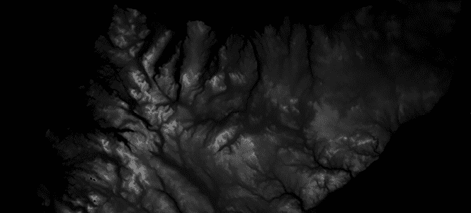
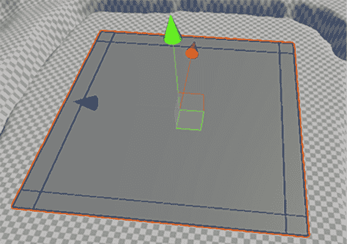

# 3

# 从蓝图到现实：使用地形和 ProBuilder 进行建造

现在我们已经掌握了使用 Unity 所需的所有必要概念，让我们开始设计游戏的第一级。本章的目的是学习如何使用地形工具来创建游戏景观，然后使用 ProBuilder 以比使用立方体更详细的方式创建基础 3D 网格。到本章结束时，你将能够创建任何类型的场景原型，并在实际使用最终图形实现之前尝试你的想法。

具体来说，在本章中，我们将探讨以下概念：

+   定义我们的游戏概念

+   使用地形工具创建景观

+   使用 ProBuilder 创建形状

让我们先谈谈我们的游戏概念，这将帮助我们草拟第一级环境。

# 定义我们的游戏概念

在向场景添加第一个立方体之前，有一个想法是好的，因为我们需要理解游戏的基本概念才能开始设计第一级。在本书中，我们将创建一个射击游戏，玩家将对抗试图摧毁玩家基地的敌人波次。

这个基地将位于一个（不那么）秘密的位置，周围环绕着山脉：

图 3.1：我们的完成游戏

我们将在阅读本书的过程中定义游戏机制，但有了这个游戏的基本高级概念，我们可以开始思考如何创建一个山丘景观和一个占位符玩家基地。

考虑到这一点，在本章的下一节中，我们将学习如何使用 Unity 的地形工具来创建场景的景观。

# 使用地形创建景观

到目前为止，我们使用立方体来生成我们的级别原型，但我们还了解到立方体有时无法代表我们可能需要的所有可能的物体。想象一下不规则的东西，比如一个完整的带有山丘、峡谷和河流的地形。考虑到地形中的不规则形状，使用立方体来创建这将是一场噩梦。

另一个选择是使用 3D 建模软件，但问题是生成的模型会非常大且非常详细，以至于即使在高端 PC 上表现也不会很好。在这种情况下，我们需要学习如何使用 Unity 的地形系统，我们将在本章的第一节中这样做。

在本节中，我们将介绍与地形相关的以下概念：

+   讨论高度图

+   创建和配置高度图

+   创建高度图

+   添加高度图细节

让我们先谈谈高度图，其纹理帮助我们定义地形的海拔。

`纹理`是一种应用于 3D 模型不同部分的图像，以赋予它们细节。这个概念类似于儿童蛋玩具中的贴纸纸，你可以在玩具的不同部分粘贴它们，以给玩具添加眼睛或微笑。我们将在*第四章*，*无缝集成：导入和整合资源*中更多地讨论纹理。

## 讨论高度图

如果我们使用常规的 3D 建模工具创建一个包含山丘、峡谷、陨石坑、山谷和河流的大型游戏区域，我们将遇到一个问题，那就是我们将为所有可能距离的对象使用完全详细的模型，从而浪费了渲染我们看不到的细节的资源。在游戏中的几个实例中，玩家需要从相当远的距离查看地形的不同部分，这使得有效的资源管理成为一个严重的问题。Unity 地形工具使用一种称为高度图的技术，以高效和动态的方式生成地形。它不是为整个地形生成大型 3D 模型，而是使用一个称为**高度图**的图像，它看起来像地形顶部的黑白照片。

在以下图像中，你可以看到苏格兰一个地区的黑白俯视图，白色表示较高，黑色表示较低：

图 3.2：苏格兰的高度图

在前面的图像中，你可以通过寻找图像中最白的区域来轻松地找到山脉的顶峰。海平面以下的一切都是黑色，而中间的部分使用灰度的渐变，表示最小和最大高度之间的不同高度。其想法是图像中的每个像素都决定了该特定地形区域的高度。

Unity 地形工具可以自动从该图像生成 3D 网格，节省了我们存储该地形完整 3D 模型所需的硬盘空间。此外，Unity 将随着我们的移动创建地形，为附近区域生成高细节模型，为远距离区域生成低细节模型，使其成为一个性能良好的解决方案。

在以下图像中，你可以看到为地形生成的网格。你可以欣赏到地形较近的部分比较远的部分有更多的多边形：

图 3.3：生成的高度图网格

考虑到这项技术有其缺点，例如 Unity 在游戏过程中生成那些 3D 模型所需的时间以及无法创建洞穴。然而，目前这对我们来说还不是问题。

现在我们已经知道了什么是高度图，让我们看看我们如何可以使用 Unity 地形工具创建我们自己的高度图。

## 创建和配置高度图

如果你点击**GameObject | 3D Object | Terrain**，你将在场景中看到一个巨大的平面出现，并在你的**Hierarchy**窗口中看到一个**Terrain**对象。那就是我们的地形，它很平坦，因为其高度图开始时全部是黑色，所以在初始状态下没有任何高度。

在以下图像中，您可以看到全新的**地形**对象的外观：

图 3.4：尚未绘制高度的地形

在开始编辑此**地形**之前，您必须配置不同的设置，例如地形高度图的大小和分辨率，这取决于您打算如何使用它。这不同于生成整个世界。我们的游戏将包含玩家的基地，他们将进行防御，因此地形将较小。在这种情况下，一个 200 x 200 米大小的区域，周围环绕着山脉，将足够使用。

为了根据这些要求配置我们的地形，我们需要执行以下操作：

1.  从**层次结构**或**场景**窗口中选择**地形**。

1.  查看地形的**检查器**组件，如果它已折叠，则展开它。

1.  点击山脉和齿轮图标（最右侧的选项）以切换到配置模式。在下面的屏幕截图中，您可以看到该按钮的位置：

图 3.5：地形设置按钮

1.  查找**网格分辨率**（**在地形数据**）部分。

1.  在两个设置中将**地形宽度**和**地形长度**更改为`200`。这将表示我们的地形大小将是 200 x 200 米。

1.  **地形高度**确定可能的最大高度。我们高度图的白区域将是这个大小。我们可以将其减少到`500`，仅为了限制我们山脉的最大山峰高度：

图 3.6：地形分辨率设置

1.  查找**纹理分辨率**（在**地形数据**）部分。

1.  将**高度图分辨率**更改为 257 x 257：

图 3.7：高度图分辨率设置

**高度图分辨率**是包含地形不同部分高度的高度图图像的大小。在我们的 200 x 200 米地形中使用 257 x 257 的分辨率意味着地形的每平方米将覆盖高度图的一点点多于一像素。每平方米的分辨率越高，您可以在该区域大小中绘制出越多的细节。通常，地形特征较大，所以每平方米超过 1 像素通常是资源浪费。找到您能有的最小分辨率，以便您能够创建所需的细节。

您还希望设置的另一个初始设置是初始地形高度。默认情况下，这是 0，因此您可以从底部开始绘制高度，但这种方式您无法在地形中制作洞穴，因为它已经处于最低点。设置一个小的初始高度允许您绘制河流路径和坑洼，以防您需要它们。

为了做到这一点，请执行以下操作：

1.  在**层次结构**面板中选择**地形**。

1.  点击**绘制地形**按钮（第二个按钮）。

1.  如果尚未设置，将下拉菜单设置为**设置高度**。

1.  将**高度**属性设置为`50`。这将表示我们希望所有地形从`50`米的高度开始，这样我们就可以制作最大深度为`50`米的洞穴：

图 3.8：设置高度地形工具位置

1.  点击**全部平整**按钮。您将看到所有地形都已提升到我们指定的`50`米。这使我们剩下 450 米可以上升，基于我们之前指定的最大高度 500 米。

现在我们已经正确配置了高度图，让我们开始编辑它。

## 创建高度图

请记住，高度图只是高度的一个图像，因此为了编辑它，我们需要在该图像中绘制高度。幸运的是，Unity 提供了工具，允许我们在编辑器中直接编辑地形并直接看到修改后高度的结果。为了做到这一点，我们必须遵循以下步骤：

1.  在**层次结构**面板中选择**地形**。

1.  点击**绘制地形**按钮（第二个按钮，与上一节中的相同）。

1.  将下拉菜单设置为**提升或降低地形**：

图 3.9：提升或降低地形工具位置

1.  在**画笔选择器**中选择第二个画笔。这个画笔有模糊的边缘，允许我们创建更柔和的高度。

1.  将**画笔大小**设置为`30`，这样我们就可以创建跨越 30 米区域的地面高度。如果您想创建更细微的细节，可以减小这个数字。

1.  将**不透明度**设置为**10**以减少每秒绘制的地形高度量，或者点击：

图 3.10：平滑边缘画笔

1.  现在，如果您在**场景视图**中移动鼠标，您将看到一个小预览，如果您点击该区域，您将绘制的高度。您可能需要靠近地形以查看细节：

图 3.11：提升地形区域预览

您可以看到的勾选图案允许您看到您正在编辑的物体的实际大小。每个单元格代表一平方米。请记住，有一个参考来查看您正在编辑的物体的实际大小有助于防止您创建过大或过小的地形特征。您还可以放入其他类型的参考，例如一个具有准确尺寸的大立方体，代表一个建筑物，以获得您正在创建的山脉或湖泊的大小概念。请记住，立方体的默认尺寸为`1 x 1 x 1`米，因此将其缩放为`10,10,10`将得到一个`10 x 10 x 10`米的立方体：

1.  按住鼠标左键，将光标拖动到地形上以开始绘制地形高度。请记住，您可以按*Ctrl + Z*（在 Mac 上为*Command + Z*）来撤销任何不希望的改变。

1.  尝试在我们的区域周围绘制山脉，这将代表我们基地的背景山丘：

图 3.12：在地形边缘绘制的山脉

现在，我们未来基地周围已经有了不错的起始山丘。我们也可以在未来的基地周围画一个护城河。要这样做，请遵循以下步骤：

1.  在地形中间放置一个`50,10,50`比例的立方体。这将作为我们要创建的基地的占位符：

图 3.13：基础区域的占位符立方体

1.  再次选择**地形**和**画笔**按钮。

1.  将**画笔大小**减少到`10`。

1.  按住*Shift*键，左键点击并拖动鼠标在地面上方绘制基地周围的盆地。这样做会降低地形而不是提升它：

图 3.14：我们占位符基地周围的护城河

现在，我们有一个简单但很好的起始地形，它给我们一个基本的想法，了解我们的基地及其周围将是什么样子。在继续之前，我们将应用一些更细致的细节，使地形看起来更好。在下一节中，我们将讨论如何使用不同的工具模拟地形侵蚀。

在学习 Unity 之前，我使用 DirectX 制作游戏，这是一个低级图形库。虽然这是一个挑战，但我真的很享受学习生成自己的地形系统所需的算法。虽然引擎提供了一个制作游戏的实际方法，但制作自己的工具也可以是更好地理解这些引擎如何工作、学习它们的性能和限制以及如何排序的绝佳方式。

## 添加高度图细节

在前一节中，我们创建了一个地形的大致轮廓。如果你想让它看起来更逼真，那么你需要开始在这里和那里画很多小细节。通常，这会在关卡设计过程的后期进行，但既然我们现在正在探索地形工具，让我们看看。目前，我们的山脉看起来非常平滑。在现实生活中，它们通常更尖锐，所以让我们改进一下：

1.  选择**地形**，并像前几节中那样点击**画笔**按钮。

1.  如果下拉菜单中没有设置，请将其设置为**提升或降低地形**。

1.  选择第五个画笔，如图 3.15 所示。这个画笔形状不规则，因此我们可以在这里和那里画一些噪声。

1.  将**画笔大小**设置为`50`，以便我们可以覆盖更大的区域：

图 3.15：用于随机性的云图案画笔

1.  按住*Shift*键，在不拖动鼠标的情况下在山丘上做小点击。请记住，将区域放大，因为你无法在远处看到这些细节：

图 3.16：使用上述画笔生成的侵蚀效果

这给我们的山丘增加了一些不规则性。现在，让我们想象我们想在山丘上有一个平坦的区域来放置装饰性的天文台或天线。遵循以下步骤来实现这一点：

1.  选择**地形，画笔工具**，并从下拉菜单中选择**设置高度**。

1.  将**高度**设置为`60`。

1.  选择全圆画笔（第一个）。

1.  在小山上画一个区域。您会看到如果地形低于 60 米，它将上升，如果高于 60 米，它将下降：

图 3.17：平坦的小山

1.  您可以看到边界有一些需要平滑的粗糙角落：

图 3.18：未平滑的地形边缘

1.  将下拉菜单更改为**平滑高度**。

1.  选择第二支笔刷，如图 3.19 所示，大小为`5`，不透明度为`10`：

图 3.19：选择平滑高度笔刷

1.  点击并拖动我们平坦区域的边界以使其更平滑：

图 3.20：平滑地形边缘

如果您想深入了解地形，有一个地形工具扩展包，它添加了更多工具以更精细的细节来雕刻它。请参阅此文档：`docs.unity3d.com/Packages/com.unity.terrain-tools@5.1` 以及此视频：[`www.youtube.com/watch?v=smnLYvF40s4`](https://www.youtube.com/watch?v=smnLYvF40s4) 以获取更多信息。

我们可以在这里那里添加更多细节，但我们可以先这样。下一步是创建玩家的基地，但首先，让我们探索 ProBuilder 以生成我们的几何形状。

## 使用 ProBuilder 创建形状

到目前为止，我们已经使用立方体和原始形状创建了简单的场景，这对您将要创建的大多数原型来说已经足够了，但有时，游戏中可能会有一些难以用常规立方体建模的复杂区域，或者您可能想在游戏的一些部分添加更深的细节，以便了解玩家将如何体验该区域。

在这种情况下，我们可以使用任何 3D 建模工具来完成这项工作，例如 3D Studio Max、Maya 或 Blender，但它们可能难以学习，而且在这个开发阶段您可能不需要所有这些功能。幸运的是，Unity 有一个简单的 3D 模型创建器叫做 ProBuilder，让我们来探索它。

在本节中，我们将介绍与 ProBuilder 相关的以下概念：

+   安装 ProBuilder

+   创建形状

+   网格操纵

+   添加细节

ProBuilder 默认不包括在我们的 Unity 项目中，所以让我们先学习如何安装它。

## 安装 ProBuilder

Unity 是一个功能强大的引擎，但如果我们不使用所有这些工具，将它们添加到我们的项目中可能会使引擎运行得更慢，因此我们需要手动指定我们正在使用哪些 Unity 工具。为此，我们将使用**包管理器**，这是一个我们可以用来选择我们将需要的 Unity 包的工具。如您所回忆的，我们之前谈到了`Packages`文件夹。这就是包管理器修改的内容。

为了使用此工具在我们的项目中安装 ProBuilder，我们需要执行以下操作：

1.  点击**窗口 | 包管理器**选项：

图 3.21：包管理器选项

1.  在刚刚打开的窗口中，确保 **包** 模式处于 **Unity** **注册表** 模式，通过单击窗口左上角的 **Unity 注册表** 按钮来实现。与仅显示项目已拥有的包的 **项目内** 选项不同，**Unity 注册表** 将显示您可以安装的所有官方 Unity 包：

图 3.22：显示所有包

1.  等待剩余的包列表填充。请确保您已连接到互联网以下载和安装包。

1.  查看列表中的 **ProBuilder** 包并选择它。您还可以使用包列表顶部的搜索框：

    图 3.23：ProBuilder 在包列表中

    我使用的是 ProBuilder 版本 5.2.2，这是撰写本书时的最新版本。虽然您可以使用更新的版本，但使用它的过程可能会有所不同。您可以通过标题左侧的箭头查看旧版本。

1.  在 **包管理器** 右上角单击 **安装** 按钮：

图 3.24：安装按钮

1.  等待包安装；这可能需要一段时间。当 **导入** 弹出窗口完成后，**安装** 按钮被替换为 **移除** 标签时，您就可以知道过程已经结束。如果由于某种原因 Unity 冻结或超过 10 分钟，您可以随时重新启动它。

1.  在 Windows 上转到 **编辑 | 首选项**（在 Mac 上为 **Unity | 首选项**）。

1.  从左侧列表中选择 **ProBuilder** 选项。

1.  将 **顶点大小** 设置为 `2`，将 **线大小** 设置为 `1`。这将帮助您在编辑 3D 模型的不同部分时更好地可视化我们即将创建的模型：

图 3.25：配置 ProBuilder

**顶点大小** 和 **线大小** 的值很大（分别为 `2` 米和 `1` 米），因为我们不会编辑模型的细节，而是编辑像墙壁这样的大特征。您可能希望根据您正在编辑的内容稍后修改它。

虽然我们只需要了解 **包管理器** 的这些内容来安装 ProBuilder，但如果您想了解更多，可以在此处查看其文档：[`docs.unity3d.com/Manual/upm-ui.html`](https://docs.unity3d.com/Manual/upm-ui.html)

现在我们已经在项目中安装了 ProBuilder，让我们来使用它！

## 创建形状

我们将通过创建一个用于地板的平面来开始玩家的基础。我们将通过以下步骤来完成此操作：

1.  删除我们放置的作为基础占位符的立方体。您可以通过在层次结构中右键单击立方体然后单击 **删除** 来完成此操作。

1.  打开 ProBuilder 并转到 **工具 | ProBuilder** | **ProBuilder 窗口**：

图 3.26：ProBuilder 窗口选项

1.  在打开的窗口中，单击 **新形状** 按钮：

图 3.27：新形状选项

1.  在场景视图右下角出现的**创建形状**面板中，选择**平面**图标（第一行第二个图标）。

图 3.28：创建的新形状

1.  展开**形状属性**和**平面设置**。

1.  将**宽度切割**和**高度切割**设置为`2`。我们稍后会需要这些细分。

1.  点击并拖动到地面上以绘制平面。在您这样做的时候，检查**创建形状**面板中的**大小**值如何变化，并将**X**和**Z**值调整为`50`。

1.  释放鼠标按钮，查看生成的平面。

1.  在层次结构中选择新创建的**平面**对象，并使用**变换**工具稍微向上拖动。

我们需要将平面向上移动，因为它是在与地形完全相同的高度创建的。这导致了一种称为**Z 冲突**的效果，其中位于相同位置的像素在争夺确定哪个将被渲染以及哪个不会被渲染。

现在我们已经创建了地板，让我们学习如何操作其顶点来改变其形状。

## 网格操作

如果您选择平面，您会看到它被细分为 3 x 3 的网格，因为我们设置了宽度和高度切割为`2`。我们这样做是因为我们将使用外层单元格来创建我们的墙壁，从而将其抬高。想法是修改这些单元格的大小，在创建墙壁之前勾勒出墙壁的长度和宽度。为了做到这一点，我们将执行以下操作：

1.  在层次结构中选择平面。

1.  如果 ProBuilder 尚未打开，请打开它，并转到**工具** **|** **ProBuilder** **|** **ProBuilder 窗口**选项。

1.  在场景视图中出现的四个新按钮中，选择第二个按钮（顶点）：

图 3.29：选择顶点工具

1.  点击**选择隐藏**选项，直到它显示为**开启**，如图下所示。这将使选择顶点更容易：

图 3.30：启用选择隐藏

1.  点击并拖动鼠标以创建一个选择框，选择顶点第二行的四个顶点：

图 3.31：顶点选择

1.  点击第二个按钮 点击场景视图左上角的 4 箭头按钮以启用**移动工具**，这将允许我们移动顶点。像**变换工具**一样，这可以用来移动任何对象，但移动顶点时，这是我们唯一的选项。记得在选择了顶点后执行此操作。您也可以按*W*键来启用**移动工具**。

图 3.32：移动工具

1.  移动顶点行以使平面的细分更薄。您可以使用地形上的棋盘图案来获得墙壁大小的概念（记住，每个方格是一平方米）：

图 3.33：移动后的顶点

1.  对每一行的顶点重复*步骤 3*到*5*，直到得到类似大小的墙面轮廓：

图 3.34：移动顶点以减少边缘的单元格宽度

现在我们已经为墙壁创建了轮廓，让我们添加新的面到我们的网格中，以创建它们。为了使用我们创建的细分或 **面** 来制作墙壁，我们必须选择并挤出它们。按照以下步骤进行操作：

1.  选择平面。

1.  在 **场景视图** 中选择 **ProBuilder** 按钮的第四个按钮：

图 3.35：选择面工具

1.  在按住 *Ctrl* (*Mac 上的*Command*) 的同时，点击墙壁轮廓的每个面：

图 3.36：正在选择的边缘面

1.  在 **ProBuilder** 窗口中，寻找 **Extrude** **Faces** 按钮右侧的 **加号** (**+**) 图标。它位于窗口的红色部分：

图 3.37：挤出面选项

1.  在点击 **+** 按钮后出现的窗口中，将 **距离** 设置为 `5`。

1.  在该窗口中点击 **挤出面** 按钮：

图 3.38：挤出距离选项

1.  现在，你应该看到墙壁的轮廓刚刚从地面上抬起：

图 3.39：挤出网格边缘

现在，如果你注意观察基础地板和墙壁与地形的接触，会发现有一点间隙。我们可以尝试将基础向下移动，但地板可能会消失，因为它会被地形埋藏。这里我们可以用一个小技巧，即向下推墙壁，而不移动地板，这样墙壁就会埋入地形，而我们的地板会保持一定的距离。

你可以在以下图中看到它将如何看起来：

图 3.40：预期结果的切片

为了做到这一点，我们需要执行以下操作：

1.  在 **场景视图** 中选择第三个 **ProBuilder** 按钮以启用边缘选择：

图 3.41：选择边缘工具

1.  在按住 *Ctrl* (*Mac 上的*Command*) 的同时，选择墙壁的所有底部边缘。

1.  如果你选择了不想要的边缘，只需在按住 *Ctrl* (*Mac 上的*Command*) 的同时再次点击它们，就可以取消选择它们，同时保持当前的选择：

图 3.42：选择地板边缘

如果你想在 **球体** 图标中使用 **线框** 模式，请转到场景视图右上角的 2D 按钮左侧，并从下拉菜单中选择 **线框** 选项，如图下截图所示。你可以通过选择 **着色** 来返回正常模式。

图 3.43：启用线框模式

1.  通过按住 **场景** 面板左上角的第二个按钮（或键盘上的 *W* 键）来启用 **移动** 工具：

图 3.44：对象移动工具

1.  将边缘向下移动，直到它们完全埋入地形中：

图 3.45：重叠的面

现在我们有了基础网格，我们可以开始使用几个其他的**ProBuilder**工具来添加细节。

**记忆**

这部分让我想起了我学习如何使用我的第一个 3D 创作软件 Maya 的时候。我使用的是 Autodesk 收购它之前的版本，所以想象一下它有多老了。我喜欢学习基于实际物体蓝图雕刻实体的技术。我记得在我的第一个模型中创建了一个星门和 F302 Tau’ri 飞船。当我写这篇文章时，我已经完成了整个系列的第三次运行（包括亚特兰蒂斯和宇宙）。

## 添加细节

让我们开始通过在墙上应用一点斜边和在角落上切一点小口来添加基础细节，这样它们就不会那么尖锐。要做到这一点，请按照以下步骤操作：

1.  使用边缘选择工具（**ProBuilder**按钮中的第三个），选择我们模型的顶部边缘：

图 3.46：选择顶部墙面边缘

1.  在**ProBuilder**窗口中，点击**斜边**按钮右侧的**+**图标。

1.  设置距离为`0.5`：

图 3.47：生成斜面的距离

1.  点击**斜边边缘**。现在你可以看到我们墙的顶部部分有一点斜边：

图 3.48：斜面过程的成果

1.  可选地，您也可以使用内部墙壁的底部部分：

图 3.49：斜面应用于地板-墙面边缘

另一个可以添加的细节可能是地面中间的一个坑，作为我们需要避免掉入的陷阱，并让敌人通过 AI 避免它。为了做到这一点，请按照以下步骤操作：

1.  通过点击第四个**ProBuilder**场景视图按钮启用**面**选择模式。

1.  选择地板。

1.  在**ProBuilder**窗口中点击**细分面**选项。最终地板会被分成四块。

1.  再次点击该按钮，以得到一个 4 x 4 的网格：

图 3.50：地板细分

1.  使用**选择面**工具（**Scene View**顶部**ProBuilder**按钮中的第三个）同时按住*Ctrl*（Mac 上的*Command*）选择四个内部地板砖。

1.  通过点击场景视图左上角的第四个按钮或按键盘上的*R*键启用**缩放**工具。确保工具句柄位置设置为**中心**（而不是**枢轴**），这样对象就从对象的中心进行缩放。就像**移动**工具一样，这可以用来缩放任何对象，而不仅仅是顶点：

图 3.51：缩放工具

1.  使用 Gizmo 中心的灰色立方体缩小中心砖块：

图 3.52：内部单元格正在缩小

1.  在**ProBuilder**窗口中点击**拉伸面**按钮。

1.  使用**移动工具**将拉伸的面向下推。

1.  右键点击**ProBuilder**窗口标签并选择**关闭标签**。我们需要回到地形编辑，而**ProBuilder**打开将不会让我们舒适地做到这一点：

图 3.53：关闭标签选项

1.  选择地形并将其降低，以便我们可以看到坑：

图 3.54：降低地形以便可见坑

通过这种方式，我们看到了如何使用不同的 ProBuilder 工具，如拉伸和斜边，来创建简单的网格以原型化我们关卡布局。有时，用普通的立方体来做这样的事情并不容易。

# 摘要

在本章中，我们学习了如何使用高度图和 Unity 地形工具，如 **绘制高度** 和 **设置高度** 来创建山丘和河流，以创建大型地形网格。我们还看到了如何使用 ProBuilder 创建我们自己的 3D 网格，以及如何操纵模型的顶点、边和面来创建我们游戏的原型基础模型。我们没有讨论我们可以应用于我们的网格或高级 3D 建模概念的任何性能优化，因为这需要完整的章节，并且超出了本书的范围。目前，我们的主要重点是原型设计，所以我们对我们关卡当前的状态感到满意。

在下一章中，我们将学习如何通过整合我们使用外部工具创建的资产（文件）来下载和替换这些原型模型，最终艺术作品。这是提高我们游戏图形质量的第一步，我们将在 *第三部分*，*提高图形* 的结尾完成。

# 在 Discord 上了解更多

与其他用户、Unity 游戏开发专家以及作者本人一起阅读这本书。提问，为其他读者提供解决方案，通过 Ask Me Anything 会话与作者聊天，等等。扫描二维码或访问链接加入社区：

[`packt.link/unitydev`](https://packt.link/unitydev)

