# 第五章：解放 C#和视觉脚本的力量

Unity 拥有许多内置工具来解决游戏开发中最常见的问题，例如我们之前看到的问题。即使是同一类型的两款游戏，它们也有自己独特的小差异，这使得每款游戏都独一无二，Unity 无法预见这些差异，这就是为什么我们需要脚本。在本章中，我们将介绍两种主要的 Unity 脚本选项：C#和视觉脚本。我们将讨论它们的优缺点以及开始使用它们创建游戏玩法所需的基础知识。从现在开始，我们将看到如何使用这两种选项来实现所有我们的脚本。

在本章中，我们将探讨以下主题：

+   介绍脚本

+   创建脚本

+   使用事件和指令

+   常见的新手 C#脚本错误

我们将创建自己的 Unity 组件，学习脚本的基本结构以及我们可以执行动作和公开属性以进行配置的方式，无论是使用 C#还是视觉脚本。在本章中，我们不会创建任何实际的游戏代码，只是提供一些示例脚本，为下一章打下基础。让我们先讨论 Unity 的脚本选项。

# 介绍脚本

通过编码，我们可以以多种方式扩展 Unity 的功能，以实现我们需要的精确行为，所有这些都可以通过一种众所周知的编程语言——C#来实现。然而，除了 C#之外，Unity 还拥有**视觉脚本**，这是一种通过节点图工具生成代码的方法。

这意味着你可以通过拖动**节点**来创建脚本，而不是编写代码，节点是代表可以串联的动作的盒子：

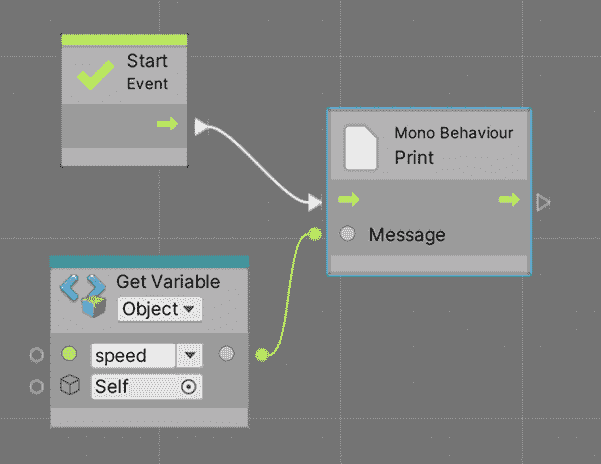

图 5.1：视觉脚本图的示例

尽管本质上这两种方法可以达到相同的结果，但我们可以根据不同的需求使用它们。通常，由于通常很大并且对性能非常敏感，游戏的核心逻辑是用 C#编写的。然而，有时使用视觉脚本而不是 C#脚本可以让非程序员团队成员，如艺术家或游戏设计师，在游戏中有更多的自由来编辑小的变化，尤其是在平衡或视觉效果方面。

另一个例子是游戏设计师通过视觉脚本原型设计想法，当想法被批准后，程序员会将这些想法转换为 C#脚本。此外，C#程序员可以为视觉脚本程序员创建节点。

在团队之间混合这些工具的方式差异很大，因此，在下一章中，我们将主要关注 C#，但我们也将看到我们将要创建的脚本的视觉脚本等效版本。这样，你将有机会在方便的时候根据团队结构选择使用其中一种。

现在，让我们继续讨论脚本创建的基础知识。

# 创建脚本

创建行为的第一步是创建脚本资产；这些文件将包含我们组件行为背后的逻辑。C# 和可视化脚本都有自己的资产类型来实现这一点，所以让我们来探索如何在两个工具中实现这一点。

在本书中需要一些编程知识。然而，在本节的第一部分，我们将讨论一个基本的脚本结构，以确保你在接下来的章节中编码游戏行为时有坚实的基础。即使你对 C# 很熟悉，也不要跳过这一节，因为我们将介绍 Unity 特定的代码结构。

在本节中，我们将检查以下脚本创建概念：

+   初始设置

+   创建 C# 脚本

+   添加字段

+   创建可视化脚本图

我们将创建我们的第一个脚本，它将用于创建我们的组件，讨论创建所需的工具，并探讨如何将我们的类字段暴露给编辑器。让我们从脚本创建的基本知识开始。

## 初始设置

通过在 **包管理器** 中安装 **可视化脚本** 包，我们可以添加对可视化脚本的支持，就像我们在前面的章节中安装其他包一样，但 Unity 在我们创建项目时会自动为我们完成这项工作，所以我们不需要进行任何进一步的设置。这意味着本节的其余部分将负责设置与 C# 一起工作的工具。

在创建第一个 C# 脚本之前，我们需要考虑 Unity 如何编译代码。在编码时，我们习惯于使用 **集成开发环境**（**IDE**），这是一个用于创建我们的代码并编译或执行它的程序。在 Unity 中，我们将仅使用 IDE 作为工具，通过着色和自动完成功能轻松创建脚本，因为 Unity 没有自定义代码编辑器（如果你之前从未编码过，这些是初学者的宝贵工具）。脚本将在 Unity 项目内部创建，如果进行任何更改，Unity 将检测并编译它们，因此你不需要在 IDE 中编译。不用担心，即使不在 IDE 中编译和运行代码，也可以使用 IDE 和 Unity 一起进行调试、添加断点和检查变量和结构的数据。

我们可以使用 Visual Studio、Visual Studio Code、Rider 或您想使用的任何 C# IDE，但安装 Unity 时，您可能会看到自动安装 Visual Studio 的选项，这允许您拥有默认的 IDE。这会安装 Visual Studio 的免费版本，所以在这里不用担心许可证问题。如果您电脑上没有 IDE，并且在安装 Unity 时没有选择 Visual Studio 选项，您可以执行以下操作：

1.  打开 **Unity Hub** 并转到 **安装** 部分。

1.  点击你使用的 Unity 版本右上角的轮按钮，然后点击 **添加模块**：

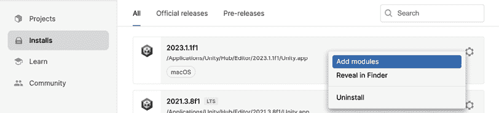

图 5.2：向 Unity 安装添加模块

1.  选择表示 **Visual Studio** 的选项；该选项的描述将根据您使用的 Unity 版本和平台而有所不同。

1.  点击右下角的 **继续** 按钮：

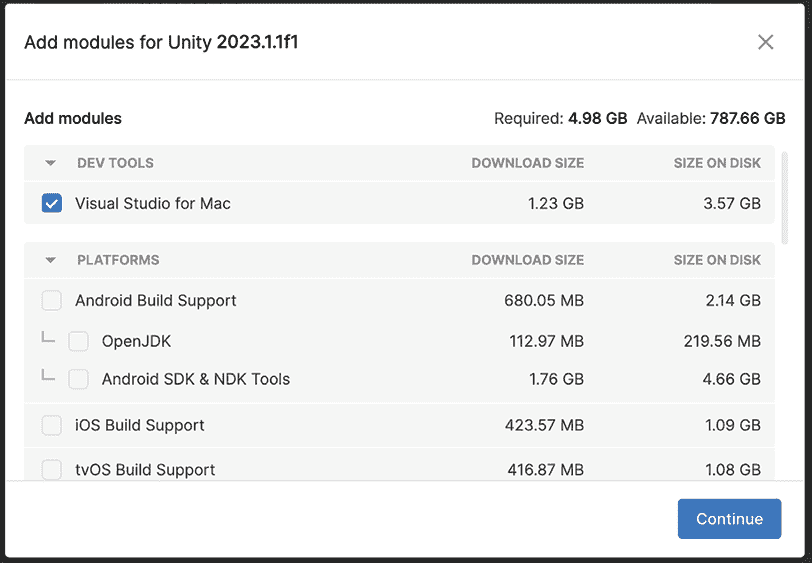

图 5.3：安装 Visual Studio

1.  确认您已接受条款和条件，然后点击 **安装**：

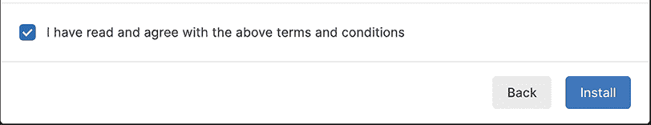

图 5.4：接受条款和条件

1.  等待操作完成。这可能需要几分钟。可能会有一些与平台和版本相关的 Visual Studio 步骤；如果是这样，只需按照它们进行即可。

如果您有一个首选的 IDE，您可以自己安装它并配置 Unity 以使用它。如果您负担得起或者您是教师或学生（在这些情况下它是免费的），我推荐 Rider。这是一个功能强大的 IDE，拥有许多您会喜欢的 C# 和 Unity 功能；然而，它对于本书并非至关重要。为了设置 Unity 以使用自定义 IDE，请执行以下操作：

1.  打开项目，并在编辑器的顶部菜单中选择 **编辑 | 首选项**（在 Mac 上为 **Unity | 首选项**）。

1.  从左侧面板中选择 **外部工具** 菜单。

1.  从外部脚本编辑器中，选择您首选的 IDE；Unity 将自动检测支持的 IDE：

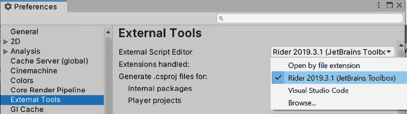

图 5.5：选择自定义 IDE

1.  如果您在列表中找不到您的 IDE，您可以使用 **浏览…** 选项。请注意，通常需要使用此选项的 IDE 并非得到很好的支持——但值得一试。

1.  选择您的 IDE 后，点击 **重新生成项目文件**。这将重新编译项目所需的所有文件，这样您就不会遇到某些项目文件不存在的问题。

最后，一些 IDE，如 Visual Studio、Visual Studio Code 和 Rider，都有 Unity 集成工具，您需要在项目中安装这些工具，这是可选的但可能很有用。通常 Unity 会自动安装这些工具，但如果您想确保它们已安装，请按照以下步骤操作：

1.  打开 **包管理器**（**窗口 | 包管理器**）。

1.  将 **包** 下拉菜单设置为 **Unity 注册表** 模式：

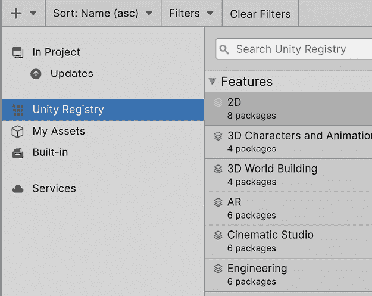

图 5.6：启用 Unity 注册表模式

1.  在列表中搜索您的 IDE 或使用搜索栏进行筛选。在我的情况下，我使用了 Rider，我可以找到一个名为 **JetBrains Rider Editor** 的包：

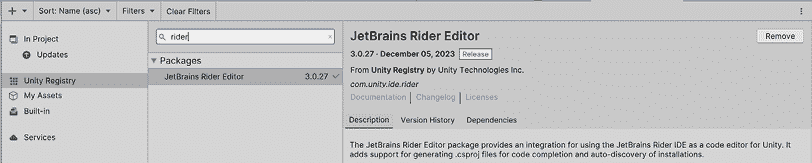

图 5.7：自定义 IDE 编辑器扩展安装——在这个例子中是 Rider

1.  通过查看包管理器右下角的按钮来检查您的 IDE 集成包是否已安装。如果您看到 **安装** 或 **更新** 按钮，请点击它；但如果它显示 **已安装**，则一切设置就绪。

现在我们已经配置好了 IDE，让我们创建第一个脚本。

## 创建 C# 脚本

C#是一种面向对象的编程语言。任何想要扩展 Unity 的时候，我们都需要创建自己的类——一个包含我们想要添加到 Unity 中的指令的脚本。如果我们想创建自定义组件，我们需要创建一个继承自`MonoBehaviour`的类，这是每个自定义组件的基类。

我们可以直接在 Unity 项目中使用编辑器创建 C#脚本文件，并且可以将它们排列在其他`assets`文件夹旁边的文件夹中。创建脚本的最简单方法是按照以下步骤进行：

1.  选择您想要添加我们即将创建的组件的任何 GameObject。由于我们只是进行测试，所以选择任何对象。

1.  点击检查器底部的**添加组件**按钮，然后在点击**添加组件**后列表底部的**新脚本**选项：

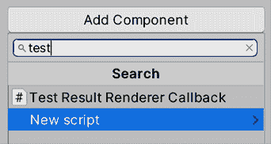

图 5.8：新的脚本选项

1.  在**名称**字段中输入所需的脚本名称，然后点击**创建并添加**。在我的情况下，我将称之为`MyFirstScript`，但为了您将要用于游戏的脚本，请尽量使用描述性的名称，无论长度如何！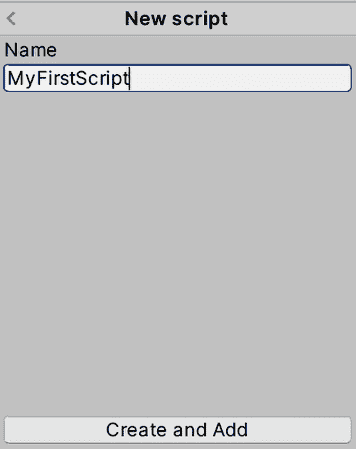

    图 5.9：命名脚本

    建议您使用 Pascal 大小写来命名脚本。在 Pascal 大小写中，用于玩家射击功能的脚本将被称为`PlayerShoot`。每个单词的首字母都大写，且不能使用空格。

1.  您可以在**项目视图**中检查如何创建与您的脚本同名的新资产。请记住，每个组件都有自己的资产，我建议您将每个组件放入一个`Scripts`文件夹中：

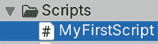

图 5.10：脚本资产

1.  现在，您也会在**检查器**窗口中看到您的 GameObject 有一个新的组件，其名称与您的脚本相同。因此，您现在已经创建了自己的第一个`component`类：

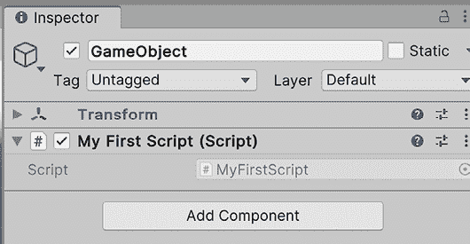

图 5.11：将我们的脚本添加到 GameObject 中

现在我们已经创建了一个`component`类，请记住，类本身不是组件。它是对组件应该是什么的描述——组件应该如何工作的蓝图。要实际使用组件，我们需要通过基于类创建组件来实例化它。每次我们使用编辑器将组件添加到对象时，Unity 都会为我们实例化它。如果您熟悉面向对象的编程语言，您可能会回忆起当我们使用像 C#这样的编程语言时，我们需要在脚本中使用一个特定的关键字来编码对象的实例化：**new**。在 Unity 中，没有必要这样做；通常，我们不会使用新的 C#关键字来实例化组件，而是通过使用编辑器或专用函数。

现在，你可以像添加任何其他组件一样，通过使用**检查器**窗口中的**添加组件**按钮将你的新空组件添加到其他对象中。然后，你可以在**脚本**类别中查找该组件或通过名称搜索它：

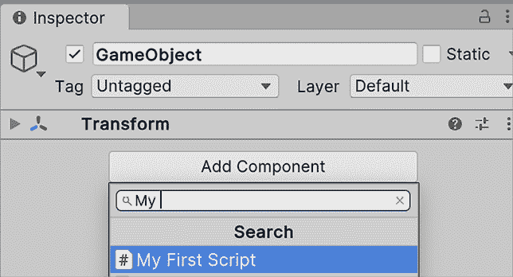

图 5.12：在脚本类别中添加自定义组件

在这里你需要考虑的是，我们可以将相同的组件添加到多个 GameObject 中。我们不需要为使用该组件的每个 GameObject 创建一个类。我知道这是基本的程序员知识，但请记住，我们在这里试图回顾基础知识。

现在我们有了我们的组件，让我们通过以下步骤探索它的外观并进行类结构回顾：

1.  在**项目视图**中定位脚本资产，并双击它。请记住，它应该在你之前创建的`Scripts`文件夹中。

1.  等待 IDE 打开；这可能需要一段时间。当你看到你的脚本代码及其关键字被正确着色，就像以下图所示，这取决于所需的 IDE。在 Rider 中，它看起来就像*图 5.13*中所示的那样。在我的情况下，我知道 Rider 已经完成了初始化，因为`MonoBehaviour`类型和脚本名称被着色成相同的颜色：

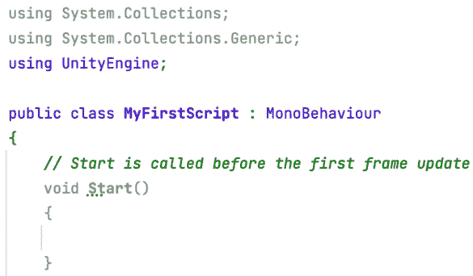

图 5.13：在 Rider IDE 中打开的新脚本

1.  上一张截图中的前三行——以`using`关键字开始的那些——包括常见的命名空间。**命名空间**就像代码容器，在这种情况下，是其他人（如 Unity、C# 创建者等）创建的代码。我们将经常使用命名空间来简化我们的任务；它们已经包含了我们将要使用的已解决的算法。我们将根据需要添加和删除`using`组件；在我的情况下，Rider 建议前两个`using`组件是不必要的，因为我没有使用它们内部的任何代码，所以它们被灰色显示。但暂时保留它们，因为你在本书的后续章节中将会用到它们。记住，它们应该始终位于文件的开头：

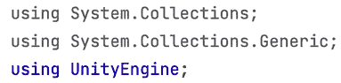

图 5.14：使用部分

1.  下一行，以`public class`开始的行，是我们声明正在创建一个新的类，该类继承自`MonoBehaviour`，这是每个自定义组件的基类。我们知道这是因为它以`: MonoBehaviour`结尾。你可以看到代码的其余部分位于该行下面的括号内，这意味着括号内的代码属于组件：

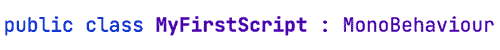

图 5.15：MyFirstScript 类定义继承自 MonoBehaviour

现在我们有了我们的 C# 脚本，让我们添加字段来配置它。

## 添加字段

在前面的章节中，当我们添加 `Rigidbody` 或不同类型的碰撞器等组件时，仅仅添加组件是不够的。我们需要正确配置它们以实现所需的确切行为。例如，`Rigidbody` 有 `Mass` 属性来控制物体的重量，而碰撞器有 `Size` 属性来控制它们的形状。这样，我们可以为不同的场景重用相同的组件，防止类似组件的重复。使用 `Box` 碰撞器，我们可以通过改变大小属性来表示一个立方体或矩形盒子。我们的组件也不例外；如果我们有一个移动对象的组件，并且我们想让两个对象以不同的速度移动，我们可以使用具有不同配置的相同组件。

每个配置都是一个 **字段** 或 **变量**，我们可以在这里保存参数的值。我们可以以两种方式在编辑器中创建可编辑的类字段：

+   通过将字段标记为 `public`，但打破封装原则

+   通过创建私有字段并使用属性公开它

现在，我们将介绍这两种方法，但如果你对面向对象编程（**OOP**）的概念不熟悉，例如封装，我建议你使用第一种方法。

假设我们正在创建一个移动脚本。我们将使用第一种方法——即通过添加 `public` 字段——添加一个可编辑的数字字段来表示速度。我们将按照以下步骤进行：

1.  通过双击它打开脚本，就像我们之前做的那样。

1.  在类括号内，但不在它们内部的任何括号中，添加以下代码：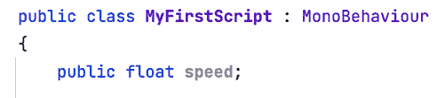

    图 5.16：在我们的组件中创建速度场

    `public` 关键字指定变量可以在类的作用域之外被查看和编辑。代码中的 `float` 部分表示变量使用十进制数字类型，而 `speed` 是我们为字段选择的名字——尽管这可以是任何你想要的名字。你可以使用其他值类型来表示其他类型的数据，例如 `bool` 来表示复选框或 `Booleans` 和 `string` 来表示文本。

1.  要应用更改，只需在 IDE 中保存文件（通常通过按 *Ctrl* + *S* 或 *Command* + *S*）并返回 Unity。当你这样做时，你会在编辑器的右下角注意到一个小小的加载轮，这表明 Unity 正在编译代码。你必须在轮子停止转动之前不能测试更改：

    图 5.17：加载轮

    记住 Unity 会编译代码；不要在 IDE 中编译。

1.  编译完成后，你可以在 **Inspector** 窗口中看到你的组件，并且应该有一个 **Speed** 变量，允许你设置你想要的速度。当然，现在，变量没有任何作用。Unity 不会通过变量的名字来识别你的意图；我们需要以某种方式设置它以便使用，但我们将稍后进行设置：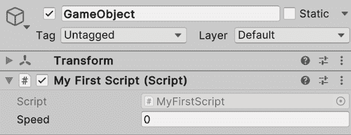

    图 5.18：一个公共字段，用于编辑组件稍后将要使用的数据

    如果你没有看到`speed`变量，请检查本章末尾的*常见初学者 C#脚本错误*部分，它将提供有关如何调试编译错误的提示。

1.  尝试将相同的组件添加到其他对象中，并设置不同的速度。这将展示不同 GameObject 中的组件是如何独立的，允许你通过不同的设置来改变它们的一些行为。

1.  与我们在前面的步骤中使用`public`关键字来定义检查器中可用的属性不同，我们创建一个`private`字段，鼓励封装，并使用`SerializeField`属性将其公开，如图下所示。

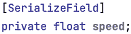

图 5.19：在检查器窗口中公开私有属性

如果你不太熟悉封装的 OOP 概念，只需使用第一个方法，即使用`public`关键字，在检查器中公开变量，这对初学者来说更灵活。如果你创建一个`private`字段，它将不会被其他脚本访问，因为`SerializeField`属性只将变量公开给编辑器。记住，Unity 不会允许你使用构造函数，所以设置初始数据和注入依赖的唯一方法是通过序列化的`private`字段或`public`字段，并在编辑器中设置它们（或使用依赖注入框架，但这超出了本书的范围）。为了简单起见，我们将在这本书的大多数练习中使用第一种方法。

如果你愿意，尝试创建其他类型的变量，并检查它们在检查器中的外观。尝试将`float`替换为`bool`或`string`，如之前所建议的。记住，并非所有可能的 C#类型都被 Unity 识别；通过这本书，我们将学习到最常见的支持类型。

既然我们已经知道如何通过数据来配置我们的组件，那么让我们使用这些数据来创建一些行为。

即使我们在使用 C#，这仍然是一种非常快的语言，Unity 也有一个名为 IL2CPP 的功能，它自动将我们的脚本转换为优化的 C++代码。查看此文档以获取更多信息：[`docs.unity3d.com/Manual/IL2CPP.html`](https://docs.unity3d.com/Manual/IL2CPP.html)。然而，IL2CPP 并不总是必要的，因为你在这本书中将要编写的代码仍然足够快。我们不会进行大规模的包含数千个 GameObject 的模拟，但我仍然建议在移动设备上尝试 IL2CPP，那里的性能提升将会非常显著。

现在我们有了我们的 C#脚本，让我们看看如何在视觉脚本中做同样的事情。

## 创建一个视觉脚本

由于我们需要为 C#脚本创建脚本资产，因此我们需要创建其视觉脚本等价物，即**脚本图**，并将其附加到我们的 GameObject 上，尽管这次使用不同的方法。在继续之前，值得注意的是，我们的对象必须只有 C#或视觉脚本版本，但不能两者都有，否则行为将被应用两次，每次针对一个版本。

实际上，只需执行你想要尝试的版本所需的步骤，或者如果你想要实验，可以在不同的对象中执行这两个步骤。

让我们通过以下步骤创建一个视觉脚本：

1.  创建一个新的 GameObject，我们将向其中添加视觉脚本。

1.  向其添加**脚本机**组件。此组件将执行我们即将创建的**视觉脚本图**：

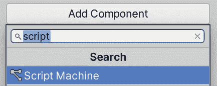

图 5.20：添加脚本机组件

1.  在**脚本机**组件中，点击**新建**按钮，选择一个文件夹和一个名称以保存视觉脚本图形资产。此资产将包含我们脚本的指令，**脚本机**组件将执行这些指令：

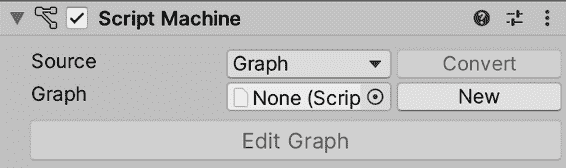

图 5.21：使用“新建”按钮创建视觉脚本图形资产

1.  如果出现警告，请点击**立即更改**选项。这将防止在脚本上的这些更改在游戏运行时影响游戏，因为警告中提到，它可能导致代码不稳定。始终停止游戏，更改代码，然后再次播放。

1.  点击**编辑图形**按钮以打开视觉脚本编辑器窗口。您可以将**脚本图**选项卡拖动到编辑器的任何部分以合并该窗口：

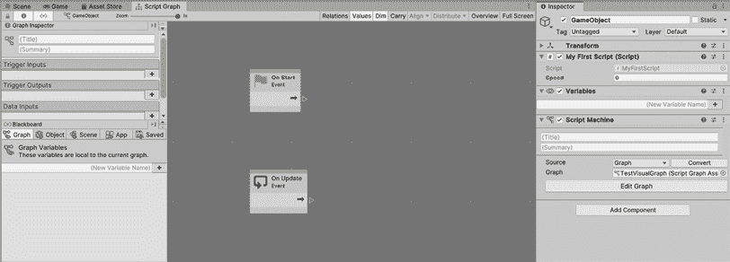

图 5.22：视觉脚本资产编辑器

1.  将鼠标放在视觉脚本编辑器网格的空白区域，同时按住中间鼠标按钮，移动鼠标以滚动通过图。在 MacBooks 和 Apple Magic Mouses 上，您可以使用两根手指在触控板上进行滚动。

我们所做的是创建一个包含我们脚本代码的视觉图形资产，并通过**脚本机**组件将其附加到一个 GameObject 上。与 C#脚本不同，我们不能直接附加图形资产；这就是为什么我们需要**脚本机**来为我们运行组件的原因。

关于字段，我们在 C#脚本中创建的字段包含在脚本本身中，但对于视觉图来说，它们的工作方式略有不同。当我们添加**Script Machine**组件时，还添加了另一个组件：**Variables**组件。这将保存 GameObject 可以包含的所有视觉脚本图的变量。这意味着我们添加到对象的所有图都将共享这些变量。如果你想创建特定于图的变量，也可以，但它们不会在检查器中暴露，这种方式也简化了从其他对象的脚本中访问变量的过程。此外，请记住，你可能会想向对象添加多个图，因为每个图将处理不同的行为，这样我们就可以根据需要混合和匹配它们。

为了将一个变量添加到我们的 GameObject 中，使其可以被我们的图使用，让我们做以下操作：

1.  选择添加了视觉脚本（带有**Script Machine**组件）的 GameObject，并查看**Variables**组件。

1.  点击显示**（New Variable Name）**的输入字段，并输入变量的名称。在我的例子中，这是`speed`。如果你看不到这个选项，点击**Variables**组件名称左侧的三角形。

1.  点击**Variables**组件的**Plus (+)**按钮。

1.  在**Type**下拉菜单中，选择**Float**。

1.  可选地，你可以在**Value**字段中设置一个初始值：

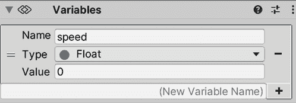

图 5.23：为视觉图创建变量

我们创建了一个`speed`变量，我们可以在 GameObject 中配置它来改变所有附加到我们的 GameObject 的**视觉脚本图**的工作方式，或者至少是使用该变量值的那些图。考虑一下，你可能会有不同类型的速度，比如移动速度和旋转速度，所以在实际情况下，你可能希望变量名称更具体一些。

在视觉脚本中，**Variables**组件用于管理数据，类似于在某些编程系统中使用黑板来跨不同组件或代理共享和访问数据的方式。这个黑板是我们对象几个值的容器，就像内存或数据库，然后其他几个组件将查询并使用这些值。C#脚本通常在其内部包含自己的变量。随着我们创建的脚本准备就绪并可以配置，让我们看看如何使它们都发挥作用。

# 使用事件和指令

现在我们有了脚本，我们准备用它做些事情。在本章中，我们不会实现任何有用的功能，但我们将确定基础概念，以便在下一章中创建的脚本中添加有趣的行为。

在本节中，我们将介绍以下概念：

+   C#中的事件和指令

+   视觉脚本中的事件和指令

+   在指令中使用字段

我们将要探索**Unity 事件系统**，这将允许我们通过执行指令来响应不同的情况。这些指令也会受到编辑器值的影响。最后，我们将讨论常见的脚本错误及其解决方法。让我们先从介绍 C#中的 UnityEvents 概念开始。

## C#中的事件和指令

Unity 允许我们以因果关系的方式创建行为，这通常被称为**事件系统**。事件是 Unity 正在监控的情况——例如，当两个对象碰撞或被销毁时，Unity 会告诉我们这种情况，允许我们根据我们的需求做出反应。例如，当玩家与子弹碰撞时，我们可以减少玩家的生命值。在这里，我们将探索如何监听这些事件，并使用一些简单的操作来测试它们。

如果你习惯了事件系统，你会知道它们通常需要我们订阅某种监听器或委托，但在 Unity 中，有一个更简单的方法可用。对于 C#脚本，我们只需要编写一个与我们要使用的事件具有完全相同名称的函数——我的意思是**完全相同**。如果名称中的任何一个字母的格式不正确，它将不会执行，并且不会发出警告。这是最常见的初学者错误，所以请注意。对于可视化脚本，我们将添加一种特殊的节点，但我们将在此之后讨论这一点。

在 Unity 中有很多事件或消息需要监听，所以让我们从最常见的一个开始——`Update`。这个事件会告诉你 Unity 何时想要更新你的对象。然而，根据你行为的目的，并不是所有对象或脚本都需要使用`Update`事件。`Update`逻辑通常是需要不断执行的事情——更准确地说，是在每一帧执行。记住，每个游戏就像是一部电影——一系列快速切换到屏幕上的图像，看起来我们有了连续的运动。在`Update`事件中执行的一个常见操作是稍微移动对象，通过这样做，每一帧都会让你的对象持续移动。

我们将在稍后了解我们可以使用`Update`和其他事件或消息做什么。现在，让我们专注于如何让我们的组件至少监听这个事件。实际上，基础脚本已经包含了两个可以立即使用的函数，一个是`Update`，另一个是`Start`。如果你不熟悉 C#中的方法概念，我们指的是以下截图中的代码片段，它已经包含在我们的脚本中。试着在你的脚本中找到它：

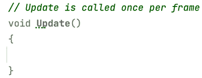

图 5.24：一个名为`Update`的函数，它将在每一帧执行

你会注意到在 `void Update()` 行上方的（通常是）绿色文本行（取决于 IDE）——这被称为 **注释**。这些基本上被编译器忽略。它们只是你可以留下的笔记，必须始终以 `//` 开头，以防止 Unity 尝试执行它们并失败。我们将使用这个功能来暂时禁用代码行。

现在，为了测试 `Update` 方法是否真正起作用，让我们添加一个始终要执行的指令。没有比 `print` 更好的测试函数了。这是一个简单的指令，告诉 Unity 将消息打印到控制台，开发者可以在那里看到各种消息，以检查一切是否正常工作。用户永远不会看到这些消息。它们类似于开发者有时在游戏中出现问题时向你请求的经典日志文件。

为了使用函数测试 C# 中的事件，请按照以下步骤操作：

1.  通过双击脚本来打开它。

1.  为了测试，在事件函数中添加 `print(“test”);`。在下面的屏幕截图中，你可以看到一个在 `Update` 事件中如何做到这一点的示例。请记住，指令必须 *完全正确*，包括正确的大小写、空格和引号符号：

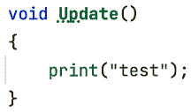

图 5.25：在所有帧中打印消息

1.  保存文件，进入 Unity，并玩游戏。

    在从 IDE 切换回 Unity 之前，请务必保存文件。这是 Unity 知道你的文件已更改的唯一方式。一些 IDE，如 Rider，会自动为你保存文件，但我不建议你在大型项目中使用自动保存。你不想意外地重新编译未完成的工作——在包含大量脚本的项目中，这会花费很长时间。

1.  查找 **控制台** 选项卡并选择它。这通常位于 **项目视图** 选项卡旁边。如果你找不到它，请转到 **窗口 | 通用 | 控制台**，或按 *Ctrl* + *Shift* + *C*（在 macOS 上为 *Command* + *Shift* + *C*）。

1.  你将在 **控制台** 选项卡上的每一帧中看到一个新打印的消息，内容为 `“test”`。如果你没有看到这个消息，请记住在玩游戏之前保存脚本文件。

1.  你可能会看到一个单独的消息，但右侧的数字在增加；这意味着相同的消息出现了多次。尝试点击控制台选项卡的 **折叠** 按钮来改变这种行为。

1.  让我们也测试一下 `Start` 函数。向其中添加 `print(“test Start”);`，保存文件，并玩游戏。完整的脚本应如下所示：

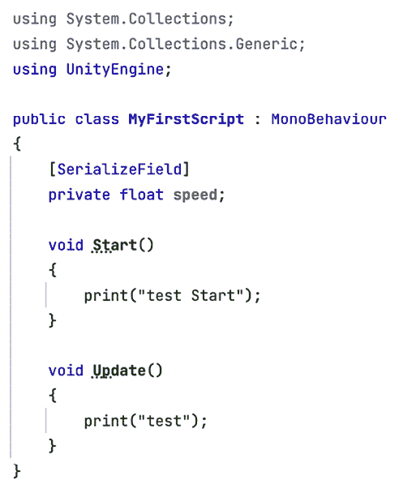

图 5.26：测试 Start 和 Update 函数的脚本

如果您现在检查控制台并滚动到最上方，您将看到一个单独的 `“test Start”` 消息和随后的许多 `“test”` 消息。正如您所猜到的，`Start` 事件告诉您 GameObject 已创建，并允许您执行在其生命周期开始时只需执行一次的代码。

对于 `void Update()` 语法，我们将告诉 Unity，此行以下括号内的任何内容都是一个将在所有帧中执行的功能。将 `print` 指令*放在* `Update` 括号内（类括号内的括号）内非常重要。此外，`print` 函数期望在其括号内接收一个要打印的值，称为参数或参数。在我们的例子中，我们想要打印简单的文本，在 C# 中，它必须用引号括起来。最后，所有 `Update` 或 `Start` 等函数中的指令*必须*以分号结束。

在这里，我挑战您尝试添加另一个名为 `OnDestroy` 的事件，使用 `print` 来发现它何时执行。一个小建议是播放并停止游戏，查看控制台底部来测试这个。

对于高级用户，如果你的 IDE 允许，你还可以使用断点。**断点**允许你在执行特定代码行之前完全冻结 Unity，以查看我们的字段数据随时间的变化并检测错误。在这里，我将向您展示在 Rider 中使用断点的步骤，但 Visual Studio 版本应该类似：

1.  如果尚未安装，请安装属于您的 IDE 的 Unity 包。检查**包管理器**中的**JetBrains Rider 编辑器**包。在 Visual Studio 的情况下，安装**Visual Studio 编辑器**包。

1.  点击您想要添加断点的行的左侧垂直栏：

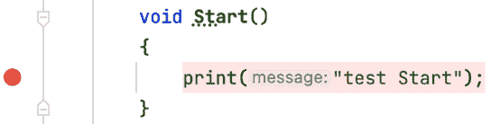

图 5.27：打印指令中的断点

1.  前往**运行 | 连接到 Unity 进程**。如果您正在使用 Visual Studio，请前往**调试 | 连接到 Unity 调试器**：

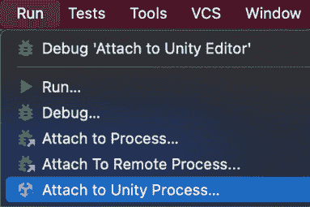

图 5.28：用 Unity 进程攻击我们的 IDE

1.  从列表中，查找您想要测试的特定 Unity 实例。如果存在其他打开的编辑器或正在运行的调试构建，列表将显示它们。

1.  如果这不起作用，请检查编辑器是否处于调试模式，通过查看编辑器右下角的错误图标。如果错误图标看起来是蓝色的带有复选框，那么它是正常的，但如果它看起来是灰色的并且被划掉，请点击它并点击**切换到调试模式**：

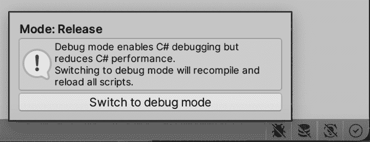

图 5.29：从发布模式切换到调试模式

停止调试过程不会关闭 Unity。它只会将 IDE 从编辑器中分离出来。请记住，您可以在 Visual Studio（以及其他 IDE 中的等效按钮）中点击**继续**按钮，继续游戏执行而不分离调试器。

现在，让我们探索使用事件和指令的视觉脚本等效方法。

## 视觉脚本中的事件和指令

在可视化脚本中，事件和指令的概念保持不变，但当然，这将在图中使用节点来完成。记住，一个节点代表图中的一个指令，我们可以将它们连接起来以链式执行每个指令的效果。为了在我们的图中添加事件和打印指令，请执行以下操作：

1.  打开可视化脚本图（双击可视化脚本资产）。

1.  右键单击默认创建的**On Start**和**On Update**节点，然后单击**删除**。即使这些事件是我们需要的，我也想让你看到如何从头创建它们：

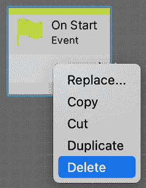

图 5.30：删除节点

1.  在图的任何空白空间中右键单击，并在**搜索**框中输入`start`。第一次可能需要一些时间。

1.  在左侧带有绿色复选框的列表中选择**On Start**元素。在这种情况下，我知道这是一个事件，因为我了解它，但通常，你会因为它没有输入引脚而将其识别为事件（更多内容将在下一步中介绍）：

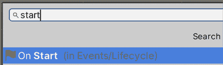

图 5.31：搜索 On Start 事件节点

1.  拖动事件节点右侧的白色箭头，也称为输出流引脚，并在任何空白空间中释放鼠标按钮。

1.  在**搜索**框中搜索`print`节点，并选择显示为**Mono Behaviour:Print**的节点。这意味着当**On Start**事件发生时，连接的节点将被执行——在这种情况下，**打印**。这就是我们开始将指令链式连接到事件的方式：

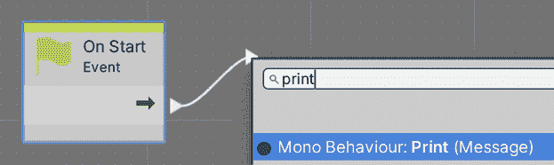

图 5.32：创建与事件连接的打印节点

1.  拖动**print**节点**Message**输入引脚左侧的空圆圈，并在任何空白空间中释放它。这个引脚上有一个圆圈标记，表示它是一个参数引脚，包含在执行引脚时将使用的数据。带有绿色箭头的流引脚代表节点执行的顺序。

1.  选择**字符串字面量**选项，这将创建一个节点，使我们能够指定要打印的消息：

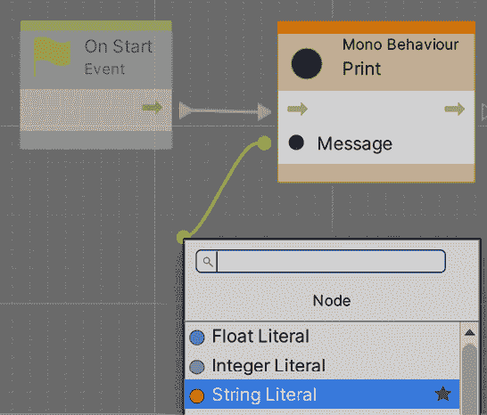

图 5.33：创建字符串字面量节点

1.  在空白白色框中，写下要打印的消息：

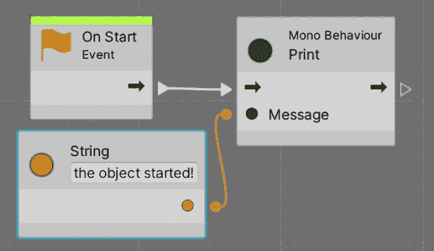

图 5.34：指定要打印的消息

1.  玩游戏，并查看消息在控制台中打印出来。确保场景中只有可视化脚本版本，以避免将控制台中的消息与 C#版本混淆。你还可以在可视化脚本中使用不同的消息文本，以确保哪些是真正执行的。

现在我们有了之前用 C#编写的相同行为，但现在使用 Unity 中的可视脚本工具。您可以通过将**Print**节点的输出流引脚（Output Flow Pin）拖到右边来将更多动作链接到**On Start**，但我们将稍后进行。现在我们的脚本正在做些事情，让我们让指令使用我们创建的字段，以便脚本使用它们的配置。

## 在指令中使用字段

我们已经创建了字段来配置组件的行为，但到目前为止我们还没有使用它们。我们将在下一章创建有意义的组件，但我们会经常需要使用我们创建的字段来改变对象的行为。到目前为止，我们还没有真正使用我们创建的`speed`字段。然而，按照测试代码是否工作（也称为调试）的想法，我们可以学习如何使用函数中的字段数据来测试值是否为预期的，根据字段值在控制台中的`print`输出进行更改。

在我们当前的 C#脚本中，我们的`speed`值在运行时不会改变。然而，作为一个例子，如果您正在创建一个带有护盾伤害吸收的生命系统，并且想要测试减少的伤害计算是否正常工作，您可能想要将计算值打印到控制台并检查它们是否正确。

这里的想法是将`print`函数内部的固定信息替换为一个字段。当您这样做时，`print`将在控制台中显示字段的值。所以如果您在`speed`中设置值为`5`并打印它，您将在控制台中看到许多显示`5`的消息，`print`函数的输出由字段控制。为了测试这一点，您在`Update`函数中的`print`消息应该如下所示：

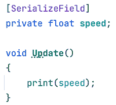

图 5.35：使用字段作为 print 函数参数

如您所见，我们只是将字段的名称不加引号地放入。如果您使用引号，则会打印出``speed``信息。在其他场景中，您可以使用这个`speed`值在某个移动函数中控制移动速度，或者您也许可以创建一个名为`“fireRate”`的字段来控制子弹之间的冷却时间（字段使用**驼峰命名法**而不是 Pascal 命名法，首字母小写）：

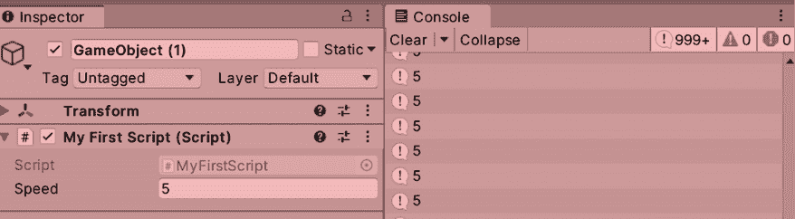

图 5.36：打印当前速度

现在，为了使可视脚本图打印出我们在**变量**组件中创建的**speed**变量的值，让我们做以下操作：

1.  打开可视脚本图资产（双击它）。

1.  在左侧的面板中，选择**对象**选项卡以显示对象拥有的所有变量——基本上是我们之前在**变量**组件中定义的变量。

1.  将**速度**变量拖动到变量框左侧的两条线上的任何空白区域。这将创建一个表示变量的**获取变量**节点。

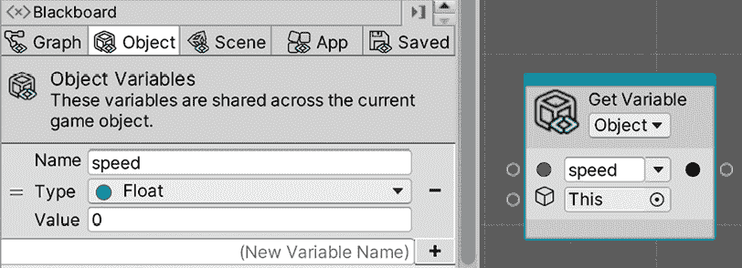

图 5.37：将变量拖动到图中以供节点使用

1.  将**获取变量**节点右侧的空圆圈拖动到**打印**节点**消息**输入引脚左侧的圆圈。这将替换之前连接到**字符串文字**节点的连接。此节点没有**输入**或**输出**流节点（绿色箭头节点），因为它们是仅提供数据给其他节点的数据节点。在这种情况下，当**打印**需要执行时，它将执行**获取变量**以获取要读取的文本：

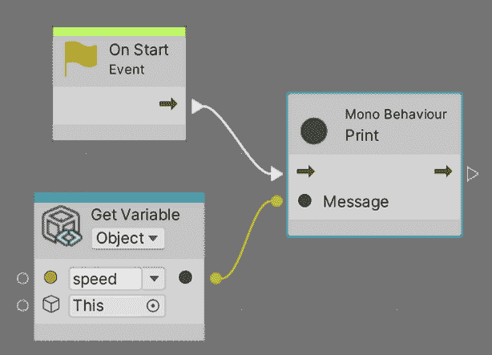

图 5.38：将速度变量连接到打印节点

1.  右键单击**字符串文字**节点并删除它。

1.  播放游戏并观察。

所有这些，我们现在有了开始创建实际组件所需的工具。在继续之前，让我们回顾一下你可能会在第一次用 C#编写脚本时遇到的常见错误。

# 常见的 C#脚本错误

视觉脚本脚本以减少错误的方式准备，不允许你编写像 C#脚本那样的错误语法。如果你是一位经验丰富的程序员，我敢打赌你对它们非常熟悉，但让我们回顾一下当你开始使用 C#脚本时会让你浪费很多时间的常见错误。其中大多数是由于没有*完全*复制显示的代码造成的。如果你在代码中有错误，Unity 将在控制台中显示红色消息，并且不允许你运行游戏，即使你没有使用脚本。所以永远不要留下未完成的事情。

让我们从经典的错误开始，一个缺少分号，这导致了许多程序员的梗和笑话。所有字段和函数（如`print`）内部的大多数指令在调用时都需要在末尾有一个分号。如果你不添加分号，Unity 将在控制台中显示错误，如*图 5.39*中的截图所示。

你还会注意到这也有一个不良代码的例子，其中 IDE 显示红色图标，表明该位置有问题：

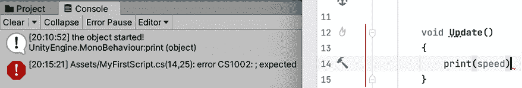

图 5.39：由 IDE 和 Unity 控制台标记的打印行错误

你会注意到错误显示了确切的脚本（`MyFirstScript.cs`）、确切的代码行（在这种情况下是`14`），以及通常一个描述性的消息——在这种情况下是`;expected`——作为指定指令在那里结束的方式，以便编译器可以处理下一个指令作为单独的一个。你可以简单地双击错误，Unity 将打开 IDE，突出显示有问题的行。你甚至可以点击堆栈中的链接跳转到你想要的堆栈行。

我已经提到为什么对指令的每个字母使用确切的缩写很重要。然而，根据我教授初学者的经验，我需要更强调这个特定的方面。

这种情况可能发生的第一个场景是在指令中。在下面的屏幕截图中，你可以看到一个写得不好的 `print` 函数的样子——即控制台将显示的错误以及 IDE 将建议有错误。首先，在 Rider 的情况下，指令被标记为红色，表示指令不被识别（在 Visual Studio 中，它将显示一条红色横线）。然后，错误信息说 `Print` 在当前上下文中不存在，这意味着 Unity（或实际上 C#）不识别任何名为 `Print` 的指令。在另一种类型的脚本中，大写的 `Print` 可能是有效的，但在常规组件中则不是，这就是为什么存在“**在当前上下文中**”的说明：

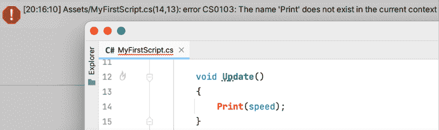

图 5.40：编写指令错误时的错误信息

现在，如果你使用错误的缩写编写一个事件，情况会更糟。你可以创建名为 `Start` 和 `Update` 的函数，为其他目的使用任何你想要的名称。编写 `update` 或 `start` 是完全有效的，因为 C# 会认为你打算将这些函数用作常规函数，而不是事件。所以，不会显示错误，你的代码将无法正常工作。尝试用 `update` 代替 `Update` 看看会发生什么：

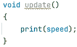

图 5.41：更新函数中错误的缩写会导致函数编译但不会执行

另一个错误是将指令放在函数括号之外，例如在类的括号内或括号外。这样做将不会给函数任何关于何时需要执行提示。所以，在 `Event` 函数之外的 `print` 函数是没有意义的，它将显示类似于 *图 5.42* 和 *5.43* 中的错误。

这次，错误并不非常描述性。C# 期望你创建一个函数或字段——一种可以直接放在类中的结构：

图 5.42：指令或函数调用位置错误

最后，另一个经典的错误是忘记关闭未闭合的括号。如果你不关闭一个括号，C# 将不知道函数在哪里结束，另一个函数在哪里开始，或者类函数在哪里结束。这听起来可能有些多余，但 C# 需要这一点来定义得完美。在下面的屏幕截图中，你可以看到这会是什么样子：

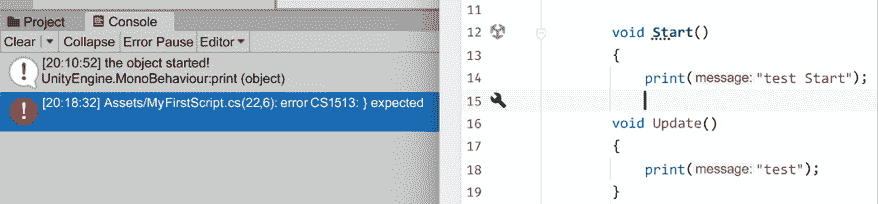

图 5.43：缺少闭合括号

在寻找行尾缺失的分号上浪费了太多时间。起初，试图找出代码中哪里出错了非常令人沮丧，但与此同时，找到解决方案并让一切恢复正常工作则非常令人满意。这种挫折与满足的循环仍然会发生在我的身上，也许是因为更复杂的问题，但这些都是成为一名开发者的一部分。你越早接受它，你就能越快看到进步。

这个问题有点难以捕捉，因为代码中的错误显示在实际错误之后。这是由于 C#允许你在函数内部放置函数（不常用），因此 C#会在稍后检测到错误，要求你添加一个闭合括号。然而，由于我们不希望将`Update`放在`Start`内部，我们需要在`Start`的末尾事先修复错误。错误信息将在控制台中描述性显示，但同样，除非你 100%确定位置正确，否则不要按照消息建议的位置放置闭合括号。

你可能会遇到很多错误，但它们都是一样的。IDE 会给你一个提示，控制台会显示一条消息；随着时间的推移，你会学会如何解决它们。只需保持耐心，因为每个程序员都会经历这个过程。还有其他类型的错误，例如运行时错误，代码可以编译但在执行时由于某些配置错误而失败，或者最糟糕的是，逻辑错误，你的代码可以编译并执行而不出现错误，但并不执行你想要的功能。

# 摘要

在本章中，我们探讨了你在创建脚本时将使用的的基本概念。我们讨论了脚本资产的概念以及 C#脚本必须继承自`MonoBehaviour`才能被 Unity 接受以创建我们自己的脚本。我们还看到了如何混合事件和指令来为对象添加行为，以及如何在指令中使用字段来自定义它们的功能。所有这些都是在使用 C#和可视化脚本的同时完成的。

我们刚刚探讨了脚本的基础知识，以确保每个人都处于同一水平线上。然而，从现在开始，我们将假设你已经在某种编程语言中具备基本的编码经验，并且知道如何使用诸如`if`、`for`、`array`等结构。如果不是这样，你仍然可以阅读这本书，并尝试使用 C#入门书籍来补充你不理解的部分，正如你需要的那样。

在下一章中，我们将开始看到如何使用我们所学到的知识来创建移动和生成脚本。

# 在 Discord 上了解更多信息

与其他用户、Unity 游戏开发专家以及作者本人一起阅读这本书。提出问题，为其他读者提供解决方案，通过“问我任何问题”的环节与作者聊天，等等。扫描二维码或访问链接加入社区：

[`packt.link/unitydev`](https://packt.link/unitydev)

