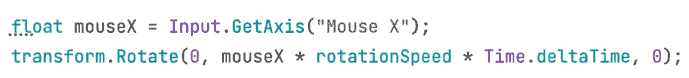

# 动态运动：实现移动和生成

在上一章中，我们学习了脚本的基础知识，所以现在，让我们为我们的游戏创建第一个脚本。我们将看到如何通过脚本使用`Transform`组件来移动物体，这将应用于玩家通过键盘按键的移动、子弹的持续移动以及其他物体的移动。此外，我们还将了解如何在游戏中创建和销毁物体，例如玩家和敌人射击的子弹以及游戏过程中将生成的敌人波（也称为敌人生成器）。这些操作可以应用于多种其他场景，因此我们将在本章中探讨其中的一些。

在本章中，我们将探讨以下脚本概念：

+   实现移动

+   实现生成

+   使用新的输入系统

我们将首先编写脚本组件来使用键盘移动我们的角色，然后我们将让我们的玩家射击子弹。需要考虑的是，我们将首先展示 C#版本，然后在每个部分展示相应的视觉脚本等效版本。

# 实现移动

几乎游戏中每个物体都会以某种方式移动：玩家角色通过键盘操作，敌人通过人工智能，子弹简单地向前移动，等等。在 Unity 中，有几种移动物体的方法，因此我们将从最简单的一种开始——那就是使用`Transform`组件。

在本节中，我们将探讨以下运动概念：

+   通过`Transform`移动物体

+   使用输入

+   理解 Delta Time

首先，我们将探讨如何在脚本中访问`Transform`组件以驱动玩家移动，稍后根据玩家的键盘输入应用移动。最后，我们将探讨*delta time*的概念，以确保在每台计算机上移动速度的一致性。我们将开始学习`Transform` API 以制作一个简单的移动脚本。

## 通过 Transform 移动物体

`Transform`是包含物体平移、旋转和缩放的组件，因此每个运动系统，如物理或路径查找，都会影响此组件。有时，我们想要根据我们的游戏以特定方式移动物体，通过创建自己的脚本来实现，该脚本将处理我们需要的移动计算并修改`Transform`以应用它们。

这里适用的一个概念是组件可以改变其他组件。在 Unity 中编码的主要方式是创建与其他组件交互的组件。在这里，想法是创建一个可以访问另一个组件并告诉它做某事的组件——在这种情况下，就是移动。要创建一个告诉`Transform`移动的脚本，请执行以下操作：

1.  创建并添加一个名为 `PlayerMovement` 的脚本到我们的角色中，就像我们在上一章中所做的那样。在这种情况下，它将是之前下载的动画 3D 模型，命名为 **Polyart_Mesh**（从 **项目** 视图中拖动 3D 资产到场景中）。记住在创建后，将脚本移动到 **脚本** 文件夹：

图 6.1：在角色中创建 PlayerMovement 脚本

1.  双击创建的脚本资产以打开 IDE 并编辑代码。

1.  角色正在移动，并且这种移动会应用到每一帧。因此，这个脚本将只使用 `Update` 函数或方法，我们可以移除 `Start`（移除未使用的函数是一种良好的实践）：

图 6.2：仅包含 Update 事件函数的组件

1.  要使我们的对象沿着其局部前进轴（即 *z* 轴）移动，请在 `Update` 函数中添加 `transform.Translate(0,0,1);` 这一行，如图 *图 6.3* 所示：

    每个组件都可以访问一个 `Transform` 字段（具体来说，是一个 **getter**），它是对放置该组件的 GameObject 的 `Transform` 的引用。通过这个字段，我们可以访问 `Transform` 的 `Translate` 函数，该函数将接收应用到 `x`、`y` 和 `z` 本地坐标的偏移量。

    

    图 6.3：一个简单的向前移动脚本

1.  保存文件，并玩游戏以查看移动效果。确保相机指向角色，以便正确地看到脚本的效果。为此，请记住您可以在层次结构中选择相机，并将其移动和旋转，直到角色位于视锥体内。

现在我们已经为玩家实现了简单的移动，您会注意到他们移动得太快。这是因为我们正在使用固定的速度 1 米，并且因为 `Update` 在每一帧执行，所以我们每帧移动 1 米。在一个标准的 30 **每秒帧数**（**FPS**）的游戏中，玩家会移动 30 米每秒，这太多了，但我们的计算机可能以远高于这个 FPS 运行游戏。我们可以通过添加一个 `speed` 字段并使用编辑器中设置的值而不是固定的 1 米值来控制玩家的速度。您可以在 *图 6.4* 中看到一种实现方式，但请记住我们在 *第五章* 中讨论的其他选项，*释放 C# 和视觉脚本的力量*：

图 6.4：创建速度字段并将其用作移动脚本的 z 速度

现在，如果您保存脚本以应用更改并在编辑器中设置玩家的 **速度**，您就可以玩游戏并看到结果。在我的情况下，我使用了 `0.1`，但您可能需要另一个值（关于这一点，请参阅 *理解 Delta Time* 部分）：

图 6.5：设置每帧 0.1 米的速度

现在，对于视觉脚本版本，请记住不要混合我们的脚本的 C# 和视觉脚本版本；这并不是因为它不可能，而是因为我们现在想保持事情简单。所以你可以从玩家对象中删除脚本并添加视觉脚本版本，或者你可以创建两个玩家对象并启用和禁用它们来尝试两个版本。我建议为脚本的 C# 版本创建一个项目，然后创建第二个项目来实验视觉脚本版本。

此脚本的视觉脚本图将如下所示：

图 6.6：设置每帧速度为 0.1 米

如你所见，我们在 `Player` GameObject 中添加了一个 **脚本机器**组件。然后，我们在 **脚本机器**组件中按下 **新建**按钮来创建一个名为 `PlayerMovement` 的新 **图**。我们还创建了一个名为 `speed` 的 **浮点**变量，其值为 `0.1`。在 **图**中，我们添加了 **On Update** 事件节点并将其连接到 **Transform** 的 **Translate**（**X,Y,Z**）节点，这与 C# 版本类似，将沿着对象的局部轴移动。最后，我们将 **Translate** 的 **Z** 参数引脚连接到表示我们在 GameObject 中创建的速度的 `GetVariable` 节点。如果你将此 **图**与我们在 C# 版本中使用的代码进行比较，它们基本上是相同的 **Update** 方法和 `Translate` 函数。如果你不记得如何创建此 **图**，你可以回到 *第五章*，*释放 C# 和视觉脚本的力量*，来回顾这个过程。

你会注意到玩家会自动移动。现在，让我们看看如何根据 **玩家输入**（如键盘和鼠标）来执行移动。

## 使用输入

与电子游戏中的 **NPC**（**不可玩角色**）不同，我们希望玩家的移动由用户的输入驱动，基于他们在玩游戏时按下的键、鼠标移动等。为了知道是否按下了某个键，例如 *向上* 方向键，我们可以使用 `Input.GetKey(KeyCode.W)` 行，这将返回一个布尔值，指示 `KeyCode` 枚举中指定的键是否被按下，在这种情况下是 *W*。这通常是 3D 电子游戏中键盘控制器的主要设置。我们可以将 `GetKey` 函数与一个 `If` 语句结合使用，以便在按键时执行翻译。

首先，我们按照以下步骤实现键盘移动：

1.  使用代码使前进移动仅在按下 *W* 键时执行，如下一个截图所示：

图 6.7：在按下 W 键之前条件化移动

1.  我们可以使用更多的`If`语句添加其他移动方向，使用*A*和*D*键来左右移动，如下面的截图所示。注意我们如何使用负号在需要沿相反轴方向移动时反转速度：

图 6.8：检查 W、S、A 和 D 键的压力

1.  如果你还想考虑箭头键，你可以在`if`中使用`OR`，如下面的截图所示：

图 6.9：检查 W、S、A、D 和箭头键的压力

1.  保存更改，并在**播放**模式下测试移动。

通过这些代码行，我们使用*WASD*键实现了基本的移动。需要注意的是，首先，我们还有另一种方法通过配置输入管理器将多个键映射到单个动作——这是一个可以创建动作映射的地方。其次，在撰写本文时，Unity 发布了一个比这个更可扩展的新输入系统。

目前，我们将使用这个版本，因为它足够简单，可以使我们使用 Unity 进行脚本编写的介绍更容易，但在具有复杂输入的游戏中，我们建议寻找更高级的工具。

现在，对于 Visual Scripting 版本，图将看起来像这样：

图 6.10：Visual Scripting 中的输入移动

如你所见，与 C#版本相比，图的大小显著增加，这作为了开发者为什么更喜欢编码而不是使用可视化工具的例子。当然，我们有几种方法可以将这个图分成更小的块，使其更易于阅读。此外，我需要将节点挤压在一起，以便它们在同一张图像中。

在前面的屏幕截图中，我们只能看到一个用于前后移动的示例图，但你可以很容易地根据这个图推断出横向移动所需的步骤。像往常一样，你还可以查看项目的 GitHub 仓库以查看完成的文件。

注意所有与 C#版本的相似之处；我们将`If`节点链接到**On Update**事件节点，如果第一个`If`节点条件为`true`，它将在玩家的前进方向上执行**Translate**。如果该条件为`false`，我们将**False**输出节点链接到另一个检查其他按键压力的**If**节点，然后，我们使用**Multiply (Scalar)**节点反向速度来向后移动。你可以看到像`If`这样的节点，它们有多个**Flow Output**引脚来分支代码的执行。

还要注意**GetKey (Key)**节点的使用，这是之前使用的相同**GetKey**函数的 Visual Scripting 版本。当你在**搜索**框中查看此节点时，你会看到该函数的所有版本，在这种情况下，我们选择了**GetKey(Key)**版本；接收名称（字符串）的那个版本工作方式不同，所以我们不涉及那个：

图 6.11：所有版本的 Input GetKey

我们还使用了`Or`节点将两个**GetKey (Key)**函数组合成一个条件，提供给`If`。这些条件运算符可以在**搜索**框的**逻辑**类别中找到：

图 6.12：布尔逻辑运算符

有一个要点需要强调的是**乘法**节点用于将速度变量的值乘以-1。我们需要创建一个**浮点文字**节点来表示-1 的值。然后，当然，所有程序员都会注意到一些关于我们如何使用`If`节点的`True`和`False`输出引脚的限制，但我们将稍后解决这个问题。最后，考虑到这种实现的问题是在第一次读取成功后阻止第二次输入读取；我们将在本节稍后添加旋转到我们的角色时讨论解决这个问题。

现在，让我们实现鼠标控制。在本节中，我们只会涵盖鼠标移动的旋转；我们将在下一节中实现发射子弹，*实现生成*。在鼠标移动的情况下，我们可以得到一个值，表示鼠标在水平和垂直方向上移动了多少。这个值不是一个布尔值，而是一个数字：通常称为**轴**的输入类型。轴的值将指示移动的强度，而该数字的符号将指示方向。例如，如果 Unity 的`“Mouse X”`轴的值为`0.5`，这意味着鼠标以适中的速度向右移动，但如果它说`-1`，则快速向左移动，如果没有移动，它将说`0`。游戏手柄上的摇杆也是如此；名为**水平**的轴表示常见摇杆上左摇杆的水平移动，所以如果玩家将摇杆完全向左拉，它将说`-1`。

我们可以创建自己的轴来映射其他常见的基于摇杆压力的控件，但对我们游戏来说，默认的轴就足够了。要检测鼠标移动，请按照以下步骤操作：

1.  在`Update`函数内部，在移动`if`语句旁边使用`Input.GetAxis`函数，如图下截图所示，以存储这一帧鼠标移动的值：

图 6.13：获取鼠标的水平移动

1.  使用`transform.Rotate`函数来旋转角色。这个函数接收 x、y 和 z 轴上要旋转的度数。在这种情况下，我们需要水平旋转，所以我们将使用鼠标移动值作为 y 轴旋转，如图下截图所示：

图 6.14：根据鼠标移动水平旋转对象

1.  如果你保存并测试这个，你会注意到角色会旋转，但速度非常快或非常慢，这取决于你的电脑。记住，这种类型的值需要可配置，所以让我们在编辑器中创建一个`rotationSpeed`字段来配置玩家的速度：

图 6.15：速度和旋转速度字段

1.  现在，我们需要将鼠标移动值乘以速度，因此，根据`rotationSpeed`，我们可以增加或减少旋转量。例如，如果我们设置旋转速度为`0.5`，将这个值乘以鼠标移动将使对象以之前速度的一半旋转，如下面的截图所示：

图 6.16：将鼠标移动乘以旋转速度

1.  保存代码，然后返回编辑器设置旋转速度值。如果不这样做，对象将不会旋转，因为浮点类型字段的默认值是`0`：

图 6.17：设置旋转速度

实现旋转的 Visual Scripting 添加将看起来像这样：

图 6.18：在 Visual Scripting 中旋转

这里要注意的第一件事是**Sequence**节点的使用。一个输出引脚只能附加到另一个节点，但在这个情况下，**On Update**需要做两件不同的事情：旋转和移动，每件都是独立的。**Sequence**是一个节点，它将依次执行所有输出引脚，而不考虑每个节点的结果。您可以在**Steps**输入框中指定输出引脚的数量；在这个例子中，两个就足够了。

在输出引脚`0`，第一个引脚，我们添加了旋转代码，这相当直观，因为它基本上与移动代码相同，只是节点略有不同（**Rotate**（**X, Y, Z**）和**GetAxis**）。然后，为了输出引脚 1，我们附加了检查移动输入的`If`——这是我们在本节开头所做的。这将导致首先执行旋转，然后是移动。

关于我们之前提到的限制，基本上是这样的事实：我们不能同时执行**向前**和**向后**移动，因为如果按下向前移动键，第一个`If`将是真的。由于向后移动键的检查是在假输出引脚中进行的，所以在这种情况下它们不会被检查。当然，作为我们的第一个移动脚本，这可能已经足够了，但考虑侧向移动。如果我们继续使用`True`和`False`输出引脚的`If`链接，我们将面临只能单向移动的场景。因此，我们不能组合例如`Forward`和`Right`来斜向移动。

解决这个问题的简单方法是将`If`节点按顺序放置而不是链接它们，这样就可以检查所有的`If`节点，就像我们在原始 C#中做的那样。您可以在下一张图片中看到这个示例：

图 6.19：`If`的顺序

在这里需要考虑的是，可以通过右键单击连接`If`节点和任何类型节点的线条两端的小圆点来移除这些节点的连接。

制作基本的输入脚本通常很容易，但最难的是制作直观且吸引人的输入。除了遵守用户快速适应你的游戏的标准，比如用空格键或游戏手柄上的 A 按钮进行跳跃，我建议你尝试控制的全表达性。这将使我们更好地理解何时使用拖放、在按住键时蓄力打击并在释放时执行打击，或使用扳机来控制渐进式事物，如汽车的加速/制动等感觉自然。当谈到 AR/VR 体验时，这甚至更有趣，因为可能性是无限的。

现在我们已经完成了我们的移动脚本，我们需要通过探索 Delta Time 的概念来对其进行细化，以确保它在每台机器上都能正常工作。

## 理解 Delta Time

Unity 的**Update**循环以电脑能运行的最快速度执行。虽然你可以在 Unity 中设置所需的帧率，但实现它完全取决于你电脑的能力，这受到各种因素的影响，而不仅仅是硬件。这意味着你无法始终保证一致的 FPS。你必须编写你的脚本以处理每个可能的场景。我们当前的脚本以每帧一定的速度移动，这里的*每帧*部分很重要。

我们已经将移动速度设置为 0.1，所以如果我的电脑以 120 FPS 运行游戏，玩家每秒将移动 12 米。现在，在一个游戏以 60 FPS 运行的电脑上会发生什么呢？正如你所猜想的，它将只移动 6 米每秒，这使得我们的游戏在不同电脑上表现出不一致的行为。这就是 Delta Time 发挥作用的时候。

**Delta Time**是一个告诉我们自上一帧以来过去了多少时间的值。这个时间很大程度上取决于我们的游戏图形、实体数量、物理体、音频以及无数方面，这些都会决定你的电脑可以多快地处理一帧。例如，如果你的游戏以 10 FPS 运行，这意味着在一秒钟内，你的电脑可以处理`Update`循环 10 次，这意味着每个循环大约需要`0.1`秒；在帧中，Delta Time 将提供这个值。

在下面的图中，你可以看到四个帧处理不同时间的示例，这在现实生活中可能会发生：

图 6.20：游戏中不同帧的 Delta Time 值变化

在这里，我们需要编写代码以改变移动的 *每帧* 部分，变为 *每秒*；我们需要在不同计算机上保持每秒一致的移动。一种方法是按比例移动到 Delta Time；Delta Time 值越高，帧越长，移动应该越远以匹配自上次更新以来经过的真实时间。我们可以将 `speed` 字段的当前值视为 `0.1` 米每秒；我们的 Delta Time 表示 `0.5` 意味着已经过去了半秒，所以我们应该移动一半的速度，`0.05`。

经过两帧一秒后，帧移动的总和（2 x 0.05）与目标速度 `0.1` 匹配。Delta Time 可以解释为已经过去的一秒的百分比。

要让 Delta Time 影响我们的移动，我们只需在每一帧将我们的速度乘以 Delta Time，因为每一帧都可能不同。所以让我们这样做：

1.  我们使用 `Time.deltaTime` 访问 Delta Time。我们可以通过在每次 `Translate` 中乘以 Delta Time 来开始影响移动：

图 6.21：将速度乘以 Delta Time

1.  我们可以通过链式鼠标和速度乘法来对旋转速度做同样的事情：

图 6.22：将 Delta Time 应用到旋转代码中

如果你保存并玩这个游戏，你会注意到移动速度会比之前慢。这是因为现在 `0.1` 是每秒的移动量，意味着每秒 `10` 厘米，这相当慢；试着提高这些值。在我的情况下，速度是 `10`，旋转速度是 `180`，但旋转速度取决于玩家的偏好灵敏度，这可以配置，但让我们留到下次再说。

旋转的视觉脚本更改将看起来像这样：

图 6.23：将 Delta Time 应用到旋转视觉脚本

对于移动，你可以很容易地从这个例子中推断出来，或者查看 GitHub 上的项目。我们只是链式连接了另一个 `Multiply` 节点与 `Get Delta Time`。

我们刚刚学习了如何将 Unity 的输入系统与基本的 `Transform` 移动功能混合，这告诉我们键盘、鼠标和其他输入设备的状态。这样，我们可以开始让我们的游戏感觉更加动态。

现在我们已经完成了玩家的移动，让我们讨论如何使用 `Instantiate` 函数让玩家射击子弹。

# 实现生成

我们在编辑器中创建了大量的对象来定义我们的关卡，但一旦游戏开始，根据玩家的操作，必须创建新的对象以更好地适应由玩家交互生成的场景。敌人可能过一段时间后出现，或者必须根据玩家的输入创建子弹；即使敌人死亡，也有可能出现一个增益物品。这意味着我们无法事先创建所有必要的对象，而应该动态地创建它们，这通过脚本完成。

在本节中，我们将检查以下生成概念：

+   生成对象

+   定时动作

+   销毁对象

我们将开始看到 Unity 的`Instantiate`函数，它允许我们在运行时创建 Prefab 的实例，例如在按下一个键时，或者以基于时间的模式，例如让我们的敌人每隔一段时间发射子弹。此外，我们还将学习如何销毁这些对象，以防止我们的场景因为处理过多的对象而开始表现不佳。

让我们从如何根据玩家的输入射击子弹开始。

## 生成对象

要在运行时或**播放**模式下生成对象，我们需要对象的描述、它拥有的组件、其设置以及可能的子对象。你可能在这里想到了 Prefab，你是对的；我们将使用一个指令来告诉 Unity 通过脚本创建 Prefab 的实例。请记住，Prefab 的实例是基于 Prefab 创建的对象——基本上是原始对象的克隆。

我们将首先射击玩家的子弹，所以首先，让我们按照以下步骤创建子弹 Prefab：

1.  在**GameObject | 3D Object | Sphere**中创建一个球体。如果您想，可以用另一个子弹模型替换球体网格，但在此例中我们将保持球体不变。

1.  将球体重命名为`Bullet`。

1.  通过点击**项目**窗口的**+**按钮，选择**材料**选项，并将其命名为`Bullet`来创建一个材料。请记住将其放置在`Materials`文件夹内。

1.  在材料中勾选**发射**复选框，并将**发射贴图**和**基础贴图**颜色设置为红色：

图 6.24：创建具有发射颜色的红色子弹材料

1.  通过将材料拖动到球体上，将**材料**应用到**球体**上。

1.  将**缩放**设置为较小的值——在我的例子中`0.3, 0.3, 0.3`有效。

1.  创建一个名为`ForwardMovement`的脚本，使子弹以固定速度持续向前移动。您可以使用 C#和视觉脚本创建它，但为了简单起见，我们在此情况下只使用 C#。

    我建议您先自己尝试解决这个问题，并在下一步查看带有解决方案的截图，作为一个小挑战，回顾我们之前看到的运动概念。如果您不记得如何创建脚本，请参考*第五章*，*释放 C#和视觉脚本的威力*，并查看前面的部分以了解如何移动对象。

1.  下一个截图显示了脚本应该的样子：

图 6.25：一个简单的 ForwardMovement 脚本

1.  将脚本（如果尚未添加）添加到子弹上，并将速度设置为合适的值。通常，子弹比玩家快，但这取决于你想要的游戏体验。在我的情况下，`20`就足够了。通过将子弹放置在玩家附近并玩游戏来测试它：

图 6.26：在 bullet 中的 ForwardMovement 脚本

1.  将子弹`GameObject`实例拖到`Prefabs`文件夹中，创建一个**Bullet**预制件。请记住，预制件是一个资产，它描述了创建的子弹，就像创建子弹的蓝图：

图 6.27：创建预制件

1.  从场景中删除原始子弹；当玩家按下键时（如果有的话），我们将使用预制件来创建子弹。

现在我们已经有了子弹预制件，当玩家按下键时，是时候实例化它（克隆它）了。为此，请按照以下步骤操作：

1.  在玩家的`GameObject`上创建并添加一个名为`PlayerShooting`的脚本，并打开它。

1.  我们需要一种方法让脚本能够访问预制件，以便知道从可能的项目中的几十个预制件中选择哪个。我们脚本需要的所有数据，这取决于期望的游戏体验，都是以字段的形式存在的，例如之前使用的**速度**字段。因此，在这种情况下，我们需要一个`GameObject`类型的字段——一个可以引用或指向特定预制件的字段，这可以通过编辑器设置。

1.  添加字段代码将看起来像这样：

    图 6.28：预制件引用字段

    如你所猜，我们可以使用`GameObject`类型来引用不仅预制件，还可以引用其他对象。想象一下，一个敌人 AI 需要引用玩家对象来获取其位置，使用`GameObject`来连接两个对象。这里的技巧是考虑到预制件只是存在于场景外的普通`GameObject`；你无法看到它们，但它们在内存中，准备好被复制或实例化。你只能通过脚本或编辑器放置在场景中的副本或实例来看到它们，就像我们到目前为止所做的那样。

1.  在编辑器中，点击属性右侧的圆圈并选择`Bullet`预制件。另一个选项是将`Bullet`预制件直接拖到属性上。这样，我们就告诉我们的脚本要发射的子弹是那个特定的一个。请记住，拖动的是预制件而不是场景中的子弹（现在应该已经删除了）：

图 6.29：设置预制件引用以指向子弹

1.  当玩家按下左鼠标按钮时，我们将发射子弹，所以请在`Update`事件函数中放置适当的`if`语句来处理，就像下一个截图所示：

图 6.30：检测左鼠标按钮的压力

1.  你会注意到这次，我们使用了`GetKeyDown`而不是`GetKey`，前者是一种检测按键压力开始的确切帧的方法；这个`if`语句仅在那一帧执行其代码，直到按键被释放并重新按下，它才不会再次进入。这是防止子弹在每一帧生成的一种方法，但为了好玩，你可以尝试使用`GetKey`来检查它会如何表现。此外，`KeyCode.Mouse0`是鼠标左键的按钮编号，`KeyCode.Mouse1`是右键，而`KeyCode.Mouse2`是中键。

1.  使用`Instantiate`函数克隆 Prefab，将对其的引用作为第一个参数传递。这将创建一个上述 Prefab 的克隆，并将其放置在场景中：

图 6.31：实例化 Prefab

如果你保存脚本并玩游戏，你会注意到当你按下鼠标时，会生成子弹，但可能不是你期望的位置。如果你看不到它，请检查层次结构中的新对象；它会在那里。这里的问题是我们没有指定所需的生成位置，并且我们有两种方法可以设置它，我们将在下一步中看到：

1.  第一种方法是使用从`MonoBehaviour`继承的`transform.position`和`transform.rotation`字段，这将分别告诉我们我们的当前位置和旋转。我们可以将它们作为`Instantiate`函数的第二个和第三个参数传递，这样它就会理解这是我们希望子弹出现的位置。记住，设置旋转以使子弹面向与玩家相同的方向是很重要的，这样它才会以这种方式移动：

图 6.32：在当前位置和旋转中实例化 Prefab

1.  第二种方法是通过使用之前的`Instantiate`版本，但保存函数返回的引用，这将指向 Prefab 的克隆。这允许我们更改我们想要的任何内容。在这种情况下，我们需要以下三条线：第一条将实例化并捕获克隆引用，第二条将设置位置，第三条将设置旋转。我们还将使用克隆的`transform.position`字段，但这次是通过使用`=`（赋值）运算符来更改其值：

图 6.33：在特定位置实例化 Prefab 的较长版本

记住，你可以检查在*前言*中链接的项目 GitHub 仓库，以查看完整的脚本。现在，你可以保存文件的一个版本并尝试射击。

如果您尝试运行到目前为止的脚本，您应该会看到子弹在玩家的位置生成，但在我们的情况下，它可能是在地板上。这里的问题是玩家的角色枢轴就在那里，通常，每个类人角色都有枢轴在他们的脚上。我们有几种方法可以解决这个问题。最灵活的方法是创建一个 **Shoot Point**，它是玩家的一个空 GameObject 子对象，放置在我们希望子弹生成的位置。我们可以通过以下步骤使用该对象的坐标而不是玩家的坐标：

1.  在 **GameObject | Create Empty** 中创建一个空的 `GameObject`。命名为 `ShootPoint`。

1.  将其设置为玩家的 GameObject 的子对象，并将其放置在您希望子弹出现的位置，可能稍微高一点，再往前一些：

图 6.34：在角色内部放置一个空的 ShootPoint 对象

1.  与往常一样，要访问另一个对象的数据，我们需要一个对该对象的引用，例如 Prefab 引用，但这次，它需要指向我们的 `ShootPoint`。我们可以创建另一个 `GameObject` 类型字段，但这次，拖动 `ShootPoint` 而不是 Prefab。脚本和对象设置将如下所示：

图 6.35：Prefab 和 Shoot Point 字段以及它们在编辑器中的设置

1.  我们可以通过使用其 `transform.position` 字段再次访问 `ShootPoint` 的位置，如下面的截图所示：

图 6.36：在射击生成点定位子弹克隆体

**ForwardMovement** 的视觉脚本版本看起来是这样的：

图 6.37：使用视觉脚本进行 ForwardMovement

而 `PlayerShooting` 将看起来像这样：

图 6.38：在 PlayerShooting 视觉脚本中实例化

如您所见，我们添加了一个名为 **Player Shooting** 的新图的新 **Script Machine** 组件。我们还添加了一个新的变量，`bulletPrefab`，类型为 `GameObject`，并将 **Bullet** Prefab 拖动到它上面，以及一个名为 `shootPoint` 的第二个 `GameObject` 类型变量，以便引用子弹的生成位置。脚本的其他部分基本上是 C#版本的对应物，没有太大差异。

这里需要强调的是，我们如何将 `Transform GetPosition` 和 `Transform GetRotation` 节点连接到 `shootPoint` 所属的 `GetVariable` 节点；这样，我们就可以访问射击点的位置和旋转。如果您没有指定，它将使用玩家的位置和旋转，在我们的模型中，这通常是玩家的角色脚部。

你会注意到，现在使用鼠标射击和旋转出现了问题；当移动鼠标进行旋转时，指针会落在**游戏**视图之外，当你点击时，你会不小心点击到编辑器，从而失去对**游戏**视图的焦点，因此你需要再次点击**游戏**视图来恢复焦点并再次使用输入。防止这种情况的一种方法是游戏时禁用光标。为此，请按照以下步骤操作：

1.  将一个`Start`事件函数添加到我们的`玩家移动`脚本中。

1.  将以下截图中的两行代码添加到你的脚本中。第一行将使光标可见，第二行将锁定光标在屏幕中间，这样它就永远不会离开**游戏**视图。考虑后者；当你切换回主菜单或暂停菜单时，你需要重新启用光标，以便鼠标可以点击 UI 按钮：

图 6.39：禁用鼠标光标

1.  保存并测试。如果你想停止游戏，可以按*Ctrl* + *Shift* + *P*（在 Mac 上为*Command* + *Shift* + *P*）或*Esc*键来重新启用鼠标。这两个选项仅在编辑器中有效；在真实游戏中，你需要将`Cursor.visible`重置为`true`，将`Cursor.lockState`重置为`CursorLockMode.None`。

1.  视觉脚本等效的代码如下：

图 6.40：在视觉脚本中禁用鼠标光标

现在我们已经介绍了对象生成的基础知识，让我们通过结合定时器来查看一个高级示例。

## 定时动作

与生成不完全相关，但通常一起使用，定时动作是视频游戏中的常见任务。想法是安排某事在以后发生；也许我们希望子弹在一段时间后销毁以防止内存溢出，或者我们想要控制敌人的生成速率或它们应该何时生成。这正是我们将在本节中要做的，从实现**敌人波次**开始。

想法是我们希望在游戏的各个不同时刻以一定的速率生成敌人；也许我们希望在游戏开始的前 5 秒内以每秒 2 个的速率生成敌人，总共生成 10 个敌人，给玩家最多 20 秒的时间来完成它们，然后编程下一波，从第 25 秒开始。当然，这很大程度上取决于你想要的精确游戏，你可以从一个像这样的想法开始，并在测试后进行修改，以找到你想要的波次系统工作的确切方式。在我们的案例中，我们将通过实现一个简单的波次系统来应用定时。

首先，我们需要一个敌人，目前我们将简单地使用与玩家相同的 3D 模型，但添加一个`向前移动`脚本，使其简单地向前移动；在本书的后面部分，我们将为敌人添加 AI 行为。我建议你首先自己尝试创建这个预制件。在你完成之后，参考以下步骤来比较你的工作与推荐方法，并确认你是否正确完成了：

将下载的 Character FBX 模型拖到场景中创建其另一个实例，但这次命名为 `Enemy`：

1.  添加为子弹创建的 `ForwardMovement` 脚本，但这次作为 `Enemy` 使用，并暂时将其速度设置为 `10`。

1.  将 `Enemy` 游戏对象拖到 **项目** 面板中创建其 Prefab；我们稍后会需要它。请记住选择 **Prefab 变体** 以保持此 Prefab 与原始模型链接，允许对模型的任何更改自动更新 Prefab。

1.  还要记得从场景中删除原始的 `Enemy`。

    现在，为了安排动作，我们将使用 `Invoke` 函数创建计时器。它们很简单，但足以满足我们的需求。让我们按照以下步骤使用它们：

1.  在基座的一端创建一个空的游戏对象，并将其命名为 `Wave1a`。

1.  向其添加一个名为 `WaveSpawner` 的脚本。

1.  我们的生成器需要四个字段：要生成的 `Enemy` Prefab、波浪的 `startTime`、`endTime` 以及敌人的生成速率（每次生成之间应该有多少时间）。脚本和设置将类似于以下截图：

    图 6.41：波浪生成器脚本的字段

    我们将使用 `InvokeRepeating` 函数来安排一个自定义函数以周期性重复执行。您只需要调度一次重复；Unity 会记住这一点，所以不要为每一帧都做这件事。这是使用 `Start` 事件函数的一个很好的理由。函数的第一个参数是一个字符串（引号之间的文本），包含要周期性执行的另一个函数的名称，并且与 `Start` 或 `Update` 不同，您可以随意命名该函数。第二个参数是开始重复的时间——在这个例子中是我们的 `startTime` 字段。最后，第三个参数是函数的重复率——每次重复之间需要经过多少时间——这就是 `spawnRate` 字段。

    您可以在下一张截图和自定义的 `Spawn` 函数中找到如何调用该函数：

    

    图 6.42：安排重复的 Spawn 函数

1.  在 `Spawn` 函数内部，我们可以使用 `Instantiate` 函数添加生成代码。想法是在一定频率下调用此函数，每次调用生成一个敌人。这次，生成位置将与生成器相同，所以请小心放置：

    图 6.43：在 Spawn 函数中实例化

    如果你通过将预制件的`startTime`和`spawnRate`字段设置为大于 0 的值来测试这个脚本，你会注意到敌人会开始生成但永远不会停止，你可以看到我们还没有使用`endTime`字段。想法是调用`CancelInvoke`函数，这是唯一一个可以取消我们做出的所有`InvokeRepeating`调用的函数，但过一段时间后。我们将使用`Invoke`函数延迟执行`CancelInvoke`，它的工作方式与`InvokeRepeating`类似，但这个函数只执行一次。在下一个截图中，你可以看到我们如何在`Start`中添加了对`CancelInvoke`函数的`Invoke`调用，使用`endTime`字段作为执行`CancelInvoke`的时间。这将延迟执行`CancelInvoke`，取消生成预制件的第一个`InvokeRepeating`调用：

    

    图 6.44：安排生成重复，但使用 CancelInvoke 在一段时间后取消

    这次，我们使用`Invoke`来延迟调用`CancelInvoke`。我们没有创建一个自定义函数，因为`CancelInvoke`不接受任何参数。如果你需要安排一个带有参数的函数，你需要创建一个包装函数；这个函数本身没有参数，但用于调用你的目标函数（你最初打算使用的函数）并传递必要的参数。这种方法与我们处理`Spawn`函数的方式类似，其中包装函数的唯一目的是使用特定的参数调用`Instantiate`方法。

1.  现在，你可以为你的生成器保存并设置一些真实值。在我的例子中，我使用了以下截图所示的内容：

图 6.45：在游戏开始后的 5 秒内，每 0.5 秒生成一次敌人，每次生成 2 个

你应该看到敌人挨着生成，由于它们向前移动，它们将排成一行。这种行为将在我们未来章节中使用 Unity 的 AI 功能时改变。现在，视觉脚本版本将看起来像这样：

图 6.46：在视觉脚本中生成敌人

虽然我们可以在视觉脚本中使用`InvokeRepeating`方法，但在这里我们可以看到视觉方法的一些好处，因为它有时比编码更具灵活性。在这种情况下，我们在`Start`的开始处使用了`Wait For Seconds`节点，这个节点基本上会暂停流程的执行几秒钟。这将创建原始脚本中存在的初始延迟；这就是为什么我们使用了`startTime`作为`Delay`的数量。

现在，在等待之后，我们使用了一个`For`循环；在这个例子中，我们改变了脚本的概念，因为我们想要生成特定数量的敌人，而不是在设定的时间内生成。`For`循环本质上是一个经典的`For`循环，它将重复连接到`Body`输出引脚的内容，重复次数由`Last`输入引脚指定的次数。

我们将那个引脚连接到一个变量，以控制我们想要生成的敌人数量。然后，我们将`For`循环的`Body`输出引脚连接到`Instantiate`，以实例化我们的敌人，然后连接一个`Wait For Seconds`节点，在循环可以继续生成敌人之前停止流程一段时间。

有趣的是，如果你现在玩游戏，你将在控制台收到一个看起来像这样的错误：

图 6.47：使用 Wait 节点时的错误

你甚至可以回到 Graph Editor，并看到冲突的节点将以红色突出显示：

图 6.48：导致错误的节点

这里的问题是，为了让`Wait For Seconds`节点工作，你需要将`Start`事件标记为**Coroutine**。这基本上将允许事件暂停一段时间，然后稍后继续。

协程的概念存在于 C#中，但由于在 Visual Scripting 中比在 C#中更容易实现，我们决定采用这种方法。如果你想了解更多信息，请查看以下文档：[`docs.unity3d.com/Manual/Coroutines.html`](https://docs.unity3d.com/Manual/Coroutines.html)

要解决这个错误，请选择`On Start`事件节点，并在**Script Graph**编辑器的左侧的**Graph Inspector**面板中检查**Coroutine**复选框。如果你看不到它，请尝试在编辑器的左上角点击**Info**按钮（带*i*的圆圈）。

协程是一种可以被暂停并在稍后继续执行的功能，这正是`Wait`节点所做的事情。协程也存在于`MonoBehaviours`中，但现在让我们保持简单。

图 6.49：将开始标记为协程

现在我们已经讨论了时间和生成，让我们讨论时间和`Destroy`，以防止我们的子弹在内存中永远存在。

## 销毁对象

我们可以使用`Destroy`函数来销毁对象实例。想法是让子弹有一个脚本，在一段时间后安排自己的自动销毁，以防止它们永远存在。我们将通过以下步骤创建脚本：

1.  选择`Bullet`的 Prefab，并使用**Add Component** | **New Script**选项添加一个名为`Autodestroy`的脚本，就像你为其他对象所做的那样。这次，脚本将添加到 Prefab 中，并且你生成的 Prefab 的每个实例都将拥有它。

1.  你可以使用`Destroy`函数，如下一张截图所示，在`Start`中一次性销毁对象：

    图 6.50：对象开始时销毁

    `Destroy`函数期望将对象作为第一个参数，在这里，我们使用`gameObject`引用——这是一种指向放置脚本的 GameObject 的方式，以便将其销毁。如果你使用`this`指针而不是`GameObject`，我们只会销毁我们正在创建的`Autodestroy`组件。

    当然，我们不想在子弹被生成后立即销毁它，所以我们需要延迟销毁。你可能正在考虑使用`Invoke`，但与 Unity 中的大多数函数不同，`Destroy`可以接收第二个参数，即等待销毁的时间。

1.  创建一个延迟字段，将其用作`Destroy`的第二个参数，如下一个截图所示：

图 6.51：使用字段配置销毁对象的延迟

1.  将`delay`字段设置为适当的值；在我的情况下，5 就足够了。现在，通过观察它们从层次结构中被移除，检查子弹经过一段时间后是如何消失的（即被移除）。

1.  视觉脚本等效的代码如下所示：

图 6.52：在视觉脚本中销毁

关于这个版本，注意我们如何使用**组件销毁**（**Obj**和**T**）版本的`Destroy`节点，它包括延迟时间。此外，寻找`Object Pool`概念，这是一种回收对象而不是不断创建对象的方法；你将了解到有时创建和销毁对象并不那么高效。

现在，我们可以随意创建和销毁对象，这在 Unity 脚本中是非常常见的。在下一节中，我们将讨论如何修改我们迄今为止创建的脚本以支持新的 Unity 输入系统。

# 使用新的输入系统

我们一直使用**输入**类来检测被按下的按钮和轴，对于我们的简单使用，这已经足够了。然而，默认的 Unity 输入系统在扩展性方面有其局限性，无法支持新的输入硬件和映射。

在本节中，我们将探讨以下概念：

+   安装新的输入系统

+   创建输入映射

+   在脚本中使用映射

让我们开始探索如何安装新的输入系统。

## 安装新的输入系统

要开始使用新的输入系统，它需要像我们迄今为止安装的任何其他包一样安装，使用**包管理器**。这个包只是叫做**输入系统**，所以按照常规安装即可。在这种情况下，我们使用版本 1.7.0，但当你阅读这一章时，可能有一个更新的版本可用。

图 6.53：安装新的输入系统包

默认情况下，当你安装输入系统时，它将提示你启用新的输入系统，窗口如下面的图像所示。如果出现，只需点击**是**并等待 Unity 重新启动：

图 6.54：切换活动输入系统

如果由于某种原因它没有出现，另一种选择是**编辑 | 项目设置**然后**玩家 | 其他设置 | 配置**，并将**活动输入处理**属性设置为**输入系统包（新**）。

有一个名为**Both**的选项，可以同时启用旧输入系统和新输入系统，但让我们只使用一个。

图 6.55：切换活动输入系统

现在我们已经安装并设置了系统，让我们来探索如何创建所需的输入映射。

## 创建输入映射

新系统有一种直接请求游戏手柄、鼠标、键盘或我们拥有的任何其他设备（如我们之前在输入系统中所做的那样）的按钮或摇杆当前状态的方法。然而，使用这种方法将阻止我们使用系统的最佳功能之一，即输入映射。

输入映射的想法是将输入动作从物理输入中抽象出来。不是考虑空格键、游戏手柄的左侧摇杆或鼠标的右键点击，而是从动作的角度思考，比如移动、射击或跳跃。在代码中，你询问是否按下了`射击`按钮，或者`移动`轴的当前值，就像我们用鼠标轴旋转所做的那样。虽然先前的系统支持一定程度的输入映射，但新输入系统的功能更强大，配置也更简单。

| **动作** | **映射** |
| --- | --- |
| 射击 | 左鼠标按钮、左控制键和游戏手柄的 *X* 按钮 |
| 跳跃 | 空格键，游戏手柄的 *Y* 按钮 |
| 水平移动 | *A* 和 *D* 键，左右箭头，以及游戏手柄的左侧摇杆 |

表 6.01：输入映射表示例

这个想法的力量在于，实际触发这些动作的键或按钮可以在 Unity 编辑器中配置，允许任何游戏设计者更改控制整个游戏的精确键，而无需更改代码。

我们甚至可以将多个按钮映射到同一动作，即使来自不同的设备，这样我们就可以使鼠标、键盘和游戏手柄触发相同的动作，极大地简化了我们的代码。另一个好处是，用户还可以通过我们添加到游戏中的某些自定义 UI 重新绑定按键，这在 PC 游戏中非常常见。

创建输入映射的最简单方法是通过**玩家输入**组件。正如其名所示，该组件代表特定玩家的输入，使我们能够在游戏中每个玩家身上都有一个，以支持分屏多人游戏，但让我们先专注于单人游戏。将此脚本添加到我们的玩家中，将允许我们使用**创建动作**按钮创建默认的输入映射资产。这个资产，作为一个材料，可以被多个玩家使用，因此我们将对其进行修改，使其影响所有玩家（例如，通过添加`Jump`输入映射）：

图 6.56：使用玩家输入组件创建输入动作资产

在点击**创建动作**按钮并保存资产位置到保存提示后，您将看到以下屏幕：

图 6.57：默认输入映射文件

从这个资产中，我们首先需要理解的是**动作映射**部分（左侧面板）。这允许我们为不同的情况创建单独的动作映射，例如，在像《侠盗猎车手》（**GTA**）这样的游戏中，为驾驶和步行控制创建不同的动作映射。默认情况下，**玩家**和**UI**映射被创建来分离玩家控制和导航 UI 的映射。如果您再次检查**玩家输入**组件，您会看到**默认映射**属性被设置为**玩家**，这意味着我们将只关注在这个 GameObject 中控制输入映射的玩家；任何 UI 动作的按下都不会被考虑。我们可以在运行时随意切换活动映射，例如，在暂停菜单中禁用角色控制器输入，或者在车内切换到驾驶映射，使用相同的按钮，但用于其他目的。 

如果您在左侧面板中选择动作映射，您将在中间面板的**动作**列表中看到它包含的所有动作。在**玩家**的情况下，我们有**移动**、**观察**和**射击**映射，这些正是我们将在游戏中使用的输入。请注意，如果您需要使用**+**按钮，您可以添加更多映射，但现在让我们坚持使用默认的映射。当您从列表中选择任何动作时，您将在右侧显示的**动作属性**面板中看到它们的配置：

图 6.59：移动（左侧）和射击（右侧）动作配置

如您所见，有一个名为**动作类型**的属性，它将决定我们正在讨论哪种类型的输入。如果您在中间面板中选择**移动**，您会看到它是一个**值**动作类型，**控制类型**为`Vector2`，这意味着它将返回 x 轴和 y 轴的值，即水平和垂直的值——这是我们期望从任何游戏手柄的摇杆中得到的类型。在之前的系统中，我们从单独的 1D 轴中获取这些值，例如`鼠标 X`和`鼠标 Y`轴，但在这里，为了方便起见，它们被合并成一个单一变量。另一方面，**射击**动作的类型是**按钮**，它不仅能够检查其当前状态（按下或释放），还能进行诸如是否刚刚被按下或刚刚被释放的检查，这与之前系统中的`GetKey`、`GetKeyDown`和`GetKeyUp`功能相当。

现在我们已经了解了我们有哪些动作以及每种动作的类型，让我们讨论物理输入如何触发它们。您可以通过点击中间面板中每个动作左侧的箭头来查看其物理映射。让我们开始探索**移动**动作映射。

在这种情况下，我们有四个映射：

+   **左侧摇杆** [**游戏手柄**]：游戏手柄的左侧摇杆

+   **主要 2D 轴** [**XR 控制器**]：VR 控制器的摇杆

+   **摇杆** [**操纵杆**]：类似街机或甚至飞行杆的主要摇杆

+   **WASD**：通过*W*、*A*、*S*和*D*键模拟摇杆的复合输入

如果你选择其中的任何一个，你可以检查它们的配置；让我们以左摇杆和 WASD 为例进行比较：

图 6.59：左摇杆映射（左）和 WASD 键映射（右）

在**左摇杆**的情况下，你可以看到允许你选择所有可能提供`Vector2`值（x 轴和 y 轴）的硬件物理控制的**路径**属性。在**WASD**键映射的情况下，你可以看到它是一个类型为**2D 向量**的复合绑定，正如之前所述，这允许我们通过其他输入（在这种情况下是按键）来模拟 2D 轴。如果你展开中间面板中的**WASD**输入映射，你可以看到为这个 2D 轴组合的所有输入及其配置，通过选择它们来查看：

图 6.60：考虑的 WASD 复合 2D 轴的输入

在前面的例子中，它不仅映射了*W*、*A*、*S*和*D*按钮，还映射了四个键盘箭头。每个映射不仅有一个选择物理按钮的路径，还有一个**复合部分**设置，允许我们指定这个输入将拉动模拟摇杆的方向。

就这样，我们刚刚触及了这个系统所能做到的一小部分，但到目前为止，让我们保持简单，并使用这些设置。记住，在项目的根目录中创建了一个与我们的游戏同名的新资产（在我们的例子中是*SuperShooter*）。你可以随时通过双击它来重新打开这个动作映射窗口。现在让我们看看我们如何在代码中使用这些输入。

这个系统还能为我们做更多的事情。一个例子是交互，它允许我们执行诸如在按下*X*段时间内触发动作等操作。另一个例子是复合，当按下按键组合时触发动作。有关更多信息，请查看输入系统包文档：`docs.unity3d.com/Packages/com.unity.inputsystem@1.6`

## 在我们的脚本中使用映射

这个输入系统提供了几种检测输入状态的方法。**玩家输入**组件有一个**行为**属性，可以在一些可用模式之间切换。最简单的一个是称为**发送消息**的模式，这是我们将在按键按下时在代码中执行方法所使用的模式。在这个模式下，映射中的每个动作都将有自己的事件，你可以在组件底部的工具提示中看到所有这些。随着你添加映射，将出现更多。

图 6.61：默认映射的所有输入事件

想要了解更多关于其他 PlayerInput 行为模式的信息，请查看以下文档：`docs.unity3d.com/Packages/com.unity.inputsystem@1.8/manual/PlayerInput.html#notification-behaviors`

从列表中，我们需要`OnMove`、`OnLook`和`OnFire`。我们可以修改我们的`PlayerMovement`脚本以使用它们，如下面的截图所示：

图 6.62：使用新输入系统的 PlayerMovement

你首先会注意到的一个不同点是，我们不再像以前那样在`Update`方法中请求输入状态。相反，我们监听`OnMove`和`OnLook`事件，这些事件为我们提供了一个包含那些轴当前状态的`InputValue`参数。想法是，每当这些轴的值发生变化时，这些事件就会执行，如果值没有变化，比如当玩家一直将摇杆推到最右边时，它们就不会执行。这就是为什么我们需要在`movementValue`和`lookValue`变量中存储当前值——以便在`Update`方法中稍后使用轴的最新值，并在每一帧中应用移动。将这些视为私有，意味着它们不会出现在编辑器中，但对我们来说这没问题。此外，注意我们在文件顶部添加了`using UnityEngine.InputSystem`行，以启用脚本中新的输入系统的使用。

在这个版本的`PlayerMovement`脚本中，我们使用了与鼠标相同的轴输入类型，但这次也用于移动，而之前的版本使用的是按钮。这通常是首选选项，所以我们将坚持使用这个版本。观察我们如何使用单个`transform.Translate`来移动；我们需要使用`movementValue`的 x 轴来移动玩家的 x 轴，但我们使用`movementValue`的 y 轴来移动玩家的 z 轴。我们不希望玩家垂直移动，这就是为什么我们需要以这种方式拆分轴。

`InputValue`参数具有`Get<Vector2>()`方法，它将给出两个轴的当前值，前提是`Vector2`是一个包含 x 和 y 属性的变量。然后，我们根据情况将向量乘以移动或旋转速度。你会注意到在轴事件中我们没有乘以`Time.deltaTime`，但在`Update`中我们这样做。这是因为`Time.deltaTime`可以在帧之间变化，所以考虑我们上次移动摇杆时的`Time.deltaTime`来存储移动值对我们来说将没有用。此外，注意`movementValue`是一个`Vector2`，仅仅是 x 和 y 轴的组合，而`lookValue`是一个简单的浮点数。我们这样做是因为我们将只通过跟随鼠标的横向移动来旋转我们的角色；我们不希望它上下旋转。检查我们提取`value.Get<Vector2>().x`，重点在于`.x`部分，我们只提取轴的横向部分用于计算。

关于`PlayerShooting`组件，我们需要将其更改为这样：

图 6.63：使用新输入系统的 PlayerShooting 脚本

这种情况比较简单，因为我们不需要为每一帧执行射击行为；我们只需要在输入被按下时执行某些操作，这正是`OnFire`事件将被执行的时刻。如果你还需要检测键何时被释放，你可以添加`InputValue`参数，就像我们在`OnMove`和`OnLook`中做的那样，并查看`isPressed`属性：

图 6.64：获取按钮的状态

关于我们脚本的 Visual Script Machine 版本，首先，你需要通过转到**编辑 | 项目设置 | 视觉脚本**并点击**重新生成节点**按钮来刷新**视觉脚本节点库**。如果你不这样做，你将看不到新的输入系统节点：

图 6.65：重新生成支持新输入系统的视觉脚本节点

现在，`PlayerShooting`视觉脚本应该看起来像这样：

图 6.66：使用新输入系统实例化子弹

新的**输入系统事件按钮**节点允许我们检测动作按钮何时被按下，并相应地做出反应。你可以在**输入动作**参数中选择特定的动作，你甚至可以使用节点标题下面的选项使节点对按钮的压力、释放或保持状态做出反应。存在一个错误，即**输入动作**属性可能不会显示任何选项；在这种情况下，尝试在图中重新添加和删除节点，并确保你添加了`ScriptMachine`组件到具有`PlayerInput`组件的同一 GameObject。此外，请确保你在层次结构中选择了 Player GameObject。

关于移动，可以这样实现：

图 6.67：使用新的输入系统移动

在这个例子中，我们使用了 **On Input System Event Vector2** 节点。这次，我们使用了 `OnHold` 模式，这意味着与 C# 版本不同，它不会仅在轴变化时执行，而是在轴被按下的所有帧都像 `Update` 一样执行；然而，这只有在用户按下摇杆时才会执行。节点的输出引脚是 `Vector2` 值，因此我们将其乘以 `speed` 变量（在玩家的 `Variables` 组件中声明）和 `DeltaTime`。最后，我们使用 `Vector2 GetX` 和 `Vector2 GetY` 节点在 x 和 z 轴上平移。由于与之前使用的节点（`Vector2` 而不是单个浮点数）的返回类型不同，您可能会在重新连接新的 **Input System** 节点时遇到麻烦。我建议删除此图中的所有节点并重新创建它们，以确保一切正常。这样，我们使我们的脚本能够对 Unity 新输入系统的输入消息做出反应。

# 摘要

在本章中，我们创建了第一个真正的脚本，这些脚本提供了有用的行为。我们讨论了如何根据输入移动 GameObject 以及通过脚本实例化 Prefabs，根据游戏情况随意创建对象。我们还看到了如何安排动作——在这种情况下，生成——但这可以用来安排任何事物。我们看到了如何销毁创建的对象以避免对象数量增加到无法管理的水平。最后，我们探索了新的输入系统，以提供最大的灵活性来自定义游戏的输入。我们将在本书的后面部分使用这些动作来创建其他类型的对象，例如声音和效果。

现在，您能够创建任何类型的移动或生成逻辑，您的对象将需要这些逻辑，并且您可以在需要时确保这些对象被销毁。您可能会认为所有游戏都以相同的方式移动和创建射击系统，尽管它们是相似的，但能够创建自己的移动和射击脚本允许您自定义游戏中的这些方面，使其按您的意图行事，创造出您所寻找的精确体验。

在下一章中，我们将讨论如何检测碰撞以防止玩家和子弹穿过墙壁以及更多内容。

# 在 Discord 上了解更多信息

与其他用户、Unity 游戏开发专家和作者本人一起阅读此书。提出问题，为其他读者提供解决方案，通过 Ask Me Anything 会话与作者聊天等等。扫描二维码或访问链接加入社区：

[`packt.link/unitydev`](https://packt.link/unitydev)

