# 碰撞与健康：准确检测碰撞

随着游戏试图模拟现实世界的表现，模拟的一个重要方面是物理，它决定了物体如何移动以及它们如何相互碰撞，例如玩家与墙壁或子弹与敌人的碰撞。由于碰撞后可能发生的无数反应，物理可能难以控制，因此我们将学习如何正确配置我们的游戏，以尽可能精确地创建物理效果。这将基于现实世界的碰撞生成期望的街机运动感觉——毕竟，有时候，现实生活并不像电子游戏那样有趣！

在本章中，我们将探讨以下碰撞概念：

+   配置物理

+   检测碰撞

+   使用物理移动

首先，我们将学习如何正确配置物理设置，这是为了使我们的脚本能够检测到物体之间的碰撞，我们将学习新的 Unity 事件。所有这些都需要，以便检测我们的子弹何时到达敌人并对其造成伤害。然后，我们将讨论使用`Transform`移动，这是我们迄今为止所做的方式，以及使用 Rigidbody 移动之间的区别，以及这两种方法的优缺点。我们将使用这些方法来实验不同的移动玩家方式，并让你决定你想使用哪一种。让我们先从讨论物理设置开始。

# 配置物理

Unity 的物理系统已经准备好覆盖广泛的可能游戏应用，因此正确配置它对于获得期望的结果非常重要。在本节中，我们将探讨以下物理设置概念：

+   设置形状

+   物理对象类型

+   碰撞过滤

我们将首先了解 Unity 提供的不同类型的碰撞体，然后学习如何配置这些碰撞体以检测不同类型的物理反应（**碰撞**和**触发器**）。最后，我们将讨论如何忽略特定对象之间的碰撞，以防止玩家子弹损坏玩家等情况。

## 设置形状

在本书的开头，我们了解到物体通常有两种形状：视觉形状（基本上是 3D 网格）和物理形状（碰撞体——物理系统将使用它来计算碰撞）。请记住，这个想法是允许你围绕简化的物理形状拥有高度详细的可视模型，以提高性能。

Unity 有多种类型的碰撞体，因此在这里，我们将回顾常见的几种，从原始类型开始——即**盒子**、**球体**和**胶囊体**。这些形状由于碰撞是通过数学公式完成的，因此在检测碰撞方面是最便宜的（从性能角度来看），与其他碰撞体不同，例如**网格碰撞体**，它允许你使用任何网格作为对象的物理体，但性能成本更高，并且有一些限制。想法是应该使用原始类型来表示你的对象或它们的组合；例如，一架飞机可以用两个盒子碰撞体来制作，一个用于机身，另一个用于机翼。你可以在下面的屏幕截图中找到一个例子，其中可以看到由原始形状制成的武器碰撞体：

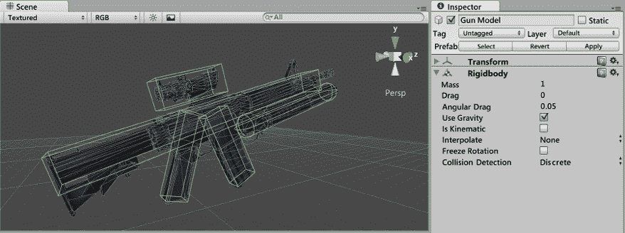

图 7.1：复合碰撞体

无论如何，这并不总是必要的；如果我们只想让武器掉到地上，也许一个覆盖整个武器的盒子碰撞体就足够了，考虑到这类碰撞不需要非常精确，从而提高性能。此外，一些形状即使通过原始形状的组合也无法表示，例如斜坡或金字塔，在这种情况下，你唯一的解决方案是使用网格碰撞体，它需要一个 3D 网格用于碰撞。然而，鉴于它们对性能的高影响，我们不会在本书中使用它们；我们将使用原始形状解决所有物理碰撞体。

现在，让我们添加必要的碰撞体到我们的场景中，以便正确地计算碰撞。如果你使用了除了我的以外的 Asset Store 环境包，你可能已经有了带有碰撞体的场景模块；我将展示我需要做的我的案例，但尝试将主要思想扩展到你的场景中。

要添加碰撞体，请按照以下步骤操作：

1.  在基础中选一个墙，检查对象和可能的子对象是否有碰撞组件；在我的情况下，我没有碰撞体。如果你检测到任何网格碰撞体，你可以保留它，如果你想的话，但我建议你在下一步中将其移除并替换为另一个选项。想法是向其添加碰撞体，但我在这里发现的问题是，由于我的墙不是预制体的实例，我需要为场景中的每个墙添加碰撞体。

1.  一个选项是创建一个预制体，并用它的实例替换所有墙壁（推荐解决方案）；或者，你可以只选择层次结构中的所有墙壁（通过在 Mac 上按住*Ctrl*或*command*键的同时点击它们）并选择它们，然后使用**添加组件**按钮为它们添加碰撞体。在我的情况下，我将使用`Box Collider`组件，它将调整碰撞体的尺寸以适应网格。如果它不适应，你只需更改**盒子碰撞体**组件的**大小**和**中心**属性，以覆盖整个墙壁：

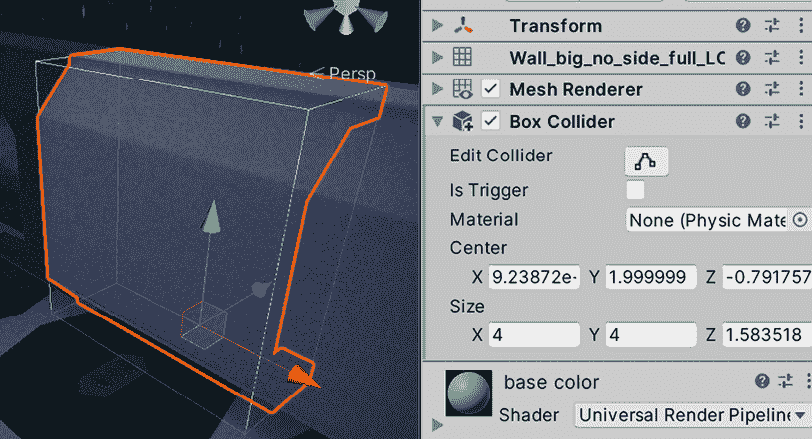

图 7.2：添加到墙上的盒子碰撞体

1.  重复*步骤 1*和*步骤 2*，为角落、地板砖和任何其他会阻挡玩家和敌人移动的障碍物。

现在我们已经为墙壁和地板添加了所需的碰撞器，我们可以继续处理玩家和敌人。我们将为它们添加**胶囊碰撞器**，这是在可移动角色中使用的常用碰撞器，因为圆形底部将允许对象平滑地爬坡。水平圆形允许对象在角落中轻松旋转而不会卡住，以及其他该形状的便利性。

您可能想要基于我们之前下载的角色之一创建一个敌人 Prefab，这样您就可以将碰撞器添加到该 Prefab 上。我们的玩家是场景中的一个简单 GameObject，所以您需要将碰撞器添加到该 GameObject 上，但请考虑为玩家创建一个 Prefab 以方便操作。

您可能会想为角色的骨骼添加多个盒子碰撞器以创建对象的逼真形状。虽然我们可以使用这种方法根据敌人身体被射击的位置来改变伤害，但请注意，我们主要是在创建运动碰撞器，使用胶囊碰撞器就足够了。在高级伤害系统中，胶囊和骨骼碰撞器将共存，一个用于运动，另一个用于伤害检测，但我们将简化我们的游戏。

此外，有时碰撞器不会很好地适应对象的视觉形状，在我的情况下，胶囊碰撞器与角色不太匹配。我需要通过设置以下截图中的值来修复其形状以匹配角色：**中心**到`0,1,0,` **半径**到`0.5`，和**高度**到`2`：

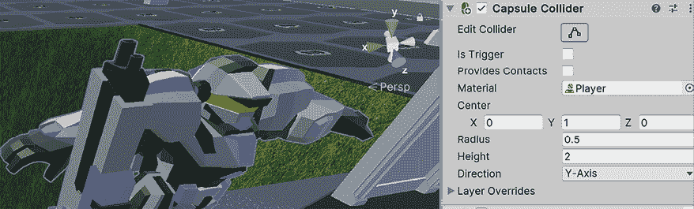

图 7.3：角色碰撞器

我们用球体创建的子弹已经有一个球体碰撞器，但如果您用另一个网格替换子弹的网格，您可能想要更改碰撞器。目前，我们游戏中不需要其他对象，所以现在所有对象都有了合适的碰撞器，让我们看看如何为每个对象设置不同的物理设置以启用适当的碰撞检测。

如果您检查地形组件，您会看到它有自己的碰撞器类型，即**地形碰撞器**。对于地形，这是唯一要使用的碰撞器。

## 物理对象类型

现在我们已经通过使对象在物理模拟中具有存在感为每个对象添加了碰撞器，是时候配置它们以具有我们想要的精确物理行为。我们有无数可能的设置组合，但我们将讨论一组常见的配置文件，这些配置文件涵盖了大多数情况。记住，除了碰撞器之外，我们在本书的开头看到了 Rigidbody 组件，这是将物理应用于对象的一个组件。以下配置文件是通过组合碰撞器和 Rigidbody 设置创建的：

+   **静态碰撞体**: 如其名所示，这种碰撞体不应该移动，除了某些特定的例外。大多数环境对象都属于这一类别，例如墙壁、地板、障碍物和地形。这类碰撞体只是没有`Rigidbody`组件的碰撞体，因此它们存在于物理模拟中，但不会对它们应用任何物理效果；它们不能被其他对象的碰撞移动，它们不会有物理效果，并且无论发生什么情况，它们都将固定在其位置。请注意，这与编辑器右上角的**静态**复选框无关；那个是为我们将在几章中探讨的系统准备的（例如*第十二章*，*启迪世界：使用通用渲染管道照亮场景*），因此如果需要，你可以有一个未勾选该复选框的静态碰撞体。

+   **物理碰撞体**: 这些是具有`Rigidbody`组件的碰撞体，就像我们在本书第一部分创建的掉落球体的例子。这些是完全由物理驱动的对象，具有重力并且可以通过力移动；其他对象可以推动它们，并且它们会执行你所能预期的所有其他物理反应。你可以用这个来处理玩家、手榴弹移动、掉落的箱子，或者所有在基于物理的游戏中的对象，例如*不可思议的机器*。

+   **运动学碰撞体**: 这些是具有`Rigidbody`组件但勾选了**是运动学**复选框的碰撞体。它们对碰撞和力的物理反应与**静态碰撞体**不同，但预期会移动，允许**物理碰撞体**在移动时正确处理与它们的碰撞。这些可以用于需要使用动画或自定义脚本移动的对象，例如移动平台。

+   **触发静态碰撞体**: 这是一个普通的静态碰撞体，但勾选了碰撞体的**是触发**复选框。区别在于，当运动学和物理对象通过它时，会自动生成一个`Trigger`事件；这可以通过脚本捕获，这允许我们检测是否有东西在碰撞体内部。这个事件可以用来在玩家通过发生某些事情的区域时创建按钮或触发对象，例如敌人波生成、门打开，或者如果该区域是玩家的目标，则赢得游戏。请注意，普通的静态碰撞体在通过这种类型时不会生成触发事件，因为它们不应该移动。

+   **触发运动学碰撞体**: 运动学碰撞体不会生成碰撞，因此它们会穿过任何其他对象，但它们会生成`Trigger`事件，因此我们可以通过脚本进行响应。这可以用来创建可移动的奖励物品，当接触时消失并给我们加分，或者子弹以自定义脚本移动，没有物理效果，就像我们的子弹一样，但它们接触其他对象时会造成伤害。

当然，除了指定的配置文件外，还可以存在其他配置文件，用于满足某些游戏的具体游戏玩法要求，但实验所有可能的物理设置组合是否适用于你的情况取决于你；所描述的配置文件将涵盖 99%的情况。

为了回顾之前的场景，请查看以下表格，显示所有类型碰撞器的接触反应。你将找到每个可以移动的配置文件的一行；请记住，静态配置文件不应该移动。每一列代表它们与其他类型碰撞时的反应：“无”表示对象将无效果地穿过，而“触发”表示对象将穿过但会引发“触发”事件，“碰撞”表示第一个对象无法穿过第二个对象：

|  | **与静态碰撞** | **与动态碰撞** | **与动力学碰撞** | **与触发静态碰撞** | **与触发动力学碰撞** |
| --- | --- | --- | --- | --- | --- |
| 动态 | 碰撞 | 碰撞 | 碰撞 | 触发 | 触发 |
| 动力学 | 无 | 碰撞 | 无 | 触发 | 触发 |
| 触发动力学 | 触发 | 触发 | 触发 | 触发 | 触发 |

表 7.01：碰撞反应矩阵

考虑到这一点，让我们开始配置场景对象的物理属性。

墙壁、角落、地板砖和障碍物应使用静态碰撞器配置文件，因此它们上没有`Rigidbody`组件，并且它们的碰撞器将不会勾选**是触发**复选框：

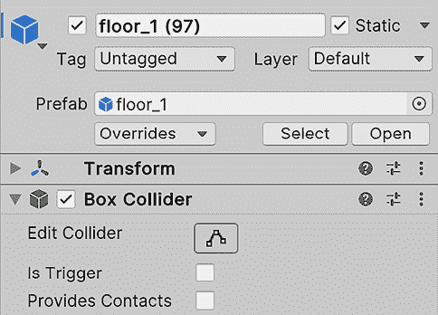

图 7.4：地板砖的配置；请记住，静态复选框仅用于照明

玩家应该移动并与其他物体产生碰撞，因此我们需要玩家拥有一个**动态**配置文件。这个配置文件将与我们当前的移动脚本（我鼓励你测试）产生有趣的行为，尤其是在与墙壁碰撞时，它不会像你预期的那样表现。我们将在本章后面处理这个问题：

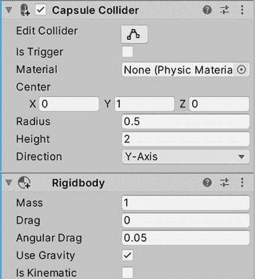

图 7.5：玩家上的动态设置

我们之前建议你创建的`Enemy`预制件将使用动力学配置文件，因为我们将在本书后面使用 Unity 的 AI 系统移动这个对象，所以这里不需要物理。此外，由于我们希望玩家与`Enemy`预制件对象发生碰撞，我们需要在这里设置碰撞反应，因此没有`触发`：

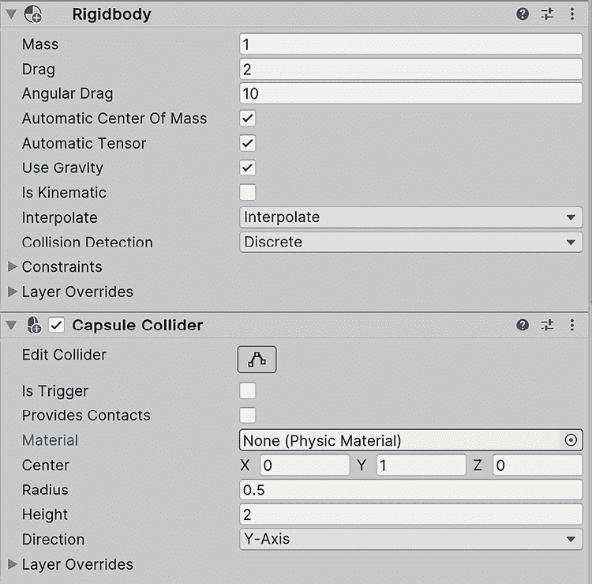

图 7.6：敌人的动力学设置

`Bullet`预制件通过脚本进行简单的移动（它只是向前移动）而不是物理移动。这里我们不需要碰撞；我们将编写代码，使子弹在接触任何东西时立即销毁，并尽可能损坏碰撞的对象，因此动力学触发配置文件就足够了。我们将使用`触发`事件来编写接触反应的脚本：

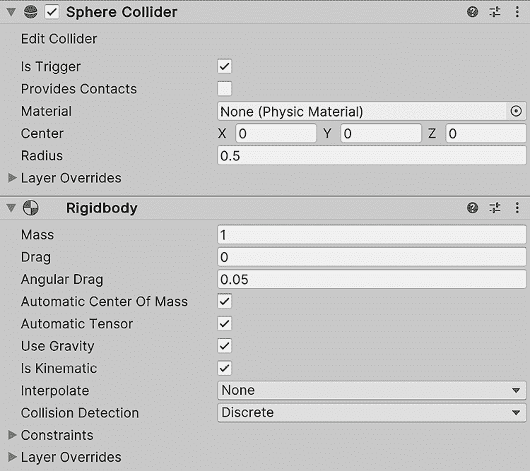

图 7.7：子弹的动力学触发设置，已勾选“是触发”和“是动力学”

现在我们已经正确配置了对象，让我们来看看如何过滤某些对象类型之间的不希望发生的碰撞。

## 碰撞过滤

有时，我们希望某些对象相互忽略，例如玩家射出的子弹，它不应该与玩家本身碰撞。我们总是可以通过 C#脚本中的`if`语句来过滤它，检查被击中的对象是否来自敌方或任何过滤逻辑，但那时已经太晚了；物理系统浪费了资源，检查了本不应该碰撞的对象之间的碰撞。这就是图层碰撞矩阵能帮到我们的地方。

**图层碰撞矩阵**听起来很吓人，但它只是物理系统的一个简单设置，允许我们指定哪些对象组应该与其他组发生碰撞。例如，玩家的子弹应该与敌人碰撞，敌人的子弹应该与玩家碰撞。在这种情况下，敌人的子弹会穿过敌人，但这种情况在我们的案例中是可取的。我们的想法是创建组并将我们的对象放入其中；在 Unity 中，这些组被称为**图层**。我们可以创建图层，并将 GameObject（**检查器**的顶部部分）的图层属性设置为将对象分配到该组或图层。请注意，您有有限的图层数量，因此请尽量明智地使用它们。

我们可以通过以下方式实现：

1.  前往**编辑 | 项目设置**，然后在其中，从左侧面板查找**标签和图层**选项：

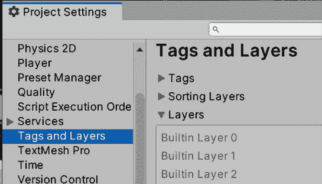

图 7.8：标签和图层设置

1.  在**图层**部分，填写空白区域以创建图层。我们将使用此功能处理子弹场景，因此我们需要四个图层：`Player`、`Enemy`、`PlayerBullet`和`EnemyBullet`：

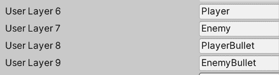

图 7.9：创建图层

1.  在层次结构中选择`Player`GameObject，然后从检查器的顶部部分更改**图层**属性为`Player`。同时，将`Enemy`Prefab 的图层更改为`Enemy`。会出现一个窗口，询问您是否想同时更改子对象；选择**是**：

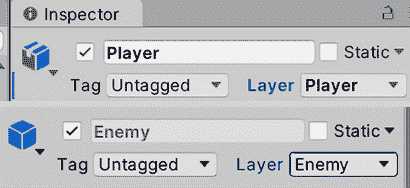

图 7.10：更改玩家和敌人 Prefab 的图层

1.  在子弹的情况下，我们有一个问题；我们有一个 Prefab 但有两个图层，而 Prefab 只能有一个图层。我们有两种选择：通过脚本根据射击者更改图层或创建两个具有不同图层的`bullet`Prefab。为了简单起见，我将选择后者，并借此机会将另一种材质应用到敌人子弹上，使其看起来不同。

1.  我们将为玩家子弹创建一个 Prefab **变体**。请记住，变体是基于原始 Prefab 的 Prefab，就像类继承一样。当原始 Prefab 发生变化时，变体也会变化，但变体可以有不同的差异，这将使其独特。

1.  将子弹 Prefab 拖放到场景中创建一个实例。

1.  再次将实例拖动到`Prefabs`文件夹中，这次在出现的窗口中选择**Prefab** **Variant**选项。

1.  将其重命名为`Enemy Bullet`。

1.  在场景中销毁预制体实例。

1.  创建一个类似于玩家子弹的第二种材料，颜色不同，并将其放在敌人子弹预制体变体上。

1.  选择敌人子弹预制体，将其层设置为`EnemyBullet`，并对原始预制体（`PlayerBullet`）执行相同的操作。即使你更改了原始预制体的层，由于变体修改了它，修改后的版本（或覆盖）将占优，允许每个预制体有自己的层。

现在我们已经配置了层，让我们配置物理系统以使用它们：

1.  前往**编辑** | **项目设置**并查找**物理**设置（不是**物理 2D**）。

1.  滚动直到您看到**层碰撞矩阵**，一个半网格的复选框。您会注意到每一列和行都标有层的名称，因此每一行和列交叉处的每个复选框都将允许我们指定这两个是否应该碰撞。在我们的情况下，我们配置了层碰撞矩阵，如以下截图所示，以便玩家子弹不会击中玩家或其他玩家子弹，敌人子弹不会击中敌人或其他敌人子弹：

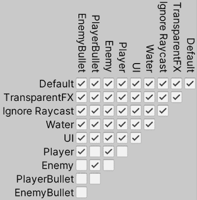

图 7.11：使玩家子弹与敌人碰撞，以及敌人子弹与玩家碰撞

值得注意的是，有时过滤逻辑可能不会那么严格或可预测。例如，它可能只涉及具有一定生命值的击中对象，没有隐形时间增益的对象，或者可以在游戏过程中改变的条件，并且难以为所有可能的层和组生成。因此，在这些情况下，我们应该在**触发**或**碰撞**事件之后依赖手动过滤。

现在我们已经过滤了碰撞，让我们通过下一节中的碰撞来检查我们的设置是否正常工作。

# 检测碰撞

如您所见，适当的物理设置可能很复杂且非常重要，但既然我们已经解决了这个问题，让我们通过以不同的方式对接触做出反应来执行一些任务，在这个过程中创建一个**健康系统**。

在本节中，我们将检查以下碰撞概念：

+   检测触发事件

+   修改其他对象

首先，我们将探讨 Unity 为我们提供的不同碰撞和触发事件，以便对两个对象之间的接触做出反应，通过 Unity **碰撞**事件。这允许我们执行我们想要放置的任何反应代码，但在这里，我们将探讨如何使用`GetComponent`函数修改接触到的对象组件。

## 检测触发事件

如果对象配置得当，如前所述，我们可以得到两种反应：碰撞或触发。**碰撞**反应有一个默认效果，可以阻止对象的移动，但我们可以通过脚本添加自定义行为；然而，使用**触发器**，除非我们添加自定义行为，否则它不会产生任何明显的效果。无论如何，我们可以为两种可能的场景编写脚本，例如添加分数、减少生命值和输掉游戏。为此，我们可以使用**物理事件**套件。

这些事件分为两组，**碰撞事件**和**触发事件**，因此根据你的对象设置，你需要选择适当的组。两组都有三个主要事件，**进入**、**持续**和**退出**，告诉我们碰撞或触发何时开始（*进入*），是否仍在发生或仍在接触（*持续*），以及何时停止接触（*退出*）。例如，我们可以在进入事件中编写一个行为，例如在两个物体首次接触时播放声音，如摩擦声，并在退出事件中停止播放。

让我们通过创建我们的第一个接触行为来测试这个：子弹在接触物体时被销毁。记住，子弹被配置为触发器，因此它们在与任何物体接触时将生成`触发器`事件。你可以按照以下步骤操作：

1.  在**玩家子弹**预制件上创建并添加一个名为 `ContactDestroyer` 的脚本；由于**敌人子弹**预制件是其变体，它也将拥有相同的脚本。

1.  要检测触发器何时发生，例如使用**开始**和**更新**，创建一个名为 `OnTriggerEnter` 的事件函数。

1.  在事件内部，使用 `Destroy(gameObject);` 行来使子弹在接触物体时销毁自身：

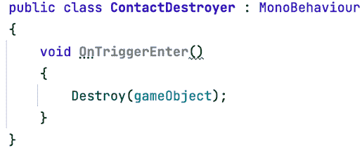

图 7.12：与物体接触时自动销毁

1.  保存脚本，并将子弹射向墙壁以观察它们是如何消失而不是穿过墙壁的。在这里，我们不是处理碰撞，而是一个触发器，它在接触时销毁子弹。这样，我们可以确保子弹永远不会穿过任何东西，但我们还没有实现基于物理的运动。

在启用这些组件之后，目前我们不需要其他碰撞事件，但如果你需要它们，它们的工作方式将类似；只需创建一个名为 `OnCollisionEnter` 的函数即可。

现在，让我们探索同一函数的另一个版本。我们将配置它，不仅告诉我们我们击中了什么，而且还告诉我们我们接触了什么。我们将使用这个来使我们的**接触销毁器**也销毁其他对象。为此，请按照以下步骤操作：

1.  将 `OnTriggerEnter` 方法签名替换为以下截图中的那个。这个方法接收一个 `Collider` 类型的参数，表示撞击我们的确切碰撞体：

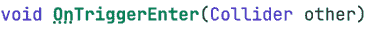

图 7.14：告诉我们我们碰撞了哪个对象的触发事件版本

1.  我们可以使用`gameObject`属性访问那个 collider 的 GameObject。我们可以使用这个来摧毁另一个对象，如下面的截图所示。如果我们只是通过传递`other`变量来使用`Destroy`函数，它将只会摧毁`Collider`组件：

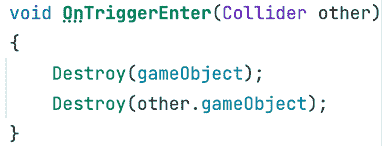

图 7.14：摧毁两个对象

1.  保存并测试脚本。你会注意到子弹会摧毁它接触到的所有东西。记得验证你的敌人有一个胶囊碰撞器，这样子弹才能检测到与之的碰撞。

在可视化脚本中的等效版本如下所示：

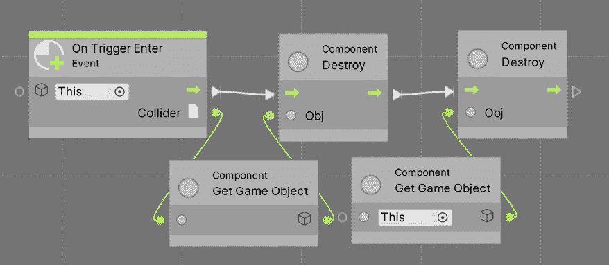

图 7.15：使用可视化脚本摧毁两个对象

如你所见，我们创建了一个**On Trigger Enter**节点并将其连接到两个**Destroy**节点。为了指定每个**Destroy**节点将摧毁哪个对象，我们使用了**Component: Get GameObject**节点两次。右边的一个没有节点连接到其左侧输入引脚，这意味着它将返回当前执行此脚本的 GameObject（因此，节点左侧的**This**标签），在这种情况下，子弹。对于第二个，我们需要将**OnTriggerEnter**节点右侧的**Collider**输出引脚连接到**Get GameObject**节点；这样，我们指定我们想要获取子弹碰撞到的包含 collider 的 GameObject。

现在，在我们的游戏中，我们不希望子弹在接触时摧毁一切；相反，我们将让敌人和玩家拥有生命值；子弹将减少生命值，直到它达到 0，所以让我们找出如何做到这一点。

## 修改其他对象

为了让子弹损坏碰撞的对象，我们需要访问一个`Life`组件来更改其数量，所以我们需要创建这个`Life`组件来保存一个包含生命值的浮点字段。具有此组件的每个对象都将被视为可损坏的对象。要从我们的子弹脚本中访问`Life`组件，我们需要`GetComponent`函数。

如果你有一个 GameObject 或组件的引用，你可以使用`GetComponent`来访问对象中包含的特定组件（如果没有，它将返回`null`）。让我们看看如何使用这个函数来使子弹减少其他对象的生命值：

1.  为玩家和敌人 Prefab 创建并添加一个带有`public float`字段的`Life`组件，称为`amount`。记得在检查器中为两者设置值为`100`（或你想要给他们的任何生命值）：

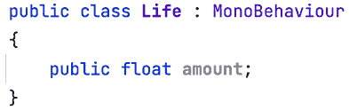

图 7.17：生命组件

1.  从玩家子弹中移除`ContactDestroyer`组件，这也会将其从**Enemy Bullet Variant**中移除。

1.  为敌人和玩家添加一个新的脚本名为`ContactDamager`。

1.  添加一个接收`other`碰撞器作为参数的`OnTriggerEnter`事件，并仅添加自动销毁自己的`Destroy`函数调用，而不是销毁其他对象的那个；我们的脚本不会负责销毁它，只是减少其生命值。

1.  添加一个名为`damage`的浮点字段，以便我们可以配置对其他对象造成的伤害量。记住在继续之前保存文件并设置一个值。

1.  使用`GetComponent`在另一个碰撞器的引用上获取其`Life`组件的引用，并将其保存在一个变量中：

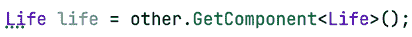

图 7.18：访问碰撞对象的 Life 组件

1.  在减少对象的寿命之前，我们必须检查`Life`引用不是`null`，这会在其他对象没有`Life`组件的情况下发生，例如墙壁和障碍物。想法是子弹在遇到任何东西时都会销毁自己，如果它是包含`Life`组件的可伤害对象，则会减少其他对象的生命值。

    在以下屏幕截图中，您将找到完整的脚本：

    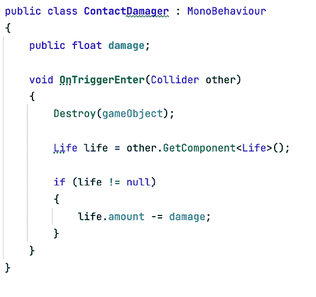

    图 7.18：减少碰撞对象的寿命

1.  在场景中放置一个敌人，并将其速度设置为`0`以防止其移动。

1.  在按**播放**之前在层次结构中选择它，并开始向它射击。

你可以在检查器中看到生命值是如何减少的。你还可以按*Esc*键恢复鼠标控制，并在**播放**模式下选择对象，同时看到编辑器中运行时**生命**字段的更改。

现在，你会注意到生命正在减少，但它会变成负数；我们希望当生命低于 0 时对象会销毁自己。我们可以通过两种方式做到这一点：一种是在`Life`组件中添加一个`Update`，它会检查所有帧以查看生命是否低于 0，并在发生这种情况时销毁自己。

第二种方法是通过封装生命字段并在 setter 中检查其值来防止所有帧都被检查。我更喜欢第二种方法，但我们将实现第一种方法，以使脚本对初学者尽可能简单。

要做到这一点，请按照以下步骤操作：

1.  将`Update`添加到`Life`组件中。

1.  添加`If`以检查数量字段是否小于或等于`0`。

1.  在`if`条件为`true`的情况下，添加`Destroy`。

1.  完整的`Life`脚本将如下截图所示：

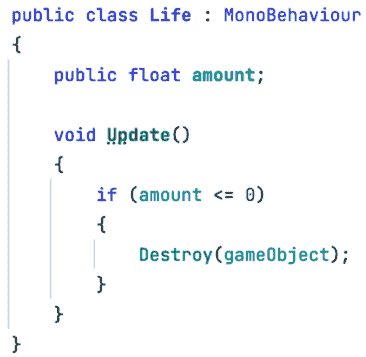

图 7.19：Life 组件

1.  保存并查看当`Life`变为`0`时对象是如何被销毁的。

`Life`组件的视觉脚本版本看起来如下：

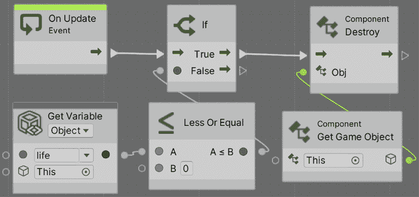

图 7.20：视觉脚本中的 Life 组件

脚本相当简单——我们检查我们的`Life`变量是否小于 0，然后销毁自己，就像我们之前做的那样。现在，让我们检查**Damager**脚本：

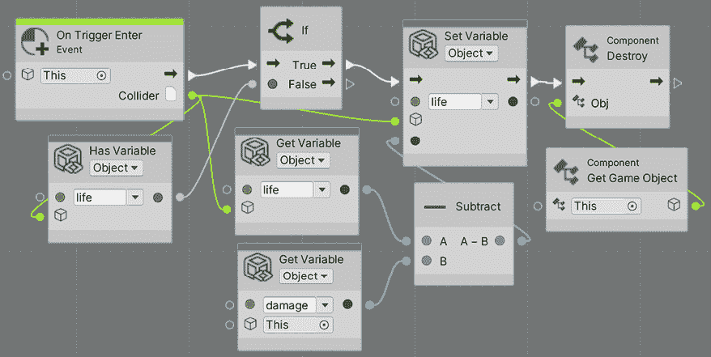

图 7.21：视觉脚本中的 Damager 组件

这个版本与我们的 C#版本略有不同。乍一看，它看起来相同：我们像之前一样使用**获取变量**来读取生命值，然后使用**减去**节点从**生命**中减去**伤害**，计算结果成为新的**生命**值，使用**设置变量**节点来改变该变量的当前值。

我们在这里可以看到的第一个区别是缺少任何`GetComponent`节点。在 C#中，我们使用该指令来获取碰撞对象的`Life`组件，以便读取和修改其**数量**变量，减少剩余的生命值。但在 Visual Scripting 中，我们的节点图没有变量，因此我们不需要访问组件来读取它们。相反，我们知道敌人其**变量**组件中有一个名为`Life`的变量，我们使用**获取变量**节点，将其连接到我们撞击的碰撞器（**On Trigger Enter**的**Collider**输出引脚），因此本质上，我们正在读取被撞击对象的`Life`变量值。

同样的方法也适用于更改其值：我们使用**设置值**节点，将其连接到碰撞器，指定我们想要更改碰撞器对象的`Life`变量值，而不是我们自己的（因为子弹没有`Life`变量）。请注意，如果被撞击的对象没有`Life`变量，这可能会引发错误，这就是为什么我们添加了**对象有变量**节点，它检查对象是否有一个名为`Life`的变量。如果没有，我们就什么也不做，这在与墙壁或其他不可破坏的对象碰撞时很有用。最后，我们让**伤害者**（在这个例子中是子弹）自动销毁自己。

当这种情况发生时，你可以实例化一个对象，比如声音、粒子，或者可能是一个增强道具。我将把这个留给你作为挑战。通过使用类似的脚本，你可以实现一个增加生命值的生命增强道具，或者一个通过访问`PlayerMovement`脚本并增加**速度**字段的加速增强道具；从现在开始，发挥你的想象力，使用之前获得的知识来创建令人兴奋的行为。

现在我们已经探讨了如何检测碰撞并对其做出反应，让我们来探讨如何修复玩家在撞击墙壁时掉落的问题。

# 使用物理移动

到目前为止，玩家是唯一一个使用**动态碰撞器配置文件**移动的对象，并且将根据物理规则移动，实际上是通过自定义脚本使用 Transform API 来移动的。相反，每个动态对象都应该使用 Rigidbody API 函数以物理系统更易理解的方式移动。因此，在这里，我们将探讨如何移动对象，这次是通过**Rigidbody**组件。

在本节中，我们将探讨以下物理运动概念：

+   应用力

+   调整物理

我们将首先了解如何通过力以正确的方式移动对象，并将此概念应用于玩家的移动。然后，我们将探讨为什么现实中的物理并不总是有趣的，以及我们如何调整对象的物理属性以使其行为更加灵敏和吸引人。

## 应用力

移动物体的物理准确方式是通过力，这会影响物体的速度。要施加力，我们需要访问`Rigidbody`而不是`Transform`，并使用`AddForce`和`AddTorque`函数分别进行移动和旋转。这些函数允许您指定要施加到位置和旋转每个轴上的力的大小。这种移动方式将具有完整的物理反应；力将累积在速度上以开始移动，并受到阻力效应的影响，这将使速度逐渐减小，而且这里最重要的方面是它们将碰撞到墙壁，阻挡物体的路径。

要获得这种移动，我们可以执行以下操作：

1.  在`PlayerMovement`脚本中创建一个`Rigidbody`字段，但这次将其设置为`private`——也就是说，不要在字段中写入`public`关键字，这将使其在编辑器中消失；我们将以另一种方式获取引用：

图 7.22：私有 Rigidbody 引用字段

1.  注意，我们之所以将这个变量命名为`rb`，只是为了防止我们的脚本过于宽泛，使得书中代码的截图太小。建议在您的脚本中正确命名变量——在这种情况下，它应该命名为`rigidbody`。

1.  在`Start`事件函数中使用`GetComponent`，获取我们的 Rigidbody 并将其保存在字段中。我们将使用此字段来缓存`GetComponent`函数的结果；每帧调用该函数以访问 Rigidbody 是不高效的。此外，请注意，`GetComponent`函数不仅可以用来检索其他对象的组件（如碰撞示例），还可以用来检索自己的组件：

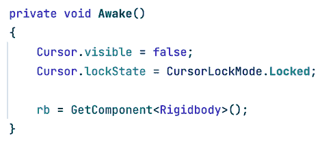

图 7.23：缓存 Rigidbody 引用以供将来使用

1.  将`transform.Translate`调用替换为`rb.AddRelativeForce`。这将调用 Rigidbody 的加力函数，特别是相对的函数，这将考虑对象的当前旋转。例如，如果您在*z*轴（第三个参数）上指定一个力，则对象将沿着其前进向量施加力。

1.  将`transform.Rotate`调用替换为`rb.AddRelativeTorque`，这将应用旋转力：

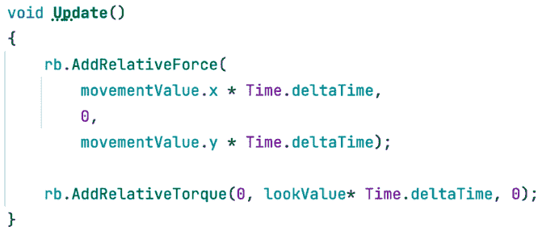

图 7.24：使用 Rigidbody 力 API

1.  检查玩家 GameObject 的胶囊碰撞体是否不与地板相交，并且略微高于地板。如果玩家相交，则移动将无法正常工作。如果是这种情况，请将其向上移动。

如果您之前使用过 Unity，您可能会觉得使用`Update`而不是`FixedUpdate`来应用物理力很奇怪。FixedUpdate 是一种特殊的更新，它以固定的速率运行，不受实际游戏**每秒帧数**（**FPS**）的影响，而物理系统就在这里执行。默认情况下，它被配置为每帧运行 50 次。这意味着如果游戏以 200 FPS 运行，FixedUpdate 将每 4 帧执行一次，但如果游戏以 25 FPS 运行，则固定更新将每帧执行两次。这样做是为了增强物理计算的稳定性，考虑到它们的复杂性。

虽然在 FixedUpdate 中调用任何应用力和扭矩的 Rigidbody 方法可能是正确的，但在 Update 方法中这样做也不一定错误。为了简单起见，我们保留了代码在 Update 方法中，因为 FixedUpdate 对于初学者来说可能难以使用，因为它可能每帧执行多次，甚至跳过一些帧。一个例子是使用`Input.GetKeyDown`等方法检查按键是否被按下，因为按键压力发生在特定的帧中。如果您在 FixedUpdate 中调用该方法，而 FixedUpdate 跳过了按键被按下的帧，则按键压力将不会被检测到，使得游戏感觉不响应。一个经典的修复方法是使用 Update 方法检测按键压力，并将它们存储在布尔变量中，以便稍后在 FixedUpdate 中检查。但再次强调，由于简单起见，我们决定保持原样。

在 Visual Scripting 版本中，变化是相同的：将**Transform**和**Rotate**节点分别替换为**添加相对力**和**添加相对扭矩**节点。以下是一个**添加相对力**的示例：

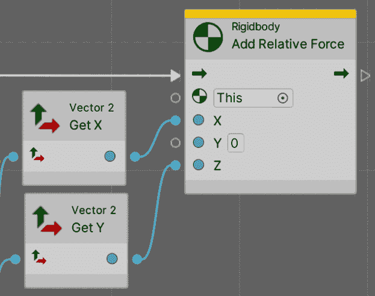

图 7.25：使用 Rigidbody Forces API

对于这样的旋转：

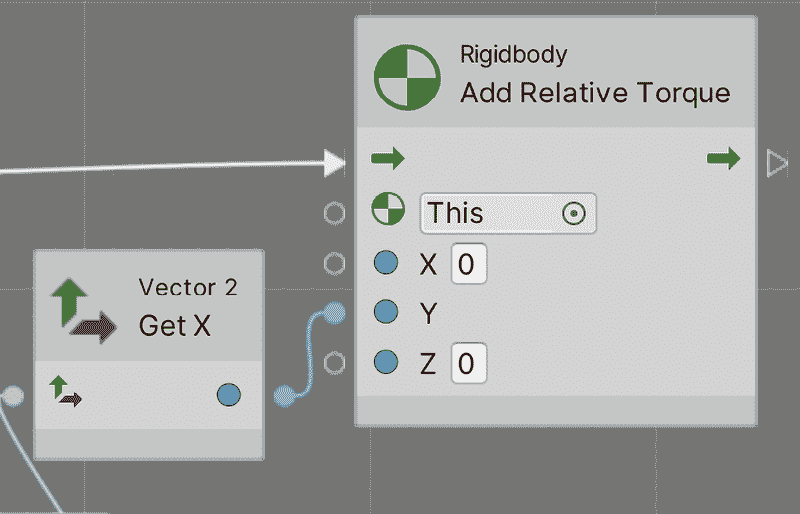

图 7.26：使用 Rigidbody 扭矩 API

您可以看到，在这里我们也不需要使用**GetComponent**节点，因为仅仅使用**添加相对力**或**扭矩**节点就足以让 Visual Scripting 理解我们想要在我们的 Rigidbody 组件上应用这些动作（再次解释 This 标签的使用）。如果在任何其他情况下，我们需要在我们的 Rigidbody 组件之外调用这些函数，我们则需要在该处使用**GetComponent**节点，但让我们稍后再探讨这一点。

现在，如果你保存并测试结果，你可能会发现玩家正在下落，这是因为我们现在使用的是真实物理，其中包含地板摩擦，由于作用力在质心处，这会使物体下落。记住，在物理方面，你是一个胶囊；你没有腿可以移动，这就是标准物理不适合我们的游戏的地方。解决方案是调整物理以模拟我们需要的这种行为。

## 调整物理

要使我们的玩家像在常规平台游戏一样移动，我们需要冻结某些轴以防止物体下落。移除地面摩擦，并增加空气摩擦（阻力）以使玩家在释放按键时自动减速。

要完成此操作，请按照以下步骤进行：

1.  在`Rigidbody`组件中，查看底部的**约束**部分，并检查**冻结旋转**属性的**X**和**Z**轴：

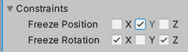

图 7.27：冻结旋转轴

1.  这将防止物体向侧面下落，但允许它在水平方向上旋转。如果你不希望玩家跳跃，也可以冻结**冻结位置**属性的**y**轴，以防止在碰撞时出现一些不希望的垂直移动。

1.  你可能需要更改速度值，因为你从每秒米值更改为每秒牛顿值，这是**添加力**和**添加扭矩**函数的预期值。对我来说，速度为 1,000，旋转速度为 160 就足够了。

1.  现在，你可能会注意到速度和旋转会随着时间的推移而大幅增加。记住，你正在使用力，这会影响你的速度。当你停止施加力时，速度会被保留，这就是为什么即使你不移动鼠标，玩家也会继续旋转。解决这个问题的方法是增加**阻力**和**角阻力**，这模拟了空气摩擦，并将分别在无力作用时减少移动和旋转。尝试找到适合你的值；在我的情况下，我使用了`2`作为**阻力**，`10`作为**角阻力**，需要将**旋转速度**增加到`150`以补偿阻力的增加：

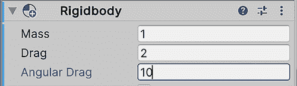

图 7.28：设置旋转和移动的空气摩擦

1.  现在，如果你在接触墙壁时移动，而不是像大多数游戏那样滑动，你的玩家会因为接触摩擦而粘附在障碍物上。我们可以通过创建一个`Physics Material`来移除这一点，这是一个可以分配给碰撞体以控制它们在这些场景中如何反应的资产。

1.  通过点击**项目**窗口中的**+**按钮并选择**物理材质**（不是 2D 版本）来开始创建一个。将其命名为`Player`，并记得将其放入一个用于此类资产的文件夹中。

1.  选择它，并将**静摩擦**和**动摩擦**设置为`0`，将**摩擦组合**设置为`最小`，这将使**物理**系统选择两个碰撞物体中的最小摩擦，这总是最小的——在我们的案例中，是零：

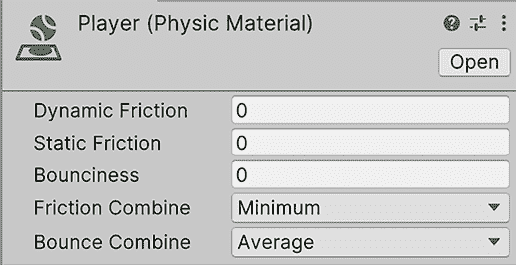

图 7.29：创建物理材质

1.  选择玩家，并将此资产拖动到**胶囊碰撞体**的**材质**属性：

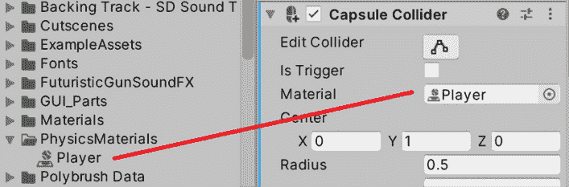

图 7.30：设置玩家的物理材质

1.  如果你现在玩游戏，你可能会注意到玩家会比以前移动得更快，因为我们没有在地板上施加任何类型的摩擦，所以你可能需要减少移动力。

正如你所见，我们需要弯曲物理规则以允许玩家有响应性的移动。你可以通过增加阻力和力来获得更多的响应性，这样速度可以更快地应用和减少，但这又取决于你希望游戏拥有的体验。

一些游戏希望得到即时的响应，没有速度插值，从 0 到全速，反之亦然，从一个帧到另一个帧。在这些情况下，你可以直接根据自己的意愿覆盖玩家的速度和旋转向量，甚至可以使用物理以外的其他系统，例如具有专门物理特性的 Character Controller 组件。你可以在这里了解更多：[`docs.unity3d.com/Manual/CharacterControllers.html`](https://docs.unity3d.com/Manual/CharacterControllers.html)。

# 摘要

每个游戏都以某种方式包含物理，无论是为了移动、碰撞检测还是两者兼而有之。在本章中，我们学习了如何使用物理系统，包括了解适当的设置以使系统正常工作，对碰撞做出反应以生成游戏系统，以及以使玩家以物理不准确的方式移动并与其碰撞的方式移动玩家。我们使用这些概念来创建我们的玩家和子弹移动，并使我们的子弹对敌人造成伤害，但我们也可以重用这些知识来创建无数其他可能的游戏需求，所以我建议你在这里的物理概念上稍微玩一玩；你可以发现很多有趣的用例。

在下一章中，我们将讨论如何编程游戏的视觉方面，例如效果，并使 UI 对输入做出反应。

# 在 Discord 上了解更多

与其他用户、Unity 游戏开发专家和作者本人一起阅读这本书。提问，为其他读者提供解决方案，通过 Ask Me Anything 会议与作者聊天，等等。扫描二维码或访问链接加入社区：

[`packt.link/unitydev`](https://packt.link/unitydev)

