# 胜利或失败：胜负条件

现在我们已经有一个基本的游戏体验，是时候让游戏以胜利或失败的结果结束。实现这一点的常见方法是通过分离的组件，这些组件负责监督一组对象以检测需要发生的情况，例如玩家的生命值变为 0 或所有波次都被清除。我们将通过**管理器**的概念来实现这一点，管理器将管理和监控多个对象。

在本章中，我们将探讨以下管理器概念：

+   创建对象管理器

+   创建游戏模式

+   通过事件改进我们的代码

有了这些知识，你将能够不仅创建游戏的胜负条件，而且还能以正确的方式使用设计模式，如**单例（Singleton**）和**事件监听器（Event Listeners**）来创建这些条件。这些技能不仅对创建游戏的胜负代码有用，对任何一般的代码都很有用。首先，让我们从创建代表如得分或游戏规则等概念的管理器开始。

# 创建对象管理器

并非场景中的每个对象都应该是可以看到、听到或与之碰撞的。一些对象也可以存在概念意义，而不是有形的东西。例如，想象一下你需要计算敌人的数量：你将把它保存在哪里？你还需要一个地方来保存玩家的当前得分，你可能认为它应该在玩家本身上，但如果玩家死亡并重生了呢？

数据将会丢失！在这种情况下，**管理器**的概念可以是我们早期游戏中解决这一问题的有用方式，所以让我们来探索它。

在本节中，我们将看到以下对象管理器概念：

+   使用单例设计模式共享变量

+   在视觉脚本中共享变量

+   创建管理器

我们将首先讨论单例设计模式是什么以及它如何帮助我们简化对象的通信。有了它，我们将创建管理器对象，使我们能够集中管理一组对象的信息，以及其他方面。让我们先从讨论单例设计模式开始。

## 使用单例设计模式共享变量

设计模式通常被描述为对常见问题的常见解决方案。在编写游戏代码时，你将不得不做出几个编码设计决策，但幸运的是，处理最常见情况的方法是众所周知的，并且有详细的文档。在本节中，我们将讨论最常见的设计模式之一，**单例（Singleton**），它在简单项目中易于实现。

当我们需要一个对象的单个实例时，会使用 Singleton 模式，这意味着不应该有超过一个类的实例，并且我们希望它易于访问（虽然不是必需的，但在我们的场景中很有用）。在我们的游戏中有很多情况可以应用 Singleton 模式，例如，`ScoreManager`，一个将保存当前分数的组件。在这种情况下，我们永远不会有多于一个分数，因此我们可以利用 Singleton 管理器的优势。

一个好处是确保我们不会有重复的分数，这使我们的代码更不容易出错。此外，到目前为止，我们需要创建公共引用并通过编辑器拖动对象来连接两个对象，或者使用`GetComponent`来查找它们；然而，使用这种模式，我们将能够全局访问我们的 Singleton 组件，这意味着你只需在脚本中写下组件的名称，就可以访问它。最后，只有一个`ScoreManager`组件，所以通过编辑器指定一个就多余了。这类似于`Time.deltaTime`，负责管理时间的类——我们只有一个时间。

如果你是一个高级程序员，你现在可能正在考虑代码测试和依赖注入，你是对的，但请记住，到目前为止，我们正在尝试编写简单的代码，所以我们将坚持这个简单的解决方案。

让我们创建一个**Score Manager**对象，负责处理分数，以下是如何通过以下方式展示 Singleton 的一个例子：

1.  创建一个空的 GameObject（**GameObject | Create Empty**），并将其命名为`ScoreManager`；通常，管理者被放在空对象中，与场景中的其他对象分离。

1.  向此对象添加一个名为**ScoreManager**的脚本，并添加一个名为**amount**的**int**字段，该字段将保存当前分数。

1.  添加一个名为**instance**的**ScoreManager**类型字段，但向其添加**static**关键字；这将使变量全局，意味着只需写出其名称就可以在任何地方访问它：

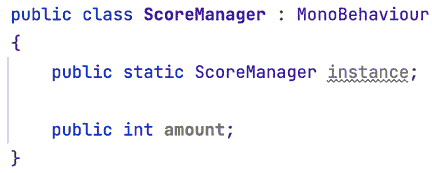

图 8.1：可以在代码的任何地方访问的静态字段

1.  在**Awake**方法中，检查**实例**字段是否不为`null`，如果是，则使用**this**引用将此**ScoreManager**实例设置为实例引用。

1.  在`null`检查`if`语句的`else`子句中，打印一条消息，指出存在一个必须销毁的第二个**ScoreManager**实例：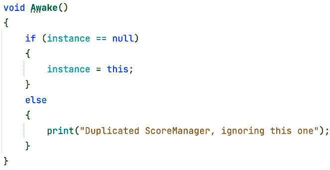

    图 8.2：检查是否存在唯一的 Singleton 实例

    策略是将对唯一的**ScoreManager**实例的引用保存在`instance`静态字段中，但如果用户不小心创建了带有**ScoreManager**组件的两个对象，这个`if`语句将检测到它，并通知用户错误，要求他们采取行动。在这种情况下，第一个执行**Awake**的**ScoreManager**实例会发现没有设置实例（字段是`null`），因此它会将自己设置为当前实例，而第二个**ScoreManager**实例会发现实例已经设置，并将打印出消息。

    请记住，`instance`是一个静态字段，在所有类之间共享，与常规引用字段不同，每个组件都将有自己的引用，所以在这种情况下，场景中添加了两个`ScoreManager`实例，它们将共享相同的实例字段。

    为了稍微改进一下示例，最好有一种简单的方法来找到游戏中第二个`ScoreManager`。它可能隐藏在层级结构中的某个地方，可能很难找到，但我们可以通过以下方式解决这个问题：

1.  将`print`替换为`Debug.Log`。`Debug.Log`与`print`类似，但有一个期望在控制台中点击消息时突出显示对象的第二个参数。在这种情况下，我们将传递`gameObject`引用，以便控制台突出显示重复的对象：![img/B21361_08_03_PE.png]

    图 8.3：使用 Debug.Log 在控制台中打印消息

    点击日志消息后，包含重复`ScoreManager`的 GameObject 将在层级结构中高亮显示：

    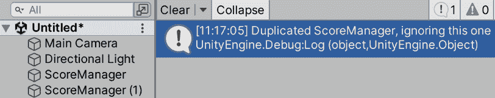

    图 8.4：点击消息后的高亮对象

1.  最后，可以通过将`Debug.Log`替换为`Debug.LogError`来在这里进行一点小小的改进，这将打印出消息，但带有错误图标。在实际游戏中，控制台将有很多消息，突出显示错误信息而不是信息消息将帮助我们快速识别它们：

![img/B21361_08_05_PE.png]

图 8.5：使用 LogError 打印错误消息

1.  尝试运行代码并观察控制台中的错误消息：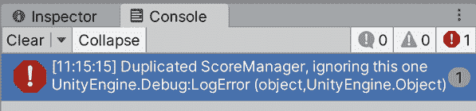

    图 8.6：控制台中的错误消息

    下一步是在某个地方使用这个单例对象，所以在这种情况下，我们将让敌人被杀死时获得分数，具体操作如下：

1.  将名为`ScoreOnDeath`的脚本添加到`Enemy`预制件中，其中有一个名为`amount`的`int`字段，该字段将指示敌人被杀死时将获得的分数。请记住，在编辑器中将值设置为除`0`以外的其他值。

1.  创建`OnDestroy`事件函数，当这个对象被销毁时，Unity 会自动调用它——在我们的案例中，是敌人：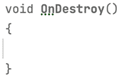

    图 8.7：OnDestroy 事件函数

    考虑到`OnDestroy`函数在改变场景或游戏退出时也会被调用，所以在这种情况下，我们在改变场景时可能会获得分数，这是不正确的。到目前为止，在我们的案例中这并不是问题，但稍后在本章中，我们将看到一种防止这种情况的方法。

1.  在`OnDestroy`函数中通过编写`ScoreManager.instance`来访问单例引用，并将我们脚本中的`amount`字段添加到单例的`amount`字段中，以便在敌人被杀死时增加分数：

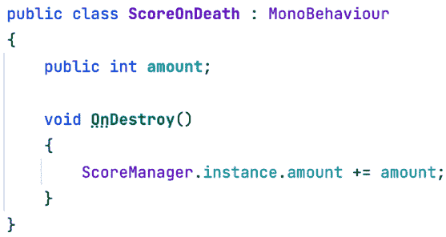

图 8.8：完整的 ScoreOnDeath 组件类内容

1.  在层次结构中选择`ScoreManager`，按**播放**，然后杀死一些敌人以看到每次击杀分数都会上升。记得设置 Prefab 的`ScoreOnDeath`组件的`amount`字段。

正如你所见，单例模式简化了我们访问`ScoreManager`的方式，并采取了大量安全措施来防止其自身的重复，这将帮助我们减少代码中的错误。需要注意的是，现在你可能会倾向于将一切事物都做成单例，比如玩家的生命或玩家的子弹，以便在创建游戏机制，如增强效果时使你的生活更轻松。

虽然这样完全可行，但请记住，你的游戏将发生很大变化；任何真实的项目都会经历不断的变更。也许今天，游戏只有一个玩家，但将来你可能想添加第二个玩家或一个 AI 伴侣，并且你希望增强效果也能影响他们。如果你过度使用单例模式，你将难以处理这些场景以及更多的情况。也许未来的玩家伴侣会尝试获取生命值恢复，但主玩家却被治愈了！

这里的关键是尽量少地使用这个模式，以防你没有其他解决问题的方法。说实话，总是有不用单例解决问题的方法，但它们对初学者来说实现起来要困难一些，所以我更喜欢简化你的生活，让你保持动力。随着足够的练习，你将达到一个可以准备提高你的编码标准的点。

有许多设计模式可以帮助你设计游戏。一旦你对 Unity 脚本编程感到舒适，我们建议阅读以下 Unity 官方游戏编程模式书籍：[`resources.unity.com/games/level-up-your-code-with-game-programming-patterns`](https://resources.unity.com/games/level-up-your-code-with-game-programming-patterns)。这本书还包括了单例的高级实现。

现在，让我们讨论如何在视觉脚本中实现这一点，鉴于它会有所不同，因此值得单独成章。如果您对视觉脚本方面不感兴趣，可以考虑跳过以下部分。

## 使用视觉脚本共享变量

视觉脚本有一个机制，用**场景变量**替换单例作为在对象之间共享变量的持有者：**场景变量**。如果您检查**脚本图**编辑器（我们编辑脚本节点窗口）左侧的面板（显示我们对象变量的面板）下的`黑板`面板（显示我们对象变量的面板），您会注意到它将有许多标签页：**图、对象、场景、应用**和**已保存**。如果您看不到**黑板**面板，请点击窗口左上角从左到右的第三个按钮——位于**i**（信息）按钮右侧的按钮：

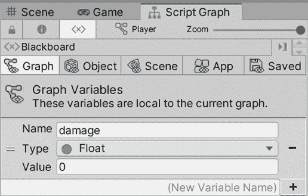

图 8.9：脚本图中的黑板（变量）编辑器

到目前为止，当我们创建任何对象的**变量**组件中的变量时，我们实际上是在创建**对象变量**：属于对象且在该对象的所有视觉脚本之间共享的变量，但这并不是变量可以拥有的唯一作用域。以下是一个剩余作用域的列表：

+   **图**: 只能通过我们当前图访问的变量。其他脚本无法读取或写入该变量。这有助于保存内部状态，例如 C#中的私有变量。

+   **场景**: 可以被当前场景中所有对象访问的变量。当我们更改场景时，这些变量就会丢失。

+   **应用**: 可以在任何游戏部分随时访问的变量。这有助于将值从一个场景移动到另一个场景。例如，您可以在一个级别中增加分数，并在下一个级别中继续增加，而不是从 0 重新开始分数。

+   **已保存**: 价值在游戏运行之间保持的变量。您可以保存持久数据，例如玩家等级或库存以继续任务，或者更简单的事情，例如用户在**选项**菜单中设置的声音音量（如果您创建了一个）。

在这种情况下，**场景**作用域是我们想要的，因为我们打算增加的分数将被场景中的多个对象访问（稍后会有更多介绍），我们不希望它在重置级别以再次播放时持续存在；它需要在每个级别的运行和游戏中重新设置为 0。

要创建场景变量，你可以在编辑任何脚本图时，在**Script Graph**编辑器的**Blackboard**面板中选择**Scene**选项卡，或者你也可以使用当你开始编辑任何图时自动创建的**Scene Variables** GameObject。那个对象是真正持有变量的对象，不得删除。你会注意到它将有一个**Variables**组件，就像我们之前使用的那样，但它还将有一个**Scene Variables**组件，表示这些变量是场景变量。

在下面的截图中，你可以看到我们如何简单地添加了**score**变量到**Scene Variables**选项卡，使其在我们的任何脚本图中都可以访问。

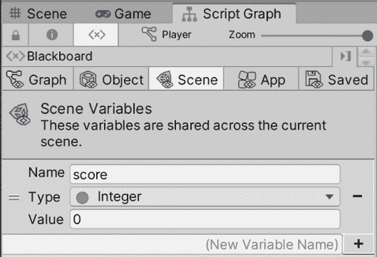

图 8.10：将场景变量添加到我们的游戏中

最后，对于增加分数的行为，我们可以在敌人中添加以下图。记住，像往常一样，只保留 C#或 Visual Scripting 版本的脚本，不要两者都保留。

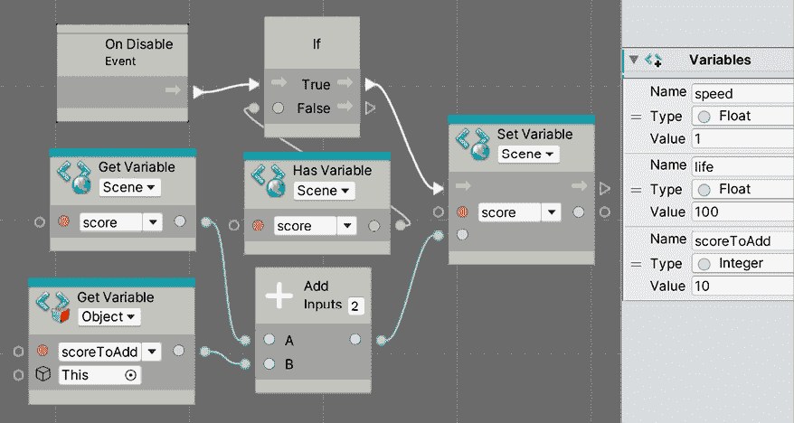

图 8.11：当此对象被销毁时增加分数

首先，这个脚本看起来与我们的 C#版本非常相似；我们添加了对象（**Object**作用域）的`s**coreToAdd**`变量，然后根据节点添加到整个场景的`score`变量中。你可以看到的主要区别是，这里我们使用的是**On Disable**事件而不是**OnDestroy**。实际上，**OnDestroy**是正确的选择，但在当前版本的 Visual Scripting 中，存在一个阻止其正常工作的 bug，所以我暂时替换了它。**On Disable**的问题在于它会在对象被禁用时执行，而对象在被销毁之前可能已经被禁用，也可能在其他情况下被禁用（例如，使用**Object Pooling**，这是一种回收对象而不是不断销毁和实例化对象的方法），但到目前为止这已经足够我们使用了。请在尝试此图时首先考虑使用**OnDestroy**，看看它是否在你的 Unity 或 Visual Scripting 包版本中运行正常。

值得注意的是，使用**Has Variable**节点来检查**分数**变量是否存在。这样做是因为**OnDisable**可以在敌人被销毁或场景改变时执行，我们将在本章后面的内容中通过输赢屏幕来实现这一点。如果我们试图在那个时刻获取场景变量，如果**Scene Variables**对象在**GameMode**对象之前被销毁，由于场景的改变涉及首先销毁场景中的所有对象，我们可能会遇到错误。

如您现在可能已经注意到的，尽管视觉脚本与 C# 非常相似，但有一种概念可以解决另一种无法解决的问题。现在我们知道了如何共享变量，让我们完成一些我们将在游戏后期需要的其他管理器。

## 创建管理器

有时，我们需要一个地方来汇总一组相似对象的信息，例如，`EnemyManager`，以检查敌人的数量，并可能访问它们的数组以迭代它们并执行任何额外的游戏实现，例如使我们的 `MissionManager` 能够访问游戏中所有活动的任务。同样，这些情况可以被认为是 Singleton，即不会重复的单个对象（在我们的当前游戏设计中），因此让我们创建我们将在游戏中需要的那些，即 `EnemyManager` 和 `WaveManager`。

在我们的游戏中，`EnemyManager` 和 `WaveManager` 将仅用作保存现有敌人波次的引用数组的场所，就像知道它们当前数量的方式一样。有方法可以搜索特定类型的所有对象来计算它们的数量，但这些函数成本高昂，除非你真的知道你在做什么，否则不建议使用。因此，将管理器实现为 Singleton，并具有针对目标对象类型的单独更新引用列表，将需要更多的代码，但性能会更好。此外，随着游戏功能的增加，这些管理器将具有更多功能和支持函数来与这些对象交互。

让我们从敌人管理器开始，按照以下步骤进行：

1.  将一个名为 `Enemy` 的脚本添加到 **Enemy** 预制件中；这将是一个将此对象与 `EnemyManager` 连接的脚本。

1.  创建一个名为 `EnemyManager` 的空 `GameObject`，并向其添加一个名为 `EnemiesManager` 的脚本。

1.  在脚本内部创建一个名为 `instance` 的 `EnemiesManager` 类型的 `public` 静态字段，并在 `Awake` 方法中添加与我们在 `ScoreManager` 中所做的相同的 Singleton 重复检查。

1.  创建一个名为 `enemies` 的 `List<Enemy>` 类型的公共字段：

    图 8.12：敌人组件列表

    C# 中的列表表示一个动态数组，一个能够添加和删除对象的数组。您将看到您可以在编辑器中向此列表添加和删除元素，但请保持列表为空；我们将以另一种方式添加敌人。请注意，`List` 在 `System.Collections.Generic` 命名空间中；您将在我们脚本的开始处找到 `using` 语句。此外，请考虑您可以将列表设为私有，并通过 getter 而不是公共字段将其暴露给代码；但像往常一样，我们现在将使代码尽可能简单：

    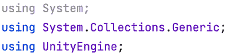

    图 8.13：使用 `List` 类，位于 `System.Collections.Generic` 中

    考虑到 `List` 是一个类类型，所以它必须被实例化，但因为这个类型在编辑器中有暴露支持，Unity 会自动实例化它。当你想要一个非编辑器暴露的列表时，例如一个私有列表或在常规的非组件 C# 类中的列表，你必须使用 `new` 关键字来实例化它。

    C# 列表在内部实现为一个数组。如果你需要一个链表，请使用 **LinkedList** 集合类型代替。

1.  在 `Enemy` 脚本的 `Start` 函数中，访问 `EnemyManager` 单例，并使用敌人列表的 `Add` 函数将此对象添加到列表中。这将“注册”此敌人作为活动状态在管理器中，以便其他对象可以访问管理器并检查当前敌人。`Start` 函数在所有 `Awake` 函数调用之后被调用，这是很重要的，因为我们需要确保在敌人的 `Start` 函数之前执行管理器的 `Awake` 函数，以确保有一个设置为实例的管理器。

    我们使用 `Start` 函数解决的问题被称为竞态条件，即当两段代码不能保证按相同顺序执行时，而 `Awake` 执行顺序可能会因不同原因而改变。代码中有很多情况会发生这种情况，所以请注意你代码中可能存在的竞态条件。此外，你可能考虑使用更高级的解决方案，例如在这里使用懒初始化，这可以给你更好的稳定性，但再次强调，为了简单和探索 Unity API，我们目前将使用 `Start` 函数方法。

1.  在 `OnDestroy` 函数中，从列表中删除敌人以保持列表只更新活动对象：

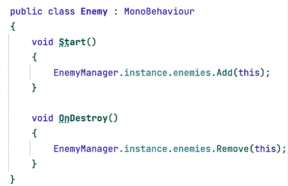

图 8.14：将自身注册为活动敌人的敌人脚本

这样，我们现在有一个集中的地方可以以简单而有效的方式访问所有活动敌人。我挑战你使用 **WaveManager** 做同样的事情，它将包含所有活动波浪的集合，以便稍后检查是否所有波浪都完成了它们的工作，从而认为游戏胜利。

花些时间解决这个问题；你将在以下屏幕截图中发现解决方案，从 **WavesManager** 开始：

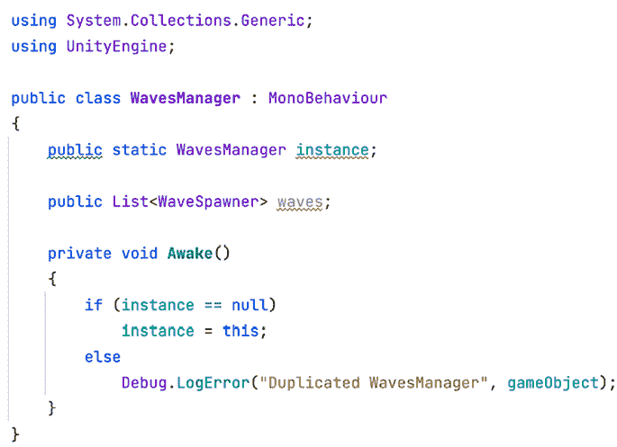

图 8.15：完整的 WavesManager 脚本

你还需要 `WaveSpawner` 脚本：

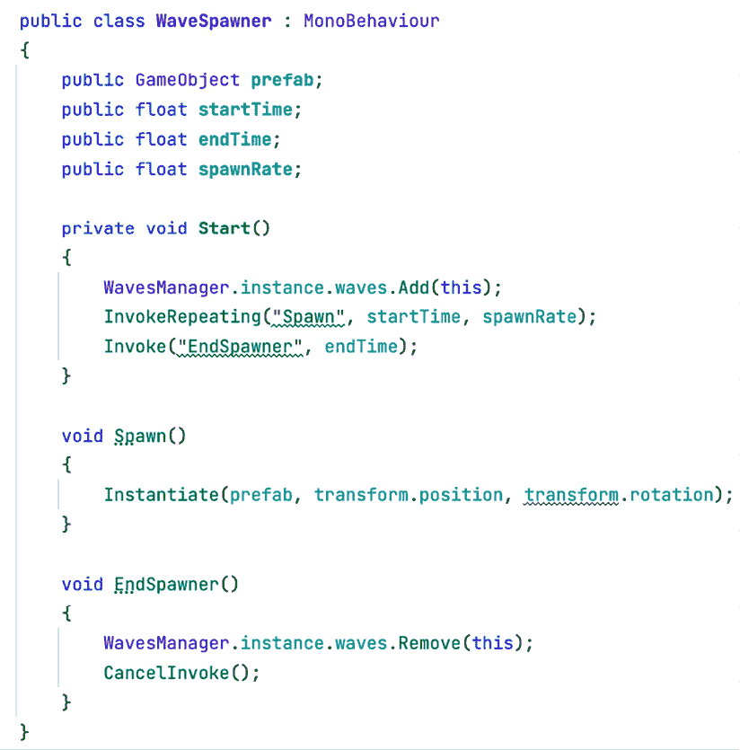

图 8.16：修改后的 WaveSpawner 脚本以支持 WavesManager

如你所见，`WavesManager`的创建方式与`EnemyManager`相同——只是一个带有`WaveSpawner`引用列表的单例，但`WaveSpawner`是不同的。我们在`WaveSpawner`的`Start`事件中执行列表的`Add`函数，将波注册为活动波，但`Remove`函数需要更多的工作。

策略是在生成器完成其工作后，从活动波列表中注销该波。在这次修改之前，我们使用`Invoke`在一段时间后调用`CancelInvoke`函数来停止生成，但现在我们需要在结束时间之后做更多的事情。

在指定的波结束时间之后，我们不会调用`CancelInvoke`，而是调用一个名为`EndSpawner`的自定义函数，该函数将调用`CancelInvoke`来停止生成器，`Invoke Repeating`，同时还会调用从`WavesManager`列表中移除函数，以确保在`WaveSpawner`完成其工作后，移除列表中的函数被准确调用。

关于视觉脚本版本，我们可以将两个 GameObject 类型的列表添加到场景变量中，以保存现有波和敌人的引用，这样我们就可以跟踪它们。只需在变量类型选择器的搜索栏中搜索`List of GameObject`，你就可以找到它。在这种情况下，由于`WaveSpawner`和敌人脚本的视觉脚本版本不是我们可以像 C#那样引用的类型，所以列表中只包含 GameObject。如果你同时创建了这些的 C#和视觉脚本版本，你会看到你可以引用 C#版本，但我们不会混合 C#和视觉脚本，因为这不属于本书的范围，所以忽略它们。无论如何，鉴于视觉脚本**变量**系统的工作方式，如果需要，我们仍然可以使用**GetVariable**节点访问变量——记住变量不在视觉脚本中，而是在**变量**节点中：

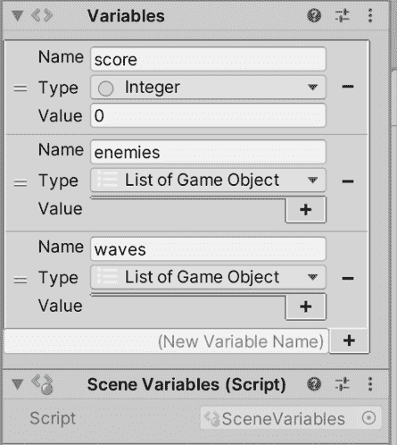

图 8.17：向场景变量中添加列表

然后，我们可以在**WaveSpawner**图中添加以下内容：

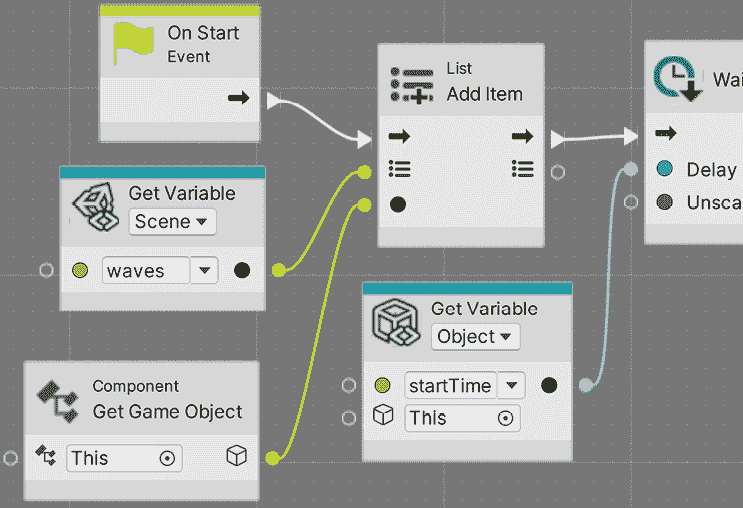

图 8.18：向列表中添加元素

我们使用**Add List Item**节点将我们的 GameObject 添加到**waves**变量中。我们在**On Start**事件节点之前将其作为第一件事来做。要移除该波从活动波中，你需要进行以下更改：

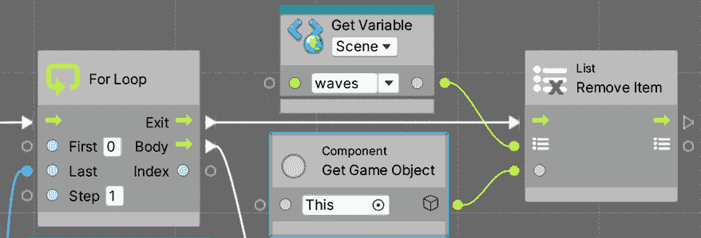

图 8.19：从列表中移除元素

我们使用**For Loop**的**Exit**流程输出引脚从列表中移除这个生成器，该引脚在`for`循环完成迭代时执行。

最后，关于**敌人**，你需要创建一个新的**敌人脚本**图，它看起来类似：

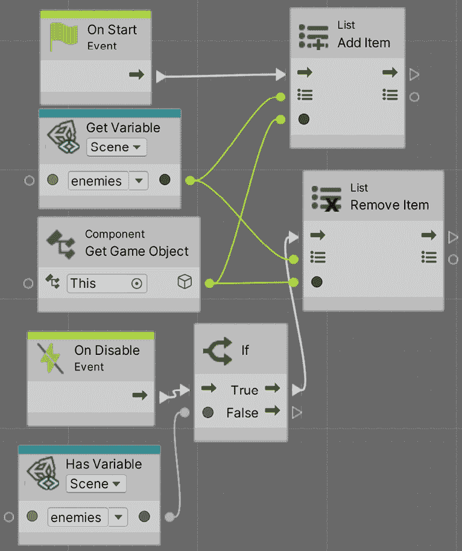

图 8.20：敌人将自己添加到列表中并从中移除

正如你所见，我们只需在**On Start**时添加敌人，并在**OnDisable**时移除它。记得由于我们之前提到的错误，首先尝试使用**OnDestroy**而不是**OnDisable**。你可以通过在具有**Scene Variables** GameObject 被选中的情况下玩游戏来检查这些更改，并观察其值如何变化。此外，记得如果我们正在更改场景，需要使用**Has Variable**节点。

使用对象管理器，我们现在可以集中管理一组对象的信息，并且可以在这里添加各种对象组逻辑。我们创建了`EnemiesManager`、`WavesManager`和`ScoreManager`作为集中存储几个游戏系统信息的地方，例如场景中存在的敌人和波次，以及分数。我们还看到了视觉脚本版本，将数据集中存储在场景变量对象中，这样所有的视觉脚本都可以读取这些数据。但除了用于更新 UI（我们将在下一章中这样做）的信息之外，我们还可以使用这些信息来检测我们的游戏是否满足胜利和失败条件，创建一个**游戏模式**对象来检测这一点。

## 创建游戏模式

我们已经创建了对象来模拟游戏中的许多游戏玩法方面，但游戏需要结束，无论我们赢或输。一如既往，问题是逻辑应该放在哪里，这引出了更多的问题。主要问题将是，我们是否总是以相同的方式赢或输？我们是否会有一个具有不同于“消灭所有波次”的不同标准的特殊关卡，比如限时生存？只有你知道这些问题的答案，但如果你现在的答案是“不”，这并不意味着它不会在以后改变，因此建议我们准备代码以无缝适应变化。

说实话，编写能够无缝适应变化的代码几乎是不可能的；没有一种方法可以考虑到所有可能的情况，我们迟早都需要重写一些代码。我们将尽力使代码尽可能通用，以适应变化，但我们需要在必要性和不必要的适应性之间找到平衡。创建通用代码往往会生成复杂的代码库，并且需要更多的时间，尽管一定程度的复杂性肯定是必要的，但很多时候，我看到程序员们超出了所需，花费大量时间来解决简单的情况，创建了最终利用率低下的工具。

要做到这一点，我们将胜利和失败条件的逻辑分离到其自己的对象中，我喜欢将其称为“GameMode”（不一定是行业标准）。这将是一个将监督游戏、检查需要满足的条件以考虑游戏结束的组件。它将像我们游戏中的裁判。游戏模式将不断检查对象管理器中的信息，以及可能的其他信息源，以检测所需条件。将此对象与其他对象分离，使我们能够创建具有不同游戏模式的级别；只需在该级别使用另一个游戏模式脚本即可。

在我们的案例中，我们现在将只有一个游戏模式，该模式将检查波浪和敌人的数量是否变为`0`，这意味着我们已经杀死了所有可能的敌人，游戏胜利。同时，它还将检查玩家的生命值是否达到`0`，考虑到在这种情况下游戏失败。让我们通过以下步骤创建它：

1.  创建一个新的空`GameMode`对象，并向其添加一个`WavesGameMode`脚本。正如你所见，我们给脚本起了一个描述性的名字，考虑到我们可以添加其他游戏模式。

1.  在其`Update`函数中，通过使用`Enemy`和`Wave`管理器检查敌人数量和波浪数量是否达到`0`；在这种情况下，目前只需在控制台`print`一条消息。所有列表都有一个`Count`属性，它将告诉你存储在内部元素的数量。

1.  添加一个名为`PlayerLife`的`Life`类型的`public`字段，并将玩家拖到该字段；这里的想法是也要在这里检测失败条件。

1.  在`Update`中，添加另一个检查以检测`playerLife`引用的生命值是否达到`0`，如果是这样，则在控制台`print`一条失败信息：

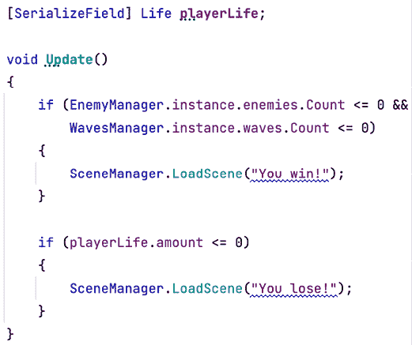

图 8.21：WavesGameMode 中的胜利和失败条件检查

1.  玩游戏并测试两种情况——玩家的生命值是否达到`0`，或者你是否杀死了所有敌人和波浪。

    现在，是时候用更有趣的消息替换它们了。目前，我们只需将当前场景更改为**胜利场景**或**失败场景**，该场景将只有一个带有胜利或失败消息和重新播放按钮的 UI。将来，你可以添加一个**主菜单****场景**，并有一个选项返回到它。让我们通过以下步骤实现这一点：

1.  创建一个新的场景（**文件 | 新场景**）并保存它，将其命名为`WinScreen`。

1.  添加一些指示这是胜利场景的东西，比如简单地用一个球体，相机指向它。这样，我们知道何时切换到胜利场景。

1.  在**项目**视图中选择场景，然后按*Ctrl* + *D*（在 Mac 上为*Cmd* + *D*）来复制场景。将其重命名为`LoseScreen`。

1.  双击`LoseScreen`场景以打开它，并将球体更改为不同的东西，比如一个立方体。

1.  前往**文件 | 构建设置**以打开此窗口内的**构建中的场景**列表。

这个想法是 Unity 需要你明确声明所有必须包含在游戏中的场景。你可能有一些测试场景或者你还不打算发布的场景，这就是为什么我们需要这样做。在我们的案例中，我们的游戏将包含`WinScreen`、`LoseScreen`以及我们迄今为止创建的带有游戏场景的场景，我将其称为`Game`，所以只需将这些场景从**项目**视图拖到**构建设置**窗口的列表中；我们需要这样做才能使游戏模式脚本在场景之间正确切换。此外，考虑到这个列表中的第一个场景将是我们在最终版本（即构建版本）中玩游戏时首先打开的场景，所以你可能需要根据这一点重新排列列表：

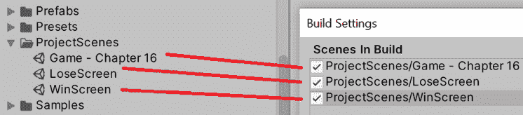

图 8.22：将场景注册到游戏构建中

+   在`WavesGameMode`中，添加一个`using`语句用于`UnityEngine.SceneManagement`命名空间，以启用此脚本中的场景切换功能。

+   将控制台`print`消息替换为对`SceneManager.LoadScene`函数的调用，该函数将接收一个包含要加载的场景名称的字符串；在这种情况下，将是`WinScreen`和`LoseScreen`。你只需要场景名称，而不需要文件的完整路径。

    如果你想要连接不同的关卡，你可以创建一个`public`字符串字段，以便你可以在编辑器中指定要加载哪些场景。记住将场景添加到**构建设置**中。如果不这样做，当你尝试更改场景时，控制台将显示错误信息：

    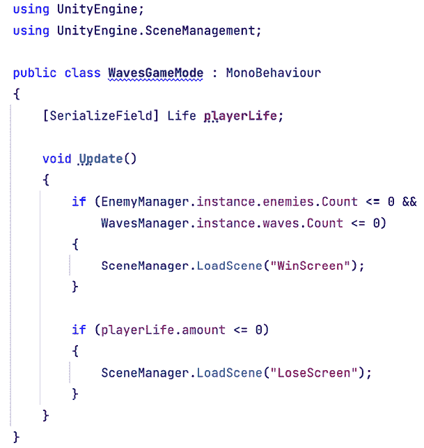

    图 8.23：使用 SceneManager 切换场景

+   玩游戏并检查场景是否正确切换。

目前，我们选择了最简单的方式来显示我们输赢，但将来，你可能想要比突然切换场景更柔和的方式，比如可能使用`Invoke`等待几秒钟来延迟这个变化，或者直接在游戏中显示胜利信息而不切换场景。当测试游戏并检查人们在玩游戏时是否理解发生了什么时，请记住这一点——游戏反馈对于让玩家了解正在发生的事情非常重要，并且不是一项容易的任务。

关于视觉脚本版本，我们在一个单独的对象中添加了一个新的脚本图。让我们逐个检查它，以便清楚地看到它。让我们从胜利条件开始：

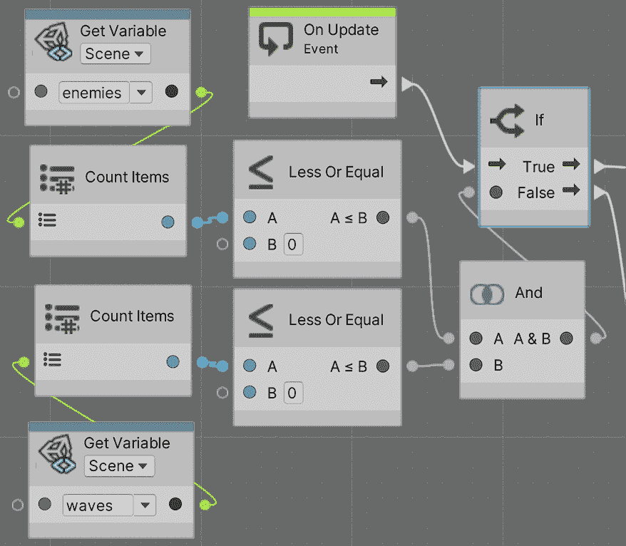

图 8.24：视觉脚本中的胜利条件

在这里，我们从场景上下文中获取**敌人**列表（**获取变量**节点），并且知道它包含一个列表，因此我们使用**计数项**节点来检查这个列表中剩余多少敌人。记住，我们有一个脚本在敌人被生成时将其添加到列表中，在它被销毁时将其移除。我们对波次也做同样的处理，所以使用**与**节点将条件组合起来，并通过**如果**节点连接，然后执行某些操作（稍后详细介绍）。

现在让我们来检查失败条件：

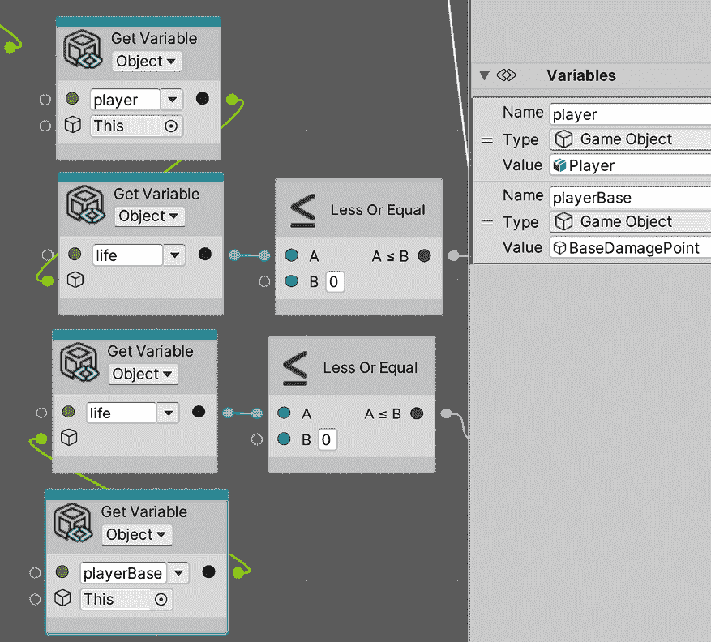

图 8.25：视觉脚本中的失败条件

由于玩家的生命状态不在场景上下文中（而且不应该在），并且玩家是一个与名为`GameMode`的 GameObject 不同的 GameObject（我们专门为这个脚本创建的），我们需要一个类型为 GameObject 的变量名为**Player**来引用它。

如您所见，我们在**变量**组件中将我们的玩家拖拽到上面。最后，我们使用**获取变量**来访问图中的玩家引用，然后使用另一个**获取变量**来提取其生命值。我们通过将玩家引用连接到**获取变量**节点的**生命**变量来实现这一点。然后我们对玩家的基础重复这一过程。

最后，我们通过以下方式加载场景：

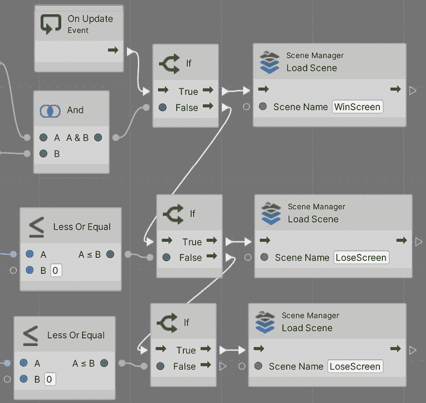

图 8.26：在视觉脚本中加载场景

如您所见，我们使用**场景管理器加载场景（场景名称）**节点来加载场景。注意我们加载了我们之前创建的两个场景（**WinScene**和**LoseScene**）。记住，这两个场景需要像之前一样添加到**构建设置**中的**构建中的场景**部分，以便在这里可以被场景管理器加载。

现在我们有一个功能齐全的简单游戏，具有机制和胜负条件，虽然这足以开始开发我们游戏的其它方面，但我想要讨论一下我们当前管理方法的问题以及如何通过事件来解决这些问题。

## 使用事件改进我们的代码

到目前为止，我们使用 Unity 事件函数来检测游戏中可能发生的情况，例如`Awake`和`Update`。Unity 还使用其他类似函数来允许组件之间相互通信，例如`OnTriggerEnter`，这是 Rigidbody 组件通知 GameObject 中其他组件发生碰撞的一种方式。在我们的情况下，我们使用`Update`方法中的`if`语句来检测其他组件的变化，例如`GameMode`检查敌人数量是否达到 0。但如果我们从敌人管理器那里得知有变化，我们就可以在那个时刻进行检查，例如，使用 Rigidbody 组件告诉我们何时发生碰撞，而不是每帧检查碰撞。

此外，有时我们依赖于 Unity 事件来执行逻辑，例如在`OnDestroy`事件中给出的分数，它通知我们对象何时被销毁，但由于事件的本性，它可能在我们不希望添加到分数的情况中被调用，例如当场景改变或游戏关闭时。在这些情况下，对象会被销毁，但不是因为玩家杀死了敌人，导致在不应该增加分数的情况下分数增加。在这种情况下，有一个告诉我们生命值达到 0 的事件来执行这个逻辑会很好，而不是依赖于通用的`OnDestroy`事件。

事件的概念是为了改进我们对象之间的通信模型，确保在某个事件发生的确切时刻，该情境中的相关部分被通知并相应地做出反应。Unity 有很多事件，但我们可以创建针对我们游戏逻辑特定的事件。让我们从应用我们之前讨论过的得分场景开始；想法是让`Life`组件有一个事件来通知其他组件对象被销毁是因为生命值达到了 0。

有几种方法可以实现这一点，我们将使用与**Awake**和**Update**方法略有不同的方法；我们将使用`UnityEvent`字段类型。这是一种字段类型，可以存储在需要执行时将要执行的函数的引用，就像 C#委托一样，但具有其他好处，例如更好的 Unity 编辑器集成。

要实现这一点，请执行以下操作：

1.  在`Life`组件中，创建一个名为`onDeath`的`public`类型的`UnityEvent`字段。该字段将代表一个事件，其他类可以订阅它，以便在`Life`达到 0 时得到通知：

图 8.27：创建自定义事件字段

1.  如果您保存脚本并进入编辑器，您可以在检查器中看到事件。Unity 事件支持在编辑器中订阅方法，因此我们可以将两个对象连接起来。我们将在 UI 脚本章节中使用这个功能，所以现在就忽略它吧：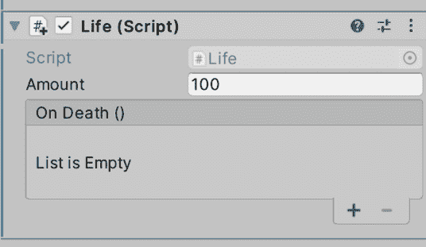

    图 8.28：UnityEvents 在检查器中显示

    您可以使用通用委托操作或自定义委托来创建事件，而不是使用`UnityEvent`，除了某些性能方面外，唯一明显的区别是`UnityEvent`将在编辑器中显示，如*步骤 2*所示。

1.  当生命值达到`0`时，调用事件的`Invoke`函数。这样，我们将告诉任何对事件感兴趣的脚本它已经发生：

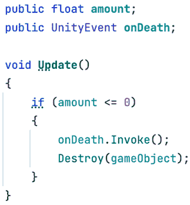

图 8.29：执行事件

1.  在`ScoreOnDeath`中，将`OnDestroy`函数重命名为`GivePoints`或您喜欢的任何名称；这里的想法是在`OnDestroy`事件中停止给予分数。

1.  在`ScoreOnDeath`脚本的`Awake`函数中，使用`GetComponent`获取`Life`组件并将其保存在局部变量中。

1.  调用`Life`引用的`onDeath`字段的`AddListener`函数，并将`GivePoints`函数作为第一个参数传递。这被称为**订阅**我们的`listener`方法`GivePoints`到`onDeath`事件。想法是告诉`Life`在`onDeath`事件被调用时执行`GivePoints`。这样，`Life`会通知我们这种情况。记住，您不需要调用`GivePoints`，只需将其作为字段传递即可：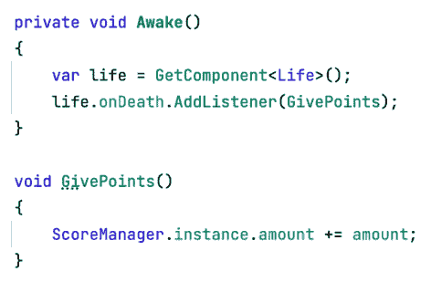

    图 8.30：订阅 OnDeath 事件以在该场景中给予分数

    考虑在`OnDestroy`中调用`RemoveListener`；像往常一样，在可能的情况下取消订阅监听器以防止任何内存泄漏（当引用阻止 GC 释放内存时）。在这种情况下，这并不是完全必要的，因为`Life`和`ScoreOnDeath`组件将同时被销毁，但尽量养成这种良好习惯。

1.  保存，在编辑器中选择`ScoreManager`，然后按**播放**来测试这个功能。在**播放**模式下尝试从层次结构中删除一个敌人，以检查分数是否没有上升，因为敌人被销毁的原因不是他们的生命值变为 0；您必须射击敌人以看到分数增加。

    现在，由于`Life`有一个`onDeath`事件，我们也可以通过以下方式将玩家的`Life`检查从`WavesGameMode`替换为使用事件：

1.  在`WavesGameMode`脚本上创建一个`OnPlayerDied`函数，并将`LoseScreen`场景的加载从`Update`方法移动到这个函数。由于事件版本将替代它，你将移除`Update`方法中检查生命的`if`语句。

1.  在`Awake`中，将这个新函数添加到玩家`Life`组件引用的`onDeath`事件中，在我们的脚本中称为`playerLife`：

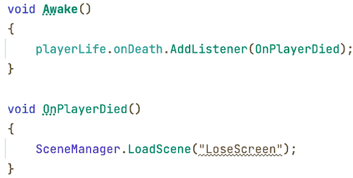

图 8.31：使用事件检查失败条件

如你所见，创建自定义事件允许你检测 Unity 中除了默认情况之外更具体的情况，并保持你的代码整洁，无需在`Update`函数中不断检查几个条件，这并不一定是坏事，但事件方法生成的代码更清晰。

记住，我们也可以通过玩家的基础`Life`达到 0 来输掉游戏，所以让我们创建一个代表敌人将攻击以减少基础`Life`的对象的立方体。考虑到这一点，我挑战你将这个第二个失败条件（玩家的基础生命达到 0）添加到我们的脚本中。当你完成时，你可以在下面的屏幕截图中检查解决方案：

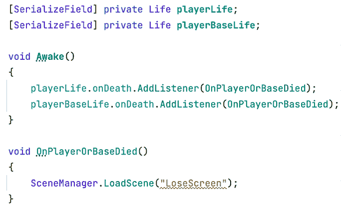

图 8.32：完整的 WavesGameMode 失败条件

如你所见，我们只是重复了`life`事件订阅，记得创建一个对象来表示玩家的基础伤害点，并给它添加一个`Life`脚本，然后将它拖动到`WavesGameMode`中的玩家基础`Life`参考。这里有趣的是，我们为玩家`Life`和基础`Life`的`onDeath`事件订阅了同一个名为`OnPlayerOrBaseDied`的函数，因为我们希望在这两种情况下得到相同的结果。

现在，让我们继续通过将其应用于经理来阐述这个概念，以防止游戏模式每帧都检查条件：

1.  在`EnemyManager`中添加一个名为`onChanged`的`UnityEvent`字段。这个事件将在每次将敌人添加到列表或从列表中删除时执行。

1.  创建两个函数，`AddEnemy`和`RemoveEnemy`，都接收一个`Enemy`类型的参数。想法是，而不是让`Enemy`直接从列表中添加和删除自己，它应该使用这些函数。

1.  在这两个函数内部，调用`onChanged`事件来通知其他人敌人列表已被更新。想法是，任何想要从列表中添加或删除敌人的人都需要使用这些函数：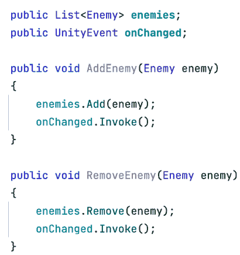

    图 8.33：在添加或删除敌人时调用事件

    在这里，我们面临的问题是没有任何东西阻止我们绕过这两个函数并直接使用列表。你可以通过将列表设为私有并使用`IReadOnlyList`接口暴露它来解决这个问题。记住，这样，列表在编辑器中不可见，便于调试。

1.  将`Enemy`脚本更改为使用这些函数：

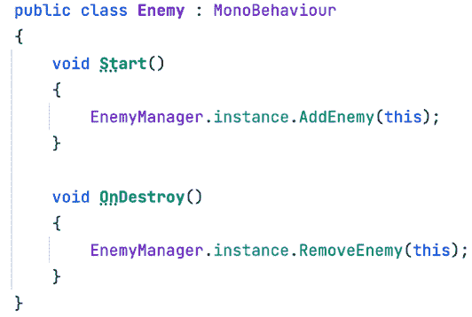

图 8.34：使敌人使用添加和删除函数

1.  对`WaveManager`和`WaveSpawner`重复相同的步骤，创建一个`onChanged`事件，创建`AddWave`和`RemoveWave`函数，并在`WaveSpawner`中调用它们而不是直接访问列表。这样，我们可以确保在必要时调用事件，就像我们对`EnemyManager`所做的那样。

    尝试自己解决这个问题，然后检查以下屏幕截图中的解决方案，从`WavesManager`开始：

    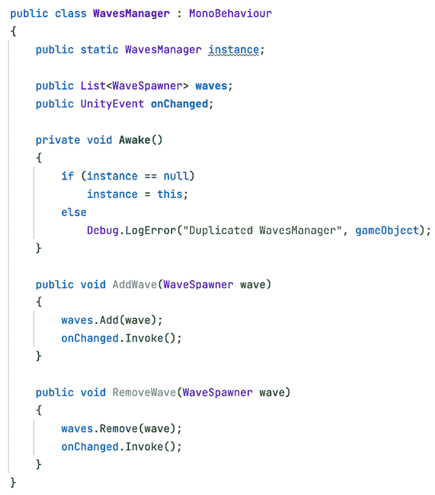

    图 8.35：WavesManager OnChanged 事件实现

1.  此外，`WaveSpawner`还需要以下更改：

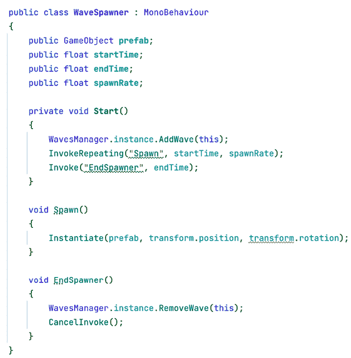

图 8.36：实现 AddWave 和 RemoveWave 函数

1.  在`WavesGameMode`中，将`Update`重命名为`CheckWinCondition`，并将此函数订阅到`EnemyManager`和`WavesManager`的`onChanged`事件。目的是仅在必要时检查敌人数量和波浪的变化。由于单例在`Awake`中初始化，请记住在`Start`函数中进行事件订阅：

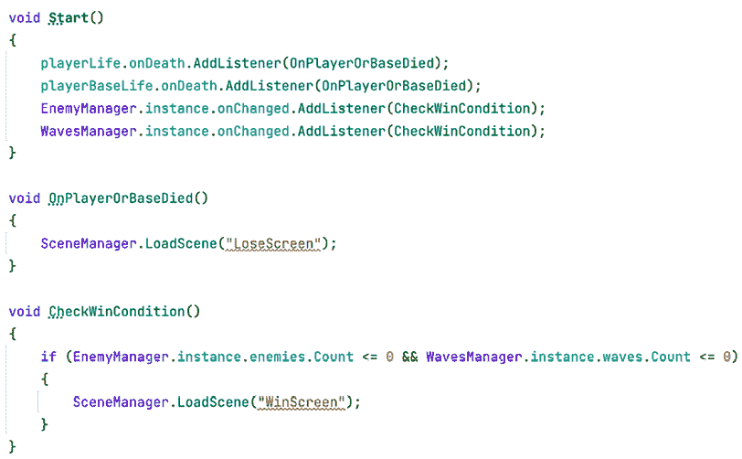

图 8.37：当敌人或波浪数量变化时检查胜利条件

关于视觉脚本版本，让我们首先通过事件检查失败条件，首先检查**生命脚本图**中需要的一些更改：

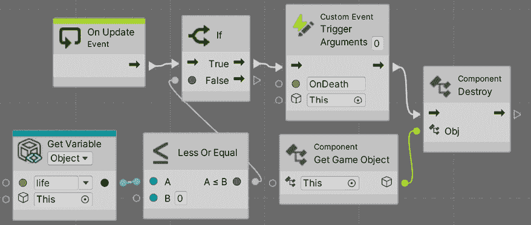

图 8.38：在我们的 Life 脚本图中触发自定义事件

首先，当生命值降至 0 时销毁对象后，我们使用**触发自定义事件**节点，指定事件名称为`OnDeath`。这将通知任何等待`OnDeath`事件执行的人它已经执行。记住，这是我们**生命脚本图**。确保在触发事件后调用**destroy**——虽然大多数时候顺序并不重要，因为**destroy**动作实际上是在帧末发生的，有时可能会引起问题，所以这里还是小心为妙。在这种情况下，游戏模式应该监听玩家的`OnDeath`事件，所以让我们在我们的**游戏模式图**中进行以下更改：

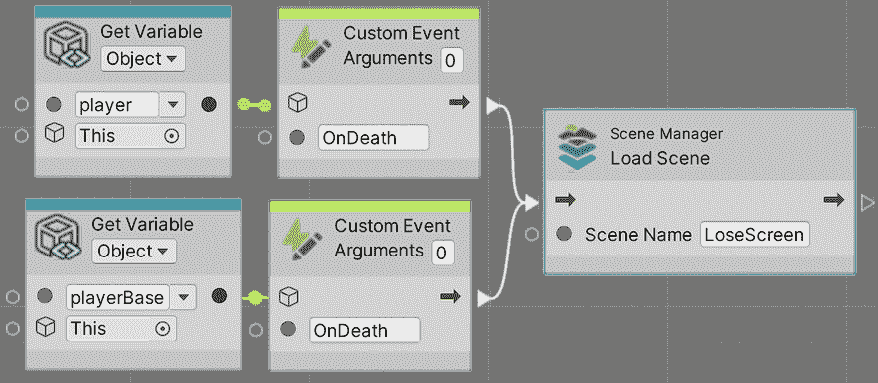

图 8.39：在视觉脚本中监听玩家的 OnDeath 事件

我们使用了**自定义事件**节点，将其连接到我们的游戏模式的玩家引用。这样，我们指定如果那个玩家执行该事件，我们将执行**加载场景**节点。记住，玩家引用是至关重要的，因为它指定了我们想要从谁那里执行`OnDeath`事件，记住**生命视觉图表**也会出现在敌人中，而我们对此不感兴趣。此外，记得移除我们之前用来检测此情况的`If`节点和条件节点——我们的游戏模式将拥有的唯一`If`是胜利条件。

实际上，我们让任何使用`Life`脚本的物体都拥有一个`OnDeath`事件，并且让游戏模式专门监听玩家的`OnDeath`事件。

我们也可以为敌人和波次创建事件，但这可能会使我们的图表变得有些复杂，因为我们没有在视觉脚本版本中的`WaveManager`或`EnemyManager`。我们当然可以创建这些来完成任务，但有时使用视觉脚本的目的就是创建简单的逻辑，这类改变往往会使得图表变得相当庞大。

另一个可能的解决方案是让敌人和波次直接通知游戏模式。我们可以在敌人和波次中使用**触发自定义事件**，将其节点连接到游戏模式，最终让游戏模式拥有一个**自定义事件**节点，从而可以监听。问题是这会违反我们对象之间的正确依赖关系；较低级别的对象，如敌人和波次，不应该与较高级别的对象，如游戏模式，进行通信。

实际上，游戏模式原本应该是一个监管者。如果我们应用前一段描述的解决方案，我们就不可能在另一个场景或游戏中没有游戏模式的情况下拥有敌人。所以，为了简单和代码解耦的目的，让我们保持其他条件不变——更复杂的逻辑可能完全在 C#的完整生产项目中处理。

是的，使用事件意味着我们不得不比以前写更多的代码，从功能上来说，我们没有获得任何新的东西，但在更大的项目中，通过`Update`检查来管理条件会导致之前讨论过的一些问题，例如竞争条件和性能问题。有时，拥有可扩展的代码库需要更多的代码，而这正是其中之一。

在我们完成之前，有一点需要考虑的是，Unity 事件并不是在 Unity 中创建此类事件通信的唯一方式；你将发现一个类似的方法称为**Action**，这是事件的本地 C#版本，如果你想要查看所有可用的选项，我建议你了解一下。

在本章中，我们探索了一些编程模式，但还有很多。你可以在这里了解更多：[`gameprogrammingpatterns.com/`](https://gameprogrammingpatterns.com/)

# 摘要

在本章中，我们完成了游戏的一个重要部分：结局，无论是通过胜利还是失败。我们讨论了一种简单但强大的方法，通过使用单例创建的管理器来分离不同的责任层，以确保每种类型的管理器只有一个实例，并通过静态访问简化它们之间的连接。此外，我们还探讨了事件的概念，以简化对象之间的通信，防止问题并创建更有意义的对象间通信。

借助这些知识，你现在不仅能够检测游戏的胜利和失败条件，而且还能以更结构化的方式进行。这些模式可以用来改进我们的游戏代码，我建议你尝试在其他相关场景中应用它们。

在下一章中，我们将开始书的**第三部分**，**提升视觉效果、效果和音频**，我们将探讨不同的 Unity 系统来改善我们游戏的图形和音频方面，首先看看我们如何创建材料来修改我们对象的一些属性，以及如何使用 Shader Graph 创建着色器。

# 在 Discord 上了解更多信息

与其他用户、Unity 游戏开发专家以及作者本人一起阅读这本书。提出问题，为其他读者提供解决方案，通过 Ask Me Anything（问我任何问题）环节与作者聊天，等等。扫描二维码或访问链接加入社区：

[`packt.link/unitydev`](https://packt.link/unitydev)

