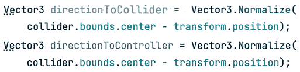
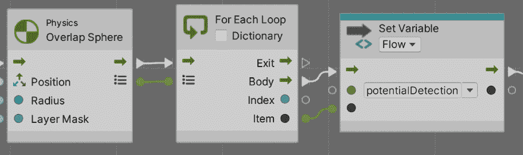
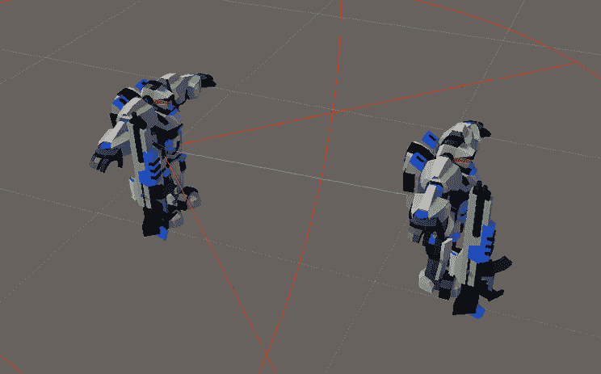
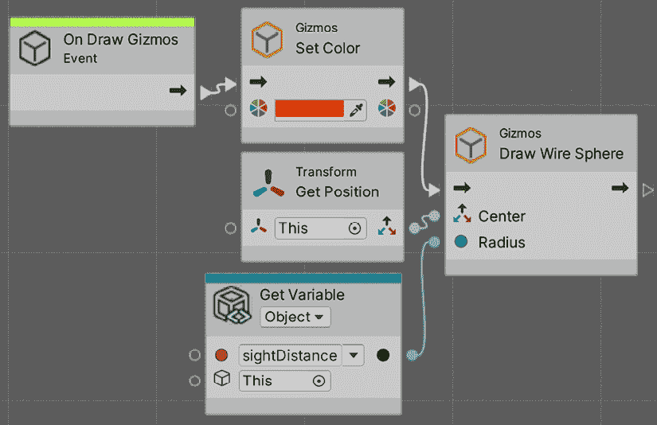
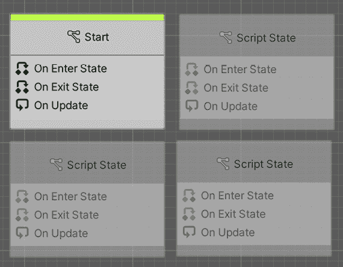

# 第九章：开始你的 AI 之旅：为你的游戏构建智能敌人

如果说游戏不是对玩家的一项巨大挑战，那么玩家需要使用角色的能力来应对不同的场景，那游戏又是什么呢？每种游戏都会给玩家带来不同类型的障碍，但在我们的游戏中，主要的挑战来自敌人。想象一下，一个能够感知你的存在并战略性地计划攻击的敌人——这正是我们通过这些 AI 技术所追求的目标。创建具有挑战性和可信度的敌人可能很复杂；它们必须表现得像真实的人物，足够聪明以提供挑战，但又不足以不可战胜。我们将使用基本但足够的 AI 技术来使 AI 能够感知其周围环境，并根据这些信息做出决策，决定做什么，使用**有限状态机**（**FSMs**）以及其他技术。这些决策将通过**智能路径查找**来执行。

在本章中，我们将探讨以下 AI 概念：

+   使用传感器收集信息

+   使用 FSM 进行决策

+   执行 FSM 动作

这些组件对于创建不仅具有反应性，而且展现出类似智能和策略的敌人至关重要。到本章结束时，你将拥有一个功能齐全的敌人，能够检测玩家并对其进行攻击，所以让我们首先看看如何制作传感器系统。

# 使用传感器收集信息

游戏中的 AI 工作在三个步骤中：收集信息、分析信息，并根据这种分析执行动作。这一点很重要，因为它反映了人类思维的一个简单版本，使得生成的 AI 更加逼真。正如你所见，没有信息我们无法做任何事情，所以让我们从这部分开始。

我们的人工智能可以使用多种信息来源，例如关于自身的数据（生命和子弹）或可能是某些游戏状态（胜利条件或剩余敌人），这些都可以通过我们迄今为止看到的代码轻松找到。然而，一个重要的信息来源是传感器，如视觉和听觉。在我们的案例中，视觉就足够了，所以让我们学习如何编写这部分代码。

在本节中，我们将探讨以下传感器概念：

+   使用 C#创建三种过滤传感器

+   使用视觉脚本创建三种过滤传感器

+   使用 gizmos 进行调试

让我们先看看如何使用三种过滤方法创建一个传感器。

## 使用 C#创建三种过滤传感器

编码感官的常见方法是使用一种三种过滤方法来排除视线之外的敌人。每个过滤器都会排除超出我们传感器范围的物体。第一个过滤器是距离过滤器，它会排除太远而看不见的敌人，然后第二个过滤器是角度检查，它会检查我们视野锥体内的敌人，最后，第三个过滤器是射线投射检查，它会排除被墙壁等障碍物遮挡的敌人。

在开始之前，有一句话要提醒：我们将在这里使用向量数学，而深入探讨这些主题超出了本书的范围。如果您不理解某些内容，请随时在网上搜索截图中的代码。

让我们以下面的方式编写传感器代码：

1.  创建一个名为 `AI` 的空 `GameObject`，作为 **Enemy** 预制件的子对象。您需要首先打开预制件以修改其子对象（双击预制件）。请记住将此 `GameObject` 的变换设置为 **位置**（**0，** **1.75，0**），**旋转（0，0，0**）和 **缩放（1，1，1**），以便它与敌人的眼睛对齐。这样做是为了未来我们将做的视觉传感器。请注意，您的 **Enemy** 预制件的眼睛可能具有不同的高度。虽然我们可以直接将所有 AI 脚本直接放在 **Enemy** 预制件根 `GameObject` 中，但我们这样做只是为了分离和组织：

图 9.1：AI 脚本容器

1.  创建一个名为 `Sight` 的脚本，并将其添加到 `AI` 子 GameObject。

1.  创建两个名为 `distance` 和 `angle` 的 `float` 类型的字段，以及另外两个名为 `obstaclesLayers` 和 `objectsLayers` 的 `LayerMask` 类型的字段。`distance` 字段将用作视野距离，`angle` 将确定视锥体的幅度，`obstaclesLayers` 将用于我们的障碍物检查以确定哪些对象被认为是障碍物，而 `objectsLayers` 将用于确定我们想要 `Sight` 组件检测的对象类型。

    我们只想让视野看到敌人；我们对墙壁或增益物品等对象不感兴趣。**LayerMask** 是一种属性类型，允许我们在代码中选择一个或多个层来使用，因此我们将通过层过滤对象。

图 9.2：用于参数化我们的视野检查的字段

1.  在 `Update` 中调用 `Physics.OverlapSphere`，如 *图 9.3* 所示。

此函数在由第一个参数指定的位置（在我们的情况下，是我们的位置）创建一个假想的球体，并具有第二个参数指定的半径（距离属性）以检测具有第三个参数指定的层（`ObjectsLayers`）的对象。它将返回一个包含在球体内找到的所有碰撞器的数组；这些函数使用物理进行检查，因此对象必须至少有一个碰撞器。

这是我们将使用的方法来找到我们视野距离内的所有敌人，我们将在下一步中进一步过滤它们。请注意，我们正在将我们的位置传递给第一个参数，这实际上不是敌人的位置，而是 `AI` 子对象的位置，因为我们的脚本位于那里。这突出了 `AI` 对象位置的重要性。

完成第一个检查的另一种方法是检查我们想要看到的物体与玩家之间的距离，或者如果寻找其他类型的物体，到一个包含它们的`Manager`组件。然而，我们选择的方法更灵活，可以用于任何类型的物体。

此外，你可能还想检查这个函数的`Physics.OverlapSphereNonAlloc`版本，它执行相同的操作，但通过不分配返回结果的数组而更高效。

1.  使用`for`循环遍历函数返回的对象数组：

    图 9.3：获取一定距离内的所有 GameObject

    为了检测物体是否落在视野锥内，我们需要计算我们的观察方向与从我们自身指向物体本身的方位之间的角度。如果这两个方向之间的角度小于我们的锥形角度，我们认为物体落在我们的视野内。我们将在以下步骤中这样做：

1.  开始计算指向物体的方向，这可以通过将物体位置与我们的位置之间的差异进行归一化来实现，如*图 9.4*所示。你可能注意到我们使用了`bounds.center`而不是`transform.position`；这样，我们检查的是指向物体中心的方位，而不是其旋转点。记住，玩家的旋转点在地面，射线检查可能会在玩家之前与之碰撞：

图 9.4：从我们的位置计算指向碰撞体的方向

1.  我们可以使用`Vector3.Angle`函数来计算两个方向之间的角度。在我们的情况下，我们可以计算指向敌人的方向与我们的前进向量之间的角度来查看角度：

    图 9.5：计算两个方向之间的角度

    如果你愿意，你可以使用`Vector3.Dot`，这将执行点积——一种数学函数，用于计算一个向量在另一个向量上的投影长度（在网上搜索更多信息）。`Vector3.Angle`实际上使用这个函数，但将点积的结果转换为角度，这需要使用三角函数，并且可能计算起来很耗时。我们的`Vector3.Angle`方法更简单，编码更快，而且鉴于我们不需要很多传感器，因为我们不会有太多敌人，使用点积优化传感器现在不是必要的，但请考虑这一点，对于更大规模的游戏。

1.  现在检查计算出的角度是否小于在`angle`字段中指定的角度。注意，如果我们设置角度为`90`，实际上会是`180`，因为如果`Vector3.Angle`函数返回，例如，`30`，它可能是向左或向右的`30`。如果我们的角度是`90`，它可能是向左和向右的`90`，因此它将检测到 180 度弧内的物体。

1.  使用 `Physics.Linecast` 函数在第一个和第二个参数（我们的位置和碰撞体位置）之间创建一个假想线，以检测第三参数（障碍层）中指定的层上的对象，并返回一个布尔值，指示该射线是否击中了某个对象。

    策略是使用线来检测我们和检测到的碰撞体之间是否存在任何障碍物，如果没有障碍物，这意味着我们有一个直接视线通向该对象。观察我们在 *图 9.6* 中如何使用 `!` 或 `not` 操作符来检查 `Physics.Linecast` 没有检测到任何对象。再次注意，这个函数依赖于具有碰撞器的障碍物对象，在我们的例子中，我们有（墙壁、地板等）：

    

    图 9.6：使用 Linecast 检查传感器和目标对象之间的障碍物

1.  如果对象通过了这三个检查，这意味着这是我们目前看到的对象，因此我们可以将其保存在 `Collider` 类型的字段 `detectedObject` 中，以便稍后由其他 `AI` 脚本使用该信息。

    考虑使用 `break` 来停止迭代碰撞体的 `for` 循环，以防止通过检查其他对象而浪费资源，并在 `for` 之前将 `detectedObject` 设置为 `null` 以清除前一帧的结果。如果在当前帧中没有检测到任何内容，它将保持 `null` 值，这样我们就会注意到传感器中没有东西：

    

    图 9.7：完整的传感器脚本

    在我们的例子中，我们只是使用传感器来寻找玩家（传感器负责寻找的唯一对象），但如果你想让传感器更高级，你只需保留一个检测到的对象列表，在其中放置通过三个测试的每个对象，而不仅仅是第一个。在我们的例子中，这并不必要，因为我们游戏中只有一个玩家。

1.  在编辑器中，根据您的意愿配置传感器。在这种情况下，我们将 `Objects Layer` 设置为 `Player`，这样我们的传感器就会专注于搜索具有该层的对象，并将 `Obstacles Layer` 设置为 `Default`，这是我们用于墙壁和地板的层。记住，`Sight` 脚本位于 `AI` GameObject 中，它是 `Enemy` 预制件的子对象：

图 9.8：传感器设置

1.  要测试这一点，只需在玩家前方放置一个移动速度为 **0** 的敌人，选择其 `AI` 子对象，然后玩游戏以查看属性在检查器中的设置情况。此外，尝试在两者之间放置一个障碍物，并检查属性是否显示 **None** (`null`)。如果您没有得到预期的结果，请仔细检查您的脚本、其配置以及玩家是否具有 **Player** 层，障碍物是否具有 **Default** 层。您可能还需要将 `AI` 对象稍微抬高一点，以防止射线从地面以下开始并击中它。请随意进行进一步测试，以真正理解您的代码。

现在我们已经了解了 C#中传感器的工作原理，让我们看看可视化脚本版本。

## 使用可视化脚本创建三过滤传感器

关于可视化脚本版本，让我们逐部分检查，从**重叠球体**开始：

图 9.9：可视化脚本中的重叠球体

到目前为止，我们只是在将`sensedObject`变量设置为`null`后调用了**重叠球体**。上一张图片不仅包含了我们目前需要的变量，还包括了我们以后会使用的变量，所以请记住创建所有这些变量。需要考虑的一点是，在检查器中的**变量**组件中的`sensedObject`变量可能在你的情况下具有**Null**类型，这意味着在可视化脚本中没有类型。这在 C#中是不可能的——所有变量都必须有类型——虽然我们可以将`sensedObject`变量设置为正确的类型（**Collider**），但我们将会通过脚本将其变量类型留待以后设置。即使我们现在设置类型，如果没有设置值，可视化脚本往往会忘记类型，并且我们无法设置它，直到我们检测到某个东西。

目前不必担心这个问题；当我们通过我们的脚本设置变量时，它将获得正确的类型。实际上，在可视化脚本中，所有变量都可以在运行时根据我们设置的值切换类型，这取决于**变量**组件的工作方式。我不建议在运行时更改变量的类型，因为这会给它赋予不同的含义。尽量坚持预期的变量类型。

我们刚才说过，C#中的所有变量都必须有类型，但这并不完全正确。有方法可以创建动态类型的变量，但这不是一种我推荐使用的良好实践，除非没有其他选择。

另一点要注意的是，我们是如何在开始时使用**Null**节点将`sensedObject`变量设置为`null`，这实际上代表了`null`值。

现在，让我们探索一下**Foreach**部分：

图 9.10：在可视化脚本中迭代集合

我们可以看到，**重叠球体**的一个输出引脚有一个列表图标，这本质上代表了由**重叠球体**返回的`collider`数组。我们将该引脚连接到**For Each Loop**节点，正如你可能想象的那样，它遍历提供的集合（数组、列表、字典等）的元素。**Body**引脚代表循环中要执行的节点，**Item**输出引脚代表当前正在迭代的项——在我们的情况下，是**重叠球体**检测到的其中一个碰撞体。最后，我们将该项保存在一个**Flow** `potentialDetection`变量中（**Flow**变量在 C#函数中相当于局部变量）。

为了保持我们的视觉脚本图清晰，避免杂乱，我们将当前迭代的碰撞体分配给一个名为`potentialDetection`的**Flow**变量。这种方法消除了在整个图中进行大量连接的需要，简化了视觉布局和随后对该碰撞体的引用。

现在让我们探索**角度**检查：

图 9.11：视觉脚本中的角度检查

这里，你可以看到我们将 C#中检测角度所做操作的直接翻译，因此应该很容易理解。

现在，让我们探索**Linecast**部分：

图 9.12：视觉脚本中的 Linecast 检查

再次强调，这基本上与我们之前所做的是一样的。这里要强调的唯一一点是我们使用了**Flow**变量`potentialDetection`来再次获取当前迭代的项的位置，而不是将**Get Position**节点连接到 For Each Item 输出引脚。

现在，让我们探索最后一部分：

图 9.13：设置 sensedObject

再次强调，这部分内容基本上是自我解释的；如果**Linecast**返回**False**，我们将`potentialDetection`变量（当前迭代的项）设置为`sensedObject`变量（稍后其他脚本将访问的变量，以查询现在我们的 AI 可以看到哪个对象）。这里需要考虑的是**Break Loop**节点的使用，它等同于 C#中的`break`关键字；本质上，我们正在停止我们当前所在的**Foreach**循环。

现在，即使我们的传感器正在工作，有时，检查它是否工作或配置正确需要一些我们可以使用 gizmos 创建的视觉辅助工具。

## 使用 gizmos 进行调试

在创建我们的 AI 时，我们将开始检测边缘情况中的某些错误，通常与配置错误有关。你可能认为玩家在敌人的视线范围内，但也许你看不到视线被一个物体遮挡，尤其是在敌人不断移动的情况下。调试这些场景的一个好方法是使用仅编辑器可用的视觉辅助工具，即 gizmos，它允许你可视化诸如视线距离或用于检测障碍物的`Linecasts`等不可见数据。

让我们通过以下步骤开始了解如何创建绘制表示视线距离的球体 gizmos：

1.  在`Sight`脚本中，创建一个名为`OnDrawGizmos`的事件函数。这个事件仅在编辑器中执行（不在构建中），是绘制任何 Unity 中 gizmos 的地方。

1.  使用`Gizmos.DrawWireSphere`函数，将我们的位置作为第一个参数，将距离作为第二个参数，在我们的位置上绘制一个半径为我们的距离的球体。你可以检查当改变`distance`字段时 gizmo 的大小如何变化：

图 9.14：球体 gizmo

1.  可选地，你可以在调用绘图函数之前设置 `Gizmos.color` 来更改 gizmo 的颜色：

    图 9.15：Gizmos 绘制代码

    现在你正在不断绘制 gizmos，如果你有很多敌人，它们可以用太多的 gizmos 污染**场景**视图。在这种情况下，尝试使用 `OnDrawGizmosSelected` 事件函数，它只在对象被选中时绘制 gizmos。

1.  我们可以使用 `Gizmos.DrawRay` 来绘制代表锥体的线条，它接收要绘制的线条的起点和方向，方向可以通过乘以一个特定的值来指定线条的长度，如下面的截图所示：

图 9.16：绘制旋转线条

1.  在截图，我们使用了 `Quaternion.Euler` 来根据我们想要旋转的角度生成一个四元数。四元数是一种数学结构，用于表示旋转；请搜索此术语以获取更多关于它的信息。如果我们用一个方向乘以这个四元数，我们将得到旋转后的方向。我们正在根据 `angle` 字段旋转我们的前进向量以生成我们的锥形视觉线条。

此外，我们将这个方向乘以视线距离来绘制线条，直到我们的视线所能看到的地方；你会看到线条如何与球体的末端匹配：

图 9.17：视觉角度线条

我们还可以绘制线条投射，它们检查障碍物，但它们依赖于游戏的当前情况，例如通过前两个检查的对象及其位置，我们可以使用 `Debug.DrawLine` 代替，它可以在 `Update` 方法中执行。这种 `DrawLine` 版本是为运行时设计的。我们看到的 gizmos 也在编辑器中执行。让我们以下面的方式尝试它们：

1.  首先，让我们调试 `Linecast` 没有检测到任何障碍物的情况，因此我们需要在传感器和物体之间绘制一条线。我们可以在调用 `Linecast` 的 `if` 语句中调用 `Debug.DrawLine`，如下面的截图所示：

图 9.18：在 Update 中绘制线条

1.  在下一张截图，你可以看到 `DrawLine` 的实际应用：

图 9.19：指向检测到的物体的线条

1.  我们还希望在视线被物体遮挡时用红色绘制线条。在这种情况下，我们需要知道线条投射击中的位置，因此我们可以使用函数的重载，它提供了一个 `out` 参数，它提供了更多关于碰撞的信息，例如击中的位置、法线和碰撞的物体，如下面的截图所示：

    图 9.20：获取 Linecast 的信息

    使用`out`关键字声明的参数允许方法通过参数返回数据。有关此信息的更多信息，请查看以下链接：[`learn.microsoft.com/en-us/dotnet/csharp/language-reference/keywords/out`](https://learn.microsoft.com/en-us/dotnet/csharp/language-reference/keywords/out)。

    注意，`Linecast`并不总是与最近的障碍物碰撞，而是与它在直线上检测到的第一个对象碰撞，这可能会变化。如果你需要检测最近的障碍物，请查找函数的`Physics.Raycast`版本。

1.  我们可以使用这些信息在`if`语句的`else`部分绘制从我们的位置到击中点的线条，当线条与某个物体碰撞时：

图 9.21：如果我们有障碍物，则绘制线条

1.  在下一张屏幕截图中，你可以看到结果。确保在**场景**视图工具栏中开启**Gizmos**选项（最右侧的球形图标）：

图 9.22：当障碍物遮挡视线时的线条

关于视觉脚本版本，第一部分将看起来像这样：

图 9.23：使用视觉脚本绘制辅助工具

然后，角度线将看起来像这样：

图 9.24：在视觉脚本中绘制视线角度线

注意，这里我们只展示了一个；另一个基本上是相同的，但将角度乘以-1。最后，指向检测到的对象和障碍物的红色线条将看起来像这样：

图 9.25：在视觉脚本中绘制指向障碍物或检测到的对象的线条

注意，为了完成这个最后一步，我们需要将之前的**Linecast**节点更改为返回**Raycast Hit**信息的版本。

在本节中，我们创建了将赋予我们的 AI 视力和大量关于下一步做什么的信息的传感器系统。现在我们已经完成了传感器，让我们使用它们提供的信息使用 FSM 做出决策。

## 使用 FSM 做出决策

在过去，当我们使用`Animator`组件时，我们探索了有限状态机（FSM）的概念。为了回顾，我们建议复习*第十七章*，*动画现实：使用 Animator、Cinemachine 和 Timeline 创建动画*。我们了解到，FSM 是一组状态，每个状态代表一个对象在某一时刻可以执行的动作以及一组转换，这些转换决定了状态如何切换。这个概念不仅用于动画，而且在许多编程场景中都有应用，其中之一就是人工智能。对于人工智能，每个状态将代表在某一时刻可能激活的不同人工智能行为，转换将代表需要满足的条件，以便其他人工智能行为能够激活。例如，在射击游戏中，敌人可以具有诸如**空闲**、**巡逻**、**攻击**、**逃跑**、**躲避**等状态。

为了进一步强化 FSM 概念，我们建议回顾以下链接：[`gameprogrammingpatterns.com/state.html`](https://gameprogrammingpatterns.com/state.html)。

在本节中，我们将检查以下 AI FSM 概念：

+   在 C#中创建 FSM

+   创建转换

+   在视觉脚本中创建 FSM

让我们通过创建一个 C#中的 FSM 来开始实现这个 FSM 理论。

## 在 C#中创建 FSM

要创建我们自己的 FSM，我们需要回顾一些基本概念。记住，FSM 可以为它可能执行的每个动作都有一个状态，并且一次只能执行一个。

在 AI 方面，例如，我们可以巡逻、攻击、逃跑等等。同时，记住状态之间有转换，这些转换决定了从一个状态转换到另一个状态所需满足的条件，在 AI 方面，这可能是用户靠近敌人开始攻击或生命值低开始逃跑。在下一张图中，你可以找到一个简单的门两种可能状态的提醒示例：

图 9.26：FSM 骨架

实现 AI 的 FSM 有几种方法；如果你想的话，甚至可以使用`Animator`组件或从资源商店下载 FSM 系统。在我们的案例中，我们将采取最简单的方法——一个包含一系列`if`语句的脚本，这可能是基本的，但仍然是理解概念的好开始。让我们通过以下步骤来实现它：

1.  在敌人的`AI`子对象中创建一个名为`EnemyFSM`的脚本。

1.  创建一个名为`EnemyState`的枚举，包含`GoToBase`、`AttackBase`、`ChasePlayer`和`AttackPlayer`值。我们将在我们的 AI 中拥有这些状态。

1.  创建一个名为`currentState`的`EnemyState`类型字段，它将保存我们敌人的当前状态：

    图 9.27：EnemyFSM 状态定义

    关于枚举如何工作，我们建议查看以下链接：[`learn.microsoft.com/en-us/dotnet/csharp/language-reference/builtin-types/enum`](https://learn.microsoft.com/en-us/dotnet/csharp/language-reference/builtin-types/enum)。

1.  创建三个以我们定义的状态命名的函数。

1.  根据当前状态在`Update`中调用这些函数：

    图 9.28：基于 if 的 FSM

    是的，你完全可以在这里使用 switch，但我只是更喜欢这个示例中的常规`if`语法。

1.  在编辑器中测试如何通过更改`currentState`字段来改变活动状态，查看在**控制台**窗口中打印的消息：

图 9.29：状态测试

如您所见，这是一个相当简单但完全实用的方法。在未来，您可能需要编写具有更多状态的游戏敌人，这种方法将开始变得不适用。在这种情况下，您可以使用 Asset Store 中您喜欢的任何 FSM 插件来获得更强大和可扩展的工具，或者甚至考虑更高级的技术，如行为树，但这超出了本书的范围。现在让我们继续使用 FSM，通过创建其转换。

# 创建转换

如果您记得在 Animator Controller 中创建的转换，那些基本上是一系列检查转换所属状态是否激活的条件。在我们的 FSM 方法中，这简单地转化为检测状态内部条件的`if`语句。让我们按照以下方式创建我们提议状态之间的转换：

1.  在我们的 FSM 脚本中添加一个名为`sightSensor`的`Sight`类型字段，并将`AI`GameObject 拖拽到该字段以连接到那里的`Sight`组件。由于 FSM 组件与`Sight`组件位于同一对象中，我们也可以使用`GetComponent`，但在高级 AI 中，您可能有不同的传感器来检测不同的对象，所以我更喜欢为那种情况准备我的脚本。您应该选择您最喜欢的做法。

1.  在`GoToBase`函数中，检查`Sight`组件检测到的对象是否不为`null`，这意味着在我们的视线中有物体。如果我们的 AI 正在向基地移动但检测到障碍物，我们必须切换到`Chase`状态以追逐玩家，因此我们改变状态，如下截图所示：

图 9.30：创建转换

1.  此外，如果我们离必须损坏的对象足够近，为了减少基础生命值，我们必须切换到`AttackBase`。我们可以创建一个类型为`Transform`的字段，命名为`baseTransform`，并将之前创建的玩家基础生命值对象拖拽到那里，以便我们可以检查距离。记得添加一个名为`baseAttackDistance`的`float`字段，以便可以配置该距离：

图 9.31：GoToBase 转换

1.  在`ChasePlayer`的情况下，我们需要检查玩家是否在视线之外，以便切换回`GoToBase`状态，或者我们是否足够接近玩家以开始攻击它。我们需要另一个名为`PlayerAttackDistance`的`distance`字段，它决定了攻击玩家的距离，我们可能希望为这两个目标设置不同的攻击距离。考虑在转换中提前返回，以防止在没有任何传感器检测到的对象时尝试访问传感器检测到的对象的位置时出现`null`引用异常：

图 9.32：追逐玩家转换

1.  对于`AttackPlayer`，我们需要检查玩家是否在视线之外，以便返回`GoToBase`，或者它是否足够远，可以返回追逐它。您会注意到我们是如何将`playerAttackDistance`乘以，使停止攻击的距离略大于开始攻击的距离；这将防止当玩家接近那个距离时在攻击和追逐之间快速切换。

1.  您可以将它设置为可配置的，而不是硬编码`1.1`：

图 9.33：攻击玩家状态转换

1.  在我们的例子中，`AttackBase` 不会有任何转换。一旦敌人足够接近基地以攻击它，它就会保持这种状态，即使玩家开始射击它。一旦到达那里，它的唯一目标就是摧毁基地。

1.  记住您可以使用`Gizmos`来绘制距离：

图 9.34：有限状态机（FSM）组件

1.  通过在点击**播放**之前选择`AI`对象，然后移动玩家，检查**检查器**面板中状态的变化来测试脚本。您还可以保留每个状态中的原始`print`消息，以在**控制台**窗口中查看它们的变化。请记住设置攻击距离和对象引用。在屏幕截图中，您可以查看我们使用的设置：

图 9.35：敌人有限状态机（FSM）设置

我们现在将遇到的一个小问题是生成的敌人将没有需要的引用来计算到玩家基地变换的距离。您会注意到，如果您尝试将场景中的敌人更改应用到预制件（**覆盖 | 应用全部**），则**基地变换**变量将显示为**None**。请记住，预制件不能包含对场景中对象的引用，这使我们的工作变得复杂。一个替代方案是创建`BaseManager`，一个单例，它持有对损伤位置的引用，这样我们的`EnemyFSM`就可以访问它。另一个方案是利用`GameObject.Find`等函数来查找我们的对象。

在这种情况下，我们将使用后者。尽管它可能不如`Manager`版本性能好，但我想要向您展示如何使用它来扩展您的 Unity 工具集。在这种情况下，只需将`baseTransform`字段在`Awake`中设置为`GameObject`.`Find`的返回值，使用`BaseDamagePoint`作为第一个参数，这将查找具有相同名称的对象，如下面的屏幕截图所示。

您会看到现在我们生成的敌人波次将改变状态：

图 9.36：通过名称在场景中搜索对象

当我开始学习关于游戏人工智能时，我以为我会使用像深度学习这样的复杂算法来创建天网。正如你所见，我们离那个目标还很远，原因在于游戏人工智能不需要智能，它需要的是趣味性。要实现这一点，需要精心设计来生成确切期望的体验，而这可能使用尖端的人工智能技术很难实现。

话虽如此，还有其他人工智能技术，比如行为树，你可以在本篇光环开发者文章中了解更多：[`www.gamedeveloper.com/programming/gdc-2005-proceeding-handling-complexity-in-the-i-halo-2-i-ai`](https://www.gamedeveloper.com/programming/gdc-2005-proceeding-handling-complexity-in-the-i-halo-2-i-ai)

另一个名为 GOAP 的替代方案，我建议阅读来自 F.E.A.R.开发者的这篇论文：[`www.gamedevs.org/uploads/three-states-plan-ai-of-fear.pdf`](https://www.gamedevs.org/uploads/three-states-plan-ai-of-fear.pdf) 最后，还有游戏人工智能专业书籍系列，它收集了多篇与游戏人工智能相关的论文，你可以在这里了解更多：[`www.gameaipro.com/`](http://www.gameaipro.com/)

在本节中，我们使我们的有限状态机（FSM）能够根据传感器和其他来源提供的数据正确切换状态，为开始编写每个状态的实际行为奠定基础。现在我们的 FSM 状态已经编码并且能够正确执行转换，让我们看看如何在视觉脚本中做到同样的事情。如果你只对 C#版本感兴趣，可以自由跳过以下部分。

## 在视觉脚本中创建 FSM

到目前为止，大多数视觉脚本中的脚本几乎是对 C#版本的镜像，只是在一些节点上有所不同。至于状态机，我们本可以做到一样；相反，我们将使用视觉脚本的**状态机**系统。概念是相同的——你有状态并且可以切换它们——但是状态的组织方式和何时触发转换是由视觉管理的，这与**动画器**系统类似。所以，让我们看看如何通过创建我们的第一个**状态机图**和一些状态来使用这个系统。按照以下步骤操作：

1.  将**状态机**组件添加到我们的敌人身上。请记住，它被称为**状态机**，而不是**脚本机**，后者是常规视觉脚本的组件。

1.  在组件中点击**新建**按钮，并选择一个位置来保存固定资产，方式与我们迄今为止为常规视觉脚本所做的一样。在我的例子中，我将其命名为`EnemyFSM`。

图 9.37：创建视觉脚本状态机

1.  双击**状态机图**以像往常一样编辑它。

1.  在**图**编辑器的任何空白区域右键单击，然后选择**创建脚本状态**以创建一个新状态：

图 9.38：创建我们的第一个可视化脚本状态机状态

1.  重复*步骤 4*，直到您拥有四个状态：

图 9.39：可视化脚本状态

1.  选择任何一个状态，然后在左侧的**信息**面板中，将**标题**字段（第一个字段）填写为我们之前创建的任何状态的名称（`GoToBase`、`AttackBase`、`ChasePlayer`和`AttackPlayer`）。如果您看不到**信息**面板，请点击中间带有**i**的按钮以显示它：

图 9.40：重命名可视化脚本状态

1.  对其余的状态节点重复此操作，直到每个节点都按照本章*在 C# 中创建有限状态机*部分创建的状态命名：

图 9.41：所有所需的状态

1.  您可以看到其中一个状态顶部有一个绿色条，这代表哪个节点应该是第一个。我将那个初始状态重命名为`GoToBase`，因为这是我首选的第一个状态。如果您没有将其作为起始状态，请右键单击当前具有绿色条的状态机中的节点，选择**切换起始**以从它中移除绿色条，然后对您想要作为第一个的节点（在我们的场景中是`GoToBase`）重复此操作，将绿色条添加到该节点上。

1.  需要考虑的是，在可视化脚本中可以有一个以上的起始状态，这意味着您可以同时运行多个状态并进行转换。如果可能，我建议一次不要激活多个状态，以使事情变得简单。

1.  双击`GoToBase`以进入这些状态的编辑模式。将一个**字符串**节点连接到**OnUpdate**事件节点中的**打印** **消息**输入引脚，以打印一条表示**GoToBase**的消息：

图 9.42：我们的第一个状态机逻辑

1.  在顶部栏中，点击**GoToBase**左侧的**EnemyFSM**标签以返回到整个**状态机**视图。如果您看不到它，请点击第三个按钮（看起来像**<x>**）右侧的任何文本标签：

图 9.43：返回到状态机编辑模式

1.  如果您不打算使用它们，可以随意删除其他事件节点。

1.  对每个状态重复执行*步骤 9*到*11*，直到所有状态都打印出它们的名称。

通过这种方式，我们已经创建了表示我们 AI 可能状态的节点。在下一节中，我们将为它们添加逻辑，使其变得有意义，但在那之前，我们需要创建状态之间的转换以及触发它们的条件，具体操作如下：

1.  在敌人的**变量**组件中创建变量`baseTransform`、`baseAttackDistance`和`playerAttackDistance`，因为我们需要它们来进行转换。

1.  不要将任何类型设置为`baseTransform`，因为我们将在稍后通过代码填充它，但关于`baseAttackDistance`，使用**Float**类型并设置值为`2`，最后，对于`playerAttackDistance`，也使用**Float**并设置值为`3`。如果您愿意，可以更改这些值：

图 9.44：我们转换所需的变量

1.  右键单击`GoToBase`节点，选择**创建转换**选项，然后单击`ChasePlayer`节点。这将在这两个状态之间创建一个转换：

图 9.45：两个状态之间的转换

1.  对于在 C#版本中创建的每个转换，重复*步骤 3*。**状态机**图需要看起来像以下截图：

图 9.46：所有需要的转换

1.  双击**GoToBase**和**ChasePlayer**之间转换中间的黄色形状以进入**转换**模式。在这里，您将能够指定将触发该转换的条件（而不是在状态逻辑中使用`If`节点）。请记住，您有两个黄色形状，每个方向一个，所以请确保您双击的是基于连接它们的白色箭头的正确形状。

1.  修改图以检查`sensedObject`变量是否不是`null`。它应该看起来像这样：

图 9.47：添加转换条件

1.  **GoToBase**和**AttackBase**之间的转换应该如下所示：

图 9.48：GoToBase 到 AttackBase 的转换条件

1.  现在，**ChasePlayer**到**GoToBase**应该如下所示：

图 9.49：ChasePlayer 到 GoToBase 的转换条件

1.  对于**ChasePlayer**到**AttackPlayer**的转换，按照*图 9.50*中的操作进行。这本质上与**GoToBase**和**AttackBase**（距离检查）相同，但目标不同：

图 9.50：ChasePlayer 到 AttackPlayer 的转换条件

1.  对于**AttackPlayer**到**ChasePlayer**的转换，按照*图 9.51*中的操作进行。这是另一个距离检查，但现在检查距离是否更大，并将距离乘以`1.1`（以防止转换抖动，如我们在 C#版本中解释的）：

图 9.51：AttackPlayer 到 ChasePlayer 的转换条件

1.  最后，对于 **AttackPlayer** 到 **GoToBase**，这是预期的图：

图 9.52：从 **AttackPlayer** 到 **GoToBase** 的转换条件

在继续之前，我们需要解决的一个小细节是我们还没有在 `baseTransform` 变量中设置任何值。想法是通过代码填充它，就像我们在 C# 版本中所做的那样。但这里需要考虑的是，我们无法将 **Awake** 事件节点添加到整个状态机中，而只能添加到状态中。

在这个场景中，我们可以使用 **OnEnterState** 事件，这是状态机的专用事件节点。它将在状态变为活动状态时立即执行，这对于状态初始化很有用。我们可以将初始化 `baseTransform` 变量的逻辑添加到 **GoToBase** 状态的 **OnEnterState** 事件节点中，前提是它是我们首先执行的状态。

这样，**GoToBase** 逻辑将看起来像 *图 9.53*。请记住双击状态节点来编辑它：

图 9.53：**GoToBase** 的初始化逻辑

注意，在这里，我们将 **Find** 节点的结果仅设置到 **Null Check** 的 **Null** 插针上的变量中。**Null Check** 的作用是检查我们的 `baseTransform` 变量是否已设置，如果是，则通过 **Not Null** 插针，如果不是，则通过 **Null** 插针。这样，我们就可以避免每次进入 **GoToBase** 状态时都执行 `GameObject.Find`，而只需第一次执行。此外，请注意，在这种情况下，我们将不仅当对象初始化时执行 **Set Variable** 节点，而且每次 **GoToBase** 成为当前状态时也会执行。如果这导致意外的行为，其他选项可能是创建一个新的初始状态，初始化所有内容，然后过渡到其他状态，或者也许可以创建一个经典的视觉脚本图，在 **On Start** 事件节点中初始化这些变量。

通过所有这些，我们学习了如何通过 FSM 创建 AI 的决策系统。它将根据通过传感器和其他系统收集的信息做出决策。现在我们的 FSM 状态已经编码并且过渡得当，让我们让它们做一些事情。

## 执行 FSM 动作

现在我们需要完成最后一步——让 FSM 做一些有趣的事情。在这里，我们可以做很多事情，比如射击基地或玩家，并将敌人移动到其目标（基地或玩家）。我们将使用 Unity 的寻路系统 `NavMesh` 来处理移动，这是一个允许我们的 AI 在两点之间计算和遍历路径，同时避开障碍物的工具，它需要一些准备才能正常工作。

在本节中，我们将检查以下 FSM 动作概念：

+   计算场景的 NavMesh

+   使用寻路算法

+   添加最终细节

让我们先为使用寻路算法的场景做准备。

# 计算场景的 NavMesh

寻路算法依赖于场景的简化版本。分析复杂场景的完整几何形状在实时中几乎是不可能的。有几种方式可以表示从场景中提取的寻路信息，例如图和**NavMesh**几何形状。Unity 使用后者——一个类似于 3D 模型的简化网格，它跨越 Unity 确定的所有可通行区域。在下一张截图，你可以找到一个场景中生成的`NavMesh`示例——即，浅蓝色几何形状：

图 9.54：场景中可通行区域的 NavMesh

生成`NavMesh`可能需要几秒到几分钟，这取决于场景的大小。这就是为什么 Unity 的寻路系统在编辑器中只计算一次`NavMesh`，这样当我们发布我们的游戏时，用户将使用预先生成的`NavMesh`。在之前的 Unity 版本中，就像光照贴图一样，`NavMesh`通常会被烘焙到一个文件中以便以后使用。这意味着对`NavMesh`表面有贡献的 GameObject 曾经是静态的，并且在运行时不能对场景进行任何修改。Unity 中新的 AI 导航系统的主要优势是`NavMesh`对象现在可以在运行时改变。如果你摧毁或移动一个地板砖，AI 仍然会调整其行为以在该区域行走、停留或跌倒。这意味着如果在游戏过程中摧毁地板砖，`NavMesh`会动态更新以反映这一变化，显示 AI 不能再行走的区域。我们将安装并使用 AI 导航包来将这种行为添加到我们的游戏中。

要为我们的场景生成`NavMesh`，请执行以下操作：

1.  打开包管理器（**窗口** | **包管理器**）。

1.  将**包**下拉菜单设置为**Unity 注册表**模式。

1.  在列表中搜索一个名为 AI 导航的包。这个包将使我们能够访问新的组件，这些组件将帮助我们定义哪些表面是可走的，哪些代理可以走在上面。在撰写本书时，这个包的当前版本是 1.1.4：

图 9.55：安装 AI 导航包

1.  将`NavMeshSurface`组件添加到可通行表面。

1.  从最近添加的组件中，点击窗口底部的**烘焙**按钮，并检查生成的`NavMesh`：

图 9.56：生成 NavMesh

大概这就是你需要做的所有事情。当然，在这个组件中有很多设置你可以调整，例如**最大坡度**，它表示 AI 能够爬升的最大角度，或者**步高**，这将决定 AI 是否能够爬楼梯，连接`NavMesh`中楼梯之间的楼层，但鉴于我们有一个简单直接的场景，默认设置就足够了。

如果你想玩弄它们，你可以转到菜单栏并选择**窗口** | **AI** | **导航**。从那里，你将能够调整所有这些参数并重新烘焙`NavMeshSurface`以根据 AI 代理的大小调整可通行区域。

在我们场景的`NavMesh`设置完成后，我们已经为复杂的 AI 移动打下了基础。让我们通过编程我们的 AI 在游戏世界中导航来观察这一过程。

## 使用路径查找

为了制作一个使用`NavMesh`移动的 AI 对象，Unity 提供了`NavMeshAgent`组件，这将使我们的 AI 粘附在`NavMesh`上，防止对象超出其范围。它不仅会自动计算到指定目的地的路径，还会使用**引导**行为算法通过路径移动对象，模仿人类通过路径移动的方式，在拐角处减速，并通过插值而不是瞬间转向。此组件还确保 AI 角色彼此避免。它通过将每个角色引导远离其他角色来防止拥挤，保持游戏中的自然流动。

让我们通过以下方式使用这个强大的组件：

1.  选择**敌人**预制体，并向其添加`NavMeshAgent`组件。将其添加到根对象中，即名为`Enemy`的对象，而不是 AI 子对象——我们希望整个对象都能移动。你将看到围绕对象的一个圆柱体，表示对象在`NavMesh`中将占用的区域。注意，这并不是一个碰撞器，因此它不会被用于物理碰撞：

图 9.57：NavMeshAgent 组件

1.  删除`ForwardMovement`组件；从现在起，我们将用`NavMeshAgent`驱动敌人的移动。

1.  在`EnemyFSM`脚本的`Awake`事件函数中，使用`GetComponentInParent`函数将`NavMeshAgent`的引用缓存到一个新的`private`变量中。这会与`GetComponent`类似工作——它将在我们的 GameObject 中查找组件，但如果组件不存在，这个版本将尝试在所有父组件中查找该组件。记得添加`using UnityEngine.NavMesh`行以在脚本中使用`NavMeshAgent`类！

    图 9.58：缓存父组件引用

    如你所想，还有一个`GetComponentInChildren`方法，它首先在`GameObject`中搜索组件，如果需要，再在其所有子组件中搜索。

1.  在`GoToBase`状态函数中，调用`NavMeshAgent`引用的`SetDestination`函数，传入基地对象的坐标作为目标：

图 9.59：为我们的 AI 设置目的地

1.  保存脚本并在场景中的几个敌人或由波次生成的敌人上测试这个脚本。你会看到问题，敌人永远不会停止向目标位置移动，如果需要，甚至进入对象内部，即使他们的有限状态机（FSM）的当前状态在它们足够接近时发生变化。这是因为我们从未告诉`NavMeshAgent`停止，我们可以通过将智能体的`isStopped`字段设置为`true`来实现这一点。

1.  你可能想要调整基础攻击距离，使敌人停止得更近或更远一些：

图 9.60：停止智能体移动

1.  我们可以为`ChasePlayer`和`AttackPlayer`做同样的事情。在`ChasePlayer`中，我们可以将智能体的目的地设置为玩家的位置，在`AttackPlayer`中，我们可以停止移动。在这种情况下，`AttackPlayer`可以再次回到`GoToBase`或`ChasePlayer`，所以你需要在这些状态中将智能体的`isStopped`字段设置为`false`或在进行转换之前。我们将选择前者，因为这个版本将涵盖其他也需要停止智能体的状态，而无需额外的代码。我们将从`GoToBase`状态开始：

图 9.61：重新激活智能体

1.  然后，继续使用`ChasePlayer`：

图 9.62：重新激活智能体并追逐玩家

1.  最后，继续使用`AttackPlayer`：

图 9.63：停止移动

1.  你可以调整`NavMeshAgent`的**加速度**、**速度**和**角速度**属性来控制敌人移动的速度。平衡这些设置以确保 AI 在游戏中的移动方式合理。此外，请记住将更改应用到生成的敌人的 Prefab 中，以便受到影响。

1.  关于视觉脚本版本，`GoToBase`将看起来如下截图所示：

**

图 9.64：使我们的智能体移动

1.  我们删除了打印消息的**OnUpdate**事件节点，因为我们不再需要它。此外，我们在设置变量后调用了**设置目的地**节点，如果`if`为`null`，以及当变量不为`null`（**Null**检查的**Not Null**引脚）时。请注意，所有这些都在**On Enter State**事件中发生，所以我们只需要做一次。我们在 C#版本中为每一帧做这件事是为了简单起见，但实际上并不必要，所以我们将利用**On Enter State**事件。如果我们想，我们可以在 C#版本中模拟这种行为，在改变状态时（在检查转换条件的`if`语句内部）执行这些动作，而不是使用**Update**函数。最后，注意我们为什么需要使用**获取父节点**来访问敌人根对象中的`NavMeshAgent`组件？这是因为我们目前处于`AI`子对象中。

1.  现在，`AttackBase`状态将看起来如下：

图 9.65：使我们的智能体停止

1.  `ChasePlayer`状态将看起来像这样：

图 9.66：ChasePlayer 逻辑

1.  最后，`AttackPlayer`将看起来像这样：

图 9.67：AttackPlayer 逻辑

虽然 Unity 有其自己的路径查找系统，但它并非唯一，可能也不适合更高级的游戏。我建议学习路径查找的基础知识，比如了解 BFS、Dijkstra 和 A*算法。如果你想要深入研究，你可以学习更高级的技术，比如这篇 Killzone 开发者论文中解释的战术路径查找：[`cse.unl.edu/~choueiry/Documents/straatman_remco_killzone_ai.pdf`](http://cse.unl.edu/~choueiry/Documents/straatman_remco_killzone_ai.pdf)，或者这篇关于 Left 4 Dead AI 系统的演示：[`steamcdn-a.akamaihd.net/apps/valve/2009/ai_systems_of_l4d_mike_booth.pdf`](https://steamcdn-a.akamaihd.net/apps/valve/2009/ai_systems_of_l4d_mike_booth.pdf)。

现在随着我们的 AI 能够导航游戏世界，我们离拥有一个完全功能的敌人不远了。接下来，我们将添加一些细节，包括射击机制和动画，以完成 AI 的行为。

## 添加最终细节

这里我们缺少两件事：敌人没有射击任何子弹，并且它没有动画。让我们从修复射击开始做以下操作：

1.  在我们的`EnemyFSM`脚本中添加一个`GameObject`类型的`bulletPrefab`字段和一个名为`fireRate`的`float`字段。

1.  创建一个名为`Shoot`的函数，并在`AttackBase`和`AttackPlayer`中调用它：

图 9.68：射击函数调用

1.  在`Shoot`函数中，放入与`PlayerShooting`脚本中使用的类似代码，以特定射速射击子弹，如*图 9.68*所示。记得如果你的`Enemy` Prefab 中还没有设置，设置`Enemy`层，以防止子弹伤害到敌人本身。你可能还希望稍微提高`AI` GameObject 的位置，以便从地面以外的位置射击子弹，或者更好的是，添加一个`shootPoint`变换字段，并在敌人中创建一个空对象作为生成位置。如果你这样做，请考虑使空对象不旋转，以便敌人的旋转能够正确地影响子弹的方向：

    图 9.69：射击函数代码

    在这里，你可以在`PlayerShooting`和`EnemyFSM`之间找到一些重复的射击行为。你可以通过创建一个名为`Shoot`的函数的`Weapon`行为来修复这个问题，该函数实例化子弹并考虑射速，并在两个组件内部调用它以重新利用它。

1.  当代理停止时，不仅移动停止，旋转也会停止。如果玩家在敌人被攻击时移动，我们仍然需要敌人面对玩家以射击子弹。我们可以创建一个`LookTo`函数，该函数接收要观察的目标位置，然后在`AttackPlayer`和`AttackBase`中调用它，传递要射击的目标：

图 9.70：LookTo 函数调用

1.  通过计算我们的父对象到目标位置的方向来完成`LookTo`函数。我们通过`transform.parent`访问我们的父对象，因为，记得，我们是子`AI`对象——将要移动的对象是我们的父对象。然后，我们将方向`Y`分量设置为`0`以防止方向向上或向下指向——我们不希望我们的敌人垂直旋转。最后，我们将父对象的正向向量设置为该方向，这样它就会立即面对目标位置。如果你想要更平滑的旋转，可以用四元数插值来替换，但现在让我们尽可能保持简单：

图 9.71：朝向目标看去

1.  关于视觉脚本版本，**AttackBase**动作看起来是这样的：

图 9.72：AttackBase 状态

在这个状态下，我们有一些要强调的内容。首先，我们在**Set Stopped**节点之后，在**On Enter State**事件节点中使用了**Look At**节点。正如你可能想象的那样，这与我们在 C#中使用的数学方法相同。我们指定一个要观察的目标（我们的基地变换）并指定**World Up**参数是一个向上指向的向量`0`,`1`,`0`。这将使我们的对象朝向基地，但保持其向上向量指向天空，这意味着如果目标低于它，我们的对象不会朝向地面。

如果我们想的话，可以在 C#中使用这个确切的功能（`transform.LookAt`）；只是想展示所有选项。另外，注意我们只在状态变为活动时执行`LookAt`；因为基地不动，我们不需要不断更新我们的方向。

第二个要强调的是，我们使用了协程来射击，这与我们在**Enemy Spawner**中不断生成敌人的相同思路。本质上，我们在**Wait For Seconds**和**Instantiate**之间创建了一个无限循环。我们采取这种方法是因为它很方便，因为它在视觉脚本中需要的节点更少。

记得选择**On Enter State**节点并检查我们之前所做的**Coroutine**复选框。此外，我们还需要在**Enemy**的`AI`子对象中添加一个新的`Float`类型变量，名为`fireRate`：

图 9.73：协程

然后，**AttackPlayer** 将看起来像这样：

图 9.74：AttackPlayer 状态

实质上与**AttackBase**相同，但它面向的是`sensedObject`而不是玩家的基地，我们还把**Look At**节点作为无限循环的一部分，以便在射击前纠正敌人的航向，以瞄准玩家。

有了这些，我们已经完成了所有的 AI 行为。当然，这些脚本/图表足够大，未来值得重写和拆分，但有了这个，我们已经原型化了我们的 AI，我们可以测试它，直到我们满意为止，然后我们可以改进这段代码。

# 摘要

我很确定 AI 不是你想象的那样；你在这里不是在创造天网，但我们已经完成了一个简单但有趣的 AI 来挑战我们的玩家，我们可以迭代和调整以适应我们游戏预期的行为。我们看到了如何通过传感器收集周围信息，使用有限状态机（FSMs）和不同的 Unity 系统，如寻路系统，来决定执行哪些动作，从而使 AI 执行这些动作。我们使用这些系统来绘制一个能够检测玩家、向他们跑去并攻击他们的状态机，如果玩家不在那里，就前往基地完成任务，摧毁它。

随着我们进入下一章，我们将把重点转移到游戏开发的另一个重要方面：增强图形和音频。准备好深入创建将使你的游戏世界栩栩如生的材质和着色器。

# 在 Discord 上了解更多

与其他用户、Unity 游戏开发专家和作者本人一起阅读这本书。提问，为其他读者提供解决方案，通过 Ask Me Anything（AMA）会议与作者聊天，等等。扫描二维码或访问链接加入社区：

[`packt.link/unitydev`](https://packt.link/unitydev)

