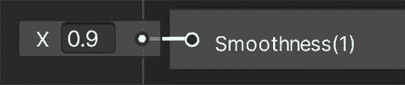

# 材质炼金术：使用 URP 和 Shader Graph 创建惊人的视觉效果

欢迎来到第三部分*提升视觉效果、效果和音频*的第一章。在这里，我们将深入探讨 Unity 的不同图形和音频系统，以显著提升游戏的外观和感觉。让我们开始我们的着色器世界之旅，着色器是每个 Unity 游戏背后的艺术家，我们将学习如何从头开始制作自己的着色器。我们将从讨论什么是着色器以及如何创建自己的着色器以实现一些默认 Unity 着色器无法实现的自定义效果开始。我们将使用 Shader Graph 创建一个简单的水动画效果，Shader Graph 是包含在通用渲染管道（URP）中的可视化着色器编辑器，是创作者将游戏发布到包括网页和移动设备在内的各种设备上的首选选项。也称为 URP，这是 Unity 中可用的不同渲染管道之一，它提供面向性能的渲染功能。我们将在本章中讨论其一些功能。

在本章中，我们将探讨以下着色器概念：

+   介绍着色器和 URP

+   使用 Shader Graph 创建着色器

# 介绍着色器和 URP

记得我们在*第一部分，Unity 入门*中创建的那个发光球体材质吗？让我们探索其着色器属性如何操纵光线以创建那种发光效果。在本节中，我们将探讨着色器作为编程显卡以实现自定义视觉效果的方法。我们还将讨论 URP 如何与这些着色器一起工作，以及它提供的默认着色器。

在本节中，我们将介绍与着色器相关的以下概念：

+   着色器管道

+   渲染管道和 URP

+   URP 内置着色器

让我们先讨论一下着色器如何修改着色器管道以实现效果。

## 着色器管道

当显卡渲染 3D 模型时，它需要不同的信息来处理，例如**网格**、**纹理**、对象的变换（位置、旋转和缩放）以及影响对象的光线。有了这些数据，显卡必须将对象的像素输出到**后缓冲区**，这是一个显卡将要绘制我们的对象但用户还看不到的图像。这样做是为了防止用户看到未完成的结果，因为我们在显示器刷新时仍在绘制。当 Unity 完成所有对象（和一些效果）的渲染以显示完成的场景时，将**后缓冲区**与用户实际看到的**前缓冲区**交换，这时图像才会显示出来。你可以想象这就像有一页带有图像的页面，在向用户展示图像的同时，你在绘制新的图像，当你完成新的绘制后，你只需交换页面，然后在用户看不到的页面上重新开始绘制，每帧重复这个过程。

这通常是渲染对象的方式，但从数据输入到像素输出的过程中可以采用无数种不同的方法和技巧来处理，这取决于你希望对象看起来如何；可能你希望它看起来逼真，或者像全息图一样，或者可能对象需要分解效果或卡通效果——可能性无穷无尽。指定我们的显卡如何处理对象渲染的方式是通过着色器来实现的。

**着色器**是一种用特定显卡语言编写的程序，例如：

+   **HLSL**：DirectX 着色语言，DirectX 是一个图形库。

+   **GLSL**：OpenGL 着色语言，OpenGL 也是一个图形库。

+   **CG**：一种可以输出 HLSL 或 GLSL 的语言，取决于我们在游戏中使用哪个图形库。

+   **着色器图**：一种将根据我们的需求自动转换为之前提到的一种语言的视觉语言。这是我们将会使用的一种，因为它简单（后面会详细介绍）。

这些语言中的任何一种都可以用来配置渲染给定对象所需的渲染过程的各个阶段，有时不仅配置它们，还可以用完全定制的代码来替换它们，以实现我们想要的确切效果。渲染一个对象的各个阶段构成了我们所说的着色器管线，这是一系列应用于输入数据的修改，直到将其转换为像素。

管线中的每个阶段负责不同的修改，并且根据显卡的着色器模型，这个管线可能会有很大的变化。在下一张图中，你可以找到一个简化的着色器管线，跳过了现在不重要的高级/可选阶段：

图 10.1：常见的着色器管线

将着色器管线想象成工厂中的一条装配线，其中每个阶段代表一位专注于特定任务的工人，他们共同协作完成最终产品。

让我们讨论每个阶段：

+   **输入汇编器**：在这里，所有网格数据，如顶点位置、UV 和法线，被组装起来，为下一阶段做准备。

+   **顶点着色器**：这个阶段过去仅限于应用对象的变换、摄像机的位置和透视以及简单的光照计算。在现代 GPU 中，你可以做任何你想做的事情。这个阶段接收要渲染的对象的每个顶点，并输出一个修改后的顶点。你有机会在这里修改对象的几何形状。这里的常用代码应用对象的变换，但你也可以应用多种效果，例如沿着法线膨胀对象以应用旧的卡通效果技术，或者应用扭曲，为每个顶点添加随机偏移以重新创建全息图。还有机会计算下一阶段所需的数据。

+   **原语裁剪**: 您将要渲染的大多数模型具有一个特性，那就是您永远不会看到模型面的背面。对于一个立方体来说，没有方法可以看到它的内部侧面。鉴于这一点，渲染立方体每个面的两面是没有意义的，这个阶段就负责处理这个问题。原语裁剪将根据面的方向确定是否需要渲染面，从而节省大量被遮挡面的像素计算。您可以更改此设置以适应特定情况；例如，我们可以创建一个需要透明以看到盒子所有面的玻璃盒子。不要将此与其他类型的裁剪混淆，如视锥裁剪。这种其他类型的裁剪在将对象发送到着色器管道之前，会过滤掉相机视图区域外的对象。

+   **光栅化器**: 现在我们已经计算出了模型修改后的可见几何形状，是时候将其转换为像素了。光栅化器为我们的网格三角形创建所有像素。这里发生了很多事情，但同样，我们对这些事情的控制非常有限；通常的渲染方法是仅创建网格三角形边缘内的所有像素。我们还有其他模式，仅渲染边缘上的像素以看到线框效果，但这通常用于调试目的：

图 10.2：图元光栅化的示例

+   **片段着色器**: 这是所有阶段中最可定制的之一。它的目的是简单的：只是确定光栅化器生成的每个片段（像素）的颜色。在这里，可以发生很多事情，从简单地输出纯色或采样纹理到应用复杂的照明计算，如法线贴图和 PBR。此外，您还可以使用这个阶段创建特殊效果，例如水动画、全息图、扭曲、分解以及任何需要您修改像素外观的特殊效果。我们将在本章的下一节中探讨如何使用这个阶段。

+   **深度测试**: 在屏幕上显示像素之前，我们需要检查它是否可见。这个阶段检查像素的深度是在之前在同一位置渲染的像素之前还是之后，确保无论对象的渲染顺序如何，离相机最近的像素总是绘制在其他像素之上。同样，通常这个阶段会保留默认状态，优先考虑离相机更近的像素，但某些效果需要不同的行为。此外，如今我们还有**早期 Z 测试**，它在这个阶段之前执行相同的测试。但让我们现在保持简单。例如，在下一张屏幕截图中，您可以看到一个效果，允许您看到位于其他对象后面的对象，就像在*帝国时代*中，一个单位在建筑物后面时的情况：

图 10.3：渲染角色的遮挡部分

+   **混合**：一旦确定了像素的颜色并且我们确信该像素没有被之前的像素遮挡，最后的步骤就是将其放入后缓冲区（你正在绘制的帧或图像）。通常，我们只是覆盖掉该位置上原有的像素（因为我们的像素更靠近相机），但如果考虑透明物体，我们需要将我们的像素与之前的像素结合，以产生透明效果。透明度除了混合之外还有其他需要考虑的因素，但主要思想是混合精确控制像素如何与后缓冲区中之前渲染的像素结合。

着色器管线需要整本书来涵盖，但就本书的范围而言，前面的描述将给你一个关于着色器做什么以及它能实现的可能效果的良好概念。现在我们已经讨论了着色器如何渲染单个对象，值得讨论 Unity 如何使用渲染管线渲染所有对象。

关于着色器的更多信息，你可以使用以下链接：[`docs.unity3d.com/Manual/shader-writing.html`](https://docs.unity3d.com/Manual/shader-writing.html)

## 渲染管线和 URP

我们已经介绍了视频卡如何渲染一个对象，但 Unity 负责要求视频卡为每个对象执行一个着色器管线。为此，Unity 需要进行大量的准备工作并计算，以确定每个着色器确切地何时以及如何执行。执行这一职责的是 Unity 所说的渲染管线。

将 Unity 的渲染管线想象成一个电影导演，负责如何呈现每个场景（对象），其中 URP 就像其高级相机之一，优化每个镜头的捕捉。同时，将渲染管线想象成剧院的舞台工作人员，为每个对象（演员）设置场景和灯光，以确保他们在聚光灯下看起来最好。

渲染管线是绘制场景中对象的一种方式。起初，这听起来应该只有一个简单的方法来做这件事，例如，遍历场景中的所有对象，并使用每个对象材质中指定的着色器执行着色器管线，但它可能比这更复杂。

通常，一个渲染管线与另一个渲染管线之间的主要区别在于光照和一些高级效果的计算方式，但它们在其他方面也可能有所不同。

在之前的 Unity 版本中，只有一个单一的渲染管线，现在被称为**内置渲染管线**（也称为**BIRP**）。这是一个包含所有可能需要的功能的管线，适用于各种项目，从移动 2D 图形和简单的 3D 到像在游戏机或高端 PC 上找到的尖端 3D 图形。这听起来很理想，但实际上并非如此。拥有一个需要高度可定制以适应所有可能场景的单一大型的渲染器会产生大量的开销和限制，这比创建一个自定义渲染管线要麻烦得多。幸运的是，Unity 的最新版本引入了**可脚本渲染管线**（**SRP**），这是一种创建适合您项目渲染管线的方法。

幸运的是，Unity 不希望您为每个项目创建自己的渲染管线（这是一个复杂的工作），因此它为您创建了两个可用的自定义管线：**URP**（以前称为 LWRP，或轻量级渲染管线），代表**通用渲染管线**，以及**HDRP**，代表**高清渲染管线**。想法是您必须根据项目需求选择其中一个（除非您真的需要创建自己的）。

URP，我们在创建游戏项目时选择的一个渲染管线，适用于大多数不需要大量高级图形功能的游戏，如移动游戏或简单的 PC 游戏，而 HDRP 则包含大量高级渲染功能，适用于高质量游戏。后者需要高端硬件才能运行，而 URP 几乎可以在所有相关目标设备上运行。值得一提的是，您可以在任何时候（包括在创建项目之后）在 BIRP、HDRP 和 URP 之间切换（但不推荐这样做）：

图 10.4：项目向导显示 HDRP 和 URP 模板

我们可以讨论每个是如何实现的以及它们之间的区别，但同样，这可能会填满整个章节。目前，本节的想法是让您知道为什么我们在创建项目时选择了 URP；我们在本书中会遇到一些限制，我们需要考虑这些限制，所以了解我们为什么接受这些限制是好的。我们选择它的一个原因是可以让我们在所有相关硬件上运行我们的游戏。

我们选择 URP 的另一个原因是它支持 Shader Graph，这是我们在本章中使用的 Unity 工具，用于创建自定义效果。之前的 Unity 内置管线没有提供这样的工具（除了第三方插件）。最后，引入 URP 概念的另一个原因是它附带了许多内置着色器，在创建我们自己的着色器之前，我们需要了解这些着色器，以避免重复造轮子。这将使我们熟悉这些着色器，因为如果你来自 Unity 的早期版本，你已知的着色器在这里将不起作用；实际上，这正是我们将在本章下一节讨论的内容：不同 URP 内置着色器之间的区别。

## URP 内置着色器

既然我们已经了解了 URP 与其他管线之间的区别，让我们来讨论哪些着色器被集成到 URP 中。让我们简要描述这个管线中三个最重要的着色器：

+   **Lit**: 这是旧版标准着色器的替代品。这个着色器适用于创建各种逼真的物理材质，例如木材、橡胶、金属、皮肤以及它们的组合（例如带有皮肤和金属护甲的角色）。它支持诸如法线贴图、遮挡、金属和镜面等不同的光照工作流程以及透明度等功能。

+   **Simple Lit**: 这是旧版 Mobile/Diffuse 着色器的替代品。正如其名所示，这个着色器是 Lit 的一个简化版本，意味着它的光照计算是对光照工作原理的简单近似，比其对应版本具有更少的功能。基本上，当你有简单的图形而没有逼真的光照效果时，这是最佳选择。

+   **Unlit**: 这是旧版 Unlit/Texture 着色器的替代品。有时，你需要完全没有光照的对象，在这种情况下，这个着色器就是为你准备的。没有光照并不意味着没有光或完全黑暗；实际上，这意味着对象完全没有阴影，并且在没有阴影的情况下完全可见。一些简单的图形可以使用这个着色器，依靠纹理中烘焙的阴影，这意味着纹理自带阴影。

这在性能上非常出色，尤其是对于低端设备，如手机。还有其他情况，例如光管或屏幕，这些不能接收阴影的对象因为它们会发光，所以即使在完全黑暗中，它们也会以全色显示。在下面的屏幕截图中，你可以看到一个使用 Unlit 着色器的 3D 模型。它看起来像是有光照，但实际上只是模型纹理在不同部分应用了浅色和深色颜色：

图 10.5：使用 Unlit 效果模拟廉价光照的 Pod

让我们使用 Simple Lit 着色器做一个有趣的分解效果，以展示其功能。你必须执行以下操作：

1.  首先获取一个**Cloud Noise**纹理。你可以在各种免费资产网站上找到合适的纹理。确保纹理的分辨率和格式与 Unity 兼容，以获得最佳效果：

图 10.6：噪声纹理

1.  在**项目**面板中选择最近导入的纹理。

1.  在检查器中，将**Alpha 源**属性设置为**从灰度**。这将使纹理的 alpha 通道根据图像的灰度进行计算。我们将使用计算出的 alpha 值来确定哪些像素需要首先分解（首先是较暗的像素）：

    图 10.7：应用 Alpha 源从灰度纹理设置

    颜色的 alpha 通道通常与透明度相关联，但你会注意到我们的物体不会是透明的。alpha 通道是额外的颜色数据，在创建效果时可以用于多个目的。在这种情况下，我们将使用它来确定哪些像素首先被分解。

1.  在**项目**视图中点击**+**图标，并选择**材质**。你可以重命名它，给它一个更容易找到的名字：

图 10.8：材质创建按钮

1.  通过顶部菜单选择**GameObject | 3D Object | Cube**来创建一个立方体：

图 10.9：创建立方体原语

1.  将材质从**项目**窗口拖动到**场景**窗口中的立方体上。

1.  在检查器中**Shader**属性右侧的下拉菜单中点击，查找**Universal Render Pipeline | Simple Lit**选项。我们也可以使用默认的着色器（**Lit**），但**Simple Lit**对性能的影响更小，我们也不需要**Lit**的高级功能：

图 10.10：简单 Lit 着色器选择

1.  接下来，选择项目中新建的材质。将下载的`Cloud Noise`纹理拖放到**基础贴图**部分。这一步将纹理视觉上绑定到着色器上，启用分解效果。

1.  启用**Alpha 裁剪**选项，并将**阈值**滑块调整到`0.5`。**Alpha 裁剪**在着色器解释纹理透明度方面起着关键作用，影响着分解效果的显示。

图 10.11：Alpha 裁剪阈值材质滑块

1.  当你移动**阈值**滑块时，物体将开始分解。**Alpha 裁剪**会丢弃 alpha 强度低于**阈值**值的像素：

图 10.12：使用 Alpha 裁剪的分解效果

1.  最后，将**渲染面**设置为**两面**以查看立方体面的两侧：

图 10.13：双面渲染面

1.  请注意，创建纹理的艺术家可以手动配置**Alpha**通道，而不是从灰度值计算它，以便精确控制分解效果的外观，无论纹理的颜色分布如何：

图 10.14：双面 Alpha 裁剪

本节的目的不是提供所有 URP 着色器的所有属性的全面指南，而是给你一个概念，了解当着色器被正确配置时它能做什么，以及何时使用每个内置的着色器。有时候，你只需使用现有的着色器就能达到所需的效果，在简单游戏中，这可能是 99%的情况，所以尽可能多地坚持使用它们。但如果确实需要创建一个自定义着色器来创建一个非常具体的效果，下一节将教你如何使用 URP 工具——着色器图。

# 使用着色器图创建着色器

现在我们已经了解了着色器的工作原理以及 URP 中的现有着色器，我们对何时需要创建自定义着色器以及何时不需要有了基本的概念。如果你真的需要创建一个，本节将涵盖使用着色器图创建效果的基础，着色器图是一个使用基于节点的可视化编辑器创建效果的工具。当你不习惯编码时，这是一个易于使用的工具。

在本节中，我们将讨论以下着色器图的概念：

+   创建我们的第一个着色器图

+   使用纹理

+   合并纹理

+   应用透明度

+   创建顶点效果

让我们先看看我们如何创建和使用一个着色器图。

## 创建我们的第一个着色器图

着色器图是一个允许我们使用基于节点的系统创建自定义效果的工具。在着色器图中，效果可以看起来像以下截图：

图 10.15：带有节点以创建自定义效果的着色器图

我们将在稍后讨论这些节点的作用，并将逐步创建一个示例效果，但在截图上，你可以看到我们如何创建和连接几个节点——相互连接的盒子，每个节点执行特定的过程以实现效果。使用着色器图创建效果的想法是学习你需要哪些特定的节点以及如何正确地连接它们。这与我们编写游戏玩法代码的方式类似，但这个着色器图是为了效果目的而调整和简化的。

要创建和编辑我们的第一个着色器图，请执行以下操作：

1.  在**项目**窗口中，点击**+**图标，找到**Shader Graph | URP | Lit Shader Graph**选项。这将创建一个使用 PBR 模式的着色器图，这意味着这个着色器将支持光照效果（与 Unlit 图不同）：

图 10.16：PBR 着色器图创建

1.  将其命名为`Water`。如果你想有机会重命名资产，请记住你可以选择资产，右键单击，并选择**重命名**：

图 10.17：着色器图资产

1.  创建一个名为`WaterMaterial`的新材质，并将**着色器**设置为**Shader Graphs/Water**。如果由于某种原因 Unity 不允许你这样做，尝试在**Water**图上右键单击并单击**重新导入**。正如你所见，创建的着色器图现在作为着色器出现在材质中：

图 10.18：设置 Shader Graph 作为材质着色器

1.  通过在**层次结构**窗口中右键单击，使用**GameObject | 3D Object | Plane**选项创建一个平面。

1.  将材质拖到平面上以应用它。

现在，你已经创建了自己的第一个自定义着色器并将其应用于材质。到目前为止，它看起来一点也不有趣——它只是一个灰色效果——但现在是你编辑图以解锁其全部潜力的时候了。正如图的名称所暗示的，在本章中我们将创建一个水效果来展示 Shader Graph 工具集的几个节点以及如何连接它们。所以，让我们先从讨论主节点开始。

当你通过双击着色器资产打开图时，你会看到以下内容：

图 10.19：包含计算对象外观所需所有属性的 Master 节点

所有节点都将具有输入引脚，所需工作的数据，以及输出引脚，其处理的结果。例如，在求和操作中，我们将有两个输入数字和一个输出数字，即求和的结果。在这种情况下，你可以看到主节点只包含输入，这是因为所有进入主节点的数据都将被 Unity 用于计算对象的渲染和照明，例如所需的对象颜色或纹理（**基础颜色**输入引脚）、其平滑度（**平滑度**输入引脚）或其含有的金属量（**金属**输入引脚），这些属性将影响照明如何应用于对象。

你可以看到主节点被分为**顶点**部分和**片段**部分。前者能够改变我们正在修改的对象的网格以变形它、动画化它等，而后者将改变其外观，使用哪些纹理，如何照明等。让我们从以下操作开始探索如何在**片段**部分更改这些数据：

1.  在**项目**视图中双击**Shader Graph**资产以打开其编辑器。

1.  在**基础颜色**输入引脚左侧的灰色矩形中单击：

图 10.20：基础颜色节点输入引脚

1.  在颜色选择器中，选择一种浅蓝色，就像水一样。选择圆圈的蓝色部分，然后在中间矩形中选择该颜色的一个色调：

图 10.21：颜色选择器

1.  将**平滑度**设置为`0.9`，这将使物体几乎完全光滑（达到总平滑度的 90%）。这将使我们的水面几乎完全反射天空：

图 10.22：平滑度 PBR 主节点输入引脚

1.  点击窗口左上角的**保存资产**按钮：

图 10.23：Shader Graph 保存选项

1.  返回到**场景**视图，检查平面是否呈现浅蓝色，并且太阳反射在其上：

图 10.24：初始 Shader Graph 结果

如您所见，着色器的行为根据您在主节点中设置的属性而变化，但到目前为止，这样做与创建一个无光照着色器并设置其属性没有区别；Shader Graph 的真正威力在于您使用节点作为主节点的输入进行特定计算时。我们将开始查看纹理节点，这些节点允许我们将纹理应用到我们的模型上。

## 使用纹理

使用纹理的想法是将图像应用到模型上，以便我们可以用不同的颜色为模型的各个部分上色。请记住，模型有一个 UV 贴图，这使得 Unity 能够知道纹理的哪一部分将被应用到模型的哪一部分：

图 10.25：左侧为面部纹理；右侧为应用于面部网格的相同纹理

就像在视觉脚本中一样，我们将在着色器图中使用相互连接的节点来执行特定的着色器操作。我们有几个节点来完成这项任务，其中之一是**Sample Texture 2D**，这是一个有两个主要输入的节点。首先，它要求我们提供要采样或应用到模型上的纹理，然后是 UV。您可以在以下屏幕截图中看到它：

图 10.26：样本 2D 纹理节点

如您所见，**纹理**输入节点的默认值是**None**，因此默认情况下没有纹理，我们需要手动指定。对于**UV**，默认值是`UV0`，这意味着默认情况下，节点将使用模型的主要 UV 通道；是的，一个模型可以设置多个 UV。目前，我们将坚持使用主要的一个。如果您不确定这意味着什么，**UV0**是最佳选择。让我们尝试这个节点，按照以下步骤进行：

1.  从互联网下载并导入一个可平铺的水纹理：

图 10.27：可平铺的水纹理

1.  选择纹理并确保纹理的**包裹模式**属性设置为**重复**，这将允许我们像在地形中那样重复纹理，因为我们的想法是使用这个着色器来覆盖大面积的水域：

图 10.28：纹理重复模式

1.  在**水着色器图**中，在着色器图的一个空白区域右键单击并选择**创建节点**：

图 10.29：着色器图创建节点选项

1.  在**搜索**框中，键入`Sample texture`，所有采样节点都会显示出来。双击**SampleTexture2D**。如果由于某种原因无法双击选项，请先右键单击它，然后再尝试。这个工具中有一个已知的错误，这是解决方案：

图 10.30：纹理节点搜索示例

1.  点击**Sample Texture 2D**节点的**纹理**输入引脚左侧的圆圈。这将允许我们选择要采样的纹理——只需选择**水**纹理。您可以看到纹理可以在节点的底部部分预览：

图 10.31：具有纹理输入引脚的纹理节点示例

1.  将**Sample Texture 2D**节点的**RGBA**输出引脚拖到主节点的**基色**输入引脚：

图 10.32：将纹理采样结果连接到主节点的基色引脚

1.  在着色器图编辑器的左上角点击**保存资产**按钮，并在**场景**视图中查看更改：

图 10.33：在 Shader Graph 中应用纹理的结果

如您所见，纹理已正确应用于模型，但如果考虑到默认平面的尺寸为 10x10 米，水的波纹看起来太大。所以，让我们平铺纹理吧！

要做到这一点，我们需要更改模型的 UV，使它们更大。您可能会想象更大的 UV 意味着纹理也应该更大，但请记住，我们并没有使对象变大；我们只是在修改 UV。

在相同对象区域，我们将显示更多纹理区域，这意味着在更大的纹理采样区域（通过更大的 UV 实现），纹理可能会重复。要这样做，请按照以下步骤操作：

1.  在任何空白区域右键单击并点击**新建节点**以搜索**UV**节点：

图 10.34：搜索 UV 节点

1.  使用相同的方法创建一个**乘法节点**。

1.  将**UV 节点**的**Out**引脚拖动到**乘法节点**的**A**引脚以连接它们。

1.  将**乘法**的**B**引脚输入值设置为`4`,`4`,`4`,`4`：

图 10.35：将 UV 乘以 4

1.  将**乘法节点**的**Out**引脚拖动到**样本纹理 2D 节点**的**UV**上以连接它们：

图 10.36：使用乘法 UV 进行纹理采样

1.  如果您保存图表并返回到**场景视图**，您会看到现在波纹更小，因为我们已经平铺了模型的 UV。您也可以在**采样纹理 2D 节点**的预览中看到：

图 10.37：模型 UV 乘法的结果

现在我们可以做的另一个有趣的效果是给纹理应用偏移以移动它。想法是即使平面实际上没有移动，我们也会模拟水流通过它，只是移动纹理。记住，确定将纹理的哪一部分应用到模型的每一部分的职责属于 UV，所以如果我们向 UV 坐标添加值，我们就会移动它们，生成纹理滑动效果。为此，让我们做以下操作：

1.  在**UV 节点**的右侧创建一个**加法节点**。

1.  将**UV**的**Out**引脚连接到**加法节点**的**A**引脚：

图 10.38：向 UV 添加值

1.  在**加法节点**的左侧创建一个**时间节点**。

1.  将**时间节点**连接到**加法节点**的**B**引脚：

图 10.39：向 UV 添加时间

1.  将**加法节点**的**Out**引脚连接到**乘法节点**的**A**输入引脚：

图 10.40：将添加和乘法 UV 作为样本纹理的输入

1.  保存并查看在**场景视图**中的水流动。如果您看不到它在移动，请点击场景顶部栏中的图层图标并检查**始终刷新**：

图 10.41：启用始终刷新以预览效果

1.  如果您觉得水移动得太快，可以尝试使用乘法节点来使时间值更小。我建议您在查看下一个截图之前自己尝试一下，该截图有答案：

图 10.42：减慢移动纹理的时间

1.  如果您觉得图表太大，可以尝试通过点击鼠标悬停在预览上时出现的向上箭头（**↑**）来隐藏一些节点预览：

图 10.43：隐藏图节点中的预览

1.  此外，您可以通过选择节点并点击其右上角的箭头来隐藏未使用的引脚：

图 10.44：隐藏图节点中的未使用引脚

因此，总结一下，我们首先将时间添加到 UV 以移动它，然后将移动的 UV 的结果相乘以使其变大，从而平铺纹理。值得一提的是，有一个**平铺和偏移**节点可以为我们完成所有这些过程，但我想要向您展示一个简单的乘法来缩放 UV 和一个加法操作来移动它会产生一个很好的效果；您无法想象您可以用其他简单的数学节点实现的所有可能效果！实际上，让我们在下一节中探索数学节点组合纹理的其他用法。

在学习 DirectX 时，由于您需要学习一个不太友好的语言 HLSL，制作着色器会更困难。虽然对于大多数情况 Shader Graph 就足够了，但我一点也不后悔学习这样的着色器语言，因为它们可以访问基于节点的着色语言通常不具备的更高级功能，并且它们能给您更深入地了解 GPU 内部结构。有关如何在 URP 中创建基于代码的着色器的更多信息，您可以查看以下链接：`docs.unity3d.com/Packages/com.unity.render-pipelines.universal@15.0/manual/writing-custom-shaders-urp.html`

## 组合纹理

尽管我们使用了节点，但我们还没有创建出任何不能使用常规着色器创建的东西，但这种情况即将改变。到目前为止，我们可以看到水在移动，但它仍然看起来很静止，这是因为波纹总是相同的。我们有几种生成波纹的技术；最简单的一种是将两个在不同方向上移动的水纹理组合起来以混合它们的波纹。实际上，我们可以简单地使用相同的纹理，只需翻转一下以节省一些内存。为了组合纹理，我们将它们相加，然后除以 2，所以基本上，我们是在计算纹理的平均值！让我们通过以下步骤来完成它：

1.  通过在图表中的任何空白区域点击，按住并拖动点击，当所有目标节点都被覆盖时释放，选择**时间**和**2D 采样器**之间的所有节点（包括它们）：

图 10.45：选择多个节点

1.  右键点击并选择**复制**，然后再次右键点击并选择**粘贴**，或者使用经典的*Ctrl* + *C*，*Ctrl* + *V*命令（在 Mac 上为*Command* + *C*，*Command* + *V*）。

1.  将复制的节点移动到原始节点下方：

图 10.46：节点的复制

1.  对于复制的节点，将连接到**2D 采样纹理**的**乘法**节点的**B**引脚设置为`-4`,`-4`,`-4`,`-4`。你可以看到这翻转了纹理。

1.  此外，将连接到**时间**节点的**乘法**节点的**B**引脚设置为`-0.1`：

图 10.47：值的乘法

1.  在两个**2D 采样器**节点的右侧创建一个**加法**节点，并将这些节点的输出连接到**加法**节点的**A**和**B**输入引脚：

图 10.48：添加两种纹理

1.  你可以看到，由于我们同时计算了两种纹理的强度，所以结果组合太亮了，所以让我们通过将**加法**节点的**Out**乘以`0.5,0.5,0.5,0.5`来修复这个问题，这将把每个结果颜色通道除以 2，平均颜色。你也可以尝试设置每个通道的不同值，看看会发生什么，但就我们的目的而言，`0.5`是每个通道的正确值：

图 10.49：将两个纹理的总和除以得到平均值

1.  将**乘法**节点的**Out**引脚连接到**主节点**的**基础颜色**引脚，以将所有这些计算应用于物体的颜色。

1.  保存资产，并在**场景**视图中查看结果：

图 10.50：纹理混合的结果

您可以继续添加节点以使效果更加多样化，例如使用**正弦**节点（这将执行三角函数的正弦运算）来应用非线性运动，但我会让您通过自己实验来学习这一点。现在，我们将在这里停止。像往常一样，这个主题值得一本完整的书，而本章的目的是给您这个强大的 Unity 工具的小小品尝。我建议您在网上寻找其他 Shader Graph 示例来学习相同节点的其他用法，当然，还有新节点。在这里要考虑的一点是，我们迄今为止所做的一切基本上都是应用于我们之前讨论过的着色器管道的片段着色器阶段。现在，让我们使用混合着色器管道阶段来给水应用一些透明度。

想要了解更多关于着色器图样的示例，我建议查看以下链接：`docs.unity3d.com/Packages/com.unity.shadergraph@17.0/manual/ShaderGraph-Samples.html`

## 应用透明度

在宣布我们的效果完成之前，我们可以做的一个小补充是使水稍微透明一些。记住，着色器管道有一个混合阶段，该阶段负责将我们的模型中的每个像素混合到当前帧正在渲染的图像中。我们的想法是让我们的 Shader Graph 修改这个阶段以应用**Alpha 混合**，这是一种基于我们模型`Alpha`值的混合模式。

要达到这种效果，请按照以下步骤操作：

1.  寻找浮动在周围的**图形检查器**窗口。如果您看不到它，请点击 Shader Graph 编辑器右上角的**图形检查器**按钮。也可以尝试展开 Shader Graph 窗口以显示它，以防它被窗口的右边界隐藏。

1.  点击**图形设置**选项卡。

1.  将**表面类型**属性设置为**透明**。

1.  如果**混合模式**属性尚未设置为该值，请将其设置为**Alpha**：

图 10.51：图形检查器透明度设置

1.  将主节点的**Alpha**输入引脚设置为`0.5`。

图 10.52：设置主节点的 Alpha

1.  保存 Shader Graph 并查看在**场景**视图中应用的透明度。如果您看不到效果，只需将一个立方体放入水中，使效果更加明显：

图 10.53：将水产生的阴影应用于立方体

1.  你可以看到水在我们立方体上投射的阴影，因为 Unity 不知道该对象是透明的，因此会投射阴影。点击水面，在检查器中查找 **网格渲染器** 组件。如果你看不到阴影，点击 **场景** 视图顶部的灯泡。

图 10.54：在场景视图中启用灯光

1.  在 **照明** 部分中，将 **投射阴影** 设置为 **关闭**；这将禁用在水下部分的立方体上从平面上投射阴影：

图 10.55：禁用阴影投射

添加透明度是一个简单的过程，但它有其注意事项，比如阴影问题，在更复杂的情况下，它可能还有其他问题，比如增加过度绘制，意味着同一个像素需要绘制多次（属于透明对象的像素，以及背后物体中的一个）。我建议你在不必要的情况下避免使用透明度。实际上，我们的水可以不透明地存在，尤其是当我们将这种水应用到基础周围的河盆时，因为我们不需要看到水下部分；但目的是让你知道所有选项。在下一张截图，你可以看到我们如何在基础下方放置了一个带有这种效果的大型平面，足够大，可以覆盖整个盆地：

图 10.56：在主场景中使用我们的水

我有一个朋友总是拿我开玩笑，说所有问题都可以用着色器解决，但玩笑归玩笑，如果使用得当，它是一个非常实用的工具。在过去，开发者使用着色器进行与图形无关的处理，比如数学模拟，读取生成的像素作为所需的结果。这导致了今天我们所知的计算着色器，它本质上是指在 GPU 上运行自定义程序以进行计算，利用 GPU 的强大功能。当然，Unity 支持计算着色器；你可以在这里了解更多信息：[`docs.unity3d.com/Manual/class-ComputeShader.html`](https://docs.unity3d.com/Manual/class-ComputeShader.html)

从现在起，我们可以用我们的着色器做很多事情。我们可以考虑为高于一定高度像素模拟水泡，利用我们添加的顶点动画。我们也可以通过脚本或使用正弦节点来改变水的滚动方向。天空才是极限！

现在我们已经通过 **片段** 节点部分修改了对象的外观，让我们讨论如何使用 **顶点** 节点来将网格动画应用到我们的水上。

## 创建顶点效果

到目前为止，我们已经将水纹理应用到我们的水上，但它仍然是一个平面。我们可以更进一步，不仅通过纹理，还可以通过动画网格来制作波纹。要做到这一点，我们将在着色器中应用我们在本章开头使用的噪声纹理，但不是将其用作添加到着色器**基础颜色**的另一种颜色，而是用它来偏移我们平面的顶点的**Y**位置。

由于噪声纹理的混沌性质，我们的想法是对模型的各个部分应用垂直偏移，这样我们就可以模拟波纹：

图 10.57：默认平面网格细分为 10x10 的网格，无偏移

要实现类似的效果，您可以修改着色器的**顶点**部分，使其看起来如下：

图 10.58：波纹顶点效果

在图中，您可以看到我们如何创建一个向量，其**y**轴取决于我们在本章开头下载的噪声纹理。背后的想法是创建一个向上指的向量，其长度与纹理的灰度因子成正比；纹理的像素越白，偏移量越长。这种纹理具有不规则但平滑的图案，可以模拟潮汐的行为。

请注意，在这里，我们使用了**采样 2D 纹理 LOD**而不是**采样 2D 纹理**；后者在**顶点**部分不起作用，所以请记住这一点。

然后，我们将结果乘以`0.3`以减少要添加的偏移高度，然后将结果添加到**位置**节点。注意，**位置**节点的**空间**属性设置为**对象**模式。我们需要这种模式来与着色器图（我们在*第二章*，*制作场景和游戏元素*中讨论了*世界*和*局部*空间，但您也可以在网上搜索`Object vs World Space`以获取更多关于此的信息）。最后，结果连接到**顶点**部分的**位置**节点。

如果你保存，你会看到以下类似图像：

图 10.59：应用波纹顶点效果

当然，在这种情况下，波纹是静态的，因为我们没有像之前那样对 UV 添加任何时间偏移。在下面的屏幕截图中，您可以查看如何添加它，但在查看之前，我建议您先自己尝试解决它作为一个个人挑战：

图 10.60：动画波纹顶点效果图

正如你所见，我们再次使用原始的 UV，并添加任何因子的乘以时间，这样它就会慢慢移动，就像我们之前在水面纹理上所做的那样。你可以继续尝试不同的纹理，改变其外观，通过乘以偏移量来增加或减少波纹的高度，应用如正弦等有趣的数学函数，以及更多；但现在，让我们先完成这个。

# 摘要

在本章中，我们讨论了着色器在 GPU 中的工作原理以及如何创建我们的第一个简单着色器以实现良好的水面效果。与着色器一起工作是一项复杂而有趣的工作，在一个团队中，通常有一人或多人负责创建所有这些效果，这个职位被称为技术艺术家；所以，正如你所见，这个主题可以扩展成一个完整的职业。记住，这本书的目的是给你一个行业所有可能角色的微小品尝，所以如果你真的喜欢这个角色，我建议你开始阅读专注于着色器的书籍。你面前有一条漫长但超级有趣的道路。

现在足够多的着色器了！在下一章中，我们将探讨如何通过粒子系统改进我们的图形并创建视觉效果！

# 在 Discord 上了解更多

与其他用户、Unity 游戏开发专家以及作者本人一起阅读这本书。提出问题，为其他读者提供解决方案，通过 Ask Me Anything 会话与作者聊天，等等。扫描二维码或访问链接加入社区：

[`packt.link/unitydev`](https://packt.link/unitydev)

