# 第十一章：吸引人的视觉效果：利用粒子系统和视觉效果图

在本章中，我们将继续学习我们游戏中的视觉效果。我们将讨论粒子系统，这是一种模拟火焰、瀑布、烟雾和各种流体的方法。我们将看到两个 Unity 粒子系统来创建这些效果，**Shuriken** 和 **视觉效果（VFX）图**，后者比前者更强大，但需要更多的硬件。这些技术在不同的游戏中被广泛使用，以模拟各种效果，如战场等战争游戏中的爆炸和枪口效果，以及在霍格沃茨遗产中的魔法效果。

在本章中，我们将介绍以下粒子系统主题：

+   粒子系统简介

+   创建流体模拟

+   使用视觉效果图创建复杂模拟

# 粒子系统简介

我们迄今为止创建的所有图形和效果都使用了静态网格——不能通过任何方式（除了使用着色器）扭曲、弯曲或变形的 3D 模型。例如，火焰和烟雾这类流体不能总是用这种网格来表示，但我们可以通过静态网格的组合来模拟这些效果，这就是粒子系统发挥作用的地方。

**粒子系统**是发射和动画化大量**粒子**或**标牌**的对象，这些是面向摄像机的简单四边形网格。每个粒子都是一个静态网格，但渲染、动画和组合大量粒子可以产生流体的幻觉。

在图 11.1 中，你可以看到左侧使用粒子系统创建的烟雾效果，右侧是相同粒子的**线框**视图。在那里，你可以看到创建烟雾幻觉的四边形，这是通过将烟雾纹理应用到每个粒子并对其动画化来实现的，使它们从底部生成并随机向上移动：

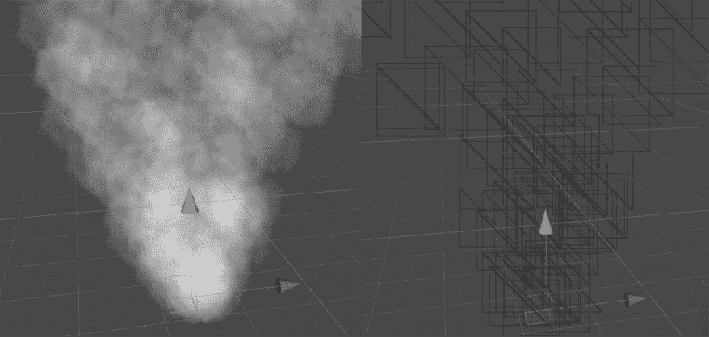

图 11.1：左侧是一个烟雾粒子系统；右侧是相同系统的线框

在本节中，我们将介绍与粒子相关的以下主题：

+   创建基本粒子系统

+   使用高级模块

让我们从讨论如何创建我们第一个粒子系统开始。

## 创建基本粒子系统

为了说明粒子系统的创建，让我们创建一个爆炸效果。想法是同时生成大量粒子并向所有方向扩散。让我们从创建粒子系统并配置它提供的基本设置以改变其默认行为开始。为此，请按照以下步骤操作：

1.  选择 **GameObject | Effects | Particle System** 选项：

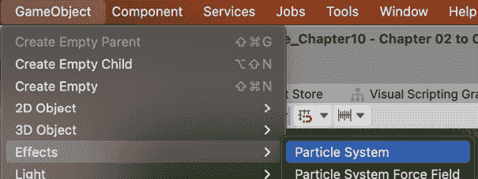

图 11.2：粒子系统选项

1.  你可以在下面的屏幕截图中看到效果。默认行为是一列向上移动的粒子，就像之前显示的烟雾效果。让我们改变一下。

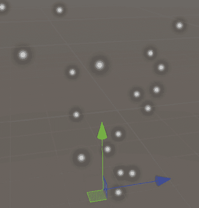

图 11.3：默认粒子系统外观

1.  在场景中单击创建的对象，并查看检查器。

1.  通过点击标题打开**形状**部分。在这里，您可以指定粒子发射器的形状，粒子将从该形状中产生。

1.  将**形状**属性更改为**球体**。现在粒子应该会向所有可能的方向移动，而不是遵循默认方向：

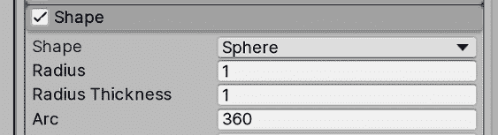

图 11.4：形状属性

1.  在**粒子系统**模块（通常称为**主**）中，将**起始速度**设置为**10**。这将使粒子移动得更快。

1.  在同一模块中，将**起始寿命**设置为**0.5**。这指定了粒子将存活多长时间。在这种情况下，我们给了一个半秒的寿命。结合速度（每秒 10 米），这意味着粒子在移动 5 米后会消失：

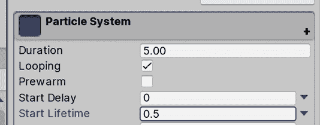

图 11.5：主粒子系统模块

1.  打开**发射**模块，并将**随时间变化率**设置为**0**。此属性指定每秒将发射多少粒子，但对于爆炸，我们实际上需要一个粒子爆发，所以在这种情况下我们不会在随时间持续发射粒子。

1.  在**爆发**列表中，点击底部的**+**按钮，并在列表中创建的项目中，将**数量**列设置为**100**：

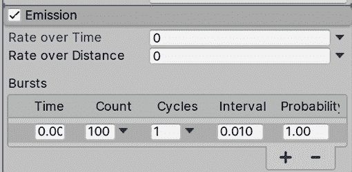

图 11.6：发射模块

1.  在**主**模块（标题为**粒子系统**）中，将**持续时间**设置为`1`并取消选中**循环**。在我们的情况下，爆炸不会不断重复；我们只需要一次爆炸：

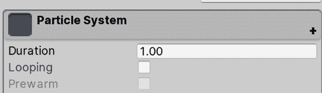

图 11.7：循环复选框

1.  现在我们已经在场景中有了粒子，我们注意到它没有循环。为了实现这种效果，您需要手动点击**场景**视图右下角的**粒子效果**窗口中显示的**播放**按钮来查看系统。如果您没有看到该窗口，请记住首先在**层次结构**窗口中选择带有粒子系统的 GameObject。

图 11.8：粒子系统播放控制

1.  将**停止动作**设置为**销毁**。这将使对象在**持续时间**时间过后被销毁。这仅在运行游戏时才会起作用，因此您可以在编辑场景时安全地使用此配置：

图 11.9：停止动作设置为销毁

1.  将**主**模块的**起始大小**设置为**3**。这将使粒子更大，看起来更密集：

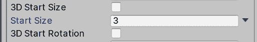

图 11.10：粒子系统起始大小

1.  点击主模块中**起始旋转**属性右侧的向下箭头，并选择**在两个常量之间随机**。

1.  在*步骤 14*之后出现的两个输入值中将**起始旋转**设置为`0`和`360`。这允许我们在粒子产生时给它们一个随机旋转，使它们看起来略有不同：

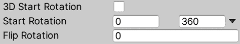

图 11.11：随机起始旋转

1.  现在粒子表现如预期，但看起来并不如预期。让我们改变一下。通过在**项目**视图中点击**+**图标并选择**材质**来创建一个新的材质。让我们称它为`Explosion`。

1.  将其着色器设置为**通用渲染管线/粒子/无光照**。这是一个特殊的着色器，用于将纹理应用到粒子系统中：

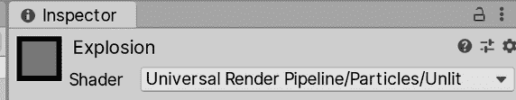

图 11.12：粒子系统材质着色器

1.  从互联网或**资源商店**下载一个`烟雾`粒子纹理。在这种情况下，下载一个黑色背景的纹理很重要；忽略其他纹理：

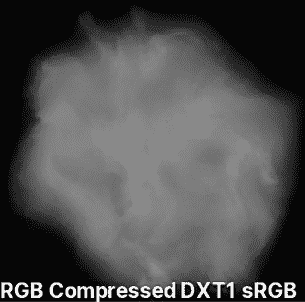

图 11.13：烟雾粒子纹理

1.  将此纹理设置为材质的**基础纹理**。

1.  将**表面类型**设置为**透明**，并将**混合模式**设置为**添加**。这样做会使粒子相互融合，而不是相互绘制，以模拟一大团烟雾而不是单个烟雾团。我们使用**添加**模式，因为我们的纹理有黑色背景，我们想要创建一个光照效果（爆炸会使场景变亮）：

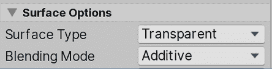

图 11.14：粒子的表面选项

1.  将您的材质拖到**渲染器**模块的**材质**属性中：

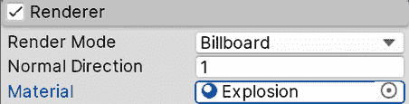

图 11.15：粒子材质设置

1.  现在您的系统应该看起来像以下图所示：

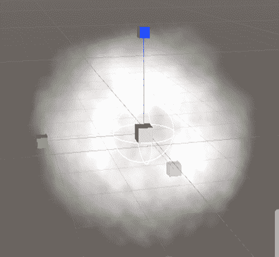

图 11.16：前述设置的成果

通过这些步骤，我们已经改变了粒子或广告牌的生成方式（使用**发射**模块），它们将移动的方向（使用**形状**模块），它们的移动速度，它们的持续时间，它们的大小（使用**主**模块），以及它们的形状（使用**渲染器**模块）。创建粒子系统是一个简单案例，只需正确配置它们的设置。当然，正确地做这件事本身就是一门艺术；它需要创造力和了解如何使用所有提供的设置和配置。因此，为了提高我们的技能，让我们讨论一些高级模块。

## 使用高级模块

我们的系统看起来不错，但我们还可以大幅改进它，所以让我们启用一些新模块来提高其质量：

1.  在**生命周期颜色**左侧的复选框中勾选以启用它：

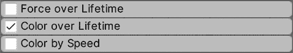

图 11.17：启用生命周期颜色模块

1.  通过点击标题打开模块，然后点击**颜色**属性右侧的白色条，这将打开渐变编辑器。

1.  在条形图的最左上角白色标记的稍右位置点击以创建一个新的标记。同样，在条形图最右上角白色标记的稍左位置点击以创建第四个标记。这些标记将允许我们在粒子的生命周期中指定其透明度：

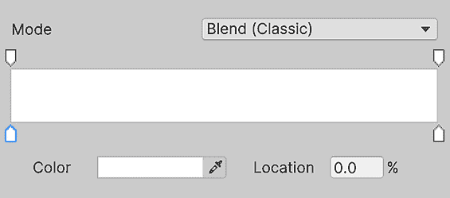

图 11.18：生命周期颜色渐变编辑器

1.  如果您意外创建了不需要的标记，只需将它们拖出窗口即可删除它们。确保**模式**设置为**混合（经典）**。

1.  点击左上角的标记（不是我们创建的，而是已经存在的那个）并将底部的**Alpha**滑块设置为`0`。按照以下截图所示，以同样的方式对右上角的标记进行操作。现在您应该会看到粒子在爆炸结束时逐渐消失而不是突然消失：

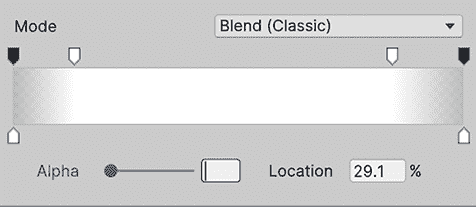

图 11.19：淡入和淡出渐变

1.  通过点击复选框启用**寿命内限制速度**模块。

1.  将**阻尼**设置设置为`0.1`。这将使粒子缓慢停止而不是继续移动：

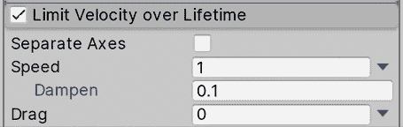

图 11.20：阻尼速度以使粒子停止

1.  启用**寿命内旋转**并将**角速度**设置为`-90`到`90`之间。请记住，您应该通过点击属性右侧的向下箭头将值设置为**在两个常量之间随机**。现在粒子应该在它们的寿命期间旋转以模拟更多的运动：

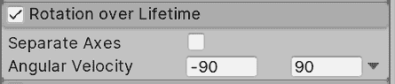

图 11.21：随机旋转速度

由于我们在创建粒子时在**主**模块中设置的寿命较短，因此一些效果将非常微妙。您可以自由地增加**寿命**值以更详细地查看这些效果，但请考虑，如果您频繁地生成粒子，这可能会导致粒子数量过多，从而降低性能。只需注意调整这些值时它们对性能的影响。

如您所见，有许多额外的模块可以启用和禁用，以在现有行为之上添加层次。因此，再次创造性地使用它们来创建各种效果。请记住，您可以为这些系统创建预制件以在场景中复制它们。我还建议在资产商店中搜索和下载粒子效果，以了解其他人如何使用相同的系统创建惊人的效果。看到各种不同的系统是学习如何创建它们的最佳方式，这就是我们在下一节将要做的：创建更多系统！

# 创建流体模拟

正如我们所说的，学习如何创建粒子系统的最佳方式是持续寻找已经创建的粒子系统，并探索人们如何使用各种系统设置来创建完全不同的模拟。

在本节中，我们将学习如何使用粒子系统创建以下效果：

+   水帘效果

+   篝火效果

让我们从最简单的一个开始，即水帘效果。

## 创建水帘效果

为了做到这一点，请按照以下步骤操作：

1.  创建一个新的粒子系统（**GameObject | Effects | Particle System**）。

1.  在**形状**模块中将**形状**设置为**边缘**并将**半径**设置为`5`。这将使粒子沿着发射线生成：

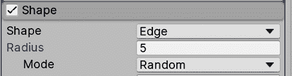

图 11.22：边缘形状

1.  将 **Emission** 模块的 **Rate over Lifetime** 值设置为 `50`。

1.  将 **Main** 模块的 **Start Size** 设置为 `3` 和 **Start Lifetime** 设置为 `3`：

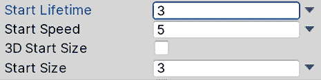

图 11.23：主模块设置

1.  将 **Main** 模块的 **Gravity Modifier** 设置为 `0.5`。这将使粒子下落：

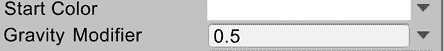

图 11.24：主模块中的重力修改器

1.  使用我们之前创建的相同 **Explosion** 材质来创建这个系统：

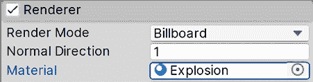

图 11.25：爆炸粒子材质

1.  启用 **Color over Lifetime** 并打开渐变编辑器。确保 **Mode** 设置为 **Blend (Classic)**，因为它是最简单且性能最好的一个。

1.  点击右下角的标记，这次你应该看到一个颜色选择器而不是透明度滑块。顶部的标记允许你随时间改变透明度，而底部的标记则随时间改变粒子的颜色。在这个标记中设置浅蓝色颜色（你也可以使用任何其他颜色）：

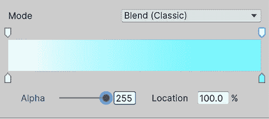

图 11.26：从白色到浅蓝色的渐变

作为挑战，我建议你在这个粒子系统结束的地方添加一个小粒子系统，以创建一些水花，模拟水与底部湖泊的碰撞。现在我们可以将这个粒子系统添加到场景中的一个山丘上，以装饰它，如下面的截图所示。我已经对这个系统做了一些调整，使其在这个场景中看起来更好。我挑战你自己调整它，使其看起来像这样：

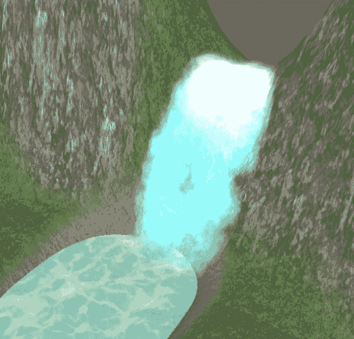

图 11.27：瀑布粒子系统应用于当前场景

现在，让我们创建另一个效果：篝火。

## 创建篝火效果

为了创建篝火，请执行以下操作：

1.  在 **GameObject | Effects | Particle System** 中创建一个粒子系统，就像我们在 *创建基本粒子系统* 部分所做的那样。

1.  在互联网或资产商店中寻找一个 **Fire Particle Texture Sheet** 纹理。这种纹理应该看起来像不同火焰纹理的网格。想法是将火焰动画应用到我们的粒子中，交换所有这些小纹理：

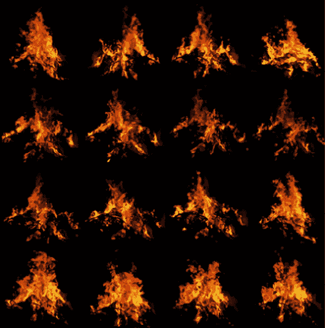

图 11.28：粒子纹理精灵图

1.  创建一个使用 **Universal Render Pipeline/Particles/Unlit** 着色器的粒子材质。

1.  将火焰精灵图纹理设置为基图。

1.  将 **Base Map** 右侧的颜色设置为白色。

1.  将此材质设置为粒子材质。请记住将 **Surface Type** 设置为 **Transparent** 和 **Blending Mode** 设置为 **Additive**：

图 11.29：带有粒子精灵图的材质

1.  启用 **Texture Sheet Animation** 模块，并根据你的 **Fire** 图纸设置 **Tiles** 属性。在我的情况下，我有一个 4x4 的精灵网格，所以我将 `4` 放在 **X** 和 `4` 放在 **Y**。之后，你应该会看到粒子在交换纹理：

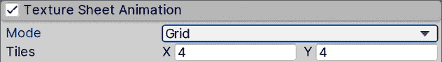

图 11.30：启用纹理表动画

1.  在**主**模块中将**起始速度**设置为`0`，将**起始大小**设置为`1.5`。

1.  在**形状**模块中将**半径**设置为`0.5`。

1.  创建第二个粒子系统并将其设置为**火系统**的子系统：

图 11.31：粒子系统的父子关系

1.  应用爆炸示例中的**爆炸**材质。

1.  在**形状**模块中将**角度**设置为`0`，将**半径**设置为`0.5`。

系统应该看起来像这样：

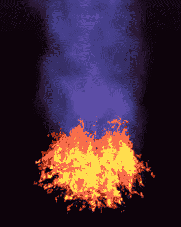

图 11.32：结合火焰和烟雾粒子系统的结果

如您所见，您可以将多个粒子系统组合起来创建一个单一的效果。在做这件事时要小心，因为很容易产生过多的粒子并影响游戏性能。粒子并不便宜，如果您不小心，可能会降低游戏的**每秒帧数**（**FPS**）。

粒子之所以昂贵，其中一个原因被称为**过度绘制**，或者多个重叠对象的情况。记住，粒子只是许多叠加在一起的四边形渲染，以模拟单一流体。这意味着一些屏幕像素需要绘制多次才能达到效果，这可能会对 GPU 产生很大负担。您可以使用 RenderDoc 等工具分析这个问题和其他 GPU 问题。更多关于 RenderDoc 的信息请在这里了解：[`docs.unity3d.com/Manual/RenderDocIntegration.html`](https://docs.unity3d.com/Manual/RenderDocIntegration.html)

到目前为止，我们已经探索了您可以使用来创建这类效果的一个 Unity 系统，虽然这个系统对于大多数情况来说已经足够，但 Unity 最近发布了一个新的系统，可以生成更复杂的效果，称为**视觉效果图**。让我们看看如何使用它，并看看这两个系统有何不同。

# 使用视觉效果图创建复杂模拟

我们迄今为止使用的粒子系统在 CPU 上处理所有计算。这既有优点也有缺点。优点是它可以在所有可能的 Unity 支持的设备上运行，无论它们的性能如何（它们都有 CPU），但缺点是如果我们不小心发射的粒子数量过多，我们很容易超过 CPU 的性能。

现代游戏需要更复杂的粒子系统来生成逼真的效果，而这种基于 CPU 的粒子系统解决方案已经开始达到其极限。这就是视觉效果图（Visual Effect Graph）的用武之地：

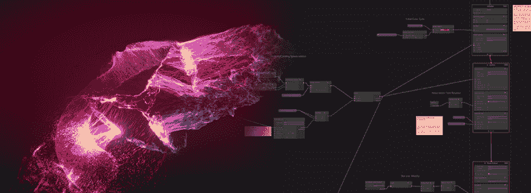

图 11.33：左侧是一个庞大的粒子系统，右侧是一个视觉效果图的示例

**Visual Effect Graph**是一个基于 GPU 的粒子系统解决方案，这意味着系统是在显卡上而不是 CPU 上执行的。这是因为显卡在执行大量的小型模拟方面效率更高，比如系统中的每个粒子都需要，所以我们使用 GPU 可以达到比 CPU 更高的粒子数量级别。这里的缺点是我们需要一个具有**计算着色器**功能的相当现代的 GPU 来支持这个系统，因此我们将排除使用这个系统的某些目标平台（忘掉大多数手机），所以如果你的目标平台支持它（中高端 PC、游戏机和一些高端手机），请使用它。

在本节中，我们将讨论以下关于 Visual Effect Graph 的主题：

+   安装 Visual Effect Graph

+   创建和分析 Visual Effect Graph

+   创建雨效果

让我们先看看我们如何在项目中添加对 Visual Effect Graph 的支持。

## 安装 Visual Effect Graph

到目前为止，我们已经使用了在我们项目中已经安装的许多 Unity 功能，但 Unity 可以通过大量的插件进行扩展，包括官方和第三方插件。Visual Effect Graph 就是那些需要独立安装的功能之一，如果你使用的是**通用渲染管线**（**URP**）。我们可以通过**包管理器**来实现，这是一个专门用于管理官方 Unity 插件的 Unity 窗口。

当你安装这些包时，需要考虑的是，每个包或插件都有自己的版本，与 Unity 版本无关。这意味着你可以安装 Unity 2022.1，但也可以安装 Visual Effect Graph 13.1.8 或任何你想要的版本，并且实际上可以更新包到新版本而不需要升级 Unity。

这很重要，因为一些这些包的版本需要 Unity 的最小版本——例如，Visual Effect Graph 13.1.8 需要 Unity 2022.1 作为最小版本。此外，一些包依赖于其他包以及这些包的特定版本，因此我们需要确保我们拥有每个包的正确版本，以确保兼容性。明确来说，包的依赖项会自动安装，但有时我们可以单独安装它们，所以在那种情况下，我们需要检查所需的版本。听起来很复杂，但实际上并没有那么复杂。

在撰写本书时，为了使 Visual Effect Graph 正常工作，我们需要版本 15.0.6，并且还需要相同版本的**通用 RP**。是的，通用 RP 是另一个你可以使用包管理器安装的功能，但因为我们使用的是**通用 RP**模板创建的项目，所以它已经为我们安装了正确的版本。考虑到这一点，让我们按照以下步骤安装 Visual Effect Graph：

1.  在 Unity 的顶部菜单中，转到**窗口 | 包管理器**：

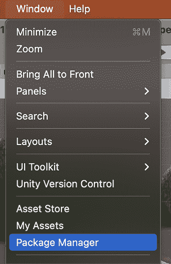

图 11.34：包管理器位置

1.  请确保**包**下拉菜单处于**Unity 注册表**模式，以查看 Unity 官方包列表：

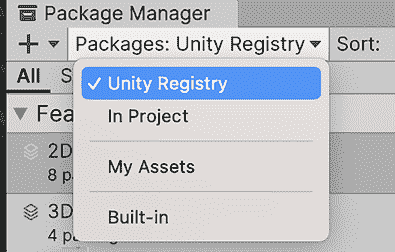

图 11.35：包管理器 Unity 注册表模式

1.  在左侧列中，找到**Universal RP**并检查右侧是否显示 15.0.6 或更高版本。如果是，跳转到*步骤 6*。不过，请记住，更高版本可能看起来不同，或者使用步骤与本章中显示的不同。

1.  如果您没有 15.0.6 或更高版本，点击面板右侧的**版本历史**选项卡以显示所有可能的版本列表。定位到**15.0.6**并点击它。在我的情况下，它显示为**已安装**，因为我已经在项目中安装了该版本，并且没有其他版本可用于 Unity 2022：

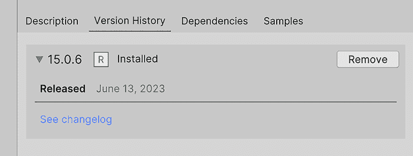

图 11.36：包版本选择器

1.  点击窗口右下角的**更新到 15.0.6**按钮，等待包更新。

1.  在窗口左侧查找**视觉效果图**包。与 Universal RP 一样，确保您选择版本**15.0.6**或更高版本：

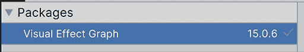

图 11.37：视觉效果图包

1.  点击窗口右下角的**安装**按钮，等待包安装。有时建议在安装包后重启 Unity，因此请保存您的更改并重启 Unity。

现在我们已经安装了视觉效果图，让我们使用它创建第一个粒子系统。

## 创建和分析视觉效果图

使用视觉效果图创建粒子系统的方法与常规粒子系统类似。我们将链式配置模块作为粒子行为的一部分，每个模块添加一些特定的行为。首先，我们需要创建**视觉效果图**，这是一个将包含所有模块和配置的资产，然后创建一个 GameObject 来执行图资产以生成粒子。让我们按照以下步骤进行：

1.  在**项目**窗口中，点击**+**按钮，查找**视觉效果 | 视觉效果图**：

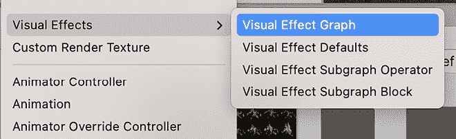

图 11.38：视觉效果图

1.  从新弹出的窗口中，从可用模板中选择**简单循环**选项。您可以重命名文件为 Rain：

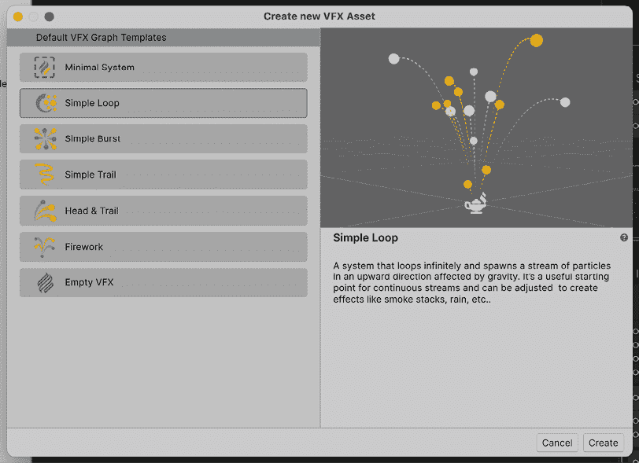

图 11.39：简单循环模板

1.  使用**GameObject** | **Create Empty**选项创建一个空 GameObject：

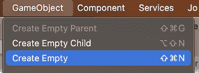

图 11.40：空 GameObject 创建

1.  选择创建的对象，查看检查器。

1.  使用**添加组件**搜索栏，查找**视觉效果**组件并点击它以将其添加到对象：

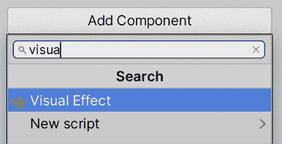

图 11.41：向视觉效果图添加组件

1.  将我们创建的**视觉效果**资产拖动到 GameObject 中的视觉效果组件的**资产模板**属性：

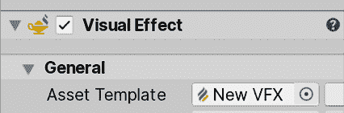

图 11.42：使用之前创建的视觉效果资产

1.  你应该看到一个代表我们的对象的魔法灯图示，这是新**视觉效果**资产的默认状态，意味着它被正确创建：

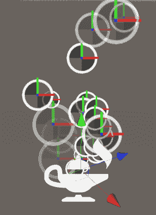

图 11.43 默认视觉效果资产结果

在创建基本视觉效果并拥有基础效果之后，现在让我们创建一些需要大量粒子的东西，比如密集的雨。在这样做之前，我们将探索视觉效果图的一些核心概念。如果你双击**视觉效果**资产，你会看到以下编辑器：

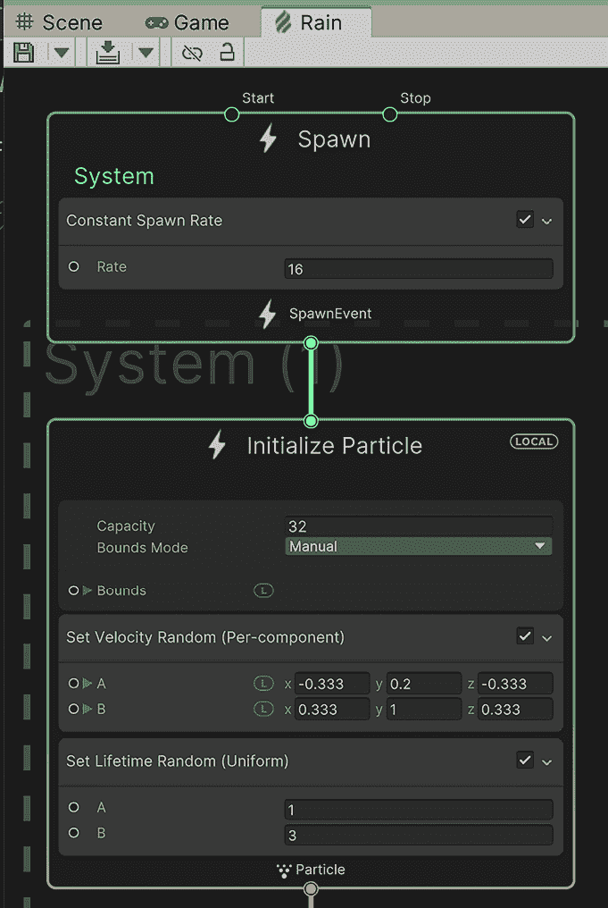

图 11.44：视觉效果图编辑器窗口

这个窗口由几个相互连接的节点组成，生成要执行的动作流。与 Shader Graph 类似，你可以通过按住*Alt*键（Mac 上的*Option*键）并用鼠标拖动图中的空白区域来导航这个窗口。一开始，它看起来与 Shader Graph 相似，但它的工作方式略有不同，所以让我们研究默认图的每个部分。

首先要探索的区域是包含三个节点的虚线区域。这是 Unity 所说的**系统**。系统是一组节点，它定义了粒子将如何行为，你可以拥有任意多个，这相当于拥有多个粒子系统对象。每个系统由**上下文**组成，即虚线区域内的节点，在这个例子中，我们有**初始化粒子**、**更新粒子**和**输出粒子四边形**。每个上下文代表粒子系统逻辑流程的不同阶段，因此让我们定义我们图中的每个上下文的作用：

+   **初始化粒子**：这定义了每个发射粒子的初始数据，例如位置、颜色、速度和大小。它类似于我们在本章开头看到的粒子系统的**主**模块中的**开始**属性。这个节点中的逻辑只有在新的粒子被发射时才会执行。

+   **更新粒子**：在这里，我们可以对存活粒子的数据进行修改。我们可以改变粒子数据，如当前速度或所有帧的粒子大小。这类似于我们在本章开头看到的粒子系统的**时间流逝**节点。

+   **输出粒子四边形**：当粒子需要被渲染时，这个上下文将被执行。它将读取粒子数据以确定渲染位置、渲染方式、使用的纹理和颜色以及不同的视觉设置。这类似于之前粒子系统的**渲染器**模块。

在每个上下文中，除了一些基本配置外，我们还可以添加**块**。每个块都是一个将在上下文中执行的操作。我们有可以在任何上下文中执行的操作，以及一些特定上下文操作。例如，我们可以在**初始化粒子**上下文中使用**添加位置**块来移动初始粒子位置，但如果我们在**更新粒子**上下文中使用相同的块，它将使粒子持续移动。所以基本上，上下文是粒子生命周期中发生的情况，而块是在这些情况下执行的操作：

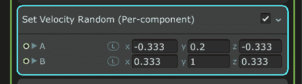

图 11.45：初始化粒子上下文中的“设置速度随机”块。这设置了粒子的初始速度

此外，我们还可以有**独立上下文**，即系统之外的上下文，例如**生成**。这个上下文负责告诉系统需要创建一个新的粒子。我们可以添加块来指定上下文何时告诉系统创建粒子，例如在固定的时间间隔内，爆发等。想法是**生成**将根据其块创建粒子，而系统则负责根据我们在每个上下文中设置的块初始化、更新和渲染每个粒子。

因此，我们可以看到它与常规粒子系统有很多相似之处，但在这里创建系统的方式相当不同。让我们通过创建一个雨效来加强这一点，这将需要大量的粒子——这是 Visual Effect Graph 的一个很好的用例。

## 创建雨效

为了创建这个效果，请执行以下操作：

1.  将“初始化粒子”上下文的**容量**属性设置为`10000`：

图 11.46 初始化粒子上下文

1.  在图表的开始处设置**常量出生率**为`10000`：

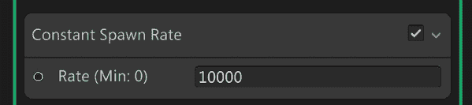

图 11.47：常量出生率块

在图上添加新节点之前，我们将删除我们不需要创建雨效的节点。

1.  在“初始化粒子块”中的节点**设置位置（形状：圆弧球体）”上右键单击并选择**删除**以删除此节点：

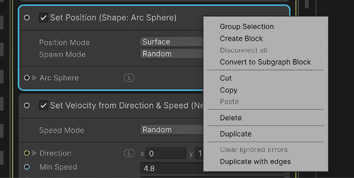

图 11.48：删除“设置位置”块

1.  使用节点“从方向和速度（新方向）设置速度”重复此过程以删除它

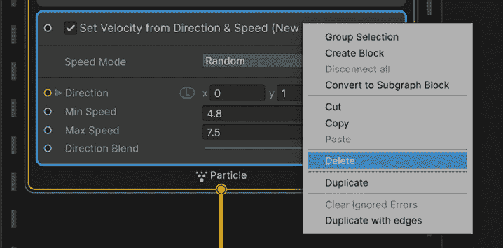

图 11.49：删除“设置速度”块

1.  右键单击“初始化粒子”标题，并选择创建块

1.  搜索“设置速度随机（按组件）”块并点击它以添加：

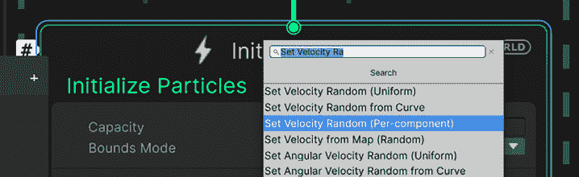

图 11.50：添加“设置速度随机”块

1.  在“初始化粒子”上下文中的“设置速度随机”块中，将 A 和 B 属性分别设置为（0, -50, 0）和（0, -75, 0）。这将为我们设置一个指向下方的随机速度：

图 11.51：设置速度随机块

1.  右键单击更新粒子方块内的重力节点，并选择删除以移除此节点：

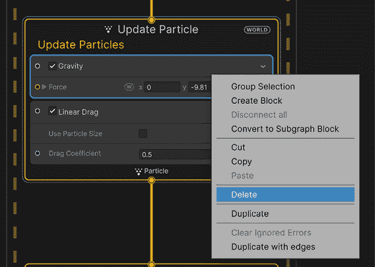

图 11.52：删除重力方块

1.  使用线性阻力方块重复此过程：

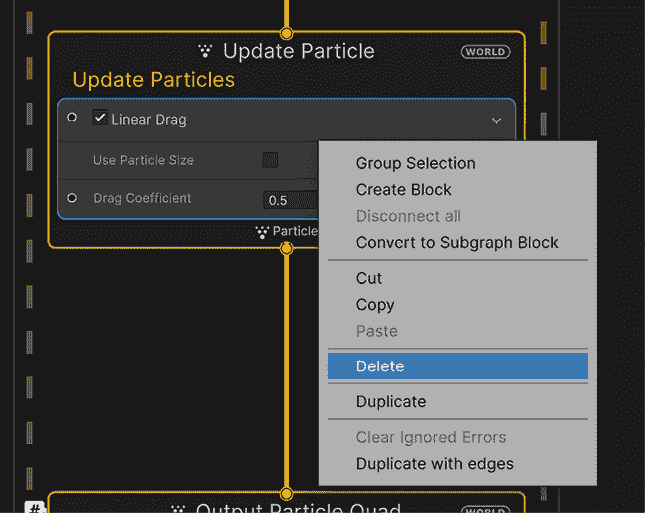

图 11.53：删除线性阻力方块

1.  在进行这两次删除操作后，更新粒子方块将变为空：

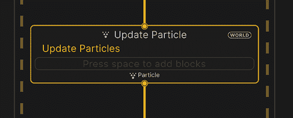

图 11.54：空的更新粒子方块

1.  右键单击 **初始化粒子** 标题，并选择 **创建方块**。

1.  在网络上搜索 **Set Position Random (Per-component)** 方块，并点击它：

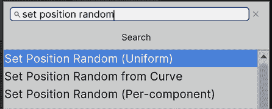

图 11.55：添加方块

1.  将 **Set Position Random** 方块的 **A** 和 **B** 属性分别设置为 (`-50`, `0`, `-50`) 和 (`50`, `0`, `50`)。这将定义一个初始区域，用于随机生成粒子。

1.  点击 **Initialize Particle** 方块的 **Bounds** 属性左侧的箭头以显示其属性，并将 **Center** 和 **Size** 分别设置为 (`0`, `-12.5`, `0`) 和 (`100`, `25`, `100`)。这将定义粒子应可见的区域。粒子实际上可以移动到这个区域之外，但仅在我们感兴趣的区域中渲染粒子是很重要的。

在网络上搜索 `Frustum culling` 以获取有关边界的更多信息。

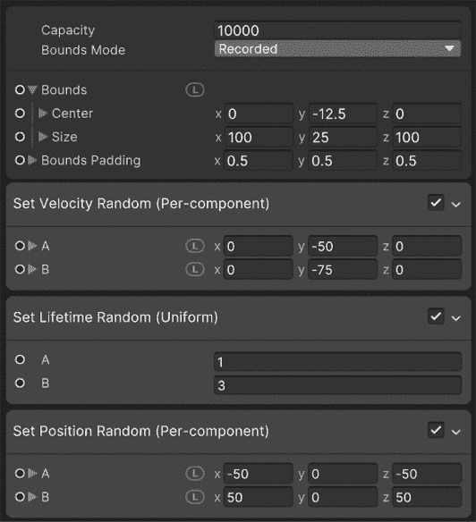

图 11.56：配置方块

1.  选择执行系统的 GameObject，在 **场景** 视图的右下角窗口中，勾选 **显示边界** 复选框以查看之前定义的边界：

图 11.57：视觉效果播放控制

1.  如果你没有看到右下角的窗口，请点击屏幕左上角的 **VE**（视觉效果）按钮来显示它。此按钮仅在你在 **层次结构** 中选择了 **雨** 视觉效果 GameObject 时才会显示：

图 11.58：另一种显示视觉效果播放控制的方式

1.  如果你看不到应用的变化，请点击窗口左上角的 **编译** 按钮，它看起来像箭头下方的纸篓。你也可以使用 *Ctrl* + *S*（在 Mac 上为 *Command* + *S*）保存你的更改：

图 11.59：VFX 资产保存控制

1.  将对象位置设置为覆盖整个基础区域。在我的情况下，**位置** 是 `100`，`37`，和 `100`。请记住，你需要更改 **Transform** 组件的 **位置**：

图 11.60：设置变换位置

1.  在 **Initialize Particle** 中将 **Set Lifetime Random** 方块的 **A** 和 **B** 属性设置为 `0.5`。这将使粒子的寿命更短，确保它们始终在边界内：

图 11.61：设置寿命随机方块

1.  将**输出粒子四边形**上下文的**主纹理**属性更改为另一个纹理。在这种情况下，之前下载的烟雾纹理可以在这里使用，即使它不是水，因为我们将在稍后修改其外观。此外，如果您想的话，还可以尝试下载水滴纹理：

图 11.62：VFX 图主纹理

1.  将**输出粒子四边形**上下文的**混合模式**设置为**添加**：

图 11.63：VFX 图的添加模式

1.  我们需要稍微拉伸我们的粒子，使其看起来像真正的雨滴而不是下落的球体。在完成这一目标之前，首先，我们需要改变粒子的方向，使它们不会总是指向摄像机。为了做到这一点，在**输出粒子四边形**上下文中的**定位**块上右键单击并选择**删除**（或在 PC 上按*Delete*或在 Mac 上按*Command* + *Backspace*）：

图 11.64：删除块

1.  我们希望根据粒子的速度方向拉伸粒子。在实际上进行这一操作之前，另一个准备步骤是选择**输出粒子四边形**上下文的标题并按空格键查找要添加的块。在这种情况下，我们需要搜索并添加**沿速度方向定位**块。

1.  在**初始化粒子**上下文中添加一个**设置缩放**块，并将**缩放**属性设置为`0.25`、`1.5`和`0.25`。这将使粒子看起来像下落的雨滴：

图 11.65：设置缩放块

1.  再次单击左上角的**编译**按钮以查看更改。您的系统应该看起来像这样：

图 11.66：雨效果

1.  您可以通过 Output Particle Quad Block 中的两个节点调整其余的节点值，以在粒子的整个生命周期内改变粒子的大小和颜色。

我们刚刚修改了视觉效果图的许多不同属性，但如果您想要两个具有轻微差异的相同视觉效果图实例，我建议您查看**黑板**功能，这将允许您在**检查器**中公开属性。例如，您可以在另一个场景中制作密度较低的雨，降低生成率，或将粒子颜色改为酸雨，所有这些都可以使用相同的图，但现在让我们保持简单。

**黑板**功能也存在于**着色器图**中。

从这里，您可以按照自己的意愿添加和删除上下文中的块进行实验，并且再次，我建议您查找已创建的视觉效果图以获取其他系统的想法。实际上，您可以通过查看常规粒子系统中的效果并使用类似块来获取视觉效果图的灵感。

此外，我建议你在网上或以下链接中搜索视觉效果图文档：`docs.unity3d.com/Packages/com.unity.visualeffectgraph@15.0/manual/index.html`，以了解更多关于这个系统。你还可以通过在**包管理器**中选择包时点击**文档**按钮来访问任何 Unity 包的文档。

![img/B21361_11_67.png]

图 11.67：包管理器文档链接

现在我们已经学会了如何创建不同的视觉效果，让我们看看如何通过脚本使用它们来实现对游戏中发生的事情做出反应的效果。

## 脚本化视觉效果

视觉反馈是使用不同的视觉效果（如粒子效果和 VFX 图），以强化正在发生的事情的概念。例如，假设我们现在正在开枪；我们知道这是在发生，因为我们能看到子弹。然而，这并不像真实的射击效果，因为一个合适的射击效果应该在枪口处产生枪口效果。另一个例子是敌人死亡——它只是没有动画地消失！这并不像它本可以那样令人满意。我们可以添加一个小爆炸（考虑到它们是机器人）。

让我们从以下步骤开始，让我们的敌人被摧毁时产生爆炸：

1.  创建一个爆炸效果，或者从资产商店下载一个。它不应该循环，并且在爆炸结束后需要自动销毁（确保在 **Main** 模块中**循环**未被勾选，并将**停止动作**设置为**销毁**）。你可以自由使用我们在本章中之前使用过的同一个效果。

1.  资产商店中的一些爆炸效果可能使用与 URP 不兼容的着色器。该包的 **Asset Store** 页面指定了该包是否支持 URP。你还可以通过使用 **Window | Rendering | Render Pipeline Converter** 来修复它们，正如我们在 *第四章* 中所看到的，*无缝集成：导入和集成资产*。

1.  手动升级那些没有自动升级的材料。

1.  在 `Enemy` 预制体上添加一个名为 `ExplosionOnDeath` 的脚本。这将负责在敌人死亡时生成粒子预制体。

1.  添加一个名为 `particlePrefab` 的 **GameObject** 类型的字段，并将 `explosion` 预制体拖放到它上面。

    你可能期望将爆炸生成添加到 **Life** 组件中。在这种情况下，你假设与生命有关的所有内容在死亡时都会生成粒子，但考虑一下这样的场景：角色死亡时带有下落动画，或者可能是一个没有任何效果就消失的对象。如果某种行为在大多数场景中都没有使用，那么最好将其编码在单独的可选脚本中，这样我们可以混合和匹配不同的组件，以获得我们想要的确切行为。

1.  让脚本访问我们在第八章，*胜利或失败：胜利和失败条件* 中创建的 `Life` 组件，并订阅其 `OnDeath` 事件。

1.  在 `listener` 函数中，让我们在相同的位置实例化粒子系统：

图 11.68：爆炸生成器脚本

可视脚本版本看起来是这样的：

图 11.69：爆炸生成器可视脚本

如您所见，我们只是在之前章节中学到的相同概念，但以新的方式组合它们。这就是编程的全部内容。

让我们继续讨论枪口效果，这使我们的枪感觉更真实，并为玩家的角色射击提供反馈。它也可以是一个粒子系统，但这次我们将采取另一种方法：

1.  如果你还没有，从 Asset Store 下载一个武器模型。我们在这本书中使用的包中的角色已经包含了一个，所以我们将使用那个。

1.  如果你的角色上还没有，实例化武器，使其成为玩家手的父对象。记住，我们的角色是绑定的，有一个手骨，所以你应该把它放在那里。

    在本书中下载的角色所带的武器是一个特殊场景，其中武器具有 **SkinnedMeshRenderer** 组件。该组件使用我们将在第十七章，*动画现实：使用 Animator、Cinemachine 和 Timeline 创建动画* 中学习的 **Skinning Animation** 系统。在这种情况下，武器的运动将受到我们将在该章中使用的动画的影响，因此现在让我们保持武器现在的位置，即使它看起来有点奇怪。

1.  创建或获取一个枪口粒子系统。在这种情况下，我的枪口粒子系统被创建为一个短粒子系统，它会爆发粒子然后自动停止。尝试获取具有该行为的粒子系统，因为还有其他一些会循环，而处理这种情况的脚本将不同。

1.  在编辑器中创建粒子系统的 Prefab 实例，并将其作为武器的子对象放置其中，使其位于武器前方，与枪的炮管对齐。确保粒子系统 **Main** 模块的 **Play On Awake** 属性未被勾选；我们不希望在按下 **Fire** 键之前发射枪口：

图 11.70：与武器关联的枪口

1.  在 `PlayerShooting` 中创建一个名为 `muzzleEffect` 的 `ParticleSystem` 类型的字段。

1.  将在枪中关联的枪口效果 GameObject 拖到检查器中。现在，我们有了对枪口 **ParticleSystem** 组件的引用来管理它。

1.  在检查我们是否在射击的`if`语句中执行`muzzleEffect.Play();`以播放粒子系统。它将自动停止，并且足够短，可以在按键之间完成：

图 11.71：枪口附加到武器上

可视化脚本版本的附加节点和变量如下所示：

图 11.72：枪口播放可视化脚本

最后，我们还需要在射击时通过以下方式在 AI 上播放枪口效果：

1.  如同`PlayerShooting`一样，在`EnemyFSM`中创建一个名为`muzzleEffect`的`ParticleSystem`类型的字段。

1.  在`Shoot`方法中，在方法末尾添加`muzzleEffect.Play();`行以播放粒子系统：

图 11.73：发射时播放 C#脚本

可视化脚本版本的**攻击状态**和**攻击**`Base`的附加节点将如下所示：

图 11.74：播放攻击状态脚本的枪口

记得将那些节点添加到攻击状态中，并将**muzzleEffect**变量添加到 AI 变量组件中。

# 摘要

在本章中，我们讨论了创建粒子系统的两种不同方法：使用常规粒子系统和 VFX 图。我们使用它们来模拟不同的流体现象，如火焰、瀑布、烟雾和雨。想法是将粒子系统与网格结合以生成场景所需的全部可能道具。此外，正如你可以想象的那样，创建这类效果需要你深入了解。

如果你想要致力于这个（技术艺术家工作的另一个部分），你需要学习如何创建自己的粒子纹理以获得你想要的精确外观和感觉，编写控制系统某些方面的脚本，以及粒子创建的几个其他方面。然而，这超出了本书的范围。

现在我们场景中有了一些雨，我们可以看到天空和场景中的光照并不真正反映雨天，所以让我们在下一章中修复这个问题！

# 在 Discord 上了解更多

与其他用户、Unity 游戏开发专家和作者本人一起阅读这本书。提出问题，为其他读者提供解决方案，通过 Ask Me Anything 会议与作者聊天，等等。扫描二维码或访问链接加入社区：

[`packt.link/unitydev`](https://packt.link/unitydev)

