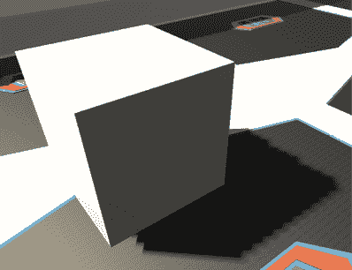
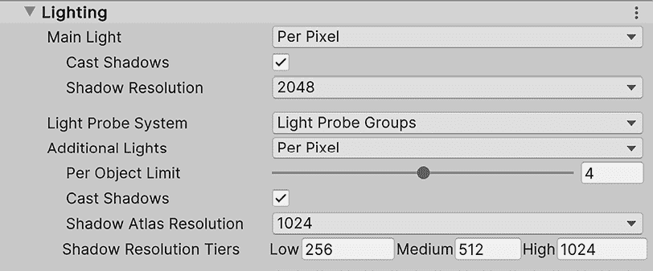
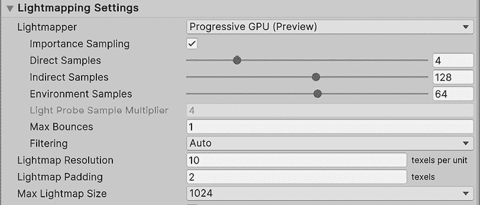

# 12

# 《照亮世界：使用通用渲染管线照亮场景》

**照明**是一个复杂的话题，有几种可能的方式来处理它，每种方法都有其优缺点。为了获得最佳的质量和性能，你需要确切地知道你的渲染器如何处理照明，这正是我们将在本章中探讨的内容。我们将讨论在 Unity 的**通用渲染管线**（**URP**）中如何处理照明，以及如何正确配置它以适应场景的氛围，并使用适当的照明效果。

在本章中，我们将探讨以下照明概念：

+   应用照明

+   应用阴影

+   照明优化

在本章结束时，我们将正确使用不同的 Unity 照明系统，如直接光照和光照贴图，来反映多云和雨夜的景象。

# 应用照明

当讨论在游戏中处理照明的不同方法时，我们有两种主要的方法，称为**前向渲染**和**延迟渲染**，每种方法都有一些变体。它们以不同的顺序、不同的技术、不同的要求和优缺点来处理照明。前向渲染通常推荐用于性能，而延迟渲染通常推荐用于质量。

此外，在 Unity 中，前向渲染器有三种模式：**多次遍历前向**，用于内置渲染器（旧的 Unity 渲染器），**单次遍历前向**，默认用于 URP，以及**单次遍历前向+**，这是**HDRP**（**高清晰度渲染管线**）支持的唯一形式，也是 URP 的一个选项。我们有几个模式，因为每个模式都有不同的特性和限制，使它们适用于不同类型的游戏。

选择哪种方法取决于你正在创建的游戏类型以及你需要在该平台上运行游戏。你选择的选项将因你如何将照明应用到场景中而大量改变，因此了解你正在处理哪个系统至关重要。

在下一节中，我们将讨论以下实时照明概念：

+   讨论照明方法

+   使用天空盒配置环境照明

+   在 URP 中配置照明

让我们先比较一下之前提到的照明方法。

## 讨论照明方法

回顾一下，我们提到了处理照明的三种主要方法：

+   前向渲染（单次遍历）

+   前向渲染（多次遍历）

+   前向+渲染（单次遍历）

+   延迟渲染

请参考文档了解如何为测试启用这些模式中的每一个。例如，要在 URP 中启用延迟渲染，请使用此链接：`docs.unity3d.com/Packages/com.unity.render-pipelines.universal@15.0/manual/rendering/deferred-rendering-path.html#how-to-enable`

在我们查看它们之间的差异之前，让我们谈谈它们共有的东西。这三个渲染器开始绘制场景，通过确定哪些物体可以被相机看到——即那些落在相机视锥体（相机所看到的区域）内的物体——并提供一个当选择相机时可以看到的巨大金字塔：

图 12.1：相机仅渲染其视锥体内的物体，裁剪（或隐藏）那些在外的物体

之后，Unity 将按照从相机最近到最远（透明物体处理方式略有不同，但在此我们先忽略这一点）的顺序对它们进行排序。这样做的原因是因为靠近相机的物体更有可能覆盖大部分相机视野，因此它们会遮挡其他物体（会阻止其他物体被看到），从而避免我们浪费资源去计算被遮挡物体的像素。

最后，Unity 将尝试按照这个顺序渲染物体。这就是光照方法之间开始出现差异的地方，所以让我们开始比较两种前向渲染变体。对于每个物体，单次遍历前向渲染将在一次操作中计算物体的外观，包括所有影响该物体的光源，或者我们称之为绘制调用。

**绘制调用**是 Unity 请求显卡实际渲染指定物体的确切时刻。Unity 所执行的所有先前工作（例如，设置将要使用的着色器）都是为了这一刻做准备。在多遍历前向渲染器的情况下，通过稍微简化实际逻辑，Unity 将根据影响物体的每个光源渲染物体一次；因此，如果物体被三个光源照亮，Unity 将渲染物体三次，这意味着将发出三个绘制调用，并对 GPU 进行三次调用以执行渲染过程：

图 12.2：左图，多遍历中受两个光源影响的球体的第一次绘制调用；中图，球体的第二次绘制调用；右图，两次绘制调用的组合

现在你可能正在想，“为什么我要使用 Multi-Pass？Single Pass 性能更好！”是的，你是对的！Single Pass 比 Multi-Pass 性能更好，这意味着我们的游戏将以更高的帧率运行，尽管这里有一个大但。GPU 中的绘制调用可以执行的操作数量是有限的，所以你有一个绘制调用复杂性的限制。计算一个物体及其影响它的所有光源的外观非常复杂，为了使其适应仅一个绘制调用，Single Pass 执行了光照计算的简化版本，这意味着光照质量较低，功能较少。它们还对一次可以处理的光源数量有限制，在撰写本书时，每个物体为八个；如果你愿意，可以配置得更少，但默认值对我们来说已经足够好了。这听起来像是一个小数字，但通常已经足够了。

另一方面，Multi-Pass 可以应用你想要的任意数量的光源，并且可以为每个光源执行不同的逻辑。假设我们的物体有四个影响它的光源，但有两个光源因为它们更近或强度更高，对物体的影响非常显著，而剩下的光源对物体的影响只是足够引起注意。在这种情况下，我们可以用更高的质量渲染前两个光源，而剩下的光源则用简单的计算——没有人会注意到区别。

在这种情况下，Multi-Pass 可以使用**像素光照**计算前两个光源，而剩下的光源则使用**顶点光照**。区别在于它们的名称；像素是按对象像素计算光照，而顶点是按对象顶点计算光照，并填充这些顶点之间的像素，从而在顶点之间插值信息。你可以在以下图像中清楚地看到区别：

图 12.3：左图，使用顶点光照渲染的球体；右图，使用像素光照渲染的球体

在 Single Pass 中，在一个绘制调用中计算所有内容迫使你必须使用顶点光照或像素光照；你不能将它们结合起来。

最后，我们还有 Forward+，这是 Single-Pass Forward 的一个变体，但为了渲染更多的光源，需要一些额外的处理。如果你计划使用 Forward 但想要支持超过限制的光源，你应该选择这个选项。

因此，为了总结单次遍历和多次遍历之间的差异，在单次遍历中，由于每个对象只绘制一次，因此性能更好，但你受到可应用光源数量的限制，而在多次遍历中，你需要渲染对象多次，但光源数量没有限制，并且你可以为每个光源指定你想要的精确质量。还有其他一些需要考虑的事情，例如实际绘制调用的成本（一个绘制调用可能比两个简单的调用更昂贵），以及如卡通着色等特殊光照效果，但让我们保持简单。

最后，让我们简要讨论一下延迟渲染。即使我们不会使用它，了解为什么我们不这样做也是很有趣的。在确定哪些对象位于视锥体内并对它们进行排序后，延迟渲染将不应用任何光照来渲染对象，生成所谓的 **G-Buffer**。G-Buffer 是一组包含有关场景中对象不同信息的图像，例如像素的颜色（无光照）、每个像素的方向（称为 **法线**）以及像素与相机之间的距离。

你可以在以下图像中看到 G-Buffer 的典型示例：

图 12.4：左图，对象的纯色；中图，每个像素的深度；右图，像素的法线

法线是方向，方向的 *x*、*y* 和 *z* 分量编码在颜色的 RGB 分量中。

在渲染场景中的所有对象之后，Unity 将遍历相机中可见的所有光源，从而在 G-Buffer 上应用一层光照，从中获取信息来计算特定光源。处理完所有光源后，你将得到以下结果：

图 12.5：对前一个图像中显示的 G-Buffer 应用了三个光源的组合

如你所见，这种方法中的延迟部分源于将光照计算作为渲染过程的最后阶段的想法。这更好，因为你不会浪费资源去计算可能被遮挡的对象的光照。如果图像的地面首先在 **前向** 模式下渲染，那么其他对象将要遮挡的像素将被无用地计算。此外，延迟渲染的优点是它只计算光照能够到达的确切像素。例如，如果你使用手电筒，Unity 将只计算手电筒锥体内的像素的光照。这里的缺点是延迟渲染不支持一些相对较旧的显卡，并且你不能使用顶点光照质量来计算光照，因此你需要付出像素光照的代价，这在低端设备上（甚至在简单的图形游戏中）是不推荐的（甚至可能是必要的）。

那么，为什么我们使用 URP 和单次绘制前向（默认值）？因为它在性能、质量和简单性之间提供了最佳平衡。在这个游戏中，我们不会使用太多光照，所以我们不会担心单次绘制的光照数量限制。如果你需要更多光照，可以使用延迟或前向+，但请考虑额外的硬件要求以及没有顶点光照选项的性能成本。

因此，为了总结我们迄今为止所看到的内容，让我们比较一下这些系统：

+   **前向渲染**（**单次绘制**）：在单个 GPU 绘制调用中渲染对象，每个对象应用有限数量的光照（撰写本文时为 9 个）。允许使用顶点光照或像素光照（后者对 GPU 的负担更大）。如果你的游戏与光照数量限制相匹配，这是首选选项。

+   **前向渲染**（**多遍绘制**）：使用每像素光照进行一次额外的绘制调用，但可以渲染无限数量的光照。在 URP 上不可用，因此我们无法在本项目中使用它。

+   **前向+渲染**（**单次绘制**）：绕过单次绘制前向的限制，允许每个对象渲染无限数量的光照；但不支持顶点光照。当需要比常规前向更多光照时推荐使用。它。

+   **延迟渲染**：首先渲染所有对象，然后对每个光照接触的像素应用光照。当使用大量光照时推荐使用。测试在最低目标设备上，Forward+或延迟渲染在你的设备硬件、游戏配置和光照数量下哪个表现更好。

如果你想了解更多关于不同的渲染路径以及如何激活它们的信息，请查看此链接：https://docs.unity3d.com/Packages/com.unity.render-pipelines.universal@15.0/manual/urp-universal-renderer.html#rendering-path-comparison

既然我们已经对 URP 如何处理光照有了非常基本的了解，让我们开始使用它吧！

## 使用天空盒配置环境光照

有不同的光源可以影响场景，例如太阳、手电筒和灯泡。这些被称为**直接光照**——即发射光线的对象。然后，我们有**间接光照**，它表示直接光照如何在其他对象上反弹，如墙壁。然而，计算所有光源发出的所有光线的所有反弹是非常昂贵的，从性能角度来看，需要支持光线追踪的特殊硬件。问题是，没有间接光照将产生不真实的结果，你可以观察到阳光无法到达的地方完全黑暗，因为没有来自光线击中其他地方的光线反弹。

在下一张图片中，你可以看到这种配置错误场景的示例：

图 12.6：无环境光照的山上投影的阴影

如果您遇到这个问题，通过使用那些反弹的近似值来解决问题的性能方法是有效的。这些就是我们所说的**环境光**。这代表了一个基础的光照层，通常根据天空的颜色应用一点光，但您可以选择任何您想要的颜色。例如，在晴朗的夜晚，我们可以选择深蓝色来代表月光带来的色调。

如果您在 Unity 2023 中创建一个新的场景，通常这是自动完成的，但在没有自动完成或通过其他方法创建场景的情况下，了解如何通过以下操作手动触发此过程是方便的：

1.  点击**窗口 | 渲染 | 光照**。这将打开场景光照设置窗口：

图 12.7：光照设置位置

1.  点击窗口底部的**生成光照**按钮。如果您到目前为止还没有保存场景，将弹出一个提示要求您保存，这是必要的：

图 12.8：生成光照按钮

1.  查看 Unity 窗口的右下角，检查进度计算条，以查看何时完成过程：

图 12.9：光照生成进度条

1.  现在，您可以看到完全黑暗的区域是如何被天空发出的光照亮的：

图 12.10：带有环境光照的阴影

现在，通过这样做，我们有了更好的光照，但它仍然看起来像晴天。记住，我们想要的是雨天。为了做到这一点，我们需要更改默认的天空，使其多云。您可以通过下载一个**skybox**来实现这一点。您现在在场景周围看到的当前天空只是一个包含每个面的纹理的大立方体，这些纹理有一个特殊的投影，以防止我们检测到立方体的边缘。

我们可以为立方体的每一面下载六张图片，并将它们应用到我们想要的任何天空，让我们这样做：

1.  您可以从任何地方下载 skybox 纹理，但在这里，我将选择 Asset Store。通过访问**窗口 | Asset Store**并进入 Asset Store 网站来打开它。

1.  在右侧的分类列表中查找**分类 | 2D | 纹理与材质 | 天空**。记住，如果您看不到分类列表，请尝试将窗口变宽：

图 12.11：纹理与材质

1.  记得在**价格**选项中勾选**免费资源**复选框。

    选择任何适合雨天的一天天空盒。考虑到天空盒有不同的格式。我们使用的是六图像格式，所以在下载之前请检查。还有一种格式叫做**立方体贴图**，本质上与它相同，但我们将继续使用六图像格式，因为它是最简单且易于使用和修改的格式。在我的情况下，我选择了*图 12.12*中显示的天空盒包。下载并导入它，就像我们在*第四章*中做的那样，*无缝集成：导入和整合资源*。

    

    图 12.12：为此本书选择的天空盒集

1.  通过在**项目**窗口中使用**+**图标并选择**材质**来创建一个新的材质。

1.  将该材质的**Shader**选项设置为**Skybox/6 面**。记住，天空盒只是一个立方体，因此我们可以应用材质来改变其外观。天空盒着色器已准备好应用六个纹理。

1.  将六个纹理拖动到材质的**Front**、**Back**、**Left**、**Right**、**Up**和**Down**属性。六个下载的纹理将具有描述性的名称，以便你知道哪些纹理放在哪里：

图 12.13：天空盒材质设置

1.  将材质直接拖动到场景视图中的天空上。确保不要将材质拖动到对象上，因为材质将被应用到它上面。

1.  重复环境光计算步骤的*步骤 1*到*4*（**光照设置** | **生成光照**）以根据新的天空盒重新计算它。在以下图像中，你可以看到我项目到目前为止的结果：

图 12.14：应用的天空盒

现在我们有一个良好的光照基础层，我们可以开始添加灯光对象。

## 在 URP 中配置光照

我们可以向场景添加三种主要的动态灯光类型：

+   **方向光**：这是一种代表太阳的灯光。该对象以它面对的方向发射光线，无论其位置如何。例如，如果你慢慢旋转这个对象，你可以生成白天/夜晚周期：

图 12.15：方向光结果

+   **点光源**：这种灯光代表一个灯泡，以全向方式发射光线。与方向光相比，它的不同之处在于其位置很重要，因为它更靠近我们的对象。此外，因为它是一种较弱的灯光，所以光强度会根据距离变化，因此其效果有一个范围——物体离光源越远，接收到的强度越弱：

图 12.16：点光源结果。黄色圆圈代表光的范围

+   **聚光灯**：这种灯光代表一个光锥，例如手电筒发出的光。它在行为上类似于点光源，其位置很重要，光线强度会在一定距离内衰减。但在这里，它指向的方向（因此它的旋转）也很重要，因为它将指定光线投射的位置：

图 12.17：聚光灯效果。黄色锥体代表光照区域

到目前为止，我们已经有了很好的、下雨的、环境照明，但场景中唯一的直接光源，即方向光，设置不正确；这看起来像是场景中的实际天气，所以让我们改变一下：

1.  在**层次结构**窗口中选择**方向光**对象，然后查看**检查器**窗口。

1.  点击**发射**部分的**颜色**属性以打开颜色选择器。

1.  选择深灰色以实现太阳光被云层部分遮挡的状态。

1.  将**阴影类型**设置为**无阴影**。既然是多云天气，太阳不会投射清晰的阴影，但我们稍后会更多地讨论阴影：

图 12.18：无阴影的柔和方向光

现在场景变暗了，我们可以添加一些灯光来照亮场景，如下所示：

1.  通过转到**游戏对象 | 光 | 聚光灯**来创建一个聚光灯。

1.  选择它。然后，在**检查器**窗口中，在**形状**部分将**内/输出聚光角度**设置为**90**和**120**，这将增加锥形的角度。

1.  在**发射**部分将**范围**设置为`50`，这意味着光线可以达到 50 米，并在途中衰减。

1.  在**发射**部分将**强度**设置为`1000`：

图 12.19：聚光灯设置

1.  将灯光放置在游戏基地的一个角落，指向中心：

图 12.20：聚光灯位置

1.  通过选择它并按*Ctrl+D*（在 Mac 上为*Command+D*）来复制该灯光。

1.  将它放置在基地的对面角落：

图 12.21：两个聚光灯效果

你可以继续向场景添加灯光，但要注意不要过度——记住灯光限制。此外，你可以在灯光所在的位置下载一些灯柱来从视觉上证明光源的起源。现在我们已经实现了适当的照明，我们可以谈谈阴影。

# 应用阴影

也许你认为场景中已经有了阴影，但实际上并没有。物体的较暗区域，即不面向灯光的区域，没有阴影——它们没有被照亮，这与阴影有很大不同。在这种情况下，我们指的是从一个物体投射到另一个物体的阴影——例如，玩家投射到地板上的阴影，或者从山脉投射到其他物体上。

影子可以增强我们场景的质量，但它们在计算上也很耗费资源，因此我们有两种选择：不使用影子（推荐用于低端设备，如手机）或者根据我们的游戏和目标设备在性能和质量之间找到一个平衡点。

图 12.22：区域 1：一个没有光照的区域，因为它没有面向光源。区域 2：一个没有光照的区域，因为它被另一个立方体所遮挡

在本节中，我们将讨论以下关于影子的主题：

+   理解影子计算

+   配置高性能的影子

让我们首先讨论 Unity 如何计算影子。

## 理解影子计算

在游戏开发中，众所周知，影子在性能方面是昂贵的，但为什么？当一个光束在到达目标物体之前击中另一个物体时，物体就会产生影子。在这种情况下，该光不会对该像素应用任何光照。这里的问题与我们处理环境光照模拟中的光的问题相同——计算所有可能的光线和它们的碰撞将非常昂贵。因此，我们再次需要一个近似值，这就是影子贴图发挥作用的地方。

**影子贴图**是从光的角度渲染的图像，但它不会绘制带有所有颜色和光照计算的完整场景，而是将所有物体以灰度渲染，其中黑色表示像素非常远离光源，而更白则表示像素更接近光源。如果你这么想，每个像素都包含有关光线**射线**击中位置的信息。通过了解光源的位置和方向，你可以使用影子贴图计算出每个“射线”击中的位置。

在以下图像中，你可以看到我们方向光的影子贴图：

图 12.23：由场景中的方向光生成的影子贴图

在*第十八章*，*性能魔法：使用 Profiler 工具优化你的游戏*中，我们将看到如何使用帧调试器分析所有绘制调用。这允许你看到影子贴图的生成。

每种光线类型在计算影子贴图时略有不同，尤其是点光源。由于它是全方向的，它需要从所有方向（前、后、左、右、上、下）渲染场景多次，以便收集关于它发出的所有光线的信息。不过，我们在这里不会详细讨论这个问题，因为我们可以整天都在讨论它。

现在，这里需要强调的一个重要问题是，影子贴图是纹理，因此它们具有分辨率。分辨率越高，我们的影子贴图计算的光线就越多。你可能想知道低分辨率影子贴图是什么样子，当它里面只有很少的光线时。看看以下图像以查看一个例子：

图 12.24：使用低分辨率阴影图渲染的硬阴影

这里的问题是，射线越少，产生的阴影像素就越大，导致阴影出现像素化。在这里，我们考虑的第一个配置是：我们的阴影的理想分辨率是多少？你可能会想直接增加它，直到阴影看起来平滑，但当然，这将增加计算所需的时间，因此会显著影响性能，除非你的目标平台能够处理它（移动设备肯定不能）。在这里，我们可以使用**软阴影**技巧，在阴影上应用模糊效果以隐藏像素化的边缘，如下面的图像所示：

图 12.25：使用低分辨率阴影图渲染的软阴影

当然，模糊效果不是免费的，但结合低分辨率阴影图，如果你接受其模糊的结果，可以在质量和性能之间产生良好的平衡。

现在，低分辨率的阴影图还有一个问题，这被称为**阴影痤疮**。这是你在以下图像中可以看到的照明错误：

图 12.26：低分辨率阴影图产生的阴影痤疮

低分辨率的阴影图产生假阳性，因为它计算出的“射线”较少。需要在射线之间着色的像素需要从最近的像素中插值信息。阴影图的分辨率越低，射线之间的间隙就越大，这意味着精度更低，假阳性更多。一个解决方案是增加分辨率，但同样，会有性能问题（总是如此）。

我们有一些巧妙的解决方案，比如使用**深度偏差**。以下图像就是一个例子：

图 12.27：两个远“射线”之间的假阳性。高亮区域认为射线在到达之前击中了物体

**深度偏差**的概念很简单——简单到似乎是一种很大的作弊，实际上确实如此，但游戏开发中充满了这样的技巧！为了防止假阳性，我们将光线稍微推远一点，刚好足够让插值光线达到被照亮的表面：

图 12.28：具有深度偏差的光线以消除假阳性

当然，正如你可能预料的那样，没有一些注意事项，这个问题是不会轻易解决的。增加深度会在其他区域产生假阴性，如下面的图像所示。看起来立方体像是漂浮的，但实际上它是在接触地面——假阴性产生了它漂浮的错觉：

图 12.29：由于高深度偏差产生的假阴性

当然，我们有一种对抗这种情况的技巧，称为**法线偏差**；这种方法特别通过将对象网格在对象面向的方向上移动来调整对象，而不是跟随光线的路径。这个方法有点棘手，所以我们不会在这里过多详细说明，但想法是结合一点深度偏差和一点法线偏差可以减少误报，但不会完全消除它们。因此，我们需要学会如何与之共存，并通过巧妙地定位对象来隐藏这些阴影差异：

图 12.30：减少了误报，这是结合深度和法线偏差的结果

影响阴影贴图工作方式的其他几个方面，其中之一是光程。光程越小，阴影覆盖的区域就越小。相同的阴影贴图分辨率可以增加该区域的更多细节，所以尽量减少光程，就像我们在下一节中将要做的那样。

我可以想象你现在的心情；是的，光照很复杂，我们只是刚刚触及表面！但保持你的士气！经过一点尝试和错误地调整设置后，你会更好地理解它。我们将在下一节中这样做。

如果你真的对了解阴影系统内部结构感兴趣，我建议你看看**阴影级联**的概念，这是一个关于方向光和阴影贴图生成的进阶主题。

## 配置高性能阴影

因为我们的目标是中端设备，所以我们将尝试在这里实现质量和性能的良好平衡，所以让我们开始只为聚光灯启用阴影。方向光阴影不会那么明显，实际上，雨天不会产生清晰的阴影，所以我们将以此为借口不计算那些阴影。为了做到这一点，请执行以下操作：

1.  在层次结构中点击两个聚光灯，同时按*Ctrl*（在 Mac 上为*Command*），这将确保在检查器窗口中进行的任何更改都将应用于两者：

图 12.31：选择多个对象

1.  在检查器窗口中，将**阴影类型**在**阴影**部分设置为**软阴影**。在这里我们将使用低分辨率的阴影贴图，软模式可以帮助隐藏像素化的分辨率：

图 12.32：软阴影设置

1.  选择**方向光**并将**阴影类型**设置为**无阴影**以防止其产生阴影：

图 12.33：无阴影设置

1.  创建一个立方体（**GameObject** | **3D Object** | **Cube**），并将其放置在灯光附近，以便我们有一个可以用于测试目的投射阴影的对象。

现在我们有一个基本的测试场景，让我们调整阴影图分辨率设置，防止阴影痤疮：

1.  前往**编辑** | **项目设置**。

1.  在左侧列表中，查找**图形**并单击它：

图 12.34：图形设置

1.  在选择此选项后出现的属性中，点击**可脚本渲染管线设置**下面的框——包含名称的那个。在我的情况下，这是**URP-HighFidelity**，但如果您有不同版本的 Unity，它可能不同：

图 12.35：当前渲染管线设置

1.  执行此操作将在**项目**窗口中突出显示一个资产，因此在选择之前请确保窗口是可见的。选择突出显示的资产：

图 12.36：当前管线突出显示

1.  此资产包含多个与 URP 如何处理其渲染相关的图形设置，包括光照和阴影。展开**光照**部分以显示其设置：

图 12.37：管线光照设置

1.  在**附加光源**子部分下的**阴影图分辨率**设置表示所有非方向光源的阴影图分辨率（因为它是主光源）。如果它尚未设置为该值，请将其设置为`1024`。

1.  在**阴影**部分下，您可以查看**深度**和**法线**偏差设置，但它们将影响所有光源。即使现在我们的方向光没有阴影，我们也只想影响额外的光源偏差值，因为它们的阴影图分辨率与主光源（方向光）不同。因此，选择**聚光灯**，并将**偏差**设置为**自定义**，将**深度**和**法线偏差**设置为`0.25`，以便在我们移除阴影痤疮之前尽可能减少它们：

图 12.38：偏差设置

1.  这并不完全与阴影相关，但在通用渲染管线设置资产中，您可以更改**每个对象光照**限制以增加或减少可以影响对象的光源数量（不超过八个）。目前，默认设置就很好。

1.  如果您遵循了之前提供的阴影级联提示，您可以稍微调整**级联**值以启用方向光阴影并注意其效果。请记住，这些阴影设置仅适用于方向光。

1.  在**方向光**中没有阴影，但在任何其他情况下，请考虑在**阴影**部分中减少**最大距离**值，这将影响方向光阴影的范围。

1.  在层次结构中选择两个聚光灯，并将它们的范围设置为 50 米。看看在这次更改前后阴影的质量是如何提高的。

记住，这些值只适用于我的情况，所以试着调整一下这些值，看看它们是如何改变结果的——如果你设计的场景与我的不同，你可能会找到一个更好的设置。此外，记住没有阴影始终是一个选项，所以如果你的游戏每秒帧数较低（也称为 FPS）且没有其他性能问题，也请考虑这一点。

你可能认为在光照性能方面我们只能做到这一步了，但幸运的是，情况并非如此！我们还有另一种资源可以利用来进一步改进它，这就是所谓的静态光照。

# 优化光照

我们之前提到，不计算光照对性能有好处，但如果不计算灯光，但仍然有灯光呢？是的，这听起来太好了，以至于不真实，但实际上是可能的（当然，也很棘手）。我们可以使用一种称为静态光照或烘焙的技术，它允许我们一次性计算光照并使用缓存的计算结果。

在本节中，我们将介绍与静态光照相关的以下概念：

+   理解静态光照

+   烘焙光照贴图

+   将静态光照应用于动态对象

## 理解静态光照

这个想法很简单：只需进行一次光照计算，保存结果，然后使用这些结果而不是每次都进行光照计算。

你可能想知道为什么这不是默认的技术。这是因为它有一些限制，最大的限制是动态对象。**预计算阴影**意味着一旦计算完成，它们就不能改变，但如果一个投射阴影的对象被移动，阴影仍然会存在。所以，这里要考虑的主要问题是你不能使用这种技术来处理移动的对象。相反，你需要为静态对象混合**静态**或**烘焙光照**，对于动态（移动）对象则使用**实时光照**。此外，考虑到这种技术只适用于静态对象，它也只适用于静态灯光。再次强调，如果灯光移动，预计算的数据就变得无效了。

你需要考虑的另一个限制是，预计算的数据可能会对内存产生巨大影响。这些数据占用 RAM 空间，可能达到数百 MB，因此你需要考虑你的目标平台是否有足够的空间。当然，你可以降低预计算光照的质量以减小数据的大小，但你需要考虑这种质量损失是否会对你的游戏的外观和感觉产生太大的影响。就像所有关于优化的选项一样，你需要平衡两个因素：性能和质量。

在我们的过程中，我们有几种预先计算的数据，但最重要的一个是所谓的**光照贴图**。光照贴图是一种包含场景中所有对象的所有阴影和光照的纹理，因此当 Unity 应用预先计算或烘焙的数据时，它会查看这个纹理以确定静态对象的哪些部分被照亮，哪些没有被照亮。

你可以在以下图像中看到一个光照贴图的例子：

图 12.39：左，没有光照的场景；中，包含该场景预先计算数据的光照贴图；右，光照贴图被应用到场景中

拥有光照贴图有其自身的优点。烘焙过程在游戏发布给用户之前在 Unity 中执行，因此你可以花大量时间计算在运行时无法执行的事情，例如提高精度、光照反弹、角落的光照遮挡以及发射物体的光照。然而，这也可能是一个问题。记住，动态对象仍然需要依赖于实时光照，而且与静态光照相比，这种光照看起来会很不同，所以我们需要调整很多，以便用户不会注意到差异。

现在我们对静态光照有了基本的了解，让我们深入了解如何使用它。

## 烘焙光照贴图

要使用光照贴图，我们需要对 3D 模型做一些准备工作。记住，网格有**UV**，它包含有关纹理的哪一部分需要应用到模型每个部分的信息。有时，为了节省纹理内存，你可以将同一块纹理应用到不同的部分。例如，在汽车的纹理中，你不会有多达四个轮子；你只有一个，并且你可以将同一块纹理应用到所有的轮子上。这里的问题是静态光照以相同的方式使用纹理，但在这里，它将应用光照贴图来照亮对象。

在轮子场景中，问题可能是如果一个轮子接收到阴影，所有的轮子都会有，因为所有的轮子共享相同的纹理空间。通常的解决方案是在模型中有一组没有共享纹理空间的第二个 UV 集，专门用于光照贴图。

有时，下载的模型已经为光照贴图做好了准备，有时则没有，但幸运的是，Unity 在这些情况下为我们提供了支持。为了确保模型能够正确计算光照贴图，让我们通过以下步骤让 Unity 自动生成**光照贴图 UV**：

1.  在**项目**窗口中选择网格资产（FBX）。

1.  在**模型**选项卡中，找到底部的**生成光照贴图 UV**复选框并勾选它。

1.  点击底部的**应用**按钮：

图 12.40：生成光照贴图 UV 设置

1.  对每个模型重复此过程。技术上，你只能在烘焙光照贴图后出现伪影和奇怪结果的模型中这样做，但为了以防万一，我们现在就在所有模型中这样做。

在准备模型进行光照贴图后，下一步是告诉 Unity 哪些对象不会移动。为此，请执行以下操作：

1.  选择不会移动的对象。

1.  在检查器窗口右上角勾选**静态**复选框：

图 12.41：静态复选框

1.  对每个静态对象重复此操作（对于灯光来说这不是必要的；我们稍后会处理这些）。

1.  你还可以选择多个对象的容器，勾选**静态**复选框，并在提示中点击**是，所有子对象**按钮，将复选框应用到所有子对象。

考虑到你可能不希望每个对象，即使它是静态的，都被光照贴图，因为光照贴图的对象越多，你需要的纹理大小就越大。例如，地形可能太大，会消耗大部分光照贴图的大小。通常，这是必要的，但在这个案例中，聚光灯几乎接触不到地形。在这里，我们有两种选择：将地形保留为动态的，或者更好的是，直接告诉聚光灯不要影响地形，因为其中一个只受到环境光和方向光（不会投射阴影）的影响。

记住，我们之所以能这样做，是因为我们的场景类型；然而，在其他情况下，你可能需要使用其他设置。你可以通过以下方式从实时和静态光照计算中排除一个对象：

1.  选择要排除的对象。

1.  在检查器窗口中，点击**层**下拉菜单，然后点击**添加层…**：

图 12.42：创建层按钮

1.  在这里，你可以创建一个层，这是一个用于识别哪些对象不会受到光照影响的对象组。在**层**列表中，寻找一个空白区域，并输入任何名称来命名这类对象。在我的案例中，我只排除地形，所以我将其命名为**地形**：

图 12.43：层列表

1.  再次选择地形，转到**层**下拉菜单，并选择之前步骤中创建的层。这样，你可以指定这个对象属于那一组对象：

图 12.44：更改 GameObject 的层

1.  选择所有聚光灯，在检查器窗口的**渲染**部分查找**剔除遮罩**，点击它，取消选中之前创建的层。这样，你可以指定这些灯光不会影响那一组对象：

图 12.45：光照剔除遮罩

1.  现在，你可以看到那些选定的灯光并没有照亮或投射到地形上。

现在，是时候设置灯光了，因为**静态**复选框对它们不起作用。对于它们，我们有以下三种模式：

+   **实时**：实时模式下的灯光将影响所有对象，无论是静态的还是动态的，使用实时光照，这意味着没有预先计算。这对于不是静态的灯光很有用，例如玩家的手电筒、因风而移动的灯等。

+   **烘焙**：实时模式的对立面，这种灯光只会影响带有光照贴图的静态对象。这意味着如果玩家（动态）在街道（静态）上的烘焙灯光下移动，街道看起来会被照亮，但玩家仍然保持黑暗，不会在街道上投下任何阴影。这种想法是用于不会影响任何动态对象的灯光，或者对它们几乎不可见的灯光，这样我们就可以通过不计算它们来提高性能。

+   **混合**：如果你不确定使用哪种模式，这是首选模式。这种灯光将为静态对象计算光照贴图，但也会影响动态对象，将其实时光照与烘焙光照相结合（就像实时灯光也做的那样）。

在我们的案例中，我们的方向光将只影响地形，而且因为我们没有阴影，在 URP 中应用光照相对便宜，所以我们可以将方向光保留为实时，这样它就不会占用任何光照贴图纹理区域。

我们的聚光灯正在影响基础，但实际上，它们只是在应用光照——我们没有阴影，因为我们的基础是空的。在这种情况下，最好是根本不计算光照贴图。然而，为了学习目的，我将添加一些作为障碍物到基础上的对象，以投射一些阴影并证明使用光照贴图的必要性，如图所示：

图 12.46：添加对象以投射光线

在这里，你可以看到我们的关卡原始设计在游戏开发过程中是如何不断变化的，这是你无法避免的——游戏的大部分内容会随着时间的推移而改变。现在，我们准备设置灯光模式并执行烘焙过程，如下所示：

1.  在层次结构中选择**方向光**。

1.  在检查器窗口的**通用**部分将**模式**属性设置为**实时**（如果它还没有处于该模式）。

1.  选择两个聚光灯。

1.  将它们的渲染**模式**设置为**混合**：

图 12.47：聚光灯的混合光照设置；方向光模式将是实时

1.  打开**光照设置**窗口（**窗口 | 渲染 | 光照**）。

1.  我们想要更改烘焙过程的某些设置。为了启用这些控制，点击**新建**按钮。这将创建一个具有光照贴图设置的资产，可以应用于多个场景，以防我们想要多次使用相同的设置：

图 12.48：创建光照设置

1.  降低光照贴图的质量，以便加快处理过程。再次强调，可以通过使用**光照贴图分辨率**、**直接采样**、**间接采样**和**环境采样**等设置来轻松降低照明质量，所有这些设置都位于**光照贴图设置**类别下。在我的情况下，我已经将这些设置应用如下所示。请注意，即使降低这些设置也需要时间；由于模块化关卡设计，场景中对象太多：

图 12.49：场景照明设置

1.  点击**生成照明**，这是我们之前用来生成环境照明的相同按钮。

1.  等待处理完成。您可以通过检查 Unity 编辑器右下角的进度条来完成此操作。请注意，在大型场景中，这个过程可能需要数小时，所以请耐心等待：

图 12.50：烘焙进度条

1.  在处理完成后，您可以检查**照明设置**窗口的底部部分，在那里您可以查看需要生成多少光照贴图。我们有一个最大光照贴图分辨率，因此我们可能需要几个来覆盖整个场景。此外，它还会告诉我们它们的大小，以便我们可以考虑它们在内存方面的影响。最后，您可以在**烘焙光照贴图**部分查看它们：

图 12.51：生成的光照贴图

1.  现在，根据结果，您可以移动对象、修改光照强度，或进行任何必要的校正，以使场景看起来如您所愿，并在需要时重新计算照明。在我的情况下，这些设置给了我足够好的结果，您可以在以下图像中看到：

图 12.52：光照贴图结果

我们还有很多小的设置要讨论，但我将让您通过试错或阅读 Unity 关于光照贴图的文档来发现这些内容，文档可在[`docs.unity3d.com/Manual/Lightmappers.html`](https://docs.unity3d.com/Manual/Lightmappers.html)找到。阅读 Unity 手册是获取知识的好方法，我建议您开始使用它——无论经验如何丰富，任何优秀的开发者都应该阅读手册。

## 将静态照明应用于静态对象

当您在场景中将对象标记为静态时，您可能已经发现场景中的所有对象都不会移动，因此您可能为每个人检查了**静态**复选框。这没问题，但您应该始终将一个动态对象放入场景中，以确保一切正常——没有游戏是完全静态的场景。尝试添加一个胶囊并将其移动到周围，以模拟以下图像中的玩家。如果您注意观察，您会注意到一些奇怪的事情——由光照贴图过程生成的阴影没有被应用到我们的动态对象上：

图 12.53：光照贴图预计算阴影下的动态对象

你可能认为混合光照模式应该影响动态和静态对象，这正是它所做的事情。问题在于，与静态对象相关的一切，包括它们投射的阴影，都被预先计算到那些光照贴图中，而由于我们的胶囊是动态的，所以在预计算过程中并没有包含在内。因此，在这种情况下，由于投射阴影的对象是静态的，它的阴影不会影响任何动态对象。

在这里，我们有几种解决方案。第一种是将静态和实时混合算法更改为使相机附近的物体使用实时光照并防止这个问题（至少在玩家注意力的焦点附近），这将大大影响性能。另一种选择是使用**光探针**。当我们烘焙信息时，我们只在光照贴图上做了这件事，这意味着我们只在表面上有关光照的信息，而不是在空旷的空间中。由于我们的玩家正在穿越这些表面之间的空旷空间，我们不知道这些空间中的光照会是什么样子，比如走廊的中间。光探针是一组位于这些空旷空间中的点，Unity 也会在这些点上预先计算信息，因此当一些动态对象通过光探针时，它会从它们那里采样信息。在下面的图像中，你可以看到一些已经应用于我们场景的光探针。你会注意到那些处于阴影中的将会变暗，而那些暴露在光中的将会具有更大的强度。

这种效果将应用于我们的动态对象：

图 12.54：代表光探针的球体

如果你现在将你的对象在场景中移动，它将响应阴影，如下面的两张图像所示，你可以看到动态对象在烘焙阴影外被照亮，而在阴影内变暗：

图 12.55：动态对象接收来自光探针的烘焙光照

为了创建光探针，请执行以下操作：

1.  通过访问**GameObject | Light | Light Probe Group**创建一个光探针组。

1.  幸运的是，我们有一些关于如何放置它们的指导方针。建议将它们放置在光照变化的地方，比如在阴影的内外。然而，这很复杂。最简单且推荐的方法是将光探针网格覆盖在可玩区域上。为此，你可以简单地多次复制和粘贴光探针组来覆盖整个基础：

图 12.56：光探针网格

1.  另一种方法是选择一个组并点击**编辑光探针**按钮进入光探针编辑模式。这是在场景视图中选择光探针（看起来像三个相连的点）后，出现在顶部左侧按钮栏中的最后一个按钮：

图 12.57：光探针组编辑按钮

1.  点击**全选**按钮，然后**复制所选**以复制所有之前存在的探头。

1.  使用“平移工具”将它们移到上一个旁边，在这个过程中扩展网格。考虑到探头越近，你需要覆盖的地形就越多，这将生成更多数据。然而，从性能角度来看，光探头数据相对便宜，所以你可以有很多，如*图 12.55*所示。

1.  重复*步骤 4*和*步骤 5*，直到覆盖整个区域。

1.  使用**光照设置**中的**生成光照**按钮重新生成光照。

这样，你就在光探头上预先计算了灯光，影响我们的动态对象，将两个世界结合起来以获得一致的光照。

灯光是一个复杂的话题；甚至有些人专门从事确保你的游戏中的灯光正确且高效的工作。如果你想了解更多，有很多资源，如下面的链接：https://blog.unity.com/engine-platform/shedding-light-on-universal-render-pipeline-for-unity-2021-lts

# 摘要

在本章中，我们讨论了几个光照话题，例如 Unity 如何计算灯光和阴影，如何处理不同的光源，如直接和间接照明，如何配置阴影，如何烘焙光照以优化性能，以及如何结合动态和静态光照，以确保灯光不会与它们影响的世界脱节。这是一个很长的章节，但灯光值得这样。它是一个可以极大地改善场景外观和感觉的复杂主题，同时也可以显著降低性能。它需要大量的练习，在这里，我们试图总结所有你需要开始实验的重要知识。对这个主题要有耐心；很容易得到错误的结果，但你可能只需勾选一个复选框就能解决问题。

现在我们已经尽可能改进了场景设置，在下一章中，我们将使用 Unity 后处理堆栈应用最终层图形效果，这将应用全屏图像效果——那些能给我们带来如今所有游戏都有的电影般外观和感觉的效果。

# 在 Discord 上了解更多

与其他用户、Unity 游戏开发专家以及作者本人一起阅读这本书。提问、为其他读者提供解决方案、通过“问我任何问题”的环节与作者聊天，以及更多。扫描二维码或访问链接加入社区：

[`packt.link/unitydev`](https://packt.link/unitydev)

