# 13

# 逼真沉浸：使用后处理实现全屏效果

到目前为止，我们已经创建了不同的对象，如网格、粒子、灯光，以改变场景的视觉效果。但如果我们真的想要获得那种光滑、现代的游戏外观，是时候尝试一些后处理魔法了。我们可以调整对象这里的设置来提高场景质量，但当你与现代游戏场景比较时，你总会觉得缺少了什么，而缺少的就是后处理效果，即在整个场景处理完成后应用的效果，以增强其视觉效果。在本章中，你将学习如何将效果应用于最终渲染帧，这将改变我们在前几章中创建的整体场景的外观。

在本章中，我们将检查以下图像效果概念：

+   使用后处理

+   使用高级效果

让我们先看看我们如何将后处理应用于我们的场景。

# 使用后处理

**后处理**是 Unity 的一个功能，允许我们将一系列效果（几个效果）堆叠在一起，以改变图像的最终外观。每一个都会影响最终帧，改变用户看到的最终图像。在*图 13.1*中，你可以看到应用图像效果前后的场景。你会注意到一个巨大的差异，但那个场景中的对象没有任何变化，包括灯光、粒子网格。

应用的效果是基于每个像素级别的。看看这里两个场景：

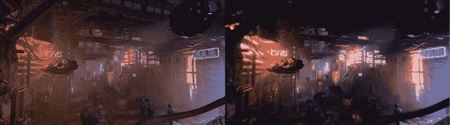

图 13.1：没有图像效果的场景（左）和添加了效果的相同场景（右）

在本节中，我们将讨论以下 URP 后处理概念：

+   设置配置文件

+   使用基本效果

通过掌握这些 URP 后处理概念，你将能够将你的场景从普通转变为非凡。让我们开始准备我们的场景以应用效果，为此我们需要设置一个配置文件。

## 设置配置文件

要开始应用效果，我们需要创建一个**配置文件**，这是一个包含我们想要应用的所有效果和设置的资产。这是一个独立的资产，因为我们可以在不同的场景和场景的不同部分共享相同的后处理配置文件，就像我们处理材质一样。当我们提到场景的部分时，我们指的是体积，即区域、区域或游戏中的区域，这些区域应用了某些效果。我们可以定义一个全局区域，无论玩家的位置如何都应用效果，或者我们可以应用不同的效果——例如，当我们户外或室内时。

在这个例子中，我们将使用一个全局体积，我们将使用它来应用一个配置文件和我们的第一个效果，方法如下：

1.  创建一个新的空 GameObject（**GameObject | 创建空**）命名为`PP Volume`（后处理体积）。

1.  向其添加**体积**组件，并确保**模式**设置为**全局**。

1.  点击**配置文件**设置右侧的**新**按钮，这将生成一个与点击按钮时选择的 GameObject 同名的新的`Profile`资产（**PP 体积** **配置文件**）。将此资产移动到其自己的文件夹中，这有助于资产组织。最终的设置如下面的图所示：

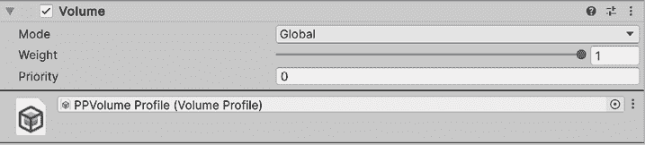

图 13.2：体积组件

1.  为了测试体积是否工作，让我们添加一个效果。为此，点击**添加覆盖**按钮并选择**后期处理 | 色差**选项。

1.  在**色差**效果的**强度**复选框中勾选，并将强度设置为`0.25`，如下面的图所示：

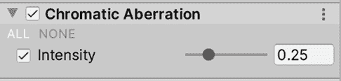

图 13.3：色差效果

1.  现在，观察色差效果如何微妙地调整图像的角落，为场景添加动态边缘。请记住在**场景**面板中查看这一点；我们将在下一步将效果应用到**游戏**视图中。这如下面的图所示：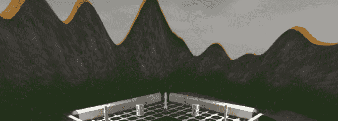

    图 13.4：场景中应用了色差效果

    如果你没有看到效果，请确保切换效果按钮处于开启状态，如下面的图所示。

    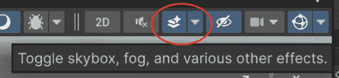

    图 13.5：场景视图效果切换

1.  现在，如果你点击**播放**并从主相机的视角看游戏，你会看到效果没有被应用，这是因为我们需要在我们的主相机的**渲染**部分的**后期处理**复选框中勾选，如下面的图所示：

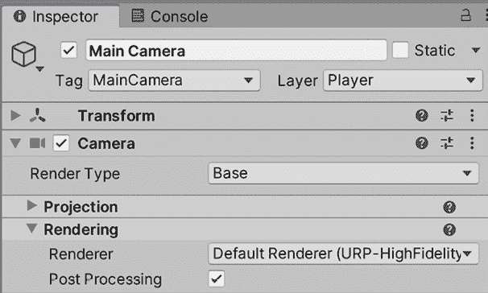

图 13.6：启用后期处理

在我们的全球体积设置完成后，我们刚刚解锁了在整个场景中一致应用效果的能力，无论我们的玩家走到哪里。

现在我们已经为场景准备好了后期处理，我们可以开始尝试不同的效果。让我们在下一节从最简单的效果开始。

## 使用基本效果

现在我们已经在场景中设置了后期处理，我们只需要开始添加效果并设置它们，直到我们得到期望的外观和感觉。为了做到这一点，让我们探索系统包含的几个简单效果。

让我们从**色差**开始，这是我们刚刚使用的，就像大多数图像效果一样，它试图复制一个特定的现实生活效果。所有游戏引擎渲染系统都使用一个简单的数学近似来描述人类视觉的真正工作方式，因此，我们没有一些在人类眼睛或相机镜头中发生的效果。真实的相机镜头通过弯曲光线来指向相机传感器，但这种弯曲在某些镜头中并不完美（有时是故意为之），因此，你可以看到扭曲，如下面的截图所示：

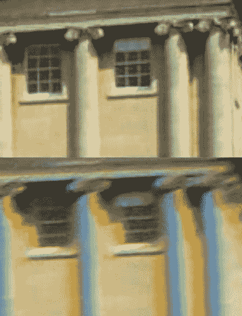

图 13.7：无色差图像（顶部）和有色差图像（底部）

这个效果将是我们添加的几个效果之一，以在我们的游戏中营造出电影感，模拟现实生活中的相机使用。当然，这个效果并不是在所有类型的游戏中都看起来很好；也许简单的卡通风格不会从这个效果中受益，但你永远不知道：艺术是主观的，所以这是一个试错的问题。

此外，我们在前面的例子中稍微夸张了强度，以便使效果更明显，但我建议在这种情况下使用 `0.25` 的强度。通常建议对效果的强度要温和；虽然强烈的视觉效果很有吸引力，但因为你将添加很多效果，所以过一段时间后，图像会因为过多的扭曲而变得膨胀。所以，尝试添加几个微妙的效果而不是几个强烈的效果。但，再次强调，这取决于你寻找的目标风格；这里没有绝对真理（但常识仍然适用）。

最后，在讨论其他效果之前，如果你习惯于使用其他类型的后期处理效果框架，你会注意到这个版本的**色差**设置较少，这是因为 URP 版本追求性能，所以它会尽可能简单。

我们接下来要讨论的效果是**晕影**。这是另一种相机镜头不完美的情况，图像强度在镜头边缘丢失。这不仅可以用来自动模拟旧相机，还可以将用户的注意力引向相机的中心——例如，在电影场景中。

此外，如果你正在开发**虚拟现实**（**VR**）应用程序，这可以用来通过减少玩家的周边视野来减少运动病。在下面的屏幕截图中，你可以看到一个旧相机的晕影示例：

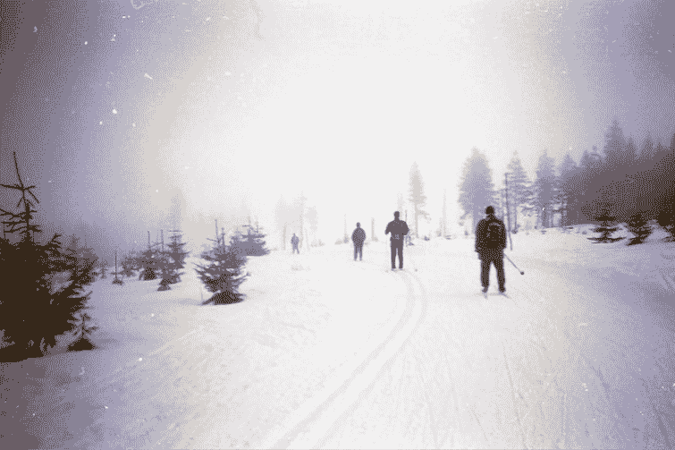

图 13.8：使用旧相机拍摄的照片，边缘有晕影

为了尝试一下，让我们通过以下步骤在我们的场景中应用一些晕影：

1.  选择 `PP Volume` 实体对象。

1.  通过点击 **添加覆盖** 按钮添加 **后期处理 | 晕影** 效果。

1.  打开 **强度** 复选框并将其设置为 `0.3`，以增强效果。

1.  打开 **平滑度** 复选框并将其设置为 `0.5`；这将增加效果的扩散。你可以在下面的图中看到结果：

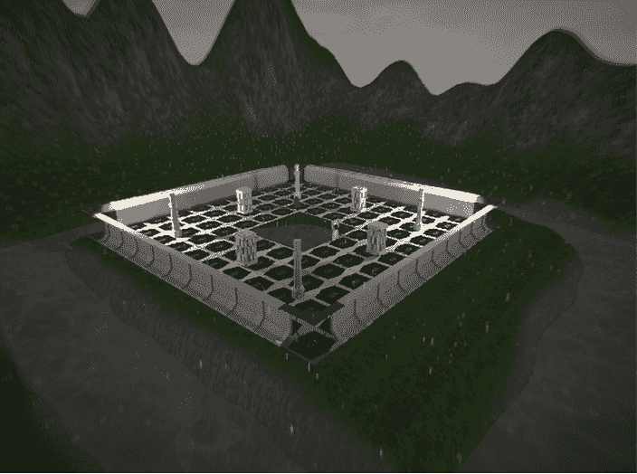

图 13.9：晕影效果

如果你想，你可以通过打开 **颜色** 复选框并设置另一个值来更改颜色；在我们的例子中，黑色可以很好地加强雨天环境。在这里，我邀请你检查其他属性，如 **中心** 和 **圆角**。你只需调整数值就能创造出很好的效果。

我们将要看到的另一个效果是 **运动模糊**，同样，它模拟了相机的工作方式。真实的相机有一个曝光时间：它需要捕获图像中光子的时间。当一个物体移动得足够快时，在短暂的曝光时间内，同一个物体会放置在不同的位置，因此它会显得模糊。在下面的截图中，你可以看到效果已经应用于我们的场景。

在这个图像的情况下，我们快速上下移动相机，结果如下：

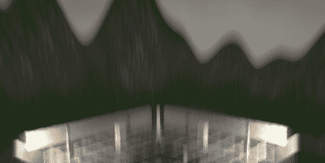

图 13.10：将运动模糊应用于我们的场景

需要考虑的一点是，这种模糊效果只会应用于相机移动，而不会应用于物体的移动（静止相机，移动物体），因为目前这个 URP 还不支持运动矢量。

为了使用这个效果，请按照以下步骤操作：

1.  使用 **添加覆盖** 按钮添加 **后处理 | 运动模糊** 覆盖。

1.  打开 **强度** 复选框并将其设置为 `0.25`。

1.  在查看 **游戏** 视图（而不是 **场景** 视图）的同时旋转相机。你可以点击并拖动相机的 **变换** 的 **X** 属性（不是值——**X** 标签），如图下截图所示：

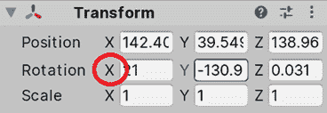

图 13.11：改变旋转

如你所见，这种效果在 **场景** 视图中也看不到，以及其他效果，所以在得出效果不起作用的结论之前请考虑这一点。Unity 这样做是因为在场景中工作时有这种效果会很烦人。

最后，我们将简要讨论两个简单效果，**胶片颗粒**和**白平衡**：

1.  第一步相当简单：添加它，将强度设置为 `1`，你将得到老电影中著名的颗粒效果。你可以通过设置不同的尺寸来调整 **类型**，使其更加微妙或强烈。

1.  第二个，**白平衡**允许你改变色温，根据你的配置使颜色变得更暖或更冷。在我们的案例中，我们正在处理一个寒冷、昏暗的场景，因此你可以添加它并将温度设置为 `-20`，以略微调整外观并改善这种场景的外观和感觉。

当我学习如何制作自己的后处理效果时，我记得曾经尝试过一种梦幻般的过渡扭曲效果。为此，我使用了正弦数学函数来计算基于像素的垂直位置应用的水平扭曲量。这样做之后，我发现我的帧率大幅下降，那一刻我意识到后处理可能会很昂贵。公平地说，那是一台旧电脑，但仍然，这个观点是成立的。注意添加的后处理效果的数目，并了解每个效果，以了解如何正确配置它。你可以使用像 PIX 这样的工具来分析 GPU 的成本，它分析应用程序的 GPU 性能：[`devblogs.microsoft.com/pix/download/`](https://devblogs.microsoft.com/pix/download/)

现在我们已经看到了一些简单效果，让我们来看看受一些高级渲染功能影响的剩余效果。

# 使用高级效果

现在我们正在通过一些高级效果提升我们的水平。它们比我们之前看到的要高一个档次，也稍微复杂一些，但不用担心——我们会引导您了解它们。在本节中，我们将看到以下高级效果概念：

+   高动态范围（HDR）和深度图

+   应用高级效果

让我们先讨论一下这些效果正常工作所需的一些要求。

## 高动态范围（HDR）和深度图

记得我们上一章提到的深度图吗？一些效果不仅需要渲染的图像，还需要像这样的额外数据才能真正发挥作用。有些效果不仅与渲染图像一起工作，还需要额外的数据。我们首先讨论深度图，这是一个我们在前几章讨论过的概念。

深度图是从摄像机的视角渲染的图像，但它不是生成场景的最终图像，而是渲染场景对象的深度，以灰色阴影的形式呈现对象。在深度图中，规则很简单：阴影越深，像素离摄像机越远，越浅则越近。

在下面的屏幕截图中，您可以看到深度图的一个示例：

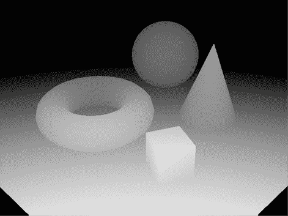

图 13.12：注意灰色阴影的变化如何描绘出与摄像机的距离

我们将看到一些效果，例如**景深**，它将根据摄像机的距离模糊图像的某些部分，但可以在自定义效果（不在基础 URP 包中）的多个用途上使用。

在这里要讨论的另一个概念将改变颜色的处理方式，从而影响一些效果的工作方式，那就是**高动态范围**（**HDR**）。在旧硬件中，颜色通道（红色、绿色和蓝色）被编码在 0 到 1 的范围内，0 代表没有强度，1 代表全强度（每个通道），因此所有光照和颜色计算都在这个范围内进行。这看起来似乎没问题，但并不反映光的实际工作方式。您可以在被阳光照亮的纸张上看到全白（所有通道都设置为 1），您可以直接看灯泡看到全白，但即使光和纸张颜色相同，后者首先会在一段时间后刺激眼睛，其次，由于过多的光线会有一些溢光。这里的问题是最大值（1）不足以表示最强烈的颜色，所以如果您有一个高强度的光源和另一个强度更高的光源，两者都会生成相同的颜色（每个通道都是 1），因为计算不能超过 1。为了克服这些限制并更真实地捕捉光线，创建了**HDR 渲染**。

HDR 是一种让颜色超出 0 到 1 范围的方法，因此基于颜色强度工作的光照和效果在此模式下具有更好的准确性。Unity 将在 HDR 模式下进行计算，但最终图像仍然会使用之前的光栅空间（0 到 1，或**低动态范围（LDR）**）进行工作，所以不要将 Unity 的 HDR 渲染与显示器的 HDR 混淆。

关于 HDR 的更多信息，请查看此链接：[`docs.unity3d.com/Manual/HDR.html`](https://docs.unity3d.com/Manual/HDR.html)

将 HDR 计算转换回 LDR 时，Unity（以及电视）使用了一个称为**色调映射**的概念。您可以在以下屏幕截图中看到一个 LDR 渲染的场景示例以及色调映射在 HDR 场景中的应用：

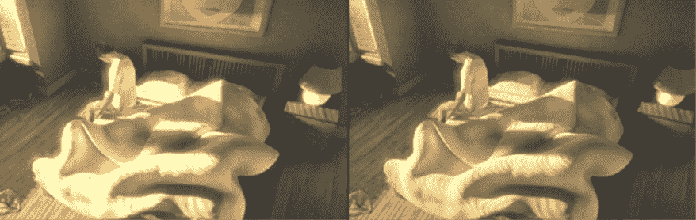

图 13.13：LDR 渲染的场景（左）和经过色调映射校正过度的 HDR 场景（右）

色调映射是一种将超出 0-1 光强度范围的颜色转换回此范围以在 LDR 屏幕上渲染的方法。它基本上使用曲线来确定每个颜色通道应该如何映射回。

想象一下：你正从昏暗的房间走出，进入刺眼的午后阳光。那一刻的耀眼效果和逐渐调整就是 HDR 在起作用。这就像从黑暗的房间走到明亮的阳光下；一开始，一切都很亮，但渐渐地，你的眼睛适应了——这就是色调映射的作用。这里的想法是，无论你在室内还是室外，计算都是一样的；室内的白墙将有接近 1 的强度颜色，而室外的同一堵白墙将有更高的值（由于阳光）。区别在于，当你在室外时，色调映射会将高于 1 的颜色调整回 1，如果整个场景较暗，它可能会根据你的设置增加墙面的光照。这个功能被称为**自动曝光**。

即使 HDR 默认启用，我们也可以通过以下步骤来验证它：

1.  转到**编辑 | 项目设置**。

1.  在左侧面板中单击**图形**部分。

1.  单击**可脚本渲染管线设置**属性下的引用资产。

1.  在**项目**面板中单击突出显示的资产。在单击**图形**设置中的属性之前，请确保此面板是可见的。或者，您可以在**图形**设置中双击资产引用以选择它。

1.  在**质量**部分下，确保已勾选**HDR**，如图所示：

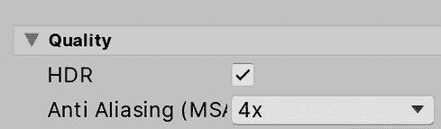

图 13.14：启用 HDR

1.  确保在**主相机**游戏对象的**相机**组件的**HDR 渲染**属性设置为**使用渲染管线设置**，以确保上一步骤中的更改得到尊重。

当然，HDR 可切换的事实意味着存在一些你不想使用 HDR 的场景。正如你所猜想的，并非所有硬件都支持 HDR，使用它会导致性能开销，所以请考虑这一点。幸运的是，大多数效果都支持 HDR 和 LDR 色彩范围，所以如果你启用了 HDR 但用户设备不支持，你不会收到任何错误，只是效果根据效果而有所不同，例如图像更亮或更暗，或者夸张的效果，就像我们在下一节*应用高级效果*中将要看到的那样。

现在我们确信已经启用了 HDR，让我们探索一些使用 HDR 和深度映射的高级效果。

## 应用高级效果

让我们看看使用之前描述的技术的一些效果，从常用的**Bloom**开始。此效果模拟了在相机镜头或甚至人眼周围一个强光照射物体上的溢光。在*图 13.15*中，你可以看到我们场景的默认版本和夸张的 Bloom 版本之间的区别。

你可以观察到效果只应用于场景中最亮的部分。看看这两个效果：

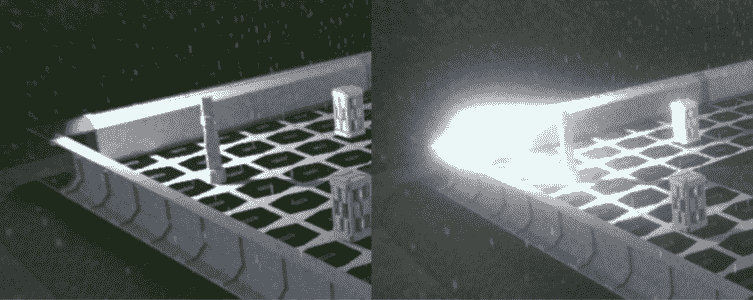

图 13.15：默认场景（左）和具有高亮度 Bloom 的相同场景（右）

这个效果实际上非常常见且简单，但我认为它是高级的，因为结果会受到 HDR 的极大影响。此效果依赖于计算每个像素颜色的强度来检测可以应用该效果的区域。在 LDR 中，我们可以有一个不是过亮的白色物体，但由于此色彩范围的限制，Bloom 可能会在其上产生溢光。在 HDR 中，由于其增加的色彩范围，我们可以检测到物体是否为白色，或者物体可能是浅蓝色但只是过亮，从而产生它是白色的错觉（例如靠近高亮度灯的物体）。在*图 13.16*中，你可以看到带有 HDR 和无 HDR 的场景之间的区别。你会注意到 LDR 版本将在不一定过亮的区域产生溢光。差异可能非常微妙，但请注意细节以注意差异。并且记住，我在这里夸张了效果。看看这两个场景：

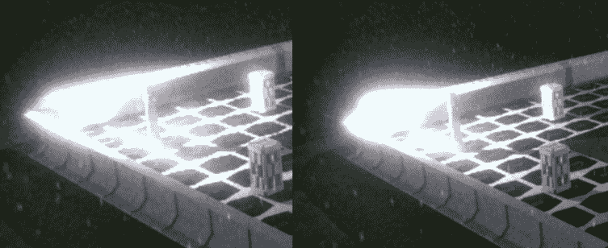

图 13.16：LDR 场景中的 Bloom（左）和 HDR 场景中的 Bloom（右）。注意，Bloom 设置被更改以尽可能接近它们

目前，让我们继续使用场景的 HDR 版本。为了启用 Bloom，请执行以下操作：

1.  按照惯例，将**Bloom**覆盖添加到配置文件中。

1.  通过勾选复选框启用**强度**选项，并将值设置为`0.2`。这控制了将应用多少溢光。

1.  启用**阈值**并将其设置为`0.7`。这个值表示颜色需要达到的最小强度，才能被认为是溢光。在我们的案例中，我们的场景有些昏暗，因此我们需要在**光晕**效果设置中降低这个值，以便包含更多的像素。像往常一样，这些值需要根据你的具体场景进行调整。

你会注意到差异非常微妙，但再次提醒，你会拥有几个效果，所以所有这些细微的差异都会累积起来。你可以在以下屏幕截图中看到这两种效果：

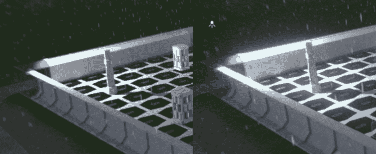

图 13.17：光晕效果

像往常一样，建议你调整其他值。我推荐你测试的一些有趣的设置是**污渍纹理**和**污渍强度**值，这将模拟溢光区域的脏镜头。

在我们对深度图的理解基础上，让我们探索另一个流行的效果，**景深**。这个效果依赖于我们之前讨论过的深度图。它对肉眼来说并不明显，但当你聚焦于你视野中的某个对象时，周围的物体因为不在焦点上而变得模糊。我们可以利用这一点来在游戏的关键时刻吸引玩家的注意力。想象这个效果就像相机的自动对焦一样——它采样深度图来决定什么应该是清晰的，什么应该是模糊的，就像在摄影中对物体进行对焦一样。

为了使用它，请按照以下步骤操作：

1.  将摄像机靠近一根柱子，尝试聚焦于一个特定对象，如下面的截图所示：

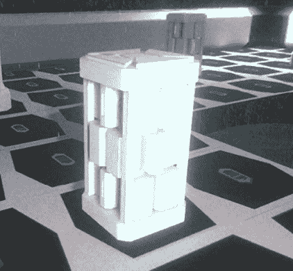

图 13.18：摄像机定位

1.  添加**景深**覆盖。

1.  启用并设置**模式**设置为**高斯**：在性能方面最经济的选项。

1.  在我的案例中，我将**开始**设置为`10`，将**结束**设置为`20`，这将使效果在目标物体后方一定距离开始。**结束**设置将控制模糊强度的增加，在`20`米处达到最大。请记住根据你的情况调整这些值。

1.  如果你想稍微夸张一下效果，将**最大半径**设置为`1.5`。结果如下面的截图所示：

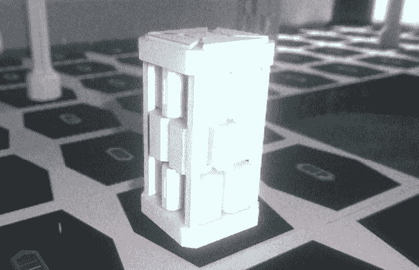

图 13.19：夸张效果

在这里需要考虑的是，我们的游戏将采用俯视视角，并且与第一人称摄像机不同，你可以看到远处的物体，在这里，我们将有足够近的物体，以至于不会注意到效果，因此我们可以将此效果仅限于我们场景中的过场动画。

现在，大多数剩余的效果都是改变场景实际颜色的不同方式。想法是，实际颜色有时并不能给你你寻求的确切外观和感觉。你可能需要将暗区调得更暗以增强恐怖氛围的感觉，或者你可能想相反：增加暗区以表示一个开阔的场景。也可能你想要将高光稍微着色以获得霓虹效果，如果你正在创建一个未来派游戏，或者你可能想要暂时使用棕褐色效果来做一个闪回。我们有很多种方法来做这件事，在这种情况下，我将使用一个简单但强大的效果，称为**阴影 中间调 高光**。

此效果将对阴影、中间调和高光应用不同的颜色校正，这意味着我们可以分别修改暗部、亮部和中等区域。让我们通过以下步骤尝试一下：

1.  添加**阴影 中间调 高光**覆盖。

1.  让我们开始进行一些测试。检查三个**阴影**、**中间调**和**高光**复选框。

1.  将**阴影**和**中间调**滑块全部移到最左边，将**高光**滑块移到最右边。这将减少阴影和中间调的强度，并增加高光的强度。我们这样做是为了让你可以看到高光将根据强度改变的区域。你可以用其他滑块做同样的操作来检查其他两个区域。你可以在下面的屏幕截图中看到结果：

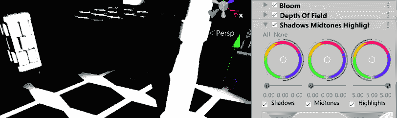

图 13.20：隔离高光

1.  此外，测试将彩色圆圈中心的白色圆圈移动以对这些区域应用一点着色。通过将滑块稍微向左移动来减少高光的强度，使着色更明显。你可以在下面的屏幕截图中看到结果：

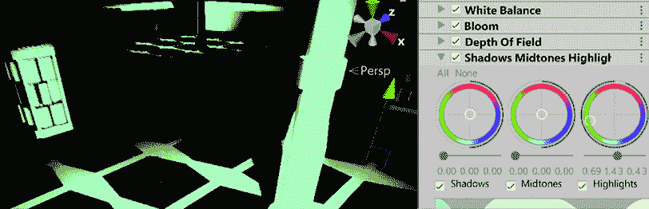

图 13.21：着色高光

1.  通过这样做，你可以探索这些控件是如何工作的，但当然，这些极端值对于某些边缘情况是有用的。在我们的场景中，以下屏幕截图中的设置对我来说效果最好。和往常一样，使用更微妙的值更好，这样不会过度扭曲原始结果，如下所示：

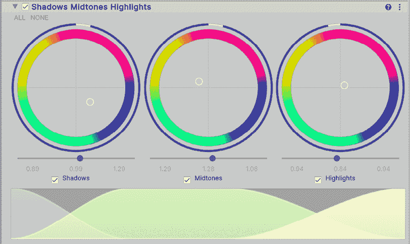

图 13.22：细微变化

你可以在下面的屏幕截图中看到前后效果：

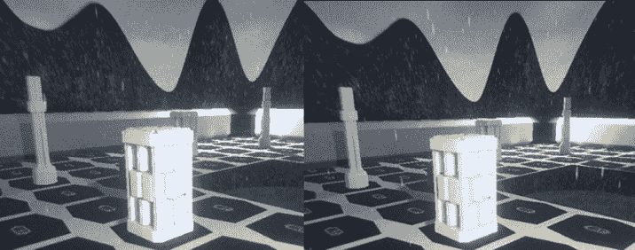

图 13.23：前后效果

如果你寻找的比 HDR 更简单的效果，**分割色调**提供了一种更简单但有效的方法来玩阴影和高光，或者**颜色曲线**，它让你可以更高级地控制场景中每个颜色通道的映射，但想法是相同的：改变最终场景的实际颜色，以给你的场景应用特定的颜色氛围。如果你记得电影系列《黑客帝国》，当角色在矩阵中时，一切都有细微的绿色着色，而在外面时，着色是蓝色。

记住，使用 HDR 和不使用 HDR 对这些效果的结果很重要，因此最好是尽早而不是稍后决定是否使用 HDR，排除某些目标平台（这可能对你的目标受众并不重要），或者不使用 HDR（使用 LDR）并减少对场景光照级别的控制。

此外，考虑到你可能需要调整一些对象的设置，例如光照强度和材质属性，因为有时我们会使用后期处理来修复由设置错误的对象引起的图形错误，这是不可接受的。例如，增加场景中的`环境光照`将极大地改变效果输出，如果我们发现场景太暗，我们可以利用这一点来提高整体亮度，而不是使用效果。

我们现在已经介绍了一系列图像效果。记住，理念不是使用每一个，而是使用你认为有助于你场景的效果；它们在性能方面不是免费的（尽管不是那么资源密集），所以要明智地使用。此外，你可以检查已经创建的配置文件，并将它们应用到你的游戏中，看看微小的变化可以带来巨大的差异。

# 摘要

在本章中，我们讨论了在场景中应用的基本和高级全屏效果，使场景在相机镜头效果方面看起来更真实，在色彩扭曲方面更时尚。我们还讨论了 HDR 和深度图的内部结构以及它们在使用这些效果时的重要性，这些效果可以以最小的努力立即提高你游戏的图形质量。

现在我们已经涵盖了 Unity 系统中常见的图形效果，接下来让我们看看如何在下一章中通过使用声音来提高场景的沉浸感。

# 在 Discord 上了解更多

与其他用户、Unity 游戏开发专家以及作者本人一起阅读这本书。提问，为其他读者提供解决方案，通过“问我任何问题”的环节与作者聊天，等等。扫描二维码或访问链接加入社区：

[`packt.link/unitydev`](https://packt.link/unitydev)

