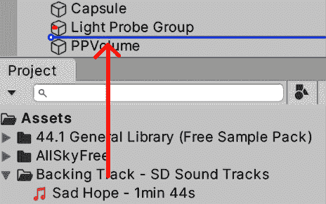
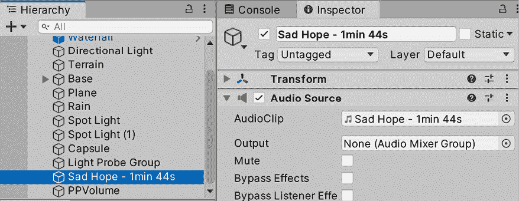

# 和谐的声音景观：集成音频和音乐

我们现在已经达到了足够的图形质量，但我们缺少游戏美学的关键部分：声音。声音通常被推迟到游戏开发的最后一步，它是那些即使存在，你也不会注意到其存在，但如果没有它，你会觉得缺少了什么的东西之一。它可以帮助你加强你在游戏中想要营造的氛围，并且必须与图形设置相匹配。为此，我们将使用 Unity 的能力来导入音频资产，在 2D 和 3D 定位中播放它们，并使用其混音器进行音频混音。

在本章中，我们将探讨以下声音概念：

+   导入音频

+   集成和混音音频

我们将在游戏中应用这些概念，导入音频以在不同的场景中播放——例如当玩家射击时——以及音乐。在后面的编程章节中，我们将播放声音，但现在，让我们专注于如何将它们导入到我们的项目中。

# 导入音频

就像图形资源一样，正确设置音频资源的导入设置非常重要，因为如果设置不当，导入可能会消耗大量资源。

在本节中，我们将探讨以下音频导入概念：

+   音频类型

+   配置导入设置

让我们先讨论我们可以使用的不同类型的音频。

## 音频类型

在视频游戏中存在不同类型的音频，以下是这些类型：

+   **音乐**：音乐用于根据情况增强玩家的体验。

+   **音效（SFX）**：作为对玩家或 NPC 动作的反应而产生的声音，例如点击按钮、行走、开门、射击枪支等等。

+   **环境音效**：如果一个游戏只对事件做出声音反应，会显得很空洞。如果你正在重建城市中间的公寓，即使玩家只是在房间中间无所事事，也应该听到很多声音，其中大部分声音的来源将位于房间外，例如飞机在头顶上飞行，两个街区外的建筑工地，街道上的汽车等等。创建玩家看不到的对象是一种资源浪费。相反，我们可以在场景的各个地方放置单个声音来重现所需的氛围，但这会消耗大量资源，需要大量的 CPU 和 RAM 才能达到令人信服的效果。考虑到这些声音通常占据用户注意力的第二平面，我们可以将它们全部组合成一个循环轨道，并播放一个音频文件，这就是环境音效。如果你想创建一个咖啡馆场景，你只需去真正的咖啡馆，录制几分钟的音频，并将其用作环境音效。

对于几乎所有的游戏，我们至少需要一个音乐轨道、一个环境轨道和几个音效来开始音频制作。像往常一样，我们有不同的音频资产来源，但我们将使用资产商店。它有三个音频类别来搜索我们需要的资产：

图 14.1：资产商店中的音频类别

在我的情况下，我也使用了搜索栏来进一步筛选类别，搜索`weather`以找到雨声效果。有时，你可能找不到单独的精确音频；在这种情况下，你将需要深入到**包**和**库**中，所以在这里要有耐心。在我的情况下，我选择了你可以在*图 14.2*中看到的三个包，但只导入了其中的一些声音，因为所有这些声音在项目中的大小都会很大。对于环境音，我选择了这个包中的一个名为`Ambience_Rain_Moderate_01_LOOP`的雨声文件，但如果你下载了另一个包，我们寻找的雨声文件名称可能不同。然后，我选择了**音乐 – 悲伤的希望**作为音乐，对于音效，我选择了一个枪声效果包，用于我们未来玩家的英雄角色。当然，你可以选择其他包以更好地满足你游戏的需求：

图 14.2：我们游戏的包

现在我们已经拥有了必要的音频包，让我们来讨论如何导入它们。

## 配置导入设置

我们有几种可以调整的导入设置，但问题是我们需要考虑音频的使用情况来正确设置它们，所以让我们看看每种情况下的理想设置。为了查看导入设置，就像往常一样，你可以选择资产并在**检查器**面板中查看，如图下所示：

图 14.3：音频导入设置

让我们从最重要的一个开始讨论，即**Force To Mono**。有些音频可能包含立体声通道，这意味着我们在左耳和右耳分别播放不同的声音。这意味着一段音频实际上可以包含两个不同的音频轨道。立体声音在音乐中用于不同的效果和乐器空间化，所以我们希望在那些场景中拥有它，但还有其他场景中单声道音频更受欢迎。

考虑 3D 音效，例如枪声或某些行走步伐。在这些情况下，我们需要声音在源的方向上被听到——如果枪声发生在我左边，我需要听到它从左边传来。在这些情况下，我们可以通过在音频导入设置中勾选**强制转换为单声道**复选框，将立体声音频转换为单声道音频。这将使 Unity 将两个通道合并为一个，通常将音频大小减少到原来的一半（有时更多，有时更少，取决于各种因素）。

你可以在音频资产检查器的底部验证该设置和其他设置的影响，在那里你可以看到导入的音频大小：

图 14.4：顶部：未使用“强制转换为单声道”导入的音频。底部：使用“强制转换为单声道”的相同音频

接下来要讨论的下一个设置，并且是一个重要的设置，是**加载类型**。为了播放某些音频，Unity 需要从磁盘读取音频，解压缩它，然后播放。**加载类型**改变了这三个处理过程的方式。我们这里有以下三个选项：

+   **加载时解压缩**：最占用内存的选项。此模式会在场景加载时，将音频以未压缩的形式加载到内存中。这意味着音频将占用大量的 RAM 空间，因为我们已经加载了未压缩的版本。使用此模式的优势在于播放音频更简单，因为我们有原始音频数据在 RAM 中准备好播放。

+   **流式传输**：与“加载时解压缩”正好相反。此模式永远不会将音频加载到 RAM 中。相反，当音频播放时，Unity 会从磁盘读取音频资产的一部分，解压缩它，播放它，然后重复这个过程，为**流式传输**中播放的每一部分音频运行一次。这意味着此模式将非常占用 CPU 资源，但几乎不会消耗任何 RAM 字节。

+   **内存中压缩**：中间方案。此模式会在场景加载时从磁盘加载音频，但将其保持压缩状态存储在内存中。当 Unity 需要播放音频时，它只需从 RAM 中取出一部分，解压缩它，然后播放。记住，从 RAM 中读取音频资产的部分比从磁盘读取要快得多。

也许，如果你是一位经验丰富的开发者，你可以轻松地确定哪种模式更适合哪种类型的音频，但如果你是第一次接触视频游戏，这可能会听起来很困惑。所以，让我们讨论不同情况下的最佳模式：

+   **频繁的短音频**：这可能是一声枪响或脚步声，这些声音持续不到一秒，但可以多次发生并同时播放。在这种情况下，我们可以使用**加载时解压缩**。未压缩的短音频与压缩版本的大小差异不会很大。此外，由于这是性能最好的 CPU 选项，多个实例对性能的影响不会很大。

+   **不频繁的大音频**：这包括音乐、环境声音和对话。这类音频通常只播放一个实例，而且通常很大。这些情况更适合**流式**模式，因为在对这些音频进行压缩或解压缩时，可能会对低端设备（如移动设备）的 RAM 消耗产生巨大影响（在 PC 上，我们有时可以使用**内存中压缩**）。CPU 可以处理在流式模式下播放两个或三个音频实例，但尽量不要超过这个数量。

+   **频繁的中等音频**：这包括多人游戏中的预制语音聊天对话、角色表情、长爆炸声或任何超过 500 KB（这不是一个严格的规定——这个数字很大程度上取决于目标设备）的音频。在 RAM 中对这类音频进行解压缩可能会对性能产生明显影响，但由于这种音频使用频率较高，我们可以将其压缩存储在内存中。它们相对较小的尺寸意味着它们通常不会对我们游戏的整体大小产生巨大影响，我们也将避免浪费 CPU 资源从磁盘读取。

还有其他需要考虑的情况，但可以根据前面的例子进行推断。记住，前面的分析是在考虑标准游戏的要求的基础上进行的，但根据你的游戏和目标设备可能会有很大差异。也许你正在制作一个不会消耗太多 RAM 但 CPU 资源相当密集的游戏，在这种情况下，你可以将所有内容都设置为**加载时解压缩**。考虑你游戏的各个方面并相应地平衡资源是很重要的。

最后，还需要考虑压缩格式，这会改变 Unity 在发布游戏中对音频的编码方式。不同的压缩格式会以降低原始音频的保真度或增加解压缩时间为代价，提供不同的压缩比率，所有这些都会根据音频模式和长度有很大差异。我们有三种压缩格式：

+   **PCM**：未压缩的格式将提供最高的音频质量，没有噪声伪影，但会导致更大的资产文件大小。

+   **ADPCM**：以这种方式压缩音频可以减小文件大小，并产生快速、无压缩的过程，但可能会引入在特定类型音频中可察觉的噪声伪影。

+   **Vorbis**：一种高质量的压缩格式，几乎不会产生失真，但解压缩所需时间更长，因此播放 Vorbis 音频会比其他格式稍微复杂一些。它还提供了一个质量滑块，用于选择压缩的精确程度。

你应该使用哪一个呢？同样，这也取决于你音频的特征。短且平滑的音频可以使用**PCM**，而长且嘈杂的音频可以使用**ADPCM**；这种格式引入的失真会被音频本身所隐藏。也许对于压缩失真明显的长且平滑音频，使用 Vorbis 会有所帮助。有时候，这仅仅是一个试错的过程。

可能默认使用 Vorbis，当性能降低时，尝试切换到**ADPCM**。如果那样导致故障，就切换到**PCM**。当然，这里的问题是确保音频处理确实是性能问题的原因——也许将所有音频切换到**ADPCM**并检查是否有所改变是一个检测的好方法，但更好的方法是使用 Profiler，这是一种性能测量工具，我们将在本书的后面看到。

我们还有其他设置，比如**采样率设置**，同样，通过一点试错，你可以找到最佳的设置。

我已经设置了从资产商店下载的音频，如图 14.5 和 14.6 所示。第一个图显示了我是如何设置音乐和环境音频文件（大文件）的：

图 14.5：音乐和环境设置

音乐文件体积较大，应配置为立体声（**强制单声道**未勾选）并设置为使用**流式传输**作为加载类型，因为一次只会播放一个实例。对于压缩格式，选择**ADPCM**，因为在这种情况下使用 Vorbis 并没有显著减小文件大小。

第二个截图显示了我是如何设置音效文件（小文件）的：

图 14.6：音效设置

我们下载的声音将是 3D 的，所以应该勾选**强制单声道**。它们也将是短声音，所以**加载类型**中的**加载时解压缩**效果更好。最后，选择**Vorbis**作为**压缩格式**可以将**ADPCM**的大小减少一半以上，这就是我们选择它的原因。

曾经，我被一家需要第二天交付项目的团队雇佣，但他们经常遇到某些音频剪辑在 iPad 1 上无法播放的问题（是的，这发生在很久以前）。他们有很长的、很重的对话，配置为使用**加载类型**在**加载时解压缩**模式下。我只是切换到**流式传输**模式，因为那些对话是一次性播放的，解决了问题，并设法提前一天回家。在另一个场合，类似的修复将游戏的主音乐音频剪辑的加载时间从 12 秒减少到 5 秒，在慢速移动设备上。永远不要低估配置不当的音频的成本。

现在我们已经正确配置了音频片段，我们可以在场景中使用它们。

# 集成和混音音频

我们可以直接将我们的音频片段拖入场景中开始使用，但我们可以进一步挖掘，探索将它们配置到每个可能场景的最佳方式。

在本节中，我们将检查以下音频集成概念：

+   使用 2D 和 3D 音频源

+   使用音频混音器

让我们开始探索音频源，这些是负责音频播放的对象。

## 使用 2D 和 3D 音频源

**音频源**是可以附加到 GameObject 上的组件。它们负责根据**音频剪辑**（我们之前下载的音频资产）在我们的游戏中发出声音。

区分**音频剪辑**和**音频源**很重要；我们可以有一个单一的爆炸音频剪辑，但可以有多个音频源播放它，模拟多个爆炸。可以将音频源视为 CD 播放器，可以播放音频剪辑（在这个类比中是我们的 CD），只是我们可以在同一时间有多个 CD 播放器或音频源播放同一张 CD（例如，同时播放两个爆炸声音）。

创建**音频源**的最简单方法是从**音频剪辑**（一个音频资产）中选择并拖动它到**层次结构**窗口。尽量避免将音频拖动到现有对象中；相反，在对象之间拖动它，这样 Unity 将创建一个新的带有**音频源**的对象，而不是将其添加到现有对象中（有时，您可能希望现有对象具有**音频源**，但现在让我们保持简单）：

图 14.7：将音频剪辑拖动到对象之间的层次结构窗口

下面的屏幕截图显示了通过将音乐资产拖动到场景中生成的**音频源**。您可以看到**音频剪辑**字段有一个对拖动音频的引用：

图 14.8：配置为播放我们的音乐资产的音频源

如您所见，**音频源**有多个设置，以下列表中我们将回顾一些常见的设置：

+   **唤醒时播放**：确定音频是否在游戏开始时自动播放。我们可以取消选中该选项，并通过脚本播放音频，例如当玩家射击或跳跃时（更多内容请参阅*第三部分*，*提升书籍的视觉效果、效果和音频*）。

+   **循环**：这将使音频在播放结束后自动重复。请记住，始终在音乐和环境音频剪辑上检查此设置。由于这些曲目很长，我们可能在测试中永远无法到达它们的结尾，因此很容易忘记这一点。

+   **音量**：控制音频强度。

+   **音调**：控制音频速度。这对于模拟慢动作或发动机转速增加等效果很有用。

+   **空间混合**：控制我们的音频是 2D 还是 3D。在 2D 模式下，音频将在所有距离上以相同的音量播放，而 3D 将使音频音量随着从相机（或任何持有 AudioListener 组件的 GameObject）的距离增加而减小。

在我们的音乐曲目中，我已经按照以下截图所示进行配置。您可以将环境雨声拖动到场景中，并使用相同的设置，因为我们希望所有场景中都有相同的背景效果。然而，在复杂的场景中，您可以在场景的各个部分分散不同的 3D 环境声音，以根据当前环境改变声音：

图 14.9：音乐和环境设置。这将循环，设置为唤醒时播放，并且是 2D

现在，您可以将射击效果拖动并配置，如图*图 14.10*所示。如您所见，在这种情况下，音频不会循环，因为我们希望射击效果每次只播放一次子弹。请记住，对于我们的游戏，子弹将是一个 Prefab，每次我们按下射击键时都会生成，因此每个子弹都将有自己的**AudioSource**，当子弹被创建时将播放。

此外，子弹的**空间混合**设置为**3D**，这意味着效果将根据**AudioSource**相对于相机位置的不同而通过不同的扬声器传递：

图 14.10：音效设置。这将不会循环，并且是 3D 声音

在 3D 声音的情况下，需要考虑的是**音量衰减**设置，该设置位于**3D 声音设置**部分。此设置控制音量如何随着与相机的距离增加而衰减。默认情况下，您可以看到此设置设置为**对数衰减**，这是现实生活中声音的工作方式，但有时您可能不希望现实生活中的声音衰减，因为现实生活中即使声音来源非常远，声音通常也能听到。

一种选择是切换到**线性衰减**并使用**最大距离**设置配置确切的距离：

图 14.11：使用线性衰减的最大距离为 10 米的 3D 声音

考虑到我们刚刚讨论了 3D 声音，值得提一下**AudioListener**组件，这是一个默认在**MainCamera**中创建的组件，99%的情况下，这个组件会被放置在**MainCamera**中。它作为识别在游戏中哪个对象代表玩家耳朵的一种方式，通过它可以计算音频方向性。由于它代表用户的眼睛，所以将摄像头作为放置它的逻辑位置，如果玩家的眼睛和耳朵在不同的地方，将会很令人困惑。在**AudioListener**组件中没有可配置的属性，但重要的是要提到，为了让音频工作，我们需要一个，而且不能超过一个；我们只有一对耳朵：

图 14.12：MainCamera 中的 AudioListener 组件

现在我们能够配置单个音频片段，让我们看看如何使用**音频混音器**应用效果到音频实例的组。

## 使用音频混音器

我们将在整个游戏中播放多个音频实例：角色的脚步声、射击、篝火、爆炸、雨等等。根据上下文精确控制哪些声音应该更响或更轻，以及应用效果以增强某些情况，例如由于附近的爆炸而受到惊吓，这被称为音频混音——以统一和受控的方式将多个声音混合在一起的过程。

在 Unity 中，我们可以创建一个音频混音器，这是一个我们可以用来定义声音组的资产。对任何组的所有更改都会通过提高或降低音量，或许，或者通过应用效果来影响组内的所有声音。你可以让 SFX 和音乐组分别控制声音。例如，你可以在**暂停**菜单中降低 SFX 音量，但不降低音乐音量。此外，组以层次结构组织，其中组也可以包含其他组，因此对组的更改也会应用到其子组。实际上，你创建的每个组都将始终是主组的子组，即控制游戏中每个声音（使用该混音器）的组。

让我们创建一个包含 SFX 和音乐组的混音器：

1.  在**项目**窗口中，使用**+**按钮，选择**音频混音器**选项。根据需要命名资产；在我的情况下，我选择了`Main Mixer`。

1.  双击创建的资产以打开**音频混音器**窗口：

图 14.13：音频混音器窗口

1.  点击**Groups**标签右侧的**+**按钮，创建主节点的子组。命名为`SFX`：

图 14.14：创建组

1.  点击**主**组，然后再次点击**+**按钮以创建另一个名为`音乐`的主节点子组。记住在点击**+**按钮之前选择**主**组，因为如果选择了另一个组，新组将成为该组的子组。无论如何，您可以通过在**AudioMixer**窗口的**组**面板中拖动组来重新排列组子父关系：

图 14.15：主、SFX 和音乐组

1.  在**层次结构**窗口中，选择我们场景中的**音乐**GameObject，并在**检查器**窗口中查找**AudioSource**组件。

1.  点击**输出**属性右侧的圆圈以打开**AudioMixerGroup**选择器窗口并选择**音乐**组。这将使受影响的**AudioSource**受到指定**混音器**组设置的约束：

图 14.16：使 AudioSource 属于 Audio Mixer 组

1.  如果你现在玩游戏，你可以看到**音频混音器**窗口中的音量表开始移动，表明音乐正在通过**音乐**组。你也会看到**主**组音量表在移动，表明通过**音乐**组传递的声音也在通过**主**组（**音乐**组的父组）之前传递到你的电脑的声卡：

图 14.17：组音量级别

1.  对环境声和拍摄声音重复*步骤 5*和*步骤 6*，使它们属于**SFX**组。

现在我们已经将声音分成了组，我们可以开始调整组的设置。但在做之前，我们需要考虑到我们不会一直想要相同的设置，就像之前提到的暂停菜单案例中，SFX 音量应该更低。为了处理这些场景，我们可以创建快照，这些是我们的混音器的预设，可以在游戏运行期间通过脚本激活。我们将在本书的*第三部分*，*提升视觉效果、效果和音频*中处理脚本步骤，但我们可以为游戏设置创建一个正常快照，为暂停菜单设置创建一个暂停快照。

如果您检查**快照**列表，您将看到已经创建了一个快照——这可以是我们的正常快照。因此，让我们通过以下步骤创建一个暂停快照：

1.  点击“快照”标签右侧的**+**按钮，并将快照命名为“暂停”。记住停止游戏以编辑混音器或点击“**在播放模式中编辑**”选项，以允许 Unity 在播放时更改混音器。如果你选择后者，请记住，停止游戏时更改将保持不变，这与 GameObject 的更改不同。实际上，如果在**播放**模式期间更改其他资产，这些更改也将保持不变——只有 GameObject 的更改会被撤销。

图 14.18：快照创建

1.  选择**暂停**快照并降低**SFX**组的音量滑块：

图 14.19：降低暂停快照的音量

1.  播放游戏并听一下声音是否仍然处于正常音量。这是因为原始快照是默认的——您可以通过检查其右侧的星号来看到这一点。您可以通过右键单击任何快照并使用**设置为起始快照**选项将其设置为默认快照。

1.  点击**在播放模式中编辑**以在运行时启用**音频混音器**的修改。

1.  点击**暂停**快照以启用它并听一下**射击**和**环境**声音量是如何降低的。

如您所见，混音器的主要用途之一是控制组音量，尤其是在您看到某个组的音量强度超过 0 标记时，这表明该组声音太大。无论如何，混音器还有其他用途，例如应用效果。如果您玩过任何战争游戏，您会注意到每当附近发生爆炸时，您会暂时听到不同的声音，好像声音位于另一个房间。这可以通过一个名为**低通**的效果来实现，它阻止高频声音，这正是我们耳朵在这些场景中发生的情况：爆炸产生的高音量声音的压力会刺激我们的耳朵，使它们对高频的敏感性降低一段时间。

我们可以向任何通道添加效果，并根据当前快照进行配置，就像我们对音量所做的那样，方法如下：

1.  点击**主**组底部的**添加**按钮，并选择**低通简单**：

图 14.20：通道的效果列表

1.  选择正常快照（称为“快照”）以修改它。

1.  选择**主**组并查看**检查器**面板，在那里您将看到组及其效果的设置。

1.  将**低通简单**设置的**截止频率**属性设置为最高值（`22000`），这将禁用该效果。

1.  对**暂停**快照重复*步骤 3*和*步骤 4*；我们不希望在该快照中应用此效果。

1.  创建一个新的快照，命名为**炸弹昏迷**，并选择它进行编辑。

1.  将**Cutoff freq**设置为`1000`：

图 14.21：设置低通简单效果的截止频率

1.  玩游戏并切换快照以检查差异。

如您所见，**低通**使音频听起来像在源和听众之间有一堵墙。除了低通滤波器之外，您还可以应用其他几个过滤器，例如**回声**，以创建几乎梦幻般的效果，或者使用**发送**、**接收**和**降低**的组合来根据另一个组的强度降低一个组的音量（例如，当对话发生时，您可能希望降低 SFX 音量）。我邀请您尝试这些和其他效果，并通过阅读以下文档来检查结果以确定潜在用途：[`docs.unity3d.com/Manual/class-AudioEffectMixer.html`](https://docs.unity3d.com/Manual/class-AudioEffectMixer.html)。

现在我们已经集成了音频，让我们看看我们如何可以脚本化我们的音频。

## 脚本化音频反馈

与 VFX 一样，音频也需要对游戏中的事件做出反应，以提供更好的沉浸感。让我们开始添加声音到敌人死亡时产生的爆炸效果，这本身可能不需要脚本，但它是最初产生爆炸的脚本的产物：

1.  从互联网或资产商店下载爆炸音效。

1.  选择敌人死亡时产生的**爆炸**预制体，并向其添加一个**AudioSource**。

1.  将下载的爆炸音频剪辑设置为**Audio Source**的**AudioClip**属性。

1.  确保在**Audio Source**下**Play On Awake**被勾选，**Loop**未被勾选。这将使声音在爆炸开始时播放，并防止声音在完成后重复播放：

图 14.22：为我们的爆炸效果添加声音

如您所见，我们不需要使用任何脚本，因为我们已经在 Audio Source 上激活了**在唤醒时播放**。由于声音被添加到预制体中，它将在预制体实例化的那一刻自动播放。现在，让我们通过以下方式集成射击声音：

1.  下载射击声音，并通过 Audio Source 将其添加到玩家的武器枪口效果（而不是武器）中，这次不勾选**Play On Awake**复选框。

1.  在`PlayerShooting`脚本中，创建一个名为**shootSound**的`AudioSource`类型的字段。这样我们的脚本就可以访问组件，并可以控制何时播放声音以及何时不播放。

1.  在**层次结构**中选择**玩家**，将武器枪口效果 GameObject 拖到**检查器**中的**射击声音**属性，以将脚本与武器枪口效果的 `AudioSource` 变量连接起来。

1.  在检查我们是否可以射击的 `if` 语句中，添加 `shootSound.Play();` 行以在射击时执行声音：

图 14.23：射击时添加声音

视觉脚本附加节点看起来将是这样：

图 14.24：在视觉脚本中射击时添加声音

正如我们在枪口效果中所做的那样，我们添加了一个名为 `shootSound` 的 GameObject 变量来引用包含音频源的武器 GameObject，然后我们调用 `shootSound` 变量的 **Play** 方法。

我挑战你尝试在 C# 和视觉脚本版本的脚本中为敌方 AI 添加射击声音。以第十一章*引人入胜的视觉效果：利用粒子系统和 VFX 图形*中我们处理枪口效果的做法为指南，无论如何，你都可以查看本书的 Git 仓库（可在*前言*中找到链接）以获取解决方案。

另一种处理方法将与我们在爆炸处理中使用的方法相同；只需将射击声音添加到子弹上，但如果子弹与墙壁碰撞，声音很快就会切断。或者，如果我们未来想要自动武器的声音，它需要实现为一个循环播放的声音，当我们按下相关键时开始播放，当我们释放键时停止播放。这样，我们就可以防止在射击过多子弹时声音实例重叠过多。在选择编写反馈脚本的方法时，要考虑到这些类型的场景。

提升音频沉浸感的另一种方式是通过音频空间化。这是一个高级话题，但你可以在这里了解更多信息：[`docs.unity3d.com/Manual/AudioSpatializerSDK.html`](https://docs.unity3d.com/Manual/AudioSpatializerSDK.html)

这在 VR 和 AR 应用程序中特别有用，可以完全沉浸用户在虚拟世界中。

# 摘要

在本章中，我们讨论了如何导入和集成声音，考虑到它们对内存使用的影响，并考虑了如何应用效果以生成不同的场景。声音是实现所需游戏体验的重要组成部分，因此请花适当的时间来确保其正确性。

现在我们已经涵盖了游戏几乎所有重要的美学方面，让我们创建另一种形式的视觉沟通，即用户界面或 UI。我们将在下一章创建必要的 UI 来显示玩家的当前得分、子弹、生命值以及更多信息。

# 在 Discord 上了解更多

与其他用户、Unity 游戏开发专家以及作者本人一起阅读这本书。提出问题，为其他读者提供解决方案，通过“问我任何问题”的环节与作者聊天，以及更多。扫描二维码或访问链接加入社区：

[`packt.link/unitydev`](https://packt.link/unitydev)

