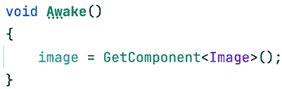

# 界面精彩：设计用户友好的 UI

屏幕上显示的以及通过电脑扬声器传输的一切都是一种交流形式。在前几章中，我们使用 3D 模型让用户知道他们身处山中一个基地，并通过适当的声音和音乐强化了这个想法。但对我们这款游戏来说，我们需要传达其他信息，例如玩家剩余的生命值和当前得分，有时，使用游戏内的图形来表达这些事情是困难的（有一些成功的案例能够做到这一点，例如*死亡空间*，但让我们保持简单）。

为了传输这些信息，我们需要在我们的场景上添加另一层图形，这通常被称为**用户界面**（**UI**）。它将包含不同的视觉元素，如文本框、条形图和按钮，以便用户根据诸如生命值低时逃往安全地点等因素做出明智的决定。

在本章中，我们将探讨以下主题：

+   理解 Canvas 和 RectTransform

+   Canvas 对象类型

+   创建响应式 UI

目前，这些术语可能对你来说毫无意义，但为了简化，可以将 Canvas 和 RectTransform 想象成你的 UI 戏剧中的相应舞台和演员。它们至关重要，我们将深入探讨它们的工作方式和协同作用。

到本章结束时，你将能够使用 Unity UI 系统创建能够通知用户游戏状态的界面，并允许他们通过按按钮采取行动。

我们即将揭示 Canvas 和 RectTransform 如何协同工作，使你的游戏界面生动起来。这有点像编排舞蹈——每个元素都有其位置和动作。

# 理解 Canvas 和 RectTransform

我们将只关注游戏内的 UI，使用 Unity GUI 系统（或 uGUI）向玩家传达不同的信息。在撰写本文时，一个新的 GUI 系统名为 UI Toolkit 已经发布。尽管我们将介绍 UI Toolkit，但请记住，uGUI 在不久的将来不会消失。掌握两者对于你在 UI 设计方法上的灵活性至关重要。我们将在下一章中探讨 UI Toolkit。

如果你打算使用 Unity UI，首先你需要理解其两个主要概念——**Canvas**和**RectTransform**。**Canvas**是包含并渲染我们 UI 的主对象，而**RectTransform**是负责在屏幕上定位和调整每个 UI 元素的特性。

在本节中，我们将：

+   使用 Canvas 创建 UI

+   使用 RectTransform 定位元素

让我们从使用 Canvas 组件来创建我们的 UI 开始。

## 使用 Canvas 创建 UI

让我们将理论付诸实践，通过创建基于 Canvas 的 UI。我们将从简单的事情开始，以推动进展。

在 Unity UI 中，你看到的每个图像、文本和 UI 元素都是一个具有一组适当组件的 GameObject，但为了使它们能够工作，它们必须是具有 Canvas 组件的主 GameObject 的子对象。这个组件负责触发 UI 生成并在每个子对象上绘制迭代。我们可以配置这个组件以指定该过程的确切工作方式并适应不同的可能需求。

首先，你可以简单地使用**GameObject** | **UI** | **Canvas**选项创建一个画布。完成之后，你会在场景中看到一个矩形，它代表用户的屏幕，因此你可以将元素放入其中并预览它们相对于用户监视器的位置。

你可能在这里有两个疑问。首先，“*为什么矩形在场景的中间？我想让它始终在屏幕上!*”不必担心，因为情况确实如此。当你编辑 UI 时，你会将其视为关卡的一部分，作为其中的一个对象，但当你玩游戏时，它将始终投影在屏幕上，覆盖在所有对象之上。此外，你可能想知道为什么矩形这么大，这是因为在使用默认的**Canvas** **Render Mode**，即称为**Screen Space - Overlay**时，屏幕映射中的一个像素对应场景中的一米。有其他模式，但讨论它们超出了本章的范围。

再次强调，不必担心这一点；当你从**Game**视图中查看游戏时，你会看到所有 UI 元素及其适当的大小和位置在用户的屏幕上。考虑到**Scene**视图将遵循**Game**视图的尺寸，建议在**Scene**视图中编辑之前先设置**Game**视图的大小。你可以通过点击**Game**面板顶部的**Free Aspect**下拉菜单并选择所需的分辨率或纵横比来完成此操作，**16:9 Aspect**是最常用的选项：

图 15.1：默认图像 UI 元素——一个白色框

在将元素添加到我们的 UI 之前，值得注意的是，当你创建 UI 时，与 Canvas 一起创建了一个名为**EventSystem**的第二个对象。这个对象对于渲染 UI 不是必需的，但如果你想让 UI 可交互，即包括点击按钮、在字段中输入文本或使用摇杆导航 UI 等操作，则是必需的。**EventSystem**组件负责采样用户输入，例如使用键盘、鼠标或摇杆，并将这些数据发送到 UI 以做出相应反应。我们可以更改与 UI 交互的确切按钮，但默认设置目前是可接受的，所以只需知道，如果你想与 UI 交互，你需要这个对象。如果由于某种原因你删除了这个对象，你可以在**GameObject** | **UI** | **Event System**中重新创建它。

你正在建立一个坚实的基础。保持这种势头，因为你现在学习的原则在你进步的过程中将至关重要。

## 使用 RectTransform 定位元素

在 Unity UI 中，你看到的每个图像、文本和 UI 元素都是一个 GameObject，根据其用途具有一组适当的组件，但你将看到它们大多数都有一个共同的组件——**RectTransform**。UI 的每一部分本质上都是一个填充文本或图像的矩形，并且具有不同的行为，因此理解**RectTransform**组件的工作原理以及如何编辑它非常重要。

为了实验这个组件，让我们按照以下步骤创建并编辑 UI 中一个简单的白色框元素的定位：

1.  转到**GameObject | UI | Image**。之后，你将看到在**Canvas**元素内创建了一个新的 GameObject。Unity 将负责将任何新的 UI 元素设置为 Canvas 的子元素；否则，该元素将不可见：

图 15.2：默认图像 UI 元素——一个白色框

1.  点击**场景**视图顶部栏中的**2D**按钮。这将仅更改**场景**视图的视角，使其更适合编辑 UI（以及 2D 游戏）：

图 15.3：2D 按钮位置

1.  双击**层次结构**窗口中的 Canvas，使 UI 完全适应**场景**视图。这将允许我们清楚地编辑 UI。您还可以使用鼠标滚轮导航 UI 进行缩放，并单击并拖动滚轮进行相机平移。

1.  启用**RectTransform**工具，这是 Unity 编辑器左上角第五个按钮（或按*T*键）。这将启用矩形操纵，允许您移动、旋转和缩放 2D 元素。虽然我们迄今为止使用的变换工具与 UI 一起工作，但它们并不理想。一个例子是，改变 UI 元素的大小并不等同于缩放元素；我们希望修改元素的宽度和高度，但保持其缩放以进行动画，防止 9 切片图像变形（关于这一点，本章后面将详细介绍）。

图 15.4：矩形操纵按钮

1.  使用矩形操纵，拖动对象进行移动，使用蓝色点更改其大小，或将鼠标定位在蓝色点附近，直到光标变成曲线箭头以旋转它。请注意，使用此操纵器调整对象大小并不等同于缩放对象（关于这一点，稍后将详细介绍）：

图 15.5：编辑 2D 元素的矩形操纵

1.  在**检查器**窗口中，注意在更改 UI 元素的大小后，**RectTransform**设置的**缩放**属性仍然是`1`，`1`，`1`，但您可以看到**宽度**和**高度**属性是如何变化的。**RectTransform**本质上是一个经典的变换，但增加了**宽度**和**高度**（以及其他我们稍后会探索的属性）。您可以在这里设置您想要的精确值，以像素为单位表示：

图 15.6：RectTransform 属性

现在我们已经了解了如何定位任何 UI 对象的基础知识，让我们探索您可以添加到 Canvas 的不同类型的元素。

# Canvas 对象类型

到目前为止，我们使用了最简单的 Canvas 对象类型——一个白色框，但还有许多其他对象类型我们可以使用，例如图像、按钮和文本。所有这些都使用**RectTransform**来定义它们的显示区域，但每个都有其自己的概念和配置需要理解。

在本节中，我们将探索以下 Canvas 对象概念：

+   集成 UI 的资产

+   创建 UI 控件

让我们首先探索如何将图像和字体集成到 Canvas 中使用，这样我们就可以使用**图像**和**文本**UI 对象类型将它们集成到我们的 UI 中。

## 集成 UI 的资产

在制作我们的 UI 使用漂亮的图形资产之前，我们需要将它们正确集成到 Unity 中，以便在 UI 中使用。在下面的截图中，您将找到我们为游戏提出的 UI 设计：

图 15.7：UI 设计

此外，我们还将添加一个**暂停**菜单，当用户按下*Esc*键时将被激活。它看起来如下截图所示：

图 15.8：暂停菜单设计

根据这些设计，我们可以确定我们需要以下资产：

+   英雄的化身图像

+   健康条图像

+   暂停菜单背景图像

+   暂停菜单按钮图像

+   文本的字体

和往常一样，我们可以在互联网上或资产商店中找到所需的资产。在我的情况下，我将使用两者的混合。让我们从最简单的一个开始——头像。按照以下步骤操作：

1.  从互联网上下载您想要的头像，例如一个角色的面部图像。

1.  将其添加到您的项目中，无论是通过将其拖动到**项目**窗口，还是通过使用**资产 | 导入新资产**选项。将其添加到`精灵`文件夹中。

1.  选择纹理，并在**检查器**窗口中，将**纹理类型**设置设置为**精灵（2D 和 UI）**。默认情况下，所有纹理都为 3D 使用做好了准备。此选项将我们的纹理准备用于 2D 环境，如 UI 和 2D 游戏。

对于条形、按钮和窗口背景，我将向您展示如何从资源商店中选择正确的资源。这是一个 UI 元素的宝库，我会指出一些宝石。在我的情况下，我发现以下截图中的包非常适合我的 UI。像往常一样，请记住，这个确切的包可能现在不可用。

如果是这样，请记得寻找另一个类似的包，或者从 GitHub 仓库中选择精灵：

图 15.9：选定的 UI 包

首先，该包包含大量配置相同的图像，作为精灵，但我们可以进一步修改导入设置以实现高级行为，这对于按钮是必需的。按钮资源具有固定的大小，但如果您需要一个更大的按钮怎么办？一个选项是使用具有不同大小的其他按钮资源，但这会导致按钮和其他资源（如不同大小的窗口背景）的大量重复，这会不必要地消耗 RAM。

另一个选项是使用**9 分割**方法，该方法包括将图像分割，使角落与其他部分分离。这允许 Unity 拉伸图像的中间部分以适应不同的大小，同时保持角落的原始大小，当与为 9 分割技术准备的图像结合使用时，可以用来创建几乎任何所需的大小。

在*图 15.10*中，您可以看到左下角有一个九个分割的形状，在相同图表的右下角，您可以看到形状被拉伸但保持了原始大小的角落。右上角显示了没有分割的拉伸形状。您可以看到非分割版本是如何变形的：

图 15.10：分割与非分割图像拉伸对比

在这种情况下，我们可以将九分割应用于按钮和面板背景图像，以便在游戏的各个部分使用它们。为了做到这一点，请按照以下步骤操作：

1.  使用**窗口 | 包管理器**选项打开包管理器。

1.  通过将窗口左上角**+**按钮右侧的下拉菜单设置为**Unity Registry**，验证包管理器是否显示了所有包。

1.  安装 2D 精灵包以启用精灵编辑工具（如果尚未安装）。

1.  在**项目**窗口中选择按钮精灵，然后在**检查器**窗口中点击**精灵编辑器**按钮：

图 15.11：检查器窗口中的精灵编辑器按钮

1.  在**精灵编辑器**窗口中，找到并拖动图像边缘的绿色点来移动切片标尺。尽量确保切片不在按钮边缘的中间。要注意的一点是，在我们的情况下，我们将使用三个切片而不是九个，因为我们的按钮不会垂直拉伸。如果你看不到点，尝试点击图像使它们出现。

1.  注意，在拖动绿色点之后，底右角的**边框**属性（**L**、**T**、**R**和**B**，分别是左、上、右和下）发生了变化。这些就是通过移动绿色点设置的精确值。你可以随意将它们改为更圆的数字，以便九个切片均匀工作。在我们的情况下，左右变成了圆整的**60**，上下变成了**50**。

1.  点击窗口右上角的**应用**按钮并关闭它：

图 15.12：精灵编辑器窗口中的九个切片

1.  对**背景**面板图像重复*步骤 4*到*6*。在我的情况下，你可以在*图 15.13*中看到这个背景并不是完全按照九个切片来准备的，因为图像的所有中间区域都可以缩小以节省内存。

当以较小的宽度显示此图像时，9 切片方法会拉伸中间部分，看起来相同，所以本质上，这是浪费的内存：

图 15.13：精灵编辑器窗口中的九个切片

通过移除中间部分，图像看起来几乎相同，但节省了大量的内存，如以下图像所示。

图 15.14：优化的 9 切片背景。中间部分将是一个 1 像素宽的像素条，将会扩展

现在我们已经准备好了精灵，我们可以找到一个字体来自定义 UI 的文本。在讨论如何导入字体之前，值得提一下，我们将使用**TextMesh Pro**，这是一个 Unity 包（已包含在项目中），它提供了一个比旧文本组件更好的文本渲染解决方案。如果你之前从未使用过该组件，你不必担心这个细节。

你必须获取`.ttf`或`.otf`格式的字体并将它们导入 Unity。互联网上有很多好的免费字体网站。我习惯于使用经典的 DaFont.com 网站，但还有很多其他你可以使用的网站。在我的情况下，我将使用`Militech`字体：

图 15.15：我在 DaFont.com 上选择的字体，用于项目

如果字体下载包含多个文件，你只需将它们全部拖入 Unity，然后使用你最喜欢的一个。同样，像往常一样，尽量将字体放在名为`Fonts`的文件夹中。现在，这些文件的格式与我们的文本渲染解决方案 TextMesh Pro 不兼容，因此我们必须使用**字体资产创建器**窗口进行转换，如下面的步骤所示：

1.  前往**窗口 | TextMesh Pro | 字体资产**创建器。

1.  如果你第一次在你的项目中使用 TextMesh Pro，会出现一个窗口。你必须点击**导入 TMP 基础组件**选项，并等待导入过程完成：

图 15.16：TextMesh Pro 首次运行初始化

1.  关闭**TMP 导入器**窗口。

1.  在**字体资产创建器**中，将你的字体从**项目**视图拖到**源字体文件**，或者通过点击右侧的**目标**按钮（中心带点的圆圈）来选择它。

1.  点击**生成字体图集**按钮，稍等片刻：

图 15.17：将字体资产转换为 TextMesh Pro

1.  点击**保存**按钮，并将转换后的字体保存到**资产 | TextMesh Pro | 字体**文件夹。在这里保存很重要，所以不要忘记选择正确的文件夹：

图 15.18：在正确的文件夹中保存转换后的字体（Mac）

你已经搭建好了基础。让我们添加更多元素，看看我们的 UI 如何变得生动。你在这里学到的技能在你进入后面的章节时将非常有价值。

## 创建 UI 控件

每个 UI 组件，图像和文本的混合，都需要仔细的配置。让我们深入了解这些元素如何组合在一起形成一个直观的界面。在我们的 UI 中已经有一个图像——我们之前创建的白色矩形。如果你选择它并查看**检查器**窗口，你会注意到它有一个**图像**组件，就像以下截图中的那样：

图 15.19：图像组件的检查器窗口

理解这些设置对于最佳的 UI 显示至关重要。我们将从英雄的头像开始，关注如何在我们的 UI 中最好地表示它：

1.  使用矩形操纵杆，将白色矩形移动到 UI 的左上角：

图 15.20：位于 UI 左上角的白色矩形

1.  在**检查器**窗口中，点击**源图像**属性右侧的圆圈，并选择下载的英雄头像精灵：

图 15.21：设置图像组件的精灵

1.  保持正确的宽高比确保图像在不同屏幕尺寸上看起来一致，避免任何视觉扭曲。一种方法是点击图像组件底部的**设置原生大小**按钮，使图像使用与原始精灵相同的大小。然而，这样做会使图像变得过大，因此您可以按*Shift*键修改**宽度**和**高度**值以减小图像大小。另一种选项是勾选**保持宽高比**复选框以确保图像适合矩形而不拉伸。在我的情况下，我将使用两者：

图 15.22：保持宽高比和设置原生大小的图像选项

创建直观的生命条对于玩家体验至关重要。让我们通过以下步骤创建生命条：

1.  使用**GameObject**|**UI**|**图像**选项创建另一个**图像**组件。

1.  将**源图像**属性设置为下载的生命条图像：

![图片 B21361_15_23_PE.png]

图 15.23：头像和生命条

1.  将**图像类型**属性设置为**填充**。

1.  将**填充方法**属性设置为**水平**。

1.  拖动**填充量**滑块以查看根据滑块值如何切割条。我们将在第*18*章中通过脚本更改该值，*性能巫术：使用分析工具优化您的游戏*：

![图片 B21361_15_24_PE.png]

图 15.24：填充量滑块，切割图像宽度至其大小的 73%

1.  在我的情况下，条图像还附带了一个条框架，这允许您创建另一个图像，设置精灵，并将其放置在生命条上方以框架它。这里的层次结构顺序会影响这些元素的视觉堆叠。这种定位对于实现所需的视觉效果至关重要。因此，在我的情况下，我需要确保框架 GameObject 在层次结构中位于健康条图像下方。此外，请注意，条框架图像未切片，因此在这种情况下不需要使用**切片****图像****类型**。您可以随意尝试切片它并查看结果：

![图片 B21361_15_25_PE.png]

图 15.25：将一个图像放在另一个图像上方以创建框架效果

1.  重复*步骤 1*到*6*以创建底部的基线条，或者只需复制并粘贴条和框架，并将其放置在屏幕底部：

![图片 B21361_15_26_PE.png]

图 15.26：玩家和玩家基地生命条

1.  在**项目**窗口中点击**+**按钮，并选择**精灵**|**正方形**选项。这将创建一个具有 4x4 分辨率的简单方形精灵。

1.  将精灵设置为玩家基础生命条的基础条，而不是下载的条精灵。这次，我们将使用纯白色图像作为条，因为在我的情况下，原始的是红色，将红色图像的颜色调整为绿色是不可能的。然而，白色图像可以被轻松着色。考虑到原始条的具体细节——例如，我原始条中的小阴影在这里将不会出现。

1.  选择基础生命条并将**颜色**属性设置为绿色：

图 15.27：一个带有方形精灵和绿色色调的条

1.  一个可选步骤是将条框图像转换为 9 切片图像，以便我们可以更改原始宽度以适应屏幕。

现在，通过以下步骤添加**得分**、**子弹**、**剩余波次**和**剩余敌人**标签的文本字段：

1.  使用**GameObject** | **UI** | **Text - TextMesh Pro**选项创建一个文本标签（避免只说**Text**的选项）。这将作为**得分**标签。

1.  将标签放置在屏幕的右上角。

1.  在**Inspector**窗口中，将**Text Input**属性的内容设置为`Score: 0`。

1.  将**字体大小**属性设置为`20`。

1.  通过单击**Font Asset**属性右侧的圆圈并选择所需的字体来应用转换后的字体。

1.  在**对齐**属性中，选择**水平右对齐**图标（第一行的第三个按钮）和**垂直居中对齐**图标（第二行的第二个按钮）：

图 15.28：文本标签的设置

1.  重复*步骤 1*到*6*以创建其他三个标签（或者只需复制粘贴得分三次）。对于**剩余波次**标签，可以使用左对齐选项以更好地匹配原始设计：

图 15.29：我们 UI 中的所有标签

1.  将所有标签的颜色设置为白色，因为我们的场景将主要是暗色调。

现在我们已经完成了原始 UI 设计，我们可以创建**暂停**菜单：

1.  为菜单的背景创建一个**Image**组件（**GameObject** | **UI** | **Image**）。

1.  使用我们之前制作的九个切片设置**Background**面板的精灵。

1.  如果尚未设置，将**Image Type**属性设置为**Sliced**。此模式将应用 9 切片缩放方法以防止角落拉伸。

1.  有可能无论如何图像都会拉伸角落，这是因为有时角落相对于您使用的**RectTransform**设置的**大小**属性相当大，所以 Unity 别无选择，只能这样做。在这种情况下，正确的解决方案是让一位艺术家为您创建适合您游戏的资产，但有时我们并没有这样的选择。这次，我们可以简单地增加精灵文件的**每单位像素**值，这将减小原始图像的缩放，同时保持其分辨率。在下面的两个截图中，您可以看到具有**每单位像素**值为`100`的背景图像，然后再次设置为`700`。

    请记住，只为 9 分割或平铺图像类型做这件事，或者如果您没有艺术家来调整它：

    

    图 15.30：顶部，一个大的 9 分割图像在一个小的 RectTransform 组件中，它足够小以至于可以缩小角落，底部，相同的图像，将**每单位像素**设置为 700

1.  创建一个**TextMesh Pro**文本字段，将其放置在您想要在图中显示**暂停**标签的位置，设置为显示**暂停**文本，并设置字体。请记住，您可以使用**颜色**属性更改文本颜色。

1.  将文本字段拖到背景图像上。**Canvas**中的父子关系系统工作方式相同——如果您移动父项，子项也会随之移动。想法是，如果我们禁用面板，它也会禁用按钮及其所有内容：

图 15.31：暂停标签

1.  通过转到**GameObject** | **UI** | **Button - TextMesh Pro**（避免使用只说**按钮**的那个）创建两个按钮。将它们放置在背景图像上您想要的位置。

1.  通过将它们拖入**层次结构**窗口，将它们设置为**暂停**背景图像的子项。

1.  选择按钮，并将它们**Image**组件的**源图像**属性设置为使用我们之前下载的按钮精灵。如果您遇到之前的问题，请记住我们*步骤 4*中的**每单位像素**修复。

1.  您会看到按钮本质上是一个带有子**TextMesh Pro**文本对象的图像。将每个按钮和每个文本的字体更改为`Resume`和`Quit`：

图 15.32：暂停菜单实现

1.  请记住，您可以通过取消勾选**检查器**窗口顶部对象名称右侧的复选框来隐藏面板：

图 15.33：禁用 GameObject

今天，我仍然记得我的第一次游戏测试，当时我把我的游戏交给了一些陌生人，希望用我出色的游戏让他们感到惊讶，结果却发现并非如此。在游戏中你会发现很多缺失的东西，其中之一就是用户体验（也称为 UX）。关键在于理解游戏流程的感觉并改进它。虽然用户体验不仅仅局限于用户界面，但我建议在为你的游戏设计用户界面之前研究这个概念，因为它将帮助用户更好地理解你的游戏以及用户界面试图传达的信息。

在本节中，我们讨论了如何通过**图像**、**文本**和**按钮**组件导入图像和字体，以创建丰富且信息丰富的 UI。完成这些后，让我们讨论如何使它们具有响应性。

# 创建响应式用户界面

现在，几乎不可能在单个分辨率下设计 UI，我们的目标受众的显示设备可能会有很大的差异。一台 PC 有多种不同类型的显示器，具有不同的分辨率（如 1080p 和 4K）和纵横比（如 16:9、16:10 和超宽），移动设备也是如此。我们需要准备我们的 UI 以适应最常见的显示，Unity UI 有完成这一任务的工具。

在本节中，我们将探讨以下用户界面响应性概念：

+   调整对象位置

+   调整对象大小

我们将探索如何使用**画布**和**RectTransform**组件的高级功能，如**锚点**和**缩放器**，来使 UI 元素适应不同的屏幕尺寸。

## 调整对象位置

为了确保我们的用户界面能够正确地适应不同的设备，让我们专注于使用锚点来调整对象位置。

目前，如果我们运行我们的游戏，我们会看到用户界面如何很好地适应我们的屏幕。然而，如果由于某种原因我们改变了**游戏**视图的大小，我们会看到对象开始从屏幕上消失。在下面的屏幕截图中，你可以看到不同大小的游戏窗口以及用户界面在一个窗口中看起来很棒，而在其他窗口中则不好：

图 15.34：相同的 UI 但在不同大小的屏幕上

问题在于我们使用编辑器中拥有的任何分辨率创建了 UI，但一旦我们稍微改变它，UI 就保持了之前分辨率的布局。此外，如果你仔细看，你会看到 UI 总是居中的，比如在第二张图片中，UI 在两侧被裁剪，或者在第三张图片中，屏幕边缘可以看到额外的空间。

这是因为 UI 中的每个元素都有自己的锚点，当你选择一个对象时，你可以看到一个小的十字，如下面的屏幕截图所示：

图 15.35：屏幕右上角属于屏幕左上角英雄头像的锚点十字

对象的*x*和*y*位置是以到该锚点的距离来测量的，锚点相对于屏幕有一个位置，其默认位置是屏幕中心。这意味着在一个*800 x 600*的屏幕上，锚点将被放置在*400 x 300*的位置，在一个*1920 x 1080*的屏幕上，锚点将位于*960 x 540*的位置。如果元素的*x*和*y*位置（在**RectTransform**中的那个）是**0**，则对象将始终与中心保持 0 的距离。在前三个示例的第二张截图中，英雄头像超出了屏幕范围，因为其与中心的距离大于屏幕的一半，而当前距离是基于之前更大的屏幕尺寸计算的。那么我们能做什么呢？移动锚点！

通过设置相对位置，我们可以将锚点放置在屏幕的不同部分，并使该部分成为我们的参考位置。在我们的英雄头像的情况下，我们可以将锚点放置在屏幕的左上角，以确保我们的头像将始终与该角落保持固定距离。

我们可以通过以下步骤实现：

1.  选择你的玩家头像。

1.  如果尚未展开，请在**检查器**中展开**RectTranform**组件，以便可以看到其属性。这将揭示**场景**视图中的锚点。

1.  使用鼠标将锚点十字形拖动到屏幕的左上角。如果由于某种原因，在拖动锚点时它断裂成几块，撤销更改（按*Ctrl* + *Z*，或在 Mac 上按*Command* + *Z*）并尝试通过点击中心来拖动它。我们稍后会断开锚点。检查头像图像的**RectTransform**组件，以验证**锚点**属性的**最小值**和**最大值**子属性与*图 15.36*中的值相同，这意味着对象已正确配置锚点以位于屏幕的左上角：

图 15.36：屏幕左上角带有锚点的图像

1.  将**生命条**对象的锚点和其框架放在相同的位置。我们希望条形始终与该角落保持相同的距离，以便在屏幕大小改变时它将随英雄头像移动。

1.  将**Boss Bar**对象的锚点放置在屏幕的底部中央，以便它始终居中。稍后我们将处理调整其大小的问题。

1.  将**剩余波**标签放在左下角，**剩余敌人**放在右下角：

图 15.37：生命条和标签的锚点

1.  将**得分**和**子弹**的锚点放在右上角：

图 15.38：得分和子弹标签的锚点

1.  选择任何元素，并使用鼠标拖动画布矩形的边缘来预览元素将如何适应其位置。请注意，你必须选择 Canvas 的直接子对象；按钮内的文本不会有这个选项：

图 15.39：预览 Canvas 调整大小

现在我们已经将 UI 元素调整到它们的位置，让我们考虑那些对象大小也必须适应的场景。

## 调整对象大小

处理不同宽高比时首先要考虑的是，我们的屏幕元素不仅可能从它们原始的设计位置（我们在上一节中固定了该位置）移动，还可能无法适应原始设计。在我们的 UI 中，我们遇到了健康条的情况，当我们在更宽的屏幕上预览时，条显然没有适应屏幕宽度。我们可以通过断开锚点来解决这个问题。

当我们断开锚点时，我们的对象的位置和大小是相对于不同锚点部分的距离来计算的。如果我们水平分割锚点，那么我们将有**左**和**右**属性，而不是**X**和**宽度**属性，它们代表左右锚点之间的距离。我们可以用以下方式使用它：

1.  选择健康条，并将锚点的左侧拖动到屏幕的左侧，右侧拖动到屏幕的右侧。

1.  对健康条框架也做同样的操作：

图 15.40：健康条中的分割锚点

1.  在**检查器**窗口中检查**矩形变换**设置的**左**和**右**属性，它们代表到相应锚点的当前距离。如果你想，你可以添加一个特定的值，特别是如果你的健康条显示在屏幕外：

图 15.41：分割锚点的左和右属性

有效地使用 Canvas 缩放器有助于在不同分辨率下保持 UI 元素的比例，这是现代游戏设计的一个关键方面。

这样，对象将始终保持在屏幕相对位置的一个固定距离——在这个例子中，是屏幕的边缘。如果你正在处理子对象，例如按钮的**文本**和**图像**组件，锚点相对于父对象。如果你注意文本的锚点，它们不仅在水平方向上分割，还在垂直方向上分割。这允许文本根据按钮的大小调整其位置，因此你不需要手动更改它：

图 15.42：按钮文本的分割锚点

现在，这个解决方案并不适用于所有场景。让我们考虑一个英雄头像显示的分辨率高于其设计分辨率的案例。即使头像放置正确，它也会显示得更小，因为屏幕每英寸像素数比分辨率较低的屏幕多，并且物理尺寸相同。你可以考虑使用分割锚点，但宽度和高度锚点在不同宽高比屏幕上可能以不同的方式缩放，因此原始图像会变形。相反，我们可以使用**画布缩放器**组件。

**画布缩放器**组件定义了在我们的场景中一个像素代表什么。如果我们的 UI 设计分辨率为 1080p，但我们看到它在一个 4K 显示器上（这意味着水平方向和垂直方向分辨率是 1080p 的两倍，即像素数是四倍），我们可以缩放 UI，使一个像素变为两个像素，调整其大小以保持与原始设计相同的比例大小。基本上，这个想法是，如果屏幕更大，我们的元素也应该更大。

我们可以通过以下方式使用此组件：

1.  选择**画布**对象，并在**检查器**窗口中定位**画布缩放器**组件。

1.  将**UI 缩放模式**属性设置为**随屏幕大小缩放**。

1.  如果与艺术家合作，将参考分辨率设置为艺术家创建 UI 的分辨率，同时记住它必须是最高目标设备分辨率（对我们来说并非如此）。在我们的例子中，我们不确定下载的资产艺术家心中所想的分辨率，因此我们可以选择`1920 x 1080`，这是全高清分辨率大小，并且现在非常常见。

1.  将**匹配**属性设置为**高度**。此属性的目的是在执行缩放计算时确定要考虑的分辨率哪一侧。在我们的例子中，如果我们以 1080p 分辨率玩游戏，1 个 UI 像素等于 1 个实际屏幕像素。然而，如果我们以 720p 分辨率玩游戏，1 个 UI 像素将是 0.6 个实际像素，因此元素在较小分辨率的屏幕上会变得更小，保持正确的尺寸。我们没有选择**宽度**值，因为我们可能遇到极端的屏幕宽度，例如超宽屏幕，如果我们选择了该选项，这些屏幕将不必要地缩放 UI。另一个选项是将此值设置为`0.5`以考虑两个值，但在 PC 上这并没有太多意义。在移动设备上，你应该根据游戏的方向来选择，为横屏模式设置高度，为竖屏模式设置宽度。

1.  尝试预览一个更宽更高的屏幕，以查看此设置如何工作：

图 15.43：适用于标准 PC 游戏的 Canvas 缩放器设置

你会发现你的 UI 将比原始设计更小，这是因为我们本应该在此之前设置这些属性。现在，唯一的解决办法是再次调整所有元素的大小。下次尝试这个练习时要考虑到这一点；我们只遵循这个顺序是为了学习目的。

使你的 UI 适应其内容的另一种方法是使用布局组件，如水平布局。这些组件将自动调整其子元素的大小和位置，以遵循某些规则，例如确保所有元素都相邻。这在像物品列表这样的地方特别有用，你可以在其中添加和删除元素，并期望列表适应这些变化。更多信息，请参阅此文档：`docs.unity3d.com/Packages/com.unity.ugui@2.0/manual/comp-UIAutoLayout.html`

拥有这些知识后，你现在可以开始编写脚本以反映游戏中的情况来构建用户界面了。

# 编写 UI 脚本

我们之前创建了一个包含条、文本和按钮等元素的 UI 布局，但到目前为止，它们是静态的。我们需要让它们适应游戏的实际状态。在本节中，我们将讨论以下 UI 脚本概念：

+   在 UI 中显示信息

+   编程暂停菜单

我们将首先了解如何使用修改 Canvas 元素显示的文本和图像的脚本来显示和更新 UI 中的动态信息。之后，我们将创建暂停功能，该功能将在整个 UI 中使用。开发暂停功能不仅仅是添加一个功能；它关乎增强用户控制和游戏交互，这是用户体验的关键方面。

带着这种理解，你已经准备好将你的游戏 UI 提升到交互式水平。现在是时候让你的 UI 不仅仅是一个视觉元素，而是成为你游戏叙事的有机组成部分了。

## 在 UI 中显示信息

我们已经讨论了如何使用 UI 传达关键游戏数据。现在，让我们深入实际方面：使用我们之前创建的`Life`脚本，实时动态地反映玩家的健康状态：

1.  将一个名为**生命条**的新脚本添加到**健康条**画布子对象中，这是我们之前创建的 UI **图像**组件，用于表示生命条：

图 15.44：玩家健康条画布中的生命条组件

1.  在`LifeBar`脚本中，添加了一个`Life`类型字段。这样，我们的脚本将询问编辑器我们将监控哪个`Life`组件。保存脚本：

图 15.45：编辑器可配置的生命条组件引用

1.  在编辑器中，从**层次结构**窗口拖动**Player**GameObject 到**目标生命**属性，使生命条引用玩家的生命，记得在拖动**Player**之前选择**HealthBar**对象。这样，我们就告诉我们的**LifeBar**脚本检查哪个生命组件以查看玩家剩余的生命。这里有趣的是，敌人也有相同的生命组件，因此我们可以轻松地使用这个组件为游戏中所有有生命的其他对象创建生命条：

图 15.46：拖动玩家以引用其生命组件

1.  在脚本的前几行`using`语句之后添加`using UnityEngine.UI;`行。这将告诉 C#我们将与 UI 脚本交互：

图 15.47：我们脚本中的所有使用语句。我们不会使用它们全部，但现在让我们保留它们

1.  创建一个`private`类型的`Image`字段（不使用`public`关键字）。我们很快就会在这里保存组件的引用：

图 15.48：对图像的私有引用

1.  在`Awake`中使用`GetComponent`获取我们 GameObject（`HealthBar`）中的`Image`组件引用，并将其保存在`image`字段中。通常，我们的想法是只获取这个引用一次，并在`Update`函数中稍后使用。当然，当你把这个组件放在一个带有`Image`组件的对象中时，这总是可行的。如果不是这样，另一种选择是创建一个`Image`类型的公共字段，并将图像组件拖入其中：

图 15.49：在此对象中保存 Image 组件的引用

1.  让我们在`LifeBar`脚本中设置一个`Update`事件函数。这个函数将是我们的 UI 更新逻辑的核心，使生命条与玩家的健康保持同步。

1.  在`Update`事件中，将生命量除以`100`，以便将当前生命百分比表示在`0`到`1`的范围内（假设最大生命值为`100`），并将结果设置在`Image`组件的`fillAmount`字段中，如以下截图所示。请记住，`fillAmount`期望一个介于`0`和`1`之间的值，其中`0`表示条是空的，`1`表示条已满：

    图 15.50：根据生命组件更新 LifeBar 脚本 Image 组件的填充量

    在代码中直接使用特定的数字，如 100，是硬编码的经典例子。为了保持灵活性，考虑引用`Maximum Life`字段或使用一个常量。

1.  保存脚本，并在编辑器中选择玩家并开始游戏。在**Play**模式下，按*Esc*键以恢复鼠标访问权限，并在**Inspector**窗口中更改玩家的健康值以查看生命条如何相应更新。你也可以通过让玩家以某种方式受到伤害来测试这一点，例如让敌人发射子弹（稍后会有更多关于敌人的内容）：

图 15.51：完整的 LifeBar 脚本

在上一章中，我们探讨了事件的概念，用于检测其他对象状态的变化。生命条是使用事件的另一个例子，因为当生命值实际变化时，我们可以改变图像的填充量。我挑战你尝试在生命值变化时创建一个事件，并使用我们在上一章中查看的脚本实现此脚本。

你可能会想，这种 UI 行为可以直接在`Life`组件中编码，这是完全可能的，但这里的想法是创建简单的脚本，减少对代码的压力，使代码分离。每个脚本应该只有一个修改的理由，将 UI 行为和游戏行为混合在单个脚本中会给脚本两个责任，从而导致两个可能改变脚本的原因。采用这种方法，我们也可以通过将相同的脚本添加到玩家的生命条上，并将我们在上一章中创建的**Base Damage**对象作为这次的目标生命值，来设置玩家的基础生命条在底部。

对于使用视觉脚本的玩家，以下是你需要集成的分解。这是将我们的 C#逻辑转换为一个更直观、基于节点的格式：

图 15.52：完整的 LifeBar 视觉图表

首先，我们在生命条图片的**变量**组件中添加了一个类型为`GameObject`的`targetLife`变量。然后，我们将我们的**Player** GameObject（目前称为**Robot**）拖拽到这个变量上；生命条现在有了我们想要显示其生命值的对象的引用。接着，我们添加了一个**LifeBar**视觉图表；在**Update**节点中，它调用**Set Fill Amount**节点来更新图像的填充量。记住，在这种情况下，仅仅调用**Set Fill Amount**节点就会显示我们引用的是这个视觉图表所在的位置的图像组件，因此在这里不需要使用**GetComponent**。为了计算填充量，我们获取**targetLife** GameObject 的引用，并使用第二个**Get Variable**节点提取该对象的生命变量。最后，我们将这个值除以 100（我们需要创建一个**Float Literal**节点来表示值**100**）并将结果传递给**Set Fill Amount**节点。像往常一样，你可以在 GitHub 仓库中查看完整的版本。

我们在这里应用的原则——单一对象职责——是面向对象编程中更广泛的**SOLID**原则的一部分。这些原则是构建健壮和可扩展代码架构的基础。如果您不知道 SOLID 是什么，我强烈建议您在网上搜索`SOLID 编程原则`以提高您的编程最佳实践。

现在我们已经整理好了玩家的生命条，让我们让`Bullets`标签根据玩家的剩余子弹更新。这里需要考虑的是，我们当前的`PlayerShooting`脚本具有无限子弹，所以让我们通过以下步骤来改变这一点：

1.  在`PlayerShooting`脚本中添加一个公共的`int`类型字段，命名为`bulletsAmount`。

1.  在检查左鼠标按钮压力的`if`语句中，添加一个条件来检查子弹数量是否大于`0`。

1.  在`if`语句中，将子弹数量减少`1`：

图 15.53：限制射击子弹的数量

在视觉脚本版本中，**PlayerShooting**视觉图的修改后的射击条件将看起来像这样：

图 15.54：仅在子弹可用时射击，并在射击后减少子弹数量

如您所见，我们只是检查我们添加的新**子弹**变量是否大于零，然后使用**If**节点条件来执行**Instantiate**节点。子弹递减将看起来像这样：

图 15.55：在视觉图中递减子弹计数

我们只是从**子弹**变量中减去一个，然后用这个值再次设置子弹。

在子弹计数器就位后，我们的下一步是将这个元素在 UI 中激活。可视化子弹计数不仅是一个功能，而且是游戏玩法的一个基本方面，它使玩家在战术上保持警觉：

1.  将`PlayerBulletsUI`脚本添加到子弹的`Text`GameObject 中。在我的例子中，我将其命名为`Bullets Label`。

1.  在文件开头添加`using TMPro;`语句，因为我们将会修改标签的`TextMesh Pro`组件。

1.  添加一个`TMP_Text`类型的私有字段，在`Awake`中将它保存到`Text`组件的引用中：

图 15.56：缓存 Text 组件的引用

1.  创建一个名为`targetShooting`的`PlayerShooting`类型的公共字段，并在编辑器中将**Player**拖到这个属性上。与`LifeBar`组件的情况一样，我们的想法是 UI 脚本将访问具有剩余子弹的脚本以更新文本，连接两个脚本（`Text`和`PlayerShooting`），以保持它们职责的分离。

1.  创建一个`Update`语句，并在其中设置文本引用的`text`字段（我知道，有点混乱）为`"Bullets: "`和`targetShooting`引用的`bulletsAmount`字段的连接。这样，我们将根据当前子弹数量替换标签的文本：

图 15.57：更新子弹文本标签

需要记住的一个关键编码原则是字符串连接会分配内存。为了保持最佳性能，仅在必要时连接字符串——这是游戏开发中内存管理的策略性方法。

关于视觉脚本，在实际上设置文本之前，我们需要在视觉脚本中添加对 TextMesh Pro 的支持。视觉脚本需要手动指定我们将要使用的 Unity 系统和包，由于 TextMesh Pro 不是严格的核心 Unity 功能，它可能默认不包含。我们可以通过以下方式在视觉脚本中添加对 TextMesh Pro 的支持：

1.  前往**编辑 | 项目设置**并选择**视觉脚本**类别。

1.  使用左侧的箭头展开**节点库**选项。

1.  检查列表中是否有**Unity.TextMesh Pro**。如果有，请随意跳过以下步骤。

1.  使用列表底部的**+**按钮添加一个新的库。

1.  点击显示为（**无需组装**）的位置，并搜索**Unity.TextMesh Pro**。

1.  点击**重新生成节点**按钮，等待直到生成过程完成：

图 15.58：将 TextMesh Pro 支持添加到视觉脚本

完成这些设置后，这将是要添加到**子弹**文本 GameObject 的视觉图：

图 15.59：在视觉脚本中更新子弹文本标签

如同往常，我们需要一个对玩家的引用来检查其子弹，所以我们创建了一个类型为**GameObject**的`targetBullets`变量并将**玩家**拖放到那里。然后，我们使用**获取变量**节点从该引用中提取子弹数量，并使用**字符串字面量**节点和**连接**节点将字符串`"Bullets: "`与子弹数量连接起来。该节点将执行与我们在 C#中使用**+**运算符将两个字符串连接起来时相同的功能。最后，我们使用**设置文本（源文本，同步文本输入框）**节点来更新文本字段的文本。

如果你查看这两个脚本，你会找到一个模式。你可以访问**UI**和**游戏玩法**组件，并相应地更新**UI**组件，并且大多数 UI 脚本的行为方式相同。记住这一点，我挑战你创建必要的脚本，使**得分**、**敌人**和**波**计数器工作。记得添加`using TMPro;`以使用`TMP_Text`组件。

完成此操作后，你可以将你的解决方案与以下截图中的解决方案进行比较，从`ScoreUI`开始：

图 15.60：ScoreUI 脚本

此外，我们还需要`WavesUI`组件：

图 15.61：WavesUI 脚本

最后，我们需要`EnemiesUI`：

图 15.62：EnemiesUI 脚本

注意我们是如何利用**WavesManager**和**EnemyManager**脚本中存在的**onChanged**事件的存在，仅在需要时更新文本字段。同时，注意我们不需要拖动引用来获取要显示的值，因为这些脚本都使用管理者来获取这些信息。

关于视觉脚本，我们有**ScoreUI**脚本：

图 15.63：ScoreUI 可视化脚本

然后，**WavesUI**脚本：

图 15.64：WavesUI 可视化脚本

最后，**EnemiesUI**脚本：

图 15.65：EnemiesUI 可视化脚本

如您所见，我们已经使用在管理者中已经编码的事件来仅在必要时更改 UI。同时，注意我们是如何使用**场景**变量来获取要显示的信息。有了我们的 UI 标签和条形图就绪，我们的下一步是将暂停菜单激活。这涉及到编写增强游戏交互性的脚本。

## 编程暂停菜单

让我们回顾一下之前设计的暂停菜单，它已经准备好被激活。编写暂停功能可能看起来很复杂，但采用战略方法，我们可以简化这个过程。所以，我们再次将使用简单的方法暂停大多数行为，即停止时间！记住，我们的大多数移动脚本使用时间功能，如**Delta Time**（我们在*第二章*，*构建场景和游戏元素*中讨论过），作为计算要应用的运动量的方式。还有一种方法可以模拟时间变慢或变快，那就是通过设置`timeScale`。这个字段将影响 Unity 的时间系统速度，我们可以将其设置为`0`来模拟时间已停止，这将暂停动画，停止粒子，并将**Delta Time**减少到`0`，使我们的动作停止。所以，让我们来做吧：

1.  创建一个名为`Pause`的脚本，并将其添加到一个名为`Pause`的新 GameObject 中。

1.  在脚本文件开头添加`using UnityEngine.InputSystem;`语句，以便能够读取输入。

1.  在 `Update` 中检测 *Esc* 键是否被按下。我们可以向我们的 **Player Input** 资产文件中添加一个映射并读取输入，就像我们在 *第二章*，*构建场景和游戏元素* 中做的那样，但为了学习使用输入系统的新方法，我们将使用 `Keyboard.current` 变量直接在 **Update** 方法中读取键的状态，而不是使用映射。请考虑，始终推荐使用输入映射，但让我们这样做以供学习。当按下 *Esc* 键时，您可以设置 `Time.timeScale` 变量为 `0`，如下面的图像所示：

图 15.66：停止时间以模拟暂停

1.  通过玩游戏并按下 *Esc* 键来保存并测试此操作。您会注意到几乎一切都会停止，比如角色移动的动画，但您可以看到射击功能仍然正常工作。这是因为 `PlayerShooting` 脚本不是时间依赖的。这里的一个解决方案可能是简单地检查 `Time.timeScale` 是否大于 `0` 以防止这种情况：

图 15.67：在玩家射击脚本中检查暂停

1.  在我们的 `EnemyFSM` `Shoot` 方法中也需要做同样的事情。

如往常一样，我们在这里追求最简单的方法，但有一个更好的方法。我挑战你尝试创建一个带有布尔值的 `PauseManager`，指示游戏是否已暂停，并在过程中更改 `timeScale`。

现在我们已经找到了一种简单但有效的方法来暂停游戏，让我们通过以下步骤使**暂停**菜单可见，以便通过以下操作恢复游戏：

1.  在 `Pause` 脚本中添加一个名为 `pauseMenu` 的 `GameObject` 类型的字段。想法是将**暂停**菜单拖到这里，以便我们有一个引用来启用和禁用它。

1.  在 `Awake` 中添加 `pauseMenu.SetActive(false);` 以在游戏开始时禁用**暂停**菜单。即使我们在编辑器中禁用了**暂停**菜单，我们也添加这个，以防我们不小心重新启用它。它必须始终以禁用状态开始。

1.  使用相同的函数，但将第一个参数传递为 `true`，在 *Esc* 键按下检查中启用**暂停**菜单：

图 15.68：按下 Esc 键时启用暂停菜单

现在，我们需要使**暂停**菜单按钮工作。如果您还记得，我们探讨了事件的概念，通过不同的管理器使用 UnityEvents 来实现。我们的 **暂停**菜单按钮使用相同的类来实现 `onClick` 事件，这是一个通知我们特定按钮已被按下的事件。让我们通过以下操作在按下这些按钮时恢复游戏：

1.  在我们的`Pause`脚本中创建一个`Button`类型的字段，命名为`resumeButton`，并将`resumeButton`拖拽到该字段上；这样，我们的`Pause`脚本就有一个按钮的引用。

1.  在`Awake`中，向`resumeButton`的`onClick`事件添加一个名为`OnResumePressed`的监听函数。

1.  使`OnResumePressed`函数将`timeScale`设置为`1`并禁用**Pause**菜单，就像我们在`Awake`中做的那样：

图 15.69：取消暂停游戏

如果您保存并测试此操作，您将注意到您无法点击**Resume**按钮，因为我们已经在游戏开始时禁用了光标，所以请确保在**Pause**模式下重新启用它，并在恢复时禁用它：

图 15.70：在暂停模式下显示和隐藏光标

最后要考虑的一件事是我们希望在**OnDestroy**方法中将时间尺度重新设置为`1`。此方法在**Pause**对象被销毁时执行，这将在我们通过脚本手动销毁对象时发生，或者在这种情况下最重要的是，如果我们更改场景。我们的想法是确保在**Pause**菜单中更改场景时恢复时间系统，以便下一个场景可以正确地播放游戏：

图 15.71：离开场景时重置时间尺度

关于**Pause**脚本的视觉脚本版本，请注意我们没有`Keyboard.current`的等价物，因此我们需要使用输入映射来替换。为了为*Esc*键添加输入映射，请执行以下操作：

1.  双击**Player Input**资源来编辑它。您可以通过选择**Player**游戏对象，然后点击检查器中**PlayerInput**组件的**Actions**属性右侧的框来找到它。

1.  使用**Actions**列表（中间列表）右上角的**+**按钮创建一个名为`Pause`的新动作：

图 15.72：创建新的输入映射

1.  点击我们刚刚创建的**Pause**动作中的**<No Binding>**项（在其下方）。

1.  在屏幕右侧的**Binding Properties**部分（屏幕右侧）的**Path**属性中，点击其左侧的空矩形，并搜索并选择**Escape [Keyboard]**按钮：

图 15.73：将键添加到映射

1.  点击屏幕顶部中间部分的**Save Asset**按钮。

现在，您可以添加以下图表，这次是添加到**Player**游戏对象上，因为我们需要从它读取输入：

![img/B21361_15_74_PE.png]

图 15.74：按下 Esc 键时暂停

到目前为止，没有什么新的；我们检测到按下*Esc*键，当它发生时，我们调用**设置时间缩放**并指定`0`值。然后，我们激活**暂停**菜单（通过在**变量**组件中的变量`pauseMenu`进行引用），并启用光标。最后，当对象被销毁时，我们将时间缩放设置为`1`。

关于**恢复**行为，要添加到相同**暂停**图表中的节点将看起来像这样：

图 15.75：点击“恢复”按钮时暂停

在这个图表中唯一的新元素是**点击按钮**节点的使用。正如你所预期的那样，这个节点是一个事件，任何连接到它的东西都会在按钮的压力下执行。指定我们指的是哪个按钮的方法是将**按钮**引用变量连接到**点击按钮**的输入引脚。你可以看到我们如何在**变量**组件中创建了一个名为`resumeButton`的**按钮**类型的变量来完成这个操作。

现在你已经知道了如何编写按钮的代码，我挑战你编写`退出`按钮的行为。再次提醒，记得添加`using UnityEngine.UI`。此外，你需要调用`Application.Quit();`来退出游戏，但请注意，在编辑器中这不会做任何事情；我们不想在创建游戏时关闭编辑器。这个函数只有在构建游戏时才有效。

所以，现在就调用它吧，如果你想打印一条消息来确保按钮正常工作，你可以；以下截图提供了一个解决方案：

图 15.76：退出按钮的脚本

这个解决方案建议你直接将此脚本添加到**退出**按钮的 GameObject 本身，以便脚本监听其`Button`兄弟组件上的`onClick`事件，并在接收到事件时执行`Quit`函数。你还可以将此行为添加到`Pause`脚本中，虽然这会起作用，但请记住，如果一个脚本可以分成两个，因为它执行两个不相关的任务，那么最好将其拆分，以便分离的行为不相关。在这里，暂停行为与退出行为不相关。

关于视觉脚本版本，要添加到**退出**按钮的图表将看起来像这样：

图 15.77：退出按钮的视觉脚本

简单，对吧？因为我们把它放在按钮本身中，所以我们甚至不需要指定是哪个按钮，因为它会自动检测我们指的是自己。

现在我们已经使用 UI 和按钮设置了暂停系统，我们准备进入下一章，我们将继续探讨其他视觉和听觉方式，让玩家意识到发生了什么。

# 概述

在本章中，我们介绍了 UI 的基础知识，理解**Canvas**和**RectTransform**组件以在屏幕上定位对象并创建 UI 布局。我们还涵盖了不同类型的 UI 元素，主要是**图像**和**文本**，以使我们的 UI 布局生动起来，并吸引用户。最后，我们讨论了如何使 UI 对象适应不同的分辨率和宽高比，使我们的 UI 能够适应不同的屏幕尺寸，尽管我们无法预测用户将使用哪种确切显示器玩游戏。所有这些使我们能够使用 Canvas 创建游戏中需要的任何 UI。

在下一章中，我们将探讨如何使用 UI Toolkit 来创建 UI，这是 Unity 系统中另一种用于创建 UI 的工具，并将 Canvas 和 UI Toolkit 进行比较，以了解何时使用哪一个。

# 在 Discord 上了解更多信息

与其他用户、Unity 游戏开发专家以及作者本人一起阅读这本书。提出问题，为其他读者提供解决方案，通过“问我任何问题”的环节与作者聊天，等等。扫描二维码或访问链接加入社区：

[`packt.link/unitydev`](https://packt.link/unitydev)

