# 新一代 UI：使用 UI Toolkit 创建动态界面

在上一章中，我们讨论了如何使用 **uGUI**（也称为 **Canvas**），这是最常用的 Unity UI 系统之一，但正如我们已经提到的，这并不是唯一的选择。虽然到目前为止，uGUI 一直是首选选项，但 Unity 正在开发一个名为 **UI Toolkit** 的替代品，即使它还没有与 uGUI 具有相同的功能性，我们认为在本书中介绍它也是值得的。

本章的目的是创建我们之前创建的相同 UI，但使用 UI Toolkit，这样你就可以了解在 Unity 中创建 UI 将会是什么样子。

在本章中，我们将检查以下 UI 概念：

+   为什么学习如何使用 UI 工具包？

+   使用 UI Toolkit 创建 UI

+   使用 UI Toolkit 制作响应式 UI

到本章结束时，你将学习如何使用 UI Toolkit 为我们的游戏创建基本的 UI，作为参考重新制作上一章中的 UI。所以，让我们首先回答以下问题：为什么学习如何使用 UI Toolkit？

# 为什么学习如何使用 UI Toolkit？

我知道本章的主题可能听起来有点令人困惑；我们刚刚学习了如何使用整个 Unity 系统来创建我们的 UI，现在我们正在学习如何使用另一个！为什么我们必须学习这个新系统？

学习这两个系统的其中一个原因是因为 UI Toolkit 虽然很有前途，但在功能完整性方面还没有达到 uGUI 的水平，这对于现实世界的生产至关重要。另一个需要考虑的事情是，即使 UI Toolkit 已经足够稳定，它仍然是一个相对较新的系统，还有很多游戏是在不支持它的旧 Unity 版本上创建的。这意味着为了在这个行业中找到工作，我们需要对 uGUI 有足够的了解，因为大多数游戏都是使用这项技术制作的。

这是因为用新技术更新已经测试并正常工作的游戏并不安全或不切实际；这些更改可能会导致游戏进行大规模的重做以兼容新版本。此外，这可能会引入大量的错误，从而延迟新版本的发布——更不用说重新用新系统制作整个应用所需的时间了。

话虽如此，我们认为学习 UI Toolkit 的基本概念仍然值得，以便为在新版 Unity 中使用它做好准备，所以现在让我们深入探讨。

# 使用 UI Toolkit 创建 UI

在本节中，我们将了解 UI 文档，这是 UI Toolkit 的基石。这些资产对于定义你的 UI 结构和组件至关重要，我们将学习如何有效地创建和使用它们。为此，我们将讨论以下概念：

+   创建 UI 文档

+   编辑 UI 文档

+   创建 UI 样式表

让我们先看看我们如何创建我们的第一个 UI 文档。

## 创建 UI 文档

当使用 uGUI 创建 UI 时，我们需要创建 GameObject 并附加**按钮**、**图像**或**文本**等组件，但使用 UI Toolkit，我们需要创建一个**UI 文档**。UI 文档是一种特殊的资产，它将包含我们 UI 将有的元素及其层次结构。我们将有一个具有**UI 文档**组件的 GameObject（是的，它叫法相同，所以请注意这里）将引用此**UI 文档**资产并渲染其内容。它就像一个包含有关网格和将要渲染它的 `MeshRenderer` 组件信息的网格资产。在这种情况下，要渲染的元素包含在一个资产中，我们有一个读取资产并渲染其内容（在这种情况下是 UI）的组件。

有趣的是，UI 文档在其核心是纯文本文件。这意味着您可以使用任何标准文本编辑器打开和检查它们，这提供了一种简单的方法来理解它们的结构。如果您这样做并且您熟悉 HTML，您将识别出用于定义我们 UI 将由其组成的元素的 XML 类似格式；Unity 将此格式称为 UXML。使用 UI Toolkit，Unity 正在尝试让网页开发者更容易地进入 Unity 并创建 UI。在以下代码中，您可以看到 UXML 文档文件内容的典型外观：

```cs
<ui:UXML>

   xsi="http://www.w3.org/2001/XMLSchema-instance"
   engine="UnityEngine.UIElements"
   editor="UnityEditor.UIElements"
   noNamespaceSchemaLocation="../../UIElementsSchema/UIElements.xsd"
   editor-extension-mode="False">
    <ui:Button tabindex="-1" text="Button"
              display-tooltip-when-elided="true" />
    <ui:Scroller high-value="100"
                direction="Horizontal"
                 value="42" />
    <ui:VisualElement>
        <ui:Label tabindex="-1"
                 text="Label"
                 display-tooltip-when-elided="true" />
        <ui:Label tabindex="-1"
                 text="Label"
                 display-tooltip-when-elided="true" />
    </ui:VisualElement>
</ui:UXML> 
```

如果您不知道 XML，我们将在本章中解释核心概念。另外，不要担心 UXML 格式；在本章的后面部分，我们将使用一个名为**UI Builder**的视觉编辑器来编辑我们的 UI，而无需编写任何 UXML，但了解它是如何实际工作的仍然很有价值。

为了创建 UI 文档并将其添加到场景中，我们需要执行以下操作：

1.  在**项目**视图中点击**+** | **UI Toolkit** | **UI 文档**选项来创建一个**UI 文档**资产，并将其命名为 `GameHUD`：

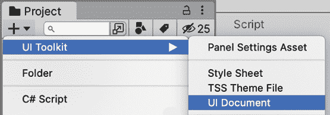

图 16.1：创建 UI 文档资产

1.  点击**游戏对象** | **UI Toolkit** | **UI 文档**选项在您的场景中创建一个具有**UI 文档**组件的 GameObject，该组件能够渲染 UI 文档。

1.  选择它，并将**GameHUD** **UI 文档**资产（在*步骤 1*中创建的）拖动到**UI 文档**GameObject（在*步骤 2*中创建的）的**源资产**属性：

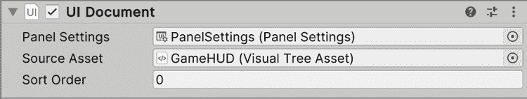

图 16.2：使 UI 文档组件渲染我们的 UI 文档资产

就这样！当然，由于 UI 文档是空的，我们屏幕上目前不会显示任何内容，所以让我们开始向其中添加元素。

## 编辑 UI 文档

由于我们的目标是重新创建我们在上一章中创建的相同 UI，让我们从最简单的一部分开始：将玩家头像添加到左上角。一个选择是使用任何文本编辑器打开**UI 文档**资产并开始编写 UXML 代码，但幸运的是，我们有一个更简单的方法，那就是使用**UI 构建器**编辑器。这个编辑器允许我们通过拖放元素来可视地生成 UXML 代码。

在我们深入之前，让我们快速浏览一下 UI **构建器**窗口，看看我们正在处理什么：

1.  在**项目**视图中双击**GameHUD**资产以使**UI 构建器**打开它：

![img/B21361_16_03.png]

图 16.3：UI 构建器编辑器

1.  在 UI 构建器内部的**层次结构**面板中（**不是**我们在前几章中使用的那个**层次结构**面板），选择`GameHUD.uxml`，这是 UI 的容器元素。

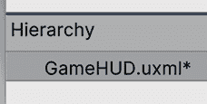

图 16.4：在层次结构中选择资产名称以编辑通用 UI 设置

1.  看看 UI 构建器窗口右侧的**检查器**面板（**不是**我们之前用来修改 GameObject 的**检查器**）。将**大小**属性设置为**宽度**为`1920`和**高度**为`1080`。这将允许我们查看我们的 UI 在这个分辨率下的外观。您稍后可以更改此值以查看它如何适应不同的大小，但关于这一点稍后再说：

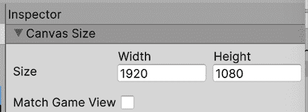

图 16.5：设置预览 UI 分辨率

1.  您可以通过按住**鼠标滚轮按钮**（也称为**中间按钮**）并移动鼠标来平移视口以在 UI 中导航。在 Mac 上，您还可以按住*Option* *+* *Command*并点击并拖动视口的任何空闲区域（没有我们的 UI 的地方）来完成相同的操作。

1.  您还可以使用**鼠标滚轮**来放大和缩小。最后，您可以使用视口左上角的缩放百分比选择和**适应画布**按钮来自动将整个 UI 适应到您的视口中：

![img/B21361_16_06_PE.png]

图 16.6：设置预览缩放

现在我们已经了解了 UI 构建器的基础知识，让我们将我们的图像添加到 UI 中：

1.  将**VisualElement**图标从底部的**库**拖到左侧的**层次结构**部分。这将创建一个基本的 UI 元素，能够渲染图像以及更多内容：

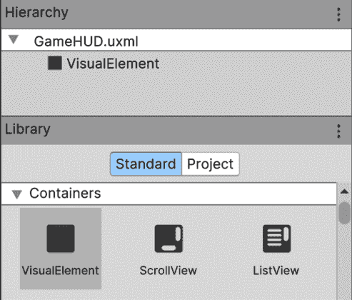

图 16.7：创建视觉元素

1.  在**层次结构**中选择**VisualElement**（在`GameHUD.uxml`下）并查看 UI 构建器窗口右侧的**检查器**（再次，不是常规的 Unity **检查器**面板）中的**位置**部分。如果尚未展开，请展开它（使用左侧的箭头）。

1.  将**位置**设置为**绝对**，以便我们可以自由地在 UI 中移动我们的元素。在本章的*使用相对位置*部分，我们将解释**相对**模式的工作原理：

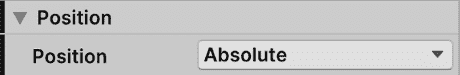

图 16.8：设置我们的 UI 元素可以自由移动

1.  打开**大小**部分，将**宽度**和**高度**设置为`100`，使我们的 UI 元素具有非零大小。这样，我们就可以在视口中看到其区域：

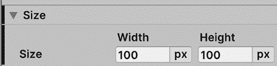

图 16.9：设置我们的 UI 元素大小

1.  在**视口**面板中，您可以拖动您的元素，并使用角落的蓝色矩形来更改其大小。将您的元素放置在 UI 的左上角。如果您在视口中看不到您的元素，请在**层次结构**（UI Builder 的那个）中选择它：

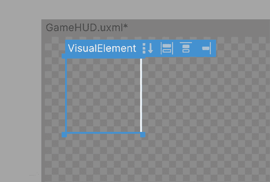

图 16.10：移动 VisualElement

1.  为了设置精确的位置，您可以将**检查器**中**位置**部分的**左**和**顶**值设置为分别指定精确的*x*和*y*坐标，以像素为单位：

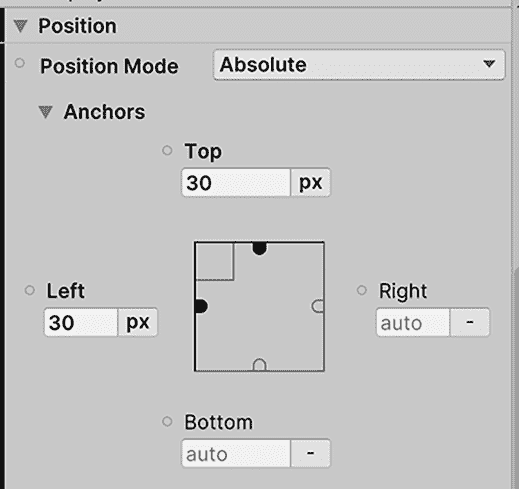

图 16.11：设置位置

1.  在**检查器**的**背景**部分，使用**图像**属性右侧的组合框将**图像**模式设置为**精灵**。这允许我们将精灵作为我们元素的背景应用。

1.  将我们在*第十五章*中导入的玩家头像的精灵资产（图像）从**项目**面板拖动到**图像**属性以设置它。您还可以使用目标按钮（中间有点的圆形按钮）从拾取窗口中选择精灵资产：

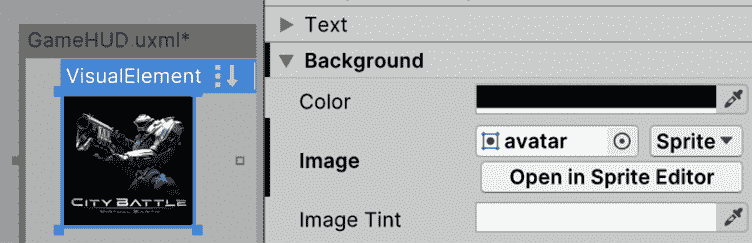

图 16.12：设置元素的背景图像

1.  返回到常规**游戏**面板查看结果。如果您没有看到变化，您可以关闭并重新打开渲染我们 UI（即我们使用 UI 文档创建的那个）的 GameObject。

现在我们已经创建了玩家头像，我们可以通过以下步骤创建玩家生命值条：

1.  重复之前的**步骤**1 到**6**，创建一个新的元素，该元素将作为玩家生命值条的容器。它将没有图像，因为它只是其他将组成生命值条的元素的容器。

1.  将其放置在玩家头像旁边，并设置宽度和高度以类似于经典的生命值条。请记住，您可以通过拖动图像和角落的方块或通过**大小**和**位置**属性来完成此操作，就像我们之前做的那样。

1.  拖动一个新的 VisualElement 到层次结构中，就像我们在*步骤 1*中做的那样，但这次，将其拖放到*步骤 1*中创建的元素上。这将使这个新元素成为它的子元素，这将使该元素的位置和大小依赖于其父元素，就像我们在*第十五章*，*界面光辉：设计用户友好的 UI*中为 Canvas 对象设置父元素时发生的情况一样。

1.  选择父 VisualElement，并在**检查器**中设置**名称**属性为`PlayerHealth`以方便识别。对子元素也进行相同的操作，将其命名为`Filling`：

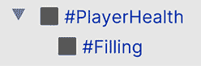

图 16.13：设置视觉元素的父级和命名

1.  在**层次结构**中选择**填充**元素，并查看**检查器**。

1.  在**背景**部分，将**颜色**属性设置为红色，点击颜色框并使用**颜色选择器**。这将用纯红色填充我们的 UI 元素背景，而不是使用图像：

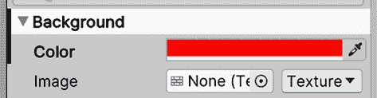

图 16.14：为我们的元素设置纯红色背景

1.  如往常一样，将**位置**设置为**绝对**，并将**左**和**顶**属性设置为`0`。由于这是一个元素的子元素，位置将相对于其父元素的位置，因此通过指定**左**和**顶**值为`0`，我们表示我们将位于父元素的左侧和顶部 0 像素处。这意味着如果父元素移动，此子元素将随之一同移动。

1.  将**宽度**和**高度**设置为`100`，并通过点击**px**按钮并选择**%**来更改度量单位。这将使**填充**元素的大小与其父元素相同（父元素大小的 100%）：

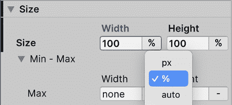

图 16.15：将我们的尺寸设置为与父元素相同的尺寸

1.  将一个新的**VisualElement**作为**PlayerHealth**（**填充**的兄弟元素）的子元素添加，并将其命名为`Border`。

1.  将**填充**元素在*步骤 7*和*步骤 8*中设置的**位置**和**大小**应用于**填充**元素，但不要设置背景颜色。

1.  将**背景**部分的**图像**属性设置为我们在上一章中使用的相同边框图像。请记住将**图像**模式设置为**精灵**而不是**纹理**。

1.  在**背景**部分将**切片**属性设置为`15`。这应用了我们在*第十五章*，*界面光辉：设计用户友好的 UI*中使用的九宫格技术，在不拉伸对象的情况下扩展对象。在这种情况下，我们给切片从 UI 元素的外边框提供 15 像素的大小。

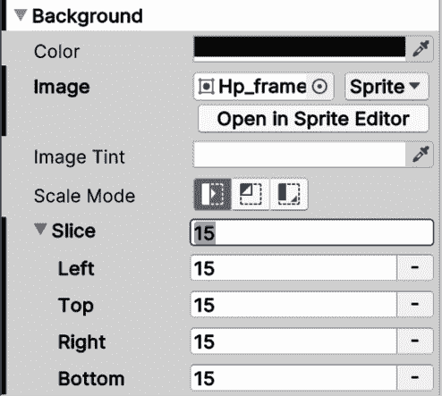

图 16.16：在元素中直接设置九宫格大小

1.  在 **Hierarchy** 中选择 **Filling** 视觉元素，并将其 **Size** 部分的 **Width** 属性设置为模拟我们在 *第十一章*，*迷人的视觉效果：利用粒子系统和 VFX 图* 中使用的图像的 **Fill Amount** 属性。稍后，我们将通过代码将大小直接与玩家的生命值数字成比例：

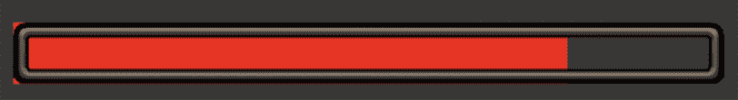

图 16.17：生命条结果

1.  重复 *步骤* *1* 到 *12* 来创建 **Base Health** 条的底部。记住，这次填充必须是绿色的。或者，你也可以直接复制和粘贴 **PlayerHealth** 容器，但我建议你为了学习目的重复这些步骤。

在之前的步骤中，我们基本上看到了如何组合几个 UI 元素来创建一个复杂对象。我们需要一个父容器元素来驱动我们子元素的大小，以便内部元素适应它，特别是填充，它需要一个百分比值来表示当前玩家的生命值。

现在，我们有了生命条！嗯，还不完全是这样；那些填充中未被边框覆盖的红角看起来相当粗糙！我们将在本章后面讨论如何使我们的 UI 响应时改进这一点，所以现在让我们保持原样。

最后，让我们向 UI 添加文本元素。但首先，我们需要考虑字体。如果你下载了 TTF 字体，你需要创建一个字体资产，就像我们在 *第十五章*，*界面辉煌：设计用户友好的 UI* 中所做的那样，以便在 UI Toolkit 中使用。然而，根据 UI Toolkit 的当前版本，我们在上一章中创建的字体资产不兼容。

我们需要使用 UI Toolkit 字体资产创建器而不是 TextMesh Pro 创建器来创建字体资产。存在重复工具的原因是 Unity 正在将 Text Mesh Pro 包集成到一个新的、改进的包中，称为 TextCore，其中一项改进是与 UI Toolkit 和其他 Unity 系统的兼容性。

考虑到这一点，为了将 TTF 转换为与 UI Toolkit 兼容的字体资产，你只需在 **Project** 面板中右键单击 TTF 资产，然后选择 **Create** | **Text** | **Font Asset**。这将创建一个新的资产，我们将使用它来定义 UI Toolkit 文本的字体。

解决了这个问题后，让我们创建文本 UI 元素，即 **Label**：

1.  将 UI Builder 窗口的 **Library** 面板中的 **Label** 图标拖动到其 **Hierarchy** 面板。这将添加一个 UI 元素，它不仅能够在其背景中渲染图像，还可以显示文本（是的，如果你想的话，你还可以为文本添加背景）。

1.  如同往常，设置其 **位置** 和 **大小**，这次将其放置在屏幕的右上角。记住，你可以简单地拖动元素；你不需要手动设置特定的坐标（尽管如果你愿意，你也可以这样做）。

1.  将 **Inspector** 中 **标签** 部分的 **文本** 属性更改为所需的文本；在我们的例子中，这将变为 `得分：0`：

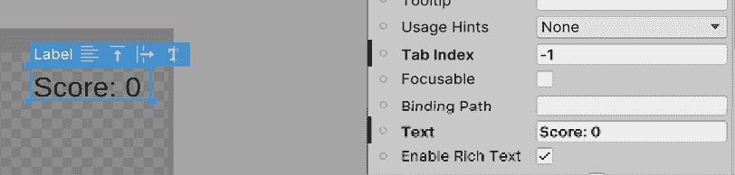

图 16.18：设置要显示的文本

1.  将这些步骤之前创建的 **字体** 资产拖动到 **Inspector** 中 **文本** 部分的 **字体资产** 属性。不要将其与 **字体** 属性（位于 **字体资产** 上方）混淆。那个属性允许你直接拖动 TTF 资产，但这个功能很快就会被弃用，所以让我们坚持使用 Unity 推荐的方法。

1.  如果你注意到你的 **字体** 资产不起作用，请尝试将其放入 **UI Toolkit** | **资源** | **字体与材质** 文件夹中的 **项目** 面板。虽然这不应该在最新的 Unity 版本中是必要的，但我注意到这过去已经解决了这类问题。此外，还有一个错误有时会导致字体无法识别，可以通过删除并重新创建 **标签** 来修复。

1.  将 **文本** 部分的 **大小** 属性设置为任何看起来合适的大小：

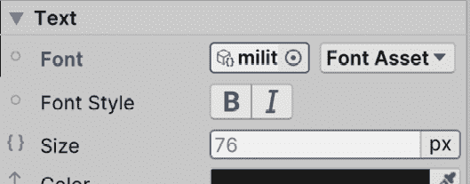

图 16.19：设置标签的文本字体和大小

1.  重复 *步骤* *1* 到 *6* 以将所有剩余的 **标签** 添加到 UI 中。

1.  我们最后需要做的一件事是保存，这可以通过按 *Ctrl* *+* *S* （在 Mac 上为 *Command* *+* *S*）或使用 **UI Builder** 窗口 **视口** 部分的右上角 **文件** | **保存** 菜单来完成。请注意，UI Toolkit 的早期版本中有一个错误，这可能会使视口损坏。如果发生这种情况，请关闭它并重新打开 UI Builder。

现在我们已经创建了我们的 UI，你可能已经注意到需要重复设置几个参数来使多个对象看起来相同，比如我们的生命条和标签。虽然这是完全可行的，但通过重用样式，我们可以极大地提高我们的工作流程，而 **样式表** 正是我们需要完成这一目标的精确功能，所以让我们来看看它们。

## 创建 UI 样式表

想象一下你正在设计各种游戏元素，如按钮和菜单，它们都具有相同的样式——相同的背景、字体、大小和边框。这在 UI 设计中是一个常见的场景，其中一致性是关键。当使用 uGUI 创建 UI 时，避免为每个元素重复配置的一种方法是为按钮创建 Prefab 并创建实例（以及必要时创建 Prefab 变体）。与 uGUI 不同，UI Toolkit 不使用 GameObject，因此我们无法依赖 Prefab 进行样式设置。但不用担心，我们有一个强大的替代方案：**样式表**。

**样式表**是包含一系列针对我们 UI 元素样式预设的独立资源。我们可以定义一组样式（例如，背景、边框、字体、大小等），并将这些样式应用到不同 UI 元素中的多个元素上。这样，如果我们更改样式表资源中的样式，使用该样式的所有 UI 元素将以类似材料工作的方式发生类似变化。

在样式表中创建样式有几种方法。样式表的选择器系统有点像过滤器 - 你设置规则来决定哪些 UI 元素获得某些样式，就像网页设计中的 CSS 一样。类基本上是我们可以通过其名称应用到任何元素上的样式。例如，我们可以创建一个名为`Button`的类，并将其添加到我们想要应用该样式的 UI 中的每个按钮上。请注意，在这里，类的概念并不指编程类。类是一种对必须具有特定样式的 UI 元素进行标记的方式。

关于 USS 的高级技巧，请参阅此链接：[`docs.unity3d.com/2023.1/Documentation/Manual/UIE-USS.html`](https://docs.unity3d.com/2023.1/Documentation/Manual/UIE-USS.html)

因此，在这种情况下，让我们为我们的 UI 中的所有标签创建一个类，这样只需更改样式，就可以修改所有标签的外观：

1.  在**UI Builder**的**样式表**面板中，点击**添加（+**）按钮，然后点击**创建新 USS**（Unity StyleSheet）。如果不起作用，请尝试重新启动 Unity；当前版本的 UI Toolkit 中存在一个可能导致此问题的错误：

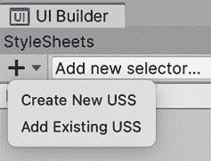

图 16.20：创建 Unity 样式表

1.  根据您的喜好命名 USS（例如，我的情况是`GameUSS`）并保存文件。

1.  在我们的 UI 文档中选择一个标签元素，并查看**检查器**。

1.  在**检查器**的**样式表**面板中，在**样式类列表**输入字段中输入`HUDText`，但不要按*Enter*键。

1.  点击**将内联样式提取到新类**按钮。这将把我们应用到标签（位置、大小、字体等）的所有样式修改保存到一个名为`HUDText`的新样式类中。您可以观察到它被添加到应用到元素的类列表中（那些在**检查器**中**样式表**部分底部的标签）：

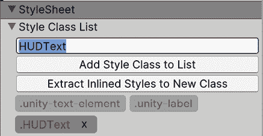

图 16.21：将设置提取到样式类中

通过这些步骤，我们已经将需要应用到其他元素上的样式标签提取到一个名为**HUDText**的类中。这样，我们只需将**HUDText**类添加到 UI 中的其他元素，甚至可以将相同的 USS 资源添加到其他 UI 文档中（在**样式表**面板的**+**按钮上点击 | **添加现有 USS**）以将此类添加到其中的元素。

此外，如果你再次选择标签，你会注意到之前加粗的属性现在又变回了正常；这是因为加粗的属性代表已更改的属性，我们已经提取了它们，所以默认值变成了样式类定义的值。幸运的是，并不是所有内容都被提取到新的 USS 类中；例如，**Text**字段仍然有我们特定的所需文本，因为你不太可能想要在其他对象中放入相同的文本。

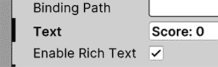

图 16.22：文本属性加粗，表示它与默认值不同。另一方面，启用富文本没有加粗，意味着它遵循默认值和类的值

如果你提取类时遗漏了样式细节，不要担心。你可以轻松地在之后通过在**StyleSheets**部分选择类并做出编辑来调整它。然后，在列表中选择**HUDText**类。如果你看不到它，尝试展开**GameUSS.uss**部分。

一旦选中，你可以在**Inspector**面板中修改它，类似于我们更改 UI 元素的属性：

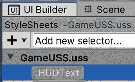

图 16.23：选择要修改的样式类

这样，我们就编辑了我们的`HUDText`类。如果其他元素应用了此类，它们也会应用这些更改。考虑另一种选择是首先创建类，在**StyleSheets**输入字段中键入名称，按*Enter*键，然后将它应用到 UI 元素上。这样，你将避免需要撤销不希望的变化，但如果首先创建了元素，那么有撤销选项会方便一些：

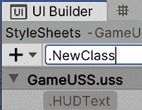

图 16.24：从头创建样式类

现在我们有了我们的样式类，让我们通过以下步骤将其应用到其他元素上：

1.  选择我们的 UI 中的另一个标签。

1.  将**HUDText**样式从 UI Builder 窗口左上角的**Stylesheet**面板拖动到视口中的我们的元素上。你也可以选择将其拖动到**Hierarchy**元素上：

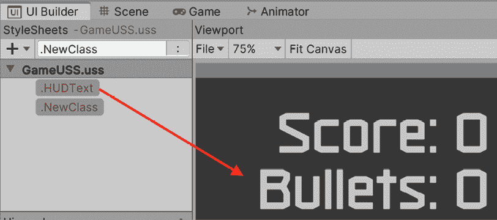

图 16.25：将类应用于元素

1.  选择**Label**，查看**HUDText**类是如何添加到**Inspector**的**StyleSheet**部分的。

现在，请注意，即使元素现在应用了类，元素本身也有我们在上一步中做的文本更改，覆盖了类中的样式。你可以通过再次选择类（在**样式表**部分，位于**UI Builder**窗口的左上角）来轻松检查这一点，更改任何设置，如大小，然后看看不是所有元素都发生了变化。这显示了覆盖系统的工作原理；元素上的更改优先于它所应用的类中的更改。

如果你想移除这些覆盖，你可以简单地选择元素（不是类），在覆盖的属性上右键单击，并通过右键单击然后选择**取消设置**来撤销更改。在我们的标签情况下，我们可以取消整个**文本**部分的设置，以及可能取消**绝对**位置（因为期望的值已经包含在类中）。

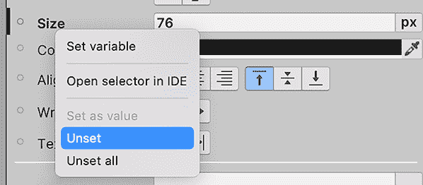

图 16.26：撤销覆盖以使用应用于元素的类的默认值

因此，通过这些步骤，我们创建了一个新的**样式表**资产，并将其添加到 UI 文档中以便使用。我们在其中创建了一个新的样式类，从中提取了现有 UI 元素的更改，然后调整了我们想要保留的更改。最后，我们将该样式应用于另一个元素。通过这种方式，我们只是触及了 StyleSheets 真正力量的表面。我们可以开始做一些事情，比如从不同的样式表中组合不同的类，或者使用选择器动态设置样式，但这超出了本章的范围。

虽然 UI Toolkit 的文档仍在不断发展，但你可以通过深入研究 CSS 文献来提前掌握这些高级概念。CSS 的基本原理和最佳实践为 UI Toolkit 提供了有价值的见解。它不会完全相同，但基本思想和最佳实践仍然适用。

现在，UI 看起来几乎与*第十五章*中的样子完全相同，*界面辉煌：设计用户友好的 UI*，但它不会以相同的方式表现。如果你尝试更改视口的大小（通过在层次结构中选择**GameHUD.uxml**并更改**宽度**和**高度**，就像我们在本章开头所做的那样），你会看到 UI 不会正确适应，所以让我们修复这个问题。

# 制作响应式 UI

在本节中，我们将学习如何使之前创建的 UI 适应不同的屏幕尺寸。我们将讨论以下概念：

+   动态定位和大小

+   动态缩放

+   使用相对位置

让我们先讨论如何使我们的对象的位置和大小适应屏幕尺寸。

## 动态定位和大小

到目前为止，我们已经使用了 **Left** 和 **Top** 位置属性来指定元素相对于屏幕左上角的 *x* 和 *y* 位置，然后使用 **Width** 和 **Height** 来定义大小。虽然本质上，这已经足够定义一个对象的位置和大小，但在所有情况下都很有用，尤其是在我们需要适应不同屏幕大小的情况下。

例如，如果你需要将一个对象放置在屏幕的右上角，知道其大小为 `100x100` 像素，而屏幕大小为 `1920x1080` 像素，我们可以将 **Left** 和 **Right** 位置属性设置为 `1820x980` 像素，这样会有效，但仅适用于该特定分辨率。

那么，如果用户以 `1280x720` 像素运行游戏会发生什么？对象将超出屏幕。在 uGUI 中，我们使用了锚点来解决这个问题，但这里我们没有。幸运的是，我们有 **Right** 和 **Bottom** 来帮助。

与 **Left** 和 **Top** 属性类似，**Right** 和 **Bottom** 定义了从父元素边界的距离（如果没有父元素，则直接从整个屏幕）。目前，这两个都设置为 **auto**，意味着位置将由 **Left** 和 **Right** 独立驱动，但通过改变这些值可以发生有趣的事情，所以让我们通过以下方式使用它们，使我们的 **Score** 和 **Bullet** 标签粘附到屏幕的右上角：

1.  将光标移至视口 UI 的底部，直到出现一个白色条。

1.  拖动那个条来调整屏幕大小，并查看我们的 UI 如何适应（或不适应）不同的大小。

1.  在侧边也做同样的操作，看看它如何适应不同的屏幕宽度：

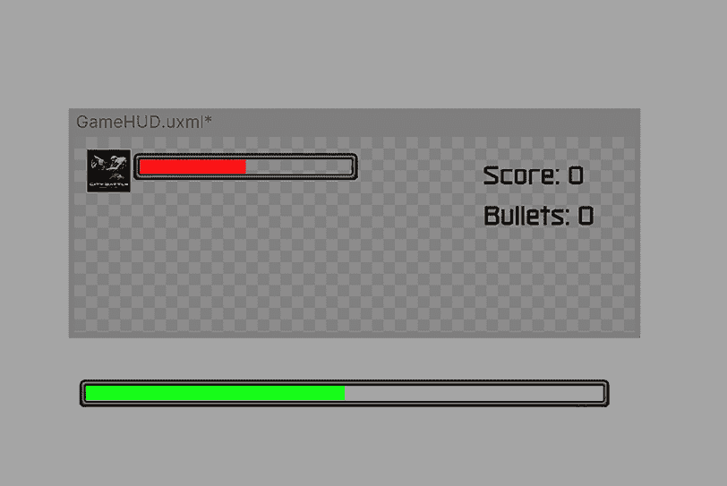

图 16.27：UI 无法适应不同的屏幕大小

1.  在视图中选择 **Score** 标签，并查看 **Inspector**。

1.  在 **Position** 部分将 **Top** 和 **Right** 的值设置为 `30`。

1.  通过点击每个属性右侧的 **px** 按钮并将 **Left** 和 **Bottom** 的值设置为 **auto**：

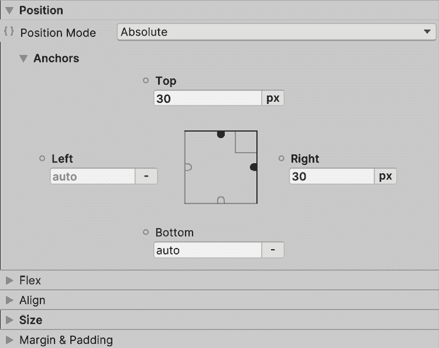

图 16.28：将位置属性的单元类型更改为自动模式

1.  注意标签两侧的 **Right** 和 **Top** 金色方块已填充，而 **Left** 和 **Bottom** 方块是空心的。这意味着 **Left** 和 **Bottom** 方块处于 **auto** 模式。如果需要，您也可以通过点击这些方块来切换 **auto** 模式：

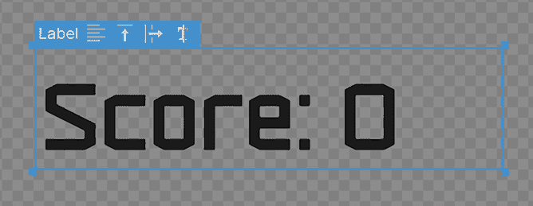

图 16.29：切换元素位置属性自动模式

1.  尝试再次更改 UI 容器的尺寸，就像我们在 *步骤* *1* 和 *2* 中做的那样，看看我们的 **Score** 标签是如何始终对齐到右上角的。

1.  重复 *步骤* *4* 到 *6* 为 **Bullets** 标签，这次将 **Top** 属性设置为 `140`。

我们通过这些步骤所做的实际上是使对象的位置以像素为单位相对于 UI 的**Top**和**Right**边或屏幕的右上角来表示。我们需要将其他边设置为**自动**模式，这样它们就不会参与位置计算。

现在，我们还可以以其他方式使用**Position**属性。正如你现在可能想象的那样，如果我们愿意，我们可以开始组合**Left**和**Right**以及**Top**和**Bottom**。在这种情况下，**Left**和**Top**将优先定义位置，但然后，**Right**和**Bottom**做什么呢？它们定义元素的大小。

例如，如果我们有一个元素，其**Left**和**Right**属性都设置为`100px`，并且我们在一个宽度为`1920`像素的屏幕上查看我们的 UI，那么我们元素的最终宽度将是`1720`（从**Left**减去`100`，从**Right**减去`100`）。这样，**Position**属性表示我们的元素边框与屏幕边框（或父元素）的距离。 

让我们通过以下步骤来观察其效果，使底部健康条适应屏幕宽度，同时通过以下方式保持其相对于屏幕底部的位置：

1.  在**Hierarchy**中选择底部健康条的父元素。不要在视图中选择它，因为你只会选择其填充或边框。

1.  将**Left**、**Right**和**Bottom**设置为`50px`。

1.  将**Top**设置为**自动**（点击右侧的**px**按钮并选择**自动**）。

1.  在**Size**部分，也将**Width**设置为**自动**。

1.  将**Height**设置为`35px`：

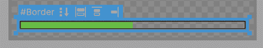

图 16.30：使玩家的基础生命条适应屏幕宽度

1.  改变 UI 的大小以查看其如何适应。

通过这些步骤，我们定义了条与屏幕边框的距离为`50`像素，以便它适应任何屏幕宽度，同时保持与边框和高度的固定距离。我们基本上实现了与 uGUI 中的分割锚点相同的行为！请注意，我们需要将**Size** **Width**属性设置为**自动**，以便**Left**和**Right**属性驱动位置；如果不这样做，**Width**属性将优先，**Right**将没有任何效果。我邀请您尝试其他**px**/**auto**的组合。

我们在这里可以做的最后一个技巧是，在健康条边框的**Left**、**Top**、**Right**和**Bottom** **Position**属性中使用负值，使边框略大于容器并覆盖填充边框。在这种情况下，将**Left**、**Top**、**Right**和**Bottom**设置为`-15px`，并记住将**Size** **Width**和**Height**属性设置为**自动**。你可能想稍微降低条容器的宽度（不是边框），因为现在它将因为这种变化而看起来更厚：

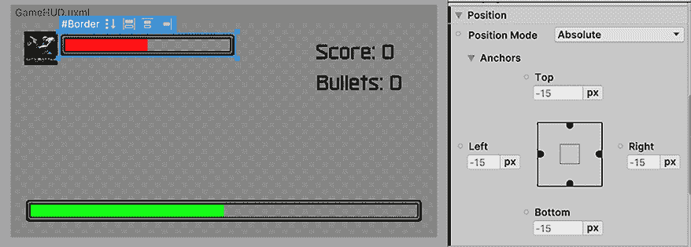

图 16.31：使用负的 Position 属性来覆盖填充

除了**px**（像素）或**auto**模式之外，还有一种百分比（**%**）模式，它允许我们以相对于屏幕（或如果存在则相对于父元素）的大小表示值。例如，如果我们设置**顶部**和**底部**为`25%`，这意味着我们的元素将在垂直居中，大小为屏幕高度的 50%（请记住在此处将**高度**设置为**auto**）。如果我们设置**顶部**为`25%`，**底部**为**Auto**，**高度**为`50%`，我们也可以达到相同的结果；正如你所看到的，我们可以巧妙地组合这些值。

在我们的案例中，我们将使用百分比值在我们的**生命条**填充中，这样我们就可以用百分比来表示它们的大小。我们需要这样做，以便在代码中稍后可以指定条的宽度为玩家生命值的百分比（例如，一个有`25`生命值和最大`100`点的玩家有`25%`的生命）。

现在，虽然我们通过使用**左**、**顶**、**右**和**底**属性解决了适应屏幕尺寸的问题，但我们还没有解决元素的动态尺寸问题。这次，我们指的是具有不同**DPI**（**每英寸点数**）的屏幕，因此让我们讨论如何使用**面板设置**资产来实现这一点。

## 动态缩放

我们使用`1920x1080`作为 UI 基本分辨率来定位和调整我们的元素，以便在该分辨率下看起来很漂亮。在调整 UI 时，我们了解了元素如何适应其位置，你可能已经观察到元素大小发生了显著变化，看起来更大或更小。这是动态 UI 缩放中需要考虑的重要方面。

虽然有一个基本的参考分辨率对于设计我们的 UI 是有益的，但我们应考虑不同分辨率下元素的大小，尤其是在高 DPI 的屏幕上。有时，你可能会有分辨率更高但物理尺寸相同的厘米数屏幕。

这意味着高分辨率下的像素更小；因此，它们具有更高的 DPI，如果未正确缩放，元素可能会显得更小。

在 UI 设计中缩放确保你的界面在任何屏幕尺寸上看起来都很棒。以前，在传统的 Unity UI 中，我们依赖于 Canvas Scaler 来实现这一点。现在，在 UI Toolkit 中，我们使用类似的方法，但通过**面板设置**资产来实现。让我们看看这是如何配置的，以在不同分辨率之间保持一致的 UI 元素：

1.  在**项目**面板中查找**面板设置**资产并选择它。另一个选项是选择主编辑器层次结构中的`UI Document` GameObject，并点击**面板设置**属性中引用的资产：

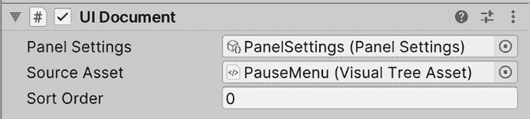

图 16.32：UI 文档组件中引用的面板设置

1.  将**缩放模式**设置为**随屏幕尺寸缩放**。

1.  将**屏幕匹配模式**设置为**匹配** **宽度或高度**。

1.  将**参考分辨率 X**值设置为`1920`，将**Y**值设置为`1080`。

1.  将**匹配**滑块完全向右移动，直到标记为**高度**的末端：

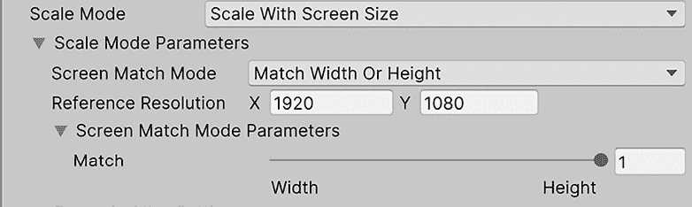

图 16.33：设置我们的 UI 缩放

1.  观察如何改变 Unity 编辑器的**游戏**面板的高度，将使 UI 相应地调整元素大小（即，改变整个 Unity 编辑器窗口的高度）。

我们所做的这些更改首先是将**参考分辨率**设置为我们的 UI 设计的分辨率——在我们的案例中，是`1920x1080`。然后，我们将**屏幕匹配模式**设置为允许我们根据一边、**宽度**、**高度**或两者的组合来缩放我们的元素，如果我们更喜欢的话。我们专注于**高度**进行缩放，因为 PC 通常有更宽的屏幕。这个选择确保了我们的 UI 元素在各种屏幕高度上保持视觉一致性。这意味着在不同的屏幕宽度上，元素看起来大小相同，但在不同的高度上，元素会更大或更小。

使用这些设置，我们可以做一些数学计算来理解这些值。如果我们的屏幕与参考分辨率（`1920x1080`）相同，元素大小将与我们在像素大小中指定的元素大小相同，所以对于我们的玩家头像，它将是`150x150`像素。记住，物理大小以厘米为单位取决于屏幕的 DPI。

通过对如何在 4K 屏幕上缩放 UI 元素的理解，让我们将这一知识付诸实践。现在，我们将调整我们的 UI 设置以有效地适应这种高分辨率显示器。按照以下步骤操作，看看我们的 UI 元素如何响应和适应 4K 分辨率的设置。

现在，假设我们有一个 4K 屏幕，意味着分辨率为`3840x2160`。因为我们指定我们的 UI 通过**高度**匹配，我们可以确定我们的元素大小将加倍，因为我们的屏幕高度是参考分辨率的两倍（`2160`除以`1080`）。我们的玩家头像，大小为`300x300`像素，在 4K 屏幕上将保持其物理大小；这是通过屏幕的双倍大小和双倍像素密度实现的。最后，考虑一个超宽标准分辨率`2560×1080`（是的，非常宽的屏幕），在这种情况下，元素大小将保持不变，因为唯一的变化是宽度；唯一的不同是，由于屏幕尺寸，元素将因屏幕尺寸而具有更多的水平间隔。我知道这些计算可能很复杂，但请继续实验**面板设置**和**游戏**视图大小中的值，以更好地理解它们。

太好了，现在我们真的有了相同的 HUD。我们可以开始将迄今为止看到的概念应用到**选项**菜单中，但让我们抓住机会以不同的方式来做，使用**相对**的**位置**，这是一种创建元素流动的方法，其中元素的位置相互依赖。

## 使用相对位置

在我们游戏的 HUD 中，每个元素都需要自己的**位置**和**大小**，并且不同元素的位置可以调整大小和重新定位，而不会影响其他元素。我们可能会观察到玩家生命条和角色的例子，但在这个情况下变化将是微不足道的。还有其他情况，这种情况并不那么简单，例如在需要垂直或水平调整的元素列表（例如，在多人游戏中加入的匹配列表）中，这时相对位置就帮到了我们。

相对位置允许我们将元素的位置相对于彼此进行调整；从某种意义上说，一个元素的位置将取决于前一个元素的位置，前一个元素的位置又取决于它的前一个元素，以此类推，形成一个链或**流程**。这在 uGUI 的垂直和水平布局中是类似的。在我们的案例中，我们将使用这些方法使**暂停**标签以及**选项**和**退出**按钮在它们的父元素中垂直居中。

让我们开始创建菜单，按照以下步骤操作：

1.  创建一个新的 UI Document（在**Project View** | **UI Toolkit** | **UI Document**后点击**+**按钮），并将其命名为`OptionsMenu`。我们可以继续在之前的 UI Document 上工作，但让我们将这些 UI 组件分开，以便于激活和停用以及一般的资产组织。

1.  双击资产以将其设置为当前由**UI Builder**编辑的 UI。

1.  选择根对象（**OptionsMenu.uxml**在**Hierarchy**中）并设置**Inspector**中的**Width**和**Height**属性为`1920x1080`像素。

1.  创建一个新的具有**UI Document**组件的 GameObject（**GameObject** | **UI Toolkit** | **UI Document**），并将该对象的资产拖动以渲染它（就像我们在本章早期创建的 HUD 一样）。

1.  双击**UI Document**资产以打开**UI Builder**窗口进行编辑，并在该窗口中，将一个新的**VisualElement**拖动到**Hierarchy**或视图中，并将其命名为`Container`（在**UI Builder**的**Inspector**中的**Name**属性）。

1.  将**左**、**右**、**上**和**右**的**位置**属性设置为`0px`。

1.  将**位置**设置为**绝对**。

1.  在**大小**部分将**宽度**和**高度**设置为**自动**。这将使容器适应整个屏幕。

1.  将一个新的**VisualElement**拖动到容器中作为子元素，并将其命名为`Background`。

1.  这次将**位置**设置为**相对**。

1.  将**大小**的**宽度**和**高度**设置为`500px`。

1.  将**Background**对象的**背景图像**设置为使用上一章中使用的相同的背景精灵。

1.  选择**Container**父对象（不是**Background**）。

1.  在**Inspector**中，将**Align**部分的**Align Items**属性设置为`center`，即第三个按钮。如果将鼠标悬停在图标上，它们将在工具提示中显示其名称。

1.  将**Justify Content**设置为**居中**（第二个按钮）：

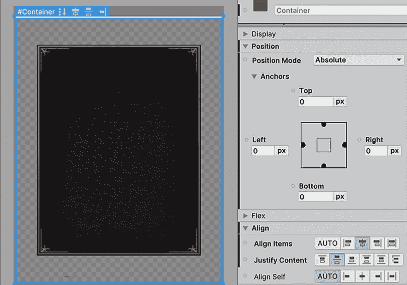

图 16.34：准备 UI 背景以容纳内部元素

1.  使用侧面的白色条来更改 UI 的大小，以查看背景始终居中。

只需放置一个元素，这就是观察相对定位在实际环境中如何工作的绝佳机会。首先，我们创建了一个空对象，它将始终适应屏幕大小，使我们能够使子元素依赖于全屏大小。然后，我们创建了一个具有固定大小但具有相对位置的图像元素，这意味着其位置将由父容器计算。最后，我们告诉容器使其子对象与其水平和垂直中心对齐，因此背景立即居中，无论屏幕大小如何。当使用绝对位置时，**Align** 属性不起作用，因此这是相对定位的第一个好处。

但相对定位在多个元素中变得更加强大，因此让我们将 **Label** 和按钮添加到我们的 **Background** 元素中，通过以下方式进一步探索这个概念：

1.  从 **UI Builder** 左下角的 **Library** 面板中，将一个 **Label** 元素和两个 **Button** 元素拖放到 **Hierarchy** 中的 **Background** 内。请注意，有时即使你将新元素拖放到所需对象内，它也不会成为其子元素。这次请只拖动在 **Hierarchy** 中创建的元素：

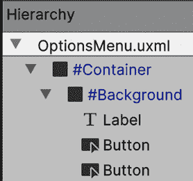

图 16.35：在菜单背景中添加元素

1.  观察默认情况下，元素如何由于相对位置的默认设置而垂直对齐，一个叠在另一个上面：

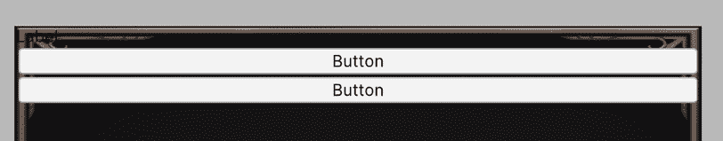

图 16.36：自动相对垂直定位

1.  选择 **Background** 元素，并将 **Justify Content** 设置为 `space-around`（第五个按钮）。这将沿背景分布元素。

1.  将 **Align Items** 设置为居中（第三个选项）以水平居中元素：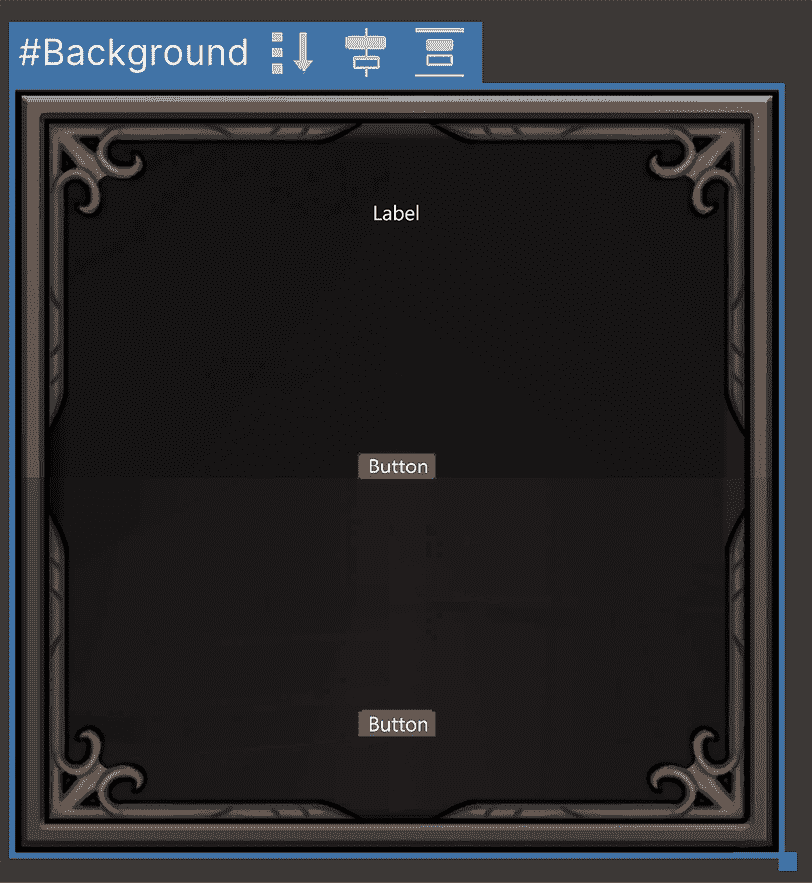

    图 16.37：自动相对垂直定位

    对于 **Justify Content** 有一个类似的模式，称为 space-between（**Justify Content** 中的第四个按钮），它也会沿垂直轴分布元素，但不会在第一个元素顶部或最后一个元素底部留下空间。此外，**Align Items** 有一个名为 **Stretch**（第五个选项）的选项，与 **center** 类似，它不仅会在水平方向上居中元素，还会拉伸它们而不是尊重每个元素的宽度。我建议尝试不同的对齐模式，以发现所有机会。

1.  将 **Label** 的 **Text** 的 **Font** 和 **Size** 属性设置为适合的任何值。在我的情况下，我使用了导入的字体和 `60px` 的大小。记住也要将 **Text** 设置为 `Pause`。

1.  将**按钮****背景图像**设置为与上一章中使用的按钮相同的图像。

1.  将**背景**部分的**颜色**属性设置为没有 alpha 的颜色。您可以通过单击颜色矩形并将颜色选择器中的**A**通道减少到`0`来实现这一点。这种颜色的想法是作为我们图像的背景，但我们不需要它，所以我们使其完全透明。

1.  将按钮**文本****字体**、**大小**和**颜色**设置为适合您的任何内容。在我的情况下，我使用`50`和灰色。

1.  在**边距和填充**部分，将**填充**设置为在文本和按钮边框之间留出一些空间。在我的情况下，`30px`就做到了这一点：

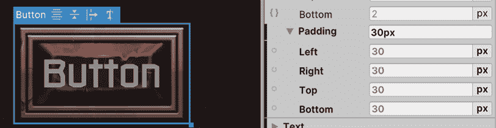

图 16.38：向按钮内容添加内部填充（在这种情况下是文本）

1.  此外，将**背景**的**顶部**和**底部****填充**设置为在窗口边框和其元素之间留出一些空间。在我的情况下，每个都是`40px`。

如您所见，我们更改了不同的设置来动态设置元素的大小，例如字体大小和填充，以及相对系统，同时对齐设置自动确定元素的位置。我们可以通过在层级中拖动元素来重新排列元素顺序，它们将自动适应。我们也可以使用**大小**属性来设置元素的大小，并且如果需要，可以使用**位置**属性应用一些偏移，但我鼓励您自己查看这些属性在**相对**模式下的行为。

我还想让您探索的最后一个设置是**Flex**部分的**方向**属性，正如您所想象的，这将确定元素将遵循的定位方向，垂直从上到下或从下到上，以及水平从左到右或从右到左。例如，您可以将**方向**设置为使用**行**模式（第三个按钮）从左到右分配元素，如果您愿意，可以使背景更宽以创建一个水平选项菜单。

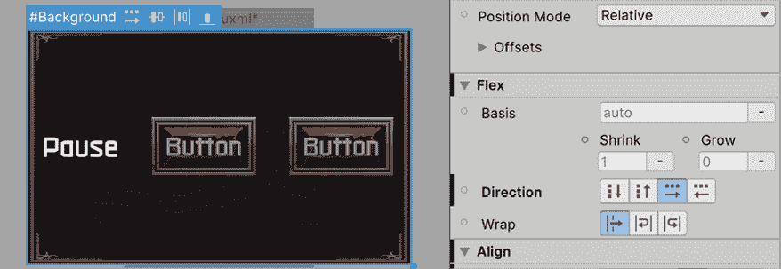

图 16.39：更改元素为垂直方向

作为旁注，您可能已经注意到背景和按钮的图像看起来比上一章创建的选项菜单要大。这是因为我们在**纹理**资产上更改的**每单位像素**设置，用于控制纹理的缩放，在 UI 工具包中不会生效；您需要手动在任何图像编辑器中更改纹理文件大小，以给它适当的大小。这里的最佳实践是始终创建大小适合我们最大支持分辨率的图像。通常，在 PC 上这是`1920x1080`，但请注意，4K 分辨率每天都在变得越来越流行。

# 概述

在本章中，我们介绍了 UI 工具包的关键概念以及如何创建 UI 文档和样式表。关于 UI 文档，我们学习了如何创建不同的元素，如图片、文本和按钮，以及如何使用不同的方法（如绝对定位和相对定位以及像素或百分比单位）来定位和调整它们的大小。此外，我们还看到了如何使用不同的 **Position** 属性组合使 UI 适应不同的尺寸。最后，我们学习了如何使用 USS 样式表在不同元素之间共享样式，以便轻松管理整个 UI 皮肤。

实质上，我们再次学习了如何使用不同的系统来制作 UI。再次提醒，这个系统仍然处于实验阶段，不建议用于实际生产项目。我们使用所有这些概念来重新创建在 *第十五章* 中创建的相同 UI，即 *界面辉煌：设计用户友好的 UI*。

在下一章中，我们将看到如何为我们的游戏添加动画，使我们的角色移动。我们还将看到如何创建过场场景和动态摄像机。

# 在 Discord 上了解更多

与其他用户、Unity 游戏开发专家以及作者本人一起阅读这本书。提出问题，为其他读者提供解决方案，通过 Ask Me Anything 会话与作者聊天，等等。扫描二维码或访问链接以加入社区：

[`packt.link/unitydev`](https://packt.link/unitydev)


