# 第十七章：动画现实：使用 Animator、Cinemachine 和 Timeline 创建动画

有时，我们需要以预定的方式移动对象，例如使用过场动画，或特定的角色动画，如跳跃、奔跑等。在本章中，我们将介绍几个 Unity 动画系统，以创建我们可以通过脚本获得的所有可能的物体运动。

在本章中，我们将探讨以下动画概念：

+   使用 Animator 进行蒙皮动画

+   编写动画脚本

+   使用 Cinemachine 创建动态摄像机

+   使用时间轴创建过场动画

到本章结束时，你将能够创建过场动画来讲述你游戏的历史或突出你关卡中的特定区域，以及创建能够准确呈现游戏场景的动态摄像机，无论情况如何。

# 使用 Animator 进行蒙皮动画

到目前为止，我们使用的是所谓的静态网格，它们是固体三维模型，不应该以任何方式弯曲或动画化（除了像汽车门那样单独移动）。

我们还有一种另一种类型的网格，称为蒙皮网格，这种网格可以根据骨骼变形，因此可以模拟人体肌肉运动。我们将探讨如何将动画化的类人角色集成到我们的项目中，以创建敌人和玩家的动作。

在本节中，我们将探讨以下骨骼网格概念：

+   理解蒙皮

+   导入蒙皮网格

+   使用 Animator 控制器进行集成

+   使用头像蒙版

现在我们已经介绍了蒙皮网格，让我们更深入地探讨蒙皮的功能及其在角色动画中的关键作用。然后，我们将把动画网格带入我们的项目，最终对它们应用动画。让我们先讨论如何将骨骼动画带入我们的项目。

## 理解蒙皮

为了获得一个动画网格，我们需要四个部分，首先是将要动画化的网格，其创建方式与任何其他网格相同。然后，我们需要骨骼，它是一组与所需网格拓扑相匹配的骨骼，例如手臂、手指、脚等。在*图 17.1*中，你可以看到一个与我们的目标网格对齐的骨骼示例：

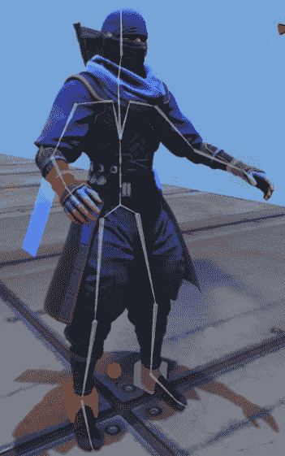

图 17.1：一个与默认姿势匹配的骨骼忍者网格

一旦艺术家创建了模型及其骨骼，下一步就是进行蒙皮，即把模型的每个顶点关联到一到多个骨骼上。这样，当你移动一个骨骼时，相关的顶点也会随之移动。

在*图 17.2*中，你可以看到网格三角形的着色是根据骨骼的颜色进行的，这以可视化的方式影响了骨骼。你会注意到颜色之间的混合，这意味着这些顶点受到不同骨骼的不同影响，以便使接近关节的顶点弯曲得更好。此外，*图 17.2*还展示了用于二维游戏的二维网格的示例，但概念是相同的：

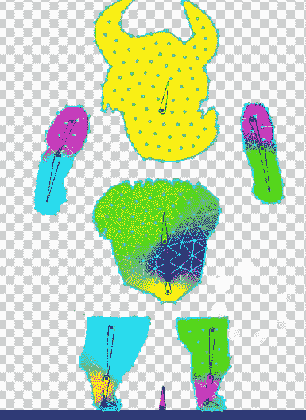

图 17.2：网格蒙皮权重以颜色形式直观表示

最后，你需要的是实际的动画，它将简单地由网格骨骼的不同姿势的混合组成。艺术家将在动画中创建关键帧，确定模型在不同时刻需要具有的姿势，然后动画系统将简单地在这之间进行插值。基本上，艺术家将动画化骨骼，蒙皮系统将此动画应用于整个网格。

为了获得这四个部分，我们需要获取包含它们的适当资产。在这种情况下，通常的格式是**Filmbox**（**FBX**），我们之前用它来导入 3D 模型。此格式可以包含我们需要的每一部分——模型、带有蒙皮的骨骼和动画，但通常这些部分将分成几个文件以供重新利用。

想象一个城市模拟器游戏，其中我们有几个具有不同外观的市民网格，并且所有这些都必须进行动画处理。如果我们为每个市民有一个包含网格、蒙皮和动画的 FBX 文件，那么每个模型都将有自己的动画，或者至少是相同的克隆，重复它们。当我们需要更改该动画时，我们需要更新所有网格市民，这是一个耗时的过程。

而不是这样，我们可以为每个市民有一个包含网格、基于该网格的正确蒙皮的骨骼的 FBX 文件，以及每个动画一个单独的 FBX 文件，包含所有市民都具有的正确动画的相同骨骼，但没有网格。这将使我们能够混合和匹配市民 FBX 文件与动画 FBX 文件。你可能想知道为什么模型 FBX 和动画 FBX 都必须有网格。这是因为它们需要匹配才能使两个文件兼容。在*图 17.3*中，你可以看到文件应该如何看起来：

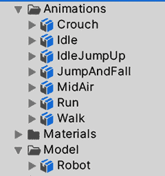

图 17.3：我们将在项目中使用的动画和模型 FBX 文件

此外，还有一个概念叫做重定向。正如我们之前所说，为了混合模型和动画文件，我们需要它们具有相同的骨骼结构，这意味着相同的骨骼数量、层次结构和名称。

有时，这可能不可行，尤其是在我们将我们艺术家创建的定制模型与您可以使用动作捕捉技术记录或仅通过购买**mocap**（动作捕捉）库（使用特定动作捕捉硬件在真实人类上捕获的一系列动画）的外部动画文件混合时。在这种情况下，您很可能会在 mocap 库和您的角色模型之间遇到不同的骨骼结构，因此这就是重定向发挥作用的地方。这项技术允许 Unity 在两个不同的人形骨骼结构之间创建通用的映射，使它们兼容。在下一节*导入骨骼动画*中，我们将看到如何启用此功能。

现在我们已经了解了带皮肤网格的基本原理，让我们看看我们如何获取带有骨骼和动画的模型资产。

## 导入骨骼动画

我们可以在**3D** | **Characters** | **Humanoids**部分在资产商店中搜索来下载角色模型。您还可以使用外部网站，例如名为 Mixamo 的网站来下载它们。请注意，有时您可能需要下载几个包，因为一些包只包含带皮肤的模型，而另一些只包含动画。幸运的是，我们在*第四章，无缝集成：导入和整合资产*中下载的模型已经包含了带皮肤的网格和动画。

在我的包内容中，我可以在`Animations`文件夹中找到动画的 FBX 文件，以及我在`Mesh`文件夹中名为`Polyart_Mesh`的模型的 FBX 文件。请记住，有时它们可能不会像这样分开，如果存在任何动画，动画可能位于与模型相同的 FBX 文件中。现在我们已经有了所需的文件，让我们讨论如何正确配置它们。

让我们从选择**模型**文件并检查**绑定**选项卡开始。在此选项卡中，您将找到一个名为**动画类型**的设置，如图*17.4*所示：

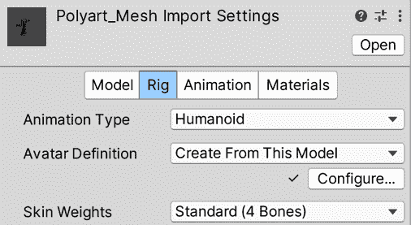

图 17.4：绑定属性

此属性包含以下选项：

+   **None**：用于非动画模型的模式；您游戏中的每个静态网格都将使用此模式。

+   **Legacy**：用于旧 Unity 项目和模型的模式；不要在新项目中使用此模式。

+   **Generic**：一种可用于所有类型模型的新动画系统，但通常用于非人类模型，如马、章鱼等。如果您使用此模式，模型和动画 FBX 文件必须具有完全相同的骨骼名称和结构，从而降低从外部来源组合动画的可能性。

+   **人类模型**：为人类模型设计的新动画系统。它启用诸如重定向和**逆运动学**（**IK**）等功能。这些功能允许您使用与动画骨骼不同的骨骼结构的模型。为此，Unity 使用此模式将模型和动画的骨骼结构转换为标准的人类骨骼结构，使它们相互兼容。这种结构称为**Avatar**。请注意，有时自动映射可能会失败，您可能需要手动纠正；因此，如果您的通用模型包含您所需的一切，我建议您如果 FBX 的默认配置是**通用**，则坚持使用**通用**。

在我的情况下，我包中的 FBX 文件的模式设置为**人类模型**，这是好的，但请记住，只有当绝对必要时才切换到其他模式（例如，如果您需要组合不同的模型和动画）。现在我们已经讨论了**绑定**设置，让我们谈谈**动画**设置。

要这样做，选择任何动画 FBX 文件，并在**检查器**窗口中查找**动画**选项卡。您将找到几个设置，例如，如果文件包含动画（不是模型文件），则必须标记**导入动画**复选框，以及**剪辑**列表，其中您将找到文件中的所有动画。在以下截图中，您可以看到我们的动画文件之一的**剪辑**列表：

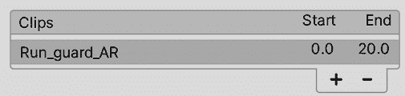

图 17.5：动画设置中的剪辑列表

带有动画的 FBX 文件通常包含一个单独的大动画轨道，该轨道可以包含一个或多个动画。无论如何，默认情况下，Unity 将根据该轨道创建一个单独的动画，但如果该轨道包含多个动画，您将需要手动拆分它们。在我们的案例中，我们的 FBX 包含一个单独的动画，但为了了解如何在其他情况下拆分它，请按照以下步骤操作：

1.  在**剪辑**列表中，选择您想要重新创建的任何动画；在我的情况下，我将选择`Run_guard_AR`。

1.  查看动画时间线下面的**开始**和**结束**值，并记住它们；我们将使用它们来重新创建此剪辑：

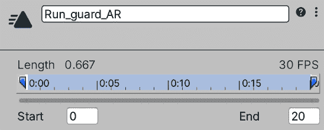

图 17.6：剪辑设置

1.  使用**+**按钮创建一个新的剪辑并选择它。

1.  使用当前显示为类似`Take 001`的输入字段将其重命名为与原始名称类似的内容。在我的情况下，我将将其命名为`Run`。

1.  使用我们在*步骤 2*中需要记住的值设置**结束**和**开始**属性。在我的情况下，我将**结束**设置为`20`，将**开始**设置为`0`。这些信息通常来自制作动画的艺术家，但您可以尝试最适合的数字，或者简单地拖动时间轴顶部的蓝色标记到这些属性上。

1.  如果动画需要循环播放，请勾选**循环时间**复选框以确保这一点。这将使动画不断重复，这在大多数动画如**行走**或**跑步**中是必需的。如果不勾选，动画将只播放一次，不会重复：

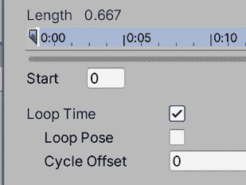

图 17.7：循环动画

1.  通过点击**检查器**窗口底部为您的动画命名的栏（在我的例子中是**跑**），然后点击**播放**按钮来预览片段。在某些情况下，您可以看到默认的 Unity 模型，但您可以通过将模型文件拖动到预览窗口中来查看自己的模型，因为检查我们的模型是否正确配置非常重要。如果动画无法播放，您需要检查**动画类型**设置是否与动画文件匹配：

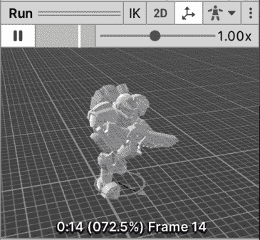

图 17.8：动画预览

1.  通过点击左侧的箭头打开动画资产（FBX），并检查子资产。您会看到与您的动画具有相同名称的资产：

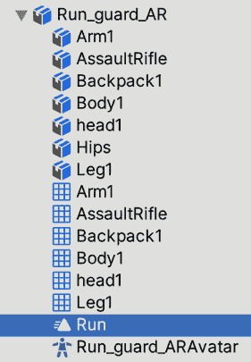

图 17.9：生成的动画片段

1.  请记住，除了**初始帧**、**结束帧**和**循环时间**之外，还有很多其他设置。我下载的角色需要其他设置，如**根变换** **旋转**、**根变换位置**和**遮罩**才能使其工作，不同角色包之间的差异可能很大。如果您正在重新创建现有的动画，请考虑复制所有设置或仅使用默认设置。这些提到的设置超出了本书的范围，但您始终可以在 Unity 文档中查阅它们，网址为 [`docs.unity3d.com/Manual/class-AnimationClip.html`](https://docs.unity3d.com/Manual/class-AnimationClip.html)。

现在我们已经介绍了基本配置，让我们学习如何集成动画。

## 使用动画控制器进行集成

当我们将动画添加到角色时，我们需要考虑动画的流程，这意味着思考哪些动画必须播放，每个动画何时必须处于活动状态，以及动画之间的过渡应该如何发生。在之前的 Unity 版本中，您需要手动编写代码来实现这一点，生成复杂的 C# 代码脚本以处理复杂场景，但现在，我们有**动画控制器**。

动画控制器是基于状态机的资产，我们可以使用名为**动画器**的可视编辑器来绘制动画之间的转换逻辑。想法是每个动画都是一个单独的状态，我们的模型将拥有几个这样的状态。一次只能有一个状态处于活动状态，因此我们需要创建转换来改变它们，这将具有必须满足的条件才能触发转换过程。条件是对要动画化的角色的数据进行比较，例如其速度、是否在射击或蹲下等。

因此，基本上，动画控制器或状态机是一组具有转换规则的动画，它将决定哪个动画应该是活动的。让我们通过以下步骤开始创建一个简单的动画控制器：

1.  在**项目**视图下点击**+**按钮，点击**动画控制器**，并将其命名为`Player`。请记住将你的资产定位在文件夹中以进行适当的组织；我将我的命名为`Animations`。

1.  双击资产以打开**动画器**窗口。不要将此窗口与**动画**窗口混淆；**动画**窗口用于创建新动画，但到目前为止，我们将坚持使用下载的动画。**动画器**窗口负责以可视方式创建和编辑动画状态机，类似于视觉脚本。

1.  在你的角色包的**动画**文件夹中搜索你角色的**空闲**动画片段，并将其拖入**动画器**窗口。在我的例子中，它被命名为**Idle_guard_ar**。请记住拖动子资产，而不是整个文件。这将在动画控制器中创建一个代表动画的框，该框将连接到控制器的入口点，表示该动画将是默认的，因为它是我们首先拖动的。如果你没有**空闲**动画，我鼓励你从资产商店下载一个，也许可以在其他角色的包中搜索。我们需要至少一个**空闲**和一个**行走**/**跑步**动画片段：

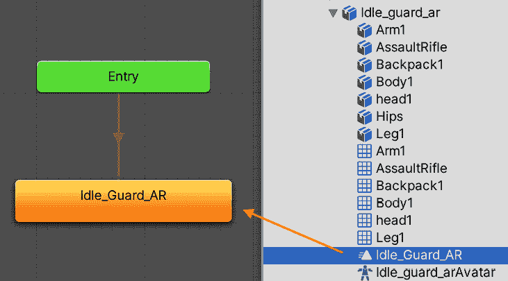

图 17.10：将动画片段从 FBX 资产拖入动画控制器

1.  以相同的方式拖动跑步动画，在我的例子中是**Run_guard_AR**。

1.  在**动画器**窗口中右键单击**空闲**动画框，选择**创建转换**，然后左键单击**跑步**动画。这将创建**空闲**和**跑步**之间的转换。

1.  以相同的方式从**跑步**创建到**空闲**的另一个转换：

图 17.11：两个动画之间的转换

转换必须具有条件，以防止动画不断交换，但为了创建条件，我们需要数据来进行比较。我们将向我们的控制器添加属性，这些属性将代表转换使用的数据。稍后在本章的*脚本动画*部分，我们将设置这些数据以匹配我们对象当前的状态。但到目前为止，让我们创建数据并测试控制器对不同值的反应。为了根据属性创建条件，请执行以下操作：

1.  点击**动画器**窗口左上角的**参数**选项卡。如果您看不到它，点击看起来像被横线穿过眼睛的按钮以显示选项卡。图标将变为未交叉的眼睛。

1.  点击**+**按钮并选择**浮点数**来创建一个将代表我们角色速度的数字，命名为`Velocity`。如果您错过了重命名部分，只需左键单击变量并重命名它：

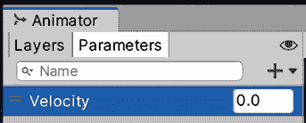

图 17.12：带有浮点速度属性的参数选项卡

1.  点击**怠速到运行**转换（中间带有箭头的白色线条）并查看**检查器**窗口中的**条件**属性。

1.  点击列表底部的**+**按钮，这将创建一个将控制转换的条件。默认设置将取我们动画器的第一个参数（在这种情况下，它是**速度**），并将默认比较器，在这种情况下，**大于**，设置为`0`的值。这告诉我们，如果**怠速**是当前动画且玩家的速度大于`0`，则转换将从**怠速**到**运行**执行。我建议您设置一个略高的值，例如`0.01`，以防止任何浮点舍入错误（一个常见的 CPU 问题）。此外，请记住，**速度**的实际值需要通过脚本手动设置，我们将在本章的*脚本动画*部分进行设置：

图 17.13：检查速度是否大于 0.01 的条件

1.  对**运行到怠速**的转换也做同样的操作，但这次，将**大于**改为**小于**，并将值设置为`0.01`：

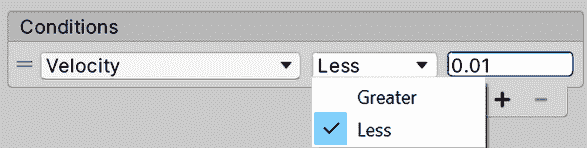

图 17.14：检查值是否小于 0.01 的条件

## 将控制器应用于您的角色

现在我们已经设置了第一个 Animator Controller，是时候将其应用到对象上了。为了做到这一点，我们需要一系列组件。首先，当我们有一个动画角色时，而不是使用常规的 Mesh Renderer，我们使用**皮肤网格渲染器**。如果你选择你的玩家或敌人角色并查看它们的子 GameObject，你将看到它们中的一个或多个有皮肤网格渲染器：

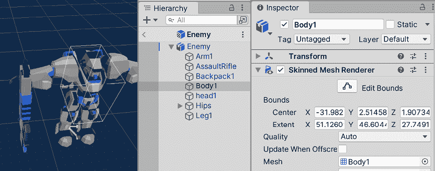

图 17.15：一个皮肤网格渲染器组件

此组件将负责将骨骼的运动应用到网格上。如果你搜索模型的子项，你会找到一些骨骼；你可以尝试旋转、移动和缩放它们以查看效果，如以下屏幕截图所示。

请记住，如果你的骨骼层次结构与我的不同，如果你从 Asset Store 下载了另一个包：

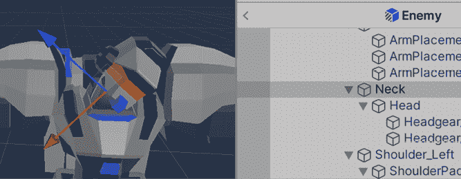

图 17.16：旋转颈骨

我们还需要另一个组件，即**Animator**，它将自动添加到根 GameObject 的皮肤网格中。如果动画 FBX 文件配置正确，如我们之前提到的，该组件将负责应用我们在 Animator Controller 中创建的状态机。为了应用 Animator Controller，请执行以下操作：

1.  在**层次**中选择玩家，并在根 GameObject 中定位**Animator**组件。

1.  点击**控制器**属性右侧的圆圈，并选择我们之前创建的**Player**控制器。你也可以直接从**项目**窗口拖动它。

1.  确保将**Avatar**属性设置为角色 FBX 模型内部的头像（在我们的示例项目中，`Polyart_Mesh`是 FBX 模型）；这将告诉动画师我们将使用那个骨骼。你可以通过以下屏幕截图中显示的人形图标来识别头像资产。通常，当你将 FBX 模型拖动到场景中时，此属性会自动正确设置：

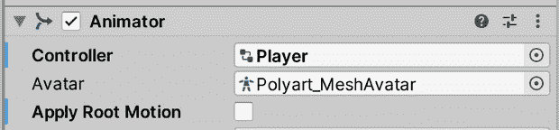

图 17.17：使用玩家控制器和机器人头像的 Animator

1.  在不停止游戏的情况下，通过双击它并选择**层次**面板中的角色，再次打开 Animator Controller 资产。通过这样做，你应该能看到该角色正在播放的动画的当前状态，使用条形图表示动画的当前部分：

图 17.18：选择对象时 Play 模式下的 Animator Controller，显示当前动画及其进度

1.  使用**Animator**窗口，将**速度**的值更改为`1.0`并查看过渡将如何执行。如果你愿意，可以禁用**WaveSpawners**来测试这个，因为它们可能会在我们安全这样做之前杀死玩家：

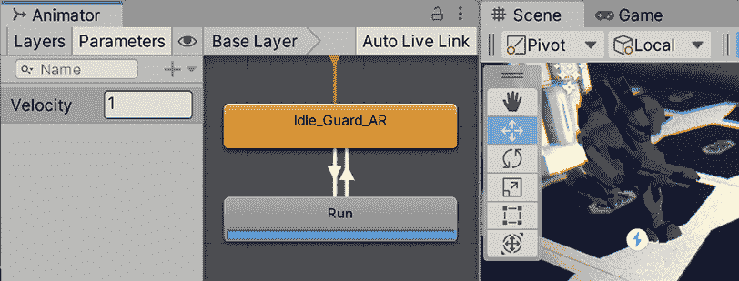

图 17.19：设置控制器的速度以触发过渡

1.  根据如何设置**运行**动画，你的角色可能会开始移动而不是在原地执行动画。这是由根运动引起的，这是一个基于动画运动移动角色的功能。有时，这很有用，但由于我们将完全通过脚本移动我们的角色，我们希望该功能被关闭。你可以通过在**角色**对象的**动画器**组件中取消选中**应用根运动**复选框来实现，如图*图 17.17*所示。

1.  你也会注意到在更改**速度**值和动画过渡开始之间有一个延迟。这是因为默认情况下，Unity 会在执行过渡之前等待原始动画结束，但在这个场景中，我们不想这样。我们需要过渡立即开始。为了做到这一点，选择每个过渡的控制器，并在**检查器**窗口中取消选中**具有退出时间**复选框。当此属性被选中时，过渡执行的一个隐藏条件是等待动画结束。但取消选中后，过渡可以在动画的任何时刻执行，这正是我们想要的，因为我们不希望在玩家空闲和跑步之间有任何延迟：

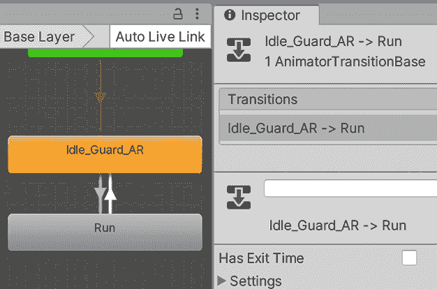

图 17.20：取消选中“具有退出时间”复选框以立即执行过渡

你可以将其他动画拖动到控制器中，并创建复杂的动画逻辑，例如添加跳跃、跌倒或蹲下动画。我邀请你尝试其他参数类型，例如布尔值，它使用复选框而不是数字。此外，随着你游戏的进一步开发，你的控制器可以处理的动画数量将会增加。为了管理这一点，有一些其他值得研究的功能，例如**混合树**和子状态机，但这超出了本书的范围。

在本节中，我们学习了如何通过 Animator Controllers 将动画剪辑集成到我们的角色中。我们添加了所有必要的动画，并创建了它们之间的必要过渡，以应对游戏情况，如角色速度变化。

现在我们已经集成了空闲和跑步动画，让我们集成射击动画，这需要我们使用**Avatar Masks**。

## 使用 Avatar Masks

Unity 提供了一个名为 Avatar Masks 的强大功能，它允许对角色部分进行选择性动画。这个功能在即将探索的复杂场景中特别有用。

起初，这个案例看起来就像拖动射击动画并使用`Shooting`布尔参数作为条件来创建转换那样简单。然而，考虑到我们可以在行走和奔跑时射击，这导致有两个射击动画：**行走射击**和**空闲射击**。如果您遵循这个逻辑，您可以考虑在跌倒、跳跃等情况下射击，这将导致更多的动画组合。想象一下为不同武器拥有不同的射击动画！幸运的是，我们有一个更好的解决方案：使用 Avatar Masks 结合多个动画的方法。在 Unity 中，**Avatar Masks**是允许选择性地对角色身体特定部分进行动画的工具，使得在 Animator Controller 中可以精确控制复杂的动画。

在 Animator Controller 中创建的动画状态机被称为**层**，一个 Animator Controller 可以有多个层。这意味着我们可以在 Animator Controller 中拥有多个状态机。使用这种方法有几个原因，但常见的一个是将层与 Avatar Masks 结合，这是一个允许我们使特定的 Animator Controller 层或状态机影响某些骨骼的资产，因此我们可以为身体的不同部分设置不同的状态机。

我们可以用这个来解决之前讨论的射击场景，将我们的玩家动画逻辑分成两部分：身体的上半部分和下半部分。想法是下半部分将在空闲和奔跑动画之间切换，而上半部分可以在空闲、奔跑和射击之间切换。这允许我们拥有下半部分在奔跑而上半部分在射击，或者下半部分空闲而上半部分也空闲，或者任何我们可以想象到的组合。

让我们从以下步骤开始创建第二个层：

1.  如果您还没有，可以从互联网或 Asset Store 下载射击动画。在我们的例子中，我们已经有几个射击动画，我们将选择名为`Idle_Shoot_ar`的动画。

1.  在 Animator Controller 中，在**基础层**上单击一次，为了组织目的将其重命名为**LowerBody**。如果您看不到层列表，请点击**Animator**窗口右上角的**层**按钮：

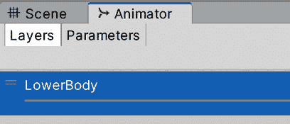

图 17.21：重命名基础层

1.  使用**+**按钮向控制器添加第二个层，并将其重命名为`UpperBody`。这个层将处理上半身的动画。

1.  选择该层，并向其添加**Idle**、**Run**和**Shoot**动画，通过转换连接状态。请记住在每个转换中取消选中**Has Exit Time**。这样，上半身就有与下半身相同的动画，还有射击动画。

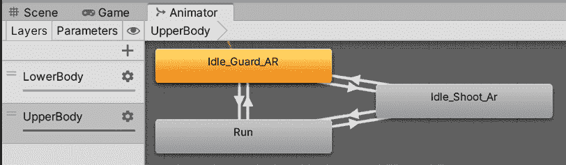

图 17.22：UpperBody 状态机

1.  使用之前在 **Idle** 和 **Run** 之间使用的相同转换逻辑，使用 **Velocity** 作为条件参数，如之前所述。

1.  对于射击转换，创建一个名为 **Shooting** 的布尔参数：

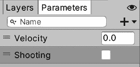

图 17.23：射击布尔值

1.  当 **Shooting** 布尔值为 **true** 时，执行两种射击转换（**Idle** 到 **Shoot** 和 **Run** 到 **Shoot**）。

1.  当 **Shooting** 布尔值为 **false** 且 **Velocity** 小于 `0.01` 时，从 **Shoot** 返回到 **Idle**，当 **Shooting** 为 **true** 且 **Velocity** 大于 `0.01` 时，从 **Shoot** 返回到 **Run**：

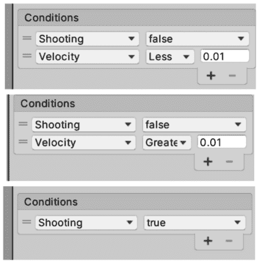

图 17.24：顶部为射击到空闲状态的转换，中间为射击到运行状态的转换，底部为空闲到射击和运行到射击的两种转换

现在我们已经创建了层，让我们将这些 Avatar Masks 应用到它们上：

1.  使用 **Project View** 中的 **+** 按钮创建一个 Avatar Mask，并将其命名为 `UpperBodyMask`。

1.  在 **Inspector** 中选择 `UpperBodyMask` 资产，并点击左侧显示 **Humanoid** 的箭头以展开此部分。

1.  在 **Inspector** 中点击显示的身体下半部分，直到它们变成红色：

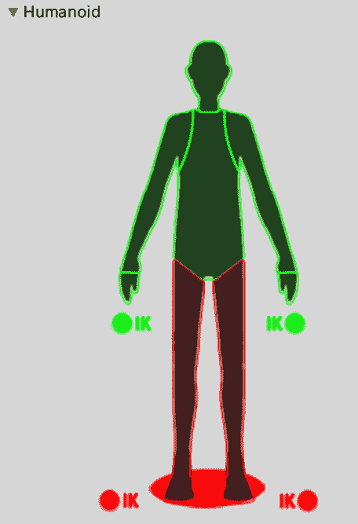

图 17.25：UpperBodyMask 资产配置

1.  在 Animator Controller 中，选择 **UpperBody** 层，并点击其右侧的齿轮图标以显示一些选项。

1.  点击 **Mask** 属性右侧的圆圈，并在出现的窗口中选择 **UpperBodyMask** 资产。

1.  再次点击 **UpperBody** 层的轮子，并将其 **Weight** 设置为 `1`。由于两个层影响身体的不同部分，它们具有相同的优先级。在两个层影响相同骨骼的情况下，权重用于计算哪个层有更大的影响：

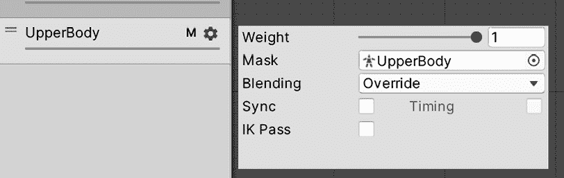

图 17.26：设置层的权重和遮罩

1.  再次点击轮子，观察 **Blending** 参数是否设置为 **Override**，这意味着此层影响的骨骼（由 Avatar Mask 驱动）将覆盖基础层（在这种情况下为 **LowerBody**）的任何动画。这就是此层如何接管身体上半部分的原因。

1.  在 **Play** 模式下测试此操作，同时更改参数的值。例如，尝试勾选 **Shooting**，然后将 **Velocity** 设置为 `1`，然后设置为 `0`，最后取消勾选 **Shooting**，看看转换是如何执行的。

1.  你可能会注意到，当我们的角色射击时，可能不会指向正确的方向。这是因为与**Idle**和**Run**动画相比，角色的方向被修改了，但**Base Layer**仍然拥有这个控制权。我们可以通过点击**Avatar Mask**中**Humanoid**部分的人形图底部的圆圈来让**UpperBodyMask**控制方向，直到它变成绿色：

图 17.27：赋予掩模对玩家方向的权限

这里的问题是，你现在会看到角色在跑步和射击时将脚向侧面移动。除了修改原始动画外，这里没有简单的解决方案。在这种情况下，这个角色有**Idle**、**Idle Shooting**、**Run**和**Run Shooting**动画，所以很明显它是在没有考虑到**Avatar Masks**的情况下创建的，而不是仅仅考虑所有可能的动画组合。一个替代方案是寻找另一个与**Avatar Masks**配合得更好的包。为了学习目的，我们将坚持使用这个方案，但请注意，**Avatar Masks**不是必需的；你可能只需要使用单个 Animator Controller 状态机中的所有可能的动画排列，并添加所有需要的转换，就可以很好地进行。

当**Shoot**动画正在播放时，你可能会注意到另一个问题是，炮口效果将保持在武器的原始位置。由于武器网格受到皮肤动画的影响，但不受其**Transform**位置的影响，炮口无法跟随它。为了解决这个问题，你可以将**Muzzle Effect**重新分配到武器的一个骨骼上——在这个例子中，是**Hips** GameObject 的一个子对象**Trigger_Right**。并非所有动画都会有武器的骨骼，所以这是你可能会遇到的可能场景之一：

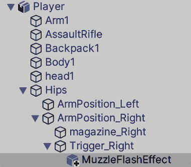

图 17.28：将炮口效果重新分配到武器的一个骨骼上

记得将我们对玩家所做的相同更改应用到敌人身上，这意味着向敌人的**Animator**组件添加并设置 Player Animator Controller，并更改`Muzzle effect`的父级。

现在我们已经设置了 Animator Controller 并使用 Avatar Masks，下一步是通过脚本将这些动画在我们的游戏环境中激活。

# 脚本动画

脚本编写对于将我们的动画与游戏玩法同步至关重要。在这里，我们将编写脚本，使我们的动画能够动态地响应玩家动作，使我们的游戏更加沉浸和响应。

当我们的玩家 Animator Controller 准备就绪时，是时候进行一些脚本编写，使这些参数受到玩家实际行为的影响，并与玩家的行为相匹配。在本节中，我们将执行以下操作以实现这一点：

+   脚本射击动画

+   脚本移动动画

让我们开始制作我们的角色在必要时执行**射击**动画。

## 编写玩家射击动画脚本

到目前为止，我们已经创建了一个每次按下键时射击的行为，但动画是为持续开火准备的。我们可以让我们的`PlayerShooting`脚本在保持**开火**键按下时，每 X 秒发射一颗子弹，以匹配动画，而不是需要反复按下键。

通过添加一个`fireRate`变量，我们控制射击速度，确保它与我们的动画时间同步。让我们看看如何做到这一点：

1.  在**PlayerShooting**脚本中，添加一个名为`fireRate`的公共 float 字段，它将测量子弹生成的秒数。请记住在玩家的**检查器**中设置此值。

1.  将**OnFire**方法更改为*图 17.29*中看到的代码。我们的想法是在我们按下键时启动重复动作，在我们释放键时停止它。我们正在使用**InvokeRepeating**来重复执行一个名为**Shoot**的函数，我们将在下一步创建它。执行速率将由我们在*步骤 1*中创建的**fireRate**字段控制：

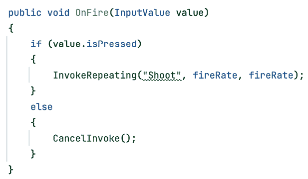

图 17.29：持续开火所需的 OnFire 更改

1.  将*图 17.30*中看到的**Shoot**方法添加到我们的**PlayerShooting**脚本中。这基本上是我们之前在**OnFire**方法中拥有的相同代码，但现在被分离成一个函数，这样我们就可以通过**InvokeRepeating**函数多次执行它：

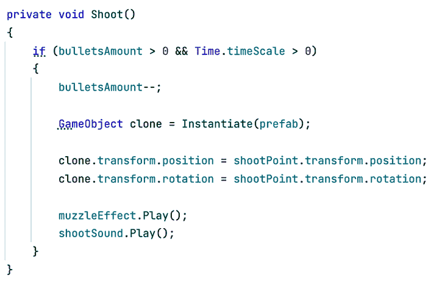

图 17.30：持续开火所需的 OnFire 更改

如果你现在尝试这些更改，你会注意到一旦我们点击**开火**按钮，子弹将永远不会停止发射。更糟糕的是，随着我们不断按下，发射的子弹会越来越多。通过一些调试或合理的猜测，你可能发现**CancelInvoke**方法没有被执行。背后的原因是**Fire**输入映射默认没有配置来通知我们关于键的释放，而是在它们被按下时。幸运的是，解决方案相当简单：

1.  双击**SuperShooter**输入资产，这是我们*第六章*中创建的，它包含我们游戏支持的所有输入。

1.  在**动作**列表（中间列）中选择**开火**动作。

1.  点击**交互**部分右侧的**+**按钮，然后点击**按下**。

1.  将**按下**部分的**触发行为**设置为**按下并释放**：

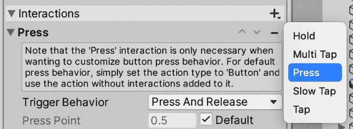

图 17.31：持续开火所需的 OnFire 更改

1.  通过这种方式，我们已经配置了输入，不仅告诉我们何时按下键，还告诉我们何时释放键，使得我们的**CancelInvoke**方法现在执行。

现在我们有了持续开火的行为，我们可以做以下操作来使动画反映这一点：

1.  在**Awake**中使用**GetComponent**添加对`Animator`的引用，并将其缓存在一个字段中，如图 17.32 所示：

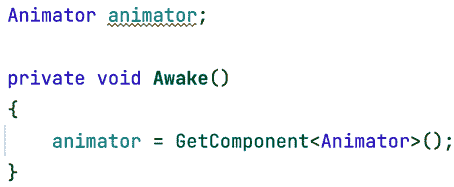

图 17.32：缓存 Animator 引用

1.  在**OnFire**方法的开头添加行`animator.SetBool(“Shooting”, value.isPressed);`：

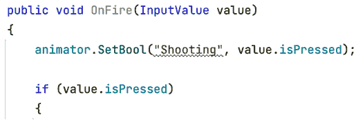

图 17.33：设置射击动画参数以反映输入

1.  这种更改背后的想法是确保**Shooting**动画参数反映了火键的状态，这意味着只要按下**Fire**按钮，就会播放**Shoot**动画，当我们释放它时，动画会停止。

你会注意到，子弹仍然是从玩家的胸部发射出来的，因为我们定义射击位置的**ShootPoint**GameObject 没有位于武器的前面。只需将**ShootPoint**重新设置为武器的骨骼（在我们的例子中是**Trigger_Right**）并将其定位在武器前面。记住，让前向向量（**Scene**视图中蓝色的箭头）沿着武器方向：

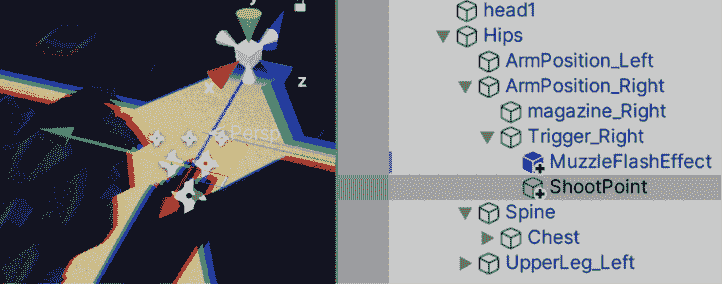

图 17.34：使 ShootPoint 跟随动画

对于视觉脚本版本，为了使子弹能够持续发射，你应该像*图 17.35*中那样更改**PlayerShooting**的**Input**节点：

图 17.35：创建射击循环

如你所见，我们使用了一个新的节点叫做**Timer**。**Timer**的想法与之前我们使用的**Wait For Seconds**节点类似，因为它允许我们延迟执行一个动作。主要区别在于它允许我们在再次执行之前取消定时器，这意味着我们可以在按下**Fire**键时启动定时器，并在释放它时停止。我们通过将具有**OnPressed**模式的**InputSystemEventButton**节点连接到**Timer**的**Start**引脚，将具有**OnReleased**模式的节点连接到**Pause**引脚来实现这一点。我们还创建了一个名为**fireRate**的新变量，并将其连接到**Timer**的**Duration**引脚，因此我们需要指定定时器在实例化子弹之前将等待多长时间。看看我们是如何将**Timer**的**Completed**引脚连接到检查我们是否有足够子弹实例化的**If**节点的；我们之前在这里连接到输入节点。

这里有一点小细节需要注意，当我们按下键时，时间会过去（**fireRate**），然后实例化一颗子弹，但之后就没有其他动作了。我们需要再次将**Bullet**射击序列的末尾（在这种情况下是**AudioSource: Play**节点）连接到**Timer**的**Start**引脚，以创建一个生成循环。当我们释放键时，这个循环会被中断，以防止它无限执行：

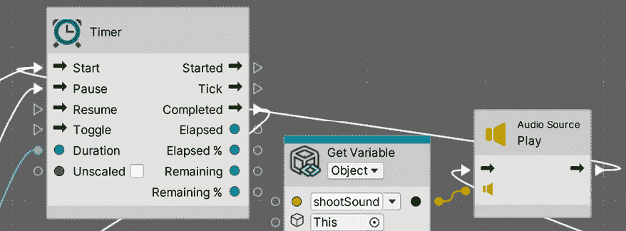

图 17.36：完成射击循环

最后，我们需要向输入节点添加适当的`Animator: SetBool(Name, Value)`节点来打开和关闭布尔值并触发动画：

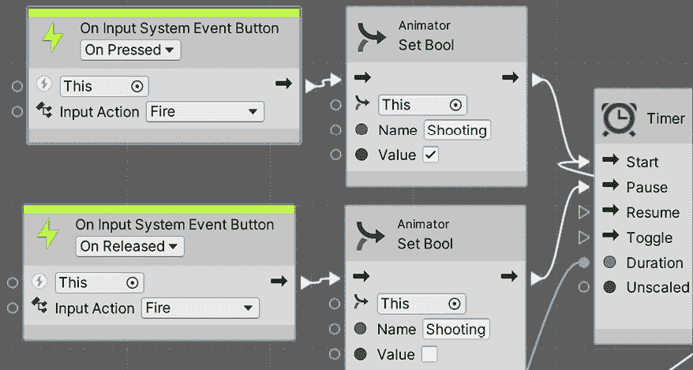

图 17.37：执行射击动画

现在我们已经配置了玩家的射击动画，让我们应用类似的原则来脚本化敌人的动画，以保持游戏机制的一致性：

1.  使用**GetComponentInParent**在**EnemyFSM**脚本中缓存父动画器的引用，就像我们处理**NavMeshAgent**时做的那样：

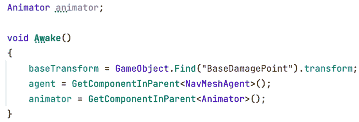

图 17.38：访问父的 Animator 引用

1.  在**Shoot**函数内部打开**Shooting**动画器参数，以确保每次射击时该参数都设置为**true**（已检查）：

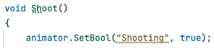

图 17.39：打开射击动画

1.  在所有非射击状态中关闭`Shooting`参数，例如**GoToBase**和**ChasePlayer**：

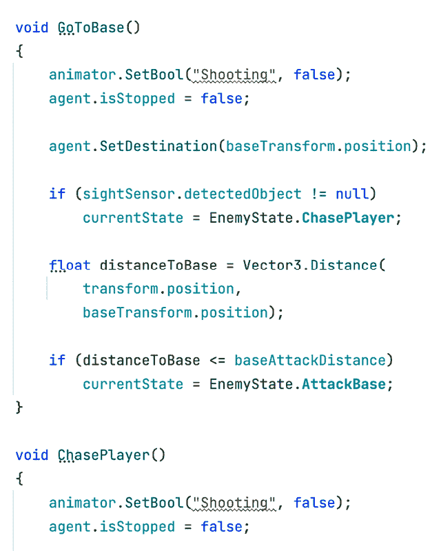

图 17.40：关闭射击动画

1.  关于视觉脚本版本，**EnemyFSM**中的**GoToBase**状态将如下所示：

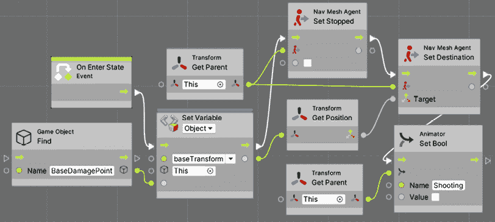

图 17.41：GoToBase 状态

1.  注意，我们再次需要使用**GetParent**节点来访问敌人的父**Transform**（即**根**），我们将它与**Animator: SetBool**节点连接，以便访问敌人根中的 Animator。然后，**ChasePlayer**状态的动作将如下所示：

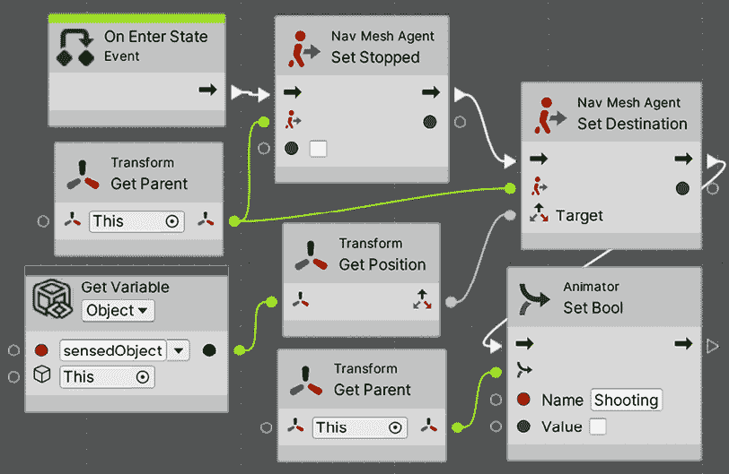

图 17.42：ChasePlayer 状态

1.  然后，**AttackBase**和**AttackPlayer**初始动作将如下所示：

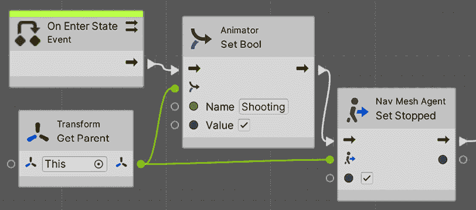

图 17.43：AttackBase 状态

这样，我们的玩家和敌人都有恒定的射击行为和**Shoot**动画来反映这一点。现在，让我们处理两者的移动动画。

## 脚本化移动动画

脚本化移动动画是将游戏角色的物理运动转换为视觉动画的关键。让我们看看我们如何动态调整游戏中的角色速度。

对于 Animator Controller 的`Velocity`参数，我们可以检测 Rigidbody 的速度向量的幅度，即每秒米的速度，并将其设置为当前值。将此脚本分离出来增强了模块化，并允许在不同游戏场景中更容易地重用。

因此，我们需要创建一个如图所示的脚本，该脚本仅将`Rigidbody`组件的速度与动画器的`Velocity`参数连接，并将其添加到 Player GameObject 中：

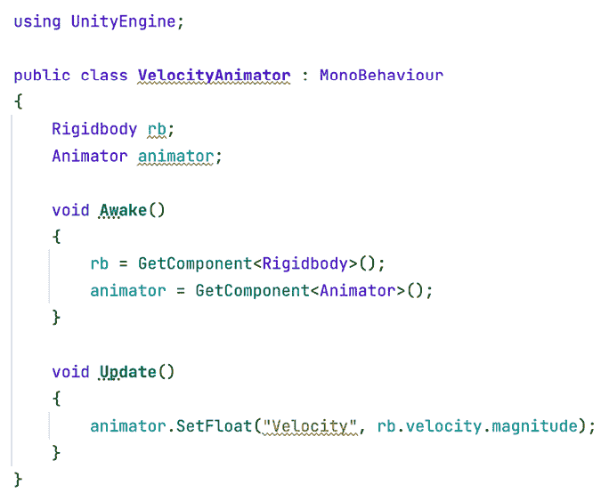

图 17.44：设置 VelocityAnimator 变量

关于视觉脚本版本，它看起来是这样的：

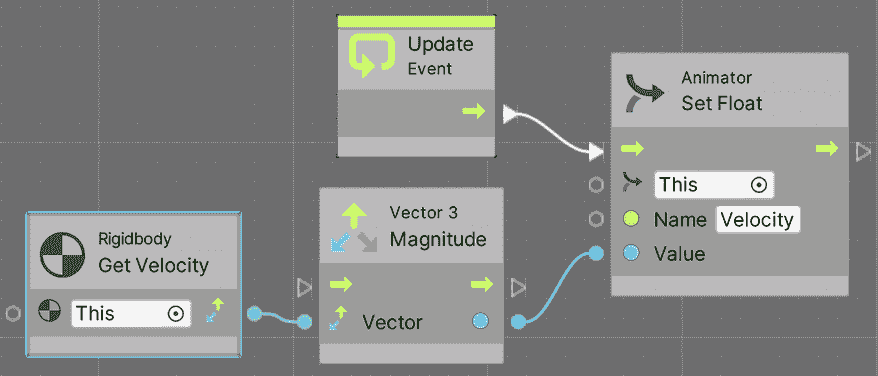

图 17.45：在视觉脚本中设置速度动画器变量

你可能需要增加 Animator Controller 过渡条件中迄今为止使用的`0.01`过渡阈值，因为**Rigidbody**在释放按键后仍然会继续移动。对我来说，使用`1`效果完美。另一个选择是增加玩家的阻力和速度，使角色更快地停止。选择对你来说效果最好的方法。记住两个层（**UpperBody**和**LowerBody**）的过渡。

现在，我们可以为敌人添加移动动画。为敌人预制体创建并添加一个名为**NavMeshAnimator**的脚本，该脚本将获取其**NavMeshAgent**的当前速度并将其设置为 Animator Controller。这将与**VelocityAnimator**脚本类似工作，但这次是检查**NavMeshAgent**的速度。我们没有使用**VelocityAnimator**，因为我们的 AI 不使用**Rigidbody**来移动，所以它不会工作：

图 17.46：将 NavMeshAgent 连接到我们的 Animator Controller

视觉脚本版本将看起来像这样：

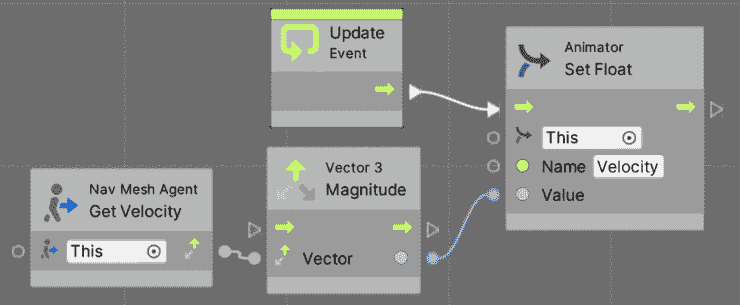

图 17.47：将动画器的速度参数设置为与我们的 NavMeshAgent 相同

注意，由于这个图位于敌人的根对象旁边，与**Animator**和**NavMeshAgent**一起，所以我们这里不需要`GetParent`节点。有了这个，我们就已经编写了玩家的动画和敌人的动画脚本。

有时，动画剪辑不足以创建一个可信的动画，因为它们是预定义的，并且不能适应玩家的环境。一个例子是玩家站在楼梯上，玩家的脚应该放在不同的高度，但空闲动画可能是为站在平地上设计的。虽然你可以尝试混合不同高度的脚的动画，但这很难管理。相反，你可以将静态动画（常规动画包）与过程动画混合，这些动画通过脚本修改角色绑定。你可以使用以下 Unity 包实现这一点：`docs.unity3d.com/Packages/com.unity.animation.rigging@1.0/manual/index.html`。

现在，我们准备好继续学习使用 Cinemachine 创建场景相机和更多动画知识。

# 使用 Cinemachine 创建动态相机

相机在视频游戏中是一个非常重要的主题。它们允许玩家看到他们的周围环境并根据他们所看到的内容做出决策。游戏设计师通常定义它们的行为以获得他们想要的精确游戏体验，这并不容易。必须分层很多行为才能获得精确的感觉。此外，对于场景镜头，控制相机将要穿越的路径以及相机在那些不断移动的场景中聚焦于何处以集中动作也非常重要。

Cinemachine 是 Unity 的高级相机控制套件，使开发者能够制作出动态和响应式的相机行为，从而增强游戏体验。在本章中，我们将使用`Cinemachine`包来创建动态相机，这些相机将跟随玩家的移动，我们将在第三部分*提升视觉效果、效果和音频*中编码，以及用于场景镜头的相机。

在本节中，我们将探讨以下 Cinemachine 概念：

+   创建相机行为

+   创建轨道推车

让我们先来讨论如何创建一个由 Cinemachine 控制的相机并配置其中的行为。

## 创建相机行为

Cinemachine 通过提供一系列灵活直观的行为，彻底革新了相机控制，显著简化了在视频游戏中常见的复杂相机设置。

Cinemachine 是一个 Unity 包，包含了一系列可用于相机的不同行为，当正确组合时，可以生成视频游戏中所有种类的常见相机类型，包括从背后跟随玩家、第一人称相机、俯视相机等等。为了使用这些行为，我们需要了解大脑和虚拟相机的概念。

在 Cinemachine 中，我们将只保留一个主相机，就像我们迄今为止所做的那样，而这个相机将由具有上述行为的 GameObject 控制的虚拟相机来控制。我们可以有多个虚拟相机，并且可以随意在它们之间切换，但活动的虚拟相机将是唯一一个将控制我们的主相机。这在游戏的不同阶段切换相机非常有用，例如在玩家的第三人称相机和场景镜头之间切换。为了用虚拟相机控制主相机，它必须有一个**Brain**组件，该组件将监控所有活动的虚拟相机并选择合适的位姿来使用它们。

要开始使用 Cinemachine，首先，我们需要检查它是否已安装在包管理器中，就像我们之前安装其他包时那样。如果您不记得如何操作，只需按照以下步骤进行：

1.  前往**Window** | **Package Manager**。

1.  确保窗口左上角的**Packages**选项设置为**Unity Registry**：

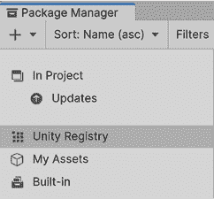

图 17.48：包过滤器模式

1.  稍等片刻，让左侧面板从服务器填充所有包（需要互联网连接）。

1.  从列表中查找 **Cinemachine** 包并选择它。在撰写本书时，最新可用的版本是 2.9.7，但如果你更喜欢，可以使用更新的版本，始终确保以下步骤按预期工作；如果不按预期工作，你始终可以安装与我们最接近的版本。

1.  如果你看到屏幕右下角的 **安装** 按钮，这意味着它尚未安装。只需点击该按钮。

现在我们已经安装了它，我们可以开始创建一个虚拟相机来跟随玩家。到目前为止，我们只是简单地将相机连接到玩家，使其跟随他们，但现在我们将取消连接相机，让 Cinemachine 处理它，以便学习如何使用这个工具：

1.  在玩家内部选择 **MainCamera** 并将其取消连接（将其拖出玩家），使其成为我们场景的根对象，没有任何父对象。

1.  点击 **游戏对象 | Cinemachine | 虚拟相机**。这将创建一个名为 `CM vcam1` 的新对象：

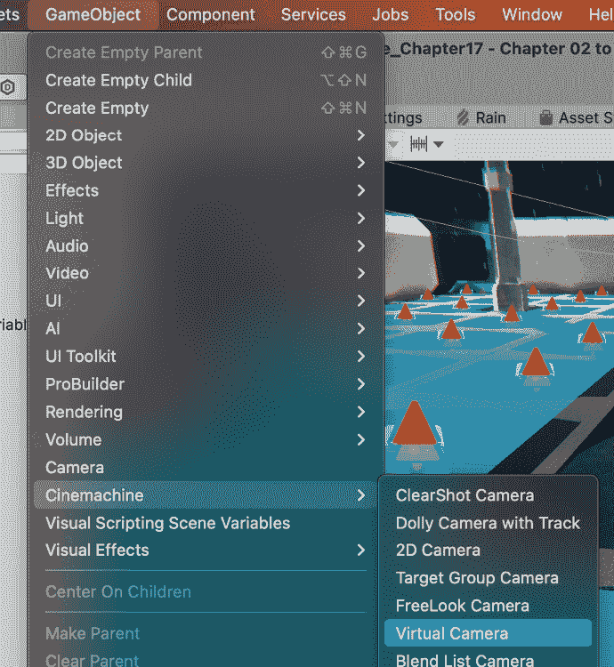

图 17.49：虚拟相机创建

1.  如果你从 **层次结构** 窗格中选择 **MainCamera**，你也会注意到一个 `CinemachineBrain` 组件已经被自动添加到它上面，使我们的主相机跟随虚拟相机。尝试移动创建的虚拟相机，你会看到主相机是如何跟随它的：

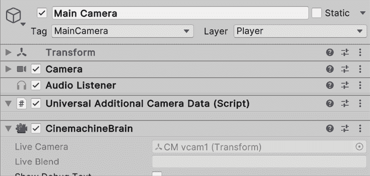

图 17.50：CinemachineBrain 组件

1.  选择虚拟相机 (`CM vcam1`) 并将其拖动到 **CinemachineVirtualCamera** 组件的 **跟随** 和 **注视** 属性。这将使移动和注视行为使用该对象来完成它们的工作：

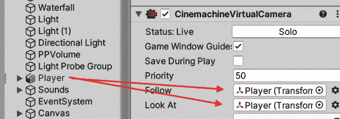

图 17.51：设置我们相机的目标

1.  你可以看到虚拟相机的 **Body** 属性被设置为 **Transposer**，这将使相机相对于在 **跟随** 属性中设置的目标移动——在我们的案例中，是角色。你可以打开 **Body** 选项（左侧的箭头），更改 **跟随偏移** 属性，并将其设置为相机与目标之间的所需距离。在我的案例中，我使用了 `0`、`3` 和 `-3` 的值：

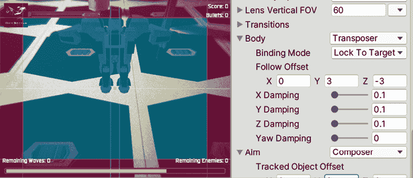

图 17.52：相机从背后跟随角色

1.  *图 17.52* 展示了 **游戏** 视图；你可以看到一个小的、黄色的矩形，它指示了观察角色的目标位置，目前它指向角色的支点——其脚部。如果你看不到它，请通过点击其左侧的箭头在 **检查器** 中打开虚拟相机的 **瞄准** 部分。

1.  我们可以在虚拟相机 **瞄准** 部分的 **跟踪对象偏移** 属性中应用一个偏移。在我的情况下，`0`、`1.8` 和 `0` 的值工作得很好，使相机看向头部：

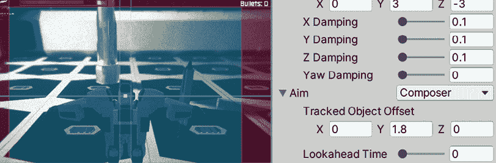

图 17.53：更改瞄准偏移

如你所见，使用 Cinemachine 非常简单，在我们的情况下，默认设置大多数情况下已经足够满足我们所需的行为。然而，如果你探索其他 **Body** 和 **Aim** 模式，你会发现你可以为任何类型的游戏创建任何类型的摄像机。

我们不会在本书中介绍其他模式，但我强烈建议你查看 Cinemachine 的文档，以了解其他模式的功能。要打开文档，请按照以下步骤操作：

1.  通过转到 **Window** | **Package Manager** 来打开包管理器。

1.  在左侧列表中找到 **Cinemachine**。如果它没有显示，请稍等片刻。请记住，你需要一个互联网连接才能使其工作。

1.  一旦选择了 Cinemachine，在右侧面板中向下滚动，直到你看到蓝色的 **Documentation** 链接。点击它：

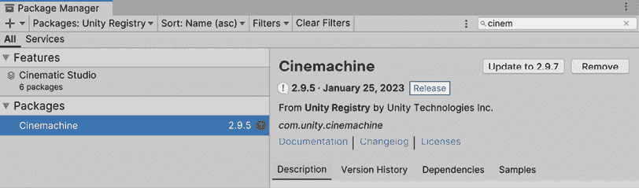

图 17.54：Cinemachine 文档链接

1.  你可以使用左侧的导航菜单来探索文档：

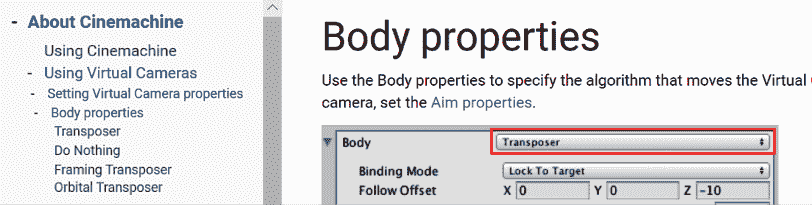

图 17.55：Cinemachine 文档

就像使用 Cinemachine 一样，你可以以相同的方式找到其他包的文档。现在我们已经实现了所需的相机基本行为，让我们探索如何使用 Cinemachine 为我们的开场剪辑创建一个摄像机。

## 创建摇臂轨道

当玩家开始关卡时，我们希望在进入战斗前有一个小型的场景切换，将镜头从我们的场景和基地上扫过。这需要摄像机沿着固定路径移动，这正是 Cinemachine 的摇臂摄像机所做到的。它创建了一条路径，我们可以在这里附加一个虚拟摄像机，使其跟随路径。我们可以设置 Cinemachine 自动通过轨道或跟随目标到轨道的最近点；在我们的情况下，我们将使用第一种选项。

为了创建一个摇臂摄像机，请按照以下步骤操作：

1.  让我们从用一辆手推车开始创建轨道，这辆手推车是一个沿着轨道移动的小物体，它将成为跟随摄像机的目标。为此，点击 **GameObject | Cinemachine | 带手推车的摇臂轨道**：

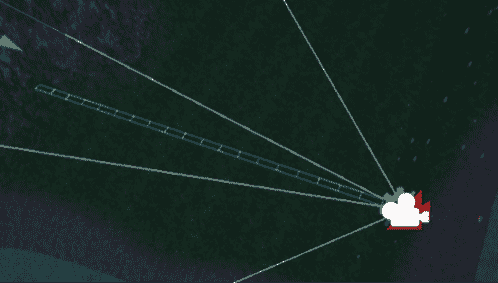

图 17.56：一个默认直线路径的摇臂摄像机

1.  如果你选择 `DollyTrack1` 对象，你可以在 **Scene** 视图中看到两个带有数字 `0` 和 `1` 的圆圈。这些是轨道的控制点。选择其中一个，并使用平移工具的箭头将其移动，就像移动其他对象一样。如果你看不到它们，请按 *W* 键启用 **Translation** 工具。

1.  你可以通过点击 **DollyTrack1** 对象的 `CinemachineSmoothPath` 组件的 **Waypoints** 列表底部的 **+** 按钮来创建更多的控制点：

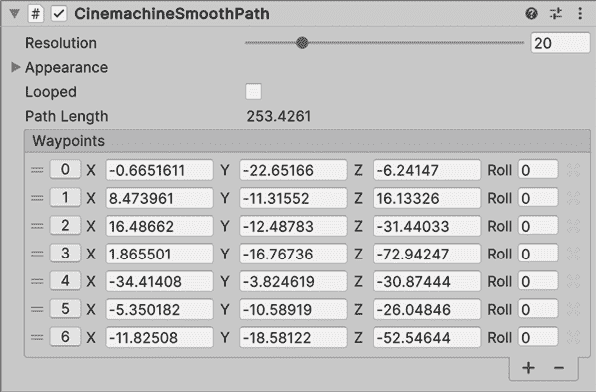

图 17.57：添加路径控制点

1.  创建所需数量的航点，以创建一个路径，该路径将穿越你希望在开场剪辑中摄像机监督的区域。记住，你可以通过点击它们并使用平移工具来移动航点：

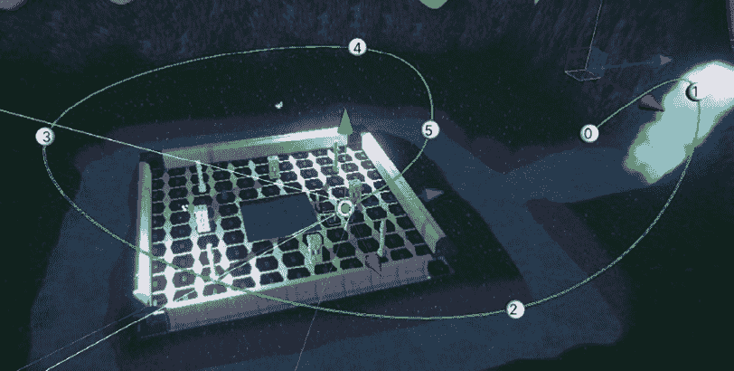

图 17.58：场景中的推车轨道。它正好在角色后面结束

1.  创建一个新的虚拟相机。创建后，如果你转到**游戏**视图，你会注意到角色相机将是激活的。为了测试新相机的效果，选择之前的相机（**CM vcam1**），并通过点击**检查器**中 GameObject 名称左侧的复选框暂时禁用它。

1.  这次将**跟随**目标设置为之前用轨道创建的`DollyCart1`对象。

1.  将**身体**部分的**跟随偏移**设置为`0`，`0`和`0`，以保持相机与卡车的相同位置。

1.  将**目标**设置为**与跟随目标相同**，使相机朝与卡车相同的方向看，这将跟随轨道的曲线：

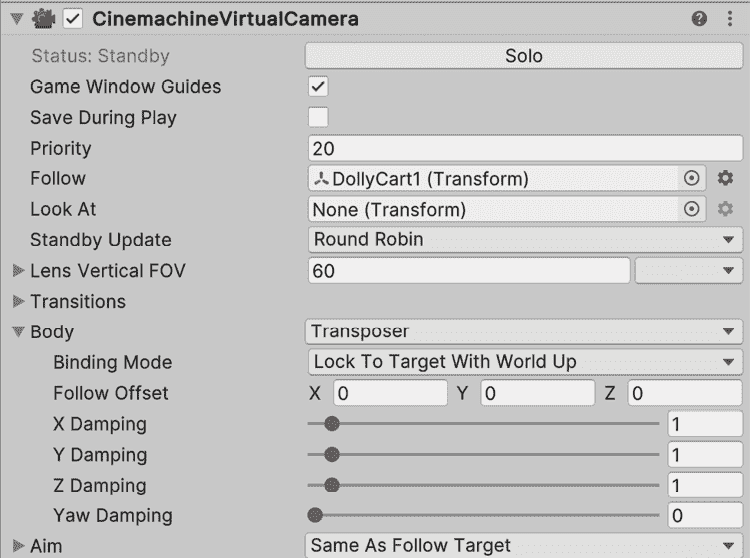

图 17.59：配置虚拟相机跟随推车轨道

1.  选择**DollyCart1**对象，并更改**位置**值以查看卡车如何沿着轨道移动。在游戏窗口聚焦且**CM vcam2**处于独奏模式时进行此操作，以查看相机的效果：

图 17.60：推车组件

1.  重新启用`CM vcam1`。

在推车轨道设置正确后，我们可以使用**时间轴**来创建我们的场景，并对其进行序列化。

# 使用时间轴创建场景

我们已经有了开场相机，但这还不足以创建场景。一个合适的场景是一个动作序列，这些动作将在它们应该发生的确切时刻发生，协调多个对象按预期行事。我们可以有启用和禁用对象、切换相机、播放声音、移动对象等动作。为此，Unity 提供了**时间轴**，这是一个动作序列器，用于协调这类场景。我们将使用**时间轴**为我们的场景创建一个开场场景，显示游戏开始之前的水准。

在本节中，我们将探讨以下时间轴概念：

+   创建动画剪辑

+   排序我们的开场场景

我们将看到如何在 Unity 中创建自己的动画剪辑来动画化我们的 GameObject，然后将它们放置在场景中，并使用时间轴序列器工具协调它们的激活。让我们先创建一个用于稍后时间轴的相机动画。

## 创建动画剪辑

这实际上不是一个时间轴特有的功能，而是一个 Unity 功能，它与时间轴配合得很好。当我们下载角色时，它附带了一些使用外部软件创建的动画剪辑，但你可以使用 Unity 的**动画**窗口创建自定义动画剪辑。不要将其与**动画控制器**窗口混淆，后者允许我们创建对游戏情况做出反应的动画过渡。这有助于创建小对象特定的动画，你将在稍后使用时间轴与其他对象的动画进行协调。

这些动画可以控制对象组件属性的任何值，例如位置、颜色等。在我们的例子中，我们想要动画化轨道的**位置**属性，使其在给定时间内从起点到终点移动。为了做到这一点，请执行以下操作：

1.  选择`DollyCart1`对象。

1.  通过转到**窗口 | 动画 | 动画**打开**动画**（不是**动画器**）窗口。

1.  点击**动画**窗口中央的**创建**按钮。记住，在选择了购物车（不是轨道）时执行此操作：

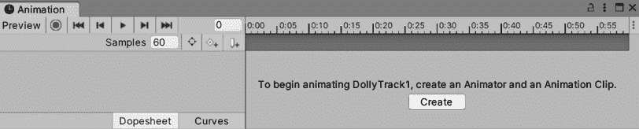

图 17.61：创建自定义动画剪辑

1.  执行此操作后，你将被提示将动画剪辑保存到某个位置。我建议你在项目（`Assets`文件夹内）中创建一个`Animations`文件夹，并将其命名为`IntroDollyTrack`。

如果你注意的话，购物车现在有一个**动画器**组件和一个创建的动画控制器，其中包含我们刚刚创建的动画。与任何动画剪辑一样，你需要使用动画控制器将它们应用到你的对象上；自定义动画也不例外。所以，**动画**窗口为你创建了它们。

在此窗口中动画化包括指定其属性在给定时刻的值。在我们的例子中，我们希望**位置**在动画开始时，即时间轴上的 0 秒，值为`0`，在动画结束时，即 5 秒，值为`254`。我选择`254`是因为那是我的购物车中可能达到的最后一个位置，但这取决于你的轨道长度。只需测试一下你的最后一个可能的位置是什么。此外，我选择`5`秒，因为这是我认为动画的正确长度，但你可以随意更改它。现在，动画的 0 到 5 秒之间发生的事情是`0`和`254`值之间的插值，这意味着在 2.5 秒时，`位置`的值将是`127`。动画始终包括在不同时刻插值我们对象的不同状态。

为了做到这一点，请按照以下步骤操作：

1.  在**动画**窗口中，点击记录按钮（左上角的红色圆圈）。这将使 Unity 检测我们对象中的任何变化并将它们保存到动画中。记住，在选择了购物车时执行此操作。

1.  将购物车的**位置**设置设置为`1`然后`0`。将此值更改为任何值然后再次设置为`0`将创建一个关键帧，这是一个动画中的点，表示在`0`秒时，我们希望**位置**值为`0`。如果值已经为`0`，我们需要首先将其设置为任何其他值。

    你会注意到**位置**属性已经被添加到动画中：

    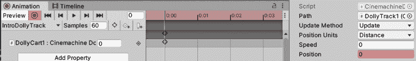

    图 17.62：将位置值更改为 0 后的记录模式动画

1.  使用鼠标滚轮，将**动画**窗口右侧的时间轴缩放到可以看到顶部栏中的**5:00**秒：

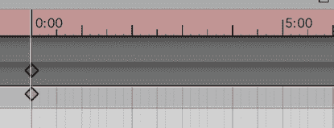

图 17.63：动画窗口的时间轴显示 5 秒

1.  点击时间轴顶部栏中的**5:00**秒标签，将播放头定位到那一刻。这将定位我们那一刻所做的下一个更改。

1.  将推车轨道的**位置**值设置为可以得到的最高值；在我的情况下，这是`240`。记得将**动画**窗口设置为**记录**模式：

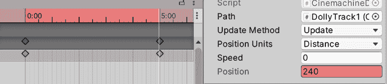

图 17.64：在动画 5 秒时创建具有 240 值的帧

1.  在**动画**窗口的左上角点击播放按钮以查看动画播放。记得在`CM vcam1`禁用的情况下在**游戏**视图中查看。

有时候，你需要将游戏代码与动画同步。一个经典的例子是攻击动画，你希望玩家在剑触地时对被攻击对象造成伤害，而不是动画开始时。为此，你可以使用动画事件：[`docs.unity3d.com/Manual/script-AnimationWindowEvent.html`](https://docs.unity3d.com/Manual/script-AnimationWindowEvent.html)。你还可以将动画事件添加到导入的动画中：[`docs.unity3d.com/Manual/class-AnimationClip.html`](https://docs.unity3d.com/Manual/class-AnimationClip.html)。

现在，如果我们点击**播放**，动画将开始播放，但这不是我们想要的。在这种情况下，我们的想法是将场景控制权交给场景系统、时间轴，因为我们的动画不会是场景中唯一需要排序的东西。防止**动画器**组件自动播放我们创建的动画的一种方法是在控制器中创建一个空动画状态，并按照以下步骤将其设置为默认状态：

1.  搜索我们与动画同时创建的动画器控制器并打开它。如果您找不到，只需选择推车并双击我们 GameObject 上的**动画器**组件的**控制器**属性以打开资产。

1.  在控制器中右键点击一个空状态，然后选择**创建状态** | **空**。这将像创建一个新的动画一样在状态机中创建一个新的状态，但这次它是空的：

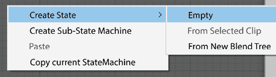

图 17.65：在动画器控制器中创建空状态

1.  右键点击**新建状态**并点击**设置为层默认状态**。状态应该变成橙色：

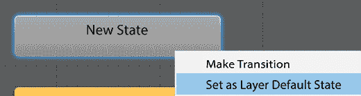

图 17.66：将控制器的默认动画更改为空状态

1.  现在，如果你点击**播放**，由于我们的推车默认状态为空，将不会播放任何动画。在这种情况下不需要任何过渡。

现在我们已经创建了我们的相机动画，让我们开始创建一个场景，通过使用时间轴，从开场场景相机切换到玩家相机。

## 编排我们的开场场景

时间轴已经安装到您的项目中，但如果您进入时间轴的包管理器，您可能会看到一个**更新**按钮，如果您需要一些新功能，可以获取最新版本。在我们的例子中，我们将保持项目中包含的默认版本（1.5.2，本书编写时）。

我们首先要做的是创建一个场景资产和一个负责播放它的场景中的对象。为此，请按照以下步骤操作：

1.  使用**GameObject** | **创建空对象**选项创建一个空 GameObject。

1.  选择空对象并将其命名为`导演`。

1.  前往**窗口** | **编排** | **时间轴**以打开时间轴编辑器。

1.  当选择**导演**对象时，点击**时间轴**窗口中间的**创建**按钮，将该对象转换为场景播放器（或导演）。

1.  完成此操作后，将弹出一个窗口要求您保存文件。此文件将是场景或时间轴；每个场景都将保存在其自己的文件中。将其保存在您项目中的`Cutscenes`文件夹（`Assets`文件夹）中。

1.  现在，您可以看到导演对象有一个**可播放导演**组件，其中保存了上一步中设置的**开场**场景资产作为**可播放**属性，这意味着这个场景将由导演播放：

图 17.67：准备播放开场时间轴资产的**可播放导演**

现在我们有了可以工作的时间轴资产，让我们来编排动作。首先，我们需要编排两件事——首先，我们在上一步中做的购物车位置动画，然后是摇臂轨道相机（`CM vcam2`）和玩家相机（`CM vcam1`）之间的相机交换。正如我们之前所说的，场景是一个在给定时刻执行的动作序列，为了安排动作，你需要轨道。在时间轴中，我们有不同种类的轨道，每一种都允许你在某些对象上执行某些动作。我们将从动画轨道开始。

动画轨道将控制特定对象将播放哪个动画；我们需要为每个对象创建一个轨道来动画化。在我们的例子中，我们想要摇臂轨道播放我们创建的**开场**动画，所以让我们按照以下步骤操作：

1.  通过点击**加号按钮 (+**) 然后选择**动画轨道**来添加一个动画轨道：

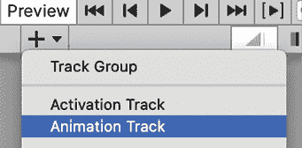

图 17.68：创建动画轨道

1.  在**检查器**窗口中，选择**导演**对象并检查**可播放导演**组件的**绑定**列表。

1.  将**购物车**对象拖动以指定我们想要动画轨道控制其动画：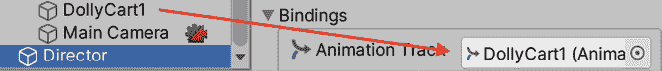

    图 17.69：在这个导演中使动画轨道控制摇臂购物车动画

    时间轴是一个通用资产，可以应用于任何场景，但由于轨道控制特定的对象，您需要在每个场景中手动绑定它们。在我们的例子中，我们有一个期望控制单个动画器的动画轨道，因此在每个场景中，如果我们想应用这个剪辑场景，我们需要将特定的动画器拖动到**绑定**列表中，以控制它。

1.  将我们创建的**Intro**动画资产拖动到**时间轴**窗口中的动画轨道。这将在轨道中创建一个剪辑，显示动画何时以及持续多长时间播放。您可以尽可能多地拖动动画到轨道中，以便在不同的时刻序列不同的动画，但此时我们只想添加一个：

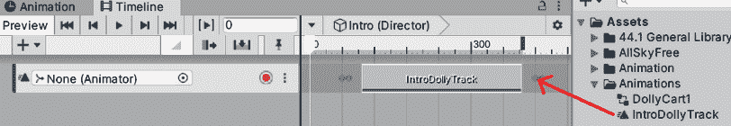

图 17.70：使动画器轨道播放开场剪辑

1.  您可以拖动动画以更改它播放的确切时刻。将其拖动到轨道的开始位置。

1.  在**时间轴**窗口的右上角点击**播放**按钮，以查看其效果。您还可以手动在**时间轴**窗口中拖动白色箭头，以查看不同时刻的剪辑。如果不起作用，请尝试播放游戏然后停止：

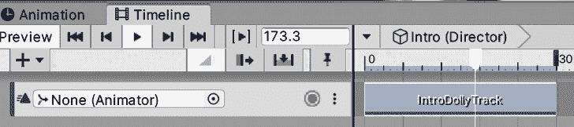

图 17.71：播放时间轴并拖动播放头

现在，我们将使我们的**Intro**时间轴资产告诉`CinemachineBrain`组件（主摄像头）在剪辑的每个部分中哪个摄像头是活动的，摄像头动画结束后切换到玩家摄像头。我们将创建第二个轨道——一个 Cinemachine 轨道，它专门用于在特定的`CinemachineBrain`组件之间切换不同的虚拟摄像头。为此，请按照以下步骤操作：

1.  再次点击**+**按钮，然后点击**Cinemachine 轨道**。请注意，您可以在没有**Cinemachine**的情况下安装时间轴，但那种情况下不会出现这种类型的轨道：

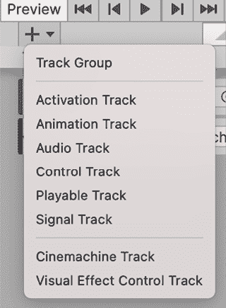

图 17.72：创建一个新的 Cinemachine 轨道

1.  在**可播放导演**组件的**绑定**列表中，将主摄像头拖动到**Cinemachine 轨道**，使其跟踪控制在不同时刻的剪辑中哪个虚拟摄像头将控制主摄像头：

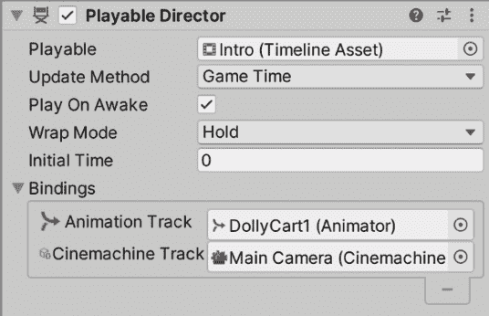

图 17.73：将主摄像头绑定到 Cinemachine 轨道

1.  下一步指示在时间轴的特定时刻将激活哪个虚拟摄像头。为此，我们的 Cinemachine 轨道允许我们将虚拟摄像头拖动到它上面，这将创建虚拟摄像头剪辑。按照顺序，将**CM vcam2**和**CM vcam1**拖动到 Cinemachine 轨道：

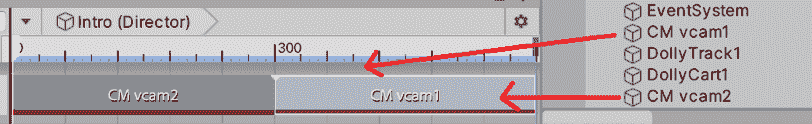

图 17.74：将虚拟摄像头拖动到 Cinemachine 轨道

1.  如果您点击**播放**按钮或只是拖动**时间轴播放**头，您可以看到当播放头到达第二个虚拟摄像头剪辑时，活动虚拟摄像头如何变化。请记住在**游戏**视图中查看这一点。

1.  如果你将鼠标放在剪辑的末端附近，会出现一个调整大小光标。如果你拖动它们，你可以调整剪辑的大小以指定它们的持续时间。在我们的例子中，我们需要将 `CM vcam2` 剪辑的长度与 **Cart** 动画剪辑匹配，然后通过拖动将其放置在末尾，这样当推车动画结束时，摄像机就会变得活跃。在我的情况下，它们的长度已经相同，但只是为了练习，还是尝试改变它。此外，你还可以使 `CM vcam1` 剪辑更短；我们只需要播放几秒钟来执行摄像机交换。

1.  你也可以稍微重叠剪辑，以在两个摄像机之间创建平滑的过渡，而不是生硬的切换，这样看起来会很奇怪：

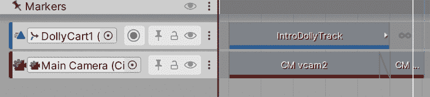

图 17.75：调整大小和重叠剪辑以进行插值

1.  将 **WaveSpawners** 的 **开始时间** 属性增加，以防止在场景剪辑开始之前生成敌人。

如果你等待完整的场景剪辑结束，你会注意到，在最后，`CM vcam2` 再次变得活跃。你可以配置时间轴如何处理场景剪辑的结束，因为默认情况下，它什么都不做。这可能会导致不同类型的轨道有不同的行为——在我们的例子中，再次将选择虚拟摄像机的控制权交给 `CinemachineBrain` 组件，该组件将选择具有最高 **优先级** 值的虚拟摄像机。我们可以更改虚拟摄像机的 **优先级** 属性，以确保 **CM vcam1**（玩家摄像机）始终是更重要的一方，或者将 **可播放导演** 组件的 **Wrap Mode** 设置为 **Hold**，这将保持一切如时间轴最后帧所指定的那样。在我们的例子中，我们将使用后者选项来测试时间轴特定的功能：

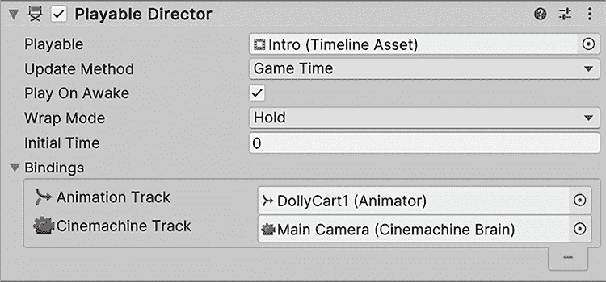

图 17.76：Wrap Mode 设置为 Hold 模式

大多数不同类型的轨道都遵循相同的逻辑；每个轨道都将控制特定对象的一个特定方面，使用在设定时间内执行的剪辑。我鼓励你测试不同的轨道，看看它们能做什么，例如 **激活**，它可以在场景剪辑期间启用和禁用对象。记住，你可以在包管理器中查看时间轴包的文档。

# 摘要

在本章中，我们介绍了 Unity 为不同需求提供的不同动画系统。我们讨论了导入角色动画以及使用动画控制器来控制它们。我们还看到了如何制作能够对游戏当前情况做出反应的相机，例如玩家的位置，或者可以在场景中使用的相机。最后，我们探讨了 Timeline 和动画系统，为我们的游戏创建一个开场场景。这些工具对于让我们的团队动画师直接在 Unity 中工作非常有用，无需集成外部资产（除了角色动画）的麻烦，同时也防止程序员创建重复的脚本来创建动画，从而节省时间。

现在，您可以在 Unity 中导入和创建动画剪辑，并将它们应用到 GameObject 上，使它们根据剪辑移动。您还可以将它们放置在 Timeline 序列器中，协调它们并为游戏创建场景。最后，您可以创建动态相机，用于游戏或场景中。

通过这种方式，我们结束了第二部分，*掌握编程和游戏玩法机制*，在这一部分中，我们学习了不同的 Unity 系统来提高我们游戏的艺术方面。在下一章，第三部分的第一章，*提升视觉效果、效果和音频*中，我们将完成我们游戏的开发，并了解如何构建和优化它，我们还将提供增强现实应用的快速介绍。

# 在 Discord 上了解更多

与其他用户、Unity 游戏开发专家以及作者本人一起阅读这本书。提问、为其他读者提供解决方案、通过“问我任何问题”的环节与作者聊天，以及更多。扫描二维码或访问链接加入社区：

[`packt.link/unitydev`](https://packt.link/unitydev)

