# 18

# 性能魔法：使用 Profiler 工具优化你的游戏

欢迎来到本书的第四部分——我很高兴你到达了这一部分，这意味着你几乎完成了一个完整游戏！到目前为止，我们开发了一个游戏，同时专注于实现不同的游戏玩法功能和效果，但我们没有考虑它们在游戏**每秒帧数**（**FPS**）方面的表现如何。在本章中，我们将讨论优化技术来审查你的游戏性能并提高它，因为保持良好的和稳定的帧率对任何游戏都是至关重要的。

性能是一个广泛的话题，需要深入理解几个 Unity 系统，可能涉及几本书的内容。我们将探讨如何衡量性能，并探索我们对系统所做的更改的影响，以通过测试了解它们是如何工作的。

在本章中，我们将检查以下性能概念：

+   优化图形

+   优化处理

+   优化内存

到本章结束时，你将能够收集运行你的游戏的三种主要硬件的性能数据——GPU、CPU 和 RAM。你将能够分析这些数据以检测可能存在的性能问题，并了解如何解决最常见的那些问题。

我们将首先学习如何优化我们游戏中的图形方面。

# 优化图形

性能问题的最常见原因是与资产的误用有关，尤其是在图形方面，由于对 Unity 的图形引擎工作原理了解不足。我们将探讨 GPU 在高级别是如何工作的，以及如何提高其使用效率。

在本节中，我们将检查以下图形优化概念：

+   图形引擎简介

+   使用帧调试器

+   使用批处理

+   其他优化

我们将首先了解图形是如何渲染的，以便更好地理解我们将在帧调试器中收集的性能数据。根据调试器的结果，我们将确定可以应用**批处理**（这是一种结合多个对象渲染过程的技术，可以降低其成本）以及其他需要记住的常见优化。

## 图形引擎简介

现在，每个游戏设备，无论是电脑、移动设备还是游戏机，都有一个显卡——一组专门从事图形处理的硬件。它与 CPU 在细微但重要的方面有所不同。图形处理涉及处理数千个网格顶点和在单个帧中渲染数百万个像素。这是计算你的对象像素的颜色和光照，以及移动和动画化你的对象几何形状的责任。GPU 被设计成运行短程序大量次数，而 CPU 可以处理任何长度的程序，但并行化能力有限。拥有那些处理单元（CPU 和 GPU）的原因是，我们的程序可以在需要时使用每一个。

这里的问题是图形不仅仅依赖于 GPU。CPU 也参与了这个过程，进行计算并向 GPU 发出命令，因此它们必须协同工作。为了实现这一点，这两个处理单元需要通信，因为它们通常是物理上分开的，所以它们需要另一块硬件来实现这一点：总线，其中最常见的是**外围组件互连扩展**（**PCI Express**）总线。

**PCI Express**是一种连接类型，允许在 GPU 和 CPU 之间移动大量数据，但问题是即使它非常快，如果你在这两个单元之间发出大量命令，通信时间也可能明显。因此，这里的关键概念是，图形性能的提高主要在于减少 GPU 和 CPU 之间的通信：

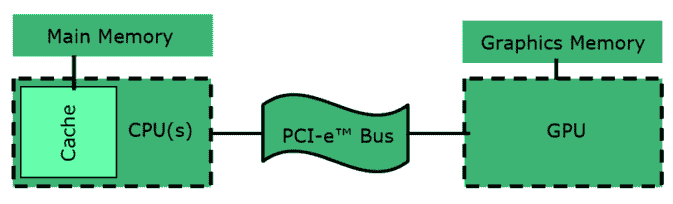

图 18.1：通过 PCI Express 总线进行的 CPU/GPU 通信

现在，新的硬件架构允许 CPU 和 GPU 在同一芯片组中共存，减少通信时间，甚至共享内存。遗憾的是，这种架构不允许视频游戏所需的处理能力，因为将这两部分分开可以让它们有足够的空间容纳大量核心。

图形引擎的基本责任是使用剔除算法确定哪些对象是可见的，根据它们的相似性对它们进行排序和分组，然后向 GPU 发出绘制命令以渲染这些对象组，有时甚至不止一次。CPU 和 GPU 之间主要的通信形式是**绘制命令**，通常称为**绘制调用**，我们在优化图形时的主要任务是尽可能减少它们。问题是存在多个需要考虑的绘制调用来源，例如光照或某些特殊效果。研究每一个都需要花费很长时间，即使如此，Unity 的新版本也可以引入带有自己绘制调用的新图形功能。相反，我们将探索使用帧调试器发现这些绘制调用的方法。

## 使用帧调试器

**帧调试器**是一个工具，它允许我们查看 Unity 渲染引擎发送给 GPU 的所有绘制调用的列表。它不仅列出它们，还提供了关于每个绘制调用的信息，包括检测优化机会所需的数据。通过使用帧调试器，我们可以看到我们的更改如何修改绘制调用的数量，从而立即获得关于我们努力的反馈。

注意，减少绘制调用有时并不足以提高性能，因为每个绘制调用可能有不同的处理时间，但通常这种差异并不大，不值得考虑。另外，在某些特殊的渲染技术中，例如光线追踪或光线行进，单个绘制调用可能会耗尽我们所有的 GPU 功率。在我们的游戏中不会出现这种情况，所以我们现在不考虑这一点。

让我们通过以下步骤使用帧调试器来分析我们游戏的渲染过程：

1.  打开帧调试器（**窗口 | 分析 | 帧调试器**）。

1.  播放游戏，当您想要分析性能时，点击帧调试器左上角的**启用**按钮（在播放时按*Esc*键以恢复鼠标控制）：

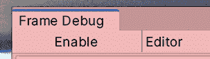

图 18.2：启用帧调试器

1.  点击**游戏**选项卡以打开**游戏**视图。

1.  将**禁用**按钮右侧的滑块从左到右缓慢移动，以查看场景是如何渲染的。每一步都是一个正在 CPU 上执行该游戏帧的绘制调用。您还可以观察窗口左侧的列表如何突出显示此时正在执行的绘制调用的名称：

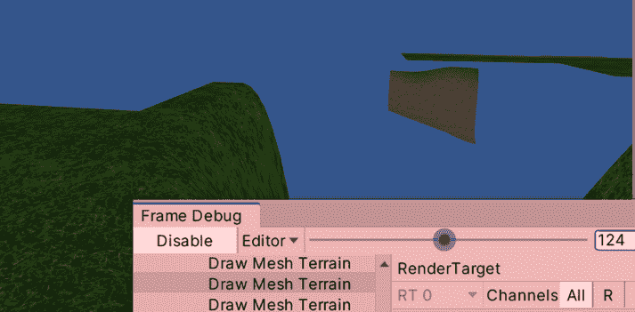

图 18.3：分析我们的帧绘制调用

1.  如果列表中的某些绘制调用在**游戏**面板中输出灰色图像，同时在控制台中显示警告，则对此的临时修复方法是选择您场景的主要相机，并将其**MSAA**属性在**相机**组件的**输出**部分设置为**关闭**。请记住，之后使用帧调试器撤销此更改。

1.  点击列表中的任何绘制调用，并观察窗口右侧的详细信息。

    如果您不习惯于编码引擎或着色器，其中大部分可能会让您感到困惑，但您可以看到其中一些具有可读部分，说明了为什么这个绘制调用不能与上一个一起批处理，这告诉您为什么两个对象没有在单个绘制调用中一起绘制。我们将在稍后检查这些原因：

    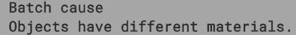

    图 18.4：帧调试器中的批处理中断原因

1.  在**播放**模式下打开窗口，禁用地形，看看绘制调用数量的变化是否立即发生。有时，仅仅打开或关闭对象就足以检测到导致性能问题的原因。还可以尝试禁用后期处理和其他与图形相关的对象，例如粒子。

即使我们对每个 draw call 的来源并不完全清楚，我们至少可以从修改 Unity 中的设置开始，看看这些变化的影响。没有比通过遍历每个切换并使用测量工具查看这些变化的影响更好的方式来发现像 Unity 这样庞大的系统是如何工作的了。当然，有时我们可能需要付出某些 draw call 的代价来实现某些效果，比如在地面场景中，尽管你总是可以质疑这是否值得；这需要逐个案例进行分析。

即使 Frame Debugger 提供了大量信息，有时你可以额外走一步，使用更高级的工具，如 RenderDoc 或 NVIDIA Nsight，其中一些工具在功能上与 Frame Debugger 相似，即它们显示所有的 draw call，但同时也显示每个 draw call 的时序、网格、着色器和每个 draw call 使用的纹理等信息。

现在，让我们讨论减少 draw call 的基本技术，并看看它们在 Frame Debugger 中的效果。

## 使用批处理

我们在前面章节讨论了几种优化技术，其中光照是最重要的。如果你在实现这些技术时测量 draw call，你会注意到这些操作对 draw call 数量的影响。然而，在本节中，我们将专注于另一种图形优化技术，称为批处理。**批处理**是将多个对象分组在一起，以便在单个 draw call 中绘制它们的过程。

你可能想知道为什么我们不能仅仅在一个 draw call 中绘制所有内容，虽然这在技术上是可以实现的，但为了合并两个对象，需要满足一系列条件，通常情况是合并材质。

记住，材质作为图形预设，指定了一个**材质**模式或着色器以及一组参数来定制我们对象的外观，比如对象的颜色和纹理。如果 Unity 需要绘制一个与之前不同的材质的对象，在发出 draw call 之前需要调用`SetPass`，这是另一种 CPU/GPU 通信形式，用于在 GPU 上设置**材质**属性，如其纹理和颜色。如果两个对象使用相同的材质，这一步可以跳过。第一个对象的`SetPass`调用会被第二个对象重用，这为批处理对象打开了机会。如果它们共享相同的设置，Unity 可以在 CPU 中将网格合并成一个，然后通过单个 draw call 将合并后的网格发送到 GPU。

减少材料数量的方法有很多，例如去除重复项，但最有效的方法是通过一个称为**纹理图集**的概念。这意味着将不同对象的纹理合并成一个。这样，由于使用的纹理可以应用于多个对象，因此几个对象可以使用相同的材质。遗憾的是，Unity 中没有自动系统来合并三维对象的纹理，例如我们在 2D 中使用的 Texture Atlas 对象。可能有一些系统在 Asset Store 中，但自动系统可能会有一些副作用。

这项工作通常由艺术家完成，因此在与专门的 3D 艺术家（或如果你是自己）工作时，只需记住这个技巧：

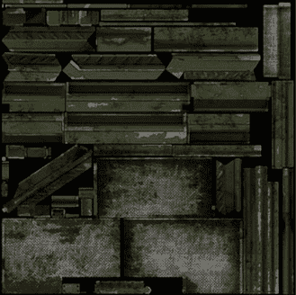

图 18.5：不同金属物体的碎片

让我们通过以下步骤使用帧调试器探索批处理：

1.  前往**编辑** | **首选项** | **核心渲染管线**并将**可见性**设置为**所有可见**。这将允许我们看到基本和高级图形设置：

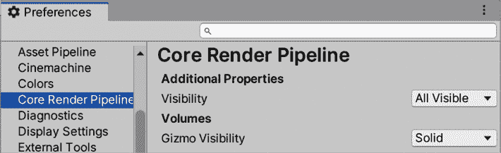

图 18.6：启用显示所有可用图形设置

1.  搜索我们目前想要使用的**可脚本渲染管线设置**资产（**编辑** | **项目设置** | **图形** | **可脚本渲染管线设置**）：

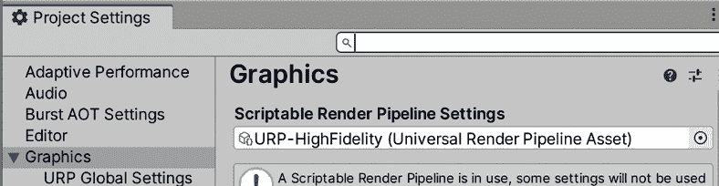

图 18.7：可脚本渲染管线设置

1.  现在，在**渲染**部分取消选中**SRP 批处理器**并选中**动态批处理**。我们将在本章后面重新启用它，以便更好地理解为什么我们应该始终使用**SRP 批处理器**：

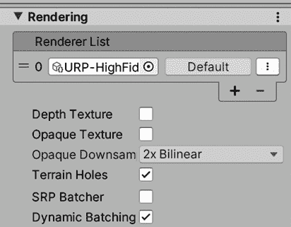

图 18.8：禁用 SRP 批处理器

1.  为测试创建一个新的空场景（**文件** | **新建场景**）。

1.  创建两种不同颜色的材质。

1.  创建两个立方体，并将一个材质放入第一个，另一个放入第二个。

1.  打开帧调试器并点击**启用**以查看我们立方体绘制调用的调用列表：

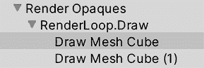

图 18.9：立方体的绘制调用

1.  选择第二个**绘制网格立方体**调用，并查看批处理中断的原因。它应该说明对象具有不同的材质。

1.  将其中一种材质应用于两个立方体，并再次查看列表。你会注意到现在我们只有一个**绘制网格立方体**调用。如果你没有在玩游戏，可能需要再次禁用和启用帧调试器以正确刷新。

现在，我挑战你尝试相同的步骤，但用球体而不是立方体来创建。在执行这个挑战的过程中，注意你的观察和假设，关于为什么立方体和球体之间的结果不同。如果你这样做，你可能会注意到，即使使用相同的材质，球体也没有被批处理！这就是我们需要引入 **动态批处理** 概念的地方。

记住，GameObject 有一个 **静态** 复选框，它用于通知几个 Unity 系统，该对象不会移动，这样它们就可以应用一些优化。未勾选此复选框的对象被认为是动态的。到目前为止，我们用于测试的立方体和球体一直是动态的，所以 Unity 需要每帧将它们组合起来，因为它们可以移动，而组合并不是“免费的”。它的成本直接与模型中的顶点数相关。

你可以从 Unity 手册中获取确切数字和所有必要的考虑因素，你可以在互联网上搜索 `Unity Batching` 来找到它，或者你可以通过这个链接访问：[`docs.unity3d.com/Manual/DrawCallBatching.html`](https://docs.unity3d.com/Manual/DrawCallBatching.html)。然而，只需说如果对象的顶点数量足够大，那么该对象就不会被批处理，这样做将需要发出超过两个绘制调用。这就是为什么我们的球体没有被批处理；球体有太多的顶点。

现在，如果我们有静态对象，情况就不同了，因为它们使用第二个批处理系统——**静态批处理器**。这个概念是相同的。合并对象以在一个绘制调用中渲染它们，并且同样，这些对象需要共享相同的材质。主要区别在于，这个批处理器将批处理比动态批处理器更多的对象，因为合并是在场景加载时一次性完成的，然后保存在内存中以供下一帧使用，这虽然消耗内存，但每帧都能节省大量的处理时间。你可以使用与我们用来测试动态批处理相同的方法来测试静态版本，只需这次检查球体的**静态**复选框，并在**播放**模式下查看结果；在**编辑**模式（当它没有播放时），静态批处理器不会工作：

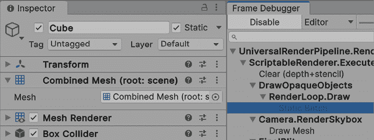

图 18.10：一个静态球体及其静态批次

在继续之前，让我们讨论一下为什么我们禁用了 SRP Batcher 以及这如何改变我们刚才讨论的内容。在 2020 版本中，Unity 引入了 **通用渲染管线**（**URP**），一个新的渲染管线。

除了几个改进之外，目前相关的一个是 SRP Batcher，这是一个新的批处理器，它可以在没有顶点或材质限制（但有其他限制）的动态对象上工作。SRP Batcher 不是依赖于与批处理对象共享相同的材质，而是可以有一个使用相同着色器和变体的对象批处理，这意味着我们可以有，例如，100 个对象，每个对象有 100 种不同的材质，并且它们将根据材质使用相同的着色器和变体进行批处理，无论顶点数量多少：

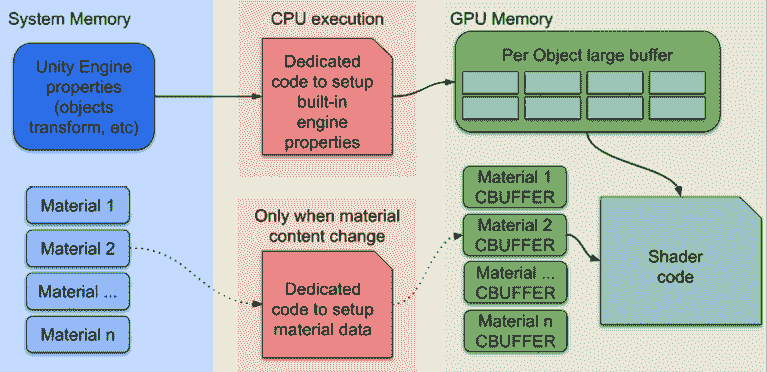

图 18.11：材质的 GPU 数据持久性，允许 SRP Batcher 存在

一个着色器可以有多个版本或变体，选择的变体基于设置。我们可以有一个不使用法线贴图的着色器，以及一个不计算法线的变体将被使用，这可能会影响 SRP Batcher。所以，使用 SRP Batcher 基本上没有缺点，所以请再次开启它。尝试创建尽可能多的球体，使用尽可能多的材质，并在帧调试器中检查它将生成的批次数。只是考虑一下，如果你需要处理在 URP 之前完成的项目，这个功能将不可用，因此你需要知道适当的批处理策略来使用。

## 其他优化

如前所述，有很多可能的图形优化，让我们简要讨论基本的一些，从**细节级别**（**LOD**）开始。LOD 是根据对象与摄像机的距离改变对象网格的过程。如果你在房子远离时用具有较少细节的单个组合网格替换由几个部分和部件组成的房子，这可以减少绘制调用。使用 LOD 的另一个好处是，由于顶点数量的减少，可以减少绘制调用的成本。

要使用此功能，请执行以下操作：

1.  创建一个空对象，并将模型的两个版本作为父对象。你需要使用具有不同细节级别的多个版本的模型，但到目前为止，我们只是将使用一个立方体和一个球体来测试这个功能：

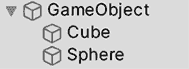

图 18.12：具有两个 LOD 网格的单个对象

1.  将**LOD 组**组件添加到父对象上。

1.  默认 LOD 组已准备好支持三个 LOD 网格组，但因为我们只有两个，所以右键单击一个，然后点击**删除**。你也可以选择**插入之前**来添加更多的 LOD 组：

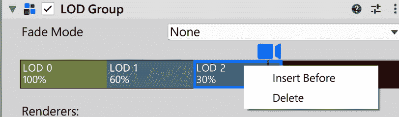

图 18.13：删除 LOD 组

1.  选择**LOD 0**，最高细节级别的 LOD 组，然后在下面的**渲染器**列表中点击**添加**按钮，将球体添加到该组。你可以添加任意数量的网格渲染器。

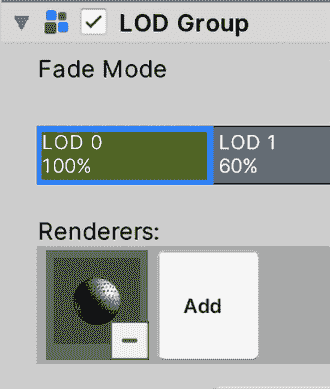

图 18.14：向 LOD 组添加渲染器

1.  选择 **LOD 1** 并添加立方体。

1.  拖动两个组之间的线来控制每个组将占据的距离范围。当你拖动时，你会看到相机需要移动多远才能切换组。此外，你还有 **剔除** 组，这是相机不会渲染任何组的距离。

1.  只需在 **场景** 面板中移动场景，就可以看到网格是如何切换的。

1.  这里需要考虑的是，对象的碰撞器不会被禁用，所以只需在 LOD 子对象中放置渲染器。将 LOD 0 的形状的碰撞器放在父对象中，或者只需从 LOD 组对象中移除碰撞器，除了组 0。

另一个可以考虑的优化是 **视锥剔除**。默认情况下，Unity 会渲染任何落在相机视图区域或视锥体内的对象，跳过那些不在的对象。该算法足够便宜，可以始终使用，而且无法禁用它。然而，它确实有一个缺陷。如果我们有一个墙隐藏了它后面的所有对象，即使它们被遮挡，它们也会落在视锥体内，所以它们仍然会被渲染。在实时中检测网格的每个像素是否遮挡了另一个网格的每个像素几乎是不可能的，但幸运的是，我们有一个解决方案：遮挡剔除。

**遮挡剔除** 是一个分析场景并确定场景不同部分中可以看到哪些对象的过程，将它们分成区域并分析每一个。由于这个过程可能需要相当长的时间，它是在编辑器中完成的，类似于光照贴图。正如你可以想象的那样，它只适用于静态对象，因为它是计算在编辑器时间内的。要使用它，请执行以下操作：

1.  将不应移动的对象标记为静态，或者如果你只想让这个对象在遮挡剔除系统中被视为静态，请检查 **静态** 复选框右侧箭头的 **遮挡者静态** 和 **遮挡物静态** 复选框。遮挡者表示该对象可以遮挡其他对象，而遮挡物表示该对象可以被其他遮挡者对象遮挡。我们正在设置对象进行遮挡和被遮挡。

    为了获得额外的性能，你可能想要考虑哪些对象是遮挡者，哪些是遮挡物。小对象不太可能遮挡其他对象，所以可能不值得检查那些对象的遮挡者标志。同样，根据你的场景设置，可能根本不会被遮挡的大对象可能是不被遮挡物的良好候选者。

1.  打开 **遮挡剔除** 窗口（**窗口 | 渲染 | 遮挡剔除**）。

1.  保存场景，点击窗口底部的 **烘焙** 按钮，然后等待烘焙过程。如果你在烘焙过程之前没有保存场景，它将不会执行。

1.  在 **遮挡剔除** 窗口中选择 **可视化** 选项卡。

1.  当**遮挡剔除**窗口可见时，选择相机（或 Cinemachine 控制的虚拟相机的情况）并拖动它，观察随着相机移动物体是如何被遮挡的：

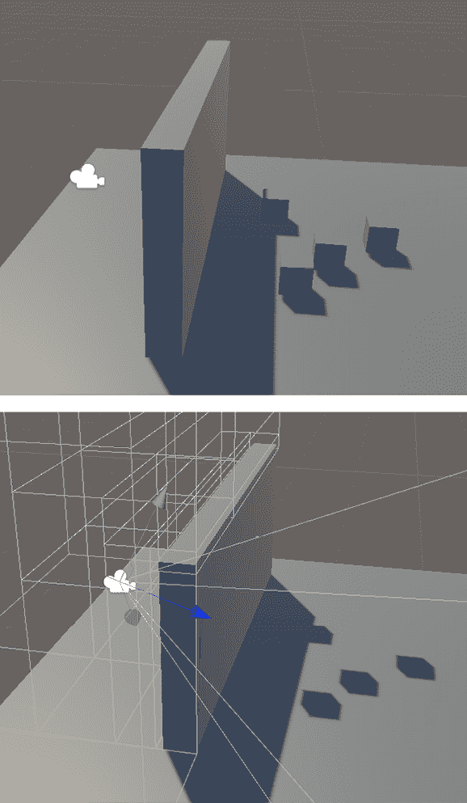

图 18.15：左侧是正常场景，右侧是遮挡剔除后的场景

考虑到如果您将相机移动到计算区域之外，该过程将不会进行，Unity 将只计算静态物体附近的区域。您可以通过创建一个空对象并添加**遮挡区域**组件来扩展计算区域，设置其位置和大小以覆盖相机将到达的区域，最后，重新烘焙剔除。尽量对立方体的尺寸保持明智。要计算的面积越大，您在磁盘上存储生成的数据所需的空间就越大。

您可以使用这些区域中的几个来更精确地操作——例如，在 L 形场景中，您可以使用其中的两个：

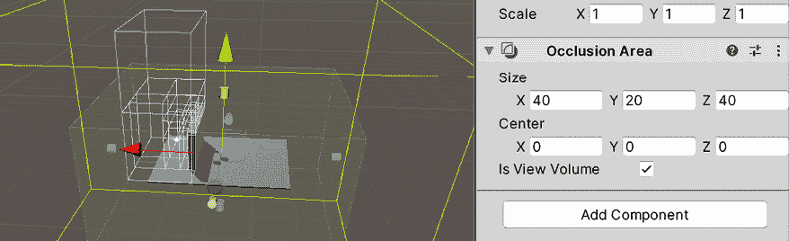

图 18.16：遮挡区域

如果您看到物体没有被遮挡，可能是因为遮挡物对象（在这种情况下是墙壁）不够大，不能被考虑。您可以增加对象的大小或减少窗口**烘焙**选项卡中的**最小遮挡物**设置。这样做将进一步细分场景以检测小遮挡物，但这将在磁盘上占用更多空间来存储更多数据。所以，再次，对此设置要明智。

我们还可以应用更多技术到我们的游戏中，但我们讨论的这些已经足够我们的游戏使用。因此，在本节中，我们学习了在显卡中渲染图形的过程，批处理的概念，如何分析它们以确切知道我们有多少个以及它们在做什么，最后，如何尽可能减少它们。现在，让我们开始讨论其他优化领域，例如处理领域。

# 优化处理

虽然图形通常需要占用生成帧所需的大部分时间，但我们绝不能低估糟糕的代码和场景的成本。游戏中有几个部分仍在 CPU 中计算，包括图形处理的一部分（如批处理计算）、物理、音频以及我们的代码。在这里，我们比图形方面有更多的性能问题，所以，再次，我们不是讨论每一个优化，而是学习如何发现它们。

在本节中，我们将检查以下 CPU 优化概念：

+   检测 CPU 和 GPU 限制

+   使用**CPU 使用率**分析器

+   通用 CPU 优化技术

我们将首先讨论 CPU 和 GPU 限制的概念，这些概念侧重于优化过程，确定问题是否与 GPU 或 CPU 相关。稍后，就像 GPU 优化过程一样，我们将探讨如何收集 CPU 的性能数据并解释它以检测可能应用的优化技术。

## 检测 CPU 和 GPU 限制

与帧调试器一样，Unity 分析器允许我们通过一系列分析器模块收集关于游戏性能的数据，每个模块都设计用于收集每帧不同 Unity 系统的数据，例如物理、音频，最重要的是**CPU 使用情况**。这个最后的模块允许我们看到 Unity 执行以处理帧的最重要操作——从我们的脚本到物理和图形等系统（CPU 部分）。

在探索**CPU 使用情况**之前，我们可以在本模块收集的一个重要数据点是，我们是否受 CPU 或 GPU 限制。正如之前所解释的，一帧的处理使用 CPU 和 GPU，这些硬件可以并行工作。当 GPU 正在执行帧的绘制命令时，CPU 可以非常高效地执行下一帧的物理、我们的脚本和其他非图形过程。但是，现在假设 CPU 在 GPU 仍在处理前一帧时完成了这项工作。CPU 能否开始处理下一帧的图形处理？答案是不能。这会导致不同步，因此在这种情况下，CPU 需要等待。如果您的游戏已经以期望的帧率（通常是 60fps）运行，这种等待并不一定是坏事，但如果不是，您的游戏性能将受到限制或绑定。我们描述的 CPU 等待 GPU 的情况称为 GPU 限制，我们还有相反的情况，即 CPU 限制，当 GPU 比 CPU 先完成时。当 CPU 和 GPU 并行工作时，存在 CPU 需要 GPU 但 GPU 正忙的时刻，反之亦然，导致等待时间只是硬件能力的浪费。

重要的是集中我们的优化努力，所以如果我们检测到我们的游戏是 GPU 限制，我们将专注于 GPU 图形优化（如减少网格和着色器复杂性），如果是 CPU 限制，那么我们将专注于其他系统和图形处理的 CPU 方面。为了检测我们的游戏是哪一种，请执行以下操作：

1.  打开分析器（**窗口 | 分析 | 分析器**）。

1.  在左上角的**分析器模块**下拉菜单中，勾选**GPU 使用情况**以启用 GPU 分析器：

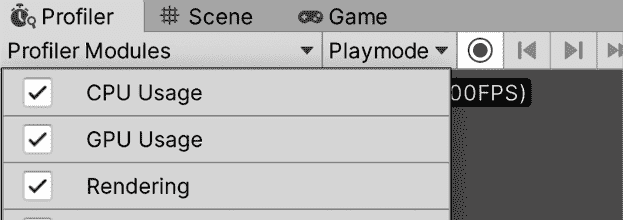

图 18.17：启用 GPU 分析器

1.  播放游戏并选择**CPU 使用情况**分析器，在**分析器**窗口的左侧点击其名称。

1.  点击**最后一帧**按钮，即指向右的双箭头按钮，以始终显示正在渲染的最后一帧的信息：

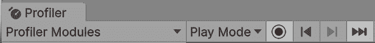

图 18.18：最后一帧按钮（向右的双箭头）

1.  还需点击 **Live** 按钮以启用 **Live** 模式，这允许您实时查看分析结果。这可能会影响性能，因此您可以稍后禁用它：

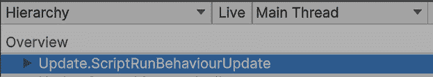

图 18.19：启用 Live 模式

1.  观察窗口中间带有 **CPU** 和 **GPU** 标签的条形图。它应该说明 CPU 和 GPU 消耗了多少毫秒。数值较高的那个将是限制我们帧率的那个，并决定我们是 GPU-还是 CPU-限制：

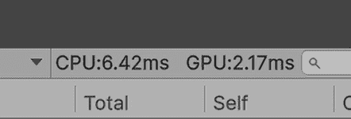

图 18.20：确定我们是 CPU-还是 GPU-限制

1.  有可能当您尝试打开 GPU 分析器时，您会看到一条不支持的消息，这种情况可能发生在某些情况下（例如，在使用 Metal 图形 API 的 Mac 设备上）。在这种情况下，另一种查看我们是否处于 GPU 限制状态的方法是在选择 **CPU 使用率** 分析器的同时，在 CPU/GPU 标签旁边的搜索栏中搜索 `waitforpresent`。如果您看不到搜索栏，请点击 **Live**（应显示为 **时间轴**）左侧的下拉菜单并选择 **层次结构**：

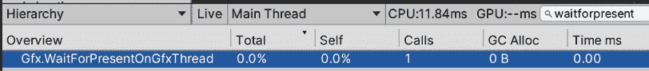

图 18.21：搜索 waitforpresent

1.  在这里，您可以查看 CPU 等待 GPU 的时间长度。检查 **时间 ms** 列以获取数字。如果您看到 **0.00**，则表示 CPU 不在等待 GPU，这意味着我们处于 CPU 限制状态。在前面的屏幕截图中，您可以看到我的屏幕显示 **0.00**，而 CPU 需要 **6.42ms**，GPU 需要 **2.17ms**。因此，我的设备是 CPU 限制的，但请考虑您的设备和项目可能会带来不同的结果。

现在我们能够检测到我们是 CPU-还是 GPU-限制，我们可以将优化努力集中在 CPU 端优化或 GPU 端优化。到目前为止，我们在 *优化图形* 部分讨论了如何分析并优化 GPU 过程的一部分。现在，如果我们检测到我们处于 CPU 限制状态，让我们看看如何分析 CPU。

## 使用 CPU 使用率分析器

分析 CPU 的方式与分析 GPU 类似。我们需要获取 CPU 执行的动作列表，并尝试减少它们的数量，或者至少减少它们的成本。这就是**CPU 使用性能分析器**模块发挥作用的地方——这是一个工具，它允许我们查看 CPU 在一个帧中执行的所有指令。主要区别在于 GPU 主要执行绘制调用，我们只有几种类型，而 CPU 可以执行数百种不同的指令，有时其中一些指令不能删除，例如物理或音频处理。在这些情况下，我们希望减少这些函数的成本，以便它们不会消耗太多时间。因此，在这里的一个重要提示是检测哪个函数花费了太多时间，然后减少其成本或删除它，这需要更深入地了解底层系统。让我们首先开始检测函数。

当您在打开**性能分析器**标签的情况下玩游戏时，您将看到一系列显示游戏性能的图形，在**CPU 使用**性能分析器中，您将看到图形被分成不同的颜色，每个颜色都指代帧处理的不同部分。您可以通过查看性能分析器左侧的信息来了解每种颜色的含义，但让我们讨论最重要的几个。

检查以下 Unity 手册页面以了解如何为性能分析器启用色盲模式：[`docs.unity3d.com/2023.1/Documentation/Manual/ProfilerWindow.html`](https://docs.unity3d.com/2023.1/Documentation/Manual/ProfilerWindow.html)

在下面的屏幕截图中，您可以查看图形应该如何显示：

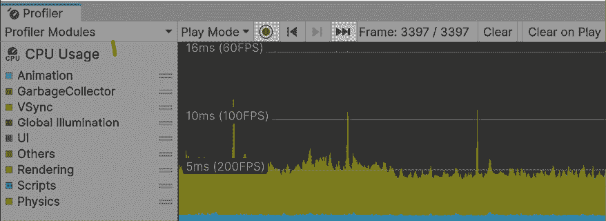

图 18.22：分析 CPU 使用图

如果您看到图形，您可能会认为图表中深绿色的部分占据了大部分的性能时间，虽然这是真的，但您也可以从图例中看到，深绿色代表**其他**，这是因为我们在编辑器中分析游戏。编辑器不会完全像最终游戏那样表现。为了运行它，它必须执行许多额外的处理，这些处理在游戏中不会执行，因此您能做的最好的事情就是直接在游戏的构建中进行分析。在那里，您将收集更准确的数据。我们将在下一章讨论如何进行构建，所以现在我们可以忽略那个区域。我们现在能做的就是简单地点击**其他**标签左侧的彩色方块，以从图中禁用该测量，以便稍微清理一下。如果您也看到一个很大的黄色部分，它指的是**垂直同步**，这基本上是我们等待处理与监视器刷新率匹配的时间。这也是我们可以忽略的事情，所以您也应该禁用它。在下一张屏幕截图中，您可以检查图形颜色类别以及如何禁用它们：

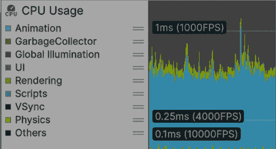

图 18.23：从性能分析器禁用 VSync 和其他设置

现在我们已经清理了图表，我们可以通过查看带有**ms**标签的线条（在我们的案例中，**5ms（200FPS）**）来了解我们游戏潜在帧率的良好概念，这表明低于该线条的帧有超过 200FPS，而高于该线条的帧则较少。

在我的情况下，我拥有出色的性能，但请记住，我是在一台强大的机器上测试这个的。最佳的性能分析方式不仅是在游戏的构建（作为一个可执行文件）中，而且是在目标设备上，这应该是我们打算让游戏运行的最低规格硬件。我们的目标设备很大程度上取决于游戏的目标受众。如果我们正在制作休闲游戏，我们可能针对的是移动设备，因此我们应该在最低规格的手机上测试游戏，但如果我们的目标是针对核心玩家，他们可能有一台强大的机器来运行我们的游戏。

如果你针对的是核心玩家，当然，这并不意味着我们可以因为这一点而制作一个非常未优化的游戏，但这将给我们足够的空间来添加更多细节。无论如何，我强烈建议如果你是初学者，避免那些类型的游戏，因为它们更难开发，你可能很快就会意识到这一点。一开始就坚持简单的游戏。 

通过查看图形颜色，你可以观察到在渲染的 CPU 侧的成本以浅绿色表示，图表显示它占用了相当一部分的处理时间，这实际上是正常的。然后，在蓝色中，我们可以看到我们的脚本和其他系统执行的成本，这也占用了相当一部分，但同样，这也是相当正常的。此外，我们还可以观察到一点橙色，这是物理，还有一点浅蓝色，这是动画。请记住检查性能分析器中的彩色标签，以记住哪个颜色代表什么。

现在，这些彩色条代表了一组操作，如果我们认为**渲染**条代表 10 个操作，我们如何知道这包括哪些操作？同样，我们如何知道这些操作中哪一个占用了最多的性能时间？在这 10 个操作中，任何一个都可能是导致这些问题的原因。这就是性能分析器底部部分有用的地方。它显示了一个在帧中被调用的所有函数的列表。要使用它，请执行以下操作：

1.  点击性能分析器中**CPU 使用率**部分的任何部分，并检查性能分析器底部栏左上角的按钮是否显示为**层次结构**。如果不是（例如，如果显示为**时间线**），请点击它并选择**层次结构**。

1.  清除我们之前使用的搜索栏。它将通过名称过滤函数调用，而我们想看到所有这些调用。

1.  点击**时间 ms**列，直到你看到一个指向下方的箭头。这将按成本降序排列调用。

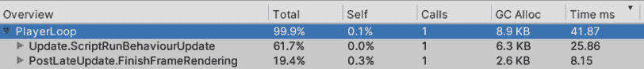

图 18.24：Profiler 时间毫秒列

1.  点击图表中引起你注意的帧——可能是那些高度最大且消耗更多处理时间的帧之一。这将使 Profiler 立即停止游戏并显示有关该帧的信息。

    在查看图表时，有两个方面需要考虑。如果你看到高于其他帧的峰值，这可能会在游戏中造成中断——一个非常短暂的瞬间，游戏会冻结，这可能会破坏性能。此外，你可以寻找长时间消耗较高的帧序列。尽量减少它们。即使这只是一个临时的解决方案，但玩家很容易就能感知到它的影响，尤其是在 VR 游戏中，因为这可能会引起恶心。

1.  **PlayerLoop**可能看起来是最耗时的帧，但这并不很有信息量。你可以通过点击其左侧的箭头来展开它进一步探索。

1.  点击每个函数以在图表中突出显示它。处理时间较长的函数将以较粗的条形显示，我们将重点关注这些函数：

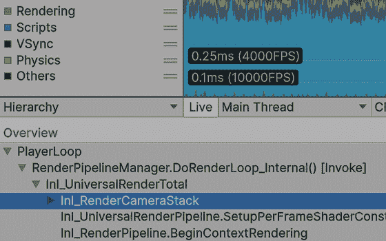

图 18.25：图表中突出显示的渲染相机函数

1.  你可以继续点击箭头以进一步探索函数，直到达到限制。如果你想深入了解，可以在 Profiler 的顶部栏中启用**深度分析**模式。这将提供更多细节，但请注意，这个过程成本高昂，会使游戏变慢，改变图表中显示的时间，使其看起来比实际时间高得多。在这里，忽略数字，根据图表查看函数占用的过程量。你需要停止，启用**深度分析**，然后再次播放以使其工作：

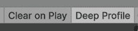

图 18.26：启用深度分析

带着这些知识，我们可以开始提高我们的游戏性能（如果它低于目标帧率），但每个函数都是由 CPU 调用的，并且以它独特的方式改进，这需要更多关于 Unity 内部运作的知识。这可能需要几本书来涵盖，而且无论如何，内部结构会随着版本的不同而变化。相反，你可以通过在网上查找关于该特定系统的数据以及官方文档来研究每个函数的工作方式，或者再次，通过禁用和启用我们的代码中的对象或部分来探索我们的行动的影响，就像我们在帧调试器中所做的那样。

性能分析需要创造力和推理来解释和相应地反应所获得的数据，因此你需要一些耐心。

现在我们已经讨论了如何获取与 CPU 相关的性能数据，让我们讨论一些减少**CPU 使用**的常见方法。

## 通用 CPU 优化技术

在 CPU 优化方面，有许多可能导致性能高的原因，包括滥用 Unity 的功能、大量物理或音频对象、不正确的资产/对象配置等。我们的脚本也可以以非优化的方式编写，滥用或误用昂贵的 Unity API 函数。到目前为止，我们已经讨论了使用 Unity 系统的一些良好实践，例如音频配置、纹理大小、批处理，以及找到像 `GameObject.Find` 这样的函数并将它们替换为管理器。那么，让我们讨论一些常见情况的具体细节。

让我们先看看大量对象是如何影响我们的性能的。在这里，您只需创建大量配置为 **Dynamic Profile** 的 `Rigidbody` 对象（至少 200 个），并在 Profiler 中观察结果。

您会注意到，在下面的屏幕截图中，Profiler 的橙色部分变大了，而 `Physics.RunSimulationStage` 函数是导致这种增加的原因：

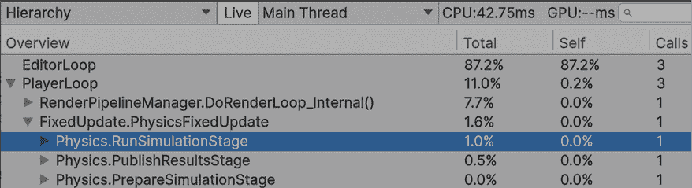

图 18.27：多个对象的物理处理

请记住，Profiler 有其他模块，您可以通过点击 **Profiler 模块** 按钮来激活它们，其中有一个用于物理。考虑启用它并检查它提供的信息。同时，请查看 Profiler 的官方文档以获取有关这些模块的更多信息。

另一个测试多个对象影响的方法是创建大量的音频源。在下面的屏幕截图中，您可以看到我们需要重新启用 **Others**，因为音频处理的一部分属于该类别。我们之前提到 **Others** 属于编辑器，但它也可以包含其他进程，所以请记住这一点：

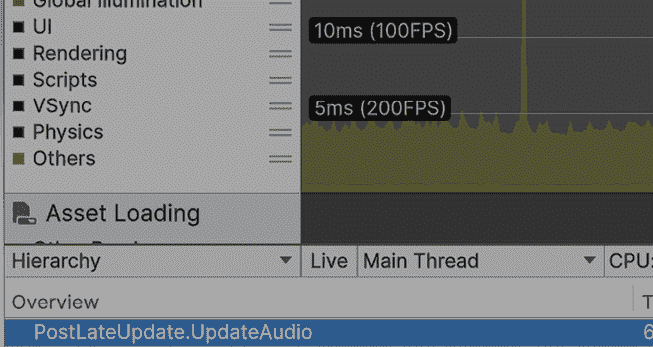图 18.28：多个音频源的音频处理

因此，为了发现这类问题，您只需开始禁用和启用对象，看看它们是否增加了时间。最后的测试是对粒子进行的。创建一个生成足够数量的粒子以影响我们的帧率的系统，并检查 Profiler。

在下面的屏幕截图中，您可以检查粒子处理函数在图中的高亮显示，显示它需要大量时间：

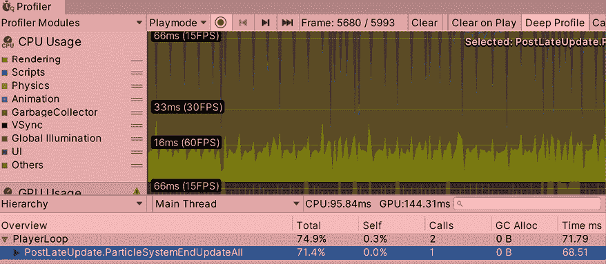

图 18.29：粒子处理

然后，在脚本方面，我们还有其他需要考虑的事情，其中一些是所有编程语言和平台共有的，例如迭代长列表的对象、数据结构的误用和深度递归。然而，在本节中，我主要将讨论 Unity 特定的 API，从 `print` 或 `Debug.Log` 开始。

这个功能在控制台获取调试信息很有用，但它也可能很昂贵，因为所有日志都会立即写入磁盘，以避免我们的游戏崩溃时丢失有价值的信息。磁盘写入操作非常慢，即使使用 SSD，所以我们想尽可能避免它们。当然，我们还想保留这些有价值日志，但我们不希望它们影响性能，那么我们能做什么呢？

一种可能的方法是保留这些消息，但在最终构建中禁用非必要的消息，例如信息性消息，同时保持错误报告功能活跃。一种实现方式是通过编译器指令，如下面的屏幕截图所示。请记住，这种`if`语句是由编译器执行的，如果条件不满足，可以在编译时排除整个代码段：

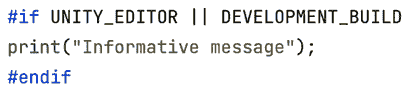

图 18.30：禁用代码

在前面的屏幕截图中，你可以看到我们正在询问这段代码是由编辑器编译的还是为开发构建编译的，这是一种特殊的构建，旨在用于测试（更多内容将在下一章中介绍）。你也可以使用编译器指令创建自己的日志系统，这样你就不需要在每个想要排除的日志中使用它们。

在本节中，我们学习了 CPU 在处理视频游戏时面临的任务，如何对它们进行性能分析以查看哪些任务是不必要的，以及如何减少这些过程的影响。还有一些脚本方面会影响性能，不仅是在处理方面，也在内存方面，所以让我们在下一节中讨论它们。

# 优化内存

我们讨论了如何对 CPU 和 GPU 这两块硬件进行性能分析和优化，但还有另一块硬件在我们的游戏中扮演着关键角色——RAM。这是我们放置所有游戏数据的地方。游戏可能是内存密集型应用程序，并且与许多其他应用程序不同，它们会持续执行代码，因此我们需要特别小心。问题是如果我们消耗过多的内存，我们可能会因为更昂贵的内存访问而降低游戏性能，甚至可能导致我们的游戏在非 PC 平台（如移动设备或甚至游戏机）上崩溃。

在本节中，我们将探讨以下内存优化概念：

+   内存分配和垃圾回收

+   使用内存分析器

让我们开始讨论内存分配是如何工作的，以及垃圾回收在这里扮演什么角色。

## 内存分配和垃圾回收

每次我们实例化一个对象时，我们都会在 RAM 中分配内存，在游戏中，我们将不断地分配内存。在其他编程语言中，除了分配内存外，您还需要手动释放它，但 C#有一个垃圾回收器，这是一个跟踪未使用内存并清理它的系统。这个系统使用引用计数器，它跟踪一个对象存在的引用数量，当这个计数器达到`0`时，这意味着所有引用都变为 null，对象可以被释放。这个释放过程可以在几种情况下触发，最常见的情况是我们达到最大分配内存并想要分配一个新对象时。在这种情况下，我们可以释放足够的内存来分配我们的对象，如果这不可能，内存将被扩展。

在任何游戏中，你可能会不断地分配和释放内存，这可能导致内存碎片化，意味着在活动对象内存块之间存在小空间，这些空间大部分是无用的，因为它们不够大，无法分配对象，或者这些空间的总和可能足够大，但我们需要连续的内存空间来分配我们的对象。

在下面的图中，你可以看到一个经典的例子，即试图将一大块内存放入由碎片化产生的细小缝隙中：

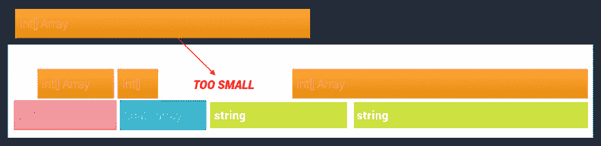

图 18.31：试图在碎片化内存空间中实例化一个对象

一些垃圾回收系统类型，如常规 C#中的系统，是分代的，这意味着内存根据其“年龄”被分成代桶。较新的内存将被放置在第一个桶中，这种内存倾向于频繁地分配和释放。因为这个桶很小，所以在其中工作很快。第二个桶包含在第一个桶中经过先前释放扫描过程的内存。这种内存被移动到第二个桶中，以防止它被不断检查是否通过了这个过程，并且这种内存可能持续我们程序的生命周期。第三个桶只是第二个桶的另一层。想法是，大多数时候，分配和释放系统将在第一个桶中工作，因为它足够小，所以快速分配、释放和连续压缩内存。

有关 Unity 如何管理内存以及内存碎片化的更详细信息，请参阅以下链接：[`docs.unity3d.com/Manual/performance-managed-memory.html`](https://docs.unity3d.com/Manual/performance-managed-memory.html)

这里的问题是 Unity 使用它自己的垃圾回收系统版本，而这个版本是非代际和非压缩的，这意味着内存不会被分成桶，内存也不会被移动来填补空隙。这表明在 Unity 中分配和释放内存仍然会导致碎片化问题，如果你不管理你的内存分配，你可能会频繁执行昂贵的垃圾回收系统，这会在我们的游戏中产生中断，你可以在 **Profiler CPU Usage** 模块中看到，以浅黄色表示。

处理这个问题的一种方法是在尽可能的情况下防止内存分配，在不必要的时候避免它。这里有一些小调整可以防止内存分配，但在查看这些调整之前，再次强调，在开始修复可能不是问题的东西之前，首先了解问题的数据是非常重要的。这条建议适用于任何类型的优化过程。在这里，我们仍然可以使用 **CPU 使用率** 分析器来查看 CPU 在每一帧中执行每个函数调用时分配了多少内存，这很简单，只需查看 **GC Alloc** 列，它表示函数分配的内存量：

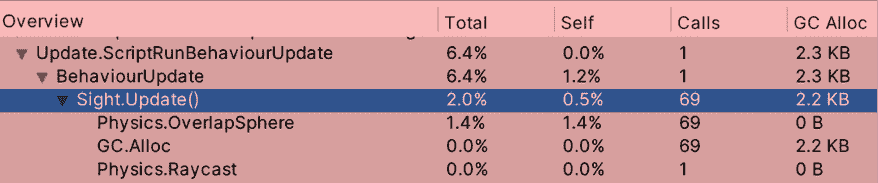

图 18.32：Sight 更新事件函数的内存分配

在前面的屏幕截图中，我们可以看到我们的函数分配了过多的内存，这是由于场景中有许多敌人造成的。但这并不是借口；我们每帧都在分配这么多的 RAM，因此我们需要改进这一点。有几件事情可能导致我们的内存被分配所占用，让我们先从返回数组的函数开始讨论基本问题。

如果我们回顾一下 `Sight` 脚本代码，我们可以看到我们分配内存的唯一时刻是在调用 `Physics.OverlapSphere` 时，这一点很明显，因为它是一个返回数组的函数，这类函数会返回不同数量的数据。为了做到这一点，它需要分配一个数组并将该数组返回给我们。这需要在创建函数的那一侧，即 Unity 上进行，但在这个案例中，Unity 给我们提供了两个版本的函数——我们正在使用的版本和 `NonAlloc` 版本。通常建议使用第二个版本，但 Unity 使用另一个版本来简化初学者的编码。

`NonAlloc` 版本如下截图所示：

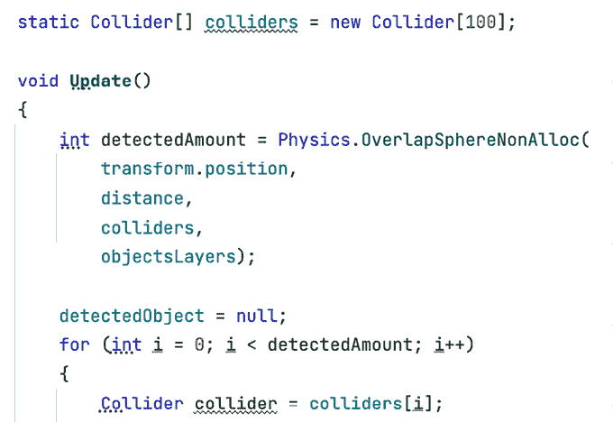图 18.33：Sight 更新事件函数的内存分配

这个版本要求我们分配一个足够大的数组来保存`OverlapSphere`变量能找到的最大数量的碰撞器，并将其作为第三个参数传递。这允许我们只分配一次数组，并在需要时重复使用它。在前面的截图中，你可以看到数组是静态的，这意味着它在所有`Sight`变量之间共享，因为它们不会并行执行（没有`Update`函数）。这将工作得很好。请记住，该函数将返回检测到的对象数量，所以我们只需迭代这个计数。数组可以存储之前的结果。

现在，检查你的分析器并注意分配的内存量已经大大减少。在我们的函数中可能还有一些剩余的内存分配，但有时无法将其保持在`0`。然而，你可以尝试使用深度分析或通过注释一些代码来查看哪个注释消除了分配。我挑战你尝试这个，并观察哪些变化导致内存分配值减少。此外，`OverlapSphere`并不是唯一可能发生这种情况的案例。你还有其他，例如`GetComponents`函数家族，与`GetComponent`不同，它找到给定类型的所有组件，而不仅仅是第一个组件，所以请注意 Unity 中任何返回数组的函数，并尝试用非分配版本替换它，如果有的话。

另一个常见的内存分配来源是字符串连接。记住，字符串是不可变的，这意味着如果你连接两个字符串，它们不能改变。第三个需要生成足够的空格来容纳前一个字符串。如果你需要多次连接，如果你只是在一个模板字符串中替换占位符，例如在消息中放入玩家的名字和得分，考虑使用`string.Format`，或者使用`StringBuilder`类，它只是将所有要连接的字符串放在一个列表中，并在必要时将它们连接在一起，而不是像**+**运算符那样逐个连接。此外，考虑使用 C#的新字符串插值功能。你可以在以下截图中看到一些示例：

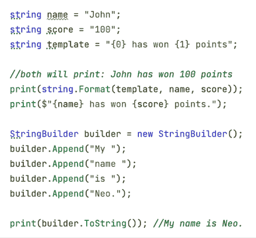

图 18.34：C#中的字符串管理

最后，一个值得考虑的经典技术是对象池，适用于需要不断实例化和销毁对象的情况，例如子弹或效果。在这种情况下，使用常规的`Instantiate`和`Destroy`函数会导致内存碎片化，但对象池通过分配尽可能多的所需对象来解决这个问题。它通过从预分配的函数中取一个来替换`Instantiate`，并通过将对象返回到池中来替换`Destroy`。

以下截图显示了简单的池：

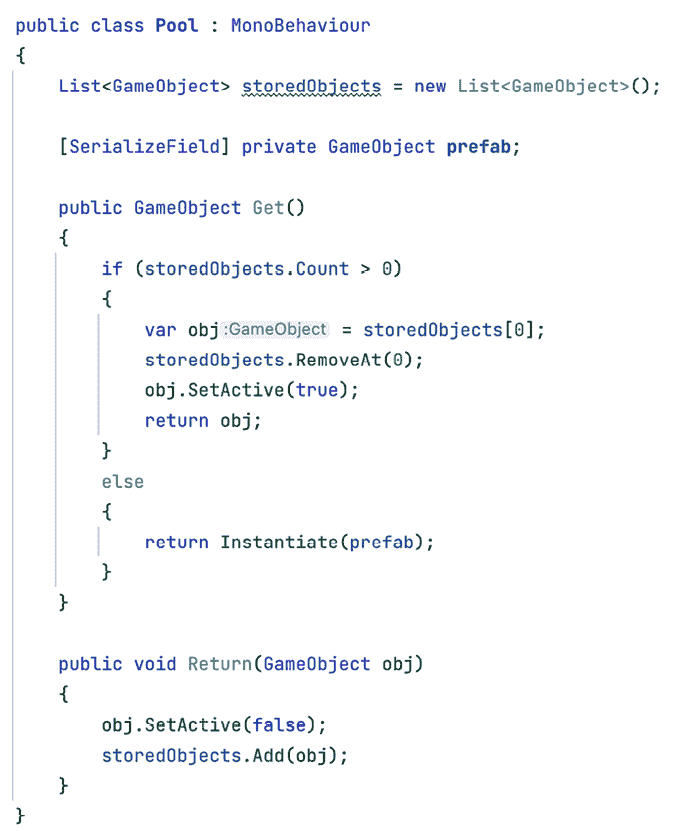

图 18.35：一个简单的对象池

有几种方法可以改进这个池，但就目前而言，它已经足够好了。请注意，当对象从池中取出时，需要重新初始化它们，您可以使用 `OnEnable` 事件函数或创建一个自定义函数来通知对象这样做。

请注意，Unity 最近添加了一个 Object Pool 类，您可以在以下链接中调查：[`docs.unity3d.com/2023.1/Documentation/ScriptReference/Pool.ObjectPool_1.html`](https://docs.unity3d.com/2023.1/Documentation/ScriptReference/Pool.ObjectPool_1.html)，但我仍然建议您先自己创建一个，以掌握池的概念。

现在我们已经探索了一些基本的内存分配减少技术，让我们看看 Unity 之前版本中引入的新的**内存分析器**工具，现在它不再是预览包，而是作为 1.0.0 版本提供，以更详细地探索内存。

## 使用内存分析器

使用这个分析器，我们可以按帧检测分配的内存，但它不会显示到目前为止分配的总内存，这对于研究我们如何使用内存非常有用。这就是**内存分析器**能帮到我们的地方。这个相对较新的 Unity 包允许我们在原生和托管方面对每个分配的对象进行内存快照——*原生*意味着内部 C++ Unity 代码，*托管*意味着属于 C# 方面的任何内容（即，我们的代码和 Unity 的 C# 引擎代码）。我们可以使用可视化工具探索快照，并快速查看哪种类型的对象消耗了最多的 RAM 以及它们是如何被其他对象引用的。

要开始使用**内存分析器**，请执行以下操作：

1.  打开**包管理器**（**窗口 | 包管理器**）并查找内存分析器包。在撰写本书时，您可以看到可用的最新稳定版本是 1.1.0：

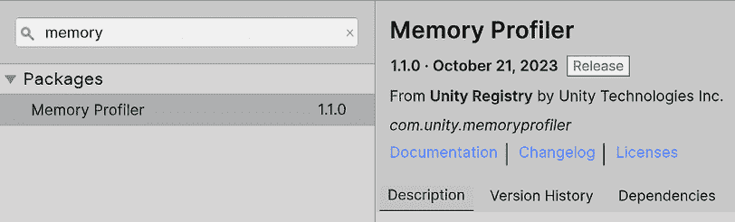

图 18.36：启用预览包

1.  安装完成后，在**窗口 | 分析 | 内存分析器**中打开内存分析器。

1.  播放游戏并点击**内存分析器**窗口中的**捕获**按钮：

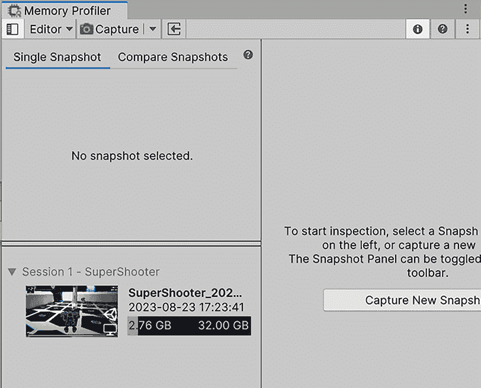

图 18.37：捕获快照

1.  点击列表中出现的快照（位于**Session 1**标签下方）以查看快照时刻的内存消耗摘要：

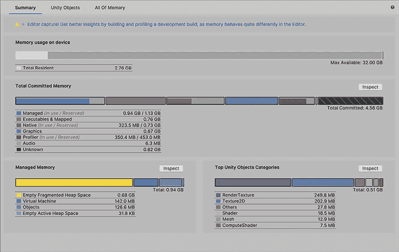

图 18.38：内存摘要

1.  在我们的案例中，我们可以看到我们消耗了 2.76 GB 的内存，分为**托管**（C#代码变量）、**可执行文件和映射**（应用程序的构建代码）、**原生**（Unity 的 C++内存）、**图形**（图形驱动程序和 GPU 内存使用以渲染我们的场景）、**分析器**（因为我们正在分析我们的会话）、**音频**和**未知**（无法分类的内存，如第三方原生插件所做的分配）。这些类别中有不同的东西需要考虑，但就目前而言，我们已经足够好了。在**包管理器**中打开包文档以获取更多关于它们的信息。

1.  点击**内存分析器**窗口中间部分顶部部分的**Unity 对象**选项卡。这将打开**Unity 对象视图**，允许您以表格格式直观地看到哪些类型的资产在内存方面要求更高：

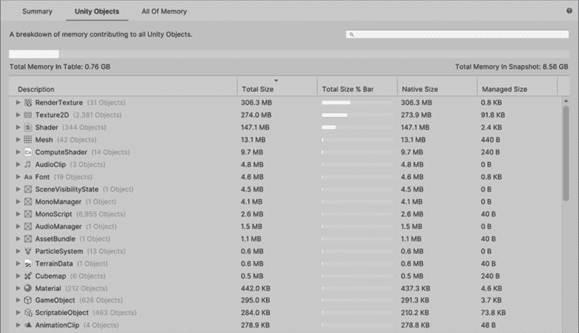

图 18.39：内存树视图

1.  在我们的案例中，我们可以看到`RenderTexture`消耗了最多的内存，这属于场景中显示的图像，以及一些用于后期处理效果的纹理。尝试禁用`PPVolume`对象并再次拍摄快照以检测差异。

1.  在我的情况下，这减少了 56 MB。还有其他用于其他效果的纹理，例如 HDR。如果您想探索剩余的 MB 来自哪里，请点击**RenderTexture**左侧的箭头以查看其对象列表，并根据纹理名称进行自己的猜测：

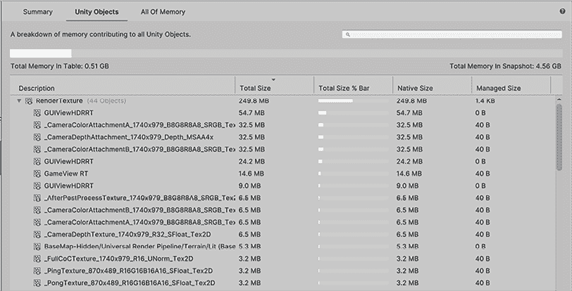

图 18.40：内存块详细情况

1.  您可以在`Texture2D`列表中重复相同的过程，这属于我们模型材料中使用的纹理。您可以查看最大的一个并检测其使用情况——可能是一个大纹理，从未被足够接近地看到，以证明其大小合理。然后，我们可以使用**纹理最大尺寸**导入设置来减小其大小。

1.  您还可以使用**Unity 对象视图**底部的两个复选框，将层次结构中出现的所有对象（没有任何组或类别）展平，以查找任何可能的重复对象（即，在项目中错误地重复相同的资产）。

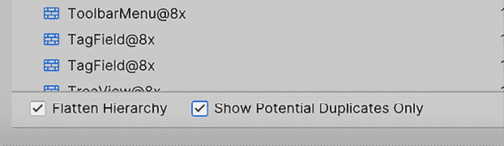

图 18.41：过滤 Unity 对象组的显示

就像任何分析器一样，始终在构建过程中进行性能分析非常有用（关于这一点将在下一章中详细介绍），因为在编辑器中拍摄快照将捕获大量编辑器使用的内存，这些内存在构建中不会被使用。一个例子是加载不必要的纹理，因为编辑器可能是在您点击它们以在**检查器**窗口中查看预览时加载它们的。

考虑到**内存分析器**是一个包，其 UI 可能会经常变化，但其基本理念将保持不变。您可以使用此工具检测您是否以意外的方式使用内存。这里值得考虑的一个有用因素是 Unity 在加载场景时如何加载资源，这包括在加载时加载场景中引用的所有资源。这意味着您可以有，例如，一个预制体数组，这些预制体引用了具有引用纹理的材料，即使您没有实例化它们的单个实例，预制体也必须在内存中加载，从而占用空间。在这种情况下，我建议您探索使用`Addressables`，它提供了一种动态加载资源的方法。但现在让我们保持简单。

内存分析器还具备比较两个快照的功能。这对于检测游戏中两个特定时刻（例如，在开始关卡之前和开始下一个关卡之后）之间的内存泄漏（在 C#中，这可能是由于未取消引用的引用引起的）和未释放的资源非常有用。有关更多详细信息，请参阅此文档：`docs.unity3d.com/Packages/com.unity.memoryprofiler@1.0/manual/snapshots-comparison.html`

# 摘要

优化游戏并非易事，尤其是如果你不熟悉每个 Unity 系统的工作原理。遗憾的是，这是一个巨大的任务，没有人知道每个系统最细微的细节，但通过本章中学习到的工具，我们可以探索如何通过探索来了解变化对系统的影响。我们学习了如何分析 CPU、GPU 和 RAM，以及任何游戏中关键硬件的内容。我们还介绍了一些常见的良好实践，以避免滥用它们。

现在，您可以在游戏中诊断性能问题，收集关于 CPU、GPU 和 RAM 这三件主要硬件性能的数据，然后使用这些数据将您的优化努力集中在应用正确的优化技术。性能很重要，因为您的游戏需要运行流畅，以给用户带来愉快的体验。

在下一章中，我们将了解如何创建一个无需安装 Unity 即可与他人分享的游戏构建版本。这对于分析也非常有用，因为分析构建将比在编辑器中进行分析提供更准确的数据。

# 在 Discord 上了解更多

与其他用户、Unity 游戏开发专家和作者本人一起阅读此书。提出问题，为其他读者提供解决方案，通过“问我任何问题”会议与作者聊天，等等。扫描二维码或访问链接加入社区：

[`packt.link/unitydev`](https://packt.link/unitydev)

