# 从原型到可执行文件：生成和调试你的游戏

因此，我们已经达到了一个阶段，游戏的状态足够好，可以用来测试真实用户，这是一个理论设计遇到实际应用的时刻。问题是，我们不能假装人们会安装 Unity，打开一个项目，然后点击**Play**。他们希望得到一个可以直接双击并立即播放的漂亮的可执行文件。在本章的第一节中，我们将讨论如何将我们的项目转换成一个易于分享的可执行格式，然后在第二节中，我们将看到如何应用上一章学到的性能分析和调试技术，但这次是在构建过程中。阅读完本章后，你将能够检测潜在的性能瓶颈并解决最常见的瓶颈，从而提高你游戏的帧率。

在本章中，我们将探讨以下构建概念：

+   构建项目

+   构建调试

让我们先看看如何构建项目以获得一个可分享的可执行文件。

# 构建项目

在软件开发（包括视频游戏）中，将我们项目的源文件转换为可执行格式的过程被称为**构建**。生成的可执行文件针对项目的配置进行了优化，以实现可能的最大性能。由于项目的不断变化，我们在编辑游戏时无法判断性能。在编辑游戏的同时准备最终形式的资产将非常耗时。

此外，生成的文件格式难以阅读。它们不会包含纹理、音频和源代码文件，供用户查看。它们将以自定义的文件结构格式化，因此从某种意义上说，它们被保护免受用户窃取。

实际上，有几个工具可以从视频游戏中提取源文件，尤其是从广泛使用的引擎，如 Unity 中提取。你可以提取如纹理和 3D 模型这样的资产，甚至有程序可以直接从 VRAM 中提取这些资产，所以我们不能保证这些资产不会被用于游戏之外。最终，用户将拥有这些资产的磁盘数据。

当你针对桌面平台，如 Windows、Mac 或 Linux 时，构建过程相当简单，但在构建之前，我们需要注意一些设置。我们将首先看到的第一项配置是场景列表。我们已经讨论过这个问题，但这是一个很好的时刻来记住，设置列表的第一个元素为第一个要加载的场景是很重要的。记住，你可以通过转到**文件** | **构建设置**并将你希望作为启动场景的所需场景拖到列表顶部来完成此操作。在我们的例子中，我们将游戏场景定义为第一个场景，但在实际游戏中，使用 UI 和一些图形创建一个**主菜单**场景将是理想的：

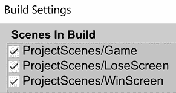

图 19.1：构建列表中的场景顺序

您还可以在此处更改的另一个设置是目标平台，即构建将为其创建的目标操作系统。通常，这设置为与您正在开发的相同操作系统，但如果您，例如，在 Mac 上开发，并希望为 Windows 构建，只需将**目标平台**设置更改为**Windows**。这样，结果将是一个`.exe`文件（Windows 可执行文件）而不是`.app`文件（Mac 可执行文件）。您可能还会看到 Android 和 iOS 作为其他目标平台，但制作移动游戏需要考虑其他因素，这些因素我们将在本书中不讨论：

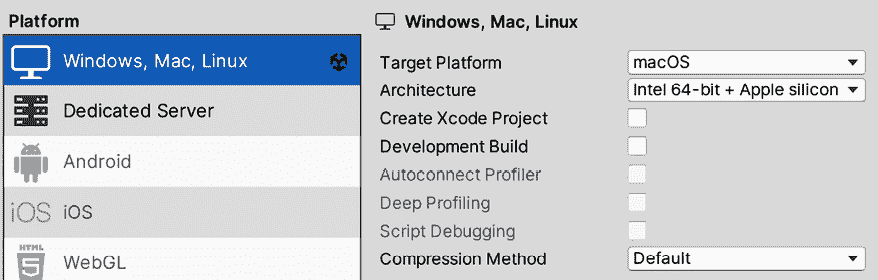

图 19.2：目标平台

在同一窗口中，您可以点击左下角的**玩家设置**按钮，或者直接打开**编辑** | **项目设置**窗口，点击**玩家**类别以访问其余的**构建设置**。Unity 将生成的可执行文件称为`Player`。在此处，我们有一组配置，将影响构建或玩家的行为，以下是基本配置列表：

+   **公司名称**：这是开发游戏的公司的名称，Unity 将使用它来创建某些文件路径，并将包含在可执行文件信息中。

+   **产品名称**：这是窗口标题栏和可执行文件中的游戏名称。

+   **默认图标**：在此处，您可以选择一个纹理作为可执行文件图标。

+   **默认光标**：您可以设置一个纹理来替换常规系统光标。如果您这样做，请记住将**光标热点**属性设置为图像中您想要光标点击的像素。

+   **分辨率和显示设置**：这些设置决定了我们的游戏分辨率如何处理。

+   **分辨率和显示设置** | **全屏模式**：您可以选择游戏是启动为**窗口模式**还是不同的**全屏**模式。如果需要，您可以通过脚本更改此设置。

+   **分辨率和显示设置** | **默认为原生分辨率**：当此选项被勾选且**全屏模式**设置为使用任何**全屏**选项时，系统当前使用的分辨率将被 Unity 使用。您可以取消勾选此选项并设置您想要的分辨率。

+   **启动画面**：这些是游戏首次加载后显示的启动画面的设置。

+   **启动画面** | **显示启动画面**：这将启用 Unity 启动画面，显示标志作为游戏的介绍。如果您拥有 Unity Pro 许可证，您可以取消勾选此选项以创建自定义的启动画面。此外，当 Unity 6 发布时，即使使用免费许可证，也可以禁用启动画面。

+   **启动画面** | **标志列表**：在这里，您可以添加一组 Unity 在启动游戏时将显示的图片。如果您使用的是 Unity 的免费版本，您将被迫在这个列表中显示 Unity 标志。

+   **启动画面 | 绘制模式**：您可以将其设置为**全部顺序**以逐个显示每个标志，或者设置为**Unity 标志在下方**以显示您的自定义介绍标志，而 Unity 标志始终位于您的标志下方：

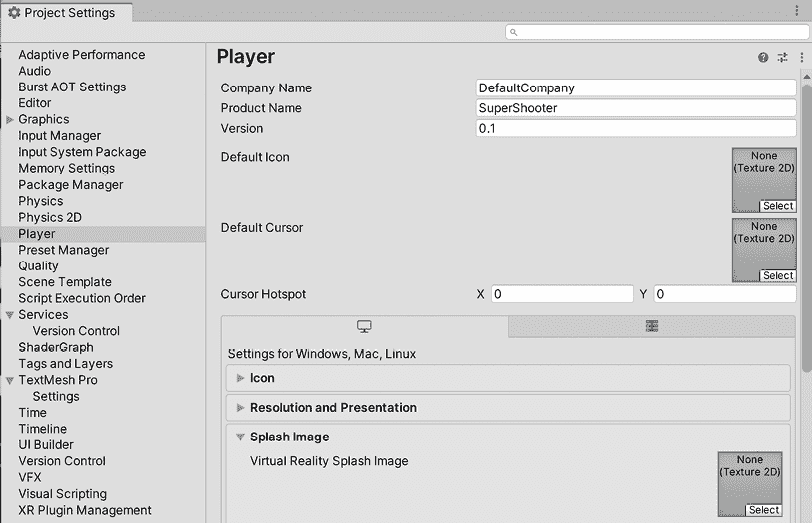

图 19.3：玩家设置

有关玩家设置的更多信息，请查看以下链接：[`docs.unity3d.com/2023.1/Documentation/Manual/class-PlayerSettings.html`](https://docs.unity3d.com/2023.1/Documentation/Manual/class-PlayerSettings.html)

在您希望配置这些设置后，下一步是进行实际构建，这可以通过在**文件** | **构建设置**窗口中点击**构建**按钮来完成。这将要求您设置构建文件要创建的位置。我建议您在桌面上创建一个空文件夹，以便轻松访问结果。请耐心等待——这个过程可能需要一段时间，具体取决于项目的大小：

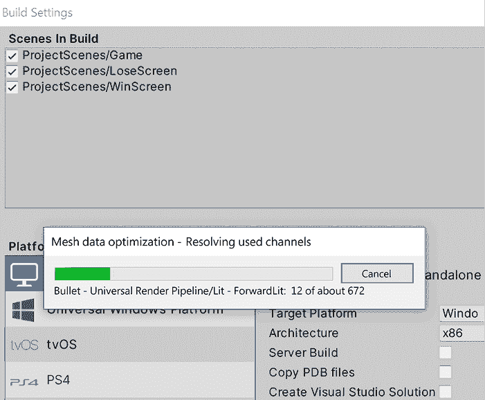

图 19.4：构建游戏

这里可能会失败的是存在不兼容构建的脚本——这些脚本仅打算在编辑器中执行（主要是编辑器扩展）。我们还没有创建任何这样的脚本，所以如果您在构建后控制台中有错误消息，类似于以下截图，那可能是因为 Asset Store 包中的某个脚本。在这种情况下，只需删除在**构建错误**消息之前控制台中显示的文件。如果其中包含您的脚本，请确保您的任何脚本中都没有`using UnityEditor;`行。

这将尝试使用编辑器命名空间，即不包括在构建编译中以便在磁盘上节省空间的命名空间：

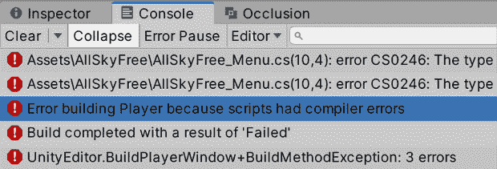

图 19.5：构建错误

为了配置构建，你需要知道的最少信息就是这些。你已经生成了你的游戏！记得在不同设备上测试你的构建，尤其是在移动平台开发时；有时游戏在不同平台上可能会有不同的表现，甚至在某些硬件上由于不兼容而完全无法运行。这些不兼容性可能高度依赖于特定硬件，并且必须逐个案例进行研究。需要注意的是，在构建时你指定的文件夹中创建的每个文件都必须共享，而不仅仅是可执行文件。数据文件夹包含所有资源，在 Windows 构建共享游戏时非常重要。对于 Linux 和 Mac 构建，只生成一个文件（Linux 为`x86/x86_64`，Mac 为`app packages`）：

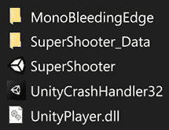

图 19.6：Windows 生成的文件夹

现在我们有了构建，你可以通过双击可执行文件来测试它。我们现在可以讨论如何使用在编辑器中使用的相同的调试和性能分析工具来调试我们的构建。

# 调试构建

在理想的世界里，编辑器和构建的行为应该是相同的，但遗憾的是，事实并非如此。编辑器已经准备好在快速迭代模式下工作。代码和资源在使用前进行最小处理，以便频繁快速地做出更改，这样我们就可以轻松测试我们的游戏。当游戏构建时，会应用一系列优化和与编辑器项目的差异，以确保我们能够获得最佳性能，但这些差异可能会导致游戏某些部分的行为不同，使得玩家的性能数据与编辑器不同。这就是为什么我们要探讨如何调试和性能分析我们所构建的游戏。

在本节中，我们将探讨以下构建调试概念：

+   调试代码

+   性能分析

让我们先讨论如何调试构建的代码。

## 调试代码

由于玩家代码的编译方式不同，构建中可能会出现编辑器中没有出现的错误，我们需要以某种方式调试它。我们有两种主要的调试方式——通过打印消息和通过断点。所以，让我们从第一种方式开始，消息。如果你运行了你的可执行文件，你可能已经注意到没有可用的控制台。它只是全屏的**游戏视图**，这是有道理的；我们不希望用令人烦恼的测试消息分散用户的注意力。幸运的是，消息仍然被打印出来，但它们在一个文件中，所以我们可以直接去那个文件查找它们。

位置根据操作系统而变化。在这个列表中，你可以找到可能的地址：

+   **Linux**: `~/.config/unity3d/CompanyName/ProductName/Player.log`

+   **Mac**: `~/Library/Logs/Company Name/Product Name/Player.log`

+   **Windows**: `C:\Users\username\AppData\LocalLow\CompanyName\ProductName\Player.log`

在这些路径中，你必须将 `CompanyName` 和 `ProductName` 替换为我们之前在 `Player` 设置中设置的属性的值，这些属性分别称为 **公司名称** 和 **产品名称**。在 Windows 中，你必须将 `username` 替换为你正在执行游戏的 Windows 账户名称。请注意，文件夹可能被隐藏，所以请启用操作系统中的显示隐藏文件选项。在那个文件夹中，你会找到一个名为 `Player` 的文件；你可以用任何文本编辑器打开它并查看消息。

除了从 Asset Store 下载任何自定义包之外，还有一种方法可以直接在游戏中查看控制台消息，至少是错误信息：通过创建开发构建。这是一种特殊的构建，它允许在交换不进行最终构建那样的完全优化代码的情况下，提供扩展的调试和性能分析功能，但这对一般调试来说已经足够了。

你可以通过在 **文件** | **构建设置** 窗口中勾选 **开发构建** 复选框来创建这种类型的构建：

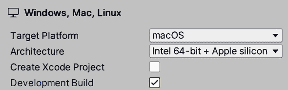

图 19.7：开发构建复选框

记住，这里只显示错误信息，所以你可以使用的一个小技巧是将 `print` 和 `Debug.Log` 函数调用替换为 `Debug.LogError`，这样也会在控制台打印消息，但会显示红色图标。请注意，使用 `Debug.LogError` 来显示非错误信息并不是一个好的做法，所以请限制这类消息的使用，仅用于临时调试。对于永久记录，请使用日志文件或在 Asset Store 中寻找运行时的自定义调试控制台。

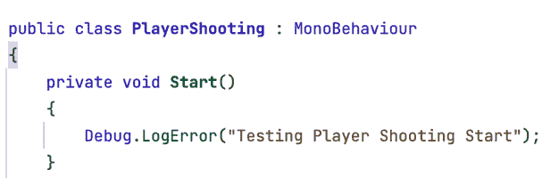

图 19.8：调试错误信息

关于开发构建的一个有趣之处是，与常规构建不同，错误信息会直接显示在构建中，允许你正确地调试你的项目。请记住，由于这些功能，开发构建可能会更慢，因为它们旨在用于调试并允许性能分析器工作，但最终发布构建的性能会更好。在下一张截图中，你可以看到运行时显示的错误：

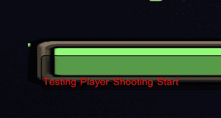

图 19.9：开发构建中的错误信息

你会注意到，除了显示错误信息之外，在右侧还有一个 **打开日志文件** 按钮，允许你查看日志文件。这是一个文本文件，包含有关游戏中发生的所有消息和日志的详细信息，以便定位问题。本质上，这是与编辑器中 **控制台** 面板显示的相同信息。

请记住，为了使**开发构建**工作，你需要再次构建游戏；幸运的是，第一次构建是最耗时的，接下来的构建会更快。这次，你只需点击**构建并运行**按钮，在之前构建的文件夹中进行构建。

此外，你还可以像我们在*第五章*，*释放 C#和视觉脚本的力量*中解释的那样，使用常规断点。通过将 IDE 连接到播放器，它将出现在目标列表中。但为了使其工作，你必须在**构建**窗口中不仅勾选**开发构建**，还要勾选**脚本调试**。

在这里，当勾选时，你会看到一个额外的选项，允许你暂停整个游戏，直到附加调试器，这个选项叫做**等待托管调试器**。当你想要测试一开始立即发生的事情，但给你附调试器的时间不够时，这很有用：

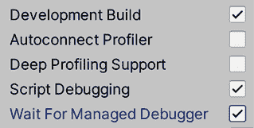

图 19.10：启用脚本调试

我们还有另一种查看消息的方法，但这需要性能分析器工作，所以让我们以此为借口也讨论一下如何对编辑器进行性能分析。

## 性能分析

我们将使用与上一章中看到相同的工具，但这次是为了分析播放器。幸运的是，差异很小。正如我们在上一节中所做的那样，你需要以**开发**模式构建播放器，在**构建**窗口中勾选**开发构建**复选框，然后性能分析器应该会自动检测到它。

让我们从以下步骤开始使用性能分析器对构建进行分析：

1.  通过构建运行游戏。

1.  使用*Alt* + *Tab*（Mac 上的*Cmd* + *Tab*）切换到 Unity。

1.  打开性能分析器。

1.  点击名为**播放模式**的菜单，并选择包含**播放器**的项。因为我使用了 Mac，它说**OSXPlayer**；并且名称将根据构建平台而变化（例如，Windows 构建将显示为**WindowsPlayer**）：

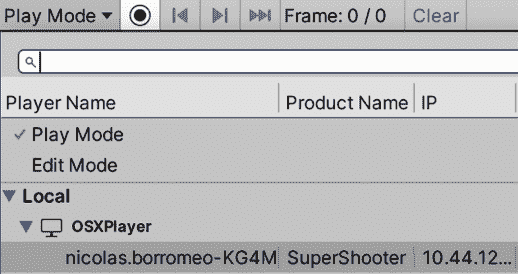

图 19.11：分析播放器

注意，当你点击一个帧时，游戏不会像在编辑器中那样停止。如果你想专注于特定时刻的帧，你可以点击记录按钮（红色圆圈），这样性能分析器就会停止捕获数据，你可以分析到目前为止捕获的帧。

此外，你可以看到当性能分析器附加到播放器时，控制台也会附加，因此你可以在 Unity 中直接查看日志。请注意，这个版本需要打开 Unity，我们无法期望测试我们游戏的朋友也有它。你可能需要点击**控制台**上出现的**播放器**按钮，并勾选**播放器日志**才能使其工作：

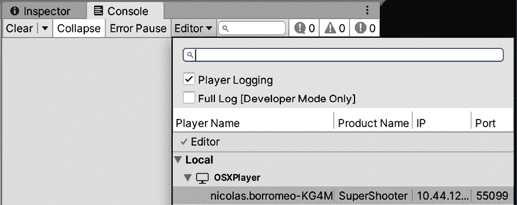

图 19.12：在附加 Profiler 后启用玩家日志记录

**帧调试器**也已被启用以与玩家协同工作。您需要在**帧调试器**中点击**编辑器**按钮，然后再次点击，您将在可能的调试目标列表中看到玩家；选择它后，按常规点击**启用**。请注意，**绘制调用**的预览将不会在**游戏视图**中显示，而是在构建本身中显示。如果您正在全屏模式下运行游戏，您可能需要在 Unity 和构建之间来回切换：

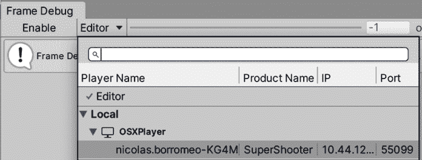

图 19.13：调试我们游戏玩家的帧

您还可以以**窗口模式**运行游戏，将玩家设置中的**全屏模式**属性设置为**窗口模式**，并设置一个小于您桌面分辨率的默认分辨率。这允许 Unity 和玩家同时可见，以便同时看到分析器和游戏：

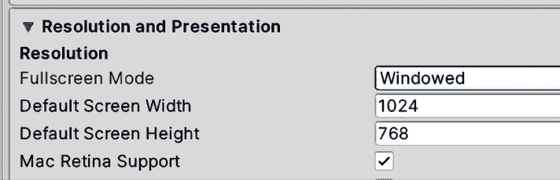

图 19.14：启用窗口模式

最后，**内存分析器**也支持分析玩家，正如您所猜测的，您只需在点击窗口顶部栏中的**编辑器**按钮时显示的列表中选择玩家，然后点击**捕获**：

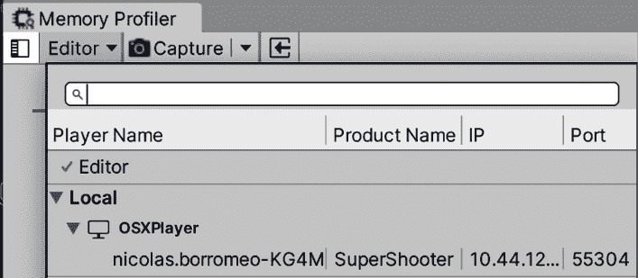

图 19.15：获取玩家的内存快照

就这样。如您所见，Unity 分析器被设计成易于与玩家集成。如果您开始从它们那里获取数据，您将看到与编辑器分析相比的差异，尤其是在**内存分析器**中。

# 摘要

在本章中，我们学习了如何创建游戏的可执行版本，并正确配置它，以便我们可以与我们的朋友以及可能的世界分享！我们还讨论了如何分析我们的构建；请记住，这样做将比分析编辑器提供更准确的数据，因此我们可以更好地提高我们游戏的表现力。

现在我们已经完成了我们的游戏，让我们通过在下一章中探索 AR Foundation 包来一窥您的下一个项目如何轻松地成为一个 Unity 增强现实应用程序。

# 在 Discord 上了解更多

与其他用户、Unity 游戏开发专家和作者本人一起阅读此书。提出问题，为其他读者提供解决方案，通过 Ask Me Anything 会议与作者聊天，等等。扫描二维码或访问链接加入社区：

[`packt.link/unitydev`](https://packt.link/unitydev)

