# 巨大世界：DOTS 简介

虽然 Unity 是一个强大且性能良好的引擎（当正确使用时），但你拥有的 GameObject 数量有限，否则会达到性能限制。虽然**面向对象编程**（**OOP**）范式提供了一种方便的方式来编写游戏，但由于其内部工作方式，它并不总是能充分利用所有现代 CPU 功能，如缓存、**单指令多数据**（**SIMD**）操作和多线程。虽然在 OOP 中使用这些功能并非不可能，但这样做并非易事，可能会导致难以追踪的 bug。Unity 针对该问题的解决方案是发布第一个生产就绪版本的 DOTS 包，这将帮助我们解决这些问题。

在本章中，我们将探讨以下构建概念：

+   理解 DOTS 是什么

+   创建我们的第一个 DOTS 游戏

+   在 DOTS 中创建游戏玩法

让我们先了解一下 DOTS 是什么以及为什么我们应该使用它。

# 理解 DOTS 是什么

Unity 数据导向技术堆栈（DOTS）是一组 Unity 包，使我们能够轻松编写数据导向的代码。虽然 DOTS 堆栈中有许多包，但让我们专注于三个关键的包，它们是其余部分的支柱：

+   **实体**：Unity 采用 ECS 模式。它用实体、组件和系统（ECS，Unity 中一种将数据（组件）与逻辑（系统）分离的范式，增强性能和可扩展性）替换 GameObject 和 MonoBehaviours，这是一种缓存友好的方式来存储和更新我们的场景对象。它提供了相当大的性能提升，尤其是在拥有大量对象的游戏中。

+   **作业**：Unity 创建多线程代码的方式。它将处理作业的数据和代码分组。它们在作业调度器的并行执行下运行，该调度器保证尊重作业之间的显式依赖关系。这避免了经典的多线程问题，如死锁和竞态条件。Unity 使用作业来提高其不同系统的性能，如渲染或物理。它不能应用于未经重大修改的常规 MonoBehaviour 方法，如 Update，但实体与作业高度兼容。

+   **Burst**：一种代码编译器，可以将 C#脚本转换为高度优化的本地代码。它使用 LLVM，在编译时应用高级优化。要转换的代码需要使用 C#的一个子集，称为**高性能 C#**（**HPC**#），因此它不能应用于任何脚本而不进行（有时）相当大的修改。

虽然这些包可以单独使用（尤其是作业和突发包），但想法是将它们混合起来，以并行化我们使用作业编写的 ECS 游戏逻辑，同时 Burst 使其尽可能快地运行。其他 DOTS 包提供不同的功能，如渲染（实体图形）、物理（Unity 物理和 Havok）和网络（实体网络代码）。

所有这些都听起来很棒，但使用这项技术时有一些注意事项。以下是最重要的几点：

+   这是从 GameObject 方法的基本转变。这意味着你必须重新学习如何做你已经习惯用 GameObject 和 MonoBehaviours 做的事情。

+   学习曲线可能很陡峭，这取决于你的编程经验。这是由于 HPC#的限制导致的 C#功能有限，需要学习自定义 API，以及其代码的多线程特性。即使 Jobs 包易于使用，它也增加了单线程代码中不存在的挑战。

+   它还处于早期阶段。短期内其 API 可能发生重大变化（变得更好！）幸运的是，面向数据的原则不会改变，这意味着我们不需要再次学习它们，只需学习相关的 API。

+   一些 GameObject 功能在 DOTS 中尚不可用，如 UI、音频、地形或动画。目前，您需要在 GameObject 中实现这些功能，并将它们与其相应的实体同步。这是一项艰巨的任务，需要几个自定义解决方案。

不论如何，这些障碍并没有阻止使用 DOTS 制作雄心勃勃的游戏，如 V-Rising 和 Cities Skylines 2。讨论 DOTS 的注意事项的目的不是恐吓，而是理解何时使用它是合理的。我刚才提到的游戏是 DOTS 发光的绝佳例子，因为这些游戏模拟了拥有大量对象的大型世界。以下是一个不全面的列表，列出了可能从使用 DOTS 中受益的游戏：

+   需要复杂模拟逻辑以高效运行的大型世界和多个对象。此类示例包括大型多人在线游戏（MMOs）、城市建造游戏或模拟庞大世界的 RPG，如 Cyberpunk 2077 或刺客信条。

+   复杂的模拟需要现实生活中的行为，如风洞模拟、建筑可视化，甚至星系星模拟。

+   基于 GameObject 的游戏的特定功能可以使用 DOTS，例如足球场的观众群或复杂的粒子系统。DOTS 和 GameObject 可以在同一游戏中共存。

另一方面，运行良好的简单游戏不需要 DOTS 的困难和当前限制。例如，需要两个主要对象（战斗者）和最小环境的格斗游戏不是好的候选者。其他例子是像 Firewatch 这样的休闲开放世界探索游戏，即使它们有探索的大型景观，但逻辑足够简单，可以通过使用 GameObject 的一些巧妙技巧来应对。最终，Firewatch 没有使用 DOTS。

这些限制将在未来得到解决，使得所有类型的游戏使用 DOTS 都变得可行，但到目前为止，让我们避免以可能风险其开发的方式开始一个项目。我并不是说 DOTS 是危险的，但我想清楚地表明，并不是每个游戏都值得从头开始重新学习新技术所付出的努力和风险。

如果你经过仔细考虑和研究后认为你的未来项目可能从使用 DOTS 中受益，那么请继续跟随我们；在下一节中，我们将通过一个简单的入门项目来学习 DOTS 的工作原理。

# 创建第一个 DOTS 游戏

要创建具有高性能的 DOTS 游戏，有很多东西需要学习，所以让我们从一个简单的项目开始，该项目包含向前移动的立方体。强调立方体——我们将拥有成千上万个！我知道这不是最令人兴奋的项目，但请耐心等待，因为在本章的*在 DOTS 中创建游戏玩法*部分，我们将将其转换成一个实际（但简单）的游戏。

在本节中，我们将探讨以下 DOTS 概念：

+   创建 DOTS 项目

+   使用子场景创建实体

+   创建组件和烘焙器

+   使用工作（Jobs）和爆发（Burst）创建系统

+   调试系统工作（jobs）和查询（queries）

让我们先讨论如何设置一个与 DOTS 兼容的项目。

## 创建 DOTS 项目

创建 DOTS 项目的第一步是你应该在本章的这个阶段已经知道的：创建一个全新的 URP 项目。如果你不确定如何操作，请参阅*第一章*，*踏上你的 Unity 之旅*。确保你使用的是**3D (URP**)模板，因为 DOTS 只与 URP 和 HDRP 兼容，而本书没有涵盖 HDRP。如果需要，你也可以将 DOTS 添加到现有项目中。

现在，是时候安装所需的 DOTS 包了。我们提到有三个关键包：实体（Entities）、工作（Jobs）和爆发（Burst），我们也提到其余的包都是基于它们构建的。除了这些包之外，我们还需要**实体图形（Entities Graphics**）来渲染我们的实体。鉴于这个包依赖于核心 DOTS 包，只需安装它就会带来神圣的三个包。

如果你忘记了如何安装包，请参阅*第三章*的*从蓝图到现实：使用地形和 ProBuilder 构建*中的*安装 ProBuilder*部分。那些说明安装了**ProBuilder**包，但步骤可以推广到安装这个包。在撰写本章时，**实体图形**版本为 1.0.16。

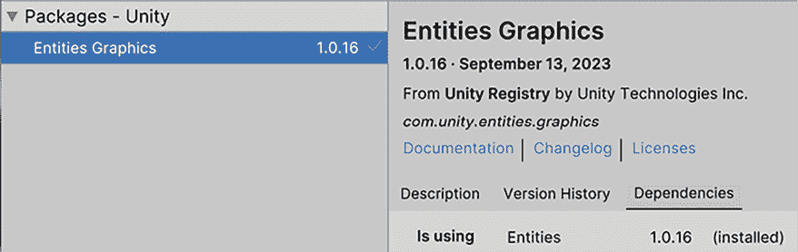

图 21.1：安装实体图形以及作为依赖的实体包

你可能会收到有关**Burst**包更新的消息，这可能会导致 Unity 不稳定。像往常一样，在安装新包时重新启动 Unity 以修复问题。

下一步是更改 URP 设置以使用 Forward+，这是 DOTS 用于渲染的新 URP 渲染路径。执行以下操作：

1.  选择当前使用的 SRP 资产，如*第十二章*的*配置高性能阴影*部分中所述。在我的情况下，该资产被称为**URP-HighFidelity**，因此你也可以在**项目**面板中通过名称搜索它。

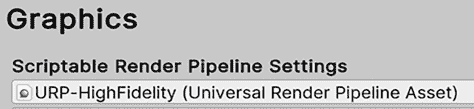

图 21.2：查看当前 SRP 资源的使用情况。

1.  在 SRP 资源的**渲染器列表**中，双击其第一个元素以选择渲染器资源。在我的情况下，它被称为**URP-HighFidelity-Renderer**，所以再次，你可以在**项目**面板中搜索它。

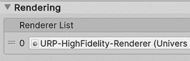

图 21.3：选择 SRP 资源使用的渲染器资源

1.  在渲染器资源中，将**渲染路径**选项设置为**Forward+**。

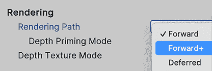

图 21.4：激活 Forward+作为当前渲染路径

1.  在编辑器中按下**播放**按钮以确保一切正常工作。如果你在控制台看到像*图 21.5*中的警告消息，请确保你正在修改正确的资源。控制台消息将告诉你需要更改的资源名称。

图 21.5：在播放 DOTS 项目且未使用 Forward+时的警告消息

考虑到如果游戏允许更改质量设置并且游戏具有选项菜单，可能还会使用其他 URP 渲染器资源。在这种情况下，将所有渲染器资源更改为使用 Forward+。

关于 Forward+的讨论超出了本章的范围。更多信息，请查看以下链接：`docs.unity3d.com/Packages/com.unity.render-pipelines.universal@14.0/manual/rendering/forward-plus-rendering-path.html`

有一个额外的步骤对于 DOTS 工作不是必需的，但它会使编辑器体验更快。只需转到**编辑 | 项目设置 | 编辑器**并勾选**进入播放模式选项**复选框。这将避免在编辑器中每次播放游戏时发生的昂贵域重新加载过程。虽然这可能对于基于 GameObject 的项目是必要的，但纯 DOTS 项目可以避免它。在制作混合 DOTS 游戏时启用此选项。

有方法可以在 GameObject 项目中使用播放模式选项。查看以下文档链接以获取更多信息：[`docs.unity3d.com/Manual/ConfigurableEnterPlayMode.html`](https://docs.unity3d.com/Manual/ConfigurableEnterPlayMode.html)

现在我们已经正确设置了项目，让我们创建我们的第一个实体。

## 使用子场景创建实体

虽然实体与 GameObject 的工作方式不同，但你仍然会在编辑器中使用 GameObject 来创建实体。想法是使用你熟悉的 Unity 工具，如**场景**、**层次结构**和**检查器**面板，甚至预制体。这是通过将特定的 GameObject 及其组件转换为它们的实体等效物来实现的。我们将在本章后面通过脚本实例化实体。

要在编辑器中将 GameObject 转换为实体，我们将使用烘焙系统。它使用烘焙器——负责将特定组件转换为其实体等效的脚本。一些 DOTS 包附带烘焙器以转换特定的 Unity 组件；例如，Entities Graphics 包含将`MeshFilter`和`MeshRenderer`组件转换为其实体版本的烘焙器。转换后的版本可能与原始版本有很大差异，通常一个组件可以转换为多个 ECS 组件。如果您没有安装 Entities Graphics 包，`MeshFilter`和`MeshRenderer`在转换时将被丢弃，因为项目中没有为它们提供烘焙器，这将导致您的实体无法渲染。在本章的后面部分，我们将创建自己的烘焙器。

告诉 Unity 哪些 GameObject 应该被转换的方法是通过子场景，这是一个将仅包含要转换的 GameObject 的另一个场景。主要场景通过使用负责转换和加载子场景中的实体的 SubScene 组件来加载实体子场景。请注意，转换发生在编辑器中，这意味着在从构建中玩游戏时不会发生转换。这允许通过场景序列化的方式快速加载子场景。

要创建子场景，请执行以下操作：

1.  在现有场景中，在层次结构中的任何空白空间处右键单击，并选择**New Sub Scene | Empty Scene**选项。如果您看到该选项变灰，请确保首先保存主场景。

图 21.6：创建子场景

1.  在保存文件提示中，像保存常规场景一样保存子场景。

1.  这将在主场景中创建一个带有**SubScene**组件的 GameObject。它将具有 Scene Asset 属性设置为引用我们创建的子场景文件。如果**New Sub Scene**选项不可用，手动创建子场景资产和 GameObject，直到它看起来像*图 21.7*。

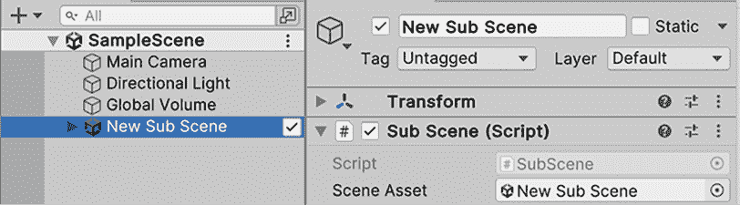

图 21.7：加载我们刚刚创建的子场景资源的子场景组件

1.  确保在层次结构中子场景 GameObject 的复选框被勾选，因为它允许您编辑子场景并向其中添加对象。

1.  使用**GameObject | 3D Object | Cube**创建一个立方体，并将其拖动到层次结构中的子场景内。确保您在子场景内创建它，注意*图 21.8*中看到的缩进。如果它是在子场景外创建的，立方体看起来是正确的，但因为它仍然是一个常规的 GameObject。

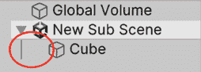

图 21.8：显示立方体位于子场景内的缩进

1.  要确认立方体已被转换，选择它并检查**Inspector**底部的**Entity Baking Preview**。点击它以显示从立方体的原始组件转换而来的 ECS 组件列表。

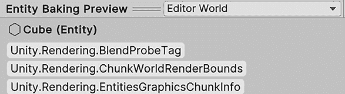

图 21.9：显示从您的原始立方体创建的 ECS 组件的 Entity Baking Preview

1.  确保场景相机指向立方体，然后开始游戏。你必须看到立方体在 **游戏** 面板中被渲染。确保相机不在子场景内部；我们需要它成为一个经典的 GameObject。

就这样！你已经创建了你的第一个实体！当然，它并没有做什么特别的事情，但现在我们可以开始添加自定义行为到它上面，首先是通过添加 ECS 组件。

## 创建组件和烘焙器

在创建 ECS 组件之前，让我们先讨论一下它们与 GameObject 组件的不同之处。将 GameObject 组件想象成一个工具箱中的单个工具——每个工具都是为了特定的任务而设计的，比如渲染形状或检测碰撞。它们独立工作，但共同构成了你在游戏中对象的功能。另一方面，ECS 组件更像是工厂生产线上的原材料；它们本身不执行任何操作。相反，它们被系统高效地处理和组装，以创建所需的行为。这种从使用单个工具（GameObject 组件）到处理原材料（ECS 组件）的转变，使得 Unity 能够优化游戏性能，尤其是在包含许多对象的复杂场景中。

虽然我们仍然想要向实体添加组件以添加行为，但 ECS 组件的责任仅限于仅持有数据。这意味着它们不会有 Updates 或其他事件，如 `OnTriggerEnter`；它们只是纯粹的数据。它们可以有方法来方便地操作这些数据，但不能是核心游戏逻辑。

你可能会想知道我们的逻辑将放在哪里，答案是系统。我们将在本章后面创建它们，但首先，让我们添加我们的游戏逻辑所需的工作实体数据。

我所说的数据是指像我们角色的子弹、分数、健康点、位置等这样的变量。我们通常在 `MonoBehaviours` 中创建字段来达到这样的目的，这里也没有不同，但这次，我们不会使用继承自 `MonoBehaviour` 的类。相反，我们将使用实现 `IComponentData` 的 struct。Struct 允许 Entities 包以与 **垃圾回收器** 工作方式不同的方式管理我们组件的内存，通过以利用 CPU 缓存的方式组织它。Structs 还与 HPC# 兼容，这是与 Burst 兼容的 C# 子集。关于 Burst 和 CPU 缓存将在本章后面进行讨论。

C# 中 struct 和 class 的区别超出了本书的范围。你可以在这里了解更多信息：[`learn.microsoft.com/en-us/dotnet/standard/design-guidelines/choosing-between-class-and-struct`](https://learn.microsoft.com/en-us/dotnet/standard/design-guidelines/choosing-between-class-and-struct)

你可以通过在**项目**面板中使用加号按钮创建一个脚本，选择**C#脚本**选项，并按你想要创建的组件命名来创建一个组件。不要使用**检查器**中的**添加组件**按钮创建脚本，因为我们需要在将组件添加到待转换的 GameObject 之前执行一些额外步骤。我们建议将所有 ECS 组件的脚本放在一个`Scripts/ECS/Components`文件夹中，以便轻松区分你的常规 Unity 脚本和 ECS 脚本。

由于我们想让我们的立方体向前移动，我们需要一个速度值。具有转换数据（如位置和旋转）的组件是由 Entities 包中包含的 Transform 烘焙器添加的。要创建我们的速度 ECS 组件，首先创建一个名为`Velocity`的脚本，并在其中放入以下代码。

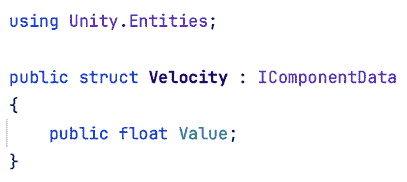

图 21.10：一个包含实体速度的 ECS 组件

记住，我们不应该使用类；而应该使用结构体。虽然你可以使用类，但它们将是一种不同类型的组件（受管理组件），性能会低得多，而且我们现在不需要它们。此外，注意我们如何包含了`Unity.Entities`命名空间。就这样！我们有了我们的第一个 ECS 组件！但我们的任务还没有完成。如果你尝试将这个组件添加到子场景中的立方体，它将不会工作。我们的组件不会在**检查器**的**添加组件**按钮中列出，你甚至不能像往常一样拖放脚本文件。记住，烘焙系统需要一个用于我们的 ECS 组件的烘焙器以及一个用于转换的`MonoBehaviour`。

策略是使用 GameObject 和`MonoBehaviours`来使用现有的 Unity 工具创建场景，并通过烘焙器将它们转换为实体。到目前为止，我们创建了 ECS 组件，但我们仍然需要该组件的`MonoBehaviour`版本以将其添加到子场景的 GameObject 中。我们组件的`MonoBehaviour`版本被称为**编写组件**，而 ECS 组件是**运行时组件**。要创建编写组件，创建一个常规组件，从编辑器配置我们想要的字段。在下面的图像中，你可以看到`VelocityAuthoring`组件：

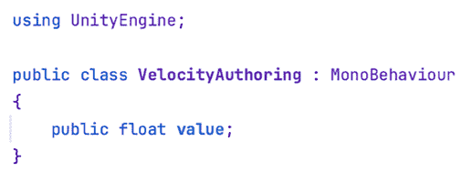

图 21.11：我们的速度运行时组件的编写组件

这只是我们习惯创建的经典`MonoBehaviour`组件，具有与我们的运行时组件相同的字段。现在，我们有了可以添加到子场景中的编写 GameObject 的组件，只需将其添加到立方体即可。如果你检查**检查器**底部的**实体烘焙预览**面板，没有添加新的 ECS 组件。我们仍然需要创建烘焙器将`VelocityAuthoring`转换为`Velocity`。烘焙器是一个从`Baker`类继承的类，它将编写组件转换为运行时组件。在下一张图像中，你可以看到我们的`VelocityAuthoring`组件的烘焙器。

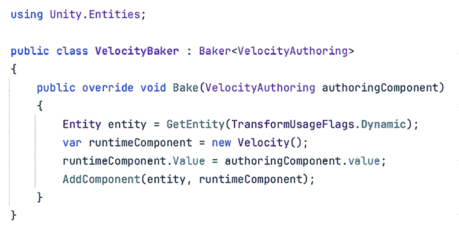

图 21.12：将 VelocityAuthoring 组件转换为运行时组件的烘焙器

如你所见，我们创建了一个从 `Baker<VelocityAuthoring>` 继承的类，这意味着当烘焙系统进行转换时，这将作为 `VelocityAuthoring` 的烘焙器。在 `Bake` 方法中，我们接收要转换的实例化创作组件，访问其数据以创建运行时组件。

首先，我们使用 `GetEntity` 方法获取为转换的 GameObject 创建的实体。它的唯一参数突出显示了我们想要在播放模式期间移动此对象。因此，它是动态的。然后，我们创建运行时组件的实例，并将其速度值设置为与创作组件相同。这样，我们确保在检查器中设置的值是运行时组件将拥有的值。最后，我们使用 `AddComponent` 方法将运行时组件添加到转换后的实体。

有关 `GetEntity` 中使用的不同变换使用标志的更多信息，请参阅此链接：`docs.unity3d.com/Packages/com.unity.entities@1.0/manual/transforms-usage-flags.html`

如果你保存了你的脚本并确保将创作组件添加到立方体中，**实体烘焙预览** 窗口应该会显示 **Velocity** 运行时组件。你可以点击它并确认其值与创作组件相同。

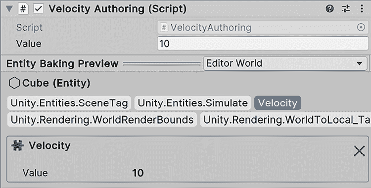

图 21.13：实体烘焙预览显示了我们的运行时组件如何反映创作组件的值

虽然创建组件看起来需要很多工作，但在实际项目中，这成为一种强大的工具。创作组件可能会添加几个运行时组件，有时是条件性的。例如，**Unity 物理包** 中的 **Rigidbody** 烘焙器将根据是否勾选或取消勾选 **Is Kinematic** 添加不同的组件。

既然我们已经有了所需的数据，让我们创建一个系统来移动我们的立方体。

## 使用作业和 Burst 创建系统

正常的 MonoBehaviours 不仅具有数据，还有创建它们所代表的行为的逻辑。有时，它们需要来自其他组件的数据，例如 `Transform` 中的位置，因此它们使用 `GetComponent` 等方法来访问其他组件的数据。在 ECS 中，这工作方式相当不同。

给定的 ECS 组件仅包含数据，逻辑则进入一个称为 **系统** 的不同位置。它们将游戏逻辑，例如移动或旋转对象，应用于需要此类逻辑的实体。系统通过其数据来识别哪些实体必须应用其逻辑。系统将查询所有具有特定组件集的实体，以便其逻辑能够工作，并将迭代结果实体以应用该逻辑。在这种情况下，我们想要移动实体，但不是所有实体，只是具有 `Velocity` 组件和位置数据的实体。

由于所有 GameObject 都有**变换**组件，因此我们的系统需要具有位置数据这一说明可能令人困惑。在 DOTS 中这并不一定正确，这在前文提到的`TransformUsageFlags`属性信息框中有更详细的解释。在这个项目中，我们将始终使用`TransformUsageFlag.Dynamic`，因此对于这种情况，我们可以假设所有实体都将具有诸如位置、旋转和缩放之类的变换数据。

要创建我们的运动系统，首先，我们需要创建一个脚本，如下面的图像所示：

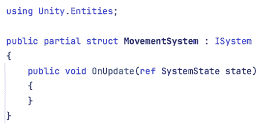

图 21.14：一个空 ECS 系统，用作创建我们的运动系统的基础

一个系统由一个实现`ISystem`接口的部分结构组成。由于 DOTS 依赖于代码生成器，因此需要部分实现，这意味着使系统正常工作的许多样板代码将位于为我们自动创建的另一个`MovementSystem`部分结构中。我们还添加了一个`OnUpdate`方法，这是 MonoBehaviour 的`Update`方法的等效方法，但有一个非常重要的区别。

再次，`partial`关键字超出了本书的范围。有关更多信息，请查看以下链接：[`learn.microsoft.com/en-us/dotnet/csharp/programming-guide/classes-and-structs/partial-classes-and-methods`](https://learn.microsoft.com/en-us/dotnet/csharp/programming-guide/classes-and-structs/partial-classes-and-methods)

正常的`Update`方法属于特定的组件，这意味着`Update`将在每个组件实例上执行一次。如果我们有 100 个带有`MonoBehaviour`和`Update`方法的`GameObjects`，那么该方法将在每帧执行 100 次，每次针对一个`GameObject`。但在这个情况下，默认情况下，游戏中始终有一个我们的系统实例，它由实体包自动创建，不管场景中存在哪些实体。这意味着我们的运动系统`OnUpdate`方法将在我们开始玩游戏时每帧执行一次，仅仅因为系统脚本存在。有方法可以防止自动系统创建，拥有多个系统实例，并防止`OnUpdate`执行，但让我们保持简单。

保存好系统脚本后，为了确保其正常工作，请玩游戏并在游戏模式中，在**窗口 | 实体 | 系统**中打开`系统`面板。此窗口将列出所有正在运行的系统和它们的性能指标。

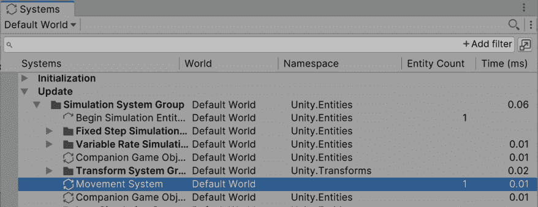

图 21.15：显示我们的运动系统的系统窗口。

下一步是迭代所有具有`Velocity`和`LocalTransform`组件的实体。后者是 Transform bakers 添加的几个 Transform ECS 等效组件之一。迭代实体有多种方式，但让我们首先看看最常见且性能最高的方式，即使用作业。作业是包含我们想要在多个线程中应用逻辑和数据（如 delta 时间或要移动的对象的位置）的结构体。在我们的案例中，数据将是实体组件和一些额外数据，如 delta 时间。为了迭代实体，我们有一种名为`IJobEntity`的作业类型。有大量的作业类型用于不同的目的，但对于 ECS，我们大部分时间将使用`IJobEntity`。

在下面的图中，你可以看到一个移动所有具有`Velocity`和`LocalTransform`的实体的作业脚本：

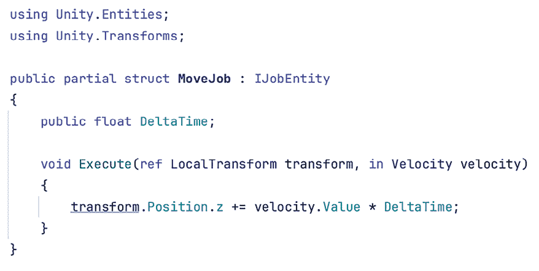

图 21.16：一个移动具有局部变换和速度组件的实体的作业

这里发生了很多事情，所以让我们逐个分析这个脚本：

1.  我们在脚本中创建了一个部分结构体，该结构体实现了`IJobEntity`，该脚本使用了`Unity.Entities`和`Unity.Transforms`命名空间。

1.  这个结构体有一个带有两个参数的执行方法，一个是`LocalTransform`类型，另一个是`Velocity`类型。这些参数与我们需要移动实体的确切组件相匹配并非巧合。在`IJobEntity`的`Execute`方法中定义的参数用于告诉 ECS 我们想要迭代具有此类组件的实体，忽略没有这些组件的实体。

1.  `LocalTransform`参数前缀为`ref`关键字，而`Velocity`前缀为`in`关键字。这些是告诉 ECS 我们想要对这些组件拥有什么权限的方式。`Ref`表示我们将修改`LocalTransform`，而`in`表示我们只读取`Velocity`的数据。为了确保任何作业都可以安全地与其他作业并行执行，作业系统需要知道它们中的数据将如何被处理。两个写入相同数据的作业（例如，以不同方式移动对象的两个作业）不能并行执行，以防止竞态条件和使用锁。然而，如果只读操作是线程安全的，那么可以并行执行读取相同数据的两个作业。始终尽可能将参数定义为`in`（只读），只在必要时使用`ref`。

1.  我们通过将速度乘以 delta 时间来计算移动的米数。我们通常不是使用`Time.deltaTime`来访问 delta 时间。为了允许安全的作业并行化，它们被设计成只处理作业内部的数据，尽可能避免访问静态变量。这就是为什么 delta 时间是一个结构体字段，这样当我们在我们系统中实例化作业时，我们将填充这些数据。

1.  在 `MonoBehaviours` 中，直接修改由 `transform.position` 返回的轴（不将其存储在变量中）是不可能的；因为 `transform.position` 返回的是位置的一个副本，修改它将引发错误。同样适用于任何其他获取器。但在 ECS 中，这是完全有效的，因为我们是通过引用而不是副本来操作数据的。我们通过 `ref` 关键字访问了 `LocalTransform`，这意味着我们直接访问了位置内存。在常规的 `MonoBehaviours` 中，这是不可能的，因为我们的 GameObjects 的位置存储在 Transform 的 C++ 方面，因此需要副本。

如果作业不是 Burst 编译的（关于这一点稍后讨论），则作业可以访问可变静态数据。但即使这是可能的，也是非常危险的，因为 ECS 安全系统无法防止两个作业修改此类静态数据。这就是为什么将数据复制到作业中，就像我们使用 `Time.deltaTime` 一样，更安全。

现在，`MovementSystem` 的唯一责任是实例化作业，填写其数据，并安排它。通过安排它，作业系统将负责检查何时执行我们的作业是安全的，考虑到其他系统的作业可能如何读取和写入我们的作业所需的数据。记住，使用 `ref` 和 `in` 关键字定义我们的组件的读写或只读访问权限的想法是允许作业调度器考虑这些因素。

我们系统的 `OnUpdate` 方法将如下所示：

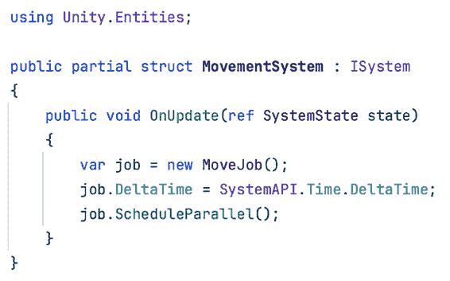

图 21.17：移动系统实例化 MoveJob 并安排它

如您所见，我们只是实例化作业，将 `DeltaTime` 字段填充为这一帧的 delta time，然后使用 `ScheduleParallel` 安排作业。首先要注意的是，我们使用了 `SystemAPI.Time.DeltaTime`，这是 ECS 获取帧 delta time 的方法。

ECS 有自己的计时机制，虽然我们仍然可以使用 `Time.DeltaTime`，但我们应该坚持使用 ECS 版本来与系统的其余部分正常工作。此外，我们没有指定作业将迭代的实体。系统代码生成器知道我们想要迭代的实体，基于系统作业的 `Execute` 方法参数，所以我们不需要担心向作业提供此数据。

最后，我们使用了 `ScheduleParallel` 方法，不仅告诉作业调度器安排我们的作业，还告诉它我们想要并行迭代实体。这意味着作业工作线程（通常每个 CPU 核心一个）将处理不同的实体，通过分散工作来减少执行我们的逻辑所需的时间。您也可以使用 `Schedule`，它在一个核心中处理所有我们的实体，但仍然与其他作业并行。目前，我们将继续使用 `ScheduleParallel` 大多数情况。

现在我们需要 DOTS 三叉戟的最后一部分，Burst。记住，Burst 会将 HPC#兼容的代码转换为高性能的本地代码。以下是一个非详尽的 HPC#要求的列表：

+   使用托管引用（对象）是不可能的。这包括字符串、数组、列表、字典以及大多数 C#库，如`System.Collections`。

+   异常（try/catch）在编辑器中工作，但在构建中会终止执行。

+   `Debug.Log`的支持仅限于常量字符串、字符串插值和`string.Format`。

+   静态只读数据和常量是安全的。除非使用`SharedStatic`结构，否则可变静态数据不安全：`docs.unity3d.com/Packages/com.unity.burst@1.8/manual/csharp-shared-static.html`

到目前为止，我们在代码中使用了 HPC#，所以我们只需要使用`BurstCompile`属性标记代码以进行 Burst 编译。在系统中，您可以将此属性添加到`OnUpdate`方法中，对于作业，将属性添加到`job`结构中以 Burst 编译其`Execute`方法。

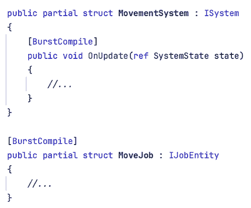

图 21.18：Burst 编译我们的系统和作业

在代码中遵循一些注意事项可以使 Burst 工作得更快。查看此链接获取更多信息：`docs.unity3d.com/Packages/com.unity.burst@1.8/manual/optimization-overview.html`

现在，您可以玩游戏并观察我们的立方体如何向前移动。您可以随意将立方体复制到场景中，直到您有数百甚至数千个。看看游戏性能是否受到影响！

当实体配置错误，例如忘记添加`Velocity`组件时，系统可能无法按预期工作。这可能导致系统找不到它们需要的实体。让我们看看如何调试系统以查看它们找到的实体、它们正在安排的作业以及检查它们的代码是否是 Burst 编译的。

## 调试系统作业和查询

系统通过迭代具有特定组件的实体，使用作业和其他方法来应用逻辑。为了调试一个不工作的系统，我们应该检查它是否正在查找实体。为此，系统代码生成器创建了`EntityQuery`的实例，这是一种负责查找具有特定组件的实体的类型。我们的`MoveJob`作业需要具有`LocalTransform`和`Velocity`组件的实体，因此`MovementSystem`会自动为它生成一个实体查询以安排其作业。系统可以迭代不同的实体组（例如，在安排多个作业时），因此系统可以有多个查询。实体查询也可以手动创建用于其他目的，但现在我们不需要它们。

实体查询速度快，因为它们缓存了原型块。这些内存块存储具有相同组件集的实体，因此很容易追踪所需实体的位置。有关原型的更多信息，请参阅以下链接：`docs.unity3d.com/Packages/com.unity.entities@1.1/manual/concepts-archetypes.html`

我们可以在播放模式下使用**系统**窗口（**窗口 | 实体 | 系统**）来查看我们的系统找到了多少实体以及所有找到它们的查询。检查系统的**实体计数**列。此外，在列表中选择系统后，**检查器**将显示系统查询，并告知每个查询组件。

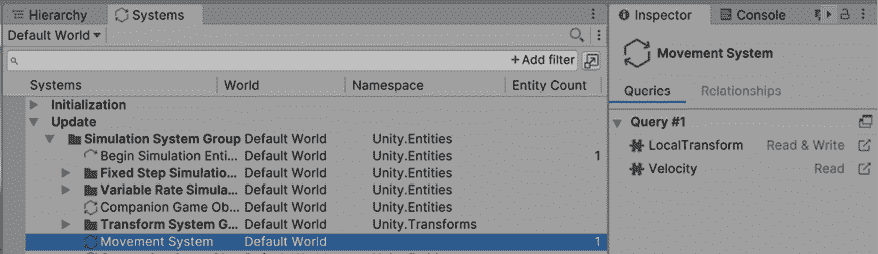图 21.19：使用系统窗口和检查器检查系统的查询

使用**关系**选项卡来查看哪些实体与查询匹配。在以下图像中，你可以看到我们的查询正在找到我们的立方体。

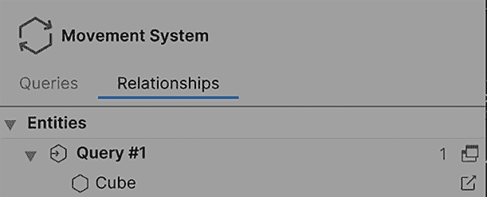

图 21.20：检查与系统查询匹配的实体。

如果你的查询没有匹配到预期的实体，请检查这些实体是否具有所需的组件。很容易忘记将创作组件添加到我们的实体中，甚至忘记将创作游戏对象放入子场景中，错误地将它们留在主场景中。

另一件事要检查的是我们的系统是否正在安排作业，以及系统和作业是否是 Burst 编译的。为此，我们可以执行以下操作：

1.  打开 Unity 分析器，就像我们在第十八章中看到的那样，*性能巫术：使用分析器工具优化你的游戏*。

1.  在播放模式下捕获分析数据，并选择任何一帧。

1.  如果你还没有在**时间轴**视图中，可以通过点击 CPU 使用模块中的任何位置，点击**层次结构**按钮以显示选择框，然后点击**时间轴**来启用该视图。

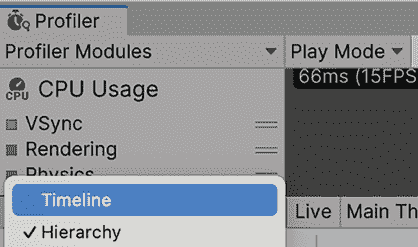

图 21.21：在分析器的 CPU 模块中启用时间轴模式

1.  通过使用鼠标滚轮放大来在**时间轴**中搜索你的作业。你的系统应该在**SimulationSystemGroup**分析器标记内。请注意，即使我们有成千上万的实体，我们的系统也只安排一个作业来迭代它们，所以它的标记会非常小。

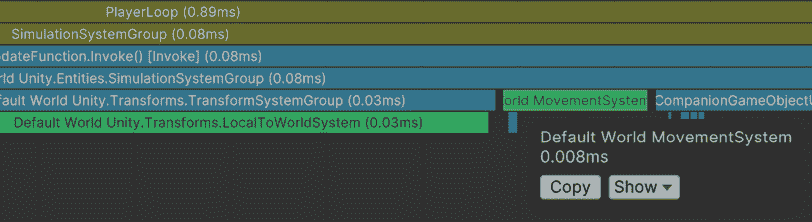

图 21.22：在分析器中找到我们的系统

1.  检查标记颜色。如果是浅绿色，则表示它是 Burst 编译的。如果是浅蓝色，则不是，这意味着我们没有将`BurstCompile`属性添加到`OnUpdate`方法中，或者我们尝试了 Burst 编译非 HPC#代码。注意以下图像中非 Burst 编译版本比 Burst 编译版本慢得多。

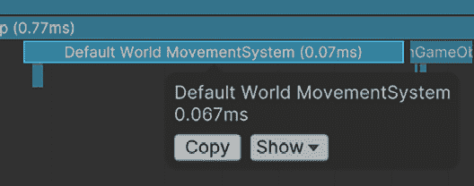

图 21.23：非 Burst 编译的系统代码

1.  在分析器中，点击时间线右上角的三点按钮（不是窗口右上角类似的三点按钮）并启用**显示流程事件**。这将使我们能够看到系统安排的工作。

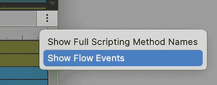

图 21.24：启用流程事件

1.  在时间线中选择我们的系统，并跟随线条到工作。你应该在多个线程中看到它的几个实例，因为每个实例处理不同的实体组（如果足够的话）。记得使用左侧的灰色三角形展开工作线程组，以查看工作详情。

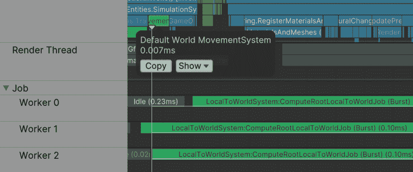

图 21.25：检查系统安排的工作。

1.  检查作业的标记颜色是否为浅绿色。如果不是，请记住将`BurstCompile`方法添加到`job`结构体中（而不是`Execute`方法）。

在本节中，我们讨论了如何创建和配置一个 DOTS 项目，以及如何创建一个子场景，我们将 GameObject 放置其中以将其转换为实体。我们还创建了一个运行时组件（`Velocity`），通过 baker（`VelocityBaker`）添加到转换后的实体中，该组件将作者组件（`VelocityAuthoring`）转换为运行时组件。我们使用速度值创建了一个系统，该系统安排了一个工作，将速度应用于每个实体的`LocalTransform`位置，从而移动实体。最后，我们看到了如何调试我们的系统，检查它们创建的查询以在作业中迭代实体，并使用 Unity Profiler 查看系统-作业关系和性能。

当然，我们只是刚刚触及 DOTS 的表面。在下一节中，我们将看到如何创建更有趣的游戏玩法，如移动和生成敌人。

# 在 DOTS 中创建游戏玩法

我们在 MonoBehaviours 中做的许多事情，比如实例化对象或获取其他对象数据（例如，它们的位置），在 DOTS 中的实现方式相当不同。在本节中，我们将检查如何在 DOTS 中实现这些事情：

+   使用输入和标签组件移动

+   使用组件查找创建寻找导弹

+   使用实体命令缓冲区销毁角色

+   处理爆发的代码中的错误

+   使用实体预制体实例化导弹

+   让摄像机跟随我们的角色

+   探索其他 DOTS 功能

让我们先讨论如何修改我们的移动代码以响应输入。

## 使用输入和标签组件移动

让我们从使用输入来移动立方体开始创建游戏玩法。我们需要更改我们的移动作业，以便为其提供输入值。我们将以与通过传递输入值到作业中提供 delta time 相同的方式进行此操作。在下一张图片中，你可以看到所需的变化：

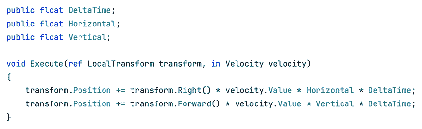

图 21.26：根据我们的输入移动我们的角色

虽然 `LocalTransform` 有一个 `Translate` 方法，但它并不是在相对坐标中移动。这就是为什么我们需要使用 `Right` 和 `Forward` 方法来构建运动向量，这些方法提供了相对于我们对象的这些方向。我们通过在前进方向上添加一个向量，并将其乘以当前输入的 `Vertical` 值和 `DeltaTime` 来对位置进行类似的更新，以实现向前移动。

最后，我们修改了我们的系统，以提供如下输入值：

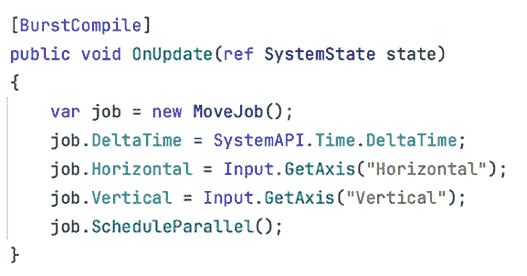

我们在这里为了简单起见使用了传统的输入系统。你可以自由地使用新的系统。现在，你可以玩游戏并使用输入来控制立方体。我们删除了所有额外的立方体，只留下一个来代表我们的玩家。

需要考虑的是，虽然我们的移动系统会移动带有 `Velocity` 组件的任何东西，但可能会有其他具有速度的对象以不同的方式移动（例如，通过 AI）。我们需要区分通过输入应用速度的对象和以不同方式应用速度的对象。一种方法是将我们的 `velocity` 组件重命名为类似“`PlayerVelocity`”的东西，然后为其他未来的移动方法创建其他速度组件。虽然这会起作用，但这可能不是最佳方法，具体取决于你的游戏需求。假设我们有一个加速区域，它会加速区域内的任何实体。如果我们使用多组件方法，我们的区域将需要考虑我们拥有的所有不同的速度组件，这会使我们的代码变得复杂。

另一种方法可能是给我们的玩家实体添加一个独特的组件来区分它与其他实体，在我们的任务中请求这样的组件。但这样的组件不需要任何数据。我们能否添加一个没有数据的组件？是的！我们称它们为标签组件。正如其名所示，它们作为标记实体以便系统可以轻松找到的一种方式。

如果你阅读了之前提供的原型链接，你应该知道添加标签组件会将实体分割成不同的块。为了避免有太多只有少数实体的块，请避免为单个实体添加过多的唯一标签组件。这种现象被称为原型碎片化。

首先，让我们为我们的 `Player` 标签创建运行时组件、创作组件和烘焙器。请记住将 `PlayerAuthoring` 组件添加到我们的玩家实体（立方体）中。

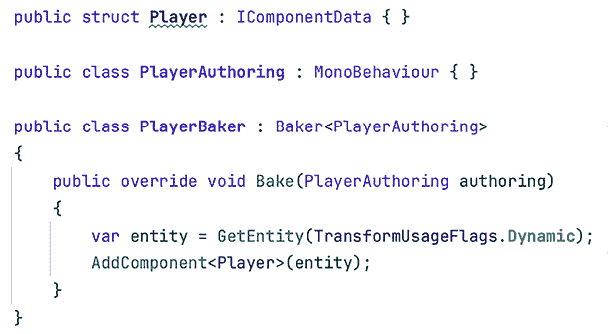

我们没有创建一个新的`Player`组件来添加。相反，我们使用了`AddComponent<Player>` API，指定`Player`为要添加的组件。一旦添加到玩家实体中，让我们使用这个标签组件在我们的任务中使其仅移动带有该标签的实体。虽然我们可以像之前添加其他组件那样将`Player`作为任务的`execute`方法参数，但我们不会读取或写入它上的数据——毕竟它没有数据。相反，另一种让我们的任务迭代具有特定组件的实体的方法是使用`WithAll`属性，如下一张图片所示：

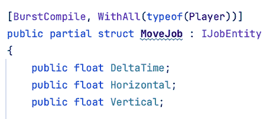

图 21.29：使任务的自动生成的查询看起来像是在寻找带有 Player 标签的实体。

这样，我们可以重用`Velocity`组件，并保证每个实体都接收到所需的逻辑。现在，让我们在我们的游戏中添加一个敌人。

## 使用组件查找创建追踪导弹

在本示例项目中，我们将使玩家躲避不断生成的追踪导弹。为此，我们需要一个具有以下数据的导弹实体：

+   **位置和旋转**：由`LocalTransform`表示。

+   **移动速度**：我们已有的相同`Velocity`。

+   **转向速度**：我们将创建的新`Steering`组件。

+   **要跟随的目标实体**：我们将创建的新`Target`组件。

转向速度应该是一个创建起来相当直接组件。只需像创建移动速度组件那样做，但名称不同。至于`Target`组件，它看起来如下所示：

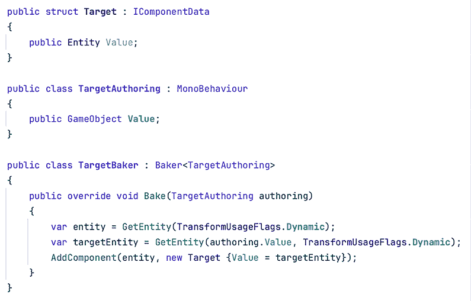

图 21.30：创建目标组件

首先要注意的是，我们正在使用`Entity`类型作为`Target`组件的值。这是 ECS 中拥有目标 GameObject 引用的等效。我们使用实体引用从它获取数据，例如其位置。请注意，编写组件引用 GameObject，因为在编辑时我们仍然使用 GameObject，所以我们引用的是将被转换为实体的`Player`GameObject。最后，烘焙器不仅需要调用`GetEntity`来获取我们正在转换以添加组件的实体，还需要获取目标 GameObject 的转换后的实体。

现在，你可以在子场景中创建一个名为`Missile`的球体，并添加`Velocity`、`SteeringVelocity`和`Target`的编写组件。请记住通过将玩家 GameObject 从子场景拖动到**值**属性来配置`Target`组件。

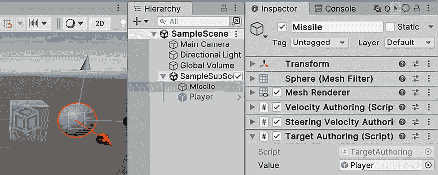

图 21.31：创建导弹的 GameObject

现在，我们可以创建一个系统来将导弹移动到玩家位置。虽然我们可以像对玩家那样创建一个`Missile`标签组件，但我们已经有足够的组件让转向系统找到导弹。我们将使这个系统迭代具有`Velocity`、`SteeringVelocity`和`Target`的实体，鉴于到目前为止我们的游戏中不太可能有非转向实体具有这样一组特定的实体。

这就是转向任务将看起来：

图 21.32：转向任务

首先要注意的是`TransformLookup`字段，其类型为`ComponentLookup`。到目前为止，对于我们从正在迭代的实体中读取的数据，我们使用了`ref`和`in`参数作为访问它们的方式，但这次，我们需要访问除任务迭代的实体之外的其他实体的数据，因此我们不能使用这些参数。正如其名所示，查找允许我们从其他实体中获取数据，这意味着我们可以使用它们检索实体的组件。我们正在使用它将目标的变换获取到`targetTransform`变量中，并在括号中提供目标实体。

另一点要注意的是，我们有`LocalToWorld`查找。ECS 变换系统使用这个其他组件来存储局部到世界矩阵。这意味着这个组件具有目标实体的世界位置、旋转和缩放，与提供局部值的`LocalTransform`不同。这个组件允许我们获取世界空间中的实体位置，而不管父变换在哪里。

我们还因为一个棘手的问题而使用了这个组件。我们的任务是修改实体相对于其他实体位置的位置。我们还使用`ScheduleParallel`来安排任务，创建处理不同实体的多个任务。这可能导致一个任务实例读取另一个任务实例正在写入的实体的位置，这可能会引发多个问题。Unity 可以检测此类情况并警告我们，但在此情况下，这并不必要，因为我们正在通过`LocalTransform`修改导弹实体的位置时，同时读取`LocalToWorld`组件以获取目标的位置。这样，我们就不会同时读取和写入相同的组件。实际上，`LocalToWorld`的数据是由几个 ECS 变换系统之一从`LocalTransform`值派生出来的。请注意，由于我们不会修改其他实体的`LocalToWorld`，查找被声明为`ReadOnly`；我们只是读取它们。修改`LocalToWorld`没有意义，因为我们之前提到，其值是在渲染实体之前从`LocalTransform`计算出来的。

我们尽量简要地解释了变换系统，但若想了解更多关于其工作原理的信息，请查看此链接：`docs.unity3d.com/Packages/com.unity.entities@1.0/manual/transforms-concepts.html`

最后，我们也检查目标实体是否为空，尽管我们不是使用常规的空，而是使用`Entity.Null`。结构体不能为空，因为它们不是引用类型；它们始终有一个值。`Entity.Null`是当实体变量不引用实体时具有的特殊值。转向任务的其余部分使用常规向量数学来应用转向。

最后，安排此任务的系统看起来像这样：

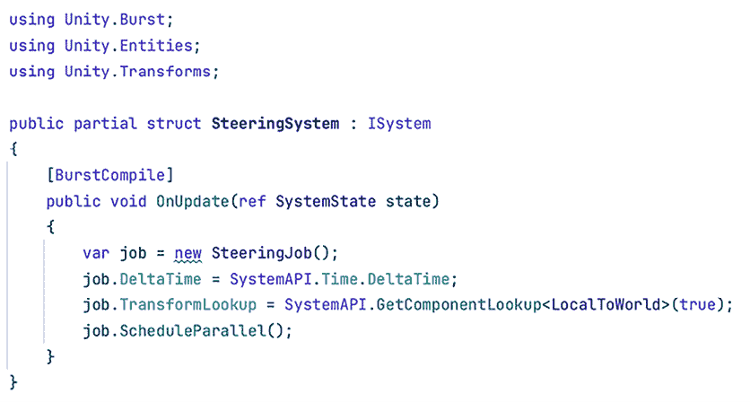

图 21.33：转向系统调度转向工作

我们使用了 `GetComponentLookup` 方法为我们的工作提供组件查找。我们将 `true` 作为第一个参数，让它知道我们需要一个只读查找。由于组件查找会引入间接引用，导致缓存未命中，因此使用组件查找的成本很高。始终首选使用工作来获取实体数据，但在这个案例中，它们是获取其他实体数据的唯一方式。

有关缓存未命中的更多信息以及 DOTS 如何处理它们，请查看以下博客文章：[`blog.innogames.com/unitys-performance-by-default-under-the-hood/`](https://blog.innogames.com/unitys-performance-by-default-under-the-hood/)

现在，只需玩游戏并观察导弹跟随玩家。考虑设置一个较小的速度但一个较高的转向速度（如 `2.0`），以便导弹旋转得足够快，接近玩家。

现在我们有了导弹，让我们让它在与玩家足够接近时摧毁玩家。

## 使用实体命令缓冲区销毁角色

为了让导弹摧毁玩家，我们需要检测它是否足够接近。在常规 GameObject 中，我们可以通过触发器 (`OnTriggerEnter`) 来实现这一点，但讨论 DOTS 物理包超出了本章的范围。相反，我们将创建一个具有简单距离检查的工作，如下面的图像所示：

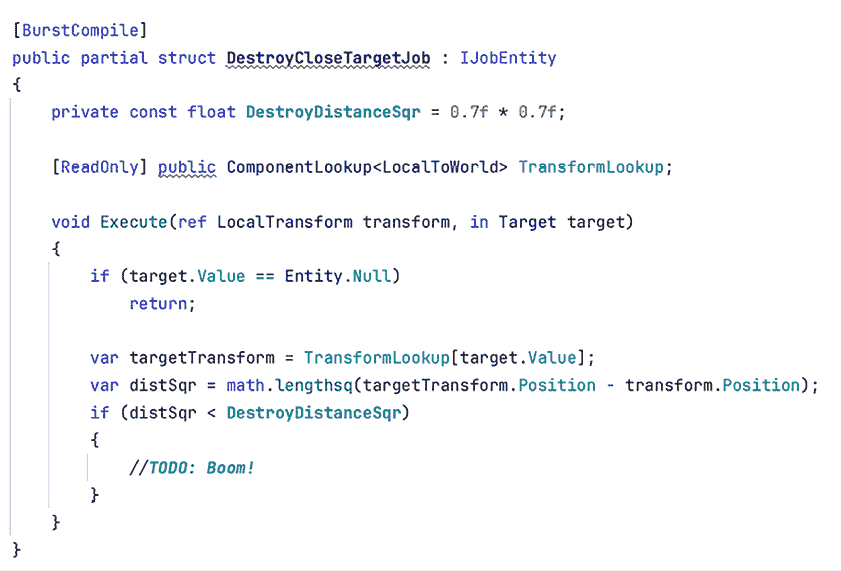

图 21.34：ECS 中的距离检查

这个工作与转向工作类似，但进行平方距离检查。现在，棘手的部分是销毁实体。考虑到可能有多个工作并行迭代实体，立即删除实体是不安全的。唯一安全的地方是在主线程上删除、创建或修改实体组件，这些操作也称为结构变化，工作在作业工作者线程上运行。当一个系统在主线程上进行结构变化时，会生成一个同步点，这意味着主线程将被阻塞，直到所有迭代实体的工作完成，这可能导致严重的延迟。另一个问题是，由于我们可以有多个需要结构变化的自定义系统，我们面临引入多个同步点的风险。最佳方法是累积多个结构变化，并让特定的系统执行它们——理想情况下，只有一个。这样，我们减少了同步点的数量，这正是 **实体命令缓冲区**（**ECB**）系统的作用。

结构变化在性能方面可能会造成成本。有关更多详细信息，请查看此链接：`docs.unity3d.com/Packages/com.unity.entities@1.0/manual/concepts-structural-changes.html`

ECB 系统有 API 可以创建 **实体命令缓冲区**（**ECBs**），允许系统和任务将命令排队到其中，例如实例化或摧毁实体。我们的摧毁系统将使用它们在导弹足够接近时排队玩家摧毁。让我们先修改我们的任务以接收一个 ECB 并使用它。

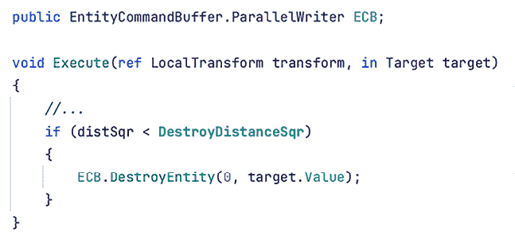

图 21.35：使用 ECB 摧毁目标实体

我们添加了一个变量来传递 ECB 到我们的任务中，该变量将在创建时由系统提供。然后，我们使用了 ECB 的 `DestroyEntity` 方法，指定我们要摧毁目标实体。我们提供的零是一种在执行之前对命令进行排序的方式，但在这个情况下，我们不需要任何特定的顺序。

要更好地理解在 ECB 中排序键的需求，请查看此链接：`docs.unity3d.com/Packages/com.unity.entities@1.0/manual/systems-entity-command-buffer-playback.html`

然后，我们需要创建一个类似于以下图像的系统：

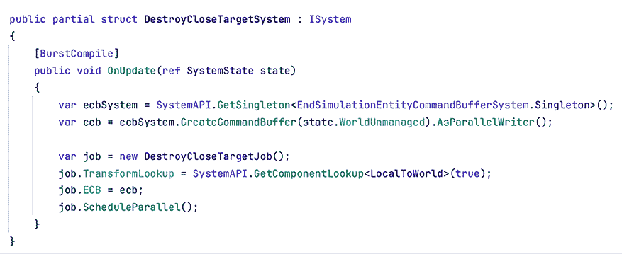

图 21.36：摧毁接近目标系统

我们从名为 `EndSimulationEntityCommandBufferSystem` 的 ECB 系统中访问了 `Singleton` 组件，使用的是 `GetSingleton` API。此方法允许我们在确定只有一个实例的情况下获取 ECS 组件的唯一实例。你可能想知道：系统可以有组件吗？答案是肯定的。在数据驱动的游戏中，所有数据共享都通过组件进行。每个系统都有一个实体，它们可以向其实例化组件并与其他系统和任务共享数据。鉴于这个 ECB 系统只有一个实例，我们知道 `Singleton` 组件也只有一个实例。它有一个 `CreateCommandBuffer` 方法，该方法创建一个 ECB，其命令将在 ECB 系统更新时执行。`EndSimulationEntityCommandBufferSystem` 系统将在模拟系统结束时执行其 ECB 命令，在渲染我们实体图形的命令之前。这样，我们的任务可以在稍后安全地在主线程中执行结构更改（如摧毁），以及其他使用相同 ECB 系统的系统的命令。

我们需要将我们的系统所在的世界作为此方法的第一个参数提供。世界是一组可以与其他世界并行运行的实体和系统。例如，在 `Netcode for Entities` 包中，当玩家作为游戏的主机时，我们可以并行运行服务器和客户端世界。在这种情况下，我们只有一个世界。

在这里了解更多关于世界的信息：`docs.unity3d.com/Packages/com.unity.entities@1.0/manual/concepts-worlds.html`

我们还调用了`AsParallelWriter`方法，它返回一个 ECB 版本，允许它在多个线程中使用。记住，我们的工作在并行执行多个实例，因此并行写入器版本确保它在我们的工作实例中是安全的。最后，我们将 ECB 提供给工作。

如果你现在按播放并让导弹捕捉到玩家，你会看到它消失了！但是等等！现在控制台正在不断显示错误。虽然这些错误很熟悉，但它们与我们通常在基于 GameObject 的项目中收到的错误不完全一样；它们更加晦涩。这是因为错误发生在突发代码中（简称 Burst-compiled code），这里的错误行为略有不同。让我们探索如何调试它们。

## 处理突发代码中的错误

在下一张图片中，你可以看到我们在上一步中收到的错误。

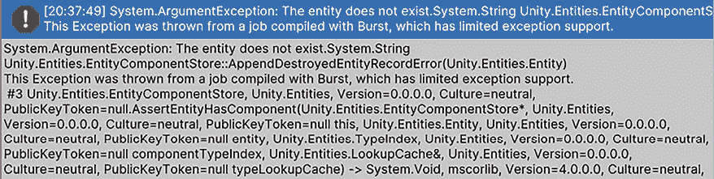

图 21.37：突发错误日志

首先是一个熟悉的 C#错误，但堆栈跟踪非常冗长。仔细阅读后，你可以看到每行堆栈跟踪都由一个“#”符号作为前缀，显示被调用方法的名称。在这些符号之后，我们可以在第 5 行找到我们的工作，但信息不多。我们可以通过检查下一行来推断我们的代码失败的位置——在这种情况下，是`ComponentLookup`调用。鉴于我们的工作只使用一次查找，我们可以推断我们正在尝试获取目标实体的变换，但它已经不存在了。

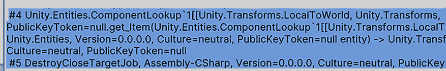

图 21.38：突发错误堆栈跟踪

为了使堆栈跟踪更清晰，你可以在编辑器中禁用 Burst。这将使错误日志看起来像通常一样，指示错误发生的行。通过取消选中**工作 | 突发 | 启用编译**选项来禁用它。再次播放以查看现在日志指示错误发生的作业行（第 21 行）。我建议熟悉 Burst 错误日志，因为在构建中，我们无法在没有重新编译我们的玩家后移除`BurstCompile`属性的情况下回退到非突发代码。此外，在开发过程中禁用 Burst 可以帮助迭代时间，因为编译 Burst 代码比常规代码要长，而在开发过程中，我们并不总是需要峰值性能。

关于这个错误，它发生在当我们接近导弹所指向的实体（玩家）时，该实体被摧毁了。为了解决这个问题，我们可以修改`SteeringJob`作业的`Execute`方法，如下面的图片所示：

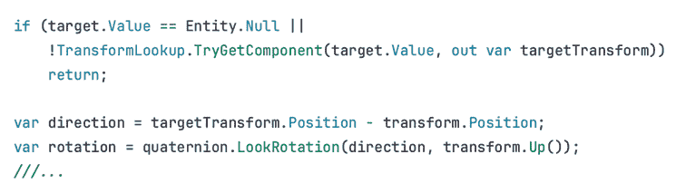

图 21.39：检查实体是否有 LocalToWorld 组件

我们还需要对`DestroyCloseTargetJob`作业的`Execute`方法做同样的处理：

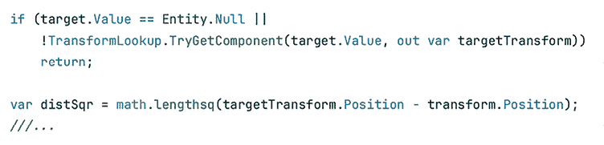

图 21.40：检查实体是否有 LocalToWorld 组件

现在，我们不仅检查目标实体是否为空，还检查它是否使用了 `TryGetComponent` 查找方法来获取转换。此方法返回一个布尔值，指示请求的实体是否具有请求的组件，并将其返回在输出参数中。如果实体没有组件或实体不存在，该方法将返回 `false`。这样，如果目标实体没有组件或已被销毁，我们就可以提前退出工作。在 MonoBehaviours 中，仅进行空检查就足够了，但在 DOTS 中则不行。抛开在 MonoBehaviours 中允许这样做的一些具体细节，一个像 target 这样的 `Entity` 变量在内部只是一个整数 ID。ECS 使用它在查找表中确定实体数据存储的位置（哪个块）。`Entity.Null` 只是一个无效的 ID，并且由于 Unity 不会在销毁时将所有实体引用设置为无效 ID，因此空检查仍然有效。这样，即使目标实体被销毁，我们 `Target` 组件中引用的实体仍然有一个有效的 ID。此外，注意我们如何移除了使用查找的行，因为 `TryGetMethod` 已经在 `out` 参数中给出了目标的 `LocalToWorld` 组件，所以没有必要获取组件两次。

如果 `TryGetComponent` 方法失败，你可以将目标设置为 `Entity.Null`。鉴于使用查找是性能密集型的，在使用它之前提前退出方法会更好。

现在，让我们实例化更多的导弹，使游戏更有趣。

## 使用实体 Prefab 实例化导弹

我们可以通过创建具有 `Spawner` 组件的 `spawner` 实体来接近导弹生成器——这些实体引用要实例化的 Prefab，并具有要实例化的数量和实例化频率。你可能认为，我们不应该为每个生成器数据创建单独的组件吗？我们可以这样做，但每个在作业和实体查询中使用的组件都会带来性能开销。我们没有理由认为在这个例子中，我们的任何生成器数据将以不同的方式使用，所以这次我们将使用单个组件。当你知道所有数据都将同时被访问时，尽量将数据混合到单个组件中。

`Spawner` 组件将看起来像以下图片：

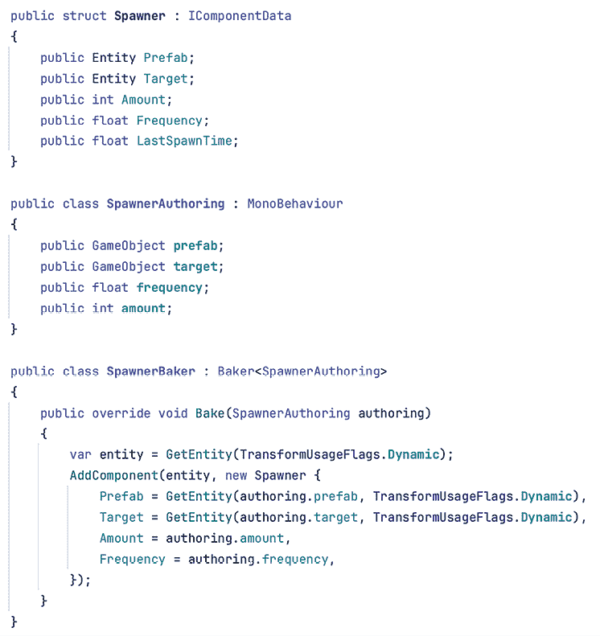

图 21.41：Spawner 组件和 baker

注意，我们的`Spawner`运行时组件有一个`Prefab`实体字段。以前，我们使用这样的字段来引用导弹的目标，但现在我们使用它来引用要实例化的预制体。我们将创建导弹预制体，并使用`GameObject`字段在生成器创作组件中引用它。可以使用`GetEntity`方法再次转换预制体引用。我们还有一个目标引用，因为我们想让生成的导弹跟随玩家。生成器需要向导弹提供目标引用。请记住，在子场景中创建带有`spawner`组件的`spawner`GameObject，并对其进行配置，将`player`拖到`target`属性，将导弹`Prefab`拖到`Prefab`属性。

由 ECS 组件引用的预制体也将被转换为我们的子场景中的实体，但它们将具有特殊的预制体标签组件。这允许预制体实体存在于子场景中，但会使 ECS 忽略它以防止渲染或更新它。有关预制体烘焙的更多信息，请参阅：`docs.unity3d.com/Packages/com.unity.entities@1.0/manual/baking-prefabs.html`

现在，我们需要一个系统和一项工作来遍历所有生成器实体，使用 ECB 来实例化导弹：

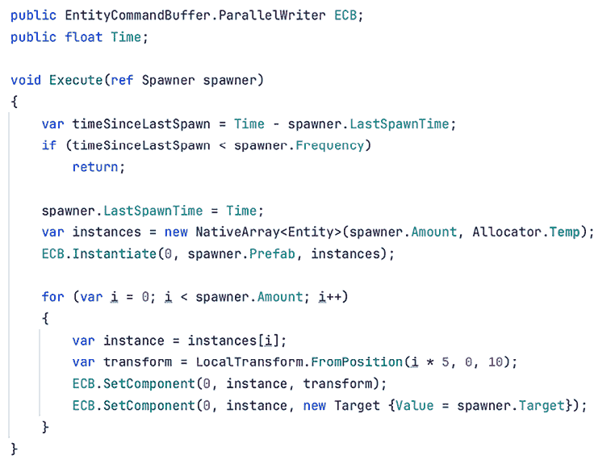

图 21.42：导弹生成器工作

虽然我们可以逐个实例化我们的预制体，但一次性实例化多个会更好，所以我们创建了一个实体数组并将其提供给`Instantiate`方法。这个`Instantiate`方法的重载会根据提供的数组中的元素数量创建实例，并用即将创建的实例的引用（我们正在使用 ECB）填充它。然后，我们遍历这个数组，以 5 个单位间隔的方式设置导弹的位置。我们还通过设置目标组件使它们瞄准玩家。通过用新的组件实例替换来更改组件的值可能会让人困惑，但在 ECS 中这是一种常见的做法。由于组件是结构体，所以这也非常高效。

最后，我们需要系统安排工作：

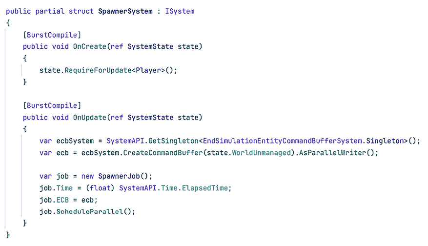

图 21.43：生成器系统

在`OnUpdate`方法中，唯一的新特性是使用`Time.ElapsedTime`来获取当前游戏时间。但随后你可以看到新增了一个`OnCreate`方法，它是系统的`Awake`方法的等价物。在这里，我们使用`RequireForUpdate`方法来指定我们需要至少存在一个带有`Player`组件的实体，以便此系统执行。这样，我们防止在`Player`被销毁时系统实例化导弹。

现在我们有了我们的生成器系统，让我们让摄像机跟随我们的角色。

## 让摄像机跟随我们的角色

我们的相机仍然是一个普通的 GameObject，但我们的玩家是一个实体。系统可以在其 `OnUpdate` 方法中访问 GameObject，前提是该方法是未使用 Burst 编译器编译的。使相机跟随我们的角色的系统将看起来像这样：

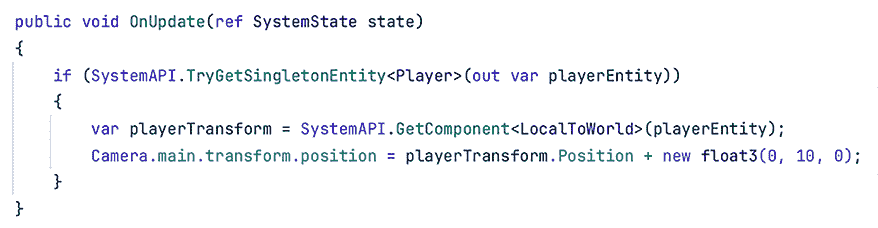

图 21.44：相机跟随玩家的系统

如前所述，`OnUpdate` 不是爆发式（它没有 `*BurstCompile*` 属性）且不会使用作业，因为它需要访问主相机及其变换，这些是非 HPC# 兼容的引用类型。然后，我们使用了 `TryGetSingletonEntity` API 来检索我们期望具有 `Player` 标签的唯一实体的引用。鉴于导弹可以摧毁玩家，我们也使用此 API 来检查玩家实体是否仍然存在。然后，我们使用 `GetComponent` 方法来获取现有玩家实体的位置。虽然我们可以像之前那样使用组件查找，但鉴于我们直接在系统中编写代码，我们可以使用这种方法作为完成相同任务的快捷方式。

您已经创建了您的第一个 DOTS 游戏！记住，您可以在本书的 Git 仓库中找到本章制作的完整项目。最后，一如既往，关于 DOTS 的学习还有很多，所以让我们简要探索一些最重要的剩余 API。

## 探索其他 DOTS 功能

本书中有几个主题值得有它们自己的书籍，ECS 也不例外。在本章中挑选最重要的 API 来解释，并尽可能使章节简短，这相当困难，因为有很多东西可以探索。因此，除了我们在信息框中留下的所有有用附加信息外，我还为您留下一份其他值得检查的 DOTS 概念列表：

+   **SystemAPI.Query**：在不使用作业的情况下迭代系统中实体的一种方式。对于使用托管引用或静态变量的实体迭代代码非常有用。对于简单且执行速度快的事情，可以避免作业调度的成本。链接：`docs.unity3d.com/Packages/com.unity.entities@1.0/manual/systems-systemapi-query.html`

+   **实体查询**：如前所述，作业和其他 ECS API（如 `SystemAPI.Query`）迭代实体的方式。链接：`docs.unity3d.com/Packages/com.unity.entities@1.0/manual/systems-entityquery-intro.html`

+   **可启用组件**：可以禁用的组件。实体查询将忽略其所需组件被禁用的实体。这对于在无需添加/删除标签组件的情况下切换实体行为非常有用，因为这些操作成本高昂，因为它们需要结构变化。链接：`docs.unity3d.com/Packages/com.unity.entities@1.0/manual/components-enableable.html`

+   **清理组件**：ECS 对应于 `OnDestroy` 事件的组件。链接：`docs.unity3d.com/Packages/com.unity.entities@1.0/manual/components-cleanup.html`

+   **动态缓冲区**：ECS 中在组件中拥有类似数组数据的方式。链接：`docs.unity3d.com/Packages/com.unity.entities@1.0/manual/components-buffer.html`

+   **Blob 资产**：ECS 对应的可脚本化对象。链接：`docs.unity3d.com/Packages/com.unity.entities@1.0/manual/blob-assets-intro.html`

+   **内容管理**：Addressables 的 ECS 版本。链接：`docs.unity3d.com/Packages/com.unity.entities@1.0/manual/content-management-intro.html`

+   场景加载：ECS 加载子场景的方式。链接：`docs.unity3d.com/Packages/com.unity.entities@1.0/manual/conversion-scene-overview.html`

+   物理和碰撞：物理系统的 ECS 版本。链接：`docs.unity3d.com/Packages/com.unity.physics@1.0/manual/index.html`

+   实体网络代码：网络系统的 ECS 版本。链接：`docs.unity3d.com/Packages/com.unity.netcode@1.0/manual/index.html`

+   DOTS 最佳实践：关于 DOTS 最佳实践的全面指南，旨在最大化您游戏性能并理解 DOTS 内部机制：[`learn.unity.com/course/dots-best-practices`](https://learn.unity.com/course/dots-best-practices)

+   ECS 示例：一个包含多个 ECS 示例和教程的 Git 仓库：[`github.com/Unity-Technologies/EntityComponentSystemSamples`](https://github.com/Unity-Technologies/EntityComponentSystemSamples)

提供的大多数链接都指向 ECS 文档。建议您通读全文，以便了解您用于创建 ECS 应用程序的所有工具。

在本节中，我们使用了输入和标签组件来移动我们的玩家，以及组件查找来获取其他实体的信息，并探讨了实体命令缓冲区的多种用法，包括实例化和销毁实体，以及如何使我们的 GameObject 相机跟随 ECS 角色。我们还讨论了不同的额外主题，以加深您对 DOTS 的了解。

# 摘要

在本章中，我们学习了如何通过创建自己的组件和系统来开始使用 DOTS，为简单游戏添加游戏玩法。我们看到了如何使用输入和 DOTS 变换 API 来移动和旋转对象，还看到了如何生成和销毁对象。

DOTS 是一个独立的引擎，运行在 Unity 内部。它的工作方式与以往大相径庭，除了渲染管线等少数系统外，几乎所有的 DOTS 功能都与 GameObject 的对应功能有很大不同。此外，DOTS 仍然相对较新，这意味着它仍然缺少一些功能，并且可能在下一个版本中经历重大变化。

这使得创建新项目存在一定的风险，但另一方面，它所能达到的性能对于大型和雄心勃勃的项目可能是决定性的。这是一项可以彻底改变游戏开发的技术，而且每天都在变得更加强大和稳定。现在是开始学习它并为未来做准备的好时机。

# 在 Discord 上了解更多

与其他用户、Unity 游戏开发专家以及作者本人一起阅读这本书。提出问题，为其他读者提供解决方案，通过 Ask Me Anything 会话与作者聊天，等等。扫描二维码或访问链接加入社区：

[`packt.link/unitydev`](https://packt.link/unitydev)

