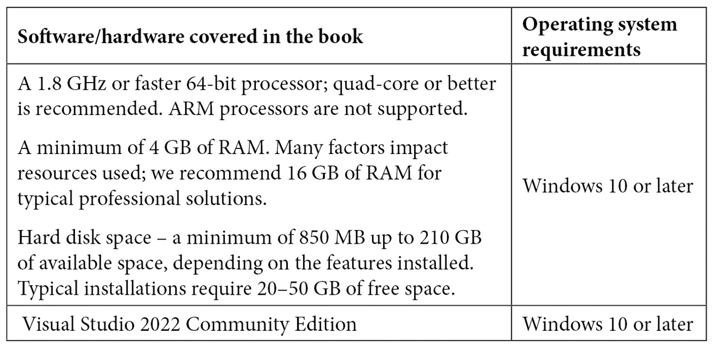

# 前言

Visual Studio 2022 是一个完整且理想的**集成开发环境**（**IDE**），用于创建大型、复杂和可扩展的应用程序。它是开发中最完整、最全面的工具之一，尤其是在使用 Microsoft 技术时。

这本书将教会您如何利用这个 IDE 中的工具来更快地编写干净的代码。您将从学习如何设置和启动 Visual Studio 2022 以及使用该 IDE 提供的所有工具开始。然后，您将学习关键组合、技巧和额外的实用工具，这些可以帮助您更快地编码并不断审查您的代码。您将了解如何使用 Visual Studio 编译、调试和检查您的项目，以分析其当前行为。您将看到如何插入可重用的代码块，编写简单的语句。您将了解一些视觉辅助工具和人工智能，这些将帮助您提高生产力和理解项目中的情况。

在本书结束时，您将能够使用 Visual Studio 2022 设置您的开发环境，个性化工具和布局，并使用快捷键和扩展来提高您的生产力。

# 本书面向的对象

这本书是为专注于 Web 开发和想要了解 Visual Studio 2022 中新功能、工具和特性的.NET 软件开发人员以及 Web 开发者所写的。假设您对 HTML、CSS、JavaScript 或 React 和 Angular 等框架有基本了解。

# 本书涵盖的内容

*第一章*, *开始使用 Visual Studio 2022*，回顾了如何安装 Visual Studio、版本和需求。

*第二章*, *配置 IDE*，讨论了如何根据您的需求和偏好配置 Visual Studio。

*第三章*, *Visual Studio 2022 的改进*，回顾了 Visual Studio 2022 中包含的新功能和改进。

*第四章*, *创建项目和模板*，解释了 Visual Studio 中包含的模板以及如何创建您的第一个项目。

*第五章*, *调试和编译您的项目*，讨论了如何使用 Visual Studio 构建应用程序和调试您的项目。

*第六章*, *添加代码片段*，解释了如何在 Visual Studio 中使用代码片段并创建自己的代码片段。

*第七章*, *使用 AI 和代码视图高效编码*，回顾了 Visual Studio 中包含的 AI 工具和不同的代码视图。

*第八章*, *Web 工具和热重载*，解释了 Visual Studio 中包含的 Web 工具以及热重载的工作原理。

*第九章*，*样式和清理工具*，讨论了 Visual Studio 为后端和前端开发者提供的代码清理选项。

*第十章*，*发布项目*，探讨了从 Visual Studio 发布项目的不同方式。

*第十一章*，*实现 Git 集成*，回顾了 Visual Studio 与 GitHub 托管项目协同工作的功能。

*第十二章*，*使用 Live Share 共享代码*，讨论了 Live Share 是什么以及如何使用它进行实时编码会话中的团队合作。

*第十三章*，*在 Visual Studio 中使用扩展*，解释了 Visual Studio 中的扩展是什么以及将它们添加到 IDE 的不同方法。

*第十四章*，*使用流行扩展*，讨论了 Visual Studio 中最受欢迎的扩展以及为什么。

*第十五章*，*学习键盘快捷键*，解释了如何使用键盘在 Visual Studio 中执行快速操作以优化重复性任务。

# 为了充分利用这本书

*您需要一台安装了 Windows 10 或更高版本的笔记本电脑或台式计算机。要安装 Visual Studio 并完成第十章至第十四章的练习，您需要一个互联网连接。*

*要获得 Visual Studio Community 许可证，您必须有一个 Microsoft 账户，该账户属于 Hotmail 域或 Outlook 域。*



*要生成* *第八章* *中的代码映射，需要 Visual Studio Enterprise 版本，该版本包含 Web 工具和热重载功能。*

*要执行* *第十一章* *中建议的测试，需要一个 GitHub 账户，以实现 Git 集成。*

**如果您正在使用本书的数字版，我们建议您亲自输入代码或从本书的 GitHub 仓库（下一节中提供链接）获取代码。这样做将帮助您避免与代码复制和粘贴相关的任何潜在错误。**

*为了完成并理解本书中的所有活动，了解软件开发和 Web 开发（HTML、JavaScript 和 CSS）的知识是非常重要的。*

# 下载示例代码文件

您可以从 GitHub 在[`github.com/PacktPublishing/Hands-On-Visual-Studio-2022`](https://github.com/PacktPublishing/Hands-On-Visual-Studio-2022)上下载本书的示例代码文件。如果代码有更新，它将在 GitHub 仓库中更新。

我们还有来自我们丰富的图书和视频目录的其他代码包，可在[`github.com/PacktPublishing/`](https://github.com/PacktPublishing/)找到。查看它们吧！

# 下载彩色图像

我们还提供了一份包含本书中使用的截图和图表彩色图像的 PDF 文件。您可以从这里下载：[`packt.link/VHA6o`](https://packt.link/VHA6o)。

# 使用的约定

本书中使用了多种文本约定。

`文本中的代码`：表示文本中的代码单词、数据库表名、文件夹名、文件名、文件扩展名、路径名、虚拟 URL、用户输入和 Twitter 昵称。以下是一个示例：“模板有一个带有`WeatherForecastController.cs`文件的演示。”

代码块设置如下：

```cs
CommonMethod("Before invocation of NewMethod()");
```

```cs
NewMethod();
```

```cs
CommonMethod("After invocation of NewMethod()");
```

当我们希望您注意代码块中的特定部分时，相关的行或项目将以粗体显示：

```cs
public float Calculate1()
```

```cs
{
```

```cs
   var minValue = 25;
```

```cs
   return Calculate(minValue);
```

```cs
}
```

**粗体**：表示新术语、重要单词或屏幕上看到的单词。例如，菜单或对话框中的单词以粗体显示。以下是一个示例：“如果您同意安装的详细信息和大小，您可以通过单击**安装**按钮开始此过程。”

小贴士或重要提示

看起来是这样的。

# 联系我们

我们欢迎读者的反馈。

`customercare@packtpub.com` 并在邮件主题中提及书籍标题。

**勘误表**：尽管我们已经尽最大努力确保内容的准确性，但错误仍然可能发生。如果您在这本书中发现了错误，我们将非常感激您能向我们报告。请访问 [www.packtpub.com/support/errata](http://www.packtpub.com/support/errata) 并填写表格。

`copyright@packt.com` 并附有材料链接。

**如果您有兴趣成为作者**：如果您在某个领域有专业知识，并且您有兴趣撰写或为书籍做出贡献，请访问 [authors.packtpub.com](http://authors.packtpub.com)。
