# 第一章：Visual Studio 2022 入门

**Visual Studio**（**VS**）是 **.NET** 开发者最受欢迎的 **集成开发环境**（**IDE**）。它是设计、开发、调试和部署所有 .NET 应用程序以及其他技术的完美工具。

在本章中，你将了解 VS 的历史、历史版本和安装过程，以及开始使用此 IDE 时的初始配置。在了解 VS 版本后，你将能够选择最适合你需求的选项。

到本章结束时，你将简要了解 VS 的历史，并理解其不同版本之间的主要演变变化。你还将学习如何安装并开始使用这个令人惊叹的工具。

在本章中，你将学习以下主要内容：

+   VS 的简要历史

+   VS 版本

+   安装 VS 2022

+   VS for Mac

# 技术要求

我们将本章从学习如何安装 VS 2022 开始。要让 VS 在你的机器上运行，你需要以下要求：

+   Windows 10，版本 1909 或更高

+   Windows Server，版本 1016 或更高

+   1.8 GHz 或更快的 64 位处理器；建议使用四核或更好的处理器

+   4 GB 的 RAM；建议使用 8 GB

+   硬盘可用空间 – 25 GB（根据安装的组件，最高可达 40 GB）

+   管理员权限

+   安装过程中需要全网络访问

    重要提示

    不支持 32 位和 ARM 操作系统；你需要 Windows 10 Enterprise LTSC 版本、Windows 10 S 或 Windows 10 Team Edition。要检查所有要求以及不受支持的系统和技术，请访问 [`docs.microsoft.com/en-us/visualstudio/releases/2022/system-requirements`](https://docs.microsoft.com/en-us/visualstudio/releases/2022/system-requirements)。

# VS 的简要历史

VS 2022 是由微软创建的应用程序的版本 13。VS 因其友好的用户体验、良好的定期更新支持以及编写干净和可扩展代码的强大工具而受到开发者的青睐。VS 支持许多技术和平台。对于许多开发者来说，VS 是所有项目类型的终极工具。

要了解这个工具的演变，我们必须考察其历史和时间线。

VS 6.0 于 1997 年发布，这是该工具的第一个版本。这个版本是为了与 Visual Basic 6.0 一起使用而创建的。然后，在 2002 年，发布了新版本，其中包括对 **.NET** 和 **C#**（当时的新编程语言）的兼容性。从那时起，它一直是 .NET 开发者的首选工具。

VS 最初是一个付费应用程序，具有封闭的许可证，但自 VS 2005 以来，微软开始了一个新的策略，即免费/付费模式，这是一个基本的/免费公共版本，你可以用于个人项目、学习或中型应用程序，而专业开发者、大型公司或希望使用高级工具的人则需要付费版本。

微软每 2 或 3 年发布一个新的 VS 版本，并为该版本每 2 或 3 个月提供更新，这意味着完全支持。

一个值得注意的版本是 VS 2012，因为开发团队实现了新的外观和感觉以及许多用户体验的改进，这些改进也体现在 2022 年的版本中。VS 2012 相比之前版本的一些最重要的改进包括性能、可以选择浅色和深色主题以及新的图标。

既然您对 VS 有了一个大致的了解，让我们来检查今天可用的每个口味。

# VS 口味

自 2012 年版本以来，VS 有三种口味，涵盖了所有开发者的偏好和需求。这三个选择中有一个是完全免费提供给社区的。

在接下来的章节中，您将看到每个版本之间的差异，并了解每个版本支持的功能，如下所示：

+   Visual Studio Community

+   Visual Studio Professional

+   Visual Studio Enterprise

因此，让我们了解每个版本的主要方面。

## Visual Studio Community

Visual Studio Community 是一个免费版本，它包含了创建、构建、调试和部署 .NET 应用程序以及集成到 VS 中的所有基本工具。

Visual Studio Community 有五个用户的限制，并限制在非企业组织中。

Visual Studio Community 的主要工具有以下几项：

+   基本调试工具（在调试过程中检查代码的工具）

+   性能和诊断中心（分析应用程序性能和内存使用的工具）

+   重构工具（用于根据最佳实践清理和格式化代码的工具）

+   单元测试（一个用于导航、运行和收集单元测试结果的特性）

+   快速查看定义（一个导航到方法或函数定义的功能）

+   VS Live Share（一个实时协作开发工具）

这个版本适合学生、独立开发者、自由职业者和小型公司。尽管这个版本包括了您日常使用的主要工具，但在与单元测试、内存或检查相关的某些场景中，这些工具可能不够用。

## Visual Studio Professional

Visual Studio Professional 是通过订阅提供的 VS 许可版本；这个版本推荐用于企业应用程序和拥有五个以上开发者的团队。VS Professional 包含与 Visual Studio Community 相同的工具，但有一些补充，例如 CodeLens（一个 VS 功能，用于在代码中查找引用、更改和单元测试）。

在撰写本文时，VS 专业订阅的个人用户费用为每月 45 美元。

专业订阅包括 50 美元的 Azure 信用额度、培训、支持和 Azure DevOps（基本计划）。

## Visual Studio Enterprise

Visual Studio Enterprise 是 VS（包括 Visual Studio Professional）的最高级订阅版本，它包含了 VS Community 的所有功能、Visual Professional 的改进以及一些额外的工具。

一些值得注意的功能如下：

+   实时单元测试（一个在每次更改时重新运行单元测试的功能）

+   快照调试器（一个在调试过程中发生错误时保存快照的工具）

+   移动应用程序的性能分析工具

+   架构层图（用于可视化应用程序的逻辑架构）

企业订阅每月费用为 250 美元，但包括 150 美元的 Azure 信用额度、Power BI Pro、带有测试计划的 Azure DevOps 以及 VS 所有的功能。

要查看不同版本和价格的比较，你可以访问 [`visualstudio.microsoft.com/vs/pricing/`](https://visualstudio.microsoft.com/vs/pricing/)。

重要提示

对于这本书，我们将使用 Visual Studio Community。由于这是一个免费版本，你不需要支付任何订阅费用，并且所有主题都包含在这个版本中。

# 安装 VS 2022

随着每个新版本的发布，VS 的安装过程得到了改进。今天，甚至可以使用相同的安装程序进行升级或工作负载修改，以创建不同类型的项目。

在本节中，你将学习以下内容：

+   从 VS 网站获取安装程序

+   安装 VS

让我们详细看看如何执行安装过程。

## 从网站获取安装程序

VS 安装简单，你不需要账户或进行很多步骤来获取安装程序。在任何浏览器中输入 `Visual Studio community Download`，你就可以轻松找到从官方网站下载 VS 的链接。

从以下链接，你可以直接获取安装程序：

[`visualstudio.microsoft.com/downloads/`](https://visualstudio.microsoft.com/downloads/)

在网页上，转到 **Visual Studio** 部分，点击标记为 **下载 Visual Studio** 的下拉控件，并选择 **Community** 选项（见图 *图 1.1*）：

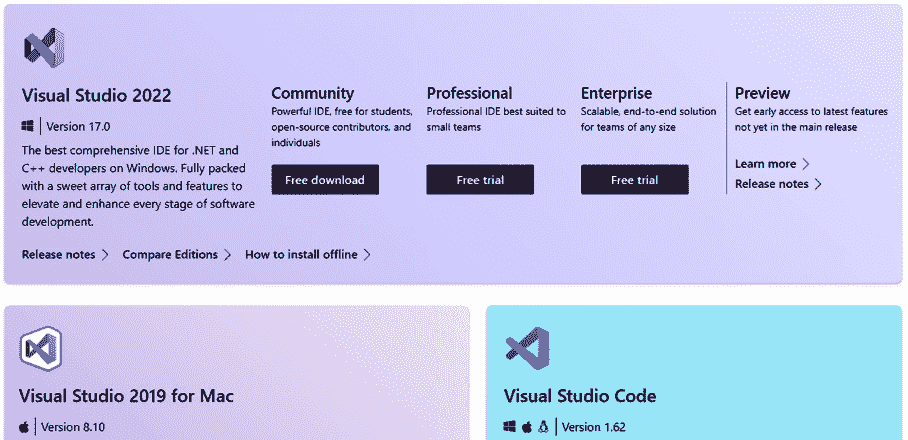

图 1.1 – 下载 VS

## 安装过程

一旦你下载了 VS 安装程序，你必须运行它以启动安装程序的更新过程，如图 *图 1.2* 所示：

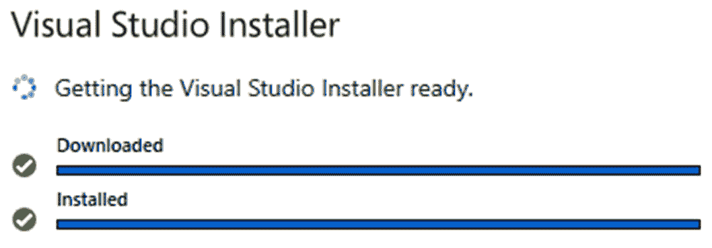

图 1.2 – 更新 VS 安装程序

VS 是一个由开发团队不断更新的 IDE，因此安装程序将始终寻找最新的可用更新以执行相应的安装。

当安装程序更新完成后，安装程序的初始屏幕将显示，它由四个主要部分组成，其中默认显示的是 **工作负载** 部分。

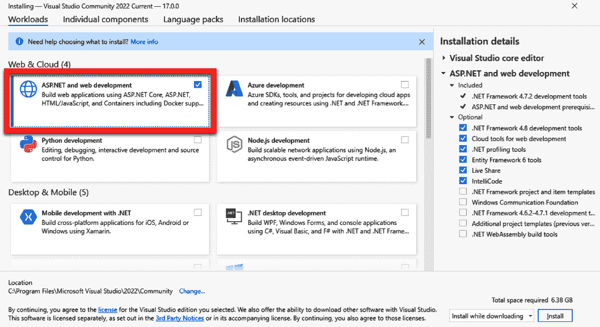

图 1.3 – VS 工作负载选项卡

可以找到不同类型项目的负载 – 例如，移动项目、桌面项目、Python 项目等。

要安装与 Web 开发相关的模板和工具，您必须选择名为 **ASP.NET 和 Web 开发** 的负载，如图 1.3 所示。

每个工作负载都包含与所选技术相关的一组工具和组件。

然而，您也可以在名为 **单独组件** 的选项卡中单独选择这些组件，如图 1.4 所示：

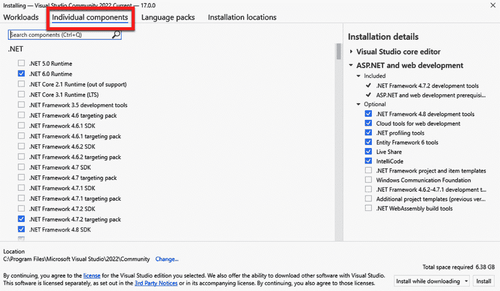

图 1.4 – VS 单独组件选项卡

这些组件被分组到不同的类别中，如 .NET、云、数据库和服务器等，您只需选择一个组件即可将其添加到安装中。

在名为 **语言包** 的选项卡中，您将能够选择 VS 界面的语言或语言，如图 1.5 所示：

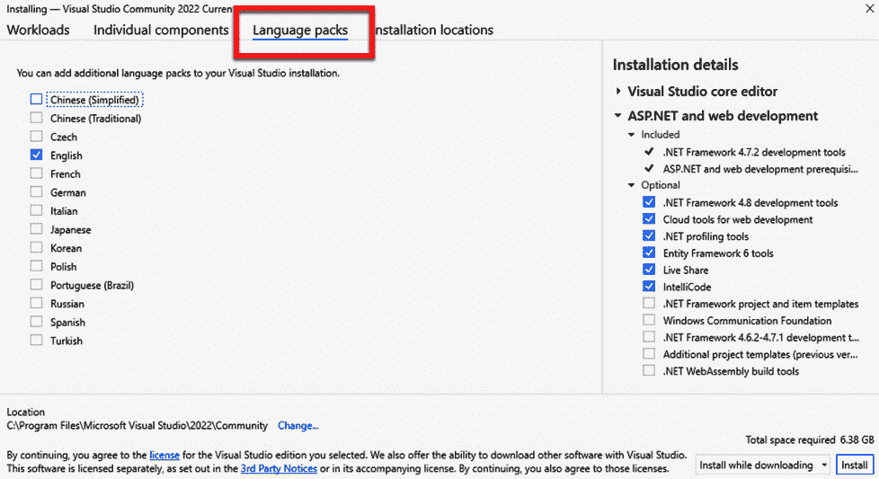

图 1.5 – VS 语言包选项卡

这非常有用，因为默认语言通常与 VS 安装程序下载的语言相对应。从这里，您将能够取消选择默认语言并选择不同的语言或多种语言，以便在开发过程中进行切换。

在最后一个名为 **安装位置** 的选项卡中，您可以配置 VS IDE 和下载缓存的系统路径，如图 1.6 所示：

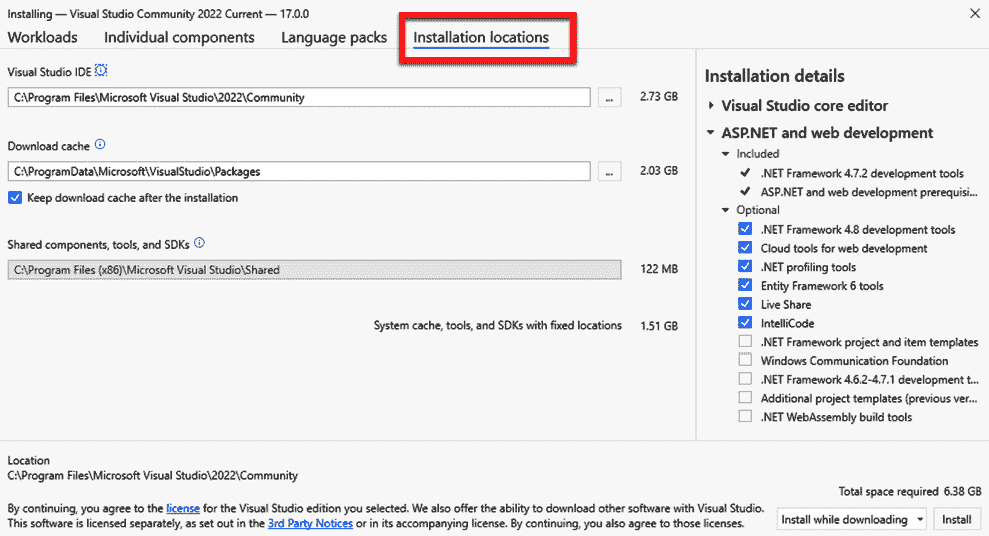

图 1.6 – VS 安装位置选项卡

在此选项卡中，您将能够看到在每个路径中执行正确安装所需的空间量。

最后，有一个选项列表，可以选择安装方法 – 您是想一次性下载所有组件并安装，还是想先下载所有必要的组件，然后再安装（如图 1.7 所示）：

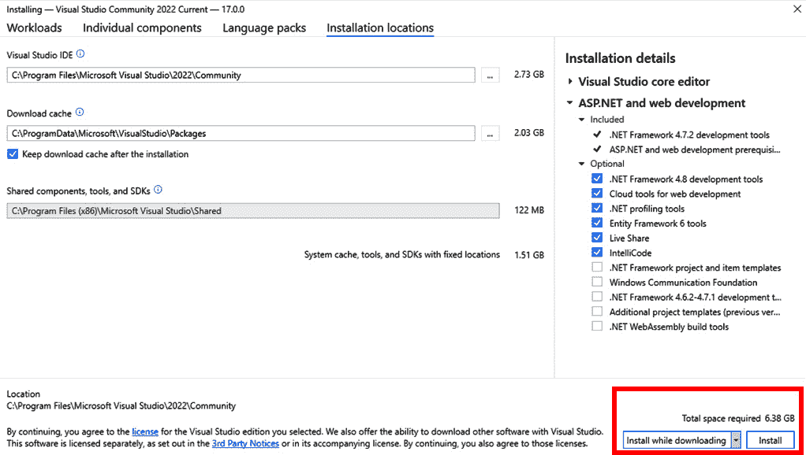

图 1.7 – VS 安装按钮

如果您同意安装的详细信息和大小，您可以通过点击 **安装** 按钮开始安装过程。

一旦您点击了开始安装的按钮，将出现一个窗口，显示组件的下载和安装详情，如图 1.8 所示：

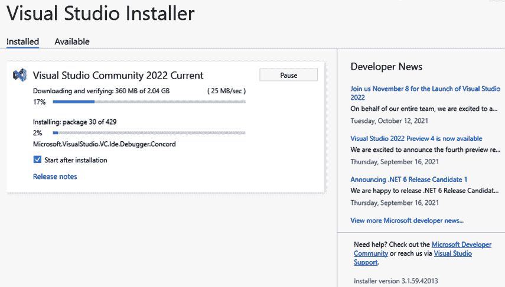

图 1.8 – VS 安装过程

安装过程完成后，将出现一个窗口，建议您使用 Microsoft 账户登录以获取工具的使用许可。建议您在此处登录，以免将来失去对工具的访问权限，如图 1.9 所示：

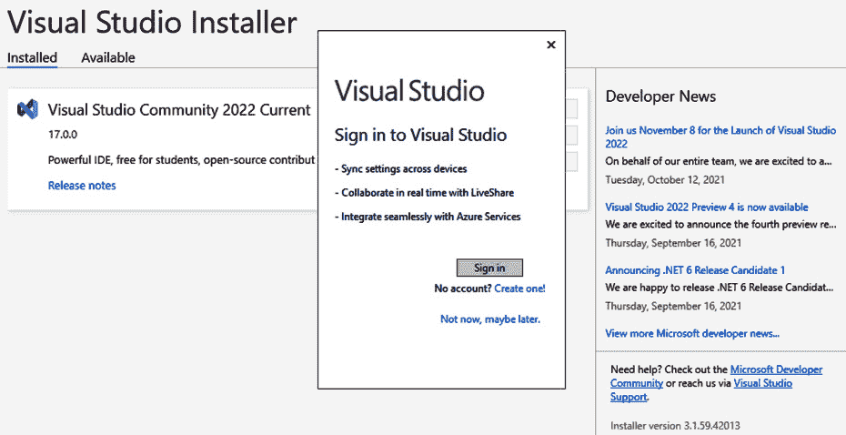

图 1.9 – VS 登录窗口

在您获得 VS 2022 的使用许可后，您将看到创建、克隆和打开项目的启动屏幕，因此您可以检查安装是否成功，如图*图 1.10*所示：

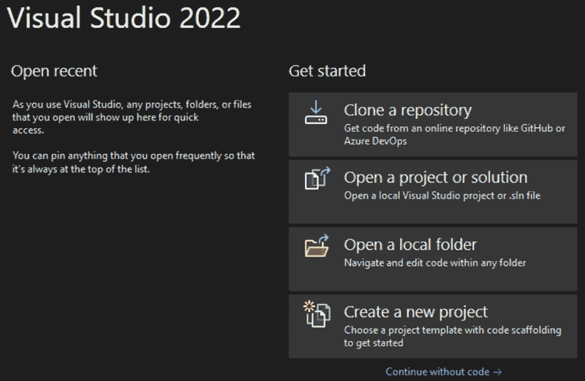

图 1.10 – VS 启动窗口

重要提示

您可以在同一台机器上拥有不同的 VS 版本；为了与所有技术兼容，有时我们需要保留旧版本 – 例如，VS 2010 与 Silverlight（一个用于使用 C#和 XAML 创建 Web 应用程序的已弃用框架，它通过浏览器中的插件执行）一起使用。

安装 VS 并获得第一个屏幕后，您可以使用**继续无代码**选项打开 VS。

现在，您将看到 VS 的主屏幕，而无需打开或创建任何项目。目前，您只需要知道您可以使用**帮助**菜单（*图 1.11*）来检查版本和 VS 文档：

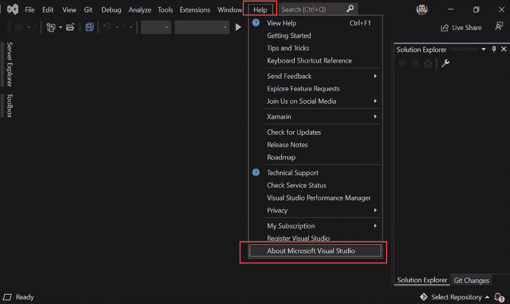

图 1.11 – VS 主屏幕和帮助菜单

在*图 1.11*中，**关于 Microsoft Visual Studio**选项被突出显示；点击它，您将了解正在使用的版本以及是否有可安装的更新。

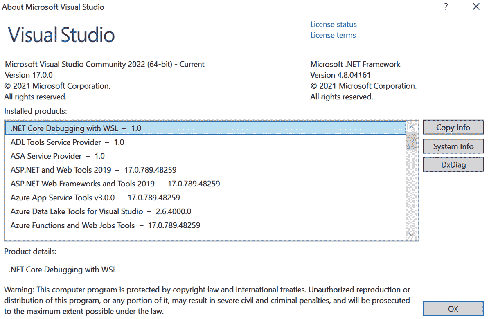

图 1.12 – 关于 Microsoft Visual Studio 屏幕

最后，如果您需要修复、修改或卸载 VS，您可以使用您之前下载的 VS 安装程序，或者在任何时候在 Windows 资源管理器中搜索`Visual Studio Installer`术语。此外，它将找到更新并显示您可以安装或尝试的其他版本（*图 1.13*）：

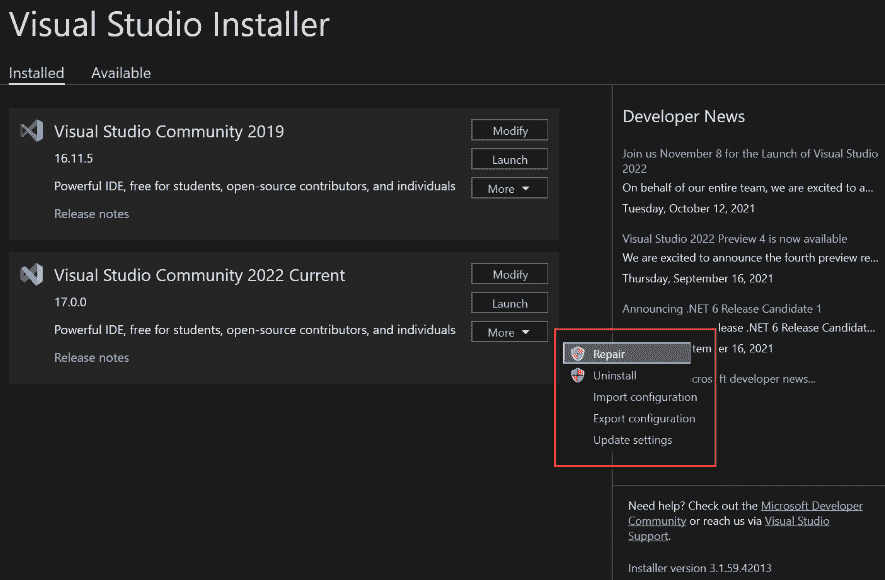

图 1.13 – VS 安装程序选项

现在我们已经了解了 VS 2022 的安装过程，让我们来探索 VS for Mac 用户。

# VS for Mac

VS 为 Mac 用户提供了新版本。使用此版本，开发者可以在 MacOS 上获得与 Windows 用户相似的经验。

由于操作系统的不兼容性问题，.NET Framework 在 VS for Mac 中不受支持，只有 VS for Windows。

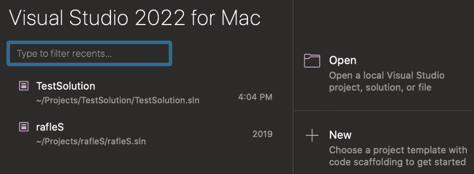

图 1.14 – VS for Mac – 启动屏幕

在*图 1.14*中，您可以看到 VS for Mac 打开时的样子；它看起来几乎与 Windows 版本相同。用户可以选择最近的项目、打开项目或创建一个新的项目。

重要提示

尽管 VS for Mac 是使用 macOS 操作系统技术制作的，但开发团队正在努力保持与 VS for Windows 相同的体验。

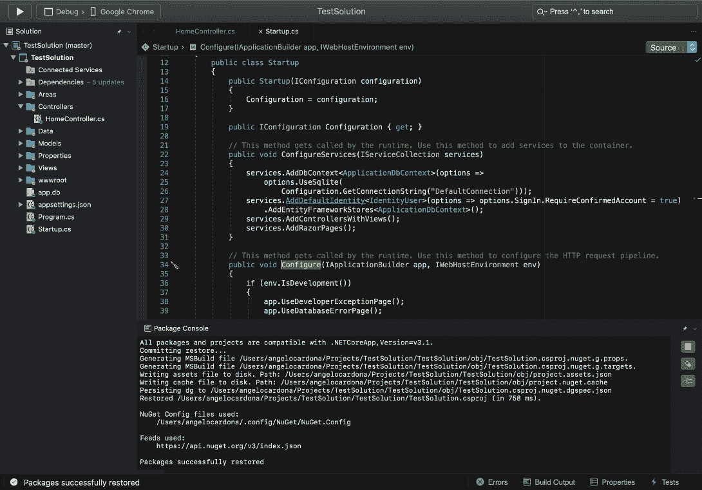

图 1.15 – VS for Mac – 主屏幕

在打开项目后，您可以设置您的工具栏，但默认情况下，VS for Mac 包含**解决方案资源管理器**、**属性**和**错误**部分。VS for Mac 是一个优秀的选项，适用于需要调试和性能工具的开发者，以及希望为 Android、iOS 和 MacOS 创建应用程序的 .NET MAUI（使用 C# 和 XAML 或使用 Blazor 创建原生应用程序的技术）开发者。

如果您想尝试 VS for Mac，您可以在以下链接中获取安装程序：

[`visualstudio.microsoft.com/vs/mac/`](https://visualstudio.microsoft.com/vs/mac/)

# 摘要

在本章中，您学习了 VS 是什么，可用的不同版本的 IDE 以及您可以选择以适应项目需求，VS 2022 for Windows 的安装过程，以及 VS for Mac 的一般概念。

在*第二章**，配置 IDE*中，您将学习如何根据作为 Web 开发者的需求自定义 IDE。
