# 第二章：配置 IDE

通常情况下，软件开发者对编写代码的口味各不相同。这一点也适用于你用于开发的工具配置部分，例如，你可能想要更改 IDE 的一般颜色，或者更倾向于更改默认字体以更好地适应你的需求。

在本章中，你将了解 Visual Studio 中的不同配置选项，这无疑可以帮助你通过获得所需的确切元素来提高你的生产力，无论是从颜色还是你经常使用的窗口位置来看。

到本章结束时，你将能够修改 IDE 颜色方案，配置可停靠窗口，并自定义字体。

你将了解以下主题：

+   同步帐户和设置

+   配置颜色方案

+   自定义字体

+   自定义菜单和工具栏

+   自定义面板

# 技术要求

对于本章，你需要在你的机器上已经安装了 Visual Studio 2022。在*第一章*，*开始使用 Visual Studio 2022*中，你可以检查要求和安装过程。

# 同步帐户和设置

Visual Studio 的一个伟大功能是它允许你同步所做的配置，同时也允许你在不同的计算机上舒适地工作。

这得益于一个 Microsoft 帐户，它是使用 Visual Studio 所必需的。当你第一次启动 Visual Studio 时，会要求你输入该帐户，或者你可以通过点击 IDE 右上角的**登录**选项，随时输入或修改帐户以供 Visual Studio 使用，如图*图 2.1*所示：

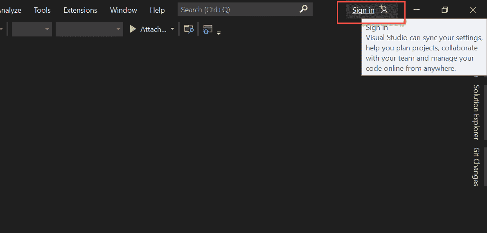

图 2.1 – Visual Studio – 登录（在主屏幕右上角）

通过此过程同步的主要配置如下：

+   用户定义的窗口布局配置

+   主题和菜单设置

+   字体和颜色

+   键盘快捷键

+   文本编辑器设置

如果你不想在特定计算机上应用配置的同步，可以通过访问**工具** | **选项** | **环境** | **帐户**菜单来实现。从这里，你可以取消选择**跨设备同步 Visual Studio 设置**选项，如图*图 2.2*所示：

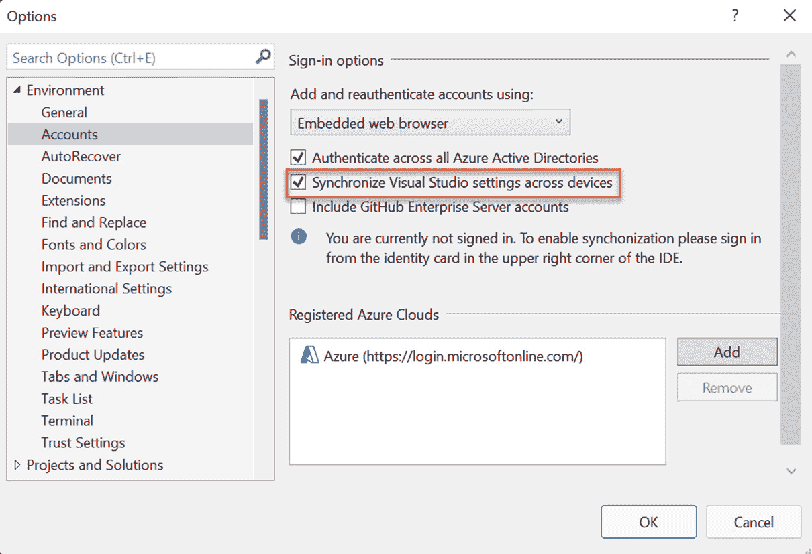

图 2.2 – 禁用设备间首选项同步

重要提示

禁用此功能不会影响同一计算机上可能安装的其他版本或版本的 Visual Studio 的同步过程。

现在我们已经了解了如何在设备间同步设置，让我们看看如何自定义主要设置。

# 配置颜色方案

有多种方法可以定制 Visual Studio 2022，其中最重要的是调整颜色。

无论你是在明亮的空间中还是在其他编程环境中，你可能都会想根据个人喜好调整颜色。

要将 Visual Studio 2022 的颜色方案定制为我们喜欢的样子，我们可以使用以下两个工具：

+   Visual Studio 默认主题

+   Visual Studio 颜色主题设计器

让我们分析这些选项，并学习如何应用最适合你的颜色方案。

## Visual Studio 默认主题

当你第一次启动 Visual Studio 2022 时，会弹出一个窗口，询问你关于开发设置和颜色主题，如图*图 2.3*所示：

![Figure 2.3 – 选择初始主题

![img/Figure_2.3_B17873.jpg]

图 2.3 – 选择初始主题

这些颜色主题如下：

+   **蓝色**

+   **蓝色（额外对比度）**

+   **深色**

+   **浅色**

+   **使用系统设置**

每个选项都有一套预先设定的颜色，你可以使用相同的窗口预览。

一旦你选择了你喜欢的主题，它将被应用并保存在与请求 IDE 使用许可的 Microsoft 账户关联的配置中。

重要提示

**深色**主题有助于在低光条件下减少眼睛疲劳。如果你每天需要在办公室或光线有限的地方工作数小时，这是一个完美的选择。*本书中的所有图表和截图都将使用深色模式*。

如果你想更改最初选择的主题，你可以通过进入主 Visual Studio 窗口并点击显示**继续无代码**链接来完成：

![Figure 2.4 – 无代码访问 Visual Studio

![img/Figure_2.4_B17873.jpg]

图 2.4 – 无代码访问 Visual Studio

然后，从**工具**下拉菜单中，进入**主题**部分；你将找到所有默认主题以及你之前安装的主题。你只需选择一个即可应用所选主题，如图*图 2.5*所示：

![Figure 2.5 – 更改 Visual Studio 主题

![img/Figure_2.5_B17873.jpg]

图 2.5 – 更改 Visual Studio 主题

另一种更改主题的方法是，你可以进入**工具** | **选项** | **环境** | **常规**并选择**颜色主题**：

![Figure 2.6 – 在选项部分更改颜色主题

![img/Figure_2.6_B17873.jpg]

图 2.6 – 在选项部分更改颜色主题

在此菜单中，你还可以通过选择标记为**启动时打开**部分的选项来更改 Visual Studio 的启动方式。你可以选择以下选项之一：

+   **启动窗口**：默认窗口，你可以选择一个最近的项目或创建一个新的项目（见图*图 2.4*）。

+   **最近解决方案**：Visual Studio 将启动最后打开的项目或解决方案。

+   **空环境**：在 Visual Studio 中打开主窗口，不选择项目或解决方案。

让我们现在回顾一个下载额外主题的绝佳选项。

## Visual Studio 市场

如果 Visual Studio 2022 安装中的默认主题不足以满足你的需求，你可能想看看 Visual Studio 市场中的社区主题，你可以在[`marketplace.visualstudio.com/`](https://marketplace.visualstudio.com/)找到它们。

一旦你进入**市场**，你需要做的是创建一个过滤器来仅显示其他开发者创建的主题，如图*图 2.7*所示，这将显示一系列非常有趣的选择：

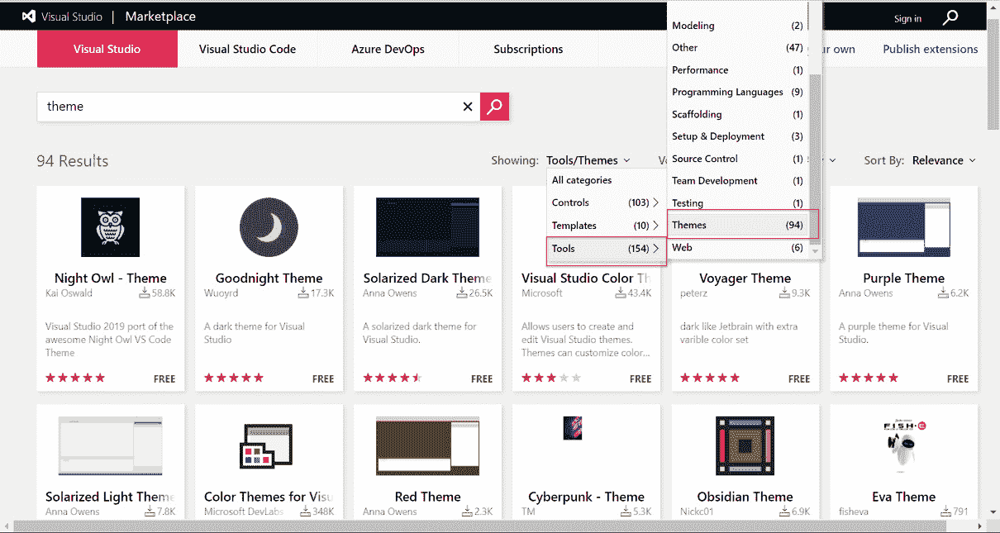

图 2.7 – 在 Visual Studio 市场搜索主题

如果你想了解更多关于特定主题的信息，你需要点击该元素，这将显示有关主题的信息，并且几乎总是会出现一张图片，展示主题应用在 Visual Studio 上的样子。

如果你想安装主题，只需点击**下载**按钮，这将下载相应的安装程序，当你运行它时，它将开始安装新主题的过程。

一旦主题已安装，只需按照上一节中的相同步骤切换到新主题。

重要提示

在同一个市场内，有一个名为 Visual Studio 主题设计器的插件，它允许你轻松创建自己的主题。

现在我们已经看到了如何选择符合我们视觉偏好的主题，让我们看看我们如何还能自定义字体样式。

# 自定义字体

你可能会对两个地方感兴趣，想要更改你使用的字体类型：

+   在一般环境中

+   在源代码编辑器中

让我们按以下方式分析每个选项。

## 在 IDE 中更改字体

要在 IDE 级别更改排版，请按照以下步骤操作：

1.  转到**工具** | **选项**菜单。

1.  在配置窗口中，转到**环境** | **字体和颜色**部分。

1.  在此部分，从**显示设置**下拉列表中选择**环境**选项。

这将允许你更改字体和大小等选项：

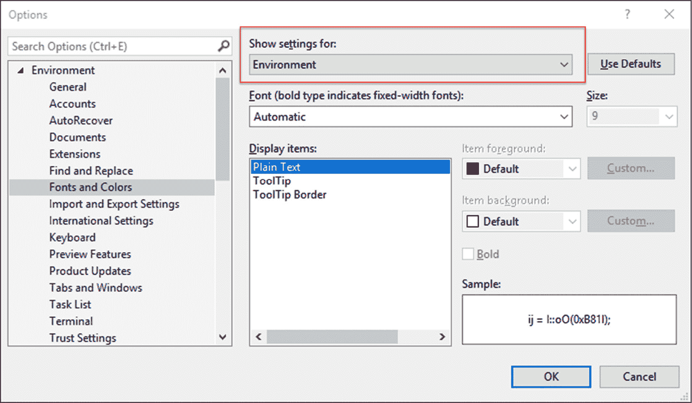

图 2.8 – 更改环境字体设置

在*图 2.8*中，我们可以使用**字体**选项来更改 Visual Studio 中的**自动**或**默认**字体，并使用**示例**部分查看其外观。

现在我们来回顾一下引用高亮显示，看看如何自定义 Visual Studio 在代码中高亮显示文本的方式。

## 引用高亮

另一种常见的自定义方法是更改引用的高亮显示。这指的是突出显示所选元素的不同出现，例如变量或关键字。这最好在*图 2.9*中看到，其中，当鼠标悬停在`int`关键字上时，所有对其的引用都会被高亮显示：

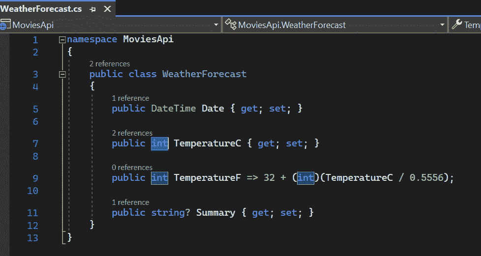

图 2.9 – 引用高亮

如果我们想更改找到的引用的颜色，我们必须执行以下步骤：

1.  进入**工具** | **选项**菜单。

1.  选择**字体和颜色**部分。

1.  选择**文本编辑器**配置。

1.  在**显示项**部分，选择名为**高亮引用**的配置，并更改相应的颜色，如图*图 2.10*所示：

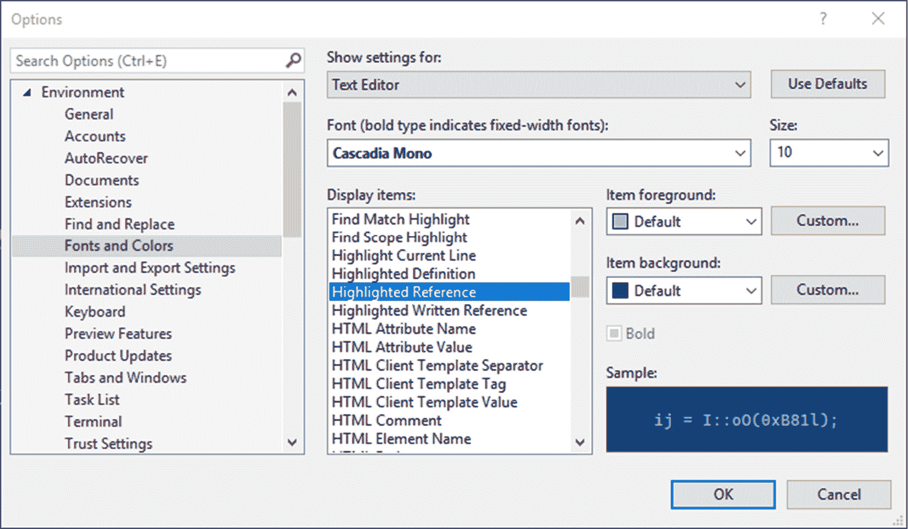

图 2.10 – 更改高亮引用选项

您可以在**项目前景**中选择文本颜色，在**项目背景**中选择背景颜色，并最终在**示例**部分预览所选颜色。

## 在代码编辑器中更改字体

要更改文本编辑器中使用的字体，请遵循*图 2.10*之前显示的相同步骤。

作为配置选项的一部分，您可以更改字体、字体颜色、字体大小和背景等属性。

此配置选项的一个优点是它允许您根据需要尽可能具体地进行配置。这意味着您还可以更改选中文本、行号、书签和代码片段等内容的字体，以及其他许多设置。

现在您已经知道如何更改字体以适应您的需求，让我们看看如何调整 IDE 中的面板，以便您的项目工作流程更快。

重要提示

在 Visual Studio 2022 中，Cascadia 字体已被引入作为默认字体，该字体被描述为一种有趣的字体，具有更好的代码可读性。

# 自定义菜单栏和工具栏

菜单和工具栏是访问您经常使用的工具或选项（最好称为命令）的绝佳方式，因此学习如何自定义它们以帮助您开发应用程序非常重要。在本节中，我们将学习以下主题：

+   自定义菜单栏

+   自定义工具栏

首先，让我们看看如何自定义菜单栏。

## 自定义菜单栏

菜单栏是显示在 IDE 顶部的选项集，它允许您访问选项的下拉菜单（例如**文件**菜单）以执行特定任务、显示工具或对项目应用更改：

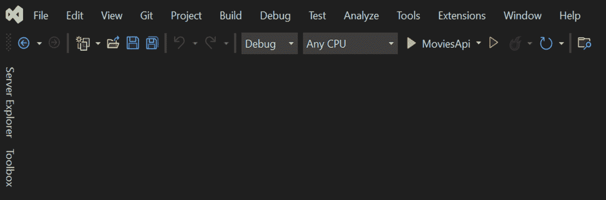

图 2.11 – Visual Studio 2022 的默认菜单栏

如果您想更改初始配置中的工具，无论是要在特定菜单中添加选项还是创建自己的菜单，请执行以下步骤：

1.  进入**工具** | **自定义**。

1.  进入**命令**部分。

1.  在此部分，您应该使用**菜单栏**选项，这将允许您修改主菜单栏和辅助菜单栏，您可以通过下拉菜单中的管道符号（|）来区分它们，如图*图 2.12*所示：

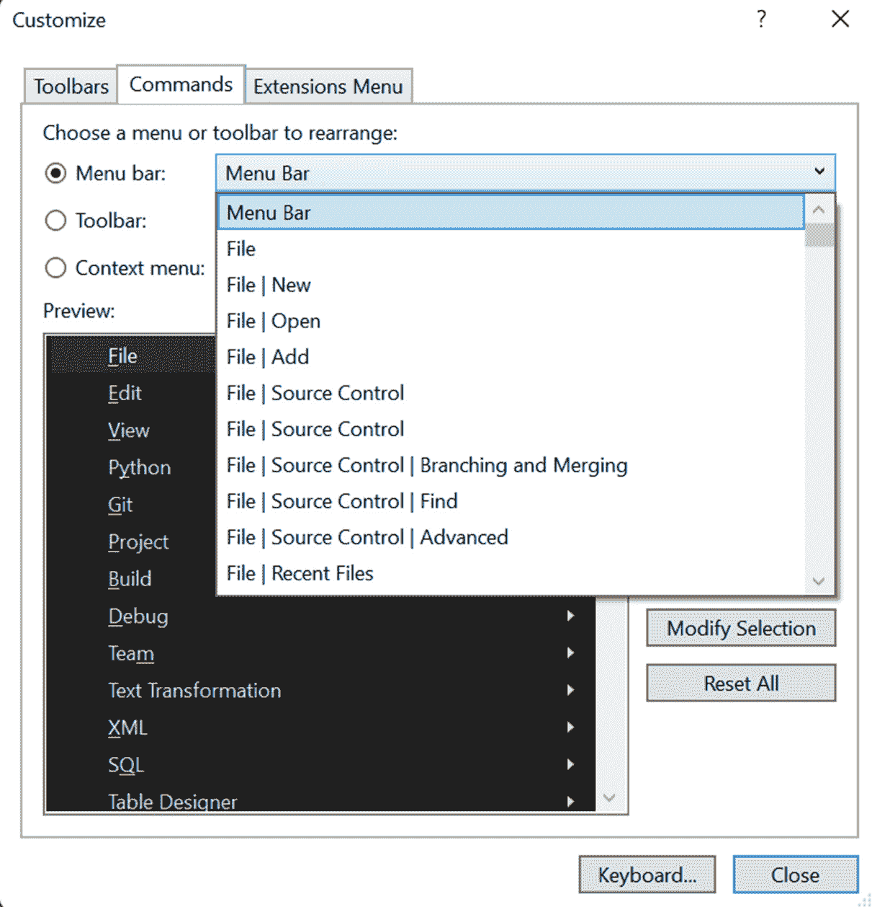

图 2.12 – 菜单栏自定义窗口

1.  一旦你选择了要修改的菜单，就会出现一个预览，显示菜单当前的外观。从这里，你可以通过点击**添加命令**按钮将新命令添加到菜单栏。

这将打开一个新窗口，显示按类别分组的每个命令，你可以选择将其添加到选定的菜单中，如图*图 2.13*所示：

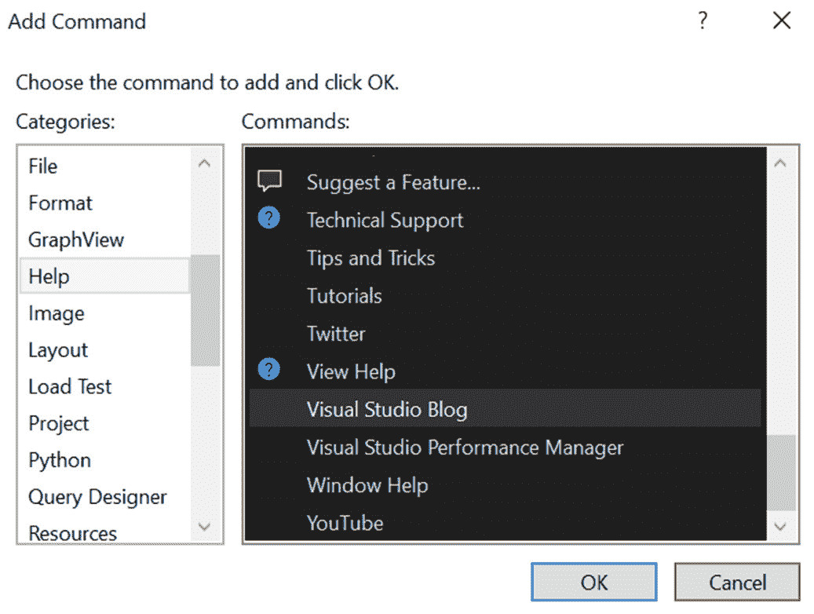

图 2.13 – 更改高亮引用选项

如果你想从菜单中移除添加的选项，只需选中它，然后点击**删除**按钮，该按钮在*图 2.14*中被矩形突出显示：

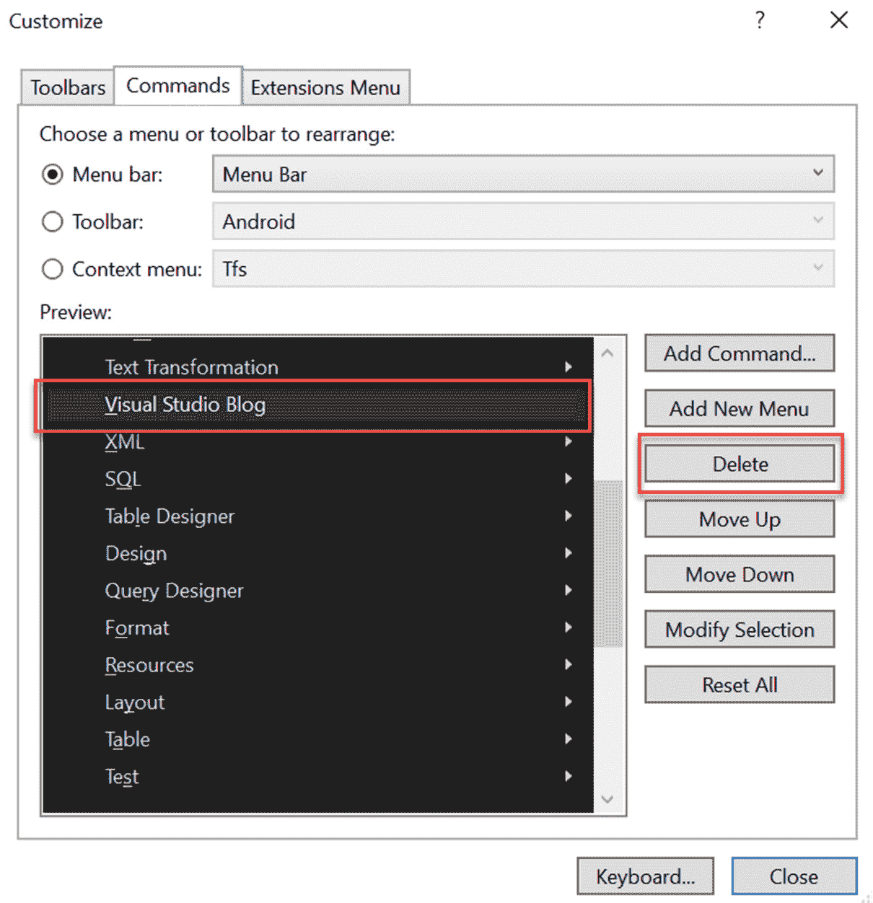

图 2.14 – 从菜单栏删除项目的按钮

你还有**上移**和**下移**按钮，这允许你将选项在菜单中上移或下移，并重新排列菜单项。

重要提示

可以删除用户创建的工具栏，但不能删除默认配置中的工具栏。

最后，你也可以创建新的子菜单，甚至新的菜单。为此，点击**添加新菜单**按钮，这将根据你所在的层级添加一个新的菜单。例如，如果你想添加主菜单，你必须选择这个选项，同时**菜单栏**菜单被选中：

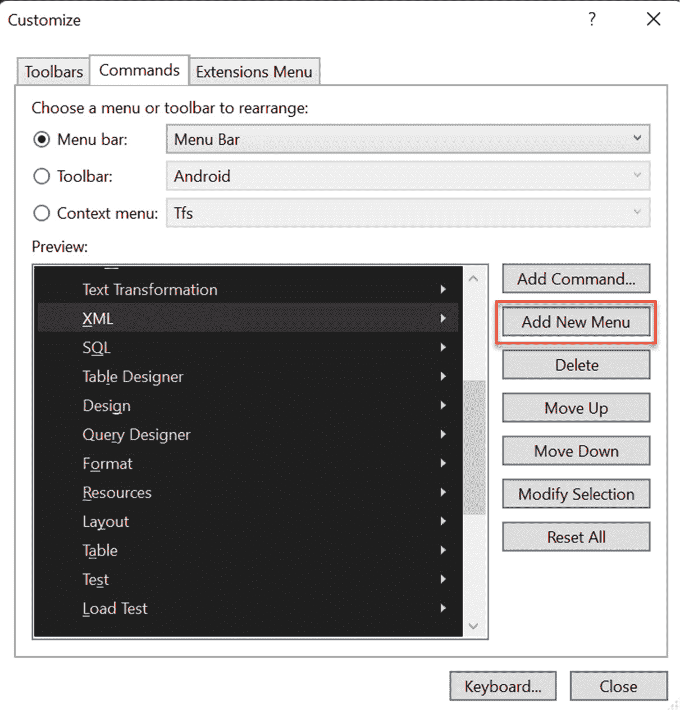

图 2.15 – 添加新主菜单的配置

相反，如果你想添加子菜单——例如，在**编辑**菜单中——你必须选择**编辑**菜单来执行此操作：

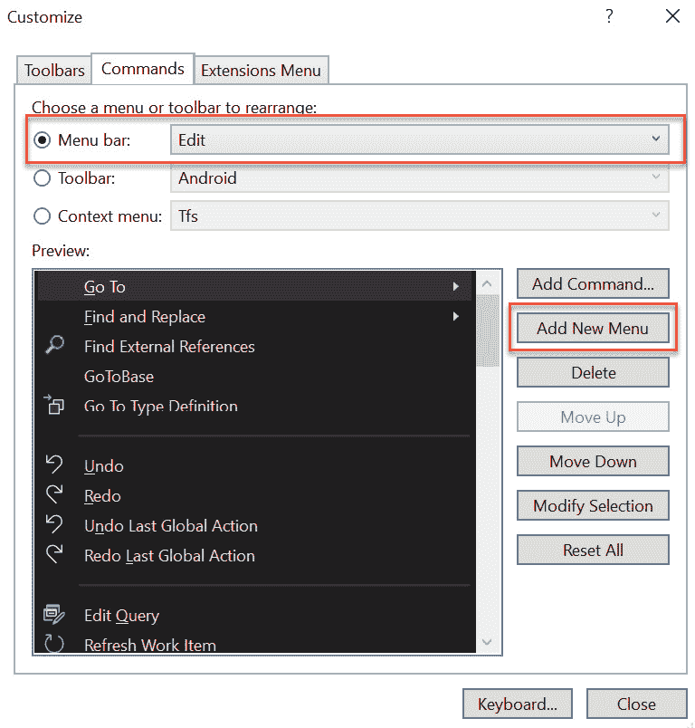

图 2.16 – 在编辑菜单中添加子菜单的配置

工具栏的自定义也是在同一个窗口中完成的；让我们看看如何进行下一步。

## 自定义工具栏

工具栏是你可以直接访问而无需首先打开菜单的命令集，如图*图 2.17*所示：

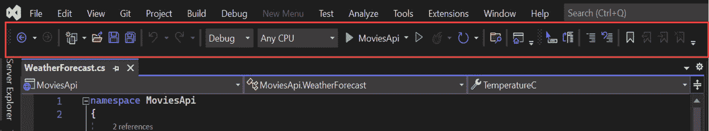

图 2.17 – Visual Studio 2022 工具栏部分

你也可以通过选择**工具** | **自定义**来配置哪些命令将出现在不同的工具组中。在这个窗口中，我们默认看到名为**工具栏**的选项卡，它将显示我们可以选择在界面中显示的不同类别。默认情况下，**标准**选项为 API 和 Web 项目选中。根据项目，默认添加了其他工具栏，但我们可以通过简单地勾选它们来手动添加其他工具栏，如图*图 2.18*所示：

![图 2.18 – 将工具栏添加到工具栏部分的自定义窗口

![图 2.18 – Figure_2.18_B17873.jpg]

图 2.18 – 添加工具栏到工具栏部分的定制窗口

你可以通过转到 **命令** 选项卡来向工具栏添加新命令。在这个选项卡中，我们将选择我们想要修改的工具栏并执行 *自定义菜单栏* 部分中描述的相同步骤。

如果你想要快速将不同的工具栏添加到 IDE 中，*图 2.19* 展示了如何通过访问 **视图** 菜单和 **工具栏** 来轻松完成，在这里你可以选择和取消选择你感兴趣的工具栏：

![图 2.19 – 从视图菜单访问工具栏

]

图 2.19 – 从视图菜单访问工具栏

你现在知道如何在 Visual Studio 中添加和删除工具栏以根据你的偏好或使用的科技自定义工具集。接下来，让我们回顾如何自定义 Visual Studio 中的面板。

# 面板定制

Visual Studio 中的面板是访问特定工具的一种方式，根据你正在工作的项目类型。

这些面板由工具和文档编辑器组成，其中一些是经常使用的，例如解决方案资源管理器（查看项目结构）、工具箱（显示当前项目可以拖放的控制项）、属性面板（修改所选元素的属性）和代码编辑器。

了解如何使用这些面板非常重要，这样你才能配置最适合你项目的工具和编辑器集。这就是为什么在本节中，我们将探讨以下主题：

+   向面板添加工具

+   面板适配

+   文档操作

+   窗口布局管理

让我们学习如何配置 IDE 以显示你项目所需的工具。

## 向面板添加工具

Visual Studio 2022 有许多工具或窗口，你可以根据需要显示或隐藏。这些工具的列表可以在 **视图** 菜单中找到，如 *图 2.20* 所示：

![图 2.20 – The list of available tools

]

图 2.20 – 可用工具列表

一旦打开此菜单，你将立即看到通常最常用的工具列表。这些工具包括服务器资源管理器、类查看器、错误列表、输出窗口和终端等众多强大工具。

另有一组工具不太常用，但可能在某些时候对你有所帮助。这些工具位于 **其他窗口** 部分。

从这里，你可以访问容器、C# 交互式、数据源和包管理控制台等工具。

要将任何这些工具添加到其中一个面板，只需选择其中一个，它将自动添加到当前环境中的战略面板。例如，如果你添加 **服务器资源管理器** 工具，它将被添加到左侧面板。另一方面，如果你添加 **输出** 工具，它将被添加到底部面板。

## 面板适配

Visual Studio 的一个巨大优势是你可以将工具面板安排在你喜欢的任何位置。为了达到最佳效果，了解面板的结构是很有帮助的。

每个面板由五个部分组成，你可以在这里放置工具。这些部分位于面板的每一边，加上中心的一个，如图*Figure 2.21*所示：

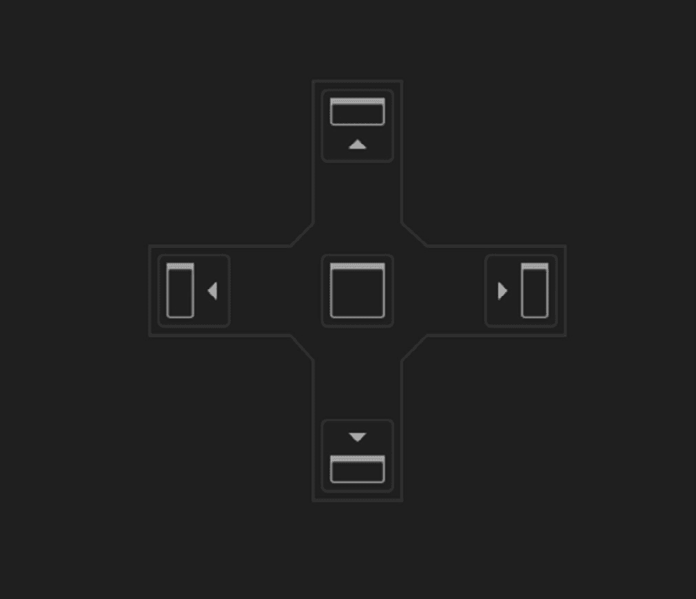

Figure 2.21 – 面板的部分

要将工具放置在面板中，只需将光标定位在工具的顶部，并将其滑动到你想要的面板即可。IDE 本身会显示你可以放置工具的可能位置，使整个过程简单易行；你还可以将面板从主窗口中拉出，单独使用。在*Figure 2.22*中，你可以看到窗口停靠的过程：

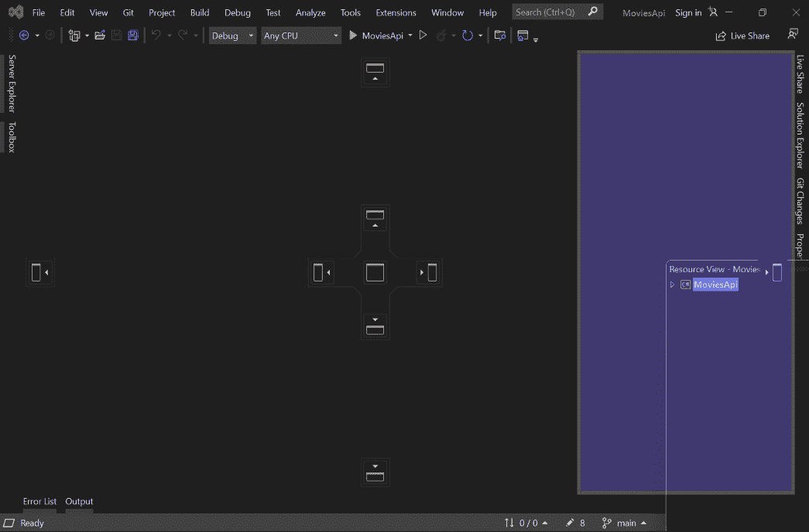

Figure 2.22 – 窗口在面板中的停靠

现在，是时候回顾我们如何与文档一起工作了。

## 文档操作

当我们使用文档编辑器，如代码编辑器时，有一些特殊选项可以应用。如果我们想查看这些选项，我们只需在打开文档的标签页上右键单击，如图*Figure 2.23*所示：

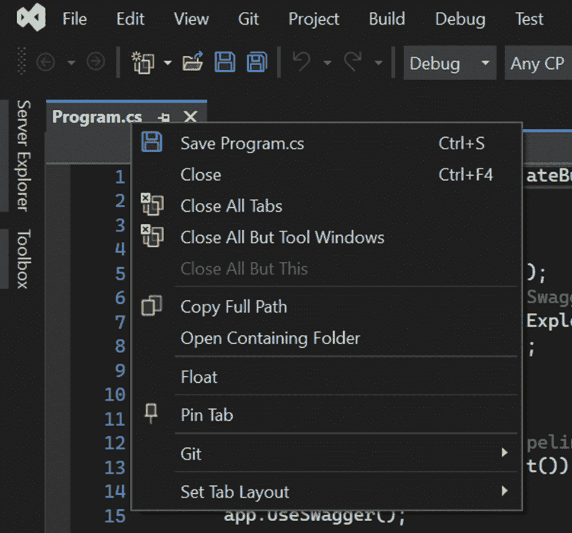

Figure 2.23 – 更改环境字体设置

这些选项非常直观——例如，**浮动**选项将允许我们将编辑器转换为一个浮动窗口，我们可以将其拖动到第二个显示器上。**固定标签页**选项将允许我们将标签页设置在打开窗口的开始位置，而**设置标签页布局**选项将允许我们将标签组移动到左侧、顶部或右侧。

如果我们打开的文档更多，我们将有更多的选项可用。使用此选项，我们可以创建文档组以分配空间，并用于执行任务以提高生产力，例如比较两个文档。*Figure 2.24*直观地展示了这一点：

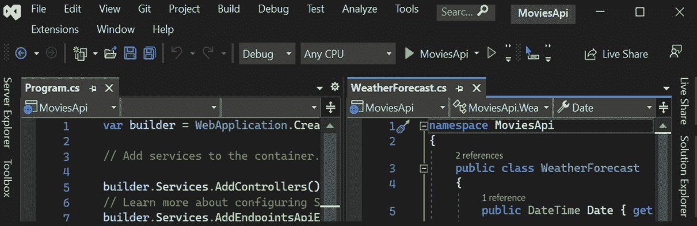

Figure 2.24 – 文档组

现在你已经知道如何在编辑器中管理你的文档并组织它们。接下来，让我们学习如何管理窗口布局。

## 管理窗口布局

在你作为开发者的生涯中，你可能会遇到各种项目。你可能会在一个项目中管理与数据库相关的事项，因此你可能会想要保持**服务器资源管理器**工具开启。

可能在你同时工作的另一个项目中，你不需要触摸任何与数据库相关的内容，而你希望保持工具箱开启。

有没有一种方法可以将工具放置在你喜欢的面板中，而不必在 IDE 中堆放工具？答案是肯定的，这要归功于窗口布局的使用。

让我们看看与它们相关的关键任务。

### 保存窗口布局

一旦您配置了用于特定项目的工具面板，您需要转到**窗口** | **保存窗口布局**菜单。

这将打开一个新窗口，该窗口会提示您为您的工位配置输入一个名称。一旦您输入了名称，配置将自动保存。

要验证更改是否已应用，您可以访问**窗口** | **管理窗口布局**菜单，该菜单将显示包含您之前保存的所有布局或工位的窗口。

### 应用窗口布局

保存至少一个布局后，您可以应用它，以便您的工位空间在加载工具时，根据您保存窗口布局时的排列方式来加载面板。

要应用布局，您必须转到**窗口** | **应用窗口布局**菜单，该菜单将显示所有之前保存的布局。选择您想要应用的布局，您的工位将加载。

### 重置窗口布局

最后，您可能希望撤销对工位所做的所有更改，以便您拥有初始的 Visual Studio 配置。幸运的是，通过访问**窗口** | **重置窗口布局**菜单即可获得此选项。

当我们按下此按钮时，系统会询问我们是否同意返回初始配置。我们只需点击**是**即可获得具有默认配置的环境。

小贴士 - 帮助快捷键

使用 *Ctrl* + *F1* 打开 Visual Studio 文档，阅读指南和新闻。

# 摘要

在本章中，您学习了如何自定义 Visual Studio，选择主题、字体、颜色和面板。根据您的需求，您不仅可以设置 Visual Studio 的首选项，还可以先尝试默认配置设置，并根据您的办公风格调整 Visual Studio。

在*第三章**，*“Visual Studio 2022 的改进”中，您将了解在此版本中添加的新改进，并查看与 Visual Studio 2019 的比较。
