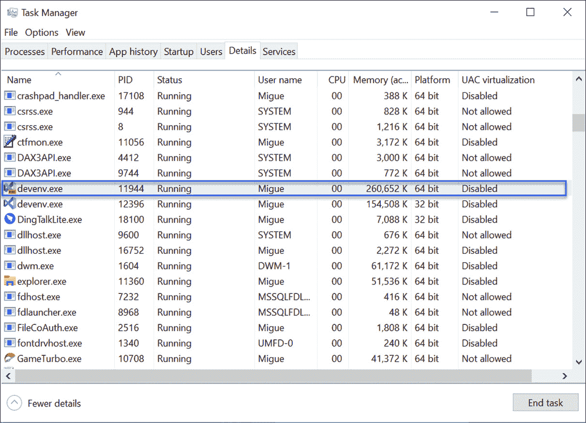
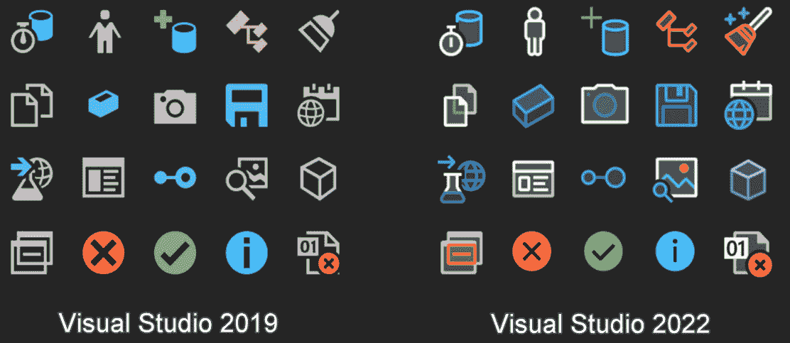
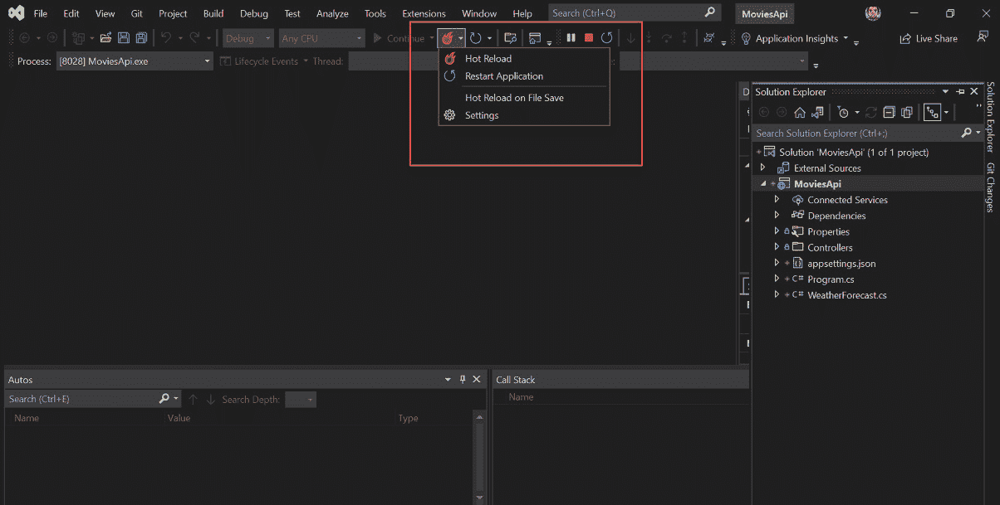
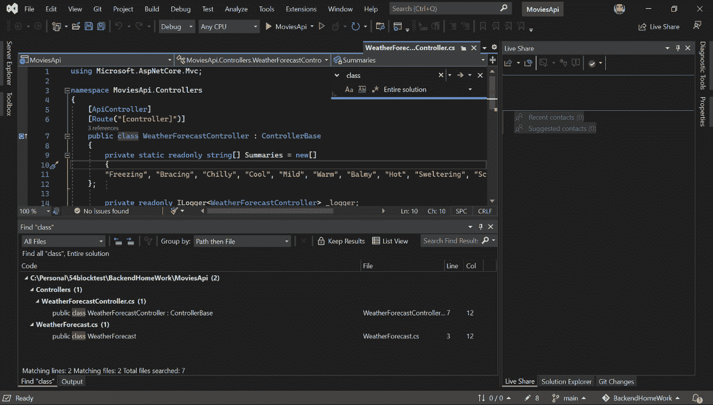
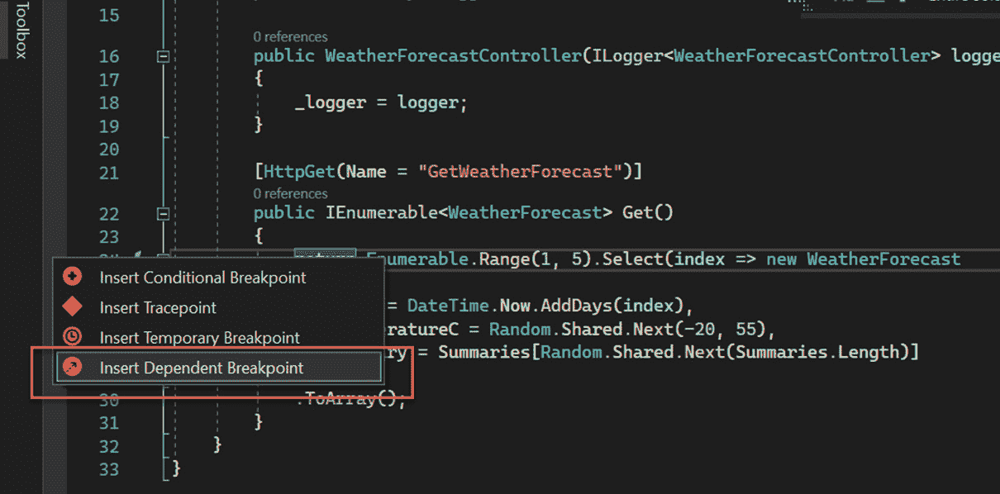
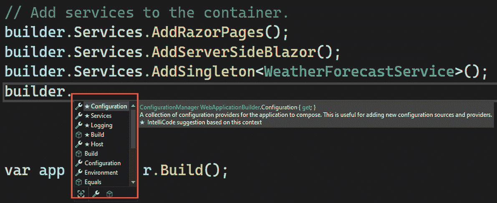
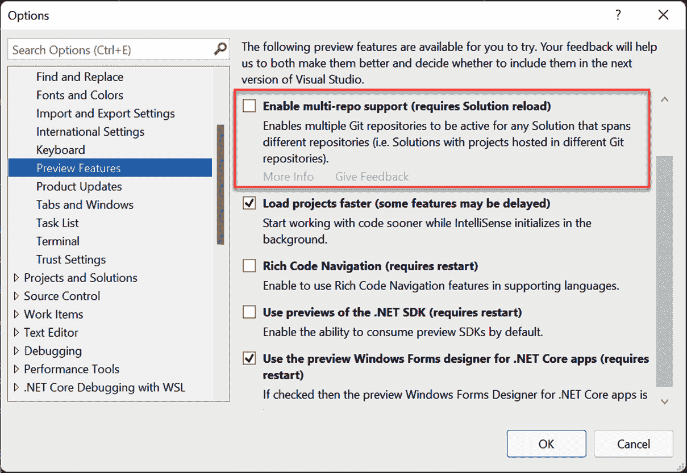

# 第三章：Visual Studio 2022 的改进

每个新的 Visual Studio 版本都会带来新的功能来改善用户体验和性能，并为开发者提供更多功能和工具。

我们刚刚开始使用 Visual Studio 2022。在这本书中，您将学习一些中等和高级复杂性的功能，在后面的章节中，我们将更详细地研究 Visual Studio 2022 的变化，以获得更深入的理解。但在这章中，我们将回顾您现在可以使用 Visual Studio 2022 中的最重要的功能。

到本章结束时，您将认识到 Visual Studio 2019 和 Visual Studio 2022 之间的主要差异以及这个新版本中最相关的改进。

我们将回顾 Visual Studio 2022 中的以下改进：

+   64 位架构

+   新图标和样式

+   .NET 6 支持

+   热重载

+   其他改进

# 技术要求

对于本章，您需要在您的机器上已经安装了 Visual Studio 2022。在 *第一章*，*开始使用 Visual Studio 2022*，您可以检查要求和安装过程。

# 64 位架构

Visual Studio 2022 中一个简单但重要的特性是其 64 位的新架构。这是一个我们无法直接看到的改变，但在内部，它利用 64 位 CPU 来提高性能并减少多个任务执行中的延迟。

Visual Studio 2022 仅支持 64 位系统；这在当前的笔记本电脑和 PC 中很常见。

使用 Windows 中的 **任务管理器**，您将能够注意到当 Visual Studio 2019 和 2022 同时运行时的差异：

图 3.1 – Visual Studio 2022 在 64 位平台上的运行和 2019 在 32 位平台上的运行

在 32 位架构中，内存访问限制为 4 GB。现在，得益于 64 位架构，可以访问更多的内存，减少时间限制并避免 IDE 冻结或崩溃。

总的来说，Visual Studio 开发团队在 2022 版本中提高了许多场景的性能。当您在大项目上工作时，您会注意到差异，并且未来的版本性能将更好。

64 位架构是一个很好的性能提升，但这个特性在编码时并没有改善用户体验。在下一节中，我们将看到图标和样式的改进如何带来更好的用户体验。

# 新图标和样式

Visual Studio 2022 中添加了新的图标和样式。尽管这是一个简单的功能，但它帮助我们更容易地在应用程序中导航，使用视觉元素并正确识别动作和工具。例如，在 *图 3.2* 中，你可以看到扫帚图标（第一行，第五列）具有更好的对比度，采用了新的鲜艳的黄色（特别是针对深色主题）和现代设计。它还暗示将执行代码清理。扫帚图标用于执行代码清理以修复代码格式：

图 3.2 – Visual Studio 2022 与 2019 的图标对比

重要提示

关于 Visual Studio 2022 中的新图标的一个有趣的事实是，Visual Studio 开发团队与开发者社区合作，以满足三个目的——一致性、可读性和熟悉性。这导致了一系列具有相同含义但具有一致颜色、鲜明对比和可识别轮廓的图标。

字母、图标和背景之间的对比度得到了改善，使其更加舒适，对眼睛的疲劳感减少。在 *图 3.3* 中，你可以看到一个示例：

![图 3.3 – Visual Studio 2019（左）与 2022（右）的深色主题示例]

](img/Figure_3.3_B17873.jpg)

图 3.3 – Visual Studio 2019（左）与 2022（右）的深色主题示例

重要提示

虽然深色主题的使用在开发者中变得越来越普遍，但它也在整个行业的应用程序中变得越来越普遍。

*图 3.4* 是使用蓝色主题的另一个示例。尽管颜色非常相似，但我们仍能看出一些差异，以及新图标如何使屏幕看起来更好：

![图 3.4 – Visual Studio 2019（左）与 2022（右）的蓝色主题示例]

](img/Figure_3.4_B17873.jpg)

图 3.4 – Visual Studio 2019（左）与 2022（右）的蓝色主题示例

其他主题也有一些变化，但深色和蓝色是改进最多的。

使用这些新的图标和样式，使用 Visual Studio 变得更加用户友好。在下一节中，我们将看到 Visual Studio 如何支持 .NET 的新版本，.NET 6。

# .NET 6 支持

**.NET** 是一个免费、开源的框架，用于使用 C#、F# 和 Visual Basic（其中 C# 是最受欢迎的）创建 Web、桌面、移动和其他类型的应用程序。

每年都会发布一个新的 .NET 版本。.NET 6 是一个新的长期支持版本，它提供了许多新的改进，例如最小 API 和 C# 10 兼容性。有关改进的更多信息，您可以访问 [`docs.microsoft.com/en-us/dotnet/core/whats-new/dotnet-6`](https://docs.microsoft.com/en-us/dotnet/core/whats-new/dotnet-6)。

Visual Studio 2022 已准备好使用这个新版本创建、编译和发布项目。

在 *第四章*，“创建项目和模板”，我们将分析 Visual Studio 提供的项目和模板，并查看选择 .NET 6 作为我们应用程序选项的方案。

我们可以使用 .NET 6 创建项目，但也可以使用一种新的功能来快速检查代码更改。在下一节中，我们将回顾热重载如何在使用 Visual Studio 2022 的过程中提高我们的生产力。

# 热重载

对于很长时间，**热重载**一直是 .NET 开发者社区的主要请求功能。这是一个已经在许多技术中实现的功能，通过在每次对代码进行更改后刷新应用程序来提高开发者的生产力。

重要提示

热重载是一种在代码更改后重新编译代码的功能。这样，应用程序可以立即显示视觉更改，而无需重新启动，从而显著提高生产力。

即使是外部公司也在开发这项功能；最受欢迎的是 LiveSharp，它提供每月订阅（截至撰写本文时）。您可以通过以下链接查看：

[`www.livesharp.net/`](https://www.livesharp.net/)

Visual Studio 2022 为许多类型的项目提供了这个令人惊叹的功能，包括涉及 ASP.NET 和 Blazor（通过使用 WebAssembly 和 Razor 组件创建 Web 应用程序）的项目：

图 3.5 – Visual Studio 2022 中的热重载按钮

重要提示

热重载背后的团队决定不支持 Android 和 iOS 场景中基于 *Xamarin.Forms* 的新热重载功能，因此建议迁移到 .NET MAUI 以使用此功能。

在后续章节中，我们将在一些演示中使用此实用程序，并了解为什么这个工具对我们来说非常重要。在下一节中，我们将分享其他可以帮助我们提高生产力的改进，尤其是在大型项目中。

# 其他改进

Visual Studio 2022 有其他改进，其中之一是性能。Visual Studio 2022 在 64 位操作系统上运行，此外，如搜索文件工具等特性也得到了改进，以帮助在包含大量文件的项目中快速查找元素。在下图中，您将看到一个搜索示例：

图 3.6 – 在 Visual Studio 2022 中搜索单词 "class" 的示例

此外，您还有一种新的断点类型（*断点是一种在代码的特定行中停止应用程序执行的技术*）。使用此功能，我们可以添加一个依赖于之前创建的断点的断点。我们将在 *第五章*，“调试和编译您的项目”中看到更多关于此功能的信息。在 *图 3.7* 中，您可以看到新的 **插入依赖断点** 选项：

图 3.7 – Visual Studio 中的依赖断点

最后，IntelliCode 无疑是 Visual Studio 2022 中引入的主要变化之一，它允许开发者有信心地进行编程，快速找到问题，并通过在待办事项列表顶部建议最可能被使用的项目来进行集中的代码审查，正如你在 *图 3.9* 中所看到的：

我们将在 *第七章* “使用 AI 和代码视图高效编码” 中了解这个令人惊叹的新增功能的全部特性，这将允许你全面探索 IntelliCode 的使用。

在 *第四章* “创建项目和模板” 中，你将创建你的第一个项目，并分析 Visual Studio 为不同编程语言和技术提供的模板。

我们将在 *第十一章* “实现 Git 集成” 中更深入地分析这个功能，我们将使用 GitHub 上的一个仓库来尝试与 Git 和 GitHub 集成的相关功能。

图 3.8 – 在“工具 | 选项 | 预览功能”中，有一个新选项来启用多仓库支持

摘要

这是一种非常有用的断点类型，适用于调试具有高复杂性的大型应用程序。当先前的断点满足条件时，它将中断应用程序的执行。

# 图 3.9 – IntelliCode 建议最可能被使用的属性和方法

在本章中，我们概述了 Visual Studio 的主要改进以及 Visual Studio 2022 和 Visual Studio 2019 之间的一些差异。在整个书中，我们将进一步分析这些功能并在一些演示中使用它们。

关于 Git 集成，我们有一个新的实验性功能，帮助我们在一个解决方案中处理多个仓库。因此，你可以在不同的项目中执行更改，然后提交更改（在 Git 中保存更改），而无需打开多个 Visual Studio 实例。在 *图 3.8* 中显示了启用多个仓库的新选项：
