# 第六章：添加代码片段

编码是一项美好的活动，但有时我们有一些重复的语句来解决一些已知的情况，这使得编码更像是一个单调的过程。“代码片段”是重用代码的好资源，在需要的地方可以重用代码片段。Visual Studio 有一些默认的代码片段，我们可以在编码时使用，但我们也有一些工具来创建自己的代码片段。

在本章中，我们将学习 Visual Studio 如何通过代码片段帮助我们更快地编写代码，以及如何创建自己的代码片段。

我们将回顾以下关于代码片段的主题和功能：

+   什么是代码片段？

+   创建代码片段

+   删除代码片段

+   导入代码片段

让我们开始了解代码片段的概念以及它们在 Visual Studio 中的工作方式。

# 技术要求

要完成本书本章的演示，你必须已经安装了带有 Web 开发工作负载的 Visual Studio 2022，如*第一章*“Visual Studio 2022 入门”中所示。拥有我们在*第四章*“创建项目和模板”中创建的 SPA 基础项目非常重要。

你可以在以下链接中检查对`WeatherForecastController.cs`所做的更改：[`github.com/PacktPublishing/Hands-On-Visual-Studio-2022/blob/main/Chapter06/WeatherForecast.cs`](https://github.com/PacktPublishing/Hands-On-Visual-Studio-2022/blob/main/Chapter06/WeatherForecast.cs)。

# 什么是代码片段？

通过创建生成常见语句的模板，代码片段是一种简单且易于重用代码的方式，例如条件语句、循环或注释结构。

Visual Studio 为几乎所有支持的技术和编程语言提供了许多默认的代码片段。在 Visual Studio 中有许多使用代码片段的方法，让我们来看看。

重要提示

代码片段是软件开发中的一个常见概念。几乎所有的 IDE 和代码编辑器都提供代码片段或具有包含代码片段的扩展。

使用在*第四章*“创建项目和模板”中创建的 SPA 项目，你将在`WeatherForecastController.cs`文件中通过导航创建一个新的条件来在`Get`方法中返回一个空集合。只需写下单词`if`，就可以看到 Visual Studio 建议的代码片段（见*图 6.1*）：

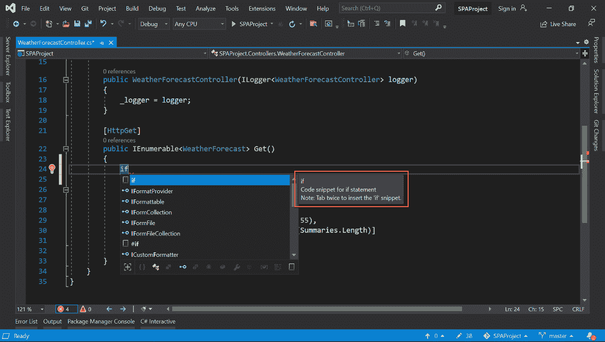

图 6.1 – Visual Studio 建议的 if 语句代码片段

由于条件语句是非常常见的代码片段，Visual Studio 为你提供了快速创建此代码的选项。你可以点击`if`或继续编写，如果你不想执行任何操作。你也可以按*tab*键两次来自动创建`if`语句。

在智能代码补全（也称为 **IntelliSense**，关于这一点我们将在 *第七章*，*使用 AI 和代码视图高效编码）建议中有一个选项，你可以看到所有按你输入的字符过滤的代码片段。参见 *图 6.2* 中标记为红色的代码片段过滤器：

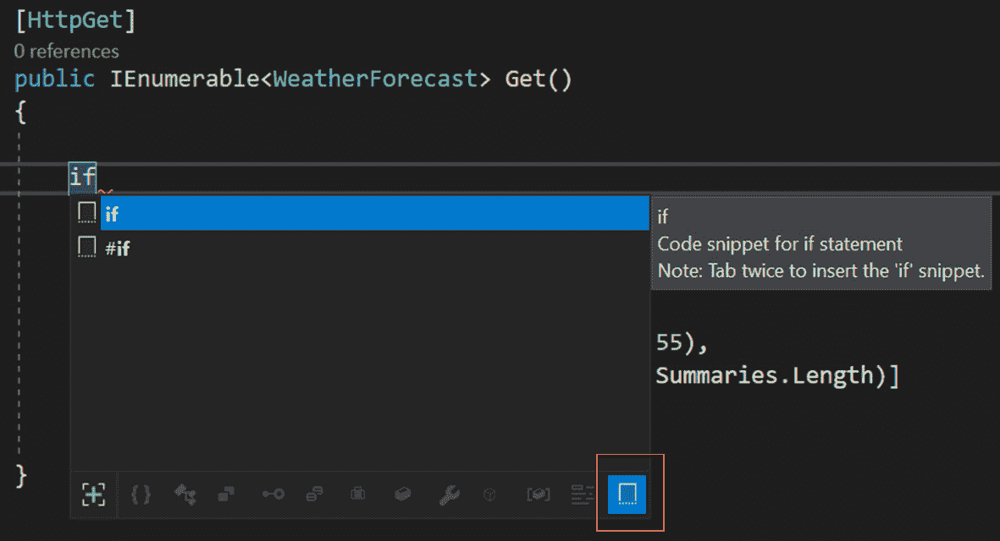

图 6.2 – Visual Studio 中的代码片段过滤器

当 `if` 条件的代码片段被突出显示时，你可以按 *tab* 键两次来生成 `if` 语句的代码，包括括号（*见图 6.3*）：

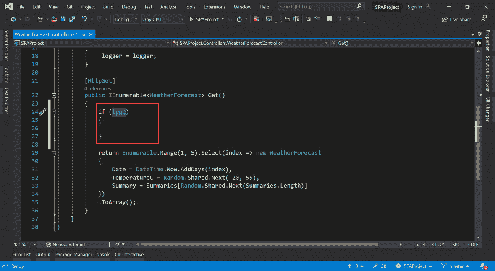

图 6.3 – Visual Studio 创建的 if 语句

你将得到一个 `if` 语句，包括花括号和默认值 `true`。你需要将 `true` 替换为你的条件。在这种情况下，你可以添加一个条件，当操作系统是 Linux 时返回一个空集合：

```cs
[HttpGet]
```

```cs
public IEnumerable<WeatherForecast> Get()
```

```cs
{
```

```cs
            if (OperatingSystem.IsLinux())
```

```cs
            {
```

```cs
                return new List<WeatherForecast>();
```

```cs
            }
```

```cs
            return Enumerable.Range(1, 5).Select(index => 
```

```cs
                new WeatherForecast
```

```cs
            {
```

```cs
                Date = DateTime.Now.AddDays(index),
```

```cs
                TemperatureC = Random.Shared.Next(-20, 55),
```

```cs
                Summary = Summaries[Random.Shared.Next
```

```cs
                    (Summaries.Length)]
```

```cs
            })
```

```cs
            .ToArray();
```

```cs
}
```

在前面的代码块中，我们在 `Get` 方法中的默认逻辑之前添加了一个条件，以检查应用程序运行的操作系统是否为 Linux。在条件内部，我们返回一个空列表。

默认情况下，C# 包含了许多有用的代码片段，但以下是最受欢迎的：

+   `try`: 为 `try`/`catch` 语句创建结构

+   `for`: 使用局部变量 `i` 生成 `for` 语句

+   `ctor`: 自动创建类的构造函数

+   `switch`: 生成一个 `switch` 语句

+   `prop`: 在当前类中创建一个新的属性

你可以在 C# 代码中尝试一些这些代码片段，以查看 Visual Studio 生成的代码，并在需要时使用它们。

让我们看看使用 CSS 文件的一个例子。导航到 `custom.css` CSS 文件（*见图 6.4*）：

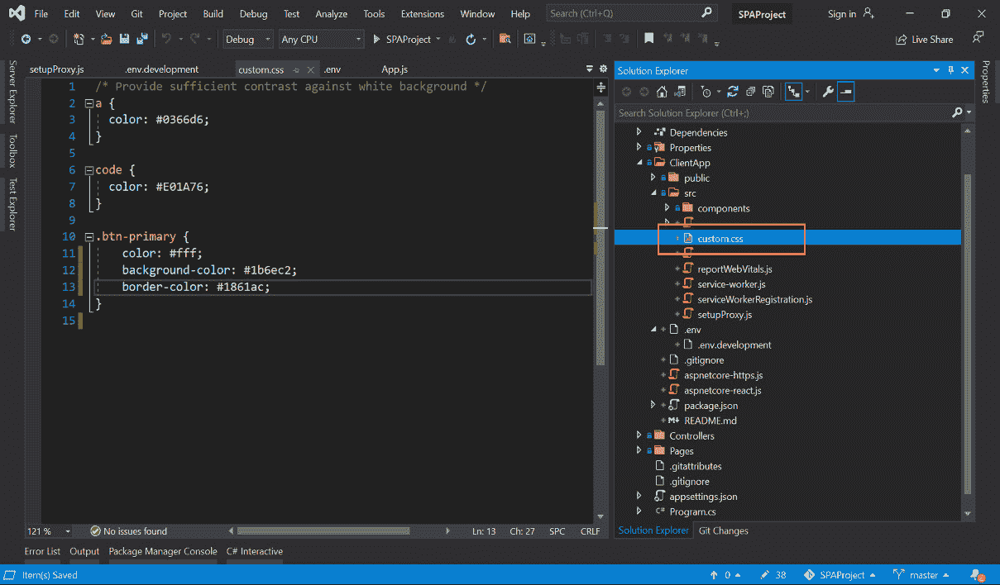

图 6.4 – 在 Visual Studio 中加载的 custom.css 文件

在 `custom.css` 文件中，你可以编写 `columns` 属性，并查看 Visual Studio 如何建议一个代码片段。参见 *图 6.5* 中为此演示提供的代码片段：

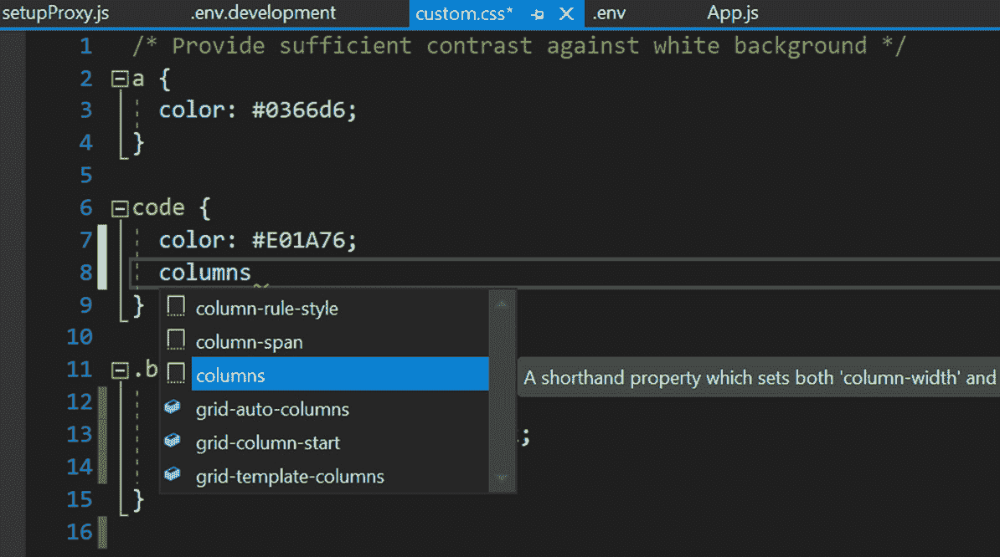

图 6.5 – 当你输入单词 "columns" 时 Visual Studio 提供的代码片段

再次使用键 *tab* 两次，你可以自动生成这个属性的代码。参见 *图 6.6* 中生成的代码：

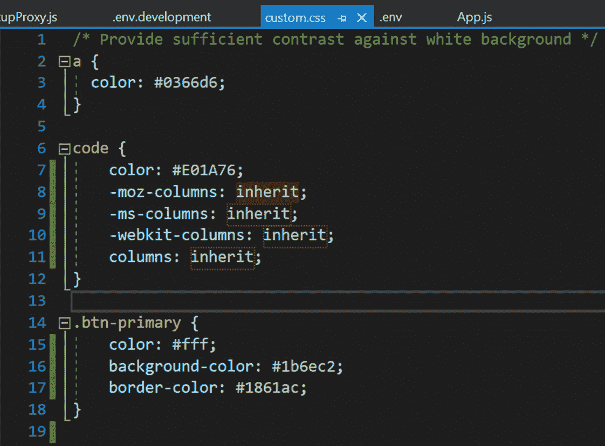

图 6.6 – 代码片段生成的代码

在这种情况下，Visual Studio 将为每个浏览器生成四个属性，以确保代码与所有浏览器兼容（Chrome、Mozilla 和其他）。我们可以保留默认的`inherit`值，因为此操作的提议只是为了查看 Visual Studio 如何生成代码。

现在，您已经准备好在 Visual Studio 中使用代码片段。您可以识别 Visual Studio 提供的哪些建议是代码片段，以及如何过滤它们。现在是时候学习如何创建自己的代码片段并在代码中使用它们了。

# 创建代码片段

要在 Visual Studio 中创建代码片段，我们需要创建一个具有`snippet`扩展名的文件。此文件具有 XML 格式，并且有一个基本模板，我们可以更新它以包含代码片段的信息。以下代码是一个模板示例：

```cs
<?xml version="1.0" encoding="utf-8"?>
```

```cs
<CodeSnippets xmlns="http://schemas.microsoft.com/
```

```cs
    VisualStudio/2005/CodeSnippet">
```

```cs
    <CodeSnippet Format="1.0.0">
```

```cs
        <Header>
```

```cs
            <Title></Title>
```

```cs
            <Author></Author>
```

```cs
            <Description></Description>
```

```cs
            <Shortcut></Shortcut>
```

```cs
        </Header>
```

```cs
        <Snippet>
```

```cs
            <Code Language="">
```

```cs
                <![CDATA[]]>
```

```cs
            </Code>
```

```cs
        </Snippet>
```

```cs
    </CodeSnippet>
```

```cs
</CodeSnippets>
```

让我们回顾一下这个 XML 中的所有属性，并了解如何创建我们的第一个代码片段。

在`标题`部分，我们有以下内容：

+   `标题`：名称或一般信息

+   `作者`：创建者或作者

+   `描述`：您的代码片段执行的操作

+   `快捷键`：在您输入时调用代码片段的快捷键

在`Snippet`中，我们有以下内容：

+   `语言`：代码的编程语言

+   `[CDATA[]`：包含代码

现在，我们可以创建一个代码片段来检测代码正在运行的操作系统是 Linux 还是不是：

```cs
<?xml version="1.0" encoding="utf-8"?>
```

```cs
<CodeSnippets xmlns="http://schemas.microsoft.com/VisualStudio/2005/CodeSnippet">
```

```cs
    <CodeSnippet Format="1.0.0">
```

```cs
        <Header>
```

```cs
            <Title>If Linux condition</Title>
```

```cs
            <Author>Myself</Author>
```

```cs
            <Description>Conditional to now if the 
```

```cs
                operating system is Linux</Description>
```

```cs
            <Shortcut>ifln</Shortcut>
```

```cs
        </Header>
```

```cs
        <Snippet>
```

```cs
            <Code Language="CSharp">
```

```cs
                <![CDATA[if (OperatingSystem.IsLinux())
```

```cs
                {
```

```cs
                    return new List<WeatherForecast>();
```

```cs
                 }]]>
```

```cs
            </Code>
```

```cs
        </Snippet>
```

```cs
    </CodeSnippet>
```

```cs
</CodeSnippets>
```

您可以在文档中创建一个新文件夹或为此次活动创建任何新文件夹，并将文件保存为`snippet`扩展名（见*图 6.7*）：

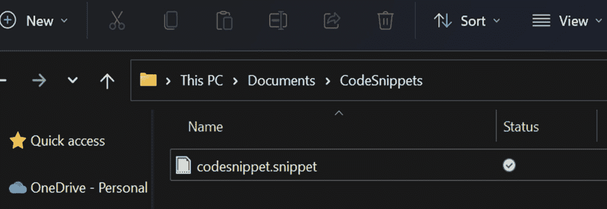

图 6.7 – Windows 资源管理器中的代码片段文件

现在，最后一步是将此文件夹添加到 Visual Studio 中的代码片段部分。导航到**工具** | **代码片段管理器**，在**语言**下拉菜单中，选择**CSharp**（见*图 6.8*）：

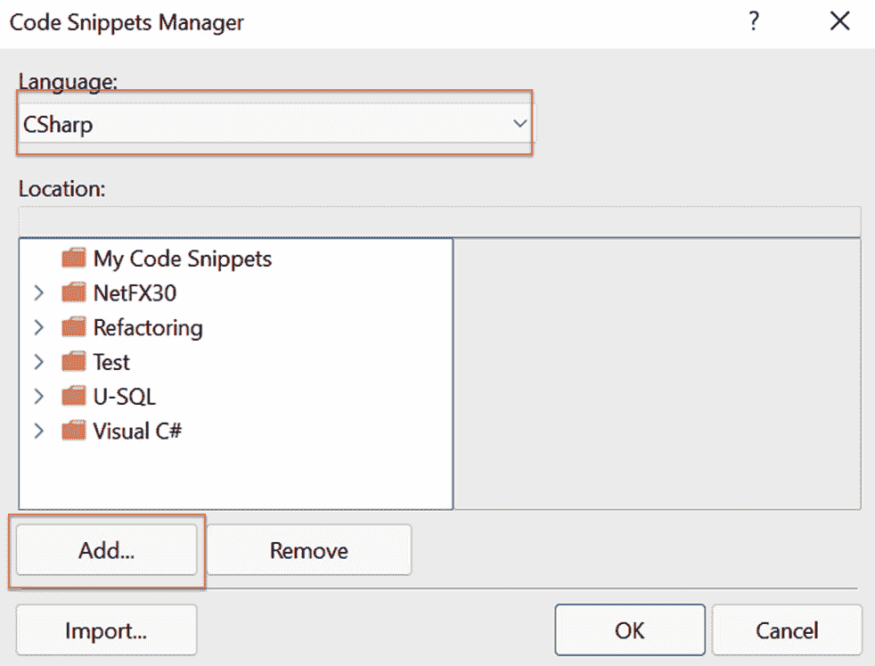

图 6.8 – Visual Studio 中的代码片段管理器

重要提示

您可以使用*Ctrl* + *K*快捷键，然后按*Ctrl* + *B*打开**代码片段管理器**。

**语言**选项包括 Visual Studio 支持的所有编程语言和技术，这取决于已安装的工作负载。

您可以点击**添加...**并选择您的代码片段创建的文件夹。

添加文件夹后，您将在列表中看到一个新文件夹，包括新的代码片段。如果您选择此代码片段，您将在右侧面板上看到详细信息，如图*图 6.9*所示：

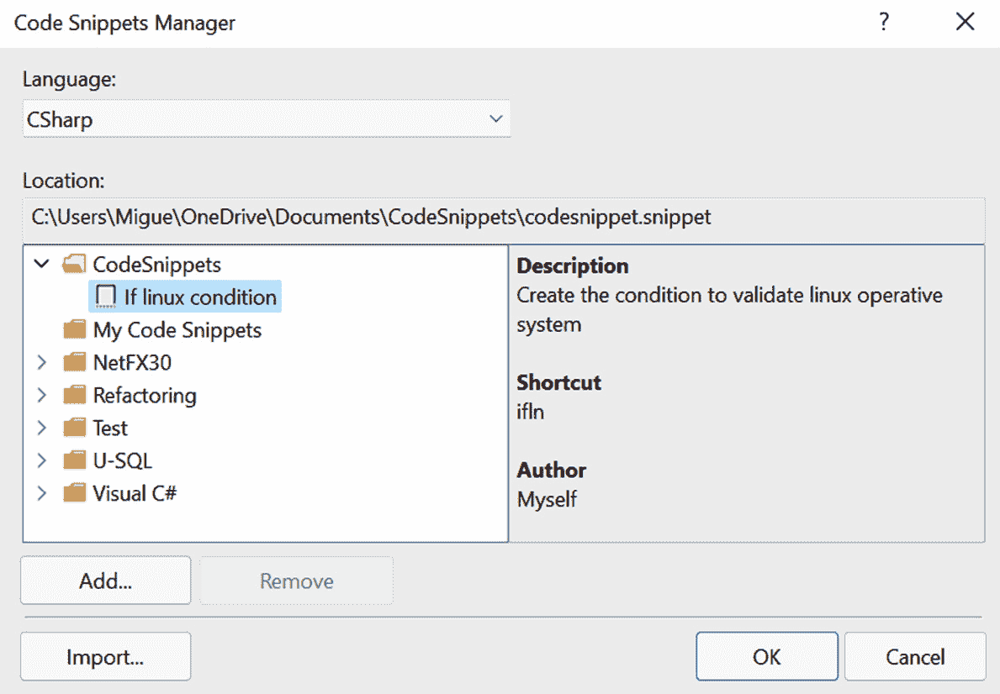

图 6.9 – if linux 条件代码片段的详细信息

现在，您已经准备好在任何 C#文件中使用您的代码片段。打开`WeatherForecastController.cs`文件，并在`Get`方法中尝试您的新代码片段：

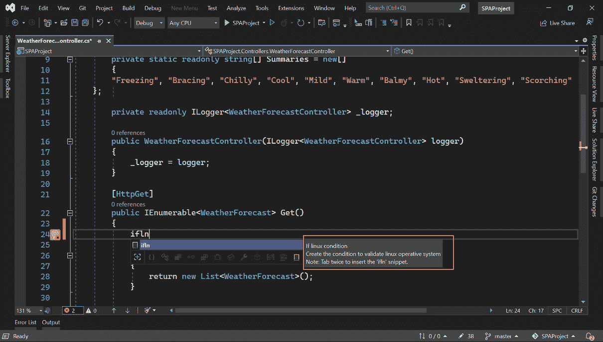

Figure 6.10 – 在 Visual Studio 中使用 if linux 条件代码片段

您可以在*图 6.10*中看到 Visual Studio 如何建议您的新代码片段，在工具提示中，有您提供的描述。通常，您可以按*tab*键两次来生成代码片段的代码。

重要提示

想要了解更多关于如何创建和设计代码片段的信息，请查看官方文档：[`docs.microsoft.com/visualstudio/ide/code-snippets`](https://docs.microsoft.com/visualstudio/ide/code-snippets)。

到目前为止，您已经创建了您的第一个代码片段，并知道如何创建满足您需求的代码片段。但您还可以使用代码片段执行其他操作。所以，让我们看看如何在下一节中删除代码片段。

# 删除代码片段

由于人为错误，我们可能会添加不需要的代码片段，或者可能选择了错误的代码片段。在这些情况下，Visual Studio 有一个选项可以删除代码片段。要查看此选项，导航到`CodeSnippets`文件夹。此文件夹包含您在*创建代码片段*部分中包含的代码片段。如果您使用了不同的名称，请选择正确的文件夹。您可以在*图 6.11*中看到**删除**按钮的位置：

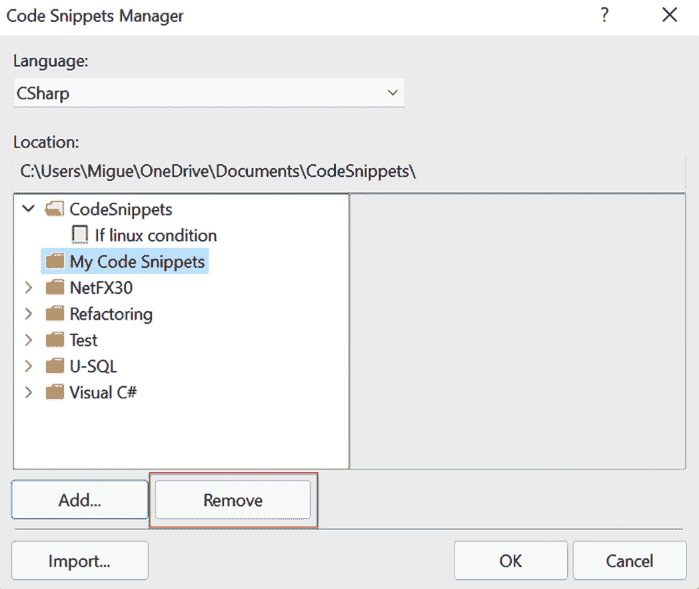

Figure 6.11 – 代码片段管理器中的删除按钮

**删除**按钮将删除整个文件夹，包括其中的所有代码片段。在 Visual Studio 2022 中，无法逐个删除代码片段，因此我们需要为我们的代码片段创建一个合适的文件夹名称。删除文件夹后，Visual Studio 将不再建议代码片段。

重要提示

当您在 Visual Studio 中删除代码片段时，原始文件和文件夹不会从您的本地系统中删除。只有 Visual Studio 中对文件的引用将被删除。

到目前为止，您已经学会了如何创建和删除代码片段。我们还可以在 Visual Studio 中导入代码片段，所以让我们看看如何操作。

# 导入代码片段

如果我们想在**代码片段管理器**中已创建的文件夹中包含代码片段，我们可以使用**导入…**选项：

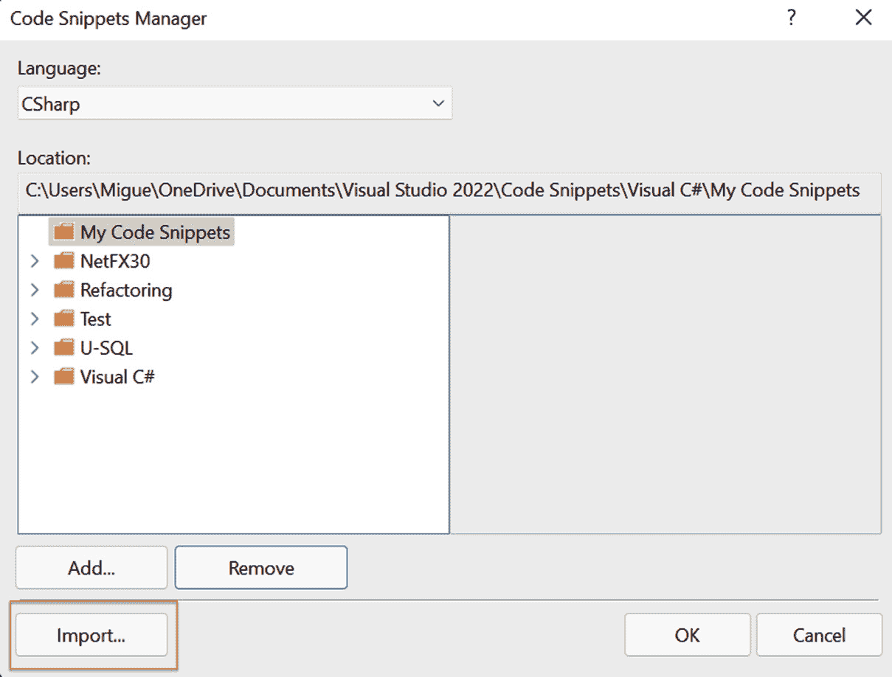

Figure 6.12 – 代码片段管理器中的导入…按钮

在模态窗口中单击`.snippet`扩展名（见*图 6.13*）：

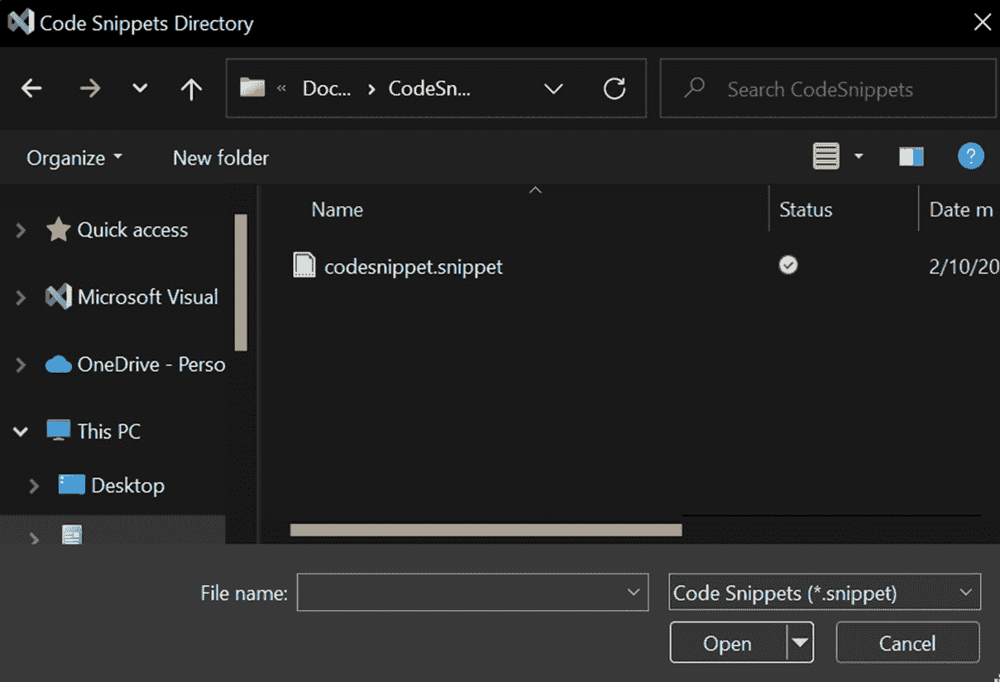

Figure 6.13 – 在文件系统中选择代码片段文件 (.snippet)

选择在*创建代码片段*部分中创建的代码片段，然后单击**打开**。最后，您必须通过选择代码片段的位置文件夹并单击**完成**来完成导入过程：

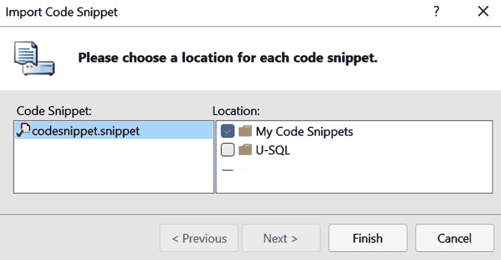

图 6.14 – 导入代码片段的选择位置

完成导入后，你会看到代码片段被添加到所选文件夹中。请参阅 *图 6.15* 中的导入代码片段：

![图 6.15 – 导入到“我的代码片段”文件夹中的代码片段

![图 6.15 – 导入到“我的代码片段”文件夹中的代码片段

图 6.15 – 导入到“我的代码片段”文件夹中的代码片段

导入代码片段是分享我们自定义代码片段给朋友、同事和同事的一种好方法。我们可以为常见场景创建一些惊人的代码片段，以及一些与我们架构或指南紧密相关的特殊代码。

# 摘要

现在，你可以在 Visual Studio 中使用代码片段，并提高你的生产力。你可以识别出在你的架构中哪些代码片段是常见的，并使用模式创建你自己的代码片段以满足你的需求。此外，你知道如何使用删除和导入的功能来管理代码片段。完成本章的演示后，你将认识到代码片段的重要性以及为什么 Visual Studio 是一个强大的 IDE，它可以帮助开发者更快地编写代码。

在*第七章*“使用 AI 和代码视图高效编码”，我们将回顾 Visual Studio 中包含的**人工智能**（**AI**），以及这个工具如何帮助我们更快地编写代码并在某些场景中改进语法。你还将进行一些演示，其中 AI 将帮助你，让你能够预测你想要执行的操作或语句。
