# 第七章：使用 AI 和代码视图高效编码

人工智能是一个庞大且有趣的领域，它以某种方式改善了我们的生活方式。我们每天都在看到、听到并使用它，如果你不相信，问问自己你一天中使用了多少次 Google 搜索引擎。你还可以在照片编辑程序中找到它，例如，几乎完美地移除图像的背景。社交网络是人工智能应用的另一个完美例子，因为它们不断为你提供最佳推荐，让你尽可能长时间地留在上面。

幸运的是，人工智能甚至已经扩展到了新的软件开发工具，通过预测代码集成，它允许我们在正确的时间选择所需的代码片段。在 Visual Studio 中，我们有一个名为 **Visual Studio IntelliCode** 的强大功能，可以做到这一点。

同样，我们还有不同的视觉工具和窗口，可以帮助我们找到代码中的关系并高效地导航。

在本章中，我们将涵盖以下主要主题：

+   理解 CodeLens

+   使用代码视图

+   使用 Visual Studio IntelliCode

# 技术要求

要使用 IntelliCode，必须安装带有 Web 开发工作负载的 Visual Studio 2022。因为本章更侧重于展示自动完成和类显示功能，所以代码仓库没有进行任何更改。您可以使用以下 URL 中的仓库：[`github.com/PacktPublishing/Hands-On-Visual-Studio-2022/tree/main/Chapter07`](https://github.com/PacktPublishing/Hands-On-Visual-Studio-2022/tree/main/Chapter07)。

此外，要执行*代码地图*部分中的程序，需要使用 Visual Studio 的企业版。

同样，**代码地图**和**实时依赖验证**工具必须通过 Visual Studio 安装程序安装，选择方式如*图 7.1*所示：

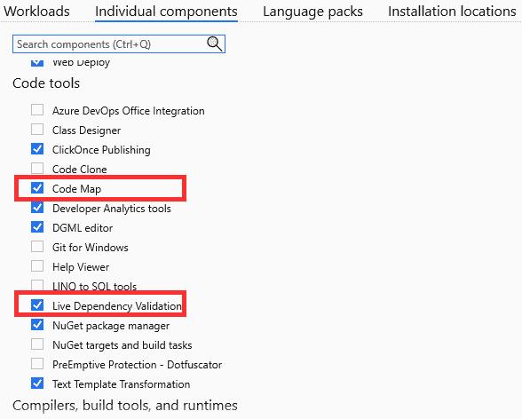

图 7.1 – 安装代码地图和实时依赖验证功能

现在我们已经了解了技术要求，让我们学习如何使用它们，以充分利用 Visual Studio。

# 理解 CodeLens

CodeLens 是一套强大的工具，用于在代码中查找引用、查看不同组件之间的关系、查看代码变更历史、关联的缺陷、代码审查、单元测试等。

在本节中，我们将分析此功能最重要的工具。让我们先看看我们如何在我们的代码中找到引用。

## 在代码中查找引用

CodeLens 从我们第一次使用 Visual Studio 时就在我们的代码文件中呈现。我们可以通过访问任何类、方法或属性并验证是否出现一个句子来检查这一点，该句子指示项目中关于它的引用数量。在图 7.2 中，我们可以看到我们打开了`WeatherForecastController.cs`文件，这显示我们找到了关于`WeatherForecastController`类的三个引用：

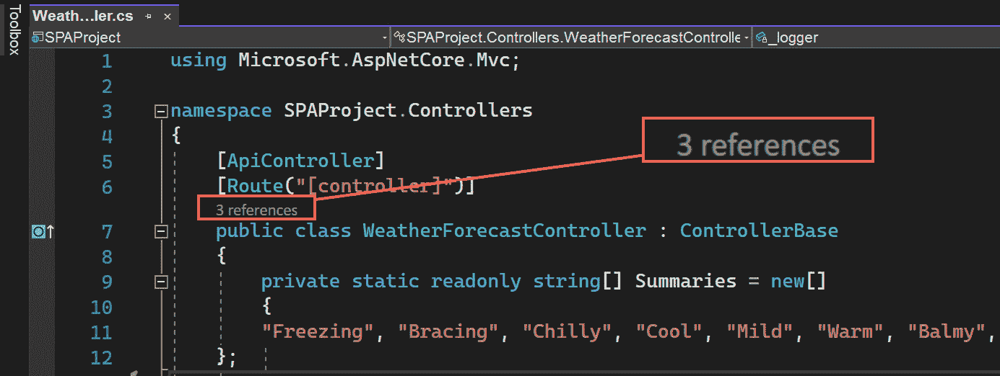

图 7.2 – WeatherForecastController 类的引用

这意味着`WeatherForecastController`类在我们的项目中使用了三个地方。如果我们通过点击标题为`WeatherForecastController`类的图例 – 特别是第**14**行和**16**行：

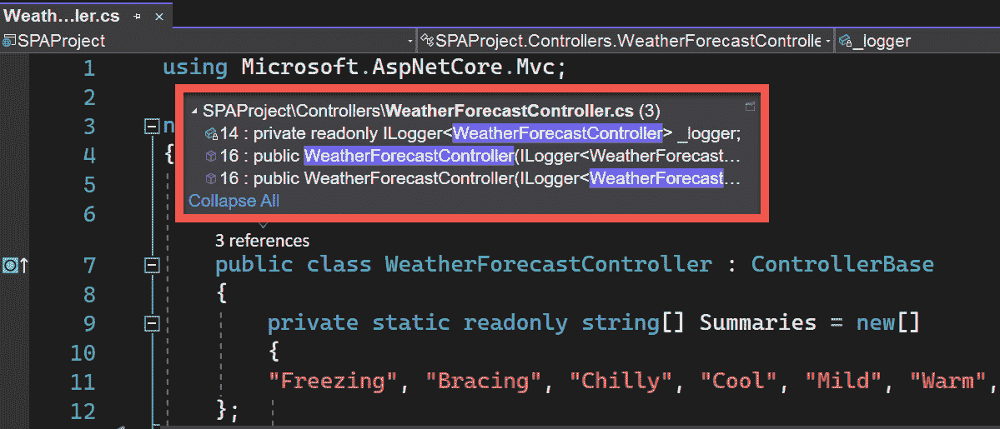

图 7.3 – WeatherForecastController 类中引用的代码位置

不仅如此，我们还可以定位到任何找到的行上，这将显示围绕引用的四个最近代码行的部分。这样，我们可以更好地了解使用它的目的，如图 7.4 所示：

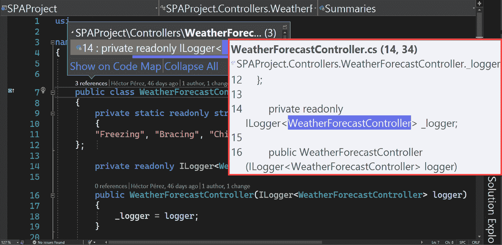

图 7.4 – 找到的代码引用的预览

如果我们是在一个新项目中，需要快速了解代码的某些部分的功能，这非常有用。

现在，让我们看看 CodeLens 的一个实用工具，它将允许你以可视化的方式看到代码之间的关系。

重要提示

有时，即使引用的数量为零，也可能有对其他 GUI 文件的引用，例如`.xaml`和`.aspx`文件。

## 代码图

代码图是一种快速高效地可视化代码中关系的方法。这个工具允许创建，正如其名称所示，从代码中生成的可视化地图。使用这个工具，我们将能够看到实体的结构、它们的不同属性和关系，这让我们知道我们做出的更改可能产生多大的影响。

创建代码图有几种方法。第一种是通过选择`.dgml`扩展名，我们将被指示从解决方案资源管理器、类视图或对象浏览器中拖动文件，如图 7.5 所示：

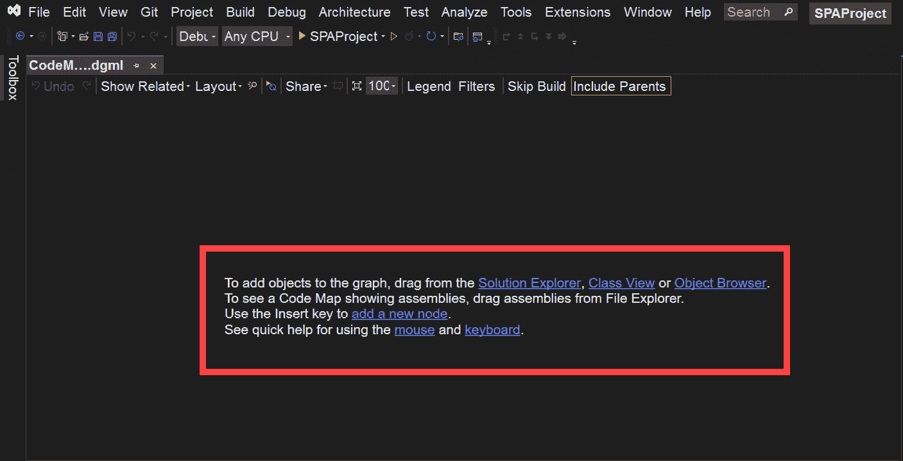

图 7.5 – 空的代码图文件

让我们做一个测试 – 点击`SPAProject.Controllers`命名空间。这将显示`WeatherForecastController`类，如图 7.6 所示：

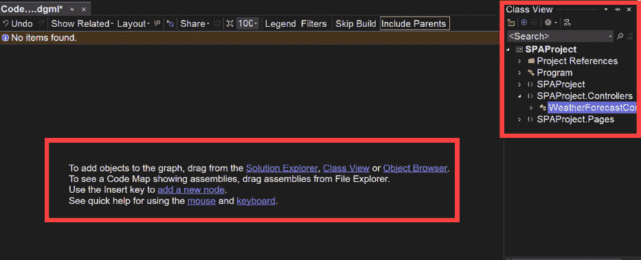

图 7.6 – 将要拖入代码图文件的 WeatherForecastController 类的可视化

接下来，将`WeatherForecastController`类拖动到代码映射文件中。这将自动生成一个图表，我们可以看到拖动的`class`、包含它的`namespace`，以及它所在的`.dll`文件，如图*图 7.7*所示：

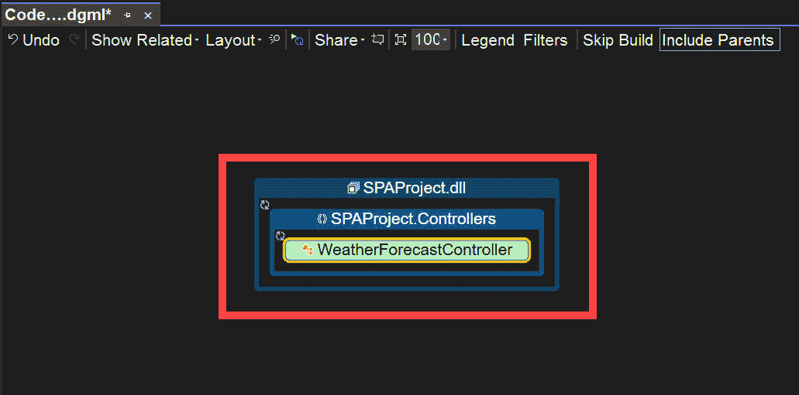

Figure 7.7 – 代码映射中的 WeatherForecastController 类

此外，如果我们展开图中的`WeatherForecastController`类，我们将看到类中包含的成员，例如其属性和行为，以及作为同一类一部分可以找到的关系：

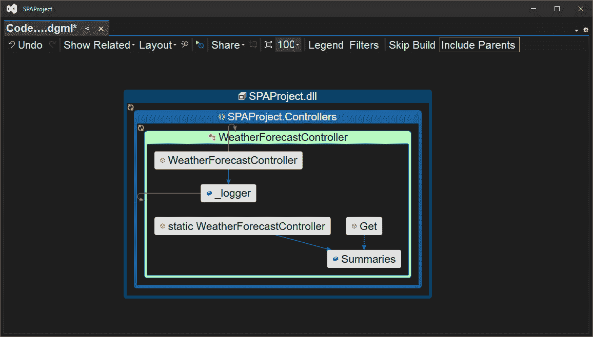

Figure 7.8 – 通过代码映射找到的关系

在*图 7.8*中，我们可以看到`WeatherForecastController`类的代码映射，其中所有成员都已展开。这迅速展示了字段、属性和方法之间的关系。

从源代码创建代码映射的另一种方法是转到我们感兴趣的成员所在的文件，例如`WeatherForecast.cs`文件。一旦我们打开了文件，我们可以将光标定位在类、方法、属性或字段上，然后右键单击，这将显示**代码映射** | **在代码映射上显示**选项，如图*图 7.9*所示：


Figure 7.9 – 从类的上下文菜单中将类添加到代码映射的选项

此选项将创建一个新的`.dgml`文件，或者如果您已经创建了一个，就像我们的情况一样，在之前打开的文件中添加带有其相应关系的引用。

重要提示

如果您想将代码映射图居中，您可以在任何时候点击图表的任何空白区域来居中它。同样，如果您双击图表中的任何实体或成员，相应的代码将打开以在图表旁边查看。

由于向图中添加了新的类，我们可以看到`WeatherForecast`类正在`WeatherForecastController`类的`Get`方法中使用，如图*图 7.10*所示。这样，我们很容易就发现了这种关系：

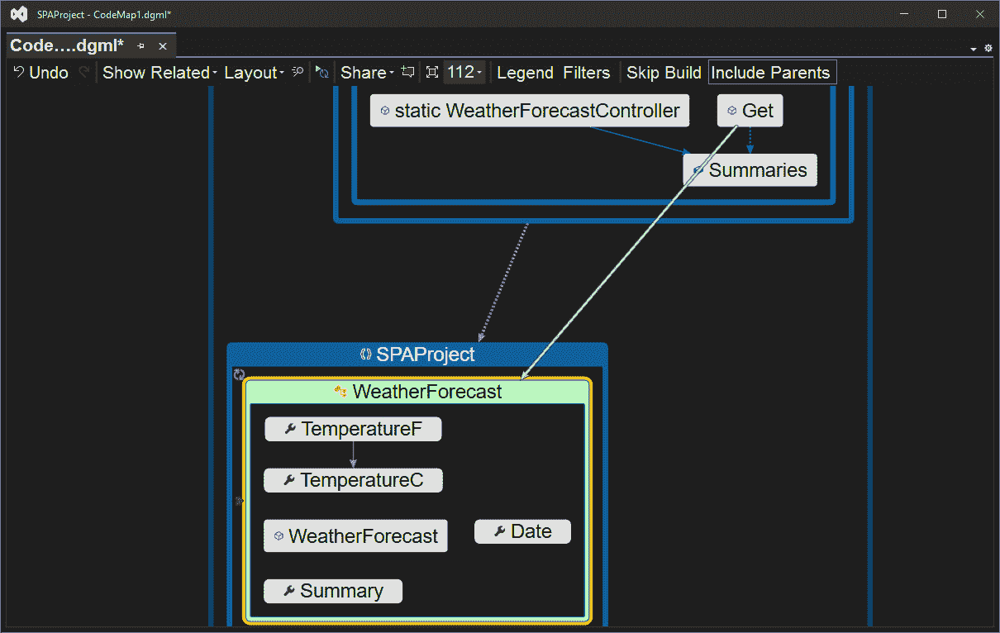

Figure 7.10 – 通过代码映射显示的类之间的关系

重要提示

代码映射图中的箭头指示实体之间的关系，随着实体的选择而出现和消失，这为图表提供了更多空间和理解。我鼓励您选择图表中的每个元素，以便您可以看到完整的关系。

最后，如果我们想能够在不逐个添加实体的前提下看到我们的解决方案中的关系，从**架构**菜单中，我们可以选择**为解决方案生成代码映射**选项，如图*图 7.11*所示：

![Figure 7.11 – 在解决方案级别生成代码图的菜单选项

![img/Figure_7.11_B17873.jpg]

图 7.11 – 在解决方案级别生成代码图的菜单选项

这将启动生成整个解决方案相应代码图的进程。根据您代码中的引用数量，这个过程可能需要更多或更少的时间。

重要提示

虽然代码图只能在 Visual Studio Enterprise Edition 中创建，但您可以从任何版本的 Visual Studio 中查看它们，包括社区版，但除了企业版之外，您无法从任何版本编辑它们。

现在我们已经看到 CodeLens 如何帮助我们更好地、更快地理解代码，让我们看看 Visual Studio 中可用的窗口，它们将使我们能够轻松地处理代码。

# 使用代码视图

除了 CodeLens 之外，还有几个窗口可以帮助我们更快地检查项目及其成员的类。在本节中，您将了解它们以及它们如何帮助您在 Visual Studio 中分解项目的代码。

## 类视图

类视图是一个窗口，允许您查看 Visual Studio 项目的元素，如命名空间、类型、接口、枚举和类，使您能够快速访问这些元素中的每一个。也许如果您在 Visual Studio 中处理过小型项目，您可能不会认为它很有用。但像我一样，如果您处理的是可以包含多达 20 个或更多项目的解决方案，那么它是一个检查代码的绝佳选项。

要访问此窗口，您必须从菜单中选择**视图** | **类视图**选项，这将显示**类视图**窗口，显示当前打开的解决方案的所有元素，如图*7.12*所示：

![Figure 7.12 – 加载项目的类视图窗口

![img/Figure_7.12_B17873.jpg]

图 7.12 – 加载项目的类视图窗口

如您所见，通过一眼查看项目被划分到的命名空间，我们可以迅速了解我们项目的结构。如果我们展开每个命名空间下的节点，我们还可以看到这些命名空间中包含的不同类，如图*7.13*所示：

![Figure 7.13 – 显示 WeatherForecastController 类成员的类视图窗口

![img/Figure_7.13_B17873.jpg]

图 7.13 – 显示 WeatherForecastController 类成员的类视图窗口

此外，如果我们选择项目中的任何元素，例如一个类，我们将在窗口的下半部分看到组成它的属性和方法（如图*7.13*所示）。

这个窗口的另一个巨大优势是，您甚至不需要重新编译项目来查看更改，因为它们将自动且即时地完成。

在图 7.13 的窗口顶部，我们还可以看到一系列按钮，我们可以使用这些按钮来创建新文件夹，在选定的元素之间导航，配置显示选项，并可能将一个类添加到代码映射文件中。

这当然是一个在项目类之间导航的极好窗口，但如果我们想导航到不属于我们项目的类呢？在这种情况下，对象浏览器可以帮助我们，我们将在下一部分进行探讨。

## 对象浏览器

对象浏览器是一个自 Visual Studio 之初就存在的非常有用的窗口。此窗口包含有关项目中使用的所有程序集的信息，并允许您深入了解它们。要访问此窗口，我们可以从 **视图** | **对象浏览器** 菜单中进行操作。

一旦我们选择 **对象浏览器** 选项，它将打开并加载作为我们解决方案一部分使用的程序集。我们可以看到程序集列表相当长，这是因为我们可以检查我们使用的框架中的程序集以及我们自己创建的程序集，如图 7.14 所示：

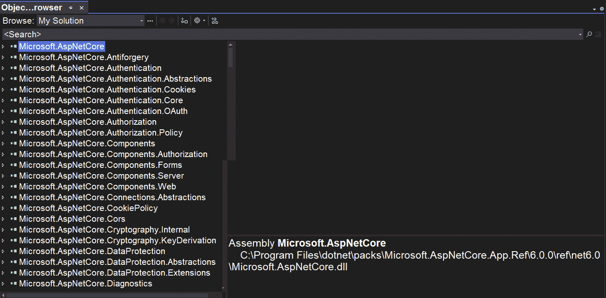

图 7.14 – 对象浏览器窗口

如图 7.15 所示，在顶部有一个过滤器，我们可以展开以选择我们想要检查的框架或库集：

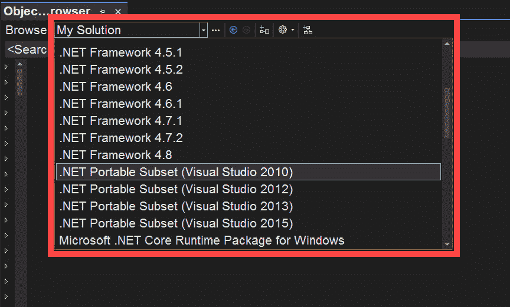

图 7.15 – 显示对象浏览器选项以在各个类之间导航

此列表（在先前的屏幕截图中）将根据在 Visual Studio 安装中选择的负载而变化。

您还将拥有一个强大的搜索引擎可供使用，您可以在其中输入搜索词，它将返回所有可能的匹配项，包括找到的任何类型的数据，如图 7.16 所示：

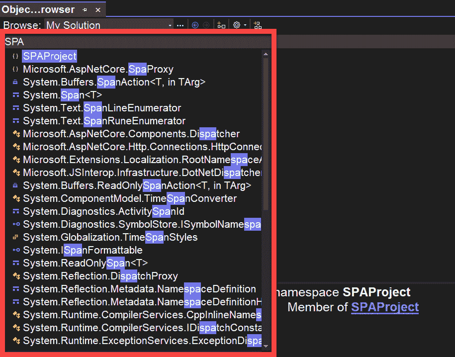

图 7.16 – 在对象浏览器中执行搜索

最后，如果您从列表中选择任何项，您将在右侧面板中看到一个第二列表，如图 7.17 所示，它将包含所选类型的所有成员，例如它们的方法、属性、结构、枚举以及其他可用的类型，底部是所选成员的描述：

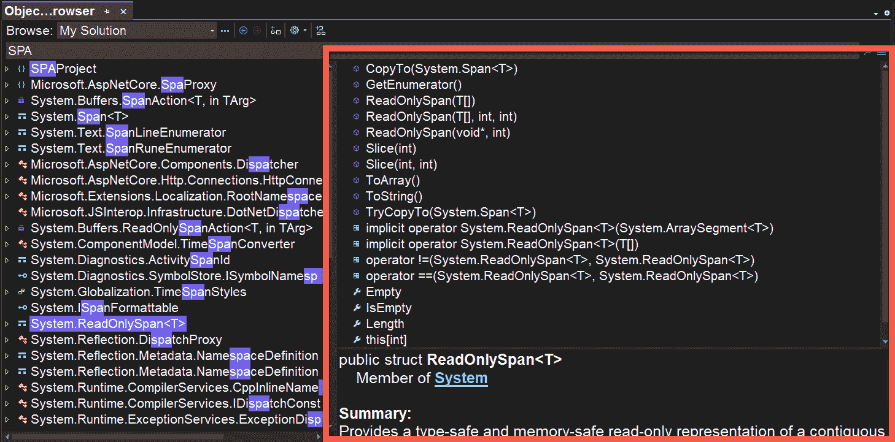

图 7.17 – 在对象浏览器中显示类的成员

如您所见，此窗口非常有用，不仅可以看到您自己的项目成员，还可以查看整个框架的成员。

现在，让我们看看一个名为 IntelliCode 的新功能，它将使我们能够更高效地编写代码。

# 使用 Visual IntelliCode

IntelliCode 是集成到 Visual Studio 2022 中的工具，它通过人工智能使您能够更快地编写代码。这是一个经过训练的工具，使用了 GitHub 上托管的上千个流行开源项目，尽管它已经在 Visual Studio 2019 中开始展示其潜力的一小部分，但所有功能都是在这一版本中实现的。

当您编写代码时，IntelliCode 可以建议模式和样式，根据您所处的上下文提供准确的建议，因此您可以完成代码行。IntelliCode 还能够显示您最可能使用的函数和属性，并支持多种编程语言的完成，如下所示：

+   C#

+   C++

+   XAML

+   JavaScript

+   TypeScript

+   Visual Basic

让我们以下小节中检查这个神奇工具是如何工作的。

## 整行完成

IntelliCode 在帮助您完成整行代码方面可以非常有用。最好的是，代码预测将根据您的代码中的不同条目显示，如下所示：

+   变量名称

+   函数名称

+   使用的 IntelliSense 选项

+   项目中使用的库

在 Visual Studio 2022 中，有两种方法可以接收整行完成提示：

+   第一种方法是在您编写代码时自动提供的。在*图 7.18*中，我们可以看到这一功能是如何工作的，因为我们开始在一个名为`WeatherForecast.cs`的文件中编写一个新的`string`类型的属性：

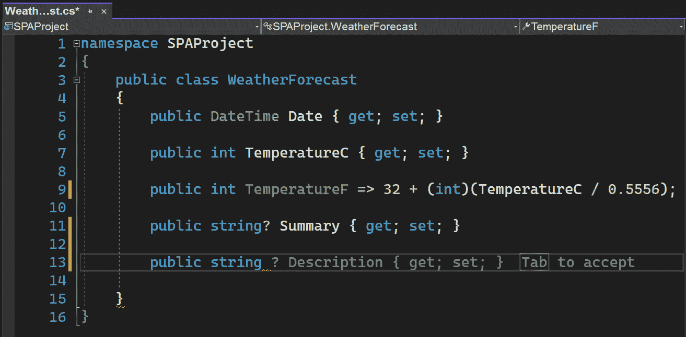

图 7.18 – IntelliCode suggesting a full line completion

根据 IntelliCode 模型学习到的所有内容，它建议一个新的属性名为`Description`，我们可以通过按*tab*键来接受它，或者通过继续编写代码来拒绝它。

+   通过 IntelliCode 使用第二种整行完成的方法是通过从 IntelliSense 建议列表中选择一个项目。例如，如果我们为`WeatherForecast`类创建一个构造函数并输入字母`S`，将出现一个 IntelliSense 建议列表。我们可以浏览每一个，在大多数情况下，IntelliCode 将显示自动完成建议，如图*图 7.19*所示：

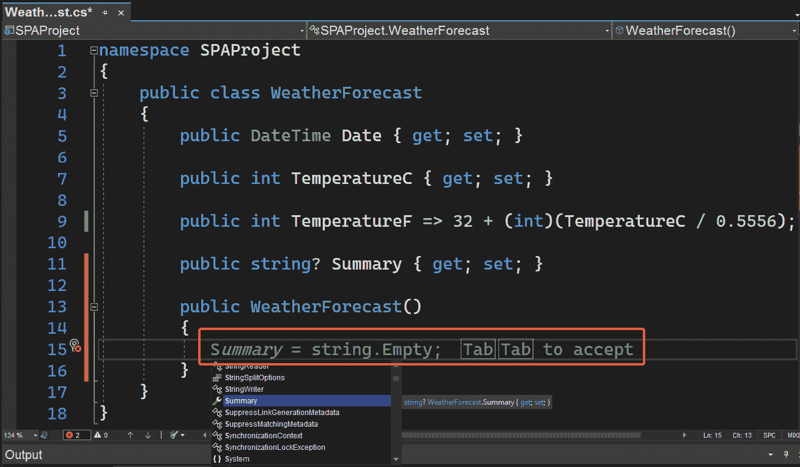

图 7.19 – IntelliCode 推荐完成 IntelliSense 元素

我们可以通过按*tab*键两次来接受这一行，或者继续编写代码以忽略建议。

现在我们已经看到了两种整行完成的方法，让我们看看 IntelliCode 是如何根据其建议帮助我们编写代码的。

## IntelliCode 建议

IntelliCode 建议是一种辅助方式，在我们的项目中执行类似的代码编辑。基本上，IntelliCode 会跟踪我们正在编写的代码，如果它检测到可以应用于我们代码的代码重复，它将通过建议让我们知道。

IntelliCode 令人惊讶的一点是，它基于代码的语义结构，因此它还可以帮助我们检测我们可能错过的变化，例如公式的变化。

例如，假设我们有一些方法可以让我们计算一些静态值，如下面的示例所示：

```cs
public float Calculate1()
```

```cs
{
```

```cs
   var minValue = 25;
```

```cs
   return (float)((minValue + 126) * (Math.PI / minValue));
```

```cs
}
```

```cs
public float Calculate2()
```

```cs
{
```

```cs
   var minValue = 88;
```

```cs
   return (float)((minValue + 126) * (Math.PI / minValue));
```

```cs
}      
```

我们可以看到计算遵循相同的结构，唯一改变的是`minValue`变量的值，因此我们决定创建一个新的方法，名为`Calculate`，它将通过接收一个参数来执行相同的操作：

```cs
public float Calculate(int value)
```

```cs
{
```

```cs
   return (float)((value + 126) * (Math.PI / value));
```

```cs
}
```

随后，我们决定将`Calculate1`方法的代码替换为调用新创建的`Calculate`方法：

```cs
public float Calculate1()
```

```cs
{
```

```cs
   var minValue = 25;
```

```cs
   return Calculate(minValue);
```

```cs
}
```

如果我们进入`Calculate2`方法并开始输入`Calculate`方法的名称，IntelliCode 提示将会出现，如图*图 7.20*所示：

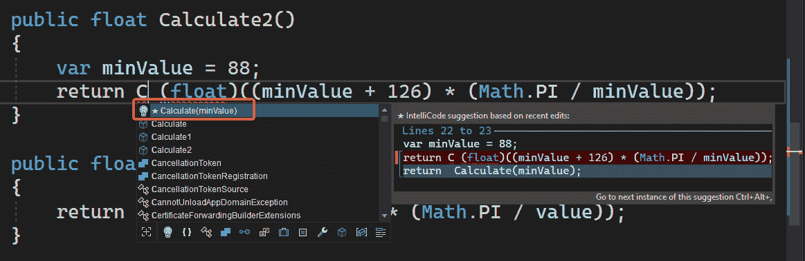

图 7.20 – IntelliCode 建议代码重复的实现

IntelliCode 提出的建议告诉我们，我们可以将相同的调用应用于新方法，我们可以通过按*tab*键来实现，或者我们可以忽略建议并继续编写代码。

重要提示

非常重要的是要注意，IntelliCode 建议仅在开发会话期间可用。这意味着如果你重新启动 Visual Studio，之前的提示将不会再次出现。

正如我们所见，IntelliCode 通过建议提供了一种更快地编写代码的方法，这可以每天为你节省几分钟。

# 摘要

Visual Studio 包含一系列工具和窗口，在开发项目时可以为我们提供很大帮助。

我们已经看到 CodeLens 如何帮助我们通过代码和视觉方式找到引用和关系。同样，我们已经研究了不同的代码窗口，这些窗口有助于检查项目中的类成员。最后，我们已经看到 IntelliCode 是 IDE 的一个新功能，它通过人工智能帮助我们通过各种建议快速编写代码。

在*第八章*，“Web 工具和热重载”中，我们将看到几个专注于 Web 开发的工具，以及 Visual Studio 2022 中包含的新功能，该功能可以帮助我们在更改后重新加载 Web 项目。
