# 第八章：Web 工具和热重载

Visual Studio 有许多工具可以用于 .NET 应用程序和所有 Microsoft 生态系统，但它也有许多工具用于其他编程语言和技术。这包括 Web 开发技术，如 JavaScript、CSS 和 HTML。

在 Visual Studio 2022 中，还有一些新的改进可以帮助我们在前端更快地编码。这意味着为 Web 开发者提供与 CSS、JavaScript 和 HTML 一起工作的设计工具。有了这些工具，您在处理这些技术时不需要使用其他编辑器或 IDE 来完成您的活动。

在本章中，您将了解 Visual Studio 中的 Web 工具，以及如何利用它们在开发一些常见语句时简化操作。这些工具将帮助您自动生成代码，安装和指定 Web 库的版本，检查 JavaScript 中的代码，并自动刷新应用程序以实时查看更改。

我们将学习以下与 Web 工具相关的话题：

+   使用脚手架

+   安装 JavaScript 和 CSS 库

+   JavaScript 调试

+   热重载

我们将开始使用脚手架，这是创建项目文件的主要工具，使用 Visual Studio 2022 中默认包含的模板。

# 技术要求

要完成本书本章的演示，您必须之前已安装带有 Web 开发工作负载的 Visual Studio 2022，如 *第一章* 中所示，*Visual Studio 2022 入门*。拥有在 *第四章* 中创建的 SPA 基础项目非常重要，*创建项目和模板*。

您可以通过以下链接检查本章完成的更改：[`github.com/PacktPublishing/Hands-On-Visual-Studio-2022/tree/main/Chapter08`](https://github.com/PacktPublishing/Hands-On-Visual-Studio-2022/tree/main/Chapter08)。

# 使用脚手架

脚手架是 Visual Studio 中对开发者最有益的功能之一。通过使用脚手架，我们可以通过点击一些选项来自动生成代码，从而节省时间。

必须明确指出，脚手架是软件开发中的一个流行概念，这并不仅限于 Visual Studio。通常，脚手架与 **模型-视图-控制器**（**MVC**）组件的代码生成相关联。MVC 是创建 Web 应用程序的一个流行模式。使用 MVC，您必须将创建 Web 应用程序的责任分配到三个不同的组件：

+   **模型**：负责保存数据

+   **视图**：与用户交互的界面

+   **控制器**：负责处理在视图中用户执行的所有操作

要在 Visual Studio 中使用脚手架，您可以在解决方案资源管理器中选择文件夹，然后右键单击它以打开选项来选择 **新建脚手架项…**（见 *图 8.1*）:

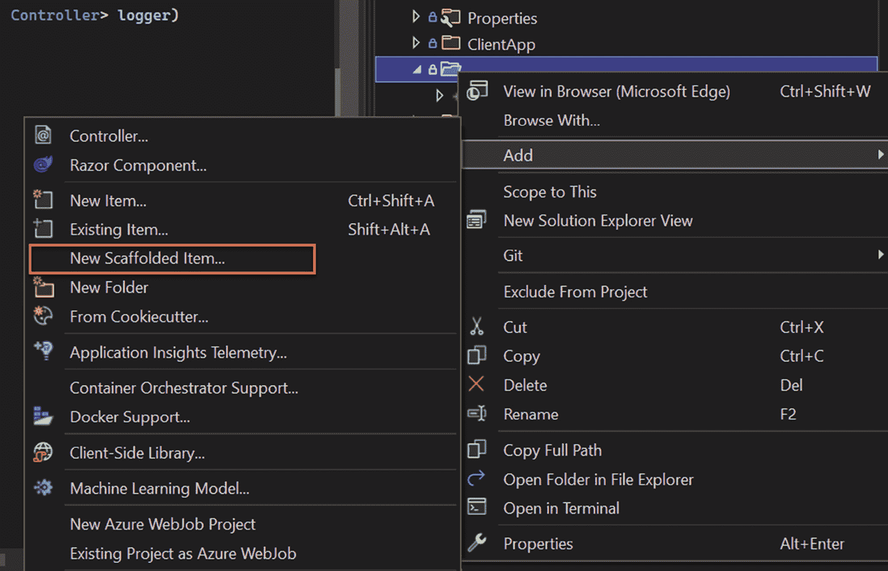

图 8.1 – 项目菜单中的新脚手架项…选项

使用此选项，我们可以在项目中创建与 MVC 结构相关的新元素。

点击**新脚手架项…**后，Visual Studio 将提供我们可以使用脚手架工具创建的元素列表：

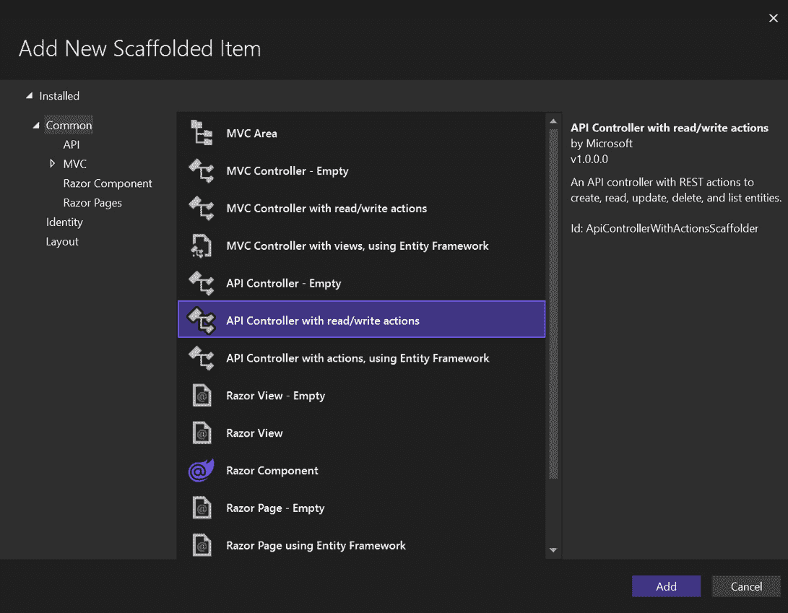

图 8.2 – 添加新脚手架项的模态选项

在这种情况下，我们将选择`GET`、`POST`、`PUT`和`DELETE`动词。选择名称`GeneratedController.cs`并点击**添加**：

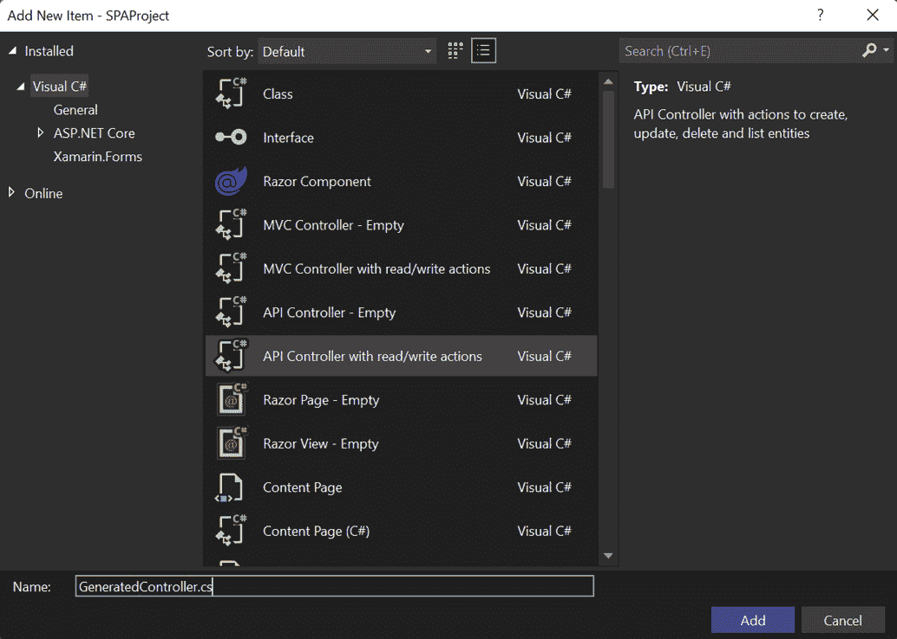

图 8.3 – 创建具有读写操作的 API 控制器

Visual Studio 将默认在`Controllers`文件夹中生成一个新的控制器，并带有端点：

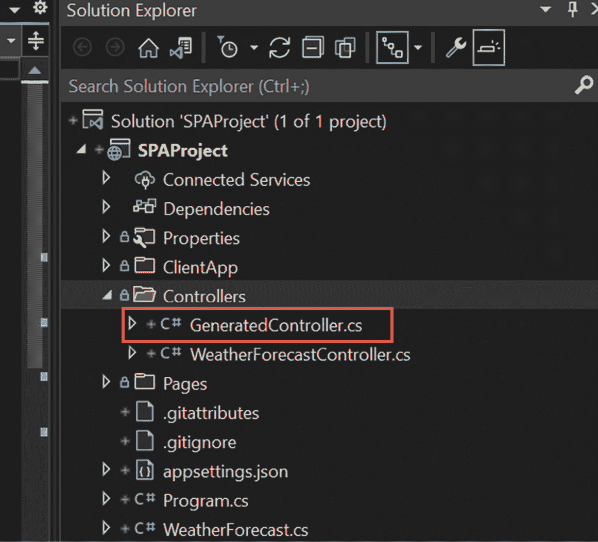

图 8.4 – 在 Controllers 文件夹中创建的 GeneratedController

创建基本模板后，您可以替换数据类型和方法名称以匹配您的模型。

让我们再举一个使用脚手架创建视图页面的例子。再次使用**添加新脚手架项**选项，我们将选择**Razor 视图**（参见*图 8.5*）：

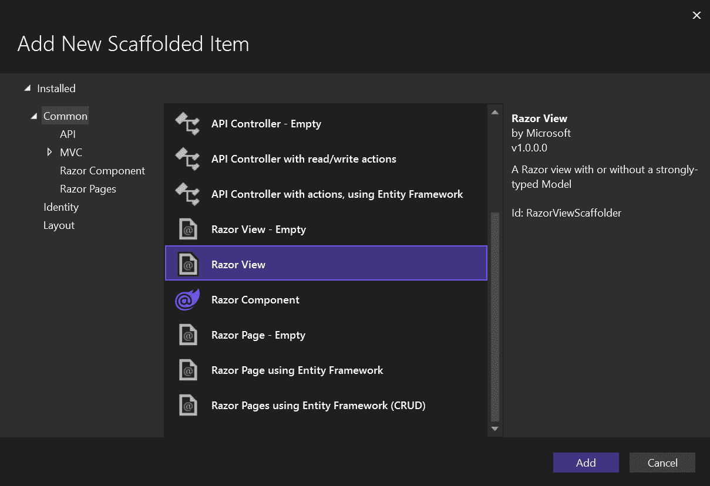

图 8.5 – 添加新脚手架项中的 Razor 视图选项

我们可以选择一些模板，包括**空**。在这种情况下，您应该选择**创建**，取消选中**使用布局页**选项，并选择默认包含在模板中的**WeatherForecast**模型（如*图 8.6*所示）：

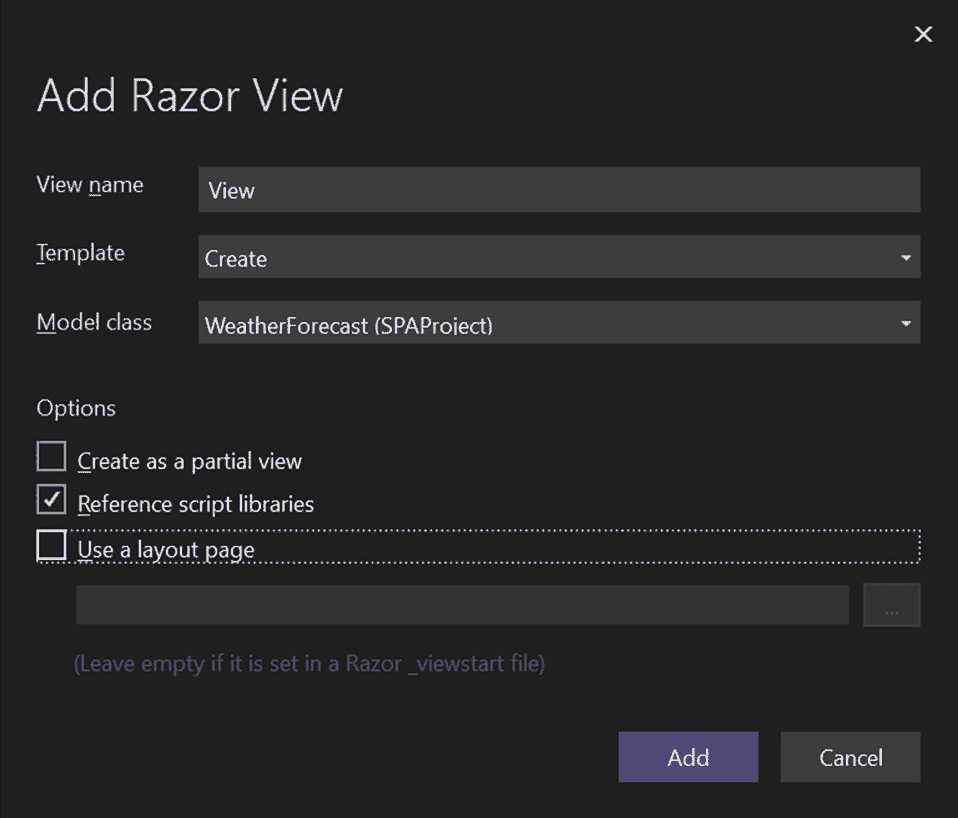

图 8.6 – 使用脚手架创建新视图页面的配置

通过点击`Pages`文件夹，我们可以完成创建过程。Visual Studio 将分析模型，然后为模型中的每个属性创建一个新的表单，考虑到属性类型（参见*图 8.7*）：

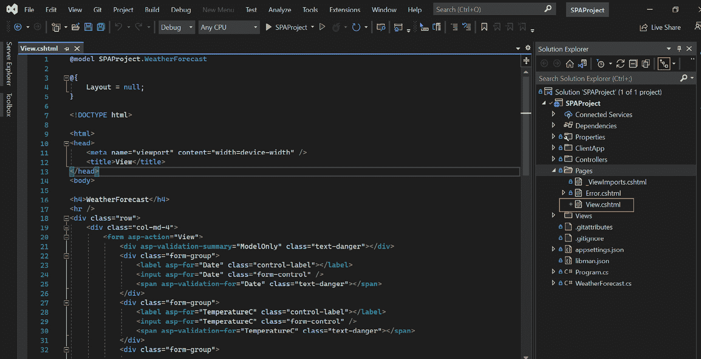

图 8.7 – 使用脚手架和 WeatherForecast 模型创建的视图

在`View.cshtml`文件中，有一个从**WeatherForecast**模型创建新项的模板。脚手架添加了一个标签、一个输入和一个用于控制错误的 span，如本例所示：

```cs
<div class="form-group">
```

```cs
    <label asp-for="Date" class="control-label"></label>
```

```cs
    <input asp-for="Date" class="form-control" />
```

```cs
    <span asp-validation-for="Date" class="text-danger">
```

```cs
        </span>
```

```cs
</div>
```

重要提示

脚手架与 ASP.NET 代码相关；我们可以创建控制器和视图，但不能创建 JavaScript 组件。

现在您已经知道如何在项目中使用脚手架并使用 Visual Studio 提供的一些基本模板来节省时间。让我们看看 Visual Studio 中的另一个工具，它可以帮助我们在项目中包含 JavaScript 和 CSS 库。

# 安装 JavaScript 和 CSS 库

要开始一个项目，我们可以使用 Visual Studio 的模板来轻松创建一个 **概念验证**（**POC**）、演示或基础项目，但项目在功能和服务的增长方面存在可能性。在这种情况下，我们将需要包含库以潜在化和优化我们的项目，并扩展基础模板中集成的功能。

要在我们的 SPAProject 中包含新的 JavaScript 库，您可以打开 `ClientApp` 文件夹。在菜单中，您将找到 **客户端库…** 选项（见 *图 8.8*）：

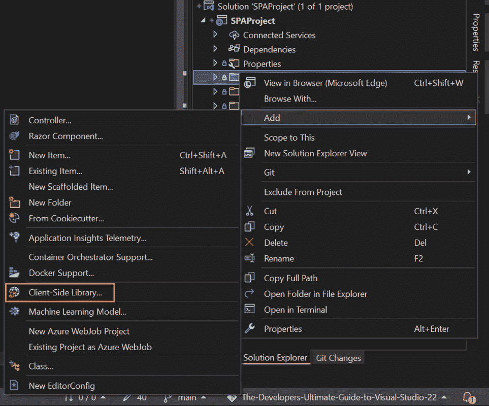

图 8.8 – Visual Studio 中的客户端库…功能

在点击此选项后，您将获得一个模态窗口，允许您从不同资源包含 Web 库。默认情况下，**cdnjs** 被选中，但您也可以选择 Visual Studio 支持的其他来源：

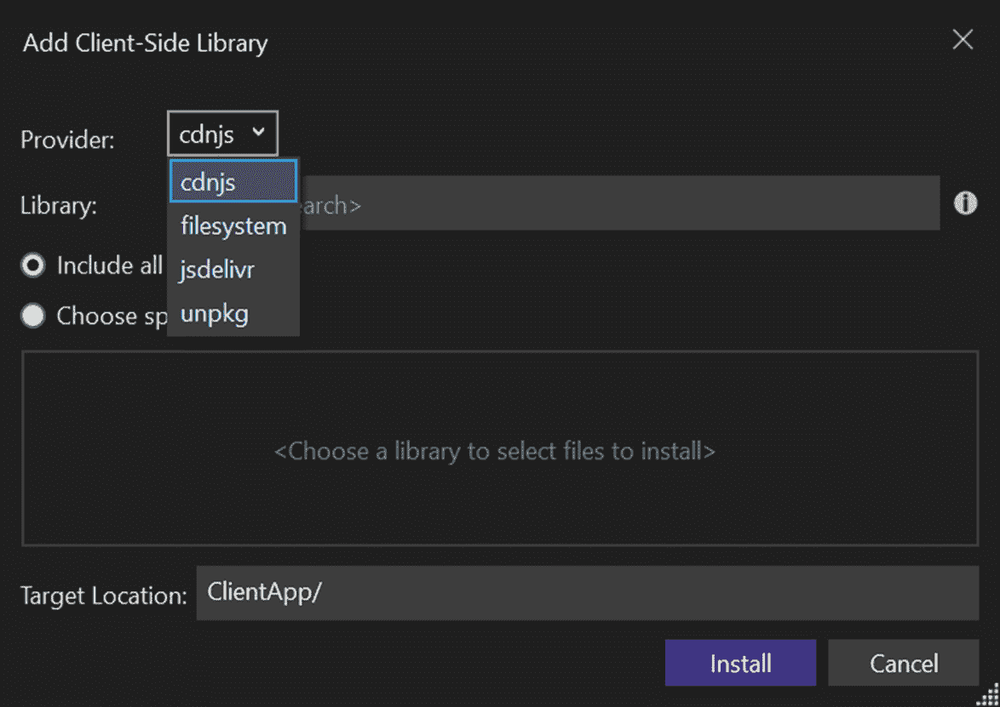

图 8.9 – Visual Studio 2022 支持的提供者

我们可以在项目中包含三个公开和受信任的 CSS 和 JavaScript 库。Visual Studio 支持不同的库来源；让我们来回顾一下：

+   **cdnjs**: Cloudflare 支持的开源库的快速可靠的内容分发

+   **filesystem**: 我们本地系统中的自定义包

+   **jsdelivr**: 集成 GitHub 和 npm 的免费内容分发网络

+   手动包含 `libman.json` 文件，在 json 文件中包含库，然后使用 Visual Studio 安装它们。有关更多信息，您可以在 [`docs.microsoft.com/aspnet/core/client-side/libman/libman-vs`](https://docs.microsoft.com/aspnet/core/client-side/libman/libman-vs) 查看文档。

要分析 Visual Studio 如何将库添加到您的项目中，您应该选择 **cdnjs** 并通过 **bootstrap.** Bootstrap 是一个强大的库，可以轻松使用 CSS 类创建 Web 接口。有关更多信息，您可以在 [`getbootstrap.com/`](https://getbootstrap.com/) 查看官方文档和快速入门指南。

一旦开始输入，Visual Studio 将建议与输入的键词相关的库列表（见 *图 8.10*）：


图 8.10 – Visual Studio 推荐的库

在选择 `bootstrap@5.1.3`（见 *图 8.11*）之后。您可以选择与库关联的所有组件，但通常您只使用精简版本。您可以使用 `bootstrap.min.js` 文件选择所需的文件，这是使用此库所需的唯一文件：

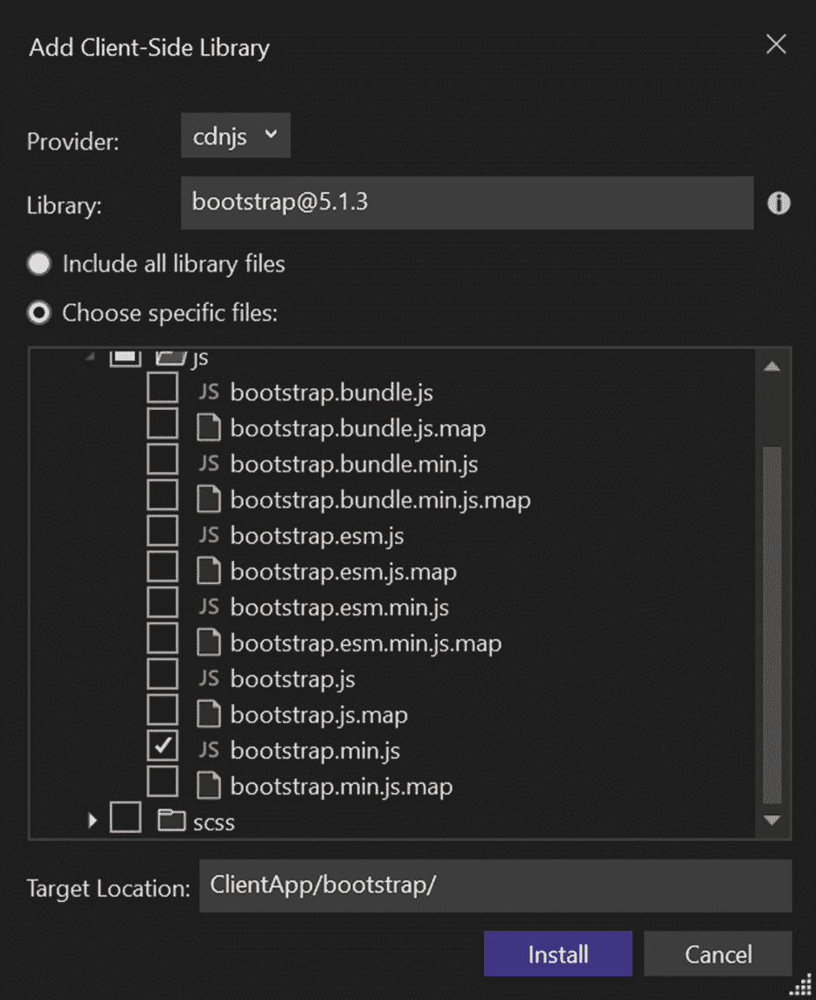

图 8.11 – 选择的自定义库和 bootstrap.min.js 文件

现在，您可以通过点击 **安装** 将 Bootstrap 包含到我们的项目中。

安装此库后，你将在 `ClientApp` 文件夹中看到一个包含所有与 Bootstrap 相关文件的新文件夹。此外，你还将看到一个名为 `libman.json` 的新文件，该文件包含使用 Visual Studio 在项目中安装的库：

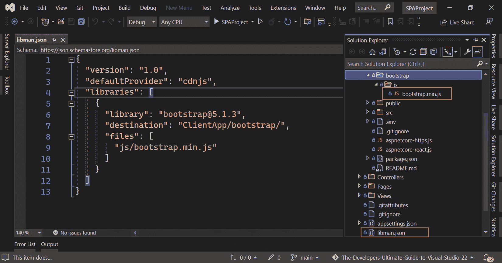

图 8.12 – 在 SPAProject 中添加的 Bootstrap 库

此文件帮助 Visual Studio 在项目仓库中没有这些库的文件时从服务器获取库。

Visual Studio 将自动执行所有过程并创建 `libman.json` 文件，我们可以在此文件中看到每个库的版本和项目中的目标文件夹。

你现在知道如何使用 Visual Studio 支持的不同选项将 JavaScript 和 CSS 库包含到你的项目中。让我们学习如何在 Visual Studio 中调试 JavaScript 代码，以便在开发过程中快速找到并解决问题。

# JavaScript 调试

当我们的应用程序出现异常行为、问题或阻塞时，我们必须调试项目。Visual Studio 支持多种编程语言的调试，包括 JavaScript。考虑到我们可以使用相同的 IDE 调试前端（例如，使用 JavaScript）和后端（例如，使用 C#），这是一个很棒的功能。

要使用 Visual Studio 调试 JavaScript 和 TypeScript 代码，我们需要检查 **脚本调试（启用）** 选项。此选项位于项目的执行菜单中：

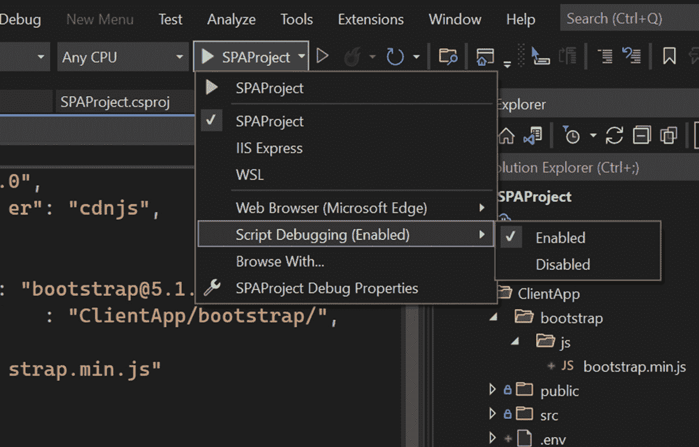

图 8.13 – 项目执行菜单中的脚本调试（启用）选项

然后，我们可以在调试模式下运行项目，但在那之前，我们需要添加一个断点来检查代码。导航到 `ClientApp` | `src` | `components` | `Counter.js` 并在行号 13 处创建一个新的断点（见 *图 8.14*）：

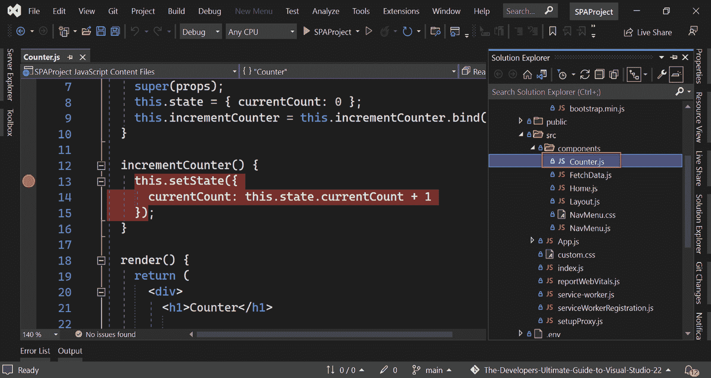

图 8.14 – Counter.js 内 incrementCounter 方法的断点

现在，使用横幅中的选项或按 *F5* 执行项目，然后导航到计数器模块。一旦你点击 JavaScript 中的 `incrementCounter` 方法。在 *图 8.15* 中，你可以看到这个预期行为：

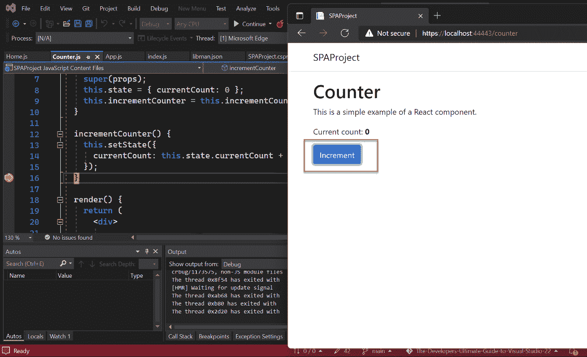

图 8.15 – 在 incrementCounter 方法中设置断点时的调试过程

在这一点上，我们可以检查此文件中的变量——例如，在 *图 8.16* 中，我们可以看到 `Counter.name` 和 `currentCount` 的值：

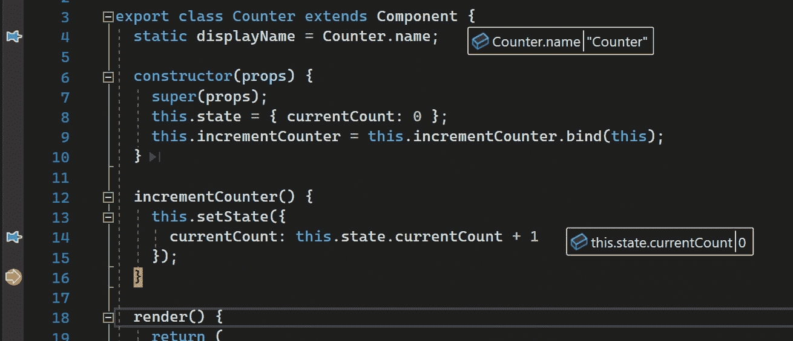

图 8.16 – 调试期间检查 Counter.name 和 currentCount

`Counter.name` 等于 `"Counter"`，`currentCount` 等于 `0`。在执行 `incrementCounter` 异步方法后，`currentCount` 状态中的变量将具有 `1` 的值。

你可以使用选项来执行与检查变量的工作流程相关的代码行，如图 *8.17* 所示：

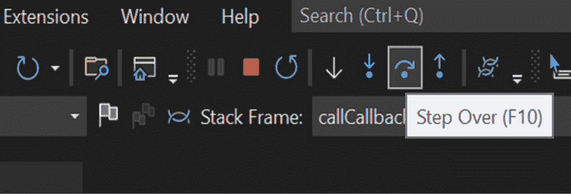

图 8.17 – 调试过程步骤覆盖和工具

你现在可以在 Visual Studio 中调试 JavaScript 代码，并使用我们在 *第五章* 中回顾的相同工具和操作，*调试和编译你的项目*。

在下一节中，我们将回顾 Visual Studio 2022 中的一个新功能，该功能在代码中进行更改后刷新 UI。

# 热重载

多年来，C# 开发者一直在等待一个功能，允许他们看到 Web 应用程序中的实时更改。这个挑战的难点在于 C# 作为一种编程语言的直观性，因为 C# 是一种编译型语言。编译型语言需要转换为低级语言，以便由解释器使用，这个过程在机器上消耗时间和资源。在 *图 8.18* 中，你可以看到一个新的火焰形状图标。点击此图标后，你将在浏览器中刷新更改，或者你可以选择**在文件保存时热重载**选项，在保存更改后自动重新加载 Web 应用程序：

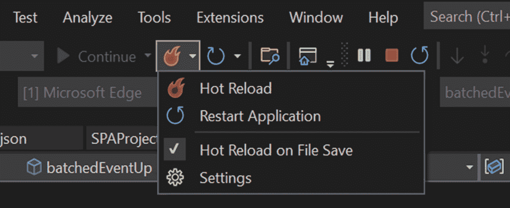

图 8.18 – Visual Studio 执行期间启用的热重载选项

热重载功能有一些设置，我们可以根据需要修改。当启用热重载按钮时，你可以使用**设置**选项访问功能，或者你可以导航到**工具** | **选项** | **调试** | **.NET / C++ 热重载**：

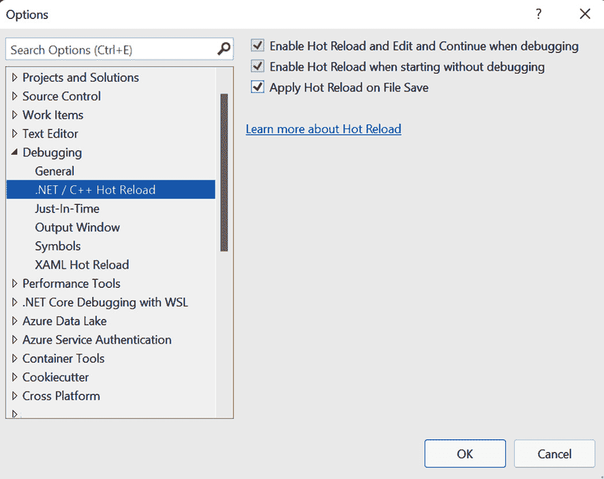

图 8.19 – Visual Studio 2022 中热重载的设置

让我们回顾这些选项：

+   **在调试时启用热重载和继续编辑**：此选项在调试模式下启用热重载。

+   **在启动时启用热重载**：此选项启用热重载而不进行调试。

+   **在文件保存时应用热重载**：在任意文件中进行更改并保存后，应用程序将重新加载。

    注意

    如果你没有启用**在文件保存时应用热重载**选项，你需要使用热重载按钮来刷新 Web 应用程序并查看更改。

要在 Visual Studio 中测试此功能，你可以通过按 *F5* 或使用 `NavMenu.js` 文件中的选项来运行项目，并将 `NavLink` 的名称从 `Counter` 更改为 `Counter Module`：

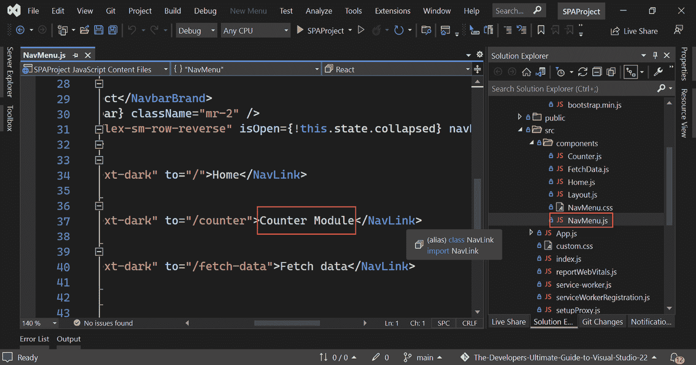

图 8.20 – NavMenu.js 中的 Counter Module NavLink

在使用*Ctrl* + *S*或**文件** - > **全部保存**菜单保存文件后，你将在网页浏览器中实时看到更改。检查*图 8.21*中显示的更改：

![图 8.21 – 检查与计数器模块相关的 UI 更改

![图 8.21 – 检查与计数器模块相关的 UI 更改

图 8.21 – 检查与计数器模块相关的 UI 更改

重要提示

浏览器中看到更改的等待时间取决于项目大小和机器资源。通常情况下，这不会超过 2 或 3 秒。

我们不需要在项目中包含库或在 Visual Studio 中安装扩展来使用这个惊人的功能。热重载支持所有 Web 项目，包括 ASP.NET MVC、使用 React 和 Angular 的 SPA（如我们的 SPAProject）和 Blazor。

你现在可以在你的 Web 项目中使用热重载来提高你在编码时测试 UI 更改的效率。

这就结束了本章的内容。现在，让我们回顾一下我们学到了什么。

# 摘要

现在，你已经准备好利用 Visual Studio 中的 Web 工具来加速编码并提高代码质量。通过脚手架，我们可以轻松地为 MVC 模型创建组件。Visual Studio 使用模板和简单的示例代码生成代码。

你还学习了如何使用 Visual Studio 中包含的工具来包含 JavaScript 和 CSS 库。使用这些工具，你知道如何选择库的正确版本，并在将来升级依赖项。

如果代码中存在问题或异常行为，你现在可以使用 JavaScript 调试来深入分析代码，并逐步执行代码，检查变量的值和工作流程。

最后，你学习了如何在 Visual Studio 2022 中使用热重载来在调试时刷新应用程序，并实时查看代码中的更改。

在*第九章*，“样式和清理工具”，我们将继续学习 Visual Studio 中包含的、用于改进我们处理样式和 CSS 体验的工具。我们还将使用一些工具通过选择特定文件或整个项目来清理代码。
