# 第十一章：实现 Git 集成

对于软件项目的开发来说，拥有一个变更控制平台对于良好的项目管理至关重要。有许多不同的版本控制系统，但**Git**是目前最广泛使用的系统，这也是为什么越来越多的 IDE 都开始集成基于此技术的仓库管理工具。

这正是 Visual Studio 所发生的，它集成了一系列选项，使我们能够与基于 Git 的仓库一起工作。

在本章中，您将学习如何基于**GitHub**（目前最受欢迎的仓库托管平台）使用 Git 仓库。

本章我们将讨论的主要主题如下：

+   开始使用 Git 设置

+   创建 Git 仓库

+   克隆 Git 仓库

+   获取、拉取和推送 Git 仓库

+   管理分支

+   查看仓库中的更改

# 技术要求

要跟随本章内容，您必须已安装带有从*第一章*“使用 Visual Studio 2022 入门”中设置的负载的工作负载的 Visual Studio。

由于前几章的主要仓库中的项目已经具有 GitHub 配置，因此我们将在本章中创建一个新项目来进行练习。因此，需要一个 GitHub 账户，可以在以下链接创建：[`github.com/signup`](https://github.com/signup)。

# 开始使用 Git 设置

在 Visual Studio 2022 中开始使用 Git 工具非常简单，因为它们是作为安装本身的一部分包含的，所以您可以立即安装 Visual Studio 并开始处理您的项目。

要访问托管在 GitHub 上的代码项目管理，您必须首先使用 Microsoft 账户登录，如*第一章*“使用 Visual Studio 2022 入门”中所述。登录后，点击账户个人资料图标并选择**账户设置…**选项，如图所示：

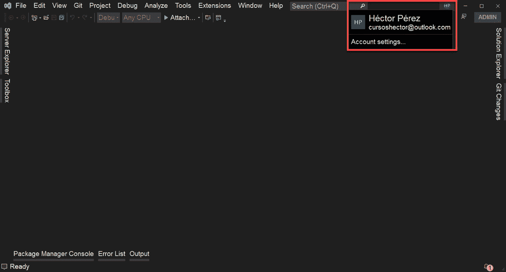

图 11.1 – 访问账户设置

这将打开账户定制窗口，我们可以通过**+添加**按钮添加 GitHub 账户，如图所示：

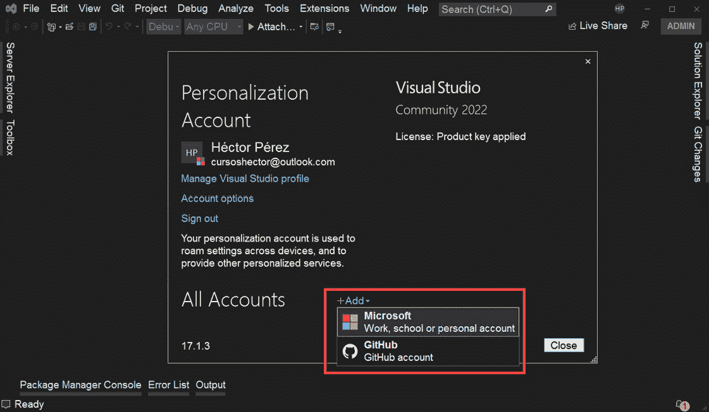

图 11.2 – 添加 GitHub 账户的按钮

一旦我们按下按钮，我们将被重定向到 GitHub 身份验证门户，在那里我们可以使用现有的 GitHub 账户登录，或者如果没有账户，可以创建一个账户。身份验证成功后，我们将被要求授权 Visual Studio 与 GitHub 服务交互，因此必须按下显示**授权 github**的按钮：

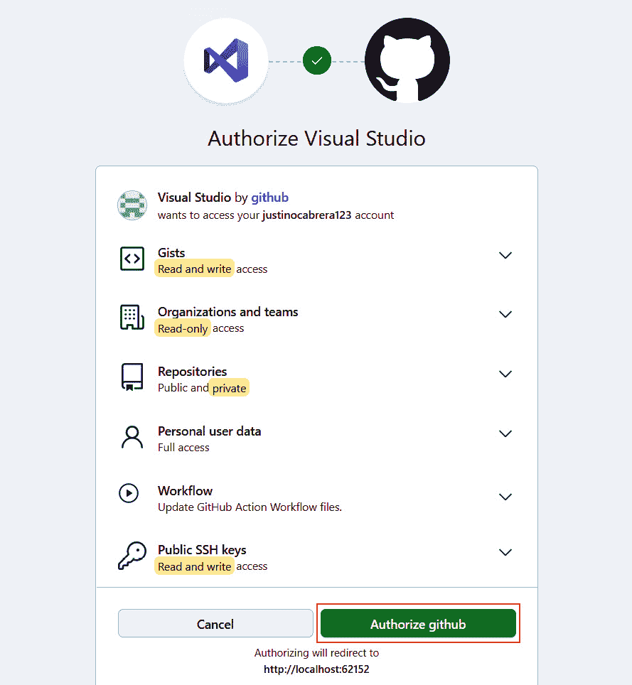

图 11.3 – 连接 Visual Studio 和 GitHub 的授权按钮

在此步骤之后，GitHub 账户将作为与主要 Visual Studio 账户关联的账户之一被添加，因此我们可以开始使用 GitHub 账户的存储库，如图 11.4 所示：

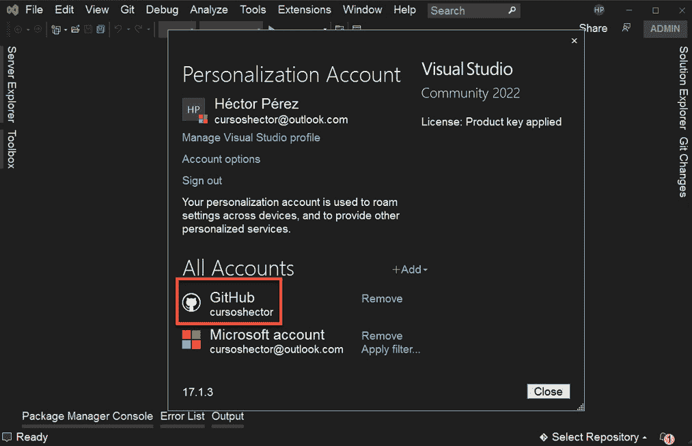

图 11.4 – 已添加到账户列表中的 GitHub 账户

现在我们已经关联了 GitHub 账户，让我们学习如何在 GitHub 中创建 Git 存储库。

# 创建 Git 存储库

在 Visual Studio 项目中从 GitHub 创建存储库非常容易。在本节中，您将通过创建一个新的 `GitDemo` 来测试您的知识。

要从您创建的项目在 GitHub 中创建新存储库，只需选择 **Git** | **创建 Git 存储库** 菜单选项并填写存储库信息，根据图 11.5 所示的数据：

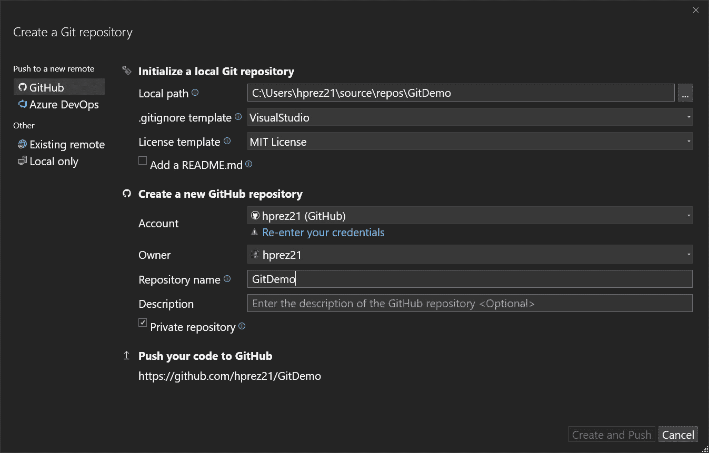

图 11.5 – 在 GitHub 上创建新存储库时填写信息

让我们简要解释每个选项：

+   **本地路径**：这设置本地机器上托管源代码的路径（通常是创建项目的路径）。

+   **.gitignore 模板**：这允许您选择一个模板，该模板确定一组不会上传到存储库的文件 – 例如，由所选模板选择的文件是在编译后生成的，可以在不同的计算机上重新生成。

+   **许可证模板**：这允许您为存储库代码选择一个许可证，它表明用户可以对项目代码做什么以及不能做什么。

+   描述存储库目的的 `readme` 文件。

+   **账户**：这允许您选择将存储库发布到的 GitHub 账户。如果之前尚未关联账户，则可以在此处关联账户。

+   **所有者**：这允许您设置如果账户属于多个工作团队，哪个 GitHub 账户将是存储库的所有者。

+   **存储库名称**：这允许您设置存储库的名称，尽管通常使用项目自己的名称。这将影响最终存储库的 URL。

+   **描述**：这允许您输入创建的存储库的描述。

+   **私有存储库**：这允许您设置存储库是公开的还是私有的。

一旦设置了这些值，只需点击 **创建和推送** 按钮即可开始存储库创建过程。在您的 GitHub 账户中遵循此步骤非常重要，这样您才能执行以下章节中的活动。

如图 11.6 所示，有几个标志可以用来识别项目是否属于 Git 存储库，例如源文件左侧的锁定图标，表示它们是原始存储库文件：

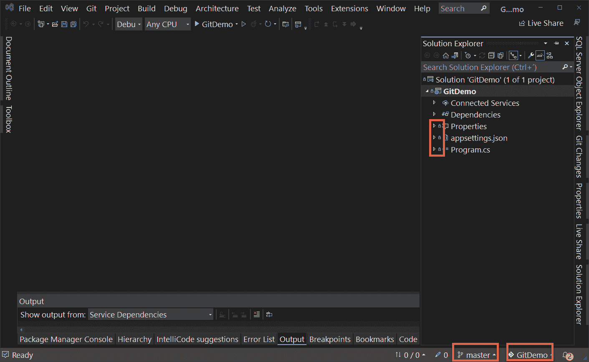

图 11.6 – 使用 Git 识别版本化项目的标志

另一个识别项目是否属于 Git 仓库的标志是（如图 11.6 所示），在底部有一个分支图标，指示我们正在工作的分支。在我们的例子中，分支是 **master**。

现在我们已经知道了如何创建一个新的仓库，让我们看看如何将仓库克隆到我们的本地机器上。

# 克隆 Git 仓库

可能的情况是你想克隆一个现有的仓库而不是从头开始，因为你需要团队合作，或者简单地说，在浏览 GitHub 网站时，你遇到了一个引起你注意的仓库。

克隆仓库的最简单方法是从 Visual Studio 的初始窗口开始，可以通过启动 Visual Studio 的新实例、关闭一个打开的项目或从 **文件** | **启动窗口** 菜单访问。在这个窗口中，第一个选项是 **克隆仓库** 按钮：


图 11.7 – 启动窗口中的克隆仓库选项

一旦我们按下这个按钮，就会打开一个新的窗口（如图 11.8 所示），要求我们指定远程仓库的 URL 和源代码文件将存储的本地路径：

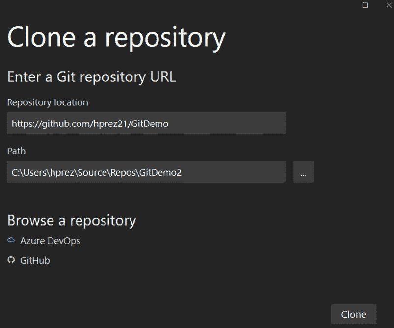

图 11.8 – 克隆仓库的窗口

为了演示的目的，我们将使用在 *创建 Git 仓库* 部分创建的仓库的 URL，它应该看起来像这样：`https://github.com/{你的 GitHub 用户名}/GitDemo`。

因为我们在 *创建 Git 仓库* 部分已经创建了一个同名项目，我们必须为项目指定不同的路径。为了简单起见，我们将文件夹的名称更改为 `GitDemo2`，如图 11.8 所示：

在窗口中填写完信息后，我们将点击 **克隆** 按钮，这将开始本地克隆仓库的过程。一旦过程完成，**解决方案资源管理器** 窗口将显示文件夹视图：

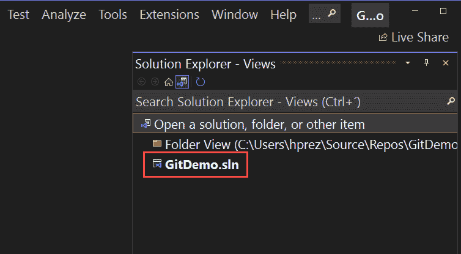

图 11.9 – 解决方案资源管理器窗口中的文件夹视图

要从文件夹视图切换到解决方案视图，并且能够处理源文件，你必须通过点击 `GitDemo.sln` 文件来打开解决方案。这将打开解决方案及其所有文件，使我们能够处理源文件，就像我们迄今为止所做的那样。

重要提示

可以通过选择位于 **Git** | **设置** | **Git 全局设置** | **打开 Git 仓库时自动加载解决方案** 的选项来将默认的文件夹视图更改为解决方案视图。

现在我们已经学会了如何克隆仓库，让我们看看我们如何在仓库上执行推送和拉取操作。

# 获取、拉取和推送 Git 仓库

在处理 Git 仓库时，最重要的命令与获取、拉取和推送操作有关。执行这些操作有两种主要方式：

+   第一种方式是通过访问 **Git** 菜单，如图所示：

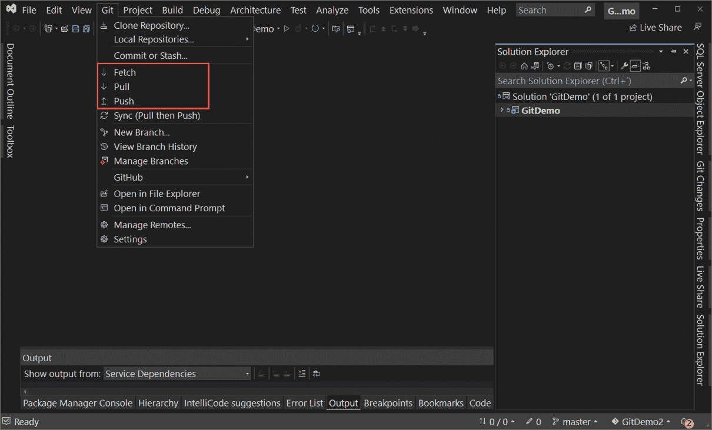

图 11.10 – 从菜单访问获取、拉取和推送操作

+   第二种方法是启用 **Git 变更** 窗口，您可以通过 **视图** | **Git 变更** 菜单打开它，如图 11.11 所示：

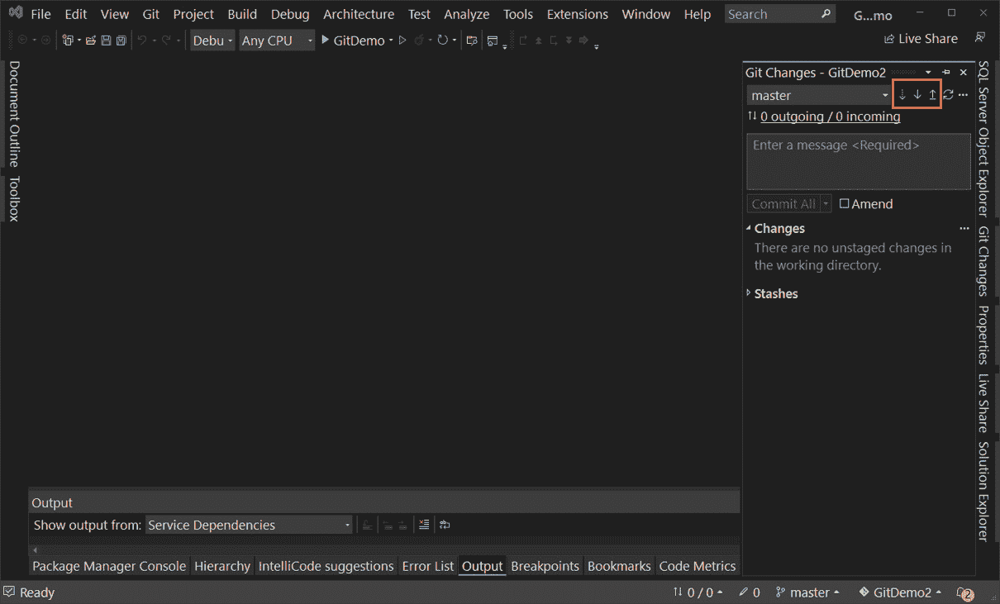

图 11.11 – 从 Git 变更窗口访问获取、拉取和推送操作

在这一点上，你可能想知道这些操作各自的作用。那么，现在让我们简要地解释一下。

## 获取仓库

获取操作允许您检查是否有远程提交应该合并到本地仓库中。

要运行此示例，请转到 GitHub 门户，如果您尚未登录，请登录，并打开我们在 *创建 Git 仓库* 部分创建的名为 `GitDemo` 的仓库。一旦您进入仓库，请转到 `Program.cs` 文件并点击铅笔图标，这将允许您编辑文件，如图所示：

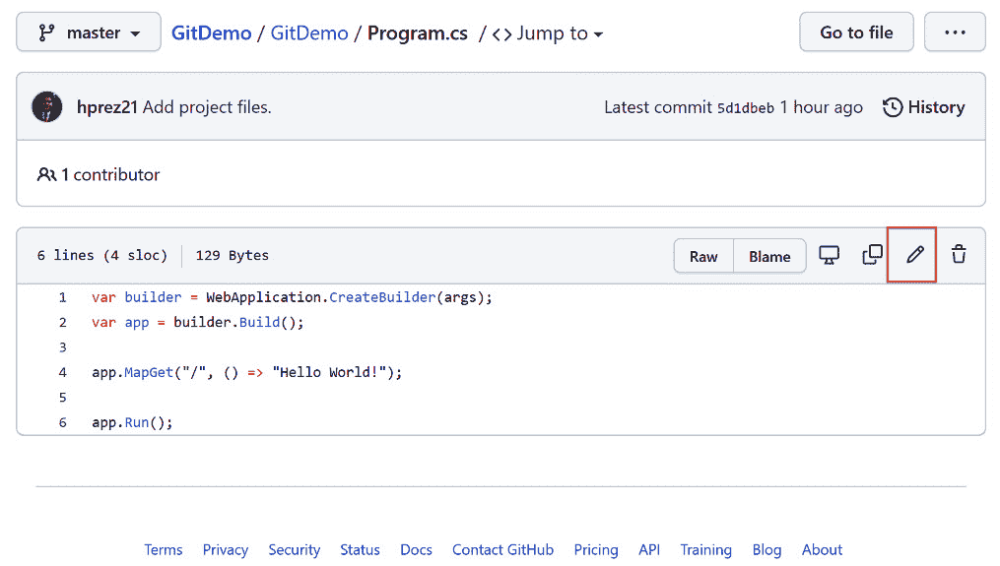

图 11.12 – 编辑仓库文件的按钮

我们将通过在第四行字符串末尾添加一对感叹号来做一个非常简单的更改：

```cs
app.MapGet("/", () => "Hello World!!!");
```

一旦完成此更改，请滚动到页面底部并点击绿色按钮以提交更改：

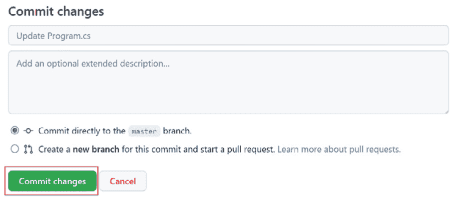

图 11.13 – 在仓库上提交更改的按钮

如果我们现在转到 Visual Studio 并点击 **获取** 按钮，如图 11.14 所示，我们可以看到一个 **0 个外出 / 1 个传入** 的消息，指示仓库中有一个更改尚未应用到本地项目：

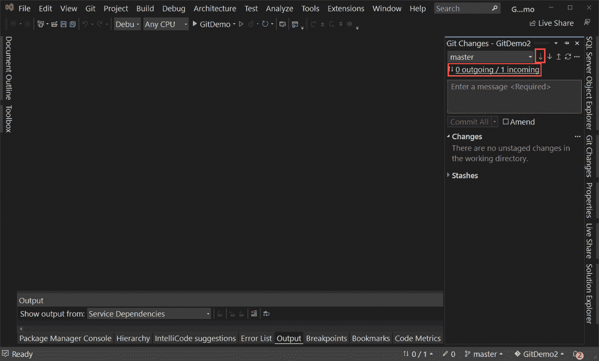

图 11.14 – 从仓库获取的按钮

此外，如果我们点击此消息，将打开一个新窗口，显示项目的版本历史，显示我们尚未应用本地的更改：

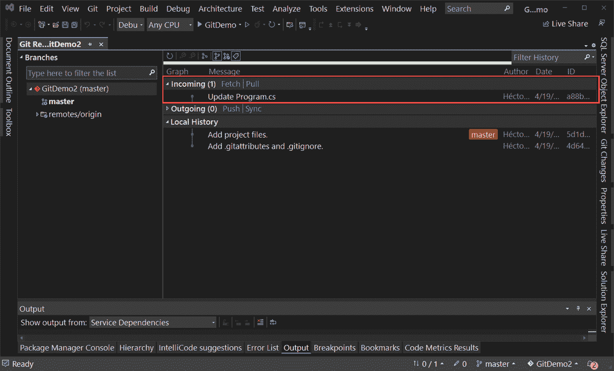

图 11.15 – 显示要应用到本地仓库的挂起更改的窗口

应该注意的是，获取操作不会在本地或远程仓库中做出任何更改，而拉取和推送操作则会。我们将在下一节讨论这些操作。

## 拉取仓库

拉取操作是指从仓库下载最新更改到我们的本地项目。在 *获取仓库* 部分中，我们看到了一个待应用更改。因此，我们将继续点击如图 *图 11.16* 所示的 **拉取** 按钮，以应用它：

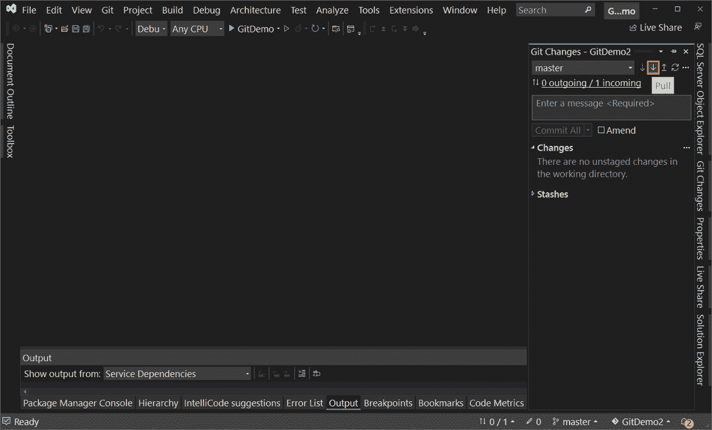

图 11.16 – 拉取更改的按钮

一旦更改已下载，将出现一条消息，指示已应用到当前项目的哪个提交，如图 *图 11.17* 所示：

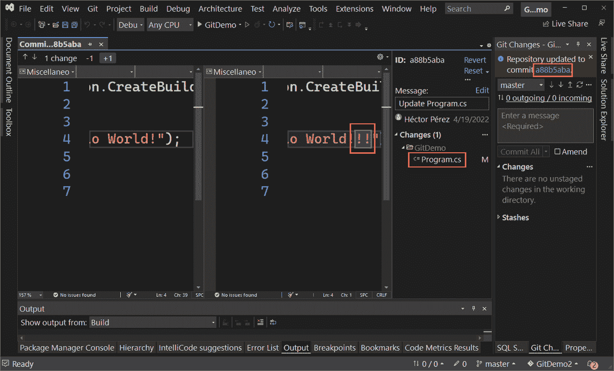

图 11.17 – 显示已应用提交及其更改的窗口

如果我们点击提交的名称，将出现一个窗口，显示已应用到项目的更改，如图 *图 11.17* 所示。

在本节中，尽管我们从主 GitHub 网站对远程仓库进行了更改，但最常见的方法是从 Visual Studio 本身进行。这就是为什么在下一节中，我们将分析如何执行向仓库的推送操作。

## 推送到仓库

推送操作是指将更改上传到仓库。为了演示此操作的工作原理，让我们打开 `Program.cs` 文件并修改第四行，将 `Hello World` 字符串更改为 `Hello Git`：

```cs
app.MapGet("/", () => "Hello Git!!!");
```

立即，你将看到 **解决方案资源管理器** 中的文件图标变为红色勾选标记，表示本地仓库已发生更改，我们可以将其上传到 GitHub 上的仓库：

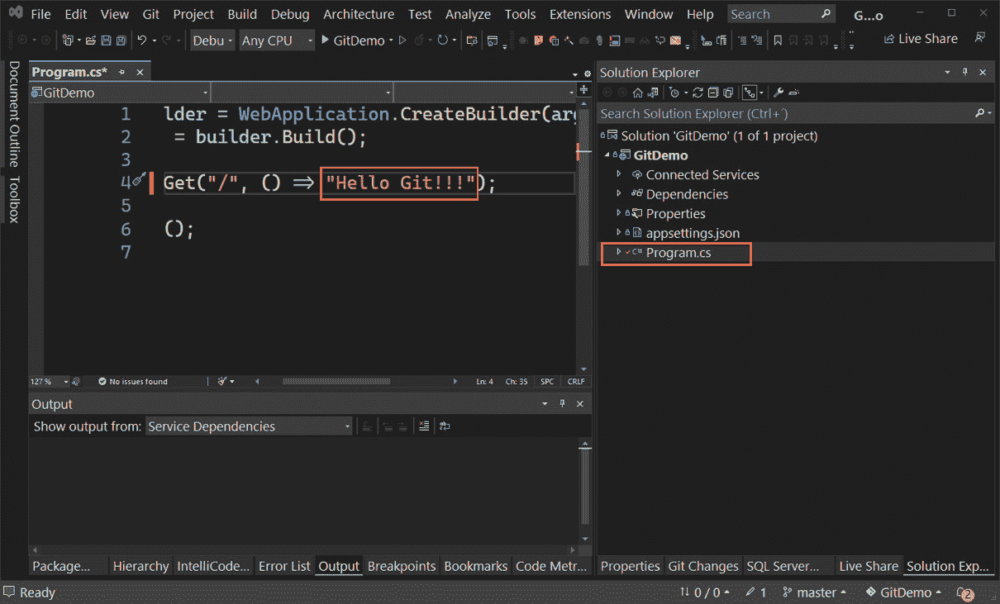

图 11.18 – 表示原始文件已被修改的勾选标记

同样，在 **Git 更改** 窗口中，你会看到可以上传到仓库的更改文件列表，如图 *图 11.19* 所示：

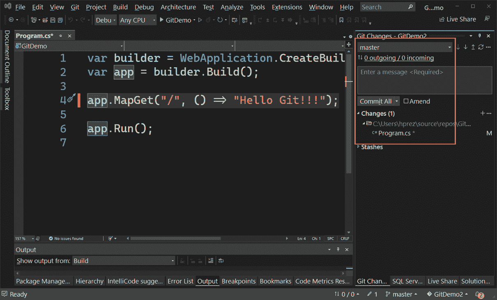

图 11.19 – 可以上传到远程仓库的更改文件列表

在前面的图中，我们还可以看到一个带有 **提交所有** 标识的按钮。此按钮用于在本地创建提交，而不会影响远程仓库。这是一个包含更多我们可以使用的选项的下拉按钮，例如 **提交所有并推送** 选项。此选项将更改推送到远程仓库。

在我们的演示中，我们将添加 **修改后的 Program.cs** 消息，如图 *图 11.20* 所示，并点击 **提交所有并推送** 选项，以在服务器上应用更改：

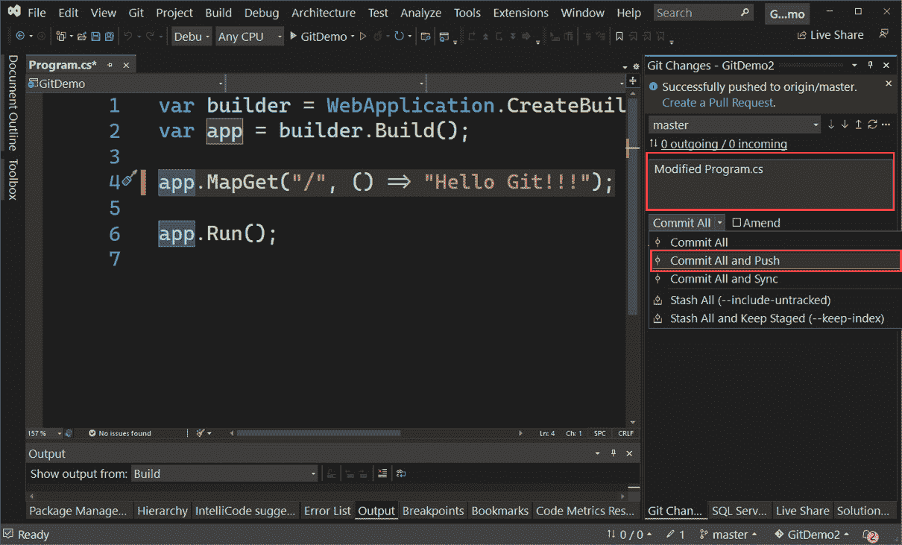

图 11.20 – 添加的消息以及“提交所有”和“推送”选项

如果你访问你 GitHub 账户中的在线仓库，你会看到更改已成功应用。

重要提示

建议在执行推送操作之前，您始终先执行拉取操作，以尽可能避免合并冲突。您可以使用**同步（先拉后推）**按钮依次执行这两个操作。

现在我们已经分析了如何在 GitHub 中执行最常见的操作，让我们看看如何在 Visual Studio 中处理分支。

# 管理分支

到目前为止，我们一直在使用我们项目的**master**主分支进行工作。想象这个分支就像一个时间线，其中每个事件都是由一个提交执行的。当存在冲突并需要回到之前的版本，撤销特定提交的更改时，这非常有用。

然而，如果您在团队中工作，通常您需要在将此功能合并到主分支之前，在某种沙盒中添加该功能。在这种情况下，Git 分支将帮助我们，允许我们从现有的仓库分支创建一个新的项目分支，并在此分支上工作，而不会影响主仓库的功能。

要创建一个新分支，只需转到**Git** | **新建分支**菜单。这将打开一个新窗口，要求输入分支名称、新分支将基于的分支，以及一个标记为**检出分支**的复选框，如果选中，则在创建后将切换到新分支。

对于这个演示，让我们使用`branch01`作为分支名称，它将基于**master**分支，并保持复选框选中，如图 11.21 所示：

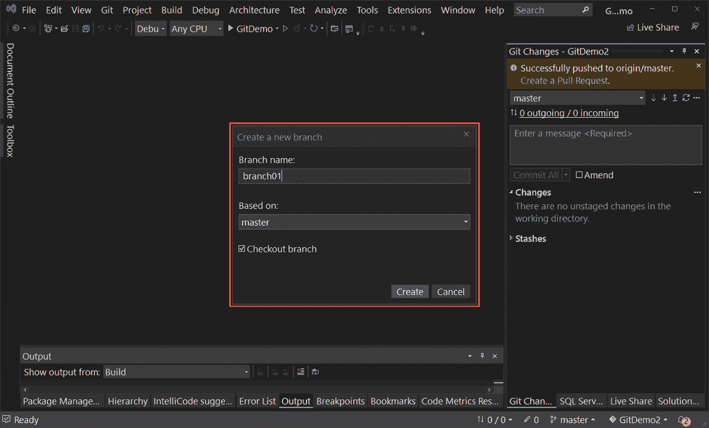

图 11.21 – 创建新分支

一旦创建了新分支，我们就可以应用所需的任何更改。在我们的例子中，我们将打开`Program.cs`文件，再次修改第四行，代码如下：

```cs
app.MapGet("/", () => "Hello Git!!! - branch01");
```

一旦进行了此更改，我们将按照*推送到仓库*部分所示推送代码，确保将更改应用到**branch01**，如图 11.22 所示：

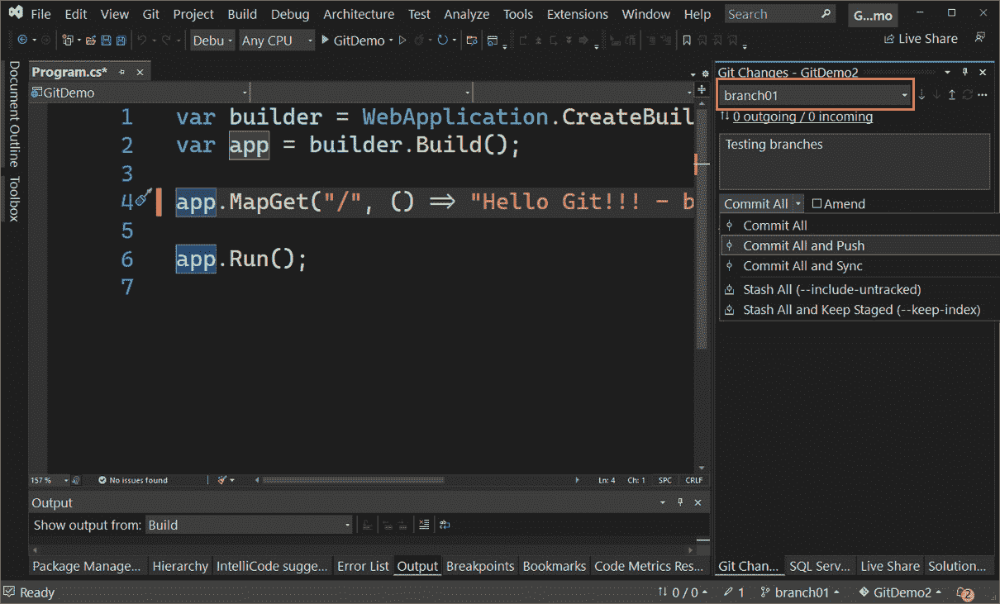

图 11.22 – 将更改推送到新分支

这允许我们在不影响**master**分支操作的情况下，在隔离的远程仓库中添加功能。

一旦您的代码经过测试，您可能希望将其集成回**主**分支。这可以从**视图** | **Git 仓库**窗口完成。在这个窗口中，我们将有一个名为**分支**的部分，其中我们将看到项目中不同分支的列表。只需右键单击**master**分支并选择**检出**选项以切换到主分支，这是我们将在其中添加**branch01**更改的地方。然后，右键单击**branch01**分支并选择**将 'branch01' 合并到 'master'**选项：

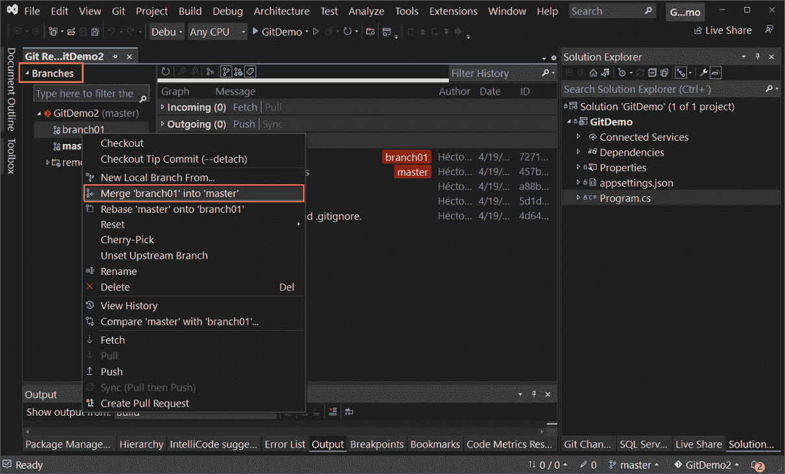

图 11.23 – 合并分支

这将导致 **branch01** 分支与 **master** 分支合并，这意味着新功能将被集成到项目中。

现在我们已经看到了如何创建分支和合并它们，现在是时候看看 Visual Studio 如何在编辑源代码时可视化更改了。

# 查看仓库中的更改

Visual Studio 有几种方式帮助我们可视化仓库中的更改。第一种是通过如图所示的 **Git Repository** 窗口：

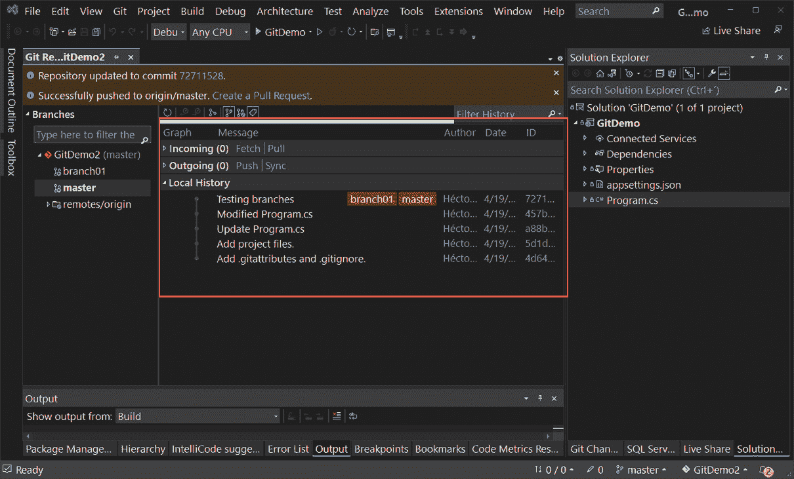

图 11.24 – Git 仓库窗口

此窗口允许我们通过 **Incoming** 可视化本地仓库中是否有未应用版本，通过 **Outgoing** 可视化本地提交但未推送到服务器的提交，以及 **Local History**。

如果我们想可视化不同提交之间的更改，只需在两个或多个提交上右键单击并选择 **比较提交…** 选项：

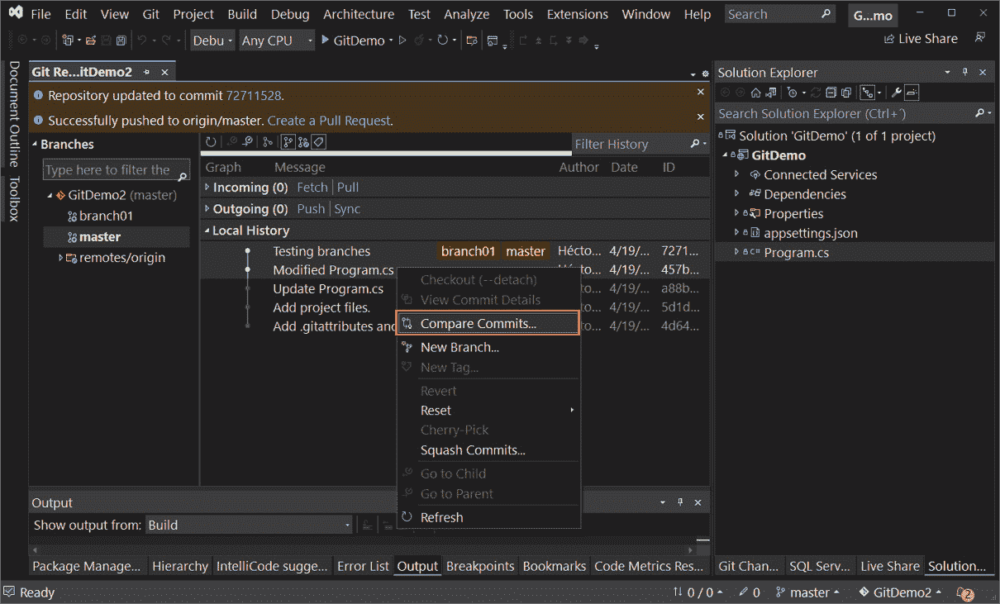

图 11.25 – “比较提交…” 选项

这将显示一个新窗口，显示不同源文件之间发生的变化。

另一种查看单个文件更改的方法是在 **解决方案资源管理器** 中右键单击文件，然后选择 **Git** | **查看历史** 选项，这将仅打开所选文件的更改窗口，如图 11.26 所示：

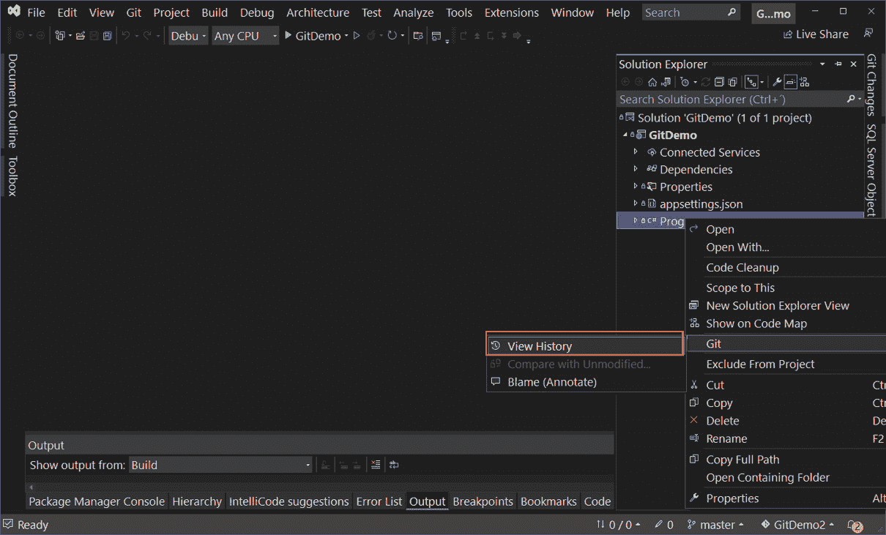

图 11.26 – 查看特定文件更改历史的选项

最后，我们已经在 *第七章* 中讨论了 CodeLens 功能，*使用 AI 和代码视图高效编码*，它还包含查看类成员更改的功能，例如更改历史和谁对成员进行了修改。

# 摘要

在本章中，我们学习了 Visual Studio 如何集成工具，使我们能够轻松使用 Git 和 GitHub 管理项目。

对于所有希望以更受控的方式管理项目，以便对项目结构的前版本有一个概览的开发者来说，了解如何使用基于 Git 的项目是必不可少的。

同样，如果你与其他开发者合作，你将能够共享项目任务，独立测试它们，并在代码可靠时合并它们，以避免损坏已测试的源代码。

正因如此，我们学习了如何在 Visual Studio 中设置 GitHub 账户，如何创建和克隆仓库，如何执行获取、拉取和推送操作，如何管理项目中的分支，以及最后如何可视化仓库中的更改。

在下一章，*第十二章*，*使用 Live Share 共享代码*，你将学习如何利用 Live Share 实时与开发团队在同一项目上协作。
